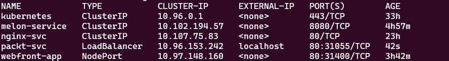
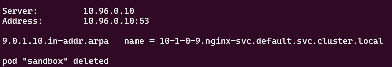

# 第七章：解密 Kubernetes 网络

本章将使用 Kubernetes 网络模型描述一些核心概念，以及如何在集群节点上配置 Kubernetes 网络和网络策略。我们还将学习如何配置 Ingress 控制器和 Ingress 资源，如何配置和利用 CoreDNS，以及如何选择合适的容器网络接口插件。本章内容占 CKA 考试的约 20%。

本章将覆盖以下主题：

+   理解 Kubernetes 网络模型

+   在集群节点上配置 Kubernetes 网络

+   配置网络策略

+   配置 Ingress 控制器和 Ingress 资源

+   配置和利用 CoreDNS

+   选择合适的容器网络接口插件

# 技术要求

首先，我们需要确保您的本地机器满足以下技术要求：

+   一个兼容的 Linux 主机。我们推荐使用基于 Debian 的 Linux 发行版，如 Ubuntu 18.04 或更高版本。

+   确保您的主机至少有 2 GB 的内存，2 个 CPU 核心，并且有约 20 GB 的可用磁盘空间。

# 理解 Kubernetes 网络模型

Kubernetes 旨在促进所需状态管理，以托管容器化工作负载——这些工作负载利用了可共享的计算资源。Kubernetes 网络解决了如何允许不同的 Kubernetes 组件相互通信以及 Kubernetes 上的应用程序如何与其他应用程序通信的问题，还包括 Kubernetes 集群外部的服务。

因此，官方文档将这些网络挑战总结为容器间、Pod 间、Pod 与服务、外部与服务、以及节点间通信。现在，我们将在本节中逐一讲解这些内容。

## 容器间通信

容器间通信主要指的是 Pod 内容器之间的通信——多容器 Pod 是一个很好的例子。多容器 Pod 是一个包含多个容器的 Pod，并视为一个单一单元。在 Pod 内部，每个容器共享网络，包括 IP 地址和网络端口，使得这些容器可以通过 `localhost` 或标准的 **进程间通信** (**IPC**) 方式，如 SystemV 信号量或 POSIX 共享内存，彼此通信。即使这些端口没有暴露到 Pod 外部，Pod 内的其他容器仍然可以访问所有监听端口。

下图展示了这些容器如何在同一个 Pod 内部共享本地网络：


图 7.1 – 多个容器共享 Pod 网络

以下是一个名为`multi-container-pod.yaml`的示例，展示了如何在一个 Pod 中创建多个容器。在这个 Pod 中，包含了`nginx`和`busybox`两个容器，其中`busybox`是一个 sidecar 容器，通过`localhost:`上的端口`80`调用`nginx`。

```
apiVersion: v1
kind: Pod
metadata:
  name: multi-container-pod
  labels:
      app: multi-container
spec:
  containers:
  - name: nginx
    image: nginx:latest
    ports:
    - containerPort: 80
  - name: busybox-sidecar
    image: busybox:latest
    command: ['sh', '-c', 'while true; do sleep 3600; done;']
```

让我们通过使用`kubectl apply -f multi-container-pod.yaml`命令部署此`yaml`文件，以下内容显示 Pod 已创建：

```
pod/multi-container-pod created
```

我们可以使用以下命令检查是否能从 sidecar 容器`busybox`与`nginx`容器通信：

```
kubectl exec multi-container-pod -c busybox-sidecar -- wget http://localhost:80
```

以下输出证明两个容器可以互相通信：


图 7.2 – 从`busybox` sidecar 容器连接到`nginx`容器

重要提示

创建单容器 Pod 的快速方式是使用以下命令：

`kubectl run nginx --image=nginx:latest --port=80`

然后，您可以使用`kubectl get pods –o yaml`命令导出 YAML 内容，并编辑`yaml`文件以添加另一个容器。

为了再次确认我们是否从`busybox` sidecar 容器获取了`nginx`主页，我们将使用以下命令：

```
kubectl exec multi-container-pod -c busybox-sidecar -- cat index.xhtml
```

输出应与*图 7.3*中显示的类似：


图 7.3 – 检查在`busybox`容器中下载的 HTML 页面

要了解更多关于多容器 Pod 的信息，查看这些容器如何共享存储和网络，请参考*第四章*，*应用调度与生命周期管理*。

## Pod 与 Pod 之间的通信

在 Kubernetes 中，每个 Pod 都被分配了基于该工作节点`podCIDR`范围的唯一 IP 地址。尽管这种 IP 分配不是永久性的，因为 Pod 最终会失败或重启，新 Pod 将分配一个新的 IP 地址。默认情况下，Pods 可以通过 Pod 网络与所有节点上的所有 Pods 通信，而无需设置**网络地址转换**（**NAT**）。这也是我们设置主机网络的地方。所有 Pods 可以相互通信，而无需 NAT。

让我们通过使用以下命令部署一个`nginx` Pod：

```
kubectl run nginx --image=nginx –-port=8080
```

以下输出显示 Pod 已创建：

```
pod/nginx created
```

要验证 Pod 是否已分配 IP 地址，您可以使用`kubectl get pod nginx -o wide`命令检查`nginx` Pod 的 IP 地址。输出类似于以下内容：

```
  NAME    READY   STATUS             RESTARTS   AGE   IP           
NODE       NOMINATED NODE   READINESS GATES
nginx   1/1     running   0          34s   172.17.0.4   
minikube   <none>           <none>
```

您可以使用以下命令检查默认命名空间中所有可用 Pod 及其分配的 IP 地址：

```
k get pods -o wide
```

注意以下输出中的`IP`列，它指示了`multi-container-pod` Pod 的 IP 地址为`172.17.0.3`，`nginx` Pod 的 IP 地址为`172.17.0.4`。这些分配给 Pod 的 IP 地址位于相同的`podCIDR`范围内：


图 7.4 – 检查 Pod 的 IP 地址

前面的截图还显示了两个 pod 在同一节点 `minikube` 上，根据 `NODE` 列可以看到这一点。我们可以使用以下命令查看分配给 pod 的 `podCIDR`：

```
kubectl get node minikube -o json | jq .spec.podCIDR
```

输出结果如下所示，显示了 `podCIDR`：

```
10.244.0.0/24
```

从前面的命令输出中，我们可以看到它的 CIDR 与 pod 的 CIDR 不同。这是因为我们在 `minikube` 集群上进行了测试。当我们使用 `minikube start` 命令启动一个默认的 `minikube` 安装时，未指定 CNI 网络插件的其他参数，它会将默认值设置为 `auto`。它选择了 `kindnet` 插件来使用，该插件创建了一个桥接，并将主机和容器添加到桥接中。稍后在本章中，我们将学习如何设置 CNI 插件和网络策略。想了解更多关于 `kindnet` 的信息，可以访问以下链接：[`github.com/aojea/kindnet`](https://github.com/aojea/kindnet)。

Kubernetes 组件，如系统守护进程和 `kubelet`，可以与同一节点上的所有 pod 进行通信。理解 pod 之间的连接性是 CKA 考试的要求。如果你想了解更多关于集群网络的信息，可以查看官方文档：[`kubernetes.io/docs/concepts/cluster-administration/networking/#the-kubernetes-network-model`](https://kubernetes.io/docs/concepts/cluster-administration/networking/#the-kubernetes-network-model)。

## Pod 到服务和外部到服务的通信

有效的 pod 和服务之间的通信意味着让服务暴露在一组 pod 上运行的应用程序。该服务接受来自集群内部和外部的流量。该组 pod 可以在它们之间进行负载均衡 —— 每个 pod 都分配了自己的 IP 地址和一个 DNS。

与 pod 到服务通信类似，外部到服务的通信挑战也由服务来解决。`NodePort` 或 `LoadBalancer` 等服务类型可以接收来自 Kubernetes 集群外部的流量。

现在让我们来看一下不同的 *服务类型* 和 *端点*。

### Kubernetes 服务类型概述

在 Kubernetes 网络空间中，有几种发布服务类型非常重要。这与无头服务不同。如果你想了解有关无头服务的内容，可以访问这个链接（这不在 CKA 考试的范围内）：[`kubernetes.io/docs/concepts/services-networking/service/#headless-services`](https://kubernetes.io/docs/concepts/services-networking/service/#headless-services)。

以下是 CKA 考试中最常见的几种发布服务类型：

| **服务类型** | **描述** | **示例** |
| --- | --- | --- |
| `ClusterIP` | Kubernetes 的默认服务类型。对于内部通信，暴露该服务使其在集群内可访问。 | 使用 `kubectl get pod mypod -o wide` 查看 pod 地址 - 内部 IP 是 `172.17.0.4` |
| `NodePort` | 用于内部和外部通信。`NodePort` 在每个工作节点上暴露服务的静态端口——与此同时，会为其创建 `ClusterIP`，并用于内部通信，要求访问节点的 IP 地址和开放端口——例如，`<nodeIP>:<port>` 用于外部通信。 | 连接到具有公共 IP 地址 `192.0.2.0` 的工作节点虚拟机，端口为 `80` |
| `LoadBalancer` | 适用于云提供商，因为它由各自的负载均衡器提供支持。在 `LoadBalancer` 下，创建了 `ClusterIP` 和 `NodePort`，分别用于内部和外部通信。 | 查看来自云提供商的 Kubernetes 分发版的服务，如 `kubectl get service mysvc -n mynamespace` – 内部 IP 地址为 `172.17.0.4` |
| `ExternalName` | 使用 CNAME 记录将服务映射到其内容，并允许外部流量通过该记录访问。 | 例如，`my.packt.example.com` |

要了解有关发布服务和无头服务之间的差异，请查看此链接：https://kubernetes.io/docs/concepts/services-networking/service/#publishing-services-service-types。现在，让我们来看看这一节中的每个服务。

### ClusterIP

`ClusterIP` 是 Kubernetes 的默认服务类型，用于内部通信。在 pod 或 `ClusterIP` 的情况下，pod 只在 Kubernetes 集群内可达。然而，仍然可以通过 `kube-proxy` 允许外部流量访问 `ClusterIP`，它会创建 `iptables` 条目。这在一些使用场景中非常有用，比如展示 Kubernetes 仪表板。*图 7.5* 描述了网络流量如何负载均衡（轮询）并路由到 pod。然后，它会通过 `ClusterIP` 或其他服务到达 pod：


图 7.5 – ClusterIP 和 kube-proxy

通过前面的图示，我们首次了解了服务如何与 pod 一起工作。接下来，让我们部署一个应用程序并深入研究。要创建一个名为 `nginx` 的部署，并将 `replicas` 数量设置为 `2`，请使用以下命令：

```
kubectl create deployment nginx --image=nginx --replicas=2
```

我们可以通过以下命令追踪部署过程：

```
kubectl get deploy nginx -o wide
```

一旦我们完成，我们应该能够看到以下输出：


图 7.6 – 可用的 nginx 副本数量

从前面的输出中，我们可以看到有两个 `nginx` pod 正在运行，以便更好地理解这些 pod。我们可以看到这些 `nginx` pod 在默认命名空间中的展示情况。

请注意，为了简便起见，我们在`default`命名空间中进行测试。你可以添加`-n`标志，以便在其他命名空间中处理部署和 pods。请参阅*第四章*，*应用调度与生命周期管理*，了解 Kubernetes 中应用部署的工作原理。接下来，尝试执行以下命令：

```
kubectl get pods
```

输出将返回`default`命名空间中所有可用的 pods：


图 7.7 – 默认命名空间中的可用 nginx pods

现在，我们将这些 pods 暴露到 Kubernetes 集群中。我们使用以下命令创建一个名为`melon-service`的服务：

```
 kubectl expose deployment nginx --type=ClusterIP --port 8080 --name=melon-service --target-port 80
```

从前面的命令中，我们可以看到我们已经创建了一个`ClusterIP`类型的服务。我们可以指定以下标志：

+   `type`是服务的类型——在我们的例子中，它是`ClusterIP`。我们将在本章接下来的部分中了解`NodePort`和`LoadBalancer`。

+   `port`是服务提供的端口。

+   `target-port`是容器上将流量重定向到的端口。

重要说明

理解这些命令标志将帮助你更顺畅地使用它们；我建议你记住这个命令，以便在实际的 CKA 考试中能够快速回忆起来。你也可以参考以下链接（[`kubernetes.io/docs/reference/generated/kubectl/kubectl-commands#expose`](https://kubernetes.io/docs/reference/generated/kubectl/kubectl-commands#expose)）来了解其他标志是否能帮助你。

前一个命令的输出应该类似于以下内容：

```
service/melon-service exposed
```

基于这个输出，前面的命令成功执行。现在，让我们进入默认命名空间，使用`kubectl get svc`命令查看所有可用的服务——这将给出以下输出：


图 7.8 – 默认命名空间中的可用 nginx pods

前面的输出显示，已创建了`ClusterIP`类型的服务，IP 地址为`10.102.194.57`，该服务在`8080`端口上提供服务。

我们在本节中所做的通过使用`kubectl expose`命令创建一个新的`ClusterIP`服务，也可以通过以下的 YAML 清单文件完成：

```
 apiVersion: v1
 kind: Service
 metadata:
   name: melon-service
 spec:
   type: ClusterIP
selector: 
     app: nginx
  ports:
  - protocol: TCP
    port: 8080
    targetPort: 80
```

从前面的 YAML 定义中，我们可以看到有一个叫做`selector`的部分。这个部分有一个键值对`app:nginx`，它是一个标签选择器。通常，我们使用选择器将服务与 pods 关联起来。如果我们没有使用`kubectl`命令，这里是`nginx`部署的 YAML 定义：

```
apiVersion: apps/v1
kind: Deployment
metadata:
  name: nginx
spec:
  selector:
    matchLabels:
      app: nginx
  replicas: 2
  template:
    metadata:
      labels:
        app: nginx
    spec:
      containers:
      - name: nginx
        image: nginx
        ports:
        - containerPort: 80
```

从前面的 YAML 定义中，我们可以看到有一个部分用于指定选择器，我们使用相同的键值对 `app: nginx` 来映射 `ClusterIP` 规范，以便它按预期工作。参考*第四章**，应用调度与生命周期管理，*了解更多关于标签选择器的信息。

重要提示

如我们之前提到的，CKA 考试强调时间管理，因此使用命令来实现目标会更加高效。

一个相应的 endpoints 对象可以在不使用选择器的情况下实现我们所讨论的内容。你可以使用以下命令来获取 `melon-service` 的 endpoints：

```
k get ep melon-service
```

以下是前面命令的输出：


图 7.9 – 显示默认命名空间中 nginx pods 的 endpoints

如你所见，在这里我们定义的 YAML 文件中并没有什么特别的内容。我们可以通过使用以下命令导出其 YAML 定义来对比服务定义：

```
kubectl get svc  melon-service -o yaml
```

我们将能够看到导出的输出，如下所示：


图 7.10 – 默认命名空间中 nginx 服务的定义

将导出的定义与我们在本节中使用 `kubectl` 和 YAML 定义所讲解的内容进行比较，将有助于你更好地理解 Kubernetes 中的服务。现在，让我们来看看 Kubernetes 中另一个重要的服务——`NodePort`。

### NodePort

`NodePort` 在 Kubernetes 节点上打开端口，这些节点通常是虚拟机。`NodePort` 通过节点的 IP 暴露访问，并通过打开的端口使应用程序可以从 Kubernetes 集群外部访问。网络流量从端口转发到服务。`kube-proxy` 在每个节点上分配一个 `30000` 到 `32767` 范围内的端口——其工作方式如图所示：


图 7.11 – Kubernetes 中的 NodePort

通过前面的图示，我们更深入地了解了 `NodePort` 如何与 pods 一起工作。接下来，我们使用以下命令创建一个名为 `webfront-app`、`replicas` 数量为 `2` 的部署：

```
kubectl create deployment webfront-app --image=nginx --replicas=2
```

如果创建成功，你将看到以下输出：

```
deployment.apps/webfront-app created
```

然后，我们可以使用以下命令通过 `NodePort` 暴露一个 Web 前端：

```
kubectl expose deployment webfront-app --port=8080 --target-port=80 --type=NodePort
```

以下输出显示我们已成功暴露 `webfront-app`：

```
service/webfront-app exposed
```

请注意，如果你没有提供目标端口，则假定它与容器端口相同。还要注意，如果没有提供节点端口，系统会自动分配一个在 `30000` 到 `32767` 范围内的空闲端口。

现在，让我们检查一下我们刚刚创建的所有服务。由于我们在之前的命令中没有指定名称，服务名称假定与应用程序名称相同：

```
kubectl get svc webfront-app -o wide
```

输出应如下所示：


图 7.12 – 默认命名空间中的 webfront-app NodePort

从前面的输出中，我们可以看到端口暴露在`31400`，这个端口位于节点的`30000`到`32767`范围内，目标端口是`80`，它在容器级别已开启。因此，使用以下命令获取节点 IP：

```
kubectl get node -o wide
```

输出的关键部分如下：


图 7.13 – webfront-app NodePort 的内部 IP

从前面的输出中，我们获取的是节点的内部 IP，由于我们在本地进行测试，所以可以将内部 IP 和端口结合使用来连接到`webfront-app`：

```
192.168.65.4:31400
```

使用以下命令，我们来部署一个名为`sandbox-nginx`的新`nginx` pod，测试连接性：

```
kubectl run -it sandbox --image=nginx --rm --restart=Never -- curl -Is http://192.168.65.4:31400
```

输出类似于以下内容：


图 7.14 – webfront-app NodePort 的内部 IP

在实际的 CKA 考试中，你将会在几个不同的虚拟机上进行操作。如果你需要连接到该节点上部署的应用程序，可以使用以下命令获取所有节点的外部 IP：

```
 kubectl get nodes -o jsonpath='{.items[*].status.addresses[?( @.type=="ExternalIP")].address}'
```

同样地，如果你想获取所有节点的内部 IP，可以使用以下命令：

```
 kubectl get nodes -o jsonpath='{.items[*].status.addresses[?( @.type==" InternalIP ")].address}'
```

在实际考试中，你还可以使用内部 IP 连接到该节点，然后使用以下命令，它会给你相同的结果：

```
curl -Is http://192.168.65.4:31400
```

如果你有一个可以从本地环境 ping 通的节点虚拟机的公共 IP 地址，你可以使用以下命令：

```
curl -Is http://<node external IP>:<node port>
```

提示与技巧

如果你需要帮助，可以参考 Kubernetes 备忘单上的一些重要的 `JSONPath` 命令：[`kubernetes.io/docs/reference/kubectl/cheatsheet/#viewing-finding-resources`](https://kubernetes.io/docs/reference/kubectl/cheatsheet/#viewing-finding-resources)。

我们在本节中通过使用 `kubectl expose` 命令创建新 `NodePort` 服务的操作，也可以使用以下 YAML 清单文件来完成：

```
apiVersion: v1
kind: Service
metadata:
  name: webfront-app
  labels:
    app: webfront-app
spec:
  ports:
  - port: 8080
    targetPort: 80
  selector:
    app: webfrontapp
  type: NodePort
```

公有云服务提供商通常支持外部负载均衡器，在使用 Kubernetes 时，我们可以将其定义为 `LoadBalancer`。现在，让我们在以下部分了解一下它。

### LoadBalancer

`LoadBalancer` 是一种将服务从集群外部连接的标准方式。在这种情况下，网络负载均衡器将所有外部流量重定向到一个服务，如下图所示，每个服务都有自己的 IP 地址。它允许服务在应用程序之间进行网络流量负载均衡：


图 7.15 – Kubernetes 中的 LoadBalancer

`LoadBalancer`不是 CKA 考试中的热门话题，因为它仅在云环境或其他支持外部负载均衡器的环境中工作。将`LoadBalancer`服务部署以获取公共 IP 通常用于像 AKS 这样的托管 Kubernetes 发行版 – 以下是相关的 YAML 示例定义：

```
apiVersion: v1
kind: Service
metadata:
  name: packt-svc
spec:
  type: LoadBalancer
  ports:
  - port: 80
    targetPort: 8080
  selector:
    app: my-packt-app
```

我们也可以使用`kubectl expose`命令来执行此操作：

```
kubectl expose deployment nginx --port=80 --target-port=8080 \
        --name=packt-svc --type=LoadBalancer
```

前面命令的输出如下所示：



图 7.16 – Kubernetes 中的 LoadBalancer 输出

由于我在 WSL2 上的 Docker Desktop 中测试 LoadBalancer 时，它不受支持 – 前面的输出显示`EXTERNAL-IP`为`localhost`。然而，当我在 AKS 上工作时，它显示了真实的公共 IP 地址。请参考此链接查看对我有用的内容：[`docs.microsoft.com/en-us/azure/aks/load-balancer-standard`](https://docs.microsoft.com/en-us/azure/aks/load-balancer-standard)。

### ExternalName

`ExternalName`将服务映射到其值的 CNAME 记录的内容。它允许外部流量访问该服务。以下是`ExternalName`的示例 YAML 定义：

```
apiVersion: v1
kind: Service
metadata:
  name: my-packt-svc
  namespace: prod
spec:
  type: ExternalName
  externalName: my.melonapp.packt.com
```

请注意，前面的`ExternalName`类型定义为`my.melonapp.packt.com` – 我们可以使用`nslookup`命令来检查`my-packt-svc.default,svc.cluster.local`。这将返回`my.melonapp.packt.com`的 CNAME 记录。我们将在本章稍后深入探讨 Kubernetes 中的 DNS 是如何工作的。

### 检查服务和端点

在本节中，我们已介绍了 Kubernetes 中的四种常见服务类型。如果我们需要快速检查所有命名空间中的所有服务，可以使用以下命令：

```
kubectl get services --all-namespaces
```

或者，我们可以使用以下命令：

```
kubectl get svcs -A
```

以下显示了前一个命令的输出：


图 7.17 – 获取跨不同命名空间的所有服务

前面的截图列出了跨命名空间的服务，以及它们的`ClusterIP`和端口信息。如果你想查看特定的服务，可以使用以下命令：

```
kubectl get svc <service-name> -n <namespace>
```

前面命令的示例是`kubectl get svc kube-dns -n kube-system`，它会返回服务信息。你还可以通过使用`kubectl describe svc`命令进一步查看详细信息：

```
kubectl describe svc kube-dns -n kube-system
```

前面命令的输出如下所示：


图 7.18 – 检查服务详细信息

对于端点，我们可以使用以下命令来检查服务的端点：

```
kubectl get endpoints melon-service
```

它也可以如下所示：

```
NAME            ENDPOINTS                   AGE
melon-service   10.1.0.32:80,10.1.0.33:80   5h7m
```

如果我们想查看不同命名空间中的所有端点，可以使用以下命令：

```
kubectl get ep --all-namespaces
```

前面命令的输出将列出跨不同命名空间的所有端点：


图 7.19 – 获取跨不同命名空间的所有端点

同样的原理也适用于按命名空间列出所有端点。当你想查看特定服务时，可以使用以下命令：

```
kubectl get ep <service-name> -n <namespace>
```

我们已经讨论了如何在 Kubernetes 中处理服务和端点，涉及了 pod 到服务的通信。现在，让我们进入下一节，讨论节点间的通信。

## 节点间通信

在一个集群内，每个节点都会通过`kubelet`代理注册到主节点，并且每个节点会被分配一个节点 IP 地址，以便它们之间能够进行通信。

要验证这一点，可以使用`kubectl get node -o wide`命令查看每个节点的内部 IP。输出结果类似于以下内容，在其中你会注意到工作节点的`internal-IP`：


图 7.20 – 查看节点 IP 及更多信息

从上面的截图中，我们可以看到当前节点的内部 IP 地址是`192.168.49.2`。如果我们有多个节点，我们可以在同一网络内从一个节点 ping 其他节点。我们需要确保主节点与工作节点之间的连通性，以便工作负载能够被调度到工作节点。因此，理解如何为 Kubernetes 节点配置托管网络非常重要。接下来，我们来看一下容器网络接口插件。

# 选择合适的容器网络接口插件

在*第二章*《*安装与配置 Kubernetes 集群*》中，我们讨论了如何使用 Calico 插件作为 Kubernetes 集群的覆盖网络。我们可以启用**容器网络接口**（**CNI**）以实现 pod 到 pod 的通信。CNI 插件符合 CNI 规范。一旦 CNI 在 Kubernetes 集群中配置完成，它将为每个 pod 分配 IP 地址。

## Kubernetes 中的 CNI 网络

当前市场上有多种网络插件可与 Kubernetes 配合使用，包括 Calico、Flannel、Weave Net 等流行的开源框架。更多选项，请查看官方文档：[`kubernetes.io/docs/concepts/cluster-administration/addons/`](https://kubernetes.io/docs/concepts/cluster-administration/addons/)。

以 Flannel 为例，Flannel 专注于为 Kubernetes 配置一个三级网络架构，主要用于在不同容器之间路由数据包。Flannel 在每个主机上运行一个名为`flanneld`的单一二进制代理，负责为每个主机分配一个预配置的子网地址空间，如下所示：


图 7.21 – Kubernetes 中的 CNI 网络

上面的图演示了 Flannel CNI 网络如何工作。社区中有许多选项——让我们来看看选择 CNI 插件的决策指标。

## 决策指标

为了选择适合您需求的合适 CNI 插件，您可以参考下表，了解每个 CNI 提供商的不同功能：

|  | **提供商网络** | **封装与路由** | **网络策略支持** | **数据存储** | **加密** | **Ingress / Egress** |
| --- | --- | --- | --- | --- | --- | --- |
| `Flannel` | 第三层 | VxLAN | 否 | ETCD | 是 | 否 |
| `Calico` | 第三层 | BGP, eBPF | 是 | ETCD | 是 | 是 |
| `Weavenet` | 第二层 | VxLAN | 是 | 否 | 是 | 是 |
| `Canal` | 第二层 | VxLAN | 是 | ETCD | 否 | 是 |

对于快速测试，Flannel 的设置非常简单。Calico 和 Weave Net 是更适合企业级客户的选择，因为它们具有广泛的功能。在实际应用中，可能会在一个环境中使用多个 CNI 解决方案来满足一些复杂的网络需求。不过，这超出了 CKA 认证考试的范畴。

现在让我们看看下一部分的 Ingress 控制器。

# 配置 Ingress 控制器和 Ingress 资源

Kubernetes 网络管理面临的挑战之一是管理内部流量，也就是所谓的东西向流量，以及外部流量，也就是北南向流量。

有几种不同的方式将外部流量引入 Kubernetes 集群。当涉及到第七层网络时，Ingress 会在第七层路由上暴露 HTTP 和 HTTPS，将集群外部的流量路由到集群内的服务。

## Ingress 和 Ingress 控制器的工作原理

Ingress 充当路由器，通过 Ingress 管理的负载均衡器将流量路由到服务，然后该服务将流量分发到不同的 Pod。从这个角度来看，同一个 IP 地址可以用于暴露多个服务。然而，随着应用程序的复杂性增加，特别是当我们需要将流量重定向到其子域名甚至是通配符域时，Ingress 就能解决这些挑战。

Ingress 与 Ingress 控制器一起评估定义的流量规则，然后确定流量如何路由。该过程如*图 7.22*所示：


图 7.22 – Kubernetes 中的 Ingress 资源

除了我们在*图 7.22*中看到的内容，Ingress 还提供了一些关键功能，如负载均衡、SSL 终止和基于名称的虚拟主机。

我们需要在 Kubernetes 集群中部署一个 Ingress 控制器，然后创建 Ingress 资源。在本节中，我们以 `ingress-nginx` 为例。如今市场上有许多 Ingress 控制器可供选择。请查看这里的官方文档以获取更多细节：[`kubernetes.io/docs/concepts/services-networking/ingress-controllers/`](https://kubernetes.io/docs/concepts/services-networking/ingress-controllers/)。

## 使用多个 Ingress 控制器

注意，也可以通过在 Kubernetes 集群中使用 Ingress 类来部署多个 Ingress 控制器。请参考这篇文章了解更多细节：[`kubernetes.io/docs/concepts/services-networking/ingress-controllers/#using-multiple-ingress-controllers`](https://kubernetes.io/docs/concepts/services-networking/ingress-controllers/#using-multiple-ingress-controllers)。

## 与 Ingress 资源配合使用

如前所述，`nginx` Ingress 控制器是当今市场上最受欢迎的控制器之一，因此我们在本节中将其作为主要示例。我们需要在 Kubernetes 集群中部署一个 Ingress 控制器，并创建 Ingress 资源。

在这里，我们定义了一个最小的 `nginx` 资源，使用以下 YAML 定义：

```
apiVersion: networking.k8s.io/v1
kind: Ingress
metadata:
  name: minimal-ingress
  annotations:
    nginx.ingress.kubernetes.io/rewrite-target: /
spec:
  ingressClassName: packt-nginx
  rules:
  - http:
      paths:
      - path: /packs
        pathType: Prefix
        backend:
          service:
            name: test
            port:
              number: 80
```

从前面的 YAML 定义中，我们知道 `apiVersion`、`kind`、`metadata` 和 `spec` 字段是必填的。接下来，我们还需要一个 Ingress 对象，其中包含有效的 DNS 子域名。

默认的 `IngressClass` 如下所示：

```
apiVersion: networking.k8s.io/v1
kind: IngressClass
metadata:
  labels:
    app.kubernetes.io/component: controller
  name: nginx-example
  annotations:
    ingressclass.kubernetes.io/is-default-class: "true"
spec:
  controller: k8s.io/ingress-nginx
```

要了解如何使用 Ingress，查看官方文档：[`kubernetes.io/docs/concepts/services-networking/ingress/`](https://kubernetes.io/docs/concepts/services-networking/ingress/)。

## Ingress 注解和 rewrite-target

你可以为特定的 Ingress 对象添加 Kubernetes 注解，以便自定义它们的行为。这些注解的键和值只能是字符串。以下是如何以 `nginx` 为例，向 Ingress 资源添加注解的示例：

```
apiVersion: networking.k8s.io/v1
kind: Ingress
metadata:
  annotations:
    nginx.ingress.kubernetes.io/rewrite-target: /
  name: packt-ingress
spec:
  ingressClassName: nginx
  rules:
  - host: book.packt.com
    http:
      paths:
      - path: /packt-book
        pathType: Prefix
        backend:
          service:
            name: packt-svc
            port:
              number: 80
```

`nginx` 有许多可用的注解——你可以通过访问以下页面来查看它们：[`kubernetes.github.io/ingress-nginx/user-guide/nginx-configuration/annotations/`](https://kubernetes.github.io/ingress-nginx/user-guide/nginx-configuration/annotations/)。

不同的 Ingress 控制器提供不同的功能，通常使用注解和 `rewrite-target` 来重写默认行为。你可以在这里查看如何为 `nginx` Ingress 控制器重写行为：[`kubernetes.github.io/ingress-nginx/examples/rewrite/#rewrite-target`](https://kubernetes.github.io/ingress-nginx/examples/rewrite/#rewrite-target)。

我们在本节中提到了域名和子域名。现在，是时候谈谈 Kubernetes 中 DNS 域名主机名的工作原理了。让我们在下一节中详细讨论：

# 配置和利用 CoreDNS

如本章前面提到的，节点、Pod 和服务在 Kubernetes 集群中会分配自己的 IP 地址。Kubernetes 运行一个 **域名系统**（**DNS**）服务器实现，通过 DNS 记录将服务名称映射到其 IP 地址。因此，你可以使用一致的 DNS 名称访问服务，而无需使用其 IP 地址。在微服务架构中，这非常有用。当前 Kubernetes 集群中运行的所有微服务可以通过引用服务名称相互通信。

DNS 服务器主要支持以下三种类型的 DNS 记录，这些也是最常见的记录类型：

+   **A** 或 **AAAA 记录**用于正向查找，将 DNS 名称映射到 IP 地址。A 记录将 DNS 名称映射到 IPv4 地址，而 AAAA 记录则允许将 DNS 名称映射到 IPv6 地址。

+   **SRV 记录**用于端口查找，以便在服务和主机名之间建立连接。

+   `172.0\. 0.10` 将存储在 `10.0\. 0.172.in-addr.arpa` DNS 区域下。

了解这些基本的 DNS 概念将帮助我们更好地理解 Kubernetes 中的 DNS。

在 Kubernetes 1.21 中，`kubeadm` 移除了对 `kube-dns` 的支持，以进行 DNS 复制。CoreDNS 现在成为默认的 DNS 服务。CoreDNS 是一个可扩展的 DNS 服务器，可以作为 Kubernetes 集群的 DNS。它是过去 Kubernetes 使用的 `kubeadm`，可以从这里查看：[`github.com/coredns/deployment/blob/master/kubernetes/CoreDNS-k8s_version.md`](https://github.com/coredns/deployment/blob/master/kubernetes/CoreDNS-k8s_version.md)。

如果你的 Kubernetes 集群还没有使用 CoreDNS，这里有一个官方的端到端指南，帮助你顺利迁移到 CoreDNS，并避免配置兼容性问题：[`github.com/coredns/deployment/blob/master/kubernetes/Upgrading_CoreDNS.md`](https://github.com/coredns/deployment/blob/master/kubernetes/Upgrading_CoreDNS.md)。

## 检查 CoreDNS 服务器是否已启动并正常运行

Kubernetes DNS 服务器在 Kubernetes 集群中调度一个 DNS Pod 和服务，以检查 DNS 服务器是否已启动并正常运行。为此，你可以使用以下命令：

```
kubectl get pods -n kube-system
```

通常，你应该能看到类似于以下内容的输出：


图 7.23 – 当多个容器的 Pod 共享网络时

当你确定已经切换到 CoreDNS 时，你还可以使用以下命令：

```
kubectl get pods -n kube-system | grep coredns
```

输出类似于以下内容：

```
 coredns-6d4b75cb6d-4xcmf          1/1     Running   0          82m
 coredns-6d4b75cb6d-kj6cq          1/1     Running   0          82m
```

从前面的输出中，你可能注意到我们有两个 CoreDNS Pod 的副本。其目的是在安装 CoreDNS 时将默认值设置为两个副本，以确保高可用性。为了验证这一点，你可以使用 `kubectl describe` 命令查看 CoreDNS 的部署设置，如下所示：

```
kubectl describe deploy coredns -n kube-system 
```

输出应该类似于以下内容：


图 7.24 – 当多个容器共享一个网络时

由于这是一个部署，我们可以使用典型的`kubectl scale`命令来扩展或缩减 CoreDNS 部署。这在你想节省一些集群资源时非常有用。你可以使用以下命令将其缩减到一个副本：

```
kubectl scale deploy coredns -n kube-system --replicas=1
```

输出应如下所示：

```
deployment.apps/coredns scaled
```

然后，你可以使用`kubectl get deploy`命令查看当前集群中可用的副本数量：

```
NAME      READY   UP-TO-DATE   AVAILABLE   AGE
coredns   1/1 1 1 11h
```

同样地，当你想要通过调度更多副本来提高其弹性时，可以使用以下命令来获取更多副本：

```
kubectl scale deploy coredns -n kube-system --replicas=4
```

或者，我们可以使用以下命令回去检查副本的数量：

```
kubectl get pods -n kube-system
```

如下截图所示，我们成功地将`coredns`的副本数从 1 个增加到 4 个：


图 7.25 – 当多个容器共享一个网络时

之前的示例还演示了那四个 CoreDNS 副本是相同的。我们可以使用`kubectl describe`命令仔细查看这四个`coredns` pod 中的任何一个。以下命令为示例：

```
k describe pod coredns-6d4b75cb6d-4h89j -n kube-system
```

输出应如下所示：


图 7.26 – 当多个容器共享一个网络时

从上述输出中，我们可以看到 CoreDNS 正在使用`Corefile`进行配置。它位于以下位置：

```
/etc/coredns/Corefile
```

我们可以使用`kubectl get configmaps`命令来检查`Corefile`的内容。以下是操作步骤：

```
kubectl get configmaps -n kube-system
```

输出应如下所示：


图 7.27 – 当多个容器共享一个网络时

前述命令显示有一个名为`coredns`的`configmap`，所以我们可以使用`kubectl describe configmap`命令来查看其内容：

```
k describe configmap coredns -n kube-system
```

以下输出将展示`Corefile`的样子：


图 7.28 – CoreDNS 的 Corefile

`Corefile`在你需要自定义 Kubernetes 集群中的 DNS 解析过程时非常有用。查看关于自定义 DNS 服务的官方文档：[`kubernetes.io/docs/tasks/administer-cluster/dns-custom-nameservers/#coredns-configmap-options`](https://kubernetes.io/docs/tasks/administer-cluster/dns-custom-nameservers/#coredns-configmap-options)。

请注意，Kubernetes DNS 服务已注册到`kubelet`代理，因此在集群上运行的 Pods 会使用 DNS 服务器的 IP 地址来解析 DNS 名称。`kubelet`为每个 Pod 设置`/etc/resolv.conf`文件——从`my-packt-apps`命名空间的`myapp` Pod 进行的 DNS 查询可以使用`myapp.my-packt-apps`或`myapp.my-packt-apps.svc.cluster.local`进行解析。现在，让我们更详细地了解 Kubernetes 集群中 Pod 的 DNS 主机名是如何工作的。

## Pod IP 和 DNS 主机名

Kubernetes 为 Pod 创建 DNS 记录。你可以通过完全限定的、持续一致的 DNS 主机名来访问 Pod，而不需要使用其 IP 地址。对于 Kubernetes 中的 Pod，DNS 名称遵循以下模式：

```
<your-pod-ip-address>.<namespace-name>.pod.cluster.local
```

使用以下命令部署一个名为`nginx`的 Pod：

```
kubectl run nginx --image=nginx –-port=8080
```

如果你看到类似以下内容的输出，说明 Pod 已成功部署：

```
NAME                  READY   STATUS    RESTARTS   AGE
nginx                 1/1     Running   0          3s
```

让我们仔细看看这个 Pod：

```
kubectl get pod nginx -o wide
```

输出应该如下所示：


图 7.29 – 当多容器 Pod 共享一个网络时

从图中，我们知道`nginx` Pod 在集群中的 IP 地址是`10.1.0.9`。根据前面的模式，我们可以推测这个 Pod 的 DNS 名称如下所示：

```
10-1-0-9.default.pod.cluster.local
```

重要提示

请注意，实际上，每个 StatefulSet 中的 Pod 会从 StatefulSet 的名称派生主机名。此服务管理的名称域遵循以下模式：

`$(service name).$(namespace).svc.cluster.local`

查阅官方文档以了解更多：[`kubernetes.io/docs/concepts/workloads/controllers/statefulset/#stable-network-id`](https://kubernetes.io/docs/concepts/workloads/controllers/statefulset/#stable-network-id)。

另外，为了获取 `nginx` Pod 的 IP 地址，你可以使用 `kubectl describe pod nginx` 命令，这将打开你 `nginx` Pod 的实时详细规格。在名为 `IP` 的部分，你可以找到 Pod 的 IP 地址，如下图所示：


图 7.30 – 当多容器 Pod 共享一个网络时

你可以在`default`命名空间中使用最新的 Busybox 容器镜像部署一个名为`busybox`的 Pod，然后执行`nslookup`命令检查`nginx` Pod 的 DNS 地址，如下所示：

```
kubectl run -it busybox --image=busybox:latest 
kubect exec busybox -- nslookup 10.1.0.9
```

输出应该如下所示：


图 7.31 – 当多容器 Pod 共享一个网络时

或者，你也可以使用以下命令来实现相同的结果。请注意，我们在命令中添加了两个`rm`标志，这将确保一旦退出 shell，Pod 被删除。我们还使用`--`直接执行`nslookup`命令。这样，它允许我们进行快速测试，在实际的 CKA 考试中非常有用。命令如下所示：

```
kubectl run -it sandbox --image=busybox:latest --rm --restart=Never -- nslookup 10.1.0.9
```

输出应该如下所示：



图 7.32 – 当多容器 Pod 共享一个网络时

我们注意到唯一的不同是，我们得到了`pod "sandbox" deleted`的消息，这表明一旦退出 shell，名为`sandbox`的 Pod 会被删除。前面的输出显示了`nginx` Pod 的 DNS 名称，并且 IP 地址为`10.96.0.10`。PTR 记录将这个 Pod 的 DNS 名称返回为`10-1-0-9.default.pod.cluster.local`，正如我们预期的那样。

现在，让我们通过以下命令获取 `default` 命名空间中 `nginx` Pod 的 A 记录：

```
kubectl run -it sandbox --image=busybox:latest --rm --restart=Never -- nslookup 10-1-0-9.default.pod.cluster.local
```

输出如下：

```
Server:    10.96.0.10
Address 1: 10.96.0.10 kube-dns.kube-system.svc.cluster.local

Name:      10-1-0-9.default.pod.cluster.local
Address 1: 10.1.0.9
pod "sandbox" deleted
```

上面的输出证明了 DNS 服务器返回了 `nginx` Pod 的 A 记录。接下来，我们通过以下命令部署一个新的 `nginx` Pod，名为 `test-nginx`，来测试连接性：

```
$ kubectl run -it test-nginx --image=nginx --rm --restart=Never -- curl -Is 10-1-0-9.default.pod.cluster.local
```

输出将如下所示：


图 7.33 – 当多容器 Pod 共享网络时

上面的截图显示 200 响应，证明 `test-nginx` Pod 与 `nginx` Pod 之间的连接良好，我们成功地使用 `curl` 命令通过 `nginx` Pod 的 DNS 名称访问了 `nginx` 的主页。

到目前为止，我们已经全面了解了在 Kubernetes 集群中，IP 地址和 DNS 是如何为 Pod 工作的。正如我们在本章前面提到的，Kubernetes 不仅为 Pod 创建 DNS 记录，还为服务创建 DNS 记录。接下来，让我们看看在 Kubernetes 中服务的 IP 和 DNS 是如何工作的。

## 服务 IP 和 DNS 主机名

Kubernetes 中的 DNS 服务为服务创建 DNS 记录，这样你可以通过一致的完全限定 DNS 主机名来访问服务，而不是使用 IP 地址。类似地，在 Kubernetes 中，服务的 DNS 遵循以下模式：

```
<service-name>.<namespace-name>.svc.cluster.local
```

既然 DNS 服务器位于 `kube-system` 命名空间中，我们可以通过以下命令查看它：

```
kubectl get svc -n kube-system
```

输出如下，其中我们可以看到 Kubernetes 中 DNS 服务器的 IP 地址：


图 7.34 – 当多容器 Pod 共享网络时

上面的截图显示了 DNS 服务器的 IP 地址是 `10.96.0.10`。现在，让我们检查是否可以通过以下命令获取当前 DNS 服务器的 DNS 名称：

```
kubectl run -it sandbox --image=busybox:latest --rm --restart=Never -- nslookup 10.96.0.10
```

输出应如下所示：


图 7.35 – 当多容器 Pod 共享网络时

上面的截图证明了 DNS 服务器的 DNS 名称遵循本节前述的模式。它看起来是这样的：

```
kube-dns.kube-system.svc.cluster.local
```

现在，让我们看看如何暴露 `nginx` Pod 的服务。我们使用以下命令将 `nginx` Pod 的 `ClusterIP` 服务暴露在端口 `80` 上：

```
kubectl expose pod nginx --name=nginx-svc --port 80
```

以下输出显示服务已成功暴露：

```
service/nginx-svc exposed
```

基于之前使用 `kube-dns` 服务 DNS 名称的实验，我们可以预期 `nginx-svc` 服务将遵循一般的服务 DNS 名称模式，结果将如下所示：

```
nginx-svc.default.svc.cluster.local
```

现在，让我们通过以下命令查看 Kubernetes 集群中 `default` 命名空间下当前的服务：

```
kubectl get svc 
```

我们可以看到类似如下的输出：


图 7.36 – Kubernetes 默认命名空间中的服务

从前面的输出中，我们可以通过使用`kubectl get svc nginx-svc -o wide`命令更详细地查看`nginx-svc`。输出如下：

```
NAME        TYPE        CLUSTER-IP     EXTERNAL-IP   PORT(S)   
AGE   SELECTOR
nginx-svc   ClusterIP   10.107.75.83   <none>        80/TCP    
59m  run=nginx
```

前面的命令显示了`nginx-svc`的 IP 地址是 `10.107.75.83`，因此让我们使用`nslookup`命令来查看其 DNS 名称。使用以下命令：

```
kubectl run -it sandbox --image=busybox:latest --rm --restart=Never -- nslookup 10.107.75.83
```

前面的命令将给出以下输出：


图 7.37 – 通过查找 IP 地址返回 nginx-svc 的 DNS 名称

根据前面的输出，我们可以看到`nginx-svc`的 DNS 名称是 `nginx-svc.default.svc.cluster.local`，这验证了我们的假设。让我们使用以下命令从默认命名空间获取`nginx-service`的 DNS A 记录：

```
kubectl run -it sandbox --image=busybox:latest --rm --restart=Never -- nslookup nginx-svc.default.svc.cluster.local
```

你会看到输出类似于以下内容：

```
Server:    10.96.0.10
Address 1: 10.96.0.10 kube-dns.kube-system.svc.cluster.local

Name:      nginx-svc.default.svc.cluster.local
Address 1: 10.107.75.83 nginx-svc.default.svc.cluster.local
pod "sandbox" deleted
```

前面的输出显示了 DNS 服务器，这就是我们在本节前面看到的内容 —— `kube-dns` 服务，IP 地址为 `10.96.0.10`，DNS 名称为 `kube-dns.kube-system.svc.cluster.local`。同时，对于我们的`nginx-svc`，我们得到了返回的 IP 地址 `10.107.75.83`。

现在，类似于我们测试`nginx` Pod 的方式，让我们测试`nginx`服务的连通性。我们可以使用名为`challenge-nginx`的 Pod，然后运行`curl`命令来查看返回的结果。完整命令如下：

```
kubectl run -it challenge-nginx --image=nginx --rm --restart=Never -- curl -Is http://nginx-svc.default.svc.cluster.local
```

前面的命令产生了以下输出：


图 7.38 – 通过查找 IP 地址返回 nginx-svc 的 DNS 名称

前面的截图显示了 200 响应，证明了`nginx-challenge` Pod 和`nginx-svc`服务之间的连接良好，我们成功地使用了`curl`命令访问了`nginx`的主页，并且使用了`nginx`服务的 DNS 名称。知道了`nginx`服务是通过`nginx` Pod 暴露的，在实际应用中，我们可以部署多个该`nginx` Pod 的副本，并通过一个服务将其暴露。流量通过服务分发到每个 Pod。

# 总结

本章讲解了 Kubernetes 网络。涵盖了 Kubernetes 网络模型和核心网络概念，并介绍了如何选择 CNI 插件。通过使用 Ingress 控制器以及配置和利用 Kubernetes 中的 CoreDNS，有助于理解如何管理集群网络和控制器对 Kubernetes 中应用程序的访问。

确保你已经练习了这些示例，因为你将经常遇到它们。请注意，本章涵盖了 CKA 考试内容的 20%。练习 `kubectl` 命令将帮助你更好地进行时间管理，从而提高在 CKA 考试中成功的机会。结合我们将在下一章讨论的关于 Kubernetes 集群和应用程序监控与日志记录的内容，你将更好地理解如何在日常工作中管理 Kubernetes 集群。敬请期待！

# 模拟 CKA 基于场景的实践测试

你有两台虚拟机，`master-0` 和 `worker-0`；请完成以下模拟场景。

## 场景 1

部署一个新的 `nginx` 部署，使用最新的 `nginx` 镜像，并在名为 `packt-app` 的命名空间中创建两个副本。容器通过端口 `80` 暴露。创建一个 `ClusterIP` 类型的服务，并在同一命名空间中创建一个 `sandbox-nginx` Pod，使用 `curl` 进行调用以验证与 `nginx` 服务的连接性。

## 场景 2

通过 `NodePort` 服务类型暴露 `nginx` 部署；容器通过端口 `80` 暴露。使用 `test-nginx` Pod 通过 `curl` 进行调用，以验证与 `nginx` 服务的连接性。

## 场景 3

使用 `wget` 或 `curl` 从与该节点处于同一网络中的机器进行调用，以通过正确的端口验证与 `nginx` `NodePort` 服务的连接性。

## 场景 4

使用 `sandbox-nginx` Pod 和 `nslookup` 查询 `nginx` `NodePort` 服务的 IP 地址，查看返回的结果。

## 场景 5

使用 `sandbox-nginx` Pod 和 `nslookup` 查询 `nginx` `NodePort` 服务的 DNS 域名主机名，查看返回的结果。

## 场景 6

使用 `sandbox-nginx` Pod 和 `nslookup` 查询 `nginx` Pod 的 DNS 域名主机名，查看返回的结果。

你可以在本书的 *附录* *- 模拟 CKA 基于场景的实践测试解决方案* 中找到所有场景的解决方案。

# 常见问题解答

+   *在哪里可以找到关于 Kubernetes 网络的最新更新，在使用 Kubernetes 时？*

Kubernetes 网络 **兴趣小组** (**SIG**) 有一个 GitHub 仓库，您可以在这里关注：[`github.com/kubernetes/community/blob/master/sig-network/README.md`](https://github.com/kubernetes/community/blob/master/sig-network/README.md)。

+   *推荐的官方 Kubernetes 网络文章是什么？*

我建议将以下主题的官方文档添加为书签：

+   网络策略：[`kubernetes.io/docs/concepts/services-networking/service/`](https://kubernetes.io/docs/concepts/services-networking/service/)

+   Ingress: [`kubernetes.io/docs/concepts/services-networking/ingress/`](https://kubernetes.io/docs/concepts/services-networking/ingress/)

# 第三部分：故障排除

本部分涵盖与 Kubernetes 故障排除相关的主题，包括集群级和应用程序级的日志记录和监控，集群组件和应用程序故障排除，安全性以及网络故障排除。本部分内容大约占 CKA 考试内容的 30%。

本书的这一部分包含以下章节：

+   *第八章*，*监控和日志记录 Kubernetes 集群和应用程序*

+   *第九章*，*集群组件和应用程序故障排除*

+   *第十章*，*安全性和网络故障排除*
