# 第八章：监控和记录 Kubernetes 集群及应用

本章描述了如何监控 Kubernetes 集群组件和应用程序，并获取基础设施级、系统级和应用级日志，以供日志分析或进一步排查故障。结合接下来的两章，关于排查集群组件和应用程序故障以及排查 Kubernetes 安全性和网络问题，它覆盖了 CKA 考试内容的 30%。

本章将涵盖以下主题：

+   在集群节点上进行监控

+   在 Kubernetes 集群上监控应用

+   在集群节点和 Pod 级别管理日志

+   管理容器 `stdout` 和 `stderr` 日志

# 技术要求

要开始，您需要确保本地机器符合以下技术要求：

+   一个兼容的 Linux 主机。我们推荐基于 Debian 的 Linux 发行版，如 Ubuntu 18.04 或更高版本。

+   确保您的主机机器至少有 2 GB 的 RAM、2 个 CPU 核心，以及大约 20 GB 的空闲磁盘空间。

# 在集群节点上进行监控

监控对 Kubernetes 管理员至关重要，能够清晰地了解 Kubernetes 集群中的情况。您需要了解所有不同的指标，以帮助您评估集群组件的健康状况。您还需要确保组件按预期运行，并且部署在工作节点上的所有工作负载都能正常运行并具有足够的资源，如 CPU、内存和存储。此外，您还应该检查是否有任何工作节点可用，并且拥有足够的资源来扩展或调度更多工作负载。

在 Kubernetes 中，Metrics Server 收集 CPU/内存指标，并在某种程度上自动调整容器所需的资源。Metrics Server 每 15 秒从 kubelet 代理收集这些指标，然后通过 Metrics API 将它们暴露在 Kubernetes 主节点的 API 服务器中。此过程在以下图中描述：

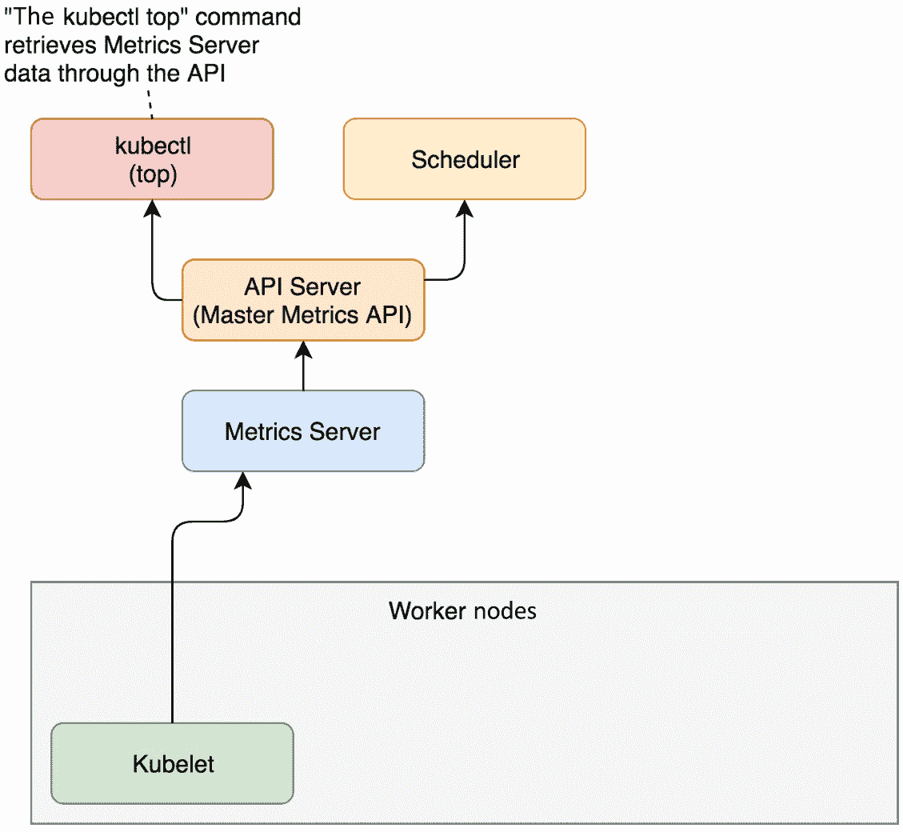

图 8.1 – Metrics Server 在 Kubernetes 集群中的工作原理

用户可以使用 `kubectl top` 命令访问 Metrics Server 收集的指标。在撰写本章时，Metrics Server 支持扩展至 5,000 个 Kubernetes 工作节点，这是 Kubernetes 当前支持的最大节点数（Kubernetes v1.24 支持最多 5,000 个节点的集群）。有关大型 Kubernetes 集群的更多详情，请参阅此官方文章：[`kubernetes.io/docs/setup/best-practices/cluster-large/`](https://kubernetes.io/docs/setup/best-practices/cluster-large/)。

## 检查是否安装了 Metrics Server

从您的 Kubernetes 集群开始，您可以采取以下步骤来检查您当前集群中是否可用 Metrics Server。您可以通过使用`alias k=kubectl`命令设置 kubectl 的别名，然后使用`k get`命令，如下所示，查看当前可用的工作节点：

```
    alias k=kubectl
    k get nodes
```

上述命令将显示当前集群中可用的工作节点。输出类似于以下内容：

```
NAME       STATUS   ROLES                  AGE   VERSION
minikube   Ready    control-plane,master   5d   v1.23.3
```

您可以使用`k top node`命令来检查名为`minikube`的工作节点的指标，如下所示：

```
k top node minikube
```

如果已安装 Metrics Server，上述命令的输出将显示`minikube`节点的资源使用情况。或者，您将看到以下内容，这仅在您当前的 Kubernetes 集群中没有 Metrics Server 可用时出现，这意味着您需要安装 Metrics Server：

```
error: Metrics API not available
```

或者，您可以直接使用以下命令来查看是否会有任何输出：

```
kubectl get pods -n kube-system | grep metrics-server
```

CKA 考试通常会预先安装 Metrics Server，因此您可以跳到*步骤 3*，查看`kubectl top`命令的用例。

## 在您当前的 Kubernetes 集群中安装 Metrics Server

如果您使用的是纯净的 Kubernetes 集群，可以通过部署 YAML 定义或使用 Helm 图表来安装 Metrics Server；后者需要安装 Helm。要获取最新的发布版本和说明，请访问它们的 GitHub 库：[`github.com/kubernetes-sigs/metrics-server`](https://github.com/kubernetes-sigs/metrics-server)。

### 使用 YAML 清单文件

您可以使用`kubectl apply -f`命令，通过官方 YAML 清单文件部署 Metrics Server，如下所示：

```
kubectl apply -f https://github.com/kubernetes-sigs/metrics-server/releases/latest/download/components.yaml
```

从 2022 年 2 月底开始，还有一个**高可用性**（**HA**）版本，将 Metrics Server 的副本数从一个增加到两个。如果您在至少两个节点的集群上，可以使用以下文件：

```
kubectl apply -f https://github.com/kubernetes-sigs/metrics-server/releases/latest/download/high-availability.yaml
```

您可以在这里获取有关 Metrics Server 的更多信息：[`github.com/kubernetes-sigs/metrics-server/releases`](https://github.com/kubernetes-sigs/metrics-server/releases)

### 使用 Helm 图表

要使用 Helm 图表安装 Metrics Server，您可以前往 Artifact Hub，然后在[`artifacthub.io/packages/helm/metrics-server/metrics-server`](https://artifacthub.io/packages/helm/metrics-server/metrics-server)找到 Metrics Server Helm 图表。

由于现在广泛使用 Helm 3，您需要将 Metrics Server Helm 图表存储库添加到 Helm 中：

```
helm repo add metrics-server https://kubernetes-sigs.github.io/metrics-server/
```

它将显示以下内容以确认已成功添加存储库：

```
"metrics-server" has been added to your repositories
```

添加存储库后，您可以通过以下命令安装 Helm 图表：

```
helm upgrade --install metrics-server metrics-server/metrics-server
```

上述命令的输出将显示安装是否成功。

### 使用 minikube 插件

如果您正在使用 minikube 集群，则 Metrics Server 以内置插件的形式提供，可以通过`minikube addons`命令启用和禁用。您可以使用以下命令列出当前支持的插件：

```
   minikube addons list
```

输出与以下截图中的内容类似：

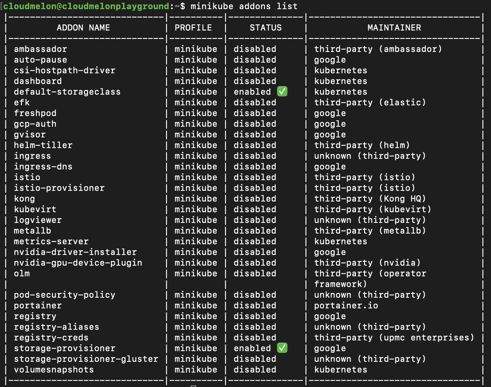

图 8.2 – minikube 插件列表

从前面的截图中，我们可以看到`metrics-server`插件已被`禁用`。你也可以使用以下命令来获得更清晰的视图：

```
   minikube addons list | grep metrics-server
```

以下输出显示当前 minikube 插件已`禁用`：

```
| metrics-server              | minikube | disabled     | kubernetes
```

你可以使用 `minikube addon enable` 命令来启用 Metrics Server：

```
   minikube addons enable metrics-server
```

以下输出显示 Metrics Server 插件已成功启用：

```
   ▪ Using image k8s.gcr.io/metrics-server/metrics-server:v0.4.2
🌟  The 'metrics-server' addon is enabled
```

现在，如果你使用`kubectl get`命令，你会看到与 Metrics Server 相关的 Pods 和 Services 在 `kube-system` 命名空间中已启动并运行：

```
   kubectl get pod,svc -n kube-system 
```

输出应如下所示：

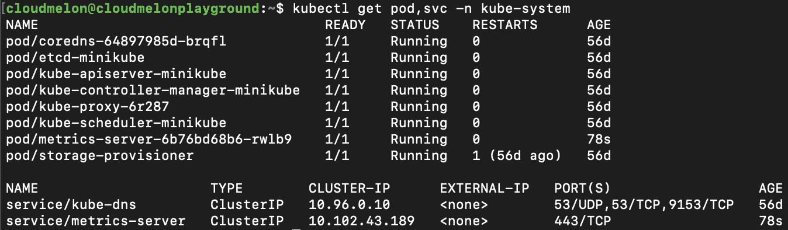

图 8.3 – kube-system 命名空间中的 Metrics Server Pods 和服务

你可以使用的另一个命令如下：

```
  kubectl get pods -n kube-system | grep metrics-server
```

输出应如下所示：

```
metrics-server-6b76bd68b6-rwlb9    1/1     Running   0         17h
```

从输出中可以看到，Metrics Server Pod 已启动并运行，这意味着你现在可以使用 `kubectl top` 命令。现在让我们看看它是如何工作的。

## 查看 CPU/内存指标

你可以使用 `kubectl top` 命令来查看你希望获取指标详情的工作节点。以下是一个例子，其中我们查看名为 `minikube` 的工作节点：

```
k top node minikube
```

输出如下所示，我们可以看到 CPU 核心数和使用的内存量：

```
NAME       CPU(cores)   CPU%   MEMORY(bytes)   MEMORY%   
minikube 232m 11% 961Mi 24%  
```

这同样适用于你的 Kubernetes 集群拥有多个工作节点的情况。使用 `kubectl top node` `<节点名称>` 命令将帮助你查看该特定节点的资源使用情况。

# 在 Kubernetes 集群上监控应用程序

一个标准的端到端监控解决方案涵盖了基础设施监控和应用监控。在 Kubernetes 中，Metrics Server 不仅用于监控 Kubernetes 工作节点，还用于监控 Kubernetes Pods 和容器。

我们可以通过在默认命名空间中部署一个新 Pod 来测试应用监控，如下所示：

```
kubectl run nginx --image=nginx
```

执行上述命令后，在进入下一节之前，请确保你的 `nginx` Pod 已启动并运行。要查看 Pod 的状态，可以使用 `kubectl get pod nginx` 命令。

## 监控应用程序的资源使用情况

你可以使用 `kubectl top pod <podname>` 命令查看该 Pod 收集的指标，包括 Pod 的资源消耗：

```
kubectl top pod nginx
```

输出应如下所示，你可以看到 Pod 的 CPU 和内存使用情况：

```
NAME    CPU(cores)   MEMORY(bytes)
nginx 0m 9Mi
```

在我们的案例中，我们部署了一个单容器 Pod，但需要注意的是，我们也可以通过以下命令查看多容器 Pod 的 CPU 和内存使用情况：

```
k top pod < pod name > --containers
```

让我们使用相同的 `kubectl top` 命令来显示 `nginx` Pod 及其所有容器的指标：

```
k top pod nginx --containers
```

输出应如下所示，因为这是一个单容器 Pod：

```
POD     NAME    CPU(cores)   MEMORY(bytes)
nginx nginx 0m 9Mi
```

如果有多个容器，它将列出该 Pod 中容器的名称，并分别显示它们的 CPU 和内存使用情况。

牢记这一点，我们可以使用`kubectl top pod`，并添加`-A`标志或`–all-namespaces`，以显示跨不同命名空间的所有 Pod 的所有指标。以下命令即为此场景下的使用：

```
k top pod -A 
```

或者，你也可以使用完整的标志，如下所示：

```
k top pod --all-namespaces
```

输出应如下所示，列出所有 Pod，并分别显示它们的 CPU 和内存使用情况：

```
NAMESPACE     NAME                       CPU(cores)   
MEMORY(bytes)
default       nginx                                 0m           
9Mi
kube-system   kube-proxy-64jzv                      1m          
32Mi
kube-system   kube-proxy-hplp5                      1m          
28Mi
kube-system   kube-proxy-kvb96                      2m          
31Mi
kube-system   kube-proxy-kvjwh                      1m          
28Mi
kube-system   kube-proxy-rmw2r                      1m          
31Mi
kube-system   kube-proxy-tcz5m                      1m          
26Mi
kube-system   metrics-server-6576d9ccf8-z8mlg       6m           
37M
```

CKA 考试很可能会问你在多个 Pod 中，哪个 Pod 消耗的计算资源最多，或者类似的任务——这时`–sort-by`标志就派上用场了。`--sort-by`标志接受`cpu`或`memory`作为值，结果将按`asc`或`desc`排序。该命令如下所示：

```
kubectl top pod --sort-by=cpu
kubectl top pod –-sort-by=memory
```

当我们有大量 Pod 并且要求按内存或 CPU 使用资源从最多到最少进行排序时，这会更有意义。我们可以使用以下命令来实现：

```
kubectl top pod -A --sort-by=memory
```

输出应如下所示，显示你当前 Kubernetes 集群中所有命名空间下的所有 Pod，并按资源使用情况进行排序：

```
kube-system   metrics-server-6576d9ccf8-z8mlg       7m          
37Mi
kube-system   kube-proxy-64jzv                      1m          
32Mi
kube-system   kube-proxy-rmw2r                      1m          
31Mi
kube-system   kube-proxy-kvb96                      1m          
31Mi
kube-system   kube-proxy-kvjwh                      1m          
28Mi
kube-system   kube-proxy-hplp5                      1m          
28Mi
kube-system   kube-proxy-tcz5m                      1m          
25Mi
default       nginx                                 0m           
9Mi
```

当使用`–sort-by cpu`标志时，该命令的工作方式类似。输出将按 CPU 使用量从高到低列出 Pod。

## 检查应用程序详情

你可以使用`kubectl describe pod <podname>`命令来查找关于分配的 CPU 和内存使用情况以及其他一些信息，如运行时版本、系统信息、容量、标签和注解：

```
kubectl describe pod nginx
```

输出应如下所示：

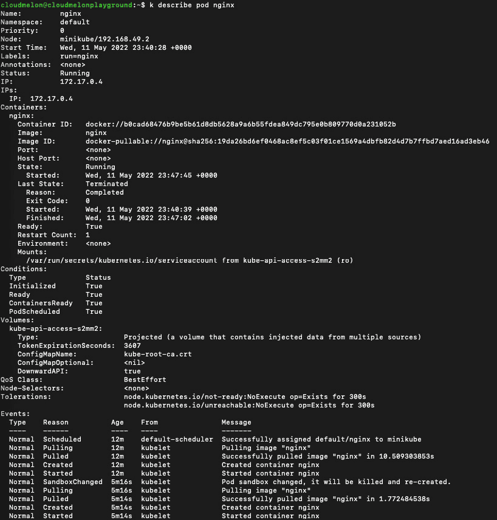

图 8.4 – kubectl describe pod nginx

请注意，在前面的截图底部有一个`Events`部分，显示了与此 Pod 相关的最近事件日志。我们将进一步查看`Events`部分：

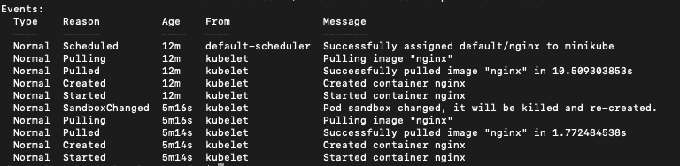

图 8.5 – nginx Pod 的事件

这里的事件包括 Kubernetes 中的一系列事件，例如这些：

1.  Pod 被调度到名为`minikube`的工作节点。

1.  容器镜像从容器注册表中拉取。

1.  kubelet 代理为包含`nginx`容器的 Pod 提供配置。

1.  Kubelet 启动了 Pod，`nginx`容器开始接受流量。

分析这些事件有助于我们理解在 Pod 配置过程中发生了什么，并且它能给我们提供线索，帮助我们了解是否发生了任何异常，以及异常发生的原因，从而为我们提供潜在的解决方案。在本章的下一节，我们将更详细地查看这些事件。

如果 pod 位于默认命名空间之外，你可以在`kubectl describe`命令中指定`-n`标志来添加命名空间。以下是使用该命令描述位于`kube-system`命名空间中的`coredns-64897985d-brqfl` pod 的示例：

```
kubectl describe pod coredns-64897985d-brqfl -n kube-system
```

输出应该如下所示：

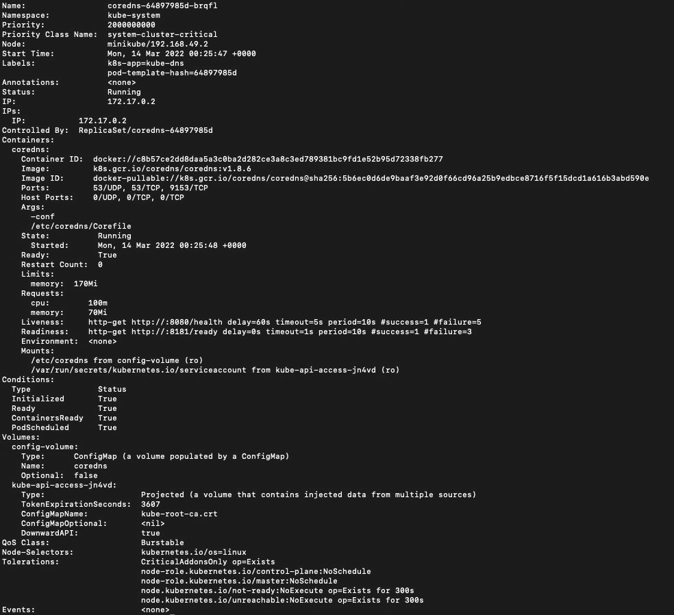

图 8.6 – kubectl 描述 kube-system 命名空间中的 coredns pod

尽管前面的截图包含了类似的信息块，但每个 pod 的细节是不同的。你可以在命令末尾添加`> mypod.yaml`来导出 pod 信息以供进一步分析：

```
kubectl describe pod nginx > mypod.yaml
```

你将得到一个名为`mypod.yaml`的 YAML 文件，包含关键的 pod 信息。

## 监控集群事件

我们可以使用以下命令来获取 Kubernetes 事件：

```
kubectl get events
```

我们可以获取当前集群中记录的事件，包括在`Events`部分中之前记录的事件，当我们使用`kubectl describe pod`命令时。以下是运行`kubectl get events`命令后的示例输出：

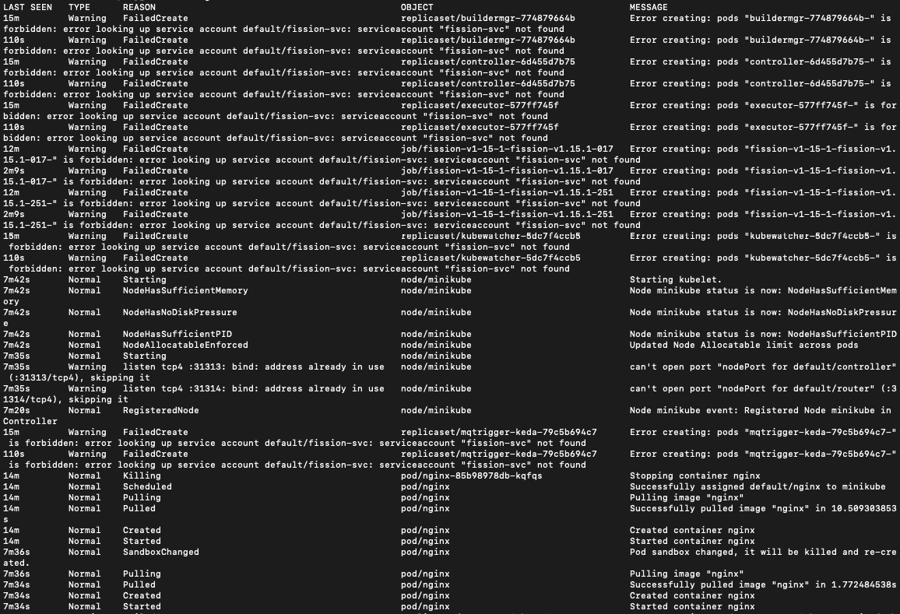

图 8.7 – kubectl 获取事件

你可以使用以下命令按时间戳列出事件：

```
kubectl get events --sort-by=.metadata.creationTimestamp
```

如果你想收集部署过程中的事件，可以在一旁运行以下命令：

```
kubectl get events --watch
```

如果你没有使用 Kubernetes Dashboard 或者像 Prometheus 与 Grafana Dashboard 这样的第三方监控框架，以上命令将帮助你更好地了解部署过程中的情况。通过监控应用层发生的事情，有时对于故障排除非常有帮助。通常我们通过分析日志和追踪异常来更好地理解问题。接下来我们来看看如何在集群节点和 pod 层级管理日志。

# 管理集群节点和 Pod 层级的日志

在故障排除问题时，日志非常有用。日志中收集的信息通常有助于理解发生了什么，弄清楚为什么会发生某些问题，并找到解决办法防止它们在未来再次发生。

## 集群级别日志

在 Kubernetes 中，集群级别日志的概念已广泛认可。这意味着日志应该存储在一个独立的后端中，因此这些日志的生命周期独立于记录到工作节点、pod，甚至容器层级的内容。

Kubernetes 本身并不提供一个全面的原生日志框架，但它可以与社区中许多第三方开源日志解决方案集成，如 Grafana Loki 或 EFK 堆栈，该堆栈包括 Elasticsearch、Fluentd 和 Kibana，用于日志搜索、查询和追踪。

Kubernetes 中的日志记录涉及一组由社区通过不同开源解决方案实现的模式。主要有以下三种模式：

+   **使用在每个节点上运行的节点级日志代理**：该代理通常在 DaemonSet 中，因此它会均匀地分布在每个节点上，且该代理会将日志推送到后端。在这种情况下，应用程序无需进行代码更改。

+   **使用专用的侧车容器从同一 Pod 中的应用程序记录信息**：这种情况可以与运行在节点上的日志代理或将日志流式传输出去一起使用，通常建议将日志条目以相同格式写入相同的日志流，方便处理。

+   **直接将日志从应用程序流式传输到外部后端**：这可以与外部对象存储一起使用，因为这种存储支持生命周期策略，可以根据策略设置数据保留政策并归档旧日志。大多数对象存储还支持搜索框架，日志会被索引，因此容易进行搜索和查询。

若要了解更多关于 Kubernetes 日志架构的信息，可以查看这篇文章：[`kubernetes.io/docs/concepts/cluster-administration/logging/`](https://kubernetes.io/docs/concepts/cluster-administration/logging/)

## 查看节点详情

使用原生 Kubernetes，您可以使用 `kubectl describe node <nodename>` 命令来查找有关分配的 CPU 和内存使用情况以及其他信息，例如运行时版本、系统信息、容量、标签和注释。我们可以使用以下命令来描述名为 `minikube` 的工作节点：

```
kubectl describe node minikube
```

输出类似于以下内容：

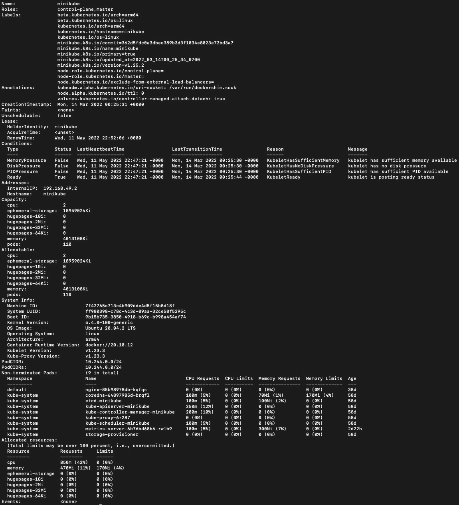

图 8.8 – kubectl 描述节点 minikube

了解节点规格将帮助您理解节点的先前配置情况。现在，让我们来看一下如何使用 `kubectl describe node` 命令获取一些快捷而有用的信息。

## 检查节点状态

使用 `kubectl describe` 命令，我们可以获得关于节点的一些常规信息。注意，它还包含一个 `events` 部分，通常记录节点事件。为了获取更多节点状态信息，通常使用以下命令，以名为 `minikube` 的节点为例：

```
kubectl get node minikube -o wide
```

输出类似于以下内容：

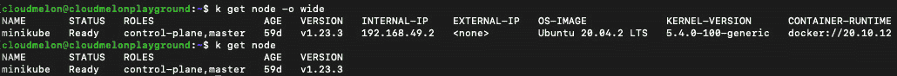

图 8.9 – kubectl 获取节点输出

从前面的截图中，如果将 `kubectl get node` 命令与带有 `-o wide` 标志的命令进行比较，您会发现它提供了有关镜像、内核版本以及容器运行时的额外信息，这在我们需要快速获取信息时非常方便。

# 管理容器的标准输出（stdout）和标准错误（stderr）日志

在 Unix 和 Linux 操作系统中，有三种 I/O 流，分别为 `STDIN`、`STDOUT` 和 `STDERR`。在这里，我们将讨论 Linux 容器中的 `STDOUT` 和 `STDERR`，这通常是 `kubectl logs` 命令向我们展示的内容。

`STDOUT` 通常是命令的正常输出，而 `STDERR` 则通常用于输出错误消息。Kubernetes 使用 `kubectl logs <podname>` 命令记录 `STDOUT` 和 `STDERR`。当我们使用该命令记录本章部署的 `nginx` Pod 时，输出如下所示：

```
kubectl logs nginx
```

输出应如下所示：

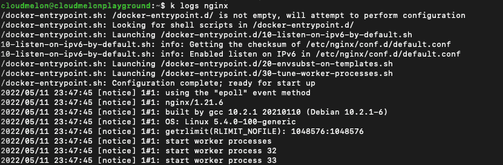

图 8.10 – kubectl logs nginx pod

现在，我们将使用容器每秒写一次文本到标准输出流的频率。我们可以通过部署一个新的 Pod 来实现这一点。以下是此 Pod 的 YAML 配置文件示例：

```
apiVersion: v1
kind: Pod
metadata:
  name: logger
spec:
  containers:
  - name: packs
    image: busybox:1.28
    args: [/bin/sh, -c,
            'i=0; while true; do echo "$i: $(date)"; i=$((i+1)); sleep 1; done']
```

您可以使用 `kubectl logs` 命令从 `logger` Pod 中检索日志，方法如下：

```
k logs logger
```

日志如下所示：

```
0: Thu May 12 04:34:40 UTC 2022
1: Thu May 12 04:34:41 UTC 2022
2: Thu May 12 04:34:42 UTC 2022
3: Thu May 12 04:34:43 UTC 2022
```

我们可以使用 `-c` 标志进入 Pod，检索特定容器的日志。让我们使用以下命令查看 `logger` Pod 中名为 `packt` 的容器日志：

```
k logs logger -c packt
```

以下输出是从 `packt` 容器检索到的日志：

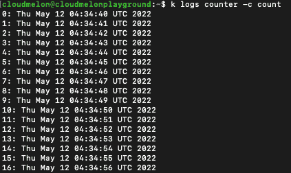

图 8.11 – 来自 packt 容器的日志

如果您想要实时查看日志，可以使用 `kubectl logs -f` 命令，如下所示：

```
kubectl logs -f logger
```

您应该能够看到类似以下的输出：

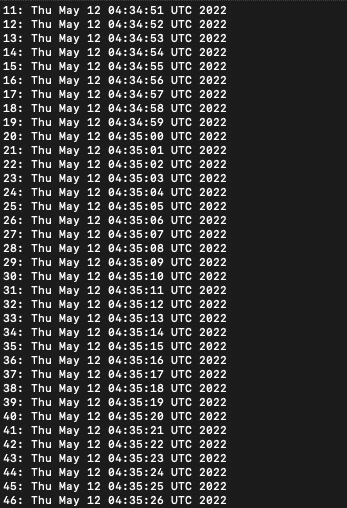

图 8.12 – kubectl logs for the nginx pod

如果您想返回某段时间内（例如 1 小时内）更新的日志，请使用以下命令：

```
kubectl logs --since=1h 
```

您可以根据需要修改 `–since` 标志后面的值。

# 摘要

本章介绍了 Kubernetes 的监控和日志记录，涵盖了集群、节点和 Pod 三个级别。这章为接下来的两章奠定了基础，我们将专注于故障排除集群组件和应用程序故障，以及探索 Kubernetes 安全限制和容器网络的挑战，提供更具体的故障排除用例和端到端的故障排除场景。请继续关注！

# 模拟 CKA 场景练习测试

您有两台虚拟机，分别为 `master-0` 和 `worker-0`：请完成以下模拟场景。

## 场景 1

列出当前集群中所有可用的 Pod，标识 CPU 消耗最高的 Pod，并将它们的名称写入 `max-cpu.txt` 文件。

您可以在本书的 *附录* *- 模拟 CKA 场景练习测试的解答* 中找到所有场景的解决方案。

# 常见问题

+   *我在哪里可以找到有关 Kubernetes Metrics Server 最新更新的信息？*

Kubernetes Metrics Server 在 GitHub 上有一个仓库，网址为 [`github.com/kubernetes-sigs/metrics-server`](https://github.com/kubernetes-sigs/metrics-server)。

+   *我在哪里可以找到关于 Kubernetes 集群日志架构的最新信息？*

访问官方 Kubernetes 文档：[`kubernetes.io/docs/concepts/cluster-administration/logging/`](https://kubernetes.io/docs/concepts/cluster-administration/logging/)。

+   *我在哪里可以找到 Kubernetes 系统组件的指标？*

你可以收藏此页面以获取更多信息：[`kubernetes.io/docs/concepts/cluster-administration/system-metrics/`](https://kubernetes.io/docs/concepts/cluster-administration/system-metrics/)。
