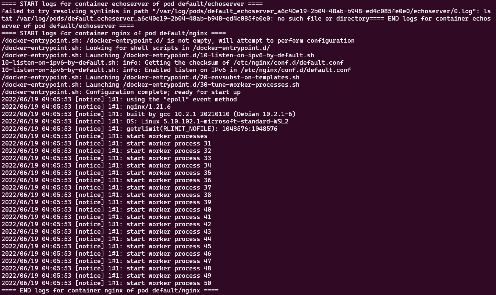
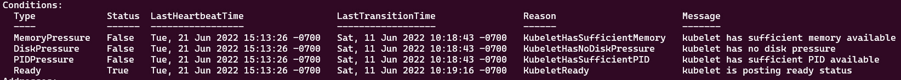
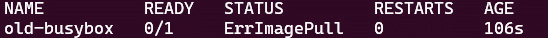

# 第九章：故障排查集群组件和应用程序

故障排除是 Kubernetes 管理员日常工作中的主要任务之一。本章介绍了故障排除集群组件失败以及应用程序部署过程中可能发生的错误的一般方法。

在本章中，我们将涵盖以下主题：

+   Kubernetes 故障排除的一般实践

+   故障排查集群组件

+   故障排查应用程序

# 技术要求

为了开始，我们需要确保本地机器符合以下技术要求。

如果你使用的是 Linux，请参阅以下内容：

+   一个兼容的 Linux 主机。我们推荐基于 Debian 的 Linux 发行版，如 Ubuntu 18.04 或更高版本。

+   确保你的主机至少有 2 GB 的内存，2 个 CPU 核心，以及大约 20 GB 的空闲磁盘空间。

如果你使用的是 Windows 10 或 Windows 11，请参阅以下内容：

+   我们建议更新 Docker Desktop 到最新版本，并创建一个 Docker Desktop 本地 Kubernetes 集群。查看这篇文章，了解如何使用 Docker Desktop 设置本地 Kubernetes 集群：[`docs.docker.com/desktop/kubernetes/`](https://docs.docker.com/desktop/kubernetes/)。

+   我们还建议使用**Windows Subsystem for Linux 2**（**WSL 2**）来测试环境。请参考这篇文章，了解如何安装 WSL（[`docs.microsoft.com/en-us/windows/wsl/install`](https://docs.microsoft.com/en-us/windows/wsl/install)），以及这篇文章，了解如何设置 Docker Desktop 的 WSL 2 后端：[`docs.docker.com/desktop/windows/wsl/`](https://docs.docker.com/desktop/windows/wsl/)。

设置完成后，你可以使用以下命令检查你是否已设置到正确的 Kubernetes 集群：

```
alias k=kubectlk config current-context
```

上面的命令将输出当前集群的信息。在我们的案例中，类似以下输出，因为我们在 Windows 上，且使用 Docker Desktop 创建了一个 Kubernetes 本地集群：

```
docker desktop
```

如果你在本书中一直跟着我们的演示，你会注意到大多数演示都在`minikube`集群上进行。在这种情况下，输出将如下所示：

```
minikube
```

你可能已经使用本地机器连接到不同的 Kubernetes 集群——你可以使用`kubectl config view`命令查看当前连接的是哪个集群：


图 9.1 – 本地集群上下文信息

若要了解更多关于如何使用`kubeconfig`组织集群访问以及如何配置多个集群的访问，请参阅*第六章*，*保障 Kubernetes 安全性*。

在本章中，我们将使用`docker-desktop`来了解如何排查本地 Kubernetes 集群的问题。请注意，同一组命令也适用于`minikube`。让我们首先谈谈 Kubernetes 故障排除的一般实践。

# Kubernetes 故障排除的一般实践

本书中，我们已经讨论了作为 Kubernetes 管理员日常工作的一些常见任务，尤其是在之前的章节中。在实际操作中，根据你所参与的项目阶段，Kubernetes 管理员通常会参与 Kubernetes 集群的安装与设置、应用部署，以及管理 Kubernetes 的安全性和网络方面的工作。除了上述任务，操作和维护 Kubernetes 集群及其上部署的应用也是 Kubernetes 管理员的核心职责之一。因此，掌握良好的故障排除技能在这种情况下非常有帮助。

故障排除 Kubernetes 集群是一个识别、诊断和修复问题的过程——问题陈述涉及 Kubernetes 集群组件、节点、网络和安全性。此外，问题陈述还涵盖了应用层面，比如 pods，甚至是容器层面。本章将讨论 Kubernetes 集群组件以及应用层面的故障排除，包括 pods 和容器。

采用从外到内的方法，并逐渐缩小范围以识别问题的根本原因非常重要。这意味着我们可以通过以下建议来合理化过程：

+   监控在识别潜在问题并找出其根本原因方面起着至关重要的作用。在*第八章*《监控和日志记录 Kubernetes 集群和应用》中，我们讨论了如何监控 Kubernetes 集群组件以及应用，并提供了关于日志记录的指导，帮助你迈出第一步。

+   指标分析是你发现潜在问题后进行的第一步。虽然有时问题陈述可能并不像看起来那么简单，但你可以通过从集群和节点层级分析指标来获得高层次的视图，然后再深入到应用层，来使故障排除变得更加容易。

+   有时，指标可能无法告诉你整个故事。在这种情况下，分析日志将帮助你更好地拼凑信息。如果此时你发现自己对发生的问题有了更清晰的了解，那么是时候深入研究这些日志，找出真正的根本原因，而不是你之前认为的罪魁祸首。然而，回到更高层次看看流程中是否有什么遗漏仍然是个好主意。

+   一旦你找到了问题，如果你想防止问题再次发生，那么需要一个可操作的修复计划，而不仅仅是对问题进行快速修复。这个步骤将为你的未来成功奠定基础，并使你日常的工作变得更轻松。维护和故障排除工作在初始设置后成为日常运营任务——这是你作为 Kubernetes 管理员日常工作的关键组成部分。

在实际的 CKA 考试中，排查问题占的比重较大，并且有些场景比较耗时，因为在有限的时间窗口内找到根本原因通常会让人感到压力很大。然而，作为考生，只要你确定自己已经在其他高价值问题（例如应用部署、网络和备份 etcd 存储等）上做得很好，你就可以有信心地提前规划好时间。排查问题的考试题通常出现在 CKA 考试的后半部分——你通常可以从分析 Kubernetes 集群组件开始。这类问题更有可能是关于工作节点上的 `kubelet`，然后逐步扩展到应用层。排查时要注意，在进行修复之前，一定要确保在正确的节点上执行排查和修复操作。

根据前面提到的外向内方法，首先讨论如何排查集群组件问题。

# 排查集群组件问题

排查集群组件包括主节点和工作节点上的 Kubernetes 系统进程。在本节中，我们将看看一些常见的排查场景，并从更高层次的角度进行讲解。

## 检查集群

检查集群和节点通常是检测控制平面问题的第一步。我们可以使用以下命令来实现：

```
kubectl cluster-info 
```

输出显示了控制平面组件和服务的地址：


图 9.2 – 渲染集群信息

如果你需要进一步的信息来进行调试和诊断，可以使用以下命令：

```
kubectl cluster-info dump
```

上述命令输出的内容非常庞大，包含了大量信息——因此我们只展示了以下截图中的关键信息：



图 9.3 – Kubernetes 集群日志

上述截图显示了日志信息，对于找出根本原因非常有帮助。虽然我们可以从控制平面和集群日志中获取有价值的信息，但通常会经常出现与运行在其上的工作负载相关的错误，这可能是由于节点的可用性或能力问题引起的。接下来，我们将看看如何排查节点问题。

## 检查节点

使用以下命令检查节点，将帮助你获取当前集群和节点的状态：

```
kubectl get nodes
```

输出应如下所示：


图 9.4 – Kubernetes 节点信息

上述截图显示，当前唯一的工作节点处于 `Ready` 状态。当你有多个节点时，输出中会列出节点信息。

`ROLES` 列显示的是节点的角色——它可以是 `control-plane`、`etcd` 或 `worker`：

+   `control-plane` 角色运行 Kubernetes 主控组件，除了 `etcd`。

+   `etcd` 角色运行 etcd 存储。请参阅 *第三章*，*维护 Kubernetes 集群*，了解更多关于 etcd 存储的信息。

+   `worker` 角色运行 Kubernetes 工作节点——这就是容器化工作负载所在的地方。

`STATUS` 列显示当前正在运行节点的状态——我们最喜欢的理想状态是 `Ready`。可能的状态示例如下表所示：

| **节点状态** | **这是什么意思？** |
| --- | --- |
| `Ready` | 节点健康且准备接受 Pod。 |
| `DiskPressure` | 磁盘容量低。 |
| `MemoryPressure` | 节点内存低。 |
| `PIDPressure` | 节点上运行的进程过多。 |
| `NetworkUnavailable` | 网络配置不正确。 |
| `SchedulingDisabled` | 这不是 Kubernetes API 中的一个状态，而是在你对节点进行封锁（cordon）后出现的状态。请参阅 *第三章*，*维护 Kubernetes 集群*，了解在需要封锁节点时，如何使用 `kubeadm` 对 Kubernetes 集群进行版本升级。 |

表 9.1 - 不同的节点状态及其含义

从前述输出中另一个非常有趣的列是 `VERSION` 列——它显示了当前节点上运行的 Kubernetes 版本。这里的 Kubernetes 版本指的是 Kubernetes 主控组件版本、etcd 版本或 `kubelet` 版本，根据节点角色的不同而有所差异。请参阅 *第三章*，*维护 Kubernetes 集群*，了解如何升级 Kubernetes 节点上的版本。

如果你对某个节点有疑虑，可以使用以下命令检查节点信息：

```
kubectl describe node docker-desktop
```

输出应类似于以下内容。如你所见，与你使用 `kubectl get node` 命令相比，这里可以获得更详细的信息。


图 9.5 – `kubectl describe node` 输出信息

为了从前面的命令中获得最大的价值，我们可以查看 `Conditions` 部分，其内容应如下所示：



图 9.6 – 获取节点状态信息

前述截图展示了详细的节点状态信息，正如我们在本章中所解释的那样。你还可以从相同的输出中获取已分配的资源信息，内容如下：


图 9.7 – 获取节点资源消耗信息

上述截图中的值用于了解当前集群在 CPU、内存和存储方面的消耗情况。

相同的输出还帮助你概览当前集群中各个 Pod 的资源请求和限制，如下所示的截图所示：


图 9.8 – 获取 Pod 资源消耗信息

如果你希望以更结构化的方式查看此输出，可以使用以下命令，使其看起来更像一个`yaml`文件：

```
kubectl get node docker-desktop -o yaml
```

输出如下：


图 9.9 – 获取节点信息的 YAML 格式

在前面的输出中，特别注意名为`nodeInfo`的部分，它概述了操作系统镜像、架构、内核版本、`kubeProxy`版本、`kubelet`版本和操作系统：


图 9.10 – 获取 Pod 资源消耗信息

如果你不需要查看 Kubernetes 节点的完整概况，而是专注于获取当前在 Kubernetes 集群中运行的进程的内存，可以在 Kubernetes 节点中运行以下命令：

```
top
```

输出已优化，应该看起来类似于以下内容：


图 9.11 – 检查进程的消耗信息

正如我们在本章前面所解释的，`DiskPressure`也是工作节点健康状态的一个关键因素。你可以使用以下命令检查可用的磁盘存储：

```
df -h
```

输出看起来类似于以下内容：


图 9.12 – 可用磁盘信息

检查完集群和节点信息后，我们可以进入下一步，检查 Kubernetes 组件。

### 检查 Kubernetes 组件

我们可以通过检查`kube-system`命名空间中的流程来使检查变得更简单、更有效——大多数流程都在这里，你可以导出一些有用的信息，如配置、诊断日志等。

### 排查系统保留进程

使用以下命令检查系统保留进程中的错误：

```
kubectl get pods -n kube-system
```

如果你有多个节点，可以添加`-o wide`标志，查看哪些 Pod 在哪个节点上运行：

```
kubectl get pods -n kube-system -o wide
```

正如你从前几章中了解到的，这个命令将输出系统保留进程：


图 9.13 – 系统保留进程

当你看到任何不是`Running`状态的进程时，意味着它不健康——你可以使用`kubectl describe pod`命令检查它。以下是检查`kube-proxy`状态的示例：

```
k describe pod kube-proxy-9rfxs -n kube-system
```

前面的命令将打印出 `kube-proxy-9rfxs` pod 的完整描述信息。然而，由于该 pod 展示了 `kube-proxy` 组件，我们可以使用以下命令进一步缩小 pod 信息：

```
k describe pod kube-proxy-9rfxs -n kube-system |  grep Node:
```

输出打印出节点名称及其分配的 IP 地址：

```
Node:                 docker-desktop/192.168.65.4
```

你可以使用 `kubectl get node -o wide` 命令再三确认，这将打印出 `docker-desktop` 节点的 IP 地址。它提供与以下相同的 IP 地址（以下是部分输出）：


图 9.14 – 节点相关信息

从 `kubectl describe` pod 的输出中，`kube-proxy-9rfxs -n kubectl`，我们知道 `kube-proxy` 是一个 DaemonSet —— 参考 *第四章*，*应用调度与生命周期管理*，以更新关于 DaemonSets 的详细信息。如果你有多个节点，并且想查看每个 pod 所在的节点，你还可以使用以下命令查看 `kube-proxy` DaemonSet：

```
kubectl describe daemonset kube-proxy -n kube-system
```

输出类似于以下内容，你可以在其中找到一些有用的信息，如 `Pod 状态` 和 `pod 模板`，这将显示此 pod 的详细信息：


图 9.15 – kube-proxy DaemonSet 信息

仅知道前面的输出中的 pod 配置信息还不够。当 pod 因某种原因未启动时，日志会更加有用，特别是当 `Events` 部分显示为 `none`（如前面截图所示）。我们可以使用以下命令查看 pod 日志：

```
kubectl logs kube-proxy-9rfxs -n kube-system
```

前面的命令会打印出类似以下内容的日志，这将为你提供更多关于发生了什么的详细信息：


图 9.16 – Pod 日志信息

在处理完主节点故障排除后，如果工作节点需要排查，我们应首先排查 `kubelet` 代理 —— 让我们在下一节深入了解这一点。

### 排查 kubelet 代理

在检查节点状态之后，如果你还没有登录到工作节点，可以通过 SSH 连接该工作节点，并使用以下命令检查 `kubelet` 状态：

```
systemctl status kubelet
```

输出应如下所示：


图 9.17 – kubelet 代理状态和日志

前面截图中的重要部分是 `kubelet` 的状态，以下截图中可以看到：


图 9.18 – kubelet 代理状态

如果状态不是 `active (running)`，我们可以使用 `journalctl` 获取工作节点上 `kubelet` 服务的日志。以下命令显示了如何执行此操作：

```
journalctl -u kubelet.service
```

输出将打印出类似以下内容的日志详情：


图 9.19 – kubelet 服务详细日志

然后，你需要找出日志中主要的问题所在。以下是问题陈述的示例：


图 9.20 – kubelet 代理日志中的错误示例

请参考*第六章*，《Kubernetes 安全性》，了解如何使用`kubeconfig`组织集群访问。修复问题后，应该使用以下命令重启`kubelet`代理：

```
systemctl restart kubelet
```

请注意，在 CKA 考试中，有时并没有实际的问题。在使用`journalctl -u kubelet.service`命令检查丢失的日志后，你可以通过`systemctl restart kubelet`命令重启`kubelet`代理来修复问题。

除了集群组件的问题，我们经常会遇到应用程序故障，后者在日常操作 Kubernetes 集群时可能更为常见。所以，现在让我们来看看如何排查应用程序故障。

# 排查应用程序故障

在本节中，我们将重点关注在 Kubernetes 集群上排查容器化应用程序的故障。通常涉及与容器化应用相关的 Kubernetes 对象问题，包括 Pods、容器、服务和 StatefulSets。在这一节中你将学到的故障排除技能将在整个 CKA 考试中都非常有用。

## 获取高层次的视图

要排查应用程序故障，我们必须先获取高层次的视图。以下命令是一次性获取所有信息的最佳方式：

```
kubectl get pods --all-namespaces
```

或者，我们可以使用以下方法：

```
kubectl get pods -A
```

以下输出显示了按命名空间启动并运行的 Pods，你可以轻松找到哪些 Pods 发生了故障：


图 9.21 – 按命名空间列出 Pods

为了充分利用输出信息，请注意`NAMESPACE`、`READY`和`STATUS`列——它们会告诉你在哪个命名空间中 Pods 正在运行以及有多少副本。如果你确定某些命名空间中的某些 Pods 发生了故障，那么可以继续查看下一节，检查命名空间事件。

## 检查命名空间事件

要检查命名空间事件，你可以使用以下命令查看`default`命名空间中部署的应用程序发生了什么：

```
kubectl get events
```

输出应如下所示：


图 9.22 – Kubernetes 事件

在前面的截图中，我们有一些有价值的列：

+   `TYPE`列显示事件类型——它可以是`Normal`或`Warning`。

+   `REASON`列与事件的行为相关。

+   `OBJECT`列显示该事件附加到哪个对象。

+   `MESSAGE`列显示了特定 Pod 或容器发生了什么。

要了解更多关于事件的信息，可以查看这篇博客，帮助你从 Kubernetes 事件流中提取价值：[`www.cncf.io/blog/2021/12/21/extracting-value-from-the-kubernetes-events-feed/`](https://www.cncf.io/blog/2021/12/21/extracting-value-from-the-kubernetes-events-feed/)。

你也可以使用以下命令按最新的事件对`events`列表进行排序：

```
kubectl get events --sort-by=.metadata.creationTimestamp
```

它将返回按创建时间戳排序的事件，如下所示：


图 9.23 – Kubernetes 事件按时间戳分组

类似地，如果我们想查看名为`app`的命名空间中的事件，可以使用以下命令：

```
kubectl get events -n app --sort-by=.metadata.creationTimestamp
```

输出应如下所示：


图 9.24 – Kubernetes 事件按命名空间和时间戳分组

上述输出证明我们能够按命名空间打印事件，并按创建时间戳进行排序。

到此为止，我们已经确定了问题发生在哪个 Pod 或容器中。接下来，让我们更仔细地查看故障的 Pod。

## 故障 Pod 的故障排除

一旦我们缩小范围，确定了哪个 Pod 出现故障，就可以使用命令获取该命名空间中运行的 Pod 状态。以下是获取名为`old-busybox`、位于`app`命名空间中的故障 Pod 的命令：

```
kubectl get pod old-busybox -n app
```

你的输出将类似于以下内容：



图 9.25 – 获取命名空间中的故障 Pod

我们可能会注意到`STATUS`显示有一个镜像错误（`ErrImagePull`）。现在，我们可以使用`kubectl describe`命令获取更多细节：

```
kubectl describe pod old-busybox -n app
```

上述命令打印出故障部分的概述，如下图所示：


图 9.26 – 描述命名空间中的故障 Pod

你可能会注意到有一个名为`Events`的部分，显示与该 Pod 相关的事件，如下所示：


图 9.27 – 故障 Pod 事件

我们还可以使用`kubectl logs`命令获取有关故障 Pod 的一些信息，输出会提供更详细的信息。我们以相同的例子，获取名为`old-busybox`的 Pod 的日志，如下所示：

```
kubectl logs old-busybox -n app
```

输出如下：

```
Error from server (BadRequest): container "old-busybox" in pod "old-busybox" is waiting to start: trying and failing to pull image
```

从前面几次输出中，我们知道镜像存在问题。由于这是一个 Pod，我们可以使用以下命令将 Pod 定义导出为名为`my-old-pod.yaml`的`yaml`文件：

```
kubectl get pod old-busybox -n app -o yaml > my-old-pod.yaml
```

我们还可以使用以下命令查看此`yaml`文件的内容：

```
cat my-old-pod.yaml
```

上述命令为我们提供了名为`old-busybox`的 Pod 的完整配置。但是，我们发现这个文件的关键部分是名为`image`的部分，如下所示：


图 9.28 – 失败的 pod 规范

我们可以使用以下命令本地编辑导出的文件：

```
vim my-old-pod.yaml
```

您会看到，当您处于`EDIT`模式时，可以按如下方式编辑 YAML 文件：


图 9.29 – 编辑 pod 导出的 YAML 规范

编辑完成后，您需要使用`kubectl delete`命令删除旧的 pod，命令如下：

```
kubectl delete pod old-busybox -n app
```

然后，使用`kubectl apply -f`命令部署`my-old-pod`，接着您会看到 pod 已经重新启动并正常运行：

```
   NAME          READY   STATUS      RESTARTS         AGE
   old-busybox   1/1     Running     3(36s ago)       51s
```

重要提示

对于由部署启动的失败 pod，您可以使用`kubectl edit deploy <您的部署>`命令对 pod 进行实时编辑并修复错误。这有助于快速修复多种错误。要了解更多关于部署实时编辑的内容，请参考*第四章*，*应用调度与生命周期管理*。

失败的 pods 包括以下几种情况：

| **失败类型** | **如何调试？** |
| --- | --- |
| Pending | 使用`kubectl describe`命令—有时是由于没有可用节点或资源超限导致的调度问题。确保检查节点状态，并使用`top`命令查看资源分配情况。 |
| CrashLoopBackOff | 使用`kubectl describe`和`kubectl log`命令—有时是由集群组件引起的，因此请确保通过外部到内部的方式缩小错误范围。 |
| Completed | 使用`kubectl describe`命令查找发生原因，然后进行修复。 |
| 错误 | 使用`kubectl describe`命令查找发生原因，然后进行修复。 |
| ImagePullBackOff | `kubectl`描述并通常需要导出 YAML 文件，然后更新镜像。也可以使用`set image`命令。 |

表 9.2 - 失败的 pods 及其修复方法

了解 pod 排错非常有用，并且适用于大多数情况，特别是在微服务架构中，通常每个 pod 只有一个容器。当 pod 中有多个容器或包含 init 容器时，我们需要对 pod 执行命令进行排错—现在让我们看看这些情况。

## 排查 init 容器问题

在本书的*第四章*，*应用调度与生命周期管理*中，我们学习了 init 容器，以下是我们在示例中部署 init 容器的过程：

```
apiVersion: v1
kind: Pod
metadata:
  name: packt-pod
  labels:
    app: packtapp
spec:
  containers:
  - name: packtapp-container
    image: busybox:latest
    command: ['sh', '-c', 'echo The packtapp is running! && sleep 3600']
  initContainers:
  - name: init-packtsvc
    image: busybox:latest
    command: ['sh', '-c', 'until nslookup init-packtsvc; do echo waiting for init-packtsvc;  sleep 2;  done;']
```

我们可以使用以下命令检查该 pod 的`initContainer`状态：

```
kubectl get pod packt-pod --template '{{. status.initContainerStatuses}}'
```

在我的情况下，打印的输出如下：

```
[map[containerID:docker://016f1176608e521b3eecde33c35dce3596
a46a483f38a69ba94ed48b8dd91f13 image:busybox:latest imageID:
docker-pullable://busybox@sha256:3614ca5eacf0a3a1bcc361c939202
a974b4902b9334ff36eb29ffe9011aaad83 lastState:map[] name:
init-packtsvc ready:false restartCount:0  state:map[running:map
[startedAt:2022-06-23T04:57:47Z]]]]
```

上述输出显示`initContainer`尚未准备好。

我们可以使用以下命令检查该 pod 的`initContainer`日志，以了解问题并修复它：

```
kubectl logs packt-pod -c init-packtsvc
```

同样，`initContainer`也有其状态—以下是常见的几种：

| **失败类型** | **这意味着什么？** |
| --- | --- |
| `Init: X/Y` | Pod 总共有 `Y` 个 init containers，已完成 `X` 个 |
| `Init: Error` | `initContainer` 执行失败 |
| `Init:CrashLoopBackOff` | `initContainer` 正在反复失败 |
| `Pending` | Pod 处于待处理状态，尚未开始执行 `initContainer` |
| `PodInitializing` | `initContainer` 已执行，Pod 正在初始化 |
| `Running` | `initContainer` 已执行，Pod 现在正在运行 |

熟悉这些状态有助于你判断何时以及如何采取进一步的步骤来调试容器。

# 总结

本章节覆盖了从集群、节点到 Pod 层级的集群和应用故障排除——这是一种端到端的外部到内部的方法。作为 Kubernetes 管理员，掌握良好的故障排除技能将极大地帮助你为组织提供更大的价值。

在下一章节，我们将重点讨论 Kubernetes 安全性、网络故障排除用例，以及一些端到端的故障排除场景，敬请期待！

# 常见问题解答

+   *在哪里可以找到一个全面的集群故障排除指南？*

你可以从官方 Kubernetes 文档中找到最新信息：

[`kubernetes.io/docs/tasks/debug/debug-cluster/`](https://kubernetes.io/docs/tasks/debug/debug-cluster/)

+   *在哪里可以找到一个全面的应用故障排除指南？*

你可以从官方 Kubernetes 文档中找到最新信息：

[`kubernetes.io/docs/tasks/debug/debug-application/`](https://kubernetes.io/docs/tasks/debug/debug-application/)
