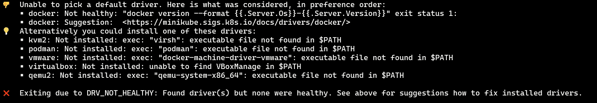
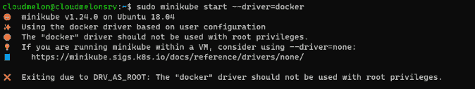
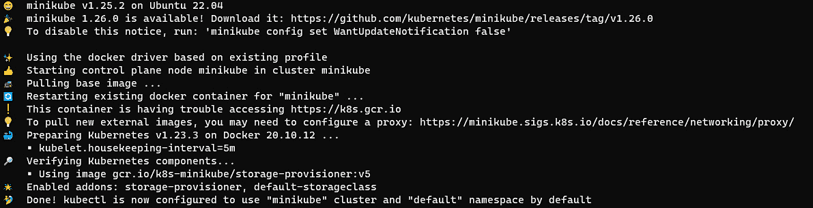
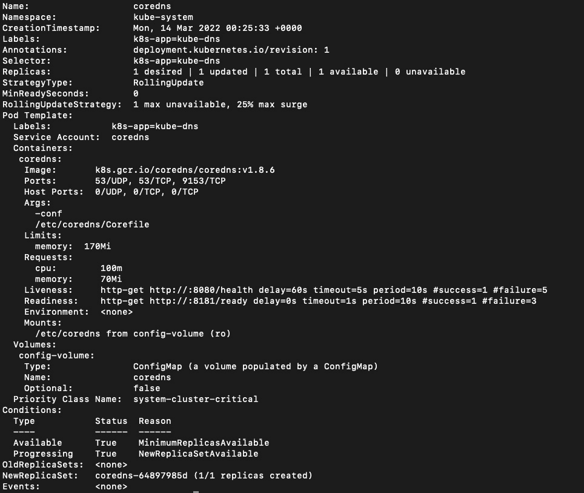
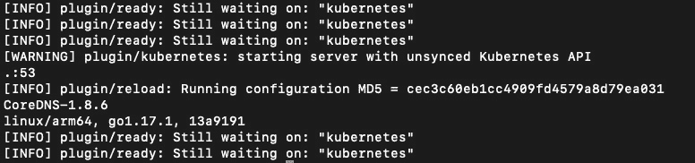
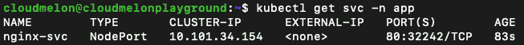
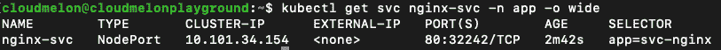
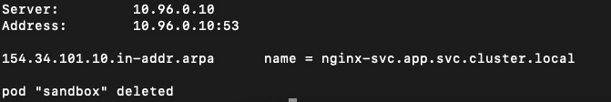
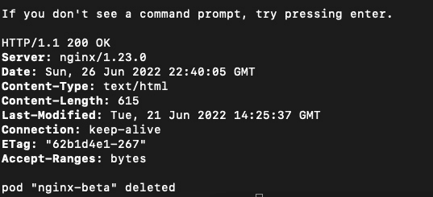
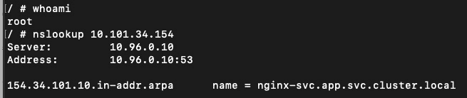

# 10

# 排查安全性和网络问题

到目前为止，我们已经讨论了 Kubernetes 架构、应用生命周期、安全性和网络。希望本章作为最后一章，能够承接 *第九章*，*排查集群组件和应用*，继续讨论安全性和网络排查。本章提供了针对 RBAC 限制或网络设置引起的错误的通用排查方法。我们在 *第六章*，*确保 Kubernetes 安全性* 中讲解了如何启用 Kubernetes RBAC，在 *第七章*，*解密 Kubernetes 网络* 中讲解了 Kubernetes DNS 的工作原理。在深入本章之前，务必回顾这些章节中的重要概念。我们将在本章讨论以下主要内容：

+   排查 RBAC 故障

+   排查网络故障

# 技术要求

为了开始，我们需要确保你的本地机器符合以下技术要求。

如果你使用的是 Linux，我们将演示使用 `minikube` 集群的示例——请查看 *第二章*，*安装和配置 Kubernetes 集群*。确保你的测试环境满足以下要求：

+   一个兼容的 Linux 主机。我们推荐使用基于 Debian 的 Linux 发行版，如 Ubuntu 18.04 或更高版本。

+   确保你的主机至少有 2 GB 的内存、2 个 CPU 核心和约 20 GB 的空闲磁盘空间。

如果你使用的是 Windows 10 或 Windows 11，请注意以下事项：

+   我们推荐将 Docker Desktop 更新到最新版本，并创建一个本地 `docker-desktop` Kubernetes 集群。参考这篇文章了解如何使用 Docker Desktop 设置本地 Kubernetes 集群：[`docs.docker.com/desktop/kubernetes/.`](https://docs.docker.com/desktop/kubernetes/%0D)

+   我们还推荐使用**Windows Subsystem for Linux 2**（**WSL 2**）来测试环境——参考这篇文章了解如何安装 WSL 2（[`docs.microsoft.com/en-us/windows/wsl/install`](https://docs.microsoft.com/en-us/windows/wsl/install)）以及以下文章了解如何设置 Docker Desktop WSL 2 后端（[`docs.docker.com/desktop/windows/wsl/`](https://docs.docker.com/desktop/windows/wsl/)）。

# 排查 RBAC 故障

排除与 Kubernetes 安全相关的任何问题似乎有点矛盾。事实上，Kubernetes 的大多数安全层涉及使用工具来帮助保护 Kubernetes 的 4C 层，这包括安全扫描、管理和保护。要了解更多关于 4C 层的信息，请参考 *第六章*，*Kubernetes 安全性*。当涉及到排除安全问题时，CKA 考试最常见的是关于 Kubernetes 的 RBAC 问题。因此，我们将在本节中重点展示如何排除 Kubernetes 中 RBAC 失败的示例。

## 启动 minikube 集群

这一部分不包含在 CKA 考试中，但如果你按照 *第二章*，*安装与配置 Kubernetes 集群* 中的说明自己部署`minikube`集群时，可能会遇到这个问题。每当你尝试在全新的 Linux 虚拟机上安装一个新的`minikube`集群时，你需要应用我们在该章节中讨论的内容。

安装完`minikube`工具后，你可以使用以下命令启动本地集群：

```
minikube start 
```

你可能会在输出中看到以下错误：



图 10.1 – 驱动程序不健康

你下意识地选择正确的驱动程序并使用 `sudo` 命令，如下所示：

```
sudo minikube start --driver=docker
```

结果，你可能会看到以下输出：



图 10.2 – 每个命名空间的服务账户

之前的输出是由于 Docker 根权限问题。最佳实践是以非 root 用户管理 Docker，以避免这个问题。为了实现这一点，我们需要将一个用户添加到名为`docker`的组中：

1.  创建`docker`组：

```
sudo groupadd docker
```

1.  将你的用户添加到名为`docker`的组中：

```
sudo usermod -aG docker $USER
```

1.  在此，你需要重新登录或重启 Docker 服务器，以便重新评估你的组成员资格。然而，在 Linux 操作系统上，我们应该通过以下命令激活对组的更改：

```
newgrp docker 
```

1.  下次登录时，如果你希望 Docker 在启动时自动启动，可以使用以下命令：

```
sudo systemctl enable docker.service
sudo systemctl enable containerd.service
```

1.  完成上述步骤后，你应该能够通过以下命令使用 Docker 驱动程序启动`minikube`：

```
minikube start --driver=docker
```

如果你能够看到类似以下的输出，说明之前的`minikube start`命令已经成功创建了`minikube`集群：



图 10.3 – 成功启动 minikube 集群

虽然这一部分不包括在 CKA 考试中，但强烈建议熟悉它，以防在创建`minikube`集群时遇到问题。一旦你的`minikube`集群成功启动，我们就可以进入管理`minikube`集群并根据需要排除 RBAC 问题。

## 管理 minikube 集群

当涉及到管理`minikube`集群时，我们在*第六章*《确保 Kubernetes 安全》中了解到，我们需要将`apiserver --authorization-mode`设置为`RBAC`，以启用 Kubernetes RBAC，示例如下：

```
kube-apiserver --authorization-mode=RBAC
```

确保我们的当前上下文使用的是默认的`minikube`，然后使用以下命令在特定命名空间中创建一个新的部署：

```
kubectl create ns app
kubectl create deployment rbac-nginx –-image=nginx -n app
```

上述两个命令创建了一个名为`app`的命名空间，并在该命名空间中创建了一个名为`rbac-nginx`的新部署。

让我们通过以下命令在名为`app`的命名空间中定义一个新的角色`rbac-user`：

```
kubectl create role rbac-user --verb=get --verb=list --resource=pods --namespace=app
```

然后我们需要创建角色绑定，将这个角色绑定到相关对象，如下所示命令所示：

```
kubectl create rolebinding rbac-pods-binding --role=rbac-user --user=rbac-dev --namespace=app
```

由于`rbac-user`仅具备列出和获取 Pod 的权限，让我们尝试使用这个配置文件进行用户模拟，以删除该部署：

```
kubectl auth can-i delete deployment --as=rbac-user
```

输出应如下所示：

```
No
```

你可以从官方文档中了解更多关于用户模拟的信息：[`kubernetes.io/docs/reference/access-authn-authz/authentication/#user-impersonation`](https://kubernetes.io/docs/reference/access-authn-authz/authentication/#user-impersonation)

为了解决这个问题，我们可以在 YAML 定义中更新`rbac-user`的角色，如下所示：

```
apiVersion: rbac.authorization.k8s.io/v1
kind: Role
metadata:
  namespace: app
  name: rbac-user
rules:
- apiGroups: ["extensions", "apps"] 
  resources: ["deployments"]
  verbs: ["get", "list", "watch", "create", "update", "patch", "delete"]
```

我们可以使用`kubectl auth reconcile`命令来创建或更新包含 RBAC 对象的 YAML 清单文件。更多信息请查阅官方文档（[`kubernetes.io/docs/reference/access-authn-authz/rbac/#kubectl-auth-reconcile`](https://kubernetes.io/docs/reference/access-authn-authz/rbac/#kubectl-auth-reconcile)）：

```
kubectl auth reconcile -f my-rbac-rules.yaml
```

RBAC 问题出现在不同开发团队共享集群资源的使用场景中——作为 Kubernetes 管理员，你很可能以完全权限访问集群。了解这部分内容将帮助你更好地管理开发团队成员之间的权限，从而提高安全性和合规性的标准。

# 排查网络问题

在*第七章*《解密 Kubernetes 网络》中，我们了解到 Kubernetes DNS 服务器为 Kubernetes 中的服务和 Pod 创建 DNS 记录（A/AAAA、SRV 和 PTR 记录）。这些操作使你能够使用一致的 DNS 名称而不是 IP 地址来访问服务。Kubernetes DNS 服务器通过在 Kubernetes 集群中调度多个 DNS Pod 和服务副本来实现这一点。

在接下来的章节中，我们将讨论如何排查 Kubernetes DNS 服务的问题。

## 排查 Kubernetes DNS 服务器的问题

为了排查 Kubernetes 的网络问题，我们首先检查 DNS 服务器的状态。使用`minikube`作为本地集群时，我们使用以下命令检查 DNS 服务器是否在你的集群中运行：

```
kubectl get pods -n kube-system | grep dns
```

输出应类似于以下内容：

```
coredns-64897985d-brqfl 1/1 Running 1 (2d ago) 2d
```

从前面的输出中，我们可以看到 CoreDNS 在当前的`minikube`集群中正常运行。我们还可以通过使用`kubectl get deploy core-dns -n kube-system`命令来验证这一点。

为了获取更多细节，我们使用 `kubectl describe` 命令查看 CoreDNS 部署设置，如下所示：

```
kubectl describe deploy coredns -n kube-system 
```

输出如下：



图 10.4 – minikube CoreDNS 配置

如前所述，Kubernetes 的 DNS 服务会为服务创建 DNS 记录，因此你可以通过一致的 DNS 完全限定主机名来访问服务，而不是使用 IP 地址。由于它位于 `kube-system` 命名空间中，我们可以通过以下命令在 `minikube` 集群中查看：

```
kubectl get svc -n kube-system
```

输出如下，显示了 `kube-dns` 的集群 IP：

```
NAME       TYPE     CLUSTER-IP   EXTERNAL-IP      PORT(S)        
AGE
kube-dns   ClusterIP 10.96.0.10  <none>   53/UDP,53/TCP,9153/TCP 2d
```

为了排查 DNS 服务器的问题，我们可以使用`kubectl logs`命令：

```
kubectl logs coredns-64897985d-brqfl -n kube-system
```

前面的`kubectl logs`命令显示了名为`coredns-64897985d-brqfl`的`coredns` pod 的日志，输出类似于以下内容：



图 10.5 – minikube CoreDNS 日志

输出显示 DNS 服务器是否正常运行，并会记录异常事件（如果有）。一旦我们确认 DNS 服务器正常运行，就可以继续查看如何排查 Kubernetes 集群中已部署的服务问题。

## Kubernetes 中服务的故障排除

为了排查服务的问题，首先让我们部署一个新的名为`svc-nginx`的部署：

```
kubectl create deployment svc-nginx –-image=nginx -n app
```

以下输出显示它已成功创建：

```
deployment.apps/svc-nginx created
```

现在让我们看看如何暴露 `svc-nginx` 部署的服务。我们使用以下命令将 `nginx` pod 的 `NodePort` 服务暴露在 `80` 端口：

```
kubectl expose deploy svc-nginx --type=NodePort --name=nginx-svc --port 80 -n app
```

以下输出显示它已成功暴露：

```
service/nginx-svc exposed
```

正如我们在*第七章*《揭秘 Kubernetes 网络》中学到的，我们知道 `nginx-svc` 服务应该遵循通用的服务 DNS 名称模式，其格式如下：

```
nginx-svc.app.svc.cluster.local
```

现在，让我们通过以下命令查看当前 Kubernetes 集群中`app`命名空间下的服务：

```
kubectl get svc -n app
```

我们可以看到类似以下的输出：



图 10.6 – Kubernetes app 命名空间中的 nginx-svc 服务

从前面的输出中，我们可以通过以下命令更详细地查看`nginx-svc`：

```
kubectl get svc nginx-svc –n app -o wide
```

前述命令的输出如下：



图 10.7 – 更详细地查看 nginx-svc 服务

前面的命令显示了 `nginx-svc` 服务的 IP 地址为 `10.101.34.154`，所以我们可以使用 `nslookup` 命令查看它的 DNS 名称：

```
kubectl run -it sandbox --image=busybox:latest --rm --restart=Never -- nslookup 10.101.34.154
```

重要提示

上述命令会在默认命名空间中创建一个`busybox` pod。由于 Kubernetes 集群中的 pod 默认可以相互通信，我们可以使用一个`sandbox` pod 来测试与不同命名空间的连通性。

上述命令将返回以下输出：



图 10.8 – 返回 nginx-svc 的 DNS 名称

如果你想通过一个与`nginx-svc`相同命名空间中的 pod 测试连通性，请使用以下命令：

```
kubectl run -it sandbox -n app --image=busybox:latest --rm --restart=Never -- nslookup 10.101.34.154
```

根据上述输出，我们可以看到`nginx-svc`的 DNS 名称是`nginx-svc.app.svc.cluster.local`。现在，让我们使用以下命令从`app`命名空间获取`nginx-svc`服务的 DNS 记录：

```
kubectl run -it sandbox --image=busybox:latest --rm --restart=Never -- nslookup nginx-svc.app.svc.cluster.local
```

你将看到输出类似于以下内容：

```
Server:    10.96.0.10
Address 1: 10.96.0.10 kube-dns.kube-system.svc.cluster.local

Name:      nginx-svc.app.svc.cluster.local
Address 1: 10.101.34.154 nginx-svc.app.svc.cluster.local
pod "sandbox" deleted
```

现在，让我们测试`nginx-svc`服务的连通性。我们可以使用`nginx-beta`部署来查看使用`curl`返回的内容。完整的命令如下：

```
kubectl run -it nginx-beta -n app --image=nginx --rm --restart=Never -- curl -Is http://nginx-svc.app.svc.cluster.local
```

输出如下：



图 10.9 – 返回 nginx 主页面

上述截图显示了 200 响应，证明`nginx-beta` pod 和`nginx-svc`服务之间的连通性正常，并且我们成功地使用`curl`访问了`nginx`的主页，并且使用了`nginx`服务的 DNS 名称。

我们在本节中讨论的方法在需要快速测试同一命名空间内或不同命名空间之间的连通性时非常有效。后一种方法也适用于网络策略被部署以限制不同命名空间间的 pod 连通性的场景。接下来，在以下部分中，让我们看看如何获取一个 shell 来调试 Kubernetes 网络，如果我们需要更长时间的会话。

## 获取一个用于故障排查的 shell

给定相同的场景，在`app`命名空间中的`svc-nginx`部署，现在让我们使用交互式 shell 来排查网络问题。

在我们找到`nginx-svc`的 IP 地址`10.101.34.154`后，让我们使用`nslookup`命令检查其 DNS 名称 – 使用以下命令：

```
kubectl run -it sandbox --image=busybox:latest --rm --restart=Never -- 
```

我们现在进入交互式 shell：

```
If you don't see a command prompt, try pressing enter.
/ # whoami
root
```

在这个交互式 shell 中，我们以 root 身份登录，并可以使用`nslookup`或其他有效的命令来排查网络问题：

```
nslookup 10.101.34.154
```

输出如下：



图 10.10 – 在 BusyBox 中的交互式 shell

BusyBox 提供了一些命令，但`curl`并不在其中。所以，现在让我们获取一个支持`curl`的`nginx`镜像。要了解 BusyBox 中可用的 shell 命令，请参考以下页面：[`hub.docker.com/_/busybox`](https://hub.docker.com/_/busybox)。

我们可以使用以下命令进入`nginx` pod 的交互式 shell，并查找`nginx` pod：

```
kubectl get pods -n app | grep svc-nginx
```

然后，它将返回由`svc-nginx`部署创建的 pod 的完整名称：

```
svc-nginx-77cbfd944c-9wp6s    1/1     Running     0          4h14m
```

让我们使用 `kubectl exec` 命令获取交互式 shell：

```
kubectl exec -i -t svc-nginx-77cbfd944c-9wp6s --container nginx -n app -- /bin/bash
```

上述命令将为您获取交互式 shell 访问权限，然后我们可以使用相同的 `curl` 命令测试连通性：

```
root@svc-nginx-77cbfd944c-9wp6s:/# 
curl -Is http://nginx-svc.app.svc.cluster.local
```

这项技术在 pod 包含一个或多个容器的情况下非常有用。参考本文获取更多提示：[`kubernetes.io/docs/tasks/debug/debug-application/get-shell-running-container/`](https://kubernetes.io/docs/tasks/debug/debug-application/get-shell-running-container/)。

在本节中，我们涵盖了网络故障排除 – 本节中介绍的命令是您在实际调试会话中可以利用的参考资料。回去练习几次，确保您得到适当的理解，它将会带来回报。

# 总结

本章已经涵盖了 Kubernetes RBAC 和网络故障排除的方法和用例。与 *第八章*，*监控和日志记录 Kubernetes 集群和应用*，以及 *第九章**，故障排除集群组件和应用程序* 一起，覆盖了 CKA 内容的 30%。

要充分利用本章，回头参考 *第六章*，*保护 Kubernetes*，特别是关于如何启用 Kubernetes RBAC 的部分，以及 *第七章*，*揭秘 Kubernetes*，以更新如何处理 Kubernetes DNS 的部分。了解如何处理 Kubernetes DNS 将帮助您奠定理解其他重要概念的基础。

确保您查看所有章节中关于 *常见问题解答* 部分的参考资料，以及阅读所有推荐的文档和文章。对这些材料的良好理解将有助于您在日常工作中作为 Kubernetes 管理员更加自信。

让我们保持关注！

# 常见问题解答

+   *我在哪里可以找到详细的 Kubernetes 服务故障排除指南？*

您可以在官方 Kubernetes 文档中找到更新后的文档：

[`kubernetes.io/docs/tasks/debug/debug-application/debug-service/`](https://kubernetes.io/docs/tasks/debug/debug-application/debug-service/)

同时强烈建议集中精力研究本章与 *第九章*，*故障排除集群组件和应用*，作为一个补充资源。这将帮助您全面了解 Kubernetes 故障排除的故事。

+   *我在哪里可以找到详细的 Kubernetes 网络故障排除指南？*

本书的 *第七章*，*揭秘 Kubernetes 网络*，涵盖了大部分 Kubernetes 网络概念，以及故障排除示例 – 与本章一起，这将帮助您对可能出现在实际 CKA 考试中的问题更加自信。您还可以收藏官方 Kubernetes 文档中的以下文章：

[`kubernetes.io/docs/concepts/cluster-administration/networking/`](https://kubernetes.io/docs/concepts/cluster-administration/networking/)

# 附录 - 模拟 CKA 场景练习测试解决方案

# *第二章* – 安装和配置 Kubernetes 集群

你有两台虚拟机：`master-0`和`worker-0`。请完成以下模拟场景。

## **场景 1**

安装最新版本的`kubeadm`，然后在`master-0`节点上创建一个基本的 kubeadm 集群，并获取节点信息。

1.  更新`apt 软件包索引`，添加 Google Cloud 公共签名密钥，并通过执行以下指令设置 Kubernetes apt 仓库：

    ```
    sudo apt-get update
    sudo apt-get install -y apt-transport-https ca-certificates curl
    sudo curl -fsSLo /usr/share/keyrings/kubernetes-archive-keyring.gpg https://packages.cloud.google.com/apt/doc/apt-key.gpg
    echo "deb [signed-by=/usr/share/keyrings/kubernetes-archive-keyring.gpg] https://apt.kubernetes.io/ kubernetes-xenial main" | sudo tee /etc/apt/sources.list.d/kubernetes.list
    ```

1.  首先更新 apt 软件包索引，然后安装`kubelet`和`kubeadm`：

    ```
    sudo apt-get update
    sudo apt-get install -y kubelet kubeadm 
    ```

1.  此时，如果你还没有安装`kubectl`，你也可以一并安装`kubelet`、`kubeadm`和`kubectl`：

    ```
    sudo apt-get update
    sudo apt-get install -y kubelet kubeadm kubectl 
    ```

1.  使用以下命令固定你正在安装的工具版本：

    ```
    sudo apt-mark hold kubelet kubeadm kubectl 
    ```

1.  你可以使用`kubeadm init`命令以普通用户身份初始化控制平面，并通过以下命令从你的 master 节点机器获取 sudo 权限：

    ```
      sudo kubeadm init --pod-network-cidr=192.168.0.0/16
    ```

1.  在 Kubernetes 控制平面初始化成功后，你可以执行以下命令来配置`kubectl`：

    ```
     mkdir -p $HOME/.kube
     sudo cp -i /etc/kubernetes/admin.conf $HOME/.kube/config
     sudo chown $(id -u):$(id -g) $HOME/.kube/config
    ```

## **场景 2**

SSH 登录到`worker-0`，并将其加入到`master-0`节点。

你可以使用以下命令将工作节点加入到 Kubernetes 集群中。每次你有新的工作节点需要加入时，都可以使用这个命令，并使用从`kubeadm`控制平面输出中获取的 token：

```
sudo kubeadm join --token <token>  <control-plane-host>:<control-plane-port> --discovery-token-ca-cert-hash sha256:<hash>
```

## **场景 3（可选）**

设置一个本地 minikube 集群，并调度一个名为`hello Packt`的工作负载。

注意事项

查看 *第二章*中的*安装和配置 Kubernetes 集群*部分，以设置单节点 minikube 集群。

让我们使用`busybox`在集群中快速运行一个名为`helloPackt`的应用：

```
kubectl run helloPackt --image=busybox
```

# *第三章* – 维护 Kubernetes 集群

你有两台虚拟机：`master-0`和`worker-0`。请完成以下模拟场景。

## **场景 1**

SSH 登录到`master-0`节点，检查当前`kubeadm`版本，并升级到最新的`kubeadm`版本。检查当前`kubectl`版本，并升级到最新的`kubectl`版本。

在进入 master 节点后，通过以下命令首先检查当前版本：

```
kubeadm version 
   kubectl version  
```

查看最新可用版本：

```
apt update 
apt-cache madison kubeadm 
```

使用以下命令升级`kubeadm`：

```
apt-mark unhold kubeadm && \ 
apt-get update && apt-get install -y kubeadm=1.xx.x-00 && \ 
apt-mark hold kubeadm 
```

使用以下命令检查你的集群是否可以升级，以及集群可以升级到的可用版本：

```
kubeadm upgrade plan 
```

使用以下命令升级`kubeadm`：

```
    kubeadm upgrade apply v1.xx.y 
```

## **场景 2**

SSH 登录到`worker-0`节点，检查当前`kubeadm`版本，并升级到最新的`kubeadm`版本。检查当前`kubelet`版本，并升级到最新的`kubelet`版本。

在我们进入主节点后，首先通过以下命令检查当前版本：

```
   kubeadm version 
   kubectl version  
```

检查可用的最新版本：

```
  apt update 
  apt-cache madison kubeadm 
```

使用以下命令升级 `kubelet`（这也会升级本地的 `kubelet` 配置）：

```
  sudo kubeadm upgrade node 
```

使用以下命令对节点进行封锁，以便我们将节点上的工作负载排空并准备进行维护：

```
kubectl drain worker-0 --ignore-daemonsets 
```

使用以下命令升级 `kubeadm`：

```
apt-mark unhold kubeadm && \ 
apt-get update && apt-get install -y kubeadm=1.xx.x-00 && \ 
apt-mark hold kubeadm 
```

使用以下命令检查你的集群是否可以升级，以及可以升级到哪些可用版本：

```
    kubeadm upgrade plan 
```

使用以下命令升级 `kubeadm`：

```
    kubeadm upgrade apply v1.xx.y 
```

重启 `kubelet` 使更改生效：

```
sudo systemctl daemon-reload 
sudo systemctl restart kubelet 
```

最后，我们可以解除节点的封锁，使其恢复正常，此时节点会显示为 `uncordoned`：

```
kubectl uncordon worker-0 
```

## **场景 3**

SSH 登录到 `master-0` 节点，并备份 `etcd` 存储。

使用以下命令检查端点状态：

```
sudo ETCDCTL_API=3 etcdctl endpoint status --endpoints=https://172.16.16.129:2379 --cacert=/etc/kubernetes/pki/etcd/ca.crt --cert=/etc/kubernetes/pki/etcd/server.crt --key=/etc/kubernetes/pki/etcd/server.key --write-out=table 
```

使用以下命令备份 `etcd`：

```
sudo ETCDCTL_API=3 etcdctl snapshot save snapshotdb 
--endpoints=https://172.16.16.129:2379 
--cacert=/etc/kubernetes/pki/etcd/ca.crt --cert=/etc/kubernetes/pki/etcd/server.crt --key=/etc/kubernetes/pki/etcd/server.key 
```

## **场景 4**

SSH 登录到 `master-0` 节点，恢复 `etcd` 存储到先前的备份。

使用以下命令从先前的备份操作恢复 `etcd`：

```
sudo ETCDCTL_API=3 etcdctl --endpoints 172.16.16.129:2379 snapshot restore snapshotdb 
```

# *第四章* – 应用调度与生命周期管理

你有两台虚拟机：`master-0` 和 `worker-0`，请完成以下模拟场景。

## 场景 1

SSH 登录到 `worker-0` 节点，配置一个新的 pod，名为 `nginx`，并且该 pod 中只包含一个 nginx 容器。

使用以下命令：

```
kubectl run nginx --image=nginx:alpine
```

## 场景 2

SSH 登录到 `worker-0`，然后将 `nginx` 扩展到 5 个副本。

使用以下命令：

```
kubectl scale deployment nginx --replicas=5
```

## 场景 3

SSH 登录到 `worker-0`，设置一个包含用户名和密码的 `configMap`，然后附加一个新的 busybox pod。

创建一个名为 `packt-cm.yaml` 的 yaml 定义，来定义 `ConfigMap`，内容如下：

```
  apiVersion: v1 
  kind: ConfigMap 
  metadata: 
    name: packt-configmap 
  data: 
    myKey: packtUsername 
    myFav: packtPassword
```

使用以下命令部署 yaml 清单：

```
kubectl apply -f packt-cm.yaml
```

使用以下命令验证 `configMap`：

```
kubectl get configmap
```

准备好 `configMap` 后，创建一个 yaml 定义文件，用于配置 pod 使用该 `configMap`，内容如下：

```
apiVersion: v1 
kind: Pod 
metadata: 
  name: packt-configmap 
spec: 
  containers: 
  - name: packt-container 
    image: busybox 
    command: ['sh', '-c', "echo $(MY_VAR) && sleep 3600"] 
    env: 
    - name: MY_VAR 
      valueFrom: 
        configMapKeyRef: 
          name: packt-configmap 
          key: myKey
```

使用以下命令验证 `configMap` 的值：

```
kubectl logs packt-configmap
```

## 场景 4

SSH 登录到 `worker-0`，创建一个 nginx pod，并包含一个名为 `busybox` 的 `initContainer`。

创建一个名为 `packt-pod.yaml` 的 yaml 定义，内容如下所示：

```
apiVersion: v1 
kind: Pod 
metadata: 
  name: packtpod 
  labels: 
    app: packtapp 
spec: 
  containers: 
  - name: packtapp-container 
    image: busybox:latest 
    command: ['sh', '-c', 'echo The packtapp is running! && sleep 3600'] 
  initContainers: 
  - name: init-pservice 
    image: busybox:latest 
    command: ['sh', '-c', 'until nslookup packtservice; do echo waiting for packtservice; sleep 2; done;'] 
```

使用以下命令部署 yaml 清单：

```
kubectl apply -f packt-pod.yaml
Use the following command to see if the pod is up and running: 
kubectl get podpackt
```

## 场景 5

SSH 登录到 `worker-0`，创建一个 nginx pod，并在同一 pod 中创建一个 busybox 容器。

创建一个名为 `packt-pod.yaml` 的 yaml 定义，内容如下：

```
apiVersion: v1 
kind: Pod 
metadata: 
  name: pactk-multi-pod 
  labels: 
      app: multi-app 
spec: 
  containers: 
  - name: nginx 
    image: nginx 
    ports: 
    - containerPort: 80 
  - name: busybox-sidecar 
    image: busybox 
    command: ['sh', '-c', 'while true; do sleep 3600; done;']
```

使用以下命令部署 yaml 清单：

```
kubectl apply -f packt-pod.yaml
Use the following command to see if the pod is up and running: 
kubectl get pod pactk-multi-pod
```

# *第五章* – 解密 Kubernetes 存储

你有两台虚拟机：`master-0` 和 `worker-0`。请完成以下模拟场景。

## 场景 1

创建一个新的 PV，名为 `packt-data-pv`，存储空间为 2GB，并且创建两个持久卷声明（PVCs），每个 PVC 需要 1GB 的本地存储。

创建一个名为 `packt-data-pv.yaml` 的 yaml 定义，用于持久卷，内容如下：

```
  apiVersion: v1 
  kind: PersistentVolume 
  metadata: 
    name: packt-data-pv
  spec: 
    storageClassName: local-storage 
    capacity: 
      storage: 2Gi 
    accessModes: 
      - ReadWriteOnce
```

使用以下命令部署 yaml 清单：

```
kubectl apply -f packt-data-pv.yaml
```

创建一个名为`packt-data-pvc1.yaml`的 yaml 定义，用于持久卷声明，内容如下：

```
apiVersion: v1 
 kind: PersistentVolumeClaim 
 metadata: 
   name: packt-data-pvc1
 spec: 
   storageClassName: local-storage 
   accessModes: 
       - ReadWriteOnce 
   resources: 
     requests: 
        storage: 1Gi
```

创建一个名为`packt-data-pvc2.yaml`的 yaml 定义，用于持久卷声明，内容如下：

```
apiVersion: v1 
 kind: PersistentVolumeClaim 
 metadata: 
   name: packt-data-pvc2
 spec: 
   storageClassName: local-storage 
   accessModes: 
       - ReadWriteOnce 
   resources: 
     requests: 
        storage: 1Gi
```

使用以下命令部署 yaml 清单：

```
kubectl apply -f packt-data-pv1.yaml,packt-data-pv2.yaml
```

## 场景 2

提供一个名为`packt-storage-pod`的新 pod，并为该 pod 分配一个可用的 PV。

创建一个名为`packt-data-pod.yaml`的 yaml 定义，如下所示：

```
apiVersion: v1 
 kind: Pod 
 metadata: 
   name: packt-data-pod
 spec: 
   containers: 
     - name: busybox 
       image: busybox 
       command: ["/bin/sh", "-c","while true; do sleep 3600;  done"] 
       volumeMounts: 
       - name: temp-data 
         mountPath: /tmp/data 
   volumes: 
     - name: temp-data 
       persistentVolumeClaim: 
         claimName: packt-data-pv1
   restartPolicy: Always
```

使用以下命令部署 yaml 清单：

```
kubectl apply -f packt-data-pod.yaml
```

使用以下命令查看 pod 是否已启动并运行：

```
kubectl get pod packt-data-pod
```

# *第六章* – 安全 Kubernetes

你有两台虚拟机：`master-0`和`worker-0`，请完成以下模拟场景。

## 场景 1

在一个名为`packt-ns`的新命名空间中，创建一个新的服务账户，命名为`packt-sa`。

使用以下命令在目标命名空间中创建一个新的服务账户：

```
kubectl create sa packt-sa -n packt-ns
```

## 场景 2

创建一个名为`packt-role`的 Role，并将其与 RoleBinding `packt-rolebinding` 绑定。为`packt-sa`服务账户分配`list`和`get`权限。

使用以下命令在目标命名空间中创建一个集群角色：

```
kubectl create role packt-role --verb=get --verb=list --resource=pods --namespace=packt-ns
```

使用以下命令在目标命名空间中创建一个 Role 绑定：

```
kubectl create rolebinding packt-pods-binding --role=packt-role --user=packt-user -- namespace=packt-ns
```

为了实现相同的结果，你可以创建一个名为`packt-role.yaml`的 yaml 定义：

```
apiVersion: rbac.authorization.k8s.io/v1 
kind: Role 
metadata: 
  namespace: packt-ns 
  name: packt-clusterrole
rules: 
- apiGroups: [""]  
  resources: ["pods"] 
  verbs: ["get", "list"]
```

创建另一个名为`packt-pods-binding.yaml`的 yaml 定义：

```
apiVersion: rbac.authorization.k8s.io/v1 
kind: RoleBinding 
metadata: 
  name: packt-pods-binding
  namespace: packt-ns 
subjects: 
- kind: User 
  apiGroup: rbac.authorization.k8s.io 
  name:packt-user
roleRef: 
  kind: Role  
  name: packt-role
  apiGroup: rbac.authorization.k8s.io
```

使用以下命令部署 yaml 清单：

```
kubectl apply -f packt-role.yaml,packt-pods-binding.yaml
```

使用以下命令验证角色：

```
kubectl get roles -n packt-ns 
```

使用以下命令验证角色绑定：

```
kubectl get rolebindings -n packt-ns 
```

## 场景 3

创建一个名为 packt-pod 的新 pod，使用`image busybox:1.28`，并在命名空间`packt-ns`中暴露端口`80`。然后将服务账户`packt-sa`分配给该 pod。

使用以下命令创建一个部署：

```
kubectl create deployment packtbusybox –-image=busybox:1.28 -n packt-ns –port 80
```

将部署信息导出为 yaml 配置格式：

```
kubectl describe deployment packtbusybox -n packt-ns -o yaml > packt-busybox.yaml
```

编辑 yaml 配置，引用服务账户：

```
apiVersion: v1
kind: Deployment
metadata:
  name: packtbusybox
  namespace : packt-ns
spec:
  containers:
  - image: busybox
    name: packtbusybox
    volumeMounts:
    - mountPath: /var/run/secrets/tokens
      name: vault-token
  serviceAccountName: packt-sa
  volumes:
  - name: vault-token
    projected:
      sources:
      - serviceAccountToken:
          path: vault-token
          expirationSeconds: 7200
          audience: vault
```

查看*第六章**，安全 Kubernetes*中的*实现 Kubernetes RBAC*部分，以获取更多关于如何实现 RBAC 的信息。

# *第七章* – 解密 Kubernetes 网络

你有两台虚拟机：`master-0`和`worker-0`，请完成以下模拟场景。

## 场景 1

在名为`packt-app`的命名空间中，部署一个新的 nginx 部署，使用最新的 nginx 镜像，副本数为 2。该容器通过端口`80`暴露。创建一个类型为 ClusterIP 的服务，位于相同命名空间内。部署一个 sandbox-nginx pod，并使用`curl`进行连接测试，验证与 nginx 服务的连通性。

使用以下命令在目标命名空间中创建 nginx 部署：

```
kubectl create deployment nginx --image=nginx --replicas=2 -n packt-app
```

使用以下命令在目标命名空间中暴露 nginx 部署，并创建 ClusterIP 类型的服务：

```
kubectl expose deployment nginx --type=ClusterIP --port 8080 --name=packt-svc --target-port 80 -n packt-app
```

使用以下命令获取内部 IP：

```
kubectl get nodes -o jsonpath='{.items[*].status.addresses[?( @.type=="INTERNAL-IP")].address}'
```

使用以下命令获取端点：

```
kubectl get svc packt-svc -n packt-app -o wide
```

使用以下命令在目标命名空间中使用你的端点部署` sandbox-nginx` pod：

```
kubectl run -it sandbox-nginx --image=nginx -n packt-app --rm --restart=Never -- curl -Is http://192.168.xx.x (internal IP ):31400 ( endpoint )
```

## 场景 2

以 NodePort 服务类型暴露 nginx 部署；容器暴露在`80`端口。使用 test-nginx pod 执行`curl`发起请求，验证是否可以连接到 nginx 服务。

使用以下命令在目标命名空间中创建 nginx 部署：

```
kubectl expose deployment nginx --type=NodePort --port 8080 --name=packt-svc --target-port 80 -n packt-app
```

使用以下命令获取内部 IP：

```
kubectl get nodes -o jsonpath='{.items[*].status.addresses[?( @.type=="INTERNAL-IP")].address}'
```

使用以下命令获取端点：

```
kubectl get svc packt-svc -n packt-app -o wide
```

使用以下命令在目标命名空间中部署一个 test-nginx pod，使用你的端点：

```
kubectl run -it test-nginx --image=nginx -n packt-app --rm --restart=Never -- curl -Is http://192.168.xx.x (internal IP ):31400 ( endpoint )
```

## 场景 3

从与该节点处于同一网络中的机器使用`wget`或`curl`发起请求，验证通过正确端口连接 nginx NodePort 服务。

使用以下命令从`worker-2`发起调用：

```
curl -Is http://192.168.xx.x (internal IP of the worker 2 ):31400 ( the port of that node  )
```

或者，我们可以使用`wget`执行以下命令：

```
wget http://192.168.xx.x (internal IP of the worker 2 ):31400 ( the port of that node  )
```

## 场景 4

使用 sandbox-nginx pod 执行`nslookup`命令查找 nginx NodePort 服务的 IP 地址，查看返回结果。

使用以下命令：

```
kubectl run -it sandbox-nginx --image=busybox:latest 
kubect exec sandbox-nginx -- nslookup <ip address of nginx Nodeport>
```

## 场景 5

使用 sandbox-nginx pod 执行`nslookup`命令查找 nginx NodePort 服务的 DNS 域名主机名，查看返回结果。

使用以下命令：

```
kubectl run -it sandbox-nginx --image=busybox:latest 
kubect exec sandbox-nginx -- nslookup <hostname of nginx Nodeport>
```

## 场景 6

使用 sandbox-nginx pod 执行`nslookup`命令查找 nginx pod 的 DNS 域名主机名，查看返回结果。

使用以下命令：

```
kubectl run -it sandbox-nginx --image=busybox:latest 
kubect exec sandbox-nginx -- nslookup x-1-0-9(pod ip address).pack-app.pod.cluster.local
```

# *第八章* – 监控和日志记录 Kubernetes 集群和应用程序

你有两台虚拟机：`master-0`和`worker-0`。请完成以下模拟场景。

## 场景 1

列出当前集群中所有可用的 pod，并找出最消耗 CPU 的 pod。将其名称写入`max-cpu.txt`文件。

使用以下命令：

```
kubectl top pod -- all-namespaces --sort-by=cpu > max-cpu.txt
```
