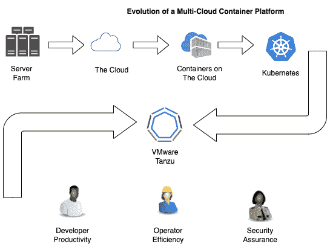

# 第一章：理解迁移到云平台的必要性

欢迎！如果您与在企业中大规模交付软件有任何关联，我们希望本书对您有所帮助。在本章中，我们将建立一个产品（如 VMware Tanzu）出现的背景。我们将通过回顾过去 20 年企业软件的发展历程，涵盖主要的里程碑、转折点和沿途出现的问题来进行阐述。

然后，在建立了必要的背景后，我们可以对 Tanzu 进行一个 10,000 英尺的概览，涵盖工具、好处和特性。最后，我们将为您提供成功的基础，介绍一些技术前提，确保您在参与本书中的任何实践内容之前已做好准备。

本章将涵盖以下内容：

+   运行软件供应链的挑战

+   云计算和容器的出现

+   Kubernetes

+   以结果为导向的方法

+   VMware Tanzu 的必要性

# 运行软件供应链的挑战

VMware Tanzu 是一个模块化的软件应用平台，能够原生运行于多个云平台，并且专注于提高开发者生产力、运营效率，以及默认的安全性等重要业务成果。如果您期待对 VMware Tanzu 进行详细的动手实践，本书不会让您失望。

然而，在深入了解平台的各个组件之前，了解一些历史和背景可能会有所帮助。如果您正在阅读这本书，那么很有可能您参与了软件的编码、设计、架构、运维、监控或管理。然而，您可能没有意识到，您正在参与一个*供应链*。

根据亚当·海斯在他的 Investopedia 文章《供应链：从原材料到订单履行》中所述，供应链“*指的是一个网络，其中包括组织、人员、活动、信息和资源，这些都涉及到将产品或服务交付给消费者*”。

当一款软件从开发者的工作站到达最终用户时，这就像是红牛和方便面从原料到生产设施，再到仓库，再到邻里超市的供应链过程。

每个供应链都有其独特的挑战，软件供应链也不例外。今天编写的大多数软件都由库和框架组成，包含数百万行开源软件，这些软件是由一些本质上匿名的人开发的，他们的动机并不完全明确。

大部分软件在从开源代码库到开发人员，再到源代码管理、构建打包、测试、预发布，最后进入生产环境的过程中会经历多次交接。此外，运行这些软件的基础设施通常也是开源的，全球的黑客社区不断寻找操作系统、网络协议实现和组成软件运行的公共工具中的漏洞。这个生态系统呈现出巨大的表面区域，容易发生各种问题。

关于软件供应链可能出现问题的实际案例，进一步阅读 2020 年 SolarWinds 事件或 2021 年 Log4Shell（CVE-2021-44228）漏洞的出现会很有帮助。作为 Tanzu 解决方案工程师，本书的作者亲眼目睹了软件供应链问题对金融、政府、电信、零售和娱乐等行业的影响。

# 云计算和容器的兴起

幸运的是，科技行业已经开始围绕一些关键技术形成共识，这些技术在解决一些问题方面取得了长足的进展。第一个就是通常所说的*云计算*。拥有大量技术资源的企业开始意识到，管理数据中心和基础设施并非其业务的主要焦点，这些任务可以由第三方公司更高效地完成，而这些公司将此作为其核心竞争力。

企业不再需要自建数据中心和管理硬件，而是可以租赁由专业团队管理和维护的技术基础设施，并且能够根据实时的业务需求灵活地扩大或缩小容量。这在多个层面上都是一次变革。这一变化的一个积极成果是互联网中易受攻击和过时软件的普遍提高。当漏洞暴露时，云服务提供商能够让*正确*的做法成为*最简单*的做法。例如，能够自动处理操作系统更新的托管数据库，以及默认情况下无法公开访问的对象存储。另一个成果是，随着基础设施管理被从开发者的工作职责中剥离，部署速度大幅提升。

随着*云计算*在企业软件世界中的普及，以及基础设施容量成为商品，这使得一些之前由于基础设施问题而被掩盖的隐患成为了焦点。开发人员可能在开发环境中运行得完美无缺，但一旦进入生产环境就会崩溃。这个问题变得如此普遍，以至于它诞生了一个编程幽默的子类别，叫做*它在* *我的机器上能运行*。

另一个问题是未使用的容量。搭建新的服务器基础设施变得如此简单，以至于应用团队仅为了将大规模（且昂贵）服务器集群搭建起来，结果这些服务器大部分时间几乎处于空闲状态。

## 容器

这就引出了*容器*的主题。许多应用团队会争辩说，他们需要自己的服务器集群，因为他们有一套独特的依赖关系需要在这些服务器上安装，而这些依赖关系与其他可能共享这些服务器的应用所需的库和工具发生冲突。最终，是两个技术流派的有幸交汇解决了这个问题，使得依赖关系差异极大的应用能够在同一台服务器上并排运行，彼此甚至不会察觉到对方的存在。

### 容器运行时

第一个流派是 cgroups 和内核命名空间的概念。这些是内置于 Linux 内核中的抽象，为进程提供了保证，确保其可以获得一定的内存和处理器容量，并且提供了它自己的进程空间、网络栈和根文件系统等虚拟化环境。

### 容器打包与分发

第二个问题是通过 API 打包整个 Linux 根文件系统，包括其独特的依赖关系，能够高效存储，解包到任意服务器上，并在与其他进程的根文件系统隔离的环境中运行。

当容器技术结合起来时，开发者发现他们能够搭建一组服务器，并在这组服务器上安全地运行多个异构应用，从而更加高效地使用云基础设施。

然后，正如向云迁移暴露了一组新问题，这些问题最终导致了容器生态系统的演变一样，这些容器也带来了新的问题，我们将在接下来的关于 Kubernetes 的部分中讨论这些问题。

# Kubernetes

当容器技术流行开来时，它们迅速得到了广泛应用，但它们并不是开发者们所希望的终极解决方案。服务器上的容器运行时通常需要在灵活性和安全性之间做出较大妥协。因为容器运行时需要与 Linux 内核紧密配合，用户通常需要提升权限才能运行容器。此外，运行容器的方式有很多种，其中一些与特定的云服务提供商紧密耦合。最后，虽然容器运行时让开发者能够启动他们的应用，但它们在对持久存储和网络等方面的支持上差异很大，通常需要手动配置和定制。

这些正是 Google 的 Joe Beda、Craig McLuckie 和 Brendan Burns 在构建 *Kubernetes* 时试图解决的问题。Kubernetes 不仅仅是一个在服务器上运行容器化应用程序的工具，它演变成了 Google 知名开发者倡导者 Kelsey Hightower 所称的“*构建平台的平台*”。与直接在服务器上运行容器相比，Kubernetes 提供了许多优势：

+   它提供了一个灵活的声明式 API，用于描述正在运行的应用程序的期望状态——例如，*9 个实例，每个使用 1GB 的内存和 500 毫核的 CPU，均匀分布在 3 个可用区*。

+   它处理了跨弹性服务器群集运行实例的任务，并配备了所有必要的网络和资源管理。

+   它提供了一种声明式方式，将云服务商特定的网络和持久存储实现暴露给容器工作负载。

+   它提供了一个框架，用于管理自定义 API，从而使 Kubernetes 可以管理任何任意对象。

+   它配备了面向开发者的抽象工具，如 Deployments（部署）、Stateful Sets（有状态集）、Config Maps（配置映射）和 Secrets（密钥），这些工具处理了许多常见的用例。

我们许多人曾认为，或许 Kubernetes 是能够最终解决所有问题的技术进步，但正如每次技术迭代一样，解决一组特定问题的方案往往会暴露出新一代的问题。

随着拥有大规模开发团队的公司开始使用 Kubernetes，这些问题变得越来越突出。以下是一些例子：

+   技术蔓延逐渐成形，每个团队以不同的方式解决同样的问题。

+   各个团队拥有自己的运维工具和流程，导致很难在不同应用程序之间扩展操作。

+   强制执行最佳实践涉及同步的人工流程，导致开发人员的工作效率下降。

+   每个云服务提供商的 Kubernetes 版本略有不同，这使得多云和混合云部署变得困难。

+   Kubernetes 部署的许多核心组件——比如容器镜像——只是将现有问题带到了新的层面，让开发人员比以前更快速、更广泛地部署容易受攻击的软件，实际上使问题变得更严重。

+   整个团队不得不专门成立，只为管理开发工具，并试图在众多应用程序中强制执行某种一致性。

+   在单一的 Kubernetes 集群上运行多个不同的应用程序需要大量的运维工作和投入。

可惜的是，Kubernetes 并不是我们希望的万灵药；它只是技术发展的又一次迭代，解决了一组问题，但不可避免地带来了新的一组问题。这就是 VMware Tanzu 团队登场的地方。

# 面向结果的方法

VMware 的 Tanzu 团队成立时，正值 Kubernetes 在企业中大展拳脚。凭借收购 Heptio，VMware 准备在该领域取得领导地位，Heptio 带来了深厚的 Kubernetes 知识和两位原始创造者。通过收购 Pivotal，VMware 还获得了精细的软件交付理念。Tanzu 团队继续交付一种深思熟虑且细致入微的基于 Kubernetes 的应用平台，专注于对客户来说重要的有意义的商业成果。

毫无疑问，许多成熟的 Tanzu 客户都面临着上一节提到的 Kubernetes 问题，但他们也关注一些关键成果，例如以下几点：

+   最大化开发人员的速度、生产力和影响力

+   最大化运维效率

+   在数据中心和多个云提供商之间无缝操作

+   默认情况下使软件更安全

这些是 Tanzu 为客户设定的成果，在这个过程中，他们也解决了许多人在使用 Kubernetes 时遇到的问题。

Tanzu 产品组合将采取以成果为驱动的方法，交付一个有明确意见的基于 Kubernetes 的云原生应用平台，优化运维效率、开发人员生产力、无缝的多云操作以及应用安全。这就是我们将在本书中讲解的平台。

# VMware Tanzu 的需求

对于那些拥有大量开发足迹并正在考虑或积极使用 Kubernetes 的公司来说，面临着两种阻力。首先，他们在跨多个团队大规模运行 Kubernetes 时遇到了各种问题。这些问题在本章 Kubernetes 部分的结尾处有列出。其次，这些团队在面临着使用技术交付有意义成果的压力。这意味着开发人员需要以最小的摩擦发挥出全部潜力，而运维人员则需要能够通过一套统一的工具在多个团队中实现规模化。这就是前一节中提到的以成果为驱动的方法。VMware Tanzu 是一个专门面向解决软件团队两方面需求的工具组合。

该图展示了 VMware Tanzu 如何作为基于 Kubernetes 的软件平台的下一次迭代以及集成工具包，帮助软件开发、运维和安全工程师实现世界级成果：

图 1.1 – VMware Tanzu 的背景

现在我们已经确定了促使 VMware Tanzu 诞生的背景，接下来我们准备描述该产品本身。

# VMware Tanzu 的功能、工具、益处和应用

这是一组结合了开源、专有和 **软件即服务**（**SaaS**）的服务，它们协同工作，帮助软件团队实现重要的成果。这些工具紧密集成，提供一个统一的工具集，专注于交付关键成果并大规模运行 Kubernetes。这些工具和应用程序可以分为三个大类。

## 构建和开发

这组工具帮助开发人员高效、可靠地开发和构建软件。包括 *VMware Tanzu 应用加速器*、*VMware Tanzu 构建服务*、*VMware 应用目录* 和 *VMware Tanzu API 门户*。

## 运行

这一组包含高效交付和持续运行应用程序的工具和应用程序。包括 *Harbor*、*Tanzu Kubernetes Grid* 和 *Tanzu* *应用平台*。

## 管理

最后一组工具包含用于管理应用程序和平台本身的工具。包括 *Tanzu Mission Control*、*VMware Aria 应用操作* 和 *Tanzu* *服务网格*。

# 前提条件

现在我们已经阐明了 VMware Tanzu 的*原因*和*内容*，接下来我们准备深入实际解决一些真实世界的问题。本书面向软件专业人士，假设你对一些工具和概念有所了解。如果你在这些领域中某些方面不太擅长，也不用担心，因为每一章都会一步步指导你。

## Linux 控制台和工具

你可以使用 Windows 机器跟随本书中的大部分章节，但经验表明，如果你使用 Mac 或 Linux 工作站，操作会更加顺畅。对于 Windows 用户，有很多选择，包括虚拟机、双系统启动 Linux 或使用基于云的虚拟机。本书假设你能熟练操作文件系统、查找和查看文件，并使用 Vim 或 nano 等编辑器进行编辑。

## Docker

本书重点讲解容器。与构建和运行容器的 API 交互的主要方式是使用 Docker CLI。你需要同时拥有 Docker 守护进程和 Docker CLI 来完成本书中的一些章节。假设你能熟练列出容器镜像并运行容器。

## Kubernetes

Kubernetes 是 Tanzu 产品组合的核心。本书假设你能在本地或公共云服务商上搭建 Kubernetes 集群。还假设你熟悉 kubectl CLI 来与 Kubernetes 集群进行交互。最后，你应该能够阅读 YAML 格式的 Kubernetes 清单。

## 工作站要求和公共云资源

本书中讨论的某些工具可以在你的工作站上本地运行，而其他一些则更适合在公共云上使用。还有一些工具只需要一个网页浏览器和一个已存在的 Kubernetes 集群。

如果你想在本地运行 Tanzu Kubernetes Grid，强烈建议至少配置 32GB 的内存。你可能会发现其他工具，如 Tanzu 应用平台或 Harbor，在由公有云提供商提供的 Kubernetes 集群上运行效果最好。我强烈建议使用这些提供商的内建预算工具，以确保你不会产生意外账单。

现在你已经知道了所需的条件，我鼓励你找到一个感兴趣的话题并深入研究。所有 Packt 出版的书籍都以独立的章节组织，你可以按顺序从头到尾阅读，也可以直接跳到你感兴趣的主题。

# 总结

在本章中，我们简要介绍了企业软件的历史，以及其演变如何为 VMware Tanzu 的出现奠定基础。接着，我们对 Tanzu 产品本身进行了高层次的概述。最后，我们介绍了一些技术要求，帮助你在动手练习中取得成功。

在一切准备就绪后，你可以自由跳转到任何一个引起你兴趣的章节；它们都是独立的，可以单独阅读。或者，如果你按顺序进行，我们将从软件开发过程的开始讲起。VMware Tanzu 的应用加速器是一个用于快速构建新应用的工具，它内置了所有企业标准和已批准的库，为你提供了更统一的应用组合，防止软件团队重复过去的错误。无论你以何种方式阅读本书，我们希望你享受这些内容，并祝你在实践中取得巨大成功。
