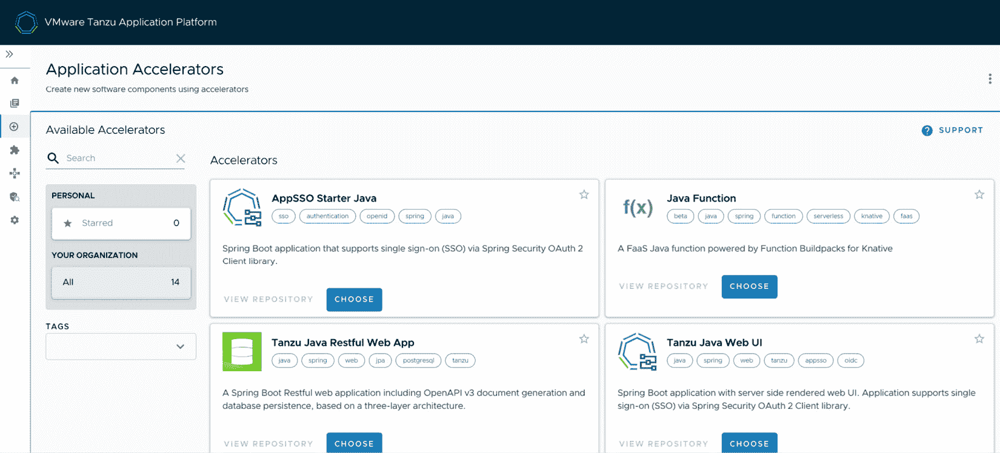
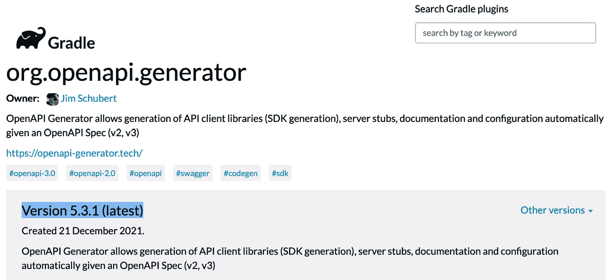

# 第二章：开发云原生应用

大型企业中常见的问题是技术的扩散。当开始一个新的开发项目时，通常会浪费大量的 day-0 时间来选择合适的技术，错误的决策可能会导致多年的运营问题。

本章将首先关注**VMware Tanzu 的应用加速器**，简称*App Accelerator*，这是一种解决新项目启动时 day-0 问题的工具。它允许开发者拉取已经预配置的应用模板，这些模板已经通过企业架构的审核，内置了所有企业的安全意见和保护措施，包含所有企业标准库，使用企业标准格式和布局，并允许配置常见属性（如 Git 仓库、数据库、API 模式等）。

接着，我们将介绍当前在企业中占据重要份额的几个开发框架：**Spring Boot** 和 **.NET Core** **with Steeltoe**。

在本章中，我们将覆盖以下主题：

+   *App Accelerator*所解决的业务需求

+   技术要求

+   *App Accelerator*概述

+   开始使用 *App Accelerator*

+   *App Accelerator*的高级主题

+   使用*App Accelerator*进行 day-2 操作

+   *Tanzu*旗下的云原生开发框架

# *App Accelerator*所解决的业务需求

在我们正式开始产品安装之前，让我们花点时间思考一下企业应用程序开发者的工作生活。假设*Cody*是我们组织中的一名开发者。

今天，Cody 被指派启动一项新服务，预计将为公司带来可观的收入。如果我们让他列出一些可能妨碍他交付该服务的因素，可能会得到如下列表：

+   为当前任务找到合适的应用框架

+   将必要的库导入到该框架中

+   导入所有企业要求的库

+   解决前两点中引入的任何版本不兼容问题

+   确认证所有企业安全标准在此项目中得到了遵守

+   使所有导入的库协同工作

+   研究并导入所有企业编码规范、项目结构、文档布局等

+   等待审查，确保所有标准都已被正确理解和实施

作为一名软件开发者，也许你会理解 Cody 的一些担忧：


图 2.1 – 开发者 Cody

这对 Cody 来说是一个巨大的负担，对新加入项目的开发者来说更是如此。大部分工作每次创建新项目时都必须重复，这必然导致配置漂移，因为不同的开发者对标准的理解不同，并且在写下第一行有价值的代码之前，这需要大量的时间和精力投入。

现在，让我们把视角转向企业架构师的角色。我们叫她 *Alana*。她的任务是优化开发者的价值实现时间，确定技术方向，创建并执行一套平衡一致性和安全性与开发者生产力和满意度的标准。她面临着一份与 Cody 类似的障碍清单，这些障碍阻止她最大化开发者的表现：

+   新开发者必须了解每个项目的独特性，才能开始提高生产力

+   手动检查每个组件，以确保遵守所有公司标准的过程会成为瓶颈

+   开发者忽略或无视他们不理解或选择不实施的标准

+   开发者使用过时且未打补丁的库

+   开发者使用未经审查和批准的技术和框架

+   由于 **软件开发生命周期** (**SDLC**) 中的重复性、繁琐且容易出错的步骤，开发者的工作满意度下降

+   她几乎无法对整个组合做出任何假设，以便能够进行集中管理

+   跨项目的问题，如自动扫描、部署或备份，因组合的异质性而受到阻碍

如果你更关注 *Ops*（运维）方面，也许 Alana 在这个可视化中提出的一些问题会引起你的共鸣：


图 2.2 – 我们的企业架构师 Alana

现在我们知道了为什么我们在这里，让我们深入探讨应用加速器的细节，并开始解决 Cody 和 Alana 的痛点。

# 技术要求

应用加速器是 **Tanzu 应用平台** (**TAP**) 的一个子组件，详见 *第八章*，*通过 Tanzu 应用平台提升开发者生产力*。要开始使用应用加速器，我们首先需要安装一个 Kubernetes 集群，然后在其上安装 TAP。你可以自由选择任何你喜欢的 Kubernetes 发行版。如果你需要关于搭建集群的指导，本书附录提供了多个启动 Kubernetes 的选项。

一旦你有了一个运行中的 Kubernetes 集群，你需要稍微跳转到 *第八章*，*通过 Tanzu 应用平台提升开发者生产力*，在那里我们会介绍 TAP 的安装。那一章讲解了一个更复杂的端到端用例，而本章仅关注应用加速器组件。

根据你的 Kubernetes 集群，TAP GUI 可能位于本地地址，如 `http://localhost:8081`，或者可能是你设置的入口域名，如 `http://tap-gui.example.com`。

当你打开浏览器访问 TAP GUI 时，你应该会看到类似于以下截图的界面：


图 2.3 – Tanzu 应用平台 GUI 截图

当你点击左侧菜单栏中的 **Create** 链接时，你将看到默认的应用加速器，这些加速器随 TAP GUI 一起提供：



图 2.4 – 空的创建部分截图

恭喜！如果你已经看到这里，你已经准备好开始使用 App Accelerator 了！

# App Accelerator 概述

App Accelerator 是 Alana 用来为 Cody 和他的同事们提供经过验证、批准、预配置的起点工具，支持他们选择自己喜欢的语言或框架。通过 App Accelerator，Alana 可以处理一些重复性、低价值的任务，如选择技术并确保其与其他应用程序和企业标准的互操作性和兼容性。这让 Cody 和他的开发同事可以将精力集中在交付具有业务价值的软件上。

App Accelerator 由多个 API 和接口组成，特别针对 Alana（架构师）或 Cody（开发者）这两种角色：


图 2.5 – App Accelerator 架构

Alana 从一个包含项目骨架的 Git 仓库开始。除了模板代码、预批准的库、以及标准化的文档和测试结构外，项目中还包含一个特别的 YAML 文件，按约定命名为 `accelerator.yaml`。这个文件包含了如何让模板应用的消费者（即 *accelerator*）自定义应用模板的细节。Alana 和 Cody 的 Kubernetes 集群中运行着一个 `accelerator.apps.tanzu.vmware.com/v1alpha1` 的控制器。Alana 部署了一个 `accelerator` 自定义资源的实例，控制器便知道了 Alana 的 Git 仓库，并使其对 Cody 可用：


图 2.6 – Accelerator CRDs

App Accelerator 向 Cody 展示了不同的视图。他打开了一个 UI，显示了所有可用的 accelerator 详情。Alana 提供了多种语言和框架，给开发者提供灵活性，可以根据需要使用合适的工具，而无需在选择库、确保兼容性和应对公司治理方面重新发明轮子。

Cody 可以通过标签搜索并预览各种加速器的内容。许多加速器会提示 Cody 输入某些信息，并根据输入定制项目。这是通过前述架构图中的**模板引擎**组件完成的。应用加速器提供了一套丰富的转换机制，使得像*你想使用哪种数据库？*这样的简单输入，能够生成复杂的配置选项和预先配置的库。其理念是尽可能将复杂性抽象化，以最大化重用性和开发者生产力。

现在我们已经理解了应用加速器的工作原理，接下来让我们开始安装自己的应用加速器。

# 开始使用应用加速器

如果你在本章开始时完成了技术要求部分的工作，你应该已经有了一个运行中的 Tanzu 应用平台实例，并准备开始探索应用加速器。

## 探索应用加速器

当我们安装应用加速器时，我们得到了一个开箱即用的加速器集合，帮助开发者快速启动企业级应用模板，如下所示：


图 2.7 – 已安装的应用加速器

你可以点击这些加速器中的**选择**按钮，跳转到一个页面，在那里你可以提供所需的任何参数，并探索项目模板和预览其文件。一旦选择了符合需求的加速器，你可以填写所需的参数，点击**下一步**和**创建**。此时，你将能够下载一个包含你下一个伟大应用初步框架的 ZIP 文件，其中集成了你公司的一切规范和最佳实践！

## 下载、配置和运行应用加速器

从 TAP GUI 中的 `hello-fun-tanzu-devsecops` 开始，并确保在 **deploymentType** 下选择了**Kubernetes 部署和服务**。然后，我们点击**下一步** | **创建** | **下载 ZIP 文件**。这将下载一个 ZIP 文件，你可以解压、在本地运行并部署到你的 Kubernetes 集群中。

使用你喜欢的压缩工具解压缩档案，然后在你喜欢的 IDE 中打开项目。从这里，你可以按照 `README.md` 中的说明在本地运行应用并将其部署到 Kubernetes。

一旦你熟悉了下载、配置和运行加速器，你就可以开始更高级的任务和话题了。

# 应用加速器的高级话题

假设你是前面提到的企业架构师或安全工程师，想要通过最新最优秀的技术为开发者同事们提供多种选择，同时在其中融入你所有关于技术持久性、最佳实践和安全性方面的辛勤经验。你将如何创建自己的应用加速器？接下来我们就来实现一个自定义的应用加速器。

我们首先登录 GitHub 并 fork 这本书的 GitHub 项目。访问[`github.com/PacktPublishing/DevSecOps-in-Practice-with-VMware-Tanzu`](https://github.com/PacktPublishing/DevSecOps-in-Practice-with-VMware-Tanzu)，然后点击`https://github.com/<your-username>/DevSecOps-in-Practice-with-VMware-Tanzu/tree/main/chapter-02/openapi-accelerator`。

这个加速器接受一个 OpenAPI 3.0 规范作为输入。然后它会输出一个能够围绕该规范构建整个 API 框架的项目，并且有一个 SwaggerUI 前端供你测试。这样的做法算不算最佳实践？

一旦你 fork 了加速器项目，我们需要告诉在 Kubernetes 中运行的控制器，我们有另一个应用加速器，希望使其可用。让我们将加速器克隆到本地：

```
git clone https://github.com/<your-username>/DevSecOps-in-Practice-with-VMware-Tanzu.git
```

接下来，导航到项目并在文本编辑器中打开`chapter-02/openapi-accelerator/accelerator-k8s-resource.yaml`文件。修改`spec.git.url`（高亮部分）属性，使其指向你 fork 的项目，如下截图所示：


图 2.8 – accelerator-k8s-resource.yaml（将其指向你 fork 的 Git 仓库）

然后，你可以通过应用`accelerator-k8s-resource.yaml`，告诉 App Accelerator 控制器你新增的加速器：

```
kubectl apply -f ./accelerator-k8s-resource.yaml
```

现在，你应该能够返回到 TAP GUI 的**创建**页面，刷新页面，看到你的 OpenAPI 3.0 Spring Boot 加速器已经准备就绪：


图 2.9 – 自定义 OpenAPI 3.0 Spring Boot 加速器在 TAP GUI 中

从这里，你可以使用加速器生成一个 Spring Boot 项目，定制化你的 OpenApi 3.0 规范：

1.  点击加速器的**选择**按钮。

1.  给它起个聪明的名字。

1.  使用默认的（提供的）*OpenApi 规范*，或者粘贴你自己的一个。这里有一个不错的：[`raw.githubusercontent.com/PacktPublishing/DevSecOps-in-Practice-with-VMware-Tanzu/main/chapter-02/petstore.yaml`](https://raw.githubusercontent.com/PacktPublishing/DevSecOps-in-Practice-with-VMware-Tanzu/main/chapter-02/petstore.yaml)：


图 2.10 – 插入自定义 API 规范后探索我们的加速器

1.  点击**下一步**、**创建**，然后**下载** **Zip 文件**。

1.  解压项目并进入该目录。

1.  构建 Spring Boot 项目并运行应用程序：

    ```
    $ chmod +x gradlew && ./gradlew openApiGenerate  # (this will create a maven project in-place, use gradlew.bat on Windows)
    ```

    ```
    ...
    ```

    ```
    $ mvn spring-boot:run
    ```

1.  在浏览器中访问`http://localhost:8080`：


图 2.11 – 我们的自定义 OpenAPI 3.0 API 在 Swagger UI 中

就这样！通过简单的下载，我们已经拥有了一个功能完备的 REST API 和 Swagger UI，准备好开始实现业务逻辑。我们可以立即开始交付价值，因为所有的企业治理、库和约定都从项目一开始就已经方便地集成进来了。

恭喜！如果你已经完成了这些步骤，你已经为你的开发人员提供了经过预审核、预验证的安全软件框架，允许他们跳过繁琐的行政工作，直接开始用软件交付真正的价值。

然而，软件始终在变化，一个上周最新、稳固的软件框架，本周可能已经变成了**关键漏洞**和**暴露**（**CVE**）。

现在让我们继续进行 Day-2 操作，看看如何保持我们的应用加速器更新和修补。

# Day-2 操作与应用加速器

在软件开发中，将某个东西部署到生产环境通常是简单的部分。保持软件更新并进行修补，且尽量减少对用户的干扰，才是你大部分时间的工作内容。应用加速器是专为 Day 2 操作而设计的。

结果表明，我们的 OpenAPI 应用加速器中的组件版本已经过时了。让我们快速更新并修补我们的加速器。

首先，让我们找到本地的 `openapi-accelerator` 项目副本。在你喜欢的编辑器中打开 `build.gradle`。注意到 `org.springframework.boot` 和 `org.openapi.generator` 的依赖版本不是最新的，因此可能包含 bug 或者已知漏洞。注意 `org.springframework.boot` 的版本为 `2.5.6`，而 `org.openapi.generator` 的版本为 `5.2.1`：


图 2.12 – 我们的 build.gradle 文件，其中的 Spring Boot 和 OpenAPI Generator 版本过时

首先，让我们访问 [`start.spring.io`](https://start.spring.io) 以查看最新的 Spring Boot 版本。在撰写时，它是 2.6.2：


图 2.13 – 从 start.spring.io 获取的最新 Spring Boot 版本

我们还可以从 [`plugins.gradle.org/plugin/org.openapi.generator`](https://plugins.gradle.org/plugin/org.openapi.generator) 获取最新版本的 `openapi` 插件。如下面的截图所示，撰写时其版本为 **5.3.1**：



图 2.14 – org.openapi.generator 插件的最新发布版本（5.3.1）

现在我们已经获得了最新的版本号，让我们更新 `build.gradle` 文件：


图 2.15 – 在 build.gradle 中更新插件块以使用最新版本

然后，我们只需*git-push*更新后的加速器，几分钟后，我们可以在 UI 中查看并看到更新后的依赖关系。未来任何使用该加速器的人都将获得最新版本的`openapi`插件和 Spring Boot。

现在，是时候换个方向了。App Accelerator 可以帮助你在许多流行的开发框架中获得一个良好的开端，那么这些框架是什么呢？哪些框架更适合企业应用呢？下一节将介绍两种特别适合企业应用的开发框架。

# Tanzu 旗下的云原生开发框架

如前几节和章节所提到的，Tanzu 产品组合并不是凭空出现的。它是多年来工作中深思熟虑的自然表达，帮助了世界上一些最大、最著名的公司培养其软件能力。这段经验的一个成果是学会了哪些开发框架能够最大化开发者的生产力，同时减少繁琐、单调和不良实践。

到目前为止，我们已经成功地部署、更新、下载并实现了一个基于应用程序加速器的简单 API。我们的示例使用了 Spring Boot。我们是如何选择 Spring Boot 作为 API 底层应用框架的呢？

## Spring 框架和 Spring Boot

许多成功的 Tanzu 客户选择的框架是 Spring 框架。这一点得到了 Spring Initializr 在[`start.spring.io`](https://start.spring.io)启动的数百万个应用程序的验证，以及像 Snyk JVM Ecosystem Report 2020 这样的企业调查，报告显示 60%的企业正在使用 Spring Boot（[`snyk.io/blog/spring-dominates-the-java-ecosystem-with-60-using-it-for-their-main-applications/`](https://snyk.io/blog/spring-dominates-the-java-ecosystem-with-60-using-it-for-their-main-applications/)）。

这里有一张截图，展示了 Spring 直接提供的一些功能：


图 2.16 – Spring 能做什么（spring.io）

Spring 框架在部署方式上非常灵活。Spring Boot 是一种运行 Spring 框架应用程序的有偏见的方式，使得它们能够自包含并*直接运行*。Spring Boot 为 Spring 框架开发者提供了一些非常有用的工具，以便运行自包含的应用程序，使其非常适合微服务。它还内置了合理的默认设置和适用于最常见场景的建议。Spring Boot 为你提供了以下功能：

+   可供选择的几个最佳 Web 框架

+   独立可运行的应用程序，完美适合容器和 Kubernetes

+   用于常见用例的有偏见的*起步器*

+   在可能的情况下，自动配置所有库

+   现实生产中的功能，如度量和 Kubernetes 健康检查

关于 Spring 框架和 Spring Boot 有整本书籍，所以我们无法在这一章中详尽讨论。相反，我会提供一些链接，供你进一步探索：

+   Mark Heckler 的*Spring Boot: Up and* *Running*：[`www.oreilly.com/library/view/spring-boot-up/9781492076971/`](https://www.oreilly.com/library/view/spring-boot-up/9781492076971/)

+   Spring 开发者快速入门：[`spring.io/quickstart`](https://spring.io/quickstart)

+   Spring 指南和教程：[`spring.io/guides`](https://spring.io/guides)

+   Josh Long 的*一场美丽的* *播客*：[`soundcloud.com/a-bootiful-podcast`](https://soundcloud.com/a-bootiful-podcast)

+   SpringDeveloper YouTube 频道：[`www.youtube.com/user/SpringSourceDev`](https://www.youtube.com/user/SpringSourceDev)

或许你在想，*开源的 Spring 框架与 Tanzu 有什么关系？* 很好的问题！其中，Tanzu 产品组合中的许多产品是开源 Spring 项目的企业版。它们包括以下内容：

+   Spring Cloud Gateway ([`spring.io/projects/spring-cloud-gateway`](https://spring.io/projects/spring-cloud-gateway))

+   Spring Cloud Data Flow ([`spring.io/projects/spring-cloud-dataflow`](https://spring.io/projects/spring-cloud-dataflow))

+   Spring Cloud ([`spring.io/projects/spring-cloud`](https://spring.io/projects/spring-cloud))

还与云服务提供商合作，推出了端到端、垂直集成的 Spring 平台，例如 Azure Spring Cloud ([`tanzu.vmware.com/azure-spring-cloud`](https://tanzu.vmware.com/azure-spring-cloud))。

尽管 Spring 框架极为强大且内容丰富，但它主要面向 Java 开发者。如果你是一个拥有 Microsoft 技术栈背景的开发者呢？我们接下来会讨论这个问题。

## Steeltoe 框架

当然，并不是每个企业软件公司都有职业 Java 开发者。目前支撑现代世界运行的数百万行代码是用 Microsoft .NET 技术栈编写的。*Steeltoe*是一套非常符合 Spring Boot 精神的库，它允许.NET 开发者可靠且高效地交付云原生微服务应用。如果你有兴趣最大化在.NET 上交付企业软件的开发者的生产力，我强烈建议你试试它：

[`old.dotnetfoundation.org/projects/steeltoe`](https://old.dotnetfoundation.org/projects/steeltoe)

就这样！通过 Spring 和 Steeltoe 项目，我们涵盖了将吸引绝大多数企业开发者的应用框架和工具集，使他们更高效、更少受到技术债务和错误决策的影响，最重要的是，他们对工作更有满足感，能够通过软件交付经济价值。

# 摘要

在持续追求最大化开发者生产力，或者作为技术领导者或架构师最大化团队生产力的过程中，我们需要确保第 0 天做对每一件事。在第 0 天做出的错误决策或开发失误，将会在多年后继续带来痛苦的后果。

避免这些代价高昂的第 0 天错误的最佳方法是从我们知道过去已经成功的起点开始，并以此作为未来开发的跳板。VMware Tanzu 的应用加速器、Spring Boot 和 Steeltoe 框架为这些起点提供了简单、可重复的基准，使团队从一开始就能够取得成功。

此外，生产级的企业级开发框架并不是一夜之间就能出现的。像 Spring 和 .NET + Steeltoe 这样的框架，经过数十年的经验积累，已经变得成熟稳健。最好的应用加速器使用最优秀的基础框架，而它们都是 Tanzu 产品组合的一部分。

通过本章的学习，你现在已经掌握了部署和使用应用加速器的技能，这些加速器可以帮助你确保第 0 天做对每一件事——而且，你已经借助行业标准的应用框架迈出了成功的第一步。

既然你已经解决了通过一个出色的应用程序顺利启动的问题，那么接下来让我们来了解如何将这个应用程序转化为能够在像 Kubernetes 这样的容器平台上运行的格式。就像项目初期的第 0 天充满了风险一样，创建精简、安全和可重复的容器镜像也会带来一系列问题。这些问题正是我们将在下一章讨论的内容，主题是 *Tanzu* *Build Service*。
