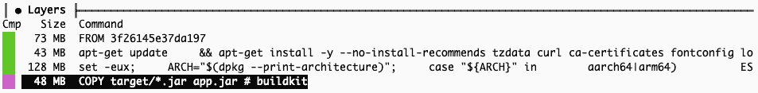
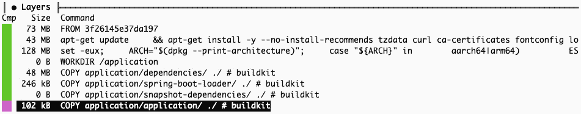
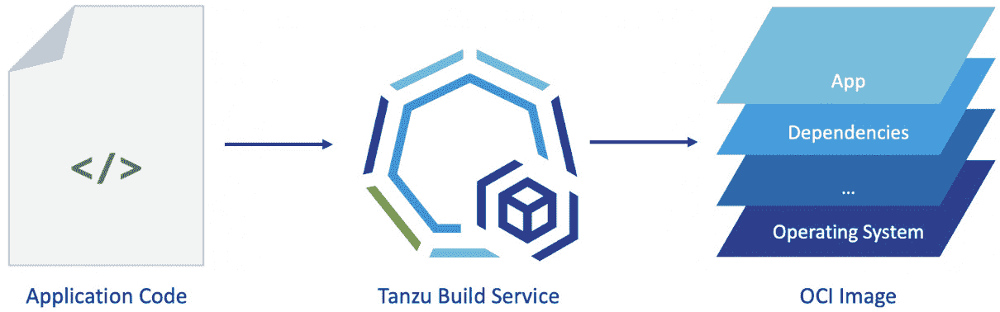
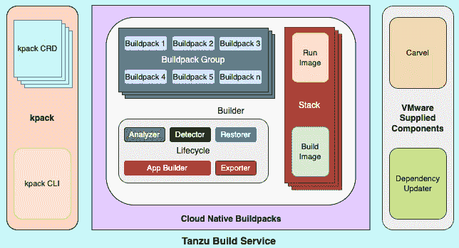

# 第三章：使用 Build Service 构建安全的容器镜像

在上一章中，我们讨论了 VMware Tanzu 的应用加速器如何帮助组织以统一、高效的方式构建绿地应用。这为构建基于预定义模板的云原生应用打下了良好的基础。这些模板帮助开发人员专注于业务逻辑，从而为组织带来收入。

绿地和云原生应用

绿地（Greenfield）是建筑行业的术语，指的是未开发的土地。在 IT 领域，绿地指的是从零开始开发的软件项目，而不是基于现有程序构建的软件项目。它通常与*棕地（Brownfield）*相对，后者描述的是从现有程序构建的软件。参考：[`techterms.com/definition/greenfield`](https://techterms.com/definition/greenfield)。

云原生应用，如你所料，是为了充分利用云计算而编写的。它们的特点是使用容器、服务网格、微服务、不变基础设施和声明式 API 等技术。参考：[`github.com/cncf/toc/blob/main/DEFINITION.md`](https://github.com/cncf/toc/blob/main/DEFINITION.md)。

然而，要从容器平台（如 Kubernetes）中真正受益于云原生应用，我们需要将这些应用作为容器来运行。为了以容器形式运行它们，我们需要为这些应用构建容器镜像。虽然有多种方式可以为我们的应用构建容器镜像，但业界最流行的方法之一是使用称为 Dockerfile 的配置文件来构建。**Dockerfile** 包含了应用程序所需构建的容器镜像的定义、要求和属性。尽管使用 Dockerfile 是构建容器镜像的流行方法之一，但它并不总是最优的选择。

本章将深入探讨这一概念，并涵盖以下主题：

+   为什么选择 Tanzu Build Service？

+   解锁 Tanzu Build Service

+   开始使用 Tanzu Build Service

+   Tanzu Build Service 的常见日常活动

那么，让我们开始吧。

# 技术要求

在开始安装**Tanzu Build Service**（**TBS**）之前，需要满足一些技术要求。这些要求将在本章*开始使用 Tanzu Build Service*部分的开头进行详细介绍。不过，你可能不需要它们来理解 TBS 带来的好处。让我们开始了解它吧。

# 为什么选择 Tanzu Build Service？

在为应用程序构建容器镜像时，存在各种业务、技术和安全挑战。在大规模企业中进行此操作时，挑战会变得更加复杂。让我们了解这些挑战是什么，以及 TBS 如何解决这些问题。

## 提高开发者生产力

如前所述，构建容器镜像的最流行方法之一是使用 Dockerfile。在大多数情况下，应用程序团队负责构建和维护这些 Dockerfile。这些 Dockerfile 包含了如基础容器操作系统及其版本、应用程序包（如 Java 应用程序的 JAR 文件）、环境变量以及有用的库及其版本等详细信息。

JAR 文件

**Java ARchive**（**JAR**）文件是包含应用程序的一个打包文件，包含已编译的源代码文件、配置文件和应用程序所需的外部库。JAR 文件可以是一个支持库，也可以是一个可以在**Java 运行时环境**（**JRE**）中运行的应用程序包。

开发人员对自己的应用程序了解最深。因此，允许他们定义应用程序的 Dockerfile 内容是有道理的。但与此同时，构建和管理 Dockerfile 是开发人员的额外负担。开发人员应该将所有时间都用在为应用程序构建更多有商业影响的功能上。你可能会争辩说，构建和更改这些 Dockerfile 并不是一个频繁的任务。此外，你还可以围绕构建容器创建一些自动化流程来减少工作量。然而，这种内部自动化会带来其他维护上的挑战。它并不能消除应用程序团队所需要的时间。这不仅仅是开发人员花时间创建或更新 Dockerfile 的问题。他们还需要花时间去研究和决定其中的内容。最后，这些 Dockerfile 必须保持最新，以反映其中引用的库的最新安全补丁。这确保了运行中的容器拥有最佳的安全态势。这种持续不断的维护消耗了大量开发人员的生产时间，进行的却是无生产性的活动。

容器镜像中的层

一个应用程序的最终容器镜像可能是多个较小镜像的组合，这些镜像像层一样堆叠在一起，提供可重用性、分离性和易用性。

为了应对这些挑战，Pivotal Software Inc.（于 2020 年被 VMware Inc.收购）与 Heroku 合作，启动了一个名为**buildpacks.io**的开源项目，该项目隶属于**Cloud Native Computing Foundation**（**CNCF**）。我们将在本章稍后详细讨论这个项目。TBS 是一个商业支持的打包方案，包含 buildpacks.io 以及其他一些开源工具。

TBS 通过提供一个完整的自动化引擎来应对这一挑战，当您提供应用程序代码或构建的工件时，它可以构建容器镜像。作为输出，TBS 会为应用程序生成一个符合 OCI 标准的容器镜像。这个镜像可以部署到 Kubernetes 或任何其他符合 OCI 标准的容器编排平台。通过 TBS，开发人员无需再负责构建和维护容器镜像，减少的责任帮助开发人员将注意力集中在对业务更为重要的部分。

什么是 OCI？

**开放容器倡议**（**OCI**）是由 Linux 基金会设立的标准，描述了容器镜像的特性，这些镜像可以由各种容器镜像构建工具实现，并被像 Kubernetes 这样的不同容器调度平台理解。所有主要的容器平台，包括 Kubernetes，都支持符合 OCI 规范的容器镜像。

TBS 支持包括 Java、.Net、Python、Go、NodeJS 等多种语言。

## 减少定制自动化

组织通常会创建**持续集成**（**CI**）流水线来构建应用程序的容器镜像。这些流水线通常使用 Jenkins 等工具开发，并且大多数使用 Python 或 Shell 脚本等语言编写。组织可能需要先投入资源开发此类定制自动化流程，然后还需要持续维护。而且，缺乏关于这些定制自动化流程的良好文档，使得维护变得非常困难。因此，这种依赖人员的自动化在相关人员离开组织后，维护起来就成了一个大问题。此外，如果这些人员能够投入到更具业务价值的任务中，组织可能会获得更好的业务成果，而不是仅仅参与这种低价值的工程工作。

TBS 也有助于解决这一挑战。它在容器镜像构建过程中实现了高度自动化。虽然这不会替代整个 CI 流水线，但它通过覆盖构建容器镜像所需的各个步骤并实现完全自动化，能够显著简化这一流程。

## 容器构建过程的标准化

在大型开发团队的企业中，往往可以看到许多部门之间的孤岛（silos）。这些孤岛有各自的工具和流程。这可能会导致组织在多个层面上浪费宝贵的资源，例如重复劳动。这种重复可能体现在人员为相似的结果所花费的时间、工具的许可证费用以及自动化使用的基础设施。这可能会引发一个全新的问题——缺乏标准化。非标准化的做法会导致透明度、治理和安全态势的下降。在构建容器镜像时，缺乏标准化可能会证明是一个非常昂贵的错误，导致安全风险暴露。这是由于使用未经批准的库，或者没有及时修补这些库。当不同的团队有不同的容器镜像构建方法时，他们可能会遵循不同的做法。他们可能使用不同的容器操作系统、开源工具、第三方库及其版本。这使得应用全公司范围的标准化变得非常困难。强制执行的标准不应影响不同团队的生产力和选择自由。

TBS 通过两种方式解决了这个问题。首先，它包括由 VMware 提供的集中式软件库，形式为构建包（buildpacks）和栈（Stacks）。在这里，**构建包（buildpacks）**包含了应用在容器中运行所需的所有库，包括应用程序运行时环境，如**Java 运行环境（JRE）**以及中间件，如 Tomcat 服务器。另一方面，**栈（Stacks）**包括不同版本的容器操作系统。其次，TBS 提供了一个标准化的容器镜像构建自动化引擎。因此，当组织使用 TBS 构建容器时，它会自动在容器构建过程中实现标准化。这种标准化体现在自动化要求和镜像中支持的应用程序内容上。

TBS 不仅帮助公司标准化容器构建过程，还提升了整体的安全态势，正如以下部分所述。

## 更强的安全态势

安全暴露是大多数成熟组织在云转型过程中面临的主要问题。大多数云原生应用程序都作为容器部署在公共或私有云平台上，以获得多个好处。容器其实就是运行应用程序的小型虚拟机。至关重要的是，这些容器必须使用安全的组件来构建，确保不含有安全漏洞。然而，今天的安全库版本可能明天就会被发现存在漏洞，因为常常会看到新安全漏洞的发布，这些漏洞可能影响到所有操作系统和库，而这些操作系统和库可能会被用于容器镜像中。相应的组织会发布新版本，以解决这些**常见漏洞和暴露**（**CVE**）。然而，用户组织需要自行获取这些软件的新版本，并用它们来重新构建受影响的容器镜像。这类容器镜像重建工作可能会带来两个大痛点。第一个问题是，当有多个开发团队管理着数百个容器化应用程序时，寻找受影响的应用程序变得非常困难。这样的识别和修复过程可能需要数周时间，使得这些应用程序在此期间容易受到攻击。与此同时，要让所有应用团队在同一时间使用新版本软件重建其应用程序的容器镜像也是非常困难的。由于应用团队需要处理他们的产品待办事项和优先级，修补工作通常会延迟。而历史一再证明，大多数重大软件相关的安全漏洞都是由于长时间没有修补的软件组件导致的。

TBS 可以通过其集中资源库和基于该资源库的容器镜像重建自动化，极大地加速受影响容器镜像的 CVE 修补。当库中的受影响组件发布新的 CVE 补丁时，VMware 会发布包含该漏洞修复的仓库组件的新版本（可以是构建包或栈）。TBS 使用内部容器镜像及其关联依赖项的映射来识别受影响的应用程序容器镜像。因此，当 VMware 在集中仓库中发布新组件版本来修复任何 CVE 时，TBS 会立即触发使用已修补版本的受影响应用镜像的修补。这样的自动化镜像重建可以在几小时内完成数百个应用的修补，而无需 TBS 的话可能需要数周时间。这可能是考虑使用 TBS 等工具的最重要原因之一。应用程序、其容器镜像和其中使用的相关软件组件的这种映射为安全团队提供了所需的透明度和可审计性。使用 TBS，我们可以快速为任何由 TBS 管理的应用生成**物料清单**（**BOM**）。BOM 是一份详细报告，列出在相应容器镜像中使用的所有组件及其版本。它极大地简化了容器化环境的安全审计。

## 优化的网络带宽和存储利用率

如前所述，符合 OCI 标准的容器镜像是由多个较小的镜像集合构成，这些小镜像包含了构成最终容器镜像所需的不同组件。这些层包括应用代码、配置、第三方库和操作系统。像 Docker Hub 和 Harbor 这样的容器镜像仓库会将这些层分开存储，并维护哪些镜像层依赖于其他镜像层的映射关系。因此，当你从容器镜像仓库拉取特定的容器镜像时，仓库会将所有依赖的容器镜像层一起推送过来。由于这个原因，当应用发生变化时，只有受影响的层会通过网络传输到容器仓库，所有其他未受影响的镜像层将不会通过网络传输。这使得镜像的推送和拉取操作更加高效，同时也有助于减少容器镜像仓库的存储需求，因为未改变的层会被重复使用。然而，为了充分利用这些层，你应该在镜像构建过程中遵循一定的规范。如果 Dockerfile 的作者不够谨慎，可能会导致镜像层的数量比最优情况要少。以下的图示展示了同一应用的容器镜像结构，它们的层数不同，且是通过两种不同的 Dockerfile 构建的。这些快照是使用名为 **Dive** 的开源工具拍摄的 ([`github.com/wagoodman/dive`](https://github.com/wagoodman/dive))，该工具可以详细显示容器镜像的各个层及其内容：



图 3.1 – 使用四层构建的演示 Java 应用的容器镜像

如你所见，*图 3.1* 仅有四层，而 *图 3.2* 则有八层，尽管最终镜像的总大小几乎相同。构建容器镜像有多种方法，这些方法可能会导致相同应用代码产生不同的结果：



图 3.2 – 使用八层构建的相同演示 Java 应用的容器镜像

当开发人员没有足够的意识，或者没有企业级的指南来指导如何构建应用容器镜像时，每个团队可能会最终形成自己的标准和实践。由于缺乏知识和控制，大型组织可能会拥有多个不理想的应用容器镜像，这可能导致每次容器镜像推送和拉取操作时，浪费网络带宽和存储空间。

另一方面，TBS 使用一个广受好评的 **Cloud Native Computing Foundation** (**CNCF**) （[`cncf.io`](https://cncf.io)）认证项目，名为 **Cloud Native Buildpacks** (**CNB**) （[`buildpack.io`](https://buildpack.io)），作为其底层工具，当使用此工具构建应用容器镜像时，它通过多个较小的层来构建容器镜像。它提供了一种组织级标准化方法来构建容器镜像，同时具有非常高的资源效率，并带有前述的其他好处。以下是一个高层次表示，展示 TBS 如何执行这一操作：



图 3.3 – TBS 如何通过层级构建容器镜像的高层次表示

上述图示展示了 TBS 如何获取一些应用代码，执行内部各种操作，并创建一个最终符合 OCI 标准的应用容器镜像，该镜像包含多个较小的层。

总的来说，TBS 有助于提升开发者生产力，减少学习曲线，降低运维负担，并增强安全性，同时提供其他若干构建安全容器镜像的好处。所有这些都将帮助你加速云原生应用的旅程。在了解了使用 TBS 这类工具的不同好处之后，接下来让我们深入解锁它，了解它的架构。我们将深入探讨 TBS 所包含的所有不同组件。

# 解锁 Tanzu Build Service

如前所述，TBS 建立在两个主要开源项目之上：CNB 和 kpack。下图展示了 TBS 的整体包装结构：



图 3.4 – Tanzu Build Service 的构建模块

如前图所示，kpack 包含引擎和 CLI，而 CNB 包含诸如 Builder、buildpacks 及其组、堆栈、构建和运行镜像以及生命周期过程等内容。此外，还有一些 VMware 提供的组件，提供额外的功能，这些组件已打包在 TBS 中。让我们详细了解这些组件。

## 云原生构建包

CNB 的概念来源于 Cloud Foundry 中构建包的概念，Cloud Foundry 是另一个用于云原生应用的容器编排平台。Cloud Foundry 中的构建包已经证明是经过多年考验的工具，已有十多年历史。Cloud Foundry 中的构建包用于扫描应用源代码，根据所使用的技术和语言确定应用需求，将所有所需的依赖项与应用程序包一起打包，并创建一个离线容器，称为**droplet**。这些 droplet 是包含所有运行所需内容的大型二进制对象，用于在 Cloud Foundry 平台上作为容器运行对应的应用程序。尽管 droplet 拥有稳定的记录，但它们也存在一些局限性，具体如下：

+   Cloud Foundry 的构建包生成的 droplet 非常大，因为它们包含应用程序所需的所有内容。它们不像现代的 OCI 合规容器镜像那样有层的概念。因此，应用程序或其依赖项的每一个小变化都会重新创建一个新的重型 droplet。这些 droplet 需要更多存储空间，因为它们不仅仅包含差异，还包含完整的应用程序包。由于这个原因，使用 droplet 在 Cloud Foundry 中部署容器的过程比在如 Kubernetes 等 OCI 兼容平台上使用 OCI 镜像部署更新版本的应用程序要慢。这种容器调度的慢速会影响应用程序在扩展或重新部署时的部署时间。

+   Buildpack 项目仅设计用于 Cloud Foundry，因此无法在只支持 OCI 合规容器镜像的 Kubernetes 等平台上使用。

+   Cloud Foundry 的构建包在扩展性或定制化方面非常有限。它们不能像层或插件一样添加新的更改，而必须完全打开并修改。

+   Cloud Foundry 的构建包在构建新 droplet 时较慢，因为它们未能最优化使用缓存资源。

鉴于所有这些局限性，并且利用构建包概念在更广泛和流行的平台（如 Kubernetes）中的潜力，两个软件公司 Heroku 和 Pivotal（2019 年被 VMware 收购）携手合作，宣布共同开发一个新的开源项目 CNB，该项目保留了原始 Buildpack 项目的优点，同时解决了它的弱点。基于这个背景，我们来详细讨论 CNB 的结构。

以下是 CNB 中一些重要的概念和术语，它们是 TBS 的关键构建模块。

### 构建镜像

这是一个基础容器操作系统层，用于创建构建者的容器镜像。构建容器的生命周期较短。它执行构建应用容器镜像的生命周期过程，完成后会被终止。

### 运行镜像

这是一个基础容器操作系统层，用于创建应用程序的容器镜像。这是 TBS 的主要成果。所有由 TBS 构建的特定应用程序容器镜像都使用此镜像作为基础容器操作系统层。

### 堆栈

这是一个配置实体，包含有关构建镜像的详细信息，并运行将在容器镜像构建过程中使用的镜像风味。作为包的一部分，TBS 提供了四种不同的堆栈风味，包含不同风味的构建和运行操作系统。这些操作系统层可以是薄层或厚层，具体取决于需要使用它们的应用程序的要求。

### 构建包

这是一个可执行文件集合，检查你的应用程序代码并确定是否应用构建包（buildpack）到该应用程序，并因此应该成为结果应用程序容器镜像的一部分。例如，Java 应用程序有一个构建包，它检测应用程序代码或工件中是否存在 Java 特定文件，然后决定应用程序是否需要支持以作为 Java 应用程序运行。在 TBS 架构中，这些构建包存储在容器注册表中，作为容器镜像。

### 构建包组

这是一个构建包集合，通常一起用于构建特定类型应用程序的容器镜像。构建包组中的构建包可以是强制性的，也可以是可选的，具体取决于其使用场景和应用程序的需求。例如，**Java 运行时环境**（**JRE**）、Maven、Gradle、Tomcat 服务器和 Jetty 服务器的构建包可能都属于同一组，因为它们都是与 Java 应用程序相关的依赖项。然而，JRE 的构建包对于 Java 应用程序来说是必须的，而前述的其他构建包则属于可选类别，因为应用程序可能需要也可能不需要它们。针对不同类型应用程序，还有其他多种构建包组，如 Python、.Net、NodeJS 等。

### 生命周期

这决定了构建包的应用，并协调它们的执行。生命周期过程包含多个组件，它们执行不同阶段。在所有阶段结束后，我们将得到一个符合 OCI 标准的最终容器镜像。让我们回顾一下这些生命周期组件：

+   **分析器**：该工具检索并检查在镜像构建过程中需要的所有文件，并由构建包使用。它还会检查构建所需的所有镜像是否在 TBS 使用的容器注册表中可以访问。通过快速检查依赖关系，如果某些内容丢失，构建过程会迅速失败，而不是在构建过程后期才发现问题。

+   **检测器**：它检查在构建过程中，哪个构建包组适用于该应用程序。它还会按特定顺序获取所有可用构建包组的列表。然后，它依次检查每个组的适用性，直到第一个组满足所需的标准。检测器随后创建一个执行计划，以执行容器镜像构建过程，作为最终的产物。

+   **恢复器**：它根据从之前的容器构建过程缓存中选择的构建包组，恢复所有所需的依赖镜像层，这些缓存是由相同的镜像层放入的。此阶段减少了构建时间和网络流量，以便传输频繁使用的镜像。

+   **应用程序构建器**：它将应用程序源代码转化为可执行的工件，以便可以在容器内打包执行。例如，这一阶段将 Java 应用程序的源代码转换为包含已编译类文件的 JAR 文件，作为可执行的工件。该阶段的应用可能是可选的，具体取决于应用程序提供的工件，甚至可能根据技术需求来决定。例如，如果构建过程中已经提供了一个准备好的 Java 应用程序 JAR 文件，而不是源代码，那么就不需要为该应用程序准备构建，这一阶段可能会被跳过。

+   **导出器**：它创建最终的符合 OCI 标准的容器镜像文件。它还准备一份报告，包含容器镜像中所使用的组件及其版本的 BOM（物料清单）。最后，它将容器镜像推送到目标注册表。

### 构建器

要构建一个应用程序的容器镜像，TBS 需要在 Kubernetes 上部署一个临时容器，执行之前描述的生命周期组件，以创建最终的容器镜像。构建器是一个容器镜像，它部署这个容器，其中包含生命周期进程的可执行文件，以及构建包组和构建镜像的列表。

## kpack

kpack ([`github.com/pivotal/kpack`](https://github.com/pivotal/kpack)) 是由 Pivotal 发起的开源项目，现在由 VMware 积极维护。kpack 提供了一种在 Kubernetes 平台上使用 CNB 的方式。kpack 使用一些 Kubernetes **自定义资源定义**（**CRDs**）将自己部署为在 Kubernetes 上运行的工具。因此，kpack 是一个在 Kubernetes 上运行的工具，利用 CNB 构建符合 OCI 标准的容器镜像。

自定义资源定义（CRDs）

Kubernetes 有几个现成的 API，称为资源。此类资源的一些示例包括 Pod、Node、Deployment、Service、ReplicaSet 等。尽管 Kubernetes 提供了许多现成的资源，但它是一个非常可扩展的平台，允许添加更多自定义资源。此类自定义资源被称为 CRD。你可以在这里了解更多关于 CRD 的信息：[`kubernetes.io/docs/concepts/extend-kubernetes/api-extension/custom-resources/`](https://kubernetes.io/docs/concepts/extend-kubernetes/api-extension/custom-resources/)。

kpack 有两个主要组件，如 *图 3.4* 所示：

+   kpack Kubernetes CRD 帮助使用 CNB 并定义容器镜像规范。

+   kpack **命令行接口**（**CLI**）提供了所需的用户界面，以便使用 kpack 资源。kpack CLI 提供了通过 kpack 创建和管理容器镜像构建规范的方法。

### TBS 使用的 kpack CRD 对象

尽管 kpack 是 TBS 的内部组件，但以下是 TBS 使用的一些关键 kpack CRD 对象：

+   `Image` 对象引用应用程序源代码或包的位置、构建过程的运行时详细信息，以及存储构建镜像的容器注册表详细信息。

+   **ClusterStore**：它包含以容器镜像位置形式引用的 buildpacks。

+   **ClusterStack**：它包含以构建镜像和运行镜像形式引用的操作系统层，以及它们的容器注册表位置。

+   `ClusterStore` 和 `ClusterStack` 的组合。`ClusterBuilder` 对象还定义了构建包的顺序，以便对任何应用程序进行验证。

## VMware 提供的组件和功能

除了 TBS 的两个主要开源构建模块 — CNB 和 kpack — VMware 还提供了一些额外的组件和功能，企业可以作为 TBS 打包的一部分获取。我们快速浏览一下：

+   TBS 提供了一种专有的安装方式，并通过一个名为 Carvel 的开源工具包（[`carvel.dev`](https://carvel.dev)）提升用户体验。Carvel 是一个 Kubernetes 应用程序打包和部署工具包，主要由 VMware 维护。我们将在下一节中使用它来安装 TBS。

+   TBS 具有一个依赖更新器组件，它保持所有由 TBS 构建的容器镜像与其相应的 buildpacks 或堆栈中的更改保持同步。此功能有助于确保所有容器镜像都通过操作系统和应用程序依赖项的最新更新进行修补和安全加固。

+   TBS 还附带了一套 VMware 提供的 buildpacks。它支持离线 buildpacks、Windows 容器，以及新版本 buildpack 的快速可靠发布工程，包括新功能和 CVE 修复。

在本节中，我们了解了 TBS 的结构和组件。我们还学习了每个组件在构建整个解决方案中的作用。现在，让我们开始使用 TBS。在下一节中，您将学习如何在 Kubernetes 集群中安装和配置 TBS，并获得我们之前讨论的所有好处。

# 开始使用 Tanzu Build Service

在了解了 TBS 解决的挑战和 TBS 所包含的内容后，让我们学习如何快速在 Kubernetes 集群中启动并运行它。

重要说明

所有这些说明适用于**Tanzu Build Service**（**TBS**）v1.3 版本。

以下部分详细介绍了在 Kubernetes 集群中完全启用 TBS 所需的不同前提条件。

## 前提条件

在 Kubernetes 环境中配置 TBS 时，您需要以下内容：

+   管理员级别的`kubectl` CLI 访问权限，要求 Kubernetes 集群版本为 1.19 或更高。如果无法获得管理员级别的访问权限，则用户至少需要具有[`github.com/tandcruz/DevSecOps-in-Practice-with-VMware-Tanzu/blob/main/chapter-03/tbs-k8s-cluster-permissions.yml`](https://github.com/tandcruz/DevSecOps-in-Practice-with-VMware-Tanzu/blob/main/chapter-03/tbs-k8s-cluster-permissions.yml)中列出的权限，才能安装和配置 TBS。

+   Kubernetes 集群的工作节点应至少具有 50GB 的临时存储，因为 TBS 会存储构建镜像的历史版本以供记录。TBS 存储的历史版本数量是可以配置的。后续将在本章的第二天活动中讲解这一点。

+   访问任何支持 Docker HTTP API V2 并具有至少 5GB 存储配额的容器注册表，排除由 TBS 构建的应用程序镜像所需的空间。为了简化操作，我们将使用 Docker Hub（[`hub.docker.com/`](https://hub.docker.com/)），它提供一个免费的账户，足以支持 TBS 集成。

+   您的 Kubernetes 集群中应配置一个默认的**StorageClass**，以供 TBS 创建所需的存储卷。默认情况下，TBS 将需要一个**PersistentVolumeClaim**，用于缓存已经构建的工件。这样的缓存有助于加快后续构建的速度。

+   用于此安装的操作机应已安装 Carvel CLI 工具。以下是 TBS 使用的 Carvel 工具，以及它们的下载位置和用途：

    +   `kapp`版本 0.41.0（[`network.tanzu.vmware.com/products/kapp`](https://network.tanzu.vmware.com/products/kapp)/）用于部署 TBS 所需的 Kubernetes 资源包。

    +   `ytt`版本 0.37.0（[`network.tanzu.vmware.com/products/ytt/`](https://network.tanzu.vmware.com/products/ytt/)）用于替换 TBS Kubernetes 资源部署中使用的 YAML 模板文件中的自定义配置值。

    +   `kbld` 版本 0.31.0 ([`network.tanzu.vmware.com/products/kbld/`](https://network.tanzu.vmware.com/products/kbld/)) 用于在基于您选择的容器注册表的 Kubernetes 配置文件中引用容器映像，这些映像已经根据您的选择进行了重定位。

    +   `imgpkg` 版本 0.23.1 ([`network.tanzu.vmware.com/products/imgpkg/`](https://network.tanzu.vmware.com/products/imgpkg/)) 用于部署包含所需配置和 OCI 映像的 TBS 打包应用程序包。对于无外出 Internet 连接的空气隔离环境，它有助于将所有必需的 OCI 映像重定位到正在使用的私有容器注册表。

+   操作员机器应该安装有 `kp` CLI v0.4.*，可以从 Tanzu Network 网站上的 [`network.tanzu.vmware.com/products/build-service/`](https://network.tanzu.vmware.com/products/build-service/) 下载。

+   操作员机器应该安装 `docker` CLI：[`docs.docker.com/get-docker/`](https://docs.docker.com/get-docker/)。

+   操作员机器应该从 Tanzu Network 网站的 TBS 依赖页面上下载 `descriptor-<version>.yaml` 格式的依赖描述符文件，该书使用了 `descriptor-100.0.229.yaml` 文件。此文件包含 TBS 将需要执行图像构建的容器映像路径。根据您下载的时间，可能会找到不同的版本，这是可以接受的。

重要提示

运行 Containerd v1.4.1 的 Kubernetes 集群与 TBS 不兼容。以下 `kubectl` 命令将获取底层容器运行时的版本以检查此问题：

`kubectl get` `nodes -o=jsonpath='{.items[0].status.nodeInfo.containerRuntimeVersion}'`

让我们从首先安装 TBS 开始我们的旅程，并执行一些基本测试，以确认它是否按预期工作。

## 安装过程

在本章中，我们将使用 Docker Hub 作为与 TBS 配合使用的容器注册表。此外，安装步骤假定基本 Kubernetes 集群具有完全的外部 Internet 连通性。对于空气隔离环境和要使用的自定义容器注册表，安装和配置 TBS 的过程有所不同。您可以根据不同的用例查看官方产品文档 ([`docs.vmware.com/en/Tanzu-Build-Service/1.3/vmware-tanzu-build-service/GUID-installing.html`](https://docs.vmware.com/en/Tanzu-Build-Service/1.3/vmware-tanzu-build-service/GUID-installing.html))。

此外，在所有命令中使用的 `p********t` 值应替换为您的相应用户名，并将 `**********` 替换为您的相应密码。

有了这些期望，让我们通过执行以下步骤来安装和配置 TBS：

1.  确保您正在正确的 Kubernetes 集群和上下文中进行工作，以便安装 TBS：

    ```
    $ kubectl config use-context <CONTEXT-NAME>
    ```

1.  将所需的容器镜像从 Tanzu Network 注册表迁移到您的 Docker Hub 帐户。为此，登录到您的 Docker Hub 帐户，操作如下：

    ```
    $ docker login -u p********t
    ```

    ```
    Password:
    ```

    ```
    Login Succeeded
    ```

1.  登录 Tanzu Network 容器注册表，使用您的 Tanzu Network 凭据拉取所需的安装镜像：

    ```
    $ docker login registry.tanzu.vmware.com
    ```

    ```
    Username: p********t@*******.io
    ```

    ```
    Password:
    ```

    ```
    Login Succeeded
    ```

1.  使用以下`imgpkg`命令将镜像从 Tanzu Network 迁移到您的 Docker Hub 注册表：

    ```
    $ imgpkg copy -b "registry.tanzu.vmware.com/build-service/bundle:1.3.0" --to-repo p********t/build-service-1-3
    ```

    ```
    copy | exporting 17 images...
    ```

    ```
    copy | will export registry.tanzu.vmware.com/build-service/bundle@sha256:0e64239d34119c1b8140d457a238050751360617d8e8b64703d8b7b4f944054a
    ```

    ```
    ..
    ```

    ```
    copy | will export registry.tanzu.vmware.com/build-service/smart-warmer@sha256:4d865b7f4c10c1099ae9648a64e6e7da097d0a375551e8fd2ef80a6d1fc50176
    ```

    ```
    copy | exported 17 images
    ```

    ```
    copy | importing 17 images...
    ```

    ```
     443.39 MiB / 443.64 MiB [==============================================================================================]  99.94% 1.92 MiB/s 3m51s
    ```

    ```
    copy | done uploading images
    ```

    ```
    copy | Warning: Skipped layer due to it being non-distributable. If you would like to include non-distributable layers, use the --include-non-distributable-layers flag
    ```

    ```
    Succeeded
    ```

您可以忽略成功消息之前的警告，因为 TBS 默认不包括 Windows 组件，因为它们有许可证限制。

1.  使用`imgpkg`命令将 TBS 包镜像拉取到本地：

    ```
    $ imgpkg pull -b "p********t/build-service-1-3:1.3.0" -o /tmp/bundle
    ```

    ```
    Pulling bundle 'index.docker.io/p********t/build-service-1-3@sha256:0e64239d34119c1b8140d457a238050751360617d8e8b64703d8b7b4f944054a'
    ```

    ```
      Extracting layer 'sha256:872d56ff2b8ef97689ecaa0901199d84e7f7ae55bfef3ad9c7effa14b02e6dfd' (1/1)
    ```

    ```
    Locating image lock file images...
    ```

    ```
    The bundle repo (index.docker.io/p********t/build-service-1-3) is hosting every image specified in the bundle's Images Lock file (.imgpkg/images.yml)
    ```

    ```
    Succeeded
    ```

1.  使用相关的 Carvel 工具（`ytt`，`kbld`和`kapp`）安装 TBS，执行以下命令。这是一个非常长的命令，它将通过`ytt`使用`-v`标志将提供的自定义参数值注入部署配置文件中。然后，命令使用`kbld`根据您的注册位置替换容器镜像位置。最后，它使用`kapp`通过带有自定义参数值和从您的存储库拉取的所需容器镜像文件的配置文件部署 TBS：

    ```
    $ ytt -f /tmp/bundle/values.yaml -f /tmp/bundle/config/ -v kp_default_repository='p********t/build-service-1-3' -v kp_default_repository_username='p********t' -v kp_default_repository_password='**********' -v pull_from_kp_default_repo=true -v tanzunet_username='p********t@*******.io' -v tanzunet_password='**********' | kbld -f /tmp/bundle/.imgpkg/images.yml -f- | kapp deploy -a tanzu-build-service -f- -y
    ```

    ```
    resolve | final: build-init -> index.docker.io/p********t/build-service-1-3@sha256:838e8f1ad7be81e8dab637259882f9c4daea70c42771264f96be4b57303d85f2
    ```

    ```
    resolve | final: completion -> index.docker.io/p********t/build-service-1-3@sha256:765dafb0bb1503ef2f9d2deb33b476b14c85023e5952f1eeb46a983feca595c6
    ```

    ```
    ..
    ```

    ```
    ..
    ```

    ```
    Succeeded
    ```

重要提示

在撰写本书时，所有 Carvel 下提供的二进制文件，包括`ytt`，`kbld`和`kapp`，都是未签名的二进制文件。因此，您的操作系统，尤其是 macOS，可能会对使用它们提出安全警告。但是，您可以在操作系统的安全设置中明确允许执行这些二进制文件。此外，由于此命令执行多个长时间的镜像拉取操作以在 Kubernetes 集群中部署 TBS，您可能会看到命令未成功完成并出现错误——`use of closed network connection`。在这种情况下，您可以再次运行相同的命令，可能就能成功。

您可能需要根据以下规范替换前述命令中的突出显示值：

+   将`kp_default_repository`和`kp_default_repository_username`参数中的`p********t`替换为您的 Docker Hub 用户名

+   将`**********`替换为`kp_default_repository_password`参数中的 Docker Hub 帐户密码

+   将`tanzunet_username`中的`p********t@*******.io`替换为您的 Tanzu Network 用户名

+   将`tanzunet_password`中的`**********`替换为您的 Tanzu Network 密码

在最后一个命令成功完成后，TBS 应已在您的 Kubernetes 集群中启动并运行。让我们验证安装并确保 TBS 正常工作。

## 验证安装

要验证 TBS 安装，执行以下`kp`命令以列出 TBS 环境中可用的集群构建器：

```
$ kp clusterbuilder list
```

上述命令的结果应如下所示，您应看到您的 Docker Hub 用户名，而不是`p********t`：

```
NAME       READY    STACK                          IMAGE
base       true     io.buildpacks.stacks.bionic p********t/build-service-1-3:clusterbuilder-base@sha256:7af47645c47b305caa1b14b3900dbca206025e30b684e9cd32b6d27f9942661f
default    true     io.buildpacks.stacks.bionic    p********t/build-service-1-3:clusterbuilder-default@sha256:7af47645c47b305caa1b14b3900dbca206025e30b684e9cd32b6d27f9942661f
full       true     io.buildpacks.stacks.bionic    p********t/build-service-1-3:clusterbuilder-full@sha256:714990fdf5e90039024bceafd5f499830235f1b5f51477a3434f3b297646b3d0
tiny       true     io.paketo.stacks.tiny          p********t/build-service-1-3:clusterbuilder-tiny@sha256:29d03b1d4f45ce6e7947ab2bf862023f47d5a6c84e634727900a1625e661ee3b
```

如果您看到上述输出，恭喜您，TBS 已在您的 Kubernetes 环境中运行，并准备构建您的应用程序的容器镜像！

既然我们已经开始使用 TBS，让我们探讨一些常见的第 2 天操作，这些操作可以根据不同的用例在 TBS 上执行。

# Tanzu Build Service 的常见第 2 天操作

在本节中，我们将介绍一些可以在 TBS 上执行的有用操作。

## 构建应用程序容器镜像

在本节中，我们将学习如何首次将应用程序注册到 TBS，创建第一个容器镜像，在本地运行该容器镜像，通过修改应用配置重新触发镜像构建过程，最后验证新创建的容器镜像以反映应用程序的变化。这将是一次令人兴奋的旅程，展示如何使用 TBS 来实现其主要目的。

### 将应用程序注册到 TBS

使用 TBS 的主要原因是获得以完全自动化和安全的方式构建应用程序容器镜像的能力。让我们看看如何使用我们完成的 TBS 设置构建云原生应用程序的容器镜像。我们将使用一个基于 Spring 框架的示例应用程序——Spring Pet Clinic，地址为[`github.com/tandcruz/DevSecOps-in-Practice-with-VMware-Tanzu/tree/main/spring-petclinic`](https://github.com/tandcruz/DevSecOps-in-Practice-with-VMware-Tanzu/tree/main/spring-petclinic)。要跟随本教程，你需要在你的 Git 仓库中 fork 这个项目。

我们将使用`kp` CLI 将应用程序注册到 TBS。要注册一个应用程序，我们必须创建一个`image`资源，这是一个 kpack CRD 对象，用于在其列表中创建应用程序的记录。创建`image`资源后，TBS 会创建一个`build`，它也是一个 kpack CRD 对象，用于创建已注册应用程序的容器镜像。根据创建新容器镜像的实例数量，`image`和`build`对象之间可以是多对一的关系。在注册我们的应用程序之前，让我们验证当前的镜像对象：

```
$ kp image list
Error: no image resources found
```

正如你可能猜到的那样，我们在 Kubernetes 集群中通过新部署的 TBS 并没有管理任何现有的`image`对象。

此外，我们还需要向 TBS 提供 Docker Hub 帐户的凭证，以便它能够将构建的镜像推送到那里。你也可以使用其他的容器注册表或 Docker Hub 帐户来推送构建的应用镜像。但为了简化操作，我们将使用之前用来安装 TBS 的相同 Docker Hub 帐户。为了提供 Docker Hub 帐户的登录凭证，我们需要创建一个 Kubernetes `Secret`对象，如下所示：

```
$ DOCKER_PASSWORD="**********" kp secret create tbs-dockerhub-cred –dockerhub p********t
Secret "tbs-dockerhub-cred" created
```

现在，让我们开始创建一个`image`对象。

我们可以通过三种不同的方式配置应用程序，以使用 TBS 构建容器镜像。让我们一起了解一下它们，帮助你理解在何时使用哪种方式：

1.  **使用 Git 仓库 URL**：在此方法中，我们注册 Git 仓库 URL 和我们希望监视更改并根据该分支中提交的更改触发 TBS 镜像构建的仓库分支。这是创建容器镜像的最自动化方法，一旦应用程序更改合并到最终代码分支中，我们将采用此方法。我们将在本书中使用此方法。

1.  **使用本地路径**：在此方法中，我们提供应用程序包的位置，例如 Java 应用程序的 JAR 文件，该文件在本地系统上预编译并打包，或提供应用程序源代码在本地系统上的位置。此方法不能完全通过 TBS 自动化，并假定您有一个外部 CI 流程，该流程会在需要为应用程序创建容器镜像时显式调用 TBS，而不是基于推送到 Git 仓库分支的新更改自动创建新镜像。

1.  `zip`、`tar.gz`、`tar` 或 `jar` 文件。此方法也用于像前面一样的显式构建触发器。

现在，让我们注册应用程序 Spring Pet Clinic 以与 TBS 一起使用，并注册其 Git 仓库。请参阅以下命令及其结果，了解如何执行此操作。该命令使用应用程序的 Git 仓库和我们希望 TBS 监视更改并基于这些更改构建容器镜像的分支：

```
$ kp image create tbs-spring-petclinic --tag p********t/tbs-spring-petclinic:1.0 --wait --git  https://github.com/PacktPublishing/DevSecOps-in-Practice-with-VMware-Tanzu/tree/main/spring-petclinic --git-revision main
```

在此命令中，将 `--git` 和 `--git-revision` 的值替换为您已分叉的仓库详细信息。

重要说明

此命令可能需要几分钟才能运行，因为这是第一次构建和应用程序注册。此外，它假定 Git 仓库是公开可访问的。但如果该仓库需要用户凭据来拉取源代码，您可能需要为 Git 仓库凭据创建一个 TBS `secret` 对象，如下所述：[`docs.vmware.com/en/Tanzu-Build-Service/1.3/vmware-tanzu-build-service/GUID-managing-secrets.html#create-a-git-ssh-secret`](https://docs.vmware.com/en/Tanzu-Build-Service/1.3/vmware-tanzu-build-service/GUID-managing-secrets.html#create-a-git-ssh-secret)。

如您所见，此命令执行了多个操作，包括访问应用程序的源代码、下载所有必需的依赖项、执行所有 CNB 生命周期阶段，最后将应用程序镜像推送到您的 Docker Hub 注册表，如命令中所指定。

让我们检查应用程序的 `image` 对象的存在：

```
$ kp image list
NAME                    READY    LATEST REASON    LATEST IMAGE                                                     NAMESPACE
tbs-spring-petclinic    True     CONFIG           index.docker.io/p********t/tbs-spring-petclinic@sha256:45688e54b22ee96e798f3f28e09a81020acc69fa0db806690aeb2ba07ae3ab00    default
```

在这里，我们可以看到已创建一个名为 `tbs-spring-petclinic` 的 `image` 对象。现在，让我们检查为我们的应用程序创建的 `build` 对象的数量：

```
$ kp build list
BUILD    STATUS     BUILT IMAGE                                                     REASON    IMAGE RESOURCE
1        SUCCESS    index.docker.io/p********t/tbs-spring-petclinic@sha256:45688e54b22ee96e798f3f28e09a81020acc69fa0db806690aeb2ba07ae3ab00    CONFIG    tbs-spring-petclinic
```

在这里，我们可以看到为我们的应用`image`对象创建了一个`build`对象。如果为应用的更改触发了更多的镜像构建，我们可能会看到更多的`build`对象。名为`REASON`的列表示由 TBS 触发此构建的原因。可能的原因如下：

+   **配置** 表示在镜像配置文件中对提交、分支、Git 仓库或构建字段进行更改

+   **提交** 表示由应用代码仓库中推送的更改引发的构建，TBS 监视此过程

+   **堆栈** 表示运行镜像操作系统层发生变化

+   **构建包** 表示通过更新的构建器提供的构建包版本的变化

+   **触发** 表示手动触发的构建

现在应用已在 TBS 中注册，当您在受监控的分支中提交一个小的更改时，您应该会看到几秒钟内创建一个新的构建，如下所示：

```
$ kp build list
BUILD    STATUS      BUILT IMAGE                                                              REASON    IMAGE RESOURCE
1        SUCCESS     index.docker.io/p********t/tbs-spring-petclinic@sha256:45688e54b22ee96e798f3f28e09a81020acc69fa0db806690aeb2ba07ae3ab00    CONFIG    tbs-spring-petclinic
2        BUILDING                                  COMMIT    tbs-spring-petclinic
```

您现在可以拉取旧的和新的镜像，在本地 Docker 环境中部署它们的容器，以验证应用所做的更改。现在我们已经学会了如何为已注册的应用创建新的容器镜像构建，让我们学习如何检查构建日志，以查看生命周期阶段的执行细节。

### 检查镜像构建日志

要检查新构建镜像的 TBS 日志，请使用以下命令：

```
$ kp build logs tbs-spring-petclinic
..
..
Saving p********t/tbs-spring-petclinic:1.0...
*** Images (sha256:322010cd44fa9dc3bcb0bfadc7ba6873fb65f1bfe4f0bbe6cf6dc9d4e3112e84):
      p********t/tbs-spring-petclinic:1.0
      index.docker.io/p********t/tbs-spring-petclinic:1.0-b2.20211213.072737
===> COMPLETION
Build successful
```

输出已被截断以简洁为主。

通过这一点，我们已经学会了如何创建第一个应用配置、触发新构建以及检查 TBS 上的构建日志。现在，让我们讨论另一个关于 TBS 的非常重要的活动，那就是保持我们的容器镜像始终保持安全，并及时更新应用容器镜像中使用的软件库和操作系统层的最新版本。

## 升级构建包和堆栈

正如我们在*为什么选择 Tanzu Build Service* 部分中看到的，使用该工具的主要好处之一是通过保持最新的修补程序应用依赖和构建容器镜像时使用的操作系统层，从而提高安全性。正如我们所知，构建包包含对不同软件库版本的引用，堆栈包含构建容器镜像的操作系统层。因此，当构建包中引用的软件库或堆栈中的操作系统有新的补丁版本发布时，VMware 会发布更新后的构建包和堆栈版本，以提供它们引用的软件的最新修补版本。

保持 TBS 组件版本最新的最推荐方式是启用 TBS 自带的自动更新功能。当我们使用 Tanzu 网络账户凭据部署 TBS 时，TBS 会在我们的 Kubernetes 集群中部署一个名为**TanzuNetDependencyUpdater**的 CRD 对象。这个 CRD 对象负责自动保持我们的 TBS 组件最新。我们在本章早些时候的安装中使用了相同的方法。你可以通过运行以下命令来验证这个设置：

```
$ kubectl get TanzuNetDependencyUpdater -A
NAMESPACE       NAME                 DESCRIPTORVERSION   READY
build-service   dependency-updater   100.0.240           True
```

在这里，`DESCRIPTIONVERSION` 的值可能不同，这取决于你在本章开始时作为前提条件下载的描述文件的最新可用版本。

如果在安装过程中未启用自动更新，则以下链接展示了如何在安装后启用它，或者如何手动更新各个组件，以便更好地控制更新的时间和变更的影响：[`docs.vmware.com/en/Tanzu-Build-Service/1.3/vmware-tanzu-build-service/GUID-updating-deps.html`](https://docs.vmware.com/en/Tanzu-Build-Service/1.3/vmware-tanzu-build-service/GUID-updating-deps.html)。

## 管理图像和构建

我们可能需要执行各种日常操作，以便处理应用程序配置，这些配置以图像对象的形式存在，并且对应的构建过程作为构建对象生成，这些过程会因之前提到的不同原因而触发，包括 STACK、BUILDPACK、CONFIG、COMMIT 和 TRIGGER。你可以在[`docs.vmware.com/en/Tanzu-Build-Service/1.3/vmware-tanzu-build-service/GUID-managing-images.html`](https://docs.vmware.com/en/Tanzu-Build-Service/1.3/vmware-tanzu-build-service/GUID-managing-images.html)了解更多关于这些操作的信息。此外，TBS 会保留最后 10 次成功和失败的构建历史记录，包括它们完成的 Pod 及其相应的 `Image` 资源的日志。这些历史构建有助于你获取历史日志和详细信息，但也会占用大量集群存储空间。在大规模企业环境中，随着多个 `Image` 资源的创建，这可能会产生更大的影响。如果你想更改默认的 10 次历史构建的配置，可以参考以下文档，设置为其他数字：[`docs.vmware.com/en/Tanzu-Build-Service/1.3/vmware-tanzu-build-service/GUID-faq.html#faq-18`](https://docs.vmware.com/en/Tanzu-Build-Service/1.3/vmware-tanzu-build-service/GUID-faq.html#faq-18)。

## 配置基于角色的访问控制

推荐在专门用于平台服务的 Kubernetes 集群中安装 TBS，而不是用于实际业务负载的集群。此类支持服务集群由平台运维特定用户组控制。集群级别的分离是选择性地允许用户访问 TBS 的一个好方法。如果`ClusterBuilder`定义发生意外更改，可能会触发构建与该`ClusterBuilder`相关联的应用程序的数百个容器镜像。而且，如果有自动化部署管道部署了所有应用程序的新版本并使用了新的容器镜像，那么这种错误可能会更加严重。因此，围绕 TBS 设置必要的保护措施非常重要。为此，TBS 提供了使用两个 Kubernetes ClusterRoles 的某种级别的访问控制，具体如下：

+   `build-service-user-role`：允许处理镜像和构建资源

+   `build-service-admin-role`：允许在 TBS 上执行所有其他管理活动

具有访问镜像和构建权限的 TBS 用户应在各自的 Kubernetes 命名空间中创建这些对象，以限制这些对象的访问权限仅限于同一命名空间的成员。通过这种方式，我们可以结合 Kubernetes 的访问控制功能，获得更强的控制力。你可以在这里找到如何配置这些权限的更多详细信息：[`docs.vmware.com/en/Tanzu-Build-Service/1.3/vmware-tanzu-build-service/GUID-tbs-with-projects.html#rbac-support-in-tanzu-build-service`](https://docs.vmware.com/en/Tanzu-Build-Service/1.3/vmware-tanzu-build-service/GUID-tbs-with-projects.html#rbac-support-in-tanzu-build-service)。

## 升级 TBS 到新版本

升级 TBS 到新版本非常简单。你只需执行与安装过程中相同的步骤，除了在不需要的情况下重新导入依赖项。

## 卸载 TBS

要从 Kubernetes 集群中卸载 TBS，只需运行以下`kapp`命令；它将删除集群中所有 TBS 对象，除了 TBS 创建的容器镜像。此命令非常具有破坏性，使用时应极其小心：

```
$ kapp delete -a tanzu-build-service
```

## 自定义 buildpacks

TBS 采用非常模块化、可定制和可扩展的架构。它允许我们进行各种自定义更改，例如添加新的 buildpacks、改变 buildpack 顺序、添加新的操作系统层等。你可以通过以下参考资料了解更多关于此类自定义的信息：

+   管理`ClusterStores`：[`docs.vmware.com/en/Tanzu-Build-Service/1.3/vmware-tanzu-build-service/GUID-managing-stores.html`](https://docs.vmware.com/en/Tanzu-Build-Service/1.3/vmware-tanzu-build-service/GUID-managing-stores.html)

+   管理`ClusterStacks`：[`docs.vmware.com/en/Tanzu-Build-Service/1.3/vmware-tanzu-build-service/GUID-managing-stacks.html`](https://docs.vmware.com/en/Tanzu-Build-Service/1.3/vmware-tanzu-build-service/GUID-managing-stacks.html)

+   创建和管理 buildpacks：[`buildpacks.io/docs/buildpack-author-guide/`](https://buildpacks.io/docs/buildpack-author-guide/)

# 总结

在本章中，我们学习了围绕为应用程序构建安全容器镜像的不同问题，以及 TBS 如何通过不同的功能来应对这些问题。接着，我们深入了解了 TBS 的完整结构，以理解它的所有构建模块。之后，我们进行了 TBS 的安装过程演示，帮助我们开始使用它。最后，我们了解了如何在 TBS 上执行各种关键操作。使用像 TBS 这样的基于 CNB 的解决方案是 CNCF 推荐的最佳实践之一，现在我们可以理解为什么这是一个有效的做法。

在任何 Kubernetes 环境中，我们都会部署两种不同类型的容器镜像——它们要么属于我们的应用程序，要么属于第三方软件。现在我们已经学习了如何使用开箱即用的自动化工具为我们的应用程序构建安全容器镜像，在下一章中，我们将学习如何使用流行开源软件的安全容器镜像，为我们的应用程序提供后端服务。
