# 第四章：为应用程序提供后端服务

在上一章中，我们看到如何使用**Tanzu 构建服务**（**TBS**）以充分的安全性和较少的操作开销构建应用程序容器镜像。这些容器镜像是运行我们云原生应用程序的基本构建模块，可以在**Kubernetes**等容器编排平台上运行。我们可以将这些容器镜像部署到 Kubernetes 集群中，并运行我们的应用程序。然而，在实际情况中，事情并不像看起来那么简单。在大多数情况下，业务应用程序依赖于数据库、队列、缓存等后端服务。此外，还有一个日益增长的趋势是将这些现成的后端服务也作为容器部署到类似 Kubernetes 的平台上，出于各种原因。

在本章中，我们将深入探讨**VMware 应用目录**（**VAC**），它提供了一种安全、快速和可靠的方式，在容器化环境中使用这种开源后端服务。我们将覆盖以下主题：

+   为什么选择 VMware 应用目录？

+   什么是 VMware 应用目录

+   开始使用 VMware 应用目录

+   使用 VMware 应用目录的常见第二天活动

我们有很多内容需要覆盖。所以，让我们开始探索 VAC 解决了哪些业务和技术挑战。

# 技术要求

在开始使用 VAC 之前，有一些技术要求需要满足。这些要求将在本章后面*开始使用 VMware 应用目录*部分的开头介绍。然而，您可能不需要这些要求就能理解该应用程序和工具的细节。

# 为什么选择 VMware 应用目录？

以下是 VAC 通过其能力解决的关键领域，能够为开发者生产力、安全性和操作实践带来改善，特别是在提供一种消费流行的**开源软件**（**OSS**）并将其部署为运行中的容器方面。

## 使用合适的工具实现合适的目的，同时保留选择的灵活性

如我们之前讨论的，大多数业务应用程序依赖于一个或多个后端服务，且根据应用程序的性质，这些后端服务的需求可能会有所不同。我们已经看到，使用关系型数据库作为后端数据存储在过去几年里是最常见的后端服务。但一些现代云原生应用程序可能会通过其他数据存储（如 NoSQL）表现得更好。类似地，如果应用程序需要队列作为后端服务，我们可以选择 Kafka 或 RabbitMQ。但 Kafka 和 RabbitMQ 都有各自独特的使用场景，根据应用程序的需求，其中一个可能比另一个更适合。类似的选项也存在于缓存、日志记录、**持续集成/持续部署**（**CI/CD**）自动化等工具中，以及运行云原生应用程序的其他多个方面。对于这些用例，今天有许多强大且成熟的开源软件解决方案，这些解决方案非常流行且被广泛采用。*图 4.1* 显示了开源软件工具在最近的过去如何超过专有工具：

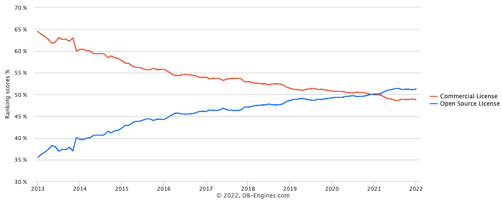

图 4.1 – 开源数据存储受欢迎度的上升趋势

尽管有大量的选择和经过验证的良好记录，但为应用团队提供采用这些开源工具的自由往往是具有挑战性的。这有两个可能的原因。首先，批准这些工具的使用并创建一个安全的容器镜像供应链需要大量的操作开销。其次，鉴于它们各自的容器镜像是公开存储在容器仓库中的，这意味着它们并不总是值得信赖。因此，开发团队要么因为缺乏选择而受到困扰，要么因为生产力损失而导致等待时间增加。

VAC 通过提供大量开源工具目录来解决这一挑战，企业可以从中选择。一旦准备好自定义的开源工具目录，VAC 服务会创建一个自动化供应链，将所选工具的容器镜像和 Helm charts 流式传输并交付到目标容器注册中心，该注册中心可以是内部部署的，也可以是外部部署的，如 **Google Container Registry**（**GCR**）。随后，我们将不断获得这些开源工具的新版本，它们以更新的容器镜像和 Helm charts 形式提供。这些可以通过最小的操作开销进行配置，并为应用团队提供丰富的选择。一旦开始获取我们目录项目的工件、容器镜像和 Helm charts，我们可以将该目录暴露给内部使用。然后，经过授权的内部成员可以使用该目录，在几分钟内在 Kubernetes 上部署这些开源工具。这种选择的灵活性，且没有操作开销，应该能够鼓励在不影响用户生产力的情况下为正确的用例使用合适的后台服务。

## 增强的安全性和透明度

在容器平台上使用开源软件（OSS）部署非常快捷、简单，并且正在变得越来越流行。所有主要的公共容器仓库，如 Docker Hub 和 GCR，都有所有主要开源软件的容器镜像。我们只需提供容器镜像的名称，几秒钟内就能下载。然而，尽管从这些公共容器仓库拉取容器镜像有许多好处，几乎所有具有一定安全实践的企业都不允许这么做。以下是其中几个原因：

+   很难确定公共仓库中哪些容器镜像是由合法来源托管的。你可能会发现多个由不同组织或普通用户托管的相同软件的容器镜像。在这种情况下，创建一个认证来源的白名单来拉取这些托管镜像将非常困难。

+   即使有办法找到可以使用的认证来源及其容器镜像，围绕它创建一个治理模型来限制未知来源托管的容器镜像的使用也是非常困难的。

+   同时，也很难获得**物料清单**（**BOM**），以了解这些外部提供的容器镜像包含了什么。这些第三方镜像往往充当黑盒，企业难以获得所需的信心来允许在任何环境中使用它们。审核运行这些黑盒容器镜像的环境也将非常困难。

+   任何一个成熟的组织都有一套标准的**操作系统**（**OSes**），这些操作系统会被允许在其基础设施中使用。这些操作系统要求通常也适用于容器镜像。然而，对于第三方提供的容器镜像来说，往往没有足够的控制选项来选择操作系统。这可能是企业不赞成使用托管在公共容器注册表上的开源工具容器镜像的一个主要原因。

+   对于一个以安全为首要思想的组织，涉及信息安全标准时，通常会有几个审计和合规要求。为了获得在企业生产环境中运行 OSS 容器所需的信心，应该提供多个详细信息，包括**常见漏洞和暴露**（**CVE**）扫描报告、测试结果、病毒扫描和其他有关已部署工作负载的细节。

为了满足这些要求，公司通常会控制自己的开源软件（OSS）容器镜像构建过程。当他们将更多的开源软件添加到内部镜像编排过程中时，往往会意识到这种做法并不具备很好的可扩展性、速度不足以满足需求、效率低下或存在安全隐患。出现这种情况的原因有几点：当需要将新的开源工具添加到内部管理的目录时，就需要构建新的自动化流水线、测试用例、基础设施容量等。

+   这种定制的内部自动化工作通常只有少数工程师理解并维护。当团队中的关键人员轮换离开时，会造成知识的空白，这种空白有时很难填补，从而造成知识缺口。

+   随着目录的增大，维护工作量呈指数级增加。因为每个目录项的更新版本都需要为内部使用构建一个新的相应容器镜像。由于这种额外的工作量，平台运营团队可能会滞后于跟上最新的修补版本。这种生产最新修补容器镜像的延迟会增加安全风险，因为未修补的 CVE 可能会在企业范围内被使用，直到新的容器镜像准备好。

+   由于为内部使用提供新的目录项所需的工作量，可能会出现反对添加新项目的情况。这些反对意见可能会减少开发者的生产力，因为他们需要花时间等待，或者影响业务应用程序的质量，因为无法为特定的使用场景选择正确的工具。

+   即使平台团队同意将新项目添加到目录中，但消费者实际获得可生产认证的容器镜像的时间仍然较长。这类延迟再次浪费了重要劳动力的宝贵生产时间，或者劳动力通过使用外部可用但不安全的容器镜像来源找到解决方法。

+   从事此类内部自动化工作的人员时间和为此原因利用的基础设施容量，本可以更好地用于推动更具商业成果的事业。

为了解决这些挑战，VAC 应运而生，提供以下好处，帮助提供一个安全的解决方案，以提高开发者生产力和运营效率：

+   VAC 允许企业为其所有选择的 OSS 容器镜像使用自己的黄金操作系统镜像层。这是一个重要的优势，因为客户组织可以在其选择的操作系统版本上使用经过硬化的操作系统层，并按需配置安全设置。

+   VAC 为每个目录项的容器镜像和 Helm 图表（如适用）的创建和分发创建了自动化流水线。由于这种自动化，VAC 可以在较新的上游版本发布后迅速为订阅者提供更新的修补版本。快速提供修补版本能够有效预防黑客攻击，提升安全防范水平。

+   VAC 为所有交付的容器镜像提供以下工件，以增强消费者信任并提高容器镜像的透明度：

    +   资产规范，详细说明容器镜像内容信息

    +   自动化测试用例结果，供交付前执行的测试运行使用

    +   CVE 扫描报告

    +   CVE 扫描报告，格式为 CVRF

    +   杀毒扫描报告

    +   用户文档参考

+   VAC 将所有工件推送到客户提供的私有容器注册表中，这为所有容器镜像和 Helm 图表创建了一个可信赖的来源，供内部使用。

什么是 CVRF？

**通用漏洞报告框架**（**CVRF**）1.1 版于 2012 年 5 月发布。CVRF 是一种基于 XML 的语言，使不同组织之间的不同利益相关者能够以统一格式共享关键信息，从而加速信息交换和消化。参考文献：[`www.icasi.org/the-common-vulnerability-reporting-framework-cvrf-v1-1/`](https://www.icasi.org/the-common-vulnerability-reporting-framework-cvrf-v1-1/)。

在前面的几个要点中，我们讨论了 VAC 的主要优势。目前，VAC 仅适用于 OSS 工具。然而，许多大型组织在没有企业级支持的情况下不会使用 OSS 工具，特别是在生产环境中。需要理解的是，VAC 作为一种解决方案，仅支持使用客户端选择的操作系统层的 OSS 容器镜像和 Helm 图表的安全供应链。但 VAC 并不支持作为订阅的一部分的基础 OSS 工具。例如，如果一个组织通过 VAC 需要 PostgreSQL 数据库容器镜像，那么 VAC 将支持 PostgreSQL 数据库上游版本容器镜像的打包和及时分发。但 VAC 不会支持基础的 PostgreSQL 数据库本身。因此，为了支持 PostgreSQL，企业可能需要使用由供应商支持的服务，如 VMware 的 **Tanzu** 数据管理服务订阅，该订阅支持开源 PostgreSQL 和 MySQL 数据库。或者，他们可以使用供应商特定版本的开源解决方案，比如由 Crunchy Data 提供的 PostgreSQL 版本。在这种情况下，组织可以从相应的第三方供应商（如 Crunchy Data）获取容器镜像。对于这种情况，VAC 并没有什么用处。但如果企业希望使用供应商支持的纯粹上游版本 PostgreSQL（例如由 VMware 或 **EnterpriseDB** (**EDB**) 提供支持），则可以使用 VAC 来享受所有列出的好处。

上游与供应商特定版本的 OSS

直接使用上游的 OSS 发行版而不添加供应商特定的版本有助于避免潜在的供应商锁定，这是使用 OSS 技术的首要原因。VAC 使企业更容易采用这些 OSS 工具。尽管如此，许多组织仍然使用供应商特定版本的 OSS，因为这些版本包含了上游 OSS 发行版中没有的附加功能和特性。因此，这两种方法各有利弊。

在了解 VAC 的优势和适用范围之后，让我们更深入地了解一下 VAC 是什么以及它包含哪些内容。

# VMware 应用程序目录是什么

在详细介绍了 VAC 可以解决的业务、安全和技术挑战，以及它不适用的场景之后，让我们现在更详细地了解这个工具，看看它包含了什么内容。在此之前，让我们先了解一下 VAC 的背景，以便更深入地了解它。

## VMware 应用程序目录的历史

在 2019 年末，为了策划一个全面的现代应用开发和管理工具组合，VMware 决定收购一家名为 **Bitnami** 的流行 OSS 打包和分发公司。Bitnami 在这一领域有多年经验，最初以二进制文件、虚拟机镜像和容器镜像的形式提供精心策划且可消费的 OSS 工具。收购后，VMware 将 Bitnami 更名为 **Tanzu 应用目录**，以定义一个企业级 OSS 容器镜像分发产品，可以根据企业客户的需求定制镜像规范。2021 年，VMware 决定在原有的容器镜像和 Helm 图表之外，还包括 **开放虚拟设备**（**OVA**）镜像目录，以构建虚拟机，这也是 Tanzu 应用目录的最初构想。正如我们在本书中看到的，VMware 的 Tanzu 产品组合涵盖了所有与容器和 Kubernetes 相关的工具和技术。这也是该产品最初被命名为 *Tanzu* 的原因。但是，随着 VMware 最近宣布将扩展该产品以支持 OVA 镜像和容器镜像以及 Helm 图表，这一产品被重新命名为 **VMware 应用目录**（**VAC**），因为它不再仅仅关乎容器生态系统。

重要提示

本书的主要焦点是 Tanzu 及其周边生态系统。此外，在撰写本书时，关于虚拟机镜像的产品仍在发展中，尚未达到与 VAC 中容器镜像相同的水平。因此，本章只会涵盖容器镜像目录管理和消费的相关细节，而不会涉及虚拟机镜像。

在了解了 VAC 的历史并明白为什么它名字中有 *VMware* 而不是 *Tanzu* 后，让我们现在来了解一下这个产品的关键组成部分。

## VMware 应用目录的组成部分

以下工具是 VAC 的组成部分。我们来一一审视它们。

### VMware 应用目录门户

该产品的主要组成部分是 VAC 门户，在此我们可以策划和管理应用目录。它是一个**软件即服务**（**SaaS**）组件，由 VMware 托管和管理。VAC 客户端可以通过其 VMware Cloud ([`console.cloud.vmware.com/`](https://console.cloud.vmware.com/)) 账户访问 VAC 服务。目录管理员可以创建新目录、在目录中添加新的 OSS 产品，并下载与目录项相关的支持元素，包括测试结果日志、CVE 报告、防病毒扫描报告以及其他此类项目。总之，VAC 门户提供了一个基于 Web 的用户界面，用于安全地策划一个可以供企业内部用户自由使用的 OSS 工具目录。我们将在本章后面详细介绍这个门户的更多细节。

### Kubeapps

一旦目录管理员在 VAC 门户上定义了带有 Helm 图表的支持的 OSS 工具目录，开发人员或操作员可以使用 Kubeapps ([`kubeapps.com/`](https://kubeapps.com/)) 来消费发布的目录项供内部使用。Kubeapps 是 **云原生计算基金会**（**CNCF**）旗下的 OSS 工具。这个项目最初由 Bitnami 启动，旨在提供一个 **图形用户界面**（**GUI**），通过 Helm 图表在 Kubernetes 集群上部署软件。自从被 Bitnami 收购后，VMware 积极维护该项目。它是一个非常轻量级的应用程序，可以部署在运行在组织环境中的 Kubernetes 集群上。Kubeapps 的用户可以从可访问的目录中选择要部署的软件，更改所需的部署配置（例如，用户凭据、存储大小、安全配置等），并最终将其作为运行中的容器部署到选定 Kubernetes 集群的目标命名空间中。一旦目录中有软件的新版本可用，用户可以快速升级，或者如果不再需要该部署，可以将其删除。总结来说，如果 VAC 门户提供了所需的控制，以安全地公开 OSS 工具目录，那么 Kubeapps 就为开发人员或其他目录用户提供了所需的灵活性和生产力，可以根据需要使用已发布的目录来管理各种 OSS 工具的生命周期。

让我们了解这些组件是如何协同工作，以提供所需的功能。*图 4.2* 描述了在 VAC 门户上定义 OSS 目录的整体过程，并通过 Kubeapps 或 **持续部署**（**CD**）自动化来消费这些目录工件。

## VAC 管理和消费过程

在上一节中回顾了该服务的关键组件后，让我们现在来了解这些组件如何协同工作，通过使用 VAC 提供端到端的目录编排和消费功能。以下几点对应于*图 4.2*中给出的每个数字，并描述了在该步骤中发生的过程。*图 4.2*中的云表示 VAC 的 SaaS 基础设施，矩形框定义了客户组织的基础设施边界。这个客户基础设施可以是私有数据中心、公共云，或者两者的结合：

1.  客户组织中的目录管理员，拥有 VMware Cloud 账户的访问权限，定义了一个新的选定 OSS 工具目录。在此步骤中，目录管理员还选择了要使用的基础容器操作系统，决定是否包括或排除所选项目的 Helm 图表，并提供一个容器仓库引用，用于将目录工件推送到安全的消费位置。

1.  一旦目录管理员提交了目录配置，VAC 自动化过程将继续推进，部署所需的自动化流水线，以创建符合目录管理员在*步骤 1*中提供的规格生成的容器镜像和 Helm 图表。

1.  VAC 自动化过程根据每个选择的 OSS 工具，从授权的第三方源拉取所需的 OSS 二进制文件。在获取所需的二进制文件后，VAC 自动化执行某些操作，包括自动化测试 OSS 工具的版本、使用客户端指定的操作系统镜像层打包工具、准备容器规格报告，以及执行病毒扫描和 CVE 扫描。此步骤会针对 VAC 涵盖的每个 OSS 工具的每个新版本重复执行。

1.  一旦目录项准备好供消费，它将被推送到目录管理员在*步骤 1*中指定的目标容器注册表。此步骤对于每个 OSS 工具的版本，也会在*步骤 3*中为其准备的每个版本重复执行。

1.  一旦目录项被推送到目标容器注册表，目录管理员可以拉取在*步骤 3*中为已发布的工件准备的报告，如 CVE 扫描报告等。VAC 门户还会指定使用 CLI 命令来使用发布工件的容器镜像和 Helm 图表。

1.  在此步骤中，目录管理员在 Kubeapps 上配置已发布的目录供内部使用。

1.  在此步骤中，Kubeapps 拉取所需的目录详细信息，以便在 GUI 上发布供消费使用。

1.  一旦目录在 Kubeapps 上配置好，目录消费者可以访问 Kubeapps GUI 来部署所需的 OSS 工具作为 Kubernetes 部署：

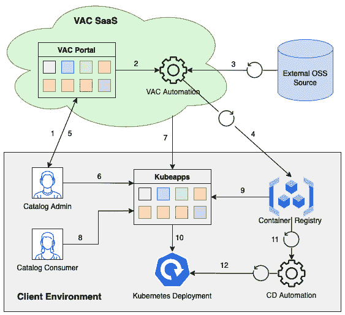

图 4.2 – VAC 管理与消费过程

1.  当 Kubeapps 接收到来自目录消费者的请求，要求在 Kubeapps GUI 上使用其 Helm 图表部署工具时，Kubeapps 将从在*步骤 4*中推送到容器注册表的工件中拉取所需的 Helm 图表和容器镜像，以进行工具的部署。

1.  由 Kubeapps 触发的 Helm 安装程序使用目录消费者在*步骤 8*中提供的配置，在目标 Kubernetes 集群中部署 OSS 工具。在此步骤结束时，目标 Kubernetes 集群中将运行该 OSS 工具实例。在大多数情况下，此步骤将在几分钟内完成。

1.  此步骤描述了使用 CD 自动化过程消费 VAC 提供的工件的另一种方式。此步骤可以配置为每当容器注册表中有新版本的工件可用时触发，从而启动自动化部署过程。

1.  在此步骤中，CD 过程将在目标 Kubernetes 集群中部署已下载的 OSS 工具。

下图总结了所有这些步骤，突出了 VAC 的功能以及其使用方式：

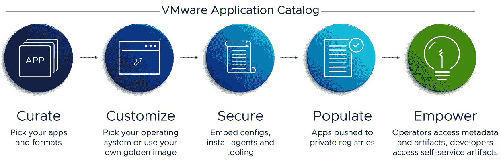

图 4.3 – 高级视图中的 VAC (https://docs.vmware.com/)

到此，我们已经覆盖了理解 VAC 历史、VAC 如何获得当前名称、VAC 的关键组成部分，以及从目录创建到使用的端到端过程的所有细节。现在，让我们开始使用 VAC，更好地理解如何使用它。

# 开始使用 VMware 应用程序目录

本章这一部分将涵盖以下内容：

+   如何配置应用程序目录

+   如何在 Kubernetes 集群上安装 Kubeapps

+   如何配置 Kubeapps 使用目录

所以，让我们开始动手操作。但在此之前，我们需要满足以下先决条件。

## 先决条件

以下几点列出了实现 VAC 所需的先决条件：

+   拥有 VAC 访问权限的 VMware Cloud Services 账户 ([`console.cloud.vmware.com/`](https://console.cloud.vmware.com/))

+   以下任一容器仓库，VAC 可以访问它们以推送目录项：

    +   GCR

    +   Azure 容器注册表

    +   Harbor

+   具有以下属性的 Kubernetes 集群：

    +   版本 1.19 或更高版本

    +   外网访问

    +   VAC 使用的容器注册表访问

    +   自动化 **持久卷**（**PV**）创建，基于 **持久卷声明**（**PVC**）

+   配备 Linux 或 macOS 的工作站

+   在工作站机器上安装 Helm v3.x

Helm 安装

如果你需要帮助进行 Helm 安装，请参考此文档：[`docs.bitnami.com/kubernetes/get-started-kubernetes/#step-4-install-and-configure-helm`](https://docs.bitnami.com/kubernetes/get-started-kubernetes/#step-4-install-and-configure-helm)。

我们首先定义一个可以被各种应用程序访问的后端服务目录。我们将选择 MySQL 作为关系型数据库，作为 OSS 目录项的示例，以便在本章后续部分描述各种细节。在实际操作中，我们可能会将许多其他 OSS 工具添加到目录中，并以类似的方式使用它们。你可以在 VAC 门户上找到更多可用的 OSS 工具列表，以便创建目录。

## 在 VAC 门户上创建目录

在 VAC 门户上创建目录，请按照以下步骤操作：

1.  登录到你的 VMware Cloud Services 账户，并从可用服务中选择 **VMware 应用程序目录**。如果你没有看到该服务，可能需要联系你的 VMware 账户团队成员以获取访问权限：


图 4.4 – 从服务列表中选择 VAC

1.  你将看到一个空目录页面，如下图所示，因为之前没有添加任何目录项。点击下图所示的 **ADD NEW APPLICATIONS** 按钮：

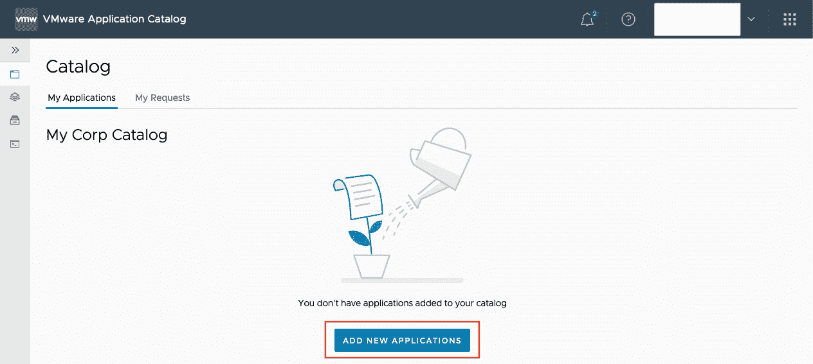

图 4.5 – 空目录中的 ADD NEW APPLICATIONS 按钮

1.  选择目录工件的基础操作系统层。如本章之前所述，我们将重点关注基于 Kubernetes 的应用程序目录，而不是虚拟机。作为一个简单的示例，**Ubuntu 18.04** 被选择为基础操作系统层，但您也可以选择**自定义基础镜像**选项。有关更多详细信息，请访问 VAC 产品文档：[`docs.vmware.com/en/VMware-Application-Catalog/services/main/GUID-get-started-get-started-vmware-application-catalog.html#step-3-create-custom-catalogs-5`](https://docs.vmware.com/en/VMware-Application-Catalog/services/main/GUID-get-started-get-started-vmware-application-catalog.html#step-3-create-custom-catalogs-5)：

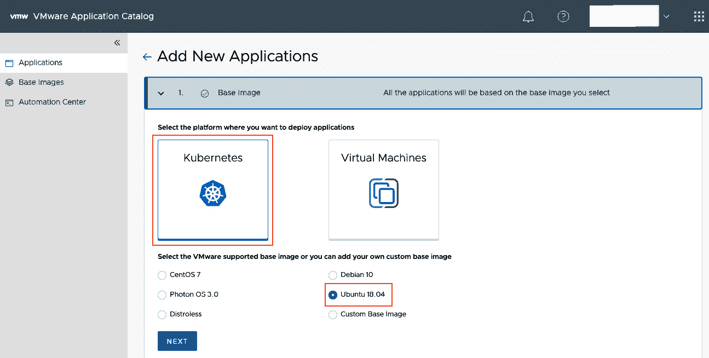

图 4.6 – 为目录项选择基础操作系统

1.  从可用选项中选择所需的 OSS 项目以包含在目录中。如果需要，您也可以进行搜索：

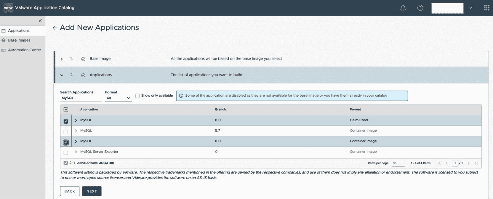

图 4.7 – 选择目录项

1.  点击**添加注册表**按钮，添加目标容器注册表，以将所需的目录工件交付：

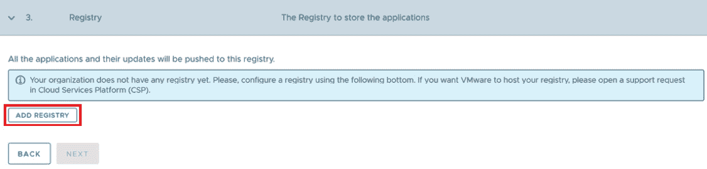

图 4.8 – 添加容器注册表

1.  提供所需的容器注册表详细信息，以允许 VAC 将目录工件推送到该注册表：

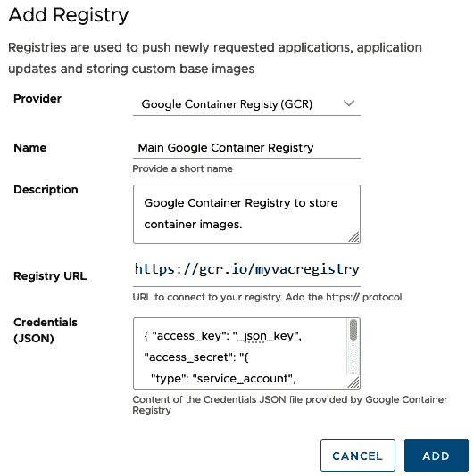

图 4.9 – 添加注册表详细信息

虽然*图 4.9* 显示了 GCR 的详细信息，但它也支持其他注册表，包括 Azure 容器注册表和 Harbor。您可以通过以下链接获取有关其他注册表的更多信息：[`docs.vmware.com/en/VMware-Application-Catalog/services/main/GUID-get-started-get-started-vmware-application-catalog.html#step-3-create-custom-catalogs-5`](https://docs.vmware.com/en/VMware-Application-Catalog/services/main/GUID-get-started-get-started-vmware-application-catalog.html#step-3-create-custom-catalogs-5)。

1.  为该目录指定名称和描述：

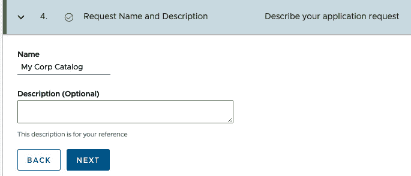

图 4.10 – 为目录添加名称和描述

1.  验证输入摘要并提交目录请求：

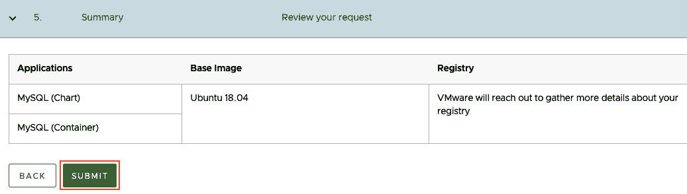

图 4.11 – 提交目录请求

在此之后，我们将看到一条确认我们目录请求提交的消息。在我们开始将目录项交付到选定的容器注册表目标之前，可能需要大约几周的时间来审核和处理该请求。

就这样。我们已经定义了 OSS 工具的目录，以便能够将其发布给内部用户，方便快捷地访问。但他们如何访问这个目录呢？让我们在下一节中查看。

## 使用 Kubeapps 消费 VAC

在上一部分中，我们学习了如何在 VAC 门户上请求应用目录。一旦我们开始从容器注册中心获取 Helm charts 和容器镜像，就可以使用 Kubeapps 访问这些工具，它是一个用于管理基于 Kubernetes 的软件部署的图形界面。在本章的*VAC 组件*部分中，我们已经详细讨论了 Kubeapps。现在让我们来看如何安装和配置它。

### Kubeapps 安装

Kubeapps 本身是一个基于 Kubernetes 的部署，用于管理其他可以通过 Helm charts 和 operators 部署的 Kubernetes 部署。由于我们计划使用 Kubeapps 来使用 VAC 提供的发行版，包括 Helm charts 和容器镜像，因此我们在本节中不讨论 operators 的使用。作为一种部署拓扑结构，我们可以在任何 Kubernetes 集群上安装 Kubeapps，以在同一个或任何其他与 Kubeapps 连接的 Kubernetes 集群及其命名空间中部署目录项。在本章中，我们将使用一个单一的 Kubernetes 集群，以最小化配置复杂度。

我们需要满足一些先决条件，以便继续操作，这些内容在本章的*先决条件*部分中有详细说明。以下步骤描述了在具有足够资源的 Kubernetes 集群上安装和配置 Kubeapps：

1.  将 Bitnami Helm chart 仓库添加到本地 Helm 库：

    ```
    $ helm repo add bitnami https://charts.bitnami.com/bitnami
    ```

1.  为 Kubeapps 创建一个 Kubernetes 命名空间：

    ```
    $ kubectl create namespace kubeapps
    ```

    ```
    namespace/kubeapps created
    ```

1.  使用 Helm chart 在`kubeapps`命名空间中安装 Kubeapps：

    ```
    $ helm install kubeapps --namespace kubeapps bitnami/kubeapps
    ```

    ```
    NAME: kubeapps
    ```

    ```
    LAST DEPLOYED: Wed Jan 19 19:45:20 2022
    ```

    ```
    NAMESPACE: kubeapps
    ```

    ```
    STATUS: deployed
    ```

    ```
    REVISION: 1
    ```

    ```
    TEST SUITE: None
    ```

    ```
    NOTES:
    ```

    ```
    CHART NAME: kubeapps
    ```

    ```
    CHART VERSION: 7.7.0
    ```

    ```
    ...
    ```

    ```
    ...
    ```

前面的输出为了简洁而被截断了。到此为止，我们已经在集群中运行了 Kubeapps。现在让我们验证一下。

1.  验证 Kubeapps 的部署，以查看是否一切运行正常：

    ```
    $ kubectl get all -n kubeapps
    ```

上面的命令应列出`pods`、`services`、`deployments`、`replicasets`、`statefulsets`和`jobs`，由于篇幅原因这里未列出。

1.  创建一个临时服务账户来访问 Kubeapps GUI：

    ```
    $ kubectl create --namespace default serviceaccount kubeapps-operator
    ```

    ```
    serviceaccount/kubeapps-operator created
    ```

1.  将服务账户与 Kubernetes 角色绑定，以允许所需的访问：

    ```
    $ kubectl create clusterrolebinding kubeapps-operator --clusterrole=cluster-admin --serviceaccount=default:kubeapps-operator
    ```

    ```
    clusterrolebinding.rbac.authorization.k8s.io/kubeapps-operator created
    ```

1.  获取账户的访问令牌，以登录 Kubeapps GUI：

    ```
    $ kubectl get --namespace default secret $(kubectl get --namespace default serviceaccount kubeapps-operator -o jsonpath='{range .secrets[*]}{.name}{"\n"}{end}' | grep kubeapps-operator-token) -o jsonpath='{.data.token}' -o go-template='{{.data.token | base64decode}}' && echo
    ```

这个长命令会打印出一长串字符，这就是我们用来登录 Kubeapps GUI 的令牌。请保存此令牌以备将来参考。

重要说明

前面三个命令用于为 Kubeapps 创建访问权限，它们采用了一种非常原始的方法，以简化操作并作为学习参考。在生产级别的实现中，我们可能需要使用更复杂的方法来配置可以访问 Kubeapps 的真实企业用户。此类用户权限通常通过与 OIDC 或 LDAP 身份提供者的外部集成来进行管理。此外，使用`cluster-admin`角色并不是一种安全的方法，除非是用于学习目的，否则不应使用该角色。

1.  公开 Kubeapps GUI，以便在浏览器中本地访问。对于生产级部署，GUI 应该分配一个合适的域名，并通过负载均衡器在 Kubernetes 集群外部公开。在此步骤中，我们将使用 Kubernetes 端口转发进行快速简单的访问：

    ```
    $ kubectl port-forward -n kubeapps svc/kubeapps 8080:80
    ```

    ```
    Forwarding from 127.0.0.1:8080 -> 8080
    ```

    ```
    Forwarding from [::1]:8080 -> 8080
    ```

1.  在本地浏览器中访问 Kubeapps，使用 `http://localhost:8080/`。这将打开 Kubeapps 的以下界面：

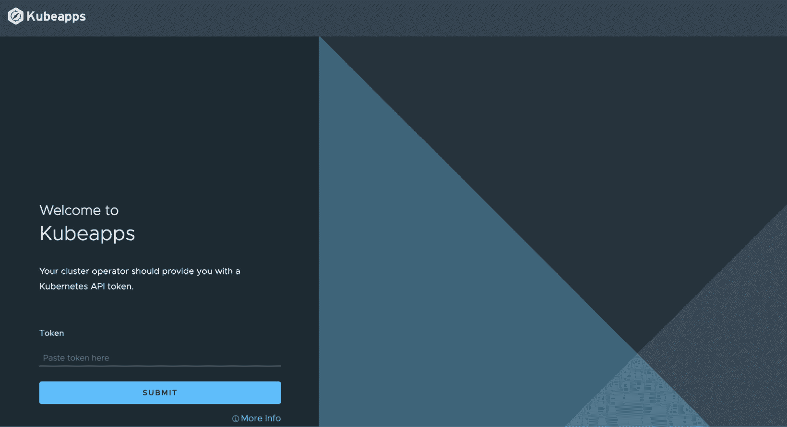

图 4.12 – Kubeapps GUI – 身份验证页面

1.  使用 *第 7 步* 中获取的令牌访问 Kubeapps。将令牌值粘贴到登录页面并提交。这应该会打开如 *图 4.13* 所示的 Kubeapps GUI：

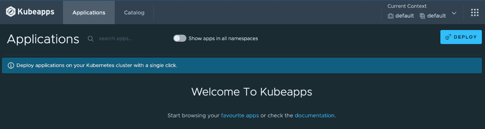

图 4.13 – Kubeapps GUI – 初始登陆页面

重要说明

本章中描述的截图和步骤基于当前可用的 VAC 和 Kubeapps 版本。根据阅读本书的时间，内容和体验可能会根据将来对这些产品进行的更改有所不同。

如你所见，Kubeapps 配有配置来访问公开可用的通用 Bitnami 目录。一旦我们在 VAC 门户上定义的客户目录准备好，并且开始获取其工件，我们可以配置 Kubeapps 使用相同的目录。我们将在第二天活动中涵盖如何将自定义应用程序目录链接到 Kubeapps。

到此，我们已经完成了本章关于 VAC 和 Kubeapps 入门部分的内容。我们已经了解了如何在 VAC 门户上创建目录，并在 Kubernetes 集群中安装 Kubeapps。在下一节中，我们将看到以下内容，涵盖 VAC 周围的常见第二天活动：

+   如何检查已交付的目录工件并获取所需的报告

+   如何将 VAC 与 Kubeapps 连接，以便发布供使用

+   如何通过自动化管道使用 Kubeapps 消费目录项

+   如何使用 Kubeapps 将 MySQL 部署为运行在 Kubernetes 集群中的后端服务

+   如何管理目录项

现在让我们来学习如何使用 VAC。

# 与 VAC 相关的常见第二天活动

根据本章前一节中涵盖的细节，我们现在有一个在 VAC 门户上提交的 OSS 工具目录请求，以及一个运行在 Kubernetes 集群中的 Kubeapps 实例。现在让我们回顾一些目录管理员可以执行的关键第二天活动，以确保 OSS 工具使用的安全性和合规性，以及目录消费者可以执行的活动，以便在 VAC 目录中快速以不同方式部署和使用这些 OSS 工具，从而释放生产力和灵活性。

## 检查目录交付物

一旦我们通过 VAC 门户向 Vmware 提交了目录请求，如前一节所述，我们可以使用 VAC 门户检查我们的目录交付物状态，如下图所示，在 **我的** **请求** 标签下：

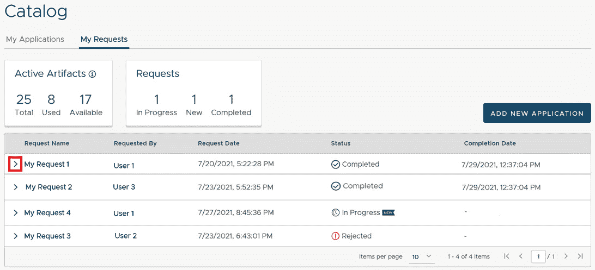

图 4.14 – 检查 VAC 请求状态

当我们完成目录请求后，我们开始在**我的应用程序**页面上查看交付的工件，如下图所示：

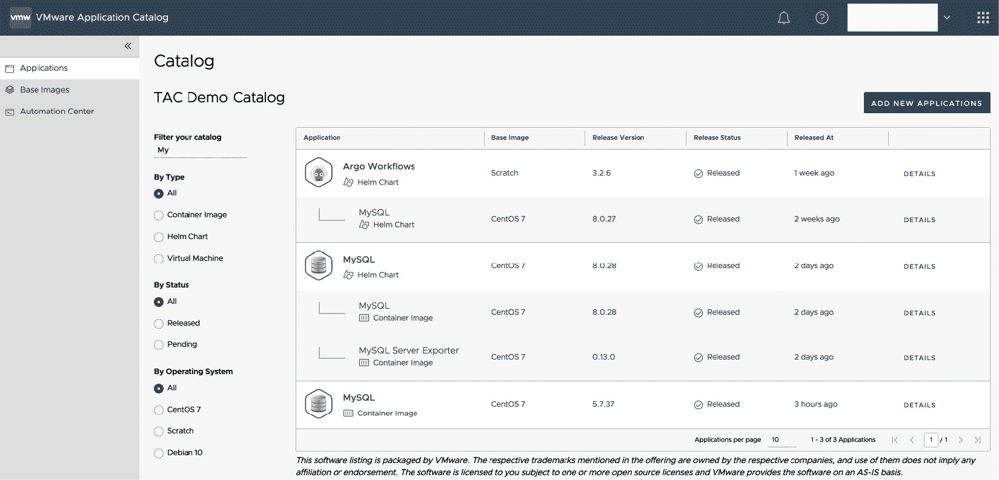

图 4.15 – 在 VAC 门户上列出目录应用程序

根据我们在目录创建请求期间的选择，我们可能会看到 Helm 图表及其容器镜像，如*图 4.15*所示。现在，我们通过点击右侧该项的**详细信息**链接来检查 MySQL 容器镜像的详细信息。以下截图显示了 MySQL 容器镜像的详细信息：

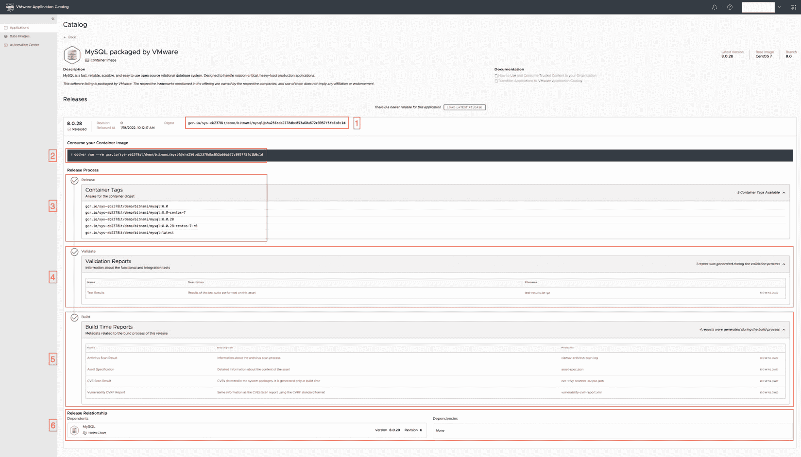

图 4.16 – VAC 门户上的目录项详细信息

我们可以从目录项详细页面的不同部分获取以下详细信息，如*图 4.16*所示。以下列表中的数字对应于*图 4.16*中的数字：

1.  **摘要**：这是我们在目录创建过程中提供的目标容器注册表中放置的工件的名称和位置。

1.  **使用您的容器镜像**：这是 Docker 命令，用于将此容器镜像拉取到 Docker 运行时环境中。

1.  **容器标签**：这些是此容器镜像的不同标签别名，我们可以在 Kubernetes 部署清单文件中使用这些标签来拉取此容器镜像，以便在 Kubernetes 上运行该应用程序。

1.  **验证报告**：此项允许我们下载自动化测试结果日志文件，该文件在创建此容器镜像之前用于测试此版本的 MySQL。

1.  **构建时间报告**：此部分包含各种容器构建报告，包括病毒扫描和 CVE 扫描报告以及包含所用软件及其版本列表的资产规范（物料清单）报告。

1.  **发布关系**：此部分显示使用此镜像的依赖 Helm 图表。

与容器镜像的详细信息类似，Helm 图表的详细信息包括部署图表所需的`helm` CLI 命令、图表的测试结果、资产规范和容器镜像依赖项。

## 使用应用程序目录

在检查了 VAC 门户上为我们目录项提供的工件所需的详细信息后，现在是时候使用它们在我们的环境中部署这些工具了。我们可以通过多种方式使用 VAC 提供的容器镜像。根据工具的需求，我们可以简单地在工作站的容器运行时环境中运行一些工具，例如 Docker。然而，对于企业级部署，我们需要多个支持组件来运行工具。例如，我们看到创建了所有 Kubernetes 资源来部署和运行我们在本章中之前部署的 Kubeapps 实例。部署此类工具的一种可能方式是使用自定义脚本和 CI/CD 工具（如 Jenkins 和/或 **ArgoCD**）通过 **GitOps** 基于部署模型进行部署。另一种可能的选择是使用 Kubernetes 打包工具，如 Helm charts。Helm chart 将部署和运行工具所需的所有依赖项捆绑到一起，以便在 Kubernetes 集群上进行部署。使用 Helm charts 等工具使得配置和快速部署工具变得非常简单，所有必需组件都可以在几分钟内以最小的努力完成。正如我们之前看到的，VAC 允许我们在适用的地方为目录项选择容器和 Helm charts。作为应用程序打包的一部分，Helm charts 还允许暴露某些配置属性，这些属性可能需要根据不同的部署进行更改。我们可以使用 VAC 提供的这些 Helm charts 来部署这些工具，并根据我们的自定义配置需求进行调整。例如，在 MySQL 数据库部署中，我们可以更改其名称、登录凭据、存储卷大小等属性。

什么是 GitOps？

GitOps 坚持 Git 是唯一真实来源的原则。GitOps 要求将系统的期望状态存储在版本控制中，以便任何人都可以查看变更历史。所有对期望状态的更改都通过 Git *提交* 来执行。来源：[`blogs.vmware.com/management/2020/08/ops-powered-by-git-gitops-in-vrealize-automation.html`](https://blogs.vmware.com/management/2020/08/ops-powered-by-git-gitops-in-vrealize-automation.html)。

正如我们之前讨论的，Kubeapps 是一个用于部署和管理我们在 VAC 上配置的 Helm charts 目录的工具。那么，让我们来看一下如何将 VAC 提供的 Helm charts 与我们在本章中之前部署的 Kubeapps 实例进行链接。

### 将应用程序目录添加到 Kubeapps

以下步骤描述了如何在我们的 Kubeapps 实例上配置 VAC 提供的 Helm charts 的新目录：

1.  获取 Helm charts 所在的 chart 仓库位置。你可以在 VAC 门户上，查找 Helm chart 项目的详细页面中找到此信息，如下图所示：

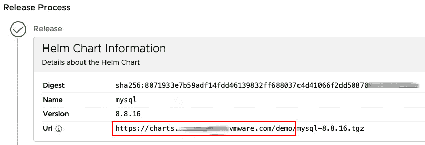

图 4.17 – 获取 Helm chart 仓库位置

高亮部分的 URL 是我们在 VAC 门户定义的所有 Helm chart 的存储位置。请记下这个 URL，我们将在接下来的步骤中使用它：

1.  在 VAC 门户上为 VAC 账户生成 API 令牌，我们将使用它来验证我们的 Kubeapps 实例，以拉取选定目录项的 Helm chart。以下子步骤描述了如何在 VAC 门户上生成 API 令牌：

    1.  使用右上角下拉菜单进入 VAC 门户的**我的账户**页面，如以下截图所示：

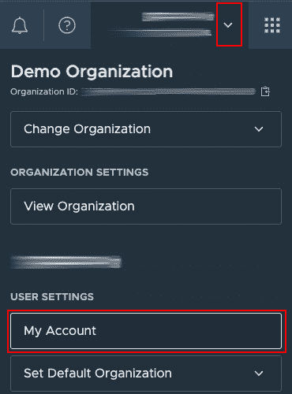

图 4.18 – 转到 VAC 我的账户设置

1.  点击**API** **令牌**标签：

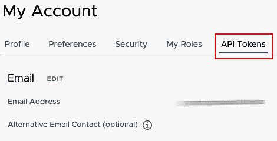

图 4.19 – 转到 API 令牌列表页面

1.  如果此页面上已列出了具有访问 VAC 服务权限的令牌，则可以跳过以下步骤以生成新的 API 令牌，并直接跳转到*步骤 3*在 Kubeapps 中添加仓库。否则，点击如以下截图所示的**生成新 API 令牌**链接：

-

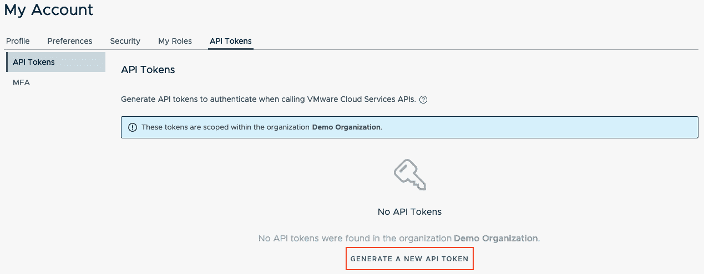

图 4.20 – 转到 API 令牌配置页面

1.  输入令牌配置，如以下截图所示：

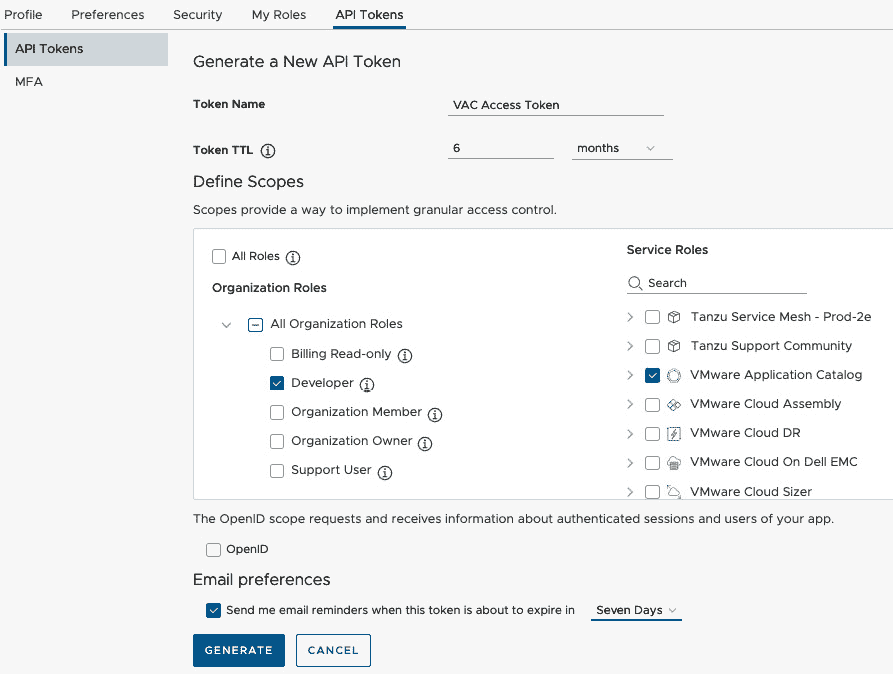

图 4.21 – 为 VAC 生成新的 API 令牌

1.  你可以根据需求更改令牌的名称和有效期。但是，作用域对允许从 Kubeapps 访问 VAC 至关重要。它不能是只读或支持角色。你也可以生成一个通用令牌，用于所有 VMware 云服务的所有服务。然而，这将非常宽泛，允许所有类型的访问，因此不推荐使用。

1.  保存生成的令牌以供将来使用：

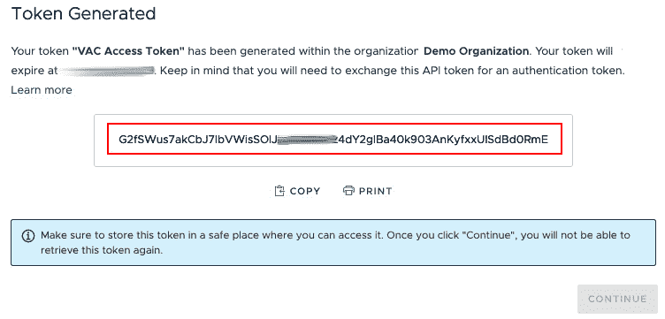

图 4.22 – 保存生成的令牌

1.  登录到我们部署的 Kubeapps 实例，并通过右上角的图标打开其配置菜单，然后选择**应用仓库**选项，如以下截图所示：

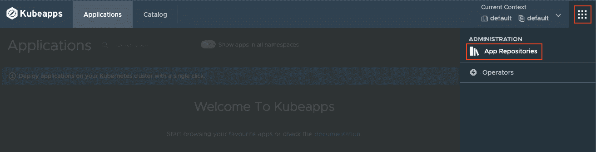

图 4.23 – 将 Helm chart 仓库添加到 Kubeapps

1.  点击**添加应用仓库**按钮以配置新仓库的详细信息：

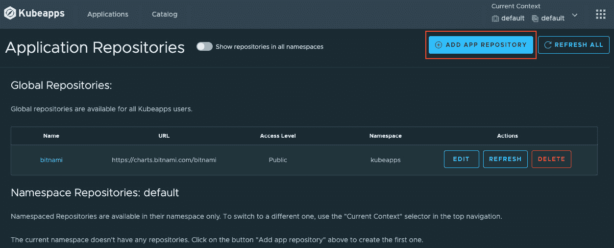

图 4.24 – 转到新的仓库配置页面

1.  为其命名，添加在*步骤 1*中捕获的 Helm chart 仓库 URL，粘贴在*步骤 2*中生成的 API 令牌，选择**跳过 TLS 验证**选项，然后点击**安装** **仓库**按钮：

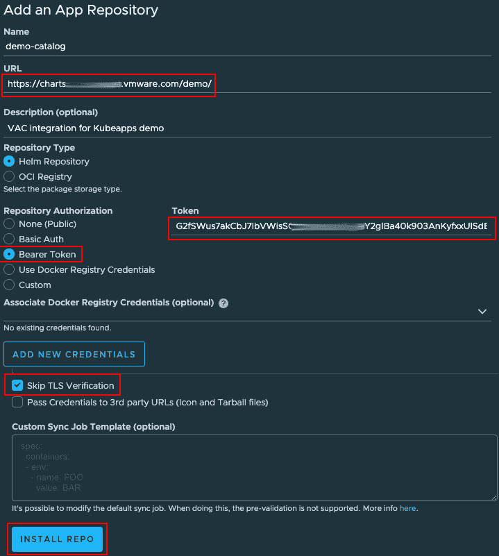

图 4.25 – 在 Kubeapps 中安装 VAC Helm 仓库

我们必须选择 **跳过 TLS 验证** 选项，如 *图 4.25* 所示，因为我们的 Kubeapps 部署没有分配外部域名和 TLS 证书。在企业级环境中，这不是推荐的做法。

1.  如果收到成功消息，那么目录应已与 Kubeapps 集成。为了确认这一点，请点击 Kubeapps 上的 **Catalog** 标签并选择 **demo-catalog** 选项，如下截图所示：

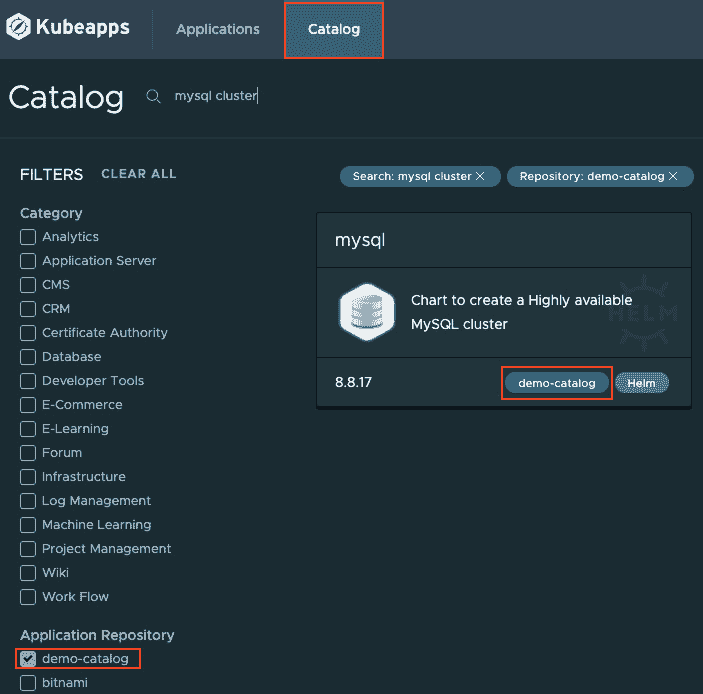

图 4.26 – 在 Kubeapps 上新配置的目录

这样，我们的 Kubeapps 部署就完全与我们在 VAC 上创建的自定义应用目录集成了。接下来，让我们学习如何使用 Kubeapps 从我们的自定义目录部署 MySQL 服务实例。

### 使用 Kubeapps 部署服务

在这一部分，我们将使用 Kubeapps 在 Kubernetes 集群上部署一个 MySQL 数据库实例。以下步骤描述了如何操作：

1.  点击 *图 4.26* 中显示的 **MySQL** 瓷砖，开始在 Kubernetes 集群上进行安装。点击后我们将看到以下屏幕：

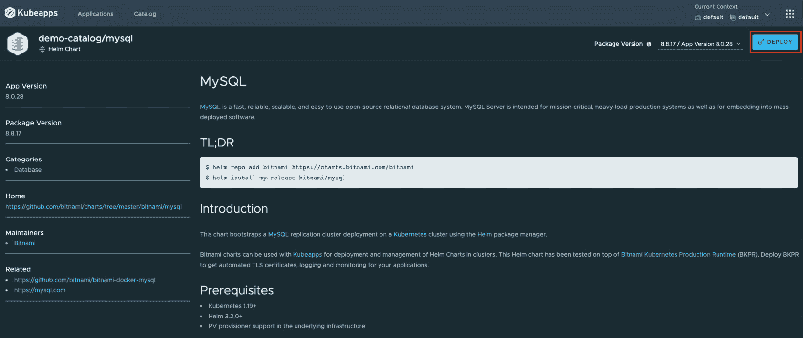

图 4.27 – Kubeapps 上 MySQL 部署说明页面

此页面显示了如何使用 MySQL Helm 图表的详细说明。我们可以使用这些说明，通过 Helm 图表命令行工具手动部署它。然而，我们将展示如何使用 Kubeapps 图形界面进行这样的配置和安装。您可以向下滚动页面，查看此 Helm 图表允许我们更改的所有配置参数的详细信息，以便定制我们的 MySQL 数据库实例。通过点击 *图 4.27* 中高亮显示的 **DEPLOY** 按钮，我们可以进入一个屏幕来更新这些属性，以满足我们的定制需求并触发安装。

1.  根据 Helm 图表的类型，我们可能会看到一个类似图形界面的表单，用于修改一些最常见的部署属性。例如，*图 4.28* 中的 MySQL 数据库实例配置表单显示我们可以选择部署架构以及主副数据库存储卷的大小。但我们也将使用基于 YAML 的详细配置方法来展示这一点。所以，请点击以下屏幕截图中高亮显示的 **YAML** 标签以继续操作：

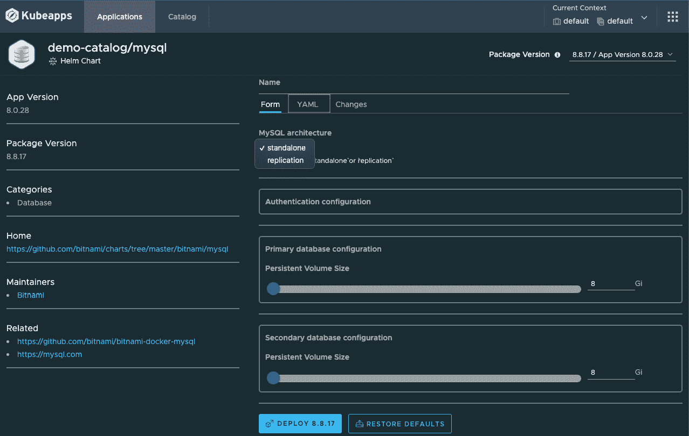

图 4.28 – Kubeapps 上 MySQL 数据库的 Helm 配置表单

1.  选择目标 Kubernetes 命名空间，更新 **YAML** 配置，并部署服务：

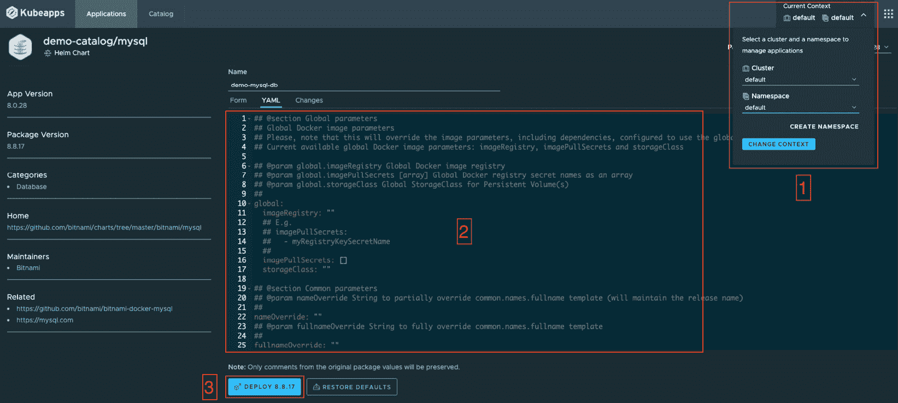

图 4.29 – 使用 Kubeapps 部署 MySQL 数据库的详细 Helm 图表配置

+   *图 4.29* 中的第一部分显示了我们可以选择此安装目标位置的位置。如前所述，我们可以使用 Kubeapps 在许多其他连接的 Kubernetes 集群及其命名空间中部署 Helm charts，具体取决于 Kubeapps 配置以及 Kubeapps 用户在这些集群和命名空间上的权限。在这种情况下，我们只有一个选项 —— **默认** —— 它对应的是 Kubeapps 所部署的 Kubernetes 集群。同样，如果需要，我们还可以选择或创建一个命名空间用于此部署。

+   *图 4.29* 中的第二部分显示了 Helm chart 的 YAML 配置，在这里我们可以自定义部署配置。本书中使用的部署仅更改了用户凭据，其他所有属性保持默认值，以保持配置简单。一旦完成所需的配置更改，我们可以通过 **更改** 选项卡验证它们，以确保部署配置中仅有预期的更改。

+   完成所需更改后，*图 4.29* 中的第三部分显示了触发部署到我们 Kubernetes 集群的按钮。

1.  触发 Helm chart 部署以更新安装状态后，我们将看到以下页面：

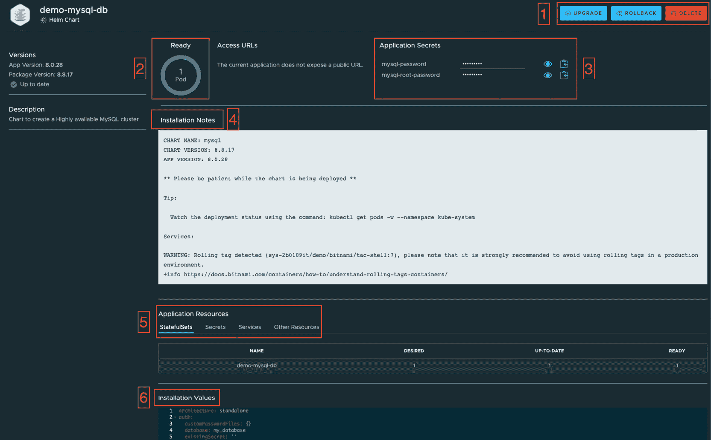

图 4.30 – MySQL 数据库在 Kubeapps 上的部署状态

*图 4.30* 包含以下详细信息：

+   第一部分显示了用于执行部署生命周期操作的不同按钮，包括将其升级到 MySQL 的更新版本、回滚到先前版本或删除不需要的部署。点击按钮会触发它们对应的 Kubernetes 部署生命周期操作。

+   第二部分显示了我们的部署中健康运行的 pod 数量。

+   第三部分显示了在之前的安装配置步骤中提供的身份验证凭据，如 *图 4.29* 所示。

+   第四部分显示了使用已部署工具的一些有用提示和细节。例如，在我们的案例中，它显示了如何连接到此处部署的 MySQL 数据库实例。

+   第五部分显示了作为此安装的一部分部署的不同 Kubernetes 资源。我们可以通过点击相应的标签来查看资源的详细信息。

+   第六部分显示了用于部署该 MySQL 数据库实例的最终安装配置。我们可以将 YAML 配置保存到文件中，以便以后使用该配置重新部署相同类型的 MySQL 实例。

通过这些内容，我们已经涵盖了如何使用 Kubeapps 来消费通过 VAC 创建的自定义应用程序目录，从而以自助服务的方式快速部署多个 OSS 工具的详细信息。将这样的设置提供给开发人员以部署所需的应用程序后端服务，可以提高他们的生产力，减少整体应用程序开发时间，从而提高企业的创新速度。而且，使用 Kubeapps 和 VAC 不仅是为了开发人员，也适用于 DevOps、平台和基础设施工程师，他们可以使用来自受信来源的容器镜像和 Helm 图表来部署和使用许多流行的 OSS 工具。

现在，让我们再来看看 VAC 的另一个第二天活动，目录管理员需要执行的活动——在 VAC 门户上更新目录。

## 更新应用程序目录

在本章前面，我们看到，作为第二天活动的一部分，如何从 VAC 门户获取供应的工件的不同报告和日志。然后我们讲解了如何使用自动化流水线或 Kubeapps 来消费 VAC 提供的 OSS 工具目录。现在，让我们来看看关于 VAC 的最后一个主要第二天活动——更新目录项目。

### 添加新目录项目

若要将新的 OSS 应用程序添加到企业目录中，目录管理员可以使用 VMware Cloud Services 凭证访问其企业 VAC 账户。进入 VAC 门户后，目录管理员可以在**应用程序**部分选择**添加新应用程序**按钮，如*图 4.31*所示：

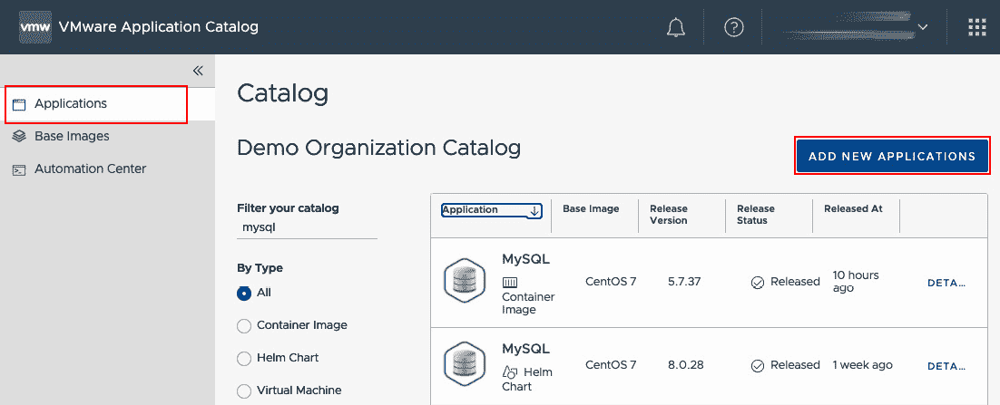

图 4.31 – 在 VAC 门户上添加目录新项目

点击*图 4.31*中突出显示的按钮后添加新目录项目的步骤与我们在本章前面创建新目录时讲解的步骤相同：

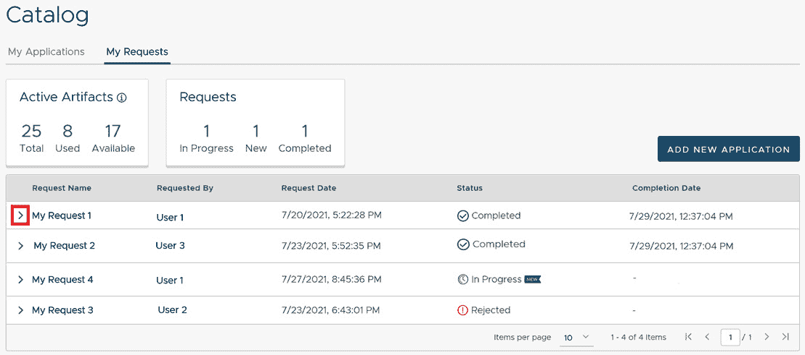

图 4.32 – 在 VAC 门户上请求状态跟踪

新添加的项目将出现在**我的请求**下，如*图 4.32*所示。

### 做出额外的目录更改

除了在目录中添加新项目外，我们还可能需要从目录中移除不需要的工具，更新基础操作系统层，更新目标存储库详细信息，以及包括/排除 Helm 图表。如果在撰写本书时，所有这些操作只能通过联系 VAC 支持来执行，因为 VAC 门户目前未提供自助服务接口来执行这些操作。

这样，我们就涵盖了 VAC 的大部分第二天活动。让我们回顾一下，总结一下我们在本章中的学习内容。

# 总结

在本章中，我们看到近年来使用开源软件（OSS）工具的普及程度显著增加。如今，有几款成熟的开源软件工具，许多组织在其生产环境中自信地使用它们。此外，在 Kubernetes 上运行软件，如容器，与容器化的客户端应用程序一起运行，是为应用程序配备适当后端技术的快速方法。但是，使用公共容器注册中心（如 Docker Hub）上可用的容器镜像并不是部署这些开源软件工具的安全方式。因此，大多数组织不鼓励这种做法，并试图采用一些内部机制来生成专门用于开源软件消费的内部管理容器镜像。将这些工作放在内部进行，不仅浪费大量资源，还会使开发团队不愿意尝试各种工具，或者浪费生产力等待这些工具准备好供使用。这时，VAC 就派上了用场。我们看到 VAC 如何通过提供一种方式，帮助我们策划定制的所需开源软件工具目录，确保它们可以在内部安全地使用。

我们还学习了 VAC 的工作原理及其关键组件。接下来，我们学习了如何开始使用 VAC 来定义一个目录，并设置 Kubeapps 来消费在该定制目录下提供的 Helm 图表和容器镜像。最后，我们了解了一些关于目录消费和管理的关键日常操作。我们看到如何通过该目录提供的 Helm 图表，快速部署 MySQL 数据库实例。我们还回顾了目录管理员如何查看并获取 CVE 扫描报告、病毒扫描日志、测试日志和所有通过 VAC 服务交付的容器镜像和 Helm 图表的资产规范（物料清单）副本。

在看到如何利用丰富的开源软件工具选择，快速构建我们的应用程序并将其作为后端使用后，在下一章中，我们将学习如何使用 Tanzu 应用程序工具来构建和管理由我们应用程序暴露的 API 接口。
