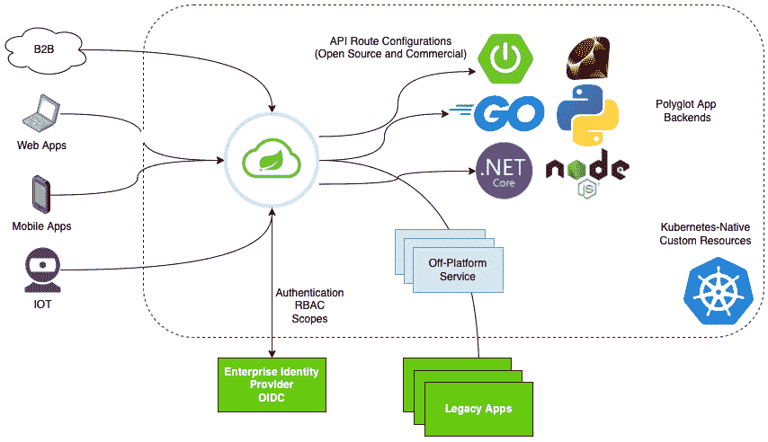
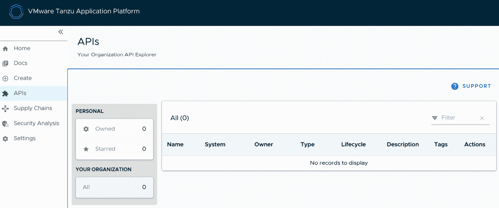
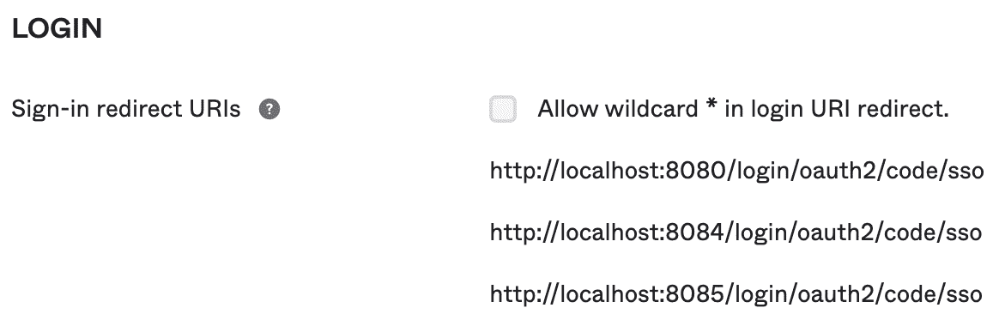
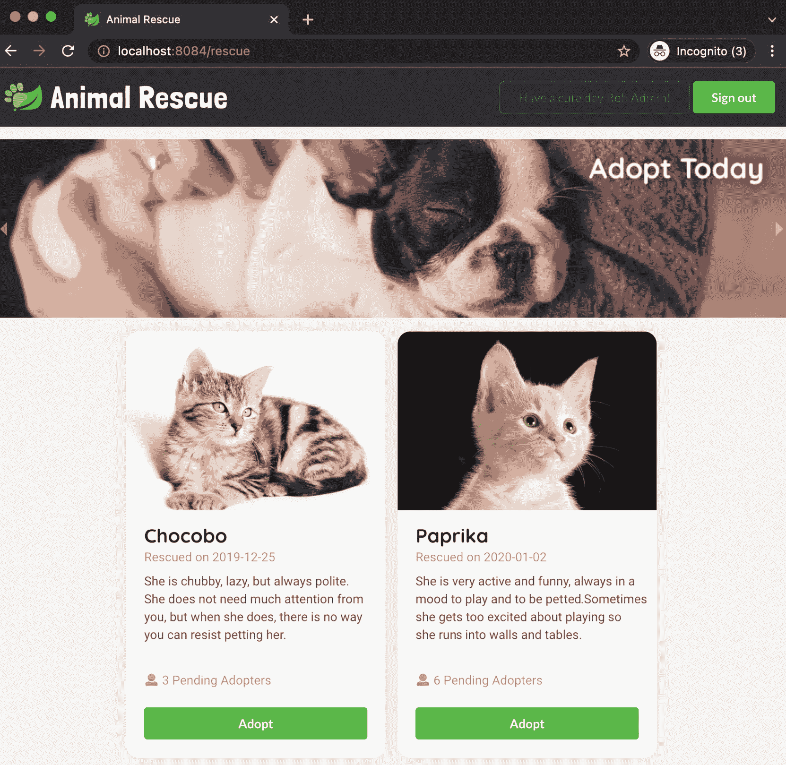
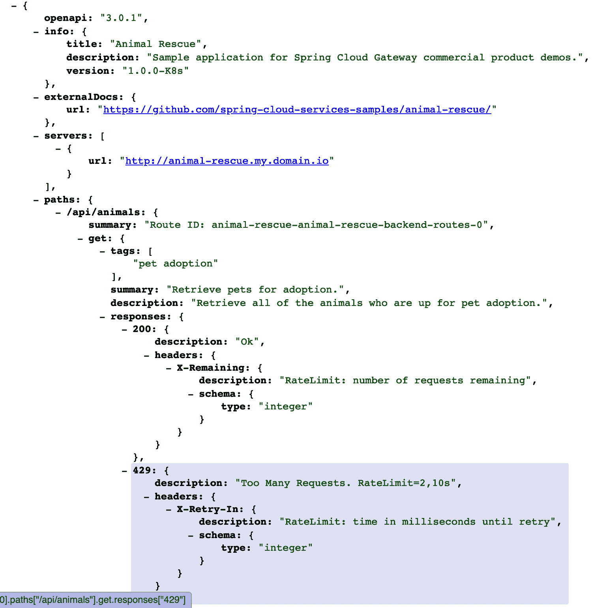
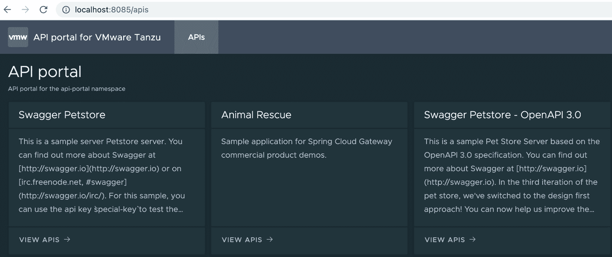
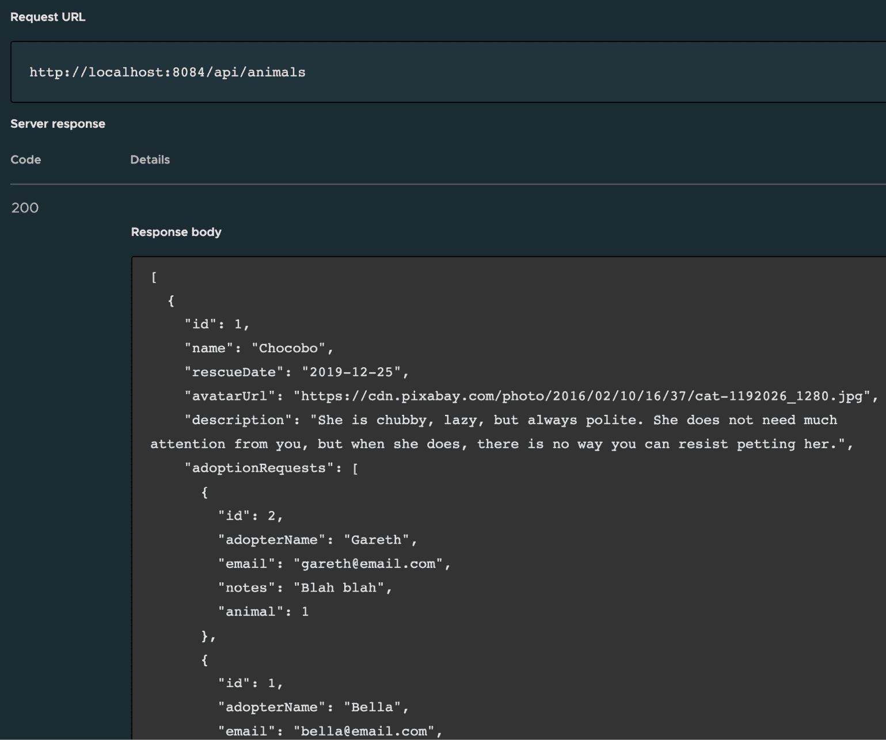
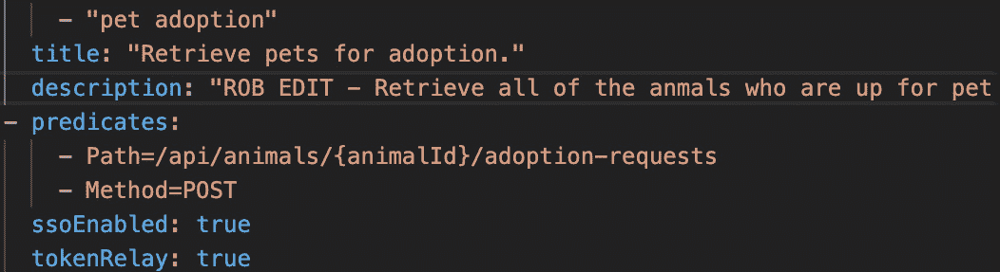
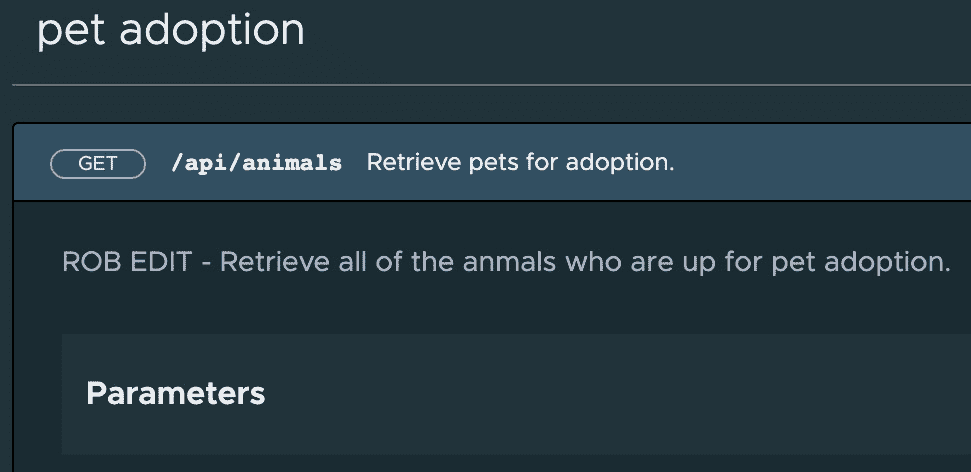

# 第五章：定义和管理业务 API

**应用程序编程接口**（**API**）与数字计算的发展一样悠久，但随着我们不断将现代生活的各个方面互联，它们比以往任何时候都更为重要。它们构成了大多数企业应用程序的骨干，并帮助推动现代世界的发展。正是这种 API 的迅猛增长，使得它们成为企业中浪费、冗余和不良实践的主要来源。

本章介绍了两款专注于解决这一问题领域的产品：**Spring Cloud Gateway for Kubernetes** 和 **API 门户 for VMware Tanzu**。和 Tanzu 组合中的每个产品一样，这些产品解决了一个具体的迫切业务需求：即开发、运维、发布、保护、监控、文档化、搜索和消费 API。

在本章中，我们将涵盖以下主题：

+   Spring Cloud Gateway for Kubernetes 和 VMware Tanzu 的 API 门户 – 概述

+   为什么选择 Spring Cloud Gateway for Kubernetes？

+   为什么选择 VMware Tanzu 的 API 门户？

+   Spring Cloud Gateway for Kubernetes – 入门指南

+   VMware Tanzu 的 API 门户 – 入门指南

+   Spring Cloud Gateway for Kubernetes 和 VMware Tanzu 的 API 门户 – 真实世界的应用案例

+   Spring Cloud Gateway for Kubernetes 和 VMware Tanzu 的 API 门户 – 第二天操作

# Spring Cloud Gateway for Kubernetes 和 VMware Tanzu 的 API 门户 – 概述

在开始产品安装之前，让我们重新审视一下我们为何要做这个。 我喜欢用三种角色来看待 API 空间。分别是 **API 开发者**、**API 消费者** 和 **API 运维人员**。每个角色都有自己的一套问题。

如果我开发 API，每个项目中都有一些反复出现的问题，我必须解决：

+   将我的 API 提供给客户

+   终止 *TLS*

+   处理 *CORS* 和浏览器限制

+   使我的 API 可发现

+   保护我的 API 端点，确保只有特定的群体才能执行某些功能

+   通过速率限制请求来防止滥用

+   重写请求路径

+   重写请求和响应头

API 术语

**传输层安全性**（**TLS**）是您在银行网站 URL 旁边看到的那个安慰性锁的加密技术。它在 API 领域尤为重要，因为大多数敏感的财务数据、个人消息和健康信息都是通过 API 传输的。它尤其难以正确实现，最好通过 API 网关集中处理，而不是让每个 API 开发者自己实现。

**跨域资源共享**（**CORS**）是 API 领域工程师特别重要的一个话题。CORS 是一种机制，它允许浏览器在后台（通常称为 AJAX 调用）让一个网站向另一个网站发起请求。这样做有正当理由，但这一技术常常被不法分子利用，试图窃取凭证或敏感信息。配置网站及其支持的 API，使得只有受信任的 AJAX 调用被允许，是复杂的，并且容易出错。这也是为什么最好将这一逻辑集中在 API 网关中的原因之一。

现在，假设我需要使用 API，我将面临一组完全不同的问题：

+   我需要的 API 是否存在？

+   我在哪里可以找到我需要的 API？

+   一旦我找到这些 API，如何访问它们？

+   这些 API 是否需要认证？如果需要，是什么权限范围？

+   在编写大量代码来消费 API 之前，如何测试这些 API？

最后，如果我是一个托管 API 的平台运营者，我可能需要做以下事情：

+   提供开发者自助访问 API 网关的能力，让他们可以自行配置

+   监控并对 API 的相关指标进行告警

+   提供一个具有极高吞吐量的 API 网关，以避免成为瓶颈

+   提供统一的实现，涵盖以下常见功能：

    +   **SSO**（**单点登录**）

    +   限流

    +   头部操作

    +   头部/内容丰富化

+   在必要时，让开发者构建自定义过滤器并将其插入到 API 网关中

+   管理开发者的 API 网关生命周期和升级

+   在可能的情况下，根据部署到网关的内容自动生成 API 文档

+   提供一个单一可搜索的位置，开发者可以在这里发现并试用我所管理的所有 API

**Kubernetes 的 Spring Cloud Gateway** 和 **VMware Tanzu 的 API 门户** 主要是为所有三类用户的需求提供简单、直接、面向企业的解决方案。

现在我们对所涵盖的话题有了一个高层次的概览，让我们将其细分为两个产品的“为什么”。我们从 *Kubernetes 上的 Spring Cloud Gateway* 开始。

# 为什么选择 Kubernetes 上的 Spring Cloud Gateway？

**Kubernetes 的 Spring Cloud Gateway** 基于开源的 *Spring Cloud Gateway* 项目：[`spring.io/projects/spring-cloud-gateway`](https://spring.io/projects/spring-cloud-gateway)。Spring Cloud Gateway 是一个用于构建高性能 API 的库。你像正常的 Spring 应用一样部署它，并按照配置 Spring 应用的方式进行配置。不幸的是，开源项目并没有解决许多先前提到的问题——这些问题通常在企业中会遇到。

除了业务逻辑，开发人员还必须打包、配置并部署一个 Spring Cloud Gateway 应用，或者将其作为库捆绑到现有应用中。无论哪种方式，都会增加相当大的复杂性。除非他们使用 Spring 框架的一些高级功能，否则任何对 API 路由的更改都将涉及重建和重新部署应用。

此外，开源的 Spring Cloud Gateway 仍然没有解决操作员的一些问题。如果每个开发团队都在做自定义部署 Spring Cloud Gateway，操作员就无法推理每个网关的路由如何暴露，或者它如何发出度量指标。此外，多个团队共享一个网关也没有简单的方法，因为它们都需要在各自的时间表上配置和部署它。

这就是 Spring Cloud Gateway for Kubernetes 进入的地方。Spring Cloud Gateway for Kubernetes 是一个商业化的 Tanzu 产品，包含了开源版本的超集功能。它专门面向企业，旨在大规模管理软件。它使用 Kubernetes Operator 来管理三个主要对象：

+   Spring Cloud Gateway 的实例

+   API 路由——告诉网关如何过滤传入请求并将其发送到哪里

+   API 路由到 Spring Cloud Gateway 的映射

通过将这三个实体暴露为 Kubernetes **自定义资源**，Spring Cloud Gateway for Kubernetes 可以抽象出以下内容：

+   打包和部署 Spring Cloud Gateway 实例

+   管理 Spring 代码以配置这些实例

+   在不重新部署的情况下动态更新该配置

+   生命周期管理——跨所有 Kubernetes 集群管理所有网关实例

+   批量推理网关实例：

    +   它们以相同的方式发出度量指标，因此我可以轻松地聚合它们的所有度量数据

    +   它们以相同的方式暴露其 API 配置，因此我可以聚合该配置并对其进行报告，或者正如我们稍后将看到的，利用它来驱动其他有用的工具，比如 VMware Tanzu 的 API Portal

总结一下，Spring Cloud Gateway for Kubernetes 使用 Kubernetes Operator 和一些非常战略性的**自定义资源定义**，使得已经非常强大的开源 Spring Cloud Gateway 成为一个一流的 Kubernetes 产品，并真正关注企业级问题，成为一个企业级的产品。这可以通过以下图示来总结：



图 5.1 – Kubernetes 上的 Spring Cloud Gateway 一览

既然我们已经讨论了如何部署 API，现在让我们来看看如何最佳地使用它们。我们来看看**VMware Tanzu 的 API Portal**。

# 为什么选择 VMware Tanzu 的 API Portal？

就像 **Spring Cloud Gateway for Kubernetes** 是一个自助工具，允许开发者和运维人员统一部署、管理和保护他们的 API，**API Portal for VMware Tanzu** 也是一个自助工具，允许开发者和消费者发布、记录、搜索、发现并尝试这些 API。

就像 **Spring Cloud Gateway for Kubernetes** 使得部署多个网关以支持多个用例或环境变得简单一样，**API Portal for VMware Tanzu** 使得在这些相同的用例或环境中部署多个可搜索的目录变得容易。

这种面向 API 目录的分布式 Kubernetes 原生方法可以跨多个大型团队进行扩展，并支持自助服务，从而提高开发者的生产力和满意度。

此外，将 API 门户与企业 SSO 集成是一个简单直接的操作，这样合适的人就可以找到适合他们需求的 API。

既然我们知道了*为什么*要学习这些产品，现在就让我们开始安装并尝试它们吧。我们先来了解一些技术要求，然后就可以开始使用**Spring Cloud Gateway** **for Kubernetes**了。

# 技术要求

**API Portal for VMware Tanzu** 是本书中另一个产品的子组件，**Tanzu 应用平台 (TAP)**。要开始使用 VMware Tanzu 的 API Portal，首先需要安装一个 Kubernetes 集群，然后在该集群上安装 TAP。你可以自由选择任何你喜欢的 Kubernetes 发行版。如果你需要有关如何搭建集群的指导，可以参考本书末尾的附录，其中介绍了几种搭建 Kubernetes 集群的选项。

一旦你有了一个正在运行的 Kubernetes 集群，你需要稍微跳转到*第八章*，*通过 Tanzu 应用平台提升开发者生产力*，并安装*Tanzu 应用平台*。那一章讲解了一个更复杂的端到端用例，而这一章仅专注于*API* *Portal* 组件。

接下来，你需要一个容器注册表账户，该注册表提供一个被你的 Kubernetes 集群信任的 TLS 证书。最简单的方法是注册一个 Docker Hub 的免费开发者账户。只需访问 [`hub.docker.com`](https://hub.docker.com) 并注册即可。

如果你想部署真实世界的用例，你将需要一个 OIDC 提供者来支持 SSO。如果你还没有相关服务，我推荐你在 Okta 上注册一个免费的开发者账户：[`developer.okta.com/signup/`](https://developer.okta.com/signup/)。在本章稍后，你将看到一些关于如何设置账户以便与我们的真实世界示例应用程序一起使用的详细说明。

在撰写时，**Spring Cloud Gateway for Kubernetes** 安装需要 *helm* CLI，你可以在这里找到它：[`helm.sh/docs/intro/install/`](https://helm.sh/docs/intro/install/)。

最后，我们需要 *kustomize* CLI，可以在这里找到：[`kustomize.io`](https://kustomize.io)。如果你只想下载二进制文件，也可以访问这里：[`kubectl.docs.kubernetes.io/installation/kustomize/binaries`](https://kubectl.docs.kubernetes.io/installation/kustomize/binaries)。

现在，我们已经在 Kubernetes 上运行了 *Tanzu 应用平台*，可以安装 **Spring Cloud Gateway for Kubernetes** 和 **API Portal for VMware Tanzu**。

首先，让我们再次确认我们是否已经准备好了所有先决条件：

+   我们需要一个最新版本的 `kapp` 控制器——至少是 0.29.0：

    ```
    $ kubectl get deploy -n kapp-controller kapp-controller -ojsonpath='{.metadata.annotations.kapp-controller\.carvel\.dev/version}'
    ```

    ```
    v0.29.0
    ```

+   我们还需要 `secretgen` 控制器：

    ```
    $ kubectl get deploy -n secretgen-controller
    ```

    ```
    NAME                   READY   UP-TO-DATE   AVAILABLE   AGE
    ```

    ```
    secretgen-controller   1/1     1            1           23h
    ```

+   让我们确保安装了最新版本的 `helm` 和 `kustomize`：

    ```
    $ helm version
    ```

    ```
    version.BuildInfo{Version:"v3.5.3", GitCommit:"041ce5a2c17a58be0fcd5f5e16fb3e7e95fea622", GitTreeState:"dirty", GoVersion:"go1.15.8"}
    ```

    ```
    $ kustomize version
    ```

    ```
    {Version:kustomize/v4.0.5 GitCommit:9e8e7a7fe99ec9fbf801463e8607928322fc5245 BuildDate:2021-03-08T20:53:03Z GoOs:darwin GoArch:amd64}
    ```

+   最后，我们应该测试是否有可写的 Docker 仓库和工作中的 Docker CLI。以下是一种简单的方法来测试一切是否已正确设置。我将使用 `dockerhub` 作为注册表，但你也可以使用你选择的任何解决方案：

    ```
    $ export DOCKER_USER=<your dockerhub username>
    ```

    ```
    $ docker pull hello-world
    ```

    ```
    $ docker tag hello-world docker.io/$DOCKER_USER/hello-world
    ```

    ```
    $ docker push docker.io/$DOCKER_USER/hello-world
    ```

如果一切没有错误，恭喜！你应该已经具备了所有技术要求，可以继续进入下一部分，安装 **Spring Cloud Gateway for Kubernetes** 和 **API Portal for VMware Tanzu**！

# Spring Cloud Gateway for Kubernetes – 入门指南

让我们从安装 **Spring Cloud Gateway for Kubernetes** 开始。这个产品有两个独立的部分：Kubernetes 操作员和部署的网关。

*Kubernetes Operator* 与 Kubernetes API 协同工作，处理三个 *自定义* *资源定义*：

+   **SpringCloudGateway**（缩写：*scg*）：这是一个（可选）高可用实例的 Spring Cloud Gateway——为开发人员集中打包、部署并进行生命周期管理。

+   **SpringCloudGatewayRouteConfig**（缩写：*scgrc*）：这是为 Spring Cloud Gateway 实例提供的一组指令，涉及接受哪些主机/路径上的请求、如何过滤请求以及最终将其代理到哪个后端 Kubernetes 服务。

+   **SpringCloudGatewayMapping**（缩写：*scgm*）：这告诉 Kubernetes 操作员哪些 *SpringCloudGatewayRouteConfig* 与哪些 *SpringCloudGateways* 关联。操作员会自动重新配置 *SpringCloudGateways*，使其与 *SpringCloudGatewayRouteConfig* 的内容相匹配所需的 Spring 配置属性。

部署的 Spring Cloud Gateway 实例是产品的另一部分。Kubernetes 操作员启动多个这些网关，能够通过 Kubernetes 服务或 Ingress 接受传入的流量。然后，它会查找与特定 Spring Cloud Gateway 实例映射的 *SpringCloudGatewayRouteConfig*，并动态配置这些路由。

部署的 Spring Cloud Gateway 实例负责处理开发者 API 的 API 流量。Kubernetes 操作符是开发者自助服务配置 Spring Cloud Gateway 实例的方式，而（人工的，非 Kubernetes 的）操作员则可以自动监控并管理这些实例，且具备规模化能力。

安装过程非常简单，只需运行几个脚本将所需的容器镜像迁移到你的容器仓库，然后使用*Helm*将必要的 Kubernetes 工件部署到你的集群中。官方安装说明可以在此找到：[`docs.vmware.com/en/VMware-Spring-Cloud-Gateway-for-Kubernetes/1.0/scg-k8s/GUID-installation.html`](https://docs.vmware.com/en/VMware-Spring-Cloud-Gateway-for-Kubernetes/1.0/scg-k8s/GUID-installation.html)。

换句话说，安装步骤如下：

1.  从这个链接下载二进制文件：[`network.tanzu.vmware.com/products/spring-cloud-gateway-for-kubernetes`](https://network.tanzu.vmware.com/products/spring-cloud-gateway-for-kubernetes)。

1.  解压缩它。

1.  运行脚本，将本地`.tgz`镜像层推送到你的容器仓库。

1.  运行脚本，通过*helm*将一切部署到你的 Kubernetes 集群。

首先，让我们迁移我们的镜像。Kubernetes 操作符和已部署的 Spring Cloud Gateway 实例需要存在于一个外部镜像仓库中，该仓库必须能从 Kubernetes 集群访问。在此时，Spring Cloud Gateway for Kubernetes 是通过下载交付的，所有镜像文件都包含在下载的文件中。为了将这些文件放到 Kubernetes 可以访问的地方，我们需要将它们加载到本地 Docker 环境中并推送到远程仓库。如果你感兴趣的话，简单的 Docker 命令位于`scripts/relocate-images.sh`文件中。否则，只需导航到`scripts`目录并调用该脚本即可。我将分享我运行时的简短输出。`docker.io/rhardt`是我的仓库。如果你设置了 Docker Hub 账户，你的仓库会是`docker.io/<your-username>`：

```
bash-5.0$ ./relocate-images.sh docker.io/rhardt
Relocating image
================
image name: gateway
version: 1.0.8
source repository: registry.tanzu.vmware.com/spring-cloud-gateway-for-kubernetes/gateway:1.0.8
destination repository: docker.io/rhardt/gateway:1.0.8
Loaded image: registry.tanzu.vmware.com/spring-cloud-gateway-for-kubernetes/gateway:1.0.8
The push refers to repository [docker.io/rhardt/gateway]
1dc94a70dbaa: Layer already exists
… (more layers)
824bf068fd3d: Layer already exists
1.0.8: digest: sha256:8c1deade58dddad7ef1ca6928cbdd76e401bc0afaf7c44378d296bf3c7474838 size: 4500
Relocating image
================
image name: scg-operator
version: 1.0.8
source repository: registry.tanzu.vmware.com/spring-cloud-gateway-for-kubernetes/scg-operator:1.0.8
destination repository: docker.io/rhardt/scg-operator:1.0.8
Loaded image: registry.tanzu.vmware.com/spring-cloud-gateway-for-kubernetes/scg-operator:1.0.8
The push refers to repository [docker.io/rhardt/scg-operator]
1dc94a70dbaa: Layer already exists
… (more layers)
824bf068fd3d: Layer already exists
1.0.8: digest: sha256:da9f2677e437ccd8d793427e6cafd9f4bb6287ecffdc40773cf3b1f518f075fb size: 4498
```

所以，现在，我们已经将容器镜像放在了 Kubernetes 可以找到的地方。`relocate-images.sh`脚本的另一项功能是创建一个名为`scg-image-values.yaml`的文件，Helm 在部署到 Kubernetes 时会使用该文件。

我们将要运行的第二个脚本是`install-spring-cloud-gateway.sh`，同样位于`scripts`目录中。我建议你浏览一下这个脚本，它是一个全面的 helm 部署的优秀示例，包含了更新现有安装、超时设置、失败时的错误诊断以及检查部署是否成功的具体说明：

```
bash-5.0$ ./install-spring-cloud-gateway.sh
chart tarball: spring-cloud-gateway-1.0.8.tgz
chart name: spring-cloud-gateway
Waiting up to 2m for helm installation to complete
Release "spring-cloud-gateway" does not exist. Installing it now.
NAME: spring-cloud-gateway
LAST DEPLOYED: Mon Feb 21 18:25:13 2022
NAMESPACE: spring-cloud-gateway
STATUS: deployed
REVISION: 1
TEST SUITE: None
NOTES:
This chart contains the Kubernetes operator for Spring Cloud Gateway.
Install the chart spring-cloud-gateway-crds before installing this chart
Checking Operator pod state
deployment "scg-operator" successfully rolled out
 Operator pods are running
Checking custom resource definitions
 springcloudgatewaymappings.tanzu.vmware.com successfully installed
 springcloudgatewayrouteconfigs.tanzu.vmware.com successfully installed
 springcloudgateways.tanzu.vmware.com successfully installed
Successfully installed Spring Cloud Gateway operator
bash-5.0$
```

现在我们已经安装了 Spring Cloud Gateway for Kubernetes，让我们继续进行 VMware Tanzu 的 API 门户操作。

# VMware Tanzu 的 API 门户 – 入门

与 *Spring Cloud Gateway for Kubernetes* 不同，VMware Tanzu 的 API 门户是 *Tanzu 应用平台* 的一部分，你之前在 *技术要求* 部分已经安装了它。你可以通过访问 Tanzu 应用程序 GUI 来验证 API 门户是否已安装并运行，地址可以是本地端口转发地址，如 `http://localhost:8081`，也可以是你的 ingress 域名，如 `http://tap-gui.example.com`。这取决于你选择的 Kubernetes 集群和 TAP 安装方式。一旦访问到 Tanzu 应用平台 GUI，点击左侧的 **APIs** 菜单项，你应该看到如下界面：



图 5.2 – API 门户

# VMware Tanzu 的 Spring Cloud Gateway 和 API 门户 – 真实世界的使用案例

现在，我们将实现一个使用 **VMware Tanzu 的 API 门户** 和 **Spring Cloud Gateway for Kubernetes** 的真实世界案例。这将展示这些产品如何自然协同工作，以及作为开发者、消费者或 API 操作员，如何通过结合使用它们获得显著价值。

以下是我们接下来的步骤概览：

1.  我们将下载一个以 API 为驱动的应用，名为 *Animal Rescue*，其模拟了一个真实的动物领养网站，且支持 SSO。

1.  我们将设置 Okta 环境，使我们的应用能够使用 Okta 进行 SSO。然后，我们将 Okta 参数插入到 Animal Rescue 应用中。

1.  我们将把 Animal Rescue 应用部署到我们的 Kubernetes 集群，这将创建必要的 Spring Cloud Gateway 工件。通过这样做，我们将能够浏览和互动使用 Animal Rescue Web 应用。

1.  我们将修改 API 门户的安装，使其连接到 Spring Cloud Gateway Kubernetes Operator，该 Operator 现在已经知道所有 Animal Rescue 应用的 API 路由，并将其作为 OpenAPIv3 暴露。

1.  我们将通过端口转发到我们的 API 门户，以便探索和尝试 Animal Rescue 的 API。

现在你已经知道我们要实现的目标，接下来是步骤。

## 步骤 1 – 克隆本书的 Git 仓库并导航到 Animal Rescue 应用

使用 Git CLI 克隆本书的代码库，然后导航到 *animal-rescue* 应用，如下代码片段所示：

```
bash-3.2$ git clone https://github.com/PacktPublishing/DevSecOps-in-Practice-with-VMware-Tanzu
Cloning into 'DevSecOps-in-Practice-with-VMware-Tanzu'...
remote: Enumerating objects: 499, done.
remote: Counting objects: 100% (499/499), done.
remote: Compressing objects: 100% (351/351), done.
remote: Total 499 (delta 95), reused 473 (delta 75), pack-reused 0
Receiving objects: 100% (499/499), 9.80 MiB | 10.39 MiB/s, done.
Resolving deltas: 100% (95/95), done.
bash-3.2$ cd DevSecOps-in-Practice-with-VMware-Tanzu/chapter-05/animal-rescue/
bash-3.2$
```

## 步骤 2 – 配置你的 Okta 开发者账户，以为 Animal Rescue 提供 SSO

这些步骤稍显复杂，因此我建议直接参考 VMware 文档中的说明：[`docs.vmware.com/en/VMware-Spring-Cloud-Gateway-for-Kubernetes/1.0/scg-k8s/GUID-sso-setup-guide.html`](https://docs.vmware.com/en/VMware-Spring-Cloud-Gateway-for-Kubernetes/1.0/scg-k8s/GUID-sso-setup-guide.html)。

完成设置后，我们需要再执行一个额外的步骤，以使此示例生效。我们需要为“gateway”应用添加两个额外的登录重定向 URI。此截图展示了我的 Okta 设置：



图 5.3 – Okta 登录重定向 URI 的截图

我们将会将动物拯救应用程序端口转发至 `http://localhost:8084`，API 网关端口转发至 `http://localhost:8085`；我们希望两者都能通过 Okta 进行身份验证。

在此练习结束时，您需要从您的 Okta 环境中获取三个信息：`issuer-id`、`client-id`和`client-secret`。

VMware 文档将指导您如何使用该信息配置动物拯救应用程序。我也会在此处包含它。这些步骤是相对于我们在前一节从 GitHub 克隆的 `animal-rescue` 应用程序：

+   创建 `backend/secrets/sso-credentials.txt`，内容如下：

    ```
    jwk-set-uri=<issuer uri>/v1/keys
    ```

+   创建 `gateway/sso-secret-for-gateway/secrets/test-sso-credentials.txt`，内容如下：

    ```
    scope=openid,profile,email,groups,animals.adopt
    ```

    ```
    client-id=<client id>
    ```

    ```
    client-secret=<client id>
    ```

    ```
    issuer-uri=<issuer uri>
    ```

文档中提到的一些额外步骤，如编辑 `roles-attribute-name` 或配置路由安全性，已经在您下载的应用程序版本中完成。

## 第三步 – 部署动物拯救应用程序

从 `animal-rescue` 目录开始 – 也就是您克隆的应用程序的主目录 (`DevSecOps-in-Practice-with-VMware-Tanzu/chapter-05/animal-rescue`) – 运行以下命令：

```
bash-5.0$ kustomize build . | kubectl apply -f -
namespace/animal-rescue created
secret/animal-rescue-sso created
secret/sso-credentials created
service/animal-rescue-backend created
service/animal-rescue-frontend created
deployment.apps/animal-rescue-backend created
deployment.apps/animal-rescue-frontend created
ingress.networking.k8s.io/gateway-demo created
springcloudgateway.tanzu.vmware.com/gateway-demo created
springcloudgatewaymapping.tanzu.vmware.com/animal-rescue-backend-routes created
springcloudgatewaymapping.tanzu.vmware.com/animal-rescue-frontend-routes created
springcloudgatewayrouteconfig.tanzu.vmware.com/animal-rescue-backend-route-config created
springcloudgatewayrouteconfig.tanzu.vmware.com/animal-rescue-frontend-route-config created
```

此时，您可以观察动物拯救命名空间中所有 Pod 何时启动完成：

```
bash-5.0$ kubectl get pods -n animal-rescue -w
NAME                                     READY   STATUS    RESTARTS   AGE
animal-rescue-backend-546fc6c569-kgj2s   1/1     Running   0          27m
animal-rescue-frontend-b74f54847-rq284   1/1     Running   0          27m
gateway-demo-0                    1/1     Running   0          23m
gateway-demo-1                    1/1     Running   0          24m
```

一旦 Pod 启动完成，我们可以将端口转发到 `localhost:8084`。

此时，我强烈建议在*无痕*浏览器窗口中操作，以防止应用程序对您的 Okta 开发人员帐户产生混淆。

打开您的浏览器访问 `http://localhost:8084`；您应该看到动物拯救 Web 应用程序，其中包含可爱的动物供您领养，并在右上角有一个 SSO 登录按钮。如果您正确配置了一切，点击该按钮将带您进入 Okta 登录页面，然后登录后返回运行中的应用程序。这就是我在浏览器中看到的样子。请注意右上角显示我的 Okta 用户名的文本：



图 5.4 – 动物拯救截图

到目前为止，一切顺利！现在，让我们将事情提升到下一个级别，并将此 API 集成到**VMware Tanzu 的 API 门户**中。

## 第四步 – （可选）查看动物拯救 API 的 OpenAPI 3.0 规范

在我看来，这是这对产品中最引人注目的特性之一。

在实践中，开发人员负责手动将其 API 规范保持在某种文档格式中，通常是 OpenAPI 3.x 或 Swagger。对于开发人员来说，这是件繁琐的事情，在激烈的战斗中，API 规范往往是第一个不再维护的东西。这意味着新的消费者将根据不正确、过时的 API 文档来构建他们的客户端。

一旦您部署了*动物救援*应用程序，Spring Cloud Gateway Kubernetes Operator 将管理所有路由 - 也就是说，Kubernetes Operator 管理 Spring Cloud Gateway 实例的配置，以便每个 API 调用都正确路由到正确的后端服务，以及任何过滤器、安全性和元数据。这足以自动生成 API 的 OpenAPI 3.0 规范。

很难低估这是一个突破。控制 API 运行时配置的实际 Kubernetes 对象用于自动生成始终准确、始终最新的 OpenAPI 3.0 文档。这减轻了 API 开发者的文档创建和维护负担，以及 API 消费者在处理过时文档时的负担。

让我们快速查看一下我们的动物救援 API 自动生成的文档。通过 Spring Cloud Gateway Operator 在所有网关上部署的每个 API 的 OpenAPI 3.0 文档可通过 Web 端点访问。该 Web 端点通过 ClusterIP 服务公开。

在生产环境中，您可能希望在该服务前面放置一个 TLS 安全的入口，但出于演示目的，让我们快速设置一个端口转发：

```
bash-5.0$ kubectl get svc -n spring-cloud-gateway
NAME           TYPE        CLUSTER-IP      EXTERNAL-IP   PORT(S)   AGE
scg-operator   ClusterIP   10.98.103.232   <none>        80/TCP    40h
bash-5.0$ kubectl port-forward -n spring-cloud-gateway svc/scg-operator 8083:80
Forwarding from 127.0.0.1:8083 -> 8080
Forwarding from [::1]:8083 -> 8080
```

首先，我们确定`spring-cloud-gateway`服务在端口`80`上运行，因此我们将本地工作站的端口`8083`转发到该服务的端口`80`。现在，我们可以将 Web 浏览器指向`http://localhost:8083`，神奇的事情发生了！您将看到`动物救援`API 的 OpenAPI 3.0.1 表示，如下面的屏幕截图所示：



图 5.5 - 动物救援自动生成的 OpenAPI 3.0.1 规范

这是一个 100%有效和准确的 OpenAPI 3.0 文档，因此可以使用任何可以从该格式生成客户端或服务器存根的工具。此外，Kubernetes 的`SpringCloudGatewayRouteConfig`对象包含以下字段：

+   人类可读的描述

+   所有可能的响应代码及其含义

+   需要任何形式的身份验证

换句话说，驱动实际运行时行为的现实世界 Kubernetes 对象也驱动文档，因此它始终准确且最新。

## 第 5 步 - （可选）将 API Portal for VMware Tanzu 连接到 Spring Cloud Gateway for Kubernetes OpenAPI 端点

正如我们之前演示的，**API Portal for VMware Tanzu**完全由 OpenAPI 3 或 Swagger 文档驱动。因此，我们设置 API 门户以消费**Spring Cloud Gateway for Kubernetes**生成的 OpenAPI 3 文档是理所当然的。如果您在上一步骤中设置了端口转发，您可以退出它。由于 API 门户和 Spring Cloud Gateway 位于同一 Kubernetes 集群上，它们可以通过 ClusterIP 服务进行通信。

我们之前安装了`tanzu package`命令。现在，让我们编写一个简单的配置文件，用于覆盖 API 门户将搜索 OpenAPI 3 文档的位置，并更新软件包安装。

首先，创建一个名为`api-portal-values.yaml`的文件，其内容如下：

```
apiPortalServer:
   sourceUrls:  https://petstore.swagger.io/v2/swagger.json,https://petstore3.swagger.io/api/v3/openapi.json,http://scg-operator.spring-cloud-gateway.svc.cluster.local/openapi
```

正如您所见，我们正在将 Spring Cloud Gateway Operator 的 ClusterIP 服务附加到 API 门户将搜索 API 文档的位置列表中。

现在，我们可以使用`tanzu package`命令更新安装。在幕后，API 门户将使用新配置重新部署。这种部署软件的方法消除了配置漂移，因为对部署的任何手动配置更改都将被`kapp`控制器覆盖：

```
bash-5.0$ tanzu package installed update api-portal -n tap-install -f api-portal-values.yaml
| Updating installed package 'api-portal'
| Getting package install for 'api-portal'
| Getting package metadata for 'api-portal.tanzu.vmware.com'
| Creating secret 'api-portal-tap-install-values'
| Updating package install for 'api-portal'
/ Waiting for 'PackageInstall' reconciliation for 'api-portal'
/ 'PackageInstall' resource install status: Reconciling
Updated installed package 'api-portal' in namespace 'tap-install'
bash-5.0$
```

现在，让我们重新配置我们的端口转发到我们的 API 门户：

```
bash-5.0$ kubectl get svc -n api-portal
NAME                TYPE        CLUSTER-IP       EXTERNAL-IP   PORT(S)    AGE
api-portal-server   ClusterIP   10.103.142.154   <none>        8080/TCP   40h
bash-5.0$ kubectl port-forward -n api-portal svc/api-portal-server 8085:8080
Forwarding from 127.0.0.1:8085 -> 8080
```

并且在打开 Web 浏览器到`http://localhost:8085`时，我们应该在列表中看到我们的`Animal Rescue` API，如下图所示：



图 5.6 – 带有 Animal Rescue API 的 API 门户

在`Animal Rescue`图块中，点击**VIEW APIS**。然后，在结果屏幕上，依次点击**/api/animals**，然后**尝试执行**，最后**执行**。如果一切配置正确，您应该在**服务器响应**部分看到一些 JSON 格式的动物数据，如下图所示：



图 5.7 – 从浏览器尝试 API

只要清楚，您可以直接从 API 门户界面*尝试*API。

在安装了这两个产品、将它们连接在一起并实现复杂的现实世界应用程序的令人兴奋体验之后，我们必须面对不可避免的事实。在部署一个工作的软件片段的乐趣已经消失之后，维护和支持的持续任务将继续存在。我们将在下一节讨论这一点。

# 使用 Tanzu Application Accelerator 的常见第二天操作

恭喜！如果您已经走到这一步，您已经建立了一个可以在企业软件开发操作中释放令人难以置信的价值的 API 发布和消费模型。

企业中通常的情况是，困难并不在于安装和配置某些东西，而是在于随着时间的推移对其进行操作。让我们看看一些这样的第二天操作。

## 更新 API 的路由定义

假设我们发现了一个 API 路由描述中的拼写错误。我们希望能够实时更新该路由，并且让它自动传播到 API 门户，而无需额外配置。我们来做一下。导航到你从 GitHub 克隆的 `animal-rescue` 应用，并在编辑器中打开 `./backend/k8s/animal-rescue-backend-route-config.yaml` 文件。在第 17 行，你会看到一个以 *Retrieve all the anmals* 开头的描述。将其修改为 *Retrieve all the animals*。如果你想更确定一些，可以插入一些额外的文本。以下是我在编辑器中的样子。我特别想确认自己看到的是修改后的内容：



图 5.8 – 编辑 API 路由的描述

现在，我们只需要更新 Kubernetes 中的 Spring Cloud Gateway 路由配置，文档应该会自动更新。别忘了命名空间，原始安装时是通过 *kustomize* 添加的：

```
$ kubectl apply -f ./animal-rescue-backend-route-config.yaml -n animal-rescue
springcloudgatewayrouteconfig.tanzu.vmware.com/animal-rescue-backend-route-config configured
```

现在，如果你仍然保持着到 `api-portal` 的端口转发，你可以访问 `http://localhost:8085`，点击进入动物救援 `/api/animals` 路由，并实时查看你的更新！



图 5.9 – 查看 API 规范的实时更新

到目前为止，我们已经深入探讨了许多*day-0*和*day-1*任务，比如部署和使用 API。但任何在企业软件领域工作过的人都知道，我们的大多数时间和精力都花在*day-2*任务上：更新、监控、测量和改进软件。接下来我们简要介绍一些这些 day-2 任务。

## 更新 API Portal 包

`tanzu package` 命令与 kapp 控制器结合，给你带来了强大的能力，能够生命周期管理你部署的软件。在 API Portal 的情况下，你可以获取当前部署的版本，并查看哪些版本是可用的。然后，只需执行 `tanzu package installed update -n tap-install api-portal -v <new version>` 命令来更新它：

```
bash-5.0$ tanzu package installed list -n tap-install
| Retrieving installed packages...
  NAME        PACKAGE-NAME                 PACKAGE-VERSION  STATUS
  api-portal  api-portal.tanzu.vmware.com  1.0.8            Reconcile succeeded
```

我们当前安装的是 1.0.8 版本：

```
bash-5.0$ tanzu package available list -n tap-install api-portal.tanzu.vmware.com
/ Retrieving package versions for api-portal.tanzu.vmware.com...
  NAME                         VERSION  RELEASED-AT
  api-portal.tanzu.vmware.com  1.0.8    2021-12-15 19:00:00 -0500 EST
  api-portal.tanzu.vmware.com  1.0.9    2022-01-02 19:00:00 -0500 EST
```

看起来版本 1.0.9 最近已经发布：

```
bash-5.0$ tanzu package installed update api-portal -n tap-install -v 1.0.9
| Updating installed package 'api-portal'
| Getting package install for 'api-portal'
| Getting package metadata for 'api-portal.tanzu.vmware.com'
| Updating package install for 'api-portal'
/ Waiting for 'PackageInstall' reconciliation for 'api-portal'
Updated installed package 'api-portal' in namespace 'tap-install'
```

只需一个简单命令，我们的 `api-portal` 包就会自动更新到最新版本。

# 总结

API 无处不在。随着 OpenAPI 3 和 REST 成为开发者普遍接受的标准，企业开发者的工作中，创建、发布、发现和使用 API 已经占据了很大一部分。

在一个有大量开发者分布在不同团队的环境中，这不可避免地导致浪费：大量的时间、精力和金钱浪费。

开发者浪费精力逆向工程文档不足的 API。他们浪费时间找寻正确的 API。他们在弄清楚如何使 API 被广泛使用时消耗了不必要的资源。

一旦 API 部署完成，就会浪费大量时间和精力来确保 API 的安全性，并确保它能够在大型组织中共享，更不用说确保这些 API 得到维护并保持更新。

架构师可能会花费不必要的时间来构建一个用于发现 API 的中央集散地以及一个用于部署 API 的中央网关。

最终，操作员还需要负责监控和衡量跨多个平台的许多多语言 API。

使用你在本章中已经熟悉的工具，我希望你能大幅减少 API 的浪费，使你的团队、你的开发组织和你的公司变得极其成功、高效，并且以 API 为驱动。

在下一章中，我们将把重点从*构建*软件转移到*运行*软件。我们将通过深入探讨使用**VMware** **Harbor Registry**托管和维护 OCI 容器镜像及 Helm Charts 来开启我们的新重点领域。

# 第二部分 – 在 Tanzu 上运行云原生应用

本部分内容重点介绍了帮助在 Kubernetes 上运行现代云原生应用的工具和技术，涵盖了多云和多集群部署。

本书的这一部分包含以下章节：

+   *第六章*，*使用 Harbor 管理容器镜像*

+   *第七章*，*使用 Tanzu Kubernetes Grid 跨云编排容器*

+   *第八章*，*使用 Tanzu 应用平台提升开发者生产力*
