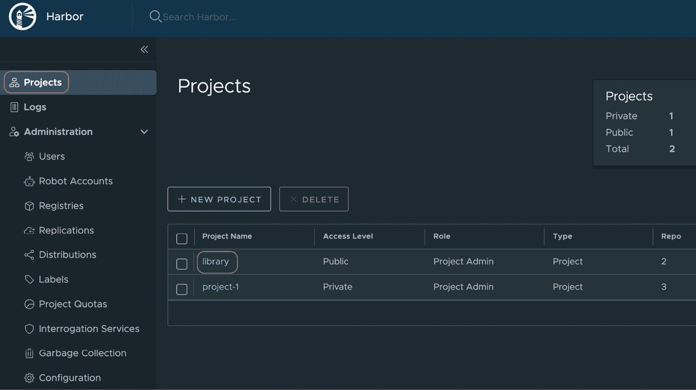
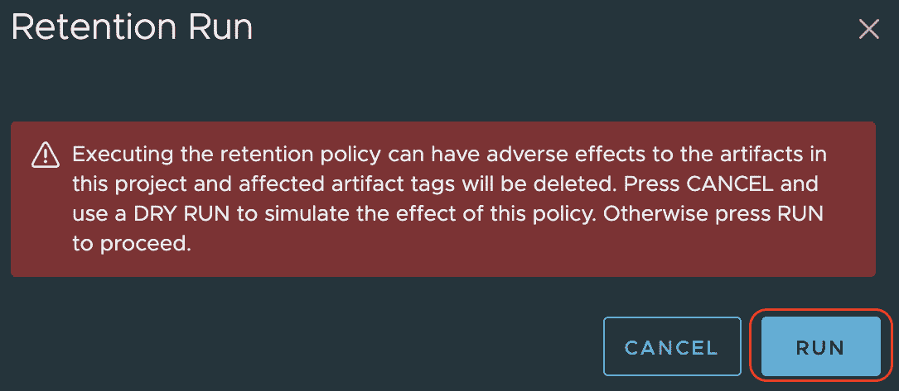

# 6

# 使用 Harbor 管理容器镜像

在前几章中，我们介绍了 Tanzu 产品组合中的工具，帮助我们构建云原生应用程序。我们从回顾构建、运行和管理现代云原生应用程序及其平台的发展历程开始。接着，我们看到如何使用模板开始应用开发，如何构建安全的容器镜像，如何为应用程序快速配置后端服务，以及如何使用各种 Tanzu 产品管理 API。在了解了如何构建云原生应用程序后，本章将深入探讨运行它们的各个方面。

正如本章标题所示，我们将学习如何管理我们的容器镜像，并通过 Harbor 安全地使其可访问，以便在 Kubernetes 上部署我们的应用程序。Harbor 是一个开源容器注册表项目，隶属于**云原生计算基金会**（**CNCF**）。尽管 Harbor 完全是开源工具，我们仍将其纳入本书，主要有三个原因。首先，Harbor 是由 VMware 孵化的，并于 2018 年中期捐赠给 CNCF。自那时起，VMware 也是该项目的主要贡献者之一，并积极投资于 Harbor。其次，Harbor 也被 CNCF 认定为一个毕业项目，这是 CNCF 生态系统中被标记为非常流行、成熟且稳定的项目状态。最后，将 Harbor 纳入本书的主要原因是，作为该项目的重要利益相关者，VMware 也为 Harbor 提供商业企业支持，并将其作为 Tanzu 产品组合的一部分。

附注

从此章开始，为了简洁起见，我们将把*容器镜像*简称为*镜像*。

在本章中，我们将详细介绍 Harbor，涵盖以下主题：

+   **为什么选择 Harbor？**：Harbor 的功能和特性概述

+   **探索 Harbor**：对 Harbor 架构的详细概述

+   **开始使用 Harbor**：学习如何安装和配置 Harbor

+   **Harbor 常见的二次操作**：学习如何执行与 Harbor 配置和使用相关的各种活动

让我们从了解 Harbor 的背景开始。

# 为什么选择 Harbor？

在本节中，我们将回顾使用 Harbor 作为容器注册表的各种特性、功能以及使用 Harbor 的理由。这些理由将通过以下内容进行解释：Harbor 的安全性、控制能力和可扩展性特性。

## 使用 Harbor 保障安全

Harbor 具备一些强大的安全性特点，使其成为容器注册表的优秀选择，它将安全性从应用程序生产过程中的反应性措施转变为主动性措施。让我们来回顾一下这些安全性优势：

+   Harbor 具备扫描每个镜像是否存在**关键漏洞暴露**（**CVEs**）的功能，这些漏洞可能源自镜像中使用的某些软件库和操作系统版本。此类扫描提供了详细的 CVE 报告，包括发现的 CVE 及其严重性等级、漏洞的详细信息以及该 CVE 已被修复的软版本。我们可以通过 web 门户或使用 Harbor 提供的 REST API 获取这些扫描结果。Harbor 还允许您使用外部镜像扫描工具，替代或附加默认工具。通过这种方式，您可以在应用部署过程中提前了解镜像中可能存在的安全漏洞，从而提供预防性的安全防护。

+   根据应用环境和偏好的容忍度，Harbor 还提供了一种方法，防止客户端拉取那些已扫描 CVE 且包含高于允许严重性等级的 CVE 的镜像。例如，我们可以在 Harbor 中配置一个策略，要求任何在名为 `Production Repo` 的项目中发现的 CVE 严重性高于中等的镜像，无法被拉取来部署容器。此功能提供了所需的保护措施，防止在前门就发生损害，确保被标记的镜像永远无法被拉取来运行工作负载，避免不法分子稍后利用它们。

+   Harbor 还支持与 Notary（[`github.com/notaryproject/notary`](https://github.com/notaryproject/notary)）的集成，Notary 是一个开源项目，可以为镜像进行数字签名以保证其真实性。您可以使用这种镜像签名工具创建一个容器部署管道，从而仅允许签名且经过授权的镜像在生产环境中进行部署。这样的安排可以大大增强您的安全防护，因为在您的环境中无法部署任何未验证、未扫描或潜在危险的镜像。

+   Harbor 拥有强大的**基于角色的访问控制**（**RBAC**）功能。它允许您在项目级别和系统级别配置用户，提供在多租户环境中所需的控制和灵活性。

此外，Harbor 还允许您将用户帐户与系统帐户（在 Harbor 中称为**机器人帐户**）分开，后者可以用于**持续集成**（**CI**）和**持续部署**（**CD**）自动化流程。我们可以为这些机器人帐户指定所需的权限，使其仅能通过自动化流程执行允许的操作。

+   我们可以创建一个中心-辐射架构，在这种架构中，Harbor 作为中心节点，负责将镜像从外部或其他内部 Harbor 容器注册表之间进行复制。这样的部署示例如 *图 6.1* 所示。通过这种安排，组织可以防止内部用户从未经授权的来源拉取任意和不安全的镜像。与此同时，它允许他们只从内部部署的 Harbor 拉取镜像，而这些镜像已经从外部镜像库复制了授权的镜像。这个功能提供了所需的控制机制，以确保安全，同时不影响开发人员的自由和生产力。

+   正如我们在本章稍后将看到的，Harbor 拥有多个组件，并支持许多外部集成，以实现各种功能。为了确保这些数据传输的安全性，所有这些组件间的通信通道都使用 **传输层安全性**（**TLS**）加密。

在回顾了 Harbor 在安全方面的关键特性之后，我们来看看从运营控制的角度来看，它的优势是什么。

## 使用 Harbor 进行运营控制

市场上有多个流行的容器注册表，作为在线 **软件即服务**（**SaaS**）提供，包括 Docker Hub、**Google 容器注册表**（**GCR**）以及许多其他云服务提供商的产品。Harbor 与这些在线选项的不同之处在于，它可以部署在隔离的环境中。当需要保持应用镜像私密且本地存储时，我们需要像 Harbor 这样的解决方案。通过此类本地部署，如前一节关于安全性的讨论，Harbor 提供了一个控制机制，确保仅暴露从外部源复制到 Harbor 中的授权镜像供内部使用。这样，运营人员可以防止内部镜像用户从未经授权的源下载可能存在漏洞的镜像。

此外，Harbor 还是一个由社区驱动的开源项目，处于 CNCF 的 **毕业级**成熟度阶段，类似于 Kubernetes。CNCF 只有在开源项目有显著的社区贡献和采用时才会将其毕业。由于 VMware 是该项目的主要贡献者之一，它也为 Harbor 提供商业支持。

除了作为一个成熟的 CNCF 项目并且得到商业支持的开源项目外，Harbor 还具有一系列的多租户功能。我们将在本章稍后讨论其中的一些功能。但从高层来看，Harbor 管理员可以为不同团队配置存储配额，选择不同的镜像漏洞扫描器、镜像保留期限、为触发 CD 流水线配置团队级别的 Webhook、CVE 白名单等其他选项。为使用同一 Harbor 部署的不同团队设置这些独立的配置，为 Harbor 管理员提供所需的操作控制，并为用户组提供所需的灵活性。

最后，在操作控制领域，Harbor 提供了各种通用的管理配置，适用于部署和所有用户组。这些配置包括以下管理控制：

+   使用垃圾回收程序清理所有未标记的工件，该程序可以按需触发或定期调度。

+   管理用户组及其权限。

+   配置外部或内部认证提供者，包括**轻量级目录访问协议**（**LDAP**）和**开放 ID 连接**（**OIDC**）系统。

+   配置自定义**开放容器倡议**（**OCI**）工件，将除镜像外的二进制对象存储在 Harbor 中。

+   配置镜像代理缓存，以允许外部托管的镜像以离线模式存储。

+   访问关键性能指标，检查 Harbor 的健康状况。

+   启用分布式追踪遥测数据，以增强 Harbor 的故障排除能力。

提示

**开放容器倡议**（**OCI**）是一个开放的治理结构，旨在围绕容器格式和运行时创建开放的行业标准。来源：[`opencontainers.org/`](https://opencontainers.org/)。

在了解了 Harbor 如何帮助获得对各种配置类型的控制之后，让我们来看一下使用 Harbor 的另一个原因——它的可扩展性。

## 使用 Harbor 以利用其可扩展性。

Harbor 是一个由几个不同的微服务组成的解决方案，这些微服务协同工作，旨在作为一个专用的容器注册表。它有多个组件，可以用其他提供类似功能的选项替换。此外，我们可以扩展一些功能，为最终用户提供更多选择。可扩展性领域包括与外部容器注册表、CVE 扫描器、认证提供者和可以托管在 Harbor 上的 OCI 合规对象的集成。以下部分将详细描述这些内容。

### 通过复制扩展镜像源和目标。

Harbor 允许你创建镜像复制规则，通过外部镜像仓库扩展镜像库。这样，Harbor 客户端可以从外部仓库（如 Docker Hub）拉取所需的镜像，而无需直接访问 Docker Hub。此类扩展对于空中隔离部署（即不希望从安全角度访问公开互联网和公开仓库下载镜像）非常有帮助。此外，Harbor 允许你为推送和拉取操作创建复制规则，实现双向的工件流动。*图 6.1* 展示了 *中央 Harbor 仓库* 如何从 *Docker Hub* 和 *GCR* 拉取（复制）镜像，然后将这些镜像推送到 *远程 Harbor 仓库*，以便更好地网络共址在附近的 Kubernetes 集群中。图中的箭头指示了镜像的流动方向：


图 6.1 – Harbor 部署拓扑图，以利用复制功能

针对不同来源和目标的镜像仓库位置扩展，对于从安全性和治理角度控制对复制镜像的访问非常有用。此外，它还可以帮助减少网络延迟和带宽需求。

除了使用 Harbor 进行复制外，我们还可以将 Harbor 配置为代理来缓存外部位置的镜像。此缓存安排有助于减少传输频繁使用镜像时的网络延迟，并节省所需的互联网流量带宽。此外，使用 Harbor 进行缓存时，可能只会缓存在给定时间段内被使用的镜像。如果镜像没有被主动拉取，它会被移除。然而，这种代理配置相比仅复制的镜像，更加自由地访问任何可用的镜像。复制和缓存各自有其使用场景、优点和缺点。

### 添加或更换漏洞扫描器

默认情况下，Harbor 配备了 Trivy（[`github.com/aquasecurity/trivy`](https://github.com/aquasecurity/trivy)）用于对镜像进行 CVE 扫描。然而，如果你有自己的 Trivy 实例，也可以将其集成到 Harbor 中。你还可以在 Harbor 中集成其他 CVE 扫描器，替代或与 Trivy 一起使用。此扩展功能允许不同的团队使用 Harbor 支持的扫描器列表中他们偏好的扫描器。在当前场景下，Harbor 除了 Trivy 外，还支持 Clair、Anchore、Aqua、DoSec、Sysdig Secure 和 Tensor Security。

### 扩展身份验证提供程序

Harbor 提供数据库级别的身份验证，用户帐户可以直接在 Harbor 中配置，作为默认和原始方法。然而，管理员可以配置 Harbor 使用 LDAP/Active Directory 服务或 OIDC 提供者。在这种情况下，这些外部身份验证提供者将用于创建和管理用户帐户。Harbor 将把身份验证请求重定向到这些外部身份验证提供者，并根据身份验证提供者提供的身份信息，Harbor 授予用户所需的访问权限。

### 扩展用户定义的 OCI 制品托管

除了镜像外，Harbor 还可以存储 Helm 图表和其他用户定义的 OCI 制品。这些制品可以是**Kubeflow** 数据模型，用于 Kubernetes 上的机器学习。对于这种扩展，对象必须遵循 Harbor 特定的配置，并使用清单文件。这些用户定义扩展的使用场景较少，但也是可能的。

到目前为止，在本章中，我们已经看到了一些不同的安全、运营和可扩展性的原因，解释了使用 Harbor 作为容器注册表的*原因*。它是开源的，但由 VMware 支持，是一个轻量级、灵活、专为容器注册设计的注册表，还通过镜像扫描、复制和签名功能帮助增强整体容器安全性。在本章的下一节中，我们将讨论 Harbor 的*功能*部分，了解它的内部工作原理。

# 开箱 Harbor

在看到一些关于使用 Harbor 作为容器制品库的商业、安全、运营控制和可扩展性等方面的好理由后，让我们了解一下 Harbor 的组成部分。在本节中，我们将学习 Harbor 的内部组件和功能。作为一个服务于云原生社区的容器注册表，Harbor 本身是一个由多个较小的微服务组成的云原生应用，这些微服务执行不同的任务。让我们通过提供 Harbor 的架构概述来理解它们如何协同工作。

## 架构概述

Harbor 有多个内部和外部组件。如 *图 6.2* 所示，我们可以将这些组件分为以下几类：

+   **消费者**：由所有客户端和客户端接口组成

+   **基础服务**：由 Harbor 项目中的所有核心功能和其他对整体包至关重要的第三方关键项目组成

+   **数据访问层**：由所有不同的数据存储组成

+   **身份提供者**：由所有外部身份验证提供者扩展组成

+   **扫描提供者**：由所有外部镜像 CVE 扫描扩展组成

+   **复制的注册表提供者**：由所有外部镜像复制扩展组成：


图 6.2 – Harbor 2.0 架构 ([`github.com/goharbor/harbor/wiki/Architecture-Overview-of-Harbor`](https://github.com/goharbor/harbor/wiki/Architecture-Overview-of-Harbor))

让我们回顾一下*图 6.2*中涵盖的一些关键组件。你将在稍后安装和配置 Harbor 时，看到这些组件在你的 Kubernetes 环境中被部署。

### Harbor 图表博物馆

如前所述，除了镜像，Harbor 还支持存储 Helm 图表。为了支持这一功能，Harbor 内部使用 `my-harbor-chartmuseum`，并且当你在 Kubernetes 集群中运行一个 Harbor 实例时，会有一个名称相同的 Kubernetes 服务在后台运行。

### Harbor 核心

如*图 6.2*所示，Harbor 核心是由多个模块组成的集合，这些模块包括 Harbor 作为容器注册中心的关键功能。这些功能包括诸如 API 管理、身份验证和授权、接口连接（包括可插拔的镜像复制提供者、镜像扫描器、镜像签名提供者）以及其他基础功能，如多租户能力、配置管理、工件管理器等。在我们的基于 Kubernetes 的 Harbor 部署中，所有在*图 6.2*中显示的模块都位于`my-harbor-core`下，并作为具有相同名称的 Kubernetes 服务资源对外暴露。

### Harbor 作业服务

这是 Harbor 的异步任务执行引擎，暴露了所需的 REST API 供其他组件提交其作业请求。例如，一个作业是扫描一个镜像。你将看到这个微服务也会作为独立的 Kubernetes 部署和名为`my-harbor-jobservice`的服务进行部署。

### Harbor 公证服务

Notary ([`github.com/notaryproject/notary`](https://github.com/notaryproject/notary)) 是一个在 CNCF 旗下的第三方开源项目。它用于提供内容可信度建立能力，这通过镜像签名过程来实现。如前文所述，出于安全相关的原因使用 Harbor，这种镜像签名能力是确保只有经过验证的镜像在 Kubernetes 环境中部署的好方法。它允许镜像发布者使用私钥对镜像进行数字签名，从而验证签名者的身份。然后，镜像的消费者可以验证该镜像的发布者/签名者，并根据数字签名及相关元数据做出是否信任该镜像的决策。在安全且完全自动化的 Kubernetes 平台中，镜像签名及其验证操作是 CI/CD 流水线的步骤之一。Notary 通过其两个主要组件——服务器和签名者，提供此功能。Notary 服务器负责存储内容元数据，确保上传内容的有效性，附加时间戳，并在客户请求时提供这些内容。另一方面，Notary 签名者负责将私钥存储在与 Notary 服务器数据库分开的数据库中，并在 Notary 服务器请求时使用这些密钥执行签名操作。你将在本章稍后看到这两个组件作为名为 `my-harbor-notary-server` 和 `my-harbor-notary-signer` 的 Kubernetes 部署资源进行部署，以及其对应的服务资源。

### Harbor 门户

正如其名称所示，它就是 `my-harbor-portal`，以及其对应的同名服务，稍后将在本章中讲解。

### Harbor 注册表

这是基于一个名为 Distribution 的开源项目（[`github.com/distribution/distribution`](https://github.com/distribution/distribution)），该项目封装了打包、运输、存储和交付内容的功能。它实现了由 OCI Distribution Specification 定义的标准，是进行镜像注册表操作的核心库，被许多开源和商业注册表所使用，包括 Docker Hub、GitLab 容器注册表和 DigitalOcean 容器注册表，包括 Harbor。你将在本章稍后看到这个组件作为一个名为 `my-harbor-registry` 的 Kubernetes 部署资源进行部署，以及其暴露的同名服务。

### PostgreSQL 数据库

这是 Harbor 的主数据库，用于存储所有所需的配置和元数据。它存储了所有 Harbor 结构，包括但不限于与项目、用户、策略、扫描器、图表和镜像相关的数据。它作为一个 StatefulSet 部署在 Kubernetes 集群上，名为 `my-harbor-postgresql`，同时暴露其同名的服务资源。

### Redis 缓存

它也作为一个有状态集部署在 Kubernetes 上，称为 `my-harbor-redis-master`。它作为键值存储，用于缓存作业服务所需的元数据。

### Trivy 扫描器

这是 Aqua Security 提供的一个开源项目（[`github.com/aquasecurity/trivy`](https://github.com/aquasecurity/trivy)），也是 Harbor 2.x 中默认部署的图像 CVE 扫描器。它可以扫描操作系统层和图像中使用的特定语言包，查找这些工件中存在的已知漏洞。Harbor 使用此类扫描器提供全面的扫描能力。这些扫描器可以扫描图像并生成详细的报告，包括 CVE 元数据。此类元数据包括 CVE 编号、漏洞领域、严重性级别、修复版本（如果可用）以及其他详细信息。安装后，你会看到这个组件作为 Kubernetes 部署 `my-harbor-trivy` 被部署。

什么是 my-harbor？

你在不同组件名称中看到的前缀 `my-harbor` 是在部署时为 Harbor 的 Helm 图表实例指定的一个任意名称。它可以替换为任何其他名称。

除了我们在此介绍的内容，*图 6**.2* 中还描述了其他一些内部和外部组件。我们介绍的组件基于在 Kubernetes 集群中 Harbor 命名空间下部署的内容。要了解有关 Harbor 架构的更多详细信息，请访问此链接：[`github.com/goharbor/harbor/wiki/Architecture-Overview-of-Harbor`](https://github.com/goharbor/harbor/wiki/Architecture-Overview-of-Harbor)。

现在我们已经了解了 Harbor 的不同模块，接下来我们将学习如何在 Kubernetes 集群上安装和配置它。

# 开始使用 Harbor

在本节中，我们将学习如何在现有的 Kubernetes 集群上安装和配置 Harbor 注册表实例。但在此之前，我们需要确保满足以下前提条件。

## 前提条件

以下是本节中给出的 Harbor 安装说明的前提条件：

+   Kubernetes 集群版本 1.10+

+   Kubernetes 集群需要具备对外的互联网连接

+   操作机应该具备以下工具：

    +   `docker` CLI: [`docs.docker.com/get-docker/`](https://docs.docker.com/get-docker/)

    +   `helm` CLI 版本 2.8.0+: [`helm.sh/docs/intro/install/`](https://helm.sh/docs/intro/install/)

    +   `kubectl` CLI 版本 1.10+: [`kubernetes.io/docs/tasks/tools/`](https://kubernetes.io/docs/tasks/tools/)

+   你的 Kubernetes 集群中应该配置有一个默认的 **StorageClass**，Harbor 可以使用它来创建所需的存储卷。默认情况下，Harbor 需要多个 **PersistentVolumeClaim** 资源，这些资源被 Redis 缓存、PostgreSQL 数据库、注册表存储等使用。

+   运行 Kubernetes 集群的基础设施应该能够在创建 `LoadBalancer` 类型的 Kubernetes 服务时暴露一个外部可访问的 IP 地址，使其能够从 Kubernetes 集群外部访问。我们在 GKE 集群中使用了 `LoadBalancer` 类型的服务。

+   操作机器应该具备浏览器来访问 Harbor 的图形用户界面（GUI）。

额外学习

为了使 Kubernetes 上的 Harbor 部署更简单，我们也可以将它部署为 `NodePort` 服务，并通过 Kubernetes 节点的 IP 地址和与 Harbor 服务关联的端口进行外部访问。但是，我们无法通过 Docker 客户端访问此 Harbor 部署来推送和拉取镜像，因为 Docker 客户端只能通过端口 `443`（HTTPS）或端口 `80`（HTTP）连接到仓库。

在 Kubernetes 集群中运行多个 `LoadBalancer` 类型服务时，为每个 `LoadBalancer` 类型的服务部署一个负载均衡器机器或服务实例并不是一种高效的方式。因为这样，我们可能需要为 Kubernetes 集群中每个面向外部的服务部署多个外部负载均衡器实例。在 GKE 等公共云环境中，这种方式尤其低效，因为此类负载均衡器实例需要单独收费。更为高级的方式是，我们可以使用在 Kubernetes 集群中运行的 **Ingress Controller** 服务，将这些面向外部的服务暴露到 Kubernetes 集群之外。**Contour** ([`projectcontour.io/`](https://projectcontour.io/)) 就是一个这样的开源项目，旨在作为 Ingress Controller，支持 VMware，并随 **Tanzu Kubernetes Grid** 提供，我们将在下一章中详细介绍。

为了简化学习，我们在本章中使用了 GKE 来将 Harbor 公开到外部。然而，AWS 弹性 Kubernetes 服务（EKS）和 Azure Kubernetes 服务（AKS）也可以像 GKE 一样提供负载均衡器。如果你的 Kubernetes 集群运行在一个无法自动使用外部端点暴露 `LoadBalancer` 服务的基础设施上，你也可以手动进行此操作。为此，你需要创建一个反向代理服务器，例如 Nginx，并将 Harbor 部署为 NodePort 服务，而不是使用 `LoadBalancer` 服务，方法是在部署 Harbor 时，使用 `--set service.type=NodePort` 选项来执行 `helm install` 命令，后续的安装步骤中将会详细讲解。

现在，让我们开始安装 Harbor。

## 安装 Harbor

虽然有多种方法可以安装和配置 Harbor 仓库，但我们将使用 Bitnami 提供的 Helm chart 方法，这是一种简单且易于跟随的方式，在 Kubernetes 集群中启动和运行 Harbor 实例。本节中的所有步骤必须在同一台工作站上执行。让我们开始吧：

1.  将 Bitnami 的 Helm 仓库添加到你的工作站：

    ```
    $ helm repo add bitnami https://charts.bitnami.com/bitnami
    ```

    ```
    "bitnami" has been added to your repositories
    ```

1.  在集群中创建一个命名空间，用于部署所有 Harbor 组件：

    ```
    $ kubectl create namespace harbor
    ```

1.  安装 Helm chart 以在 `harbor` 命名空间中部署 Harbor 组件。它应该会部署所有 Harbor 组件，并暴露一个 `LoadBalancer` 类型的 Kubernetes 服务来暴露门户：

    ```
    $ helm install my-harbor bitnami/harbor -n harbor
    ```

如果命令成功执行，你将在几秒钟内看到以下输出。这里，`my-harbor` 是给此 Helm 部署指定的一个名称，可以使用该名称引用来升级或删除该安装：

```
NAME: my-harbor
LAST DEPLOYED: Mon Mar 28 22:36:23 2022
NAMESPACE: harbor
STATUS: deployed
REVISION: 1
TEST SUITE: None
NOTES:
CHART NAME: harbor
CHART VERSION: 12.2.4
APP VERSION: 2.4.2
** Please be patient while the chart is being deployed **
1\. Get the Harbor URL:
    echo "Harbor URL: https://127.0.0.1:8443/"
    kubectl port-forward --namespace harbor svc/my-harbor 8443:443
2\. Login with the following credentials to see your Harbor application
  echo Username: "admin"
  echo Password: $(kubectl get secret --namespace harbor my-harbor-core-envvars -o jsonpath="{.data.HARBOR_ADMIN_PASSWORD}" | base64 --decode)
```

上述代码片段显示了成功执行 `helm` `install` 命令后的输出。

1.  检查 `harbor` 命名空间中所有 Pod 的状态，确保一切正常运行：

    ```
    $ kubectl get pods -n harbor
    ```

你应该能看到所有 Pod 正在运行，且所有容器处于就绪状态，如以下代码片段所示：

```
NAME                                       READY   STATUS    RESTARTS        AGE
my-harbor-chartmuseum-64bdb5df6f-jsflz     1/1     Running   0               5m38s
my-harbor-core-54fb5d55c9-jjw8p            1/1     Running   1 (3m23s ago)   5m38s
my-harbor-jobservice-66894459d4-rtv4n      1/1     Running   2 (3m28s ago)   5m38s
my-harbor-nginx-54f6b75d9b-9dtxt           1/1     Running   0               5m38s
my-harbor-notary-server-5fc48d989c-b5s96   1/1     Running   0           5m38s
my-harbor-notary-signer-5bffc645b-26r4c    1/1     Running   1 (3m38s ago)   5m38s
my-harbor-portal-697d84949-k7hrv           1/1     Running   0               5m38s
my-harbor-postgresql-0                 1/1     Running   0        5m38s
my-harbor-redis-master-0                1/1     Running   0            5m38s
my-harbor-regtry-6f55746685-rr4ts        2/2     Running   0        5m38s
my-harbor-trivy-0           1/1     Running   0           5m38s
```

1.  检索安装过程中生成的管理员用户密码。记下此密码，稍后我们将用它访问 Harbor GUI：

    ```
    $ echo "admin password: $(kubectl get secret --namespace harbor my-harbor-core-envvars -o jsonpath="{.data.HARBOR_ADMIN_PASSWORD}" | base64 --decode)"
    ```

1.  运行以下命令以检索 Harbor 服务暴露的外部 IP 地址：

    ```
    $ echo "Harbor Service IP: $(kubectl get service my-harbor -n harbor -o jsonpath='{.status.loadBalancer.ingress[0].ip}')"
    ```

1.  使用浏览器访问 Harbor 门户，地址为 `https://<external-ip>/`。由于我们未使用有效证书颁发机构签名的证书，因此可能需要忽略浏览器的安全提示。你应该能看到以下屏幕：


图 6.3 – Harbor 登录页面

1.  输入用户名 `admin` 和你在 *第 5 步* 中检索到的密码。你应该能够成功登录并看到 Harbor GUI 的首页：


图 6.4 – Harbor 登陆页面

如果你能使用上述凭据登录并看到之前的屏幕，那么你已经完成了在 Kubernetes 集群中运行 Harbor 实例所需的设置。接下来的步骤是通过将一个镜像推送到此注册表来进行一个小的烟雾测试，以验证我们的设置。

## 验证设置

执行以下步骤以验证安装：

1.  按照以下步骤检索 Harbor 使用的 CA 证书。我们需要将此证书添加到 Docker 客户端使用的信任存储中，以便连接到 Harbor 部署：

    1.  通过点击高亮链接进入 **library** 项目：


图 6.5 – 点击库项目

1.  使用以下屏幕截图中的 **REGISTRY CERTIFICATE** 链接下载证书到工作站：


图 6.6 – 下载注册表证书

1.  根据操作系统的不同，按照此处的说明，将 Harbor 门户证书导入到 Docker 客户端使用的信任存储：[`docs.docker.com/registry/insecure/#use-self-signed-certificates`](https://docs.docker.com/registry/insecure/#use-self-signed-certificates)。

对于 macOS，运行以下命令：

```
$ sudo security add-trusted-cert -d -r trustRoot -k /Library/Keychains/System.keychain <downloaded-harbor-certificate>
```

在这里，将 `<downloaded-harbor-certificate>` 替换为 *第 1 步* 中下载的证书路径。

1.  如果 Docker 守护进程正在运行，请重启它；否则，启动它，使证书对 Docker 客户端可见。

1.  在 `/etc/hosts` 文件中创建一个本地 DNS 条目，将默认域名 `core.harbor.domain` 与用于访问门户的外部负载均衡器 IP 地址关联。

1.  使用 `docker` CLI 登录 Harbor 注册表以启用推送/拉取操作：

    ```
    $ docker login -u admin https://core.harbor.domain
    ```

    ```
    Password: <as retrieved from the step #5 of installation>
    ```

    ```
    Login Succeeded
    ```

1.  使用 Docker 客户端将镜像推送到你新设置的 Harbor 注册表：

    1.  使用 `docker` CLI 下载 `busybox:latest` 镜像。以下命令将从 Docker Hub 仓库下载镜像到你的本地工作站：

    ```
    $ docker pull busybox:latest
    ```

    1.  通过运行以下命令，验证 `busybox:latest` 镜像是否存在于你的本地镜像仓库中：

    ```
    $ docker images | grep busybox
    ```

    1.  你应该能看到一个记录，显示前面命令的结果中带有 `latest` 标签的 `busybox` 镜像。

    1.  给 `busybox:latest` 镜像打标签，以准备将其推送到我们的 Harbor 注册表实例：

    ```
    $ docker tag busybox:latest core.harbor.domain/library/busybox:latest
    ```

    1.  将新标记的镜像推送到你的 Harbor 实例：

    ```
    $ docker push core.harbor.domain/library/busybox:latest
    ```

1.  在成功推送操作之后，你应该能看到该镜像在门户的 **library** 项目中列出，如下图所示：


图 6.7 – 验证新镜像的存在

如果你在之前的界面中看到了`busybox`镜像，那么你的 Harbor 安装已完成。你也可以选择进行拉取测试，方法是通过删除本地仓库中的现有镜像，在同一工作站上执行，或者使用具有 Docker 客户端的另一台工作站。如果你希望使用不同的工作站，可能需要在那里配置 Harbor 证书，并通过 `docker` CLI 对 Harbor 仓库进行身份验证。

在下一节中，我们将介绍一些使用此安装的 Harbor 的关键第二天操作。

# Harbor 的常见第二天操作

现在我们已经有了一个可以正常工作的 Harbor 设置，接下来让我们来看看在其上可能需要执行的一些重要第二天操作。本节中我们将涵盖以下活动：

+   在 Harbor 中创建并配置一个项目，这是 Harbor 上启用多租户的构造，允许不同的团队拥有各自独立的配置

+   配置自动化镜像扫描并处理扫描结果

+   防止使用不安全的镜像来部署容器

+   配置镜像复制以允许选择性访问外部镜像

+   执行清理操作，删除未使用的镜像标签，以释放项目的存储配额

正如你在这里看到的，我们有很多内容需要涵盖。那么，让我们开始吧。

## 在 Harbor 中配置项目

我们来创建一个名为 **project-1** 的新项目，并使用之前用来验证安装的管理员用户进行配置：

1.  作为**admin**登录 Harbor 门户的主屏幕上，点击**新项目**按钮：


图 6.8 – 创建新项目

1.  配置项目的名称和配额，如下截图所示，并点击**确定**。我们将保持此项目私有，这意味着您需要进行身份验证才能拉取图像。我们也不会将此项目配置为用于外部注册表（如 Docker Hub）的拉取缓存：


图 6.9 – 输入新项目详细信息

1.  您应该能够在屏幕上看到列出的新项目，如下截图所示：


图 6.10 – 验证新项目的存在

现在我们创建了这个项目，该项目的用户可以通过在图像中应用`core.harbor.domain/project-1/`前缀来推送他们的图像。该项目在达到 2GB 存储配额后将不再接受新图像，这是我们在*步骤 2*创建时配置的。现在，让我们了解一些重要的项目级配置。

## 配置 Harbor 项目的图像扫描

为了保证 Harbor 的安全性，扫描图像中 CVE 的存在是一个重要的安全功能。现在，让我们配置**project-1**，以便在将图像推送到该项目时立即启用自动 CVE 扫描，使用默认的扫描工具**Trivy**：

1.  点击高亮链接进入**project-1**详细页面：


图 6.11 – 选择新创建的项目

1.  打开**配置**选项卡，并选择高亮选项，以便在每次推送时扫描每个图像。最后，点击**保存**：


图 6.12 – 启用项目图像自动扫描

现在，让我们验证这个配置是否有效，通过推送我们之前从 Docker Hub 拉取的`busybox:latest`镜像。这应该存在于您本地工作站的 Docker 仓库中。

1.  准备将`busybox:latest`镜像推送到 Harbor 的**project-1**仓库，通过应用适当的标签：

    ```
    $ docker tag busybox:latest core.harbor.domain/project-1/busybox:latest
    ```

1.  推送新标记的`busybox:latest`镜像到**project-1**仓库：

    ```
    $ docker push core.harbor.domain/project-1/busybox:latest
    ```

    ```
    The push refers to repository [core.harbor.domain/project-1/busybox]
    ```

    ```
    797ac4999b67: Layer already exists
    ```

    ```
    latest: digest: sha256:14d4f50961544fdb669075c442509f194bdc4c0e344bde06e35dbd55af842a38 size: 527
    ```

如您在之前的命令结果中所见，Harbor 在我们之前执行验证过程中，使用了图像的同一层，我们将其推送到**library**项目下。

验证**project-1**中图像的存在，并点击以下截图中突出显示的**project/busybox**链接：


图 6.13 – 点击图像仓库

1.  如下图所示，`busybox:latest` 镜像的扫描已完成，且未发现任何漏洞。此扫描是在将新镜像推送到仓库时自动触发的：


图 6.14 – 验证扫描结果

现在，让我们基于这样的扫描结果创建一个策略，防止拉取具有中等以上严重性 CVE 的镜像，以避免运行包含此类漏洞的容器。

## 防止在 Harbor 中使用不安全的镜像

要防止不安全的镜像被拉取，导航到 **project-1** 的项目主页。在 **配置** 选项卡下，你可以看到一个名为 **防止易受攻击的镜像运行** 的选项，如下图所示。选中此选项，从下拉菜单中选择 **高**，并保存配置更改：


图 6.15 – 防止拉取包含高危 CVE 的镜像

现在，让我们测试这个配置更改。为此，我们需要将一个不安全的镜像推送到 **project-1**。你可以按照以下步骤执行此测试：

1.  从 Docker Hub 拉取 `nginx:1.9.5` 镜像，这是一个非常旧且漏洞多的版本：

    ```
    $ docker pull nginx:1.9.5
    ```

1.  为 Harbor **project-1** 仓库打标签 `nginx:1.9.5`：

    ```
    $ docker tag nginx:1.9.5 core.harbor.domain/project-1/nginx:1.9.5
    ```

1.  将 `nginx:1.9.5` 推送到 Harbor **project-1** 仓库：

    ```
    $ docker push core.harbor.domain/project-1/nginx:1.9.5
    ```

1.  验证 Harbor 中 **project-1** 下的镜像已扫描并显示 CVE，如下图所示：


图 6.16 – 验证 CVE 扫描结果

1.  从本地 Docker 仓库中删除 `nginx:1.9.5` 镜像，以便我们可以尝试从 Harbor **project-1** 仓库拉取它：

    ```
    $ docker image rm core.harbor.domain/project-1/nginx:1.9.5 nginx:1.9.5
    ```

1.  尝试从 Harbor **project-1** 仓库拉取 `nginx:1.9.5` 镜像：

    ```
    $ docker pull core.harbor.domain/project-1/nginx:1.9.5
    ```

    ```
    Error response from daemon: unknown: current image with 721 vulnerabilities cannot be pulled due to configured policy in 'Prevent images with vulnerability severity of "High" or higher from running.' To continue with pull, please contact your project administrator to exempt matched vulnerabilities through configuring the CVE allowlist.
    ```

如你所见，Harbor 因镜像中存在超出配置容忍阈值的 CVE，拒绝发送该镜像。

重要提示

我们采用这种测试方法是为了简化操作。但你也可以尝试在 Kubernetes 集群中使用该镜像创建一个 Pod，以模拟实际场景。结果是一样的，你将无法使用 `core.harbor.domain/project-1/nginx:1.9.5` 镜像创建 Pod。然而，要测试使用此 Harbor 设置创建 Pod，你可能需要将 DNS 条目添加到所有 Kubernetes 集群节点的 `/etc/hosts` 文件中。或者，你可能需要创建一个更像生产环境的 Harbor 设置，使用正确的域名，通过 Kubernetes 集群中的外部 DNS 记录解析。

这就是我们配置及其测试的总结，旨在防止从 Harbor 仓库中拉取不安全的容器镜像。在下一节中，我们将学习如何配置远程仓库同步，以允许内部开发人员通过 Harbor 拉取所需的外部可用的允许镜像。

## 在 Harbor 中复制镜像

本节将学习如何在 Harbor 中配置镜像复制。Harbor 中有两种类型的复制，如下所述，并介绍了它们的实际应用：

1.  **推送型**：配置规则将特定镜像从 Harbor 推送到另一个仓库，这可以是另一个远程 Harbor 部署，甚至是公共仓库。这种类型的复制对于实现“中心-边缘”类型的部署非常有用，其中需要在边缘位置的 Kubernetes 集群中提供某些镜像。在边缘位置的 Kubernetes 集群上拥有所需的镜像有助于减少网络延迟和依赖（从而提高应用可用性），尤其是在需要拉取镜像以在边缘 Kubernetes 集群上部署容器时。此场景在 *图 6.1* 中有所描绘。

1.  **拉取型**：配置规则从远程公共或私有仓库拉取特定镜像。这种复制策略允许开发者从外部仓库（如 Docker Hub 或 GCR）访问某些允许的容器镜像。Harbor 的这一功能不仅允许开发者自由使用经批准的外部托管镜像，而且还允许运维人员防止“无人管辖”的情况，避免任何人从外部仓库拉取任何镜像。*图 6.1* 显示了中心 Harbor 仓库如何使用此功能从 Docker Hub 和 GCR 拉取所需镜像。

现在我们了解了这些类型及其用途，接下来我们来看如何在 Harbor 中配置这些复制规则。在这里，我们将配置一个拉取型策略，以允许开发者从 Docker Hub 访问 MySQL 镜像。我们将配置远程仓库位置和复制规则，然后快速验证这些配置是否按预期工作：

1.  添加 Docker Hub 作为外部仓库端点：

    1.  点击 **管理** 菜单下的 **Registries** 选项，然后点击 **NEW ENDPOINT** 按钮，如下图所示：


图 6.17 – 添加新的外部仓库端点

1.  从下拉菜单中选择 **Docker Hub**，输入名称和描述，然后点击 **TEST CONNECTION** 按钮。您可以在此测试中将身份验证详情留空。然而，对于生产环境部署，您应该提供这些凭据，以防止 Docker Hub 应用镜像拉取速率限制。Docker Hub 会对未验证的拉取请求应用较低的速率限制：


图 6.18 – 添加 Docker Hub 详情并测试连接

1.  点击 **OK** 按钮以保存并退出。

1.  在 **Registries** 页面下验证新创建的条目，如下图所示：


图 6.19 – 验证 Docker Hub 端点是否存在

1.  创建一个复制规则，允许我们通过刚才创建的注册表端点从 Docker Hub 拉取 MySQL 镜像：

    1.  点击**管理**菜单下的**复制**选项，并点击**新建复制规则**按钮，如下图所示：


图 6.20 – 创建新的复制规则

1.  输入复制规则的名称和描述，选择**基于拉取**的复制选项，从下拉菜单中选择我们在*步骤 1*中创建的 Docker Hub 注册表端点，提供镜像过滤标准，如下图所示，并点击**保存**按钮：


图 6.21 – 提交复制规则的详细信息

我们将保持其他选项不变。这些选项包括镜像目标详情，用于指定我们是否想要一个与源不同的镜像文件夹名称和目录结构。它还提供了选择何时触发拉取符合过滤标准的镜像的选项。默认值是根据需要手动拉取，但我们也可以创建基于计划的拉取。然后，我们可以限制带宽要求，以防止网络因执行大量拉取请求而被淹没。最后，还有一个选项，可以在源注册表端点上有一个不同 SHA 但相同名称和标签的镜像时，启用/禁用镜像被覆盖。

自定义过滤模式

在之前的配置中，我们使用了非常基础的过滤标准来选择所有标签以`8.`开头的 MySQL 镜像。然而，你可以在这里应用复杂的模式，根据需求允许/拒绝镜像。你可以在这里了解更多关于这些模式的信息：[`goharbor.io/docs/2.4.0/administration/configuring-replication/create-replication-rules/`](https://goharbor.io/docs/2.4.0/administration/configuring-replication/create-replication-rules/)。

1.  通过选择新创建的规则并点击**复制**按钮，手动触发复制操作：


图 6.22 – 触发镜像复制

1.  确认复制操作，点击**复制**按钮：


图 6.23 – 确认镜像复制

1.  从**复制**页面的**执行**部分验证复制是否成功，如下图所示。根据网络连接情况，可能需要几分钟才能成功复制所有镜像：


图 6.24 – 验证镜像复制执行

1.  在复制成功完成后，转到 **项目** 屏幕并点击 **库** 项目：



图 6.25 – 打开库项目

1.  你将在 **仓库** 标签页下看到一个名为 **library/mysql** 的新命名空间。点击该链接：


图 6.26 – 验证新复制的仓库

1.  你可能会看到在 **library/mysql** 下列出了多个图像，这是由于复制操作的结果：


图 6.27 – 验证新复制的仓库内容

1.  将其中一个图像拉取到本地工作站的 Docker 仓库，以验证其是否按预期工作：

```
$ docker pull core.harbor.domain/library/mysql:8.0.27
```

此命令应该能够从我们的 Harbor 仓库成功拉取图像。

这就是我们复制配置步骤的结束。现在，开发人员可以直接从 Harbor 仓库拉取所需的 MySQL 图像，而无需从 Docker Hub 获取。

作为这个列表中的下一个第 2 天活动，我们将学习如何配置基于规则的标签保留策略，以清理过期的图像并释放存储空间。

## 在 Harbor 中配置基于规则的标签保留策略

如你在之前的配置中所见，我们为 MySQL 复制了超过 25 个不同的图像。在生产环境中，我们经常会遇到一些过期的图像，这些图像未被使用，却占用了项目分配的空间配额。在我们之前的 MySQL 复制中，可能只会看到几个使用的图像标签，而我们可以移除其余的图像。为此，我们将学习如何配置基于标签的自动化保留策略，以清理旧的和无用的内容。让我们开始吧：

1.  转到 **项目** 屏幕并点击 **库** 项目：


图 6.28 – 打开库项目

1.  在 **库** 项目下，转到 **策略** 标签页，点击 **添加** **规则** 按钮：


图 6.29 – 添加新的图像保留规则

1.  输入 `mysql` 作为匹配仓库，选择 `1` 作为保留数量，然后点击 **添加** 按钮：


图 6.30 – 输入图像保留规则的详细信息

该策略将移除所有 MySQL 图像，除了 `mysql:8.0.27`，因为我们在验证步骤中已经拉取了这个图像。

1.  如你所见，新的标签保留策略已经生效。虽然我们也可以按照定期频率安排此活动，但现在我们将通过点击 **立即运行** 按钮手动执行它：


图 6.31 – 验证图像保留规则的创建

1.  通过按下**RUN**按钮并接受批量删除操作的警告来继续：



图 6.32 – 执行镜像保留规则

1.  通过检查活动日志记录，验证清理活动是否成功完成，日志应显示从 24 个标签中只保留了一个标签，这是预期的结果：


图 6.33 – 验证镜像保留规则的执行情况

1.  点击**Repositories**标签，列出现有的仓库。在该页面上，你应该能看到只有一个**mysql**标签，而不是之前的 24 个标签：


图 6.34 – 验证保留规则执行后剩余镜像的数量

1.  导航到 `mysql` 仓库，验证除了 `8.0.27` 之外的标签是否已被删除：


图 6.35 – 验证剩余镜像的保留规则执行情况

这标志着我们的标签保留策略配置结束。与标签保留类似，我们还可以配置标签不可变性策略，以防止某些关键的镜像标签被新的镜像版本覆盖。如果没有这样的策略，你可能会推送带有相同标签值的新的镜像版本。这样，针对某一标签版本的应用测试，可能无法确保下次拉取该标签时内容不变。如果新版本的同一标签镜像发生了任何意外变化，这可能会导致应用程序无法正常工作。理想情况下，这种情况不应发生，因为这是一种不良的开发实践。但应该有一些控制措施来防止这种情况发生。因此，Harbor 在这种情况下提供了帮助，允许你创建策略，防止 Harbor 用户推送具有不同内容但相同标签的镜像，而这些内容是由 SHA-256 算法决定的。

重要信息

为了保护我们的容器化应用免于因相同标签值的镜像内容发生变化而失败，最好使用镜像的 SHA 值而不是标签来拉取镜像。使用 SHA 值拉取镜像（也称为摘要）可以确保你始终获取相同的镜像，并且没有被意外覆盖的风险。例如，使用 `docker pull ubuntu:20.04` 命令拉取的镜像内容在多次执行时理论上可能会有所不同，但当你使用其摘要通过 `docker pull ubuntu@sha256:82becede498899ec668628e7cb0ad87b6e1c371cb8a1e597d83a47fac21d6af3` 命令拉取时，镜像内容始终相同。

在 Harbor 上，我们可能需要执行更多的管理和用户 day-2 活动，包括用户账号管理、用于自动化的机器人账号、镜像签名、基于 Webhook 的自动化触发器等等。在本章中，我们涵盖了一些通常在容器注册表（如 Harbor）上执行的最常见活动。虽然我们可以为其他操作添加更多细节，但本书的目标并不仅限于成为 Harbor 指南。不过，如果你愿意，你可以在 Harbor 的官方文档 [`goharbor.io/docs/2.4.0/`](https://goharbor.io/docs/2.4.0/) 中找到更多详细信息。

# 总结

让我们回顾一下本章我们所涵盖的内容。首先，我们讨论了 Harbor 的多种好处和用例，同时解释了使用它的原因。我们查看了 Harbor 的不同安全相关好处，包括镜像扫描、强大的 RBAC 功能以及使用镜像复制限制公共库访问需求的能力。对于操作控制方面，我们讨论了诸如本地部署和空隙部署、作为 CNCF 下的热门开源项目、全面的多租户支持以及管理配置等好处。在可扩展性方面，我们看到了 Harbor 如何通过其镜像库内容的扩展功能与复制特性一起使用。本类别还讨论了 Harbor 的漏洞扫描器和认证提供程序的可插拔模型。

之后，我们详细讨论了 Harbor 的架构细节，并了解了构成 Harbor 的不同组件。接着，我们学习了如何使用 Bitnami Helm 图表快速开始使用 Harbor，并验证了安装。最后，我们深入探讨了围绕 Harbor 的一些重要 day-2 操作，包括创建项目、执行镜像扫描、阻止拉取风险镜像、从 Docker Hub 复制镜像以及清理过期镜像以释放项目的存储配额。

在下一章中，我们将学习如何使用 Tanzu Kubernetes Grid 在多云环境中运行这些镜像，这是 VMware 提供的多云 Kubernetes 解决方案。
