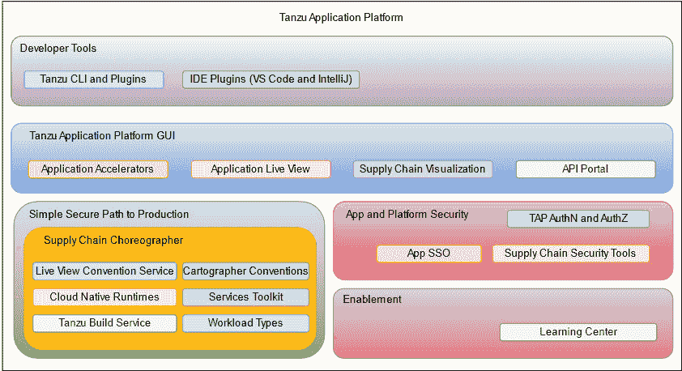
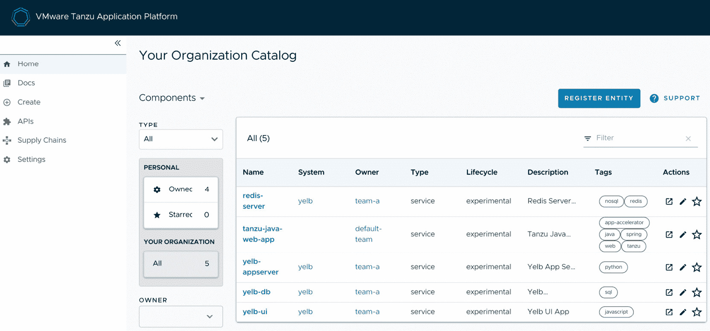
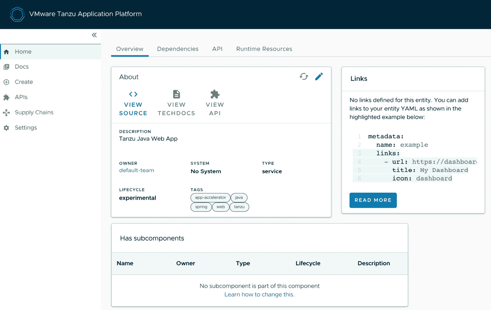
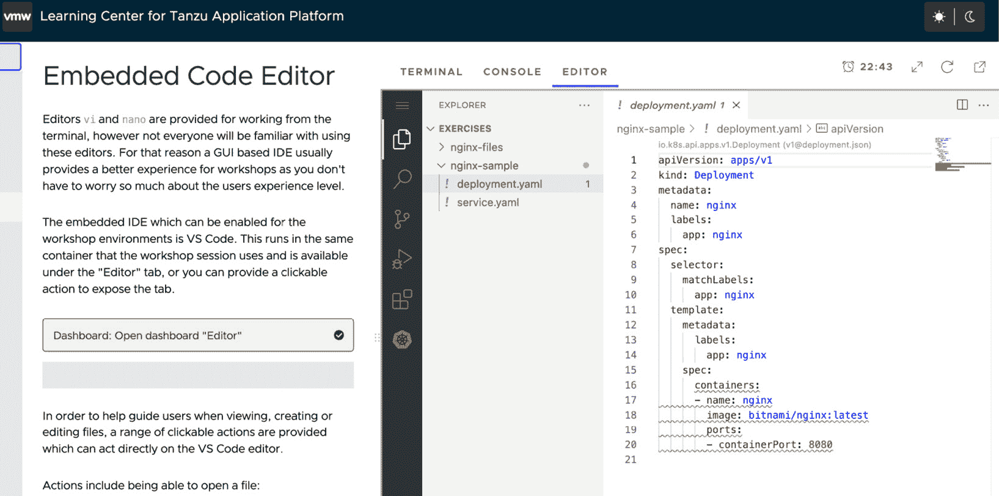
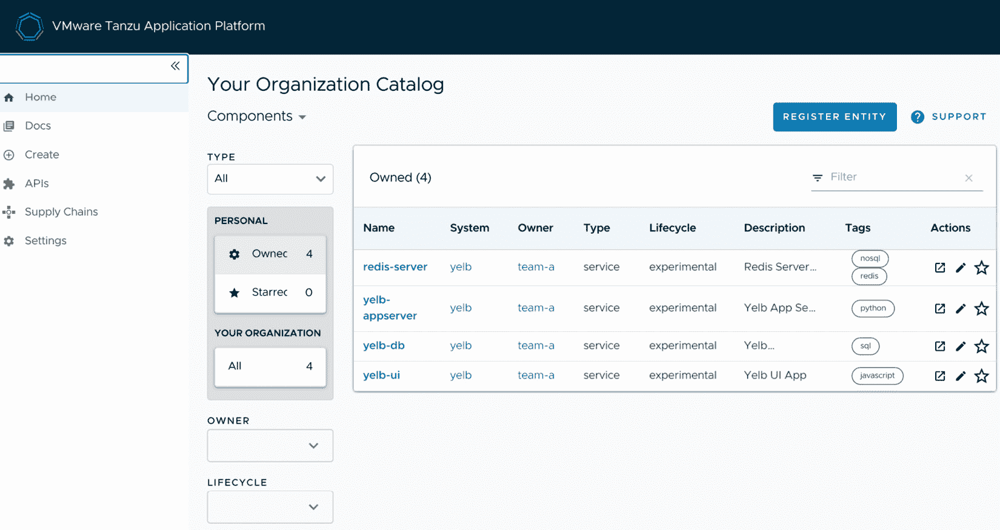
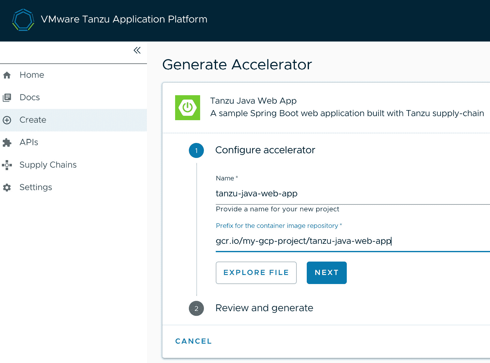
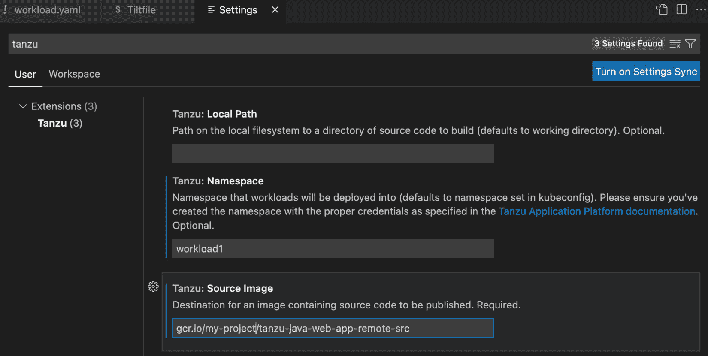
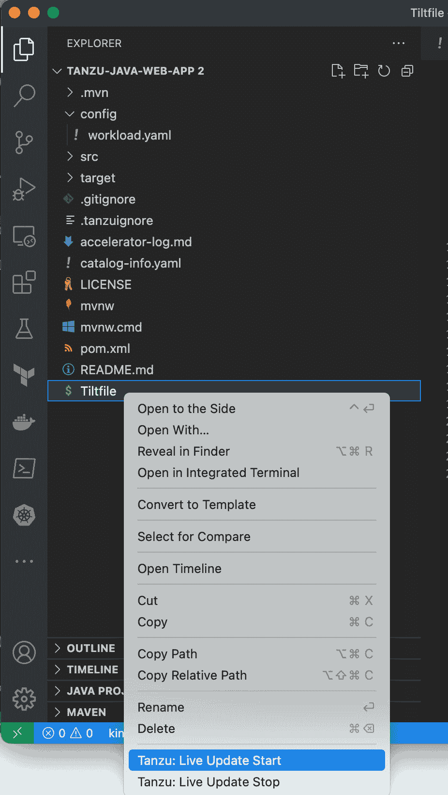
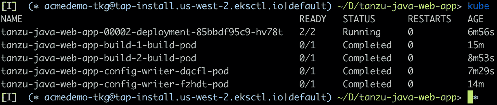

# 第八章：使用 Tanzu 应用平台提升开发者生产力

在企业软件的世界中，我们有*大 A*应用和*小 A*应用的概念。*大 A*可能是一个拥有数百个组件的巨大企业账单系统，而*小 A*应用可能是一个简单的任务，拉取记录并将它们写入 MongoDB。

类似地，在企业交付软件时，存在*大 P*和*小 P*问题需要解决。我今天遇到的一个*小 P*问题是将一些容器镜像从 VMware 公司容器注册表移动到客户的私有注册表，以便他们可以在不允许外部网络访问的情况下在内部使用它们。另一方面，在企业领域，你可能面临的一些*大 P*问题如下：

+   使公司开发人员的生产力显著提高

+   快速、安全、一致地将应用程序投入生产 – 最小化繁琐操作和障碍

+   使开发人员、运维人员和安全专家朝着相同的方向努力，专注于相同的问题

+   当开发人员的经验有限时，将应用程序交付到现代容器平台（如 Kubernetes）

恰巧，这正是我们在讨论**Tanzu** **应用平台**时提到的四个问题。

在本章中，我们将涵盖以下主题：

+   为什么我要使用 Tanzu 应用平台？

+   Tanzu 应用平台的构建模块

+   第一天 – 安装和配置 Tanzu 应用平台

+   第二天 – 将应用程序部署到 Tanzu 应用平台

+   第三天 – Tanzu 应用平台上的常见操作活动

+   下一步

现在我们知道本章要完成的目标，让我们开始讨论你和你的团队可能需要使用 Tanzu 应用平台的原因。

# 为什么我要使用 Tanzu 应用平台？

正如我在章节介绍中提到的，编写软件时可能会遇到一些小问题，例如高效地对列表进行就地排序，或将流数据从传统数据库迁移到最新的 NoSQL 数据库，而也有一些大问题，如以下几项：

+   **开发者生产力**：企业软件的存在仅仅因为大公司雇佣软件开发人员编写他们用来带来收入并使公司在竞争中脱颖而出的软件。有良好平台的公司可以将开发人员的时间和精力集中在直接影响公司盈利的有意义任务上。这使得开发人员感到被重视。没有好平台的公司将开发人员视为昂贵的成本中心，进而引发一种痛苦的恶性循环，导致士气低落和生产力低下。

+   **将软件推向生产环境**：如果你从未为大型公司编写过软件，可能会对将软件推向生产环境的困难感到惊讶。通常，有许多手动且繁琐的任务需要完成，以确保安全、合规性和下游风险的各项要求。这些领域中的先行者已经找到了自动化去除这些繁琐任务的方法，将这些步骤构建成一个自动化流程，并且将其抽象化，以便开发人员无需亲自处理。

+   **使开发人员、运维人员和安全人员朝着同一个目标努力**：通过将合规性、治理、最佳实践和安全性内建到一个流线化的自动化流程中，你消除了开发人员、运维人员和安全专家之间常见的摩擦。尽管运维人员反对任何形式的变更，安全专家却希望对发布版本进行严格审查。这可能会消耗开发团队数周的时间和精力，并且严重打击士气。通过在软件供应链中构建检查和控制，运维人员和安全专家可以放心地知道他们的指导意见得到了遵循，而开发人员则能专注于以高效的速度持续交付软件。

+   **通向 Kubernetes 的快速通道**：企业采用 Kubernetes 的趋势正在上升，且几乎没有放缓的迹象。Kubernetes 是一个非常强大的平台，能够实现一些重要的成果。然而，它也伴随着相当复杂性和陡峭的学习曲线。Tanzu 应用平台抽象掉了部分复杂性，使得软件团队能够利用 Kubernetes，同时受益于一些简化生产路径的抽象。

总结一下，Tanzu 应用平台是一个端到端的软件供应链，旨在以安全、可靠的方式大规模地将软件交付到生产环境。现在我们已经大致了解它的概念，接下来我们将逐步拆解并查看各个组成部分。

# Tanzu 应用平台的构建模块

Tanzu 应用平台是一组具有明确目标的技术，协同工作以为平台运维人员、开发人员和安全专家带来显著的成果。深入讲解每个组件将需要超出本章篇幅的空间，因此我建议你访问官方文档，获取关于这些组件的更多细节。

以下图展示了 Tanzu 应用平台的高层次视图：



图 8.1 – Tanzu 应用平台组件

此图试图将各个组件进行分组和分类。以下是根据该图的层次结构对产品的拆解：

+   `tanzu` CLI 命令或 `workload.yaml` 文件。开发人员可以直接从他们的 IDE 将工作负载部署到 Kubernetes 集群中。

+   **实时更新**：开发者可以在本地工作站上进行更改，并在几秒钟内看到这些更改在 Kubernetes 集群上实时运行。这背后使用了*Tilt*来同步本地代码库与远程 Kubernetes 上运行的工作负载。

+   **远程调试**：有时日志消息并不足够，你需要逐步调试代码，检查本地变量和更大范围的变量。如前所述，在本地工作站上调试是直接的，但在现代环境中，这通常不足以调试 Kubernetes 中出现的问题。在 Kubernetes 上直接调试工作负载通常涉及一堆混乱的启动参数和端口转发。这个插件自动化了整个过程，为开发者提供了一键远程调试的解决方案。

+   **运行中的工作负载**：通过这个仅限 VS Code 的功能，开发者可以在其 IDE 内获得一个面板，来可视化当前 Kubernetes 上下文中运行的所有工作负载。

+   **Tanzu 应用平台 GUI**：基于*Backstage*开源项目的 Tanzu 应用 GUI 是 Tanzu 应用平台的中央仪表盘。它提供了来自 Backstage 的一些开箱即用的功能，并且有许多非常有用的自定义插件，这些插件仅供 Tanzu 应用平台用户使用。这里是你可以在 Tanzu 应用平台 GUI 中看到的内容的快速预览，首先是 UI 的视觉概览及其布局：

图 8.2 – Tanzu 应用平台 GUI

这是你首次访问 Tanzu 应用 GUI 时看到的屏幕。以下是 GUI 组件的详细介绍：

+   **组织目录**：Tanzu 应用平台 GUI 为整个组织提供了一个中央仓库，用于发布和管理其软件。如果我们深入查看前面截图中的**tanzu-java-web-app**，我们将看到以下屏幕：



图 8.3 – Tanzu 应用平台 GUI 目录条目

目录条目允许团队为其应用程序的源代码、技术文档、API 定义以及任何相关链接提供一个“全方位服务”：

+   **TechDocs**：这是一个 Backstage 插件，允许开发团队以 Markdown 格式创建文档，并将这些文档作为应用程序条目的一部分呈现在组织目录中。

+   **运行时资源可见性**：其他 Tanzu 产品的用户，例如*Tanzu 应用服务*（[`tanzu.vmware.com/application-service`](https://tanzu.vmware.com/application-service)），通过能够在一个地方查看所有运行时资源，受益匪浅。Tanzu 团队也将这一功能带到了 Tanzu 应用平台 GUI 中。与注册目录实体相关的任何内容将在这里可见。

+   **应用实时视图**：该功能与其他组件（如*约定服务*）协同工作，提供对正在运行的应用程序的运行时状态的深入洞察。

+   **应用加速器**：这个功能，我们在*第二章**，开发云原生应用*中进行了深入讨论，是 Tanzu 应用平台 GUI 的一部分。

+   **API 文档**：这个功能，我们在*第五章**，定义和管理业务 API*中进行了深入讨论，也是 Tanzu 应用平台 GUI 的一部分。

+   **供应链编排器可视化**：供应链编排器位于 Tanzu 应用平台的核心，它正如名字所示，是一组输入和输出的链条，指导应用程序从源代码到在生产环境中运行的应用程序。这个插件提供了一个引人注目的供应链可视化。

+   **供应链编排器**：如果你把 Tanzu 应用平台 GUI 看作平台的“眼睛和耳朵”，那么供应链编排器就是它的跳动的心脏。供应链编排器基于开源的*Cartographer*项目（[`github.com/vmware-tanzu/cartographer`](https://github.com/vmware-tanzu/cartographer)），它允许平台操作员和软件架构师预配置并预批准多个生产路径。可能有一个适用于 PCI 控制下的 Spring Boot API 的生产路径，也可能有另一个适用于事件驱动数据处理应用程序的生产路径。正如 Tanzu 应用平台 GUI 所做的那样，供应链编排器是平台的一项功能，它将其他功能捆绑在一起。以下是一些属于供应链编排器范畴的功能：

    +   **实时视图约定服务**：在我们讨论 Tanzu 应用平台 GUI 时提到了*应用实时视图*GUI 插件。为了使该插件工作，应用程序需要通过一个有见解的、众所周知的 API 来公开其内部工作。一个简单的方法可能是要求所有应用程序团队自己实现这一点，通过引入一个特定版本的 Spring Boot Actuator，并让它在一个特定端口上运行，并遵循特定的端点命名约定。这将给开发团队带来额外负担，并可能导致配置错误。更好的方法是，在工作负载通过供应链时修改它，以一致且有见解的方式公开其内部工作。正是这个服务实现了这一目标。它位于供应链中，并向所有符合条件的应用程序添加一致的 Java 或 .NET Core 配置参数。

    +   **Cartographer 约定**：应用程序实时视图并不是唯一一个适合应用供应链约定的功能。任何平台操作员或 DevOps 负责人希望在整个产品组合中应用的功能都非常适合在这里实现。一个例子是为所有应用程序工件标记项目的拥有者。另一个例子可能是为与 *云原生运行时* 一起自动扩展的应用程序配置合理的上下限。可能性是无穷无尽的，而 Cartographer 约定是一个方便的方式，能够在平台上运行的各种应用程序中应用约定。

    +   **云原生运行时**：这是在 Kubernetes 上运行您可部署应用程序工件的组件。它基于开源 *Knative* 项目（[`github.com/knative`](https://github.com/knative)），尽管它通常被认为是一个无服务器运行时，但也是运行常规 Web 面向工作负载的绝佳方式。它采用独特的负载均衡方法，允许基于可配置的度量进行自动扩展，同时最小化丢失或掉线的请求。

    +   **服务工具包**：这是另一个由备受喜爱的 *Tanzu Application Service* 演变而来的功能。该产品允许用户请求配置一个服务，可能是一个数据库或消息队列，并将该服务的凭证在运行时绑定到应用程序上。*服务工具包* 将相同的功能带入 Kubernetes。您可以将其视为面向开发者的数据服务，首先，他们不希望思考如何管理数据服务，其次，他们不希望手动将应用程序与这些数据服务连接起来。

    +   **Tanzu 构建服务**：在前面的条目中，我们讨论了运行可部署工件的内容。Tanzu 构建服务是一个组件，它将应用程序的源代码作为输入，并输出一个以 OCI 容器镜像形式存在的可部署工件。我们在 *第三章*中深入探讨了这个功能，内容是构建安全的容器镜像与 *Build Service*。

    +   **工作负载类型**：您可以将其视为一组预配置、预整理的供应链，您可以用它来快速启动不同种类的工作负载：

        +   **Web**：这是一个标准的面向 Web 的应用程序，您希望能够根据需求进行扩展和缩减。

        +   **TCP**：这非常适合运行一个处理其自身 Web 交互的传统应用程序，并且您希望直接将网络流量传递给它。

        +   **队列**：这些是后台运行的应用程序，处理按队列到达的事件。

        +   **函数**：这些是 Web 和队列应用程序的混合体，允许开发人员实现一个仅在有请求时才会实例化和调用的功能。

+   **应用和平台安全**：以下是使安全性在 Tanzu 应用平台中成为一等公民的一些组件：

    +   **Tanzu 应用平台身份验证和 RBAC 授权**：Tanzu 应用平台的 GUI 使用与 Backstage 一起提供的单点登录功能。这使得平台运维人员能够配置 Okta、Google、Azure 和 GitHub 等提供商。此外，GUI 可以配置为监控多个 Kubernetes 集群中的运行资源，而不仅仅是其运行所在的集群。

    +   **应用单点登录**：这是应用开发者常见的需求。他们不想管理自己的登录、用户**身份验证**（**authN**）或**授权**（**authZ**）。相反，他们希望将这些功能委托给平台，由平台为他们处理。这正是此功能所做的。它允许平台运维人员搭建预配置的、具有明确偏好的 Spring Authorization Server 部署，并通过集成到平台的软件供应链中使该服务器可供应用使用。此服务的目的是将单点登录从一开始就集成到应用中，而不是作为最后时刻的附加解决方案。

    +   **供应链安全工具**：软件供应链攻击是许多企业软件领域的关注重点，原因也很充分。供应链安全工具是一套直接插入软件供应链的工具，当供应链的任何部分发生变化时，这些工具会使用持续更新的数据库扫描源代码、捆绑的依赖项和生成的容器镜像，查找所有已知的漏洞。这些工具负责扫描工件、存储扫描结果、报告存储的结果，并对生成的工件进行加密签名，以确保它们在扫描后无法更改。这样，平台运维人员只需将这些工具集成到供应链中，就能为其所有运行的工作负载启用最先进的安全性。

+   **启用功能**：像 Tanzu 应用平台这样规模和范围的产品需要一种方式，使产品的用户和运维人员能够快速上手。Tanzu 应用平台为用户提供了自己的学习平台。它使平台运维人员能够快速轻松地设置实践工作坊，引导不同角色了解产品。它还包括一个简短的内置工作坊，教授如何构建自己的工作坊。下面是 **Tanzu 应用平台学习中心**，展示了我最喜欢的功能——浏览器嵌入式 VS Code 编辑器：



图 8.4 – 带有嵌入式 VS Code 编辑器的学习中心

这使得架构师和运维人员能够构建实际的、可操作的工作坊，这些工作坊可以在浏览器中自动配置并独立运行。以下是一些可用功能的简要列表：

+   `kubectl` 指向一个实时的 Kubernetes 集群和嵌入式 *Docker*，因此任何需要 Docker CLI、构建、运行、推送等的操作也是可能的。

+   **嵌入式理解问题**：工作坊构建者可以将问题嵌入到工作坊中，以确保用户正确理解概念。

+   **嵌入式 VS Code 编辑器**：工作坊构建者不仅可以将 VS Code 嵌入到工作坊中，还可以提供链接，打开文件、选择编辑器窗口中的代码块，甚至在正确的位置粘贴附加代码片段。

+   **嵌入式网页**：这允许用户将某些内容部署到其专用的工作坊 Kubernetes 实例，并立即在同一窗口中看到其运行情况。它还允许像 Kubernetes Web 控制台这样的工具被暴露出来。

+   **验证工作坊状态**：用户可以点击一个链接，这会触发在控制台中看不到的 Kubernetes 命令。这允许工作坊开发者在继续之前确保工作坊状态如预期。

+   **Docker 构建**：嵌入式控制台使用 **Docker in Docker**（**DIND**）来支持所有 Docker 命令的使用。

+   **下载文件**：工作坊开发者可以使用户能够下载任何或所有工作坊文件的本地副本，供以后参考。

现在我们已经介绍了 Tanzu 应用平台的目标用户和组成内容，是时候开始动手安装它了，正如我们将在下一部分中所做的那样。

# 第一天 – 安装和配置 Tanzu 应用平台

要安装 Tanzu 应用平台，首先我们需要一些准备工作。

## 前提条件和技术要求

为了安装和运行 Tanzu 应用平台，必须满足一些技术前提条件。以下是所需的条件列表：

+   **一个（大型）** **Kubernetes 集群**

Tanzu 应用平台文档列出了几个受支持的 Kubernetes 集群，包括 Tanzu Kubernetes Grid 和 Minikube。然而，为了使这些说明更易于管理，我将推荐三种公共云 Kubernetes 集群。这些集群如下：

+   **Amazon 弹性 Kubernetes** **服务**（**EKS**）

+   **Azure Kubernetes** **服务**（**AKS**）

+   **Google Kubernetes** **引擎**（**GKE**）

这有很多原因。以下是其中一些：

+   开箱即用的负载均衡服务。虽然我们可以通过节点端口使 Tanzu 应用平台工作，但负载均衡服务使得这一过程变得更加简单。

+   开箱即用的持久化存储声明。与负载均衡器的简单性相同，动态存储的需求对于 Tanzu 应用平台也是必须的。

+   轻松（尽管昂贵）访问足够的资源。虽然你可以在 Minikube 上的笔记本电脑上安装 Tanzu 应用平台，但会面临内存和 CPU 限制。公共云选项使得构建一个能够扩展到足够规模、无问题运行 Tanzu 应用平台的集群变得更加简单。

Tanzu Application Platform 的文档有一些关于 RAM 和 CPU 的推荐配置，但以下是我个人使用过并且有效的配置：

+   一个或多个控制平面节点。如果你的 Kubernetes 集群可以访问控制平面节点，那么该节点应该至少有两个 vCPU 和 8 GB 的内存。

+   五个或更多的工作节点。每个节点应该至少有两个 vCPU 和 8 GB 的内存。

+   **一个 Tanzu** **Network 账户**

软件安装是通过容器镜像来完成的，这些镜像托管在与 Tanzu Network 相关联的容器注册表中。你可以在这里注册： [`network.tanzu.vmware.com/.`](https://network.tanzu.vmware.com/. )

+   **一个生产级** **容器注册表**

再次强调，这里有多个选项可以选择，但我推荐两个可以让过程更加顺利的选项。它们需要付费账户，但大大简化了安装。我需要指出的是，Amazon Elastic Container Registry 目前还不受支持。以下是当前支持的容器注册表选项：

+   **一个付费 Docker** **Hub 账户**

Docker Hub 确实提供了免费层，但 Tanzu Application Platform 的安装需要大量空间（至少 1 GB）和频繁的镜像推送和拉取操作。Docker 对免费层有限制，这将影响平稳运行。

+   **Google 容器** **注册表 (gcr.io)**

这是我推荐的解决方案，因为你可以快速为你的 GCP 项目设置一个注册表，并将镜像推送到多个仓库。

+   **Azure 容器** **注册表 (azurecr.io)**

这是另一个不错的选择，尤其是如果你已经有了 Azure 账户。

+   **Harbor (自建)**

除非你能够建立受信任的 TLS 并使用公认的**证书颁发机构**（**CA**）或 *Let’s Encrypt*，否则我建议在使用自建 Harbor 时要小心。如果你的 Harbor 使用的是自签名证书，那么 Tanzu Application Platform 的安装将变得更加复杂。Harbor 作为一个容器注册表非常好用，但如果你还没有配置好，它将需要你花时间进行正确的设置。

+   **一个带 DNS 服务器的** **自定义域名**

所有公有云提供商都会为你注册一个域名并提供该域名的 DNS 查找服务。你也可以通过像 GoDaddy 这样的专门域名注册商来做这件事。唯一的要求是你能够创建可以公开解析的通配符 *A* 记录和 *CNAME* 记录。

+   **（可选但推荐）一个生产级** **Git 服务器**

你可以在没有自己 Git 服务器或公共服务账户的情况下完成演示，但任何实际使用 Tanzu Application Platform 的工作都需要一个。GitLab（[gitlab.com](http://gitlab.com)）和 GitHub（[github.com](http://github.com)）上都有免费的选项，适合我们的需求。你只需要创建一个账户，并获取一组 SSH 或用户名/密码凭证，平台可以使用这些凭证推送和拉取远程 Git 仓库。

+   `kubectl` CLI 以及*Carvel*工具。你可以分别在[`kubernetes.io/docs/tasks/tools/`](https://kubernetes.io/docs/tasks/tools/)和[`carvel.dev/#install`](https://carvel.dev/#install)找到它们。`Kubectl`的版本应为 1.22 或 1.23，且应具有在你要安装的 Kubernetes 集群上的集群管理员权限。所有 Carvel 工具都很有用，但本次安装中只需要`imgpkg`。你还需要安装 Docker CLI，并确保不需要 root 权限即可运行它。

让我们进行一些快速检查，确保所有前提条件都已满足：

+   让我们再次检查一下我们的*Docker*，看是否会出现令人头疼的**权限拒绝**错误。如果你的 Docker 守护进程不允许非 root 用户访问，通常会看到如下信息：

    ```
    rob@rob-virtual-machine2:~$ docker info # no good, notice 'permission denied'
    ```

    ```
    Client:
    ```

    ```
     Context:    default
    ```

    ```
     Debug Mode: false
    ```

    ```
    Server:
    ```

    ```
    ERROR: Got permission denied while trying to connect to the Docker daemon socket at unix:///var/run/docker.sock: Get http://%2Fvar%2Frun%2Fdocker.sock/v1.24/info: dial unix /var/run/docker.sock: connect: permission denied
    ```

    ```
    errors pretty printing info
    ```

    ```
    version.BuildInfo{Version:"v3.5.3", GitCommit:"041ce5a2c17a58be0fcd5f5e16fb3e7e95fea622", GitTreeState:"dirty", GoVersion:"go1.15.8"}
    ```

这是成功安装后的样子：

```
rob@rob-virtual-machine2:~$ docker info # all good!
Client:
 Context:    default
 Debug Mode: false
Server:
 Containers: 0
  Running: 0
```

+   最后，让我们验证一下`kubectl`和我们的 Carvel `imgpkg`工具：

    ```
    ubuntu@ip-172-31-33-59 ~> kubectl version
    ```

    ```
    Client Version: version.Info{Major:"1", Minor:"22", GitVersion:"v1.22.13", GitCommit:"a43c0904d0de10f92aa3956c74489c45e6453d6e", GitTreeState:"clean", BuildDate:"2022-08-17T18:28:56Z", GoVersion:"go1.16.15", Compiler:"gc", Platform:"linux/amd64"}
    ```

    ```
    Server Version: version.Info{Major:"1", Minor:"22+", GitVersion:"v1.22.11-eks-18ef993", GitCommit:"b9628d6d3867ffd84c704af0befd31c7451cdc37", GitTreeState:"clean", BuildDate:"2022-07-06T18:06:23Z", GoVersion:"go1.16.15", Compiler:"gc", Platform:"linux/amd64"}
    ```

    ```
    ubuntu@ip-172-31-33-59 ~> imgpkg version
    ```

    ```
    imgpkg version 0.27.0
    ```

一旦你的命令行工具配置妥当，你就可以继续进行下一部分的安装了。

## 接受最终用户许可协议

在我们开始将软件包迁移到自定义注册中心并安装之前，我们需要接受**最终用户许可协议**（**EULAs**）。登录到 Tanzu 网络后，导航到这里列出的两个产品，并选择每个产品的最新版本。如果需要接受 EULA，你会在版本下拉菜单下看到一个黄色框，点击黄色框中的链接即可跳转到接受 EULA 的页面：

+   [`network.tanzu.vmware.com/products/tanzu-application-platform/`](https://network.tanzu.vmware.com/products/tanzu-application-platform/)

+   [`network.tanzu.vmware.com/products/tanzu-cluster-essentials/`](https://network.tanzu.vmware.com/products/tanzu-cluster-essentials/)

## 重新部署 Tanzu 应用平台软件包

虽然这一步并非绝对必要，但强烈建议将所有容器镜像从 Tanzu 仓库迁移到你自己的仓库。如果你考虑 Kubernetes 的工作原理，当任何构成 Tanzu 应用平台的几十个（或数百个！）Pod 需要启动或重启时，工作节点上的`kubelet`过程将需要拉取该 Pod 的容器镜像。如果你不将这些容器镜像迁移到你自己的注册表，它们将必须直接从 Tanzu 网络容器注册表中获取，这意味着你的运行时关键路径中将包含`registry.tanzu.vmware.com`。这意味着每次你需要重启一个 Kubernetes 工作节点上没有该 Pod 镜像的 Pod 时，Tanzu 注册表必须保持正常运行并响应。现在，Tanzu 团队拥有非常优秀的 SRE 团队，他们在保持 Tanzu 注册表正常运行方面做得非常出色，但他们的**服务水平目标**（**SLOs**）可能与你应用的 SLOs 不完全一致，因此，管理自己的命运并维护自己的容器注册表是一个好主意。此外，Tanzu 注册表是与其他 Tanzu 客户共享的，因此你不能排除需求激增导致容器镜像暂时无法访问的情况。

我们将使用`imgpkg`工具将所有 Tanzu 应用平台镜像从 Tanzu 注册表复制到我们的自定义注册表。这里的示例将使用`gcr.io`，但对于 Azure 容器注册表、Harbor 或 Docker Hub，步骤非常相似。

首先，让我们使用 Docker CLI 登录到 Tanzu 注册表：

```
ubuntu@ip-172-31-33-59 ~> docker login registry.tanzu.vmware.com
Authenticating with existing credentials...
Login Succeeded
ubuntu@ip-172-31-33-59 ~>
```

然后，再次登录到你的个人注册表。以下是`gcr.io`的登录方式：

```
ubuntu@ip-172-31-33-59 ~/t/packt> cat ./gcr-json-key.json | docker login -u _json_key --password-stdin gcr.io
Login Succeeded
```

对于 Docker Hub、Harbor 或 Azure，你可以发出`docker login <registry-host>`命令，并在提示符下输入用户名和密码。此时，我们已经通过身份验证，能够访问 Tanzu 注册表和我们的自定义注册表（`gcr.io`）。`imgpkg`工具要求本地 Docker 守护进程完成身份验证后，才能复制镜像。

现在，我们可以使用`imgpkg`从 Tanzu 注册表拉取镜像，并将它们推送到我们的自定义注册表。为了提高可读性，我们将设置一些环境变量：

```
ubuntu@ip-172-31-33-59:~/tap/packt$ export INSTALL_REGISTRY_USERNAME=_json_key
ubuntu@ip-172-31-33-59:~/tap/packt$ export INSTALL_REGISTRY_PASSWORD=$(cat gcr-json-key.json)
ubuntu@ip-172-31-33-59:~/tap/packt$ export INSTALL_REGISTRY_HOSTNAME=gcr.io
ubuntu@ip-172-31-33-59:~/tap/packt$ export INSTALL_REGISTRY_PROJECT_NAME=my-gcr-project
ubuntu@ip-172-31-33-59:~/tap/packt$ export TAP_VERSION=1.3.2
ubuntu@ip-172-31-33-59:~/tap/packt$ imgpkg copy -b registry.tanzu.vmware.com/tanzu-application-platform/tap-packages:${TAP_VERSION} --to-repo ${INSTALL_REGISTRY_HOSTNAME}/${INSTALL_REGISTRY_PROJECT_NAME}/tap-packages
copy | exporting 177 images...
copy | will export registry.tanzu.vmware.com/tanzu-application-platform/tap-packages@sha256:001224ba2c37663a9a412994f1086ddbbe40aaf959b30c465ad06c2a563f2b9f
…many, many more lines
copy | exported 177 images
copy | importing 177 images...
 6.77 GiB / 6.77 GiB [============================================================================================================] 100.00% 194.00 MiB/s 35s
copy | done uploading images
Succeeded
```

此时，安装和运行 Tanzu 应用平台所需的所有容器镜像都可以在`gcr.io/my-gcr-project/tap-packages`中找到。有关登录并将镜像迁移到 Docker Hub、Harbor 和 Azure 的具体说明，请参见 Tanzu 应用平台安装文档：[`docs.vmware.com/en/VMware-Tanzu-Application-Platform/1.3/tap/GUID-install.html#relocate-images-to-a-registry-0`](https://docs.vmware.com/en/VMware-Tanzu-Application-Platform/1.3/tap/GUID-install.html#relocate-images-to-a-registry-0)。

## 安装 Tanzu CLI 和 Tanzu 应用平台插件

如果你尚未在其他章节中安装 Tanzu CLI，可以现在进行安装。此外，即使你已经安装了 Tanzu CLI，我们还将安装一些插件，帮助我们更高效地与 Tanzu 应用平台进行工作。

首先，我们将访问 Tanzu 网络上的 Tanzu 应用平台页面并下载 CLI。链接如下：[`network.tanzu.vmware.com/products/tanzu-application-platform/#/releases/1222090/file_groups/10484`](https://network.tanzu.vmware.com/products/tanzu-application-platform/#/releases/1222090/file_groups/10484)。

下载适合你平台的 `tanzu-framework-bundle` tarfile 后，将其复制到你的主目录。然后，在 Mac 和 Linux 上，你可以按照以下步骤操作。对于 Windows，你可能需要稍作调整，或者我推荐使用 *VirtualBox* 来创建一个 Linux 虚拟机并按照 Linux 的操作步骤进行。

下面是整个过程。我会在过程中加入一些注释，描述每一步的操作：

```
ubuntu@ip-172-31-33-59:~/downloads$ mkdir -p $HOME/tanzu
ubuntu@ip-172-31-33-59:~/downloads$ tar -xvf tanzu-framework-linux-amd64.tar -C $HOME/tanzu # extract the tar file into the working directory.
cli/
cli/core/
cli/core/v0.11.6/
cli/core/v0.11.6/tanzu-core-linux_amd64
cli/core/plugin.yaml
cli/distribution/
cli/distribution/linux/
cli/distribution/linux/amd64/
cli/distribution/linux/amd64/cli/
cli/distribution/linux/amd64/cli/accelerator/
cli/distribution/linux/amd64/cli/accelerator/v1.2.0/
cli/distribution/linux/amd64/cli/accelerator/v1.2.0/tanzu-accelerator-linux_amd64
cli/distribution/linux/amd64/cli/package/
cli/distribution/linux/amd64/cli/package/v0.11.6/
cli/distribution/linux/amd64/cli/package/v0.11.6/tanzu-package-linux_amd64
cli/distribution/linux/amd64/cli/apps/
cli/distribution/linux/amd64/cli/apps/v0.7.0/
cli/distribution/linux/amd64/cli/apps/v0.7.0/tanzu-apps-linux_amd64
cli/distribution/linux/amd64/cli/secret/
cli/distribution/linux/amd64/cli/secret/v0.11.6/
cli/distribution/linux/amd64/cli/secret/v0.11.6/tanzu-secret-linux_amd64
cli/distribution/linux/amd64/cli/insight/
cli/distribution/linux/amd64/cli/insight/v1.2.2/
cli/distribution/linux/amd64/cli/insight/v1.2.2/tanzu-insight-linux_amd64
cli/distribution/linux/amd64/cli/services/
cli/distribution/linux/amd64/cli/services/v0.3.0/
cli/distribution/linux/amd64/cli/services/v0.3.0/tanzu-services-linux_amd64
cli/discovery/
cli/discovery/standalone/
cli/discovery/standalone/apps.yaml
cli/discovery/standalone/services.yaml
cli/discovery/standalone/secret.yaml
cli/discovery/standalone/insight.yaml
cli/discovery/standalone/package.yaml
cli/discovery/standalone/accelerator.yaml
ubuntu@ip-172-31-33-59:~/downloads$ cd $HOME/tanzu
ubuntu@ip-172-31-33-59:~/tanzu$ export VERSION=v0.11.6
ubuntu@ip-172-31-33-59:~/tanzu$ sudo install cli/core/$VERSION/tanzu-core-linux_amd64 /usr/local/bin/tanzu  # move the executable into a well-known directory and make it executable.
ubuntu@ip-172-31-33-59:~/tanzu$ tanzu version
version: v0.11.6
ubuntu@ip-172-31-33-59:~/tanzu$ export TANZU_CLI_NO_INIT=true # instruct the CLI not to look in external repositories for plugins
ubuntu@ip-172-31-33-59:~/tanzu$ tanzu plugin install --local cli all  # install the plugins from the distributable tar file we just unpacked
Installing plugin 'accelerator:v1.2.0'
Installing plugin 'apps:v0.7.0'
Installing plugin 'insight:v1.2.2'
Installing plugin 'package:v0.11.6'
Installing plugin 'secret:v0.11.6'
Installing plugin 'services:v0.3.0'
  successfully installed 'all' plugin
ubuntu@ip-172-31-33-59:~/tanzu$ tanzu plugin list
  NAME                DESCRIPTION                                       SCOPE       DISCOVERY  VERSION  STATUS
  login               Login to the platform                                                Standalone  default    v0.11.6  update available
  management-cluster  Kubernetes management-cluster operations                                                 Standalone  default    v0.11.6  update available
  package             Tanzu package management                                                     Standalone  default    v0.11.6  installed
  pinniped-auth       Pinniped authentication operations (usually not directly invoked)                                  Standalone  default    v0.11.6  update available
  secret              Tanzu secret management                                               Standalone  default    v0.11.6  installed
  services            Explore Service Instance Classes, discover claimable Service Instances and manage Resource Claims  Standalone             v0.3.0   installed
  apps                Applications on Kubernetes                                           Standalone             v0.7.0   installed
  insight             post & query image, package, source, and vulnerability data                                        Standalone             v1.2.2   installed
  accelerator         Manage accelerators in a Kubernetes cluster                                           Standalone             v1.2.0   installed
```

恭喜你！如果你已经走到这一步，你就拥有了一个可以正常工作的 Tanzu CLI，配备了安装和运行 Tanzu 应用平台所需的所有插件。

## 安装 Cluster Essentials

Cluster Essentials 工具集是我们将 Tanzu 包部署到 Kubernetes 集群中的方式。也许你熟悉像 Helm 这样的工具。Cluster Essentials 工具也做类似的事情，但除了 Helm 的功能外，它们还具备以下功能：

+   将所需的应用状态存储为 CR 在 etcd 中，以便该应用能够持续进行协调

+   管理复杂的依赖层次结构

+   以避免配置漂移的方式存储和维护模板化的应用配置

+   允许跨命名空间选择性地共享密钥

我不会粉饰 Tanzu 应用平台是一个复杂的软件系统，安装它到 Kubernetes 并保持其顺畅运行，需要一个功能完备、适合企业级使用的工具集。Cluster Essentials 就是这个工具集。

要安装 Cluster Essentials，我们需要遵循与安装 CLI 时类似的脚本。在这种情况下，我们需要确保 `kubectl` 指向我们计划部署的 Kubernetes 集群，因为安装脚本将启动部署过程。我将再次通过注释描述这个过程：

```
ubuntu@ip-172-31-33-59:~/downloads$ mkdir -p $HOME/tanzu-cluster-essentials  # create working directory
ubuntu@ip-172-31-33-59:~/downloads$ ls # check our downloaded file
tanzu-cluster-essentials-linux-amd64-1.2.0.tgz
ubuntu@ip-172-31-33-59:~/downloads$ tar xvf ./tanzu-cluster-essentials-linux-amd64-1.2.0.tgz -C $HOME/tanzu-cluster-essentials    # unzip the downloaded file into the working directory
install.sh
uninstall.sh
imgpkg
kbld
kapp
ytt
ubuntu@ip-172-31-33-59:~/downloads$ cd $HOME/tanzu-cluster-essentials
ubuntu@ip-172-31-33-59:~/tanzu-cluster-essentials$ kubectl config get-contexts  # check our Kubernetes cluster
*         user@tap-install.us-west-2.eksctl.io             tap-install.us-west-2.eksctl.io                          user@tap-install.us-west-2.eksctl.io
ubuntu@ip-172-31-33-59:~/tanzu-cluster-essentials$ export INSTALL_BUNDLE=registry.tanzu.vmware.com/tanzu-cluster-essentials/cluster-essentials-bundle@sha256:e00f33b92d418f49b1af79f42cb13d6765f1c8c731f4528dfff8343af042dc3e   # Set some env vars for the install script to use
ubuntu@ip-172-31-33-59:~/tanzu-cluster-essentials$ export INSTALL_REGISTRY_HOSTNAME=registry.tanzu.vmware.com
ubuntu@ip-172-31-33-59:~/tanzu-cluster-essentials$ export INSTALL_REGISTRY_USERNAME=myuser@myemail.com
ubuntu@ip-172-31-33-59:~/tanzu-cluster-essentials$ export INSTALL_REGISTRY_PASSWORD=<my_super_secret_password>
ubuntu@ip-172-31-33-59:~/tanzu-cluster-essentials$ ./install.sh  # this will install the kapp and secretgen controllers onto our Kubernetes cluster
## Creating namespace tanzu-cluster-essentials
namespace/tanzu-cluster-essentials created
… much more output
Succeeded
ubuntu@ip-172-31-33-59:~/tanzu-cluster-essentials$
```

当 *kapp* CLI 等待安装成功完成时，你会看到大量的控制台输出，描述安装的进展。如果你在最后看到 `Succeeded` 消息，就说明安装确实成功了。现在，你已经安装了 Cluster Essentials 并且安装包已迁移，我们就快准备好安装 Tanzu 应用平台了。

## 设置开发者命名空间

Tanzu 应用平台的官方文档将此步骤放在安装之后，但我发现如果先执行这个步骤，安装过程会更加顺利。此步骤涉及在开发人员将工作负载部署到命名空间时创建一个密钥，并生成一些 Kubernetes RBAC 工件，以便该命名空间的默认服务帐户能够与构成 Tanzu 应用平台的 CR 进行交互。

首先，让我们创建命名空间，并向其中添加一个密钥，以便我们能够读取和写入容器注册表。此示例适用于 `gcr.io`，因为我们需要将密码作为文件传递。要为 Azure、Docker Hub 或 Harbor 创建密钥，你需要使用 `--username` 和 `--password` 标志。我的命名空间命名偏好为 `workload1`、`workload2`，以此类推。这可以清楚地让任何查看集群的人了解工作负载的运行位置：

```
ubuntu@ip-172-31-33-59 ~/t/packt> kubectl create ns workload1
namespace/workload1 created
ubuntu@ip-172-31-33-59 ~/t/packt> tanzu secret registry add registry-credentials --server gcr.io --username _json_key --password-file ./gcr-json-key.json -n workload1
| Adding registry secret 'registry-credentials'...
 Added registry secret 'registry-credentials' into namespace 'workload1'
ubuntu@ip-172-31-33-59 ~/t/packt>
```

接下来，我们需要为命名空间中的默认服务账户分配一些角色和密钥，以使 Tanzu 应用平台工作负载能够使用默认服务账户在该命名空间中运行：

```
ubuntu@ip-172-31-33-59:~/tap/packt$ cat <<EOF | kubectl -n workload1 apply -f –
apiVersion: v1
kind: Secret
metadata:
  name: tap-registry
  annotations:
    secretgen.carvel.dev/image-pull-secret: ""
type: kubernetes.io/dockerconfigjson
data:
  .dockerconfigjson: e30K
---
apiVersion: v1
kind: ServiceAccount
metadata:
  name: default
secrets:
  - name: registry-credentials
imagePullSecrets:
  - name: registry-credentials
  - name: tap-registry
---
apiVersion: rbac.authorization.k8s.io/v1
kind: RoleBinding
metadata:
  name: default-permit-deliverable
roleRef:
  apiGroup: rbac.authorization.k8s.io
  kind: ClusterRole
  name: deliverable
subjects:
  - kind: ServiceAccount
    name: default
---
apiVersion: rbac.authorization.k8s.io/v1
kind: RoleBinding
metadata:
  name: default-permit-workload
roleRef:
  apiGroup: rbac.authorization.k8s.io
  kind: ClusterRole
  name: workload
subjects:
  - kind: ServiceAccount
    name: default
EOF
secret/tap-registry created
serviceaccount/default configured
rolebinding.rbac.authorization.k8s.io/default-permit-deliverable created
rolebinding.rbac.authorization.k8s.io/default-permit-workload created
ubuntu@ip-172-31-33-59:~/tap/packt$
```

接下来，我们将安装一些工具，这些工具将在我们的 Kubernetes 集群上运行，帮助我们管理安装过程。

## 安装软件包仓库

现在我们已经准备好所有客户端和服务器端的工具，可以开始安装了。首先，我们需要设置一个软件包仓库。这类似于 Docker 或 Apt 仓库。它仅仅是一个网络上的服务，用于存储和提供软件包。在本例中，我们将安装一个*Kapp*软件包仓库到我们的 Kubernetes 集群中，Kapp 控制器可以从该仓库安装软件包。之前，我们已经将软件包从 Tanzu 注册表迁移到我们自己的容器注册表。其中一个软件包叫做 `tap`。这个 `tap` 软件包充当我们的仓库，知道容器注册表中所有其他软件包的信息。稍后会更清楚明了。这个仓库及其所有软件包将位于 Kubernetes 集群中的专用命名空间内。我们假设你在迁移镜像时已设置了环境变量。如果没有设置，你需要重新设置它们：

```
ubuntu@ip-172-31-33-59:~/tap/packt$ kubectl create ns tap-install
namespace/tap-install created
ubuntu@ip-172-31-33-59:~/tap/packt$ tanzu package repository add tanzu-tap-repository --url ${INSTALL_REGISTRY_HOSTNAME}/${INSTALL_REGISTRY_PROJECT_NAME}/tap-packages:${TAP_VERSION} -n tap-install
 Adding package repository 'tanzu-tap-repository'
 Validating provided settings for the package repository
 Creating package repository resource
 Waiting for 'PackageRepository' reconciliation for 'tanzu-tap-repository'
 'PackageRepository' resource install status: Reconciling
 'PackageRepository' resource install status: ReconcileSucceeded
Added package repository 'tanzu-tap-repository' in namespace 'tap-install'
ubuntu@ip-172-31-33-59:~/tap/packt$ tanzu package repository get tanzu-tap-repository --namespace tap-install
NAME:          tanzu-tap-repository
VERSION:       789358
REPOSITORY:    gcr.io/fe-rhardt/tap-packages
TAG:           1.2.1
STATUS:        Reconcile succeeded
REASON:
ubuntu@ip-172-31-33-59:~/tap/packt$ tanzu package available list --namespace tap-install
  NAME                                                 DISPLAY-NAME                                              SHORT-DESCRIPTION                                                                LATEST-VERSION
  accelerator.apps.tanzu.vmware.com                    Application Accelerator for VMware Tanzu                                  Used to create new projects and configurations.                                               1.2.2
  api-portal.tanzu.vmware.com                          API portal                                                     A unified user interface to enable search, discovery and try-out of API endpoints at ease.
# … many more …
```

现在，我们将安装这些软件包以启动 Tanzu 应用平台的运行实例。

## 拉取并格式化 tap-values.yaml

接下来，我们需要一个配置文件来安装 Tanzu 应用平台。你可以拉取这个文件作为起点：[`github.com/PacktPublishing/DevSecOps-in-Practice-with-VMware-Tanzu/blob/main/chapter-09/tap-values.yaml`](https://github.com/PacktPublishing/DevSecOps-in-Practice-with-VMware-Tanzu/blob/main/chapter-09/tap-values.yaml)。

一旦你将该文件下载到本地，按照内联指令插入注册表凭证和域信息。填写完该文件后，我们可以从我们的软件包仓库安装`tap`包，参考该文件：

```
ubuntu@ip-172-31-33-59:~/tap/packt$ tanzu package install tap -p tap.tanzu.vmware.com -v $TAP_VERSION --values-file tap-values.yaml -n tap-install
 Installing package 'tap.tanzu.vmware.com'
 Getting package metadata for 'tap.tanzu.vmware.com'
 Creating service account 'tap-tap-install-sa'
 Creating cluster admin role 'tap-tap-install-cluster-role'
 Creating cluster role binding 'tap-tap-install-cluster-rolebinding'
 Creating secret 'tap-tap-install-values'
 Creating package resource
 Waiting for 'PackageInstall' reconciliation for 'tap'
\ 'PackageInstall' resource install status: Reconciling
```

此安装可能需要几分钟时间。此外，有时它会告诉你安装失败，实际上是因为某个组件稍微拖延了一些时间。为了获得更多关于安装的反馈，你可以通过监控 Kubernetes 中的**PackageInstall**（**pkgi**）对象来查看安装情况：

```
ubuntu@ip-172-31-33-59 ~> kubectl get pkgi -n tap-install -w
NAME                       PACKAGE NAME                                         PACKAGE VERSION   DESCRIPTION           AGE
api-portal                 api-portal.tanzu.vmware.com                          1.0.24            Reconcile succeeded   72s
appliveview-connector      connector.appliveview.tanzu.vmware.com               1.2.1             Reconcile succeeded   72s
appsso                     sso.apps.tanzu.vmware.com                            1.0.0             Reconcile succeeded   38s
buildservice               buildservice.tanzu.vmware.com                        1.6.1             Reconciling           72s
cartographer               cartographer.tanzu.vmware.com                        0.4.3             Reconcile succeeded   38s
```

恭喜！你已经拥有了一个运行中的 Tanzu 应用平台实例。接下来，让我们配置与之交互所需的其余组件。

## 创建 DNS 记录

一旦你安装了 Tanzu 应用平台，你会希望能够通过网页浏览器访问工具和已部署的应用程序。这时，你需要去域名的 DNS 服务，并将其指向你的 Tanzu 应用平台安装。首先，让我们找出负载均衡器服务的端点，并将通配符 DNS 记录指向它：

```
ubuntu@ip-172-31-33-59 ~> kubectl get svc -n tanzu-system-ingress envoy
NAME    TYPE           CLUSTER-IP       EXTERNAL-IP                         PORT(S)                      AGE
envoy   LoadBalancer   10.100.247.164   accd60a8feb5740b1ac24853ea17e546-817853481.us-west-2.elb.amazonaws.com   80:30409/TCP,443:30100/TCP   10m
ubuntu@ip-172-31-33-59 ~>
```

在这种情况下，`tanzu-system-ingress` 中的 envoy 服务将主机名作为其 `EXTERNAL-IP`。如果我控制 `mydomain.com`，我将进入我的域名的 DNS 配置设置，创建一个 CNAME 记录 `*.mydomain.com`，并将其指向通过 `kubectl` 命令获得的 `LoadBalancer` 主机。如果你使用的是 Azure 或 GCP，你可能会获得一个 IPv4 地址而不是主机名。在这种情况下，你需要创建一个 `A` 记录，而不是 CNAME。

这是一个实际的例子。我使用 `*.packtinstall.k10s.io` 域名安装了 Tanzu 应用平台。配置好 DNS 记录后，我可以使用 dig 命令验证 `packtinstall.k10s.io` 的任何子域名是否会返回指向与 `tanzu-system-ingress/envoy` Kubernetes 负载均衡器服务相关联的 AWS 负载均衡器的 CNAME：

```
ubuntu@ip-172-31-33-59 ~> dig testing123.packtinstall.k10s.io
; <<>> DiG 9.16.1-Ubuntu <<>> testing123.packtinstall.k10s.io
;; global options: +cmd
;; Got answer:
;; ->>HEADER<<- opcode: QUERY, status: NOERROR, id: 17729
;; flags: qr rd ra; QUERY: 1, ANSWER: 4, AUTHORITY: 0, ADDITIONAL: 1
;; OPT PSEUDOSECTION:
; EDNS: version: 0, flags:; udp: 65494
;; QUESTION SECTION:
;testing123.packtinstall.k10s.io. IN A
;; ANSWER SECTION:
testing123.packtinstall.k10s.io. 300 IN    CNAME    accd60a8feb5740b1ac24853ea17e546-817853481.us-west-2.elb.amazonaws.com.
accd60a8feb5740b1ac24853ea17e546-817853481.us-west-2.elb.amazonaws.com.  59 IN A    52.10.176.193
accd60a8feb5740b1ac24853ea17e546-817853481.us-west-2.elb.amazonaws.com.  59 IN A    35.155.17.135
accd60a8feb5740b1ac24853ea17e546-817853481.us-west-2.elb.amazonaws.com.  59 IN A    54.213.143.29
```

现在，如果一切顺利，你应该能够通过浏览器访问指向 `tap-gui.<your-domain>.com` 的 Tanzu 应用平台 GUI。成功！



图 8.5 – Tanzu 应用平台 GUI

我鼓励你探索 *TAP GUI*。本书的 *第二章* 和 *第五章* 详细介绍了应用加速器和 API 门户组件。接下来，让我们安装一些本地开发工具，以增强我们与 Tanzu 应用平台交互的体验。

## 安装 VS Code 开发者工具

为了真正看到 Tanzu 应用平台的运行效果，设置一个真实的开发工具链是非常有帮助的。此时，你已经有一个运行 Tanzu 应用平台的 Kubernetes 集群，并且已经配置了 `kubectl` 和带有必要插件的 Tanzu CLI。只需再添加几个工具，我们就能建立这个工具链。

首先，如果你还没有，请从这里下载并安装 VS Code：[`code.visualstudio.com/download`](https://code.visualstudio.com/download)。然后，从这里下载并安装 Tilt：[`docs.tilt.dev/install.html`](https://docs.tilt.dev/install.html)。最后，从 Tanzu 网络下载 VS Code 的开发者工具：[`network.tanzu.vmware.com/products/tanzu-application-platform`](https://network.tanzu.vmware.com/products/tanzu-application-platform)。你可以通过 VS Code 的命令面板来安装这些开发工具。你可以通过 `Extensions: Install from VSIX` 打开命令面板。当自动完成显示时，选择该选项，并导航到你刚刚下载的 VSIX 文件进行安装。

恭喜你！你已经完成了一个非常复杂软件的安装和配置。我们的第 1 天任务已完成。现在，让我们进入第 2 天，开始使用我们强大的新工具包！

# 第 2 天 – 部署应用到 Tanzu 应用平台

在*第二章*《开发云原生应用》中，我们深入探讨了应用加速器。为了将应用部署到 Tanzu 应用平台，我们将再次使用该产品。前往你刚安装完成的*TAP GUI*，它应该位于`tap-gui.<your-domain>`。然后，在左侧菜单中点击`gcr.io`，它可能是类似`gcr.io/<your-project-id>/tanzu-java-web-app`的内容。你提供的值将用于 Tiltfile 中，告诉 Tilt 工具在哪里推送应用的源代码，以便被 Tanzu 应用平台的供应链接收。稍后你会明白这个步骤的意义。以下是加速器界面的样子，提醒一下：



图 8.6 – 填写加速器表单

一旦点击**NEXT**，你将很快看到一个按钮用于下载 ZIP 文件。下载 ZIP 文件，解压并打开 VS Code，进入你刚刚解压的应用目录。接下来，我们需要在 VS Code 中更新几个设置。进入 VS Code 设置窗口，导航到**扩展** | **Tanzu**。

设置`workload1`或你在之前步骤中为开发者使用设置的任何命名空间。最后，再次确认`gcr.io`，它可能是`gcr.io/<your-project-id>/tanzu-java-web-app-remote-src`，具体取决于你在之前步骤中提供给应用加速器 UI 的内容。以下是我的设置样子：



图 8.7 – VS Code 开发者设置

现在，你可以关闭`Tiltfile`。当你右击`Tiltfile`时，应该会看到**Tanzu: Live Update Start**选项。以下截图能让你更清楚地了解应该寻找什么：



图 8.8 – VS Code 中的 Tanzu Java Web 应用

让我们尝试通过点击**Tanzu: Live Update Start**上下文菜单项来启动实时更新。很可能你会看到类似这样的消息：

```
*  Executing task: tilt: up - /Users/roberthardt/Downloads/tanzu-java-web-app 2/Tiltfile
Tilt started on http://localhost:10350/
v0.26.3, built 2022-03-24
Initial Build
Loading Tiltfile at: /Users/roberthardt/Downloads/tanzu-java-web-app 2/Tiltfile
ERROR: Stop! user@tap-install.us-west-2.eksctl.io might be production.
If you're sure you want to deploy there, add:
        allow_k8s_contexts('user@tap-install.us-west-2.eksctl.io')
to your Tiltfile. Otherwise, switch k8s contexts and restart Tilt.
```

不用担心。Tilt 工具非常小心，避免你在生产环境中意外启动实时更新会话。按照指示，向 Tiltfile 的底部添加`allow_k8s_contexts('<your-k8s-context>')`命令，然后再试一次。

第一次部署可能需要一段时间，但最终，你可以打开终端，查看`workload1`命名空间中的所有 Pod（`kubectl get pods -n workload1`），并看到类似这样的内容：



图 8.9 – 正在运行的应用的 Pod 列表

包含 `build` 字样的 pod 是那些将源代码转换为容器镜像的 pod。包含 `config-writer` 字样的 pod 是那些将可部署的 Kubernetes 工件的源代码写入 Git 或容器注册表，以便可以被提取并部署的 pod。最后，包含 `deployment` 字样的 pod 是你的应用程序正在运行的 pod。

接下来，让我们在浏览器中查看我们的应用。执行此命令以获取属于你应用的正在运行的 Knative 服务的 URL：

```
~/D/tanzu-java-web-app> kubectl get kservice -n workload1
NAME                 URL                         LATESTCREATED              LATESTREADY                READY   REASON
tanzu-java-web-app   http://tanzu-java-web-app.workload1.packtinstall.k10s.io   tanzu-java-web-app-00002   tanzu-java-web-app-00002   True
```

现在，将 URL 插入浏览器中。这是你应该看到的内容：


图 8.10 – 运行 Tanzu 应用

恭喜！你已经成功在 Tanzu 应用平台上启动了一个 Spring Boot 应用。而且，完全不需要安装本地 Java 运行时或除了 Tanzu 工具链以外的任何工具。插件将你的原始源代码传送到平台上，并在平台上完成构建和部署。接下来，让我们测试一下*实时更新*功能。

在 VS Code 中，导航到 `/src/main/java/com/example/springboot/HelloController.java`，然后修改问候语。也许在结尾添加 `and Packt!!!`。

请注意，当你保存更改时，VS Code 插件会自动检测到更改并部署它。以下是你在 VS Code 中对文件进行更改时发生的时间线：

1.  Tilt 插件检测到文件发生变化。

1.  插件将你的源代码打包并存储在容器注册表中。

1.  插件更新 Kubernetes 集群中的工作负载对象，使 `.spec.source.image` 字段指向容器注册表中更新后的源代码镜像。

1.  Kubernetes 上的制图控制器检测到工作负载的变化，并触发供应链的新迭代。

1.  供应链拉取源代码、构建它、推送已构建工件的容器镜像并运行该工件，在此过程中应用多个约定。

一两分钟后，你可以刷新浏览器，看到本地更改实时反映在 Kubernetes 中运行的应用中。

## 直接部署工作负载

我们现在已经看到了开发者的工作流程，即本地源代码被打包并存储在容器仓库中，工作负载是从这些源代码创建的。然而，在现实世界的场景中，本地源代码并不会直接从 IDE 推送到平台。相反，代码会进入源代码控制系统，这之后驱动某种持续集成流程到平台上。让我们简要地探讨一下这个使用案例。

在我们下载并解压的应用程序的 `/config` 目录中，应该会看到一个名为 `workload.yaml` 的文件。该文件指示平台从以下 URL 拉取源代码：[`github.com/sample-accelerators/tanzu-java-web-app`](https://github.com/sample-accelerators/tanzu-java-web-app)。Tanzu 应用平台将监视该 Git 仓库，并在检测到更改时，拉取最新的源代码并更新运行中的工作负载。现在，让我们试试看。

首先，为了避免命名空间冲突，让我们删除现有的工作负载。通过右键点击 Tiltfile 并选择 **Tanzu Live Update Stop** 来停止 Tilt。然后，使用以下命令删除我们的工作负载：

```
~/D/tanzu-java-web-app> kubectl delete workload -n workload1  --all
```

接下来，Tanzu 应用平台的某些版本中存在一个小 bug，我们需要进行绕过。尽管我们引用的 Git 仓库是公共的，但平台仍然希望存在一个用于认证的 secret。让我们创建一个空的 secret 作为解决方法：

```
~/D/tanzu-java-web-app> kubectl create secret generic -n workload1 git-ssh
```

现在，让我们直接部署工作负载，特别注意指定正确的命名空间：

```
~/D/tanzu-java-web-app> kubectl apply -f ./config/workload.yaml -n workload1
```

然后，我们可以观看工作负载部署时 Pods 的进度：

```
~/D/tanzu-java-web-app> kubectl get pods -n workload1
NAME                                                   READY   STATUS      RESTARTS   AGE
tanzu-java-web-app-00001-deployment-557f89455b-pg2td   2/2     Running     0          61s
tanzu-java-web-app-build-1-build-pod                   0/1     Completed   0          2m21s
tanzu-java-web-app-config-writer-7kl4k-pod             0/1     Completed   0          74s
```

最后，您可以通过浏览器访问 `tanzu-java-web-app.workload1.yourdomain.com` 来验证您的工作负载是否可见。

现在，我们几乎已经成为使用该平台的专家，让我们看看作为平台操作员接下来可能需要做什么。

# 第 3 天 – 在 Tanzu 应用平台上的常见操作任务

到目前为止，我们已经安装了一个功能完全的应用平台，但在某些方面，它仍然可能感觉像一个玩具。例如，没有企业会允许在没有 TLS 的情况下部署工作负载。此外，该平台有点像一个黑盒，它将我们的源代码转化为运行中的应用程序。我们如何知道平台上运行的是否正是我们提交的代码呢？深入探讨这些话题有点超出本书的范围，但我会描述一些额外的操作任务及其解决的问题，并引导您查看一些有用的深入资源，了解更多信息。

## 使用 TAP GUI 通过 TLS 保护运行中的工作负载

对于企业级应用平台，使用 TLS 来保护所有 Web 端点是不可谈判的。有几种方法我将在这里列出。某些方法涉及在 Kubernetes 外部获取证书并直接提供，其他方法则涉及使用名为 *cert-manager* 的开源项目（[`www.jetstack.io/open-source/cert-manager/`](https://www.jetstack.io/open-source/cert-manager/)），该项目会随着 Tanzu 应用平台一起自动安装。以下是您可能采购并将 TLS 证书部署到 Tanzu 应用平台的几种方式：

+   直接使用第三方证书（*DigiCert*、*Verisign* 等）提供

+   直接使用自管 CA（OpenSSL）提供

+   直接使用企业 CA 签发的证书（例如，*Nokia NetGuard*）

+   直接使用 *Let’s Encrypt* 提供

+   通过 *cert-manager* 使用自管 CA

+   通过 *cert-manager* 与 *Let’s Encrypt*（这是我的偏好）

如你所见，有许多选项，这些选项可能会轻松地将本章的篇幅加倍。如果你没有特别的偏好，我建议使用 *Let’s Encrypt* + *cert-manager*。如果你通过 AWS Route 53 等主要云提供商管理你的域名 DNS，过程会简单且无痛苦。

一旦你决定了如何获取证书，你还需要决定 `mydomain.com`；然后，你将配置以下的 SAN：

+   `*.``mydomain.com`

+   `*.``workload1.mydomain.com`

+   `*.``workload2.mydomain.com`

+   `*.``workload3.mydomain.com`

这将为你提供适用于 `workload1`、`workload2` 和 `workload3` 命名空间的 TLS。虽然有方法绕过限制，使你可以部署到任何任意的命名空间，但我会建议你参考文档了解如何操作。

现在我们已经决定了如何获取证书并确定了我们的 SAN，我将引导你阅读这篇出色的博客文章，文章详细介绍了如何安装支持 TLS 的 Tanzu 应用平台：[`tanzu.vmware.com/content/blog/tanzu-application-platform-install-with-tls-and-azure-ad`](https://tanzu.vmware.com/content/blog/tanzu-application-platform-install-with-tls-and-azure-ad)。

## 启用测试和扫描

运行企业软件的另一个不可妥协的要求是，必须保证它通过了所有单元测试，并且已扫描已知的漏洞。Tanzu 应用平台可以通过一些额外的配置提供这两项保证。

首先，关于测试，任何平台都无法涵盖每种编程语言中的所有测试框架，因此，Tanzu 应用平台的架构师决定通过 Tekton Pipelines 将自动化测试交给应用开发人员，而不是进行不成熟的尝试。

Tekton ([`cloud.google.com/tekton/`](https://cloud.google.com/tekton/)) 提供 Kubernetes 原生的持续集成和交付。因此，Tanzu 应用平台将寻找一个 Tekton 流水线，该流水线能够运行应用程序的测试并执行它。文档中还提供了一些用于 Java 和 Maven 等语言的示例流水线。

漏洞扫描稍微简单一些。Tanzu 应用平台将使用两个知名的扫描工具：*Grype* 或 *Snyk*，扫描应用程序的源代码和生成的容器镜像。

你可以在这里学习如何为你的应用供应链启用测试和扫描：[`docs.vmware.com/en/VMware-Tanzu-Application-Platform/1.2/tap/GUID-getting-started-add-test-and-security.html`](https://docs.vmware.com/en/VMware-Tanzu-Application-Platform/1.2/tap/GUID-getting-started-add-test-and-security.html)。

一旦你掌握了这些主题，你应该对 Tanzu 应用平台有透彻的了解，并且对企业中*优秀*的表现有良好的直觉。那么接下来是什么呢？让我们在下一节中集思广益，探索一些下一步的计划。

# 下一步

既然你已经是一个真正的 Tanzu 应用平台专家，接下来可以做些什么呢？以下是一些想法：

+   在多个 Kubernetes 集群中部署 Tanzu 应用平台，为查看、构建和运行工作负载提供专用集群

+   启用可以自动将凭证绑定到工作负载的托管服务（如数据库、消息队列等）

+   启用需要批准的拉取请求才能部署到生产环境的自定义 GitOps 工作流

+   使用 Cartographer 工具（[`cartographer.sh/`](https://cartographer.sh/)）构建你自己的定制供应链

# 总结

Tanzu 应用平台可能是本书中最复杂的软件之一，值得单独出一本书来详细讨论。掌握这项技术将使你在任何希望大规模运行云上软件的企业中变得不可或缺。随着 Tanzu 应用平台的学习完成，我们将总结本书的第二部分，回顾在 Tanzu 上*运行*应用程序的内容，并过渡到下一部分，讨论如何使用工具（如 Tanzu Mission Control、VMware Aria Operations for Applications 和 Tanzu Service Mesh）来*管理*它们。这也意味着我们对 Tanzu 上运行应用程序的讨论结束了。建议你继续阅读下一部分，了解如何管理这些应用程序。我们将从**Tanzu Mission Control**开始，它是一个集中的控制点，用于跨多个云管理你所有的企业 Kubernetes 资产。

# 第三部分 – 在 Tanzu 平台上管理现代应用程序

本部分将涵盖一些重要的 Tanzu 工具，这些工具有助于管理、保护并主动监控容器应用程序和底层 Kubernetes 平台，支持多云部署的日常运营（day-2 活动）。

本书的这一部分包括以下章节：

+   *第九章*，*使用 Tanzu Mission Control 管理和控制 Kubernetes 集群*

+   *第十章*，*使用 VMware Aria Operations for Applications 实现全栈可视化*

+   *第十一章*，*使用 Tanzu Service Mesh 实现安全的服务间通信*

+   *第十二章*，*汇总与整合*

+   *第十三章*，*附录*
