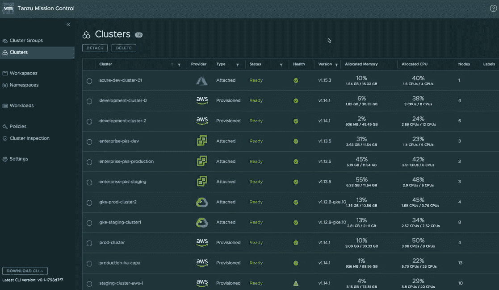
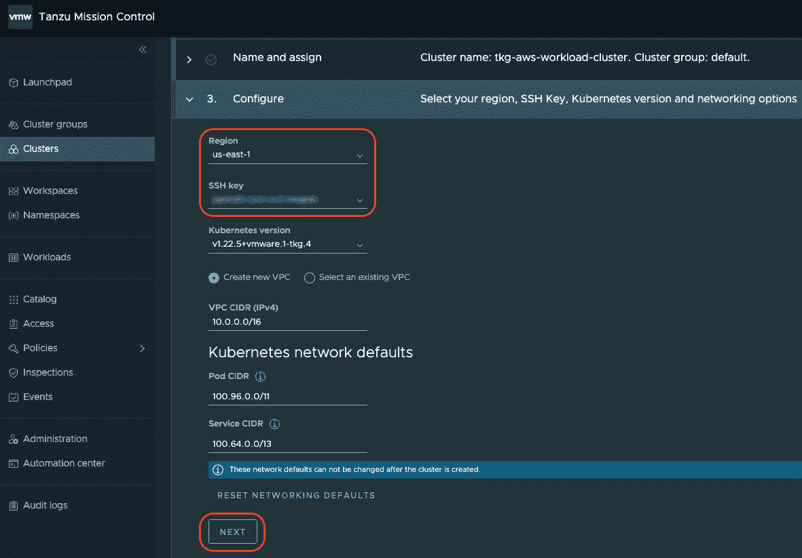
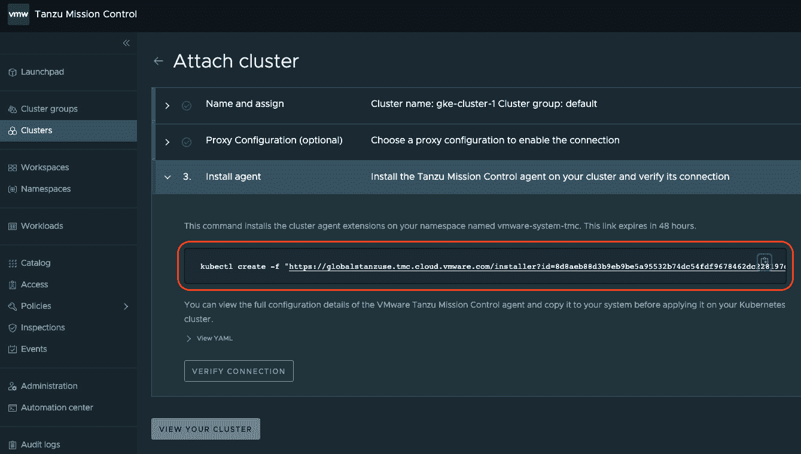
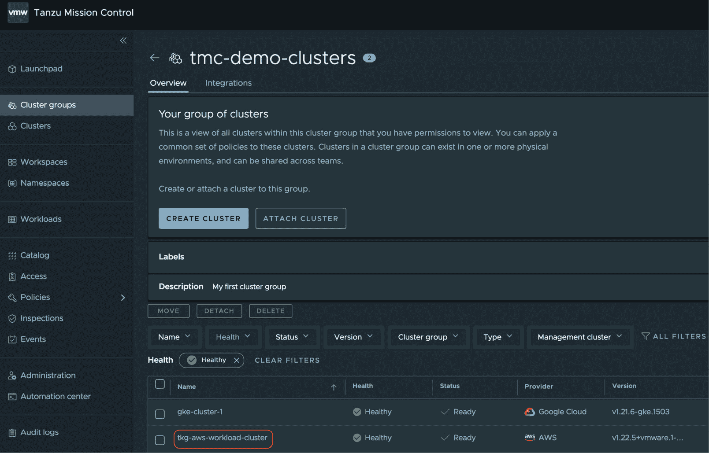
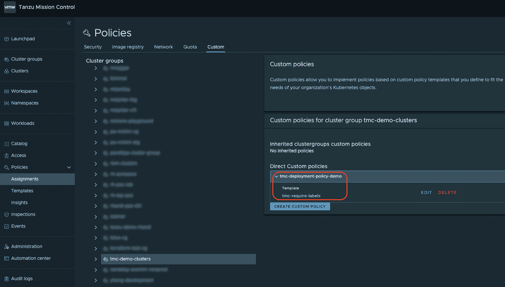

# 第九章：使用 Tanzu Mission Control 管理和控制 Kubernetes 集群

在本书的上一节中，我们介绍了 Tanzu 产品组合中的工具，这些工具帮助我们运行云原生应用。我们介绍了 Harbor 如何为您的容器镜像提供安全的存储环境，并展示了如何使用 Tanzu Kubernetes Grid 运行这些镜像，Tanzu Kubernetes Grid 在公共和私有云基础设施中提供一致的用户体验。最后，我们深入探讨了开发人员生产力领域，旨在自动化并保障软件供应链，从构思到生产环境中的应用程序运行。

本节内容涉及管理云原生应用及其相应的 Kubernetes 基础设施。在本章中，我们将学习如何使用 **Tanzu Mission Control**（**TMC**）管理、保护和治理各种 Kubernetes 集群，无论它们部署在什么样的基础设施上。接下来，我们将介绍 VMware Aria Operations for Applications，这是一款用于监控应用程序各个部分的工具，包括微服务之间的分布式追踪、应用性能、Kubernetes 对象、虚拟基础设施以及应用使用的其他服务。最后，我们将学习如何通过 Tanzu Service Mesh 使用开箱即用的双向 TLS 配置，安全地连接运行在 Kubernetes 上的应用并将其部署到不同的集群和环境中。

附注

从本章开始，为了简洁起见，我们将 Kubernetes 集群简称为 *集群*。

通过上一节的背景知识和对本节接下来章节的展望，我们将深入了解 TMC。我们将在本章中涵盖以下主题：

+   *为什么选择 TMC？* – 了解管理大规模 Kubernetes 环境面临的挑战以及 Tanzu Mission Control 提供的解决方案

+   *开始使用 TMC* – 学习如何使用 TMC 来管理集群生命周期

+   *使用 TMC 保护集群数据* – 学习如何备份集群和命名空间，并在需要时恢复它们，以保护正在运行的工作负载免受灾难的影响

+   *应用和确保使用 TMC 进行集群治理策略* – 学习如何将不同的集群用户治理策略应用到集群和 Kubernetes 命名空间组，并进行检查以发现集群中的异常，从而采取预防性安全措施

TMC 是 Tanzu 产品组合中的一款非常强大的 SaaS 服务，它为您的所有 Kubernetes 环境提供了统一的控制面板。让我们更深入地了解它。

# 为什么选择 TMC？

随着其受欢迎程度的不断上升，Kubernetes 已成为新的基础设施层。就像 10 年前，几乎所有的软件都运行在虚拟基础设施上一样，在未来几年，几乎所有新的应用程序可能会默认部署在 Kubernetes 上。事实上，大多数厂商提供的解决方案现在都可以在 Kubernetes 上运行。根据 **Cloud Native Computing Foundation**（**CNCF**）2021 年 12 月进行的调查，超过 560 万开发者表示他们使用 Kubernetes 部署应用程序，这仅在 1 年内就增长了 67%！由于 Kubernetes 提供的各种商业和技术优势，它将长期存在。根据这项 CNCF 调查，超过 96% 的组织已经采用 Kubernetes，并在不同的成熟度水平上运行其云原生应用程序！其中 73% 的组织已经在生产环境中运行 Kubernetes 负载！根据 CNCF 2022 年 2 月的博客文章，社区正见证着该技术的历史最高采用率。了解更多 CNCF 发布的详细信息，请点击这里：[`www.cncf.io/announcements/2022/02/10/cncf-sees-record-kubernetes-and-container-adoption-in-2021-cloud-native-survey/`](https://www.cncf.io/announcements/2022/02/10/cncf-sees-record-kubernetes-and-container-adoption-in-2021-cloud-native-survey/)。

## Kubernetes 面临的挑战

尽管 Kubernetes 是一个极受欢迎的工具，用于运行容器化应用程序，但在生产环境中操作 Kubernetes 仍然非常困难。正如你可能知道的，Kubernetes 仅通过 `kubectl` 命令行接口或使用其 REST API 进行操作。Kubernetes 中的每个配置都是 YAML 格式，通常很长且难以理解，除非你对 Kubernetes 的各种构件有深刻的理解。

### 面对超大集群的挑战

在这个上下文中，超大集群是指包含超过 50 个节点的集群。除了使用 Kubernetes 的基本复杂性外，运行生产级平台还面临其他一些安全和操作挑战。为了减少复杂性和运营开销，我看到一些企业部署了超大集群，仅维护、操作和保护少数几个关键集群。超大 Kubernetes 部署托管来自多个不同 **业务线**（**LOBs**）的应用程序，通过 Kubernetes 命名空间提供的逻辑隔离来实现。最初，这种做法可能听起来很合乎逻辑，但这种做法有几个缺点，如下所示：

+   一个为多个不同业务线和应用程序服务的大型集群很难维护，因为所有应用程序及其业务线在维护窗口和对停机的容忍度方面都有不同的偏好。如果一个应用程序在一个集群中部署了两个或更多 Pods，那么它通常不会面临停机。然而，确保达到这种合规性水平是一个不同的挑战。此外，大型集群需要较长的维护窗口来完成诸如升级等活动。

+   当在一个大型集群中运行数百个应用程序时，如果集群遇到任何问题或停机，它们都会一起受到影响。大型集群具有较大的冲击范围和灾难影响。

+   由于一个大型集群被多个不同的应用程序使用，应用程序团队无法自由选择特定的集群设置和资源需求来部署和运行他们的应用程序，例如使用特定的操作系统或为计算需求使用 GPU。尽管 Kubernetes 通过诸如污点（taints）和容忍度（tolerations）等构件提供了一种将某些应用程序 Pods 部署到特定节点的方法，但实施、维护和使用这种设置在实际操作中非常困难。

+   尽管 Kubernetes 通过命名空间（namespaces）将不同团队的应用程序隔离开来，但这仅仅是逻辑层面的隔离。实际上，属于不同命名空间的 Pods 可能会在同一节点上运行。这可能会引发潜在的安全威胁问题，如果恶意行为者在同一个集群中运行，或者如果应用程序没有在其部署清单中请求并预留所需资源，就可能会因“吵闹的邻居”（noisy neighbor）问题而导致资源饥饿。

考虑到大型集群面临的这些挑战，推荐使用多个较小的集群，特别是对于异构工作负载。如果在一个大型集群上运行的所有应用程序具有相同的需求，那么应该是没问题的；否则，推荐的做法是为不同的团队、业务单元（LOB）或应用程序创建较小的集群。

### 多个集群的挑战及 TMC 的解决方案

人们通常倾向于使用大型集群，以避免随着维护集群数量的增加而增加的操作开销。因此，一方面，我们可能需要多个属于不同团队、环境和目的的小集群，另一方面，也涉及到多个操作和安全挑战，这些挑战与保持这些集群正常运行有关。这正是 TMC 的作用所在，它通过从一个统一的控制面板管理多个集群来解决这些挑战。让我们简要了解一下这些挑战是什么，以及 TMC 如何帮助解决它们。

#### 集群生命周期管理的开销增加

多个集群的基本生命周期管理操作，如创建、扩展、升级和删除，在没有完全自动化的情况下可能会成为一场噩梦。在这个过程中的任何手动干预都可能导致由基本人为错误引起的配置漂移。这很快可能导致一组集群具有不同的配置，所有集群的升级需求将频繁发生，因为上游 Kubernetes 每 3 到 4 个月发布一个新版本，而补丁版本则更加频繁。建议定期通过升级和补丁来维护集群，以保持安全性和支持。这种对大量集群的频繁维护需要一个复杂的自动化设置。另一方面，为了这些生命周期过程建立和维护完整的端到端自动化需要大量的内部努力。在这种情况下，组织建立这种自动化需要问自己是否应该投入这么多努力来支持容器平台的低价值线活动，还是宁愿将这些资源投入到为其应用程序添加新业务功能，从而带来更多收入。

TMC 通过 **Tanzu Kubernetes Grid** (**TKG**) 的帮助来解决这一挑战。在前一章中，我们了解了 TKG 及其管理控制平面的概念，用于管理该管理集群下多个工作负载集群的生命周期。TMC 提供了一个即插即用的集成体验，将 TKG 管理控制平面集群连接起来，并允许 TMC 用户通过 TMC 门户执行所有 TKG 集群生命周期操作。这种简单、快捷和用户友好的管理集群生命周期方法解决了保持 Kubernetes 版本更新以确保安全性的挑战。此外，TKG 提供的完整即插即用集群生命周期自动化及其与 TMC 的集成减少了为同样的原因创建和维护内部自动化所需的额外努力。

#### 不同集群的特定配置要求

当不同集群具有不同的配置要求时，情况变得更加复杂。非生产集群组的安全要求与生产集群不同。此外，处理**支付卡行业**（**PCI**）数据环境的合规要求更为严格。根据环境不同，集群可能对用户访问、容器网络、工作负载隔离和部署策略有不同需求。例如，安全策略可能包括防止部署特权容器，这些容器可能允许对其部署主机进行根级访问，或者确保高可用性的策略只允许为应用程序部署两个以上的 Pod 等。找到适合所有集群的一种解决方案很困难。添加更多类型的集群会增加更多的复杂性。

为了解决这个挑战，TMC 允许我们创建集群组，并为不同的集群组创建不同的策略和处理方法。这样，开发集群组的访问策略可能与生产集群组的访问策略不同且更为宽松。此外，TMC 还允许您创建一组 Kubernetes 命名空间，称为**工作空间**，可以跨集群和集群组的边界。然后，我们可以为这些工作空间创建适用于命名空间级别的策略。在 Kubernetes 中，网络策略定义了哪些应用程序/服务可以跨不同命名空间连接到哪些应用程序/服务。

#### 工具的安装和配置

每个组织都有一套他们想要在集群上部署的工具，用于跨切面的关注点，如日志记录、监控、证书管理、**身份和访问管理**（**IAM**）等。当不同团队负责管理自己的小集群时，为集群所有者提供自助服务方法变得具有挑战性，他们可以根据需要快速和一致地选择和部署所需的工具。

为了解决这一点，TMC 拥有一些流行的开源包目录，不同的集群所有者可以根据其要求一键安装。这种能力不仅减少了不同团队的开销，还允许您为其他集群所有者设立防护栏，只有某些授权的包可以安装在其集群上。作为额外的优势，所有这些包都可以使用通用方法安装，并且仅限于目录中发布的版本。

#### 集群配置和工作负载数据保护

快速而简便的集群状态备份和恢复程序，也是大多数组织内集群的重要关注点。对于不使用持久化存储卷的静态工作负载，通过备份 Kubernetes 配置的 YAML 文件可以恢复这些对象，方法是重新应用这些配置，但如果运行状态与文档状态存在差异怎么办？在这种情况下，恢复的数据将不完全相同。对于有状态的工作负载，备份和恢复会增加更多复杂性，因为我们不仅需要备份这些工作负载使用的存储卷，还要备份它们的配置 YAML 文件。此外，对于许多集群执行这些活动，确保按要求的频率进行以最小化数据丢失，需要巨大的自动化努力。另一方面，如果备份和恢复的责任交给负责各个集群的团队，那么要么会出现疏漏，要么会面临如何在不同团队之间标准化执行这一过程的挑战。

为了应对这一需求，TMC 使用**Velero**（https://velero.io），这是一个由 VMware 支持的开源项目，用于备份和恢复 Kubernetes 集群。TMC 用户可以选择安排集群备份或按需进行备份。这些备份存储在**简单存储服务**（**S3**）兼容的对象存储位置，并通过 Web URL 进行访问。使用 TMC 控制台进行备份、调度和恢复非常简单，提供了一种一致的方法和存储位置，确保对集群上运行的所有内容（包括无状态和有状态的工作负载）提供所需的数据保护。通过 Velero，TMC 还允许你根据需要仅备份选定的重要命名空间。

什么是 S3？

S3 是 AWS 提供的一种对象存储或文件存储服务。S3 已经成为对象存储的标准，符合所需的 S3 接口。目前，除了 AWS 提供的 S3 服务外，市场上还有多个云托管和本地部署的 S3 兼容存储选项，包括 MinIO 和戴尔**弹性云** **存储**（**ECS**）。

#### 执行集群检查

当一个组织拥有数百个由多个团队管理的集群时，检查每个集群的安全性和操作政策合规性是一项庞大的工作。在医疗保健和金融等高度安全领域运营的企业有正式的义务定期审计其应用平台，以查找合规性并处理违规行为。手动审计和检查多个不同的集群，以查看它们是否遵循必要的安全合规性做法几乎是不可能的。这需要大量的自动化来构建一个扫描引擎，该引擎能够检查给定集群的检查清单上的所有不同规则，然后报告不同严重性的违规行为。官方 Kubernetes 规范中有一份安全生产级集群应遵循的推荐清单。类似地，**互联网安全中心**（**CIS**）也有一份基准测试推荐清单，应该在集群中遵循以确保安全。对数百个集群进行不同类型的检查是一项非常困难的任务。

然而，使用 TMC 进行集群检查只需几次点击。为了提供此功能，TMC 使用了**Sonobuoy**（https://sonobuoy.io），这是 VMware 支持的另一个开源项目，提供 Kubernetes 集群配置验证。TMC 允许你执行两种不同类型的检查——CIS 基准测试和 Kubernetes 规范合规性检查。检查完成后，TMC 用户将获得有关不同推荐合规性和违规的详细报告。这些结果可以帮助你采取快速的预防措施，在漏洞被利用之前关闭安全漏洞。

除了解决管理大量集群的挑战外，TMC 还会发出与其管辖下的集群相关的关键事件，以确保集群所有者充分了解它们的健康状况和关键生命周期阶段。此外，TMC 提供了一套全面的 REST API，允许你以编程方式执行所有这些操作。最后，作为主要的优势，TMC 可以为任何符合规范的 Kubernetes 版本执行所有这些操作，包括 AWS **弹性 Kubernetes 服务**（**EKS**）、**Azure Kubernetes 服务**（**AKS**）、**Google Kubernetes 引擎**（**GKE**）、OpenShift、Rancher、开源上游发行版以及许多其他类型。这不包括我们在*集群生命周期管理开销增加*一节中提到的完整集群生命周期管理。本文写作时，Kubernetes 集群的升级仅支持 TKG 集群。此功能使 TMC 成为实施企业多云 Kubernetes 策略的优秀工具。下图显示了 TMC 控制台，其中部署了多个 Kubernetes 集群，分别位于不同的云环境中：



图 9.1 – 管理多个 Kubernetes 集群的 TMC 控制台

通过这一点，你应该已经获得了一个令人信服的答案，为什么选择 TMC？我们将在本章稍后详细介绍这些功能的细节，但现在让我们看看如何开始使用 TMC。

# 开始使用 TMC

TMC 是一个 **软件即服务** (**SaaS**) 产品，隶属于 VMware Cloud Services。由于这一点，开始使用 TMC 无需任何安装和设置，这也是 SaaS 产品所带来的巨大便利。在 TMC 中，我们可以有两种类型的集群，如下所述：

+   **由 Kubernetes 平台管理控制平面管理的集群，这些集群已在 TMC 上注册** – 目前，TMC 仅支持此类别下的 TKG 集群。一旦在 vSphere、AWS 或 Azure 上运行的 TKG 管理集群（TKG 平台控制平面）在 TMC 中注册，我们就可以使用 TMC 界面执行所有生命周期操作，管理该管理集群下创建的所有集群。

+   **已连接到 TMC 的集群** – 这些可以是任何外部创建的符合规范的 Kubernetes 集群。我们可以将这些集群连接到 TMC，以进行本章之前讨论的几项管理活动，但不包括完全生命周期操作，如创建、删除和升级。TMC 提供了一个公共的管理控制平面，适用于所有 Kubernetes 集群，无论其种类和供应商如何。

在本节中，我们将执行以下操作以开始使用 TMC：

+   通过 VMware Cloud Services 控制台访问 TMC 门户

+   注册在 AWS 上运行的现有 TKG 管理集群

+   在已注册的管理集群下创建 TKG 工作负载集群

+   连接一个 GKE 集群进行管理

+   创建一个集群组

+   在新创建的集群组中添加两个关联的集群

+   创建一个工作区，一个跨集群的 Kubernetes 命名空间组

+   从两个不同集群中添加两个 Kubernetes 命名空间到已创建的工作区

然而，在你可以跟随操作之前，必须满足以下前提条件：

+   通过 VMware Cloud Services 账户访问 TMC 的管理员级别权限。

+   一个现有的 TKG 管理集群（版本 1.4.1 或更高版本），并具有至少三个控制平面节点的生产计划

+   由之前提到的 TKG 管理集群未管理的现有 Kubernetes 集群 – 这可以是 GKE、AKS、EKS、OpenShift、Rancher，甚至是开源 Kubernetes 集群

+   集群节点应包含 4 个 vCPU 和 8 GB 内存，以确保顺利执行步骤

+   配备互联网浏览器（优选 Google Chrome）和 `kubectl` CLI 的用户工作站

+   Kubernetes 集群应具有完全的互联网连接，且没有任何代理服务器，因为在不同操作中配置 TMC 的步骤会因为代理的存在而不同，本章中不考虑这一点

+   从与 TMC 关联的集群访问 AWS S3 或任何其他 S3 兼容的对象存储服务。

此外，如果您的 TKG 管理集群运行在 AWS 上，并且您已经手动配置了在 TKG 使用的 CloudFormation 堆栈中定义的 IAM 权限，则必须将以下列出的权限添加到 `nodes.tkg.cloud.vmware.com` IAM 策略或角色中：

```
{
  "Action": [
    "servicequotas:ListServiceQuotas",
    "ec2:DescribeKeyPairs",
    "ec2:DescribeInstanceTypeOfferings",
    "ec2:DescribeInstanceTypes",
    "ec2:DescribeAvailabiilityZones",
    "ec2:DescribeRegions",
    "ec2:DescribeSubnets",
    "ec2:DescribeRouteTables",
    "ec2:DescribeVpcs",
    "ec2:DescribeNatGateways",
    "ec2:DescribeAddresses",
    "elasticloadbalancing:DescribeLoadBalancers"
  ],
  "Resource": [
    "*"
  ],
  "Effect": "Allow"
}
```

然而，当您通过运行 `tanzu mc permissions aws set` 命令创建或更新 CloudFormation 堆栈时，这些权限会自动包含在内。一旦这些前提条件得到解决，剩下的步骤应该就没有问题了。让我们开始执行计划，着手启动 TMC。

## 访问 TMC 门户

首先通过 VMware Cloud Services 门户按照以下步骤打开 TMC 门户：

1.  访问 VMware Cloud Services 门户，网址为：https://console.cloud.vmware.com/。

1.  单击**启动服务**链接，位于**VMware Tanzu Mission Control**磁贴上，如下图所示：


图 9.2 – VMware Cloud Services 控制台

1.  这将打开如下图所示的 TMC 门户：


图 9.3 – Tanzu Mission Control 控制台

提示

如果您在 VMware Cloud Services 账户中没有 TMC 权限，您将无法在 VMware Cloud Services 控制台中看到 TMC 磁贴。您可能需要联系您的 VMware 联系人申请 TMC 试用访问，或者您可以通过以下 URL 请求访问 TMC Starter：https://tanzu.vmware.com/tmc-starter。

现在，我们已经进入 TMC 门户，接下来让我们在 TMC 中注册我们的第一个 TKG 管理集群。

## 在 TMC 中注册 TKG 管理集群

在 TMC 门户上执行以下步骤，以注册您现有的 TKG 管理集群， 无论其运行在 vSphere、AWS 还是 Azure 云环境上。本章中使用的管理集群部署在 AWS 上，这不会改变以下步骤中的任何过程，只需要为我们将创建的工作负载集群输入一些配置信息：

## 在 TMC 中注册 TKG 管理集群

在 TMC 门户上执行以下步骤，以注册您现有的 TKG 管理集群， 无论其运行在 vSphere、AWS 还是 Azure 云环境上。本章中使用的管理集群部署在 AWS 上，这不会改变以下步骤中的任何过程，只需要为我们将创建的工作负载集群输入一些配置信息：

1.  单击左侧导航栏中的**管理**菜单选项，打开**管理集群**选项卡，如下图所示：


图 9.4 – 打开管理集群屏幕

1.  在**管理集群**选项卡中，单击**注册管理集群**下拉菜单，选择**Tanzu Kubernetes Grid**选项，如下图所示：


图 9.5 – 选择 Tanzu Kubernetes Grid 注册为管理集群

1.  在注册管理集群的详细信息屏幕中，输入唯一的名称，从下拉列表中选择**默认（default）**，可选择性地添加简短描述，最后点击**下一步（NEXT）**按钮。我们将在本章稍后详细讨论集群组：


图 9.6 – 输入管理集群详细信息

1.  点击**下一步（NEXT）**按钮，进入**代理配置（Proxy Configuration）**部分，因为我们不需要使用它：


图 9.7 – 跳过代理配置

1.  您将获得一个包含 Kubernetes 资源的 YAML 文件的 URL，这些资源是您需要为管理集群创建的，以便将其与 TMC 帐户连接。请按照以下屏幕截图所示复制该 URL。您可以展开**查看 YAML**部分，查看将在管理集群上创建的 Kubernetes 资源及其配置详细信息：


图 9.8 – 复制注册 URL 以链接到管理集群

1.  点击**查看管理集群（VIEW MANAGEMENT CLUSTER）**按钮，检查在 TMC 上新注册的管理集群：


图 9.9 – 验证管理集群创建情况

1.  您应该看到如下屏幕截图中显示的页面。集群的状态为**未知（Unknown）**，因为我们还没有将注册的 YAML 配置应用到我们的管理集群：


图 9.10 – 管理集群状态未知

1.  打开控制台窗口，在您的工作站上使用`kubectl` CLI，并确保`kubectl`上下文指向管理集群。

1.  使用在*步骤 4*中复制的 URL 运行以下`kubectl apply`命令：

    ```
    $ kubectl apply -f <tmc-url>
    ```

这应该列出为您的管理集群创建的多个不同 Kubernetes 资源。完成后，我们已经在 TKG 管理集群和 TMC 帐户之间建立了双向链接。我们应该能够在 TMC 上看到成功验证的管理集群。

1.  经过 5 到 10 分钟后，点击**验证连接（VERIFY CONNECTION）**按钮，如*步骤 6*所示，或导航到**管理** | **管理集群**，以验证管理集群是否已成功注册。如以下屏幕截图所示，集群现在处于**健康（Healthy）**状态，并且**已就绪（Ready）**。点击屏幕截图中高亮显示的集群名称链接：


图 9.11 – 管理集群注册验证

1.  一旦点击上一步中显示的管理集群名称，您将看到类似以下截图，显示管理集群的详细信息，包括集群中不同组件的健康指标：


图 9.12 – 管理集群详细信息

这就是通过 TMC 门户注册 TKG 管理集群的步骤。在接下来的部分，我们将展示如何使用 TMC 门户在新添加的管理集群下创建一个新的 TKG 工作负载集群。

## 在管理集群下创建新的工作负载集群

在 TMC 上设置好第一个 TKG 管理集群后，我们将使用此设置来创建一个新的 TKG 工作负载集群。正如前一章详细讨论的，TKG 工作负载集群用于运行容器化应用程序，而管理集群是多个工作负载集群的控制平面。

所有 TKG 工作负载集群都在**provisioner**下创建。Provisioner 是管理集群中的一个命名空间，负责管理管理集群中的所需工作负载集群。通过这种方式，TKG 中的 provisioner 提供了一个多租户结构，允许不同的团队创建和管理自己的工作负载集群，而不会干扰其他团队。在我们的案例中，我们将使用管理集群的**default**命名空间，该命名空间应该是默认存在的。

按照以下步骤为您的 TKG 管理集群创建一个新的 TKG 工作负载集群：

1.  前往左侧导航栏的**Administration**菜单，打开**Management clusters**标签页，点击**tkg-aws-mgmt-cluster**链接以打开其详细页面：


图 9.13 – 打开管理集群页面

1.  前往左侧导航栏的**Clusters**菜单，点击以下截图中突出显示的**CREATE CLUSTER**按钮：


图 9.14 – 创建工作负载集群

1.  从早前在 TMC 上注册的列表中选择**tkg-aws-mgmt-cluster**，然后点击**CONTINUE TO CREATE** **CLUSTER**按钮：


图 9.15 – 继续创建工作负载集群

1.  从**Provisioner**下拉菜单中选择**default**，然后点击**NEXT**按钮：


图 9.16 – 选择工作负载集群的 provisioner

1.  输入集群名称，选择性地添加描述，然后点击**NEXT**按钮：


图 9.17 – 输入工作负载集群的详细信息

1.  在此步骤中输入所需的基础设施特定详细信息，并点击**下一步**按钮。由于本章中使用的 TKG 管理集群运行在 AWS 上，以下截图显示了 AWS 特定的详细信息。对于 vSphere 和 Azure，某些字段会有所不同。你可以在这里获取更多详细信息：https://docs.vmware.com/en/VMware-Tanzu-Mission-Control/services/tanzumc-using/GUID-42150344-CD4C-43AE-8C39-C059A97EF47C.html：



图 9.18 – 输入工作负载集群配置

1.  选择要创建的工作负载集群的控制平面计划。你还可以选择性地更改其他字段的值，但这不是必需的，我们建议按照本章中的程序进行操作。最后，点击**下一步**按钮以选择工作节点详细信息：


图 9.19 – 选择工作负载集群类型

1.  输入工作负载集群的工作节点数量，然后点击**创建集群**按钮：


图 9.20 – 输入工作节点数量

你将看到一条消息，表示正在创建工作负载集群，并显示其规格，如下图所示：


图 9.21 – 正在创建工作负载集群

1.  一旦工作负载集群成功创建，你将看到如下截图所示的集群详细信息页面。根据集群的规模和基础设施，这可能需要 5 到 10 分钟：


图 9.22 – 工作负载集群详细页面

这就是我们的第三步，通过 TMC 门户使用 TKG 管理集群创建 TKG 工作负载集群。现在，我们将把一个外部管理的 Kubernetes 集群附加到 TMC，以便使用 TMC 对该集群执行各种第二天操作。

## 使用 TMC 附加现有 Kubernetes 集群

本节中，我们将把现有的 GKE 集群附加到 TMC 账户。你也可以选择其他类型的 Kubernetes 集群，包括 Rancher、AKS、EKS、OpenShift、上游开源等。TMC 允许你附加符合规范的 Kubernetes 集群，只要该集群具有管理员级别的`kubectl`访问权限。因此，让我们附加一个外部集群：

1.  从左侧菜单栏进入**集群**菜单，并点击下图所示的**附加集群**按钮：


图 9.23 – 进入附加集群页面

1.  输入集群名称，选择集群组为**默认**，可选择性地输入描述，最后，点击下图中高亮显示的**下一步**按钮：


图 9.24 – 输入附加集群的详细信息

1.  跳过代理配置并点击**下一步**按钮：


图 9.25 – 跳过代理配置详细信息

1.  就像我们在本章前面使用 Kubernetes YAML 配置文件注册管理集群一样，现在是时候使用类似的方法注册外部集群了。你可以查看将在目标集群上创建的 Kubernetes 资源的详细信息，以建立集群与 TMC 之间的双向通信：



图 9.26 – 复制代理配置命令以将集群附加到 TMC

1.  打开命令窗口，在该窗口中你可以通过`kubectl`访问正在附加的集群，并将`kubectl`上下文更改为指向正在附加的集群。

1.  在命令窗口中运行 *第 4 步* 中复制的`kubectl`命令，以在集群中创建所需的代理部署资源，进而附加到 TMC。

1.  在成功执行`kubectl create`命令后，点击**验证连接**按钮。你应该能在列表中看到最近附加的集群，如下图所示。然后，点击附加集群的名称以验证其详细信息：


图 9.27 – 在列表中验证附加的集群

1.  检查附加集群的详细信息。如以下屏幕所示，集群的类型为**附加**：


图 9.28 – 附加集群详细信息

这标志着我们将外部管理的 Kubernetes 集群附加到 TMC 的任务完成。接下来的步骤是创建集群组，并将我们的 TKG 工作负载和 GKE 附加集群添加到该组中。

## 在 TMC 上创建集群组

正如本章前面讨论的那样，TMC 允许你将具有相似性质的不同集群进行分组，并使用通用配置进行管理和操作。配置多个集群的组可以使大型 Kubernetes 基础设施的操作变得非常简便和高效。那么，接下来我们将学习如何在 TMC 中创建集群组：

1.  点击左侧导航栏中的**集群组**菜单项，然后点击**创建集群组**按钮，如下图所示：


图 9.29 – 创建集群组

1.  输入集群组名称，添加可选描述，然后点击**创建**按钮，如下图所示：


图 9.30 – 输入集群组详细信息

1.  你应该能在列表中看到新创建的集群组，如下图所示：


图 9.31 – 验证集群组的存在

现在，让我们使用以下步骤将这两个集群添加到这个新创建的集群组中。

1.  点击如下截图所示的**默认**集群组：


图 9.32 – 选择默认集群组

1.  选择我们在 TMC 上的两个集群，分别用于 TKG 工作负载和 GKE，然后点击如以下截图所示的**移动**按钮：


图 9.33 – 选择用于分组的集群

1.  选择我们在*步骤 2* 中创建的集群组并点击**移动**按钮：


图 9.34 – 选择集群组

1.  进入**集群组**页面，点击我们创建的新集群组，检查我们在上一步中添加的两个集群的存在：


图 9.35 – 进入新的集群组

1.  如下截图所示， 在本节中我们创建的两个集群都在集群组中：


图 9.36 – 集群组中的列出集群

将具有相似需求的集群进行分组是一种非常强大的方法，能够管理数百个具有异构需求的集群。除了集群组，TMC 还允许你将 Kubernetes 命名空间进行分组，以执行适用于多个集群中不同命名空间的某些命名空间级配置。让我们深入了解一下。

## 理解 TMC 中的工作区

如本章前面所讨论的，TMC 允许你将具有相似性质的集群进行分组。分组有助于我们为它们创建共同的配置和策略，从而提高运营效率。然而，Kubernetes 中的某些策略只能在命名空间级别应用，例如定义一个命名空间中的 Pod 可以与另一个命名空间中的 Pod 通信的网络策略。此外，我们还可以在命名空间级别配置集群用户访问策略，TMC 也允许我们在命名空间级别创建镜像仓库访问策略。虽然将集群级别的策略应用于集群组是一个简单的任务，但为单个命名空间应用命名空间级别的策略可能非常不实用。此外，如果我们试图管理数百个 Kubernetes 集群，尝试将命名空间级别的策略应用于集群中一组命名空间也不会有太大帮助。基于这些原因，TMC 提供了一种名为**工作区**的构造，它允许我们在不同的集群中创建一组命名空间——然后，我们可以创建一个适用于整个工作区的命名空间级别的策略，从而适用于同一工作区中的所有命名空间。在不同集群中部署的多云应用程序可能需要类似的用户访问或网络策略配置。对于包含此应用程序所有命名空间并运行不同集群的工作区，将它们作为一个单位进行管理会非常方便。

让我们在本章前一节中添加的两个集群中创建两个命名空间，然后创建一个工作区，将这两个命名空间添加到其中：

1.  从左侧导航栏中打开**工作区**菜单，并点击**创建工作区**按钮，如下截图所示：


图 9.37 – 创建工作区

1.  输入名称，任选地添加描述，并点击页面上的**创建**按钮，如下截图所示：


图 9.38 – 输入工作区详情

1.  如下截图所示，一个新的工作区已经创建。点击工作区名称，确保其中没有列出任何命名空间：


图 9.39 – 验证工作区是否已创建

1.  打开我们之前在 TMC 门户上创建的**tmc-demo-clusters**集群组，如下截图所示：


图 9.40 – 打开集群组

1.  点击 TKG 工作负载集群，如下截图所示：



图 9.41 – 打开集群详情页面

1.  点击集群详情页面的**命名空间**选项卡，选择**default**命名空间，然后点击**ATTACH 1 NAMESPACE**按钮，如下图所示：


图 9.42 – 选择要附加到工作区的命名空间

1.  选择或输入工作区名称，然后点击**ATTACH**按钮，如下图所示：


图 9.43 – 选择要附加的工作区

1.  如下图所示，你可以看到**default**命名空间现在位于**tmc-demo-workspace**下，我们在之前的步骤中创建了这个工作区：


图 9.44 – 验证命名空间与工作区的关联

1.  按照本章节的说明，重复*步骤 5* 到 *8*，将**default**命名空间添加到此新工作区中，适用于另一个集群**gke-cluster-1**，我们之前已将其附加到 TMC 并加入了**tmc-demo-clusters**组。

1.  从左侧导航栏打开**工作区**菜单，点击我们之前创建的新的工作区**tmc-demo-workspace**：


图 9.45 – 打开工作区详情

1.  你应该能够看到来自两个不同集群的两个默认命名空间，它们作为我们在本部分创建的新工作区的一部分列出，如下图所示：


图 9.46 – 验证工作区中的命名空间

到此为止，我们已经涵盖了如何创建工作区以及如何将现有命名空间附加到工作区中的不同集群。在我们之前讨论的示例中，我们使用了与 TMC 中同一集群组内集群名称相同的默认命名空间。然而，你可以将任何命名空间添加到工作区，无论命名空间名称和其父集群的组状态如何。

到此为止，我们已经完成了本章节这一部分的所有步骤——*开始使用 TMC*。我们学习了如何在 TMC 中注册 TKG 管理集群，并使用 TMC 界面创建了一个 TKG 工作负载集群。然后，我们还将一个外部管理的 GKE 集群附加到 TMC。最后，我们学习了如何将集群和 Kubernetes 命名空间分组，以便将它们作为一个单位执行常见操作。在章节的下一部分，我们将学习如何使用 TMC 进行集群数据的备份和恢复。

# 使用 TMC 保护集群数据

Kubernetes 广泛用于在生产环境中运行业务关键应用程序。在这些情况下，应该有可靠的灾难恢复机制来定期进行集群数据和配置备份，并在任何原因导致数据丢失时恢复它们。尽管 Kubernetes 主要用于运行无状态工作负载，其中持久化数据存储在集群外部的数据库中，但运行有状态的软件，如缓存、队列和数据库，正逐渐被采纳。在*第六章*，《使用 Harbor 管理容器镜像》中，Harbor 注册表部署使用的是部署在 Kubernetes 上的数据存储。这使得备份数据变得更加重要。

为了涵盖这个重要主题，我们将学习如何通过 TMC 进行集群备份和恢复，步骤如下：

1.  配置一个兼容 S3 的远程备份存储位置。

1.  配置集群使用远程存储位置来备份数据。

1.  将自定义应用部署到集群。

1.  对集群进行备份。

1.  删除集群命名空间及其中的自定义部署，以模拟灾难。

1.  恢复集群备份。

1.  在恢复后，验证已删除的命名空间和其中的自定义部署是否存在。

让我们开始逐步执行这些步骤。

### 配置备份目标位置

TMC 允许你为不同的集群组创建独立的备份目标位置。为集群组配置备份位置是一次性的管理活动。一旦目标位置与集群组关联，我们就可以使用该备份位置配置为集群组中的任何集群进行按需或定期备份。此外，一个配置好的备份位置可以被多个集群组使用。在本章中，我们将使用 AWS S3 选项作为存储位置。

以下步骤描述了如何在 TMC 中为集群组配置备份目标位置：

1.  创建你的 AWS 账户凭证，供 TMC 用于将备份数据存储在 S3 桶中：

    1.  从左侧导航栏打开**管理**菜单，并点击**创建账户凭证**按钮，如下图所示：


图 9.47 – 创建 AWS 账户凭证

1.  从**TMC 配置的** **存储**选项中选择**AWS S3**选项：


图 9.48 – 选择已配置的存储

1.  输入账户凭证名称并点击**生成** **模板**按钮：


图 9.49 – 输入凭证名称并生成模板

1.  应该下载一个凭证模板文件。这是一个 AWS CloudFormation 模板，用于创建所需的 S3 存储桶，并授予 TMC 所需的权限，以便访问该存储桶进行备份和恢复操作。将该模板文件保存在本地工作站上，并点击 **下一步** 按钮：


图 9.50 – 下载生成的 AWS CloudFormation 模板

1.  按照 **快速入门指南** 链接，将下载的模板应用到你的 AWS 帐户中。应用 CloudFormation 模板后，你将在模板执行的输出中获得 **Amazon 资源名称** (**ARN**)，该 ARN 将在下一步中使用。你可以在快速入门指南中找到这些指令，如下图所示：


图 9.51 – 按照快速入门指南创建所需的 AWS S3 对象

1.  在应用 CloudFormation 模板后，从 AWS 中复制 ARN 并点击 **创建** 按钮，最终创建我们可以用于任何集群的备份和恢复操作的帐户凭证：


图 9.52 – 应用复制的 ARN 并创建凭证

1.  在帐户凭证成功创建后，你应该能在 **管理** 菜单下的 **帐户** 标签中看到它，如下图所示：


图 9.53 – 验证帐户凭证的创建

1.  转到 **管理** 菜单下的 **目标位置** 标签，并点击 **创建目标位置**，选择 AWS S3 选项，如下图所示：


图 9.54 – 创建目标位置

1.  选择我们在本节 *第 1 步* 中创建的帐户凭证，并点击 **下一步** 按钮：


图 9.55 – 选择帐户凭证

1.  选择我们在本章早些时候创建的集群组，并点击 **下一步** 按钮：


图 9.56 – 将集群组添加到目标位置

1.  输入目标位置的名称并点击 **创建** 按钮：


图 9.57 – 输入目标位置名称

1.  你应该能在 **管理** 菜单下的 **目标位置** 标签中看到新创建的目标位置，以及帐户凭证和相关的 S3 存储桶名称，如下图所示：


图 9.58 – 验证目标位置的创建

现在，既然我们已经设置了备份目标位置并将其分配给集群组，我们可以继续对该组中的集群执行备份和恢复操作。

### 启用集群的数据保护

完成为集群组执行备份和恢复所需的步骤后，我们来为组中的一个集群启用它。在本示例中，我们将使用之前附加到 TMC 的外部管理 GKE 集群。执行以下步骤完成此任务：

1.  点击附加的集群**gke-cluster-1**，位于**tmc-demo-clusters**组中。如果你使用了本章中未提到的名称，你需要相应地选择集群：


图 9.59 – 打开附加集群的详情页面

1.  点击如下面截图中突出显示的**启用数据保护**链接：


图 9.60 – 点击启用数据保护链接

1.  点击**启用**按钮以确认操作：


图 9.61 – 启用集群的数据保护

该操作部署了 Velero，这是一个开源的 Kubernetes 集群备份和恢复工具。通过这个操作，我们已经为集群准备好了备份功能，并且部署了所需的工具集。现在，让我们在集群中部署一个测试工作负载。

### 在集群中部署自定义应用

执行以下步骤，在我们之前任务中启用备份和恢复的集群上运行 nginx 部署：

1.  在目标集群的`kubectl`上下文中，运行以下命令，这会创建一个名为`nginx`的命名空间，并在其中创建一个名为`nginx-deployment`的 Kubernetes 部署，部署三个 Pod。你可以查看以下命令中使用的部署清单文件，以获取更多详细信息：

    ```
    $ kubectl apply -f https://raw.githubusercontent.com/PacktPublishing/DevSecOps-in-Practice-with-VMware-Tanzu/main/chapter-10/nginx-deployment.yaml
    ```

1.  使用 TMC 门户在集群详情页的**工作负载**标签下验证部署。如以下屏幕所示，nginx 部署和副本集都在**健康**状态下运行。为了减少屏幕上的杂乱，你还可以使用突出显示的切换按钮过滤 Tanzu 和 Kubernetes 特定的工作负载：


图 9.62 – 验证集群的工作负载部署

现在，我们在目标集群的自己的命名空间中部署了一个可以备份的工作负载。让我们使用以下步骤对集群进行备份。

### 备份集群

执行以下步骤备份我们在上一个任务中部署 nginx 工作负载的集群：

1.  在集群的**概览**标签页中，点击如下面截图中突出显示的**创建备份**链接：


图 9.63 – 启动集群备份过程

1.  选择备份整个集群的选项，并点击**NEXT**按钮。我们也可以仅备份选定的命名空间或通过标签值标识的对象，这是一个非常灵活的选择：


图 9.64 – 选择备份范围

1.  选择我们在本章中之前创建的指向 AWS S3 桶的备份目标位置，并点击**NEXT**按钮：


图 9.65 – 选择备份目标位置

1.  选择备份计划。虽然我们可以创建定期的备份计划，但在这里，我们将选择**NOW**进行按需备份，以了解这一概念。然后点击**NEXT**按钮继续：


图 9.66 – 选择备份计划

1.  输入备份**保留天数**的值并点击**NEXT**按钮：


图 9.67 – 输入备份保留天数

1.  最后，输入备份的名称，并点击**CREATE**按钮，如下图所示：


图 9.68 – 输入备份名称

1.  这将触发备份过程，在 2 到 5 分钟内，你应该能在集群的**数据保护**标签页下看到备份完成的状态。如果集群中有其他工作负载在运行，备份过程可能需要更长时间：


图 9.69 – 验证备份完成

在成功备份集群后，接下来我们将进行恢复操作——但在恢复之前，让我们*不小心*删除包含之前创建的 nginx 部署的**nginx**命名空间。

### 删除集群中运行的自定义部署

按照以下步骤执行此任务：

1.  运行以下命令删除目标集群中的**nginx**命名空间：

    ```
    $ kubectl delete namespace nginx
    ```

1.  在集群的**工作负载**标签页中验证 nginx 部署的缺失。如图所示，我们之前验证过的**nginx-deployment**及其相应的 ReplicaSet 现在已经缺失：


图 9.70 – 验证工作负载删除

现在，由于我们*不小心*删除了整个命名空间及其中运行的工作负载，以模拟灾难情景，让我们使用之前为集群创建的备份来恢复已删除的命名空间并使其对象重新运行。

### 恢复集群备份

按照以下步骤恢复目标集群的备份，并将已删除的 Kubernetes 对象恢复到该集群中：

1.  转到集群的**数据保护**选项卡，从**备份**列表中选择之前所做的备份，并点击**恢复**链接，如下图所示：


图 9.71 – 恢复备份

1.  由于我们只删除了一个命名空间，我们只需选择高亮显示的选项以恢复特定的命名空间。选择需要恢复的**nginx**命名空间。在这里，TMC 还允许我们将备份中的源命名空间恢复到不同的目标命名空间（如果需要）。可以使用目标命名空间标题旁边的小铅笔图标进行此操作。选择命名空间后，点击**下一步**按钮：


图 9.72 – 选择恢复备份规范

1.  输入恢复实例的名称并点击**恢复**按钮：


图 9.73 – 输入恢复实例名称

1.  成功恢复后，您将在集群的**数据保护**选项卡下的**恢复**部分看到恢复的条目，如下图所示：


图 9.74 – 验证恢复是否已完成

1.  在集群详细页面的**工作负载**选项卡下，验证**nginx**命名空间及其对象的存在。如您所见，**nginx**命名空间现已成功恢复：


图 9.75 – 验证恢复对象的存在

通过此步骤，我们可以总结关于备份和恢复 Kubernetes 集群的漫长而重要的一节。值得注意的是，本节中进行的几项配置是一次性活动。这包括创建 AWS S3 账户凭证、创建备份的目标位置、将目标位置与集群组关联等。完成这些设置后，备份和恢复集群或集群的一部分仅需几次点击。

现在让我们来看看 TMC 的另一个非常重要的功能——策略管理。

# 使用 TMC 应用治理策略到集群

在本章的前一部分中，我们学习了如何通过注册 TKG 管理集群、创建 TKG 工作负载集群、附加 GKE 集群以及最后进行集群分组来开始使用 TMC——但我们为什么要将所有集群引入 TMC？在本节中，我们将通过使用 TMC 界面执行这些集群的各种活动来探讨这个问题。我们将涵盖以下活动：

+   为集群组配置安全策略

+   为工作区配置镜像注册表治理策略

+   为集群组配置部署治理策略

+   检查集群的策略违规状态

+   检查集群是否符合 CIS 基准

本节内容涵盖了一长串活动，让我们一个个完成它们。

## 为集群组配置安全策略

在运行容器时，从安全角度来看，有几件事情可能会配置错误，这会给黑客留下利用这些漏洞的机会。根据集群中运行的工作负载的性质，Kubernetes 管理员可能需要保护多个方面。在微服务的世界中，Kubernetes 平台团队通常需要允许不同的团队部署其应用程序，并按应用程序要求配置相关设置。然而，确保所有团队遵循平台团队所概述的必要安全实践可能是一个非常困难的任务。这就是为什么 Kubernetes 管理员需要为集群设置保护措施，以防止工作负载以不安全的方式部署。为了解决这个需求，Kubernetes 提供了一种名为 **PodSecurityPolicy** 的构造，它定义了在 PodSecurityPolicy 生效时，Pod 在 Kubernetes 集群中可以做什么以及不能做什么。TMC 允许你为一组集群配置这些安全策略，从而避免集群之间出现配置漂移。

让我们为之前创建的集群组创建一个这样的安全策略。此策略将防止任何 Pod 获得对 Kubernetes 节点操作系统和资源的特权访问。以下步骤将帮助创建并测试此策略：

1.  确保在应用策略之前，可以部署具有特权访问的 Pod，按照以下子步骤进行操作：

    1.  使用以下命令，在 `tmc-demo-clusters` 组下的 TKG 工作负载集群中部署特权 Pod。你可以查看以下命令中使用的 Pod 定义文件——注意其中定义了安全上下文，以便允许 Pod 获取特权访问：

    ```
    $ kubectl apply -f https://raw.githubusercontent.com/PacktPublishing/DevSecOps-in-Practice-with-VMware-Tanzu/main/chapter-10/privileged-pod.yaml
    ```

    1.  验证 Pod 是否已创建并成功运行。这里假设没有任何安全策略阻止特权 Pod 的创建：

    ```
    $ kubectl get pod
    ```

    ```
    NAME             READY   STATUS    RESTARTS   AGE
    ```

    ```
    privileged-pod   1/1     Running   0          48s
    ```

1.  在验证我们可以在集群中运行特权 Pod 后，现在让我们使用以下子步骤在 TMC 中为集群组创建安全策略：

    1.  从左侧导航栏的 **策略** > **分配** 菜单以及 **安全性** 选项卡中打开。然后，点击集群组 **tmc-demo-clusters**，并点击如下截图中突出显示的 **创建安全策略** 按钮：


图 9.76 – 为集群组创建安全策略

1.  TMC 允许您通过从头开始定义自定义安全策略来完全自定义您的安全要求。它还提供了两种现成的选择：**基础**和**严格**。让我们从**安全模板**下拉菜单中选择**基础**。您会注意到，它限制了特权容器的创建，如以下截图所示。最后，点击**创建策略**按钮，将限制应用于相关集群组：


图 9.77 – 进入安全策略配置

1.  您将看到集群组的策略列表，如以下截图所示：


图 9.78 – 验证安全策略创建

1.  现在，让我们验证该策略是否已应用于组中的集群。请按照以下子步骤进行操作：

    1.  首先，通过运行以下命令删除我们在第一步中在 TKG 工作负载集群中创建的 Pod：

    ```
    $ kubectl delete pod privileged-pod
    ```

    1.  通过运行以下命令，再次创建相同的 Pod：

    ```
    $ kubectl apply -f https://raw.githubusercontent.com/PacktPublishing/DevSecOps-in-Practice-with-VMware-Tanzu/main/chapter-10/privileged-pod.yaml
    ```

    1.  您将看到如下错误信息，说明由于安全策略的原因，Pod 未能成功创建：

    ```
    Error from server ([tmc.cgp.tmc-security-policy-demo] Privileged container is not allowed: centos, securityContext: {"privileged": true}): error when creating "https://raw.githubusercontent.com/PacktPublishing/DevSecOps-in-Practice-with-VMware-Tanzu/main/chapter-10/privileged-pod.yaml": admission webhook "validation.gatekeeper.sh" denied the request: [tmc.cgp.tmc-security-policy-demo] Privileged container is not allowed: centos, securityContext: {"privileged": true}
    ```

这就结束了我们关于如何配置适用于使用 TMC 部署和运行工作负载的 Kubernetes 集群安全策略的学习。我们测试了在应用该策略的集群组中的一个集群，但您也可以对组中另一个集群进行相同的操作，并应看到类似的测试结果。就像这里解释的运行特权容器的例子一样，我们可以使用 TMC 为集群组创建多种不同类型的安全策略。接下来，我们将学习如何应用一个工作区级别的策略，定义在特定集群命名空间中运行的工作负载如何从容器注册表拉取容器镜像。

## 为工作区配置镜像注册表策略

在拉取容器镜像时，建议采用一些经过验证的最佳实践。对于受监管环境的镜像拉取限制，可能会更为严格。以下是 TMC 根据不同的合规要求，允许您为容器注册表策略配置的参数。TMC 中的注册表策略可能根据需要具有所有或某些适用的参数：

+   **仅使用摘要（SHA）拉取镜像，而不使用标签** – 这是在生产环境中设置的重要规则，因为标签在技术上可能会为不同的拉取实例提供不同的内容，而同一摘要的镜像内容始终是相同的。使用摘要拉取镜像可以确保它们始终具有相同的内容。

+   **仅从特定镜像仓库拉取镜像** – 如果要求容器只能从内部托管的容器注册表拉取镜像，这条规则将有所帮助。

+   `myapp/*`。

+   **允许具有特定标签值的镜像** – 这与之前的规则类似，但适用于标签名称。

在本节中，我们将学习如何配置一个策略，仅通过摘要而不是标签来要求拉取镜像。以下是实现此操作的步骤：

1.  从左侧导航栏进入**策略** | **分配**菜单，选择**镜像注册表**选项卡。然后，选择我们之前创建的工作区，点击**创建镜像注册表策略**按钮，如下图所示：


图 9.79 – 创建镜像注册表策略

1.  从**镜像注册表模板**下拉菜单中选择**要求摘要**选项，提供策略名称，并点击**创建** **策略**按钮：


图 9.80 – 输入镜像注册表策略详情

1.  你可以看到为选定的工作区创建的新镜像注册表策略，如下图所示：


图 9.81 – 验证镜像注册表策略的创建

1.  在 GKE 附加的集群中创建一个新的命名空间的 Pod，该命名空间不受策略影响。此 Pod 使用标签拉取镜像。Pod 定义的 YAML 文件可以在以下链接查看：https://raw.githubusercontent.com/PacktPublishing/DevSecOps-in-Practice-with-VMware-Tanzu/main/chapter-10/image-tag-using-pod.yaml：

    1.  使用以下命令在集群中创建一个新的命名空间：

    ```
    $ kubectl create namespace test-registry-policy
    ```

    1.  创建一个使用标签拉取镜像的 Pod：

    ```
    $ kubectl apply -f https://raw.githubusercontent.com/PacktPublishing/DevSecOps-in-Practice-with-VMware-Tanzu/main/chapter-10/image-tag-using-pod.yaml -n test-registry-policy
    ```

1.  你将看到 Pod 成功创建，没有任何问题：

    ```
    NAME                  READY   STATUS    RESTARTS   AGE
    ```

    ```
    image-tag-using-pod   1/1     Running   0          7s
    ```

1.  使用以下命令，在我们应用了镜像注册表策略且不允许通过标签值拉取镜像的**default**命名空间中创建相同的 Pod：

    ```
    $ kubectl apply -f https://raw.githubusercontent.com/PacktPublishing/DevSecOps-in-Practice-with-VMware-Tanzu/main/chapter-10/image-tag-using-pod.yaml
    ```

1.  你将看到 Pod 无法创建，并显示以下错误信息，解释了所施加的限制：

    ```
    Error from server ([tmc.wsp.default.tmc-image-registry-policy-demo] container <busybox> has an invalid image reference <busybox:stable-uclibc>. allowed image patterns are: {hostname: [], image name: [] and require digest}): error when creating "image-tag-useing-pod.yaml": admission webhook "validation.gatekeeper.sh" denied the request: [tmc.wsp.default.tmc-image-registry-policy-demo] container <busybox> has an invalid image reference <busybox:stable-uclibc>. allowed image patterns are: {hostname: [], image name: [] and require digest}
    ```

1.  使用以下命令创建相同的 Pod，替换镜像标签为摘要：

    ```
    $ kubectl apply -f https://raw.githubusercontent.com/PacktPublishing/DevSecOps-in-Practice-with-VMware-Tanzu/main/chapter-10/image-digest-using-pod.yaml
    ```

1.  你将看到此时 Pod 在**default**命名空间中成功创建，且镜像策略的限制已生效：

    ```
    NAME                     READY   STATUS    RESTARTS   AGE
    ```

    ```
    image-digest-using-pod   1/1     Running   0          3s
    ```

这部分内容结束了如何为工作区创建适用策略的学习。之前配置和测试的限制同样适用于其他集群的**default**命名空间，作为同一工作区的一部分。

在下一个主题中，我们将学习如何使用 TMC 为集群组应用部署治理策略。

## 配置集群组的部署治理策略

在大多数 Kubernetes 平台部署中，平台团队负责确保他们的内部客户——应用团队，能够有序使用平台。这种有序使用包括公平使用可用的计算资源以及高可用性部署的应用程序。当多个不同的 Kubernetes 平台团队管理较少的集群时，实施适用于全企业的标准将具有挑战性，因为各个平台团队可能有各自的偏好。另一方面，如果由中央管理团队管理所有集群，那么确保符合治理政策将变得非常困难。为了解决这些挑战，TMC 允许您创建部署治理策略。TMC 使用一个名为**Open Policy Agent**（**OPA**）**Gatekeeper**（https://github.com/open-policy-agent/gatekeeper）的开源项目来实现这些策略。由于 Gatekeeper 策略配置的声明式特性，TMC 还允许您为任何用例创建自定义部署策略——天空是极限！

以下是 TMC 提供的部分开箱即用的策略，可以根据需要应用到不同的集群组：

+   阻止某些 Kubernetes 资源的创建

+   强制为某些 Kubernetes 资源分配标签

+   阻止特定主题在集群中用于角色绑定

+   限制特定负载均衡器 IP 地址供 Kubernetes 服务使用

+   强制在集群中为入口资源配置 HTTPS

+   阻止在集群中创建`NodePort`类型的服务

让我们学习如何为之前创建的集群组创建这样的治理策略，并测试它对集群操作的影响。在以下示例中，我们将创建一个策略，以防止创建没有名为*app*的标签的 Pod。换句话说，在应用了此策略的集群中，如果 Pod 没有指定它所属的应用程序名称，则创建该 Pod 将失败。

按照以下步骤创建并测试此策略：

1.  从左侧导航栏的**策略** | **分配**菜单进入，并打开**自定义**标签。然后，从列表中选择我们之前创建的集群组，并点击高亮显示的**创建自定义策略**按钮：


图 9.82 – 创建自定义部署策略

1.  在**标签**下选择`app`作为必需的键。最后，向下滚动并创建策略：


图 9.83 – 输入自定义部署策略详情

1.  创建策略后，您应该能够看到这些设置已配置在集群组下，如下截图所示：



图 9.84 – 验证政策的创建

1.  在我们已将政策应用到的集群组中添加的两个集群之一（TKG 工作负载或 GKE）中创建一个 Pod，使用以下命令。您可以看到命令中使用的 Pod 定义文件，并验证该 Pod 在规格 YAML 中没有任何标签：

    ```
    $ kubectl apply -f https://raw.githubusercontent.com/PacktPublishing/DevSecOps-in-Practice-with-VMware-Tanzu/main/chapter-10/pod-without-label.yaml
    ```

1.  您应该会看到类似以下的错误信息：

    ```
    Error from server ([tmc.cgp.tmc-deployment-policy-demo] You must provide labels with keys: {"app"}): error when creating "https://raw.githubusercontent.com/PacktPublishing/DevSecOps-in-Practice-with-VMware-Tanzu/main/chapter-10/pod-without-label.yaml": admission webhook "validation.gatekeeper.sh" denied the request: [tmc.cgp.tmc-deployment-policy-demo] You must provide labels with keys: {"app"}
    ```

1.  现在，让我们使用以下命令创建一个带有所需标签的 Pod。这一次，我们将使用一个不同的 Pod 规格文件，其中指定了 `app` 标签。打开命令中使用的文件查看新增的标签——`app`：

    ```
    $ kubectl apply -f https://raw.githubusercontent.com/PacktPublishing/DevSecOps-in-Practice-with-VMware-Tanzu/main/chapter-10/pod-with-label.yaml
    ```

1.  您将看到，这一次，Pod 成功创建，因为我们提供了政策要求的标签：

    ```
    $ kubectl get pod
    ```

    ```
    NAME                     READY   STATUS    RESTARTS   AGE
    ```

    ```
    pod-with-label           1/1     Running   0          117s
    ```

这就结束了如何创建适用于组内所有集群的自定义政策并测试其影响。TMC 管理员可以根据任何逻辑需求创建这些政策并制定其模板。之后，可以使用这些模板和自定义参数（如前面示例中的标签键名称）来对一组集群应用政策——但是，我们如何跟踪政策合规失败，以便在 TMC 管理的数百个集群中及时了解这些问题呢？接下来我们将在下一部分找到答案。

## 检查所有集群的政策违规状态

如本章前面所讨论的，我们可以使用 TMC 在集群组和工作区级别创建几种不同类型的政策。除了为后续的 Kubernetes 平台创建安全边界外，TMC 还提供了一种方法，可以监控所有 TMC 负责的集群中关于政策违规的见解。为此，只需打开 **政策** > 左侧导航栏中的 **见解** 菜单，您将看到如下一张详细报告截图。正如您所见，它显示了我们进行的几项政策测试，违反了我们的政策：


图 9.85 – 获取政策见解

了解了政策并检查其合规状态后，我们现在来学习如何对集群进行 CIS 基准审计。

## 检查集群是否符合 CIS 基准

如本章前面所讨论的，对集群进行安全合规审计以查找常见漏洞是防止网络攻击的积极措施。扫描 Kubernetes 集群以检查一套最佳安全实践并列出详细清单是一项具有挑战性的任务，除非有复杂的自动化工具来执行此操作。TMC 为其所有管理的集群提供了这一功能，通过使用开源工具 Sonobuoy，如前所述。当前版本的 TMC 可以执行以下两种类型的集群检查：

+   *符合性* – 检查集群配置是否符合官方 Kubernetes 规范

+   *CIS 基准* – 检查 Kubernetes 集群部署是否遵循 CIS 基准中概述的安全最佳实践

让我们学习如何检查由 TMC 管理的集群的 CIS 基准。按照以下步骤执行检查，并使用 TMC 控制台查看检查结果：

1.  在左侧导航栏中点击**检查**菜单，然后点击截图中高亮显示的**运行检查**按钮：


图 9.86 – 运行集群检查

1.  选择一个现有的集群，将检查类型设置为**CIS 基准**，然后点击**运行**按钮：


图 9.87 – 选择要运行的检查

1.  您将在几分钟内看到检查结果，如下图所示。正如您所看到的，扫描已发现一些失败的测试用例，需要解决这些问题以增强安全性：


图 9.88 – 检查检查结果

1.  点击前一个屏幕上的测试结果链接，您将看到有关失败的测试用例、警告和成功案例的详细报告，如下图所示。该报告提供了每个测试用例的详细信息和建议。您还可以下载报告以便离线查看：


图 9.89 – 查看详细的检查报告

这就结束了运行集群检查的主题。除了主要的**检查**菜单，我们还可以在 TMC 上的集群详情部分触发集群检查。

到此为止，我们已经涵盖了所有计划中的操作，主要是关于如何通过 TMC 为 Kubernetes 集群应用治理策略。首先，我们展示了如何创建安全策略来限制运行特权容器的能力。接着，我们学习了如何创建镜像注册表策略，示例中是防止没有摘要的镜像拉取。之后，我们创建了部署策略，防止没有特定标签的 Pod 被创建，并查看了使用 TMC 创建的各种自定义策略类型。接下来，我们了解了如何查找策略违规。最后，我们学习了如何运行集群合规检查并获取其详细报告。除了 TMC 的这些功能外，还有一些其他操作我们没有在本章中介绍：

+   管理集群组、集群、工作区和命名空间的用户访问策略

+   在由 TMC 管理的集群上从已发布的目录中安装各种工具

+   检查由 TMC 管理的集群发出的各种事件

+   执行多个与 TMC 相关的管理活动，包括配置 TMC 访问权限、外部集成和代理配置等。

要了解更多细节，请参考此文档链接：https://docs.vmware.com/en/VMware-Tanzu-Mission-Control/index.html。

# 总结

在本章中，我们讨论了 TMC 如何帮助最小化管理在不同云环境中运行的任何上游 Kubernetes 发行版的工作量。该工具的高层次价值主张是为多云、多集群和多团队使用提供管理控制。首先，我们理解了采用少量大集群或大量小集群的部署方式所面临的不同挑战。接着，我们看到了 TMC 的使用案例以及它为管理 Kubernetes 部署时解决复杂问题提供的解决方案。我们讨论了在不同云环境中部署的不同集群的操作挑战，以及如何保持操作员和开发人员体验的一致性。我们看到 TMC 如何通过集群组和工作空间简化这一过程，工作空间是跨不同集群的 Kubernetes 命名空间的集合。

接着，我们学习了如何开始使用 TMC，包括如何将 TKG 管理集群与 TMC 集成。然后，我们讨论了如何使用 TMC 执行基于 TKG 基础的集群生命周期操作。之后，我们看到如何在 TKG 控制平面下创建新的工作负载集群，这些集群成为 TMC 管理的集群的一部分。接下来，我们还学习了如何将外部创建或管理的集群（如 GKE 集群）带入 TMC，并将其纳入 TMC 中定义的集群组。我们还学习了如何为部署在两个不同云环境中的集群创建 Kubernetes 命名空间组，即工作空间。开始使用 TMC 后，我们首先学习了如何通过 TMC 的备份和恢复功能保护集群数据。然后，我们介绍了如何通过在集群组或工作空间级别应用各种策略来管理集群队列。最后，我们讲解了如何检查不同的集群，以主动应对安全问题。

由于 TMC 是*控制*大规模 Kubernetes 部署的单一视图，VMware Aria 应用操作是一个用于*观察*Kubernetes 部署规模的单一视图，具备全栈可观测能力，从应用层到基础设施层。我们将在下一章详细介绍这个主题。
