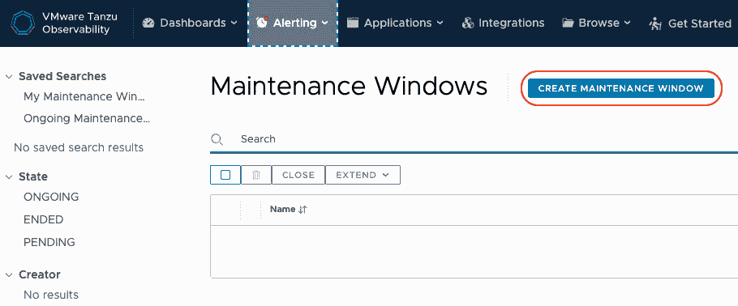
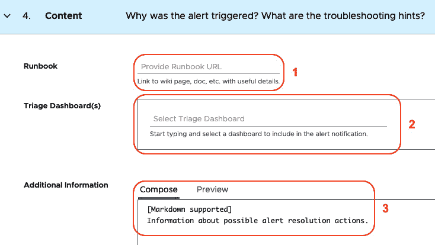

# 第十章：实现 VMware Aria Operations for Applications 的全栈可视化

在上一章中，我们学习了如何使用 Tanzu Mission Control 来管理数百个 Kubernetes 集群，进行生命周期管理、策略控制和数据保护。Tanzu Mission Control 是 Kubernetes 所有这些问题的单一控制点。在本章中，我们将讨论一个集中可视化的视角，用于监控在容器中运行的云原生应用，以及它们周围的所有支持层和系统。了解系统的关键健康状态是信息技术领域中的一个非常古老且基本的概念，被称为*监控*。它也被称为遥测。在监控传统的单体应用时，我们使用的工具多年来并不能为在不同集群、平台和云环境中运行的微服务提供所需的结果。随着微服务的出现，世界变得非常分布式。通常，微服务运行在容器中，而容器是短暂的——它们很快就会出现又消失。在这种情况下，微服务的上下文的连续性变得非常重要，因为它们可能会在几分钟后运行在不同的容器中，而传统应用则不会离开它们的虚拟和物理主机多年。更复杂的是，微服务还需要处理大量的基数问题，包括它们所属的更大应用、它们部署的环境，以及它们部署的节点、集群、可用区和区域等。在监控微服务时，我们需要一种不同的方法，因为它们的运行方式不同。某种程度上，将应用部署到容器中就像将航天器送往火星任务一样。我们无法知道容器最终会物理地停留在哪里——我们只能依赖它以固定频率发出的健康数据，并在需要时进行调整。在这些条件下，传统的监控工具是无法提供帮助的。当我们面临数百万次交易、成千上万的容器、数百个节点和数十个数据中心时，我们需要强大的可观察性。VMware Aria Operations for Applications（前身为 Wavefront 的 Tanzu Observability）是 Tanzu 产品组合中专门解决现代应用管理这一需求的工具。

2017 年 5 月，VMware 收购了位于加利福尼亚州帕洛阿尔托的私人公司 Wavefront。Wavefront 的强大之处在于其能够实时处理来自数百个位置的数百万个指标和其他数据点，并渲染出具有时间点的图表和警报，以便进行关联性可见性。后来，Wavefront 成为了 Tanzu 产品组合的一部分，为这一组合增添了一个至关重要的拼图——可观察性。因此，本章或标准产品文档中对 Wavefront 的任何引用都指的是 VMware Aria Operations for Applications。为了简洁起见，本章中我们将其简称为 *Aria*，并将通过以下主题详细介绍：

+   **为什么选择 Aria？** – 涵盖该工具的各种功能和能力

+   **解锁 Aria** – 涵盖该工具的关键概念、组件及常见的部署架构

+   **开始使用 Aria** – 涵盖将 Kubernetes 集群和应用程序与该工具集成的内容

+   **使用图表和仪表板** – 涵盖构建图表和使用该工具创建新仪表板的高级理解

+   **使用警报** – 涵盖如何使用该工具创建、管理和观察警报的详细内容

由于篇幅限制，我们必须跳过 Aria 的其他一些方面，以保持章节的合理长度。Aria 是一个非常强大的工具，能够执行与可观察性和**应用性能管理**（**APM**）相关的各种操作，但考虑到本书的广泛内容，我们只会覆盖与微服务、容器和 Kubernetes 监控相关的细节。在此基础上，让我们开始可观察性的旅程。

# 为什么选择 Aria？

Aria 是一个可观察性工具，而不是一个监控工具。监控工具可以告诉你一个应用程序运行缓慢，但可观察性工具可以帮助你找到应用程序变慢的根本原因。这是因为它允许你将来自所有可能影响应用程序性能的周边组件的健康指标进行关联。问题可能出在**操作系统**（**OS**）层，或者是数据库中的慢查询。可观察性工具的主要优势在于它能够从所有可能的系统和层次中摄取数据点，并收集所有不同的健康指标，这些指标可能会引发重大事件。然后，它通过应用关联公式到收集到的数据，减少无关数据的噪音，帮助你在信息海洋中找到针。可观察性工具可以帮助你识别异常的流量模式、延迟、错误率以及更多其他属性，这些都基于历史数据模式。例如，一个应用程序在午夜时段的平均请求率通常与白天的请求率不同。因此，如果在特定时间段内，应用程序的请求率异常，可观察性工具可以发出警报。这些工具的能力有助于在问题变得无法挽回和代价昂贵之前，早早发现异常。

随着微服务和容器化平台的兴起，*可观察性*近年来已经成为一个流行词。市场上有各种开源和商业解决方案，提供类似的功能。在这一章中，与其他章节一样，我们的目标不是将 Aria 与任何其他可观察性工具进行比较，而是突出 Aria 作为一个有吸引力的选择，其独特的功能使其脱颖而出。让我们从几个方面来看，回答*为什么选择 Aria？*

## 集成（几乎）所有东西

如前所述，观察性功能的强大取决于从各个层级摄取的数据以及支持关键业务系统的工具。为此，我们可能需要从许多不同的系统中摄取指标、事件、直方图和日志。这些系统可能是各种基础设施平台，如**亚马逊网络服务**（**AWS**）或 Azure 公共云；本地 vSphere 堆栈；操作系统，如 Windows、Ubuntu、Photon 或 RedHat；中间件层，如 Tomcat 服务器；像 Spring Boot 和 NodeJS 这样的应用框架；各种缓存；关系型数据库（RDBMS）；NoSQL 和队列作为数据源；以及用于警报、容器化、可视化、终端用户分析等的其他多个组件。为了满足这一需求，Aria 支持超过 250 种即插即用的集成。这些集成有详细文档，帮助自助配置。许多流行的集成，如 Kubernetes、流行的公共云服务和应用框架，附带有现成的仪表板和警报，便于快速实现这些集成的价值。通过这些即插即用的仪表板和警报，用户可以在数据开始流入的几分钟内看到有意义的数据。以下是 Aria 即插即用集成的类别：

+   VMware 产品

+   Web 应用平台，如.NET、Tomcat 和 nginx

+   云服务，如 AWS、Azure 和**谷歌云平台**（**GCP**）

+   数据存储，如 PostgreSQL、Redis、Cassandra 和 Oracle

+   DevOps 工具，如 Jenkins、GitHub、Chef、Ansible 和 Terraform

+   消息平台，如 RabbitMQ 和 Kafka

+   监控工具，如 AppDynamics、Dynatrace 和 Prometheus

+   操作系统，如不同版本的 Linux、Windows 和 macOS

+   应用框架，如 Spring Boot、Python、Go 和 Java

+   警报系统，如 PagerDuty、ServiceNow 和 Slack

+   认证提供商，如 Okta、Google 和 Microsoft Active Directory

这个列表并不全面。每个类别中还有许多工具超出了这里列出的范围。除此之外，Aria 还具有可扩展框架，允许你通过其基于插件的模型和**软件开发工具包**（**SDK**）从任何系统中拉取指标和其他健康指标。正如我们将在本章后面看到的，Aria 可以通过一个名为**Telegraf**的开源指标收集代理（[`github.com/influxdata/telegraf`](https://github.com/influxdata/telegraf)）从大多数系统中获取指标。Telegraf 有一长串插件，使其非常可扩展。对于 Aria 即插即用集成中没有的数据源，我们可以通过最小的努力创建自定义集成。此外，如果没有现成的插件来摄取数据，可以使用 Aria SDK 进行自定义开发。有关详细信息，请访问[`docs.wavefront.com/wavefront_sdks.html`](https://docs.wavefront.com/wavefront_sdks.html)。

## 获取全栈可见性

你是否曾经意识到，当你在容器中运行应用程序时，下面和周围有多少不同的层次？一个应用程序被封装在容器中。在 Kubernetes 中，一个或多个容器被封装在一个 Pod 中。这些 Pod 是 Kubernetes 节点的一部分。一个节点通常是运行在虚拟机上的虚拟机，这些虚拟机通常基于一个如 vSphere 的虚拟化平台。虚拟化平台位于物理主机之上。这些物理主机是位于世界某地数据中心机架的一部分。此外，应用程序可能还会使用外部服务，如其他依赖应用程序、运行时环境（如 Tomcat 服务器或 Java 运行时环境）、数据库、可能还有缓存、消息队列（如 RabbitMQ 或 Kafka），以及许多其他支持服务。当我们需要监控大量容器环境时，监控这些容器下方和其支持服务的所有层级变得至关重要，以便快速找出故障的根本原因并及时解决。当你能够从所有这些源收集健康数据并以有意义的方式进行可视化，或使用一个工具建立警报系统时，这变得可能。**站点可靠性工程**（**SRE**）团队通常面临的问题是，不同的系统使用不同的监控工具，例如应用程序监控使用一个工具，Kubernetes 监控使用另一个工具，虚拟基础设施监控使用另一个工具，等等。当我们在故障排除期间需要使用多个监控工具时，理解可用的健康数据变得非常困难，导致失去上下文。这是因为不同的工具采用不同的方法呈现收集到的健康数据，而且使用这些工具的团队使用的术语和语言也不同。在这种情况下，使用一个通用的方式过滤所有源在特定时间范围内收集的指标，并根据其他条件快速帮助定位问题，可以迅速解决问题。这样，我们可以很快指出，容器中运行缓慢的应用程序实际上是由于主机 CPU 温度过高而导致的性能下降。

由于 Aria 能够从几乎任何来源收集健康数据，我们可以为定制的应用程序创建定制的仪表板，并显示所有与应用程序相关的周边组件的健康数据。这样，你可以看到应用程序容器的内存使用情况，以及容器部署所在的 Kubernetes 节点的内存使用情况。

## 实时处理高容量数据

Aria 是一个功能强大的基于云的 SaaS 流式分析平台，具有很高的可扩展性，并且能够高效地收集大量数据。由于其设计，它可能支持每秒收集超过一百万个数据点。一旦数据被收集，我们可以实时在其相应的监控仪表板中查看，并且可以使用 Aria 强大的查询引擎在实时拉取摄取数据时计算任何预配置的告警条件。

## 长时间保留全保真数据

如前所述，Aria 可以处理非常大量的数据——此外，它还可以在撰写本文时保留所有度量数据长达 18 个月。这与其他可观察性工具不同，后者要么将数据存储在较短的时间段内，要么对数据应用某种程度的聚合，以在特定时间段后减少数据量。借助 Aria 的全保真度量数据保留能力，我们可以比较最多 18 个月的过去时段内系统的性能和状态。然而，健康数据类型（如直方图和跨度日志）有较短的保留期限。我们将在本章稍后讨论直方图和跨度日志。

## 编写强大的数据提取查询

从多个来源摄取大量数据，并在时间序列数据库中保留较长时间段的数据，如果无法使用特定的筛选器、聚合和与其他类似数据点的关联来提取数据，那么这些数据几乎没有什么用处。Aria 拥有一个详细的查询语言，使得可以具备所有这些能力的数据提取。这些查询可以包含正则表达式（Regex）的子集、通配符字符、简化引用的别名、变量、关系运算符、算术运算符以及几种类型的数据操作函数。以下是这些函数的分类：

+   聚合函数，如求和、平均值、最小值、最大值等

+   筛选和比较函数，如区间、前几名、后几名、随机等

+   时间操作函数，如速率、速率差异、年、月、日等

+   移动窗口函数，用于对移动时间窗口的数据执行聚合操作——例如，获取过去一小时内主机的平均 CPU 使用率

+   缺失数据函数，用于用特定值替换缺失的数据

+   条件函数，如 `if` 块

+   指数和三角函数，如求平方根、指数、正弦、余弦等

+   元数据函数，用于临时重命名度量和来源或在时间序列数据值上创建自定义标签

+   字符串函数，用于操作字符串值

+   预测分析函数，用于预测某些值或发现异常值

+   直方图处理函数，用于处理摄取的事件数据

+   事件处理函数，用于操作摄取的事件数据

+   分布式追踪和跨度函数，用于查找和筛选应用程序发送的追踪数据

+   **应用性能指数**（**Apdex**）分数函数

什么是 Apdex 分数？

Apdex 是一个开放标准，旨在简化应用性能报告。Apdex 分析应用程序最终用户的感知满意度。它不是一个 APM 工具。Apdex 通过计算用户期望与性能的对比程度，在 0（没有用户满意）到 1（所有用户满意）的分数范围内，数字化地评分最终用户的满意度。*来源：TechTarget.com*

Aria 在这些类别下累计支持约 200 种不同的函数，作为其查询语言的一部分，提供了极大的灵活性，帮助我们获取所需信息。

## 获取 SaaS 的好处

由于 Aria 是一个 SaaS 产品，我们可以在没有大量准备工作的情况下快速启动。通过几步集成，我们就能开始从中获得价值——像大多数其他 SaaS 解决方案一样，它也支持*按需计费*模型，费用以**每秒点数**（**PPS**）计算。为了理解 PPS 是什么，我们来看一个例子。假设有 6 个容器化应用，每个应用每 60 秒发送 10 个不同的指标，共计 60 个度量数据点来自这两个容器的每 60 秒。部署这些容器的 Kubernetes 集群每 10 秒发送 50 个不同的指标。这意味着我们在 60 秒内获取了 300 个度量数据点，总共摄取了这 60 秒的集群数据。因此，累计来看，来自集群和容器的数据点总数是 360 个数据点，也就是说数据摄取速率是 6 PPS（360/60）。这样，Aria 会计算整个账户的总 PPS，这将用于计费。

通过这一部分，我们已经总结了为什么 Aria 在管理现代应用程序（尤其是在容器中运行的应用程序）时是一个宝贵工具的潜在原因。我们了解了 Aria 如何通过汇集可能影响应用程序的各种数据源，帮助你实现全栈可见性。我们还学习了它摄取大量数据的能力，长期保存数据，并通过全面的查询语言提取这些数据。在下一部分中，我们将进一步了解 Aria，包括一些概念、术语以及其高层次的部署架构。

# 解锁 Aria

在了解 Aria 为何以及在何种使用场景下可以作为一个全面监控云原生应用的宝贵工具后，我们现在来更深入地了解该工具，了解它可以捕捉的不同数据格式、其部署架构以及组成该分布式系统的构建模块。

## Aria 支持的数据格式

以下是 Aria 可以摄取并用于生成有用的图表、仪表板和警报的不同数据格式列表。

### 指标

指标是一个基于文本的小记录，携带在特定时间戳下被监控源的状态数据。它还可以有其他标签作为附加元数据，用于构建有用的连接和筛选查询。最常见的指标形式是基于时间序列的。我们用它来报告服务器内存在任何给定时间点上的占用量：


图 10.1 – 一个时间序列指标图表示例

*图 10.1* 向我们展示了一个简单的图表，展示了 Aria 中时间序列指标数据的显示方式。在此案例中，图表展示了一个名为**kerrupt**的集群节点在给定时间段内的 CPU 使用情况。

指标可以包含**仪表**值，即每个时间点上指标的当前值，例如正在监视的服务器的当前可用 CPU。仪表指标的值与之前的值无关。指标还可以是**计数器**类型的，即在任何时间点上的增量值，例如自计数器重置以来的订单数量。最后，指标还可以是**增量计数器**类型，报告一组相似源的子集值。例如，如果你有多个容器化应用程序副本来处理订单，每个应用程序容器副本可以报告它处理的订单的增量值。在这种情况下，一个容器无法报告所有副本处理的订单的总值。在这种情况下，Aria 可以将这些增量计数器值进行分组，生成该应用程序处理的所有订单的累计值。了解更多关于 Aria 中的指标，请参阅：[`docs.wavefront.com/metrics_managing.html`](https://docs.wavefront.com/metrics_managing.html)。

### 直方图

虽然 Aria 可以接收系统整体每秒钟大量的数据点，但它每秒钟只能存储一个数据点，该数据点由源和其指标名称的组合决定。例如，你在一个非常繁忙的系统前面有一个负载均衡器，每秒接收数百个请求。在这种情况下，如果我们为每个请求发送一个指标值存储到 Aria 中，那么 Aria 只能为该指标和源存储一个值。如果源或指标名称不同，它才可以在一秒内存储多个值。假如我们要报告每个请求的响应时间，这是不可能的，因为我们每秒只能存储一个请求的响应时间。对于这些情况，我们可以使用直方图，显示在给定时间段内数据的分布。在我们的例子中，我们可以报告一个包含基于响应时间分布的请求的直方图，时间范围可以是分钟、小时或一天。*图 10.2* 显示了这种直方图的样子：


图 10.2 – 直方图示例

在*图 10.2* 中，*y 轴*表示落在一个范围内的请求数量，*x 轴*表示这些请求的响应时间（单位为毫秒）。通过查看这个直方图，我们可以得出结论，大多数请求的响应时间落在 40 到 800 毫秒之间。通过这种方式，我们可以知道这些请求的响应时间值的正常可接受范围。下次如果看到更多请求的响应时间落在较高的响应时间范围内，我们就会知道那里出现了问题。

### 事件

一般而言，*事件*是指在被观察的系统中发生的某些有趣的事情。在信息技术的领域中，事件可能是一个新应用版本的发布，或者是一个警报条件被触发。Aria 会在任何警报被触发时自动生成事件。此外，如果需要，Aria 还允许您手动创建事件记录。我们可以在与事件源相关的适用图表中看到这些事件的展示。例如，如果我们创建一个事件，表示应用程序的新版本被推送，我们可以清楚地比较新版本和旧版本在响应时间上的差异，因为其相应的图表会显示包含这些应用程序发布详情的事件标记。*图 10.3* 显示了 Aria 如何在适用图表中展示这些事件。如您所见，事件也可以是一个时间段，可能具有不同的开始时间和结束时间：


图 10.3 – 显示事件的图表

如您所见，*图 10.3* 显示了由警报条件的警告级别触发的事件。警报点后的阴影部分显示了警报条件处于激活状态时的持续时间，而事件在快照拍摄时仍在进行中。这类持续的事件可以手动关闭，也可以在警报条件被解决时关闭，或者 Aria 会在 60 天后自动关闭它们。

### 跨度日志

从高层次来看，**span**日志报告了分布式系统中任意两个服务之间通信通道的健康状况。在微服务的世界里，我们通常会看到一个用户请求穿越多个顺序和并行的服务调用，涉及许多微服务和第三方系统。例如，在一个电子商务应用中，最终用户提交的订单请求可能涉及调用支付服务、支付方式验证服务、订单配置服务、库存调整服务和数据库，最终用户才能收到响应。在这种情况下，任何两个微服务之间的请求/响应通道称为**span**。**Span 日志**可以报告任何两个微服务之间的请求/响应所花费的时间。例如，在这个案例中，span 日志可以报告订单服务和支付服务之间的请求/响应时长，支付服务和支付验证服务之间的时长，等等。当所有这些 span 形成一个完整的请求流时，称之为**trace**。这些都是分布式追踪的概念，分布式追踪是一种非常强大的监控微服务健康状况的方法，特别是当它们部署在容器中时。了解更多关于分布式追踪的概念，点击这里：[`docs.wavefront.com/tracing_basics.html`](https://docs.wavefront.com/tracing_basics.html)。

为了为应用提供分布式追踪，Aria 支持**OpenTracing**（[`opentracing.io/`](https://opentracing.io/)）和**OpenTelemetry**（[`opentelemetry.io/`](https://opentelemetry.io/)）这两个开源标准。然而，OpenTracing 现在已经成为一个归档项目，建议使用其更好的替代品——OpenTelemetry，它是一个由**Cloud Native Computing Foundation**（**CNCF**）治理的项目。OpenTelemetry 提供了所需的工具、API 和 SDK，允许不同编程语言编写的应用程序发布 span 日志。一旦应用程序将其 span 日志发送到 Aria，我们就可以得到像*图 10.4*所示的应用地图：


图 10.4 – 一个应用地图示例

*图 10.4* 显示了一个电子商务应用的分布式追踪图，其中所有的圆圈表示不同的服务。箭头表示请求从一个服务流向另一个服务，箭头的颜色则表示系统的健康状况，具体反映了响应时间和错误率。Aria 中来自所有相关服务的正确 span 日志，对于在几分钟内发现潜在的性能问题非常有帮助。了解更多关于 Aria 中使用 span 日志生成的其他可视化信息，点击这里：[`docs.wavefront.com/tracing_basics.html`](https://docs.wavefront.com/tracing_basics.html)。

通过 Aria 可以摄取的这四种数据类型，包括指标、直方图、事件和跨度日志，我们能够获得所需的可观察性，涵盖我们的应用、它们的支持系统以及运行这些应用的基础设施。接下来，我们将理解一种常见的部署架构模式，它能够将这些数据点摄取到 Aria 数据库中，并部署在其 SaaS 云平台上。

## Aria 的数据集成架构

如前所述，Aria 是一个 SaaS 平台，支持两个可选组件——收集代理和代理服务。*图 10.5*显示了不同数据摄取方式的高层次示意图：


图 10.5 – Aria 的数据集成架构

让我们理解一下*图 10.5*所示的部署架构。该图包含以下几个组件。

### 数据源

图中左侧的大圆圈表示收集健康数据的来源。可能的来源类型如*图 10.6*所示：

+   **公共云** – 这些是主要的公共云服务提供商，包括 AWS、Azure 和 GCP。我们可以通过在 Aria 门户上进行账户级别配置，配置从这些云服务的流数据，而无需在这些云上配置任何收集代理。

+   **主机** – 这可以是硬件设备、操作系统、网络组件，或者任何发出健康数据点的东西，之前我们已经介绍过。通常，你无法为这些组件配置自定义的端点来收集指标数据。它们只是*发布*指标。我们还需要为这些组件配置指标收集代理，这些代理可以将数据发送到 Aria 数据库。

+   **主机上运行的软件包** – 这些可以是部署在主机（服务器）上的任何软件解决方案。例如，它可能是 MySQL 数据库或 Jenkins 服务器。我们可以通过一个收集代理来收集这些软件工具发出的指标数据。稍后我们会在本章中重新讨论这些代理。

+   **自定义应用**代码 – 这些可以是任何发送自定义业务指标的业务应用，例如订单数量或失败的支付。这些数据还可以包括由配备应用发出的特定操作的跨度日志。通过应用代码，结合特定的第三方库（取决于应用的技术栈），这些数据可以被导入到 Aria 中。Micrometer（[`micrometer.io/`](https://micrometer.io/)）就是这样一个开源库，广泛用于 Java 应用中自定义指标的发射。类似地，OpenTelemetry（[`opentelemetry.io/`](https://opentelemetry.io/)）为各种应用技术提供了多个库，以便从自定义应用中发射指标和跨度日志。

+   **日志文件** – 有些系统不会发布遥测数据，而是将数据写入本地日志文件。我们也可以通过在 Wavefront Proxy 中进行特定配置，从日志文件中收集这些数据。我们将很快介绍 Wavefront Proxy。

这些都是我们可以收集遥测数据的不同类型的源。虽然某些源可以直接将数据发送到 Aria 系统，但对于许多源，例如运行在服务器上的软件（如数据库）、现成解决方案，或者像主机操作系统这样的源，收集器代理需要先收集这些数据并将其发送到下游。让我们来了解一下它们。

### 收集器代理

如前所述，许多源仅发布遥测数据，而不了解哪个系统将收集它们进行处理。这些源通常会在一个源端点提供数据，供收集使用。为了从源端收集这些数据，过滤掉不需要的子集，在必要时进行聚合，并将其转换为下游遥测可视化系统（如 Aria）能够理解的形式，我们需要一个能够帮助实现这些需求的工具。下图中的代理（*图 10.6*）紧挨着**主机**和**软件包**组件，正是出于这个原因。

Aria 是一个用于普遍可观测性的时间序列数据库，它接受来自不同源的数据，并以特定的格式进行理解。因此，Aria 需要收集器代理来处理那些在特定端点提供遥测数据并需要消费者按需拉取数据的源。虽然我们可以编写自定义程序来执行此任务，但也有一个非常优雅的现成解决方案可以直接作为收集器代理使用——**Telegraf**（[`github.com/influxdata/telegraf`](https://github.com/influxdata/telegraf)）。

Telegraf 是一个成熟且灵活的开源指标收集器代理工具，具有非常可扩展的基于插件的架构，支持收集、处理和分发遥测数据。Telegraf 有以下几种类型的插件，使其成为一个非常流行和广泛采用的工具：

+   **输入** – 这些插件允许你从不同的源类型收集数据。每个源都有一个特定的插件与之关联，能够用来收集其遥测数据。

+   **处理器** – 这些插件允许你修改和过滤收集到的数据。

+   **聚合器** – 这些插件在数据发送到源之前允许进行聚合，以减少数据量。

+   **输出** – 这些插件用于将数据发送到特定的输出目的地。在我们的案例中，目标是 Wavefront Proxy，接下来我们会详细介绍。

Aria 可以通过 HTTP API 端点接收遥测数据。因此，数据源始终可以通过此方式将数据导入 Aria。然而，对于仅提供健康数据供收集的数据源，我们需要像 Telegraf 这样的工具来填补这个空白——但建议不要直接将这些数据发送到 Aria 数据库，而是通过 Wavefront Proxy 进行传输。接下来，我们将了解 Wavefront Proxy。

### Wavefront Proxy

Wavefront Proxy 是一个开源工具（[`github.com/wavefrontHQ/wavefront-proxy`](https://github.com/wavefrontHQ/wavefront-proxy)），用 Java 编写，位于收集器（有时直接位于源与 Aria 数据库之间）与云中的 Aria 数据库之间。虽然使用 Wavefront Proxy 不是强制性的，但它是 Aria 架构中非常有用的组件。出于这个原因，VMware 积极维护此项目。在架构上，Wavefront 靠近数据源。正如 *图 10.6* 所示，多个源可以共享一个 Wavefront Proxy，Wavefront Proxy 可以部署在与源相同的主机、数据中心或私有网络边界上。以下是考虑使用 Wavefront Proxy 而不是通过其 API 端点直接将遥测数据发送到 Aria 数据库的原因：

+   Wavefront Proxy 提供了一层数据保护，能够在源与 Aria 数据端点之间的连接中断时，将数据缓存到内存中，这一功能通过互联网实现。

+   Wavefront Proxy 批量处理数据，以实现网络带宽的最佳利用和优化的传输速度。

+   Wavefront Proxy 提供了一种通过向其处理的每个数据记录添加更多标签（键值对）来丰富数据的方法。这些标签可用于获取监控所需的详细信息。例如，这些标签之一可能是 `env=prod`，定义该数据记录属于生产环境。之后，我们可以使用此标签来构建仅显示生产环境数据的图表。

+   Wavefront Proxy 允许我们修改数据内容（如有必要）。一个使用案例可能是隐藏敏感系统的特定 IP 地址，以保持网络布局的隐私。通常，在遥测记录中包含源的 IP 地址是一个有用的细节，可以用来以相同的方式过滤数据。然而，组织可能需要根据其政策隐藏 IP 地址，以便将数据发送到位于公共云空间中的 Aria 数据库。为此，Wavefront Proxy 允许我们在数据记录中执行基于模式的替换。这样，我们可以将 `10.1.0.2` 这样的 IP 地址替换为 `10.*.*.2` 或 `*.*.*.*` 或 `******`。

+   Wavefront Proxy 提供了最后一个中央网关，打开通向 Aria 服务端点的大门。如果所有源都通过同一个 Wavefront Proxy 实例发送遥测数据，我们可以将其作为最终的检查点，应用适用于所有源的通用数据过滤和丰富策略。

+   由于 Wavefront Proxy 是内部遥测数据到达 Aria 服务端点之前的最后一道关卡，因此我们只需在 Wavefront Proxy 与 Aria 服务之间通过互联网打开防火墙。所有内部数据源可以通过私有网络将数据发送到 Wavefront Proxy。这有助于减少网络攻击面。

除了前述的好处之外，还有一点值得在这里提及。大型组织通常有多个数据中心，可能分布在私有或公有云环境中。在这种规模下，将所有来源数据部署在公共和私有网络空间之间仅依靠一个 Wavefront Proxy 实例是不太合适的。如前所述，我们应尽量将 Wavefront Proxy 的设置保持尽可能接近其数据源，这样可以利用其数据可靠性和数据丰富功能。因此，通常情况下，我们会部署多个 Wavefront Proxy 实例，它们将数据发送到 Aria SaaS 端点。由于需要在这些 Wavefront Proxy 实例之间保持配置一致性，这种设置可能会在后期维护中变得困难。为了解决这个问题，我们可以创建 Wavefront Proxy 链，将所有分布式的 Wavefront Proxy 实例的数据发送到一个集中式的 Wavefront Proxy 实例，而不是直接将数据发送到 Aria 服务端点。通过这种方式，我们可以将所有源特定的配置保存在远程的 Wavefront Proxy 实例中，而将所有通用配置保存在集中式的 Wavefront Proxy 实例中。

关于 Wavefront Proxy 的各种部署模式及其他细节，请访问此页面：[`docs.wavefront.com/proxies.html`](https://docs.wavefront.com/proxies.html)。

### Wavefront 服务

在*图 10.5*中，右侧的元素标注为**Tanzu Observability Service**，实际上就是部署在 AWS 云上的 Aria SaaS 平台（截至本文撰写时）。这也是我们一直提到的 Aria 服务端点。Aria 服务由大量组件组成，包括门户、API 端点、时间序列数据库、各种数据处理器、警报引擎及其他多个组件。我们将在本章接下来的部分中介绍如何在 Aria 门户上进行各种操作。

至此，我们已经完成了关于解锁 Aria 的部分。在这一节中，我们看到 Aria 能够摄取指标、事件、直方图和跨度日志，提供全栈可观察性。此外，我们了解了 Aria 的常见部署架构。在此，我们了解到 Aria 可以从多个来源摄取数据，包括公共云平台、不同的主机及其操作系统，以及运行在这些主机上的各种软件，包括 Kubernetes 等平台、定制应用程序和日志文件。然后，我们了解了收集器代理的角色，Telegraf 是最流行的收集器代理之一。接着，我们了解了 Wavefront Proxy 在数据路径中的角色和好处。接下来，让我们看看如何开始使用 Aria，并将第一个 Kubernetes 集群与 Aria 服务账户集成进行监控。

# 开始使用 Aria

在本节中，我们将学习以下内容：

+   为 Aria 设置试用账户（如果你没有现有账户的话）

+   将 Kubernetes 集群与账户集成进行监控

+   访问集成的 Kubernetes 集群的默认仪表板

+   访问各种 Kubernetes 集群条件的默认警报

以下是本节及后续章节中所需遵循的前提条件：

+   一个具有管理员级别`kubectl`访问权限的 Kubernetes 集群

+   一台安装了`kubectl`和`helm`命令行工具、能够访问目标 Kubernetes 集群并具备浏览器的工作站

+   一个有效的电子邮件地址

如你所见，前提条件非常简单。让我们从将 Kubernetes 集群与 Aria 服务账户集成开始。

## 设置试用账户

如果你已经有现有的 Aria 服务账户并希望使用它，那么本节是可选的。否则，请按照以下步骤使用 Aria 的试用账户开始，无任何义务：

1.  访问[`tanzu.vmware.com/observability`](https://tanzu.vmware.com/observability)页面。

1.  点击**开始免费试用**按钮，如下图所示：


图 10.6 – Aria 网站

1.  提交试用账户设置详情，如下图所示：


图 10.7 – 提交试用账户设置详情

1.  为账户配置密码：


图 10.8 – 配置试用账户密码

1.  加载如下图所示的登录页面：


图 10.9 – 第一次登录时的 Aria 登录页面

完成了。我们成功地在几分钟内创建了一个具有所有功能可用的 Aria 试用账户。现在让我们使用这个账户来集成一个 Kubernetes 集群进行监控。

## 将 Kubernetes 集群集成到监控中

我们将使用在前一小节中创建的 Aria 试用账户，将现有的 Kubernetes 集群与其连接以进行监控。请按照以下步骤执行集成过程：

1.  点击以下截图中展示的 Kubernetes 图标，该图标位于 Aria 的登录页面（**开始使用**）：


图 10.10 – 启动 Kubernetes 集群集成

对于现有的非试用账户

您可以使用现有的账户来完成此操作。如果您之前访问过该账户，根据您的账户配置，您可能会看到与前面截图不同的登录页面。在这种情况下，请前往顶部导航栏中的**集成**菜单，然后点击**Kubernetes**集成组中的**Kubernetes**。在 Kubernetes 集成页面中，前往**设置**选项卡，并点击**添加集成**按钮继续操作。

1.  选择中间的图块，点击**在 Kubernetes 集群中安装**选项以加载设置说明页面。Tanzu Kubernetes 集群的设置过程与此非常相似，除了少数附加配置。然而，集成 OpenShift 集群的过程非常不同，但本书不涉及此部分内容：


图 10.11 – 选择用于集成的 Kubernetes 类型

1.  按照页面上提供的说明安装由 Aria 提供的 Wavefront Proxy 和 Kubernetes 的指标收集器。这是一种快速且简单的入门方式。然而，您始终可以执行由收集器以及 Wavefront Proxy 提供的各种精细配置，以实现生产级集成。请参考此文档链接以了解更多：[`docs.wavefront.com/kubernetes.html#kubernetes-manual-install`](https://docs.wavefront.com/kubernetes.html#kubernetes-manual-install)：


图 10.12 – Kubernetes 集成说明

1.  在执行*第 3 步*中的命令后，我们可以看到以下输出。请注意最后一行提供了用于查看集群集成的 Aria 门户 URL：

    ```
    $ kubectl create namespace wavefront && helm install wavefront wavefront/wavefront\
    ```

    ```
        --set wavefront.url=https://longboard.wavefront.com \
    ```

    ```
        --set wavefront.token=**-306a-432b-bb28-62dc**2e97 \
    ```

    ```
        --set clusterName="eks-workload-cluster-1" --namespace wavefront
    ```

    ```
    namespace/wavefront created
    ```

    ```
    NAME: wavefront
    ```

    ```
    NAMESPACE: wavefront
    ```

    ```
    STATUS: deployed
    ```

    ```
    REVISION: 1
    ```

    ```
    NOTES:
    ```

    ```
    Wavefront is setup and configured to collect metrics from your Kubernetes cluster.  You
    ```

    ```
    should see metrics flowing within a few minutes.
    ```

    ```
    You can visit this dashboard in Wavefront to see your Kubernetes metrics:
    ```

    ```
    https://longboard.wavefront.com/dashboard/integration-kubernetes-summary
    ```

1.  检查目标集群中 `wavefront` 命名空间下的 Wavefront Proxy 和 Wavefront collector Pods 部署。如图所示，集群中有两个收集器，每个 Kubernetes 节点对应一个，以及一个 Wavefront Proxy Pod：

    ```
    $ kubectl get pods -n wavefront
    ```

    ```
    NAME                               READY   STATUS    RESTARTS   AGE
    ```

    ```
    wavefront-collector-2vbbt          1/1     Running   0          5m51s
    ```

    ```
    wavefront-collector-xv9sk          1/1     Running   0          5m51s
    ```

    ```
    wavefront-proxy-699f57f698-lbr9b   1/1     Running   0          5m51s
    ```

1.  使用在*第 4 步*中命令输出中给出的 URL 检查 Kubernetes 集成状态。您将看到如下截图所示的页面：


图 10.13 – Kubernetes 集群摘要仪表盘

如您所见，Aria 账户已成功集成到现有的 Kubernetes 集群中。我们可以按需添加任意数量的集群，并通过一个窗口集中监控它们。然后，如果需要，您可以通过使用名为**集群**的下拉菜单按名称筛选特定集群，正如前一截图左上角所示。前面截图中显示的仪表盘是 Aria 提供的 Kubernetes 集成的许多现成仪表盘之一。我们可以通过钻取方式从此仪表盘访问其中的一些。让我们看看其他现成的 Kubernetes 仪表盘。

## 访问默认的 Kubernetes 仪表盘

在本节中，我们将访问一些默认随 Aria 提供的附加 Kubernetes 仪表盘。这些仪表盘在成功集成 Kubernetes 集群后会立即开始显示数据。让我们从第一个仪表盘——**Kubernetes 概览**——开始，该仪表盘在前一节中已打开。从那里，我们将访问其他各种仪表盘：

1.  要从**Kubernetes 概览**仪表盘钻取到**Kubernetes 集群**仪表盘，请单击以下截图中左下角突出显示的集群名称：


图 10.14 – 钻取到 Kubernetes 集群仪表盘

1.  您应该看到以下仪表盘，展示了 Kubernetes 集群的更详细视图。然后，单击截图中突出显示的**节点**链接，打开**Kubernetes 节点**仪表盘，查看该集群节点的详细视图。此外，您可以在这些仪表盘的页面上滚动时找到非常有价值的见解：


图 10.15 – Kubernetes 集群仪表盘

1.  下图显示了**Kubernetes 节点**仪表盘，它包含了我们正在钻取的集群节点的详细视图。您可以使用**节点**下拉菜单选择集群的特定节点，如下图所示。此外，您还可以通过单击**Pods**链接来打开**Kubernetes Pods**仪表盘，如下图所示：


图 10.16 – Kubernetes 节点仪表盘

1.  单击**Kubernetes 节点**仪表盘上的**Pods**链接后，我们进入**Kubernetes Pods**仪表盘，如下图所示。如图所示，您可以根据多个标准对这些 Pods 进行分组。当我们在集群中运行数百个 Pods 时，这些分组非常有用。此外，我们还可以从此页面钻取到**Kubernetes 容器**仪表盘，正如我们在前面的部分中所见：


图 10.17 – Kubernetes Pods 仪表盘

除了所有这些仪表板外，我们还可以通过以下步骤访问多个开箱即用的 Kubernetes 仪表板：

1.  点击如下截图所示的顶部导航栏中的**集成**菜单：


图 10.18 – 打开集成页面

1.  点击如下截图所示的**Kubernetes**图块：


图 10.19 – 打开 Kubernetes 集成图块

1.  点击如下截图中高亮显示的**仪表板**标签：


图 10.20 – 打开 Kubernetes 仪表板页面

1.  以下截图展示了 Aria 为 Kubernetes 监控提供的所有默认仪表板：


图 10.21 – 默认 Kubernetes 仪表板

所有这些开箱即用的仪表板都使用从所有集成的 Kubernetes 集群中收集的度量数据，结合 Aria 账户提供了有用的洞察，尽管 Aria 还允许你克隆这些仪表板并自定义它们，以满足任何特定的监控需求。我们可以添加新的图表和下钻功能，修改现有的可视化，重新排列不同的图块，并对这些默认仪表板进行其他多种自定义。

然而，仪表板只有在有人明确而仔细地观察时才能发挥作用，帮助发现异常。人们通常在报告问题后才会打开仪表板查找异常。这是一种对已发生问题的反应性分析，但我们使用这些复杂的工具，以主动的方式提前捕捉问题，防止客户感受到痛苦。因此，我们必须在这些工具中配置警报，一旦监控系统发现任何健康状态的异常，立刻通知我们。正是由于这个原因，Aria 拥有强大的警报功能——就像 Aria 为 Kubernetes 提供了一组开箱即用的默认仪表板一样，它还配备了一组预定义的警报配置，用于主动的 Kubernetes 监控。让我们来了解一下它们。

## 访问默认 Kubernetes 警报

在上一节中，我们探讨了 Aria 为 Kubernetes 集成提供的默认仪表板。对于 Kubernetes，Aria 还提供了一套有用的警报。这些警报是根据既定标准配置的，Aria 允许你出于不同的原因进行自定义。以下步骤展示了如何访问和配置 Kubernetes 集群监控的开箱即用警报：

1.  点击如下截图所示的**警报**标签：


图 10.22 – 打开 Kubernetes 警报页面

1.  以下页面展示了 Aria 为 Kubernetes 提供的所有默认警报：


图 10.23 – 默认 Kubernetes 警报

和仪表盘一样，所有这些警报都可以完全自定义，修改其触发条件和传递方式，例如文本、电子邮件、PagerDuty、ServiceNow、Slack 等。我们将在本章稍后的部分深入讲解如何使用警报。现在，让我们来看一下如何获取现有警报的更多详细信息和其状态，以查看是否存在任何活动的条件。为此，请执行以下步骤：

1.  点击顶部导航栏中的**所有警报**选项，位于**警报**菜单下，如下截图所示：


图 10.24 – 打开警报页面

1.  您将看到一个页面，如下截图所示，列出已触发当前警报条件的配置阈值或正在主动监控的警报：


图 10.25 – 警报页面

本节内容介绍了如何开始使用 Aria。我们学习了如何设置试用账户，以便全面访问 Aria 平台。然后，我们通过简单的三步流程将现有的 Kubernetes 集群与 Aria 账户集成。接着，我们了解了如何访问一些现成的仪表盘，这些仪表盘提供了集群的详细信息，并能深入查看以获取更多细节。最后，我们了解了如何访问 Aria 为 Kubernetes 集成提供的默认警报集。

正如我们所知，Aria 是一个可观察性工具。这类工具的主要使用案例是主动防止破坏性故障的发生，并且如果发生故障，能够快速找到根本原因并解决它。监控仪表盘和警报是这两个关键功能，对于实现这一目标至关重要。让我们通过深入了解仪表盘和图表，来学习更多相关内容。

# 使用图表和仪表盘

在本节中，我们将介绍以下有关在 Aria 中使用图表和仪表盘的详细信息：

+   创建新的自定义图表以可视化发送到 Aria 的任何数据

+   使用现成或自定义图表创建新的自定义仪表盘

+   自定义现成的仪表盘

让我们开始介绍此列表中的主题。

## 创建新的自定义图表

当我们按照为 Kubernetes 集群配置 Aria 集成时，可以看到多个度量数据被推送到 Aria，这些数据是由我们部署在主机上的代理收集的。与 Kubernetes 集群类似，我们可以获取任何集成的遥测数据。度量的数量以及它们被 Aria 接收的频率，取决于数据源和收集器及 Wavefront 代理的配置。然而，一旦度量数据进入 Aria 数据库，它将在那里保存最长达 18 个月，除非明确删除。我们可以随时使用这些数据，构建按需图表，以深入了解源的健康状态。

以下步骤展示了如何使用现有的度量端点构建图表：

1.  点击顶部导航栏中的**仪表盘**菜单，并选择**创建** **图表**选项：


图 10.26 – 选择创建图表选项

1.  在此页面上，如果你了解**Wavefront 查询语言**（**WQL**）或**Prometheus 查询语言**（**PROMQL**），可以直接在相应的查询语言结构中编写查询。如果你不熟悉这些语言，Aria 允许你通过选择**数据**、**过滤器**和**函数**下拉框中的正确值，在后台自动生成查询。此外，Aria 还允许你从可用的列表中选择度量，或使用已配置的集成。由于我们已经集成了 Kubernetes 集群，因此可以看到 Kubernetes 作为选项，在以下屏幕截图中为 Kubernetes 集成构建图表。点击**数据**下拉框，并选择下图中高亮显示的**Kubernetes**图标：


图 10.27 – 选择 Kubernetes 集成

1.  选择图表数据点，如下图所示：


图 10.28 – 选择用于图表的数据元素

1.  以下图表显示了所有集成了 Aria 账户的 Kubernetes 集群中所有命名空间下所有 Pod 的实时 CPU 使用情况。因此，如果有多个 Kubernetes 集群，且每个集群中有多个 Pod 运行时，这个图表会显得非常混乱。我们可能需要实现某些过滤器，以使此图表更具可用性。在本书的背景下，应该只有一个 Kubernetes 集群，即我们在本书中早些时候集成的集群：


图 10.29 – 显示所有 Kubernetes 集群中所有 Pod 的 CPU 使用情况的图表

1.  应用筛选器，仅显示如以下截图所示的在 **wavefront** 命名空间中运行的 Pods。这将显示我们在 Kubernetes 集群集成步骤中之前部署的 Wavefront Collector 和 Wavefront Proxy Pods 的 CPU 使用情况：


图 10.30 – 为图表应用筛选器

1.  以下截图仅显示 **wavefront** 命名空间下 Pods 的图表。我们可以通过点击 **Filters** 下拉菜单旁边的 **+** 按钮，添加更多筛选器，并根据需求应用数据函数来进一步调整图表。点击 **SAVE** 按钮以保存此图表以供将来使用：


图 10.31 – 显示所有 Pods 在 wavefront 命名空间中 CPU 使用情况的图表

现在，我们有了一个图表，展示了属于某个命名空间的一组 Pods 在 CPU 使用率方面的一些有意义的数据。我们可以使用此图表执行以下操作：

+   与他人分享图表，以便在讨论任何性能问题时，我们可以用相同的语言进行交流

+   将此图表添加到新的或现有的自定义仪表板中以供将来使用

+   回溯查看所选时间段内的历史性能数据

+   标记有趣的事件以供将来参考

+   将图表导出为 PDF 或 CSV 格式

+   更改图表的可视化方式，以获取其他图形格式，例如柱状图、饼图、表格图等

+   通过添加更多查询来增加更多数据层

以下小节重点介绍可以在 Aria 中应用于图表的各种用户控件。

### 了解图表操作控件

以下截图突出了各种控件，并以相应的数字作为参考：


图 10.32 – 图表控件

前面截图中的控件在下面的列表中有对应的数字描述：

1.  这些控件允许你以实时数据查看图表，该数据会在几秒钟后自动刷新，或者选择过去的特定时间段仅拉取该时段的数据。

1.  这些控件提供了向图表添加更多细节的方式：

    1.  **异常检测** 使用一些人工智能算法，基于过去的数据，找到被认为异常的特定图表模式。

    1.  **比较** 让你直观地比较相同来源集的历史数据，以发现任何模式变化。

    1.  **时区** 让你为所选的时区更改图表的时间线。默认情况下，Aria 使用互联网浏览器的时区。

    1.  **抽样** 让你选择是否启用数据抽样来生成图表，而不是考虑所有的数据点。

1.  **筛选器** 允许你根据提供的标签值减少数据点，而无需修改图表的查询语句。

1.  这些控件用于以下原因，从左到右列出：

    1.  生成可以与他人共享的图表链接

    1.  准备将图表嵌入网页中

    1.  如果使用，显示/隐藏图表变量

    1.  在图表上标记事件点，记录详细信息，生成事件日志记录以供日后参考

    1.  将图表导出为 PDF 或 CSV 文件

    1.  将图表保存在新的或现有的仪表板中

1.  这些控件允许您对选定的时间窗口进行图表缩放。

1.  该控件允许您更改图表的可视化方式，将其显示为不同的格式，如饼图、条形图、表格、单值图等。

1.  以下列表描述了这些标签：

    1.  **数据** 标签允许您与查询一起工作，以提取图表数据

    1.  **格式** 标签允许您修改图表的视觉细节

    1.  **轴** 标签允许您修改图表的轴单位

    1.  **图例** 标签允许您在图表上配置数据图例

    1.  **下钻链接** 标签允许您配置指向显示相关数据的其他仪表板的链接

    1.  **描述** 标签允许您设置图表描述，在鼠标悬停时可以在图表的工具提示中看到

    1.  **异常检测** 标签允许您配置与其灵敏度、显示和数据采样相关的设置

    1.  **高级** 标签允许您提取过时的指标，并根据其父仪表板配置图表的时间线。

1.  该控件允许您为查询命名图表数据层。

1.  这些控件允许您在 WQL 和 PROMQL 之间切换，以及在查询图形编辑器和文本编辑器之间切换。

1.  这组控件允许您从左到右执行以下配置：

    1.  查看查询执行统计信息，以确定是否需要优化查询

    1.  克隆现有查询以创建图表的新数据层

    1.  从图表中删除查询及其相关的可视化数据

    1.  在不删除查询的情况下，显示或隐藏图表中的查询数据

    1.  各种其他选项，包括基于查询创建警报和图表格式化

1.  **添加查询** 链接允许您将新数据及其可视化层添加到图表中。

所有这些图表控件在构建有意义的仪表板中起着关键作用。现在让我们来学习如何在 Aria 中使用仪表板。

## 创建新的自定义仪表板

正如我们在本章前面所看到的，对于 Kubernetes 集成，Aria 提供了一组现成的仪表板，能够用于来自相应集成源的遥测数据。然而，Aria 可以从各种集成源获取数据，包括应用程序、Kubernetes、虚拟基础设施层的虚拟机管理程序、操作系统、数据库等。在这种情况下，特定集成的默认仪表板可能无法提供完整的视图。例如，Aria 中没有任何默认的 Kubernetes 仪表板能够展示来自操作系统或硬件主机（即节点部署所在的主机）的数据。默认仪表板和特定集成的仪表板不能假设与其他集成相关的数据总是会存在。例如，在本章中，我们只有一个针对 Kubernetes 集群的集成。因此，如果默认仪表板期望从节点操作系统获取度量数据，那么它就会失败。在这种情况下，我们需要能够显示来自多个数据源的相关数据的自定义仪表板。展示来自不同数据源的数据的仪表板，可以显著帮助我们更广泛地了解系统状况，并快速找到问题的根源。数据库中的慢查询可能是导致应用程序响应迟缓的原因，因此，在同一个仪表板上显示应用程序和数据库这两个层次的详细信息，可能有助于迅速找到问题。

在 Aria 中，我们可以通过两种方式创建自定义仪表板。首先，我们可以使用自定义图表来构建新仪表板或添加到现有的仪表板中。其次，我们可以使用 Aria 提供的不同模板来构建自定义仪表板，或者在其中添加自定义图表。让我们使用前一节中构建的图表来创建一个新仪表板。以下步骤描述了这一过程：

1.  点击**保存**按钮，然后点击**保存到新仪表板**按钮，如下图所示：


图 10.33 – 从自定义图表创建新仪表板

1.  输入仪表板的名称并点击**创建**按钮：


图 10.34 – 命名和创建仪表板

1.  以下截图显示了 Aria 仪表板编辑器，当前已添加了自定义图表。我们可以从 Aria 为其集成提供的现成图表模板中添加多个自定义或预定义的图表：


图 10.35 – 仪表板编辑器

以下几点解释了前面截图中仪表板编辑器中突出显示的部分：

1.  变量允许你操作仪表板中适用图表的数据。这些变量值可以添加到图表查询中。

1.  一个部分是仪表板中类似图表的组合。我们可以使用部分来显示/隐藏图表或在非常大的仪表板中跳转到另一个部分。

1.  这些部分控件允许您添加、移除或移动部分。

1.  这些箭头允许您调整图表的大小，以在单行中添加多个图表，以便在一行中更好地整合数据。

1.  所有这些瓷砖允许您在选定的部分向此仪表板添加更多图表。在这里，我们还可以导入由 Aria 提供的一些现有的集成罐头图表。

在学习如何从头开始创建新仪表板后，现在让我们看看如何自定义 Aria 提供的现成仪表板。

## 自定义默认仪表板

尽管 Aria 提供的不同集成的默认仪表板设计得很周到，但在外观和感觉上可能会有一些我们想要更改的地方。在 Aria 中，我们不能直接更新开箱即用的默认仪表板，但我们可以克隆它并创建自定义副本。然后，我们可以根据需要更新默认仪表板的自定义副本。让我们看看如何使用以下步骤完成这一操作：

1.  点击顶部导航栏中主要**仪表板**菜单下的**所有仪表板**菜单，如下面的截图所示：


图 10.36 – 打开仪表板页面

1.  从左侧导航栏点击**Kubernetes**链接，然后点击下面突出显示的**Kubernetes 集群**仪表板：


图 10.37 – 打开 Kubernetes 集群仪表板

1.  下图显示了**Kubernetes 集群**仪表板，这是 Aria 自带的默认仪表板之一。所有默认仪表板都标有突出显示的锁定符号。要克隆以进行自定义的仪表板，请点击右侧的突出显示点菜单，然后选择**克隆**选项：


图 10.38 – 克隆默认仪表板

1.  给克隆的仪表板副本命名，并点击**克隆**按钮：


图 10.39 – 命名克隆仪表板

1.  您将看到与之前检查过的相同的仪表板编辑器，允许您对仪表板进行任何更改，包括但不限于更改图表数据查询、图表可视化、瓷砖重新排列和添加新的数据可视化：


图 10.40 – 仪表板编辑器

一旦您进行必要的更改并保存此仪表板，您可以将其标记为收藏夹仪表板，并将其放入快速访问菜单下。您还可以定义谁可以访问该仪表板进行查看和编辑。

通过这些内容，我们已完成对图表和仪表盘的操作，并对其功能进行了非常高层次的概述。有关图表和仪表盘的更多细节，请参阅官方产品文档 – [`docs.wavefront.com/ui_charts.html`](https://docs.wavefront.com/ui_charts.html) 和 [`docs.wavefront.com/ui_dashboards.html`](https://docs.wavefront.com/ui_dashboards.html)。在本章的下一部分，也是最后一部分，我们将学习如何处理警报。

# 处理警报

任何监控工具如果没有良好的警报功能，都是不完整的。Aria 也不例外。它拥有一个功能强大且高度可配置的警报引擎，允许你配置具有多个阈值的警报、基于这些阈值级别的传递以及多种可能的传递方法，包括但不限于电子邮件、短信、Slack 消息、Microsoft Teams 消息、ServiceNow 工单或 PagerDuty 事件。此外，我们还可以配置通过 webhook 触发自动化流程，调用 Aria 边界之外的远程 API。通过 Aria 的警报功能，我们可以配置许多有用的功能。让我们在本节中了解更多有关警报的内容，包括以下内容：

+   创建警报目标，定义谁应接收哪些警报，并使用何种传递机制

+   定义维护窗口以避免显而易见的警报

+   创建新的警报

+   检查触发的警报

让我们从这些主题开始。

## 创建警报目标

Aria 中的警报目标包含多个细节，并提供了非常灵活的方式来高层次地定义以下内容：

+   何时应该发送通知以及何时应暂停发送

+   使用何种媒介传递警报

+   谁应该接收警报以及在什么条件下接收

+   警报应包含哪些详细信息及其格式

以下步骤展示了如何在 Aria 中创建最常见的基于电子邮件的警报目标：

1.  从顶部导航栏打开**警报**菜单，并选择**警报目标**：


图 10.41 – 打开警报目标列表页面

1.  点击**创建警报目标**按钮：


图 10.42 – 创建新的警报目标

1.  在表单中输入如下截图所示的详细信息：


图 10.43 – 创建警报目标页面

以下是前述截图中的元素，按其编号排列：

1.  这是警报目标的名称。请在此指定一个唯一名称。

1.  这是警报目标的描述。请指定任何可理解的描述。

1.  一组**触发器**定义了何时应该将警报通知发送到目标，何时不应该。例如，它允许你配置在警报条件解决时是否希望发送警报通知。

1.  **类型** 下拉菜单允许你选择三种主要的警报通知类型之一——**电子邮件**、**PagerDuty** 和 **Webhook**。

1.  **默认收件人** 框允许你指定一组应该接收此警报目标电子邮件通知的电子邮件地址。这里指定的邮件列表将接收任何数据集的通知。

1.  **路由** 配置允许你根据已定义的键和值将相同的警报通知发送到额外的目的地。通过此配置，我们可以根据警报数据中的应用标识符配置不同的应用团队进行通知。

1.  这些控件允许你配置通知中的详细信息。当这涉及到电子邮件通知时，详细信息就是邮件的主题和正文。我们可以使用包含警报特定自定义数据的变量来配置这些值。

1.  我们可以看到已创建的警报目标，如下图所示：


图 10.44 – 创建的警报目标记录

现在，既然我们已经有了一个用于发送任何生成的警报通知的警报目标，我们可以利用这个目标来发送警报。我们可以使用一个警报目标配合多个警报配置——但在学习如何通过点击按钮创建警报之前，让我们先学习如何配置一个维护窗口，以便在计划的维护期间避免出现误报。

## 定义维护窗口

在维护窗口期间，对于正在观察的系统收到大量警报并不是好事，因为我们已经知道，在这些活动期间，系统可能会出现故障或表现异常。然而，在维护窗口期间，如果错过了需要关注的真实警报，那将更糟。为了防止关键警报被那些非关键警报淹没，Aria 允许你定义一个维护窗口，在该窗口内我们可以标记某些系统健康参数为忽略。这样，我们就可以在计划的活动期间认真对待实际的警报。以下步骤展示了如何在 Aria 中配置维护窗口：

1.  从顶部导航栏点击 **警报设置** 菜单，并选择 **维护窗口** 选项，如下图所示：


图 10.45 – 打开维护窗口列表页面

1.  点击 **创建维护窗口** 按钮：



图 10.46 – 创建维护窗口

1.  输入维护窗口的必要详细信息，以选择时间和系统特征，如下图所示：


图 10.47 – 输入维护窗口详细信息

以下编号点描述了上一截图中的对应编号：

1.  输入维护窗口记录的唯一名称

1.  输入维护窗口目的的描述

1.  选择**立即**以按需启动维护窗口，或选择计划的开始和结束时间以及日期来定义窗口

1.  输入源定义参数，以覆盖此维护窗口中的警报

1.  选择是静音/忽略具有先前提到的标准的警报并在定义的时间窗口内，还是选择一个警报目标，在该时间窗口内将警报转发到该目标

一旦点击**保存**按钮，维护窗口就会创建，如下图所示：


图 10.48 – 已创建的维护窗口记录

现在，维护记录已创建，让我们创建一个自定义警报记录。

## 创建新警报

在本节中，我们将学习如何创建一个新的警报。我们可以通过三种方式在 Aria 中创建警报。其中一种是通过主**警报**菜单使用警报创建向导来创建警报。第二种方式是复制一个警报并修改所需的详细信息。最后一种方式是通过使用现有图表来创建警报，通常这些图表已经存在于仪表盘上。虽然前两种方法较为直观，让我们学习如何通过第三种方法从现有图表创建警报，具体步骤如下：

1.  在顶部导航栏的**仪表盘**菜单下，打开**所有仪表盘**页面：


图 10.49 – 打开所有仪表盘页面

1.  从列表中点击**Kubernetes 集群**仪表盘，如下图所示：


图 10.50 – 打开 Kubernetes 集群仪表盘

1.  点击**Node Storage Utilization Avg**图表上的铅笔图标，如下图所示。通过图表创建警报的相同方法可以应用于任何仪表盘上的所有图表：


图 10.51 – 编辑图表

1.  在查询的点菜单下拉菜单中点击**创建警报**链接，如下图所示：


图 10.52 – 从图表编辑器创建警报

如你所见，在**创建警报**页面，拉取警报数据的查询已经使用图表的查询进行了填充。这对正确配置警报非常有帮助。接下来，我们设置其他警报详细信息。

1.  在查询详情页面点击**下一步**按钮，如下图所示。如有需要，更新警报查询：


图 10.53 – 更新警报查询

1.  配置带有不同阈值级别的警报条件，如以下截图所示：


图 10.54 – 配置警报条件

以下几点对应于前述截图中提到的数字，用于描述控件：

1.  这些是不同的警报阈值。达到某个条件时，警报会触发，并根据条件的严重性进行响应。

1.  触发和解决窗口定义了将条件视为警报开始或结束的时间线。

1.  额外的设置提供了定义警报检查频率的控件。

1.  **TEST CONDITION**按钮允许您测试基于过去 2 小时的数据，验证配置是否会触发警报。

1.  选择一个之前在账户中创建的警报目标。请注意，以下截图只显示了为**SMOKE**级别配置的一个目标，这个目标也适用于高于该级别的所有阈值级别，即**WARN**和**SEVERE**。但是，也可以为所有不同的阈值级别发送警报到不同的目标。点击**NEXT**按钮继续：


图 10.55 – 配置警报目标

1.  配置可能对警报分类有帮助的详细信息，如以下截图所示。之后点击**NEXT**按钮继续：



图 10.56 – 配置警报排查详细信息

以下几点描述了与前述截图中标记的数字对应的控件：

1.  在**Runbook**中，我们可以提供一个外部 URL，包含有关如何排查和解决警报条件的详细信息。

1.  在**Triage Dashboard(s)**下，我们可以添加一个或多个仪表板，这些仪表板将被添加到警报详细信息中，提前提供所需的细节。

1.  在**Additional Information**下，我们可以提供任何有助于排查此警报的任意详细信息。

1.  给警报命名，并可以选择相关的标签值，以标识受影响的源，点击**ACTIVATE**按钮创建警报：


图 10.57 – 激活警报

1.  一旦激活，警报将在**Alerts**页面下显示，如以下截图所示：


图 10.58 – 新创建的警报

这就是在 Aria 中创建新警报的详细步骤。如果需要更多信息，请参考官方产品文档，了解如何创建警报：[`docs.wavefront.com/alerts_manage.html`](https://docs.wavefront.com/alerts_manage.html)。接下来，让我们看看如何找到具有活跃警报条件的触发警报。

## 检查触发的警报

在本节中，我们将看到如何列出当前触发的警报，这些警报具有已配置的任何阈值级别。以下步骤描述了此过程：

1.  点击左侧导航栏中的**FIRING**状态，这将列出该状态下的所有警报，并点击如下截图所示的触发警报名称：


图 10.59 – 查看触发警报的详细信息

1.  以下截图显示了包含触发警报详细信息的页面视图，包括其他可能相关的警报条件、显示触发持续时间的图表、用于计算的查询以及许多其他内容：


图 10.60 – 触发警报的详细信息

至此，我们结束了本章的*警报操作*部分。在本节中，我们从创建警报目标开始，学习了如何根据警报的严重性及系统的其他属性灵活定义不同的警报通知类型和目标。接着，我们学习了如何创建维护窗口，以便在计划的活动期间以不同的方式处理警报，否则这些活动可能会触发大量警报。之后，我们学习了如何使用现有仪表板中的现有图表创建警报。同样的知识也适用于从头创建新的警报。最后，我们了解了 Aria 如何显示当前触发的警报的不同详细信息。

# 概要

在本章中，我们学习了 Tanzu 产品组合中的一个非常重要的组件——VMware Aria Operations for Applications by Wavefront。在本章的第一部分，我们提供了多个理由，解释了该工具在现代容器化应用程序可观察性中的重要性。在本节中，我们了解了 Aria 支持的不同开箱即用的集成。我们还讨论了 Telegraf 收集器和 Wavefront SDK 如何使集成几乎任何数据源成为可能，以实现可观察性。此外，我们讨论了 Aria 的其他优点，包括高速数据收集和处理能力，以及收集不同类型遥测数据的能力，包括指标、事件、直方图和跨度日志。然后，我们列出了可以与 WQL 一起使用的不同类别的数据处理功能，包括数据聚合、过滤、时间操作、移动窗口聚合、指数运算和三角运算。

在那之后，我们了解了该解决方案的各个组件。我们探索了度量标准、直方图、跨度日志和事件。接着，我们讨论了该解决方案的常见部署架构以及各个组件的详细信息和它们的角色。在那部分内容中，我们讨论了如何在 Aria 中摄取数据的不同方式、不同类型的来源、采集器、Wavefront 代理以及 Wavefront 服务，一个 SaaS 平台。随后，我们学习了如何为 Aria 开通试用账户，并将现有的 Kubernetes 集群与该账户进行集成。然后，我们看到如何访问 Aria 开箱即用的 Kubernetes 集成的默认仪表盘。最后，我们学习了如何为现有集成创建自定义图表、仪表盘和警报。

尽管看起来我们已经深入探讨了解决方案，但我们只触及了表面。由于本章的内容仅围绕 Kubernetes 监控展开，因此仍有许多功能未能涵盖。除了这里讨论的内容，Aria 还提供了基于摄取的跨度日志和应用健康度指标的 APM 强大功能。我们甚至没有涉及到派生指标、增量计数器、用户权限配置以及外部日志解决方案集成等主题，因为本章的范围有限。

在下一章中，我们将看到如何使用 Tanzu 服务网格安全地连接部署在不同 Kubernetes 集群中的各种应用，甚至跨越不同的云基础设施。
