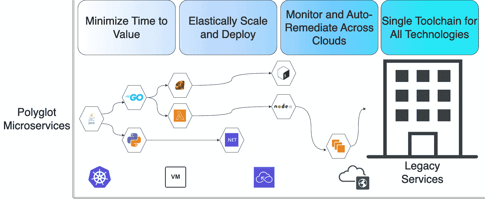

# 11

# 使用 Tanzu Service Mesh 实现安全的服务间通信

企业软件在过去几年发生了显著变化。你们中的一些人可能还记得，大多数软件曾是由一小队开发者编写成一个单体应用。应用必须作为一个整体进行部署、更新、启动、停止和扩展。

随着软件在 2000 年代初期到中期的发展，软件和软件开发人员的需求开始在四个方面增长：

+   **价值实现时间**：团队被期望在不断缩短的时间内交付 bug 修复、改进以及新功能。

+   **弹性**：团队需要独立扩展“热”服务，并能够部署单个功能，而不需要一次性构建、测试和部署整个单体应用。

+   **容错性**：当某个服务失败或开始下降时，不应该影响其他服务，系统应能够绕过出现问题的服务继续运作。

+   **编程语言和框架**：技术领域的发展速度太快，单体应用已无法跟上。开发人员感到受限，无法发挥较旧、不够灵活的技术。

这些需求促使了如微服务等设计模式的几乎普遍采用（[`en.wikipedia.org/wiki/Microservices`](https://en.wikipedia.org/wiki/Microservices)）。此外，随着微服务在软件开发中占据主导地位，团队变得更加独立和自主，新的架构范式开始出现，特别是混合云和多云：

+   **混合云**：指的是在本地数据中心和公有云之间部署由传统虚拟机、Kubernetes 服务、无服务器函数以及可能的其他技术（如**平台即服务**（**PaaS**））组成的应用。

+   **多云**：指的是跨多个云提供商的多个**虚拟私有云**（**VPC**）部署应用。

Google 在这里提供了有关这些架构的一些有趣材料：[`cloud.google.com/architecture/hybrid-and-multi-cloud-patterns-and-practices`](https://cloud.google.com/architecture/hybrid-and-multi-cloud-patterns-and-practices)。

出于我们稍后将讨论的原因，Tanzu Service Mesh 是为那些在复杂现代环境中需要安全、一致地交付修复和新特性的团队量身定制的理想工具。

本章将涵盖以下主题：

+   为什么选择 Tanzu Service Mesh？

+   Tanzu Service Mesh 的功能和特性

+   如何开始使用 Tanzu Service Mesh

+   如何在 Tanzu Service Mesh 上执行关键的日常运营

+   使用 NSX-T 高级负载均衡器和 Tanzu Service Mesh 实现 GSLB

既然如此，我们开始深入探讨为什么团队可能需要 Tanzu Service Mesh。

# 为什么选择 Tanzu Service Mesh？

Tanzu Service Mesh 是一个专为支持我们刚刚描述的有意义的业务成果（快速价值交付、弹性、容错等）而构建的工具，同时它也能在混合云或多云环境中运行。以下是一些示例：

+   当核心服务从一个云迁移到另一个云时，我们必须更新 100 个依赖服务，那么如何更快地交付价值？

+   如果每个云都有不同的部署和扩展流程及工具集，那么我们是否真正实现了弹性系统的全部价值？

+   检测和修复故障同样如此。如果我们不得不为跨云的监控、警报和修复维护不同的工具，那么我们能充分受益于一个具有弹性的系统吗？

+   假设你投入时间和精力，将工具和监控集中化以便跨多个云平台工作。当语言、框架和技术持续向前发展时，你如何保持技术的更新？这种持续的投资是否值得？

Tanzu Service Mesh 完全位于这个问题空间的核心，它将大型分布式微服务架构的好处带入到多云和混合云架构中。你可以通过想象这个问题空间来帮助理解：跨云和本地，跨多个技术和框架交付业务成果：



图 11.1 – 跨云和技术的业务成果

既然我们已经初步了解了为什么你会想使用这个工具，现在让我们深入探讨一下那些实现这些*原因*的功能和能力。

# Tanzu Service Mesh 的功能和能力

以下是 Tanzu Service Mesh 提供的八个具体功能。这些功能使得实现我们在前一节中描述的目标成为可能：如何在多云或混合云环境中交付切实的成果：

+   **开箱即用的混合云和多云架构支持**：只需通过几次点击 UI 或 API 调用，你就可以将多个不同的云和架构（Kubernetes、传统架构、无服务器架构）整合到一个虚拟空间中，在该空间内你可以快速且轻松地搭建任何行业标准的多云或混合云架构。

+   **轻松在云之间迁移应用**：你可以将应用部署到不同的 VPC、不同的平台（虚拟机与 Kubernetes）上，甚至是完全不同的云提供商，而不影响依赖的应用和服务。

+   **自动高可用性**：你可以将相同的服务部署到多个云平台，服务网格将自动在它们之间进行负载均衡。这包括当一个位置的服务发生故障时，自动从一个云切换到另一个云。

+   **自动扩展的 SLO 跟踪**：Tanzu Service Mesh 允许你定义**服务级别目标**（**SLOs**），跟踪你的错误预算相对于 SLO 的情况，甚至在 SLO 未达标时自动扩展服务。

+   **端到端 mTLS**：通过零操作员工作量，Tanzu Service Mesh 使用边车（sidecars）确保所有服务间的双向流量安全。这保证了客户端和服务器的身份，可以进一步用于加强服务安全。

+   **安全策略与审计**：通过双向 TLS，客户端和服务器 ID 在加密上得到了保证。这使得你能够创建严密的*允许*和*拒绝*策略，指定哪些服务可以相互通信。

+   **完整工作负载可视化**：Tanzu Service Mesh 实时可视化网格中的所有服务，并提供度量数据。

+   **紧密控制部署**：Tanzu Service Mesh 为你提供了 Istio 工具箱中的所有工具，以控制服务的发布：流量 shaping、金丝雀发布、A/B 测试等。

通过这些功能，我希望你现在理解为什么要使用 Tanzu Service Mesh。接下来，让我们开始动手操作，正式开始使用它。

# 如何开始使用 Tanzu Service Mesh

Tanzu Service Mesh 由安装到 Kubernetes 集群中的控制器和一个中央 SaaS 全球控制平面组成。SaaS 控制平面执行以下任务：

+   管理 Tanzu Service Mesh 组件在 Kubernetes 集群上的安装

+   根据需要自动更新这些组件

+   将全局配置发送到这些控制器（例如，其他集群上服务的位置）

+   管理和部署 Kubernetes 集群上的策略

+   收集度量数据以实现可视化和 SLO（服务级别目标）

要开始使用 Tanzu Service Mesh，我们需要登录到 VMware Cloud Services 控制台，并从服务列表中选择**Tanzu Service Mesh**模块。

重要提示

Tanzu Service Mesh 是本书中唯一一个既不是免费使用也没有提供自助试用途径的产品。如果你目前没有 Tanzu Service Mesh 的许可证，你需要联系你的 VMware 客户经理来设置试用。如果这不可行，我们将在本节中涵盖的许多内容也可以在 VMware 为 Tanzu Service Mesh 提供的免费实践实验室中找到，网址如下：[`labs.hol.vmware.com/HOL/catalogs/lab/8509`](https://labs.hol.vmware.com/HOL/catalogs/lab/8509)。

VMware Cloud Services 控制台位于这里：https://console.cloud.vmware.com/csp/gateway/portal/#/consumer/services/organization。

从下图所示的**Tanzu Service Mesh**模块中选择**启动服务**：


图 11.2 – 启动 Tanzu Service Mesh

一旦启动 Tanzu Service Mesh 应用程序，我们就可以开始将 Kubernetes 集群接入其中。

## 启动 Kubernetes 集群

这个示例需要两个独立的集群，并且能够创建`LoadBalancer`服务。你可以参考*附录*来探索搭建 Kubernetes 集群的选项。对于这个练习，我强烈建议使用公共云服务（EKS、AKS、GKE 或公共云上的 TKG），因为它们非常方便创建`LoadBalancer`服务，而这是这个练习所必需的。

以下是加入集群的步骤：

1.  选择**新工作流** | **加入新集群**。

1.  在对话框中，为你的集群命名（例如，`cluster-1`），然后点击**生成安全令牌**。这将生成一些凭据，供你的 Kubernetes 集群连接到 SaaS 控制平面使用。

1.  在终端中，确保你已经将 kubectl 指向第一个集群：

    ```
    ubuntu@ip-172-31-33-59 ~> kubectl config get-contexts
    ```

    ```
    CURRENT   NAME          CLUSTER             AUTHINFO                    NAMESPACE
    ```

    ```
    *         user@eks-tsm-1.us-west-2.eksctl.io               eks-tsm-1.us-west-2.eksctl.io                            acmedemo-tkg@eks-tsm-1.us-west-2.eksctl.io
    ```

    ```
              user@eks-tsm-2.us-west-2.eksctl.io               eks-tsm-2.us-west-2.eksctl.io                            acmedemo-tkg@eks-tsm-2.us-west-2.eksctl.io
    ```

1.  然后，将 UI 中的每个 kubectl 命令复制到你的终端中：

    ```
    ubuntu@ip-172-31-33-59 ~> kubectl apply -f  'https://prod-4.nsxservicemesh.vmware.com/tsm/v1alpha2/projects/default/clusters/onboarding-manifest?tenant=b011ef56-1670-4d99-9179-0000000000000'
    ```

    ```
    namespace/vmware-system-tsm created
    ```

    ```
    customresourcedefinition.apiextensions.k8s.io/aspclusters.allspark.vmware.com created
    ```

    ```
    customresourcedefinition.apiextensions.k8s.io/clusters.client.cluster.tsm.tanzu.vmware.com created
    ```

    ```
    customresourcedefinition.apiextensions.k8s.io/tsmclusters.tsm.vmware.com created
    ```

    ```
    customresourcedefinition.apiextensions.k8s.io/clusterhealths.client.cluster.tsm.tanzu.vmware.com created
    ```

    ```
    configmap/tsm-agent-operator created
    ```

    ```
    serviceaccount/tsm-agent-operator-deployer created
    ```

    ```
    clusterrole.rbac.authorization.k8s.io/tsm-agent-operator-cluster-role created
    ```

    ```
    role.rbac.authorization.k8s.io/vmware-system-tsm-namespace-admin-role created
    ```

    ```
    clusterrolebinding.rbac.authorization.k8s.io/tsm-agent-operator-crb created
    ```

    ```
    rolebinding.rbac.authorization.k8s.io/tsm-agent-operator-rb created
    ```

    ```
    deployment.apps/tsm-agent-operator created
    ```

    ```
    job.batch/update-scc-job created
    ```

    ```
    ubuntu@ip-172-31-33-59 ~> kubectl -n vmware-system-tsm create secret generic cluster-token --from-literal=token=eyJhb…
    ```

    ```
    secret/cluster-token created
    ```

第一个命令安装控制平面组件。这些组件将回过头来安装 Istio，并与全局 SaaS 控制平面进行检查以查看是否有更新。

第二个命令创建一个 Kubernetes 秘密，用于认证到全球 SaaS 控制平面。

+   最后，点击绿色的**安装 Tanzu Service Mesh**按钮。这将指示在你的 Kubernetes 集群上运行的组件拉取并安装 Istio 数据平面组件。

+   对你的第二个 Kubernetes 集群重复整个过程。

此时，你应该已经在两个集群上启动并运行 Tanzu Service Mesh，并且它们应该在 Tanzu Service Mesh UI 的**集群**面板中可见。你应该会看到类似以下截图的内容。你会注意到我们每个集群上有四个节点，但还没有服务：


图 11.3 – 两个集群已加入

接下来，我们需要在每个集群中创建一个命名空间，作为我们在 Tanzu Service Mesh 中的全局命名空间。

## 创建 Tanzu Service Mesh 全局命名空间

每个集群中都有一个`acme`。现在，集群 1 中`acme`命名空间中的所有服务可以看到集群 2 中`acme`命名空间中的所有服务，反之亦然。以下是如何在我们两个已加入的集群之间创建 GNS 的步骤：

1.  继续创建命名空间：

    ```
    ubuntu@ip-172-31-33-59 ~> kubectl config use-context   acmedemo-tkg@eks-tsm-1.us-west-2.eksctl.io # target the 1st cluster
    ```

    ```
    Switched to context "acmedemo-tkg@eks-tsm-1.us-west-2.eksctl.io".
    ```

    ```
    ubuntu@ip-172-31-33-59 ~> kubectl create ns acme
    ```

    ```
    namespace/acme created
    ```

    ```
    ubuntu@ip-172-31-33-59 ~> kubectl config use-context  acmedemo-tkg@eks-tsm-2.us-west-2.eksctl.io # target the 1st cluster
    ```

    ```
    Switched to context "acmedemo-tkg@eks-tsm-2.us-west-2.eksctl.io".
    ```

    ```
    ubuntu@ip-172-31-33-59 ~> kubectl create ns acme
    ```

    ```
    namespace/acme created
    ```

1.  接下来，我们必须在 Tanzu Service Mesh UI 中创建逻辑 GNS。以下是高层次的步骤：

    1.  选择`acme-gns`。

    1.  为 GNS 选择一个域名。这将是服务相互发现的方式，因此我建议避免使用可能需要通过 DNS 解析的域名（例如，`acme.com`，`mygns.net`）。相反，我选择了`devsecops-acme.gns`，这是一个不会与公共域名混淆的名称。为了确保后续步骤不需要额外的更改，我建议为你的 GNS 使用相同的域名。

    1.  你应该会看到如下所示的内容：


图 11.4 – 命名和选择唯一的域

1.  接下来，我们需要在每个集群的 **命名空间映射** 屏幕中将 `acme` 命名空间映射到这个 GNS，如下截图所示：


图 11.5 – 全局命名空间映射

1.  对于剩余的屏幕，你可以接受默认设置。最后，你应该在 UI 的 **GNS 概览** 标签页中看到你的 GNS：


图 11.6 – 新的 GNS

现在我们的 GNS 已经启动并运行，是时候将一些服务部署到我们的集群中，这些服务将通过 GNS 进行通信。

## 安装服务

以下步骤中的文件将安装一个名为 *Acme Fitness* 的简单基于微服务的应用程序。如果你选择了 `devsecops-acme.gns` 作为你的域名，你可以直接部署这些文件；否则，你需要更新内部引用以反映你的域名。清单文件可以在此处找到：[`github.com/PacktPublishing/DevSecOps-in-Practice-with-VMware-Tanzu/tree/main/chapter-12`](https://github.com/PacktPublishing/DevSecOps-in-Practice-with-VMware-Tanzu/tree/main/chapter-12)：

确保你指向的是第一个 Kubernetes 集群，并且部署的是 `cluster-1` 的 YAML 清单。请注意命令末尾的 `-n acme`，这非常重要。你需要明确声明这些服务将被部署到 `acme` 命名空间。这将安装一些东西：

+   应用程序将使用的机密，用于与其数据服务进行通信。

+   若干数据服务（如 MongoDB、Redis 等）。

+   一些基于微服务的应用程序。

+   一个网关，类似于一个虚拟的 L7 负载均衡器，告诉 Tanzu 服务网格将某些传入请求路由到哪里。在我们的案例中，这是唯一一个面向外部的应用程序，运行在集群中，因此我们将所有从集群外部传入的请求路由到我们的前端服务，服务名称为 `shopping`。

然后，切换到 `cluster-2` 并部署该清单。以下是我用来将服务部署到我两个 Kubernetes 集群中的命令：

```
ubuntu@ip-172-31-33-59 ~/c/D/chapter-12 (main)> kubectl config use-context  acmedemo-tkg@eks-tsm-1.us-west-2.eksctl.io # target the 1st cluster
Switched to context "acmedemo-tkg@eks-tsm-1.us-west-2.eksctl.io".
ubuntu@ip-172-31-33-59 ~/c/D/chapter-12 (main)> kubectl get all -n acme
No resources found in acme namespace.
ubuntu@ip-172-31-33-59 ~/c/D/chapter-12 (main)> kubectl apply -f ./cluster1.yaml -n acme
secret/redis-pass created
secret/order-mongo-pass created
secret/users-mongo-pass created
gateway.networking.istio.io/acme-gateway created
virtualservice.networking.istio.io/acme created
service/cart-redis created
deployment.apps/cart-redis created
service/cart created
deployment.apps/cart created
service/shopping created
deployment.apps/shopping created
service/order-mongo created
deployment.apps/order-mongo created
service/order created
deployment.apps/order created
service/payment created
deployment.apps/payment created
configmap/users-initdb-config created
service/users-mongo created
deployment.apps/users-mongo created
service/users created
deployment.apps/users created
ubuntu@ip-172-31-33-59 ~/c/D/chapter-12 (main)> kubectl config use-context  acmedemo-tkg@eks-tsm-2.us-west-2.eksctl.io # target the 2nd cluster
Switched to context "acmedemo-tkg@eks-tsm-2.us-west-2.eksctl.io".
ubuntu@ip-172-31-33-59 ~/c/D/chapter-12 (main)> kubectl apply -f ./cluster2.yaml -n acme
secret/catalog-mongo-pass created
configmap/catalog-initdb-config created
service/catalog-mongo created
deployment.apps/catalog-mongo created
service/catalog created
deployment.apps/catalog created
ubuntu@ip-172-31-33-59 ~/c/D/chapter-12 (main)>
```

## 访问应用

现在我们已经在两个集群中安装了服务，让我们来验证应用是否正常运行。将你的 kubectl 上下文切换回第一个集群，并获取 `istio-ingressgateway` 服务在 `istio-system` 命名空间中的详细信息。如果你在 EKS 上运行，可能会获得负载均衡器的主机名；否则，你可能会看到一个 IPv4 地址。获取主机名或外部 IP，并将其插入浏览器中，使用 `http`，而不是 `https`。

下面是我获得服务的过程。请注意，我指向的是第一个集群，并且我使用的是 EKS，因此我获得了一个负载均衡器的主机名作为我的*外部 IP*：

```
ubuntu@ip-172-31-33-59 ~/c/D/chapter-12 (main)> kubectl get svc -n istio-system istio-ingressgateway
NAME                   TYPE           CLUSTER-IP    EXTERNAL-IP                       PORT(S)                AGE
istio-ingressgateway   LoadBalancer   10.100.7.70   a075e7d12da464c16a17e0aa0435fdbe-2ff7515fc9cc6551.elb.us-west-2.amazonaws.com   15021:30588/TCP,80:31893/TCP,443:31157/TCP   22h
ubuntu@ip-172-31-33-59 ~/c/D/chapter-12 (main)>
```

这是你在浏览器中预期看到的内容。如果瑜伽垫和水瓶的图像出现，那么你就知道一切正常。该页面本身托管在集群 1 中，而目录托管在集群 2 中！


图 11.7 – Acme Fitness 部署在两个集群上

接下来，我们需要生成一些服务间流量，以便 Tanzu Service Mesh UI 可以可视化所有连接。

## 生成应用流量

以下是一些你可以做的事情，以确保所有服务都能接收到流量：

+   点击购物车旁边的登录按钮。

+   使用以下凭据登录——用户名：`dwight`，密码：`vmware1!`。

+   点击屏幕顶部的 **Catalog** 链接。

+   浏览一个项目。

+   将其添加到购物车。

+   点击 **Shopping** **Cart** 按钮。

+   点击 **Proceed** **to Checkout**。

+   完成结账流程。任何 16 位数字都可以作为信用卡号码。

现在，我们可以返回 Tanzu Service Mesh UI 中的 `acme-gns` 页面。你应该能看到所有服务分布在两个集群中的情况，如下图所示：


图 11.8 – Tanzu Service Mesh 服务可视化

到目前为止，你已经成功完成了以下操作：

+   启动了一个新的 Service Mesh

+   已加入多个集群

+   将它们联合到一个 GNS 中

+   部署了分布式应用

+   验证了应用的功能和跨集群通信

这是第一天的令人印象深刻的清单。现在，我们来看看在完成了第一天的任务清单后，你可能会考虑的一些操作。

# 如何在 Tanzu Service Mesh 上执行关键的 Day-2 操作

到目前为止，我们已经成功地在两个 Kubernetes 集群中运行了一个分布式应用。如果你在真实的生产环境中进行此操作，可能会遇到一些 *Day-2* 的问题需要解决。例如，目录服务可以运行在单独的集群上，但如果该集群出现故障怎么办？我们如何在多个集群的实例间进行负载均衡呢？

此外，我们正处在一个这样的世界中：服务的部署、维护、度量和监控通常是 **站点可靠性工程师**（**SREs**）的职责。如果你是 Acme Fitness 的 SRE，你应该已经识别出了 **服务水平指标**（**SLIs**）并为你的服务定义了 SLO。Tanzu Service Mesh 通过允许你在 Tanzu Service Mesh UI 中定义 SLIs 和 SLOs，并使用实时指标来衡量服务是否达到了这些 SLO，从而大大简化了这一过程。

## 启用服务高可用性

首先，我们来讨论如何让服务具备高可用性。在我们的示例应用中，大多数服务都运行在`cluster-1`上，而目录服务及其数据存储则位于`cluster-2`上。Tanzu Service Mesh 使我们能够在多个集群中部署服务的额外实例，并且会自动在所有实例上线时进行负载均衡。

对于我们的目的，假设我们只需将目录服务的另一个实例部署到 `cluster-1` 上。我们可以通过以下方式非常轻松地实现：定位到 `cluster-1` 并应用 `cluster-2` 的部署清单：

```
ubuntu@ip-172-31-33-59 ~/c/D/chapter-12 (main)> kubectl config use-context  acmedemo-tkg@eks-tsm-1.us-west-2.eksctl.io # target cluster 1
Switched to context "acmedemo-tkg@eks-tsm-1.us-west-2.eksctl.io".
ubuntu@ip-172-31-33-59 ~/c/D/chapter-12 (main)> kubectl apply -f ./cluster2.yaml -n acme # this will land the catalog service on cluster 1
secret/catalog-mongo-pass created
configmap/catalog-initdb-config created
service/catalog-mongo created
deployment.apps/catalog-mongo created
service/catalog created
deployment.apps/catalog created
ubuntu@ip-172-31-33-59 ~/c/D/chapter-12 (main)>
```

现在，如果我们回到应用并多次访问目录，我们应该能看到像下面截图中的可视化效果。请注意，Tanzu 服务网格会自动在两个目录实例之间进行负载均衡：一个在 `cluster-1`，另一个在 `cluster-2`：


图 11.9 – 跨多个集群的自动负载均衡

接下来，让我们追踪一些 SLO。

## 定义和衡量 SLO

对于这个任务，我们将展示期望的结果和我们为实现这个结果所遵循的步骤。我们将展示一些截图，方便我们检查工作是否正确。接下来，我们会讲解各个字段的含义。

### 期望的结果

假设我们是 Acme Fitness 的 SRE，并且我们有一个关于目录服务的 SLO，要求其 99.99% 的时间内保持正常运行，通常称为*四个九的正常运行时间*。在我们的案例中，我们定义*健康*为 90% 的请求在 100 毫秒内完成。

让我们进入 Tanzu 服务网格 UI，定义这个 SLO，以便让 Tanzu 服务网格准确衡量我们是否达到了这个 SLO。

站点可靠性工程

如果你不熟悉 SRE、SLO 和 SLI 的概念，我强烈推荐阅读《*站点可靠性工程*》一书。你可以从常见的渠道获取电子书或纸质书，或者从 Google SRE 网站上免费阅读：[`sre.google/`](https://sre.google/)。

### 实现 SLO

从 Tanzu 服务网格 UI 中，导航到 **新建工作流** | **新建 SLO 策略** | **监控的 SLO**。这将启动一个向导。你可以按照以下方式填写第一页的表单值：

+   `acme-catalog-health`

+   `GNS` `策略`，GNS=`acme-gns`

+   **服务水平指标**：p90 延迟小于 100 毫秒

+   **服务水平目标**：服务应保持健康，99.99% 的时间内正常运行

+   点击 **下一步**

在第二屏幕上，选择 *catalog* 服务并点击下一步。如果你愿意，你还可以选择将这个 SLO 应用到多个服务。

最后，你将看到像这样的摘要。注意，它会计算出你的服务可以在不健康范围内的月度预算时间。随着服务在一个月内变为不健康状态，预算会进行更新：


图 11.10 – SLO 详细信息

现在，你可以通过导航到 **策略** | **SLOs** 并点击你的 SLO 名称，查看服务相对于其 SLO 的表现。这里是我之前设置的一个 SLO，它有一个不合理的延迟阈值为 5 毫秒。这样做是为了展示当没有达到错误预算时的情况：


图 11.11 – SLO 进入红区

这向我们展示了，在一个月内，系统处于不健康状态的错误预算为 4 分钟 19 秒，而我们已经超出了该预算超过 3 分钟。SLO 对 SRE 来说是非常强大的工具，且在 Tanzu 服务网格中设置和维护非常容易。接下来，让我们继续讨论一些可能感兴趣的其他第二天任务。

## 进一步研究的其他第二天操作

要全面涵盖 Tanzu 服务网格中的所有第二天功能，可能会使本书的篇幅增加一倍；因此，考虑到这一点，以下是一些可以进一步探索的项目及相关文档链接：

+   **可操作的 SLO**：你可以配置你的 SLO，在 SLI 超出范围时执行自愈操作。例如，当延迟过高时，Tanzu 服务网格可以自动扩展服务，以更好地处理负载：[`docs.vmware.com/en/VMware-Tanzu-Service-Mesh/services/slos-with-tsm/GUID-1B9A2D61-D264-44FB-8A06-40277AD42A8E.html`](https://docs.vmware.com/en/VMware-Tanzu-Service-Mesh/services/slos-with-tsm/GUID-1B9A2D61-D264-44FB-8A06-40277AD42A8E.html)。

+   **接入一些外部服务**：有些服务存在于 Kubernetes 之外，但需要参与服务网格：[`docs.vmware.com/en/VMware-Tanzu-Service-Mesh/services/using-tanzu-service-mesh-guide/GUID-F7DC3814-0C3B-42E8-94A1-64B4B182D783.html`](https://docs.vmware.com/en/VMware-Tanzu-Service-Mesh/services/using-tanzu-service-mesh-guide/GUID-F7DC3814-0C3B-42E8-94A1-64B4B182D783.html)。

+   **创建公共服务**：这是一个可以从互联网或服务网格范围之外的网络（例如本地企业网络）访问的服务：[`docs.vmware.com/en/VMware-Tanzu-Service-Mesh/services/using-tanzu-service-mesh-guide/GUID-58A3FA7C-4EFC-44B2-B37B-D2152CB16359.html`](https://docs.vmware.com/en/VMware-Tanzu-Service-Mesh/services/using-tanzu-service-mesh-guide/GUID-58A3FA7C-4EFC-44B2-B37B-D2152CB16359.html)。

现在，我们已经全面覆盖了一些第二天任务，接下来让我们深入探讨一个特别重要的任务——**全球服务器负载均衡** (**GSLB**)。

# 与 NSX-T 高级负载均衡器和 Tanzu 服务网格结合使用的 GSLB

一个特别值得单独讨论的第二天任务是实现与 Tanzu 服务网格和 NSX 高级负载均衡器结合使用的 GSLB。

## NSX 高级负载均衡器

**NSX 高级负载均衡器** (**NSX-ALB**) 是一款产品，尽管它在技术上不属于 Tanzu 产品组合，但与 Tanzu 产品组合非常互补。你可以通过以下链接了解更多信息，尤其是关于 GSLB 的内容：[`avinetworks.com/docs/20.1/gslb-architecture-terminology-object-model/#gslbsites`](https://avinetworks.com/docs/20.1/gslb-architecture-terminology-object-model/#gslbsites)。

简而言之，NSX-ALB 是一款强大的软件负载均衡器，完全通过 API 驱动，允许与其他基于 API 的技术（如 Kubernetes 或 Tanzu 服务网格）紧密集成。除了启用企业负载均衡器的常规功能（如 VIP、流量策略和 WAF）外，它还提供强大的 DNS 实现，这使其在 GSLB 中尤其有用。以下是 Tanzu 服务网格和 NSX-ALB 如何与您的企业 DNS（或公共 DNS）协同工作，以提供跨数据中心、多个区域和不同云提供商访问服务的粗略示意图：


图 11.12 – NSX 高级负载均衡器和 Tanzu 服务网格

在我们完全理解 Tanzu 服务网格如何与 NSX-ALB 的 GSLB 配合工作之前，让我们快速描述一下 NSX-ALB 如何单独执行 GSLB。

## 绕道 – 没有 Tanzu 服务网格的 GSLB

NSX ALB 通过实现一个 DNS 来启用 GSLB，该 DNS 会返回服务的工作实例的 IP 地址。以下是事件的顺序：

1.  客户端向本地 DNS 服务器请求 `shopping.gslb.acme.com` 的 IP 地址。

1.  本地 DNS 将请求转发到位于纽约数据中心的 `gslb.acme.com` 的权威 DNS 服务器。

1.  权威 DNS 服务器根据 GSLB 负载均衡策略和服务实例的健康状况，将返回三个 IP 地址中的一个：纽约数据中心的实例、伦敦数据中心的实例或 AWS 俄勒冈的实例。假设返回的是 `20.30.40.50`，这是位于纽约数据中心的 NSX ALB 服务引擎的 IP 地址。

1.  客户端向 `20.30.40.50` 发出 HTTPS 请求，并带有 `shopping.gslb.acme.com.` 的 SNI 头。

1.  NSX ALB 服务引擎知道，带有特定 SNI 的请求将路由到 Kubernetes 集群中位于数据中心本地的 `acme` 命名空间下的 `shopping` 服务。

1.  客户端成功地订购了他的瑜伽垫。

现在，让我们加入 Tanzu 服务网格。

## 带有 NSX-ALB 和 Tanzu 服务网格的 GSLB

之前部分中的内容仍然适用，但不同的是，操作员不再手动为 `shopping` 服务设置 GSLB，而是将其注册为服务网格中的 `public` 服务 ([`docs.vmware.com/en/VMware-Tanzu-Service-Mesh/services/using-tanzu-service-mesh-guide/GUID-58A3FA7C-4EFC-44B2-B37B-D2152CB16359.html`](https://docs.vmware.com/en/VMware-Tanzu-Service-Mesh/services/using-tanzu-service-mesh-guide/GUID-58A3FA7C-4EFC-44B2-B37B-D2152CB16359.html))。

然后，她将 Tanzu Service Mesh 与她的 NSX ALB 实例进行了集成。最后，Tanzu Service Mesh 会自动开始配置 GSLB。无论`shopping`服务在哪里部署在 GNS 中，Tanzu Service Mesh 都会配置 GSLB DNS 解析器，使其指向包含该服务的集群。你可以在这里详细阅读这个过程：[`docs.vmware.com/en/VMware-Tanzu-Service-Mesh/services/using-tanzu-service-mesh-guide/GUID-896EA3FA-17EA-49E2-B981-5C9634E45512.html`](https://docs.vmware.com/en/VMware-Tanzu-Service-Mesh/services/using-tanzu-service-mesh-guide/GUID-896EA3FA-17EA-49E2-B981-5C9634E45512.html)。

# 总结

在本章中，我们介绍了 Tanzu Service Mesh，部署了一个实际应用，讨论了第二天的运维工作，甚至涵盖了一个非常高级的主题——GSLB。在下一章中，我们将尝试将所有部分组合在一起，描绘出使用整个 Tanzu 产品组合时“优秀”表现的图景。希望你能继续跟进！
