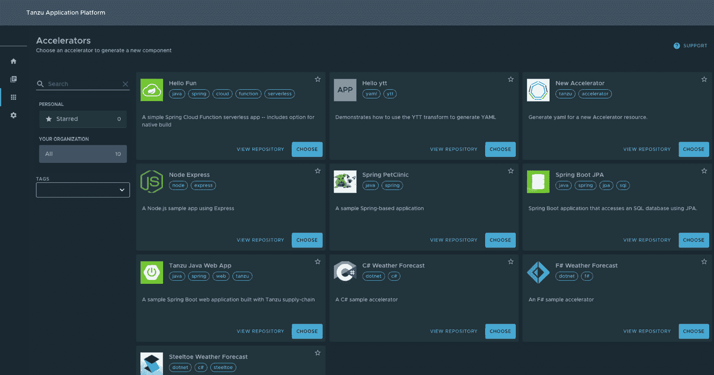
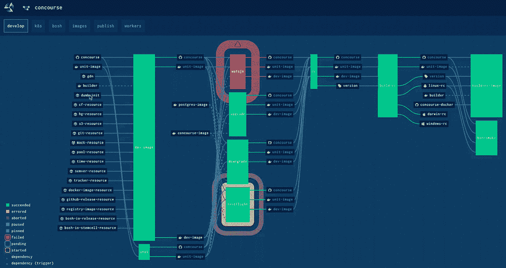
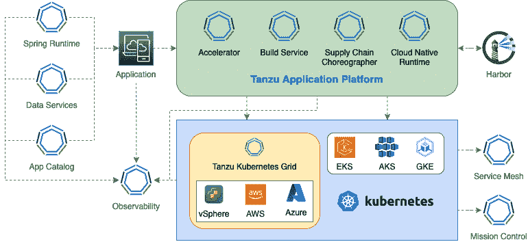

# 12

# 将一切汇聚在一起

恭喜你走到这本书的最后一章！在之前的章节中，我们学习了 VMware Tanzu 产品组合中的不同产品如何利用 Tanzu 所概述的 DevSecOps 能力，解决现代应用程序开发、安全和运维的挑战。本书的目的是为读者提供 Tanzu 整体能力的介绍，以便他们能够理解如何利用这一整套产品。VMware 在 Tanzu 的愿景方面做得非常出色，提供了一站式解决方案，满足你对现代应用程序的所有需求。正如你所想象的，这个产品组合中有很多内容我们在本书中没有涉及。此外，我们仅仅触及了本书中许多产品的表面。我们的目的是提供足够的细节，让读者理解每个产品的位置，并帮助读者进行实验以学习。这本书可以成为你深入学习与现实应用场景相关的产品的第一块垫脚石。

根据大纲，我们将覆盖 Tanzu 的更广泛的图景以及其采用选项。我们还将尝试预测这个生态系统的未来，那么，让我们开始吧，尽快完成这本书。

在本章中，为了将所有内容汇聚在一起，我们将涵盖以下主要主题：

+   Tanzu 采用选项

+   超越本书的 Tanzu

+   从端到端的视角

+   单一供应商解决方案的优缺点

+   Kubernetes 的未来

+   Tanzu 的下一步是什么？

# Tanzu 采用选项

在写作本书时，本书讨论的大多数产品是独立的，可以按需定价。然而，VMware 将它们打包在一起，提供简化且更具成本效益的采用体验。以下是目前可供企业选择的产品包列表。

## Tanzu Standard

这是最小的商业化 Tanzu 产品包，提供部署多云 Kubernetes 平台所需的基本工具。它主要包括 Tanzu Kubernetes Grid 和 Tanzu Mission Control 的基本功能。Tanzu Standard 还包括适用于 vSphere 的另一种 Kubernetes 产品。在这里，Kubernetes 集成在 vSphere 中，使得虚拟基础设施管理员更容易理解 vSphere 生态系统，从而简化了其采用过程。

## Tanzu 应用平台（TAP）

+   我们在*第八章*中深入探讨了这个产品捆绑包，标题为“通过 Tanzu 应用平台提升开发者生产力”。这个捆绑包包括简化开发人员在 Kubernetes 平台上构建和部署应用程序的工作的一些产品。截至本书编写时，该产品捆绑包在 Tanzu Kubernetes Grid、Amazon 的**弹性 Kubernetes 服务**（**EKS**）、**Azure Kubernetes 服务**（**AKS**）和**Google Kubernetes 引擎**（**GKE**）上作为多云解决方案得到支持。虽然 TAP 包括多个开源和独立可用的 Tanzu 产品，以下是此捆绑包中的一些主要产品：

+   **Tanzu 应用加速器** – 定义预先配置好的、具有良好默认设置和所需模板代码的即用型应用模板

+   **Tanzu 构建服务** – 使用 Cloud Native Buildpacks 开源项目从源代码构建应用容器镜像

+   **应用实时视图** – 使用 Backstage（一种开源项目）来监控已部署到 TAP 的应用程序，查看它们的进展中的软件供应链及其元数据

+   **供应链编排器** – 基于开源项目 Cartographer 的工具，允许根据应用程序类型定义一个预批准的生产路径

+   **Cloud Native Runtime** – 基于开源项目 Knative 的无服务器容器平台，用于 Kubernetes

*图 13.1*展示了作为更广泛 TAP 用户界面一部分的应用加速器模块：

图 12.1 – TAP GUI 中的应用模板

接下来是一个捆绑产品集合，专为端到端 Kubernetes 操作而设计——VMware Tanzu for Kubernetes Operations。让我们来看看它。

## VMware Tanzu for Kubernetes Operations

这个产品捆绑包专为 Kubernetes 平台拥有者设计，提供了管理大型 Kubernetes 基础设施所需的所有能力。它包含了本书中已详细介绍的多个产品，如下所示：

+   **Tanzu Kubernetes Grid** – 多云 Kubernetes 发行版

+   **Tanzu 任务控制** – 用于控制和管理数百个 Kubernetes 集群的单一视图

+   **VMware Aria 应用操作** – 完整栈的可观察性工具，提供基础设施到任何地方部署的应用程序的可视化

+   **Tanzu 服务网格** – 用于安全应用间流量的跨集群网络工具

+   **NSX 高级负载均衡器** – 可扩展的、基于软件的应用负载均衡器，用于入口流量控制，并具备 Web 应用防火墙的安全功能

## Tanzu 数据解决方案

Tanzu 包括一组可以在虚拟机上、作为 Cloud Foundry 托管服务或作为运行在 Kubernetes 上的容器部署的数据服务。这个捆绑包包括以下开源产品的企业支持版本：

+   **GemFire** —— 一种可靠的分布式缓存，基于开源 Apache Geode 项目提供可靠的数据存储

+   **RabbitMQ** —— 一种基于其开源发行版的异步通信数据队列解决方案

+   **Tanzu SQL** —— 包括基于其开源发行版的 MySQL 和 PostgreSQL RDBMS 数据库产品

+   **Greenplum** —— 基于开源 PostgreSQL 数据库的数据分析平台

本书没有涵盖这一产品集，因为它仅包括具有少量修改和企业支持的开源产品。

## VMware Spring 运行时

我们在*第二章*《开发云原生应用》中简要介绍了这一产品服务。它包括为多个开源应用开发框架、运行时和工具提供的商业企业支持，如下所列：

+   多个 Spring 框架项目，包括但不限于 Spring Boot、Spring Security 等

+   Spring Cloud 服务：

    +   Spring API 服务器

    +   配置服务器

    +   Spring Cloud Kubernetes

    +   Spring Cloud Stream

    +   Spring Cloud Data Flow

+   Open JDK —— 一种开源的 Java 运行时版本

+   Apache Tomcat 服务器

除了这些 Tanzu 产品组合外，还有其他一些产品，我们在本书中未详细介绍。让我们在下一节中回顾它们。

# 本书之外的 Tanzu

本书的范围是涵盖那些在 Kubernetes 平台上构建、运行和管理现代容器化应用时扮演关键角色的 Tanzu 产品。然而，Tanzu 生态系统中还有一些我们尚未涵盖的产品，如以下小节所示。

## Tanzu 实验室

Tanzu 实验室是 Tanzu 旗下的专业服务部门。它提供以成果为导向的服务，通常为期 6 到 12 周，具体取决于工作范围。这些服务包括来自各领域的高级架构师和工程师的咨询。每项服务通常由两名全职工程师或架构师以及一名产品经理组成。这些专业人员与客户团队成员合作，遵循极限编程的实践方式。这样，客户在短期合作结束后，能够拥有所需的、经过培训的成员来接管应用或平台的管理，而不需要再寻求额外帮助。Tanzu 实验室提供以下类别的服务：

+   **构建新应用** —— 一项从零开始构建关键业务应用的服务，以迈出正确的第一步

+   **现代化现有应用** —— 一项旨在将现有遗留系统现代化，使其云原生的服务，通常是通过使用现代工具、技术和平台对其进行重新架构

+   **构建平台** —— 一项使用多个 Tanzu 产品部署生产级平台的服务

+   **数据转换** – 一个关于数据服务优化、架构和部署的项目，涵盖了 Tanzu 数据服务捆绑包中包含的数据产品

+   **分析应用程序组合** – 一个项目，旨在分析组织中的数百个应用程序，为它们制定云迁移计划，并为它们定义重新托管、重新平台化、重新定位、重新架构、保留和淘汰策略之一

在 VMware 收购 Pivotal 之前，Tanzu Labs 也被称为 Pivotal Labs。这样，Tanzu Labs 在为非常大型企业提供这些服务方面有着成功的经验记录。了解更多关于 Tanzu Labs 的信息，请访问这里：[`tanzu.vmware.com/labs`](https://tanzu.vmware.com/labs)。

## Tanzu 应用服务

Tanzu 应用服务之前被称为 Pivotal Cloud Foundry，是开源 Cloud Foundry 平台的商业支持版本。与 Kubernetes 类似，Cloud Foundry 也是一个云无关的容器平台，大大提升了开发者的生产力。只需一个小命令 `cf push`，我们就可以从源代码将云原生应用部署到容器中，无需任何自定义自动化。Pivotal Cloud Foundry，以及因此而来的 Tanzu 应用服务，是经过实战考验的技术，在全球范围内运行着超过百万个容器，托管着关键的应用程序。尽管 Kubernetes 的崛起和普及使得这项技术黯然失色，但它仍然是一个非常成熟和可靠的容器平台，适合任何规模和大小的企业。了解更多关于 Tanzu 应用服务的信息，请访问这里：[`tanzu.vmware.com/application-service`](https://tanzu.vmware.com/application-service)。

## Azure Spring Apps

在微软和 VMware 的合作下，他们在 Azure 上推出了一个由 Spring Framework、Tanzu 和 AKS 提供支持的微服务平台。它还支持部署 .NET Core 和其他语言开发的应用程序。在幕后，这个提供使用了我们在 *第八章**，通过 Tanzu 应用平台增强开发者生产力* 中了解的 TAP 能力，建立在 AKS 之上。它为 Azure 原生客户提供了一个熟悉的用户界面，利用 Tanzu 的开发者生产力和 Azure 的可扩展基础设施来部署他们的云原生应用。了解更多关于 Azure Spring Apps 的信息，请访问这里：[`tanzu.vmware.com/azure-spring-apps`](https://tanzu.vmware.com/azure-spring-apps)。

## Concourse

Concourse 是一个商业支持但非常成熟的开源轻量级**持续集成/持续部署**（**CI/CD**）自动化平台，隶属于 Tanzu。凭借其水平可扩展的设计以及以容器并行运行工作节点的能力，它在一些大企业的非常大规模的 CI/CD 自动化平台中得到了应用。*图 13**.2* 显示了 Concourse Web 控制台上的一个复杂管道。该平台完全通过基于 YAML 的声明性配置驱动，遵循 GitOps 模型，并使用其简洁的基于 Web 的 UI 进行监控，以检查配置的管道状态。了解更多关于 Concourse 的信息：[`tanzu.vmware.com/concourse`](https://tanzu.vmware.com/concourse)。

图 12.2 – 一个复杂的 Concourse 管道

*图 13**.2* 显示了一个部署在 Concourse 上的复杂 CI/CD 管道。标签和不同管道阶段的文本不可读取，因为这里的目的是展示复杂管道在 Concourse GUI 中的外观。左侧框的黑色标签显示了输入到相应管道任务的数据和配置。右侧类似的标签显示了相应任务的输出，这些输出可以作为下一个任务的输入。框列显示了按从左到右的顺序执行的不同阶段。堆叠在同一列中的框表示可以在同一阶段并行执行的任务。红色框表示任务失败。带有黄色边框的框表示当前正在执行的任务。绿色框表示与当前执行任务相关的已完成或待处理的任务。

通过这些内容，我们覆盖了 Tanzu 产品组合中所有产品的一些细节。现在，让我们通过描述一个端到端的图示来更好地理解它，涵盖 Tanzu 大部分产品。

# 端到端图示

到目前为止，在本书中我们已覆盖 Tanzu 产品组合中 20 多种不同的产品，涵盖了不同的详细程度。现在是时候将其中的一些产品整合在同一页面上，以理解它们如何协同工作，为您的应用程序提供一个生产级的生态系统，满足不同层次的需求。*图 13**.3* 显示了 Tanzu 产品组合中的关键产品，它们共同提供一个全面的 Kubernetes 平台，帮助实施围绕现代应用程序的 DevSecOps 实践：

图 12.3 – Tanzu 的端到端图示

以下要点描述了*图 13**.3*：

+   一个应用程序可能使用以下组件：

    +   根据需要使用 VMware Spring Runtime for OpenJDK、Tomcat 和 Spring 框架

    +   Tanzu 数据服务，用于所需的后端数据存储

    +   VMware 应用程序目录，用于满足任何开源软件的需求

+   应用程序可以托管在 TAP 上，它内部使用多个组件将应用程序从开发到生产的路径铺开

+   TAP 可以使用 Harbor 作为容器镜像仓库，从 Tanzu Build Service 中获取应用构建的镜像，并利用这些镜像来部署容器。

+   TAP 可以部署在以下四种 Kubernetes 发行版之一：

    +   Tanzu Kubernetes Grid – 在 vSphere 上部署用于本地部署，在 AWS 或 Azure 上用于公共云部署。

    +   **EKS**

    +   **AKS**

    +   **GKE**

+   Tanzu Service Mesh 可以连接所需的 Kubernetes 集群，实现应用间的安全流量通信。

+   Tanzu Mission Control 可以管理整个 Kubernetes 环境，提供多种类型的策略控制、生命周期管理、备份/恢复和合规审计功能。

+   VMware Aria 操作系统用于应用程序可以收集来自所有来源的遥测数据，以提供集中位置的端到端可见性，监控所有组件的健康状况。

除了这种部署选项外，还有其他可能的方法可以使用相关的 Tanzu 产品在容器中部署应用程序。其一是使用自定义的 CI/CD 工具，而不是 TAP，并将容器部署在 Tanzu Kubernetes Grid 部署的 Kubernetes 集群中。其他所有产品的关联性保持不变。此外，自定义 CI/CD 流程可以使用 Concourse 部署。

在了解了整体大致情况后，让我们深入理解从像 VMware 这样的单一供应商获取所有服务意味着什么。

# 单一供应商解决方案的优缺点

使用像 Tanzu 这样的端到端解决方案或单一公共云有许多优点，但也存在一些缺点。企业应仔细考虑这些点，并相应地制定技术平台的采用计划。以下是使用包含多个产品的单一供应商解决方案的优缺点。

## 优点

+   在软件领域，越来越多的公司选择使用开源技术，以避免供应商锁定并获得社区协作的好处。然而，选择一个成熟且得到支持的开源技术往往是一个具有挑战性且耗时的过程。这时，一个全面的技术平台，例如 Tanzu，可能会发挥巨大作用，因为它在背后使用了许多精心挑选的开源工具。这将为企业节省大量精力，同时也能让企业更加自信地广泛使用开源技术。

+   当企业选择来自不同供应商或开源社区的不同软件解决方案时，很难使这些工具按预期一起工作。可能没有人在单一解决方案中尝试过并测试过它们，随着我们向前迈进，可能会遇到令人不快的惊喜。即使在某个时间点使它们一起工作，也不能保证来自异构来源的这些工具的未来版本将继续和谐工作。这就是像 Tanzu 这样的端到端解决方案有用的地方，因为组合中的所有产品都设计和确保能够一起工作。否则，将无法明确一个产品版本与另一个产品版本兼容的情况。

+   一个大型企业承诺从单一供应商购买多个产品可能会比从不同供应商购买不同产品获得巨大的许可成本折扣。

+   在发生重大生产中断时，企业拥有来自单一供应商的产品解决方案可能比拥有多个供应商或纯社区支持的开源产品更有帮助。使用来自单一供应商的产品可以确保所需的问责制，而不会引发潜在的产品兼容性问题。

+   使用像 Tanzu 这样的平台可以带来运营效率的提升，因为在使用不同工具时有相似的用户体验。共同的工具集和用户界面加快了学习曲线和围绕平台的自动化工作。最终，这将促进使用单一供应商解决方案的组织的敏捷性和现代化速度。

## 缺点

+   企业使用多个基于开源技术的供应商提供的不同产品，可以避免过度依赖单一供应商的成功。如果供应商不使用其他供应商也支持的开源工具，单一供应商解决方案可能导致潜在的供应商锁定问题。

+   将所有产品来自单一供应商就像把所有鸡蛋放在一个篮子里。如果篮子掉了，所有鸡蛋都会摔碎。为了避免这种情况，使用多个平台并具备移动应用的能力可能是一种有效的缓解策略。

+   拥有一个端到端的解决方案可能意味着拥有一组产品，缺少一些与市场上不同供应商的类似产品相比可用的功能。企业可能需要根据必需功能而不是好有的功能来权衡其选择。每个软件供应商都有比其他更闪亮和更成熟的产品，因此从同一供应商获取多个产品可能意味着错过组合中某些产品的一些优秀替代品。

在软件解决方案架构中，没有一个“灵丹妙药”能解决所有问题。决策是基于企业最重要的需求，考虑一种方法的好处，以及如何应对该方法所带来的风险。使用像 Tanzu 这样的端到端平台，在这种情况下也不例外。

# Kubernetes 的未来

虽然没有人能够准确预测未来，但根据目前的技术采用数据和该生态系统中正在进行的工作流程，我们可以对 Kubernetes 的未来做出一些预测。正如我们在*第七章*《使用 Tanzu Kubernetes Grid 跨云编排容器》中所学到的，Kubernetes 的采用在过去两年里达到了前所未有的高度。它已经成为大多数新开发应用程序以及许多遗留应用程序的家园。它是新的中间件，抽象了底层基础设施，提供了容器化应用程序出现之前无法实现的真正应用程序可移植性。容器化改变了我们构建架构和思考软件开发的方式。过去几年中，这项容器化技术跨越了多个平台，包括 Docker Swarm、Mesosphere、AWS 弹性容器服务、Cloud Foundry 和 Kubernetes。虽然它们都是成熟可靠的技术，但无疑 Kubernetes 是这个领域中最受欢迎的选择。随着将软件作为容器运行的兴起，大多数软件供应商将他们的产品打包为容器镜像，这些镜像可以在 Kubernetes 上运行。

然而，这一切只是当前的情景。考虑到目前的进展，我们可以尝试预测 Kubernetes 的未来，如下所述：

+   随着虚拟基础设施层成为大多数应用程序的新默认基础设施底层，Kubernetes 可能会取而代之，成为未来应用程序的默认基础设施层。从某种程度上讲，Kubernetes 有可能变得无处不在。

+   在微服务和**物联网**（**IoT**）的时代，应用程序变得非常小巧，适合在容器中运行。同时，将它们部署到离使用点更近的位置被认为是更优的选择。随着需要在边缘位置（如商店、手机塔、船只、飞机、家庭和分支办公室）运行的应用程序激增，我们预计未来 Kubernetes 在边缘部署中的使用场景将会增加。这将需要像 Tanzu Kubernetes Grid 这样的能力来支持本地部署，Tanzu Mission Control 来集中管理数百个集群，以及 VMware Aria 应用程序操作来集中监控这些集群、运行在其上的应用程序以及底层基础设施。

+   随着 Kubernetes 的日益普及，像 TAP 这样的工具将成为主流，用于将 Kubernetes 集群隐藏为低价值的工作内容。很快，Kubernetes 集群管理将被视为一种开销。开发者将花更少的时间编写 Kubernetes 特定的配置来部署应用程序，而是更多地关注丰富应用功能。就像开发者在部署应用时不会考虑服务器操作系统的具体细节一样，他们也会在不久的将来停止考虑 Kubernetes 层。

+   在大约十年前公共云平台出现之前，虚拟服务器曾被视为宠物，拥有名字，得到关爱和照顾，并有较长的生命周期。然而，基于 API 的云基础设施即代码（Infrastructure-as-Code）使得创建新服务器变得如此简单且成为必需，虚拟服务器就像牲畜一样。Kubernetes 集群也是如此，今天它们被视为宠物。随着集群需求的增加，未来它们也可能会像牲畜一样被对待。

+   随着 Kubernetes 越来越受欢迎，并且它的社区合作不断加强，未来我们可能会看到 Kubernetes 添加许多新功能，解决今天我们需要依赖外部工具才能解决的许多问题。

Kubernetes 会长期存在，但我们今天对它的关心方式可能会在明天发生变化——而且应该发生变化，因为没有任何企业仅凭运行健康的 Kubernetes 集群就能获得更多收入。Kubernetes 只是一个基础设施层，使我们的创收应用能够繁荣发展。

# Tanzu 的未来是什么？

VMware 于 2020 年通过将内部开发的相关产品与从 Pivotal、Bitnami、Heptio 和 Wavefront 收购的产品整合，创建了一个新的现代应用程序业务部门。这是一个深思熟虑的产品组合，涵盖了在多云环境中构建、运行和管理现代应用程序的大部分主要领域。该产品组合中的所有产品都有良好的长期发展规划，能够增加更多功能并支持不同的云基础设施提供商。然而，随着博通公司（Broadcom Inc.）宣布收购 VMware，预计这些产品的分组方式会发生变化，此外还会涉及 VMware 和博通现有产品的整合。更多细节将在收购后的未来展开。不管怎样，我们相信这些产品为市场带来的价值不会改变，即使它们的包装或名称将来发生变化，因此我们也希望本书中获得的知识依然能帮助读者。

重要提示

以下列表中提到的任何内容都属于前瞻性声明，预测未来产品的路线图。某些或所有列出的项目可能会在没有通知的情况下从路线图中删除。

以下列表包括不同 Tanzu 产品的部分现有工作流：

+   Tanzu Mission Control 和 Tanzu Service Mesh 除了现有的基于云的 **软件即服务** (**SaaS**) 部署外，可能还会有本地部署变体，以支持隔离环境中的部署。

+   Tanzu Mission Control 可能会增加更多功能，支持在其管理的 Kubernetes 集群上安装和配置第三方软件。

+   VMware Aria Operations for Applications 也可能具有日志聚合功能，并结合指标、直方图和跨度日志，将所有内容集中在一个地方，以实现完整的栈式可观察性。

+   Tanzu Kubernetes Grid 和 TAP 可以支持更多底层云平台，包括 OpenShift、Google Cloud Platform 和 Oracle Cloud。

+   TAP 的 Application Live View 组件可以支持 Tanzu 客户开发的自定义模块，作为底层开源 Backstage 项目的插件。

让我们用一个简短的总结来结束本章。

# 总结

在本书的结尾部分，我们介绍了当前市场上不同的商业套餐，这些套餐将本书中介绍的不同产品打包在一起。我们还了解了 Tanzu 旗下其他产品和套餐，包括针对不同类型后端数据存储需求的 Tanzu Data、为最佳利用 Azure 云平台运行 Spring 应用程序的 Azure Spring Runtime，以及作为 Cloud Foundry 和 Concourse（一个轻量级 CI/CD 自动化工具）商业化产品的 Tanzu Application Service。我们还了解了使用本书中涉及的关键产品部署 Tanzu 的端到端部署图景。我们还了解了选择单一供应商的多种产品意味着什么。虽然选择一站式商店满足许多需求有一定的缺点，但这样做也带来了显著的好处。最后，我们根据 Kubernetes 和 Tanzu 当前的状况预测了它们的未来。

这本书到此结束。感谢你与我们一起走过这段学习旅程！我们希望你按照预期了解了 Tanzu 产品组合。正如本书中提到的，我们仅仅触及了表面。欲获取更多学习资源，请参考本书的 *附录* 部分。

# 附录

本节包含了关于 Tanzu 的额外学习资源，以及创建 Kubernetes 集群的参考资料，用于本书中的实战部分。

# VMware 提供的额外学习资源

以下是一些好的学习参考资源，帮助进一步探索 Tanzu：

+   官方 VMware Tanzu 产品文档：[`docs.vmware.com/allproducts.html#section`](https://docs.vmware.com/allproducts.html#section)

+   VMware 提供了按需培训课程，面向开发人员和运维人员：[`tanzu.vmware.com/education`](https://tanzu.vmware.com/education)

+   Tanzu 实战工作坊：[`tanzu.vmware.com/developer/workshops/`](https://tanzu.vmware.com/developer/workshops/)

+   与 Tanzu 和构建现代应用相关的动手实验和课程: [`modernapps.ninja/`](https://modernapps.ninja/)

+   Kubernetes 课程: [`kube.academy/`](https://kube.academy/)

+   Tanzu YouTube 频道: [`www.youtube.com/c/VMwareTanzu`](https://www.youtube.com/c/VMwareTanzu)

# 创建 Kubernetes 集群的不同方式

本书中的大多数章节都要求 Kubernetes 集群作为前提条件之一，以便按照每章的说明进行操作。在本书中，我们介绍了创建 Tanzu 集群的三种不同方法，如下所述，但也有多种其他方式可以让你轻松启动并运行 Kubernetes 集群。本节列出了创建 Kubernetes 集群的多种方法。

## 创建 Tanzu Kubernetes Grid 集群

以下列表包括创建 Tanzu Kubernetes Grid 集群的方式：

+   **Tanzu Kubernetes Grid**: 在*第七章**，使用 Tanzu Kubernetes Grid 跨云编排容器* 中，我们描述了如何使用 Tanzu Kubernetes Grid 创建一个托管的企业级 Kubernetes 集群。

+   **Tanzu Mission Control**: Tanzu Mission Control 使得创建 Kubernetes 集群变得非常简单直接。我们在*第九章*中详细介绍了这一点，内容为*使用 Tanzu Mission Control 管理和控制 Kubernetes 集群*。

+   **vSphere with Tanzu**: 如果你已经拥有 vSphere 集群，可能可以使用已经集成到虚拟基础设施中的 **Supervisor Cluster** 创建集群。你可以在这里了解更多信息: [`docs.vmware.com/en/VMware-vSphere/7.0/vmware-vsphere-with-tanzu/GUID-3B2102E6-D9AA-4FE6-B3AA-60B450BE8491.html`](https://docs.vmware.com/en/VMware-vSphere/7.0/vmware-vsphere-with-tanzu/GUID-3B2102E6-D9AA-4FE6-B3AA-60B450BE8491.html)

## 创建非 Tanzu Kubernetes 集群

以下列表包括在公共云、本地桌面环境和 OpenShift 平台上创建非 Tanzu Kubernetes 集群的方式：

+   使用 Docker Desktop 创建本地 Kubernetes 集群: [`docs.docker.com/desktop/kubernetes/`](https://docs.docker.com/desktop/kubernetes/)

+   创建本地 Minikube 集群: [`minikube.sigs.k8s.io/docs/start/`](https://minikube.sigs.k8s.io/docs/start/)

+   创建 AWS **弹性 Kubernetes 服务**（**EKS**）集群: [`docs.aws.amazon.com/eks/latest/userguide/create-cluster.html`](https://docs.aws.amazon.com/eks/latest/userguide/create-cluster.html)

+   创建 **Google Kubernetes 引擎**（**GKE**）集群: [`cloud.google.com/kubernetes-engine/docs/how-to/creating-a-zonal-cluster`](https://cloud.google.com/kubernetes-engine/docs/how-to/creating-a-zonal-cluster)

+   创建 **Azure Kubernetes 服务**（**AKS**）集群: [`docs.microsoft.com/en-us/azure/aks/learn/quick-kubernetes-deploy-portal?tabs=azure-cli`](https://docs.microsoft.com/en-us/azure/aks/learn/quick-kubernetes-deploy-portal?tabs=azure-cli)

+   在 IBM Cloud 上创建 Red Hat OpenShift 集群：[`cloud.ibm.com/docs/openshift?topic=openshift-clusters&interface=ui`](https://cloud.ibm.com/docs/openshift?topic=openshift-clusters&interface=ui)
