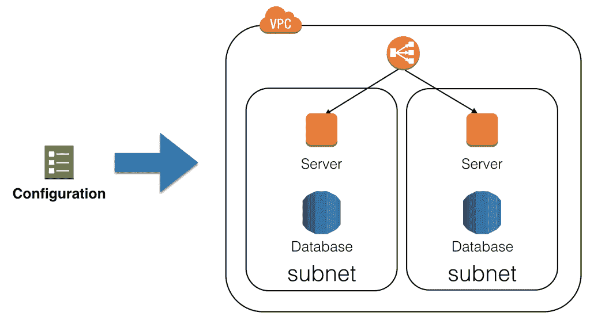
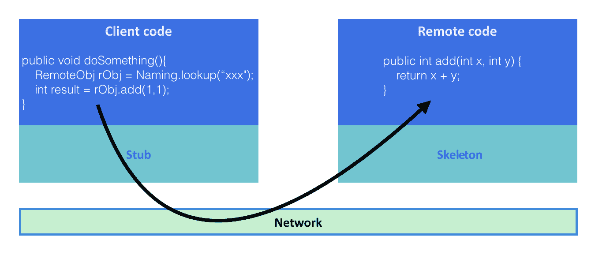

# 第一章：DevOps 简介

过去几年中，软件交付周期变得越来越快，同时应用程序部署也变得越来越复杂。这增加了所有涉及发布周期的角色的工作负担，包括**软件开发人员**、**质量保证**（**QA**）团队和**IT 运维人员**。为了应对快速变化的软件系统，2009 年提出了一个名为**DevOps**的新概念，旨在帮助整个软件交付流水线演进，使其更加快速和稳健。

本章涵盖以下主题：

+   软件交付方法论发生了哪些变化？

+   什么是微服务架构？为什么人们选择采用这种架构？

+   什么是 DevOps？它如何使软件系统更具弹性？

# 软件交付挑战

**软件开发生命周期**（**SDLC**），即我们构建应用程序并将其交付到市场的方式，随着时间的推移发生了显著变化。在本节中，我们将重点讨论所做的变化以及原因。

# 瀑布式和静态交付

回到 1990 年代，软件是以静态方式交付的——通过**实体**软盘或 CD-ROM。由于将应用程序重新交付到市场并不容易，SDLC 每个周期通常需要几年时间。

当时，主要的软件开发方法之一是**瀑布模型**。它由多个阶段组成，如下图所示：


一旦某个阶段开始，就很难回到前一个阶段。例如，在开始**实施**阶段后，我们将无法返回**设计**阶段来修复技术扩展性问题，因为任何更改都会影响整体进度和成本。所有内容都难以更改，因此新的设计将推迟到下一个发布周期。

瀑布方法必须与每个部门精确协调，包括开发、物流、营销和分销商。瀑布模型和静态交付有时需要几年时间，并且需要巨大的努力。

# 敏捷和数字交付

几年后，随着互联网的广泛使用，软件交付方法从实体转变为**数字化**，采用在线下载等方式。因此，许多软件公司（也称为互联网公司）试图弄清楚如何缩短 SDLC 过程，以交付能够击败竞争对手的软件。

许多开发人员开始采用新的方法论，如增量式、迭代式或**敏捷**模型，希望这些方法能够帮助缩短市场时间。这意味着，如果发现新错误，这些新方法可以通过电子交付向客户提供补丁。从 Windows 98 开始，Microsoft Windows 更新也通过这种方式发布。

在敏捷或数字化模型中，软件开发人员编写的是相对较小的模块，而不是整个应用程序。每个模块会交付给 QA 团队，而开发者则继续开发新的模块。当所需的模块或功能完成时，它们将按以下图示发布：


这种模型使得软件开发生命周期（SDLC）和软件交付变得更快速、易于调整。该周期从几周到几个月不等，足够短以便在必要时进行快速修改。

尽管当时大多数人偏爱这种模型，但应用软件交付意味着软件二进制文件（通常是 EXE 程序）必须安装并运行在客户的个人电脑上。然而，基础设施（如服务器或网络）是非常静态的，必须提前设置。因此，这种模型通常不包括在软件开发生命周期（SDLC）中。

# 云上的软件交付

几年后，智能手机（如 iPhone）和无线技术（如 Wi-Fi 和 4G 网络）变得流行并广泛应用。应用软件从二进制形式转变为在线服务。网页浏览器成为应用软件的界面，这意味着不再需要安装。基础设施变得非常动态——为了适应快速变化的应用需求，它现在必须能够在容量和性能上进行扩展。

这一切得益于虚拟化技术和**软件定义网络**（**SDN**）。如今，云服务，如**亚马逊网络服务**（**AWS**）、**谷歌云平台**（**GCP**）和**微软 Azure**，通常被广泛使用。这些服务可以轻松创建和管理按需的基础设施。

基础设施是**软件开发交付周期**（SDDC）中最重要的组成部分之一。由于应用程序在服务器端安装和运行，而不是在客户端 PC 上，因此软件和服务交付周期通常只需几天到几周。

# 持续集成

如前所述，软件交付环境在不断变化，而交付周期越来越短。为了实现这种快速交付并提高质量，开发者和 QA 团队最近开始采用自动化技术。其中之一就是**持续集成**（**CI**）。它包括各种工具，如**版本控制系统**（**VCS**）、**构建服务器**和**测试自动化工具**。

VCS（版本控制系统）帮助开发者跟踪软件源代码在中央服务器上的更改。它们保存代码的修订记录，并防止不同开发者覆盖源代码。这使得每个版本的源代码都能保持一致和可管理。集中式构建服务器连接到 VCS，定期或在开发者更新代码到 VCS 时自动获取源代码。然后，它们触发新的构建。如果构建失败，构建服务器会迅速通知开发者。这有助于开发者发现有人将有缺陷的代码提交到 VCS。测试自动化工具也与构建服务器集成。在构建成功后，这些工具会调用单元测试程序，然后将结果通知开发者和 QA 团队。这有助于识别是否有人编写了有 bug 的代码并存储到 VCS 中。

整个 CI 流程如以下图所示：


CI 不仅帮助开发者和 QA 团队提高质量，还缩短了应用程序或模块包周期的过程。在电子交付客户的时代，CI 足以应对。交付给客户意味着将应用程序部署到服务器上。

# 持续交付

CI 加上部署自动化是服务器端应用程序提供服务给客户的理想过程。然而，仍然存在一些技术挑战需要解决，比如如何将软件部署到服务器上；如何优雅地关闭现有应用程序；如何替换并回滚应用程序；如何升级或替换需要更新的系统库；如果需要，如何修改操作系统中的用户和组设置。

基础设施包括服务器和网络。我们通常有不同的环境来支持不同的软件发布阶段，如开发、QA、预发布和生产。每个环境都有自己的服务器配置和 IP 范围。

**持续交付** (**CD**) 是解决前面提到的挑战的一种常见方法。这是一个结合了 CI、配置管理和编排工具的过程：


# 配置管理

配置管理工具帮助配置操作系统设置，比如创建用户或组，或者安装系统库。它还充当一个编排工具，确保多个管理的服务器与我们期望的状态保持一致。

它不是一个编程脚本，因为脚本不一定是幂等的。这意味着如果我们执行一个脚本两次，可能会出错，比如如果我们尝试创建同一个用户两次。而配置管理工具则关注**状态**，所以如果用户已经创建，配置管理工具不会再做任何操作。如果我们不小心或故意删除了用户，配置管理工具会重新创建该用户。

配置管理工具还支持将软件部署或安装到服务器上。我们只需描述需要安装的软件包类型，然后配置管理工具会触发相应的命令，按照要求安装软件包。

此外，如果你告诉配置管理工具停止你的应用程序，下载并替换为新的软件包（如果适用），然后重启应用程序，它将始终保持最新的版本。通过配置管理工具，你还可以轻松执行蓝绿部署。

蓝绿部署是一种技术，准备两套应用栈。只有一个环境（例如，蓝色环境）提供生产服务。当你需要部署新版本的应用时，可以将其部署到另一侧（例如，绿色环境），然后进行最终测试。如果一切正常，你可以更改负载均衡器或路由器设置，将网络流量从蓝色切换到绿色。然后，绿色环境成为生产环境，而蓝色环境变为休眠，等待下一个版本的部署。

# 基础设施即代码

配置管理工具不仅支持裸机环境或虚拟机（VM），还支持云基础设施。如果你需要在云上创建和配置网络、存储和虚拟机，配置管理工具可以帮助在配置文件中设置云基础设施，如下图所示：



配置管理相较于**标准操作程序**（**SOP**）有一些优势。它通过**VCS**帮助维护配置文件，可以追踪所有版本的历史记录。

它还帮助复制环境。例如，假设我们想在云中创建一个灾难恢复站点。如果你按照传统方法，使用 SOP 手动构建环境，这很难预测和发现人为或操作性错误。另一方面，如果我们使用配置管理工具，我们可以快速且自动地在云中构建环境。

基础设施即代码（Infrastructure as Code）可能包含也可能不包含在持续交付（CD）过程中，因为替换或更新基础设施的成本高于仅仅替换服务器上的应用程序二进制文件。

# 编排

编排工具是配置管理工具集的一部分。然而，这种工具在配置和分配云资源方面更加智能和动态。编排工具管理多个服务器资源和网络。每当管理员想增加应用程序和网络容量时，编排工具可以确定服务器是否可用，然后自动部署和配置应用程序和网络。尽管编排工具不包括在 SDLC 中，但它有助于 CD 流水线中的容量管理。

总之，SDLC 已经显著发展，使我们能够使用各种过程、工具和方法实现快速交付。现在，软件交付可以随时随地进行，软件架构和设计能够生成大而丰富的应用程序。

# 微服务趋势

正如前文所述，软件架构和设计基于目标环境和应用程序的体量继续演进。本节将讨论软件设计的历史和演变。

# 模块化编程

随着应用程序规模的增加，开发者的任务是尝试将其分解为多个模块。每个模块旨在独立和可重用，并由不同的开发团队维护。主应用程序只需初始化、导入和使用这些模块。这使得构建更大的应用程序的过程更加高效。

以下示例显示了在 CentOS 7 上`nginx` ([`www.nginx.com`](https://www.nginx.com)) 的依赖项。它表明`nginx`使用`OpenSSL(libcrypt.so.1, libssl.so.10)`，`POSIX thread(libpthread.so.0)`库，正则表达式`PCRE(libpcre.so.1)`库，`zlib(libz.so.1)`压缩库，`GNU C(libc.so.6)`库等等：

```
$ /usr/bin/ldd /usr/sbin/nginx
 linux-vdso.so.1 =>  (0x00007ffd96d79000)
 libdl.so.2 => /lib64/libdl.so.2 (0x00007fd96d61c000)
 libpthread.so.0 => /lib64/libpthread.so.0   
  (0x00007fd96d400000)
 libcrypt.so.1 => /lib64/libcrypt.so.1   
  (0x00007fd96d1c8000)
 libpcre.so.1 => /lib64/libpcre.so.1 (0x00007fd96cf67000)
 libssl.so.10 => /lib64/libssl.so.10 (0x00007fd96ccf9000)
 libcrypto.so.10 => /lib64/libcrypto.so.10   
  (0x00007fd96c90e000)
 libz.so.1 => /lib64/libz.so.1 (0x00007fd96c6f8000)
 libprofiler.so.0 => /lib64/libprofiler.so.0 
  (0x00007fd96c4e4000)
 libc.so.6 => /lib64/libc.so.6 (0x00007fd96c122000)
 ...
```

`ldd(list dynamic dependencies)`命令包含在 CentOS 的`glibc-common`软件包中。

# 软件包管理

Java 编程语言以及 Python、Ruby 和 JavaScript 等多种脚本编程语言，都有自己的模块或软件包管理工具。例如，Java 使用 Maven ([`maven.apache.org`](http://maven.apache.org))，Python 使用`pip` ([`pip.pypa.io`](https://pip.pypa.io))，Ruby 使用 RubyGems ([`rubygems.org`](https://rubygems.org))，JavaScript 使用`npm` ([`www.npmjs.com`](https://www.npmjs.com))。

软件包管理工具不仅允许你下载必要的软件包，还能注册你实施的模块或软件包。以下屏幕截图显示了 AWS SDK 的 Maven 仓库：


当你向应用程序添加依赖项时，Maven 会下载必要的软件包。以下屏幕截图显示了当你将`aws-java-sdk`依赖项添加到应用程序时的结果：


模块化编程有助于加速软件开发速度。然而，现代应用程序已经变得越来越复杂。它们需要不断增加的模块、包和框架，并且新特性和逻辑不断被加入。典型的服务器端应用程序通常使用身份验证方法，如 LDAP，连接到集中式数据库（如 RDBMS），然后将结果返回给用户。开发人员最近发现，必须使用软件设计模式来容纳应用程序中的多个模块。

# MVC 设计模式

最流行的应用程序设计模式之一是**模型-视图-控制器**（**MVC**）。它定义了三个层次：**模型**层负责数据查询和持久化，例如将数据加载和存储到数据库；**视图**层负责**用户界面**（**UI**）和**输入/输出**（**I/O**）；**控制器**层负责业务逻辑，位于**视图**和**模型**之间：


有一些框架可以帮助开发人员简化 MVC 的实现，例如 Struts（[`struts.apache.org/`](https://struts.apache.org/)）、SpringMVC（[`projects.spring.io/spring-framework/`](https://projects.spring.io/spring-framework/)）、Ruby on Rails（[`rubyonrails.org/`](http://rubyonrails.org/)）和 Django（[`www.djangoproject.com/`](https://www.djangoproject.com/)）。MVC 是最成功的软件设计模式之一，是现代 Web 应用程序和服务的基础。

MVC 定义了每一层之间的边界，允许多个开发人员共同开发同一个应用程序。然而，这也会带来一些负面影响。应用程序中的源代码体积不断增大。这是因为数据库代码（**模型**）、展示代码（**视图**）和业务逻辑（**控制器**）都在同一个 VCS（版本控制系统）仓库中。这最终会影响软件开发周期。这种类型的应用程序称为**单体**应用程序。它包含了大量的代码，构建出一个巨大的 EXE 或 WAR 程序。

# 单体应用程序

没有一个明确的衡量标准来定义一个应用程序是单体应用程序，但典型的单体应用程序往往有超过 50 个模块或包，超过 50 个数据库表，并且构建需要超过 30 分钟。如果我们需要添加或修改其中的某个模块，所做的更改可能会影响大量代码。因此，开发人员尽量减少应用程序内部的代码更改。这种不情愿可能导致开发人员犹豫不决地维护应用程序代码，然而，如果问题未及时处理，就会出现问题。为了这个原因，开发人员现在倾向于将单体应用程序分割成更小的部分，并通过网络将它们连接起来。

# 远程过程调用

事实上，将一个应用程序划分为小部分并通过网络连接最早是在 1990 年代进行尝试的，当时 Sun Microsystems 推出了**Sun 远程过程调用**（**SunRPC**）。这允许远程使用某个模块。最流行的实现之一是**网络文件系统**（**NFS**）。NFS 客户端和 NFS 服务器可以通过网络进行通信，即使服务器和客户端使用不同的 CPU 和操作系统。

一些编程语言也支持 RPC 风格的功能。UNIX 和 C 语言有`rpcgen`工具，它生成包含一些复杂网络通信代码的存根代码。开发者可以通过网络使用这些代码，以避免困难的网络层编程。

Java 有**Java 远程方法调用**（**RMI**），它类似于 Sun RPC，但特定于 Java 语言。**RMI 编译器**（**RMIC**）生成连接远程 Java 进程以调用方法并返回结果的存根代码。下图展示了 Java RMI 的过程流程：



Objective C 有**分布式对象**，而.NET 有**远程调用**，两者的工作方式相似。大多数现代编程语言都自带 RPC 功能。这些 RPC 设计能够将单一应用分割成多个进程（程序）。各个程序可以有独立的源代码仓库。尽管 RPC 设计在一定程度上有效，但在 1990 年代和 2000 年代初期，机器资源（CPU 和内存）有限。另一个缺点是这些设计通常要求使用相同的编程语言，并且这些设计是为客户端/服务器架构而设计的，而非分布式架构。此外，这些设计在开发时对安全性的考虑较少，因此不推荐在公共网络上使用。

在 2000 年代初，使用**SOAP**（HTTP/SSL）作为数据传输的**Web 服务**应运而生。这些服务使用 XML 作为数据呈现，并使用**Web 服务描述语言**（**WSDL**）定义服务。随后，**通用描述、发现与集成**（**UDDI**）作为服务注册表，用于查找 Web 服务应用。然而，由于当时机器资源不充裕，并且 Web 服务的编程与维护复杂，这一技术未被开发者广泛接受。

如今，gRPC ([`grpc.io/`](https://grpc.io/)) 促使编程技术发生了彻底的重新评估，因为 gRPC 是一个简单、安全、支持多语言的工具。

# RESTful 设计

在 2010 年代，机器甚至智能手机能够访问大量的 CPU 资源，并且几百 Mbps 的网络带宽到处可见。开发者开始利用这些资源，使应用程序代码和系统结构尽可能简单，从而加快了软件开发周期。

目前，硬件资源已经足够充裕，因此使用 HTTP/SSL 作为 RPC 传输是有意义的。此外，根据经验，开发人员选择以下方式简化这一过程：

+   通过将 HTTP 和 SSL/TLS 作为标准传输协议

+   通过使用 HTTP 方法进行**创建**/**加载**/**上传**/**删除**（**CLUD**）操作，例如`GET`、`POST`、`PUT`或`DELETE`

+   通过使用 URI 作为资源标识符，例如，具有 ID 为`123`的用户，其 URI 将是`/user/123/`

+   通过使用 JSON 作为标准数据表示格式

这些概念被称为**表征状态转移**（**RESTful**）设计。它们已经被开发人员广泛接受，并成为分布式应用程序的事实标准。RESTful 应用程序允许使用任何编程语言，因为它们基于 HTTP。例如，可以使用 Java 作为 RESTful 服务器，Python 作为客户端。

RESTful 设计为开发人员带来了自由和机会。它使得代码重构、升级库甚至切换到其他编程语言变得更加容易。它还鼓励开发人员构建由多个 RESTful 应用组成的分布式模块化设计，这些应用被称为微服务。

如果你有多个 RESTful 应用，你可能会想知道如何在 VCS 上管理多个源代码以及如何部署多个 RESTful 服务器。然而，CI 和 CD 自动化使得构建和部署多个 RESTful 服务器应用变得更加容易。因此，微服务设计正在成为 Web 应用开发人员越来越受欢迎的选择。

# 微服务

尽管微服务的名称中有“微”字，但与 1990 年代或 2000 年代初期的应用程序相比，它们实际上相当“重”。它们使用完整堆栈的 HTTP/SSL 服务器，并包含整个 MVC 层。

微服务设计具有以下优势：

+   **无状态**：微服务不会存储用户会话，这有助于扩展应用程序。

+   **没有共享数据存储**：微服务应该拥有自己的数据存储，例如数据库。它们不应该与其他应用共享这些数据存储。这有助于封装后端数据库，从而更容易在单个微服务内重构和更新数据库架构。

+   **版本控制与兼容性**：微服务可能会更改和更新 API，但它们应定义版本，例如`/api/v1`和`/api/v2`，并保持向后兼容性。这有助于解耦其他微服务和应用程序。

+   **集成 CI/CD**：微服务应采用 CI 和 CD 流程，以消除管理工作量。

有一些框架可以帮助构建基于微服务的应用程序，例如 Spring Boot（[`projects.spring.io/spring-boot/`](http://spring.io/projects/spring-boot)）和 Flask（[`flask.pocoo.org`](http://flask.pocoo.org/)）。然而，也有许多基于 HTTP 的框架，因此开发者可以根据个人偏好选择任何框架或编程语言。这就是微服务设计的魅力所在。

以下图表展示了单体应用设计与微服务设计的对比。它表明，微服务设计与单体设计相同；两者都包含接口层、业务逻辑层、模型层和数据存储层。然而，它们的区别在于，应用程序由多个微服务构成。不同的应用程序可以共享相同的微服务：


开发者可以通过快速的软件交付方法添加必要的微服务，并修改现有的微服务，而不会影响现有的应用程序或服务。这是一个重要的突破。它代表了一个广泛被开发者接受的完整软件开发环境和方法论。

尽管 CI 和 CD 自动化流程有助于开发和部署微服务，但诸如虚拟机、操作系统、库、磁盘卷和网络等资源的数量，无法与单体应用程序相比。仍然有一些工具可以支持这些大型自动化环境在云端的运行。

# 自动化与工具

如前所述，自动化是实现快速软件交付的最佳方式。它解决了管理微服务的问题。然而，自动化工具不是普通的 IT 或基础设施应用程序，如**Active Directory**、**BIND**（DNS）或**Sendmail**（MTA）。为了实现自动化，我们需要一位既具备开发者技能，特别是在脚本语言方面的编码能力，又具备基础设施操作技能，了解虚拟机、网络和存储操作的工程师。

DevOps 是开发与运维的简称。它指的是使自动化流程（如 CI、基础设施即代码和 CD）得以实现的能力。它使用一些 DevOps 工具来完成这些自动化流程。

# 持续集成工具

其中一个流行的版本控制工具是 Git（[`git-scm.com`](https://git-scm.com)）。开发者经常使用 Git 进行代码的检查和提交。有许多托管 Git 服务，包括 GitHub（[`github.com`](https://github.com/)）和 Bitbucket（[`bitbucket.org`](https://bitbucket.org)）。这些服务允许你创建和保存 Git 代码库，并与其他用户通过互联网协作。以下截图展示了 GitHub 上的一个示例拉取请求：


构建服务器有很多种变体。Jenkins ([`jenkins.io`](https://jenkins.io)) 是最为成熟的应用程序之一，还有 TeamCity ([`www.jetbrains.com/teamcity/`](https://www.jetbrains.com/teamcity/))。除了构建服务器外，还有托管服务，也称为 **软件即服务** (**SaaS**)，例如 Codeship ([`codeship.com`](https://codeship.com/)) 和 Travis CI ([`travis-ci.org`](https://travis-ci.org/))。SaaS 可以与其他 SaaS 工具集成。构建服务器能够调用外部命令，例如单元测试程序，这使得构建服务器成为 CI 流水线中的关键工具。

以下截图展示了使用 Codeship 的示例构建。我们从 GitHub 拉取代码，并调用 Maven 进行构建（`mvn compile`）和单元测试（`mvn test`）我们的示例应用程序：


# 配置管理工具

有多种配置管理工具可供选择。最受欢迎的包括 Puppet ([`puppet.com`](https://puppet.com))、Chef ([`www.chef.io`](https://www.chef.io)) 和 Ansible ([`www.ansible.com`](https://www.ansible.com))。

AWS OpsWorks ([`aws.amazon.com/opsworks/`](https://aws.amazon.com/opsworks/)) 提供了一个在 AWS 云上托管的 Chef 平台。以下截图展示了一个 Chef 配方（配置），用于通过 AWS OpsWorks 安装 Amazon CloudWatch Log 代理。AWS OpsWorks 在启动 EC2 实例时自动安装 CloudWatch Log 代理：


AWS CloudFormation ([`aws.amazon.com/cloudformation/`](https://aws.amazon.com/cloudformation/)) 有助于实现基础设施即代码。它支持自动化 AWS 操作，允许我们执行以下功能：

+   创建 VPC

+   在 VPC 上创建子网

+   在 VPC 上创建互联网网关

+   创建路由表以将子网与互联网网关关联

+   创建安全组

+   创建虚拟机实例

+   将安全组关联到虚拟机实例

CloudFormation 的配置是通过 JSON 编写的，如下图所示：


CloudFormation 支持参数化，因此使用相同配置的 JSON 文件，可以轻松创建具有不同参数（如 VPC 和 CIDR）的额外环境。它还支持更新操作。如果我们需要更改基础设施的一部分，无需重新创建整个环境。CloudFormation 可以识别配置的差异，并仅代表你执行必要的基础设施操作。

AWS CodeDeploy ([`aws.amazon.com/codedeploy/`](https://aws.amazon.com/codedeploy/)) 是另一个有用的自动化工具，专注于软件部署。它允许用户定义部署步骤。你可以在 YAML 文件中执行以下操作：

+   指定从哪里下载和安装应用程序

+   指定如何停止应用程序

+   指定如何安装应用程序

+   指定如何启动和配置应用程序

以下截图是 AWS CodeDeploy 配置文件`appspec.yml`的示例：


# 监控和日志记录工具

一旦你开始使用云基础设施管理微服务，就会有多种监控工具帮助你管理服务器。

**Amazon** **CloudWatch**是 AWS 的内置监控工具。无需安装代理；它会自动收集 AWS 实例的度量数据，并允许用户可视化这些数据以执行 DevOps 任务。它还支持基于你设定的标准触发警报。以下截图展示了 EC2 实例的 Amazon CloudWatch 度量数据：


亚马逊 CloudWatch 还支持收集应用日志。这需要我们在 EC2 实例上安装一个代理。当你需要开始管理多个微服务实例时，集中日志管理就显得特别有用。

ELK 是一个流行的技术栈组合，代表 Elasticsearch（[`www.elastic.co/products/elasticsearch`](https://www.elastic.co/products/elasticsearch)）、Logstash（[`www.elastic.co/products/logstash`](https://www.elastic.co/products/logstash)）和 Kibana（[`www.elastic.co/products/kibana`](https://www.elastic.co/products/kibana)）。Logstash 聚合应用日志，将其转换为 JSON 格式，然后发送到 Elasticsearch。Elasticsearch 是一个分布式 JSON 数据库。Kibana 可以将存储在 Elasticsearch 中的数据可视化。以下 Kibana 示例展示了一个`nginx`访问日志：


Grafana（[`grafana.com`](https://grafana.com)）是另一个流行的可视化工具。它曾经与时间序列数据库如 Graphite（[`graphiteapp.org`](https://graphiteapp.org/)）或 InfluxDB（[`www.influxdata.com`](https://www.influxdata.com/)）连接。时间序列数据库旨在存储扁平化、非规范化的数值数据，如 CPU 使用率或网络流量。与关系型数据库（RDBMS）不同，时间序列数据库做了优化以节省存储空间，并能更快地对历史数值数据执行查询。大多数 DevOps 监控工具都在后台使用时间序列数据库。

以下 Grafana 截图展示了一些**消息队列服务器**的统计信息：


# 通讯工具

当你开始使用多个 DevOps 工具时，你需要来回访问多个控制台，以检查 CI 和 CD 管道是否正常工作。特别是，以下事件需要被监控：

+   将源代码合并到 GitHub

+   在 Jenkins 上触发新构建

+   触发 AWS CodeDeploy 部署应用程序的新版本

这些事件需要被跟踪。如果出现任何问题，DevOps 团队需要与开发人员和 QA 团队讨论。然而，这里的沟通可能会成为问题，因为 DevOps 团队需要逐一捕捉每个事件，然后根据情况传递。这是低效的。

有一些通信工具有助于将这些不同的团队集成在一起。它们允许任何人加入以查看事件并进行沟通。Slack ([`slack.com`](https://slack.com))和 HipChat ([`www.hipchat.com`](https://www.hipchat.com))是最流行的通信工具。

这些工具还支持与 SaaS 服务的集成，以便 DevOps 团队可以在一个聊天房间中查看事件。以下截图显示了与 Jenkins 集成的 Slack 聊天房间：


# 公有云

使用云技术时，CI、CD 和自动化工作可以轻松实现。特别是，公有云 API 帮助 DevOps 团队提出许多 CI 和 CD 工具。像 Amazon Web Services ([`aws.amazon.com`](https://aws.amazon.com))、Google Cloud Platform ([`cloud.google.com`](https://cloud.google.com/))和 Microsoft Azure ([`azure.microsoft.com`](https://azure.microsoft.com))这样的公有云提供了一些 API，供 DevOps 团队控制云基础设施。DevOps 团队还可以减少资源浪费，因为你可以按需付费。当需要资源时，可以随时支付。公有云将继续以软件开发周期和架构设计的方式增长。这些都是将你的应用或服务推向成功所必需的。

以下截图显示了 Amazon Web Services 的网页控制台：


Google Cloud Platform 也有一个网页控制台，如下所示：


这里是 Microsoft Azure 控制台的截图：


所有三种云服务都提供免费试用期，DevOps 工程师可以利用这一期尝试并理解云基础设施的好处。

# 摘要

在本章中，我们讨论了软件开发方法论的历史、编程的演变以及 DevOps 工具。这些方法论和工具支持更快速的软件交付周期。微服务设计也有助于持续的软件更新。然而，微服务增加了环境管理的复杂性。

在第二章，*使用容器的 DevOps*，我们将描述 Docker 容器技术，它有助于构建微服务应用并以更高效、更自动化的方式管理它们。
