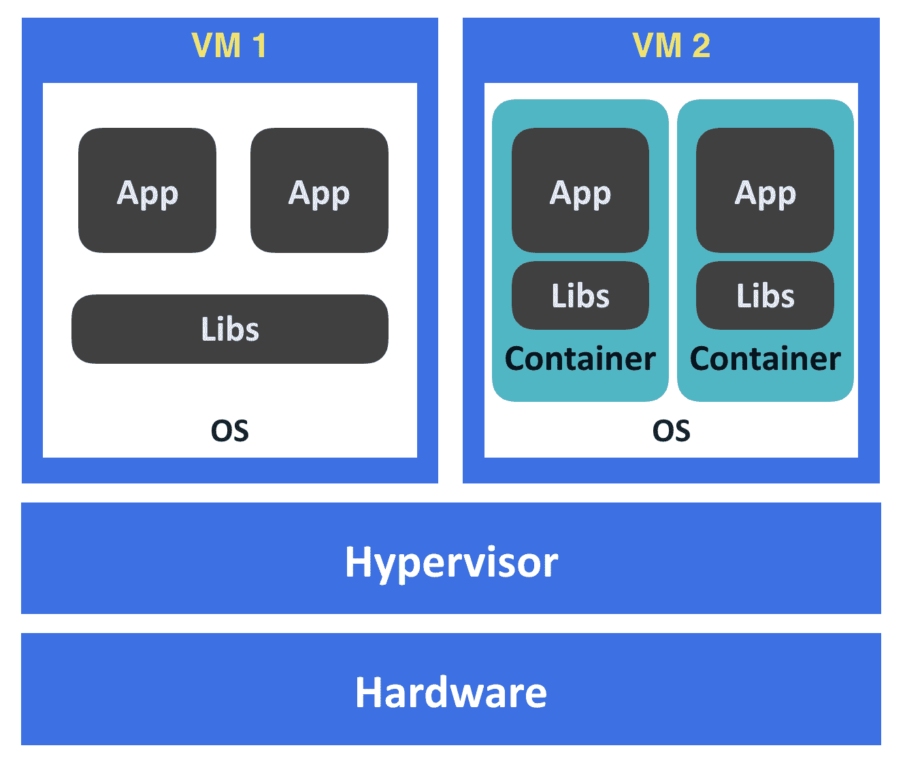
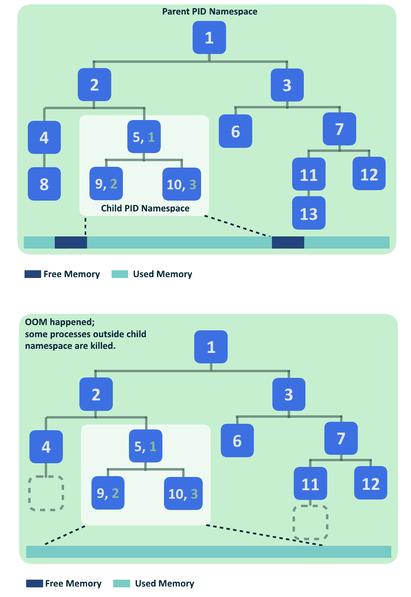
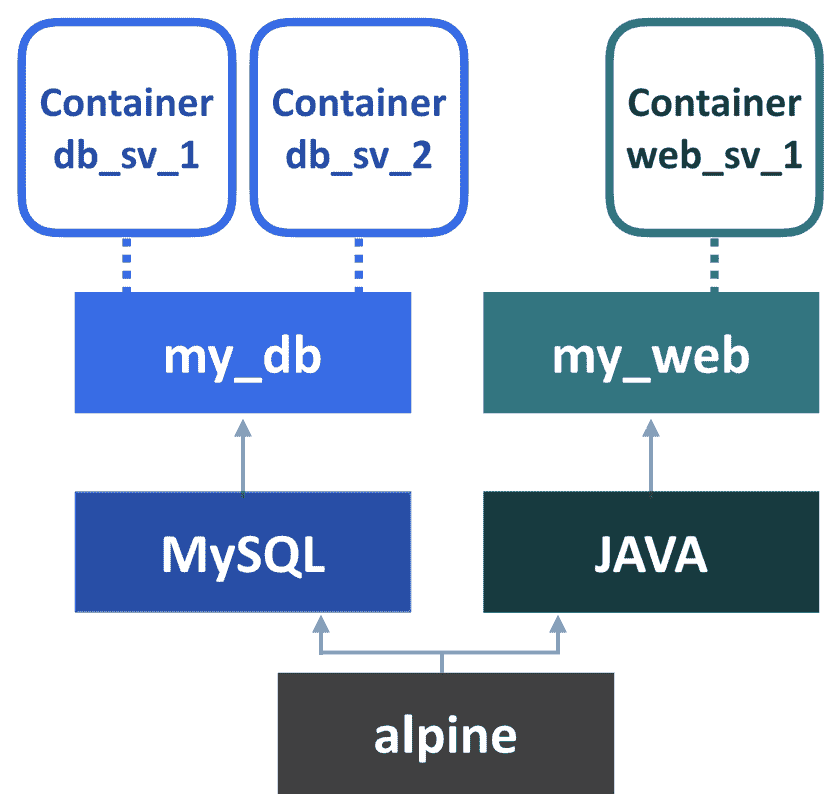
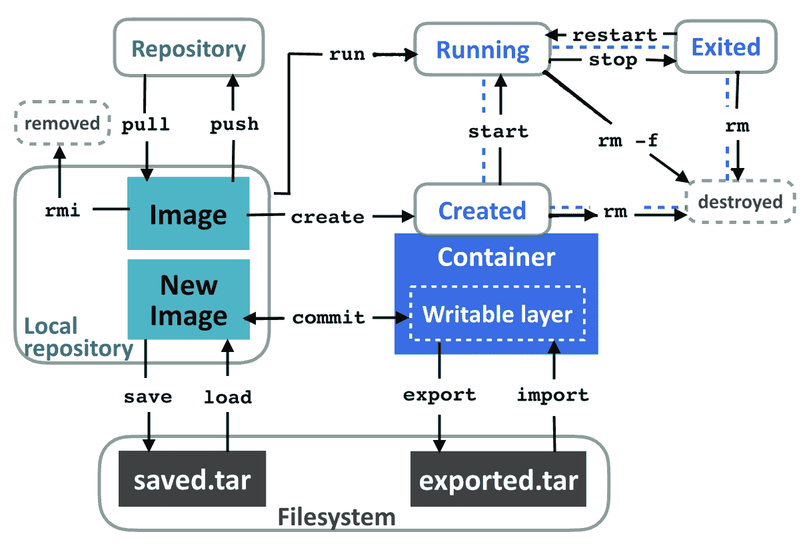
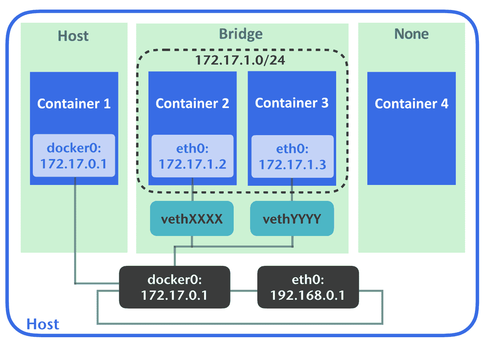
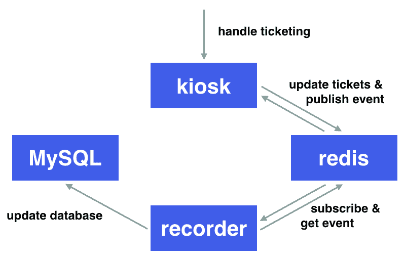

# 第二章：使用容器进行 DevOps

我们现在熟悉了各种各样的 DevOps 工具，这些工具可以帮助我们自动化任务，并在应用程序交付过程中管理配置。然而，随着应用程序变得比以往更加多样化，挑战仍然存在。在本章中，我们将增加工具箱中的另一项技能：容器。特别是，我们将讨论**Docker 容器**。通过这样做，我们将努力理解以下内容：

+   与容器相关的关键概念

+   运行 Docker 应用程序

+   使用 Dockerfile 构建 Docker 应用程序

+   使用 Docker Compose 编排多个容器

# 理解容器

容器的一个关键特性是隔离。在本节中，我们将通过查看容器如何实现隔离以及这在软件开发生命周期中的重要性来建立对这一强大工具的适当理解。

# 资源隔离

当一个应用程序启动时，它消耗 CPU 时间，占用内存空间，链接到其依赖库，写入磁盘，传输数据包，可能还会访问其他设备。它使用的所有资源都是一种资源，这些资源由同一主机上的所有程序共享。为了提高资源利用效率，我们可以尝试在单台机器上运行尽可能多的应用程序。然而，即使我们只想运行两个应用程序，使每个应用程序在容器中有效运行的复杂性也会呈指数增长，更不用说处理大量应用程序和机器了。正因如此，将物理计算单元的资源分隔为独立的部分的想法很快成为行业中的范例。

你可能听说过**虚拟机**（**VMs**）、BSD jails、Solaris 容器、Linux 容器、Docker 等术语。所有这些技术都向我们承诺类似的隔离概念，但使用的机制基本上是不同的，因此实际的隔离级别也不同。例如，VM 的实现涉及使用虚拟化技术完全虚拟化硬件层，并通过一个虚拟机监控程序来管理。如果你想在 VM 上运行一个应用程序，你必须从一个完整的操作系统开始。换句话说，资源在运行在同一个虚拟化管理程序下的客户操作系统之间是隔离的。相比之下，Linux 和 Docker 容器是基于 Linux 原生技术构建的，这意味着它们只能在具有这些功能的操作系统上运行。BSD jails 和 Solaris 容器也以类似的方式工作，但在其他操作系统上。下图说明了 Linux 容器与 VM 之间的隔离关系。容器通过操作系统层实现应用程序的隔离，而基于 VM 的隔离则是由底层的虚拟化管理程序或主机操作系统实现的：



# Linux 容器

一个 Linux 容器由多个构建模块组成，其中最重要的两个是 **命名空间** 和 **控制组**（**cgroups**）。这两者都是 Linux 内核特性。命名空间提供了对某些系统资源的逻辑划分，例如挂载点（`mnt`）、进程 ID（`PID`）和网络（`net`）。为了更好地理解隔离的概念，我们来看看 `pid` 命名空间的一些简单示例。以下示例来自 Ubuntu 18.04.1 和 util-linux 2.31.1。

当我们在终端输入 `ps axf` 时，会看到一长串正在运行的进程：

```
$ ps axf
  PID TTY  STAT TIME COMMAND
    2 ?    S    0:00 [kthreadd]
    4 ?    I<   0:00 \_ [kworker/0:0H]
    5 ?    I    0:00 \_ [kworker/u2:0]
    6 ?    I<   0:00 \_ [mm_percpu_wq]
    7 ?    S    0:00 \_ [ksoftirqd/0]
...
```

`ps` 是一个用于报告系统当前进程的工具。`ps axf` 提供了一个包含所有进程的树状列表。

现在让我们使用 `unshare` 进入一个新的 `pid` 命名空间，`unshare` 能够将进程资源逐步分离到一个新的命名空间中。接下来，我们再检查一下进程：

```
$ sudo unshare --fork --pid --mount-proc=/proc /bin/sh
# ps axf
  PID TTY      STAT   TIME COMMAND
    1 pts/0    S      0:00 /bin/sh
    2 pts/0    R+     0:00 ps axf
```

你会发现新命名空间中 shell 进程的 `pid` 变成了 `1`，所有其他进程都消失了。这意味着你已经成功创建了一个 `pid` 容器。接下来，让我们切换到命名空间外的另一个会话，再次列出进程：

```
$ ps axf ## from another terminal
  PID TTY    STAT TIME COMMAND
 ...
 1260 pts/0  Ss   0:00 \_ -bash
 1496 pts/0  S    0:00 | \_ sudo unshare --fork --pid --mount-proc=/proc /bin/sh
 1497 pts/0  S    0:00 | \_ unshare --fork --pid --mount-proc=/proc /bin/sh
 1498 pts/0  S+   0:00 | \_ /bin/sh
 1464 pts/1  Ss   0:00 \_ -bash
 ...
```

你仍然可以在新命名空间中看到其他进程和你的 shell 进程。由于 `pid` 命名空间的隔离，不同命名空间中的进程是无法相互看到的。然而，如果某个进程使用了大量的系统资源，比如内存，它可能会导致系统资源耗尽，进而变得不稳定。换句话说，一个隔离的进程仍然可能会干扰其他进程，甚至崩溃整个系统，如果我们没有对其资源使用进行限制的话。

下图展示了 `PID` 命名空间以及 **内存不足**（**OOM**）事件如何影响子命名空间外的其他进程。图中的编号方块是系统中的进程，数字是它们的 PID。带有两个数字的方块表示在子命名空间中创建的进程，其中第二个数字表示它们在子命名空间中的 PID。在图的上半部分，系统仍然有可用的空闲内存。然而，在图的下半部分，子命名空间中的进程耗尽了系统中的剩余内存。由于没有空闲内存，主机内核随后启动 OOM 杀手来释放内存，受害者通常是子命名空间外的进程。这里的示例中，系统中的进程 **8** 和 **13** 被杀死：



鉴于此，`cgroups` 在此被用于限制资源的使用。与命名空间类似，它可以对不同种类的系统资源施加约束。接下来我们继续从 `pid` 命名空间出发，通过 `yes > /dev/null` 来生成一些 CPU 负载，然后使用 `top` 监控它：

```
## in the container terminal
# yes > /dev/null & top PID USER PR  NI   VIRT  RES  SHR S %CPU %MEM    TIME+ COMMAND
  2 root 20   0   7468  788  724 R 99.7  0.1  0:15.14 yes
  1 root 20   0   4628  780  712 S  0.0  0.1  0:00.00 sh
  3 root 20   0  41656 3656 3188 R  0.0  0.4  0:00.00 top 
```

我们的 CPU 负载达到了 100%，正如预期的那样。现在让我们通过 `cgroup` CPU 来限制它。`cgroups` 被组织为 `/sys/fs/cgroup/` 下的文件夹。首先，我们需要切换到宿主机会话：

```
## on the host session
$ ls /sys/fs/cgroup
blkio  cpu  cpuacct  cpu,cpuacct  cpuset  devices  freezer  hugetlb  memory  net_cls  net_cls,net_prio  net_prio  perf_event  pids  rdma  systemd  unified 
```

每个文件夹代表它所控制的资源。创建一个 `cgroup` 并用它来控制进程非常容易：只需在资源类型下创建一个任意名称的文件夹，并将您想要控制的进程 ID 添加到 `tasks` 中。这里，我们希望限制 `yes` 进程的 CPU 使用率，因此在 `cpu` 下创建一个新文件夹，并找出 `yes` 进程的 `PID`：

```
## also on the host terminal
$ ps ax | grep yes | grep -v grep
 1658 pts/0    R      0:42 yes
$ sudo mkdir /sys/fs/cgroup/cpu/box && \
  echo 1658 | sudo tee /sys/fs/cgroup/cpu/box/tasks > /dev/null
```

我们刚刚将 `yes` 加入了新创建的 `box` CPU 组，但策略仍未设置，进程仍然没有任何限制地运行。通过将所需的数字写入相应的文件来设置限制，然后再次检查 CPU 使用情况：

```
$ echo 50000 | sudo tee /sys/fs/cgroup/cpu/box/cpu.cfs_quota_us > /dev/null

## go back to namespaced terminal, check stats with topPID USER PR  NI   VIRT  RES  SHR S %CPU %MEM    TIME+ COMMAND
  2 root 20  0    7468  748  684 R 50.3  0.1 6:43.68  yes
  1 root 20  0    4628  784  716 S  0.0  0.1 0:00.00  sh
  3 root 20  0   41656 3636 3164 R  0.0  0.4 0:00.08  top 
```

CPU 使用率显著降低，这意味着我们的 CPU 限制工作正常。

前两个例子阐明了 Linux 容器如何隔离系统资源。通过在应用程序中加入更多的限制，我们可以构建一个完全隔离的盒子，包括文件系统和网络，而无需在其中封装操作系统。

# 容器化交付

运行应用程序的通常方式包括以下步骤：

1.  配置机器和相应的基础设施资源

1.  安装操作系统

1.  安装系统程序和应用程序依赖项

1.  部署应用程序

1.  维护应用程序的运行状态

整个过程繁琐而复杂，这也是为什么我们通常不希望手动进行。**配置管理工具**，在第一章《DevOps 简介》中介绍，旨在消除交付过程中大部分的劳动。其模块化和基于代码的配置设计能够有效工作，直到应用程序栈变得复杂和多样。维护庞大的配置库是困难的，尤其是当它是包含各种 hack 的遗留配置时。尽管使用配置管理工具更改配置代码会直接影响生产环境，但配置代码通常比应用程序代码更少受到关注。每当我们想要更新已安装的包时，就必须处理系统和应用程序包之间错综复杂且脆弱的依赖关系。升级与之无关的包时，一些应用程序意外崩溃并不罕见。此外，升级配置管理工具本身也是一项具有挑战性的任务。

为了解决这个问题，推出了使用预先构建的虚拟机镜像进行不可变部署。这意味着每当我们对系统或应用程序包进行更新时，我们将根据更改构建完整的虚拟机镜像并进行部署。这减少了一些复杂性，因为我们可以在推出之前测试更改，并且能够为无法共享相同环境的应用程序定制运行时。然而，使用虚拟机镜像进行不可变部署是昂贵的。启动、分发和运行臃肿的虚拟机镜像的开销远大于部署软件包。

这里的容器是一个与部署需求完美契合的拼图块。容器的表现形式可以在版本控制系统（VCS）中进行管理并构建为一个 Blob 镜像，这个镜像也可以不可变地部署。这使得开发人员能够抽象化实际资源，基础设施工程师则可以避免依赖地狱。此外，由于我们只需要打包应用程序本身及其依赖库，因此其镜像大小会比虚拟机的镜像小得多。因此，分发容器镜像比分发虚拟机镜像更加经济。此外，我们已经知道，在容器内运行一个进程与在其 Linux 主机上运行几乎没有区别，因此几乎不会产生任何开销。总而言之，容器是轻量级的、自包含的，并且几乎不可变的。这为应用程序与基础设施之间的责任区分提供了明确的界限。

由于 Linux 容器共享相同的内核，因此容器运行在其上的时候，内核仍然存在潜在的安全风险。为了解决这个问题，一种新兴的趋势是使虚拟机（VM）的运行像操作系统容器一样简单高效，例如基于**unikernel**的解决方案或**Kata 容器**。另一种方法是插入一个中介层，将应用程序与宿主内核分隔开来，例如**gVisor**。

# 容器入门

有许多成熟的容器引擎，例如**Docker**（[`www.docker.com`](https://www.docker.com)）或**rkt**（[`coreos.com/rkt`](https://coreos.com/rkt)），它们已经实现了用于生产环境的功能，因此你不需要从头开始构建自己的容器。此外，由容容器行业领导者组成的**开放容器倡议**（[`www.opencontainers.org`](https://www.opencontainers.org)）已经对容器规范进行了标准化。任何标准的实现，无论底层平台如何，都应具有类似的属性，因为 OCI 旨在提供跨各种操作系统使用容器的无缝体验。事实上，Docker 的核心是**containerd**，它是一个兼容 OCI 的运行时，可以在没有 Docker 的情况下使用。本书中，我们将使用 Docker（社区版）容器引擎来构建我们的容器化应用程序。

# 为 Ubuntu 安装 Docker

Docker 需要 64 位版本的 Bionic 18.04 LTS、Artful 17.10、Xenial 16.04 LTS 或 Trusty 14.04 LTS。你可以通过`apt-get install docker.io`来安装 Docker，但其更新通常比 Docker 官方仓库慢。

以下是来自 Docker 的安装步骤（[`docs.docker.com/install/linux/docker-ce/ubuntu/`](https://docs.docker.com/install/linux/docker-ce/ubuntu/#install-using-the-repository)）：

1.  确保你已安装允许`apt`使用仓库的包；如果没有，可以使用以下命令获取它们：

```
$ sudo apt-get update && sudo apt-get install -y apt-transport-https ca-certificates curl software-properties-common 
```

1.  添加 Docker 的`gpg`密钥并验证其指纹是否与`9DC8 5822 9FC7 DD38 854A E2D8 8D81 803C 0EBF CD88`匹配：

```
$ curl -fsSL https://download.docker.com/linux/ubuntu/gpg | sudo apt-key add -
$ sudo apt-key fingerprint 0EBFCD88 
```

1.  设置`amd64`架构的仓库：

```
$ sudo add-apt-repository "deb [arch=amd64] https://download.docker.com/linux/ubuntu $(lsb_release -cs) stable" 
```

1.  更新包索引并安装 Docker CE：

```
 $ sudo apt-get update && sudo apt-get install docker-ce
```

# 为 CentOS 安装 Docker

运行 Docker 需要 64 位版本的 CentOS 7。你可以通过`sudo yum install docker`从 CentOS 的仓库获取 Docker 包，但这可能是旧版本。再次，Docker 官方指南中的安装步骤如下：[`docs.docker.com/install/linux/docker-ce/centos/`](https://docs.docker.com/install/linux/docker-ce/centos/#install-using-the-repository)。

1.  安装工具以使`yum`能够使用额外的仓库：

```
$ sudo yum install -y yum-utils 
```

1.  设置 Docker 的仓库：

```
$ sudo yum-config-manager --add-repo https://download.docker.com/linux/centos/docker-ce.repo 
```

1.  安装 Docker CE 并启动。如果提示密钥验证，确保它与`060A 61C5 1B55 8A7F 742B 77AA C52F EB6B 621E 9F35`匹配：

```
$ sudo yum install docker-ce
$ sudo systemctl start docker
```

# 为 macOS 安装 Docker

Docker 将一个微型 Linux 与虚拟机管理框架结合，在 macOS 上构建本地应用程序，这意味着我们不需要第三方虚拟化工具就能在 Mac 上使用 Docker。为了受益于虚拟机管理框架，必须将 macOS 升级到 10.10.3 或更高版本：

1.  下载 Docker 包并安装：[`download.docker.com/mac/stable/Docker.dmg`](https://download.docker.com/mac/stable/Docker.dmg)。

Docker for Windows 也不需要任何第三方工具。可以在以下链接查找安装指南：[`docs.docker.com/docker-for-windows/install`](https://docs.docker.com/docker-for-windows/install)。

1.  你现在进入 Docker 环境。尝试创建并运行你的第一个 Docker 容器。如果你在 Linux 上，可以使用`sudo`运行命令：

```
$ docker run alpine ls
bin dev etc home lib media mnt proc root run sbin srv sys tmp usr var
```

1.  你会发现你现在在`root`目录下，而不是当前目录。让我们再次查看进程列表：

```
$ docker run alpine ps aux
PID   USER     TIME  COMMAND
    1 root      0:00 ps aux 
```

如预期的那样，它是隔离的。你现在已经准备好与容器一起工作了。

Alpine 是一个 Linux 发行版。由于其体积非常小，许多人使用它作为构建应用容器的基础镜像。然而需要注意的是，它与主流 Linux 发行版还是有一些差异。例如，Alpine 使用`musl libc`，而大多数发行版使用`glibc`。

# 容器的生命周期

使用容器不像我们习惯使用的大多数工具那样直观，因此我们需要改变工作方式。在本节中，我们将介绍如何使用 Docker，以便能够从容器中受益。

# Docker 基础知识

当执行`docker run alpine ls`时，Docker 会在后台执行以下步骤：

1.  它在本地查找`alpine`镜像。如果找不到，Docker 会尝试从公共 Docker 仓库中拉取并存储到本地镜像库。

1.  它提取镜像并相应地创建一个容器。

1.  它执行图像中定义的入口点命令，这些命令是图像名称后的参数。在此示例中，参数是`ls`。默认情况下，Linux 基础的 Docker 上的入口点是`/bin/sh -c`。

1.  当入口点进程完成时，容器会退出。

镜像是一个不可变的代码、库、配置等的捆绑包，包含了我们想要放入其中的所有内容。容器是镜像的一个实例，它在运行时执行。你可以使用`docker inspect IMAGE`和`docker inspect CONTAINER`命令查看镜像和容器之间的区别。

使用`docker run`启动的任何内容都会占据前台；`-d`选项（`--detach`）允许我们以分离模式运行容器。有时候，我们可能需要进入一个活动的容器，检查其中的镜像或更新某些内容。为此，我们可以使用`-i`和`-t`选项（`--interactive`和`--tty`）。如果我们想与一个分离的容器进行交互，我们可以使用`exec`和`attach`命令：`exec`命令允许我们在运行中的容器内运行进程，而`attach`命令则按字面意义工作。以下示例演示了如何使用这些命令：

```
$ docker run busybox /bin/sh -c "while :;do echo 'meow~';sleep 1;done"
meow~
meow~
...
```

现在你的终端应该充满了`meow~`。切换到另一个终端并运行`docker ps`，这是一个获取容器状态的命令，用来查找容器的名称和 ID。在这里，名称和 ID 都是由 Docker 生成的，你可以使用其中任何一个来访问容器：

```
$ docker ps
CONTAINER ID    IMAGE    (omitted)  STATUS       PORTS   NAMES
d51972e5fc8c    busybox     ...     Up 3 seconds         agitated_banach

$ docker exec -it d51972e5fc8c /bin/sh
/ # ps
PID   USER     TIME   COMMAND
 1 root      0:00 /bin/sh -c while :;do echo 'meow~';sleep 1;done
   19 root      0:00 /bin/sh
   30 root      0:00 sleep 1
   31 root      0:00 ps
/ # kill -s 2 1
## container terminated 
```

为了方便起见，可以在`create`或`run`时使用`--name`标志指定容器的名称。

一旦我们访问容器并检查其进程，我们会看到两个 shell：一个在发出 `meow~`，另一个是我们所在的位置。使用`kill -s 2 1`命令终止容器内的第一个 shell，我们会看到整个容器停止，因为入口点进程已经退出。最后，我们使用`docker ps -a`列出已停止的容器，并通过`docker rm CONTAINER_NAME`或`docker rm CONTAINER_ID`清理它们：

```
$ docker ps -a
CONTAINER ID     IMAGE    (omitted)  STATUS       PORTS   NAMES
d51972e5fc8c     busybox     ...     Exited (130)         agitated_banach
$ docker rm d51972e5fc8c ## "agitated_banach" also works
d51972e5fc8c
$ docker ps -a
CONTAINER ID     IMAGE    (omitted)  STATUS       PORTS   NAMES
## nothing left now
```

从 Docker 1.13 开始，`docker system prune`命令被引入，帮助我们轻松清理已停止的容器和占用的资源。

`PID 1`进程在类 UNIX 操作系统中非常特殊。无论它是什么类型的进程，它都应该回收已退出的子进程，并且不能接收`SIGKILL`信号。这就是为什么前面的例子使用了`SIGINT`（2）而不是`SIGKILL`的原因。此外，容器中的大多数入口进程并不处理已终止的子进程，这可能会导致系统中出现大量未回收的僵尸进程。如果需要在没有 Kubernetes 的情况下运行 Docker 容器到生产环境，可以在`docker run`时使用`--init`标志。这样会在容器中注入一个`PID 1`进程，它能够正确处理已终止的子进程。

# 层、镜像、容器和数据卷

我们知道镜像是不可变的，容器是短暂的，并且我们知道如何将镜像作为容器运行。然而，我们仍然缺少一些关于如何打包镜像的信息。

镜像是一个只读的堆栈，由一个或多个层组成，而层是文件系统中的文件和目录集合。为了提高磁盘空间的利用率，层不仅限于一个镜像，而是可以在多个镜像之间共享，这意味着 Docker 只会在本地存储一份基础镜像的副本，无论从它衍生出多少镜像。你可以使用`docker history [image]`命令来了解一个镜像是如何构建的。例如，如果你用`docker history alpine`检查 Alpine，你会发现它只有一层。

每当创建一个容器时，它会在基础镜像上添加一个薄的、可写的层。Docker 在这个薄层上采用**写时复制**（**Copy-On-Write, COW**）策略。这意味着容器会读取基础镜像中存储目标文件的层，如果文件被修改，它就将文件复制到自己可写的层中。这种方式防止了从同一镜像创建的容器相互干扰。`docker diff [CONTAINER]`命令显示容器与其基础镜像在文件系统状态上的差异。例如，如果基础镜像中的`/etc/hosts`被修改，Docker 会将该文件复制到可写层中，并且它将成为`docker diff`输出中的唯一文件。

以下图示展示了 Docker 镜像的层级结构：



需要注意的是，可写层中的数据会随着容器的删除而被删除。为了持久化数据，你可以通过`docker commit [CONTAINER]`命令将容器层提交为一个新镜像，或者将数据卷挂载到容器中。

数据卷允许容器执行读写操作，绕过 Docker 的文件系统。它可以位于主机的目录中，也可以位于其他存储介质中，如 Ceph 或 GlusterFS。因此，任何针对卷的磁盘 I/O 操作都可以根据底层存储以原生速度运行。由于数据在容器之外是持久化的，因此可以被多个容器复用和共享。挂载卷是通过在`docker run`或`docker create`命令中指定`-v`（`--volume`）标志来完成的。以下示例将在容器的`/chest`目录下挂载一个卷，并在其中留下一个文件。之后，我们使用`docker inspect`定位数据卷：

```
$ docker run --name demo -v /chest alpine touch /chest/coins
$ docker inspect demo ## or filter outputs with --format '{{json .Mounts}}'
... "Mounts": [
    {
        "Type": "volume",
        "Name":"(hash-digits)",
        "Source": "/var/lib/docker/volumes/(hash-digits)/_data",
        "Destination": "/chest",
        "Driver": "local",
        "Mode": "",
        "RW": true,
        "Propagation": ""
    }
],
...
$ ls /var/lib/docker/volumes/(hash-digits)/_data
coins
```

Docker CE 在 macOS 上提供的微型 Linux 的默认`tty`路径可以在以下位置找到：

`~/Library/Containers/com.docker.docker/Data/com.docker.driver.amd64-linux/tty`。

你可以使用`screen`附加到它。

数据卷的一个使用场景是容器之间共享数据。为此，我们首先创建一个容器并在其上挂载卷，然后在启动其他容器时通过`--volumes-from`标志引用该卷。以下示例创建一个带有数据卷`/share-vol`的容器，容器 A 可以将文件放入该卷，容器 B 可以读取它：

```
$ docker create --name box -v /share-vol alpine nop
7ed7c0c4426df53275c0e41798923121093b67d41bec17d50756250508f7b897
$ docker run --name AA --volumes-from box alpine touch /share-vol/wine
$ docker run --name BB --volumes-from box alpine ls /share-vol
wine
```

此外，数据卷可以挂载到指定的`host`路径下，当然其中的数据是持久化的：

```
$ docker run --name hi -v $(pwd)/host/dir:/data alpine touch /data/hi
$ docker rm hi
$ ls $(pwd)/host/dir
hi
```

# 分发镜像

注册表是一个存储、管理和分发镜像的服务。公共服务，如 Docker Hub（[`hub.docker.com`](https://hub.docker.com)）和 Quay（[`quay.io`](https://quay.io)），收集了各种流行工具的预构建镜像，如 Ubuntu、`nginx`，以及其他开发者的自定义镜像。我们已经使用过多次的 Alpine Linux 工具实际上是从 Docker Hub（[`hub.docker.com/_/alpine`](https://hub.docker.com/_/alpine)）拉取的。你也可以将自己的工具上传到这些服务，并与其他人共享。

如果你需要一个私有注册表，但由于某些原因不想订阅注册服务提供商的付费计划，你始终可以自己搭建一个 Docker Registry（[`hub.docker.com/_/registry`](https://hub.docker.com/_/registry)）。其他流行的注册服务提供商包括 Harbor（[`goharbor.io/`](https://goharbor.io/)）和 Portus（[`port.us.org/`](http://port.us.org/)）。

在配置容器之前，Docker 会尝试根据镜像名称中指定的规则来定位指定的镜像。镜像名称由三个部分组成，`[registry/]name[:tag]`，并且会按以下规则解析：

+   如果省略了`registry`字段，Docker 会在 Docker Hub 上搜索该名称。

+   如果`registry`字段是一个注册服务器，Docker 会在该服务器上搜索名称。

+   一个名称中可以包含多个斜杠。

+   如果省略标签，默认标签为`latest`。

例如，像 `gcr.io/google-containers/guestbook:v3` 这样的图像名称指示 Docker 从 `gcr.io` 下载 `google-containers/guestbook` 的 `v3` 版本。同样，如果你想将图像推送到注册表，请以相同方式标记图像并使用 `docker push [IMAGE]` 推送它。要列出你当前在本地拥有的图像，可以使用 `docker images`。你可以使用 `docker rmi [IMAGE]` 删除一个图像。以下示例展示了如何在不同的注册表之间操作：从 Docker Hub 下载一个 `nginx` 图像，将其标记为私有注册表路径，并相应地推送。私有注册表是通过 `docker run -p 5000:5000 registry` 在本地托管的。

这里，我们使用前面提到的注册表和最基本的设置。有关部署的更详细指南，请参阅以下链接：[`docs.docker.com/registry/deploying/`](https://docs.docker.com/registry/deploying/)。

请注意，尽管默认标签是 `latest`，但你必须显式地对其进行标签和 `push`：

```
$ docker pull nginx
Using default tag: latest
latest: Pulling from library/nginx
802b00ed6f79: Pull complete
...
Status: Downloaded newer image for nginx:latest

$ docker tag nginx localhost:5000/comps/prod/nginx:1.15
$ docker push localhost:5000/comps/prod/nginx:1.15
The push refers to repository [localhost:5000/comps/prod/nginx]
...
8b15606a9e3e: Pushed
1.15: digest: sha256:(64-digits-hash) size: 948
$ docker tag nginx localhost:5000/comps/prod/nginx
$ docker push localhost:5000/comps/prod/nginx
The push refers to repository [localhost:5000/comps/prod/nginx]
...
8b15606a9e3e: Layer already exists
latest: digest: sha256:(64-digits-hash) size: 948
```

大多数注册表服务在你推送图像时都会要求认证。`docker login` 就是为此目的设计的。对于一些较旧版本的 Docker，当你尝试拉取图像时，即使图像路径有效，你有时也会收到 `image not found` 错误。这通常意味着你没有权限访问存储该图像的注册表。

除了通过注册表服务分发的图像外，还有将图像作为 TAR 存档导出并导入回本地仓库的选项：

+   `docker commit [CONTAINER]`：将容器层的更改提交到一个新的图像中

+   `docker save --output [filename] IMAGE1 IMAGE2 ...`：将一个或多个图像保存为 TAR 存档

+   `docker load -i [filename]`：将 TAR 图像加载到本地仓库

+   `docker export --output [filename] [CONTAINER]`：将容器的文件系统导出为 TAR 存档

+   `docker import --output [filename] IMAGE1 IMAGE2`：导入导出的 TAR 存档

`commit`、`save` 和 `export` 命令看起来非常相似。主要区别在于，保存的图像即使最终会被删除，仍然会保留层与层之间的文件。而导出的图像则会将所有中间层压缩成一个最终层。另一个区别是，保存的图像会保留元数据，如层历史记录，但导出的图像没有这些信息。因此，导出的图像通常较小。

下图描述了容器与图像之间状态的关系。箭头上的说明是相应的 Docker 子命令：



容器技术与操作系统功能紧密绑定，这意味着为一个平台构建的镜像无法在另一个平台上运行，除非在目标平台上重新编译新的镜像。为了简化这一过程，Docker 引入了镜像清单（Image Manifest），支持多架构构建。我们在本书中不会进一步讨论多架构构建，但你可以通过以下链接找到更多信息：[`docs.docker.com/edge/engine/reference/commandline/manifest/`](https://docs.docker.com/edge/engine/reference/commandline/manifest/)。

# 连接容器

Docker 提供了三种网络来管理容器与主机之间的通信，分别是 `bridge`、`host` 和 `none`：

```
$ docker network ls
NETWORK ID          NAME                DRIVER              SCOPE
8bb41db6b13e        bridge              bridge              local
4705332cb39e        host                host                local
75ab6cbbbbac        none                null                local
```

默认情况下，每个容器在创建时都会连接到桥接网络。在这种模式下，每个容器都会分配一个虚拟接口和一个私有 IP 地址，所有通过该接口的流量会桥接到主机的 `docker0` 接口。位于同一桥接网络中的容器也可以通过 IP 地址相互连接。让我们运行一个容器，通过 `5000` 端口发送一条简短消息，并观察其配置。`--expose` 标志会将指定端口暴露给容器外部：

```
$ docker run --name greeter -d --expose 5000 busybox \
  /bin/sh -c "echo Welcome stranger! | nc -lp 5000"
841138a693d220c92b8634adf97426559fd0ae622e94ac4ee9f295ab088833f5 
$ docker exec greeter ifconfig
eth0      Link encap:Ethernet  HWaddr 02:42:AC:11:00:02
          inet addr:172.17.0.2  Bcast:172.17.255.255  Mask:255.255.0.0
...
```

这里，`greeter` 容器被分配到 IP 地址 `172.17.0.2`。现在，运行另一个容器，通过这个 IP 地址连接它：

```
$ docker run -t busybox telnet 172.17.0.2 5000
Welcome stranger!
Connection closed by foreign host
```

`docker network inspect bridge` 命令提供了配置详情，比如已连接的容器、子网段和网关信息。

你可以将一些容器分组到一个用户定义的桥接网络中。这是连接单个主机上多个容器的推荐方式。用户定义的桥接网络与默认网络略有不同，主要的区别是你可以通过容器的名称而不是 IP 地址来访问容器。创建网络可以使用 `docker network create [NW-NAME]` 命令，我们可以通过在创建时添加 `--network [NW-NAME]` 标志将容器连接到该网络。容器的网络名称默认为其名称，但也可以通过 `--network-alias` 标志为其指定其他别名：

```
## create a network called "room"
$ docker network create room
a59c7fda2e636e2f6d8af5918c9cf137ca9f09892746f4e072acd490c00c5e99
## run a container with the name "sleeper" and an alias "dad" in the room
$ docker run -d --network room \
                --network-alias dad --name sleeper busybox sleep 60
56397917ccb96ccf3ded54d79e1198e43c41b6ed58b649db12e7b2ee06a69b79
## ping the container with its name "sleeper" from another container
$ docker run --network room busybox ping -c 1 sleeper
PING sleeper (172.18.0.2): 56 data bytes
64 bytes from 172.19.0.2: seq=0 ttl=64 time=0.087 ms

--- sleeper ping statistics ---
1 packets transmitted, 1 packets received, 0% packet loss
round-trip min/avg/max = 0.087/0.087/0.087 ms
## ping the container with its alias "dad", it also works
$ docker run --network room alpine ping -c 1 dad
PING dad (172.18.0.2): 56 data bytes
...
```

`host` 网络如其名所示，每个连接的容器共享主机的网络，但同时失去了隔离特性。`none` 网络是一个逻辑上与外界隔绝的盒子。无论是进入流量还是出去流量，所有的流量都被隔离在容器内，因为容器没有附加任何网络接口。在这里，我们将一个监听 `5000` 端口的容器连接到 `host` 网络，并与其进行本地通信：

```
$ docker run -d --expose 5000 --network host busybox \
  /bin/sh -c "echo im a container | nc -lp 5000"
a6918174c06f8f3f485913863ed69d4ae838fb550d9f4d66e24ef91534c76b3a
$ telnet localhost 5000
im a container
Connection closed by foreign host
```

如果你使用的是 Docker CE for macOS，主机是运行在虚拟化框架上的微型 Linux。

主机与三种网络模式之间的交互如下图所示。`host` 和 `bridge` 网络中的容器连接了适当的网络接口，并与同一网络中的容器以及外部世界进行通信，但 `none` 网络与主机接口保持隔离：



除了共享主机网络外，`-p(--publish) [host]:[container]` 标志在创建容器时还允许你将主机端口映射到容器端口。我们不需要同时附加 `--expose` 标志与 `--publish` 标志，因为无论如何你都需要打开容器的端口。以下命令将在端口 `80` 启动一个简单的 HTTP 服务器，你也可以用浏览器查看它：

```
$ docker run -p 80:5000 busybox /bin/sh -c \
  "while :; do echo -e 'HTTP/1.1 200 OK\n\ngood day'|nc -lp 5000; done"
$ curl localhost
good day
```

# 使用 Dockerfile

在构建镜像时，无论是使用 `docker commit` 还是 `export`，以可管理的方式优化构建结果都是一个挑战，更不用说将其与 CI/CD 流水线集成了。`Dockerfile` 以代码的形式表示构建任务，这大大减少了构建任务的难度。在这一部分，我们将描述如何将 Docker 命令映射到 `Dockerfile`，并朝着优化它的方向迈出一步。

# 编写你的第一个 Dockerfile

`Dockerfile` 由一系列文本指令组成，指导 Docker 守护进程形成一个镜像，`Dockerfile` 必须以 `FROM` 指令开始。例如，我们可能会从以下一行命令构建镜像：

```
docker commit $(                         \
  docker start $(                        \
    docker create alpine /bin/sh -c      \
      "echo My custom build > /etc/motd" \
))
```

这大致相当于以下的 `Dockerfile`：

```
FROM alpine
RUN echo "My custom build" > /etc/motd 
```

显然，使用 `Dockerfile` 构建要更加简洁和精确。

`docker build [OPTIONS] [CONTEXT]` 命令是唯一与构建任务相关的命令。上下文可以是本地路径、URL 或 `stdin`，表示 `Dockerfile` 的位置。一旦触发构建，`Dockerfile` 以及上下文中的所有内容都会提前发送到 Docker 守护进程，然后守护进程将按顺序执行 `Dockerfile` 中的指令。每次执行指令都会生成一个新的缓存层，随后的指令将在新的缓存层上执行。由于上下文会被发送到一个不一定是本地路径的地方，且发送太多不相关的文件会浪费时间，因此最好将 `Dockerfile`、代码、必要的文件和 `.dockerignore` 文件放在一个 `empty` 文件夹中，以确保最终生成的镜像只包含所需的文件。

`.dockerignore` 文件是一个列表，指示在构建时可以忽略同一目录下哪些文件。它通常如下所示：

```
$ cat .dockerignore
# ignore .dockerignore, .git
.dockerignore
.git
# exclude all *.tmp files and vim swp file recursively
**/*.tmp
**/[._]*.s[a-w][a-z]
# exclude all markdown files except README*.md
!README*.md 
```

通常，`docker build` 会尝试在上下文中找到一个名为 `Dockerfile` 的文件来开始构建。然而，有时我们可能希望给它一个不同的名字，可以使用 `-f` (`--file`) 标志来指定。另一个有用的标志是 `-t` (`--tag`)，它可以在镜像构建完成后为镜像添加一个或多个仓库标签。假设我们想在 `./deploy` 目录下构建一个名为 `builder.dck` 的 `Dockerfile` 并标记当前日期和最新标签，命令如下：

```
## We can assign the image with more than one tag within a build command
$ docker build -f deploy/builder.dck               \
   -t my-reg.com/prod/teabreaker:$(date +"%g%m%d") \
   -t my-reg.com/prod/teabreaker:latest .
```

# Dockerfile 的语法

`Dockerfile` 的构建模块由十几个指令组成。它们中的大多数由 `docker run/create` 标志的功能组成。让我们来看看其中最重要的几个：

+   `FROM <IMAGE>[:TAG|[@DIGEST]]`：这是告诉 Docker 守护进程当前 `Dockerfile` 所基于的镜像。这也是唯一必须出现在 `Dockerfile` 中的指令；你可以有一个只包含这一行的 `Dockerfile`。与所有其他与镜像相关的命令一样，如果没有指定标签，则默认为最新版本。

+   `RUN`：

```
 RUN <commands>
 RUN ["executable", "params", "more params"]
```

`RUN` 指令会在当前缓存层运行一行命令，并提交其结果。两种形式之间的主要区别在于命令的执行方式。第一种形式被称为 **shell 形式**，它实际上以 `/bin/sh -c <commands>` 形式执行命令。另一种形式是 **exec 形式**，它直接使用 `exec` 处理命令。

使用 shell 形式类似于编写 shell 脚本，因此通过 shell 操作符和行继续符来连接多个命令、条件测试或变量替换是完全有效的。然而，请记住，命令不是由 `bash` 处理的，而是由 `sh` 处理的。

`exec` 形式被解析为 JSON 数组，这意味着你必须用双引号将文本括起来，并转义保留字符。此外，由于该命令不会由任何 shell 处理，因此数组中的 shell 变量不会被评估。另一方面，如果基础镜像中不存在 shell，你仍然可以使用 `exec` 形式来调用可执行文件。

+   `CMD`：

```
CMD ["executable", "params", "more params"]
CMD ["param1","param2"]
CMD command param1 param2 ...
```

`CMD` 用于设置构建镜像的默认命令，但它不会在构建时运行该命令。如果在执行 `docker run` 时提供了参数，`CMD` 配置会被覆盖。`CMD` 的语法规则几乎与 `RUN` 相同；前两种形式是 `exec` 形式，第三种是 shell 形式，它会将 `/bin/sh -c` 作为前缀加到参数前。还有一个与 `CMD` 交互的 `ENTRYPOINT` 指令；当容器启动时，`ENTRYPOINT` 的参数会添加到三种 `CMD` 形式前面。在 `Dockerfile` 中可以有多个 `CMD` 指令，但只有最后一个会生效。

+   `ENTRYPOINT`：

```
 ENTRYPOINT ["executable", "param1", "param2"]
 ENTRYPOINT command param1 param2
```

这两种形式分别是`exec`形式和 shell 形式，语法规则与`RUN`相同。入口点是镜像的默认可执行文件。这意味着当容器启动时，它会运行由`ENTRYPOINT`配置的可执行文件。当`ENTRYPOINT`与`CMD`和`docker run`参数结合使用时，以不同的形式编写会导致截然不同的行为。以下是关于它们组合的规则：

+   如果`ENTRYPOINT`是以 shell 形式出现，则`CMD`和`docker run`的参数将被忽略。运行时命令将如下所示：

```
/bin/sh -c entry_cmd entry_params ...
```

+   如果`ENTRYPOINT`是`exec`形式且指定了`docker run`参数，则`CMD`命令会被覆盖。运行时命令将如下所示：

```
entry_cmd entry_params run_arguments
```

+   如果`ENTRYPOINT`是`exec`形式且只配置了`CMD`，则对于三种形式，运行时命令将变为以下内容：

```
entry_cmd entry_parms CMD_exec CMD_parms
entry_cmd entry_parms CMD_parms
entry_cmd entry_parms /bin/sh -c CMD_cmd CMD_parms
```

+   `ENV`：

```
 ENV key value
 ENV key1=value1 key2=value2 ...
```

`ENV`指令为随后的指令和构建的镜像设置环境变量。第一种形式将键设置为第一个空格后的字符串，包括特殊字符，但不包括行继续符。第二种形式允许我们在一行中设置多个变量，变量之间用空格分隔。如果值中包含空格，需用双引号括起来或转义空格字符。此外，使用`ENV`定义的键也会对同一文档中的变量生效。请参见以下示例以观察`ENV`的行为：

```
FROM alpine
# first form
ENV k1 wD # aw
# second form, line continuation character also works

ENV k2=v2 k3=v\ 3 \
    k4="v 4"
# ${k2} would be evaluated, so the key is "k_v2" in this case
ENV k_${k2}=$k3 k5=\"K\=da\"
# show the variables
RUN env | grep -Ev '(HOSTNAME|PATH|PWD|HOME|SHLVL)' | sort 
```

在`docker build`过程中，输出将如下所示：

```
...
 ---> Running in c5407972c5f5
k1=wD # aw
k2=v2
k3=v 3
k4=v 4
k5="K=da"
k_v2=v 3 ...
```

+   `ARG key[=<default value>]`：`ARG`指令可以通过`docker build`的`--build-arg`标志，将我们的参数作为环境变量传递到构建容器中。例如，使用`docker build --build-arg FLAGS=--static`构建以下文件，将导致最后一行出现`RUN ./build/dev/run --static`：

```
FROM alpine
ARG TARGET=dev
ARG FLAGS
RUN ./build/$TARGET/run $FLAGS
```

与`ENV`不同，每行只能分配一个参数。如果我们将`ARG`和`ENV`一起使用，则`ARG`的值（无论是通过`--build-arg`传递还是默认值）将被`ENV`的值覆盖。由于代理环境变量的频繁使用，默认情况下所有这些变量都支持作为参数，包括`HTTP_PROXY`、`http_proxy`、`HTTPS_PROXY`、`https_proxy`、`FTP_PROXY`、`ftp_proxy`、`NO_PROXY`和`no_proxy`。这意味着我们可以在不事先在`Dockerfile`中定义它们的情况下传递这些构建参数。需要注意的一点是，`ARG`的值将保留在构建机器的 shell 历史记录和镜像的 Docker 历史记录中，这意味着不建议通过`ARG`传递敏感数据：

+   `LABEL key1=value1 key2=value2 ...`：`LABEL`的使用类似于`ENV`，但标签仅存储在镜像的元数据部分，并由其他主机程序使用，而不是容器中的程序。例如，如果我们在镜像中附加了维护者信息，形式为`LABEL maintainer=johndoe@example.com`，则可以通过`-f(--filter)`标志在查询中筛选带有此标签的镜像：`docker images --filter label=maintainer=johndoe@example.com`。

+   `EXPOSE <port> [<port> ...]`：此指令与`docker run/create`中使用的`--expose`标志相同，暴露由结果镜像创建的容器中的端口。

+   `USER <name|uid>[:<group|gid>]`：`USER`指令切换到指定的用户，以执行随后的指令，包括`CMD`或`ENTRYPOINT`中的指令。但是，如果镜像中不存在该用户，则无法正常工作。如果要使用不存在的用户运行指令，必须在使用`USER`指令之前运行`adduser`。

+   `WORKDIR <path>`：此指令将工作目录设置为指定的路径。使用`ENV`设置的环境变量会在该路径上生效。如果路径不存在，系统会自动创建。它的工作方式类似于`Dockerfile`中的`cd`，可以接受相对路径和绝对路径，并且可以多次使用。如果在绝对路径后面跟着相对路径，则结果将相对于前一个路径。

```
WORKDIR /usr
WORKDIR src
WORKDIR app
RUN pwd
# run docker build
...
---> Running in 73aff3ae46ac
/usr/src/app
```

+   `COPY`:

```
 COPY [--chown=<user>:<group>] <src> ... <dest>
 COPY [--chown=<user>:<group>] ["<src>", ..., "<dest>"]
```

该指令将源文件复制到构建容器中的文件或目录中。源文件和目标路径可以是文件或目录。源路径必须位于上下文路径内，且不能被`.dockerignore`排除，因为只有这些文件会被发送到 Docker 守护进程。第二种形式适用于路径包含空格的情况。`--chown`标志使我们可以在运行时设置文件的所有者，而无需在容器内运行额外的`chown`步骤。它还接受数字的用户 ID 和组 ID：

+   `ADD`:

```
ADD [--chown=<user>:<group>] <src > ... <dest>
ADD [--chown=<user>:<group>] ["<src>", ..., "<dest>"]
```

`ADD`在功能上与`COPY`非常相似：它将文件移动到镜像中。主要的区别在于，`ADD`支持从远程地址下载文件并且可以在一行命令中解压容器中的压缩文件。因此，`<src>`也可以是一个 URL 或压缩文件。如果`<src>`是 URL，`ADD`会将其下载并复制到镜像中；如果`<src>`是被推断为压缩文件，`ADD`会将其解压到`<dest>`路径中：

+   `VOLUME`:

```
VOLUME mount_point_1 mount_point_2 ...
VOLUME ["mount point 1", "mount point 2", ...]
```

`VOLUME`指令在给定的挂载点创建数据卷。一旦在构建时声明，该数据卷在随后的指令中所做的任何更改都不会持久化。此外，由于可移植性问题，在`Dockerfile`或`docker build`中挂载主机目录不可行：无法保证指定的路径在主机上存在。这两种语法形式的效果是相同的，它们仅在语法解析上有所不同。第二种形式是 JSON 数组，因此像`\`这样的字符应该被转义。

+   `ONBUILD [Other directives]`：`ONBUILD`允许您将一些指令推迟到后续构建中的派生镜像中执行。例如，假设我们有以下两个 Dockerfile：

```
--- baseimg.dck ---
FROM alpine
RUN apk add --no-cache git make
WORKDIR /usr/src/app
ONBUILD COPY . /usr/src/app/
ONBUILD RUN git submodule init \
       && git submodule update \
       && make
--- appimg.dck ---
FROM baseimg
EXPOSE 80
CMD ["/usr/src/app/entry"]
```

当运行`docker build`时，指令将按以下顺序评估：

```
$ docker build -t baseimg -f baseimg.dck .
---
FROM alpine
RUN apk add --no-cache git make
WORKDIR /usr/src/app
---
$ docker build -t appimg -f appimg.dck .
---
COPY . /usr/src/app/
RUN git submodule init   \
 && git submodule update \
 && make
EXPOSE 80
CMD ["/usr/src/app/entry"]
```

# 组织`Dockerfile`

尽管编写`Dockerfile`基本上与编写构建脚本相同，但还有一些因素我们应考虑，以构建高效、安全和稳定的镜像。此外，`Dockerfile`本身也是一个文档。保持其可读性使得它更易于管理。

假设我们有一个应用堆栈，其中包括应用程序代码、数据库和缓存。我们堆栈的初始`Dockerfile`可能如下所示：

```
FROM ubuntu
ADD . /proj
RUN apt-get update
RUN apt-get upgrade -y
RUN apt-get install -y redis-server python python-pip mysql-server
ADD /proj/db/my.cnf /etc/mysql/my.cnf
ADD /proj/db/redis.conf /etc/redis/redis.conf
ADD https://example.com/otherteam/dep.tgz /tmp/
RUN -zxf /tmp/dep.tgz -C /usr/src
RUN pip install -r /proj/app/requirements.txt
RUN cd /proj/app ; python setup.py
CMD /proj/start-all-service.sh
```

第一个建议是确保一个容器专注于一件事情，这样我们的系统就能更透明，因为它帮助我们澄清系统中组件之间的边界。此外，我们不鼓励打包不必要的软件包，因为它会增加镜像的大小，这可能会减慢构建、分发和启动镜像所需的时间。我们将在起初的`Dockerfile`中移除`mysql`和`redis`的安装和配置。接下来，使用`ADD .`将代码移到容器中，这意味着我们很可能会将整个代码库移入容器中。通常情况下，有许多与应用程序无直接关系的文件，包括 VCS 文件、CI 服务器配置甚至构建缓存，我们可能不希望将它们打包到镜像中。因此，建议使用`.dockerignore`来过滤掉这些文件。最后，在一般情况下，优先使用`COPY`而不是`ADD`，除非我们希望在一步中提取一个文件。这是因为使用`COPY`时更容易预测结果。现在我们的`Dockerfile`更简单了，如下面的代码片段所示：

```
FROM ubuntu
ADD proj/app /app
RUN apt-get update
RUN apt-get upgrade -y
RUN apt-get install -y python python-pip
ADD https://example.com/otherteam/dep.tgz /tmp/
RUN tar -zxf /tmp/dep.tgz -C /usr/src
RUN pip install -r /app/requirements.txt
RUN cd /app ; python setup.py
CMD python app.py
```

在构建镜像时，Docker 引擎会尽可能地重用缓存层，这显著减少了构建时间。在我们的`Dockerfile`中，如果要安装的任何软件包需要更新，我们就必须进行所有更新和依赖安装过程。为了从构建缓存中受益，我们将根据一个经验法则重新排序指令：先运行较少频繁的指令。

此外，正如我们之前所描述的，对容器文件系统所做的任何更改都会生成一个新的镜像层。更具体来说，`ADD`、`RUN`和`COPY`会创建层。即使我们在后续的层中删除了某些文件，这些文件仍然占用镜像层，因为它们仍然存在于中间层中。因此，我们的下一步是通过将多个`RUN`指令压缩到一起并在`RUN`的最后清理未使用的文件，来最小化镜像层。此外，为了保持`Dockerfile`的可读性，我们倾向于使用行续符号`\`来格式化压缩后的`RUN`指令。尽管`ADD`可以从远程位置获取文件到镜像中，但这仍然不是一个好主意，因为这仍然会占用一个层来存储下载的文件。使用`RUN`和`wget/curl`下载文件更为常见。

除了处理 Docker 的构建机制外，我们还希望编写一个可维护的`Dockerfile`，使其更加清晰、可预测和稳定。以下是一些建议：

+   使用`WORKDIR`代替内联的`cd`，并为`WORKDIR`指定绝对路径

+   明确暴露所需的端口

+   为基础镜像指定标签

+   将软件包逐行分开并排序

+   使用`exec`形式来启动应用程序

前四个建议非常直接，旨在消除歧义。最后一个建议涉及到应用程序的终止方式。当 Docker 守护进程向正在运行的容器发送停止请求时，主进程（`PID 1`）将接收到停止信号（`SIGTERM`）。如果在一定时间内该进程没有停止，Docker 守护进程将发送另一个信号（`SIGKILL`）来强制杀死容器。`exec`形式和 shell 形式在这里有所不同。在 shell 形式中，`PID 1`进程是`/bin/sh -c`，而不是应用程序本身。此外，不同的 shell 处理信号的方式不同。有些会将停止信号转发给子进程，而有些则不会。Alpine Linux 中的 shell 就不会转发信号。因此，为了正确停止并清理我们的应用程序，推荐使用`exec`形式。

结合这些原则，我们得到了以下的`Dockerfile`：

```
FROM ubuntu:18.04

RUN apt-get update && apt-get upgrade -y \
 && apt-get install -y --no-install-recommends \
      curl \
      python3.6 \
      python-pip=9.* \
 && curl -SL https://example.com/otherteam/dep.tgz \
  | tar -zxC /usr/src \
 && rm -rf /var/lib/apt/lists/*

ENTRYPOINT ["python"]
CMD ["entry.py"]
EXPOSE 5000
WORKDIR /app
COPY requirements.txt .
RUN pip install -r requirements.txt
COPY . /app
```

我们可以遵循其他实践来优化我们的`Dockerfile`，包括使用专用的、更小的基础镜像，而不是通用的发行版，使用非`root`用户以提高安全性，以及在`RUN`命令中删除不必要的文件。

# 多阶段构建

到目前为止我们讨论的原则，都是关于如何加快构建速度、如何在保持 `Dockerfile` 可维护性的同时减少最终镜像的体积。与其努力优化一个 `Dockerfile`，不如写一个用来构建所需制品的 `Dockerfile`，然后将它们移到另一个仅包含运行时依赖的镜像中，这样能更容易理清不同的逻辑。在构建阶段，我们可以不必太关心减少层数，以便高效地重用构建缓存；而在发布镜像时，我们可以遵循之前推荐的技巧来保持镜像干净且小巧。在 Docker CE 17.05 之前，我们需要写两个 Dockerfile 来实现这种构建模式。现在，Docker 已经内建支持在一个 `Dockerfile` 中定义不同的阶段。

以 `golang` 构建为例：这需要很多依赖和一个编译器，但最终的产物可能只是一个单一的二进制文件。我们来看下面的例子：

```
FROM golang:1.11 AS builder
ARG GOOS=linux
ARG GOARCH=amd64
ARG CGO_ENABLED=0
WORKDIR /go/src/app
COPY main.go .
RUN go get .
RUN go build -a -tags netgo -ldflags '-w -s -extldflags "-static"'

FROM scratch
COPY --from=builder /go/src/app/app .
ENTRYPOINT ["/app"]
CMD ["--help"]
```

不同阶段的分隔符是 `FROM` 指令，我们可以在镜像名称后使用 `AS` 关键字为阶段命名。在 `builder` 阶段，Docker 启动一个 `golang` 基础镜像，然后像往常一样构建目标二进制文件。之后，在第二次构建中，Docker 使用 `--from=[stage name|image name]` 从 `builder` 容器复制二进制文件到一个 `scratch` 镜像——一个完全空白的镜像名称。由于结果镜像中只有一个二进制文件和一个层，它的体积比 `builder` 镜像小得多。

阶段的数量不限于两个，`COPY` 指令的源可以是之前定义的阶段或构建的镜像。`ARG` 指令作用于 `FROM`，这也是唯一一个可以写在 `FROM` 指令之前的例外，因为它们属于不同的阶段。为了使用它，`ARG` 指令必须在 `FROM` 之前声明，如下所示：

```
ARG TAGS=latest
FROM ubuntu:$TAGS ...
```

# 多容器编排

随着我们将越来越多的应用程序打包进独立的容器中，我们很快就会意识到，需要一种工具帮助我们同时管理多个容器。在这一部分，我们将从启动单个容器逐步过渡到编排多个容器。

# 堆积容器

现代系统通常作为由多个组件构成的堆栈来构建，这些组件分布在网络上，比如应用服务器、缓存、数据库和消息队列。每个组件也是一个自包含的系统，拥有许多子组件。而且，微服务的兴起进一步增加了这些系统间错综复杂关系的复杂性。因此，尽管容器技术在部署任务上为我们提供了一定的帮助，但在一个系统中协调各个组件仍然是一个难题。

假设我们有一个简单的应用程序叫做`kiosk`，它连接到`redis`来管理我们当前拥有的票据数量。一旦有票据被售出，它就会通过`redis`频道发布一个事件。**记录器**订阅了这个`redis`频道，并在收到任何事件时，将时间戳日志写入 MySQL 数据库。

对于`kiosk`和`recorder`，你可以在这里找到代码以及它们的 Dockerfile：[`github.com/PacktPublishing/DevOps-with-Kubernetes-Second-Edition/tree/master/chapter2`](https://github.com/PacktPublishing/DevOps-with-Kubernetes-Second-Edition/tree/master/chapter2)。架构如下：



我们知道如何单独启动这些容器并将它们连接在一起。基于之前讨论的内容，我们将首先创建一个桥接网络，并在其中运行容器：

```
$ docker network create kiosk
$ docker run -d --network-alias lcredis --network=kiosk redis
$ docker run -d --network-alias lmysql -e MYSQL_ROOT_PASSWORD=$MYPS \
                --network=kiosk mysql:5.7
$ docker run -d -p 5000:5000 \
                -e REDIS_HOST=lcredis --network=kiosk kiosk-example
$ docker run -d -e REDIS_HOST=lcredis -e MYSQL_HOST=lmysql      \
                -e MYSQL_ROOT_PASSWORD=$MYPS -e MYSQL_USER=root \
                --network=kiosk recorder-example 
```

因为我们的`kiosk`和`recorder`比数据库轻量，所以我们的应用程序很可能会比数据库先启动。在这种情况下，如果有任何连接请求更改数据库或 Redis，`kiosk`可能会失败。换句话说，我们必须在启动脚本中考虑启动顺序。我们还必须处理诸如如何应对随机组件崩溃、如何管理变量、如何扩展某些组件以及如何管理每个运动部件的状态等问题。

# Docker compose 概述

Docker compose 是一个让我们轻松运行多个容器的工具。它是 Docker CE 发行版中的内置工具。它所做的只是读取`docker-compose.yml`（或`.yaml`）文件以运行定义的容器。`docker-compose`文件是基于 YAML 的模板，通常如下所示：

```
version: '3'
services:
 hello-world:
 image: hello-world
```

启动它相当简单：将模板保存为`docker-compose.yml`，然后使用`docker-compose up`命令来启动它：

```
$ docker-compose up
Creating network "user_default" with the default driver
Pulling hello-world (hello-world:)...
...
Creating user_hello-world_1 ... done
Attaching to user_hello-world_1
hello-world_1  |
hello-world_1  | Hello from Docker!
hello-world_1  | This message shows that your installation appears to be working correctly.
...
user_hello-world_1 exited with code 0 
```

让我们来看一下当执行`up`命令时，`docker-compose`做了什么。

Docker compose 基本上是多个 Docker 功能的组合。例如，`docker build`的对应命令是`docker-compose build`；前者构建一个 Docker 镜像，后者则构建`docker-compose.yml`中列出的 Docker 镜像。请记住，`docker-compose run`命令并不对应于`docker run`；它实际上用于从`docker-compose.yml`中的配置运行特定的容器。实际上，与`docker run`最接近的命令是`docker-compose up`。

`docker-compose.yml`文件包含了不同的卷、网络和服务配置。应该有一个版本定义来指明应使用哪个版本的`docker-compose`格式。通过对模板结构的理解，我们可以很清楚地看到之前的`hello-world`示例是做了什么；它创建了一个名为`hello-world`的服务，使用`hello-world:latest`镜像。

由于没有定义网络，`docker-compose` 将创建一个新的网络并使用默认驱动程序，将服务连接到该网络，如示例输出开始部分所示。

容器的网络名称将是服务的名称。你可能会注意到，在控制台中显示的名称与 `docker-compose.yml` 中的原始名称稍有不同。这是因为 Docker compose 尝试避免容器名称之间的冲突。因此，Docker compose 会使用其生成的名称运行容器，并用服务名称创建一个网络别名。在这个示例中，`hello-world` 和 `user_hello-world_1` 都能在同一网络中的其他容器内解析。

Docker compose 是在单台机器上运行多个容器的最简便选项，但它并非设计用来跨网络编排容器。其他主要的容器编排引擎，如 **Kubernetes**、**Docker Swarm**、**Mesos**（结合 **Marathon** 或 **Aurora**）或 **Nomad**，是跨多个节点运行容器的更好选择。

# 组合容器

由于 Docker compose 在许多方面与 Docker 相同，因此通过示例学习如何编写 `docker-compose.yml` 要比从 `docker-compose` 语法开始更有效。现在，让我们回到之前查看过的 `kiosk-example`，从 `version` 定义和四个 `services` 开始：

```
version: '3'
services:
  kiosk-example:
  recorder-example:
  lcredis:
  lmysql:
```

`kiosk-example` 的 `docker run` 参数非常简单，包括一个发布端口和一个环境变量。在 Docker compose 部分，我们相应地填写源镜像、发布端口和环境变量。由于 Docker compose 能处理 `docker build`，如果本地找不到镜像，它可以构建镜像。我们希望利用这一点来减少镜像管理的工作量：

```
kiosk-example:
  image: kiosk-example
  build: ./kiosk
  ports:
  - "5000:5000"
  environment:
    REDIS_HOST: lcredis
```

将 `recorder-example` 和 `redis` 的 Docker run 以相同方式转换，我们得到了如下模板：

```
version: '3'
services:
  kiosk-example:
    image: kiosk-example
    build: ./kiosk
    ports:
    - "5000:5000"
    environment:
      REDIS_HOST: lcredis
  recorder-example:
    image: recorder-example
    build: ./recorder
    environment:
      REDIS_HOST: lcredis
      MYSQL_HOST: lmysql
      MYSQL_USER: root
      MYSQL_ROOT_PASSWORD: mysqlpass
  lcredis:
    image: redis
    ports:
    - "6379"
```

对于 MySQL 部分，MySQL 需要一个数据卷来保存其数据及配置。除了 `lmysql` 部分外，我们还需要在 `services` 层级添加 `volumes` 并声明一个名为 `mysql-vol` 的空映射，以申请一个数据卷：

```
 lmysql:
    image: mysql:5.7
    environment:
      MYSQL_ROOT_PASSWORD: mysqlpass
      MYSQL_DATABASE: db
      MYSQL_USER: user
      MYSQL_PASSWORD: pass
    volumes:
    - mysql-vol:/var/lib/mysql
    ports:
    - "3306"
volumes:
  mysql-vol: {}
```

这其中的一个好处是，我们可以通过 `depends_on` 管理组件之间的启动顺序。它的作用是保持顺序；但它无法检测所依赖的组件是否已准备好。这意味着我们的应用程序仍然可能在数据库准备好之前连接并写入数据库。总的来说，由于我们的程序是一个分布式系统的一部分，包含许多移动组件，因此让它对依赖项的变化具有一定的弹性是一个好主意。

结合之前的所有配置，包括 `depends_on`，我们得到最终模板，如下所示：

```
version: '3'
services:
 kiosk-example:
 image: kiosk-example
 build: ./kiosk
 ports:
 - "5000:5000"
 environment:
 REDIS_HOST: lcredis
 depends_on:
 - lcredis
 recorder-example:
 image: recorder-example
 build: ./recorder
 environment:
 REDIS_HOST: lcredis
 MYSQL_HOST: lmysql
 MYSQL_USER: root
 MYSQL_ROOT_PASSWORD: mysqlpass
 depends_on:
 - lmysql
 - lcredis
 lcredis:
 image: redis
 ports:
 - "6379"
 lmysql:
 image: mysql:5.7
 environment:
 MYSQL_ROOT_PASSWORD: mysqlpass
 MYSQL_DATABASE: db
 MYSQL_USER: user
 MYSQL_PASSWORD: pass
 volumes:
 - mysql-vol:/var/lib/mysql
 ports:
 - "3306"
volumes:
 mysql-vol: {}
```

该文件被放置在项目的 `root` 文件夹中。相应的文件树如下所示：

```
├── docker-compose.yml
├── kiosk
│   ├── Dockerfile
│   ├── app.py
│   └── requirements.txt
└── recorder
    ├── Dockerfile
    ├── process.py
    └── requirements.txt
```

最后，运行 `docker-compose up` 来检查一切是否正常。我们可以使用 `kiosk` 检查每个组件是否已正确链接：

```
$ curl localhost:5000
Gooday!
 Import tickets with "curl -XPOST -F 'value=<int>' /tickets"
 Purchase a ticket with "curl -XPOST /buy
 Get current tickets with "curl -XGET /tickets"
$ curl -XGET localhost:5000/tickets
0
$ curl -XPOST -F 'value=10' localhost:5000/tickets
SUCCESS
$ curl -XGET localhost:5000/tickets
10
$ curl -XPOST localhost:5000/buy
SUCCESS
$ docker exec chapter2_lmysql_1  mysql -u root -pmysqlpass \
              -e "select * from kiosk.sellinglog;"
id  ts
1   1536704902204 
```

编写一个 Docker Compose 的模板是如此简单。我们现在能够轻松地在堆栈中运行一个应用程序。

# 总结

从 Linux 容器和 Docker 工具栈的最基本元素开始，我们探讨了容器化应用程序的方方面面，包括打包和运行 Docker 容器、为基于代码的不可变部署编写`Dockerfile`，以及使用 Docker Compose 操作多个容器。然而，我们在本章中获得的能力仅限于在同一主机内运行和连接容器，这限制了我们构建更大应用程序的能力。

在第三章，《*Kubernetes 入门*》中，我们将介绍 Kubernetes，释放容器的力量，突破规模的限制。
