# Kubernetes 入门

到目前为止，我们已经了解了容器可以带来的好处，但如果我们需要扩展我们的服务以满足业务需求该怎么办？有没有一种方法可以在不处理繁琐的网络和存储设置的情况下，在多个机器上构建服务？有没有一种简便的方式来管理并推出具有不同服务周期的微服务？这就是 Kubernetes 发挥作用的地方。在本章中，我们将讨论以下概念：

+   理解 Kubernetes

+   Kubernetes 组件

+   Kubernetes 资源及其配置文件

+   如何使用 Kubernetes 启动自助服务应用程序

# 理解 Kubernetes

Kubernetes 是一个用于跨多个主机管理容器的平台。它为面向容器的应用提供了许多管理功能，如自动扩展、滚动部署、计算资源和存储管理。像容器一样，它设计为可以在任何地方运行，包括裸机、我们的数据中心、公共云，甚至是混合云中。

Kubernetes 满足大多数应用容器操作需求。其亮点包括以下内容：

+   容器部署

+   持久化存储

+   容器健康监控

+   计算资源管理

+   自动扩展

+   通过集群联邦实现高可用性

使用 Kubernetes，我们可以轻松管理容器化应用。例如，通过创建 `Deployment`，我们可以使用单一命令推出、滚动或回滚选定的容器（第九章，*持续交付*）。容器被视为临时的。如果我们只有一个主机，我们可以将主机卷挂载到容器中以保持数据。但在集群环境中，容器可能会被调度到集群中的任何主机上运行。那么，如何在不指定主机的情况下挂载卷呢？Kubernetes **卷** 和 **持久化卷** 被引入来解决这个问题（第四章，*管理有状态工作负载*）。

容器的生命周期可能很短；当它们超出资源限制时，它们可能随时被杀死或停止。我们如何确保我们的服务始终可用，并由一定数量的容器提供服务？在 Kubernetes 中，部署操作确保一定数量的容器组正常运行。Kubernetes 还支持 **存活探针**，以帮助定义和监控应用程序的健康状况。为了更好地管理资源，我们可以为 Kubernetes 节点定义最大容量和每组容器（也称为 **Pods**）的资源限制。Kubernetes 调度器将选择满足资源条件的节点来运行容器。我们将在第八章，*资源管理与扩展*中进一步了解此内容。Kubernetes 还提供了一个可选的水平 Pod 自动缩放功能，可以按核心或自定义指标水平扩展 Pod。Kubernetes 还设计具有 **高可用性**（**HA**）。我们可以创建多个主控节点以防止单点故障。

# Kubernetes 组件

Kubernetes 包括两个主要组件：

+   **主控节点**：主控节点是 Kubernetes 的核心；它控制并安排集群中的所有活动。

+   **节点**：节点是运行我们容器的工作节点

# 主控节点组件

主控节点包括 **API 服务器**、**控制器管理器**、**调度器** 和 **etcd**。所有组件可以在不同的主机上运行，并支持集群化。但在本例中，我们将所有组件都运行在同一节点上，如下图所示：

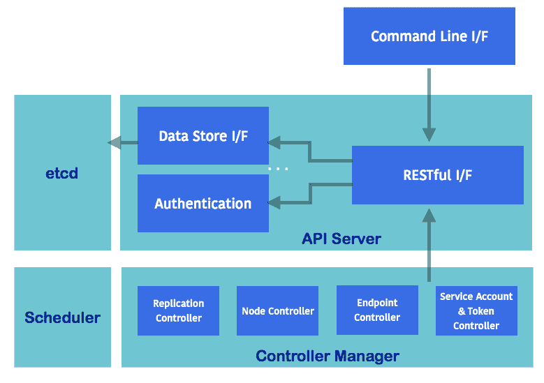

主控节点组件

# API 服务器（kube-apiserver）

API 服务器提供 HTTP/HTTPS 服务器，为 Kubernetes 主控节点中的组件提供 RESTful API。例如，我们可以使用 `GET` 获取资源状态或使用 `POST` 创建新资源。我们还可以监听资源的更新。API 服务器将对象信息存储到 etcd 中，这是 Kubernetes 的后端数据存储。

# 控制器管理器（kube-controller-manager）

控制器管理器是一组控制循环，负责监视 API 服务器中的更改，并确保集群处于期望的状态。例如，部署控制器确保整个部署在所需数量的容器上运行。节点控制器在节点宕机时响应并清除 Pod。端点控制器用于创建服务和 Pod 之间的关系。服务账户和令牌控制器用于创建默认账户和 API 访问令牌。

为了适应来自不同云提供商的不同开发速度和发布周期，从 Kubernetes 版本 1.6 开始，特定于云提供商的逻辑从 `kube-controller-manager` 移动到了云控制器管理器 (`cloud-controller-manager`)。这在 1.11 版本中升级为 beta 版本。

# etcd

etcd 是一个开源分布式键值存储系统（[`coreos.com/etcd`](https://coreos.com/etcd)）。Kubernetes 在这里存储所有的 RESTful API 对象。etcd 负责存储和复制数据。

# 调度器（kube-scheduler）

调度器决定哪些节点是 pod 运行的合适候选节点。它不仅考虑节点的资源容量和资源利用率平衡，还会考虑节点亲和性、污点和容忍度。更多信息请参见第八章，*资源管理与扩展*。

# 节点组件

每个节点上都会提供并运行节点组件，这些组件将 pod 的运行时状态报告给 **master**：

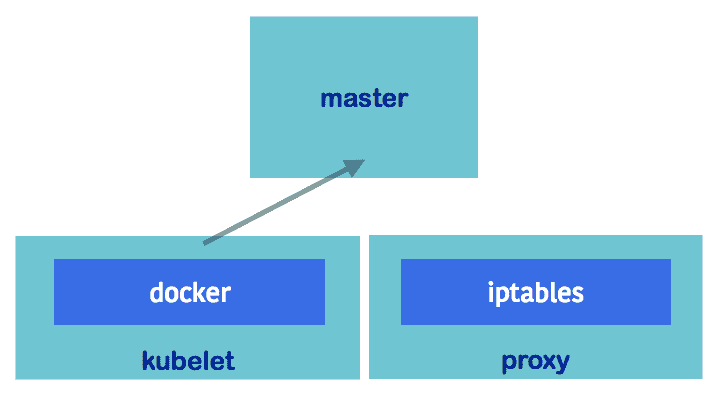

节点组件

# Kubelet

Kubelet 是节点中的一个重要进程。它定期向 `kube-apiserver` 报告节点活动，包括 pod 健康状态、节点健康状态以及存活探针。如前图所示，它通过容器运行时（如 Docker 或 rkt）来运行容器。

# 代理（kube-proxy）

代理负责 pod 负载均衡器（也称为 **service**）与 pods 之间的路由，它还提供从外部互联网到服务的路由。有三种代理模式：`userspace`、`iptables` 和 `ipvs`。`userspace` 模式通过切换内核空间和用户空间带来较大的开销。而 `iptables` 模式是最新的默认代理模式，它通过修改 Linux 中的 `iptables` 网络地址转换（NAT: [`en.wikipedia.org/wiki/Network_address_translation`](https://en.wikipedia.org/wiki/Network_address_translation)）来实现跨所有容器的 TCP 和 UDP 包路由。**IP 虚拟服务器**（**IPVS**）在 Kubernetes 1.11 中**正式发布**（**GA**），旨在解决在集群中运行超过 1,000 个服务时的性能下降问题。它运行在主机上并充当负载均衡器，将连接转发到真实服务器。在某些情况下，IPVS 模式会回退到 `iptables`；有关更多详细信息，请参阅 [`github.com/kubernetes/kubernetes/tree/master/pkg/proxy/ipvs`](https://github.com/kubernetes/kubernetes/tree/master/pkg/proxy/ipvs)。

# Docker

如第二章《*使用容器进行 DevOps*》中所述，Docker 是一种容器运行时实现。Kubernetes 使用 Docker 作为默认的容器引擎，也支持其他容器运行时，例如 rkt（[`coreos.com/rkt/`](https://coreos.com/rkt/)）和 runc（[`github.com/opencontainers/runc`](https://github.com/opencontainers/runc)）。

# Kubernetes master 与节点之间的交互

正如我们在下图中看到的，客户端使用 **kubectl**（一个命令行界面）向 **API 服务器** 发送请求。**API 服务器** 作为主节点组件之间的中枢，将响应客户端请求，并从 etcd 中推送和拉取对象信息。如果创建了一个新任务，如运行 pod，调度器将决定将任务分配给哪个节点。**控制器管理器** 监控运行中的任务，并在出现任何不期望的状态时做出响应。

**API 服务器** 通过 **kubelet** 获取 pod 的日志：

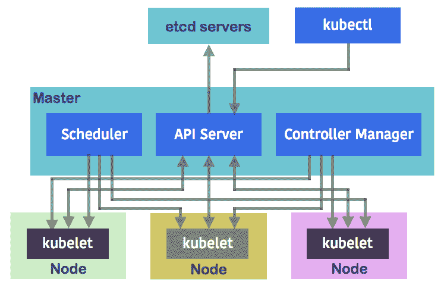

主节点与节点之间的交互

# Kubernetes 入门

在本节中，我们将学习如何设置单节点集群。接着，我们将学习如何通过 Kubernetes 的命令行工具 kubectl 进行交互。我们将通过所有重要的 Kubernetes API 对象及其 YAML 格式的表达式，了解它们作为 kubectl 输入的作用。然后，我们将看到 kubectl 如何向 API 服务器发送请求，以相应地创建所需的对象。

# 环境准备

首先，需要安装 kubectl。在主要的 Linux 发行版（如 Ubuntu 或 CentOS）中，你可以通过包管理器搜索并安装名为 `kubectl` 的包。在 macOS 中，我们可以选择使用 Homebrew ([`brew.sh/`](https://brew.sh/)) 来安装它。Homebrew 是 macOS 中一个非常实用的包管理工具。我们可以通过执行 `/usr/bin/ruby -e "$(curl -fsSL https://raw.githubusercontent.com/Homebrew/install/master/install)"` 命令轻松安装 Homebrew。然后，我们可以通过 `brew install kubernetes-cli` 使用 Homebrew 安装 kubectl。

现在让我们开始配置一个 Kubernetes 集群。最简单的方法是运行 minikube ([`github.com/kubernetes/minikube`](https://github.com/kubernetes/minikube))，它是一个在单节点本地运行 Kubernetes 的工具。它可以在 Windows、Linux 和 macOS 上运行。在接下来的示例中，我们将在 macOS 上运行。Minikube 将启动一个虚拟机，并安装 Kubernetes。我们随后可以通过 kubectl 与其交互。

请注意，minikube 不适用于生产环境或任何重载环境。由于它是单节点的，存在一些限制。我们将在第十章，*Kubernetes on AWS*，第十一章，*Kubernetes on GCP*，以及第十二章，*Kubernetes on Azure*中学习如何运行真实的集群。

在安装 minikube 之前，我们需要先安装一些依赖项。Minikube 的官方 GitHub 仓库 ([`github.com/kubernetes/minikube`](https://github.com/kubernetes/minikube)) 列出了不同平台的依赖项和驱动程序。在我们的案例中，我们在 macOS 上使用 VirtualBox ([`www.virtualbox.org/`](https://www.virtualbox.org/)) 作为驱动程序。你可以自由选择其他驱动程序；请访问上面的 minikube GitHub 链接查找更多选项。

下载并安装 VirtualBox 后，我们就准备好了。我们可以通过 `brew cask install minikube` 安装 minikube：

```
// install minikube
# brew cask install minikube
==> Tapping caskroom/cask
==> Linking Binary 'minikube-darwin-amd64' to '/usr/local/bin/minikube'.
...
minikube was successfully installed!
```

安装 minikube 后，我们可以通过 `minikube start` 命令启动集群。这将启动一个本地 Kubernetes 集群。在撰写本文时，minikube v0.30.0 支持的默认 Kubernetes 版本是 `v.1.12.0`。你也可以添加 `--kubernetes-version` 参数来指定你想运行的特定 Kubernetes 版本。例如，假设我们想运行版本为 v1.12.1 的集群：

```
// start the cluster (via minikube v0.30.0)
# 
Starting local Kubernetes v1.12.1 cluster...
Starting VM...
Getting VM IP address...
Moving files into cluster...
Downloading kubeadm v1.12.1
Downloading kubelet v1.12.1
Finished Downloading kubeadm v1.12.1
Finished Downloading kubelet v1.12.1
Setting up certs...
Connecting to cluster...
Setting up kubeconfig...
Starting cluster components...
Kubectl is now configured to use the cluster.
Loading cached images from config file. 
```

这将启动一个名为 `minikube` 的虚拟机，并通过 `kubeadm`（一个 Kubernetes 配置工具）设置集群。它还将设置 `kubeconfig`，这是一个配置文件，用于定义集群的上下文和身份验证设置。通过 `kubeconfig`，我们能够通过 `kubectl` 命令切换到不同的集群。我们可以使用 `kubectl config view` 命令查看 `kubeconfig` 中的当前设置：

```
apiVersion: v1
# cluster and certificate information
clusters:
- cluster:
    certificate-authority: /Users/chloelee/.minikube/ca.crt
    server: https://192.168.99.100:8443
  name: minikube

# context is the combination of cluster, user and namespace
contexts:
- context:
   cluster: minikube
   user: minikube
  name: minikube
current-context: minikube
kind: Config
preferences: {}

# user information

users:  
- name: minikube
user:
  client-certificate: /Users/chloelee/.minikube/client.crt
  client-key: /Users/chloelee/.minikube/client.key 
```

这里，我们当前使用的是`minikube`上下文。上下文是身份验证信息和集群连接信息的组合。如果你有多个上下文，可以使用`kubectl config` use-context `$context` 强制切换上下文。

# kubectl

`kubectl` 是用于管理 Kubernetes 集群的命令行工具。`kubectl` 最常见的用法是检查集群的 `version`：

```
// check Kubernetes version
# kubectl version

Client Version: version.Info{Major:"1", Minor:"12", GitVersion:"v1.12.0", GitCommit:"0ed33881dc4355495f623c6f22e7dd0b7632b7c0", GitTreeState:"clean", BuildDate:"2018-10-01T00:59:42Z", GoVersion:"go1.11", Compiler:"gc", Platform:"darwin/amd64"}
Server Version: version.Info{Major:"1", Minor:"11", GitVersion:"v1.11.3", GitCommit:"a4529464e4629c21224b3d52edfe0ea91b072862", GitTreeState:"clean", BuildDate:"2018-09-09T17:53:03Z", GoVersion:"go1.10.3", Compiler:"gc", Platform:"linux/amd64"} 
```

然后，我们知道我们的服务器版本是最新的，即撰写本文时的最新版本——版本 1.12.0。`kubectl` 的一般语法如下：

```
kubectl [command] [type] [name] [flags] 
```

`command` 表示你想执行的操作。如果你在终端输入 `kubectl help`，它会显示支持的命令。`type` 表示资源类型。我们将在下一节学习主要的资源类型。`name` 是我们如何命名资源的。最好始终使用清晰且具有信息性的名称。对于 `flags`，如果你输入 `kubectl options`，`stdout` 将显示你可以传递的所有标志。

我们可以随时添加 `--help` 来获取关于特定命令的更详细信息，如以下示例所示：

```
// show detailed info for logs command
kubectl logs --help
Print the logs for a container in a pod or specified resource. If the pod has only one container, the container name is optional.

Aliases:
logs, log

Examples:
  # Return snapshot logs from pod nginx with only one container
  kubectl logs nginx

  # Return snapshot logs for the pods defined by label app=nginx
  kubectl logs -lapp=nginx  ...
Options
...
```

然后，我们可以在 `kubectl logs` 命令中获得示例和支持的选项。

# Kubernetes 资源

Kubernetes 对象是集群中的条目，存储在 etcd 中。它们表示集群的期望状态。当我们创建一个对象时，我们通过 kubectl 或 RESTful API 向 API 服务器发送请求。API 服务器会检查请求是否有效，将状态存储在 etcd 中，并与其他主控组件交互以确保对象的存在。Kubernetes 使用命名空间将对象虚拟隔离，因此我们可以为不同的团队、用途、项目或环境创建不同的命名空间。每个对象都有自己的名称和唯一 ID。Kubernetes 还支持标签和注解，让我们可以给对象打标签。特别是标签，可以用来将对象分组。

# Kubernetes 对象

对象的 `spec` 描述了 Kubernetes 对象的期望状态。大多数时候，我们编写对象的 `spec` 并通过 `kubectl` 发送给 API 服务器。Kubernetes 会尽力实现该期望的 `state` 并 `update` 对象的状态。

对象的 `spec` 可以用 YAML ([`www.yaml.org/`](http://www.yaml.org/)) 或 JSON ([`www.json.org/`](http://www.json.org/)) 编写。在 Kubernetes 中，YAML 更为常见。我们将在本书的其余部分使用 YAML 来编写对象 `spec`。以下代码块展示了一个 YAML 格式的 spec 片段：

```
apiVersion: Kubernetes API version 
kind: object type
metadata:
  spec metadata, i.e. namespace, name, labels and annotations
spec:
  the spec of Kubernetes object 
```

# 命名空间

Kubernetes 命名空间允许我们实现多个虚拟集群的隔离。不同命名空间中的对象互相不可见。当不同的团队或项目共享同一个集群时，这非常有用。大多数资源都属于某个命名空间（这些被称为命名空间资源）；然而，一些通用资源，如节点或命名空间本身，并不属于任何命名空间。Kubernetes 有三个命名空间：

+   `default`

+   `kube-system`

+   `kube-public`

如果我们没有明确为命名空间资源指定命名空间，它将位于当前上下文的命名空间中。如果我们从未添加新命名空间，则将使用默认命名空间。

Kube-system 命名空间由 Kubernetes 系统创建的对象使用，如 addon，这些是实现集群功能的 pods 或服务，如仪表盘。Kube-public 命名空间是在 Kubernetes 版本 1.6 中引入的，用于由 beta 控制器管理器（BootstrapSigner：[`kubernetes.io/docs/admin/bootstrap-tokens`](https://kubernetes.io/docs/admin/bootstrap-tokens)）使用，将签名的集群位置信息放入 `kube-public` 命名空间。此信息可以被认证或未认证的用户查看。

在接下来的部分中，所有命名空间资源都位于默认命名空间中。命名空间对于资源管理和角色也非常重要。我们将在第八章中提供更多信息，*资源管理与扩展*。

让我们看看如何创建一个命名空间。命名空间是一个 Kubernetes 对象。我们可以指定类型为命名空间，就像其他对象一样。以下是如何创建一个名为 `project1` 的命名空间的示例：

```
// configuration file of namespace
# cat 3-2-1_ns1.yml
apiVersion: v1
kind: Namespace
metadata:
  name: project1 // create namespace for project1
# kubectl create -f 3-2-1_ns.yaml
namespace/project1 created // list namespace, the abbreviation of namespaces is ns. We could use `kubectl get ns` to list it as well.
# kubectl get namespaces
NAME          STATUS    AGE
default       Active    1d
kube-public   Active    1d
kube-system   Active    1d
project1      Active    11s
```

现在我们尝试通过在 `project1` 命名空间中进行部署来启动两个 nginx 容器：

```
// run a nginx deployment in project1 ns
# kubectl run nginx --image=nginx:1.12.0 --replicas=2 --port=80 --namespace=project1

deployment.apps/nginx created 
```

当我们通过 `kubectl get pods` 列出 pods 时，集群中将不会显示任何内容。这是因为 Kubernetes 使用当前上下文来决定哪个命名空间是当前的。如果我们没有在上下文或 `kubectl` 命令行中明确指定命名空间，默认将使用 `default` 命名空间：

```
// We'll see the Pods if we explicitly specify --namespace
# kubectl get pods --namespace=project1
NAME                  READY STATUS  RESTARTS AGE
nginx-8cdc99758-btgzj 1/1   Running 0        22s
nginx-8cdc99758-xpk58 1/1   Running 0        22s
```

你可以使用 `--namespace <namespace_name>`，`--namespace=<namespace_name>`，`-n <namespace_name>` 或 `-n=<namespace_name>` 来指定命令的命名空间。要列出跨命名空间的资源，使用 `--all-namespaces` 参数。

另一种做法是将当前上下文更改为指向所需的命名空间，而不是`default`命名空间。

# 名称

Kubernetes 中的每个对象都有自己独特的名称，在相同的命名空间内是唯一的。Kubernetes 将对象名称作为 API 服务器资源 URL 的一部分，因此它必须是小写字母、数字、短横线和点的组合，并且长度不得超过 254 个字符。除了对象名称，Kubernetes 还为每个对象分配了一个**唯一 ID**（**UID**），用于区分历史上类似实体的发生。

# 标签和选择器

标签是附加到对象上的键/值对集合。它们旨在提供有关对象的有意义的标识信息。常见的用途包括指示微服务名称、层级、环境和软件版本。用户可以定义有意义的标签，后续可以与选择器一起使用。对象`spec`中标签的语法如下：

```
labels:
  $key1: $value1
  $key2: $value2
```

与标签一起使用，标签选择器用于过滤对象集合。多个要求用逗号分隔，将通过`AND`逻辑运算符连接。过滤有两种方式：

+   基于相等的要求

+   基于集合的要求

基于相等的要求支持以下运算符：`=`、`==`和`!=`。以以下图示为例：如果选择器是`chapter=2, version!=0.1`，则结果为**对象 C**。如果要求是`version=0.1`，则结果为**对象 A**和**对象 B**：

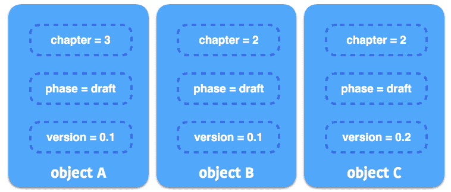

选择器示例

如果我们在支持的对象`spec`中编写要求，它将如下所示：

```
selector:
  $key1: $value1
```

基于集合的要求支持`in`、`notin`和`exists`（仅适用于`key`）。例如，如果要求是`chapter in (3, 4), version`，则返回**对象 A**。如果要求是`version notin (0.2), !author_info`，则结果将是**对象 A**和**对象 B**。以下示例展示了使用基于集合要求的`spec`对象：

```
selector:
  matchLabels:
    $key1: $value1
  matchExpressions:
  - {key: $key2, operator: In, values: [$value1, $value2]}
```

`matchLabels`和`matchExpressions`的要求是结合在一起的。这意味着过滤的对象必须同时满足两个要求。

# 注解

注解是一组用户指定的键值对，用于指定非标识性的元数据。注解的作用类似于普通的标签，例如，用户可以在注解中添加时间戳、提交哈希或构建号。某些`kubectl`命令支持`--record`选项，用于记录对对象进行更改的命令。注解的另一个用例是存储配置信息，例如 Kubernetes 部署（[`kubernetes.io/docs/concepts/workloads/controllers/deployment`](https://kubernetes.io/docs/concepts/workloads/controllers/deployment)）或关键附加组件 Pod（[`coreos.com/kubernetes/docs/latest/deploy-addons.html`](https://coreos.com/kubernetes/docs/latest/deploy-addons.html)）。注解的语法如下：

```
annotations:
  $key1: $value1
  $key2: $value2
```

命名空间、名称、标签和注释位于对象`spec`的元数据部分。选择器位于支持选择器的资源的`spec`部分，例如 pod、service、ReplicaSet 和 deployment。

# Pods

Pod 是 Kubernetes 中最小的可部署单元。它可以包含一个或多个容器。大多数情况下，我们每个 pod 只需要一个容器。在一些特殊情况下，多个容器可能会被包含在同一个 pod 中，例如 sidecar 容器（[`blog.kubernetes.io/2015/06/the-distributed-system-toolkit-patterns.html`](http://blog.kubernetes.io/2015/06/the-distributed-system-toolkit-patterns.html)）。同一个 pod 中的容器共享一个上下文，在同一节点上运行，共享网络命名空间和共享卷。Pod 的设计也是“易死”的。当 pod 因某种原因死掉时，比如被 Kubernetes 控制器因为资源不足而杀死，它不会自行恢复。相反，Kubernetes 使用控制器为我们创建并管理 pod 的期望状态。

我们可以使用`kubectl explain <resource>`通过命令行获取资源的详细描述。这将显示该资源支持的字段：

```
// get detailed info for `pods`
# kubectl explain pods
KIND: Pod
VERSION: v1

DESCRIPTION:
     Pod is a collection of containers that can run on a host. This resource is
     created by clients and scheduled onto hosts.

FIELDS:
   apiVersion <string>
     APIVersion defines the versioned schema of this representation of an
     object. Servers should convert recognized schemas to the latest internal
     value, and may reject unrecognized values. More info:
     https://git.k8s.io/community/contributors/devel/api-conventions.md#resources

   kind <string>
     Kind is a string value representing the REST resource this object
     represents. Servers may infer this from the endpoint the client submits
     requests to. Cannot be updated. In CamelCase. More info:
     https://git.k8s.io/community/contributors/devel/api-conventions.md#types-kinds

   metadata <Object>
     Standard object's metadata. More info:
     https://git.k8s.io/community/contributors/devel/api-conventions.md#metadata

   spec <Object>
     Specification of the desired behavior of the pod. More info:
     https://git.k8s.io/community/contributors/devel/api-conventions.md#spec-and-status

   status <Object>
     Most recently observed status of the pod. This data may not be up to date.
     Populated by the system. Read-only. More info:
     https://git.k8s.io/community/contributors/devel/api-conventions.md#spec-and-status 
```

在接下来的示例中，我们将展示如何在一个 pod 中创建两个容器，并演示它们如何互相访问。请注意，这既不是一个有意义的也不是经典的 sidecar 模式示例。它只是展示了我们如何在同一个 pod 内访问其他容器的一个例子：

```
// an example for creating co-located and co-scheduled container by pod
# cat 3-2-1_pod.yaml
apiVersion: v1
kind: Pod
metadata:
  name: example
spec:
  containers:
  - name: web
    image: nginx
  - name: centos
    image: centos
    command: ["/bin/sh", "-c", "while : ;do curl http://localhost:80/; sleep 10; done"]
```

以下图示展示了**Pod**中容器之间的关系。它们共享相同的网络命名空间：

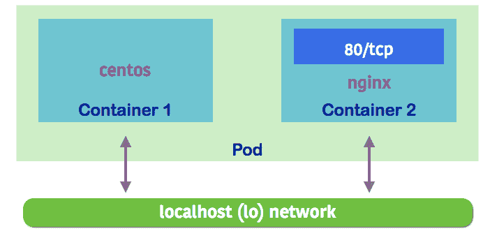

Pod 内的容器可以通过 localhost 访问

这个 spec 将创建两个容器，`web`和`centos`。Web 是一个`nginx`容器（[`hub.docker.com/_/nginx/`](https://hub.docker.com/_/nginx/)）。容器端口`80`默认被暴露。由于`centos`与 nginx 共享相同的上下文，当在`http://localhost:80/`中使用`curl`时，它应该能够访问 nginx。

接下来，使用`kubectl create`命令来启动 pod。`-f`参数允许我们将配置文件传递给`kubectl`命令，并创建文件中指定的所需资源：

```
// create the resource by `kubectl create` - Create a resource by filename or stdin
# kubectl create -f 3-2-1_pod.yaml
pod "example" created 
```

如果在创建资源时，我们在`kubectl`命令的末尾添加`--record=true`，Kubernetes 会在创建或更新资源时记录最新的命令。因此，我们不会忘记哪些资源是由哪个 spec 创建的。

我们可以使用`kubectl get <resource>`命令来获取对象的当前状态。在这个例子中，我们使用`kubectl get pods`命令：

```
// get the current running pods 
# kubectl get pods
NAME      READY     STATUS              RESTARTS   AGE
example   0/2       ContainerCreating   0          1s
```

添加`--namespace=$namespace_name`允许我们访问不同命名空间中的对象。以下是如何检查`kube-system`命名空间中 pods 的示例，该命名空间用于系统类型的 pods：

`**// 列出 kube-system 命名空间中的 pods**`

`**# kubectl get pods --namespace=kube-system**`

`**NAME                            READY STATUS RESTARTS AGE**`

`**coredns-99b9bb8bd-p2dvw               1/1 正在运行 0 1 分钟**`

`**etcd-minikube                         1/1 正在运行 0 47 秒**`

`**kube-addon-manager-minikube           1/1 正在运行 0 13 秒**`

`**kube-apiserver-minikube               1/1 正在运行 0 38 秒**`

`**kube-controller-manager-minikube      1/1 正在运行 0 32 秒**`

`**kube-proxy-pvww2                      1/1 正在运行 0 1 分钟**`

`**kube-scheduler-minikube               1/1 正在运行 0 26 秒**`

`**kubernetes-dashboard-7db4dc666b-f8b2w 1/1 正在运行 0 1 分钟**`

`**storage-provisioner                   1/1 正在运行 0 1 分钟**`

我们示例中的 pod 状态是`ContainerCreating`。在此阶段，Kubernetes 已接受请求，并正在尝试调度 pod 并拉取镜像。当前没有容器在运行。

大多数对象都有简短的名称，这在我们使用`kubectl get <object>`列出它们的状态时非常有用。例如，pod 可以叫做`po`，服务可以叫做`svc`，部署可以叫做`deploy`。输入`kubectl get`可以查看更多信息。或者，`kubectl api-resources`命令可以列出所有资源及其简短名称和属性。

等待一会儿后，我们可以再次获取状态：

```
// get the current running pods
# kubectl get pods
NAME      READY     STATUS    RESTARTS   AGE
example   2/2       Running   0          3s
```

我们可以看到两个容器当前正在运行，运行时间为三秒。使用`kubectl logs <pod_name> -c <container_name>`可以获取该容器的`stdout`，这类似于`docker logs <container_name>`：

```
// get stdout for centos
# kubectl logs example -c centos
<!DOCTYPE html>
<html>
<head>
<title>Welcome to nginx!</title>
...
```

pod 中的`centos`与 nginx 通过 localhost 共享相同的网络。Kubernetes 会与 pod 一起创建一个网络容器。网络容器的一个功能是转发 pod 内容器之间的流量。我们将在第六章中了解更多内容，*Kubernetes 网络*。

如果我们在 pod 规格中指定标签，我们可以使用`kubectl get pods -l <requirement>`命令获取符合要求的 pod，例如，`kubectl get pods -l 'tier in (frontend, backend)'`。此外，如果我们使用`kubectl pods -o wide`，它会列出哪些 pod 在何种节点上运行。

我们可以使用`kubectl describe <resource> <resource_name>`来获取资源的详细信息：

```
// get detailed information for a pod
# kubectl describe pods example
Name:              example
Namespace:         default
Priority:          0
PriorityClassName: <none>
Node:              minikube/10.0.2.15
Start Time:        Sun, 07 Oct 2018 15:15:36 -0400
Labels:            <none>
Annotations:       <none>
Status:            Running
IP:                172.17.0.4
Containers:        ... 
```

此时，我们知道这个 pod 运行在哪个节点上。在`minikube`中，我们只有一个节点，因此它没有什么区别。在真实的集群环境中，知道 pod 运行在哪个节点上对于故障排除非常有用。我们还没有为它关联任何标签、注解或控制器：

```
 web:
 Container ID: docker://d8284e14942cbe0b8a91f78afc132e09c0b522e8a311e44f6a9a60ac2ca7103a
 Image: nginx
 Image ID: docker-pullable://nginx@sha256:9ad0746d8f2ea6df3a17ba89eca40b48c47066dfab55a75e08e2b70fc80d929e
 Port: <none>
 Host Port: <none>
 State: Running
 Started: Sun, 07 Oct 2018 15:15:50 -0400
 Ready: True
 Restart Count: 0
 Environment: <none>
 Mounts:
 /var/run/secrets/kubernetes.io/serviceaccount from default-token-bm6vn (ro)
```

在容器部分，我们将看到这个 pod 包含两个容器。我们可以看到它们的状态、源镜像、端口映射和重启次数：

```
Conditions:
 Type Status
 Initialized True
 Ready True
 ContainersReady True
 PodScheduled True
```

一个 pod 具有 `PodStatus`，其中包含以 `PodConditions` 数组表示的映射。`PodConditions` 的可能类型有 `PodScheduled`、`Ready`、`Initialized`、`Unschedulable` 和 `ContainersReady`。其值可以是 `true`、`false` 或未知。如果 pod 没有按预期创建，`PodStatus` 将简要概述哪个部分出现了故障。在前面的示例中，我们在每个阶段成功启动了 pod，且没有出现任何错误：

```
Volumes:
 default-token-bm6vn:
 Type: Secret (a volume populated by a Secret)
 SecretName: default-token-bm6vn
 Optional: false
```

一个 pod 与服务账户相关联，服务账户为运行该 pod 的进程提供身份。它由服务账户和 API 服务器中的令牌控制器进行管理。

它将在 pod 中的每个容器下挂载一个只读卷，路径为 `/var/run/secrets/kubernetes.io/serviceaccount`，该卷包含一个用于 API 访问的令牌。Kubernetes 创建了一个默认的服务账户。我们可以使用 `kubectl get serviceaccounts` 命令列出服务账户：

```
QoS Class: BestEffort
Node-Selectors: <none>
Tolerations: node.kubernetes.io/not-ready:NoExecute for 300s
 node.kubernetes.io/unreachable:NoExecute for 300s
```

我们还没有为这个 pod 分配任何选择器。容忍度用于限制节点可以使用的 pod 数量。我们将在第八章 *资源管理和扩展*中进一步学习这一点：

```
Events:
 Type Reason Age From Message
 ---- ------ ---- ---- -------
 Normal Scheduled 2m22s default-scheduler Successfully assigned default/example to minikube
 Normal Pulling 2m21s kubelet, minikube pulling image "nginx"
 Normal Pulled 2m8s kubelet, minikube Successfully pulled image "nginx"
 Normal Created 2m8s kubelet, minikube Created container
 Normal Started 2m8s kubelet, minikube Started container
 Normal Pulling 2m8s kubelet, minikube pulling image "centos"
 Normal Pulled 93s kubelet, minikube Successfully pulled image "centos"
 Normal Created 92s kubelet, minikube Created container
 Normal Started 92s kubelet, minikube Started container
```

通过查看事件，我们可以识别 Kubernetes 运行节点所需的步骤。首先，调度器将任务分配给一个节点，这里叫做 `minikube`。然后，kubelet 开始拉取第一个镜像并相应地创建一个容器。之后，kubelet 拉取第二个容器并启动容器。

# ReplicaSet

pod 并不是自愈的。当 pod 遇到故障时，它不会自动恢复。这时，**ReplicaSet**（**RS**）发挥作用。ReplicaSet 确保集群中始终有指定数量的副本 pod 正在运行。如果一个 pod 因为任何原因崩溃，ReplicaSet 会发送请求来启动一个新的 pod。

ReplicaSet 类似于旧版本 Kubernetes 中使用的 **ReplicationController**（**RC**）。与 ReplicaSet 使用基于集合的选择器要求不同，ReplicationController 使用基于等式的选择器要求。现在，ReplicationController 已被完全替代为 ReplicaSet。

让我们看看 ReplicaSet 是如何工作的：

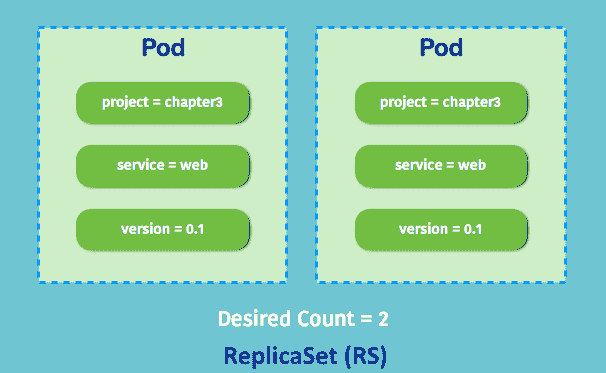

具有期望数量为 2 的 ReplicaSet

假设我们想要创建一个 `ReplicaSet` 对象，期望数量为 2。这意味着我们将始终在服务中拥有两个 pod。在编写 ReplicaSet 的 spec 之前，我们必须首先确定 pod 模板。这类似于 pod 的 spec。在 ReplicaSet 中，标签在元数据部分是必需的。ReplicaSet 使用 pod 选择器来选择它管理的 pod。标签使得 ReplicaSet 能够区分是否所有与选择器匹配的 pod 都在正常运行。

在这个示例中，我们将创建两个 pod，每个 pod 都带有 `project`、`service` 和 `version` 标签，如前图所示：

```
// an example for RS spec
# cat 3-2-2_rs.yaml
apiVersion: apps/v1
kind: ReplicaSet
metadata:
  name: nginx
spec:
  replicas: 2
  selector:
    matchLabels:
      project: chapter3
    matchExpressions:
      - {key: version, operator: In, values: ["0.1", "0.2"]}
  template:
    metadata:
      name: nginx
      labels:
        project: chapter3
        service: web
        version: "0.1"
    spec:
      containers:
      - name: nginx
        image: nginx
        ports:
        - containerPort: 80

// create the RS
# kubectl create -f 3-2-2_rs.yaml
replicaset.apps/nginx created 
```

然后，我们可以使用 `kubectl` 来获取当前的 RS 状态：

```
// get current RSs
# kubectl get rs
NAME  DESIRED CURRENT READY AGE
nginx 2       2       2     29s
```

这表明我们期望有两个 Pod，当前有两个 Pod，并且两个 Pod 都已准备就绪。现在我们有多少 Pod 呢？让我们通过`kubectl`命令检查一下：

```
// get current running pod
# kubectl get pods
NAME          READY     STATUS    RESTARTS   AGE
nginx-l5mdn   1/1       Running   0          11s
nginx-pjjw9   1/1       Running   0          11s 
```

这表明我们有两个 Pod 正在运行。如前所述，ReplicaSet 管理所有匹配选择器的 Pod。如果我们手动创建一个具有相同标签的 Pod，理论上，它应该匹配我们刚刚创建的 RS 的 Pod 选择器。让我们试试看：

```
// manually create a pod with same labels
# cat 3-2-2_rs_self_created_pod.yaml
apiVersion: v1
kind: Pod
metadata:
  name: our-nginx
  labels:
   project: chapter3
   service: web
   version: "0.1"
spec:
  containers:
  - name: nginx
    image: nginx
    ports:
    - containerPort: 80
// create a pod with same labels manually
# kubectl create -f 3-2-2_rs_self_created_pod.yaml 
pod "our-nginx" created 
```

让我们看看它是否正常运行：

```
// get pod status
# kubectl get pods
NAME          READY     STATUS        RESTARTS   AGE
nginx-l5mdn   1/1       Running       0          4m
nginx-pjjw9   1/1       Running       0          4m
our-nginx     0/1       Terminating   0          4s 
```

它已调度，ReplicaSet 捕捉到了这个变化。Pod 的数量变为三个，超过了我们期望的数量。该 Pod 最终被终止：

```
// get pod status
# kubectl get pods
NAME          READY     STATUS    RESTARTS   AGE
nginx-l5mdn   1/1       Running   0          5m
nginx-pjjw9   1/1       Running   0          5m 
```

以下图示展示了我们自创建的 Pod 是如何被驱逐的。标签与 ReplicaSet 匹配，但期望数量为 2。因此，额外的 Pod 被驱逐掉了：

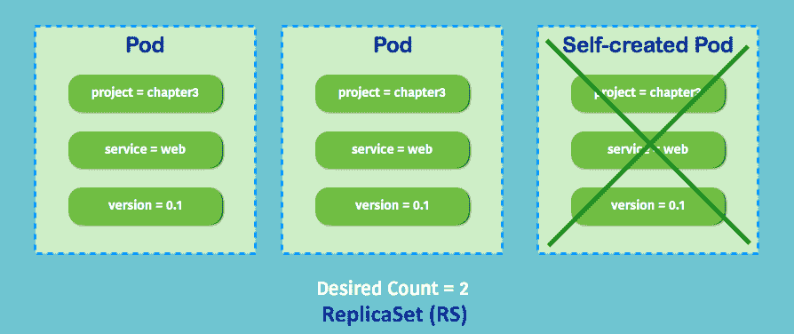

ReplicaSet 确保 Pod 处于期望的状态

如果我们想根据需求进行扩展，可以简单地使用`kubectl edit <resource> <resource_name>`来更新规格。在这里，我们将副本数量从`2`更改为`5`：

```
// change replica count from 2 to 5, default system editor will pop out. 
Change `replicas` number
# kubectl edit rs nginx
replicaset.extensions/nginx edited 
```

让我们检查 RS 的相关信息：

```
// get RS information
# kubectl get rs
NAME      DESIRED   CURRENT   READY     AGE
nginx     5         5         5         5m 
```

我们现在有五个 Pod。让我们检查一下 RS 是如何工作的：

```
// describe RS resource `nginx`
# kubectl describe rs nginx Name: nginx
Namespace: default
Selector: project=chapter3,version in (0.1,0.2)
Labels: project=chapter3
              service=web
              version=0.1
Annotations: <none>
Replicas: 5 current / 5 desired
Pods Status: 5 Running / 0 Waiting / 0 Succeeded / 0 Failed
Pod Template:
  Labels: project=chapter3
           service=web
           version=0.1
  Containers:
   nginx:
    Image: nginx
    Port: 80/TCP
    Host Port: 0/TCP
    Environment: <none>
    Mounts: <none>
  Volumes: <none>
Events:
  Type Reason Age From Message
  ---- ------ ---- ---- -------
  Normal SuccessfulCreate 3m34s replicaset-controller Created pod: nginx-l5mdn
  Normal SuccessfulCreate 3m34s replicaset-controller Created pod: nginx-pjjw9
  Normal SuccessfulDelete 102s replicaset-controller Deleted pod: our-nginx
  Normal SuccessfulCreate 37s replicaset-controller Created pod: nginx-v9trs
  Normal SuccessfulCreate 37s replicaset-controller Created pod: nginx-n95mv
  Normal SuccessfulCreate 37s replicaset-controller Created pod: nginx-xgdhq 
```

通过描述命令，我们可以了解 RS 的规格和事件。当我们创建`nginx` RS 时，它根据规格启动了两个容器。然后，我们根据另一种规格手动创建了一个名为`our-nginx`的 Pod。RS 检测到该 Pod 与其 Pod 选择器匹配。随着数量超过我们期望的数量，它将该 Pod 驱逐掉。然后，我们将副本数扩展到五个。RS 检测到它没有达到我们期望的状态，并启动了三个 Pod 来填补空缺。

如果我们想删除一个 RC，只需使用`kubectl`命令：`kubectl delete <resource> <resource_name>`。由于我们手头有配置文件，我们也可以使用`kubectl delete -f <configuration_file>`来删除文件中列出的资源：

```
// delete a rc
# kubectl delete rs nginx
replicaset.extensions/nginx deleted

// get pod status
# kubectl get pods
NAME          READY     STATUS        RESTARTS   AGE
nginx-pjjw9   0/1       Terminating   0          29m 
```

# Deployments

在 Kubernetes 1.2 版本之后，Deployments 是管理和部署软件的最佳基础构件。它们允许我们部署 Pod，执行滚动更新，并回滚 Pod 和 ReplicaSets。我们可以使用 Deployments 声明性地定义期望的软件更新，Deployments 会逐步为我们执行这些操作。

在 Deployments 之前，ReplicationController 和 kubectl rolling-update 是实现软件滚动更新的主要方式。这些方法更加命令式且速度较慢。Deployment 现在是用于管理我们应用程序的主要高级对象。

让我们看看它是如何工作的。在本节中，我们将体验一下如何创建 Deployment，如何进行滚动更新和回滚。第九章，*持续交付*，提供了更多有关如何将 Deployments 集成到我们的持续交付管道中的实际例子。

首先，我们使用`kubectl run`命令为我们创建`deployment`：

```
// using kubectl run to launch the Pods
# kubectl run nginx --image=nginx:1.12.0 --replicas=2 --port=80
deployment "nginx" created
// check the deployment status
# kubectl get deployments
NAME      DESIRED   CURRENT   UP-TO-DATE   AVAILABLE   AGE
nginx     2         2         2            2           4h
```

在 Kubernetes 1.2 之前，`kubectl run`命令会创建 Pod。

有两个 pod 是由 `deployment` 部署的：

```
// check if pods match our desired count
# kubectl get pods
NAME                     READY     STATUS        RESTARTS   AGE
nginx-2371676037-2brn5   1/1       Running       0          4h
nginx-2371676037-gjfhp   1/1       Running       0          4h 
```

以下是一个关于 Deployments、ReplicaSets 和 pods 之间关系的图示。一般来说，Deployments 管理 ReplicaSets，而 ReplicaSets 管理 pods。请注意，我们不应该直接操作由 Deployments 管理的 ReplicaSets，就像如果 pods 是由 ReplicaSets 管理的，我们也没有理由直接改变它们一样：

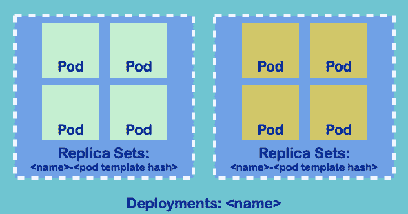

Deployments、ReplicaSets 和 pods 之间的关系

如果我们删除其中一个 pod，替换的 pod 会立即被调度并启动。这是因为 Deployments 在后台创建了一个 ReplicaSet，它会确保副本的数量与我们期望的数量一致：

```
// list replica sets
# kubectl get rs
NAME               DESIRED   CURRENT   READY     AGE
nginx-2371676037   2         2         2         4h 
```

我们也可以通过 `kubectl` 命令暴露端口以供部署：

```
// expose port 80 to service port 80
# kubectl expose deployment nginx --port=80 --target-port=80
service "nginx" exposed
// list services
# kubectl get services
NAME         CLUSTER-IP   EXTERNAL-IP   PORT(S)   AGE
kubernetes   10.0.0.1     <none>        443/TCP   3d
nginx        10.0.0.94    <none>        80/TCP    5s 
```

Deployments 也可以通过 spec 来创建。之前通过 kubectl 启动的 Deployments 和 Service 可以转换为以下 spec：

```
// create deployments by spec
# cat 3-2-3_deployments.yaml
apiVersion: apps/v1
kind: Deployment
metadata:
  name: nginx
spec:
  replicas: 2
  template:
   metadata:
    labels:
     run: nginx
   spec:
    containers:
    - name: nginx
      image: nginx:1.12.0
      ports:
      - containerPort: 80
---
kind: Service
apiVersion: v1
metadata:
  name: nginx
  labels:
   run: nginx
spec:
  selector:
   run: nginx
  ports:
    - protocol: TCP
      port: 80
      targetPort: 80
      name: http 
// create deployments and service
# kubectl create -f 3-2-3_deployments.yaml
deployment "nginx" created
service "nginx" created­­­­ 
```

为了执行滚动更新，我们需要添加滚动更新策略。此过程中有三个参数用来控制流程：

| **参数** | **描述** | **默认值** |
| --- | --- | --- |
| `minReadySeconds` | 这是热身时间，表示新创建的 pod 被认为可用的时间。默认情况下，Kubernetes 假设应用程序一旦成功启动即认为其可用。 | 0 |
| `maxSurge` | 这表示在执行滚动更新过程中，允许有多少个 pod 被提升。 | 25% |
| `maxUnavailable` | 这表示在执行滚动更新过程中，允许有多少个 pod 不可用。 | 25% |

`minReadySecond` 是一个重要的设置。如果我们的应用程序在 pod 启动时并未立即可用，pods 将过快滚动，且没有适当的等待。尽管所有新 pods 都已启动，但应用程序可能仍在热身；这时可能会发生服务中断。以下示例中，我们将在 `Deployment.spec` 部分添加该配置：

```
// add to Deployments.spec, save as 3-2-3_deployments_rollingupdate.yaml
minReadySeconds: 3
strategy:
  type: RollingUpdate
  rollingUpdate:
    maxSurge: 1
    maxUnavailable: 1
```

这表示我们允许在任何时刻只有一个 pod 不可用，并且在滚动更新 pod 时每次只能启动一个 pod。进入下一操作之前的热身时间是三秒钟。我们可以使用 `kubectl edit deployments nginx`（直接编辑）或 `kubectl replace -f 3-2-3_deployments_rollingupdate.yaml` 来更新策略。

假设我们想要模拟一个新的软件发布，从 nginx 1.12.0 更新到 1.13.1。我们仍然可以使用前面提到的两个命令来更改镜像版本，或者使用 `kubectl set image deployment nginx nginx=nginx:1.13.1` 来触发更新。如果我们使用 `kubectl describe` 来查看发生了什么，我们会看到 Deployments 已通过删除/创建 pods 触发了对 ReplicaSets 的滚动更新：

```
// list rs
# kubectl get rs
NAME             DESIRED CURRENT READY AGE
nginx-596b999b89 2       2       2     2m

// check detailed rs information
# kubectl describe rs nginx-596b999b89
Name: nginx-596b999b89
Namespace: default
Selector: pod-template-hash=1526555645,run=nginx
Labels: pod-template-hash=1526555645
        run=nginx
Annotations: deployment.kubernetes.io/desired-replicas: 2
             deployment.kubernetes.io/max-replicas: 3
             deployment.kubernetes.io/revision: 1
Controlled By: Deployment/nginx
Replicas: 2 current / 2 desired
Pods Status: 2 Running / 0 Waiting / 0 Succeeded / 0 Failed
Pod Template:
  Labels: pod-template-hash=1526555645
          run=nginx
  Containers:
   nginx:
    Image: nginx:1.12.0
    Port: 80/TCP
    Host Port: 0/TCP
Events:
  Type Reason Age From Message
  ---- ------ ---- ---- -------
  Normal SuccessfulCreate 3m41s replicaset-controller Created pod: nginx-596b999b89-th9rx
  Normal SuccessfulCreate 3m41s replicaset-controller Created pod: nginx-596b999b89-2pp7b
```

以下是滚动更新在 Deployment 中如何工作的图示：

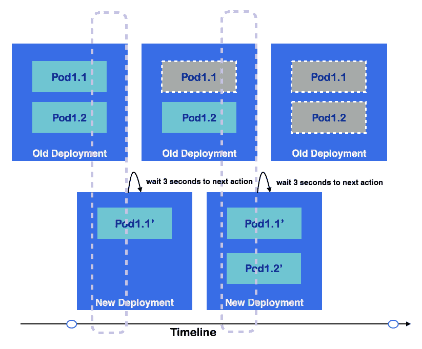

Deployment 示意图

上图展示了一个 Deployment 的示意图。在某一时刻，我们希望的副本数是 2，并且有一个 maxSurge pod。在启动每个新 pod 后，Kubernetes 会等待三秒（`minReadySeconds`），然后执行下一步操作。

如果我们使用 `kubectl set image deployment nginx nginx=nginx:1.12.0` 命令回滚到先前的版本 1.12.0，Deployment 将为我们执行回滚。

# 服务

Kubernetes 中的 Service 是将流量路由到一组逻辑 pods 的抽象层。通过 Service，我们不需要追踪每个 pod 的 IP 地址。Service 通常使用标签选择器来选择它们需要路由到的 pod，在某些情况下，Service 会故意不使用选择器。Service 抽象非常强大，它实现了解耦并使微服务之间的通信成为可能。目前，Kubernetes 的 Service 支持 TCP、UDP 和 SCTP。

Service 不关心我们如何创建 pod。就像 ReplicaSet 一样，它只关心 pod 是否匹配它的标签选择器，因此 pod 可以属于不同的 ReplicaSets：

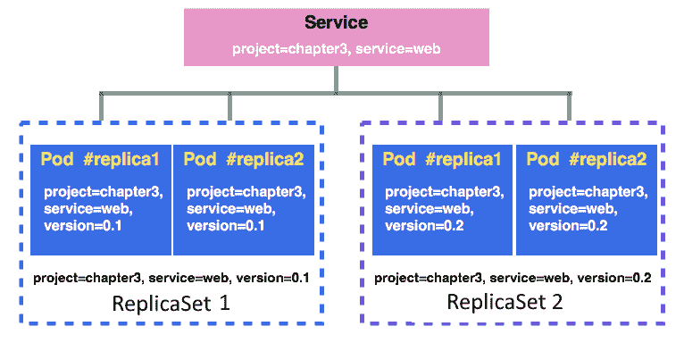

Service 通过标签选择器映射 pods

在上图中，所有的 pods 都匹配 service 选择器，`project=chapter3, service=web`，因此 Service 将负责将流量分发到所有这些 pods，而无需明确分配。

有四种类型的 Service：`ClusterIP`、`NodePort`、`LoadBalancer` 和 `ExternalName`：

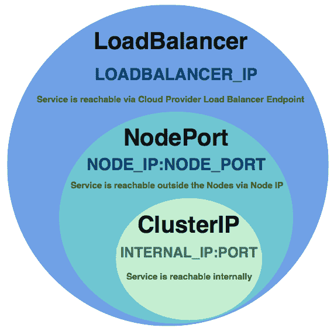

LoadBalancer 包括 NodePort 和 ClusterIP 的特性

# ClusterIP

`ClusterIP` 是默认的 Service 类型。它在集群内部 IP 上公开 Service。集群中的 pods 可以通过 IP 地址、环境变量或 DNS 访问 Service。在下面的示例中，我们将学习如何使用本地 Service 环境变量和 DNS 来访问集群中 Service 后面的 pods。

在启动 Service 之前，我们希望创建两个不同版本标签的 RS，具体如下：

```
// create RS 1 with nginx 1.12.0 version
# cat 3-2-3_rs1.yaml
apiVersion: apps/v1
kind: ReplicaSet
metadata:
  name: nginx-1.12
spec:
  replicas: 2
  selector:
    matchLabels:
      project: chapter3
      service: web
      version: "0.1" 
  template:
    metadata:
      name: nginx
      labels:
        project: chapter3
        service: web
        version: "0.1"
    spec:
      containers:
      - name: nginx
        image: nginx:1.12.0
        ports:
        - containerPort: 80

// create RS 2 with nginx 1.13.1 version
# cat 3-2-3_rs2.yaml

apiVersion: apps/v1
kind: ReplicaSet
metadata:
  name: nginx-1.13
spec:
  replicas: 2
  selector:
    matchLabels:
      project: chapter3
      service: web
      version: "0.2" 
  template:
    metadata:
      name: nginx
      labels:
        project: chapter3
        service: web
        version: "0.2"
    spec:
      containers:
      - name: nginx
        image: nginx:1.13.1
        ports:
        - containerPort: 80 
```

然后，我们可以创建我们的 pod 选择器，目标是 project 和 service 标签：

```
// simple nginx service 
# cat 3-2-3_service.yaml
kind: Service
apiVersion: v1
metadata:
  name: nginx-service
spec:
  selector:
   project: chapter3
   service: web
  ports:
  - protocol: TCP
    port: 80
    targetPort: 80
    name: http

// create the RSs 
# kubectl create -f 3-2-3_rs1.yaml
replicaset.apps/nginx-1.12 created
# kubectl create -f 3-2-3_rs2.yaml
replicaset.apps/nginx-1.13 created
// create the service
# kubectl create -f 3-2-3_service.yaml
service "nginx-service" created  
```

由于 `Service` 对象可能会创建 DNS 标签，因此服务名称必须由字母数字字符和连字符组成。标签的开头或结尾不能有连字符。

然后我们可以使用 `kubectl describe service <service_name>` 来检查 Service 的信息：

```
// check nginx-service information
# kubectl describe service nginx-service
Name:      nginx-service
Namespace:    default
Labels:      <none>
Annotations:    <none>
Selector:    project=chapter3,service=web
Type:      ClusterIP
IP:      10.0.0.188
Port:      http  80/TCP 
Endpoints:    172.17.0.5:80,172.17.0.6:80,172.17.0.7:80 + 1 more...
Session Affinity:  None
Events:      <none>
```

一个 Service 可以暴露多个端口。只需在 `service` 规范中扩展 `.spec.ports` 列表。

我们可以看到这是一个 `ClusterIP` 类型的 Service，它分配的内部 IP 地址是 `10.0.0.188`。端点显示我们在 Service 后面有四个 IP。通过 `kubectl describe pods <pod_name>` 命令可以找到 pod 的 IP 地址。Kubernetes 会与 `service` 对象一起创建一个 `endpoints` 对象，将流量路由到匹配的 pods。

当服务创建时使用了选择器，Kubernetes 会创建相应的端点条目并保持更新，这将指示服务路由的目标：

```
// list current endpoints. Nginx-service endpoints are created and pointing to the ip of our 4 nginx pods.
# kubectl get endpoints
NAME            ENDPOINTS                                               AGE
kubernetes      10.0.2.15:8443                                          2d
nginx-service   172.17.0.5:80,172.17.0.6:80,172.17.0.7:80 + 1 more...   10s 
```

ClusterIP 可以在集群内定义，尽管大多数情况下我们不会显式使用 IP 地址来访问集群。使用 `.spec.clusterIP` 可以为我们完成这项工作。

默认情况下，Kubernetes 会为每个服务暴露七个环境变量。在大多数情况下，前两个变量使我们能够使用 `kube-dns` 插件来进行服务发现：

+   `${SVCNAME}_SERVICE_HOST`

+   `${SVCNAME}_SERVICE_PORT`

+   `${SVCNAME}_PORT`

+   `${SVCNAME}_PORT_${PORT}_${PROTOCAL}`

+   `${SVCNAME}_PORT_${PORT}_${PROTOCAL}_PROTO`

+   `${SVCNAME}_PORT_${PORT}_${PROTOCAL}_PORT`

+   `${SVCNAME}_PORT_${PORT}_${PROTOCAL}_ADDR`

在下面的示例中，我们将在另一个 pod 中使用 `${SVCNAME}_SERVICE_HOST` 来检查是否能够访问我们的 nginx pod：

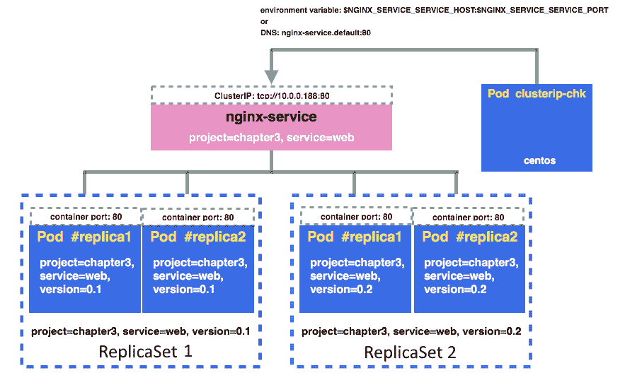

通过环境变量和 DNS 名称访问 ClusterIP

然后，我们将创建一个名为 `clusterip-chk` 的 pod 来通过 `nginx-service` 访问 nginx 容器：

```
// access nginx service via ${NGINX_SERVICE_SERVICE_HOST}
# cat 3-2-3_clusterip_chk.yaml
apiVersion: v1
kind: Pod
metadata:
  name: clusterip-chk
spec:
  containers:
  - name: centos
    image: centos
    command: ["/bin/sh", "-c", "while : ;do curl 
http://${NGINX_SERVICE_SERVICE_HOST}:80/; sleep 10; done"] 
```

我们可以通过 `kubectl logs` 命令查看 `cluserip-chk` pod 的 `stdout`：

```
// check stdout, see if we can access nginx pod successfully
# kubectl logs -f clusterip-chk
% Total    % Received % Xferd  Average Speed   Time    Time     Time  Current
                                     Dload  Upload   Total   Spent    Left  Speed
100   612  100   612    0     0   156k      0 --:--:-- --:--:-- --:--:--  199k
 ...
<title>Welcome to nginx!</title>
    ...  
```

这种抽象层解耦了 pod 之间的通信。Pod 是短暂的。通过 RS 和服务，我们可以构建稳健的服务，而无需担心一个 pod 是否会影响所有微服务。

启用 DNS 服务器后，位于同一集群和命名空间中的 pod 可以通过其 DNS 记录访问服务。

CoreDNS GA 在 Kubernetes 1.11 中引入，现在是 Kubernetes 的默认选项。在此之前，kube-dns 插件负责基于 DNS 的服务发现。

DNS 服务器通过监视 Kubernetes API 为新创建的服务创建 DNS 记录。集群 IP 的 DNS 格式是 `$servicename.$namespace`，端口是 `_$portname_$protocal.$servicename.$namespace`。`clusterip_chk` pod 的规格将与环境变量类似。在我们之前的示例中，将 URL 更改为 `http://nginx-service.default:_http_tcp.nginx-service.default/`，它们的工作方式应该完全相同。

# NodePort

如果服务设置为 `NodePort`，Kubernetes 将在每个节点的特定端口范围内分配一个端口。任何发送到该端口的流量都会被路由到服务端口。端口号可以由用户指定。如果没有指定，Kubernetes 将在 30,000 到 32,767 之间随机选择一个不会发生冲突的端口。另一方面，如果指定了端口，用户应自行负责管理端口冲突。`NodePort` 包含 `ClusterIP` 功能，Kubernetes 会为服务分配一个内部 IP。

在下面的示例中，我们将看到如何创建一个 `NodePort` 服务并使用它：

```
// write a nodeport type service
# cat 3-2-3_nodeport.yaml
kind: Service
apiVersion: v1
metadata:
  name: nginx-nodeport
spec:
  type: NodePort
  selector:
    project: chapter3
    service: web
  ports:
    - protocol: TCP
      port: 80
      targetPort: 80

// create a nodeport service
# kubectl create -f 3-2-3_nodeport.yaml
service "nginx-nodeport" created 
```

然后你应该能够通过`http://${NODE_IP}:80`访问该服务。节点可以是任何节点。`kube-proxy`会监视服务和端点的任何更新，并相应地更新 iptables 规则（如果使用默认的`iptables`代理模式）。

如果你使用的是 minikube，可以通过`minikube service [-n NAMESPACE] [--url] NAME`命令访问服务。在这个例子中，这是`minikube service nginx-nodeport`。

# LoadBalancer

这种类型仅在云服务提供商支持下使用，例如 Amazon Web Services（第十章，*Kubernetes on AWS*），Google Cloud Platform（第十一章，*Kubernetes on GCP*），以及 Azure（第十二章，*Kubernetes on Azure*）。如果我们创建一个 LoadBalancer 服务，Kubernetes 会由云服务提供商为该服务提供负载均衡器。

# ExternalName（kube-dns 版本>= 1.7）

有时，我们在云中使用不同的服务。Kubernetes 足够灵活，能够支持混合环境。我们可以使用 ExternalName 为集群中的外部端点创建 CNAME。

# 没有选择器的服务

服务使用选择器来匹配 Pod 并引导流量。然而，有时你需要实现一个代理作为 Kubernetes 集群与另一个命名空间、另一个集群或外部资源之间的桥梁。在以下示例中，我们将展示如何在集群中实现一个代理来访问[`www.google.com`](http://www.google.com)。这只是一个示例；在你的情况下，代理的来源可能是你数据库的端点或云中的其他资源：

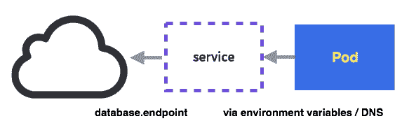

没有选择器的服务如何工作

配置文件与之前的类似，只是没有选择器部分：

```
// create a service without selectors
# cat 3-2-3_service_wo_selector_srv.yaml
kind: Service
apiVersion: v1
metadata:
  name: google-proxy
spec:
  ports:
    - protocol: TCP
      port: 80
      targetPort: 80

// create service without selectors
# kubectl create -f 3-2-3_service_wo_selector_srv.yaml
service "google-proxy" created 
```

不会创建 Kubernetes 端点，因为没有选择器。Kubernetes 不知道如何路由流量，因为没有选择器可以匹配 Pod。我们必须手动创建端点。

在`Endpoints`对象中，源地址不能是 DNS 名称，因此我们将使用`nslookup`从域名查找当前的 Google IP，并将其添加到`Endpoints.subsets.addresses.ip`：

```
// get an IP from google.com
# nslookup www.google.com
Server:    192.168.1.1
Address:  192.168.1.1#53

Non-authoritative answer:
Name:  google.com
Address: 172.217.0.238

// create endpoints for the ip from google.com
# cat 3-2-3_service_wo_selector_endpoints.yaml
kind: Endpoints
apiVersion: v1
metadata:
  name: google-proxy
subsets:
  - addresses:
      - ip: 172.217.0.238
    ports:
      - port: 80

// create Endpoints
# kubectl create -f 3-2-3_service_wo_selector_endpoints.yaml
endpoints "google-proxy" created 
```

让我们在集群中创建另一个 Pod 来访问我们的 Google 代理：

```
// pod for accessing google proxy
# cat 3-2-3_proxy-chk.yaml
apiVersion: v1
kind: Pod
metadata:
  name: proxy-chk
spec:
  containers:
  - name: centos
    image: centos
    command: ["/bin/sh", "-c", "while : ;do curl -L http://${GOOGLE_PROXY_SERVICE_HOST}:80/; sleep 10; done"]

// create the pod
# kubectl create -f 3-2-3_proxy-chk.yaml
pod "proxy-chk" created 
```

让我们检查 Pod 的`stdout`：

```
// get logs from proxy-chk
# kubectl logs proxy-chk
% Total    % Received % Xferd  Average Speed   Time    Time     Time  Current
                                     Dload  Upload   Total   Spent    Left  Speed
100   219  100   219    0     0   2596      0 --:--:-- --:--:-- --:--:--  2607
100   258  100   258    0     0   1931      0 --:--:-- --:--:-- --:--:--  1931
<!doctype html><html itemscope="" itemtype="http://schema.org/WebPage" lang="en-CA"> 
 ... 
```

太好了！现在我们可以确认代理正常工作了。流量会被路由到我们指定的端点。如果它不起作用，请确保你在外部资源的网络中添加了正确的入站规则。

端点不支持 DNS 作为来源。我们可以使用 ExternalName，它也没有选择器。这需要 kube-dns 版本>= 1.7。

在某些使用场景中，用户不需要负载均衡或代理功能。此时，我们可以将 `CluterIP = "None"` 设置为所谓的无头服务。有关更多信息，请参见 [`kubernetes.io/docs/concepts/services-networking/service/#headless-services`](https://kubernetes.io/docs/concepts/services-networking/service/#headless-services)。

# 卷

容器是临时的，其磁盘也是临时的。我们可以使用 `docker commit [CONTAINER]` 命令，或将数据卷挂载到容器中（第二章，*容器化 DevOps*）。在 Kubernetes 领域，卷管理至关重要，因为 Pod 可能会运行在任何节点上。此外，确保同一 Pod 中的容器能够共享相同的文件变得极为困难。这是 Kubernetes 中的一个重要话题。第四章，*有状态工作负载的管理*，介绍了卷管理。

# 秘密

如其名所示，秘密是一个存储以键值对格式存储机密信息的对象，供 Pod 提供敏感信息。它可能是一个密码、访问密钥或令牌。秘密不会存储在磁盘中，而是存储在每个节点的 `tmpfs` 文件系统中。节点上的 Kubelet 将创建一个 `tmpfs` 文件系统来存储该秘密。由于存储管理的考虑，秘密并不设计用来存储大量数据。当前单个秘密的大小限制为 1 MB。

我们可以通过启动 kubectl 创建一个秘密命令或通过规范，根据文件、目录或指定的字面值来创建一个秘密。秘密的格式有三种类型：通用类型（或编码后为不透明类型）、docker 注册表类型和 TLS 类型。

我们将在应用程序中使用通用或不透明类型。docker 注册表类型用于存储私有 Docker 注册表的凭证。TLS 秘密用于存储用于集群管理的 CA 证书包。

`docker-registry` 类型的秘密也叫做 `imagePullSecrets`，用于通过 kubelet 在拉取镜像时传递私有 Docker 注册表的密码。这意味着我们不需要为每个配置的节点输入 `docker login`。命令如下：`kubectl create secret docker-registry` `<registry_name>` `--docker-server` `=<docker_server> --docker-username=<docker_username>` `--docker-password=<docker_password> --docker-email=<docker_email>`。

我们将从一个通用示例开始，展示它是如何工作的：

```
// create a secret by command line
# kubectl create secret generic mypassword --from-file=./mypassword.txt
secret "mypassword" created 
```

基于目录和字面值创建秘密的选项与基于文件的选项非常相似。如果我们在 `--from-file` 后指定一个目录，目录中的文件将会被遍历。如果文件名是合法的秘密名称，则该文件名将作为秘密键。非普通文件，如子目录、符号链接、设备或管道将被忽略。另一方面，`--from-literal=<key>=<value>` 是一个选项，用于直接从命令中指定纯文本，例如 `--from-literal=username=root`。

在这里，我们从`mypassword.txt`文件中创建一个名为`mypassword`的密钥。默认情况下，密钥的键是文件名，这相当于`--from-file=mypassword=./mypassword.txt`选项。我们也可以添加多个`--from-file`实例。我们可以使用`kubectl get secret -o yaml`命令来查看密钥的更多详细信息：

```
// get the detailed info of the secret
# kubectl get secret mypassword -o yaml
apiVersion: v1
data:
  mypassword: bXlwYXNzd29yZA==
kind: Secret
metadata:
  creationTimestamp: 2017-06-13T08:09:35Z
  name: mypassword
  namespace: default
  resourceVersion: "256749"
  selfLink: /api/v1/namespaces/default/secrets/mypassword
  uid: a33576b0-500f-11e7-9c45-080027cafd37
type: Opaque 
```

我们可以看到，密钥的类型变成了`Opaque`，因为文本已经通过 kubectl 加密，它是`base64`编码的。我们可以使用一个简单的`bash`命令来解码它：

```
# echo "bXlwYXNzd29yZA==" | base64 --decode
mypassword
```

Pod 获取密钥有两种方式。第一种是通过文件，第二种是通过环境变量。第一种方法通过卷实现。语法涉及在容器规范中添加`containers.volumeMounts`，并在卷部分中添加密钥配置。

# 通过文件获取密钥

让我们先看看如何从 Pod 内的文件读取密钥：

```
// example for how a Pod retrieve secret
# cat 3-2-3_pod_vol_secret.yaml
apiVersion: v1
kind: Pod
metadata:
 name: secret-access
spec:
 containers:
 - name: centos
 image: centos
 command: ["/bin/sh", "-c", "while : ;do cat /secret/password-example; sleep 10; done"]
 volumeMounts:
 - name: secret-vol
 mountPath: /secret
 readOnly: true
 volumes:
 - name: secret-vol
 secret:
 secretName: mypassword
 items:
 - key: mypassword
 path: password-example

// create the pod 
# kubectl create -f 3-2-3_pod_vol_secret.yaml 
pod "secret-access" created 
```

密钥文件将被挂载到`/<mount_point>/<secret_name>`，无需在 Pod 中指定`items``key`、`path`或`/<mount_point>/<path>`。在这种情况下，文件路径是`/secret/password-example`。如果我们描述 Pod，我们会发现这个 Pod 中有两个挂载点：一个只读卷存储我们的密钥，另一个存储与 API 服务器通信的凭证，该凭证由 Kubernetes 创建和管理。我们将在第六章，*Kubernetes 网络*中了解更多内容：

```
# kubectl describe pod secret-access
...
Mounts:
      /secret from secret-vol (ro)
      /var/run/secrets/kubernetes.io/serviceaccount from default-token-jd1dq (ro)
...  
```

我们可以使用`kubectl delete secret` `<secret_name>`命令删除一个密钥。

描述 Pod 后，我们可以发现一个`FailedMount`事件，因为卷不再存在：

```
# kubectl describe pod secret-access
...
FailedMount  MountVolume.SetUp failed for volume 
"kubernetes.io/secret/28889b1d-5015-11e7-9c45-080027cafd37-secret-vol" (spec.Name: "secret-vol") pod "28889b1d-5015-11e7-9c45-080027cafd37" (UID: "28889b1d-5015-11e7-9c45-080027cafd37") with: secrets "mypassword" not found
...  
```

如果 Pod 在密钥创建之前生成，Pod 也会遇到失败。

我们现在将学习如何使用命令行创建密钥。我们将简要介绍它的 spec 格式：

```
// secret example
# cat 3-2-3_secret.yaml 
apiVersion: v1 
kind: Secret 
metadata: 
 name: mypassword 
type: Opaque 
data: 
 mypassword: bXlwYXNzd29yZA==
```

由于 spec 是纯文本，我们需要使用自己的`echo -n <password>` `| base64`命令来编码密钥。请注意，此时类型变为`Opaque`。这应该和我们通过命令行创建的方式相同。

# 通过环境变量获取密钥

或者，我们也可以使用环境变量来获取密钥，这对于短期凭证（如密码）来说更灵活。应用程序能够使用环境变量来获取数据库密码，而无需处理文件和卷：

```
// example to use environment variable to retrieve the secret
# cat 3-2-3_pod_ev_secret.yaml
apiVersion: v1
kind: Pod
metadata:
  name: secret-access-ev
spec:
  containers:
  - name: centos
    image: centos
    command: ["/bin/sh", "-c", "while : ;do echo $MY_PASSWORD; sleep 10; done"]
    env:
       - name: MY_PASSWORD
         valueFrom:
          secretKeyRef:
           name: mypassword
           key: mypassword

// create the pod 
# kubectl create -f 3-2-3_pod_ev_secret.yaml
pod "secret-access-ev" created 
```

密钥应该始终在需要它的 Pod 之前创建。否则，Pod 将无法成功启动。

声明在`spec.containers[].env[]`下。我们需要密钥的名称和键的名称。在本例中，两者都是`mypassword`。这个示例应该和我们之前看的那个相同。

# ConfigMap

ConfigMap 是一种资源，它允许你将配置留在 Docker 镜像外部。它将配置数据作为键值对注入到 Pod 中。它的特性类似于 secrets，但是，虽然 secrets 用于存储敏感数据（如密码），ConfigMap 用于存储不敏感的配置信息。

类似于 secrets，ConfigMap 可以基于文件、目录或指定的字面值。它们的语法与 secrets 相似，但使用`kubectl create configmap`：

```
// create configmap
# kubectl create configmap example --from-file=config/app.properties --from-file=config/database.properties
configmap "example" created  
```

由于两个`config`文件位于同一个文件夹`config`中，我们可以传递整个`config`文件夹，而不是逐一指定文件。在这种情况下，等效的命令是`kubectl create configmap example --from-file=config`。

如果我们描述该 ConfigMap，它将显示当前信息：

```
// check out detailed information for configmap
# kubectl describe configmap example
Name:    example
Namespace:  default
Labels:    <none>
Annotations:  <none>

Data
====
app.properties:
----
name=DevOps-with-Kubernetes
port=4420

database.properties:
----
endpoint=k8s.us-east-1.rds.amazonaws.com
port=1521
```

我们可以使用`kubectl edit configmap` `<configmap_name>`来更新创建后的配置。

我们也可以使用`literal`作为输入。前面示例的等效命令是`kubectl create configmap example --from-literal=app.properties.name=name=DevOps-with-Kubernetes`。当我们在应用程序中有许多配置时，这种方式并不总是很实用。

让我们看看如何在 Pod 内部使用这个功能。将 ConfigMap 用于 Pod 内部有两种方式：通过卷或环境变量。

# 通过卷使用 ConfigMap

与*Secrets*子章节中的示例类似，我们使用`configmap`语法挂载一个卷，并在容器模板内添加`volumeMounts`。在`centos`中的命令将循环执行`cat ${MOUNTPOINT}/$CONFIG_FILENAME`：

```
cat 3-2-3_pod_vol_configmap.yaml
apiVersion: v1
kind: Pod
metadata:
  name: configmap-vol
spec:
  containers:
    - name: configmap
      image: centos
      command: ["/bin/sh", "-c", "while : ;do cat /src/app/config/database.properties; sleep 10; done"]
      volumeMounts:
        - name: config-volume
          mountPath: /src/app/config
  volumes:
    - name: config-volume
      configMap:
        name: example

// create configmap
# kubectl create -f 3-2-3_pod_vol_configmap.yaml
pod "configmap-vol" created

// check out the logs
# kubectl logs -f configmap-vol
endpoint=k8s.us-east-1.rds.amazonaws.com
port=1521  
```

然后我们可以使用这种方法将我们的非敏感配置注入到 Pod 中。

# 通过环境变量使用 ConfigMap

要在 Pod 内部使用 ConfigMap，你需要在`env`部分使用`configMapKeyRef`作为值来源。这将把整个 ConfigMap 键值对填充到环境变量中：

```
# cat 3-2-3_pod_ev_configmap.yaml
apiVersion: v1
kind: Pod
metadata:
 name: configmap-ev
spec:
 containers:
 - name: configmap
 image: centos
 command: ["/bin/sh", "-c", "while : ;do echo $DATABASE_ENDPOINT; sleep 10; done"]
 env:
 - name: DATABASE_ENDPOINT
 valueFrom:
 configMapKeyRef:
 name: example
 key: database.properties
// create configmap
# kubectl create -f 3-2-3_pod_ev_configmap.yaml
pod/configmap-ev created
// check out the logs
# kubectl logs configmap-ev
endpoint=k8s.us-east-1.rds.amazonaws.com port=1521
```

Kubernetes 系统本身也使用 ConfigMap 来进行一些认证。通过在`kubectl describe configmap`命令中添加`--namespace=kube-system`，可以查看系统的 ConfigMap。

# 多容器编排

在这一部分，我们将重新审视我们的售票服务：一个作为前端的自助服务机 web 服务，提供获取/放置票据的接口。这里有一个 Redis 作为缓存，管理我们拥有的票据数量。Redis 还充当发布/订阅通道。一旦票据售出，自助服务机将发布一个事件到该通道。订阅者叫做 recorder，它会写入时间戳并将其记录到 MySQL 数据库中。有关详细的 Dockerfile 和 Docker Compose 实现，请参考第二章最后一节，*容器中的 DevOps*。我们将在 Kubernetes 中使用`Deployment`、`Service`、`Secret`、`Volume`和`ConfigMap`对象来实现这个示例。源代码可以在以下链接找到：[`github.com/DevOps-with-Kubernetes/examples/tree/master/chapter3/3-3_kiosk`](https://github.com/DevOps-with-Kubernetes/examples/tree/master/chapter3/3-3_kiosk)。

使用 Kubernetes 资源的服务架构如下图所示：

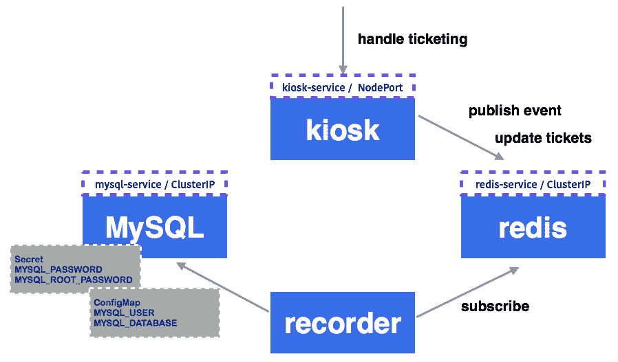

Kubernetes 世界中的一个自助服务机示例

我们需要四种类型的 pods。Deployment 是管理或部署 pods 的最佳选择。由于其部署策略功能，这将减少我们未来执行部署时所需的工作量。由于自助服务机、Redis 和 MySQL 将被其他组件访问，我们将为它们的 pods 关联服务。MySQL 作为数据存储，对于简单起见，我们将挂载一个本地卷到 MySQL。请注意，Kubernetes 提供了许多选择。有关详细信息和示例，请查看第四章，*管理有状态工作负载*。我们希望将敏感信息，如 MySQL 的 root 用户和密码存储在 secrets 中。其他不敏感的配置，如数据库名称或用户名，我们将交给 ConfigMap 来处理。

我们首先启动 MySQL，因为记录器依赖于它。在创建 MySQL 之前，我们需要先创建相应的`secret`和`ConfigMap`。要创建一个`secret`，我们需要生成`base64`加密数据：

```
// generate base64 secret for MYSQL_PASSWORD and MYSQL_ROOT_PASSWORD
# echo -n "pass" | base64
cGFzcw==
# echo -n "mysqlpass" | base64
bXlzcWxwYXNz
```

然后，我们就可以创建 secret 了：

```
# cat secret.yaml
apiVersion: v1
kind: Secret
metadata:
  name: mysql-user
type: Opaque
data:
  password: cGFzcw==

---
# MYSQL_ROOT_PASSWORD
apiVersion: v1
kind: Secret
metadata:
  name: mysql-root
type: Opaque
data:
  password: bXlzcWxwYXNz

// create mysql secret
# kubectl create -f secret.yaml --record
secret "mysql-user" created
secret "mysql-root" created 
```

接下来，我们来看看我们的 ConfigMap。这里，我们以数据库用户和数据库名称为例：

```
# cat config.yaml
kind: ConfigMap
apiVersion: v1
metadata:
  name: mysql-config
data:
  user: user
  database: db

// create ConfigMap
# kubectl create -f config.yaml --record
configmap "mysql-config" created 
```

然后是时候启动 MySQL 及其服务了：

```
# cat mysql.yaml
apiVersion: apps/v1
kind: Deployment
metadata:
  name: lmysql
spec:
  replicas: 1
  selector:
    matchLabels:
      tier: database
      version: "5.7"
  template:
    metadata:
      labels:
        tier: database
        version: "5.7"
    spec:
      containers:
      - name: lmysql
        image: mysql:5.7
        volumeMounts:
          - mountPath: /var/lib/mysql
            name: mysql-vol
        ports:
        - containerPort: 3306
        env:
        - name: MYSQL_ROOT_PASSWORD
          valueFrom:
            secretKeyRef:
              name: mysql-root
              key: password
        - name: MYSQL_DATABASE
          valueFrom:
            configMapKeyRef:
              name: mysql-config
              key: database
        - name: MYSQL_USER
          valueFrom:
            configMapKeyRef:
              name: mysql-config
              key: user
        - name: MYSQL_PASSWORD
          valueFrom:
            secretKeyRef:
              name: mysql-user
              key: password
      volumes:
      - name: mysql-vol
        hostPath:
          path: /mysql/data
  minReadySeconds: 10
  strategy:
    type: RollingUpdate
    rollingUpdate:
      maxSurge: 1
      maxUnavailable: 1
---
kind: Service
apiVersion: v1
metadata:
  name: lmysql-service
spec:
  selector:
    tier: database
  ports:
    - protocol: TCP
      port: 3306
      targetPort: 3306
      name: tcp3306 
```

我们可以通过在文件中添加三个短横线来将多个规格放在一个文件中。在这里，我们将`hostPath /mysql/data`挂载到 pods 的路径`/var/lib/mysql`。在环境部分，我们使用`secretKeyRef`和`configMapKeyRef`语法来引用 secret 和 ConfigMap。

在创建 MySQL 之后，Redis 将是下一个最佳候选项，因为其他服务依赖于它，但它没有任何先决条件：

```
// create Redis deployment 
# cat redis.yaml
apiVersion: apps/v1
kind: Deployment
metadata:
  name: lcredis
spec:
  replicas: 1
  selector:
    matchLabels:
      tier: cache
      version: "3.0"
  template:
    metadata:
      labels:
        tier: cache
        version: "3.0"
    spec:
      containers:
      - name: lcredis
        image: redis:3.0
        ports:
        - containerPort: 6379
  minReadySeconds: 1
  strategy:
    type: RollingUpdate
    rollingUpdate:
      maxSurge: 1
      maxUnavailable: 1
---
kind: Service
apiVersion: v1
metadata:
  name: lcredis-service
spec:
  selector:
    tier: cache
  ports:
    - protocol: TCP
      port: 6379
      targetPort: 6379
      name: tcp6379

// create redis deployements and service
# kubectl create -f redis.yaml
deployment "lcredis" created
service "lcredis-service" created
```

然后是启动自助服务机的好时机：

```
# cat kiosk-example.yaml
apiVersion: apps/v1
kind: Deployment
metadata:
  name: kiosk-example
spec:
  replicas: 5
  selector:
    matchLabels:
      tier: frontend
      version: "3"
  template:
    metadata:
      labels:
        tier: frontend
        version: "3"
      annotations:
        maintainer: cywu
    spec:
      containers:
      - name: kiosk-example
        image: devopswithkubernetes/kiosk-example
        ports:
        - containerPort: 5000
        env:
        - name: REDIS_HOST
          value: lcredis-service.default
  minReadySeconds: 5
  strategy:
    type: RollingUpdate
    rollingUpdate:
      maxSurge: 1
      maxUnavailable: 1
---
kind: Service
apiVersion: v1
metadata:
  name: kiosk-service
spec:
  type: NodePort
  selector:
    tier: frontend
  ports:
    - protocol: TCP
      port: 80
      targetPort: 5000
      name: tcp5000 
// launch the spec
 # kubectl create -f kiosk-example.yaml
 deployment "kiosk-example" created
 service "kiosk-service" created 
```

在这里，我们将`lcredis-service.default`暴露给 kiosk pods 作为环境变量。这是 kube-dns 为`Service`对象创建的 DNS 名称（在本章中称为 Services）。因此，kiosk 可以通过环境变量访问 Redis 主机。

最终，我们将创建一个录制器。这个录制器不会向外暴露任何接口，因此不需要`Service`对象：

```
# cat recorder-example.yaml
apiVersion: apps/v1
kind: Deployment
metadata:
  name: recorder-example
spec:
  replicas: 3
  selector:
    matchLabels:
        tier: backend
        version: "3"
  template:
    metadata:
      labels:
        tier: backend
        version: "3"
      annotations:
        maintainer: cywu
    spec:
      containers:
      - name: recorder-example
        image: devopswithkubernetes/recorder-example
        env:
        - name: REDIS_HOST
          value: lcredis-service.default
        - name: MYSQL_HOST
          value: lmysql-service.default
        - name: MYSQL_USER
          value: root
        - name: MYSQL_ROOT_PASSWORD
          valueFrom:
            secretKeyRef:
              name: mysql-root
              key: password
  minReadySeconds: 3
  strategy:
    type: RollingUpdate
    rollingUpdate:
      maxSurge: 1
      maxUnavailable: 1

// create recorder deployment
 # kubectl create -f recorder-example.yaml
 deployment "recorder-example" created 
```

录制器需要同时访问 Redis 和 MySQL。它使用通过密钥注入的 root 凭据。Redis 和 MySQL 的两个端点通过服务的 DNS 名称`<service_name>.<namespace>`进行访问。

然后我们可以检查`Deployment`对象：

```
// check deployment details
# kubectl get deployments
NAME               DESIRED   CURRENT   UP-TO-DATE   AVAILABLE   AGE
kiosk-example      5         5         5            5           1h
lcredis            1         1         1            1           1h
lmysql             1         1         1            1           1h
recorder-example   3         3         3            3           1h 
```

如预期的那样，我们有四个`Deployment`对象，且每个对象的期望 pod 数量不同。

当我们将 kiosk 暴露为 NodePort 时，我们应该能够访问它的服务端点，并检查它是否正常工作。假设我们有一个节点，它的 IP 地址是`192.168.99.100`，Kubernetes 分配的 NodePort 是`30520`。

如果你正在使用 minikube，`minikube service [-n NAMESPACE] [--url] NAME`可以帮助你通过默认浏览器访问服务的 NodePort：

`**// 打开 kiosk 控制台**`

`**# minikube service kiosk-service**`

`**正在默认浏览器中打开 kuberenetes 服务 default/kiosk-service...**`

这将允许我们找到 IP 和端口。

然后，我们可以使用`POST`和`GET /tickets`创建并获取票据：

```
// post ticket
# curl -XPOST -F 'value=100' http://192.168.99.100:30520/tickets
SUCCESS

// get ticket
# curl -XGET http://192.168.99.100:30520/tickets
100
```

# 总结

在本章中，我们学习了 Kubernetes 的基本概念。我们了解到，Kubernetes 主节点有 kube-apiserver 来处理请求，而控制器管理器是 Kubernetes 的控制中心。它们确保我们期望的容器数量得到满足，控制 pods 与服务之间的关联端点，并且控制 API 访问令牌。我们还学习了 Kubernetes 节点，它们是用来托管容器的工作节点，接收来自主节点的信息，并根据配置路由流量。

然后，我们使用 minikube 演示了基本的 Kubernetes 对象，包括 pods、ReplicaSets、Deployments、Services、secrets 和 ConfigMaps。最后，我们演示了如何将我们学到的所有概念结合起来构建我们的 kiosk 应用。

正如我们之前提到的，容器中的数据会在容器被删除时消失。因此，在容器世界中，卷（volume）是非常重要的，它能够持久化数据。在第四章《管理有状态工作负载》中，我们将学习卷是如何工作的，以及如何使用持久卷。
