# 管理有状态的工作负载

在第三章，《*Kubernetes 入门*》中，我们介绍了 Kubernetes 的基本功能。一旦你开始使用 Kubernetes 部署容器，你就需要考虑应用程序的数据生命周期以及 CPU/内存资源管理。

在本章中，我们将讨论以下主题：

+   容器与卷的行为

+   介绍 Kubernetes 的卷功能

+   Kubernetes 持久卷的最佳实践与陷阱

+   提交短生命周期的应用程序作为 Kubernetes 作业

# Kubernetes 卷管理

Kubernetes 和 Docker 默认使用本地磁盘。Docker 应用程序可能将任何数据存储到磁盘并加载，例如日志数据、临时文件和应用数据。只要主机有足够的空间，且应用程序具有必要的权限，数据将在容器存在期间保持存在。换句话说，当容器终止、退出、崩溃或重新分配到另一个主机时，数据将丢失。

# 容器卷生命周期

为了理解 Kubernetes 的卷管理，你需要了解 Docker 卷的生命周期。以下示例展示了当容器重新启动时 Docker 如何与卷交互：

```
//run CentOS Container
$ docker run -it centos
# ls
anaconda-post.log  dev  home  lib64       media  opt   root  sbin  sys  usr
bin                etc  lib   lost+found  mnt    proc  run   srv   tmp  var 

 //create one file (/I_WAS_HERE) at root directory
# touch /I_WAS_HERE
# ls /
I_WAS_HERE         bin  etc   lib    lost+found  mnt  proc  run   srv  tmp  
var
anaconda-post.log  dev  home  lib64  media       opt  root  sbin  sys  usr
 //Exit container
# exit
exit

//re-run CentOS Container
# docker run -it centos
 //previous file (/I_WAS_HERE) was disappeared
# ls /
anaconda-post.log  dev  home  lib64       media  opt   root  sbin  sys  usr bin                etc  lib   lost+found  mnt    proc  run   srv   tmp  var  
```

在 Kubernetes 中，你还需要注意 pod 重启的情况。在资源不足时，Kubernetes 可能会停止一个容器，然后在同一个或另一个 Kubernetes 节点上重启该容器。

以下示例展示了当资源不足时 Kubernetes 的行为。收到内存不足错误时，一个 pod 会被终止并重新启动：

```
//there are 2 pod on the same Node
$ kubectl get pods
NAME                          READY     STATUS    RESTARTS   AGE
Besteffort                    1/1       Running   0          1h
guaranteed                    1/1       Running   0          1h 
//when application consumes a lot of memory, one Pod has been killed
$ kubectl get pods
NAME                          READY     STATUS    RESTARTS   AGE
Besteffort                    0/1       Error     0          1h
guaranteed                    1/1       Running   0          1h
 //clashed Pod is restarting
$ kubectl get pods
NAME                          READY     STATUS             RESTARTS   AGE
Besteffort                    0/1       CrashLoopBackOff   0          1h
guaranteed                    1/1       Running            0          1h 

//few moment later, Pod has been restarted 

$ kubectl get pods
NAME                          READY     STATUS    RESTARTS   AGE
Besteffort                    1/1       Running   1          1h
guaranteed                    1/1       Running   0          1h 
```

# 在同一 pod 中共享容器之间的卷

第三章，《*Kubernetes 入门*》中提到，同一 Kubernetes pod 中的多个容器可以共享相同的 pod IP 地址、网络端口和 IPC。因此，应用程序可以通过 localhost 网络进行通信。然而，文件系统是隔离的。

以下图示展示了 **Tomcat** 和 **nginx** 在同一个 pod 中。这些应用程序可以通过 localhost 进行互相通信。然而，它们无法访问彼此的 `config` 文件：

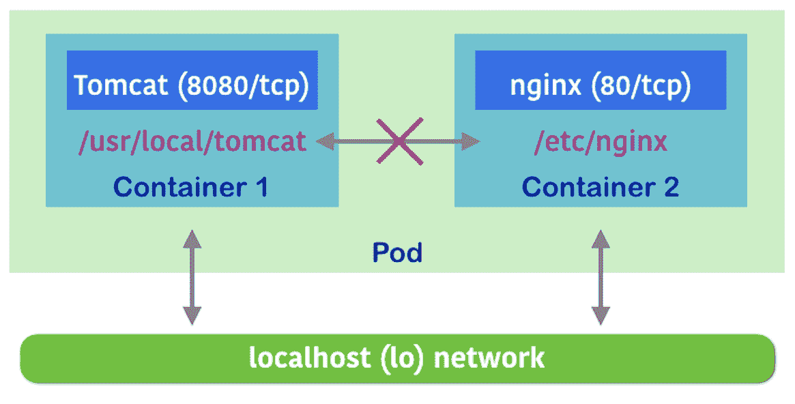

一些应用程序不会影响这些场景和行为，但有些应用程序可能有一些使用案例需要它们使用共享目录或文件。因此，开发人员和 Kubernetes 管理员需要了解无状态和有状态应用程序的不同类型。

# 无状态和有状态的应用程序

无状态应用程序不需要在磁盘卷上保留应用程序或用户数据。尽管无状态应用程序在容器存在期间可能会将数据写入文件系统，但从应用程序生命周期的角度来看，这些数据并不重要。

例如，`tomcat`容器运行一些 Web 应用程序。它还会在`/usr/local/tomcat/logs/`下写入应用程序日志，但如果丢失`log`文件，它不会受到影响。

但是，如果你需要持久化一个应用程序日志用于分析或审计呢？在这种情况下，Tomcat 仍然可以是无状态的，但可以与另一个容器（如 Logstash）共享`/usr/local/tomcat/logs`存储卷（[`www.elastic.co/products/logstash`](https://www.elastic.co/products/logstash)）。Logstash 将把日志发送到选择的分析存储，如 Elasticsearch（[`www.elastic.co/products/elasticsearch`](https://www.elastic.co/products/elasticsearch)）。

在这种情况下，`tomcat`容器和`logstash`容器必须在同一个 Kubernetes Pod 中，并共享`/usr/local/tomcat/logs`存储卷，如下所示：

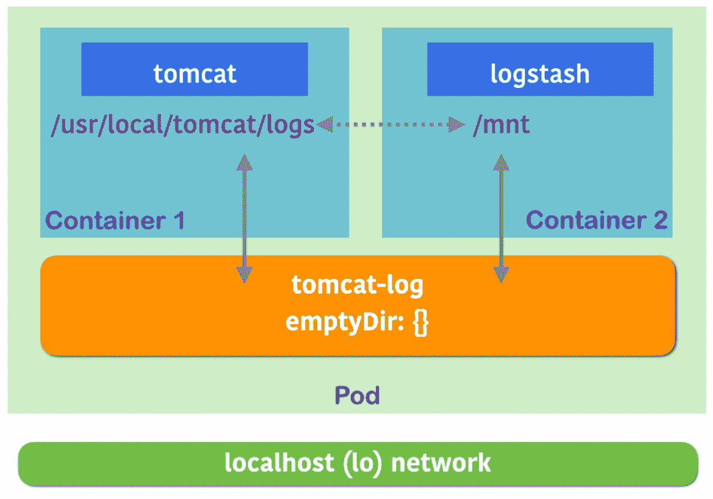

上图展示了 Tomcat 和 Logstash 如何使用 Kubernetes 的`emptyDir`存储卷共享`log`文件（[`kubernetes.io/docs/concepts/storage/volumes/#emptydir`](https://kubernetes.io/docs/concepts/storage/volumes/)）。

Tomcat 和 Logstash 没有通过 localhost 使用网络，但它们通过 Kubernetes 的`emptyDir`卷共享了文件系统，Tomcat 容器中的`/usr/local/tomcat/logs`与`logstash`容器中的`/mnt`共享：

```
$ cat tomcat-logstash.yaml 
apiVersion: apps/v1
kind: Deployment
metadata:
  name: tomcat
spec:
  replicas: 1
  selector:
    matchLabels:
      run: tomcat
  template:
    metadata:
      labels:
        run: tomcat
    spec:
      containers:
        - image: tomcat
          name: tomcat
          ports:
            - containerPort: 8080
          env:
            - name: UMASK
              value: "0022"
          volumeMounts:
            - mountPath: /usr/local/tomcat/logs
              name: tomcat-log
        - image: logstash
          name: logstash
          args: ["-e input { file { path => \"/mnt/localhost_access_log.*\" } } output { stdout { codec => rubydebug } elasticsearch { hosts => [\"http://elasticsearch-svc.default.svc.cluster.local:9200\"] } }"]
          volumeMounts:
            - mountPath: /mnt
              name: tomcat-log
      volumes:
        - name: tomcat-log
          emptyDir: {}
```

让我们创建`tomcat`和`logstash` Pod，然后看看 Logstash 是否能在`/mnt`下看到 Tomcat 应用程序日志：

```
//create Pod
$ kubectl create -f tomcat-logstash.yaml 
deployment.apps/tomcat created

//check Pod name
$ kubectl get pods
NAME                      READY     STATUS    RESTARTS   AGE
tomcat-7d99999565-6pm64   2/2       Running   0          1m

//connect to logstash container to see /mnt directory
$ kubectl exec -it tomcat-7d99999565-6pm64 -c logstash /bin/bash
root@tomcat-7d99999565-6pm64:/# ls /mnt
catalina.2018-09-20.log      localhost.2018-09-20.log   manager.2018-09-20.log
host-manager.2018-09-20.log  localhost_access_log.2018-09-20.txt
```

在这种情况下，Elasticsearch 在最终目的地必须是有状态的，这意味着它使用持久化存储。即使容器被重启，Elasticsearch 容器也必须保留数据。此外，你无需将 Elasticsearch 容器配置在与 Tomcat/Logstash 相同的 Pod 中。因为 Elasticsearch 应该是一个集中式日志数据存储，它可以与 Tomcat/Logstash Pod 分开，并独立扩展。

一旦你确定应用程序需要持久化存储，就可以查看不同类型的存储卷以及管理持久化存储的不同方法。

# Kubernetes 的持久化存储和动态供给

Kubernetes 支持多种持久化存储，例如，公共云存储，如 AWS EBS 和 Google 持久磁盘。它还支持网络（分布式）文件系统，如 NFS、GlusterFS 和 Ceph。此外，它还可以支持块设备，如 iSCSI 和光纤通道。根据环境和基础设施，Kubernetes 管理员可以选择最佳匹配的持久化存储类型。

以下示例使用 GCP 持久磁盘作为持久存储。第一步是创建一个 GCP 持久磁盘，并命名为`gce-pd-1`。

如果使用 AWS EBS、Google 持久磁盘或 Azure 磁盘存储，Kubernetes 节点必须位于同一云平台上。此外，Kubernetes 对每个节点的最大卷数有限制。请参阅 Kubernetes 文档 [`kubernetes.io/docs/concepts/storage/storage-limits/`](https://kubernetes.io/docs/concepts/storage/storage-limits/)。

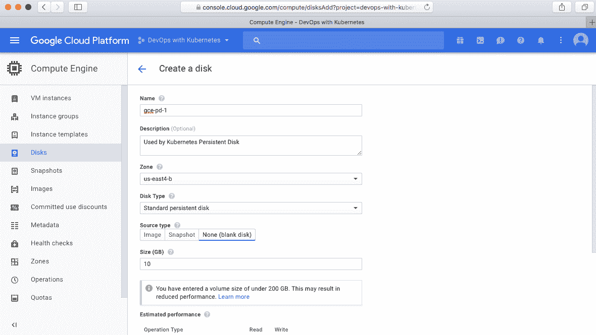

然后，在 `Deployment` 定义中指定名称 `gce-pd-1`：

```
$ cat tomcat-pv.yml 
apiVersion: apps/v1
kind: Deployment
metadata:
  name: tomcat
spec:
  replicas: 1
  selector:
    matchLabels:
      run: tomcat
  template:
    metadata:
      labels:
        run: tomcat
    spec:
      containers:
        - image: tomcat
          name: tomcat
          ports:
          - containerPort: 8080
          volumeMounts:
          - mountPath: /usr/local/tomcat/logs
 name: tomcat-log
 volumes:
      - name: tomcat-log
        gcePersistentDisk:
          pdName: gce-pd-1
          fsType: ext4
```

这将把来自 GCE 持久磁盘的持久磁盘挂载到 `/usr/local/tomcat/logs`，从而保持 Tomcat 应用程序的日志持久化。

# 通过持久卷声明抽象化卷层

在配置文件中直接指定持久卷会与特定基础设施紧密耦合。例如，在前面的示例（`tomcat-log` 卷）中，`pdName` 是 `gce-pd-1`，卷类型是 `gcePersistentDisk`。从容器管理的角度来看，pod 定义不应该与特定环境绑定，因为基础设施可能会根据环境不同而有所变化。理想的 pod 定义应该是灵活的，或抽象出实际的基础设施，只指定卷名称和挂载点。

因此，Kubernetes 提供了一个抽象层，将 pod 与持久卷关联，这个抽象层被称为 **持久卷声明**（**PVC**）。这使我们能够与基础设施解耦。Kubernetes 管理员只需提前预分配持久卷的大小。然后，Kubernetes 会将持久卷和 PVC 绑定如下：

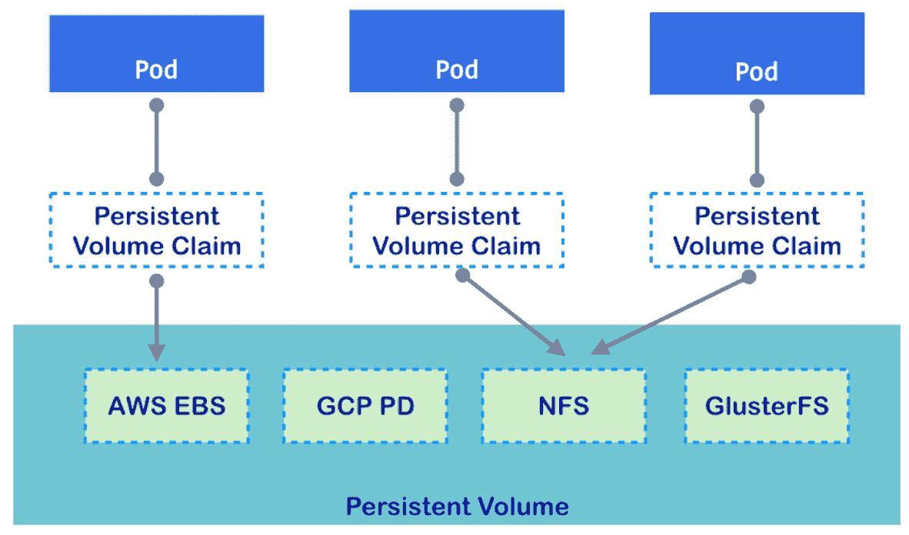

以下示例是使用 PVC 的 pod 定义；我们先使用之前的示例（`gce-pd-1`）在 Kubernetes 中进行注册：

```
$ cat pv-gce-pd-1.yml 
apiVersion: "v1"
kind: "PersistentVolume"
metadata:
  name: pv-1
spec:
  storageClassName: "my-10g-pv-1"
  capacity:
    storage: "10Gi"
  accessModes:
    - "ReadWriteOnce"
  gcePersistentDisk:
    fsType: "ext4"
    pdName: "gce-pd-1"

$ kubectl create -f pv-gce-pd-1.yml 
persistentvolume/pv-1 created

$ kubectl get pv
NAME      CAPACITY   ACCESS MODES   RECLAIM POLICY   STATUS      CLAIM     STORAGECLASS   REASON    AGE
pv-1      10Gi       RWO            Retain           Available             my-10g-pv-1              11s 
```

请注意，我们将 `storageClassName` 设置为 `my-10g-pv-1`，作为 PVC 可以通过指定相同名称来绑定的标识符。

接下来，我们创建一个与持久卷（`pv-1`）关联的 PVC。

`storageClassName` 参数允许 Kubernetes 使用静态供应。这是因为一些 Kubernetes 环境，如 **Google 容器引擎**（**GKE**），已经配置了动态供应。如果不指定 `storageClassName`，Kubernetes 将分配一个新的 `PersistentVolume`，然后绑定到 `PersistentVolumeClaim`。

```
//create PVC specify storageClassName as "my-10g-pv-1"
$ cat pvc-1.yml 
apiVersion: v1
kind: PersistentVolumeClaim
metadata:
    name: pvc-1
spec:
  storageClassName: "my-10g-pv-1"
  accessModes:
    - ReadWriteOnce
  resources:
    requests:
      storage: 10Gi

$ kubectl create -f pvc-1.yml 
persistentvolumeclaim/pvc-1 created

//check PVC status is "Bound"
$ kubectl get pvc
NAME      STATUS    VOLUME    CAPACITY   ACCESS MODES   STORAGECLASS   AGE
pvc-1     Bound     pv-1      10Gi       RWO            my-10g-pv-1    7s

//check PV status is also "Bound"
$ kubectl get pv
NAME      CAPACITY   ACCESS MODES   RECLAIM POLICY   STATUS    CLAIM           STORAGECLASS   REASON    AGE
pv-1      10Gi       RWO            Retain           Bound     default/pvc-1   my-10g-pv-1              2m
```

现在，`tomcat` 设置已经与 GCE 持久卷解耦，并绑定到抽象卷 `pvc-1`：

```
$ cat tomcat-pvc.yml 
apiVersion: apps/v1
kind: Deployment
metadata:
  name: tomcat
spec:
  replicas: 1
  selector:
    matchLabels:
      run: tomcat
  template:
    metadata:
      labels:
        run: tomcat
    spec:
      containers:
        - image: tomcat
          name: tomcat
          ports:
          - containerPort: 8080
          volumeMounts:
          - mountPath: /usr/local/tomcat/logs
            name: tomcat-log
      volumes:
      - name: tomcat-log
        persistentVolumeClaim:
          claimName: "pvc-1"
```

# 动态供应和 StorageClass

PVC 提供了持久卷管理的灵活性。然而，预分配一些持久卷池可能不是成本效益高，特别是在公共云环境中。

Kubernetes 还通过支持持久卷的动态配置来帮助解决这种情况。Kubernetes 管理员定义持久卷的供应者，称为`StorageClass`。然后，PVC 请求`StorageClass`动态分配持久卷，并将其与 PVC 关联，如下所示：

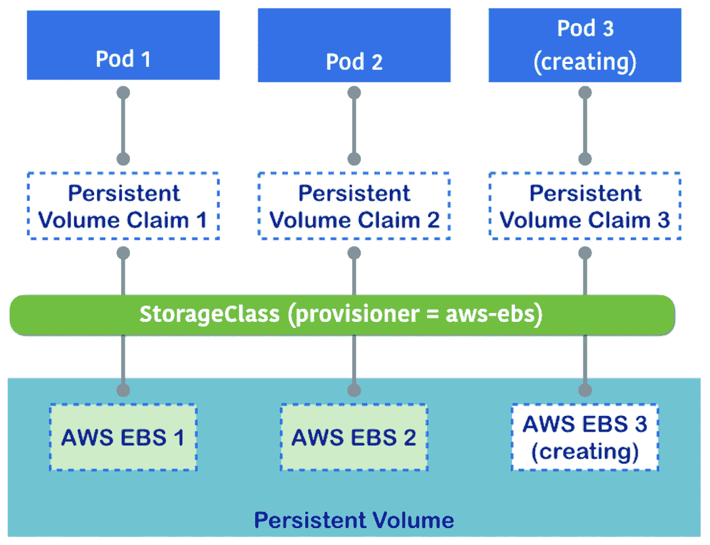

在以下示例中，AWS EBS 作为`StorageClass`使用。在创建 PVC 时，`StorageClass`动态创建一个 EBS，然后将其注册为**持久卷**(**PV**)，并将其附加到 PVC：

```
$ cat storageclass-aws.yml 
kind: StorageClass
apiVersion: storage.k8s.io/v1
metadata:
  name: aws-sc
provisioner: kubernetes.io/aws-ebs
parameters:
  type: gp2

$ kubectl create -f storageclass-aws.yml
storageclass "aws-sc" created

$ kubectl get storageclass
NAME.     TYPE
aws-sc.   kubernetes.io/aws-ebs
```

一旦`StorageClass`成功创建，接下来创建一个没有 PV 的 PVC，但需要指定`StorageClass`名称。在这个示例中，名称应为`aws-sc`，如下所示：

```
$ cat pvc-aws.yml 
apiVersion: v1
kind: PersistentVolumeClaim
metadata:
    name: pvc-aws-1
spec:
  storageClassName: "aws-sc"
  accessModes:
    - ReadWriteOnce
  resources:
    requests:
      storage: 10Gi

$ kubectl create -f pvc-aws.yml 
persistentvolumeclaim/pvc-aws-1 created

$ kubectl get pv
NAME                                       CAPACITY   ACCESS MODES   RECLAIM POLICY   STATUS    CLAIM               STORAGECLASS   REASON    AGE
pvc-03557eb8-bc8b-11e8-994f-42010a800085   10Gi       RWO            Delete           Bound     default/pvc-aws-1   aws-sc                   1s
```

以下截图展示了提交到 StorageClass 创建 PVC 后的 EBS。AWS 控制台显示一个由 StorageClass 创建的新 EBS：

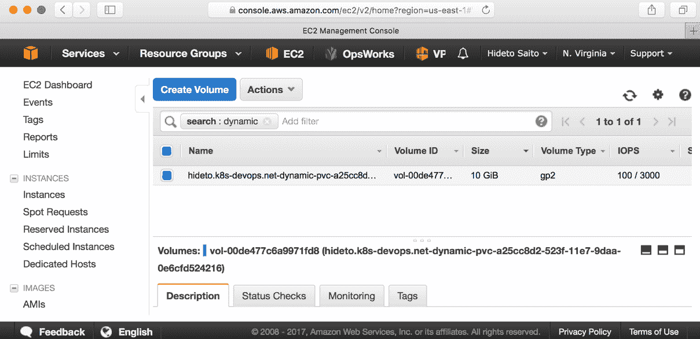

请注意，像 Amazon EKS ([`aws.amazon.com/eks/`](https://aws.amazon.com/eks/))、Google Kubernetes Engine ([`cloud.google.com/container-engine/`](https://cloud.google.com/container-engine/)) 和 Azure Kubernetes Service ([`azure.microsoft.com/en-us/services/kubernetes-service/`](https://azure.microsoft.com/en-us/services/kubernetes-service/)) 这样的托管 Kubernetes 服务会默认创建`StorageClass`。例如，Google Kubernetes Engine 将默认存储类设置为 Google Cloud 持久磁盘。有关更多信息，请参考第十章，*Kubernetes 在 AWS 上*，第十一章*，Kubernetes 在* *GCP 上*，以及第十二章，*Kubernetes 在 Azure 上*：

```
//default Storage Class on GKE
$ kubectl get sc
NAME                 TYPE
standard (default)   kubernetes.io/gce-pd 
```

# 关于**短暂性**和**持久性**卷设置的问题

你可能会将你的应用程序视为无状态的，因为`datastore`功能由另一个 Pod 或系统处理。然而，这里面有一些陷阱，有时应用程序会存储一些重要文件，而你未曾意识到。例如，Grafana ([`grafana.com/grafana`](https://grafana.com/grafana)) 连接了时间序列数据源，如 Graphite ([`graphiteapp.org`](https://graphiteapp.org)) 和 InfluxDB ([`www.influxdata.com/time-series-database/`](https://www.influxdata.com/time-series-database/))，所以人们可能误认为 Grafana 是一个无状态应用。

事实上，Grafana 本身也使用数据库来存储用户、组织和仪表板元数据。默认情况下，Grafana 使用 SQLite3 组件，并将数据库存储为`/var/lib/grafana/grafana.db`。因此，当容器重新启动时，Grafana 的设置将会全部被重置。

以下示例展示了 Grafana 在使用短暂性卷时的行为：

```
$ cat grafana.yml 
apiVersion: apps/v1
kind: Deployment
metadata:
  name: grafana
spec:
  replicas: 1
  selector:
    matchLabels:
      run: grafana
  template:
    metadata:
      labels:
        run: grafana
    spec:
      containers:
        - image: grafana/grafana
          name: grafana
          ports:
            - containerPort: 3000
---
apiVersion: v1
kind: Service
metadata:
  name: grafana
spec:
  ports:
    - protocol: TCP
      port: 3000
      nodePort: 30300
  type: NodePort
  selector:
    run: grafana
```

接下来，进入 Grafana web 控制台创建名为`kubernetes org`的 Grafana `Organizations`，如下所示：

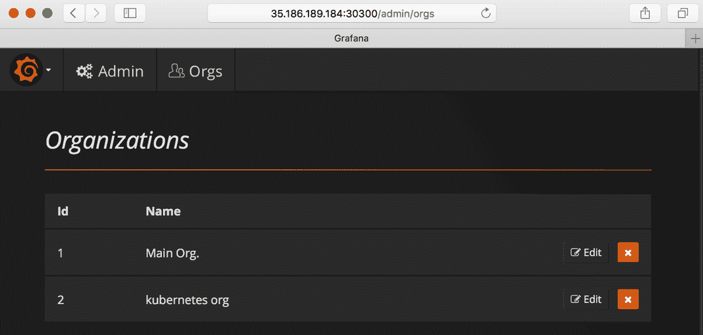

然后，查看 `Grafana` 目录。这里有一个数据库文件（`/var/lib/grafana/grafana.db`），其时间戳在创建 Grafana `Organizations` 后已更新：

```
$ kubectl get pods
NAME                      READY     STATUS    RESTARTS   AGE
grafana-6bf966d7b-7lh89   1/1       Running   0          3m

//access to Grafana container
$ kubectl exec -it grafana-6bf966d7b-7lh89 /bin/bash
grafana@grafana-6bf966d7b-7lh89:/$ ls -l /var/lib/grafana/
total 404
-rw-r--r-- 1 grafana grafana 401408 Sep 20 03:30 grafana.db
drwxrwxrwx 2 grafana grafana   4096 Sep  7 14:59 plugins
drwx------ 4 grafana grafana   4096 Sep 20 03:30 sessions
```

当 Pod 被删除时，`Deployment` 将启动一个新 Pod，并检查是否存在 Grafana `Organizations`：

```
grafana@grafana-6bf966d7b-7lh89:/$ exit
//delete grafana pod
$ kubectl delete pod grafana-6bf966d7b-7lh89
pod "grafana-6bf966d7b-7lh89" deleted

//Kubernetes Deployment made a new Pod
$ kubectl get pods
NAME                      READY     STATUS    RESTARTS   AGE
grafana-6bf966d7b-wpdmk   1/1       Running   0          9s

//contents has been recreated
$ kubectl exec -it grafana-6bf966d7b-wpdmk /bin/bash
grafana@grafana-6bf966d7b-wpdmk:/$ ls -l /var/lib/grafana
total 400
-rw-r--r-- 1 grafana grafana 401408 Sep 20 03:33 grafana.db
drwxrwxrwx 2 grafana grafana   4096 Sep  7 14:59 plugins
```

看起来 `sessions` 目录消失了，`grafana.db` 也被 Docker 镜像重新创建了。如果你访问 Web 控制台，Grafana 的 `organization` 也会消失：

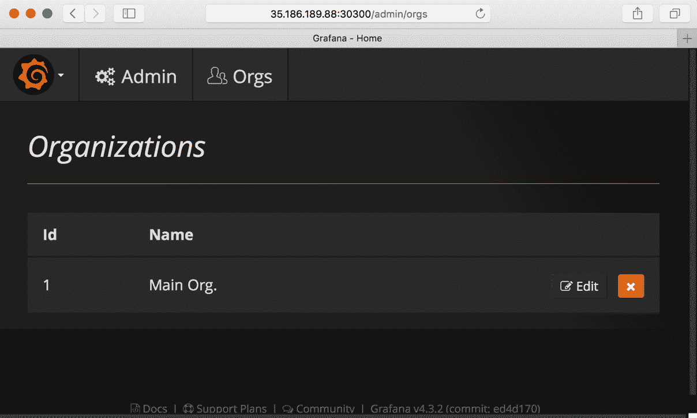

那么，直接将一个持久化卷挂载到 Grafana 上怎么样？你很快会发现，将持久化卷挂载到一个由 `Deployment` 控制的 Pod 上并不能很好地扩展，因为每个新创建的 Pod 都会尝试挂载相同的持久化卷。在大多数情况下，只有第一个 Pod 能挂载持久化卷。其他 Pod 会尝试挂载该卷，如果无法挂载，它们将放弃并冻结。这种情况发生在持久化卷只支持 RWO（只读写一次；仅一个 Pod 可以写入）时。

在以下示例中，Grafana 使用持久化卷挂载 `/var/lib/grafana`；然而，由于 Google 持久化磁盘是 RWO，导致无法扩展：

```
$ cat grafana-pv.yml 
apiVersion: apps/v1
kind: Deployment
metadata:
  name: grafana
spec:
  replicas: 1
  selector:
    matchLabels:
      run: grafana
  template:
    metadata:
      labels:
        run: grafana
    spec:
      containers:
        - image: grafana/grafana:3.1.1
          name: grafana
          ports:
            - containerPort: 3000
          volumeMounts:
          - mountPath: /var/lib/grafana
            name: grafana-data
      volumes:
      - name: grafana-data
        gcePersistentDisk:
          pdName: gce-pd-1
          fsType: ext4

$ kubectl create -f grafana-pv.yml 
deployment.apps/grafana created

$ kubectl get pods
NAME  READY  STATUS RESTARTS  AGE
grafana-6cf5467c9d-nw6b7  1/1  Running  0 41s

//can't scale up, becaues 3 Pod can't mount the same volume
$ kubectl scale deploy grafana --replicas=3
The Deployment "grafana" is invalid: spec.template.spec.volumes[0].gcePersistentDisk.readOnly: Invalid value: false: must be true for replicated pods > 1; GCE PD can only be mounted on multiple machines if it is read-only
```

即使持久化卷具有 RWX 能力（读写多次；多个 Pod 可以同时挂载进行读写），比如 NFS，当多个 Pod 尝试绑定相同的卷时，它也不会报错。然而，我们仍然需要考虑是否可以让多个应用实例使用相同的文件夹/文件。例如，如果将 Grafana 复制到两个或更多 Pod，它们将发生冲突，因为多个 Grafana 实例尝试写入相同的 `/var/lib/grafana/grafana.db`，从而可能导致数据损坏，如下图所示：

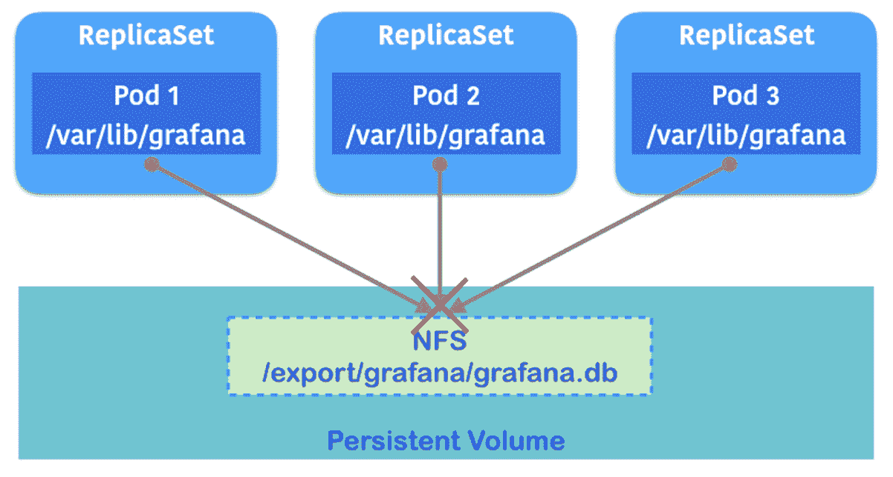

在这种情况下，Grafana 必须使用像 MySQL 或 PostgreSQL 这样的后端数据库，而不是 SQLite3，如下所示。它允许多个 Grafana 实例正确地读写 Grafana 元数据：

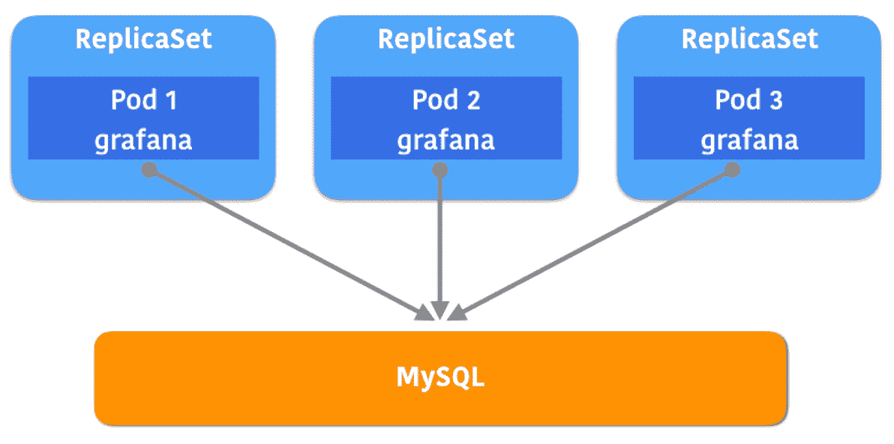

由于 RDBMS 基本上支持通过网络连接多个应用实例，这种场景非常适合多个 Pod 使用。请注意，Grafana 支持使用 RDBMS 作为后端元数据存储；然而，并不是所有应用程序都支持 RDBMS。

有关使用 MySQL/PostgreSQL 的 Grafana 配置，请参阅在线文档：

[`docs.grafana.org/installation/configuration/#database`](http://docs.grafana.org/installation/configuration/#database)。

因此，Kubernetes 管理员需要仔细监控应用程序与卷的交互行为，并理解在某些使用场景下，仅使用持久化卷可能无法解决问题，因为在扩展 Pod 时可能会出现问题。

如果多个 Pod 需要访问集中存储卷，那么可以考虑使用前面所示的数据库（如果适用）。另一方面，如果多个 Pod 需要各自的存储卷，可以考虑使用 `StatefulSet`。

# 使用 StatefulSet 复制带有持久化存储的 Pod

`StatefulSet` 在 Kubernetes 1.5 中引入；它将 Pod 与持久化存储卷绑定。当扩展一个 Pod 时，无论是增加还是减少，Pod 和持久化存储卷会一起创建或删除。

此外，Pod 创建过程是串行的。例如，当请求 Kubernetes 扩展两个额外的 `StatefulSet` 时，Kubernetes 会首先创建 **持久化存储声明 1** 和 **Pod 1**，然后再创建 **持久化存储声明 2** 和 **Pod 2**，但不会同时进行。这有助于管理员在应用程序启动时，如果应用程序需要注册到某个注册表：

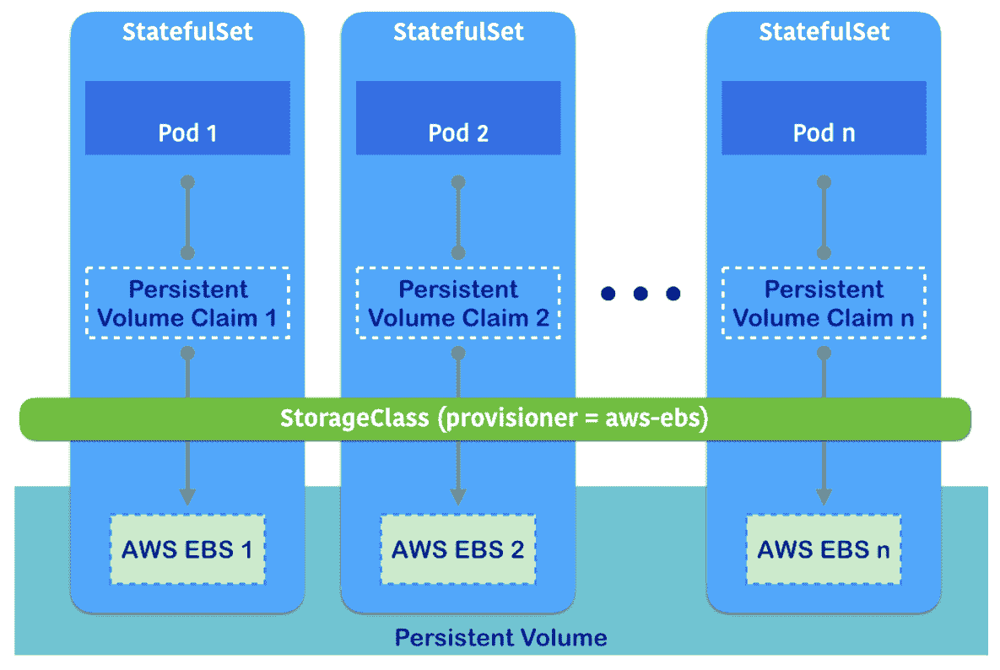

即使某个 Pod 宕机，`StatefulSet` 也会保留该 Pod 的位置（Kubernetes 元数据，如 Pod 名称）和持久化存储卷。然后，它会尝试重新创建一个容器，将其重新分配给相同的 Pod，并挂载相同的持久化存储卷。

如果你使用 `StatefulSet` 运行无头服务，Kubernetes 还会为 Pod 分配并保留完全限定的域名（FQDN）。

无头服务将在 第六章*Kubernetes 网络* 中详细描述。

这有助于通过 Kubernetes 调度器跟踪和维护 Pod/持久化存储卷的数量，确保应用程序保持在线：

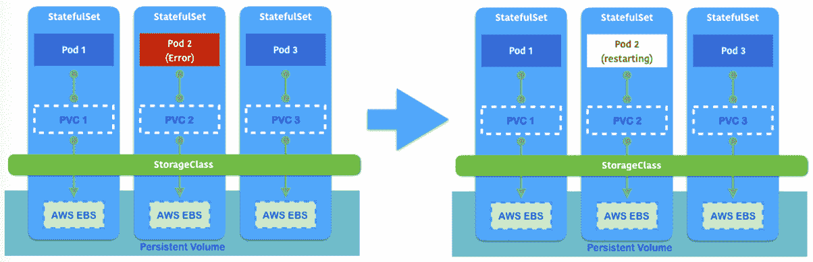

带有持久化存储的 `StatefulSet` 需要动态提供和 `StorageClass`，因为 `StatefulSet` 可以进行扩展。Kubernetes 需要知道如何在添加更多 Pod 时提供持久化存储。

# 向 Kubernetes 提交任务

通常，应用程序设计为长期运行，就像守护进程一样。典型的长期应用程序会打开网络端口并保持运行。它要求应用程序保持运行。如果失败，你需要重启以恢复状态。因此，使用 Kubernetes 部署是长期应用程序的最佳选择。

另一方面，一些应用程序设计为短生命周期的，例如命令脚本。即使成功执行，也预期应用程序会退出以完成任务。因此，Kubernetes 部署并不是合适的选择，因为部署会尝试保持进程运行。

不用担心，Kubernetes 也支持短生命周期的应用程序。你可以将容器提交为 **任务** 或 **定时任务**，Kubernetes 会将其调度到适当的节点并执行你的容器。

Kubernetes 支持几种类型的任务：

+   单一任务

+   可重复任务

+   并行任务

+   定时任务

最后一个也被称为**CronJob**。Kubernetes 支持这些不同类型的 Jobs，它们与 pods 的使用方式不同，以便更好地利用你的资源。

# 向 Kubernetes 提交单个 Job

类似 Job 的 pod 适用于运行批处理程序，如收集数据、查询数据库、生成报告等。尽管这被称为短生命周期，但花费多少时间并不重要。这可能需要几秒钟，甚至几天才能完成。它最终会退出应用程序，这意味着它有一个结束状态。

Kubernetes 能够将短生命周期的应用程序作为 Job 进行监控，在失败的情况下，Kubernetes 会为该 Job 创建一个新的 pod，尝试完成你的应用程序。

为了向 Kubernetes 提交 Job，你需要编写一个 Job 模板，指定 pod 配置。以下示例演示了如何检查 Ubuntu Linux 中安装的 `dpkg`：

```
$ cat job-dpkg.yaml
apiVersion: batch/v1
kind: Job
metadata:
 name: package-check
spec:
  activeDeadlineSeconds: 60
 template:
 spec:
 containers:
 - name: package-check
 image: ubuntu
 command: ["dpkg-query", "-l"]
 restartPolicy: Never
```

Job 的定义与 pod 定义类似，但重要的设置是 `activeDeadlineSeconds` 和 `restartPolicy`。`activeDeadlineSeconds` 参数设置 pod 运行的最大时间。如果超时，pod 将被终止。`restartPolicy` 参数定义了在失败情况下 Kubernetes 的行为。例如，当 pod 崩溃时，如果你指定 `Never`，Kubernetes 不会重启；如果你指定 `OnFailure`，Kubernetes 会尝试重新提交 Job，直到成功完成。

使用`kubectl`命令提交一个 Job，查看 Kubernetes 如何管理 pod：

```
$ kubectl create -f job-dpkg.yaml 
job.batch/package-check created
```

因为这个 Job（`dpkg-query -l` 命令）是短生命周期的，它最终会`exit()`。因此，如果`dpkg-query`命令顺利完成，即使没有活动的 pod，Kubernetes 也不会尝试重启。因此，当你输入`kubectl get pods`时，pod 状态将在完成后显示为 `completed`：

```
$ kubectl get pods
NAME                  READY     STATUS      RESTARTS   AGE
package-check-7tfkt   0/1       Completed   0          6m
```

虽然没有活动的 pod 存在，但你仍然可以通过输入 `kubectl logs` 命令来查看应用程序日志，如下所示：

```
$ kubectl logs package-check-7tfkt
Desired=Unknown/Install/Remove/Purge/Hold
| Status=Not/Inst/Conf-files/Unpacked/halF-conf/Half-inst/trig-aWait/Trig-pend
|/ Err?=(none)/Reinst-required (Status,Err: uppercase=bad)
||/ Name Version Architecture Description
+++-=======================-======================-============-========================================================================
ii adduser  3.116ubuntu1  all add and remove users and groups
ii apt  1.6.3ubuntu0.1  amd64 commandline package manager
ii base-files 10.1ubuntu2.2 amd64 Debian base system miscellaneous files
ii base-passwd  3.5.44  amd64 Debian base system master password and group files
...
```

# 提交一个可重复的 Job

用户还可以决定单个 Job 中应完成的任务数量。这对解决一些随机抽样问题非常有帮助。让我们重用之前的模板，并添加`spec.completions`来查看差异：

```
$ cat repeat-job.yaml 
apiVersion: batch/v1
kind: Job
metadata:
  name: package-check-repeat
spec:
  activeDeadlineSeconds: 60
  completions: 3
  template:
    spec:
      containers:
      - name: package-check-repeat
        image: ubuntu
        command: ["dpkg-query", "-l"]
      restartPolicy: Never

$ kubectl create -f repeat-job.yaml 
job.batch/package-check-repeat created

$ kubectl get pods
NAME                         READY     STATUS        RESTARTS   AGE
package-check-7tfkt          0/1       Completed     0          52m
package-check-repeat-vl988   0/1       Completed     0          7s
package-check-repeat-flhz9   0/1       Completed     0          4s
package-check-repeat-xbf8b   0/1       Completed     0          2s
```

如你所见，三个 pod 被创建来完成这个 Job。如果你需要在特定时间反复运行程序，这非常有用。然而，正如你从前面的结果中的 Age 列看到的，这些 pods 是依次运行的。前面的结果显示年龄分别为 7 秒、4 秒和 2 秒。这意味着第二个 Job 是在第一个 Job 完成后启动的，第三个 Job 是在第二个 Job 完成后启动的。

如果某个 Job 运行时间较长（例如几天），但 1^(st)、2^(nd) 和 3^(rd) 个 Job 之间没有相关性，那么依次运行它们就没有意义了。在这种情况下，可以使用并行 Job。

# 提交并行作业

如果你的批处理作业之间没有状态或依赖关系，你可以考虑并行提交作业。为此，类似于 `spec.completions` 参数，作业模板有一个 `spec.parallelism` 参数，用于指定要并行运行的作业数量：

```
$ cat parallel-job.yaml 
apiVersion: batch/v1
kind: Job
metadata:
  name: package-check-parallel
spec:
  activeDeadlineSeconds: 60
  parallelism: 3
  template:
    spec:
      containers:
      - name: package-check-parallel
        image: ubuntu
        command: ["dpkg-query", "-l"]
      restartPolicy: Never

//submit a parallel job
$ kubectl create -f parallel-job.yaml 
job.batch/package-check-parallel created

//check the result
$ kubectl get pods
NAME                           READY     STATUS      RESTARTS   AGE
package-check-7tfkt            0/1       Completed   0          1h
package-check-parallel-k8hpz   0/1       Completed   0          4s
package-check-parallel-m272g   0/1       Completed   0          4s
package-check-parallel-mc279   0/1       Completed   0          4s
package-check-repeat-flhz9     0/1       Completed   0          13m
package-check-repeat-vl988     0/1       Completed   0          13m
package-check-repeat-xbf8b     0/1       Completed   0          13m
```

从 `kubectl get pods` 命令的 `AGE` 列可以看出，表示这三个 Pod 是同时运行的。

在这种设置下，Kubernetes 可以将任务调度到可用节点上运行应用程序，从而轻松扩展你的作业。如果你想运行像工人应用程序这样的东西，将多个 Pod 分配到不同的节点，这会非常有用。

最后，如果你不再需要检查作业结果，可以使用 `kubectl delete` 命令删除资源，示例如下：

```
$ kubectl get jobs
NAME                     DESIRED   SUCCESSFUL   AGE
package-check            1         1            1h
package-check-parallel   <none>    3            9m
package-check-repeat     3         3            23m

// delete a job one by one
$ kubectl delete jobs package-check-parallel
job.batch "package-check-parallel" deleted

$ kubectl delete jobs package-check-repeat
job.batch "package-check-repeat" deleted

$ kubectl delete jobs package-check
job.batch "package-check" deleted

//there is no pod 
$ kubectl get pods
No resources found.
```

# 使用 CronJob 调度运行作业

如果你熟悉 **UNIX CronJob** 或 **Java Quartz** ([`www.quartz-scheduler.org`](http://www.quartz-scheduler.org))，那么 Kubernetes CronJob 是一个非常直观的工具，你可以用它定义一个特定的时间来重复运行 Kubernetes 作业。

调度格式非常简单；它指定了以下五个项目：

+   分钟（0 到 59）

+   小时（0 到 23）

+   每月的日期（1 到 31）

+   月份（1 到 12）

+   星期几（0：星期日到 6：星期六）

例如，如果你只想每年 11 月 12 日早上 9:00 运行你的作业，给我发送生日祝福，那么调度格式将是 `0 9 12 11 *`

你也可以使用斜杠（`/`）来指定步长值。以五分钟为间隔运行前述作业的调度格式将是：

```
*/5  * * * *
```

以下模板使用 `CronJob` 每五分钟运行 `package-check` 命令：

```
$ cat cron-job.yaml 
apiVersion: batch/v1beta1
kind: CronJob
metadata:
  name: package-check-schedule
spec:
  schedule: "*/5 * * * *"
  concurrencyPolicy: "Forbid"
  jobTemplate:
    spec:
      template:
        spec:
          containers:
          - name: package-check-schedule
            image: ubuntu
            command: ["dpkg-query", "-l"]
          restartPolicy: Never

$ kubectl create -f cron-job.yaml 
cronjob.batch/package-check-schedule created
```

你可能会注意到，模板格式与这里的作业模板略有不同。不过，我们需要关注一个参数：`spec.concurrencyPolicy`。通过这个参数，你可以指定如果上一个作业没有完成，而下一个作业的调度时间临近时的行为。这将决定下一个作业如何运行。你可以设置以下值：

+   **允许**：允许执行下一个作业

+   **禁止**：跳过下一个作业的执行

+   **替换**：删除当前作业，然后执行下一个作业

如果你设置了 `允许`，则可能会有积累一些未完成作业的风险。因此，在测试阶段，你应该设置 `禁止` 或 `替换` 来监控作业的执行和完成情况。

几秒钟后，作业会在你期望的时间触发——在这种情况下是每五分钟一次。然后你可以使用 `kubectl get jobs` 和 `kubectl get pods` 命令查看作业条目，如下所示：

```
$ kubectl get jobs
NAME DESIRED  SUCCESSFUL  AGE
package-check-schedule-1537169100  1  1 8m
package-check-schedule-1537169400  1  1 3m

$ kubectl get pods
NAME READY  STATUS RESTARTS  AGE
package-check-schedule-1537169100-mnhxw  0/1  Completed  0 8m
package-check-schedule-1537169400-wvbgp  0/1  Completed  0 3m
```

`CronJob` 将一直存在，直到你删除它。这意味着每五分钟，`CronJob` 将创建一个新的作业条目，相关的 pods 也会持续创建。这将影响 Kubernetes 资源的消耗。因此，默认情况下，`CronJob` 会保留最多三个成功的作业（通过 `spec.successfulJobsHistoryLimit`）和一个失败的作业（通过 `spec.failedJobsHistoryLimit`）。你可以根据需求更改这些参数。

总的来说，`CronJob` 允许作业根据预定时间自动在你的应用程序中运行。你可以利用 `CronJob` 来运行报告生成作业、每日或每周批处理作业等。

# 摘要

在本章中，我们讨论了使用持久化卷的有状态应用程序。与短暂卷（ephemeral volumes）相比，在应用程序重启或 pod 扩展时，它们可能会遇到一些问题。此外，Kubernetes 上的持久化卷管理也得到了改进，使其更加便捷，正如你可以从 `StatefulSet` 和动态供给等工具中看到的那样。

此外，Jobs 和 CronJobs 是用于 pods 的特殊工具。与部署/副本集（deployment/ReplicaSets）相比，它们有一个期望的 pod 数量在运行，而这与作业的理想情况相反，作业的理想状态是当 pods 完成任务后应该被删除。这种短生命周期的应用程序也可以由 Kubernetes 管理。

在第五章，*集群管理与扩展*，我们将讨论集群管理，例如身份验证、授权和准入控制。我们还将介绍**自定义资源定义**（**CRD**），以及如何通过你自己的代码控制 Kubernetes 对象。
