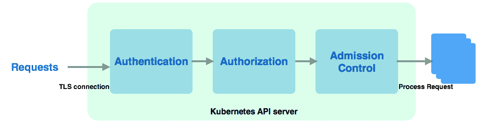

# 集群管理与扩展

在前面的章节中，我们已经熟悉了基本的 DevOps 技能和 Kubernetes 对象。这包括了多个方面，如如何将我们的应用容器化，并将容器化软件部署到 Kubernetes 中。现在是时候深入了解 Kubernetes 集群管理了。

在本章中，我们将学习以下内容：

+   利用命名空间设置管理边界

+   使用 kubeconfig 在多个集群之间切换

+   Kubernetes 身份验证

+   Kubernetes 授权

+   动态准入控制

+   Kubernetes **自定义资源定义** (**CRD**) 和控制器

虽然 minikube 是一个相对简单的环境，但在本章中我们将使用 **Google Kubernetes Engine** (**GKE**)。有关 GKE 中集群部署的更多信息，请参考 第十一章，*在 GCP 上使用 Kubernetes*。

# Kubernetes 命名空间

我们在 第三章，*Kubernetes 入门* 中已经了解了 Kubernetes 命名空间，它们用于将集群中的资源划分为多个虚拟集群。命名空间使得每个组可以共享同一个物理集群，并且具有隔离性。每个命名空间提供以下功能：

+   名称的范围；每个命名空间中的对象名称是唯一的

+   确保可信身份验证的策略

+   设置资源管理的资源配额的能力

现在，让我们学习如何使用上下文在不同的命名空间之间切换。

# 上下文

**上下文** 是集群信息、用于身份验证的用户和命名空间的组合。例如，以下是我们在 GKE 中一个集群的上下文信息：

```
- context:
  cluster: gke_devops-with-kubernetes_us-central1-b_cluster
  user: gke_devops-with-kubernetes_us-central1-b_cluster
name: gke_devops-with-kubernetes_us-central1-b_cluster
```

我们可以使用 `kubectl config current-context` 命令来列出当前的上下文：

```
# kubectl config current-context
gke_devops-with-kubernetes_us-central1-b_cluster
```

要列出所有配置的详细信息，包括上下文，您可以使用 `kubectl config view` 命令。要查看当前正在使用的上下文，可以使用 `kubectl config get-contexts` 命令。

# 创建一个上下文

下一步是创建一个上下文。像前面示例中一样，我们需要为上下文设置用户和集群名称。如果没有指定，这些值将会为空。创建上下文的命令如下：

```
$ kubectl config set-context <context_name> --namespace=<namespace_name> --cluster=<cluster_name> --user=<user_name>
```

在同一集群中可以创建多个上下文。以下是如何在我的 GKE 集群 `gke_devops-with-kubernetes_us-central1-b_cluster` 中为 `chapter5` 创建上下文的示例：

```
// create a context with my GKE cluster
# kubectl config set-context chapter5 --namespace=chapter5 --cluster=gke_devops-with-kubernetes_us-central1-b_cluster --user=gke_devops-with-kubernetes_us-central1-b_cluster
Context "chapter5" created.
```

# 切换当前上下文

我们可以使用 `use-context` 子命令来切换上下文：

```
# kubectl config use-context chapter5
Switched to context "chapter5".
```

切换上下文后，通过 `kubectl` 调用的每个命令都会在 `chapter5` 上下文下执行。列出 pod 时无需显式指定命名空间。

# Kubeconfig

Kubeconfig 是一个文件，你可以通过切换上下文来切换多个集群。我们可以使用 `kubectl config view` 查看设置，使用 `kubectl config current-context` 命令查看当前正在使用的上下文。以下是一个 GCP 集群在 `kubeconfig` 文件中的示例：

```
# kubectl config view
apiVersion: v1
clusters: 
- cluster:
 certificate-authority-data: DATA+OMITTED
 server: https://35.0.0.200
 name: gke_devops-with-kubernetes_us-central1-b_cluster
contexts:
- context:
 cluster: gke_devops-with-kubernetes_us-central1-b_cluster
 user: gke_devops-with-kubernetes_us-central1-b_cluster
 name: gke_devops-with-kubernetes_us-central1-b_cluster
current-context: gke_devops-with-kubernetes_us-central1-b_cluster
kind: Config
preferences: {}
users:
- name: gke_devops-with-kubernetes_us-central1-b_cluster
 user:
 auth-provider:
 config:
 access-token: XXXXX
 cmd-args: config config-helper --format=json
 cmd-path: /Users/devops/k8s/bin/gcloud
 expiry: 2018-12-16T02:51:21Z
 expiry-key: '{.credential.token_expiry}'
 token-key: '{.credential.access_token}'
 name: gcp
```

正如我们之前所学，我们可以使用 `kubectl config use-context CONTEXT_NAME` 来切换上下文。我们还可以根据 `$KUBECONFIG` 环境变量指定 `kubeconfig` 文件，以确定使用哪些 kubeconfig 文件。通过这种方式，可以合并配置文件。例如，以下命令将合并 `kubeconfig-file1` 和 `kubeconfig-file2`：

```
export KUBECONFIG=$KUBECONFIG: kubeconfig-file1: kubeconfig-file2
```

我们还可以使用 `kubectl config --kubeconfig=<config file name> set-cluster <cluster name>` 来指定目标 `kubeconfig` 文件中的目标集群。

默认情况下，`kubeconfig` 文件位于 `$HOME/.kube/config`。如果没有设置前面提到的任何设置，将会加载这个文件。

# 服务帐户

在 Kubernetes 中，有两种类型的用户帐户：**服务帐户**和**用户帐户**。所有发送到 API 服务器的请求都来自服务帐户或用户帐户。服务帐户由 Kubernetes API 管理，而用户帐户则不在 Kubernetes 中管理或存储。以下是服务帐户和用户帐户的简单对比：

|  | **服务帐户** | **用户帐户** |
| --- | --- | --- |
| **作用域** | 命名空间级 | 全局 |
| **使用者** | 进程 | 普通用户 |
| **创建者** | API 服务器或通过 API 调用 | 管理员，而非通过 API 调用 |
| **由谁管理** | API 服务器 | 集群外部 |

默认情况下，Kubernetes 集群会为不同的用途创建不同的服务帐户。在 GKE 中，已经创建了一些服务帐户：

```
// list service account across all namespaces
# kubectl get serviceaccount --all-namespaces
NAMESPACE     NAME                         SECRETS   AGE
default       default                      1         5d
kube-public   default                      1         5d
kube-system   namespace-controller         1         5d
kube-system   resourcequota-controller     1         5d
kube-system   service-account-controller   1         5d
kube-system   service-controller           1         5d
chapter5      default                      1         2h
...  
```

Kubernetes 会在每个命名空间中创建一个默认的服务帐户，如果在创建 Pod 时没有在 Pod 规范中指定服务帐户，则会使用该默认服务帐户。我们来看一下默认服务帐户在 `chapter5` 命名空间中的作用：

```
# kubectl describe serviceaccount/default
Name: default
Namespace: default
Labels: <none>
Annotations: <none>
Image pull secrets: <none>
Mountable secrets: default-token-52qnr
Tokens: default-token-52qnr
Events: <none> 
```

我们可以看到，服务帐户基本上是使用可挂载的密钥作为令牌。让我们深入了解令牌中的内容：

```
// describe the secret, the name is default-token-52qnr here
# kubectl describe secret default-token-52qnr
Name:       default-token-52qnr
Namespace:  chapter5
Annotations:  kubernetes.io/service-account.name: default
              kubernetes.io/service-account.uid: 6bc2f108-dae5-11e8-b6f4-42010a8a0244 Type: kubernetes.io/service-account-token
Data
====
ca.crt:     # the public CA of api server. Base64 encoded.
namespace:  # the name space associated with this service account. Base64 encoded
token:      # bearer token. Base64 encoded
```

服务帐户的密钥将自动挂载到 `/var/run/secrets/kubernetes.io/serviceaccount` 目录。当 Pod 访问 API 服务器时，API 服务器将检查证书和令牌进行认证。

在服务帐户或 Pod 规范中指定 `automountServiceAccountToken: false` 可以禁用自动挂载服务帐户密钥。

# 认证和授权

认证和授权是 Kubernetes 中的重要组件。认证用于验证用户，并检查用户是否是他们所声称的人。而授权则检查用户拥有的权限级别。Kubernetes 支持不同的认证和授权模块。

以下是一个示意图，展示了 Kubernetes API 服务器在收到请求时如何处理访问控制：



Kubernetes API 服务器中的访问控制

当请求到达 API 服务器时，首先通过验证客户端证书与 API 服务器中的**证书颁发机构**（**CA**）建立 TLS 连接。API 服务器中的 CA 通常位于 `/etc/kubernetes/`，客户端的证书通常位于 `$HOME/.kube/config`。握手完成后，进入身份验证阶段。在 Kubernetes 中，身份验证模块是链式的，可以使用多个身份验证模块。当接收到请求时，Kubernetes 会依次尝试所有身份验证器，直到成功。如果所有身份验证模块都失败，请求将被拒绝并返回 HTTP 401 Unauthorized 错误。如果成功，通过其中一个身份验证器验证用户身份，且请求被认证。此时，Kubernetes 的授权模块开始发挥作用。

授权模块验证用户是否具有足够的权限来执行他们请求的操作。授权模块也是链式的。授权请求需要通过每个模块，直到成功。如果所有模块都失败，请求者将收到 HTTP 403 Forbidden 响应。

准入控制是一组可配置的插件，在 API 服务器中决定请求是否被接受或拒绝。在此阶段，如果请求未能通过某个插件的检查，将立即被拒绝。

# 身份验证

默认情况下，服务账户是基于令牌的。当你创建一个服务账户或带有默认服务账户的命名空间时，Kubernetes 会创建令牌，将其作为一个密钥进行 Base64 编码存储，并将该密钥作为卷挂载到 pod 中。然后，pod 内的进程就可以与集群进行通信。另一方面，用户账户代表的是一个普通用户，可能会使用 `kubectl` 直接操作资源。

# 服务账户令牌身份验证

当我们创建一个服务账户时，Kubernetes 服务账户准入控制插件会自动创建一个签名的持有令牌。我们可以使用该服务账户令牌来验证用户身份。

让我们尝试在 `chapter5` 命名空间中创建一个名为 `myaccount` 的服务账户：

```
// the configuration file of service account object
# cat service-account.yaml
apiVersion: v1
kind: ServiceAccount
metadata:
 name: myaccount
 namespace: chapter5

// create myaccount
# kubectl create -f service-account.yaml
serviceaccount/myaccount created
```

在第九章，*持续交付*中，我们展示了如何部署`my-app`，我们创建了一个名为`cd`的命名空间，并使用`get-sa-token.sh`脚本（[`github.com/PacktPublishing/DevOps-with-Kubernetes-Second-Edition/blob/master/chapter9/9-2_service-account-for-ci-tool/utils/push-cd/get-sa-token.sh`](https://github.com/PacktPublishing/DevOps-with-Kubernetes-Second-Edition/blob/master/chapter9/9-2_service-account-for-ci-tool/utils/push-cd/get-sa-token.sh)）为我们导出了令牌：

```
// export ca.crt and sa.token from myaccount in namespace chapter5
# sh ./chapter9/9-2_service-account-for-ci-tool/utils/push-cd/get-sa-token.sh -n chapter5 -a myaccount
```

然后，我们通过`kubectl config set-credentials <user> --token=$TOKEN`命令创建了一个名为`mysa`的用户：

```
// CI_ENV_K8S_SA_TOKEN=`cat sa.token`
# kubectl config set-credentials mysa --token=${K8S_SA_TOKEN}
```

接下来，我们设置上下文以与用户和命名空间绑定：

```
// Here we set K8S_CLUSTER=gke_devops-with-kubernetes_us-central1-b_cluster
# kubectl config set-context myctxt --cluster=${K8S_CLUSTER} --user=mysa
```

最后，我们将`myctxt`上下文设置为默认上下文：

```
// set the context to myctxt
# kubectl config use-context myctxt
```

当我们发送请求时，令牌将由 API 服务器进行验证，API 服务器会检查请求者是否符合资格并且确实是其声称的身份。让我们看看是否可以使用这个令牌列出默认命名空间中的 pods：

```
# kubectl get po
Error from server (Forbidden): pods is forbidden: User "system:serviceaccount:chapter5:myaccount" cannot list pods in the namespace "default"
```

看起来好像出了点问题！这是因为我们还没有为这个服务账户授予任何权限。稍后我们将在本章中学习如何使用`Role`和`RoleBinding`来做这件事。

# 用户账户认证

用户帐户认证有多种实现方式，包括客户端证书、承载令牌、静态文件以及 OpenID 连接令牌等。你可以选择多种方式作为认证链。在这里，我们将演示客户端证书的工作原理。

在第九章，*持续交付*，以及在本章早些时候，我们学习了如何为服务账户导出证书和令牌。现在，让我们学习如何为用户执行此操作。假设我们仍然在`chapter5`命名空间中，并且我们想为我们的新 DevOps 成员 Linda 创建一个用户，她将帮助我们为`my-app`进行部署：

1.  首先，我们将通过 OpenSSL 生成一个私钥（[`www.openssl.org`](https://www.openssl.org)）：

```
// generate a private key for Linda
# openssl genrsa -out linda.key 2048
```

1.  接下来，我们将为 Linda 创建一个证书签署请求（`.csr`）：

```
// making CN as your username
# openssl req -new -key linda.key -out linda.csr -subj "/CN=linda" 
```

1.  现在，`linda.key`和`linda.csr`应该位于当前文件夹中。为了让 API 服务器验证 Linda 的证书，我们需要找到集群的 CA。

在 minikube 中，根 CA 位于`~/.minikube/`下。对于其他自托管解决方案，通常位于`/etc/kubernetes/`下。如果你使用`kops`来部署集群，路径通常位于`/srv/kubernetes`，你可以在`/etc/kubernetes/manifests/kube-apiserver.manifest`文件中找到该路径。在 GKE 中，集群的根 CA 是不可导出的。

假设我们在当前文件夹下有`ca.crt`和`ca.key`；通过使用它们，我们可以为用户生成新的 CA。通过使用`-days`参数，我们可以定义过期日期：

```
// generate the cert for Linda, this cert is only valid for 30 days.
# openssl x509 -req -in linda.csr -CA ca.crt -CAkey ca.key -CAcreateserial -out linda.crt -days 30
Signature ok
subject=/CN=linda
Getting CA Private Key
```

在我们的集群签署证书后，我们可以在集群中设置一个用户，如下所示：

```
# kubectl config set-credentials linda --client-certificate=linda.crt --client-key=linda.key
User "linda" set.
```

记住上下文的概念：它是集群信息、用于认证的用户和命名空间的组合。现在，我们将在`kubeconfig`中设置一个上下文条目。记得在以下示例中替换集群名称、命名空间和用户：

```
# kubectl config set-context devops-context --cluster=${K8S_CLUSTER} --namespace=chapter5 --user=linda
Context "devops-context" modified.
```

现在，Linda 应该没有任何权限：

```
// test for getting a pod 
# kubectl --context=devops-context get pods
Error from server (Forbidden): User "linda" cannot list pods in the namespace "chapter5". (get pods)
```

现在，Linda 可以通过认证阶段，因为 Kubernetes 知道她是 Linda。然而，为了给予 Linda 部署的权限，我们需要在授权模块中设置策略。

# 授权

Kubernetes 支持多个授权模块。在编写本书时，Kubernetes 支持以下模块：

+   ABAC

+   RBAC

+   节点授权

+   Webhook

+   自定义模块

**基于属性的访问控制**（**ABAC**）是**基于角色的访问控制**（**RBAC**）引入之前的主要授权模式。节点授权由 kubelet 用于向 API 服务器发出请求。Kubernetes 支持 Webhook 授权模式，以与外部 RESTful 服务建立 HTTP 回调。每当面临授权决策时，它将进行 POST 请求。另一种常见的做法是通过实现自定义模块，遵循预定义的授权接口。有关更多实现信息，请参考[`kubernetes.io/docs/admin/authorization/#custom-modules`](https://kubernetes.io/docs/admin/authorization/#custom-modules)。在本节中，我们将介绍如何在 Kubernetes 中利用和使用 RBAC。

# 基于角色的访问控制（RBAC）

从 Kubernetes 1.6 开始，RBAC 默认启用。在 RBAC 中，管理员创建多个`Roles`或`ClusterRoles`，这些角色定义了细粒度的权限，指定一组资源和操作（动词），这些角色可以访问和操作这些资源。之后，管理员通过`RoleBinding`或`ClusterRoleBindings`将`Role`权限授予用户。

如果您正在运行 minikube，在使用`minikube start`时添加`--extra-config=apiserver.Authorization.Mode=RBAC`。如果您通过 kops 在 AWS 上运行自托管集群，请在启动集群时添加`--authorization=rbac`。Kops 会将 API 服务器作为 Pod 启动；使用`kops edit cluster`命令可以修改容器的`spec`。EKS 和 GKE 原生支持 RBAC。

# 角色和集群角色

Kubernetes 中的`Role`绑定在一个命名空间内。另一方面，`ClusterRole`是集群级别的。以下是一个`Role`的示例，它可以执行所有操作，包括`get`、`watch`、`list`、`create`、`update`、`delete`和`patch`，这些操作适用于`deployments`、`replicasets`和`pods`资源：

```
// configuration file for a role named devops-role
# cat 5-2_rbac/5-2_role.yaml
kind: Role
apiVersion: rbac.authorization.k8s.io/v1
metadata:
 namespace: chapter5
 name: devops-role
rules:
- apiGroups: ["", "extensions", "apps"]
 resources:
 - "deployments"
 - "replicasets"
 - "pods"
 verbs: ["*"]

// create the role
# kubectl create -f 5-2_rbac/5-2_role.yaml
role.rbac.authorization.k8s.io/devops-role created
```

在 GKE 中，管理员默认没有创建角色的权限。相反，您必须通过以下命令授予用户此权限：`kubectl create clusterrolebinding cluster-admin-binding --clusterrole cluster-admin --user ${USER_ACCOUNT}`。

在 `apiGroups` 中，空字符串 `[""]` 表示核心 API 组。API 组是 RESTful API 调用的一部分。核心表示原始 API 调用路径，如 `/api/v1`。较新的 REST 路径包含了组名和 API 版本，例如 `/apis/$GROUP_NAME/$VERSION`。要查找你想要使用的 API 组，可以查看 API 参考文档 [`kubernetes.io/docs/reference`](https://kubernetes.io/docs/reference)。在 `resources` 下，你可以添加想要授予访问权限的 `resources`，在 `verbs` 下，你可以列出该角色可以执行的一组操作。让我们来看看一个更高级的 `ClusterRoles` 示例，我们在 第九章 *持续交付* 中使用过这个概念：

```
// configuration file for a cluster role
# cat 5-2_rbac/5-2_clusterrole.yaml
apiVersion: rbac.authorization.k8s.io/v1
kind: ClusterRole
metadata:
  name: cd-role
rules:
- apiGroups: ["extensions", "apps"]
  resources:
    - deployments
    - replicasets
    - ingresses
  verbs: ["*"]
- apiGroups: [""]
  resources:
    - namespaces
    - events
  verbs: ["get", "list", "watch"]
- apiGroups: [""]
  resources:
    - pods
    - services
    - secrets
    - replicationcontrollers
    - persistentvolumeclaims
    - jobs
    - cronjobs
  verbs: ["*"]

// create the cluster role
# kubectl create -f 5-2_rbac/5-2_clusterrole.yaml
clusterrole.rbac.authorization.k8s.io/cd-role created
```

`ClusterRole` 是集群范围的。一些资源不属于任何命名空间，例如节点，只能通过 `ClusterRole` 控制。它可以访问的命名空间取决于它与 `ClusterRoleBinding` 关联的 `namespaces` 字段。在前面的示例中，我们授予了该角色在扩展和应用程序组中读写 `deployments`、`replicasets` 和 `ingresses` 的权限。在核心 API 组中，我们仅授予了命名空间和事件的访问权限，以及其他资源（如 Pods 和服务）的所有权限。

# RoleBinding 和 ClusterRoleBinding

`RoleBinding` 将 `Role` 或 `ClusterRole` 绑定到一组用户或服务账户。如果 `ClusterRole` 被 `RoleBinding` 而不是 `ClusterRoleBinding` 绑定，它将仅在 `RoleBinding` 指定的命名空间内获得权限。

以下是 `RoleBinding` 规范的示例：

```
// configuration file for RoleBinding resource
# cat 5-2_rbac/rolebinding_user.yaml
kind: RoleBinding
apiVersion: rbac.authorization.k8s.io/v1
metadata:
 name: devops-role-binding
 namespace: chapter5
subjects:
- kind: User
 name: linda
 apiGroup: rbac.authorization.k8s.io
roleRef:
 kind: Role
 name: devops-role
 apiGroup: rbac.authorization.k8s.io

// create a RoleBinding for User linda
# kubectl create -f 5-2_rbac/rolebinding_user.yaml
rolebinding.rbac.authorization.k8s.io/devops-role-binding created
```

在这个例子中，我们通过 `roleRef` 将一个 `Role` 与用户绑定。这样，Linda 就获得了我们在 `devops-role` 中定义的权限。

另一方面，`ClusterRoleBinding` 用于在所有命名空间中授予权限。在这里，我们将使用 第九章 *持续交付* 中的相同概念。首先，我们创建了一个名为 `cd-agent` 的服务账户，然后创建了一个名为 `cd-role` 的 `ClusterRole`，并为 `cd-agent` 和 `cd-role` 创建了一个 `ClusterRoleBinding`。然后我们使用 `cd-agent` 代我们进行部署：

```
// configuration file for ClusterRoleBinding
# cat 5-2_rbac/cluster_rolebinding_user.yaml
apiVersion: rbac.authorization.k8s.io/v1
kind: ClusterRoleBinding
metadata:
  name: cd-agent
roleRef:
  apiGroup: rbac.authorization.k8s.io
  kind: ClusterRole
   name: cd-role
subjects:
- apiGroup: rbac.authorization.k8s.io
  kind: User
  name: system:serviceaccount:cd:cd-agent  

// create the ClusterRoleBinding
# kubectl create -f 5-2_rbac/cluster_rolebinding_user.yaml
clusterrolebinding.rbac.authorization.k8s.io/cd-agent created 
```

`cd-agent` 通过 `ClusterRoleBinding` 与 `ClusterRole` 绑定，因此它可以跨命名空间获得在 `cd-role` 中指定的权限。由于服务账户是在一个命名空间中创建的，我们需要指定它的完整名称，包括其 `namespace`：

```
system:serviceaccount:<namespace>:<serviceaccountname> 
```

`ClusterRoleBinding` 还支持 `Group` 作为主体。

现在，让我们尝试通过 `devops-context` 再次获取 Pods：

```
# kubectl --context=devops-context get pods
No resources found.
```

我们不再收到禁止访问的响应。那么，如果 Linda 想列出命名空间——这允许吗？

```
# kubectl --context=devops-context get namespaces
Error from server (Forbidden): User "linda" cannot list namespaces at the cluster scope. (get namespaces)
```

答案是否定的，因为 Linda 没有被授予列出命名空间的权限。

# 准入控制

在 Kubernetes 处理请求之前，且认证和授权通过后，会进行准入控制。通过添加`--admission-control`参数启动 API 服务器时启用该功能。Kubernetes 建议在集群版本大于或等于 1.10.0 时，集群中应包含以下插件：

```
--enable-admission-plugins=NamespaceLifecycle,LimitRanger,ServiceAccount,DefaultStorageClass,DefaultTolerationSeconds,MutatingAdmissionWebhook,ValidatingAdmissionWebhook,ResourceQuota
```

以下章节介绍了这些插件及其必要性。有关支持的准入控制插件的最新信息，请访问官方文档：[`kubernetes.io/docs/admin/admission-controllers`](https://kubernetes.io/docs/admin/admission-controllers)。

# NamespaceLifecycle

如前所述，当一个命名空间被删除时，所有该命名空间中的对象也会被驱逐。此插件确保在终止或不存在的命名空间中无法创建新对象。它还防止 Kubernetes 原生命名空间被删除。

# LimitRanger

此插件确保 `LimitRange` 能正常工作。通过 `LimitRange`，我们可以在命名空间中设置默认的请求和限制，在启动 pod 时，如果未指定请求和限制，将使用这些默认值。

# ServiceAccount

如果使用服务账户对象，必须添加服务账户插件。有关 `ServiceAccount` 的更多信息，请回顾本章节的 *Service account token authentication* 部分。

# PersistentVolumeLabel

`PersistentVolumeLabel` 会根据底层云提供商提供的标签，为新创建的 PV 添加标签。自 1.8 版本以来，该准入控制器已被弃用。

# DefaultStorageClass

该插件确保如果 PVC 中没有设置 `StorageClass`，默认的存储类能按预期工作。不同的云提供商会实现自己的 `DefaultStorageClass`（例如 GKE 使用 Google Cloud Persistent Disk）。确保启用了此功能。

# ResourceQuota

就像 `LimitRange` 一样，如果你使用 `ResourceQuota` 对象来管理不同级别的 QoS，则必须启用此插件。`ResourceQuota` 应始终放在准入控制插件列表的末尾。正如我们在 *ResourceQuota* 部分提到的，`ResourceQuota` 用于限制每个命名空间的资源使用。将 `ResourceQuota` 控制器放在准入控制器列表的末尾，可以防止在请求最终被后面的控制器拒绝之前，过早地增加配额使用。

# DefaultTolerationSeconds

`DefaultTolerationSeconds` 插件用于设置没有任何容忍设置的 pod。它会为 `notready:NoExecute` 和 `unreachable:NoExecute` 污点应用默认容忍，持续 300 秒。如果你不希望集群中发生此行为，可以禁用此插件。更多信息，请参阅 第八章 中的污点和容忍部分，*资源管理和扩展*。

# PodNodeSelector

这个插件用于将`node-selector`注解设置到命名空间。当启用此插件时，使用`--admission-control-config-file`命令传递一个配置文件，格式如下：

```
podNodeSelectorPluginConfig:
 clusterDefaultNodeSelector: <default-node-selectors- 
 labels>
  namespace1: <namespace-node-selectors-labels-1>
  namespace2: <namespace-node-selectors-labels-2>
```

这样，`node-selector`注解将应用于该`namespace`。该命名空间中的 Pod 将运行在匹配的节点上。

# AlwaysPullImages

拉取策略定义了 kubelet 拉取镜像时的行为。默认的拉取策略是`IfNotPresent`，即如果镜像在本地不存在，则会拉取该镜像。如果启用了此插件，默认的拉取策略将变为`Always`，即始终拉取最新的镜像。如果集群由不同团队共享，这个插件还带来另一个好处：每当调度一个 Pod 时，它将始终拉取最新镜像，无论镜像是否已存在本地。这样，我们可以确保 Pod 创建请求始终通过对镜像的授权检查。

# DenyEscalatingExec

这个插件可以防止任何`kubectl exec`或`kubectl attach`命令使 Pod 升级到特权模式。处于特权模式中的 Pod 可以访问主机命名空间，这可能会成为安全风险。

# 其他 Admission 控制插件

我们还可以使用许多其他 Admission 控制插件，例如`NodeRestriction`，用于限制 kubelet 的权限，`ImagePolicyWebhook`，用于建立 Webhook 来控制镜像访问，和`SecurityContextDeny`，用于控制 Pod 或容器的权限。有关其他插件的更多信息，请参阅官方文档：[`kubernetes.io/docs/admin/admission-controllers`](https://kubernetes.io/docs/admin/admission-controllers/)。

# 动态 Admission 控制

在 Kubernetes 1.7 之前，Admission controllers 是与 Kubernetes API 服务器一起编译的，因此它们只能在 API 服务器启动之前进行配置。动态 Admission 控制旨在打破这一限制。实现自定义动态 Admission 控制有两种方法：通过初始化器和 Admission webhook。初始化器 Webhook 可以监视未初始化的工作负载，并检查是否需要对其采取任何操作。

Admission webhook 拦截请求并检查其配置中的预设规则，然后决定是否允许请求。初始化器和 Admission webhook 都可以在某些操作上允许和修改资源请求，因此我们可以利用它们强制执行策略或验证请求是否满足组织的要求。故障的初始化器和 Admission webhook 可能会阻止所有目标资源的创建。然而，Admission webhook 提供了一种失败策略，当 Webhook 服务器没有按预期响应时，可以解决此问题。

在撰写本书时，Admission webhook 已经升至 beta 版本，但 Initializer 仍处于 alpha 阶段。在本节中，我们将实现一个简单的 Admission webhook 控制器，该控制器将在 pod 创建期间验证 `{"chapter": "5"}` 注解是否已设置到 `podSpec` 中。如果设置了注解，请求将继续；如果没有设置，请求将失败。

# Admission webhook

实现 Admission webhook 控制器有两个主要组件：一个 webhook HTTP 服务器，用于接收资源生命周期事件，以及一个 `ValidatingWebhookConfiguration` 或 `MutatingWebhookConfiguration` 资源配置文件。请参考 [`github.com/PacktPublishing/DevOps-with-Kubernetes-Second-Edition/tree/master/chapter5/5-3_admission-webhook/sample-validating-admission-webhook`](https://github.com/PacktPublishing/DevOps-with-Kubernetes-Second-Edition/tree/master/chapter5/5-3_admission-webhook/sample-validating-admission-webhook) 获取我们的示例 Admission webhook 的源代码。

让我们看看如何编写 `ValidatingWebhookConfiguration`。正如我们在以下代码中看到的，像普通对象一样，`ValidatingWebhookConfiguration` 有一个 API 版本、一个类型和带有名称和标签的元数据。重要的部分是名为 `webhooks` 的部分。在 `webhooks` 中，需要定义一个或多个规则。在这里，我们定义了一个规则，该规则在任何 pod 创建请求时触发（`operations=CREATE, resources=pods`）。`failurePolicy` 用于确定在调用 webhook 时出现错误时的处理方式。`failurePolicy` 的选项为 `Fail` 或 ignore （`Fail` 表示使请求失败，而 ignore 表示忽略 webhook 错误）。`clientConfig` 部分定义了 webhook 服务器的端点。这里，我们利用了一个名为 `sample-webhook-service-svc` 的 Kubernetes 服务。如果是外部服务器，可以直接指定 URL，而不是使用服务。`caBundle` 用于验证 webhook 服务器的证书。如果未指定，默认情况下会使用 API 服务器的系统信任根证书。

要从 Kubernetes 服务导出 `caBundle`，请使用 `kubectl get configmap -n kube-system extension-apiserver-authentication -o=jsonpath='{.data.client-ca-file}' | base64 | tr -d '\n'` 命令，并按以下方式替换 `${CA_BUNDLE}` 字段：

```
# cat chapter5/5-3_admission-webhook/sample-validating-admission-webhook/validatingwebhookconfiguration.yaml
apiVersion: admissionregistration.k8s.io/v1beta1
kind: ValidatingWebhookConfiguration
metadata:
 name: sample-webhook-service
 labels:
 app: sample-webhook-service
webhooks:
 - name: devops.kubernetes.com
 rules:
 - apiGroups:
 - ""
 apiVersions:
 - v1
 operations:
 - CREATE
 resources:
 - pods
 failurePolicy: Fail
 clientConfig:
 service:
 name: sample-webhook-service-svc
 namespace: default
 path: "/"
 caBundle: ${CA_BUNDLE}
```

为了创建一个 webhook HTTP 服务器，我们在 Node.js 中创建了一个简单的 express Web 应用程序（[`expressjs.com/`](https://expressjs.com/)）。该应用的主要逻辑是接收 pod 创建事件并发送 `admissionResponse` ([`github.com/kubernetes/api/blob/master/admission/v1beta1/types.go#L81`](https://github.com/kubernetes/api/blob/master/admission/v1beta1/types.go#L81)) 响应。这里，我们将返回一个带有 `allowed` 字段的 `admissionResponse`，该字段指示请求是否被允许或拒绝：

```
function webhook(req, res) {
  var admissionRequest = req.body;
  var object = admissionRequest.request.object;

  var allowed = false;
  if (!isEmpty(object.metadata.annotations) && !isEmpty(object.metadata.annotations.chapter) && object.metadata.annotations.chapter == "5") {
    allowed = true;
  }

  var admissionResponse = {
    allowed: allowed
  };

  for (var container of object.spec.containers) {
    console.log(container.securityContext);
    var image = container.image;
        var admissionReview = {
          response: admissionResponse
        };
        console.log("Response: " + JSON.stringify(admissionReview));
        res.setHeader('Content-Type', 'application/json');
        res.send(JSON.stringify(admissionReview));
        res.status(200).end();
    };
};
```

在之前的函数中，我们检查了`object.metadata.annotations.chapter`是否在 pod 中被注解，并且该章节是否等于`5`。如果是，webhook 服务器将通过请求。webhook 和 API 服务器需要建立相互信任。为了做到这一点，我们将通过请求`certificates.k8s.io` API 进行证书签名，从而为 webhook 服务器生成证书。流行的服务网格实现 Istio（[`istio.io/`](https://istio.io/)）提供了一个有用的工具（[`raw.githubusercontent.com/istio/istio/41203341818c4dada2ea5385cfedc7859c01e957/install/kubernetes/webhook-create-signed-cert.sh`](https://raw.githubusercontent.com/istio/istio/41203341818c4dada2ea5385cfedc7859c01e957/install/kubernetes/webhook-create-signed-cert.sh)）：

```
# wget https://raw.githubusercontent.com/istio/istio/41203341818c4dada2ea5385cfedc7859c01e957/install/kubernetes/webhook-create-signed-cert.sh
// create the cert
# sh webhook-create-signed-cert.sh --service sample-webhook-service-svc --secret sample-webhook-service-certs --namespace default
```

`server-key.pem`和`server-cert.pem`将在默认的`temp`文件夹下通过脚本生成。复制它们并将其放入我们示例 webhook HTTP 服务器中的`src/keys`文件夹内。现在，使用`docker build -t $registry/$repository:$tag .`通过 docker 构建应用程序，并将目标 docker 镜像推送到注册表（在此，我们使用了`devopswithkubernetes/sample-webhook-service:latest`）。完成此操作后，我们可以启动 web 服务器：

```
# cat chapter5/5-3_admission-webhook/sample-validating-admission-webhook/deployment.yaml
apiVersion: apps/v1
kind: Deployment
metadata:
 name: sample-webhook-service
 labels:
 app: sample-webhook-service
spec:
 replicas: 1
 selector:
 matchLabels:
 app: sample-webhook-service
 template:
 metadata:
 labels:
 app: sample-webhook-service
 spec:
 containers:
 - name: sample-webhook-service
 image: devopswithkubernetes/sample-webhook-service:latest
 imagePullPolicy: Always
---
apiVersion: v1
kind: Service
metadata:
 name: sample-webhook-service-svc
 labels:
 app: sample-webhook-service
spec:
 ports:
 - port: 443
 targetPort: 443
 selector:
 app: sample-webhook-service

# kubectl create -f chapter5/5-3_admission-webhook/sample-validating-admission-webhook/deployment.yaml
deployment.apps/sample-webhook-service created
service/sample-webhook-service-svc created
```

在确认 pod 已启动并运行后，我们可以创建一个`ValidatingWebhookConfiguration`资源：

```
# kubectl create -f chapter5/5-3_admission-webhook/sample-validating-admission-webhook/validatingwebhookconfiguration.yaml
validatingwebhookconfiguration.admissionregistration.k8s.io/sample-webhook-service 
created

# kubectl get validatingwebhookconfiguration
NAME CREATED AT
sample-webhook-service 2018-12-27T21:04:50Z
```

让我们尝试部署两个没有任何注解的`nginx` pod：

```
# cat chapter5/5-3_admission-webhook/sample-validating-admission-webhook/test-sample.yaml
apiVersion: apps/v1
kind: Deployment
metadata:
 name: nginx
 labels:
 app: nginx
spec:
 replicas: 2
 selector:
 matchLabels:
 app: nginx
 template:
 metadata:
 labels:
 app: nginx
 #annotations:
 #  chapter: "5"
 spec:
 containers:
 - name: nginx
 image: nginx

# kubectl create -f chapter5/5-3_admission-webhook/sample-validating-admission-webhook/test-sample.yaml
Hdeployment.apps/nginx created
```

这应该会创建两个 pod；然而，我们没有看到任何`nginx` pod 被创建。我们只能看到我们的 webhook 服务 pod：

```
# kubectl get po
NAME READY STATUS RESTARTS AGE
sample-webhook-service-789d87b8b7-m58wq 1/1 Running 0 7h
```

如果我们检查相应的`ReplicaSet`，并使用`kubectl describe rs $RS_NAME`来检查事件，我们将得到以下结果：

```
# kubectl get rs
NAME DESIRED CURRENT READY AGE
nginx-78f5d695bd 2 0 0 1m
sample-webhook-service-789d87b8b7 1 1 1 7h

# kubectl describe rs nginx-78f5d695bd
Name: nginx-78f5d695bd
Namespace: default
Selector: app=nginx,pod-template-hash=3491825168
Labels: app=nginx
 pod-template-hash=3491825168
Annotations: deployment.kubernetes.io/desired-replicas: 2
 deployment.kubernetes.io/max-replicas: 3
 deployment.kubernetes.io/revision: 1
Controlled By: Deployment/nginx
Replicas: 0 current / 2 desired
Pods Status: 0 Running / 0 Waiting / 0 Succeeded / 0 Failed
Pod Template:
 Labels: app=nginx
 pod-template-hash=3491825168
 Containers:
 nginx:
 Image: nginx
 Port: <none>
 Host Port: <none>
 Environment: <none>
 Mounts: <none>
 Volumes: <none>
Conditions:
 Type Status Reason
 ---- ------ ------
 ReplicaFailure True FailedCreate
Events:
 Type Reason Age From Message
 ---- ------ ---- ---- -------
 Warning FailedCreate 28s (x15 over 110s) replicaset-controller Error creating: Internal error occurred: admission webhook "devops.kubernetes.com" denied the request without explanation
```

从这里我们可以看出，准入 webhook 拒绝了请求。通过使用前述代码块中的`uncomment`注解来删除并重新创建部署：

```
 // uncomment this annotation.
      #annotations:
 #  chapter: "5"
```

如果我们这么做，应该能够看到`nginx` pod 被相应创建：

```
# kubectl get po
NAME READY STATUS RESTARTS AGE
nginx-978c784c5-v8xk9 0/1 ContainerCreating 0 2s
nginx-978c784c5-wrmdb 1/1 Running 0 2s
sample-webhook-service-789d87b8b7-m58wq 1/1 Running 0 7h
```

请求已通过认证、授权和准入控制，包括我们的 webhook 服务。pod 对象已相应创建并调度。

请记住，在测试动态准入控制器后要进行清理。它可能会阻止未来实验中的 pod 创建。

# 自定义资源

自定义资源首次在 Kubernetes 1.7 中引入，旨在作为一个扩展点，让用户创建自定义 API 对象，并作为本机 Kubernetes 对象使用。这样做是为了让用户能够扩展 Kubernetes，支持其应用程序或特定用例的自定义对象。自定义资源可以动态注册和注销。有两种方式可以创建自定义资源：使用 CRD 或聚合 API。CRD 要容易得多，而聚合 API 需要在 Go 中进行额外的编码。在本节中，我们将学习如何从零开始编写一个 CRD。

# 自定义资源定义

创建**自定义资源定义**（**CRD**）对象包括两个步骤：CRD 注册和对象创建。

让我们首先创建一个 CRD 配置：

```
# cat chapter5/5-4_crd/5-4-1_crd.yaml
apiVersion: apiextensions.k8s.io/v1beta1
kind: CustomResourceDefinition
metadata:
 name: books.devops.kubernetes.com
spec:
 group: devops.kubernetes.com
 version: v1alpha1
 scope: Namespaced
 names:
 plural: books
 singular: book
 kind: Book
 shortNames:
 - bk
 validation:
 openAPIV3Schema:
 required: ["spec"]
 properties:
 spec:
 required: ["name", "edition"]
 properties:
 name:
 type: string
 minimum: 50
 edition:
 type: string
 minimum: 10
 chapter:
 type: integer
 minimum: 1
 maximum: 2
```

使用`CustomResourceDefinition`，我们可以为自定义对象定义自己的规格。首先，我们需要决定 CRD 的名称。CRD 的命名规则必须是`spec.names.plural+"."+spec.group`。接下来，我们将定义组、版本、范围和名称。范围可以是`Namespaced`或`Cluster`（非命名空间）。在 Kubernetes 1.13 之后，我们可以添加验证部分，通过 OpenAPI v3 模式验证自定义对象（[`github.com/OAI/OpenAPI-Specification/blob/master/versions/3.0.0.md#schemaObject`](https://github.com/OAI/OpenAPI-Specification/blob/master/versions/3.0.0.md#schemaObject)）。我们可以定义所需字段以及每个字段的规格和验证条件。在前面的示例中，我们创建了一个名为`books.devops.kubernetes.com`的自定义对象，它有三个属性：`name`、`edition` 和 `chapter`。`name`和`edition`在对象创建时是必需的。让我们通过`kubectl`命令创建 CRD。我们还可以通过`kubectl get crd`命令列出所有的 CRD：

```
# kubectl create -f chapter5/5-4_crd/5-4-1_crd.yaml
customresourcedefinition.apiextensions.k8s.io/books.devops.kubernetes.com created

# kubectl get crd
NAME CREATED AT
backendconfigs.cloud.google.com 2018-12-22T20:48:00Z
books.devops.kubernetes.com 2018-12-28T16:14:34Z
scalingpolicies.scalingpolicy.kope.io 2018-12-22T20:48:30Z
```

接下来，我们将根据需要创建一个对象。在`spec`中，`name`和`edition`是必需的。`apiVersion`将是我们在前面的 CRD 配置中定义的`<group>/<version>`：

```
# cat chapter5/5-4_crd/5-4-2_objectcreation.yaml
apiVersion: devops.kubernetes.com/v1alpha1
kind: Book
metadata:
 name: book-object
spec:
 name: DevOps-with-Kubernetes
 edition: second

# kubectl create -f chapter5/5-4_crd/5-4-2_objectcreation.yaml
book.devops.kubernetes.com/book-object created
```

如果我们将`edition`设置为`second`，将抛出一个错误，如下所示：

```
spec.edition in body must be of type string: "integer"
spec.edition in body should be greater than or equal to 10
```

现在，我们应该能够像普通 API 对象一样获取和描述它：

```
# kubectl get books
NAME AGE
book-object 3s

# kubectl describe books book-object
Name: book-object
Namespace: default
Labels: <none>
Annotations: <none>
API Version: devops.kubernetes.com/v1alpha1
Kind: Book
Metadata:
 /apis/devops.kubernetes.com/v1alpha1/namespaces/default/books/book-object
 UID: c6912ab5-0abd-11e9-be06-42010a8a0078
Spec:
 Edition: second
 Name: DevOps-with-Kubernetes
Events: <none>
```

注册 CRD 后，可能需要一个自定义控制器来处理自定义对象操作。自定义控制器需要额外的编程工作。社区中也有多种工具可以帮助我们创建骨架控制器，例如以下工具：

+   控制器：[`github.com/kubernetes/sample-controller`](https://github.com/kubernetes/sample-controller)

+   Kubebuilder：[`github.com/kubernetes-sigs/kubebuilder`](https://github.com/kubernetes-sigs/kubebuilder)

+   操作器：[`coreos.com/operators/`](https://coreos.com/operators/)

使用示例控制器（由 Kubernetes 提供），将一组`ResourceEventHandlerFuncs`添加到`EventHandler`中，用于处理对象生命周期事件，如`AddFunc`、`UpdateFunc`和`DeleteFunc`。

**Kubebuilder**和**Operator**都可以简化前面的步骤。Kubebuilder 提供支持通过 CRD、控制器和准入 webhook 构建 API。Operator 是由 CoreOS 引入的应用程序特定控制器，它是通过 CRD 实现的。社区中已有许多操作器被实现，并可以在[`github.com/operator-framework/awesome-operators`](https://github.com/operator-framework/awesome-operators)找到。我们将介绍如何利用 Operator 框架中的 operator SDK 来构建一个简单的控制器，并使用相同的书籍 CRD。

首先，我们需要安装操作员 SDK（[`github.com/operator-framework/operator-sdk`](https://github.com/operator-framework/operator-sdk)）。在以下示例中，我们使用的是 v.0.3.0 版本：

```
// Check the prerequisites at https://github.com/operator-framework/operator-sdk#prerequisites
# mkdir -p $GOPATH/src/github.com/operator-framework
# cd $GOPATH/src/github.com/operator-framework
# git clone https://github.com/operator-framework/operator-sdk
# cd operator-sdk
# git checkout master
# make dep
# make install

// check version
# operator-sdk --version
# operator-sdk version v0.3.0+git
```

让我们通过以下命令创建一个名为`devops-operator`的新操作员：

```
// operator-sdk new <operator_name>
# operator-sdk new devops-operator
INFO[0076] Run git init done
INFO[0076] Project creation complete.
```

操作员初始化后，我们可以开始向其中添加组件。让我们添加`api`来创建 API 对象，并添加`controller`来处理对象操作：

```
// operator-sdk add api --api-version <group>/<version> --kind <kind>
# operator-sdk add api --api-version devops.kubernetes.com/v1alpha1 --kind Book
INFO[0000] Generating api version devops.kubernetes.com/v1alpha1 for kind Book.
INFO[0000] Create pkg/apis/devops/v1alpha1/book_types.go
INFO[0000] Create pkg/apis/addtoscheme_devops_v1alpha1.go
INFO[0000] Create pkg/apis/devops/v1alpha1/register.go
INFO[0000] Create pkg/apis/devops/v1alpha1/doc.go
INFO[0000] Create deploy/crds/devops_v1alpha1_book_cr.yaml
INFO[0000] Create deploy/crds/devops_v1alpha1_book_crd.yaml
INFO[0008] Running code-generation for Custom Resource group versions: [devops:[v1alpha1], ]
INFO[0009] Code-generation complete.
INFO[0009] Api generation complete.

# operator-sdk add controller --api-version devops.kubernetes.com/v1alpha1 --kind Book
INFO[0000] Generating controller version devops.kubernetes.com/v1alpha1 for kind Book.
INFO[0000] Create pkg/controller/book/book_controller.go
INFO[0000] Create pkg/controller/add_book.go
INFO[0000] Controller generation complete.
```

有多个文件需要修改。第一个是 API 规范。在之前的 CRD 示例中，我们在`book`资源中添加了三个自定义属性：`name`、`edition`和`chapter`。我们也需要在这里的 spec 中添加它。这可以在`pkg/apis/devops/v1alpha1/book_types.go`中找到：

```
// in pkg/apis/devops/v1alpha1/book_types.go

type BookSpec struct {
  // INSERT ADDITIONAL SPEC FIELDS - desired state of cluster
 // Important: Run "operator-sdk generate k8s" to regenerate code after modifying this file
  Name string `json:"name"`
 Edition string `json:"edition"`
 Chapter int32 `json:"chapter"`
}
```

修改文件后，运行`operator-sdk generate k8s`，如前面的代码所示。接下来，我们将向控制器逻辑中添加一些自定义逻辑。这部分位于`pkg/controller/book/book_controller.go`的`Reconcile`函数中。

在框架创建的现有示例中，控制器将接收`podSpec`。这正是我们需要的，我们只需从`Spec`中获取`name`和`edition`，并将其打印到`busybox`的`stdout`中：

```
// in pkg/controller/book/book_controller.go
func newPodForCR(cr *devopsv1alpha1.Book) *corev1.Pod {
  labels := map[string]string{
    "app": cr.Name,
  }
  name := cr.Spec.Name
 edition := cr.Spec.Edition
  return &corev1.Pod{
    ObjectMeta: metav1.ObjectMeta{
      Name: cr.Name + "-pod",
      Namespace: cr.Namespace,
      Labels: labels,
    },
    Spec: corev1.PodSpec{
      Containers: []corev1.Container{
        {
          Name: "busybox",
          Image: "busybox",
          Command: []string{"echo", "Please support", name, edition, "Edition :-) "},
          Stdin: true,
        },
      },
    },
  }
}
```

然后，我们可以运行`operator-sdk build devopswithkubernetes/sample-operator`来构建 Docker 镜像并将其推送到镜像仓库。这里，我们将其推送到公共的 Docker Hub，`docker push devopswithkubernetes/sample-operator`。

操作员已完成！之后，我们可以开始研究如何部署它。部署脚本会自动创建在`deploy`文件夹中。我们需要修改的文件是`operator.yaml`，它指定了操作员容器镜像。找到`image: REPLACE_IMAGE`行并更新，使其指向你的镜像仓库（这里，我们将其指向`devopswithkubernetes/sample-operator`）。现在，可以进行部署了：

```
# kubectl create -f deploy/service_account.yaml
# kubectl create -f deploy/role.yaml
# kubectl create -f deploy/role_binding.yaml
# kubectl create -f deploy/crds/app_v1alpha1_appservice_crd.yaml
# kubectl create -f deploy/operator.yaml
```

现在，当列出 Pod 时，你应该能够看到一个操作员 Pod：

```
# kubectl get po
NAME READY STATUS RESTARTS AGE
devops-operator-58476dbcdd-s5m5v 1/1 Running 0 41m
```

现在，让我们创建一个`Book`资源。你可以修改当前文件夹中的`deploy/crds/devops_v1alpha1_book_cr.yaml`，或者重用我们仓库中的`5-4_crd/5-4-2_objectcreation.yaml`：

```
# kubectl create -f deploy/crds/devops_v1alpha1_book_cr.yaml
book.devops.kubernetes.com/book-object created
```

然后，我们应该能够看到 CRD 创建了另一个 Pod，我们也可以查看它的日志：

```
# kubectl get po
NAME READY STATUS RESTARTS AGE
book-object-pod 0/1 Completed 0 2s
devops-operator-58476dbcdd-s5m5v 1/1 Running 0 45m

# kubectl logs book-object-pod
Please support DevOps-with-Kubernetes second Edition :-)
```

万岁！一切看起来都很不错。这里，我们展示了一个非常简单的示例。当然，我们可以利用这个概念，发展出更复杂的逻辑和处理器。

应用 CRD：

一个容器化的应用可能包含多个 Kubernetes 资源，例如部署、服务、`ConfigMaps`、secrets，以及自定义 CRD。在[`github.com/kubernetes-sigs/application`](https://github.com/kubernetes-sigs/application)中实现了一个应用 CRD，它提供了一个桥梁，使应用的元数据可以被描述。它还具有应用级别的健康检查，这样用户就不需要在部署后列出所有资源并检查应用是否正确部署。相反，用户只需列出应用 CRD 并检查其状态。

# 摘要

在本章中，我们学习了`namespace`和`context`的概念，了解了它们的工作原理，以及如何通过设置上下文在物理集群和虚拟集群之间切换。接着，我们学习了一个重要的对象——服务账户，它提供了识别在 pod 内运行的进程的能力。然后，我们熟悉了如何控制 Kubernetes 中的访问流。我们了解了认证与授权的区别，以及它们在 Kubernetes 中是如何工作的。我们还学习了如何利用 RBAC 为用户提供细粒度的权限。此外，我们还了解了一些 admission controller 插件和动态准入控制，它们是访问控制流中的最后一道防线。最后，我们学习了 CRD 的概念，并通过操作员 SDK ([`github.com/operator-framework/operator-sdk`](https://github.com/operator-framework/operator-sdk)) 在操作员框架中实现了它和它的控制器。

在第六章，*Kubernetes 网络*，我们将继续深入学习集群网络。
