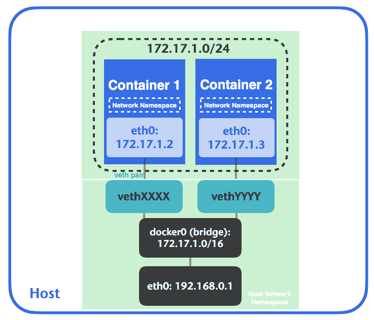
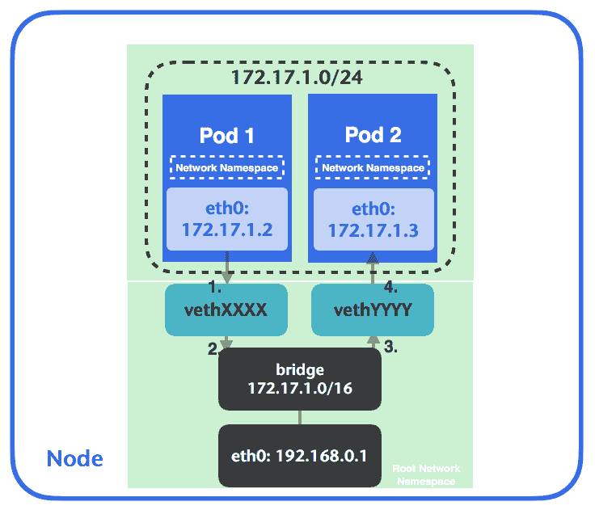
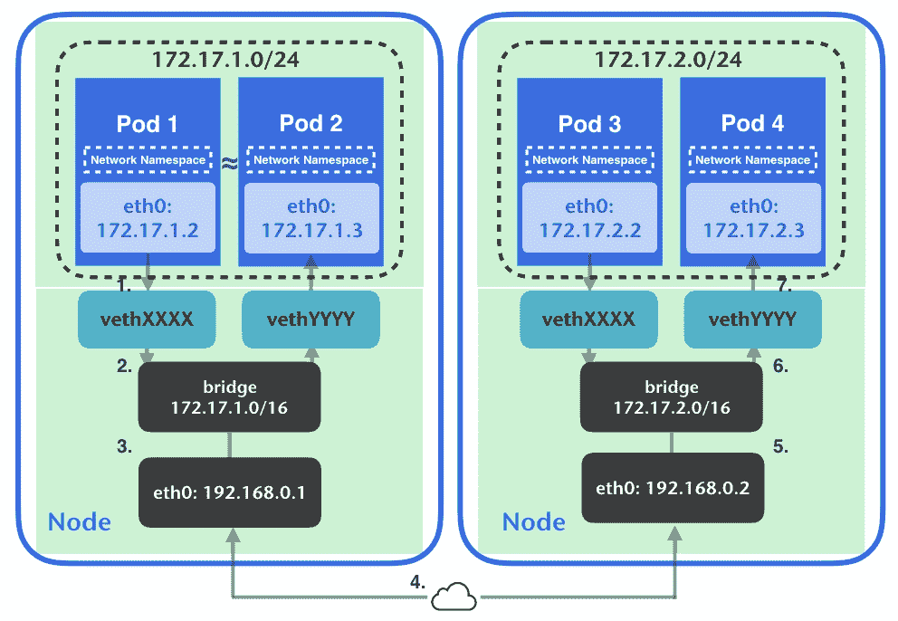
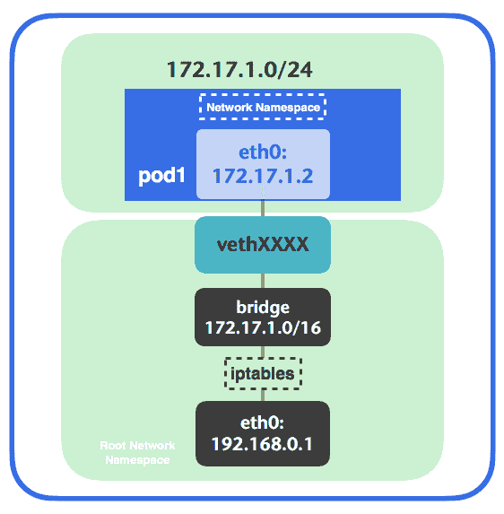
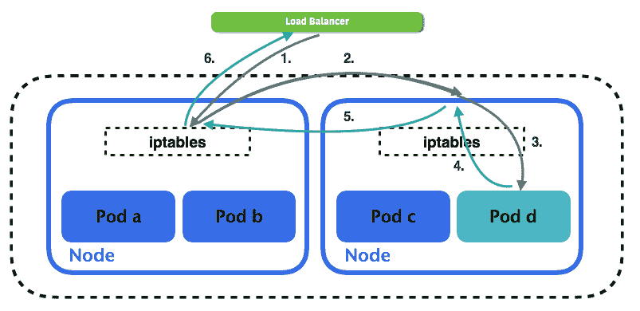
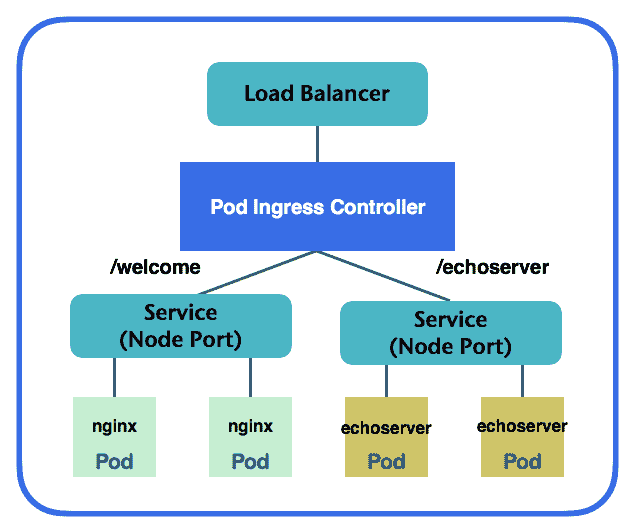
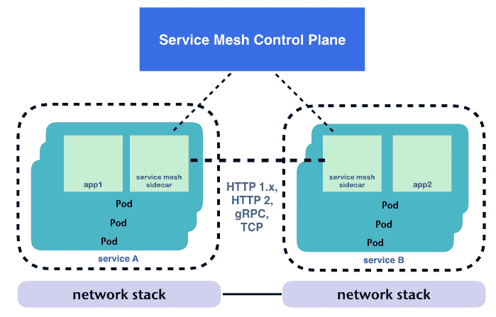

# 第六章：Kubernetes 网络

在第三章，*Kubernetes 入门*中，我们学习了如何部署具有不同资源的容器，还了解了如何使用卷来持久化数据、动态配置、不同的存储类和 Kubernetes 中的高级管理。在本章中，我们将学习 Kubernetes 如何路由流量以实现这一切。网络在软件世界中始终扮演着重要角色。我们将一步一步地了解 Kubernetes 网络，探讨容器在单一主机、多主机和集群内的通信。

本章将涵盖以下主题：

+   Kubernetes 网络

+   Docker 网络

+   入口流量

+   网络策略

+   服务网格

# Kubernetes 网络

在 Kubernetes 中实现网络有很多选择。Kubernetes 本身并不关心你如何实现网络，但你必须满足其三个基本要求：

+   所有容器应该能够相互访问，而无需进行 NAT，无论它们位于哪个节点上。

+   所有节点应该能够与所有容器通信

+   IP 容器应该像外部看到它一样看待自己。

在深入了解 Kubernetes 网络之前，我们首先检查一下默认容器网络是如何工作的。

# Docker 网络

现在，让我们回顾一下 Docker 网络是如何工作的，再进入 Kubernetes 网络。对于容器网络，有不同的模式：bridge、none、overlay、macvlan 和 host。我们在第二章，*DevOps 与容器*中了解了主要的网络模式。Bridge 是默认的网络模式。Docker 会创建并附加一个虚拟以太网设备（也叫做 `veth`），并为每个容器分配一个网络命名空间。

**网络命名空间** 是 Linux 中的一个特性，它逻辑上是另一个网络栈的副本。它有自己的路由表、ARP 表和网络设备。这是容器网络的基本概念。

`Veth` 总是成对出现；一个在网络命名空间中，另一个在桥接中。当流量进入主机网络时，它会被路由到桥接中。数据包会被转发到它的 `veth`，然后进入容器内部的命名空间，如下图所示：



让我们仔细看看这个问题。在以下示例中，我们将使用 minikube 节点作为 docker 主机。首先，我们必须使用 `minikube ssh` 登录到节点，因为我们还没有使用 Kubernetes。进入 minikube 节点后，我们将启动一个容器来与我们互动：

```
// launch a busybox container with `top` command, also, expose container port 8080 to host port 8000.
# docker run -d -p 8000:8080 --name=busybox busybox top
737e4d87ba86633f39b4e541f15cd077d688a1c8bfb83156d38566fc5c81f469 
```

让我们来看一下容器内的出站流量实现。`docker exec <container_name 或 container_id>` 可以在运行中的容器中执行命令。我们使用 `ip link list` 来列出所有的网络接口：

```
// show all the network interfaces in busybox container
// docker exec <container_name> <command>
# docker exec busybox ip link list
1: lo: <LOOPBACK,UP,LOWER_UP> mtu 65536 qdisc noqueue qlen 1
   link/loopback 00:00:00:00:00:00 brd 00:00:00:00:00:00
2: sit0@NONE: <NOARP> mtu 1480 qdisc noop qlen 1
   link/sit 0.0.0.0 brd 0.0.0.0
53: eth0@if54: <BROADCAST,MULTICAST,UP,LOWER_UP,M-DOWN> 
 mtu 1500 qdisc noqueue
   link/ether 02:42:ac:11:00:07 brd ff:ff:ff:ff:ff:ff
```

我们可以看到在 `busybox` 容器内有三个接口。其中一个接口的 ID 为 `53`，名称为 `eth0@if54`。`if` 后面的数字是配对接口的 ID，在这个例子中，配对 ID 为 `54`。如果我们在主机上运行相同的命令，可以看到主机上的 `veth` 正指向容器内的 `eth0`：

```
// show all the network interfaces from the host
# ip link list
1: lo: <LOOPBACK,UP,LOWER_UP> mtu 65536 qdisc noqueue
 state UNKNOWN mode DEFAULT group default qlen 1
   link/loopback 00:00:00:00:00:00 brd 00:00:00:00:00:00
2: eth0: <BROADCAST,MULTICAST,UP,LOWER_UP> mtu 1500 qdisc 
 pfifo_fast state UP mode DEFAULT group default qlen 
 1000
   link/ether 08:00:27:ca:fd:37 brd ff:ff:ff:ff:ff:ff
...
54: vethfeec36a@if53: <BROADCAST,MULTICAST,UP,LOWER_UP> 
 mtu 1500 qdisc noqueue master docker0 state UP mode 
 DEFAULT group default
   link/ether ce:25:25:9e:6c:07 brd ff:ff:ff:ff:ff:ff link-netnsid 5
```

我们在主机上有一个名为 `vethfeec36a@if53` 的 `veth`。它与容器网络命名空间中的 `eth0@if54` 配对。`veth` 54 被附加到 `docker0` 桥接网络，最终通过 `eth0` 访问互联网。如果我们查看 `iptables` 规则，可以找到 docker 为出站流量创建的伪装规则（也称为 SNAT），该规则将使容器能够访问互联网：

```
// list iptables nat rules. Showing only POSTROUTING rules which allows packets to be altered before they leave the host.
# sudo iptables -t nat -nL POSTROUTING
Chain POSTROUTING (policy ACCEPT)
target     prot opt source               destination
...
MASQUERADE  all  --  172.17.0.0/16        0.0.0.0/0
...
```

另一方面，关于入站流量，docker 在 prerouting 上创建了一个自定义过滤链，并在 `DOCKER` 过滤链中动态创建转发规则。如果我们暴露一个容器端口 `8080`，并将其映射到主机端口 `8000`，我们可以看到我们正在监听任何 IP 地址（`0.0.0.0/0`）上的端口 `8000`，该流量将被路由到容器端口 `8080`：

```
// list iptables nat rules
# sudo iptables -t nat -nL
Chain PREROUTING (policy ACCEPT)
target     prot opt source               destination
...
DOCKER     all  --  0.0.0.0/0            0.0.0.0/0            ADDRTYPE match dst-type LOCAL
...
Chain OUTPUT (policy ACCEPT)
target     prot opt source               destination
DOCKER     all  --  0.0.0.0/0           !127.0.0.0/8          ADDRTYPE match dst-type LOCAL
...
Chain DOCKER (2 references)
target     prot opt source               destination
RETURN     all  --  0.0.0.0/0            0.0.0.0/0
...
DNAT       tcp  --  0.0.0.0/0            0.0.0.0/0            tcp dpt:8000 to:172.17.0.7:8080
...
```

现在我们知道了数据包是如何进出容器的，接下来我们来看看 Pod 内的容器如何相互通信。

用户自定义的自定义桥接网络：

除了默认的桥接网络外，docker 还支持用户自定义的桥接网络。用户可以动态创建自定义桥接网络。这提供了更好的网络隔离，支持通过内置 DNS 服务器进行 DNS 解析，并且可以在运行时附加或分离容器。更多信息，请参考以下文档：[`docs.docker.com/network/bridge/#manage-a-user-defined-bridge`](https://docs.docker.com/network/bridge/#manage-a-user-defined-bridge)。

# 容器间通信

Kubernetes 中的 Pod 拥有各自的真实 IP 地址。Pod 内的容器共享网络命名空间，因此它们相互视为 *localhost*。默认情况下，这是通过 **网络容器** 实现的，网络容器充当每个容器的流量分发桥梁。让我们通过以下示例来看看这是如何工作的。我们使用 第三章 中的第一个示例，*Kubernetes 入门*，其中包含一个 Pod 内的两个容器 `nginx` 和 `centos`：

```
#cat 6-1-1_pod.yaml
apiVersion: v1
kind: Pod
metadata:
  name: example
spec:
  containers:
   - name: web
     image: nginx
   - name: centos
     image: centos
     command: ["/bin/sh", "-c", "while : ;do curl http://localhost:80/; sleep 10; done"] 
 // create the Pod
#kubectl create -f 6-1-1_pod.yaml
pod/example created 
```

然后，我们将描述该 Pod 并查看其 `Container ID`：

```
# kubectl describe pods example
Name:       example
Node:       minikube/192.168.99.100
...
Containers:
  web:
    Container ID: docker:// d9bd923572ab186870284535044e7f3132d5cac11ecb18576078b9c7bae86c73
    Image:        nginx
...
centos:
    Container ID: docker: //f4c019d289d4b958cd17ecbe9fe22a5ce5952cb380c8ca4f9299e10bf5e94a0f
    Image:        centos
...
```

在这个例子中，`web` 的容器 ID 是 `d9bd923572ab`，而 `centos` 的容器 ID 是 `f4c019d289d4`。如果我们进入 `minikube/192.168.99.100` 节点并使用 `docker ps`，我们可以检查 Kubernetes 实际启动了多少个容器，因为我们处于 minikube 环境，它启动了许多其他集群容器。通过查看 `CREATED` 列，我们可以看到有三个刚刚启动的容器：

```
# docker ps
CONTAINER ID        IMAGE                                      COMMAND                  CREATED             STATUS              PORTS                                      NAMES
f4c019d289d4        36540f359ca3                               "/bin/sh -c 'while : "   2 minutes ago        Up 2 minutes k8s_centos_example_default_9843fc27-677b-11e7-9a8c-080027cafd37_1
d9bd923572ab        e4e6d42c70b3                               "nginx -g 'daemon off"   2 minutes ago        Up 2 minutes k8s_web_example_default_9843fc27-677b-11e7-9a8c-080027cafd37_1
4ddd3221cc47        gcr.io/google_containers/pause-amd64:3.0   "/pause"                 2 minutes ago        Up 2 minutes 
```

还有一个额外的容器，`4ddd3221cc47`，它已被启动。在深入了解这个容器之前，让我们先查看 `web` 容器的网络模式。我们会发现，示例 Pod 中的容器都在映射容器模式下运行：

```
# docker inspect d9bd923572ab | grep NetworkMode
"NetworkMode": "container:4ddd3221cc4792207ce0a2b3bac5d758a5c7ae321634436fa3e6dd627a31ca76",
```

`4ddd3221cc47` 容器在本例中是所谓的网络容器。它持有网络命名空间，使得 `web` 和 `centos` 容器可以连接。处于同一网络命名空间中的容器共享相同的 IP 地址和网络配置。这是 Kubernetes 实现容器间通信的默认方式，映射到第一个要求。

# Pod 到 Pod 的通信

Pod 的 IP 地址可以从其他 Pod 访问，无论它们位于哪个节点上。这符合第二个要求。我们将在接下来的章节中描述同一节点内以及跨节点的 Pod 通信。

# 同一节点内的 Pod 通信

同一节点内的 Pod 通信默认通过桥接进行。假设我们有两个 Pod，各自拥有自己的网络命名空间。当 Pod 1 想要与 Pod 2 通信时，数据包首先通过 Pod 1 的命名空间，传递到相应的 `veth` 对 `**vethXXXX**`，最终到达桥接。然后，桥接会广播目标 IP，帮助数据包找到路径。`vethYYYY` 响应广播。数据包随后到达 Pod 2：



现在我们了解了数据包在单个节点中的传输方式，接下来我们将讨论当 Pods 在不同节点上时，流量是如何路由的。

# 跨节点的 Pod 通信

根据第二个要求，所有节点必须能够与所有容器通信。Kubernetes 将实现委托给**容器网络接口**（**CNI**）。用户可以选择不同的实现方式，如 L2、L3 或覆盖网络。覆盖网络，也称为数据包封装，是最常见的解决方案之一。它在数据包离开源节点之前进行封装，传送后在目标节点解封。这样会导致覆盖网络增加网络延迟和复杂性。只要所有容器能够在不同节点之间互相访问，你可以自由选择任何技术，比如 L2 邻接或 L3 网关。关于 CNI 的更多信息，请参考其规范（[`github.com/containernetworking/cni/blob/master/SPEC.md`](https://github.com/containernetworking/cni/blob/master/SPEC.md)）：



假设我们有一个数据包从 Pod 1 发送到 Pod 4。数据包离开容器接口，经过`veth`对，然后通过桥接器和节点的网络接口。在第 4 步中，网络实现开始发挥作用。只要数据包能够被路由到目标节点，你可以自由选择任何选项。在以下的例子中，我们将启动 minikube 并使用`--network-plugin=cni`选项。启用 CNI 后，参数将通过节点中的 kubelet 传递。Kubelet 有一个默认的网络插件，但你可以在启动时探测任何支持的插件。在启动`minikube`之前，如果它已经启动，你可以先使用`minikube stop`停止，或者使用`minikube delete`完全删除整个集群，然后再进行其他操作。虽然`minikube`是一个单节点环境，可能无法完全代表我们将遇到的生产环境，但它可以帮助你大致了解这些工作的原理。我们将在第九章《持续交付》和第十章《AWS 上的 Kubernetes》中了解网络选项在实际部署中的应用：

```
// start minikube with cni option
# minikube start --network-plugin=cni
...
Loading cached images from config file.
Everything looks great. Please enjoy minikube! 
```

当我们指定`network-plugin`选项时，`minikube`会在启动时使用`--network-plugin-dir`中指定的目录来加载插件。在 CNI 插件中，默认的插件目录是`/opt/cni/net.d`。集群启动后，我们可以通过`minikube ssh`登录到节点，查看 minikube 中的网络接口配置：

```
# minikube ssh
$ ifconfig 
...
mybridge  Link encap:Ethernet  HWaddr 0A:58:0A:01:00:01
          inet addr:10.1.0.1  Bcast:0.0.0.0 
 Mask:255.255.0.0
...
```

我们会发现节点中新增了一个桥接器，如果我们再次使用`5-1-1_pod.yml`创建示例 Pod，我们会发现 Pod 的 IP 地址变成了`10.1.0.x`，并附加到`mybridge`上，而不是`docker0`：

```
# kubectl create -f 6-1-1_pod.yaml
pod/example created
# kubectl describe po example
Name:       example
Namespace:  default
Node:       minikube/10.0.2.15
Start Time: Sun, 23 Jul 2017 14:24:24 -0400
Labels:           <none>
Annotations:      <none>
Status:           Running
IP:         10.1.0.4 
```

这是因为我们已经指定使用 CNI 作为网络插件，并且`docker0`将不会被使用（也叫做**容器网络模型**，或**libnetwork**）。CNI 会创建一个虚拟接口，将其连接到基础网络，设置 IP 地址，并最终将其路由并映射到 Pod 的命名空间。我们来看看位于`/etc/cni/net.d/k8s.conf`的配置文件，这在 minikube 中：

```
# cat /etc/cni/net.d/k8s.conf
{
  "name": "rkt.kubernetes.io",
  "type": "bridge",
  "bridge": "mybridge",
  "mtu": 1460,
  "addIf": "true",
  "isGateway": true,
  "ipMasq": true,
  "ipam": {
    "type": "host-local",
    "subnet": "10.1.0.0/16",
    "gateway": "10.1.0.1",
    "routes": [
      {
       "dst": "0.0.0.0/0"
      }
    ]
  }
}
```

在这个例子中，我们使用了 bridge CNI 插件来重用 L2 桥接器用于 Pod 容器。如果数据包来自`10.1.0.0/16`，并且其目的地是任何地方，它将通过这个网关。就像我们之前看到的图示一样，我们可以有另一个启用了 CNI 的节点，使用`10.1.2.0/16`子网，这样 ARP 数据包就可以发送到目标 Pod 所在节点的物理接口。这样就实现了跨节点的 Pod 对 Pod 通信。

我们来检查一下`iptables`中的规则：

```
// check the rules in iptables 
# sudo iptables -t nat -nL
... 
Chain POSTROUTING (policy ACCEPT)
target     prot opt source               destination
KUBE-POSTROUTING  all  --  0.0.0.0/0            0.0.0.0/0            /* kubernetes postrouting rules */
MASQUERADE  all  --  172.17.0.0/16        0.0.0.0/0
CNI-25df152800e33f7b16fc085a  all  --  10.1.0.0/16          0.0.0.0/0            /* name: "rkt.kubernetes.io" id: "328287949eb4d4483a3a8035d65cc326417ae7384270844e59c2f4e963d87e18" */
CNI-f1931fed74271104c4d10006  all  --  10.1.0.0/16          0.0.0.0/0            /* name: "rkt.kubernetes.io" id: "08c562ff4d67496fdae1c08facb2766ca30533552b8bd0682630f203b18f8c0a" */
```

所有相关的规则已经切换为`10.1.0.0/16`的 CIDR。

# Pod 与服务的通信

Kubernetes 是动态的，pod 会不断创建和删除。Kubernetes 服务是一种抽象，用于通过标签选择器定义一组 pod。我们通常使用服务来访问 pod，而不是明确指定一个 pod。当我们创建服务时，会创建一个`endpoint`对象，描述该服务中标签选择器所选择的一组 pod IP。

在某些情况下，`endpoint`对象在服务创建时不会自动创建。例如，缺少选择器的服务将不会创建相应的`endpoint`对象。有关更多信息，请参考第三章中的*没有选择器的服务*部分，*Kubernetes 入门*。

那么，流量是如何从 pod 传输到服务后面的 pod 的呢？默认情况下，Kubernetes 使用`iptables`来实现这个过程，并通过`kube-proxy`来执行。下面的图示解释了这一点：



让我们重用来自第三章的`3-2-3_rc1.yaml`和`3-2-3_nodeport.yaml`示例，*Kubernetes 入门*，来观察默认行为：

```
// create two pods with nginx and one service to observe default networking. Users are free to use any other kind of solution.
# kubectl create -f chapter3/3-2-3_Service/3-2-3_rs1.yaml
replicaset.apps/nginx-1.12 created
# kubectl create -f chapter3/3-2-3_Service/3-2-3_nodeport.yaml
service/nginx-nodeport created 
```

让我们观察一下`iptables`规则，看看它是如何工作的。正如下面的代码所示，我们的服务 IP 是`10.0.0.167`，底下两个 pod 的 IP 地址分别是`10.1.0.4`和`10.1.0.5`：

```
# kubectl describe svc nginx-nodeport
Name:             nginx-nodeport
Namespace:        default
Selector:         project=chapter3,service=web
Type:             NodePort
IP:               10.0.0.167
Port:             <unset>     80/TCP
NodePort:         <unset>     32261/TCP
Endpoints:        10.1.0.4:80,10.1.0.5:80
...
```

让我们通过使用`minikube ssh`进入 minikube 节点，并检查其`iptables`规则：

```
# sudo iptables -t nat -nL
...
Chain KUBE-SERVICES (2 references)
target     prot opt source               destination
KUBE-SVC-37ROJ3MK6RKFMQ2B  tcp  --  0.0.0.0/0            10.0.0.167           /* default/nginx-nodeport: cluster IP */ tcp dpt:80
KUBE-NODEPORTS  all  --  0.0.0.0/0            0.0.0.0/0            /* kubernetes service nodeports; NOTE: this must be the last rule in this chain */ ADDRTYPE match dst-type LOCAL

Chain KUBE-SVC-37ROJ3MK6RKFMQ2B (2 references)
target     prot opt source               destination
KUBE-SEP-SVVBOHTYP7PAP3J5  all  --  0.0.0.0/0            0.0.0.0/0            /* default/nginx-nodeport: */ statistic mode random probability 0.50000000000
KUBE-SEP-AYS7I6ZPYFC6YNNF  all  --  0.0.0.0/0            0.0.0.0/0            /* default/nginx-nodeport: */
Chain KUBE-SEP-SVVBOHTYP7PAP3J5 (1 references)
target     prot opt source               destination
KUBE-MARK-MASQ  all  --  10.1.0.4             0.0.0.0/0            /* default/nginx-nodeport: */
DNAT       tcp  --  0.0.0.0/0            0.0.0.0/0            /* default/nginx-nodeport: */ tcp to:10.1.0.4:80
Chain KUBE-SEP-AYS7I6ZPYFC6YNNF (1 references)
target     prot opt source               destination
KUBE-MARK-MASQ  all  --  10.1.0.5             0.0.0.0/0            /* default/nginx-nodeport: */
DNAT       tcp  --  0.0.0.0/0            0.0.0.0/0            /* default/nginx-nodeport: */ tcp to:10.1.0.5:80
...  
```

关键点在于，服务将集群 IP 暴露给来自`KUBE-SVC-37ROJ3MK6RKFMQ2B`的外部流量，后者链接到两个自定义链，`KUBE-SEP-SVVBOHTYP7PAP3J5`和`KUBE-SEP-AYS7I6ZPYFC6YNNF`，并且其统计模式随机概率为 0.5。意味着`iptables`会生成一个随机数，并根据 0.5 的概率分布调节该数值到目标。这两个自定义链的`DNAT`目标被设置为相应的 pod IP。`DNAT`目标负责改变数据包的目标 IP 地址。默认情况下，conntrack 会启用，跟踪连接的目标和源地址。当流量到达服务时，`iptables`会随机选择一个 pod 进行路由，并将目标 IP 从服务 IP 修改为真实的 pod IP。然后，它接收响应，并对回复数据包进行反`DNAT`操作，发送回请求者。

基于 IPVS 的 kube-proxy：

在 Kubernetes 1.11 中，基于 IPVS 的 `kube-proxy` 功能正式发布。这可以解决 `iptables` 在处理数万个服务时的扩展问题。**IP 虚拟服务器**（**IPVS**）是 Linux 内核的一部分，可以将 TCP 或 UDP 请求引导到实际的服务器上。如果你的应用包含大量服务，`ipvs` 代理非常适合。然而，在某些特定情况下，它会回退到 `iptables`。有关更多信息，请参考 [`kubernetes.io/blog/2018/07/09/ipvs-based-in-cluster-load-balancing-deep-dive/`](https://kubernetes.io/blog/2018/07/09/ipvs-based-in-cluster-load-balancing-deep-dive/)。

# 外部到服务的通信

将外部流量引入 Kubernetes 是至关重要的。Kubernetes 提供了两个 API 对象来实现这一目标：

+   **Service**：外部网络 LoadBalancer 或 NodePort（L4）

+   **Ingress**：HTTP(S) LoadBalancer（L7）

我们将在下一节中深入学习 ingress。现在，我们将重点讨论 L4 服务。基于我们对跨节点 pod 之间通信的理解，数据包在服务和 pod 之间进出。以下图示展示了这一过程。假设我们有两个服务：服务 A 有三个 pod（pod a、pod b 和 pod c），而服务 B 只有一个 pod（pod d）。当流量从 LoadBalancer 进入时，数据包会被调度到某个节点。大多数 LoadBalancer 本身并不了解 pod 或容器，它只知道节点。如果节点通过健康检查，那么它就会成为目标节点的候选节点。

假设我们想要访问服务 B；目前它只有一个 pod 在一个节点上运行。然而，LoadBalancer 将数据包发送到另一个没有运行我们需要的 pod 的节点。在这种情况下，流量路由将如下所示：



数据包的路由过程如下：

1.  LoadBalancer 会选择一个节点将数据包转发出去。在 GCE 中，它基于源 IP 和端口、目标 IP 和端口、协议的哈希值选择实例；在 AWS 中，负载均衡基于轮询算法。

1.  在这里，路由目标将被更改为 pod d（DNAT），并将数据包转发到另一个节点，类似于跨节点的 pod 到 pod 通信。

1.  然后是服务到 pod 的通信。数据包到达 pod d 后，pod d 会返回响应。

1.  Pod 到服务的通信也通过 `iptables` 来操作。

1.  数据包将被转发回原节点。

1.  源和目标将被取消 DNAT，返回给 LoadBalancer 和客户端，并一路发送回请求者。

从 Kubernetes 1.7 开始，这项服务中新增了一个属性 `externalTrafficPolicy`。在这里，你可以将其值设置为 local，然后，流量进入节点后，Kubernetes 会尽可能地将流量路由到该节点上的 pod，如下所示：

**`kubectl patch $service_name nodeport -p '{"spec":{"externalTrafficPolicy":"Local"}}'`**

# 入口

Kubernetes 中的 Pods 和服务有自己的 IP 地址。然而，这通常不是你提供给外部互联网的接口。尽管有一个配置了节点 IP 的服务，但节点 IP 中的端口在各个服务之间不能重复。决定哪个端口与哪个服务对应是很麻烦的。此外，节点是动态变化的；向外部服务提供静态的节点 IP 并不是一个明智的选择。

入口定义了一组规则，允许入站连接访问 Kubernetes 集群服务。它在 L7 层将流量引入集群，并在每个虚拟机上分配并转发一个端口到服务端口。如下图所示，我们定义一组规则并将其作为源类型的入口发送到 API 服务器。当流量进入时，入口控制器将根据入口规则来执行和路由入口。如下图所示，入口用于通过不同的 URL 将外部流量路由到 Kubernetes 端点：



现在，我们将通过一个示例来看看这个如何工作。在这个示例中，我们将创建两个名为`nginx`和`echoserver`的服务，并配置入口路径`/welcome`和`/echoserver`。我们可以在`minikube`中运行这个。旧版本的`minikube`默认没有启用入口；我们需要先启用它：

```
// start over our minikube local
# minikube delete && minikube start

// enable ingress in minikube
# minikube addons enable ingress
ingress was successfully enabled 

// check current setting for addons in minikube
# minikube addons list
- registry: disabled
- registry-creds: disabled
- addon-manager: enabled
- dashboard: enabled
- default-storageclass: enabled
- kube-dns: enabled
- heapster: disabled
- ingress: enabled 
```

在`minikube`中启用入口将创建一个`nginx`入口控制器（[`github.com/kubernetes/ingress-nginx`](https://github.com/kubernetes/ingress-nginx)）以及一个`ConfigMap`来存储`nginx`配置，还有一个`Deployment`和服务作为默认的 HTTP 后端，用于处理未映射的请求。我们可以通过在`kubectl`命令中添加`--namespace=kube-system`来观察这些资源。接下来，让我们创建后端资源。以下是我们的`nginx` `Deployment`和`Service`：

```
# cat chapter6/6-2-1_nginx.yaml
apiVersion: apps/v1
kind: Deployment
metadata:
 name: nginx
spec:
 replicas: 2
 template:
 metadata:
 labels:
 project: chapter6
 service: nginx
 spec:
 containers:
 - name: nginx
 image: nginx
 ports:
 - containerPort: 80
---
kind: Service
apiVersion: v1
metadata:
 name: nginx
spec:
 type: NodePort
 selector:
 project: chapter6
 service: nginx
 ports:
 - protocol: TCP
 port: 80
 targetPort: 80
// create nginx RS and service
# kubectl create -f chapter6/6-2-1_nginx.yaml
deployment.apps/nginx created
service/nginx created
```

然后，我们将创建另一个带有`Deployment`的服务：

```
// another backend named echoserver
# cat chapter6/6-2-1_echoserver.yaml
apiVersion: apps/v1
kind: Deployment
metadata:
  name: echoserver
spec:
  replicas: 1
  template:
    metadata:
     name: echoserver
     labels:
      project: chapter6
      service: echoserver
   spec:
     containers:
     - name: echoserver
       image: gcr.io/google_containers/echoserver:1.4
      ports:
     - containerPort: 8080
---

kind: Service
apiVersion: v1
metadata:
  name: echoserver
spec:
  type: NodePort
  selector:
    project: chapter6
    service: echoserver
  ports:
    - protocol: TCP
      port: 8080
      targetPort: 8080

// create RS and SVC by above configuration file
# kubectl create -f chapter6/6-2-1_echoserver.yaml
deployment.apps/echoserver created
service/echoserver created 
```

接下来，我们将创建入口资源。有一个名为`nginx.ingress.kubernetes.io/rewrite-target`的注解。如果`service`请求来自根 URL，则这是必需的。如果没有重写注解，我们将收到 404 响应。有关更多支持的注解，请参见[`github.com/kubernetes/ingress-nginx/tree/master/docs/examples/rewrite`](https://github.com/kubernetes/ingress-nginx/tree/master/docs/examples/rewrite)：

```
# cat chapter6/6-2-1_ingress.yaml
apiVersion: extensions/v1beta1
kind: Ingress
metadata:
  name: ingress-example
  annotations:
    nginx.ingress.kubernetes.io/rewrite-target: /
spec:
  rules:
  - host: devops.k8s
    http:
      paths:
      - path: /welcome
        backend:
          serviceName: nginx
          servicePort: 80
      - path: /echoserver
        backend:
          serviceName: echoserver
          servicePort: 8080

// create ingress
# kubectl create -f chapter6/6-2-1_ingress.yaml
ingress.extensions/ingress-example created 
```

在一些云提供商中，支持服务 LoadBalancer 控制器。这可以通过配置文件中的`status.loadBalancer.ingress`语法与入口集成。有关更多信息，请参阅[`github.com/kubernetes/contrib/tree/master/service-loadbalancer`](https://github.com/kubernetes/contrib/tree/master/service-loadbalancer)。

由于我们的主机设置为 `devops.k8s`，只有从该主机名访问时才能返回。你可以在 DNS 服务器中配置 DNS 记录，或修改本地主机文件。为了简单起见，我们只需在主机文件中添加一行，格式为 `ip 主机名`：

```
// normally host file located in /etc/hosts in linux
# sudo sh -c "echo `minikube ip` devops.k8s >> /etc/hosts" 
```

然后，我们应该能够直接通过 URL 访问我们的服务：

```
# curl http://devops.k8s/welcome
...
<title>Welcome to nginx!</title>
...
// check echoserver 
# curl http://devops.k8s/echoserver
CLIENT VALUES:
client_address=172.17.0.4
command=GET
real path=/
query=nil
request_version=1.1
request_uri=http://devops.k8s:8080/ 
```

Pod ingress 控制器根据 URL 路径分发流量。路由路径类似于外部到服务的通信。数据包在节点和 pod 之间跳跃。Kubernetes 是可插拔的；有很多第三方实现正在进行。即使 `iptables` 只是默认的常见实现，我们这里只是触及了表面。每个版本的发布都会使网络发生很大变化。在撰写本文时，Kubernetes 刚刚发布了 1.13 版本。

# 网络策略

网络策略充当 pod 的软件防火墙。默认情况下，每个 pod 都可以互相通信，没有任何边界。网络策略是你可以对这些 pod 应用的隔离之一。它定义了通过命名空间选择器和 pod 选择器，谁可以访问哪个 pod 的哪个端口。命名空间中的网络策略是累加的，一旦 pod 启用网络策略，它将拒绝任何其他入站流量（也称为拒绝所有）。

目前，有多个网络提供商支持网络策略，如 Calico（[`www.projectcalico.org/calico-network-policy-comes-to-kubernetes/`](https://www.projectcalico.org/calico-network-policy-comes-to-kubernetes/)）、Romana（[`github.com/romana/romana`](https://github.com/romana/romana)）、Weave Net（[`www.weave.works/docs/net/latest/kube-addon/#npc`](https://www.weave.works/docs/net/latest/kube-addon/#npc)）、Contiv（[`contiv.github.io/documents/networking/policies.html`](http://contiv.github.io/documents/networking/policies.html)）和 Trireme（[`github.com/aporeto-inc/trireme-kubernetes`](https://github.com/aporeto-inc/trireme-kubernetes)）。用户可以自由选择其中任何一种。不过，为了简单起见，我们将使用 Calico 配合 minikube。为此，我们需要使用 `--network-plugin=cni` 选项启动 minikube。此时，网络策略在 Kubernetes 中仍然是比较新的功能。我们正在运行 Kubernetes 版本 v.1.7.0，配合 v.1.0.7 minikube ISO 通过自托管解决方案部署 Calico（[`docs.projectcalico.org/v1.5/getting-started/kubernetes/installation/hosted/`](http://docs.projectcalico.org/v1.5/getting-started/kubernetes/installation/hosted/)）。Calico 可以通过 etcd 数据存储或 Kubernetes API 数据存储进行安装。为了方便起见，我们将在这里演示如何使用 Kubernetes API 数据存储安装 Calico。由于 minikube 中启用了 rbac，我们需要为 Calico 配置角色和绑定：

```
# kubectl apply -f \
https://docs.projectcalico.org/v3.3/getting-started/kubernetes/installation/hosted/rbac-kdd.yaml
clusterrole.rbac.authorization.k8s.io/calico-node configured
clusterrolebinding.rbac.authorization.k8s.io/calico-node configured
```

现在，让我们部署 Calico：

```
# kubectl apply -f https://docs.projectcalico.org/v3.3/getting-started/kubernetes/installation/hosted/kubernetes-datastore/calico-networking/1.7/calico.yaml
configmap/calico-config created
service/calico-typha created
deployment.apps/calico-typha created
poddisruptionbudget.policy/calico-typha created
daemonset.extensions/calico-node created
serviceaccount/calico-node created
customresourcedefinition.apiextensions.k8s.io/felixconfigurations.crd.projectcalico....
customresourcedefinition.apiextensions.k8s.io/networkpolicies.crd.projectcalico.org created
```

完成此操作后，我们可以列出 Calico pod 并查看它是否成功启动：

```
# kubectl get pods --namespace=kube-system
NAME READY STATUS RESTARTS AGE
calico-node-ctxq8 2/2 Running 0 14m
```

让我们在示例中重用 `6-2-1_nginx.yaml`：

```
# kubectl create -f chapter6/6-2-1_nginx.yaml
replicaset "nginx" created
service "nginx" created
// list the services
# kubectl get svc
NAME TYPE  CLUSTER-IP EXTERNAL-IP PORT(S) AGE
kubernetes ClusterIP  10.96.0.1    <none> 443/TCP 36m
nginx      NodePort   10.96.51.143 <none> 80:31452/TCP 5s
```

我们将发现我们的`nginx`服务的 IP 地址是`10.96.51.143`。我们来启动一个简单的 bash 并使用`wget`查看我们是否能够访问`nginx`：

```
# kubectl run busybox -i -t --image=busybox /bin/sh
If you don't see a command prompt, try pressing enter.
/ # wget --spider 10.96.51.143
Connecting to 10.96.51.143 (10.96.51.143:80)
```

`--spider`参数用于检查 URL 是否存在。在这种情况下，`busybox`可以成功访问`nginx`。接下来，我们为`nginx` pods 应用一个`NetworkPolicy`：

```
// declare a network policy
# cat chapter6/6-3-1_networkpolicy.yaml
kind: NetworkPolicy
apiVersion: networking.k8s.io/v1
metadata:
  name: nginx-networkpolicy
spec:
  podSelector:
    matchLabels:
      service: nginx
  ingress:
  - from:
    - podSelector:
        matchLabels:
          project: chapter6 
```

我们可以看到一些重要的语法。`podSelector`用于选择应该匹配目标 pod 标签的 pods。另一个是`ingress[].from[].podSelector`，它用于定义谁可以访问这些 pods。在这种情况下，所有具有`project=chapter6`标签的 pods 都有资格访问具有`server=nginx`标签的 pods。如果我们回到我们的 busybox pod，我们将无法再联系`nginx`，因为此时`nginx` pod 上已经有了`NetworkPolicy`。

默认情况下，它会拒绝所有连接，因此 busybox 将无法与`nginx`进行通信：

```
// in busybox pod, or you could use `kubectl attach <pod_name> -c busybox -i -t` to re-attach to the pod 
# wget --spider --timeout=1 10.96.51.143
Connecting to 10.96.51.143 (10.96.51.143:80)
wget: download timed out 
```

我们可以使用`kubectl edit deployment busybox`在 busybox pods 中添加`project=chapter6`标签。

然后，我们可以再次联系`nginx` pod：

```
// inside busybox pod
/ # wget --spider 10.96.51.143 
Connecting to 10.96.51.143 (10.96.51.143:80) 
```

借助前面的示例，我们现在有了如何应用网络策略的思路。我们还可以应用一些默认策略来拒绝所有流量或允许所有流量，通过调整选择器来选择没有人或每个人。例如，拒绝所有流量的行为可以通过以下方式实现：

```
# cat chapter6/6-3-1_np_denyall.yaml
apiVersion: networking.k8s.io/v1
kind: NetworkPolicy
metadata:
  name: default-deny
spec:
  podSelector: {}
  policyTypes:
  - Ingress 
```

这样，所有不匹配标签的 pods 将拒绝所有其他流量。或者，我们可以创建一个`NetworkPolicy`，其入口规则列出所有内容。这样，这个命名空间中的 pods 可以被任何人访问：

```
# cat chapter6/6-3-1_np_allowall.yaml
apiVersion: networking.k8s.io/v1
kind: NetworkPolicy
metadata:
  name: allow-all
spec:
  podSelector: {}
  ingress:
  - {} 
```

# 服务网格

服务网格是处理服务到服务通信的基础设施层。特别是在微服务世界中，手头的应用可能包含成百上千个服务。这里的网络拓扑可能非常复杂。服务网格可以提供以下功能：

+   流量管理（如 A/B 测试和金丝雀发布）

+   安全性（如 TLS 和密钥管理）

+   可观察性（例如提供流量可见性。这很容易与监控系统如 Prometheus（[`prometheus.io/`](https://prometheus.io/)）、跟踪系统如 Jaeger（[`www.jaegertracing.io`](https://www.jaegertracing.io)）或 Zipkin（[`github.com/openzipkin/zipkin`](https://github.com/openzipkin/zipkin)）以及日志系统集成）

市场上有两个主要的服务网格实现——Istio（[`istio.io`](https://istio.io)）和 Linkerd（[`linkerd.io`](https://linkerd.io)）。这两者都在应用容器旁边部署网络代理容器（即所谓的 sidecar 容器），并提供 Kubernetes 支持。以下图是服务网格的简化通用架构：



服务网格通常包含一个控制平面，这是网格的大脑。它可以管理和执行路由流量的策略，并收集可以与其他系统集成的遥测数据。它还负责服务或最终用户的身份和凭证管理。服务网格的 sidecar 容器，充当网络代理，与应用容器并排运行。服务之间的通信通过 sidecar 容器传递，这意味着它可以通过用户定义的策略控制流量，通过 TLS 加密来确保流量的安全，进行负载均衡和重试，控制 ingress/egress，收集指标，等等。

在接下来的部分中，我们将以 Istio 为例，但你可以自由选择组织中任何实现。首先，让我们获取最新版本的 Istio。在撰写本文时，最新版本是 1.0.5：

```
// get the latest istio
# curl -L https://git.io/getLatestIstio | sh -
Downloading istio-1.0.5 from https://github.com/istio/istio/releases/download/1.0.5/istio-1.0.5-osx.tar.gz ...

// get into the folder
# cd istio-1.0.5/

```

接下来，让我们为 Istio 创建一个 **自定义资源定义** (**CRD**)：

```
# kubectl apply -f install/kubernetes/helm/istio/templates/crds.yaml
customresourcedefinition.apiextensions.k8s.io/virtualservices.networking.istio.io created
customresourcedefinition.apiextensions.k8s.io/destinationrules.networking.istio.io created
customresourcedefinition.apiextensions.k8s.io/serviceentries.networking.istio.io created
customresourcedefinition.apiextensions.k8s.io/gateways.networking.istio.io created
...
```

在下面的示例中，我们将安装带有默认互信 TLS 身份验证的 Istio。资源定义位于 `install/kubernetes/istio-demo-auth.yaml` 文件中。如果你希望在没有 TLS 身份验证的情况下部署，可以改用 `install/kubernetes/istio-demo.yaml`：

```
# kubectl apply -f install/kubernetes/istio-demo-auth.yaml
namespace/istio-system created
configmap/istio-galley-configuration created
...
kubernetes.config.istio.io/attributes created
destinationrule.networking.istio.io/istio-policy created
destinationrule.networking.istio.io/istio-telemetry created
```

部署完成后，让我们检查服务和 pod 是否已经成功部署到 `istio-system` 命名空间：

```
// check services are launched successfully
# kubectl get svc -n istio-system
NAME TYPE CLUSTER-IP EXTERNAL-IP PORT(S) AGE
grafana ClusterIP 10.98.182.66 <none> 3000/TCP 13s
istio-citadel ClusterIP 10.105.65.6 <none> 8060/TCP,9093/TCP 13s
istio-egressgateway ClusterIP 10.105.178.212 <none> 80/TCP,443/TCP 13s
istio-galley ClusterIP 10.103.123.213 <none> 443/TCP,9093/TCP 13s
istio-ingressgateway LoadBalancer 10.107.243.112 <pending> 80:31380/TCP,443:31390/TCP,31400:31400/TCP,15011:32320/TCP,8060:31750/TCP,853:30790/TCP,15030:30313/TCP,15031:30851/TCP 13s
istio-pilot ClusterIP 10.104.123.60 <none> 15010/TCP,15011/TCP,8080/TCP,9093/TCP 13s
istio-policy ClusterIP 10.111.227.237 <none> 9091/TCP,15004/TCP,9093/TCP 13s
istio-sidecar-injector ClusterIP 10.107.43.206 <none> 443/TCP 13s
istio-telemetry ClusterIP 10.103.118.119 <none> 9091/TCP,15004/TCP,9093/TCP,42422/TCP 13s
jaeger-agent ClusterIP None <none> 5775/UDP,6831/UDP,6832/UDP 11s
jaeger-collector ClusterIP 10.110.234.134 <none> 14267/TCP,14268/TCP 11s
jaeger-query ClusterIP 10.103.19.74 <none> 16686/TCP 12s
prometheus ClusterIP 10.96.62.77 <none> 9090/TCP 13s
servicegraph ClusterIP 10.100.191.216 <none> 8088/TCP 13s
tracing ClusterIP 10.107.99.50 <none> 80/TCP 11s
zipkin ClusterIP 10.98.206.168 <none> 9411/TCP 11s
```

等待几分钟后，检查所有的 pod 是否处于 `Running` 和 `Completed` 状态，如下所示：

```
# kubectl get pods -n istio-system
NAME READY STATUS RESTARTS AGE
grafana-7ffdd5fb74-hzwcn 1/1 Running 0 5m1s
istio-citadel-55cdfdd57c-zzs2s 1/1 Running 0 5m1s
istio-cleanup-secrets-qhbvk 0/1 Completed 0 5m3s
istio-egressgateway-687499c95f-fbbwq 1/1 Running 0 5m1s
istio-galley-76bbb946c8-9mw2g 1/1 Running 0 5m1s
istio-grafana-post-install-8xxps 0/1 Completed 0 5m3s
istio-ingressgateway-54f5457d68-n7xsj 1/1 Running 0 5m1s
istio-pilot-7bf5674b9f-jnnvx 2/2 Running 0 5m1s
istio-policy-75dfcf6f6d-nwvdn 2/2 Running 0 5m1s
istio-security-post-install-stv2c 0/1 Completed 0 5m3s
istio-sidecar-injector-9c6698858-gr86p 1/1 Running 0 5m1s
istio-telemetry-67f94c555b-4mt4l 2/2 Running 0 5m1s
istio-tracing-6445d6dbbf-8r5r4 1/1 Running 0 5m1s
prometheus-65d6f6b6c-qrp6f 1/1 Running 0 5m1s
servicegraph-5c6f47859-qzlml 1/1 Running 2 5m1s
```

由于我们已经部署了 `istio-sidecar-injector`，我们可以简单地使用 `kubectl label namespace default istio-injection=enabled` 来为 `default` 命名空间中的每个 pod 启用 sidecar 容器注入。`istio-sidecar-injector` 作为一个变更型准入控制器，如果命名空间被标记为 `istio-injection=enabled`，它会将 sidecar 容器注入到 pod 中。接下来，我们可以从 `samples` 文件夹中启动一个示例应用。Helloworld 演示了金丝雀部署的使用 ([`en.wikipedia.org/wiki/Deployment_environment`](https://en.wikipedia.org/wiki/Deployment_environment))，它将流量分发到 helloworld-v1 和 helloworld-v2 服务：

```
// launch sample application
# kubectl run nginx --image=nginx
deployment.apps/nginx created

// list pods
# kubectl get po
NAME READY STATUS RESTARTS AGE
nginx-64f497f8fd-b7d4k 2/2 Running 0 3s
```

如果我们检查其中一个 pod，会发现 `istio-proxy` 容器已被注入到其中：

```
# kubectl describe po nginx-64f497f8fd-b7d4k
Name: nginx-64f497f8fd-b7d4k
Namespace: default
Labels: pod-template-hash=2090539498
 run=nginx
Annotations: kubernetes.io/limit-ranger: LimitRanger plugin set: cpu request for container nginx
 sidecar.istio.io/status:
 {"version":"50128f63e7b050c58e1cdce95b577358054109ad2aff4bc4995158c06924a43b","initContainers":["istio-init"],"containers":["istio-proxy"]...
Status: Running
Init Containers:
 istio-init:
 Container ID: docker://3ec33c4cbc66682f9a6846ae6f310808da3a2a600b3d107a0d361b5deb6d3018
 Image: docker.io/istio/proxy_init:1.0.5
...
Containers:
 nginx:
 Container ID: docker://42ab7df7366c1838489be0c7264a91235d8e5d79510f3d0f078726165e95665a
 Image: nginx
 ...
 istio-proxy:
 Container ID: docker://7bdf7b82ce3678174dea12fafd2c7f0726bfffc562ed3505a69991b06cf32d0d
 Image: docker.io/istio/proxyv2:1.0.5
 Image ID: docker-pullable://istio/proxyv2@sha256:8b7d549100638a3697886e549c149fb588800861de8c83605557a9b4b20343d4
 Port: 15090/TCP
 Host Port: 0/TCP
 Args:
 proxy
 sidecar
 --configPath
 /etc/istio/proxy
 --binaryPath
 /usr/local/bin/envoy
 --serviceCluster
 istio-proxy
 --drainDuration
 45s
 --parentShutdownDuration
 1m0s
 --discoveryAddress
 istio-pilot.istio-system:15005
 --discoveryRefreshDelay
 1s
 --zipkinAddress
 zipkin.istio-system:9411
 --connectTimeout
 10s
 --proxyAdminPort
 15000
 --controlPlaneAuthPolicy
 MUTUAL_TLS
```

仔细观察，我们可以看到 `istio-proxy` 容器已根据其控制平面地址、追踪系统地址和连接配置启动。Istio 已经被验证。对于 Istio 流量管理，还有许多内容超出了本书的范围。Istio 提供了许多详细的示例供我们尝试，这些示例可以在我们刚下载的 `istio-1.0.5/samples` 文件夹中找到。

# 总结

在本章中，我们学习了容器如何相互通信。我们还介绍了 pod 之间如何进行通信。服务是一种抽象，它将流量路由到其下的任何 pod，只要标签选择器匹配。我们还了解了服务如何通过`iptables`与 pod 协同工作。我们还熟悉了如何使用 DNAT 和 un-DAT 数据包将外部服务的数据包路由到 pod。此外，我们还研究了新的 API 对象，例如 ingress，它允许我们使用 URL 路径将流量路由到后端的不同服务。最后，我们介绍了另一个 `NetworkPolicy` 对象，它提供了第二层安全性，并充当软件防火墙规则。通过网络策略，我们可以使特定的 pod 与其他特定 pod 通信。例如，只有数据检索服务才能与数据库容器通信。在最后一节中，我们简要了解了 Istio，这是流行的服务网格实现之一。所有这些功能使 Kubernetes 更加灵活、安全、可靠和强大。

在本章之前，我们已经介绍了 Kubernetes 的基本概念。在第七章，*监控与日志记录*中，我们将通过监控集群指标以及分析 Kubernetes 的应用程序和系统日志，更清晰地了解集群内部发生了什么。监控和日志记录工具对每个 DevOps 来说都是必不可少的，它们在像 Kubernetes 这样的动态集群中也起着极其重要的作用。因此，我们将深入了解集群的活动，如调度、部署、扩展和服务发现。第七章，*监控与日志记录*，将帮助你更好地理解在现实世界中操作 Kubernetes 的过程。
