# 第七章：监控和日志记录

监控和日志记录是站点可靠性的关键部分。到目前为止，我们已经学会了如何使用各种控制器来管理我们的应用程序。我们还了解了如何利用服务和 Ingress 一同为我们的 Web 应用程序提供服务，无论是内部还是外部。在本章中，我们将通过以下主题，进一步了解我们的应用程序：

+   获取容器的状态快照

+   Kubernetes 中的监控

+   使用 Prometheus 汇聚 Kubernetes 中的度量

+   与 Kubernetes 中日志记录相关的各种概念

+   使用 Fluentd 和 Elasticsearch 进行日志记录

+   使用 Istio 获取服务之间流量的洞察

# 检查容器

每当我们的应用程序表现异常时，我们需要找出系统发生了什么。我们可以通过检查日志、资源使用情况、监视器，甚至直接进入正在运行的主机来深入排查问题。在 Kubernetes 中，我们有`kubectl get`和`kubectl describe`，它们可以查询我们部署的控制器状态。这帮助我们判断应用程序是否崩溃，或者是否按预期工作。

如果我们想了解应用程序输出的情况，我们可以使用`kubectl logs`，它将容器的`stdout`和`stderr`重定向到我们的终端。对于 CPU 和内存使用情况的统计信息，我们还可以使用类似`top`的命令——`kubectl top`。`kubectl top node`可以概览节点的资源使用情况，而`kubectl top pod <POD_NAME>`显示每个 Pod 的使用情况：

```
$ kubectl top node
NAME        CPU(cores)   CPU%      MEMORY(bytes)  MEMORY%
node-1      31m          3%        340Mi          57%
node-2      24m          2%        303Mi          51%

$ kubectl top pod mypod-6cc9b4bc67-j6zds
NAME                     CPU(cores)   MEMORY(bytes)
mypod-6cc9b4bc67-j6zds   0m           0Mi
```

要使用`kubectl top`，你需要在集群中部署`metrics-server`或 Heapster（如果你使用的是 1.13 版本之前的 Kubernetes）。我们将在本章稍后讨论这个内容。

如果我们将一些如日志的东西留在容器内而没有发送出去怎么办？我们知道`docker exec`可以在运行中的容器内执行命令，但每次都访问节点的可能性不大。幸运的是，`kubectl`也允许我们用`kubectl exec`命令做同样的事情。它的用法与`docker exec`类似。例如，我们可以在 Pod 中的容器内运行一个 shell，如下所示：

```
$ kubectl exec -it mypod-6cc9b4bc67-j6zds /bin/sh
/ # 
/ # hostname
mypod-6cc9b4bc67-j6zds 
```

这与通过 SSH 登录主机非常相似。它让我们能够使用熟悉的工具进行故障排除，正如我们之前在没有容器时所做的那样。

如果容器是通过`FROM scratch`构建的，那么`kubectl exec`命令可能无法正常工作，因为容器内可能没有核心实用工具，如 shell（`sh`或`bash`）。在短命容器出现之前，Kubernetes 并未官方支持这个问题。如果我们恰好在运行的容器内有`tar`二进制文件，我们可以使用`kubectl cp`将一些二进制文件复制到容器中进行故障排除。如果我们幸运地拥有对容器运行节点的特权访问权限，我们可以利用`docker cp`，该命令不需要容器内有`tar`二进制文件，便能将所需的工具移入容器中。

# Kubernetes 仪表盘

除了命令行工具外，还有一个仪表盘，它汇总了我们刚刚讨论的几乎所有信息，并以良好的 Web 用户界面展示数据：

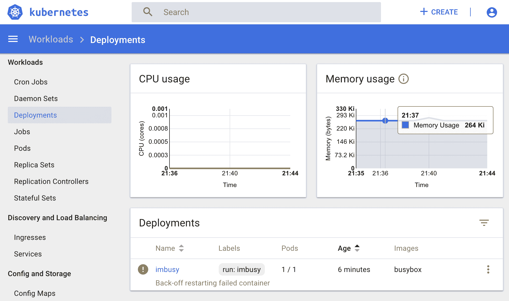

这实际上是一个 Kubernetes 集群的通用图形用户界面，它还允许我们创建、编辑和删除资源。部署它非常简单；我们只需要应用一个模板：

```
$ kubectl create -f \ https://raw.githubusercontent.com/kubernetes/dashboard/v1.10.0/src/deploy/recommended/kubernetes-dashboard.yaml
```

许多托管的 Kubernetes 服务，如**Google Kubernetes Engine**（**GKE**），提供预部署仪表盘到集群的选项，这样我们就不需要自己安装它了。要确定仪表盘是否存在于我们的集群中，可以使用`kubectl cluster-info`。如果它已安装，我们将看到消息`kubernetes-dashboard is running at ...`，如下所示：

```
$ kubectl cluster-info
Kubernetes master is running at https://192.168.64.32:8443
CoreDNS is running at https://192.168.64.32:8443/api/v1/namespaces/kube-system/services/kube-dns:dns/proxy
kubernetes-dashboard is running at https://192.168.64.32:8443/api/v1/namespaces/kube-system/services/kubernetes-dashboard/proxy

To further debug and diagnose cluster problems, use 'kubectl cluster-info dump'. 
```

使用前述默认模板或由云提供商预部署的仪表盘服务通常是`ClusterIP`。我们已经学习了多种访问集群内部服务的方法，但在这里我们只使用最简单的内置代理`kubectl proxy`，来建立我们的终端与 Kubernetes API 服务器之间的连接。一旦代理启动，我们就可以通过`http://localhost:8001/api/v1/namespaces/kube-system/services/https:kubernetes-dashboard:/proxy/`访问仪表盘。端口`8001`是`kubectl proxy`命令的默认端口。

使用前面模板部署的仪表盘不会出现在`kubectl cluster-info`输出的服务列表中，因为它不是由**插件管理器**管理的。插件管理器确保它管理的对象处于活动状态，并且在大多数托管的 Kubernetes 服务中启用，以保护集群组件。有关更多信息，请查看以下仓库：[`github.com/kubernetes/kubernetes/tree/master/cluster/addons/addon-manager`](https://github.com/kubernetes/kubernetes/tree/master/cluster/addons/addon-manager)。

身份验证方法在不同的集群配置之间有所不同。例如，允许`kubectl`访问 GKE 集群的令牌，也可以用来登录仪表盘。它可以在`kubeconfig`中找到，或者通过下面显示的单行命令获取（假设当前使用的是该上下文）：

```
$ kubectl config view --minify -o \
 jsonpath={.users[].user.auth-provider.config.access-token} 
```

如果我们跳过登录过程，仪表盘的服务账户将会被使用。有关其他访问选项，请查看仪表盘项目的 wiki 页面，以选择适合您集群配置的方式：[`github.com/kubernetes/dashboard/wiki/Access-control#authentication`](https://github.com/kubernetes/dashboard/wiki/Access-control#authentication)。

与`kubectl top`一样，要显示 CPU 和内存统计信息，您需要在集群中部署一个指标服务器。

# Kubernetes 中的监控

我们现在知道如何在 Kubernetes 中检查我们的应用程序。然而，我们还没有足够的信心回答更复杂的问题，例如我们的应用程序有多健康、从新补丁中 CPU 使用率发生了什么变化、我们的数据库何时会耗尽容量，以及为什么我们的网站会拒绝任何请求。因此，我们需要一个监控系统来收集来自各个来源的度量指标，存储并分析接收到的数据，然后响应异常。在传统的监控系统设置中，我们通常会从至少三个不同的来源收集度量数据，以衡量服务的可用性以及其质量。

# 监控应用程序

我们关注的数据与我们正在运行的应用程序的内部状态有关。收集这些数据可以让我们更深入了解服务内部的运行情况。这些数据可能与应用程序设计的目标有关，也可能是应用程序本身固有的运行时数据。获取这些数据通常需要我们手动指示程序将内部数据暴露给监控管道，因为只有我们，作为服务的拥有者，知道哪些数据是有意义的，同时因为外部很难获取像缓存服务中记录在内存中的大小等信息。

应用程序与监控系统交互的方式有很大的差异。例如，如果我们需要有关 MySQL 数据库统计信息的数据，我们可以设置一个代理，定期查询信息和性能模式以获取原始数据，如当前时刻的 SQL 查询数量，并将其转换为我们监控系统所需的格式。以 Golang 应用程序为例，我们可能会通过`expvar`包及其接口暴露运行时信息，然后找到另一种方式将信息传输到监控后端。为了缓解这些步骤可能带来的困难，**OpenMetrics**（[`openmetrics.io/`](https://openmetrics.io/)）项目致力于为不同应用程序和监控系统之间交换遥测数据提供标准化格式。

除了时间序列度量外，我们还可能希望结合使用分析工具和追踪工具来验证程序的性能。如今，这一点尤为重要，因为一个应用程序可能由数十个分布式服务组成。如果不使用诸如**OpenTracing**（[`opentracing.io`](http://opentracing.io)）之类的追踪工具，找出性能下降背后的原因将变得异常困难。

# 监控基础设施

这里的“基础设施”一词可能太广泛了，但如果我们简单地考虑应用程序运行的地方以及它如何与其他组件和用户交互，那么我们应该监控的内容就显而易见：应用程序主机和连接的网络。

由于在主机上收集任务是系统监控的常见做法，它通常由监控框架提供的代理执行。代理会提取并发送关于主机的综合指标，例如负载、磁盘、连接或其他进程统计信息，这些有助于我们确定主机的健康状况。

对于网络来说，这些组件可以仅仅是同一主机上的网页服务器软件和网络接口，或者可能还有负载均衡器，甚至是像 Istio 这样的平台。尽管收集关于前述组件的遥测数据的方式取决于它们的实际设置，但一般来说，我们希望衡量的指标是流量、延迟和错误。

# 监控外部依赖

除了前面提到的两个组件，我们还需要检查依赖组件的状态，例如外部存储的使用情况，或者队列的消耗速率。例如，假设我们有一个订阅了队列作为输入并从该队列执行任务的应用程序。在这种情况下，我们还需要考虑像队列长度和消耗速率这样的指标。如果消耗速率较低，而队列长度不断增长，我们的应用程序可能会遇到问题。

这些原则同样适用于 Kubernetes 上的容器，因为在主机上运行容器几乎与运行进程相同。然而，由于 Kubernetes 上的容器和传统主机上的容器在资源使用方式上的细微区别，我们仍然需要相应地调整我们的监控策略。例如，Kubernetes 上应用程序的容器会分布在多个主机上，并不总是处于同一主机。如果我们仍然采用以主机为中心的监控方式，那么生成一份一致的应用程序记录将会非常困难。因此，我们应该在监控堆栈中添加一个容器层，而不是仅仅观察主机上的资源使用情况。此外，既然 Kubernetes 是我们应用程序的基础设施，我们也应该将这一点考虑在内。

# 监控容器

由于容器基本上是我们程序和依赖运行时库的一个薄层包装，因此在容器级别收集的指标与在容器主机上收集的指标类似，特别是关于系统资源使用的情况。尽管从容器和其主机上收集这些指标似乎是冗余的，但实际上，它让我们能够解决与监控移动容器相关的问题。这个想法非常简单：我们需要做的是将逻辑信息附加到指标上，例如 pod 标签或其控制器名称。通过这种方式，来自不同主机的容器的指标可以有意义地进行分组。考虑以下图示。假设我们想知道在**App 2**上传输了多少字节（**tx**）。我们可以将具有**App 2**标签的**tx**指标加起来，这样我们就能得到总计**20 MB**的数据：

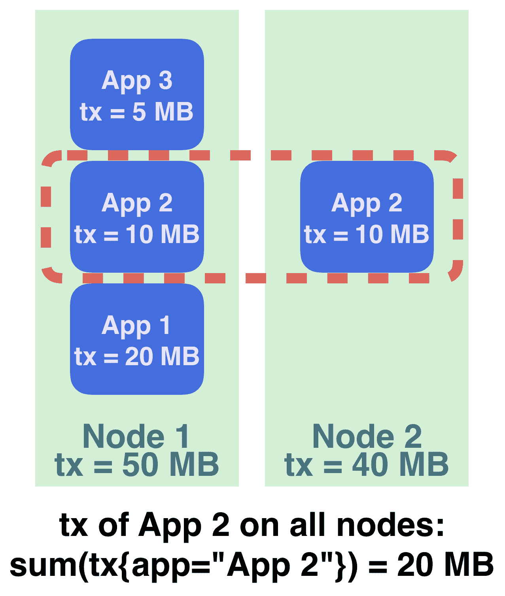

另一个区别是，关于 CPU 限速的指标仅在容器级别报告。如果在某个应用程序遇到性能问题，但主机上的 CPU 资源尚充足，我们可以检查是否由于限速导致问题，并查看相关的指标。

# 监控 Kubernetes

Kubernetes 负责管理、调度和编排我们的应用程序。一旦应用程序崩溃，Kubernetes 通常是我们首先查看的地方。特别是当新部署后发生崩溃时，相关对象的状态会即时在 Kubernetes 中反映出来。

总结来说，应该监控的组件在下图中进行了说明：

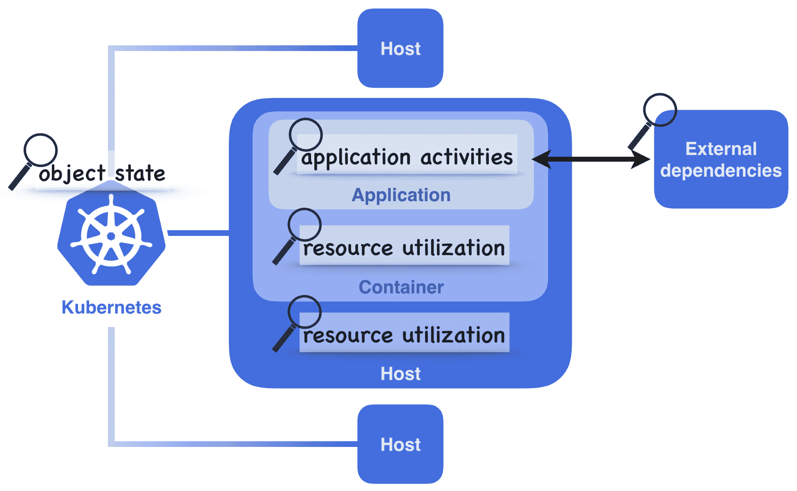

# 获取 Kubernetes 监控要点

由于监控是服务运营的重要组成部分，我们基础设施中的现有监控系统可能已经提供了从常见来源（如知名的开源软件和操作系统）收集指标的解决方案。至于运行在 Kubernetes 上的应用程序，让我们看看 Kubernetes 及其生态系统提供了什么。

要收集由 Kubernetes 管理的容器的指标，我们不需要在 Kubernetes 主节点上安装任何特殊的控制器，也不需要在容器内部安装任何指标收集器。这基本上是由 kubelet 完成的，它从节点收集各种遥测数据，并在以下 API 端点中暴露出来（截至 Kubernetes 1.13 版本）：

+   `/metrics/cadvisor`：此 API 端点用于 Prometheus 格式的 cAdvisor 容器指标。

+   `/spec/`：此 API 端点导出机器规格。

+   `/stats/`：此 API 端点也导出 cAdvisor 容器指标，但以 JSON 格式呈现。

+   `/stats/summary`：此端点包含 kubelet 聚合的各种数据，也称为 Summary API。

`/metrics/`路径下的指标与 kubelet 的内部统计数据相关。

Prometheus 格式（[`prometheus.io/docs/instrumenting/exposition_formats/`](https://prometheus.io/docs/instrumenting/exposition_formats/)）是 OpenMetrics 格式的前身，因此在 OpenMetrics 发布后，它也被称为 OpenMetrics v0.0.4。如果我们的监控系统支持这种格式，我们可以配置它从 kubelet 的 Prometheus 端点（`/metrics/cadvisor`）拉取指标。

要访问这些端点，kubelet 有两个 TCP 端口，`10250`和`10255`。端口`10250`是更安全的，建议在生产环境中使用，因为它是 HTTPS 端点，并且受到 Kubernetes 身份验证和授权系统的保护。`10255`使用普通 HTTP，应该限制使用。

cAdvisor ([`github.com/google/cadvisor`](https://github.com/google/cadvisor)) 是一个广泛使用的容器级度量收集器。简单来说，cAdvisor 聚合每个在机器上运行的容器的资源使用和性能统计信息。其代码目前已内嵌在 kubelet 中，因此我们无需单独部署它。然而，由于它仅关注某些容器运行时和 Linux 容器，这可能不适应未来 Kubernetes 对不同容器运行时的支持，因此未来的 Kubernetes 版本将不再集成 cAdvisor。除此之外，并非所有 cAdvisor 度量信息目前都由 kubelet 发布。因此，如果我们需要这些数据，就需要自行部署 cAdvisor。请注意，cAdvisor 的部署是按主机而非容器进行的，这对于容器化应用程序更为合理，我们可以使用 DaemonSet 来部署它。

监控管道中的另一个重要组件是度量服务器 ([`github.com/kubernetes-incubator/metrics-server`](https://github.com/kubernetes-incubator/metrics-server))。它通过 kubelet 的 summary API 聚合每个节点的监控统计信息，并充当 Kubernetes 其他组件与真实度量源之间的抽象层。更具体地说，度量服务器在聚合层下实现了资源度量 API，因此集群内部的其他组件可以通过统一的 API 路径 (`/api/metrics.k8s.io`) 获取数据。在这种情况下，`kubectl top` 和 kube-dashboard 从资源度量 API 获取数据。

以下图示展示了度量服务器如何与集群中的其他组件进行交互：

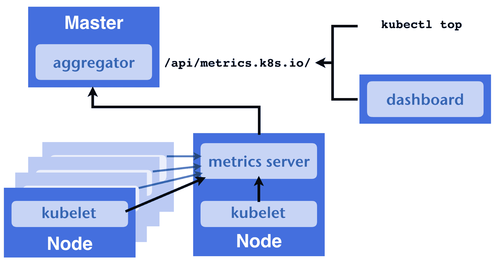

如果你使用的是旧版本的 Kubernetes，度量服务器的角色将由 Heapster ([`github.com/kubernetes/heapster`](https://github.com/kubernetes/heapster)) 执行。

大多数 Kubernetes 安装默认会部署度量服务器。如果我们需要手动部署，可以下载度量服务器的 manifest 文件并应用它们：

```
$ git clone https://github.com/kubernetes-incubator/metrics-server.git
$ kubectl apply -f metrics-server/deploy/1.8+/
```

虽然 kubelet 的度量关注的是系统度量，但我们还希望在监控仪表板上查看对象的逻辑状态。`kube-state-metrics` ([`github.com/kubernetes/kube-state-metrics`](https://github.com/kubernetes/kube-state-metrics)) 是完成我们监控堆栈的组成部分。它监控 Kubernetes master 节点，并将我们通过 `kubectl get` 或 `kubectl describe` 查看对象的状态转换为 Prometheus 格式的度量。因此，我们能够将这些状态抓取到度量存储中，并在发生诸如无法解释的重启次数等事件时发出警报。下载以下模板进行安装：

```
$ git clone https://github.com/kubernetes/kube-state-metrics.git
$ kubectl apply -f kube-state-metrics/kubernetes
```

之后，我们可以在集群内部通过 `kube-state-metrics` 服务查看状态度量：

```
http://kube-state-metrics.kube-system:8080/metrics
```

# 实践中的监控

到目前为止，我们已经学习了创建一个坚固的监控系统所需的一系列原理，这使我们能够构建一个强大的服务。现在是时候实施一个了。由于绝大多数 Kubernetes 组件都会以 Prometheus 格式在常规路径上暴露它们的度量指标，我们可以自由使用任何熟悉的监控工具，只要该工具能够理解这种格式。在这一节中，我们将设置一个使用 Prometheus 的示例。Prometheus 在 Kubernetes 生态系统中的流行，不仅因为它的强大功能，还因为它得到了**云原生计算基金会**（[`www.cncf.io/`](https://www.cncf.io/)）的支持，该基金会也赞助了 Kubernetes 项目。

# 了解 Prometheus

Prometheus 框架由多个组件组成，如下图所示：

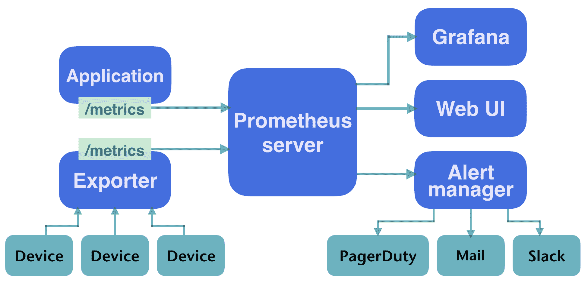

与所有其他监控框架一样，Prometheus 依赖代理从我们系统的组件中抓取统计信息。这些代理就是图中左侧所示的 exporters。除此之外，Prometheus 采用拉取模型来收集度量指标，也就是说，它并不是被动接收度量指标，而是主动从 exporters 的度量端点拉取数据。如果应用程序暴露了一个度量端点，Prometheus 也能够抓取该数据。默认的存储后端是嵌入式的 TSDB，并且可以切换到其他远程存储类型，例如 InfluxDB 或 Graphite。Prometheus 还负责根据**Alertmanager**中预配置的规则触发告警，Alertmanager 处理告警任务。它会将接收到的告警分组并发送到实际发送消息的工具，例如电子邮件、**Slack**（[`slack.com/`](https://slack.com/)）、**PagerDuty**（[`www.pagerduty.com/`](https://www.pagerduty.com/)）等。除了告警，我们还希望将收集的度量指标可视化，以便快速了解我们的系统，这时 Grafana 就派上用场了。

除了数据收集，告警是监控中最重要的概念之一。然而，告警更与业务相关，这超出了本章的范围。因此，在这一节中，我们将重点讨论使用 Prometheus 进行度量指标的收集，而不会深入探讨 Alertmanager。

# 部署 Prometheus

我们为本章准备的模板可以通过以下链接找到：[`github.com/PacktPublishing/DevOps-with-Kubernetes-Second-Edition/tree/master/chapter7`](https://github.com/PacktPublishing/DevOps-with-Kubernetes-Second-Edition/tree/master/chapter7)。

在 `7-1_prometheus` 下是本节中要使用的组件清单，包括 Prometheus 部署、导出器和相关资源。这些将部署在专用命名空间 `monitoring` 中，除了那些需要在 `kube-system` 命名空间中工作的组件。请仔细审查它们。目前，我们按照以下顺序创建我们的资源：

```
$ kubectl apply -f monitoring-ns.yml
$ kubectl apply -f prometheus/configs/prom-config-default.yml
$ kubectl apply -f prometheus
```

Prometheus 提供的清单中，资源使用量（如存储和内存）被限制在一个相对较低的水平。如果你希望以更实际的方式使用它们，可以根据实际需求调整参数。在 Prometheus 服务器启动后，我们可以通过 `kubectl port-forward` 连接到其 Web UI，端口为 `9090`。如果我们修改相应的服务（`prometheus/prom-svc.yml`），也可以使用 NodePort 或 Ingress 连接到 UI。进入 UI 后，我们将看到的第一页是 Prometheus 表达式浏览器，我们可以在其中构建查询并可视化指标。在默认设置下，Prometheus 会自动收集指标。所有有效的抓取目标可以在 `/targets` 路径下找到。要与 Prometheus 交互，我们需要了解其语言：**PromQL**。

要在生产环境中运行 Prometheus，还可以使用 **Prometheus Operator** ([`github.com/coreos/prometheus-operator`](https://github.com/coreos/prometheus-operator))，该工具旨在通过 CoreOS 简化 Kubernetes 中的监控任务。

# 使用 PromQL

PromQL 有三种数据类型：**瞬时向量**、**范围向量**和**标量**。瞬时向量是一组数据样本的时间序列；范围向量是包含某个时间范围内数据的时间序列集合；标量是一个数值型浮动值。存储在 Prometheus 中的指标通过指标名称和标签来标识，我们可以通过表达式浏览器中执行按钮旁边的下拉列表找到任何已收集指标的名称。如果我们使用一个指标名称查询 Prometheus，比如 `http_requests_total`，我们会得到很多结果，因为瞬时向量通常有相同的名称，但具有不同的标签。同样，我们也可以使用 `{}` 语法查询特定的标签集。例如，查询 `{code="400",method="get"}` 表示我们想要任何标签 `code` 和 `method` 分别为 `400` 和 `get` 的指标。将名称和标签结合在查询中也是有效的，如 `http_requests_total{code="400",method="get"}`。PromQL 使我们能够根据各种不同的参数检查我们的应用程序或系统，只要相关的指标被收集。

除了刚才提到的基本查询，PromQL 还有许多其他功能。例如，我们可以使用正则表达式和逻辑运算符查询标签，使用函数连接和聚合指标，甚至执行不同指标之间的操作。例如，以下表达式给出了 `kube-dns` pod 在 `kube-system` 命名空间中消耗的总内存：

```
sum(container_memory_usage_bytes{namespace="kube-system", pod_name=~"kube-dns-([^-]+)-.*"} ) / 1048576
```

更详细的文档可以在官方 Prometheus 网站找到（[`prometheus.io/docs/querying/basics/`](https://prometheus.io/docs/querying/basics/)）。这将帮助你发挥 Prometheus 的强大功能。

# 在 Kubernetes 中发现目标

由于 Prometheus 仅从它知道的端点拉取指标，我们必须明确告知它我们希望从哪里收集数据。在`/config`路径下，有一页列出了当前配置的目标以供抓取。默认情况下，会有一个作业针对 Prometheus 本身运行，并可以在常规抓取路径`/metrics`中找到。如果我们连接到该端点，我们将看到一页非常长的文本，如下所示：

```
$ kubectl exec -n monitoring <prometheus_pod_name> -- \
    wget -qO - localhost:9090/metrics

# HELP go_gc_duration_seconds A summary of the GC invocation durations.
# TYPE go_gc_duration_seconds summary
go_gc_duration_seconds{quantile="0"} 1.5657e-05
go_gc_duration_seconds{quantile="0.25"} 1.9756e-05
go_gc_duration_seconds{quantile="0.5"} 2.4567e-05
go_gc_duration_seconds{quantile="0.75"} 2.8386e-05
...
```

这是我们之前提到过的 Prometheus 指标格式。下次我们看到类似的页面时，我们就知道那是一个指标端点。抓取 Prometheus 的作业是默认配置文件中的静态目标。然而，由于 Kubernetes 中的容器是动态创建和销毁的，因此很难找出容器的准确地址，更不用说在 Prometheus 中设置它。在某些情况下，我们可能会利用服务的 DNS 作为静态指标目标，但这仍然无法解决所有问题。例如，如果我们想知道每个 pod 背后的服务收到多少请求，设置一个作业来抓取服务可能会从随机的 pod 中获取结果，而不是从所有 pod 获取结果。幸运的是，Prometheus 通过其发现 Kubernetes 内部服务的能力帮助我们克服了这个问题。

更具体地说，Prometheus 能够查询 Kubernetes 关于正在运行的服务的信息。然后，它可以根据情况将它们添加到或从目标配置中删除。目前支持五种发现机制：

+   **node**发现模式为每个节点创建一个目标。默认情况下，目标端口将是 kubelet 的 HTTPS 端口（`10250`）。

+   **service**发现模式为每个`Service`对象创建一个目标。服务中定义的所有目标端口都会成为抓取目标。

+   **pod**发现模式与服务发现角色类似；它为每个 pod 创建一个目标，并暴露每个 pod 所定义的所有容器端口。如果在 pod 模板中没有定义端口，它仍然会仅使用地址创建抓取目标。

+   **端点**模式发现由服务创建的`Endpoint`对象。例如，如果一个服务由三个 pod 支持，每个 pod 有两个端口，那么我们将有六个抓取目标。此外，对于一个 pod，不仅仅是暴露给服务的端口，其他声明的容器端口也会被发现。

+   **ingress**模式为每个 Ingress 路径创建一个目标。由于一个 Ingress 对象可以将请求路由到多个服务，并且每个服务可能有自己的一套指标，这种模式允许我们一次性配置所有这些目标。

下图展示了四种发现机制。左侧是 Kubernetes 中的资源，右侧是 Prometheus 中创建的目标：

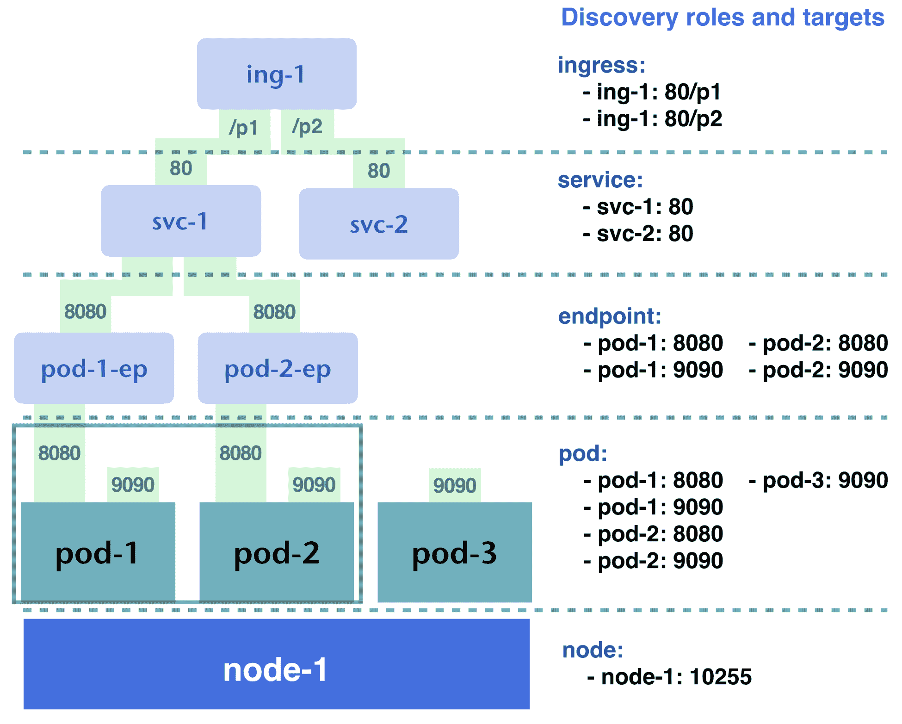

一般来说，并不是所有暴露的端口都作为度量端点提供服务，因此我们当然不希望 Prometheus 抓取它在集群中发现的所有内容，而是只收集标记的资源。为了在 Prometheus 中实现这一点，一种常见的方法是利用资源清单上的注解来区分哪些目标需要被抓取，然后我们可以使用 Prometheus 配置中的 `relabel` 模块过滤掉那些没有注解的目标。请看这个示例配置：

```
...

kubernetes_sd_configs:
- role: pod
 relabel_configs:
 - source_labels: [__meta_kubernetes_pod_annotation_mycom_io_scrape]
 action: keep
 regex: true
...
```

这告诉 Prometheus 只保留具有 `__meta_kubernetes_pod_annotation_{name}` 标签并且值为 `true` 的目标。这个标签是从 pod 规格中的注解字段获取的，下面是一个片段：

```
...
apiVersion: apps/v1
kind: Deployment
spec:
 template:
 metadata:
 annotations:
 mycom.io/scrape: "true"
...
```

请注意，Prometheus 会将所有不在 `[a-zA-Z0-9_]` 范围内的字符转换为 `_`，因此我们也可以将之前的注解写为 `mycom-io-scrape: "true"`。

通过结合这些注解和标签过滤规则，我们可以精确控制需要收集的目标。以下是一些 Prometheus 中常用的注解：

+   `prometheus.io/scrape: "true"`

+   `prometheus.io/path: "/metrics"`

+   `prometheus.io/port: "9090"`

+   `prometheus.io/scheme: "https"`

+   `prometheus.io/probe: "true"`

这些注解可以在 `Deployment` 对象（其对应的 pod）和 `Service` 对象中看到。以下模板片段展示了一个常见的用例：

```
apiVersion: v1
kind: Service
metadata:
  annotations:
    prometheus.io/scrape: "true"
    prometheus.io/path: "/monitoring"
    prometheus.io/scheme: "http"
    prometheus.io/port: "9090"
```

通过应用以下配置，Prometheus 将把端点模式下发现的目标转换为 `http://<pod_ip_of_the_service>:9090/monitoring`：

```
- job_name: 'kubernetes-endpoints'
 kubernetes_sd_configs:
 - role: endpoints
 relabel_configs:
 - source_labels: [__meta_kubernetes_service_annotation_prometheus_io_scrape]
 action: keep
 regex: true
 - source_labels: [__meta_kubernetes_service_annotation_prometheus_io_path]
 action: replace
 target_label: __metrics_path__
 regex: (.+)
 - source_labels: [__address__,__meta_kubernetes_service_annotation_prometheus_io_port]
 action: replace
 regex: ([^:]+)(?::\d+)?;(\d+)
 replacement: $1:$2
 target_label: __address__
 - source_labels: [__meta_kubernetes_service_annotation_prometheus_io_scheme]
 action: replace
 target_label: __scheme__
 regex: (https?)
```

我们可以在 Prometheus 中使用 `prometheus.io/probe` 注解来表示一个服务是否应该被添加到探测目标中。探测任务将由 Blackbox exporter 执行（[`github.com/prometheus/blackbox_exporter`](https://github.com/prometheus/blackbox_exporter)）。

探测的目的是确定探测器与目标服务之间连接的质量。目标服务的可用性也会被评估，因为探测器可以充当客户。因此，我们放置探测器的位置也是一个需要考虑的因素，如果我们希望探测具有意义的话。

有时，我们可能只想获取某个服务下单个 Pod 的指标，而不是获取该服务下所有 Pod 的指标。由于大多数端点对象不是手动创建的，端点发现模式使用了从服务继承的注解。这意味着，如果我们为服务添加注解，该注解将在服务发现和端点发现模式中同时可见，这使得我们无法区分目标应该是按端点抓取还是按服务抓取。为了解决这个问题，我们可以使用`prometheus.io/scrape: "true"`来标记需要被抓取的端点，并使用另一个注解如`prometheus.io/scrape_service_only: "true"`来告诉 Prometheus 仅为该服务创建一个目标。

我们示例仓库中的`prom-config-k8s.yml`模板包含了一些基本配置，用于为 Prometheus 发现 Kubernetes 资源。按如下方式应用：

```
$ kubectl apply -f prometheus/configs/prom-config-k8s.yml
```

因为模板中的资源是一个 ConfigMap，它将数据存储在`etcd`共识存储中，所以需要几秒钟才能变得一致。之后，我们可以通过向进程发送`SIGHUP`来重新加载 Prometheus：

```
$ kubectl exec -n monitoring <prometheus_pod_name> -- kill -1 1
```

提供的模板基于 Prometheus 官方仓库中的这个示例。你可以通过以下链接了解更多用途，其中还包括针对 Blackbox exporter 的目标发现：[`github.com/prometheus/prometheus/blob/master/documentation/examples/prometheus-kubernetes.yml`](https://github.com/prometheus/prometheus/blob/master/documentation/examples/prometheus-kubernetes.yml)。我们也略过了配置中动作是如何实际工作的细节；欲了解更多，请参考官方文档：[`prometheus.io/docs/prometheus/latest/configuration/configuration/#configuration`](https://prometheus.io/docs/prometheus/latest/configuration/configuration/#configuration)。

# 从 Kubernetes 收集数据

在 Prometheus 中实现之前讨论的监控层的步骤现在非常清晰：

1.  安装导出器

1.  用适当的标签标注它们

1.  在自动发现的端点上收集数据

Prometheus 中的主机层监控由节点导出器（[`github.com/prometheus/node_exporter`](https://github.com/prometheus/node_exporter)）完成。它的 Kubernetes 模板可以在本章的示例中找到，并包含一个带有抓取注解的 DaemonSet。按如下方式安装：

```
$ kubectl apply -f exporters/prom-node-exporter.yml
```

如果使用示例配置，它在 Prometheus 中的对应目标将通过 Pod 发现角色被发现并创建。

容器层的收集器应为 kubelet。因此，使用节点模式发现它是我们需要做的唯一事情。

Kubernetes 监控由`kube-state-metrics`完成，之前也介绍过它。它还带有 Prometheus 注解，这意味着我们不需要做任何其他配置。

到目前为止，我们已经基于 Prometheus 设置了强大的监控堆栈。关于应用程序和外部资源监控，Prometheus 生态系统中有广泛的导出器来支持我们系统内各种组件的监控。例如，如果我们需要 MySQL 数据库的统计信息，只需安装 MySQL 服务器导出器（[`github.com/prometheus/mysqld_exporter`](https://github.com/prometheus/mysqld_exporter)），它提供了全面且有用的指标。

除了我们已经描述的指标之外，Kubernetes 组件还有一些其他有用的指标起着重要作用：

+   **Kubernetes API 服务器**：API 服务器在`/metrics`上公开其统计信息，默认情况下启用此目标。

+   `kube-controller-manager`：此组件在`10252`端口上公开指标，但在某些托管的 Kubernetes 服务（如 GKE）上不可见。如果您使用自托管集群，应用`kubernetes/self/kube-controller-manager-metrics-svc.yml`会为 Prometheus 创建端点。

+   `kube-scheduler`：使用`10251`端口，在 GKE 集群中也不可见。`kubernetes/self/kube-scheduler-metrics-svc.yml`用于创建指向 Prometheus 的目标模板。

+   `kube-dns`：Kubernetes 中的 DNS 由 CoreDNS 管理，其统计信息通过`9153`端口暴露。相应的模板是`kubernetes/self/core-dns-metrics-svc.yml`。

+   `etcd`：`etcd`集群还在`2379`端口上提供 Prometheus 指标端点。如果您的`etcd`集群是自托管且由 Kubernetes 管理的，可以使用`kubernetes/self/etcd-server.yml`作为参考。

+   **Nginx Ingress Controller**：Nginx 控制器通过`10254`端口发布指标，提供有关 nginx 状态以及 nginx 路由的持续时间、大小、方法和状态码的详细信息。完整的指南可以在这里找到：[`github.com/kubernetes/ingress-nginx/blob/master/docs/user-guide/monitoring.md`](https://github.com/kubernetes/ingress-nginx/blob/master/docs/user-guide/monitoring.md)。

Kubernetes 中的 DNS 由`skydns`提供，容器还暴露了一个指标路径。在使用`skydns`的`kube-dns` pod 中，通常有两个容器，分别是`dnsmasq`和`sky-dns`，它们的指标端口分别是`10054`和`10055`。如果需要，对应的模板是`kubernetes/self/skydns-metrics-svc.yml`。

# 使用 Grafana 可视化指标

表达式浏览器具有内置的图形面板，可帮助我们查看指标，但不适合作为日常例行工作的可视化仪表板。Grafana 是 Prometheus 的最佳选择。我们在第四章《管理有状态工作负载》中讨论了如何设置 Grafana，并在该章节的存储库中提供了模板。

要在 Grafana 中查看 Prometheus 指标，首先必须添加一个数据源。连接到我们的 Prometheus 服务器需要以下配置：

+   **类型**：`Prometheus`

+   **网址**：`http://prometheus-svc.monitoring:9090`

一旦连接上，我们可以导入仪表盘。在 Grafana 的共享页面（[`grafana.com/dashboards?dataSource=prometheus`](https://grafana.com/dashboards?dataSource=prometheus)）上，我们可以找到丰富的现成仪表盘。以下截图来自仪表盘`#1621`：

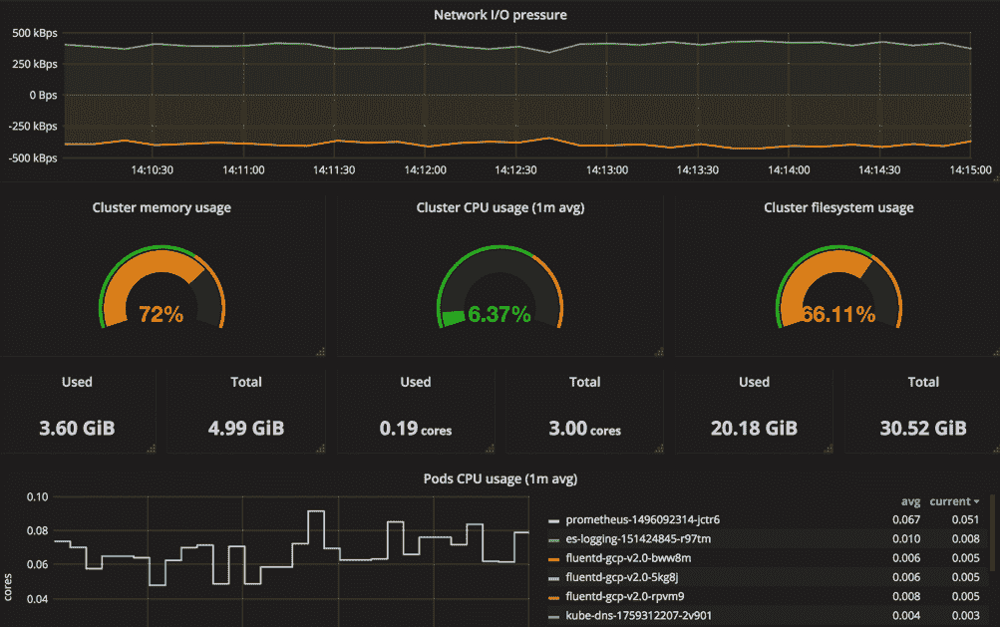

因为这些图表是由 Prometheus 的数据绘制的，我们可以根据需要绘制任何数据，只要我们掌握 PromQL。

仪表盘的内容可能会有很大差异，因为每个应用程序关注的重点不同。然而，将所有内容放到一个巨大的仪表盘中并不是一个好主意。USE 方法（[`www.brendangregg.com/usemethod.html`](http://www.brendangregg.com/usemethod.html)）和四个黄金信号（[`landing.google.com/sre/book/chapters/monitoring-distributed-systems.html`](https://landing.google.com/sre/book/chapters/monitoring-distributed-systems.html#xref_monitoring_golden-signals)）为构建监控仪表盘提供了一个良好的起点。

# 日志事件

通过对系统状态的定量时间序列进行监控，我们能够快速识别系统中哪些组件发生了故障，但它仍然无法诊断问题的根本原因。我们需要的是一个日志系统，通过关联事件和检测到的异常来收集、持久化并搜索日志。确实，除了排查故障和系统故障后的事后分析，日志系统还有许多其他商业应用场景。

一般来说，日志系统主要由两个组件组成：日志代理和日志后端。前者是程序的抽象层，负责收集、转换并将日志发送到日志后端。日志后端则存储接收到的所有日志。与监控类似，为 Kubernetes 构建日志系统时最具挑战性的部分是确定如何从容器中收集日志并将其发送到集中式日志后端。通常，发送程序日志的方式有三种：

+   将所有内容转储到`stdout`/`stderr`。

+   将日志文件写入文件系统。

+   将日志发送到日志代理或直接记录到后端。Kubernetes 中的程序也能够以相同的方式发出日志，只要我们理解 Kubernetes 中日志流的流动方式。

# 聚合日志的模式

对于直接向日志代理或后端记录日志的程序，无论它们是否在 Kubernetes 内部运行，实际上都无关紧要，因为它们从技术上讲并不是通过 Kubernetes 发送日志。在其他情况下，我们将使用以下两种日志模式。

# 每个节点使用日志代理收集日志

我们知道，通过`kubectl logs`获取的消息是从容器的`stdout`/`stderr`重定向来的流，但显然用`kubectl logs`收集日志并不是一个好主意。实际上，`kubectl logs`是从 kubelet 获取日志，而 kubelet 会从容器运行时的宿主路径`/var/log/containers/`聚合日志。日志的命名规则为`{pod_name}_{namespace}_{container_name}_{container_id}.log`。

因此，我们需要做的是，在每个节点上设置日志代理，并配置它们跟踪并转发路径下的日志文件，如下图所示：

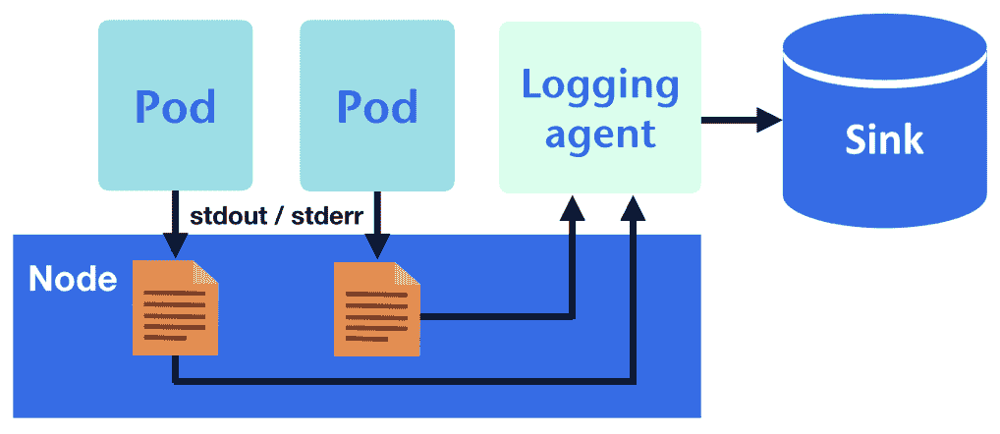

实际上，我们还会配置日志代理来跟踪主节点和节点下`/var/log`中的系统和 Kubernetes 组件的日志，如下所示：

+   `kube-proxy.log`

+   `kube-apiserver.log`

+   `kube-scheduler.log`

+   `kube-controller-manager.log`

+   `etcd.log`

如果 Kubernetes 组件由`systemd`管理，则日志将显示在`journald`中。

除了`stdout`/`stderr`，如果一个应用程序的日志作为文件存储在容器内，并通过`hostPath`卷持久化，那么一个节点日志代理能够将它们传递到节点上。然而，对于每个导出的日志文件，我们必须在日志代理中自定义它们的相应配置，以便正确地转发它们。此外，我们还需要合理命名日志文件，以避免任何冲突，并确保日志旋转可管理，这使得这种机制不可扩展且难以管理。

# 运行一个 sidecar 容器来转发写入的日志

修改应用程序以将日志写入标准流而不是日志文件可能会很困难，而且我们通常希望避免将日志写入`hostPath`卷带来的麻烦。在这种情况下，我们可以运行一个 sidecar 容器来处理 pod 的日志。换句话说，每个应用程序 pod 将有两个共享相同`emptyDir`卷的容器，以便 sidecar 容器可以跟踪应用程序容器的日志并将它们发送到 pod 外部，如下图所示：

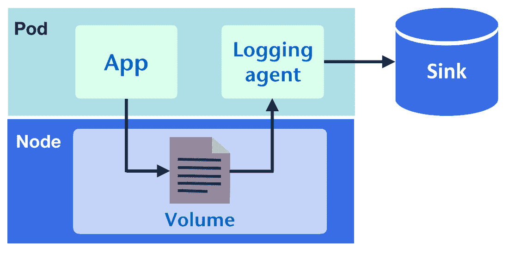

尽管我们不再需要担心管理日志文件，但仍然需要额外的工作，如为每个 pod 配置日志代理并将 Kubernetes 的元数据附加到日志条目上。另一种选择是使用 sidecar 容器将日志输出到标准流，而不是运行专门的日志代理，如以下 pod 示例所示。在这种情况下，应用程序容器持续不断地写入消息到`/var/log/myapp.log`，而 sidecar 容器则在共享卷中跟踪`myapp.log`：

```
---7-2_logging-sidecar.yml---
apiVersion: v1
kind: Pod
metadata:
  name: myapp
spec:
  containers:
  - image: busybox
    name: application
    args:
     - /bin/sh
     - -c
     - >
      while true; do
        echo "$(date) INFO hello" >> /var/log/myapp.log ;
        sleep 1;
      done
    volumeMounts:
    - name: log
      mountPath: /var/log
  - name: sidecar
    image: busybox
    args:
     - /bin/sh
     - -c
     - tail -fn+1 /var/log/myapp.log
    volumeMounts:
    - name: log
      mountPath: /var/log
  volumes:
  - name: log
emptyDir: {}
```

我们可以通过`kubectl logs`查看书写日志：

```
$ kubectl logs -f myapp -c sidecar
Sun Oct 14 21:26:47 UTC 2018 INFO hello
Sun Oct 14 21:26:48 UTC 2018 INFO hello
...
```

# 获取 Kubernetes 状态事件

我们在`kubectl describe`输出中看到的事件消息包含了宝贵的信息，并补充了`kube-state-metrics`收集的指标。这使我们能够准确地了解我们的 pods 或节点发生了什么。因此，这些事件消息应该成为我们的日志记录基本内容的一部分，与系统日志和应用日志一起使用。为了实现这一点，我们需要一些工具来监控 Kubernetes API 服务器，并将事件聚合到日志存储中。Kubernetes 中的事件对象也存储在`etcd`中，但访问存储以获取这些事件对象可能需要大量的工作。像 eventrouter（[`github.com/heptiolabs/eventrouter`](https://github.com/heptiolabs/eventrouter)）这样的项目可以在这种情况下提供帮助。Eventrouter 的工作方式是将事件对象转换为结构化消息，并将其发送到`stdout`。因此，我们的日志系统可以将这些事件视为普通日志，同时保留事件的元数据。

还有其他一些选择。一个是 Event Exporter（[`github.com/GoogleCloudPlatform/k8s-stackdriver/tree/master/event-exporter`](https://github.com/GoogleCloudPlatform/k8s-stackdriver/tree/master/event-exporter)），尽管它仅支持 StackDriver，这是一个 Google Cloud Platform 上的监控解决方案。另一个选择是 eventer，它是 Heapster 的一部分。它支持 Elasticsearch、InfluxDB、Riemann 和 Google Cloud Logging 作为输出目标。如果我们使用的日志系统不被支持，Eventer 还可以直接输出到`stdout`。然而，由于 Heapster 被 metric server 替代，eventer 的开发也被放弃了。

# 使用 Fluent Bit 和 Elasticsearch 进行日志记录

到目前为止，我们已经讨论了在现实世界中可能遇到的各种日志记录场景。现在是时候卷起袖子，构建一个日志系统了。日志系统和监控系统的架构在很多方面都非常相似：它们都有收集器、存储和消费者，如 BI 工具或搜索引擎。根据需求，组件可能会有很大的差异。例如，我们可能会实时处理一些日志以提取实时信息，而对于其他日志，我们可能只是将它们存档到持久存储中以供后续使用，比如批量报告或满足合规要求。总的来说，只要我们有办法将日志从容器中发送出去，就可以将其他工具集成到我们的系统中。下图展示了一些可能的使用场景：

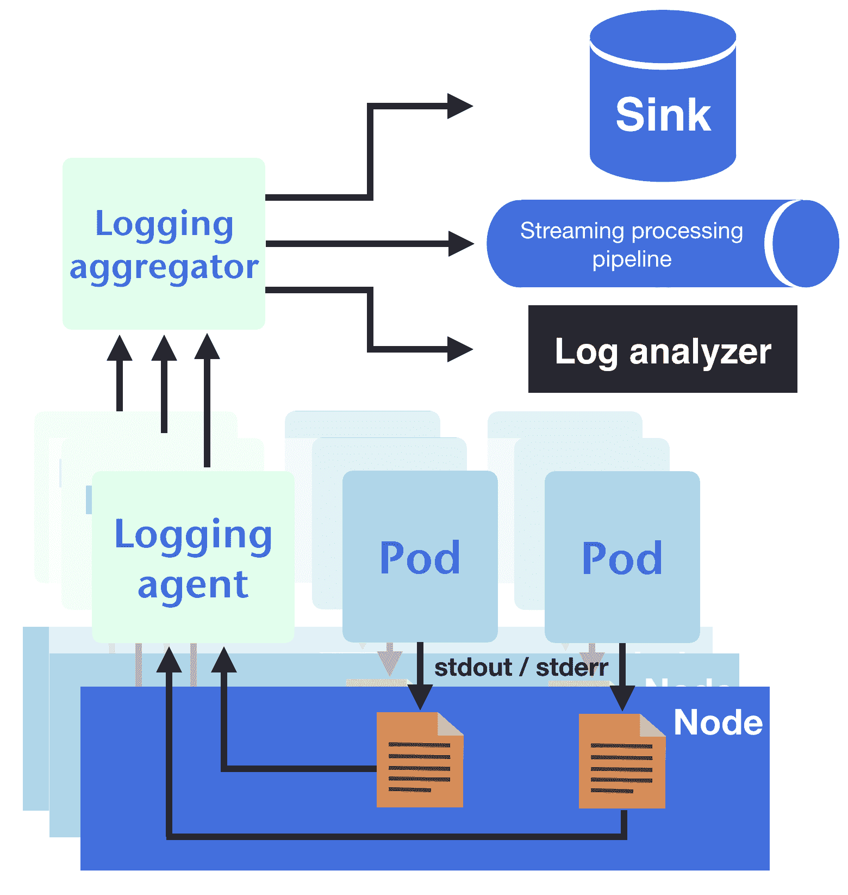

在这一节中，我们将设置最基本的日志系统。它的组件包括 Fluent Bit、Elasticsearch 和 Kibana。本节的模板可以在`7-3_efk`中找到，它们需要部署到`logging`命名空间。

Elasticsearch 是一个强大的文本搜索和分析引擎，使其成为分析集群中所有运行日志的理想选择。本章节的 Elasticsearch 模板使用了一个非常简单的设置来演示该概念。如果你希望部署一个用于生产的 Elasticsearch 集群，建议使用 StatefulSet 控制器来设置集群，并通过适当的配置调优 Elasticsearch，正如我们在第四章《管理有状态工作负载》中所讨论的那样。我们可以通过以下模板部署一个 Elasticsearch 实例和一个日志命名空间（[`github.com/PacktPublishing/DevOps-with-Kubernetes-Second-Edition/tree/master/chapter7/7-3_efk`](https://github.com/PacktPublishing/DevOps-with-Kubernetes-Second-Edition/tree/master/chapter7/7-3_efk)）：

```
$ kubectl apply -f logging-ns.yml $ kubectl apply -f elasticsearch 
```

如果我们从 `es-logging-svc:9200` 获得响应，那么就说明 Elasticsearch 已经准备好。

Elasticsearch 是一个优秀的文档搜索引擎。然而，在持久化大量日志时，它可能表现得不如预期。幸运的是，有多种解决方案允许我们使用 Elasticsearch 索引存储在其他存储中的文档。

下一步是设置一个节点日志代理。由于我们会在每个节点上运行此代理，我们希望它在节点资源使用上尽可能轻量；这也是我们选择 Fluent Bit 的原因（[`fluentbit.io/`](https://fluentbit.io/)）。Fluent Bit 具有更低的内存占用，使其成为满足我们需求的合适日志代理，即将所有日志从节点中导出。

由于 Fluent Bit 的实现目标是最大限度地减少资源使用，因此它将功能减少到了一个非常有限的集合。如果我们希望在日志层中有更大的自由度来组合解析器和过滤器以适应不同的应用程序，我们可以使用 Fluent Bit 的兄弟项目 Fluentd（[`www.fluentd.org/`](https://www.fluentd.org/)），它更加可扩展和灵活，但比 Fluent Bit 消耗更多资源。由于 Fluent Bit 能够将日志转发到 Fluentd，因此一种常见的方法是将 Fluent Bit 用作节点日志代理，将 Fluentd 用作聚合器，就像前面图示的那样。

在我们的示例中，Fluent Bit 被配置为第一个日志模式。这意味着它会通过每个节点的日志代理收集日志，并直接将其发送到 Elasticsearch：

```
$ kubectl apply -f logging-agent/fluentbit/ 
```

Fluent Bit 的 ConfigMap 已经配置为跟踪 `/var/log/containers` 下的容器日志和 `/var/log` 下某些系统组件的日志。Fluent Bit 还可以在端口 `2020` 上以 Prometheus 格式暴露其统计数据，这在 DaemonSet 模板中进行了配置。

由于稳定性问题和对灵活性的需求，使用 Fluentd 作为日志代理仍然很常见。在我们的示例中，可以在 `logging-agent/fluentd` 下找到模板，或者可以在官方仓库中找到它们：[`github.com/fluent/fluentd-kubernetes-daemonset`](https://github.com/fluent/fluentd-kubernetes-daemonset)。

要使用 Kubernetes 事件，我们可以使用 `eventrouter`：

```
$ kubectl apply -f eventrouter.yml
```

这将开始以 JSON 格式在 `stdout` 流中打印事件，以便我们可以在 Elasticsearch 中对其进行索引。

要查看发送到 Elasticsearch 的日志，我们可以调用 Elasticsearch 的搜索 API，但还有一个更好的选择：Kibana，它是一个允许我们与 Elasticsearch 交互的 web 界面。在本节的示例中，使用以下命令将所有内容部署到 `kibana` 下：

```
$ kubectl apply -f kibana
```

Grafana 也支持从 Elasticsearch 读取数据：[`docs.grafana.org/features/datasources/elasticsearch/`](http://docs.grafana.org/features/datasources/elasticsearch/)。

在我们的示例中，Kibana 监听端口 `5601`。将服务从集群中暴露并使用任何浏览器连接后，您可以开始搜索来自 Kubernetes 的日志。在我们的 Fluent Bit 配置示例中，通过 eventrouter 路由的日志将位于名为 `kube-event-*` 的索引下，而来自其他容器的日志则可以在名为 `kube-container-*` 的索引中找到。以下截图展示了 Kibana 中的事件消息样式：

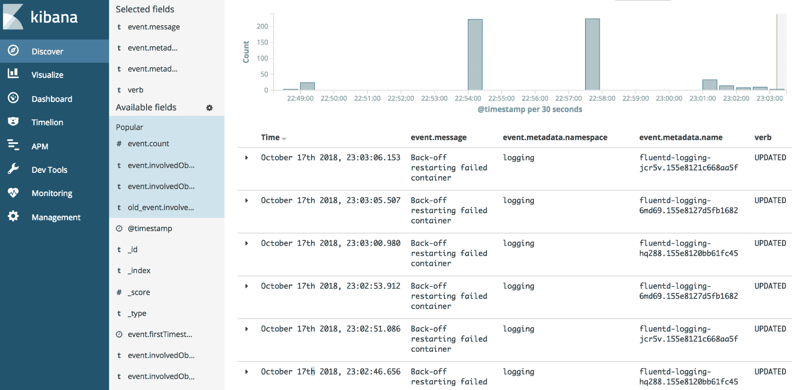

# 从日志中提取指标

我们围绕 Kubernetes 构建的应用程序监控和日志系统，如下图所示：

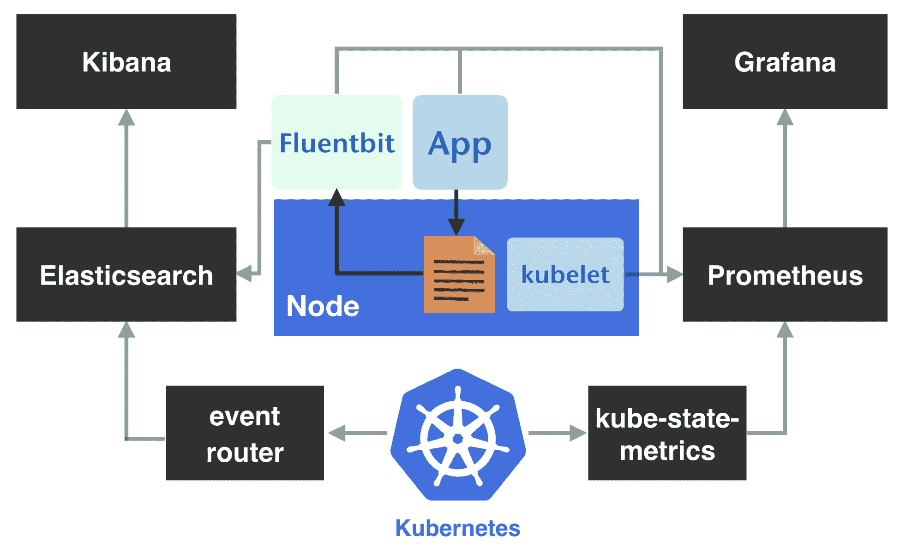

日志部分和监控部分看起来像是两条独立的轨道，但日志的价值远不止是短文本的集合。这是结构化数据，通常带有时间戳；因此，如果我们能够从日志中解析信息，并根据时间戳将提取的向量投影到时间维度，它将成为一个时间序列指标，并可用于 Prometheus。

例如，任何一个 web 服务器的访问日志条目可能如下所示：

```
10.1.5.7 - - [28/Oct/2018:00:00:01 +0200] "GET /ping HTTP/1.1" 200 68 0.002
```

这些数据包括请求的 IP 地址、时间、方法、处理程序等。如果我们根据日志段的含义划分它们，那么计数的部分可以视为一个指标样本，如下所示：

```
{ip:"10.1.5.7",handler:"/ping",method:"GET",status:200,body_size:68,duration:0.002}
```

转换之后，随着时间的推移，追踪日志将更加直观。

为了将日志组织成 Prometheus 格式，诸如 mtail ([`github.com/google/mtail`](https://github.com/google/mtail))、Grok Exporter ([`github.com/fstab/grok_exporter`](https://github.com/fstab/grok_exporter)) 或 Fluentd ([`github.com/fluent/fluent-plugin-prometheus`](https://github.com/fluent/fluent-plugin-prometheus)) 等工具，广泛用于将日志条目提取为指标。

可以说，现在很多应用程序支持直接输出结构化指标，我们总是可以为自己的应用程序加入此类信息的监控。然而，并不是所有的技术栈都能为我们提供方便的方式来获取其内部状态，尤其是操作系统工具，如 `ntpd`。因此，将此类工具纳入我们的监控栈，帮助提升基础设施的可观察性，仍然是值得的。

# 集成 Istio 的数据

在服务网格中，每个服务之间的网关是前端代理。因此，前端代理显然是网格内部运行的事物的重要信息来源。然而，如果我们的技术栈中已经有类似的组件，如用于内部服务的负载均衡器或反向代理，那么从它们收集流量数据与服务网格代理有何不同？让我们考虑经典设置：

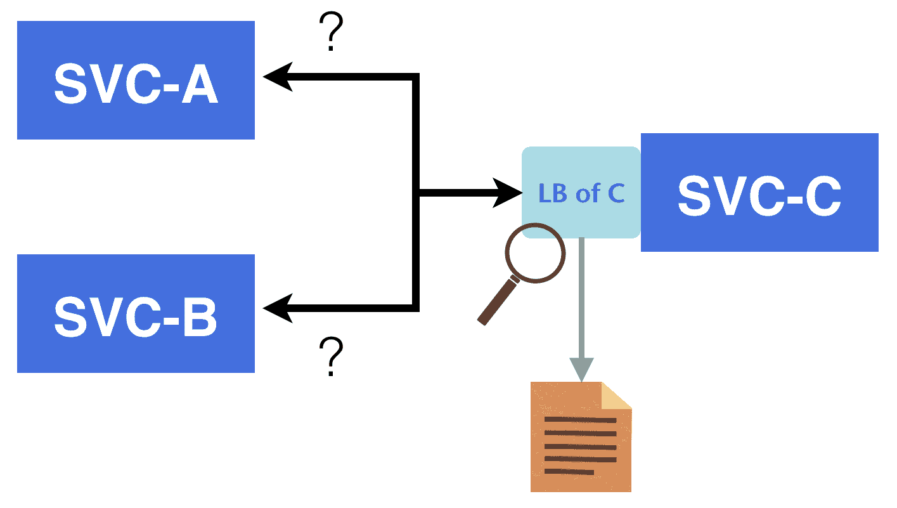

**SVC-A**和**SVC-B**向**SVC-C**发起请求。从负载均衡器收集到的**SVC-C**的数据代表了**SVC-C**的质量。然而，由于我们无法看到客户端到**SVC-C**的路径，衡量**SVC-A**或**SVC-B**与**SVC-C**之间质量的唯一方式是依赖客户端侧构建的机制，或在客户端所在的网络中放置探针。对于服务网格，看看以下图表：

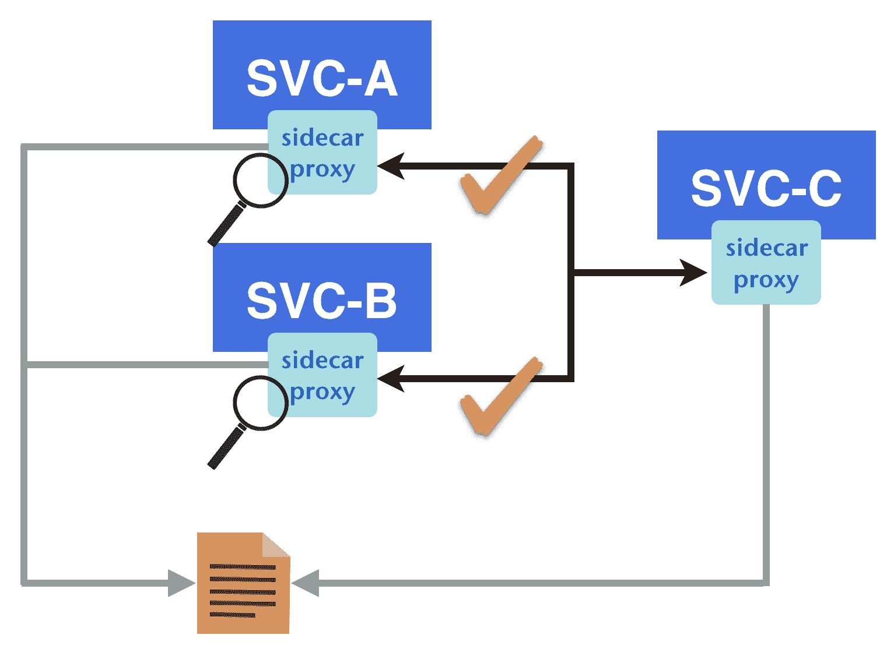

在这里，我们想要了解**SVC-C**的质量。在此设置中，**SVC-A**和**SVC-B**通过它们的 sidecar 代理与**SVC-C**通信，因此，如果我们收集所有客户端侧代理向**SVC-C**发出的请求的指标，我们也可以从服务器端的负载均衡器获得相同的数据，并补充**SVC-C**与其客户端之间缺失的度量。换句话说，我们可以有一种统一的方式来衡量不仅**SVC-C**的性能，还包括**SVC-C**与其客户端之间的质量。这些增强的信息也有助于我们在排查问题时定位故障。

# Istio 适配器模型

Mixer 是 Istio 架构中管理遥测的组件。它从与应用容器一起部署的边缘代理获取统计信息，并通过适配器与其他后端组件进行交互。例如，我们的监控后端是 Prometheus，因此我们可以利用 Mixer 的 Prometheus 适配器将从 envoy 代理获取的指标转换为 Prometheus 指标路径。

访问日志如何通过管道流向我们的 Fluentd/Fluent Bit 日志后端，与我们之前构建的管道相同，该管道将日志传送到 Elasticsearch。Istio 组件与监控后端之间的交互在以下图表中有所示：

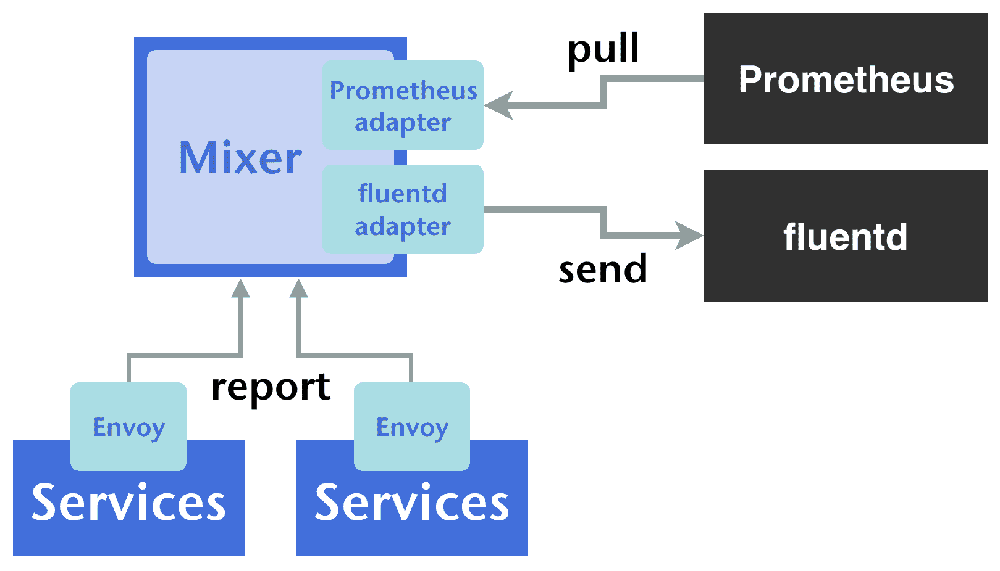

# 为现有基础设施配置 Istio

适配器模型使我们能够轻松地从 Mixer 组件中获取监控数据。它需要在接下来的章节中探讨的配置。

# Mixer 模板

一个 Mixer 模板定义了 Mixer 应该组织哪些数据，以及数据应以何种形式呈现。为了获取指标和访问日志，我们需要`metric`和`logentry`模板。例如，以下模板指示 Mixer 输出包含源和目标名称、方法、请求 URL 等的日志：

```
apiVersion: config.istio.io/v1alpha2
kind: logentry
metadata:
 name: accesslog
 namespace: istio-system
spec:
 severity: '"info"'
 timestamp: request.time
 variables:
 source: source.workload.name | "unknown"
 destination: destination.workload.name | "unknown"
 method: request.method | ""
 url: request.path | ""
 protocol: request.scheme | ""
 responseCode: response.code | 0
 responseSize: response.size | 0
 requestSize: request.size | 0
 latency: response.duration | "0ms"
 monitored_resource_type: '"UNSPECIFIED"'
```

每种模板的完整参考可以在这里找到：[`istio.io/docs/reference/config/policy-and-telemetry/templates/`](https://istio.io/docs/reference/config/policy-and-telemetry/templates/)。

# 处理器适配器

处理器适配器声明了 Mixer 与处理器交互的方式。对于前面的`logentry`，我们可以有一个如下所示的处理器定义：

```
apiVersion: config.istio.io/v1alpha2
kind: handler
metadata:
 name: fluentd
 namespace: istio-system
spec:
 compiledAdapter: fluentd
 params:
 address: fluentd-aggegater-svc.logging:24224
```

从这个代码片段来看，Mixer 知道一个可以接收`logentry`的目标。每种类型的适配器功能差异很大。例如，`fluentd`适配器只能接受`logentry`模板，而`Prometheus`只能处理`metric`模板，而 Stackdriver 可以处理`metric`、`logentry`和`tracespan`模板。所有支持的适配器列在这里：[`istio.io/docs/reference/config/policy-and-telemetry/adapters/`](https://istio.io/docs/reference/config/policy-and-telemetry/adapters/)。

# 规则

规则是模板与处理器之间的绑定。如果我们在之前的示例中已经有了`accesslog`、`logentry`和`fluentd`处理器，那么类似这样的规则将这两个实体关联起来：

```
apiVersion: config.istio.io/v1alpha2
kind: rule
metadata:
 name: accesslogtofluentd
 namespace: istio-system
spec:
 match: "true"
 actions:
 - handler: fluentd
 instances:
 - accesslog.logentry
```

一旦规则应用，Mixer 就知道它应该以之前定义的格式将访问日志发送到`fluentd`，地址为`fluentd-aggegater-svc.logging:24224`。

部署一个`fluentd`实例来接收来自 TCP 套接字的输入的示例可以在`7_3efk/logging-agent/fluentd-aggregator`下找到（[`github.com/PacktPublishing/DevOps-with-Kubernetes-Second-Edition/tree/master/chapter7/7-3_efk/logging-agent/fluentd-aggregator`](https://github.com/PacktPublishing/DevOps-with-Kubernetes-Second-Edition/tree/master/chapter7/7-3_efk/logging-agent/fluentd-aggregator)），并配置为将日志转发到我们之前部署的 Elasticsearch 实例。访问日志的三个 Istio 模板可以在`7-4_istio_fluentd_accesslog.yml`下找到（[`github.com/PacktPublishing/DevOps-with-Kubernetes-Second-Edition/blob/master/chapter7/7-4_istio_fluentd_accesslog.yml`](https://github.com/PacktPublishing/DevOps-with-Kubernetes-Second-Edition/blob/master/chapter7/7-4_istio_fluentd_accesslog.yml)）。

现在让我们考虑一下指标。如果 Istio 是通过官方图表部署，并且启用了 Prometheus（默认启用），那么在`istio-system`命名空间下的集群中将会有一个 Prometheus 实例。此外，Prometheus 会被预配置以收集 Istio 组件的指标。然而，出于各种原因，我们可能希望使用自己的 Prometheus 部署，或者将 Istio 附带的 Prometheus 专门用于收集 Istio 组件的指标。另一方面，我们知道 Prometheus 架构是灵活的，只要目标组件暴露它们的指标端点，我们就可以配置自己的 Prometheus 实例来抓取这些端点。

下面列出了来自 Istio 组件的一些有用端点：

+   `<all-components>:9093/metrics`：每个 Istio 组件都会在端口 `9093` 上暴露其内部状态。

+   `<envoy-sidecar>:15090/stats/prometheus`：每个 envoy 代理都会在此处打印原始统计数据。如果我们想要监控我们的应用程序，建议先使用 mixer 模板整理指标。

+   `<istio-telemetry-pods>:42422/metrics`：由 Prometheus 适配器配置并由 mixer 处理的指标将在此处提供。请注意，来自 envoy sidecar 的指标仅在 envoy 上报的 **telemetry pod** 中可用。换句话说，我们应当使用 Prometheus 的端点发现模式来收集所有 telemetry pod 的指标，而不是直接从 telemetry 服务中抓取数据。

默认情况下，以下指标将被配置并在 Prometheus 路径中提供：

+   `requests_total`

+   `request_duration_seconds`

+   `request_bytes`

+   `response_bytes`

+   `tcp_sent_bytes_total`

+   `tcp_received_bytes_total`

另一种使 Prometheus 实例（与官方 Istio 发布版一起部署的）收集的指标对我们的 Prometheus 可用的方法是使用联合设置。这涉及到设置一个 Prometheus 实例来抓取存储在另一个 Prometheus 实例中的指标。通过这种方式，我们可以将 Istio 的 Prometheus 看作是所有 Istio 相关指标的收集器。联合功能的路径为 `/federate`。假设我们想获取所有标签为 `{job="istio-mesh"}` 的指标，则查询参数如下：

```
http://<prometheus-for-istio>/federate?match[]={job="istio-mesh"}
```

结果是，通过添加几行配置，我们可以轻松地将 Istio 指标集成到现有的监控管道中。有关联合的完整参考，请查看官方文档：[`prometheus.io/docs/prometheus/latest/federation/`](https://prometheus.io/docs/prometheus/latest/federation/)。

# 总结

本章开始时，我们描述了如何通过内置函数（如 `kubectl`）快速获取正在运行的容器状态。然后，我们扩展了讨论，探讨了监控的概念和原理，包括为什么、监控什么以及如何在 Kubernetes 上监控我们的应用程序。之后，我们构建了一个以 Prometheus 为核心的监控系统，并设置了导出器来收集来自我们的应用程序、系统组件和 Kubernetes 单元的指标。还介绍了 Prometheus 的基本原理，如其架构和查询领域特定语言，因此我们现在可以使用指标深入了解我们的集群以及运行其中的应用程序，不仅能回顾性地排查故障，还能检测潜在的故障。之后，我们描述了常见的 **日志** 模式以及如何在 Kubernetes 中处理这些模式，并部署了 EFK 堆栈来整合日志。最后，我们转向了 Kubernetes 和应用程序之间的另一个重要基础设施组件——服务网格，以便在监控遥测时获得更精细的精度。本章中构建的系统提升了我们服务的可靠性。

在第八章中，*资源管理与扩展*，我们将利用这些指标来优化我们的服务所使用的资源。
