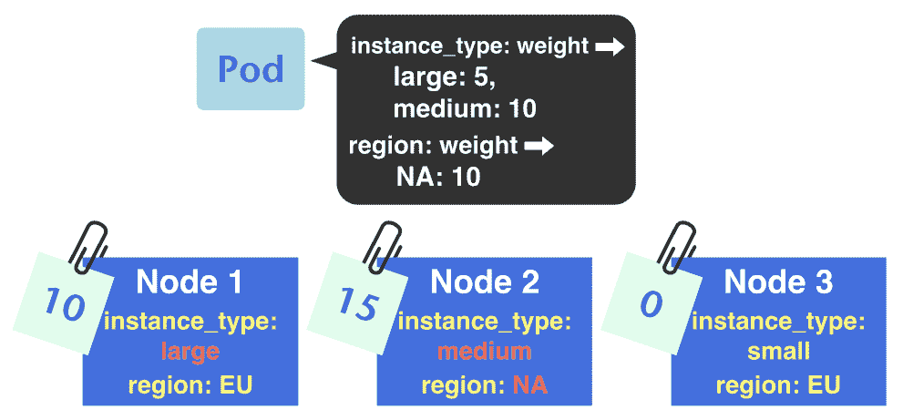
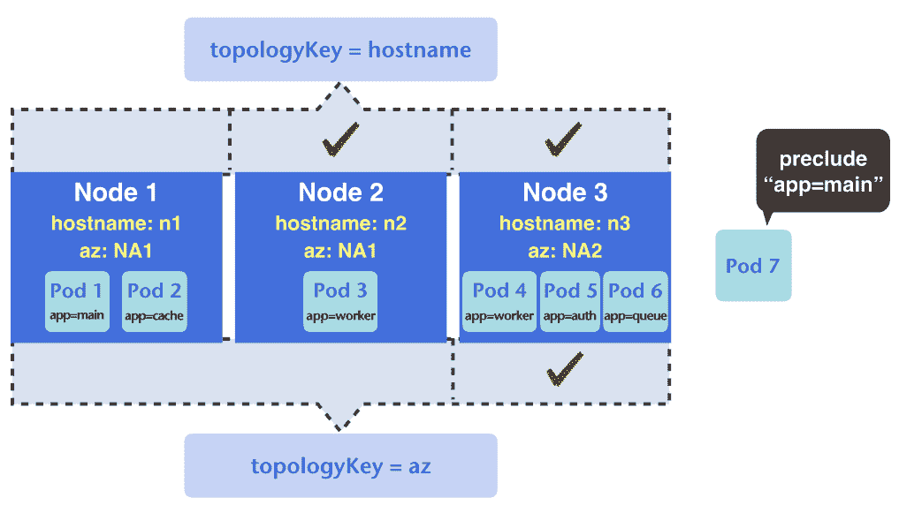
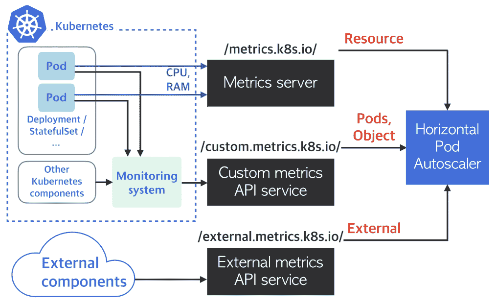

# 资源管理与扩展

尽管现在我们通过监控系统对与应用和集群相关的一切有了全面了解，但在处理计算资源和集群的能力时，我们仍然缺乏能力。在本章中，我们将讨论资源，内容包括以下主题：

+   Kubernetes 调度机制

+   资源与工作负载之间的亲和性

+   使用 Kubernetes 平滑扩展

+   安排集群资源

+   节点管理

# 工作负载调度

调度一词指的是将资源分配给需要执行的任务。Kubernetes 的作用远不止保持容器运行；它会主动监控集群的资源使用情况，并将 Pod 精确调度到可用资源上。这种基于调度器的基础设施是让我们比传统基础设施更高效地运行工作负载的关键。

# 优化资源利用率

毫不奇怪，Kubernetes 分配 Pod 到节点的方式是基于资源的供需关系。如果一个节点可以提供足够的资源，那么该节点就有资格运行 Pod。因此，集群容量与实际使用之间的差距越小，我们可以获得的资源利用率就越高。

# 资源类型与分配

有两种核心资源类型参与调度过程，即 CPU 和内存。要查看节点的能力，可以检查其`.status.allocatable`路径：

```
# Here we only show the path with a go template.
$ kubectl get node <node_name> -o go-template --template=\
'{{range $k,$v:=.status.allocatable}}{{printf "%s: %s\n" $k $v}}{{end}}'
cpu: 2
ephemeral-storage: 14796951528
hugepages-2Mi: 0
memory: 1936300Ki
pods: 110

```

如我们所见，这些资源将由调度器分配给任何需要它们的 Pod。但调度器如何知道一个 Pod 会消耗多少资源呢？我们实际上需要指示 Kubernetes 每个 Pod 的请求和限制。语法是 Pod 清单中的 `spec.containers[].resources.{limits,requests}.{resource_name}`：

```
apiVersion: v1
kind: Pod
metadata:
 name: nginx
spec:
 containers:
 - name: nginx
 image: nginx
 resources:
 requests:
 cpu: 100m
 memory: 10Mi
 limits:
 cpu: 0.1
 memory: 100Mi
```

CPU 资源的单位可以是分数或千分之一 CPU 表达式。一个 CPU 核心（或超线程）等于 1,000 毫核，或在分数表示法中是一个简单的 1.0。请注意，分数表示法是绝对量。例如，如果我们在一个节点上有八个核心，表达式 0.5 表示我们指的是 0.5 个核心，而不是四个核心。从这个角度来看，在之前的例子中，请求的 CPU 数量 `100m` 和 CPU 限制 `0.1` 是等价的。

内存以字节为单位表示，Kubernetes 接受以下后缀和符号：

+   **十进制**：E, P, T, G, M, K

+   **二进制**：Ei, Pi, Ti, Gi, Mi, Ki

+   **科学计数法**：e

因此，以下形式大致相同：`67108864`、`67M`、`64Mi` 和 `67e6`。

除了 CPU 和内存外，Kubernetes 还增加了许多其他资源类型，如 **临时存储** 和 **大页内存**。如 GPU、FPGA 和网卡等特定厂商资源可以通过设备插件供 Kubernetes 调度器使用。您还可以将自定义资源类型（如许可证）绑定到节点或集群，并配置 pod 消耗这些资源。有关详细信息，请参阅以下相关文献：

**临时存储**：

[`kubernetes.io/docs/concepts/configuration/manage-compute-resources-container/#local-ephemeral-storage`](https://kubernetes.io/docs/concepts/configuration/manage-compute-resources-container/#local-ephemeral-storage) **大页内存**：

[`kubernetes.io/docs/tasks/manage-hugepages/scheduling-hugepages/`](https://kubernetes.io/docs/tasks/manage-hugepages/scheduling-hugepages/) **设备资源**：

[`kubernetes.io/docs/concepts/extend-kubernetes/compute-storage-net/device-plugins/`](https://kubernetes.io/docs/concepts/extend-kubernetes/compute-storage-net/device-plugins/) **扩展资源**：

[`kubernetes.io/docs/concepts/configuration/manage-compute-resources-container/#extended-resources`](https://kubernetes.io/docs/concepts/configuration/manage-compute-resources-container/#extended-resources)

如其名称所示，请求是指 pod 可能使用的资源数量，Kubernetes 使用它来选择一个节点调度 pod。对于每种资源类型，节点上所有容器请求的总和永远不会超过该节点可分配的资源。换句话说，每个成功调度的容器都能确保获得它请求的资源量。

为了最大化整体资源利用率，只要 pod 所在节点有剩余资源，pod 就可以超出请求的资源量。但是，如果节点上的每个 pod 都使用超出预期的资源，那么该节点提供的资源可能最终会被耗尽，导致节点不稳定。限制概念解决了这个问题：

+   如果一个 pod 使用的 CPU 超过某个百分比，它将被限制（而不是终止）。

+   如果一个 pod 达到内存限制，它将被终止并重新启动。

这些限制是硬性约束，因此它总是大于或等于相同资源类型的请求。

请求和限制是按容器配置的。如果一个 pod 有多个容器，Kubernetes 会根据所有容器请求的总和来调度该 pod。需要注意的是，如果一个 pod 的总请求超出了集群中最大节点的容量，该 pod 将永远无法被调度。例如，假设集群中最大的节点可以提供 4000 m（四个核心）的 CPU 资源，那么既不能调度请求 4500 m CPU 的单容器 pod，也不能调度请求 2000 m 和 2500 m CPU 的两个容器 pod，因为没有节点能够满足它们的请求。

由于 Kubernetes 基于请求调度 Pods，如果所有 Pods 都没有任何请求或限制怎么办？在这种情况下，由于请求的总和为 `0`，它总是小于节点的容量，Kubernetes 会继续将 Pods 放置到节点上，直到超过节点的实际能力。默认情况下，节点上的唯一限制是可分配 Pods 的数量。它通过 kubelet 标志 `--max-pods` 进行配置。在前面的例子中，这是 110。另一个设置资源默认约束的工具是 `LimitRange`，我们将在本章稍后讨论。

除了 kubelet 的 `--max-pods` 标志外，我们还可以使用类似的标志 `--pods-per-core`，它限制每个核心最多可以运行的 Pods 数量。

# 服务质量（QoS）类

Kubernetes 仅使用请求来调度 Pods，因此所有调度到同一节点的 Pods 的限制总和可能会超过节点的容量。例如，我们可以有一个 1 Gi 内存的节点，但所有 Pods 的总限制可能会达到 1.1 Gi 或更多。这种模式允许 Kubernetes 对节点进行超额订阅，从而提高资源利用率。然而，节点上的可分配资源是有限的。如果一个没有资源限制的 Pod 消耗了所有资源并导致节点发生内存不足事件，Kubernetes 如何确保其他 Pods 仍能获得其请求的资源？Kubernetes 通过按 QoS 类对 Pods 进行排序来解决这个问题。

Kubernetes 中有三种不同的服务类：`BestEffort`、`Burstable` 和 `Guaranteed`。分类取决于 Pod 的请求和限制配置：

+   如果 Pod 中所有容器的请求和限制都为零或未指定，则该 Pod 属于 `BestEffort` 类。

+   如果 Pod 中的任何容器请求至少一种类型的资源，无论数量如何，则该 Pod 为 `Burstable`。

+   如果 Pod 中所有容器的所有资源的限制都已设置，并且相同类型资源的请求数量等于限制，则该 Pod 被分类为 `Guaranteed`。

请注意，如果只设置了某个资源的限制，则相应的请求会自动设置为相同的数量。下表展示了一些常见的配置组合及其结果 QoS 类：

| **请求** | 空 | 设置为 0 | 设置 | 设置为一个数字 < 限制 | 无 | 设置 |
| --- | --- | --- | --- | --- | --- | --- |
| **限制** | 空 | 设置为 0 | 无 | 设置 | 设置 | 设置 |
| **QoS 类** | **`BestEffort`** | **`BestEffort`** | **`Burstable`** | **`Burstable`** | **`Guaranteed`** | **`Guaranteed`** |

Pod 创建后，其 `.status.qosClass` 路径会显示相应的 QoS 类。

每个 QoS 类的示例可以在以下文件中找到：`chapter8/8-1_scheduling/qos-pods.yml`。你可以在以下代码块中查看配置及其结果类：

```
$ kubectl apply -f chapter8/8-1_qos/qos-pods.yml
pod/besteffort-nothing-specified created
...
$ kubectl get pod -o go-template --template=\
'{{range .items}}{{printf "pod/%s: %s\n" .metadata.name .status.qosClass}}{{end}}' 
pod/besteffort-explicit-0-req: BestEffort
pod/besteffort-nothing-specified: BestEffort
pod/burstable-lim-lt-req: Burstable
pod/burstable-partial-req-multi-containers: Burstable
pod/guranteed: Guaranteed
pod/guranteed-lim-only: Guaranteed
```

每个类都有其优点和缺点：

+   `BestEffort`：此类中的 Pods 如果资源可用，可以使用节点上的所有资源。

+   `Burstable`：这一类的 Pod 被保证获得它们请求的资源，并且如果节点上有可用的额外资源，它们仍然可以使用这些资源。此外，如果有多个 `Burstable` Pod 需要比原本请求更多的 CPU 百分比，节点上的剩余 CPU 资源将按所有 Pod 请求的比例分配。例如，假设 Pod A 请求 200 m，Pod B 请求 300 m，而节点上有 1,000 m。在这种情况下，A 最多可以使用 *200 m + 0.4 * 500 m = 400 m*，而 B 将获得 *300 m + 300 m = 600 m*。

+   `Guaranteed`：Pods 被保证获得它们请求的资源，但不能使用超过设置限制的资源。

QoS 类的优先级从高到低依次是 `Guaranteed` > `Burstable` > `BestEffort`。如果节点遇到资源压力，需要立即采取措施回收稀缺资源，那么 Pods 会根据它们的优先级被终止或限流。例如，内存保证的实现是通过操作系统级别的 **Out-Of-Memory** (**OOM**) 杀手完成的。因此，通过根据 QoS 类调整 Pods 的 OOM 分数，节点的 OOM 杀手将知道在节点内存压力下，哪个 Pod 可以首先被回收。因此，尽管 Guaranteed Pods 看起来是最受限制的类，但它们也是集群中最安全的 Pods，因为它们的需求会尽可能地得到满足。

# 带约束的 Pod 放置

大多数时候，我们并不在乎我们的 Pods 运行在哪个节点上，因为我们只希望 Kubernetes 自动为我们的 Pods 安排足够的计算资源。然而，Kubernetes 在调度 Pod 时并不了解节点的地理位置、可用区或机器类型等因素。这种对环境缺乏认知使得在某些情况下很难处理 Pods 需要绑定到特定节点的情况，比如将测试版本部署在一个隔离的实例组中，将 I/O 密集型任务放到带有 SSD 磁盘的节点上，或者尽量将 Pods 安排得尽可能接近。因此，为了完成调度，Kubernetes 提供了不同级别的亲和性，允许我们根据标签和选择器主动将 Pods 分配到特定节点。

当我们输入 `kubectl describe node` 时，可以看到附加到节点上的标签：

```
$ kubectl describe node
Name:    gke-mycluster-default-pool-25761d35-p9ds
Roles:   <none>
Labels:  beta.kubernetes.io/arch=amd64
 beta.kubernetes.io/fluentd-ds-ready=true
 beta.kubernetes.io/instance-type=f1-micro
 beta.kubernetes.io/kube-proxy-ds-ready=true
 beta.kubernetes.io/os=linux
 cloud.google.com/gke-nodepool=default-pool
 cloud.google.com/gke-os-distribution=cos
 failure-domain.beta.kubernetes.io/region=europe-west1
 failure-domain.beta.kubernetes.io/zone=europe-west1-b
 kubernetes.io/hostname=gke-mycluster-default-pool-25761d35-p9ds
...
```

`kubectl get nodes --show-labels` 允许我们仅获取节点的标签信息，而不是所有内容。

这些标签揭示了节点的一些基本信息以及其环境。为了方便起见，大多数 Kubernetes 平台上还提供了常用标签：

+   `kubernetes.io/hostname`

+   `failure-domain.beta.kubernetes.io/zone`

+   `failure-domain.beta.kubernetes.io/region`

+   `beta.kubernetes.io/instance-type`

+   `beta.kubernetes.io/os`

+   `beta.kubernetes.io/arch`

这些标签的值可能因提供者而异。例如，`failure-domain.beta.kubernetes.io/zone` 在 AWS 中将是可用区的名称，如 `eu-west-1b`，在 GCP 中则是类似 `europe-west1-b` 的区域名称。此外，一些专用平台，如 `minikube`，并没有所有这些标签：

```
$ kubectl get node minikube -o go-template --template=\
'{{range $k,$v:=.metadata.labels}}{{printf "%s: %s\n" $k $v}}{{end}}'
beta.kubernetes.io/arch: amd64
beta.kubernetes.io/os: linux
kubernetes.io/hostname: minikube
node-role.kubernetes.io/master:
```

此外，如果你正在使用自托管的集群，可以使用 kubelet 的 `--node-labels` 标志，在加入集群时为节点附加标签。至于其他托管的 Kubernetes 集群，通常有方法自定义标签，例如在 GKE 上 `NodeConfig` 中的标签字段。

除了 kubelet 提供的这些预附加标签外，我们还可以手动为节点打标签，方法是更新节点的清单或使用快捷命令 `kubectl label`。以下示例将 `purpose=sandbox` 和 `owner=alpha` 两个标签添加到我们的一个节点上：

```
## display only labels on the node:
$ kubectl get node gke-mycluster-default-pool-25761d35-p9ds -o go-template --template='{{range $k,$v:=.metadata.labels}}{{printf "%s: %s\n" $k $v}}{{end}}'
beta.kubernetes.io/arch: amd64
beta.kubernetes.io/fluentd-ds-ready: true
beta.kubernetes.io/instance-type: f1-micro
beta.kubernetes.io/kube-proxy-ds-ready: true
beta.kubernetes.io/os: linux
cloud.google.com/gke-nodepool: default-pool
cloud.google.com/gke-os-distribution: cos
failure-domain.beta.kubernetes.io/region: europe-west1
failure-domain.beta.kubernetes.io/zone: europe-west1-b
kubernetes.io/hostname: gke-mycluster-default-pool-25761d35-p9ds

## attach label
$ kubectl label node gke-mycluster-default-pool-25761d35-p9ds \
  purpose=sandbox owner=alpha
node/gke-mycluster-default-pool-25761d35-p9ds labeled

## check labels again $ kubectl get node gke-mycluster-default-pool-25761d35-p9ds -o go-template --template='{{range $k,$v:=.metadata.labels}}{{printf "%s: %s\n" $k $v}}{{end}}'
...
kubernetes.io/hostname: gke-mycluster-default-pool-25761d35-p9ds
owner: alpha
purpose: sandbox
```

通过这些节点标签，我们可以描述各种概念。例如，我们可以指定某一组 Pods 应该只放在同一个可用区内的节点上。这个可以通过 `failure-domain.beta.kubernetes.io/zone: az1` 标签来表示。目前，我们可以使用两种方式来配置 Pod 的条件：`nodeSelector` 和 Pod/节点亲和性。

# 节点选择器

Pod 的节点选择器是最直观的手动放置 Pod 的方式。它类似于服务对象的 Pod 选择器，但它是选择节点——即，Pod 只会被放置在具有匹配标签的节点上。对应的标签键值对映射在 Pod 清单的 `.spec.nodeSelector` 中设置，格式如下：

```
...
spec:
 nodeSelector:
 <node_label_key>: <label_value>
...
```

可以在选择器中分配多个键值对，Kubernetes 会根据这些键值对的交集来找到符合条件的节点。例如，以下 `spec` Pod 的片段告诉 Kubernetes，我们希望 Pod 放在具有 `purpose=sandbox` 和 `owner=alpha` 标签的节点上：

```
...
spec:
 containers:
 - name: main
 image: my-app
 nodeSelector:
 purpose: sandbox
 owner: alpha
...

```

如果 Kubernetes 找不到具有这些标签对的节点，Pod 将无法调度，并且会被标记为 `Pending` 状态。此外，由于 `nodeSelector` 是一个映射，我们不能在选择器中分配两个相同的键，否则先前出现的键的值将被后来的值覆盖。

# 亲和性与反亲和性

尽管 `nodeSelector` 简单且灵活，但它仍然无法有效表达现实应用中的复杂需求。例如，我们通常不希望将一个`StatefulSet`的 Pod 放置在同一个可用区，以满足跨区冗余的需求。仅使用节点选择器来配置此类要求可能会很困难。因此，带有标签的约束调度概念已被扩展，以包括亲和性和反亲和性。

亲和性在两种不同的场景下起作用：pod 到节点和 pod 到 pod。它是在 pod 的 `.spec.affinity` 路径下配置的。第一种选项，`nodeAffinity`，与 `nodeSelector` 非常相似，但以更具表现力的方式制定 pod 和节点之间的关系。第二种选项表示 pod 之间的约束，有两种形式：`podAffinity` 和 `podAntiAffinity`。对于节点亲和性和 pod 亲和性，有两种不同程度的要求：

+   `requiredDuringSchedulingIgnoredDuringExecution`

+   `preferredDuringSchedulingIgnoredDuringExecution`

从它们的名称可以看出，这两个要求在调度期间生效，而不是执行期间——也就是说，如果一个 pod 已经被调度到一个节点上，即使该节点的条件变得不适合调度 pod，它仍然会继续执行。至于 `required` 和 `preferred`，它们分别表示硬性约束和软性约束。对于满足必需条件的 pod，Kubernetes 会找到一个满足所有要求的节点来运行它；而对于偏好条件，Kubernetes 会尽力找到一个具有最高偏好的节点来运行该 pod。如果没有任何节点符合该偏好，那么该 pod 将不会被调度。偏好的计算是基于与要求的所有条款相关联的可配置 `weight`。对于已经满足所有其他必需条件的节点，Kubernetes 会遍历所有偏好条款，将每个匹配条款的权重相加作为节点的偏好得分。以下是一个示例：



Pod 对两个键有三种加权偏好：`instance_type` 和 `region`。在调度 pod 时，调度器会开始将这些偏好与节点上的标签进行匹配。在此示例中，由于**节点 2**具有 `instance_type=medium` 和 `region=NA` 标签，因此它获得了 15 分，这是所有节点中的最高分。因此，调度器会将 pod 调度到 **节点 2** 上。

节点亲和性和 pod 亲和性配置之间是有区别的。我们将分别讨论这两者。

# 节点亲和性

所需语句的描述称为 `nodeSelectorTerms`，由一个或多个 `matchExpressions` 组成。`matchExpressions` 与其他 Kubernetes 控制器（如 `Deployment` 和 `StatefulSets`）中使用的 `matchExpressions` 类似，但在这种情况下，`matchExpressions` 节点支持以下运算符：`In`、`NotIn`、`Exists`、`DoesNotExist`、`Gt` 和 `Lt`。

一个节点亲和性要求如下所示：

```
...
requiredDuringSchedulingIgnoredDuringExecution:
  nodeSelectorTerms:
  - matchExpressions:
    - key: <key_1>
      operator: <In, NotIn, Exists, DoesNotExist. Gt, or Lt>
      values:
      - <value_1>
      - <value_2>
      - ...
    - key: <key_2>
      ... 
 - matchExpressions:
  ...
...
```

对于定义了多个`nodeSelectorTerms`的情况（每个术语都是`matchExpression`对象），如果满足任何一个`nodeSelectorTerm`，则所需的语句将被评估为`true`。但是，对于`matchExpression`对象中的多个表达式，如果所有`matchExpressions`都满足，则该术语会被评估为`true`，例如，如果我们有以下配置及其结果：

```
nodeSelectorTerms:
- matchExpressions:       <- <nodeSelectorTerm_A>
  - <matchExpression_A1>  : true
 - <matchExpression_A2>  : true
- matchExpressions:       <- <nodeSelectorTerm_B>
  - <matchExpression_B1>  : false
  - <matchExpression_B2>  : true
  - <matchExpression_B3>  : false 
```

在应用前述`AND`/`OR`规则后，`nodeSelectorTerms`的评估结果将为`true`：

```
Term_A = matchExpression_A1 && matchExpression_A2
Term_B = matchExpression_B1 && matchExpression_B2 && matchExpression_B3
nodeSelectorTerms = Term_A || Term_B
>> (true && true) || (false && true && false)
>> true
```

`In`和`NotIn`运算符可以匹配多个值，而`Exists`和`DoesNotExist`不接受任何值（`values: []`）；`Gt`和`Lt`仅接受字符串类型的单个整数值（`values: ["123"]`）。

`require`语句可以替代`nodeSelector`。例如，`affinity`部分和以下`nodeSelector`部分是等效的：

```
...
affinity:
 nodeAffinity:
 requiredDuringSchedulingIgnoredDuringExecution:
 nodeSelectorTerms:
 - matchExpressions:
 - key: purpose
 operator: In
 values: ["sandbox"]
 - key: owner
 operator: In
 values: ["alpha"]
nodeSelector:
 purpose: sandbox
 owner: alpha
...
```

除了`matchExpressions`，还有另一个术语`matchFields`，用于选择标签以外的值。从 Kubernetes 1.13 开始，唯一支持的字段是`metadata.name`，用于选择一个节点，该节点的名称不等于`kubernetes.io/hostname`标签的值。其语法基本与`matchExpression`相同：`{"matchFields":[{"key": "metadata.name", "operator": "In", "values": ["target-name"]}]}`。

首选项的配置类似于所需语句，因为它们共享`matchExpressions`来表达关系。唯一的区别是，首选项有一个`weight`字段来表示其重要性，`weight`字段的范围是`1-100`：

```
...
preferredDuringSchedulingIgnoredDuringExecution:
- weight: <1-100>
  preference:
  - matchExpressions:
    - key: <key_1>
      operator: <In, NotIn, Exists, DoesNotExist. Gt, or Lt>
      values:
      - <value_1>
      - <value_2>
      - ...
    - key: <key_2>
      ...
  - matchExpressions:
  ...
...
```

如果我们将前一节中使用的图示中指定的条件写入首选项配置，它将如下所示：

```
...
preferredDuringSchedulingIgnoredDuringExecution:
- weight: 5
 preference:
 matchExpressions:
 - key: instance_type
 operator: In
 values:
 - medium
- weight: 10
 preference:
 matchExpressions:
 - key: instance_type
 operator: In
 values:
 - large
- weight: 10
 preference:
 matchExpressions:
 - key: region
 operator: In
 values:
 - NA
...
```

# Pod 间亲和性

尽管节点亲和性（node affinity）的扩展功能使调度变得更加灵活，但仍然存在一些未涵盖的情况。假设我们有一个简单的需求，比如将一个部署的 Pods 分配到不同的机器上——我们如何实现这个目标呢？这是一个常见的需求，但它并不像看起来那么简单。Pod 间亲和性（Inter-pod affinity）为我们提供了额外的灵活性，减少了解决此类问题所需的工作量。Pod 间亲和性作用于特定节点组中某些正在运行的 Pod 的标签。换句话说，它能够将我们的需求转化为 Kubernetes 的调度要求。我们可以指定，例如，一个 Pod 不应与另一个具有某些标签的 Pod 一起放置。以下是一个 Pod 间亲和性需求的定义：

```
...
affinity:
 podAffinity:
 requiredDuringSchedulingIgnoredDuringExecution:
 - labelSelector:
 matchExpressions:
 - key: <key_1>
 operator: <In, NotIn, Exists, or DoesNotExist>
 values:
 - <value_1>
 - <value_2>
 ...
 - key: <key_2>
 ...
 topologyKey: <a key of a node label>
      namespaces:
 - <ns_1>
 - <ns_2>
 ...
...
```

其结构几乎与节点亲和性相同。不同之处如下：

+   Pod 间亲和性要求使用有效的命名空间。与节点不同，Pod 是一个有命名空间的对象，因此我们必须告诉 Kubernetes 我们指的是哪个命名空间。如果命名空间字段为空，Kubernetes 会假设目标 Pod 与指定亲和性的 Pod 位于同一命名空间。

+   描述要求的术语 `labelSelector` 与 `Deployment` 等控制器中使用的是相同的。因此，支持的操作符为 `In`、`NotIn`、`Exists` 和 `DoesNotExist`。

+   `topologyKey` 用于定义节点的搜索范围，是必填字段。请注意，`topologyKey` 应该是节点标签的键，而不是 Pod 标签的键。

为了更清晰地理解 `topologyKey`，请参考下面的示意图：



我们希望 Kubernetes 为我们的新 Pod (**Pod 7**) 找到一个位置，并且有亲和性要求，不能与其他具有特定标签键值对的 Pod 一起放置，比如 `app=main`。如果亲和性的 `topologyKey` 是 `hostname`，那么调度器会评估 **Pod 1** 和 **Pod 2** 的标签，**Pod 3** 的标签，以及 **Pod 4**、**Pod 5** 和 **Pod 6** 的标签。我们的新 Pod 会被分配到节点 2 或节点 3，这对应于前一个示意图上部的红色勾选。如果 `topologyKey` 是 `az`，那么搜索范围会变成 **Pod 1**、**Pod 2** 和 **Pod 3** 的标签，和 **Pod 4**、**Pod 5** 和 **Pod 6** 的标签。因此，唯一可能的节点是 **Node 3**。

跨 Pod 亲和性和节点亲和性的偏好及其 `weight` 参数是相同的。以下是使用偏好来尽可能将 `Deployment` 的 Pod 放得更近的示例：

```
apiVersion: apps/v1
kind: Deployment
metadata:
 name: colocate
 labels:
 app: myapp
spec:
 replicas: 3
 selector:
 matchLabels:
 app: myapp
 template:
 metadata:
 labels:
 app: myapp
 spec:
 containers:
 - image: busybox
 name: myapp
 command: ["sleep", "30"]
 affinity:
 podAffinity:
 preferredDuringSchedulingIgnoredDuringExecution:
 - weight: 10
 podAffinityTerm:
 labelSelector:
 matchExpressions:
 - key: app
 operator: In
 values:
 - myapp
 topologyKey: "kubernetes.io/hostname"
```

使得跨 Pod 亲和性与节点亲和性有所不同的另一个因素是反亲和性（`podAntiAffinity`）。反亲和性是一个声明的评估结果的逆。以之前的共驻部署为例；如果我们将 `podAffinity` 改为 `podAntiAffinity`，它将变成一个分布式部署：

```
...
affinity:
 podAntiAffinity:
 preferredDuringSchedulingIgnoredDuringExecution:
 - weight: 10
 podAffinityTerm:
 labelSelector:
 matchExpressions:
 - key: app
 operator: In
 values:
 - myapp
 topologyKey: "kubernetes.io/hostname"
... 
```

该表达式非常灵活。另一个例子是，如果我们在之前的偏好中使用 `failure-domain.beta.kubernetes.io/zone` 作为 `topologyKey`，则部署策略会将 Pod 分配到不同的可用区，而不仅仅是分配到不同的节点上。

请记住，从逻辑上讲，你无法像前面的示例那样，通过 `requiredDuringSchedulingIgnoredDuringExecution` Pod 亲和性实现共驻部署，因为如果任何节点上没有具有所需标签的 Pod，则不会调度任何 Pod。

然而，自由度的代价是巨大的。Pod 亲和性的计算复杂度非常高。因此，如果我们运行的是一个包含数百个节点和数千个 Pod 的集群，使用 Pod 亲和性的调度速度将显著变慢。同时，`topologyKey` 也有一些限制，以保持调度性能在合理水平：

+   不允许使用空的 `topologyKey`。

+   `requiredDuringSchedulingIgnoredDuringExecution` 的 Pod 反亲和性的 `topologyKey` 可以通过 `LimitPodHardAntiAffinityTopology` 准入控制器限制为仅使用 `kubernetes.io/hostname`。

# 在调度中优先考虑 Pod

服务质量保证了一个 Pod 可以访问适当的资源，但这种哲学并没有考虑 Pod 的重要性。更准确地说，QoS 只在 Pod 被调度时起作用，而不是在调度过程中。因此，我们需要引入一个正交特性来表示 Pod 的关键性或重要性。

在 1.11 版本之前，通过将 Pod 放入 `kube-system` 命名空间并使用 `scheduler.alpha.kubernetes.io/critical-pod` 注解来使 Pod 的关键性对 Kubernetes 可见，该方式将在 Kubernetes 的新版本中被弃用。有关更多信息，请参阅 [`kubernetes.io/docs/tasks/administer-cluster/guaranteed-scheduling-critical-addon-pods/`](https://kubernetes.io/docs/tasks/administer-cluster/guaranteed-scheduling-critical-addon-pods/)。

Pod 的优先级由它所属的优先级类定义。优先级类使用一个小于 1e9（一十亿）的 32 位整数来表示优先级。数字越大，优先级越高。大于一十亿的数字保留给系统组件。例如，关键组件的优先级类使用二十亿：

```
apiVersion: scheduling.k8s.io/v1beta1
kind: PriorityClass
metadata:
 name: system-cluster-critical
value: 2000000000
description: Used for system critical pods that must run in the cluster, but can be moved to another node if necessary.
```

由于优先级类不是集群范围的（它是无命名空间的），可选的描述字段帮助集群用户了解是否应该使用某个类。如果创建一个 Pod 时没有指定其类，则其优先级将是默认优先级类的值或 `0`，具体取决于集群中是否存在默认优先级类。默认优先级类通过在优先级类的规范中添加 `globalDefault:true` 字段来定义。请注意，集群中只能有一个默认优先级类。Pod 的配置对应项在 `.spec.priorityClassName` 路径下。

优先级特性的原理很简单：如果有等待调度的 Pod，Kubernetes 将首先选择优先级更高的 Pod，而不是按照队列中 Pod 的顺序进行调度。但如果所有节点都无法为新 Pod 提供服务呢？如果集群中启用了 Pod 抢占（从 Kubernetes 1.11 版本开始默认启用），则会触发抢占过程，为更高优先级的 Pod 腾出空间。更具体地说，调度器将评估 Pod 的亲和性或节点选择器，以寻找符合条件的节点。然后，调度器会根据 Pod 的优先级在这些符合条件的节点上找到需要驱逐的 Pod。如果在某个节点上删除 *所有* 优先级低于待调度 Pod 优先级的 Pod 可以为待调度 Pod 腾出空间，则这些低优先级的 Pod 将会被抢占。

有时移除所有容器组会导致意外的调度结果，同时考虑到容器组的优先级以及它与其他容器组的亲和性。例如，假设节点上有几个正在运行的容器组，同时有一个待调度的容器组叫做 Pod-P。假设 Pod-P 的优先级高于节点上所有其他容器组，它可以抢占目标节点上每个正在运行的容器组。Pod-P 还具有一个要求与节点上某些容器组一起运行的亲和性。结合优先级和亲和性，我们会发现 Pod-P 不会被调度。这是因为优先级较低的容器组也会被考虑进去，即使 Pod-P 并不需要移除所有容器组来在节点上运行。最终，由于移除与 Pod-P 亲和的容器组会破坏亲和性，该节点被视为不适合 Pod-P。

抢占过程并不考虑 QoS 类别。即使一个容器组属于`guaranteed` QoS 类别，它仍然可能被具有更高优先级的 best-effort 容器组抢占。我们可以通过实验来看抢占如何与 QoS 类别配合工作。在这里，我们将使用`minikube`进行演示，因为它只有一个节点，这样我们可以确保调度器会尝试将所有容器组运行在同一个节点上。如果你打算在一个有多个节点的集群中做同样的实验，亲和性可能会有所帮助。

首先，我们需要一些优先级类，这些可以在`chapter8/8-1_scheduling/prio-demo.yml`文件中找到。只需按照以下方式应用该文件：

```
$ kubectl apply -f chapter8/8-1_scheduling/prio-demo.yml
priorityclass.scheduling.k8s.io/high-prio created
priorityclass.scheduling.k8s.io/low-prio created
```

接下来，我们来看看我们的`minikube`节点能提供多少内存：

```
$ kubectl describe node minikube | grep -A 6 Allocated
Allocated resources:
 (Total limits may be over 100 percent, i.e., overcommitted.)
 Resource  Requests    Limits
 --------  --------    ------
 cpu       675m (33%)  20m (1%)
 memory    150Mi (7%)  200Mi (10%)
```

我们的节点大约有 93%的可分配内存。我们可以在低优先级类别中安排两个内存请求为 800 MB 的容器组，以及一个优先级较高的容器组，其内存请求为 80 MB，并且有一定的 CPU 限制。两个部署的示例模板分别可以在`chapter8/8-1_scheduling/{lowpods-gurantee-demo.yml,highpods-burstable-demo.yml}`中找到。创建这两个部署：

```
$ kubectl apply -f lowpods-gurantee-demo.yml
deployment.apps/lowpods created
$ kubectl apply -f highpods-burstable-demo.yml
deployment.apps/highpods created
$ kubectl get pod -o wide
NAME               READY STATUS RESTARTS AGE   IP      NODE NOMINATED NODE
highpods-77dd55b549-sdpbv  1/1 Running 0  6s 172.17.0.9 minikube <none>
lowpods-65ff8966fc-xnv4v   1/1 Running 0 23s 172.17.0.7 minikube <none>
lowpods-65ff8966fc-xswjp   1/1 Running 0 23s 172.17.0.8 minikube <none>
$ kubectl describe node | grep -A 6 Allocated
Allocated resources:
 (Total limits may be over 100 percent, i.e., overcommitted.)
 Resource  Requests      Limits
 --------  --------      ------
 cpu       775m (38%)    120m (6%)
 memory    1830Mi (96%)  1800Mi (95%)

$ kubectl get pod -o go-template --template='{{range .items}}{{printf "pod/%s: %s, priorityClass:%s(%.0f)\n" .metadata.name .status.qosClass .spec.priorityClassName .spec.priority}}{{end}}'
pod/highpods-77dd55b549-sdpbv: Burstable, priorityClass:high-prio(100000)
pod/lowpods-65ff8966fc-xnv4v: Guaranteed, priorityClass:low-prio(-1000)
pod/lowpods-65ff8966fc-xswjp: Guaranteed, priorityClass:low-prio(-1000) 
```

我们可以看到这三个容器组运行在同一个节点上。同时，该节点面临着容量耗尽的风险。两个低优先级的容器组属于`guaranteed` QoS 类别，而优先级较高的容器组则属于`burstable` 类别。现在，我们只需要再添加一个高优先级的容器组：

```
$ kubectl scale deployment --replicas=2 highpods
deployment.extensions/highpods scaled
$ kubectl get pod -o wide
NAME               READY STATUS RESTARTS AGE   IP      NODE NOMINATED NODE
highpods-77dd55b549-g2m6t  0/1 Pending 0  3s <none> <none> minikube
highpods-77dd55b549-sdpbv  1/1 Running 0 20s 172.17.0.9 minikube <none>
lowpods-65ff8966fc-rsx7j   0/1 Pending 0  3s <none> <none> <none>
lowpods-65ff8966fc-xnv4v   1/1 Terminating 0 37s 172.17.0.7 minikube <none>
lowpods-65ff8966fc-xswjp   1/1 Running 0 37s 172.17.0.8 minikube <none>
$ kubectl describe pod lowpods-65ff8966fc-xnv4v
...
Events:
...
 Normal Started 41s kubelet, minikube Started container
 Normal Preempted 16s default-scheduler by default/highpods-77dd55b549-g2m6t on node minikube
```

一旦我们添加了一个高优先级的容器组，低优先级的一个容器组就会被终止。从事件消息中，我们可以清楚地看到容器组被终止的原因是容器组被抢占，即使它属于`guaranteed`类别。需要注意的是，新的低优先级容器组`lowpods-65ff8966fc-rsx7j`是由其部署启动的，而不是由容器组上的`restartPolicy`启动的。

# 弹性扩展

当应用程序达到其容量时，解决问题的最直观方式是通过为应用程序增加更多的计算资源。然而，过度配置资源也是我们想要避免的情况，我们希望将多余的资源分配给其他应用程序。对于大多数应用程序来说，由于物理硬件的限制，扩展横向（scaling out）通常比扩展纵向（scaling up）更为推荐。就 Kubernetes 而言，从服务所有者的角度来看，扩展或缩减可以像增加或减少部署中的 Pod 数量一样简单，且 Kubernetes 内置支持自动执行此类操作，这就是 **水平 Pod 自动扩展器**（**HPA**）。

根据你使用的基础设施，你可以通过多种方式扩展集群的容量。还有一个附加组件 **集群自动扩展器**，可以根据你的需求增加或减少集群的节点数，

[`github.com/kubernetes/autoscaler/tree/master/cluster-autoscaler`](https://github.com/kubernetes/autoscaler/tree/master/cluster-autoscaler)，如果你所使用的基础设施支持的话。

另一个附加组件，**垂直 Pod 自动扩展器**，也可以帮助我们自动调整 Pod 的请求：[`github.com/kubernetes/autoscaler/tree/master/vertical-pod-autoscaler`](https://github.com/kubernetes/autoscaler/tree/master/vertical-pod-autoscaler)。

# 水平 Pod 自动扩展器

HPA 对象会在给定的时间间隔内监控由控制器（`Deployment`、`ReplicaSet` 或 `StatefulSet`）管理的 Pod 的资源消耗，并通过将某些指标的目标值与其实际使用情况进行比较来控制副本数。例如，假设我们有一个初始时包含两个 Pod 的 `Deployment` 控制器，它们当前平均使用 1000 m 的 CPU，而我们希望每个 Pod 的 CPU 使用量为 200 m。相关的 HPA 将通过 *2*(1000 m/200 m) = 10* 来计算所需的 Pod 数量，因此它会相应地调整控制器的副本数为 10 个 Pod。Kubernetes 将负责调度其余的八个新 Pod。

默认的评估间隔是 15 秒，其配置在控制器管理器的标志 `--horizontal-pod-autoscaler-sync-period` 中。

HPA 的清单如下所示：

```
apiVersion: autoscaling/v2beta2
kind: HorizontalPodAutoscaler
metadata:
 name: someworkload-scaler
spec:
 scaleTargetRef:
 apiVersion: apps/v1
 kind: Deployment
 name: someworkload
 minReplicas: 1
 maxReplicas: 10
 metrics:
 - type: Resource
 resource:
 name: cpu
 target:
 type: Utilization
 averageUtilization: 50
```

`.spec.scaleTargetRef` 字段指向我们希望通过 HPA 扩展的控制器，并支持 `Deployment` 和 `StatefulSet`。`minReplicas`/`maxReplicas` 参数设置了一个限制，以防止工作负载过度扩展，从而避免集群中的所有资源被耗尽。`metrics` 字段告诉 HPA 应该关注哪些指标，以及我们为工作负载设置的目标是什么。指标有四种有效类型，代表不同的来源，分别是 `Resource`、`Pods`、`Object` 和 `External`。我们将在下一节讨论后面三种指标。

在`Resource`类型的指标中，我们可以指定两个不同的核心指标：`cpu` 和 `memory`。事实上，这两个指标的来源与我们在`kubectl top`中看到的一样——更具体地说，它们来自**资源指标**API（`metics.k8s.io`）。因此，我们需要在集群中部署一个 metrics server 才能利用 HPA。最后，目标类型（`.resource.target.*`）指定了 Kubernetes 应如何聚合记录的指标。支持的方法如下：

+   `Utilization`：pod 的利用率是 pod 实际使用与它在资源上请求的比率。也就是说，如果 pod 没有设置我们在这里指定的资源请求，HPA 将不会做任何操作：

```
target:
 type: Utilization
 averageUtilization: <integer>, e.g. 75
```

+   `AverageValue`：这是资源在所有相关 pod 中的平均值。这个量的表示方式与我们指定请求或限制时是一样的：

```
target:
 type: AverageValue
 averageValue: <quantity>, e.g. 100Mi
```

我们还可以在 HPA 中指定多个指标，根据不同的情况扩展 pod。在这种情况下，它的副本数将是所有单独评估目标中最大的数字。

还有一个较旧版本的水平 pod 自动扩展器（`autoscaling/v1`），它支持的选项比 v2 少得多。使用 HPA 时，请务必小心选择 API 版本。

让我们通过一个简单的例子来看 HPA 如何运行。该部分的模板文件可以在`chapter8/8-2_scaling/hpa-resources-metrics-demo.yml`中找到。工作负载将从一个 pod 开始，且 pod 将在三分钟内消耗 150 m 的 CPU：

```
$ kubectl apply -f chapter8/8-2_scaling/hpa-resources-metrics-demo.yml
deployment.apps/someworkload created
horizontalpodautoscaler.autoscaling/someworkload-scaler created 
```

在指标被 metrics server 收集后，我们可以通过使用`kubectl describe`来查看 HPA 的扩展事件：

```
$ kubectl describe hpa someworkload-scaler
...(some output are omitted)...
Reference: Deployment/someworkload
Metrics: ( current / target )
 resource cpu on pods (as a percentage of request): 151% (151m) / 50%
Min replicas: 1
Max replicas: 5
Deployment pods: 1 current / 4 desired
Conditions:
 Type Status Reason Message
 ---- ------ ------ -------
 AbleToScale True SucceededRescale the HPA controller was able to update the target scale to 4
 ScalingActive True ValidMetricFound the HPA was able to successfully calculate a replica count from cpu resource utilization (percentage of request)
 ScalingLimited False DesiredWithinRange the desired count is within the acceptable range
Events:
 Type Reason Age From Message
 ---- ------ ---- ---- -------
...
 Normal SuccessfulRescale 4s horizontal-pod-autoscaler New size: 4; reason: cpu resource utilization (percentage of request) above target
```

尽管限制是 150 m，但请求是 100 m，因此我们可以看到测量的 CPU 百分比为 151%。由于我们的目标利用率是 50%，期望的副本数为 *ceil(1*151/50)=4*，这一点可以在事件消息的底部看到。请注意，HPA 对小数结果应用了向上取整（ceil）。因为我们的工作负载非常“贪心”，即使我们有三个新 pod，平均利用率仍然是 150%。几秒钟后，HPA 决定再次扩展：

```
$ kubectl describe hpa someworkload-scaler
...
Normal   SuccessfulRescale 52s horizontal-pod-autoscaler  New size: 5; reason: cpu resource utilization (percentage of request) above target
```

这次的目标数为 `5`，它小于估算值，*3*(150/50) = 9*。当然，这受到`maxReplicas`的限制，它可以避免破坏集群中其他容器的运行。由于已经过去了 180 秒，工作负载开始进入睡眠状态，我们应该看到 HPA 会逐渐将 pod 数量调整为 1：

```
$ kubectl describe hpa someworkload-scaler
Normal SuccessfulRescale 14m horizontal-pod-autoscaler New size: 3; reason: All metrics below target
 Normal SuccessfulRescale 13m horizontal-pod-autoscaler New size: 1; reason: All metrics below target
```

# 整合自定义指标

尽管根据 CPU 和内存使用情况进行 pod 扩展非常直观，但有时它不足以覆盖一些情况，比如基于网络连接、磁盘 IOPS 和数据库事务的扩展。因此，引入了自定义指标 API 和外部指标 API 以便 Kubernetes 组件可以访问那些不被支持的指标。我们提到过，除了`Resource`之外，HPA 中还有`Pods`、`Object` 和 `External` 类型的指标。

`Pods`和`Object`指标指的是由 Kubernetes 内部的对象生成的指标。当 HPA 查询一个指标时，相关的元数据，如 Pod 名称、命名空间和标签，会发送到自定义指标 API。另一方面，`External`指标指的是集群外的事物，例如来自云服务商的数据库服务的指标，这些指标只通过指标名称从外部指标 API 中获取。它们之间的关系如下所示：



我们知道，metrics server 是一个在集群内部运行的程序，但自定义指标和外部指标 API 服务到底是什么呢？Kubernetes 并不认识所有监控系统和外部服务，因此它提供了 API 接口来集成这些组件。如果我们的监控系统支持这些接口，我们可以将其注册为指标 API 的提供者；否则，我们需要一个适配器来将 Kubernetes 的元数据转换为我们监控系统中的对象。以此类推，我们还需要添加外部指标 API 接口的实现才能使用它。

在第七章中，*监控与日志记录*，我们使用 Prometheus 构建了一个监控系统，但它不支持自定义和外部指标 API。我们需要一个适配器来连接 HPA 和 Prometheus，例如 Prometheus 适配器([`github.com/DirectXMan12/k8s-prometheus-adapter`](https://github.com/DirectXMan12/k8s-prometheus-adapter))。

对于其他监控解决方案，这里列出了针对不同监控提供商的适配器：[`github.com/kubernetes/metrics/blob/master/IMPLEMENTATIONS.md#custom-metrics-api`](https://github.com/kubernetes/metrics/blob/master/IMPLEMENTATIONS.md#custom-metrics-api)。

如果列出的实现都不支持你的监控系统，仍然有一个 API 服务模板，用于构建自己的适配器来支持自定义和外部指标：[`github.com/kubernetes-incubator/custom-metrics-apiserver`](https://github.com/kubernetes-incubator/custom-metrics-apiserver)。

要使一个服务在 Kubernetes 中可用，它必须在聚合层下注册为 API 服务。我们可以通过显示相关的`apiservices`对象来查找哪个服务是 API 服务的后端：

+   `v1beta1.metrics.k8s.io`

+   `v1beta1.custom.metrics.k8s.io`

+   `v1beta1.external.metrics.k8s.io`

我们可以看到，位于`kube-system`中的`metrics-server`服务作为`Resource`指标的来源：

```
$ kubectl describe apiservices v1beta1.metrics.k8s.io
Name:         v1beta1.metrics.k8s.io
...
Spec:
 Group:                     metrics.k8s.io
 Group Priority Minimum:    100
 Insecure Skip TLS Verify:  true
 Service:
 Name:            metrics-server
 Namespace:       kube-system
 Version:           v1beta1
...
```

基于 Prometheus 适配器部署说明的示例模板可在我们的仓库中找到（`chapter8/8-2_scaling/prometheus-k8s-adapter`），并已配置为我们在第七章中部署的 Prometheus 服务，*监控与日志记录*。你可以按以下顺序进行部署：

```
$ kubectl apply -f custom-metrics-ns.yml
$ kubectl apply -f gen-secrets.yml
$ kubectl apply -f configmap.yml
$ kubectl apply -f adapter.yml 
```

示例中仅配置了默认的指标转换规则。如果你希望将自定义的指标提供给 Kubernetes，你需要根据项目的指引（`https://github.com/DirectXMan12/k8s-prometheus-adapter/blob/master/docs/config.md`）定制自己的配置。

为了验证安装情况，我们可以查询以下路径，看是否有任何指标从我们的监控后台返回（`jq` 仅用于格式化结果）：

```
$ kubectl get --raw "/apis/custom.metrics.k8s.io/v1beta1/" | jq '.resources[].name'
"namespaces/network_udp_usage"
"pods/memory_usage_bytes"
"namespaces/spec_cpu_period"
...
```

回到 HPA，非资源类型指标的配置与资源类型指标非常相似。`Pods` 类型的规格片段如下：

```
...
metrics:
- type: Pods
 pods:
 metric:
 name: <metrics-name>
 selector: <optional, a LabelSelector object>
 target:
 type: AverageValue or Value
 averageValue or value: <quantity>
...
```

`Object` 类型指标的定义如下：

```
...
metrics:
- type: Object
 pods:
 metric:
 name: <metrics-name>
 selector: <optional, a LabelSelector object>
 describedObject:
 apiVersion: <api version>
 kind: <kind>
 name: <object name>
 target:
 type: AverageValue or Value
 averageValue or value: <quantity>
...
```

`External` 类型的指标语法几乎与 `Pods` 类型的指标相同，唯一的不同之处在于以下部分：

```
- type: External
 external:
```

假设我们指定一个 `Pods` 类型的指标，指标名称为 `fs_read`，并且与之相关联的控制器是 `Deployment`，该控制器选择 `app=worker`。在这种情况下，HPA 会向自定义指标服务器发送以下信息：

+   `namespace`：HPA 的命名空间

+   指标名称：`fs_read`

+   `labelSelector`: `app=worker`

此外，如果我们配置了可选的指标选择器 `<type>.metric.selector`，它也会传递给后台。前述示例的查询，加上指标选择器 `app=myapp`，可能如下所示：

```
/apis/custom.metrics.k8s.io/v1beta1/namespaces/default/pods/*/fs_read?labelSelector=app=worker&metricLabelSelector=app=myapp
```

在 HPA 获取到指标的值后，它会通过 `AverageValue` 或原始的 `Value` 来聚合该指标，以决定是否进行扩展。请记住，这里不支持 `Utilization` 方法。

对于 `Object` 类型的指标，唯一的区别是 HPA 会在查询中附加被引用对象的信息。例如，我们在 `default` 命名空间中有如下配置：

```
spec:
  scaleTargetRef:
    apiVersion: apps/v1
    kind: Deployment
    name: gateway
...
metric:
 name: rps
 selector:
 matchExpressions:
 - key: app
 operator: In
 values:
 - gwapp
describedObject:
 apiVersion: extensions/v1beta1
 kind: Ingress
 name: cluster-ingress
```

对监控后台的查询将如下所示：

```
/apis/custom.metrics.k8s.io/v1beta1/namespaces/default/ingresses.extensions/cluster-ingress/rps?metricLabelSelector=app+in+(gwapp)
```

请注意，不会传递关于目标控制器的信息，且我们无法引用其他命名空间中的对象。

# 管理集群资源

随着资源利用率的增加，我们的集群容量更容易耗尽。此外，当大量 Pod 动态地进行独立扩展和收缩时，预测何时向集群添加更多资源可能会变得极其困难。为了防止集群瘫痪，我们可以采取多种措施。

# 命名空间的资源配额

默认情况下，Kubernetes 中的 Pod 是资源无限制的。运行中的 Pod 可能会耗尽集群中的所有计算或存储资源。`ResourceQuota` 是一种资源对象，允许我们限制命名空间可使用的资源消耗。通过设置资源限制，我们可以减少噪音邻居现象，确保 Pod 可以持续运行。

Kubernetes 当前支持三种资源配额：

| 计算资源 |
| --- |

+   `requests.cpu`

+   `requests.memory`

+   `limits.cpu`

+   `limits.memory`

|

| 存储资源 |
| --- |

+   `requests.storage`

+   `<sc>.storageclass.storage.k8s.io/requests`

+   `<sc>.storageclass.storage.k8s.io/persistentvolumeclaims`

|

| 对象计数 |
| --- |

+   `count/<resource>.<group>`，例如，以下：

    +   `count/deployments.apps`

    +   `count/persistentvolumeclaims`

+   `services.loadbalancers`

+   `services.nodeports`

|

计算资源非常直观，限制所有相关对象的给定资源的总和。需要注意的一点是，一旦设置了计算配额，任何没有资源请求或限制的 Pod 创建请求都会被拒绝。

对于存储资源，我们可以在配额中关联存储类。例如，我们可以同时配置两个配额，`fast.storageclass.storage.k8s.io/requests: 100G`和`meh.storageclass.storage.k8s.io/requests: 700G`，以区分我们安装的资源类，从而合理地分配资源。

已存在的资源不会受到新创建的资源配额的影响。如果资源创建请求超过了指定的`ResourceQuota`，则这些资源将无法启动。

# 创建资源配额

`ResourceQuota`的语法如下所示。请注意，它是一个命名空间对象：

```
apiVersion: v1
kind: ResourceQuota
metadata:
  name: <name>
spec:
  hard:
    <quota_1>: <count> or <quantity>
    ...
  scopes:
  - <scope name>
  ...
  scopeSelector:
  - matchExpressions:
      scopeName: PriorityClass
      operator: <In, NotIn, Exists, DoesNotExist>
      values:
      - <PriorityClass name>
```

只有`.spec.hard`是必填字段；`.spec.scopes`和`.spec.scopeSelector`是可选的。`.spec.hard`的配额名称为前述表格中列出的名称，且其值仅可为计数或数量。例如，`count/pods: 10`将 Pod 的数量限制为 10 个，而`requests.cpu: 10000m`确保不会超过指定的请求量。

这两个可选字段用于将资源配额关联到特定的范围，因此只有在该范围内的对象和使用情况才会被纳入关联配额。目前，`.spec.scopes`字段有四种不同的范围：

+   `Terminating`/`NotTerminating`：`Terminating`范围匹配`.spec.activeDeadlineSeconds >= 0`的 Pod，而`NotTerminating`匹配未设置该字段的 Pod。需要注意的是，`Job`也有截止日期字段，但不会传递到`Job`创建的 Pod 中。

+   `BestEffort`/`NotBestEffort`：前者适用于处于`BestEffort` QoS 类的 Pod，后者适用于其他 QoS 类的 Pod。由于在 Pod 上设置请求或限制会将 Pod 的 QoS 类提升为非`BestEffort`，因此`BestEffort`范围不适用于计算配额。

另一个范围配置，`scopeSelector`，用于选择具有更灵活语法的对象，尽管截至 Kubernetes 1.13，仅支持`PriorityClass`。通过`scopeSelector`，我们可以将资源配额绑定到特定的优先级类，并使用相应的`PriorityClassName`。

那么，让我们看看配额是如何在示例中工作的，示例可以在 `chapter8/8-3_management/resource_quota.yml` 中找到。在该模板中，两个资源配额分别限制了 `BestEffort` 和其他 QoS 的 pod 数量（`quota-pods`）和资源请求（`quota-resources`）。在这种配置下，预期的结果是通过 pod 数量限制没有请求的工作负载，并限制有请求的工作负载的资源量。因此，示例中的两个任务 `capybara` 和 `politer-capybara`，它们设置了较高的并行度但在不同的 QoS 类别中，将分别受到两个不同资源配额的限制：

```
$ kubectl apply -f resource_quota.yml
namespace/team-capybara created
resourcequota/quota-pods created
resourcequota/quota-resources created
job.batch/capybara created
job.batch/politer-capybara created

$ kubectl get pod -n team-capybara
NAME                     READY   STATUS              RESTARTS   AGE
capybara-4wfnj           0/1     Completed           0          13s
politer-capybara-lbf48   0/1     ContainerCreating   0          13s
politer-capybara-md9c7   0/1     ContainerCreating   0          12s
politer-capybara-xkg7g   1/1     Running             0          12s
politer-capybara-zf42k   1/1     Running             0          12s
```

如我们所见，即使这两个任务的并行度为 20 个 pod，实际上仅创建了少数几个 pod。它们控制器的消息确认它们已经达到了资源配额：

```
$ kubectl describe jobs.batch -n team-capybara capybara
...
Events:
 Type     Reason            Age   From            Message
 ----     ------            ----  ----            -------
 Normal   SuccessfulCreate  98s   job-controller  Created pod: capybara-4wfnj
 Warning  FailedCreate      97s   job-controller  Error creating: pods "capybara-ds7zk" is forbidden: exceeded quota: quota-pods, requested: count/pods=1, used: count/pods=1, limited: count/pods=1
...

$ kubectl describe jobs.batch -n team-capybara politer-capybara
...
Events:
 Type     Reason            Age                 From            Message
 ----     ------            ----                ----            -------
 Warning  FailedCreate      86s                 job-controller  Error creating: pods "politer-capybara-xmm66" is forbidden: exceeded quota: quota-resources, requested: requests.cpu=25m, used: requests.cpu=100m, limited: requests.cpu=100m
...
```

我们还可以通过在 `Namespace` 或 `ResourceQuota` 上使用 `describe` 来查看消耗统计数据：

```
## from namespace
$ kubectl describe namespaces team-capybara
Name:         team-capybara
...
Resource Quotas
 Name:    quota-pods
 Scopes:  BestEffort
 * Matches all pods that do not have resource requirements set. These pods have a best effort quality of service.
 Resource    Used  Hard
 --------    ---   ---
 count/pods  1     1

 Name:    quota-resources
 Scopes:  NotBestEffort
 * Matches all pods that have at least one resource requirement set. These pods have a burstable or guaranteed quality of service.
 Resource         Used  Hard
 --------         ---   ---
 requests.cpu     100m  100m
 requests.memory  100M  1Gi

No resource limits.

## from resourcequotas
$ kubectl describe -n team-capybara resourcequotas
Name:       quota-pods
Namespace:  team-capybara
...
(information here is the same as above)
```

# 请求带有默认计算资源限制的 pod

我们还可以为命名空间指定默认的资源请求和限制。如果我们在创建 pod 时没有指定请求和限制，将使用默认设置。技巧是使用一个 `LimitRange` 对象，它包含一组 `defaultRequest`（请求）和 `default`（限制）。

`LimitRange` 由 `LimitRange` 审批控制器插件控制。如果您启动自托管解决方案，请确保启用此插件。更多信息，请查看本章的 *Admission Controller* 部分。

以下是可以在 `chapter8/8-3_management/limit_range.yml` 中找到的示例：

```
apiVersion: v1
kind: LimitRange
metadata:
  name: limitcage-container
  namespace: team-capybara
spec:
  limits:
  - default:
      cpu: 0.5
      memory: 512Mi
    defaultRequest:
      cpu: 0.25
      memory: 256Mi
    type: Container
```

当我们在这个命名空间内启动 pods 时，即使在 `ResourceQuota` 中设置了总限制，我们也无需每次指定 `cpu` 和 `memory` 请求及限制。

我们还可以在 `LimitRange` 中为容器设置最小和最大 CPU 及内存值。`LimitRange` 的作用不同于默认值。默认值仅在 pod 规格中不包含请求和限制时使用。最小和最大约束用于验证 pod 是否请求了过多的资源。语法为 `spec.limits[].min` 和 `spec.limits[].max`。如果请求超出了最小和最大值，服务器将抛出 `forbidden` 错误：

```
...
spec:
  limits:
  - max:
      cpu: 0.5
      memory: 512Mi
    min:
      cpu: 0.25
      memory: 256Mi 
```

除了 `type: Container` 外，`LimitRange` 还有 `Pods` 和 `PersistentVolumeClaim` 类型。对于 `Container` 类型的限制范围，它单独对 `Pods` 中的容器进行限制，因此 `Pod` 类型的限制范围会检查 pod 中所有容器的资源总和。但与 `Container` 类型限制范围不同，`Pods` 和 `PersistentVolumeClaim` 类型的限制范围没有 `default` 和 `defaultRequest` 字段，这意味着它们仅用于验证与之关联的资源类型的请求。`PersistentVolumeClaim` 类型的资源限制范围是 `storage`。您可以在 `chapter8/8-3_management/limit_range.yml` 模板中找到完整定义。

除了之前提到的绝对请求和限制约束外，我们还可以通过比例来限制资源：`maxLimitRequestRatio`。例如，如果我们在 CPU 上设置了 `maxLimitRequestRatio:1.2`，那么一个请求 CPU 为 `requests:50m`，限制 CPU 为 `limits: 100m` 的 Pod 将会被拒绝，因为 *100m/50m > 1.2*。

与 `ResourceQuota` 一样，我们可以通过描述 `Namespace` 或 `LimitRange` 来查看评估的设置：

```
$ kubectl describe namespaces <namespace name>
...
Resource Limits
 Type                   Resource  Min  Max   Default Request  Default Limit  Max Limit/Request Ratio
 ----                   --------  ---  ---   ---------------  -------------  -----------------------
 Container              memory    -    -     256Mi            512Mi          -
 Container              cpu       -    -     250m             500m           -
 Pod                    cpu       -    -     -                -              1200m
 PersistentVolumeClaim  storage   1Gi  10Gi  -                -              -
```

# 节点管理

无论我们如何仔细分配和管理集群中的资源，节点上总有可能发生资源耗尽的情况。更糟糕的是，从死掉的主机重新调度的 Pod 可能会影响其他节点，导致所有节点在稳定和不稳定状态之间震荡。幸运的是，我们正在使用 Kubernetes，kubelet 有办法处理这些不幸的事件。

# Pod 驱逐

为了保持节点稳定，kubelet 会保留一些资源作为缓冲区，以确保在节点的内核采取行动之前可以采取措施。根据不同的目的，有三个可配置的隔离或阈值：

+   `kube-reserved`：为 Kubernetes 的节点组件保留资源

+   `system-reserved`：为系统守护进程保留资源

+   `eviction-hard`：驱逐 Pod 的阈值

因此，节点的可分配资源是通过以下公式计算的：

```
Allocatable =
  [Node Capacity] - <kube-reserved> - <system-reserved> - <eviction-hard>
```

Kubernetes 和系统预留资源应用于 `cpu`、`memory` 和 `ephemeral-storage` 资源，它们通过 kubelet 标志 `--kube-reserved` 和 `--system-reserved` 配置，语法为 `cpu=1,memory=500Mi,ephemeral-storage=10Gi`。除了资源配置外，还需要手动指定预配置的 `cgroups` 名称，如 `--kube-reserved-cgroup=<cgroupname>` 和 `--system-reserved-cgroup=<cgroupname>`。此外，由于它们是通过 `cgroups` 实现的，系统或 Kubernetes 组件可能会因为不合适的小资源预留而受到限制。

驱逐阈值在五个关键驱逐信号上生效：

| **驱逐信号** | **默认值** |
| --- | --- |

|

+   `memory.available`

+   `nodefs.available`

+   `nodefs.inodesFree`

+   `imagefs.available`

+   `imagefs.inodesFree`

|

+   `memory.available<100Mi`

+   `nodefs.available<10%`

+   `nodefs.inodesFree<5%`

+   `imagefs.available<15%`

|

我们可以在节点的 `/configz` 端点验证默认值：

```
## run a proxy at the background
$ kubectl proxy &
## pipe to json_pp/jq/fx for a more beautiful formatting
$ curl -s http://127.0.0.1:8001/api/v1/nodes/minikube/proxy/configz | \
    jq '.[].evictionHard'
{
 "imagefs.available": "15%",
 "memory.available": "100Mi",
 "nodefs.available": "10%",
 "nodefs.inodesFree": "5%"
} 
```

我们还可以检查节点的可分配资源与总容量之间的差异，这应该与我们之前提到的可分配公式一致。`minikube` 节点默认没有设置 Kubernetes 或系统预留资源，因此内存的差异将是 `memory.available` 阈值：

`**$ VAR=$(kubectl get node minikube -o go-template --template='{{printf "%s-%s\n" .status.capacity.memory .status.allocatable.memory}}') && printf $VAR= && tr -d 'Ki' <<< ${VAR} | bc**`

`**2038700Ki-1936300Ki=102400**`

如果在驱逐阈值中标注的任何资源发生匮乏，系统可能会开始出现异常行为，这可能会危及节点的稳定性。因此，一旦节点状态突破阈值，kubelet 会将节点标记为以下两种状态之一：

+   `MemoryPressure`：如果 `memory.available` 超过其阈值

+   `DiskPressure`：如果任何 `nodefs.*/imagefs.*` 超过其阈值

Kubernetes 调度器和 kubelet 会根据节点的状态调整策略，只要它们感知到该条件。如果节点遇到内存压力，调度器将停止将 `BestEffort` 类型的 pod 调度到该节点；如果节点正面临磁盘压力条件，调度器则会停止将所有 pod 调度到该节点。kubelet 会立即采取措施回收匮乏的资源，也就是将该节点上的 pod 驱逐。与被杀死的 pod 不同，被驱逐的 pod 如果有足够的容量，将最终被重新调度到其他节点。

除了硬阈值，我们可以为信号配置软阈值，使用 `eviction-soft`。当达到软阈值时，kubelet 将先等待一段时间（`eviction-soft-grace-period`），然后它会尝试优雅地移除 pod，最大等待时间为 (`eviction-max-pod-grace-period`)。例如，假设我们有以下配置：

+   `eviction-soft=memory.available<1Gi`

+   `eviction-soft-grace-period=memory.available=2m`

+   `eviction-max-pod-grace-period=60s`

在这种情况下，在 kubelet 采取行动之前，如果节点的可用内存小于 1 Gi，但仍符合前述硬驱逐阈值，它将等待两分钟。之后，kubelet 将开始清除节点上的 pod。如果某个 pod 在 60 秒内没有退出，kubelet 会直接杀死它。

pod 的驱逐顺序是根据 pod 在匮乏资源上的 QoS 类别以及 pod 的优先级类别进行排名的。假设 kubelet 现在感知到 `MemoryPressure` 状态，它会开始比较所有 pod 的属性和实际内存使用情况：

| **Pod** | **Request** | **Real usage** | **Above request** | **QoS** | **Priority** |
| --- | --- | --- | --- | --- | --- |
| A | 100Mi | 50Mi | - | `Burstable` | 100 |
| B | 100Mi | 200Mi | 100Mi | `Burstable` | 10 |
| C | - | 150Mi | 150Mi | `BestEffort` | 100 |
| D | - | 50Mi | 50Mi | `BestEffort` | 10 |
| E | 100Mi | 100Mi | - | `Guaranteed` | 50 |

比较从一个 pod 是否使用了超过请求的内存开始，对于 B、C 和 D 是这种情况。需要注意的是，虽然 B 是 `Burstable` 类别，但由于它过度消耗匮乏的资源，它仍然会被列入第一个驱逐组。接下来需要考虑的是优先级，所以 B 和 D 会被选择。最后，由于 B 在前述请求中的内存使用量大于 D，它将是第一个被杀死的 pod。

大多数情况下，使用其请求范围内资源的 pods（如 A 和 E）不会被驱逐。但是，如果节点的非 Kubernetes 组件耗尽了内存并且必须转移到其他节点，它们将根据优先级类别进行排名。五个 pod 的最终驱逐顺序将是 D、B、C、E，然后是 A。

如果 kubelet 无法在节点的 OOM (内存不足) 杀手作用之前及时释放节点内存，QoS 类别仍然可以通过预先分配的 OOM 分数（`oom_score_adj`）来保留排名，如我们在本章前面提到的 pods。OOM 分数与进程相关，并且对 Linux OOM 杀手可见。分数越高，进程越有可能被优先杀死。Kubernetes 为 `Guaranteed` pods 分配分数 -998，为 `BestEffort` pods 分配 1000 分。`Burstable` pods 的分数在 2 到 999 之间，根据它们的内存请求而定；请求的内存越多，得到的分数就越低。

# 污点和容忍设置

节点可以通过污点拒绝 pods，除非 pods 容忍节点上的所有污点。污点应用于节点，而容忍设置则是特定于 pods 的。污点是一个三元组，形式为 `key=value:effect`，其中 effect 可以是 `PreferNoSchedule`、`NoSchedule` 或 `NoExecute`。

假设我们有一个节点，里面有一些正在运行的 pods，这些运行中的 pod 没有容忍污点 `k_1=v_1`，不同的效果会导致以下情况：

+   `NoSchedule`：不会将未容忍 `k_1=v_1` 的新 pod 放置到节点上。

+   `PreferNoSchedule`：调度器会尽量不将新的未容忍 `k_1=v_1` 的 pod 放置到该节点上。

+   `NoExecute`：运行中的 pod 会立即被驱逐，或者在 pod 的 `tolerationSeconds` 所指定的时间段后被驱逐。

我们来看一个例子。这里我们有三个 `节点`：

```
$ kubectl get nodes
NAME                                       STATUS   ROLES    AGE   VERSION
gke-mycluster-default-pool-1e3873a1-jwvd   Ready    <none>   2m    v1.11.2-gke.18
gke-mycluster-default-pool-a1eb51da-fbtj   Ready    <none>   2m    v1.11.2-gke.18
gke-mycluster-default-pool-ec103ce1-t0l7   Ready    <none>   2m    v1.11.2-gke.18
```

运行一个 `nginx` pod：

```
$ kubectl run --generator=run-pod/v1 --image=nginx:1.15 ngx
pod/ngx created

$ kubectl describe pods ngx
Name:               ngx
Node:               gke-mycluster-default-pool-1e3873a1-jwvd/10.132.0.4
...
Tolerations:     node.kubernetes.io/not-ready:NoExecute for 300s
                 node.kubernetes.io/unreachable:NoExecute for 300s 
```

根据 pod 的描述，我们可以看到它已被放置在 `gke-mycluster-default-pool-1e3873a1-jwvd` 节点上，并且它具有两个默认的容忍设置。字面意思是，如果节点变得不可用或无法访问，我们必须等待 300 秒，然后 pod 才会被从节点中驱逐。这两个容忍设置是由 `DefaultTolerationSeconds` 许可控制插件应用的。现在，我们在节点上添加一个 `NoExecute` 污点：

```
$ kubectl taint nodes gke-mycluster-default-pool-1e3873a1-jwvd \
  experimental=true:NoExecute
node/gke-mycluster-default-pool-1e3873a1-jwvd tainted 
```

由于我们的 pod 不容忍 `experimental=true` 并且效果是 `NoExecute`，该 pod 会立即从节点中被驱逐，如果由控制器管理，则会在其他地方重新启动。一个节点也可以应用多个污点。pods 必须匹配所有容忍设置才能在该节点上运行。以下是一个可以通过污点节点的示例：

```
$ cat chapter8/8-3_management/pod_tolerations.yml
apiVersion: v1
kind: Pod
metadata:
  name: pod-with-tolerations
spec:
  containers:
  - name: web
    image: nginx
  tolerations:
  - key: "experimental"
    value: "true"
    operator: "Equal"
    effect: "NoExecute"
$ kubectl apply -f chapter8/8-3_management/pod_tolerations.yml
pod/pod-with-tolerations created

$ kubectl get pod -o wide
NAME                 READY STATUS  RESTARTS AGE IP        NODE                
pod-with-tolerations 1/1   Running 0        7s  10.32.1.4 gke-mycluster-default-pool-1e3873a1-jwvd 
```

如我们所见，新 pod 现在可以在被污点化的节点 `gke-mycluster-default-pool-1e3873a1-jwvd` 上运行。

除了 `Equal` 操作符外，我们还可以使用 `Exists`。在这种情况下，我们无需指定值字段。只要节点被指定的键污点化，并且所需的效果匹配，pod 就可以在该污点节点上运行。

根据节点的运行状态，某些污点可能会由节点控制器、kubelet、云服务提供商或集群管理员添加，以便将 pods 从节点上迁移。这些污点如下：

+   `node.kubernetes.io/not-ready`

+   `node.kubernetes.io/unreachable`

+   `node.kubernetes.io/out-of-disk`

+   `node.kubernetes.io/memory-pressure`

+   `node.kubernetes.io/disk-pressure`

+   `node.kubernetes.io/network-unavailable`

+   `node.cloudprovider.kubernetes.io/uninitialized`

+   `node.kubernetes.io/unschedulable`

如果有任何关键的 pod 即使在这些情况下也需要运行，我们应该显式地容忍相应的污点。例如，由 `DaemonSet` 管理的 pods 会容忍以下的污点，在 `NoSchedule` 中：

+   `node.kubernetes.io/memory-pressure`

+   `node.kubernetes.io/disk-pressure`

+   `node.kubernetes.io/out-of-disk`

+   `node.kubernetes.io/unschedulable`

+   `node.kubernetes.io/network-unavailable`

对于节点管理，我们可以使用 `kubectl cordon <node_name>` 命令将节点标记为不可调度 (`node.kubernetes.io/unschedulable:NoSchedule`)，并使用 `kubectl uncordon <node_name>` 命令撤销该操作。另一个命令 `kubectl drain` 会驱逐节点上的 pods，并将节点标记为不可调度。

# 总结

在本章中，我们探讨了 Kubernetes 如何管理集群资源并调度工作负载等主题。通过了解服务质量、优先级和节点资源不足处理等概念，我们可以优化资源利用率，同时保持工作负载的稳定性。同时，`ResourceQuota` 和 `LimitRange` 在多租户共享资源环境中为运行的工作负载提供了额外的保护层。通过这些保护措施，我们可以放心地依赖 Kubernetes 使用自动扩展器来扩展工作负载，并将资源利用率提升到最大化。

在第九章，*持续交付*，我们将继续进行并设置一个管道，在 Kubernetes 中持续交付我们的产品。
