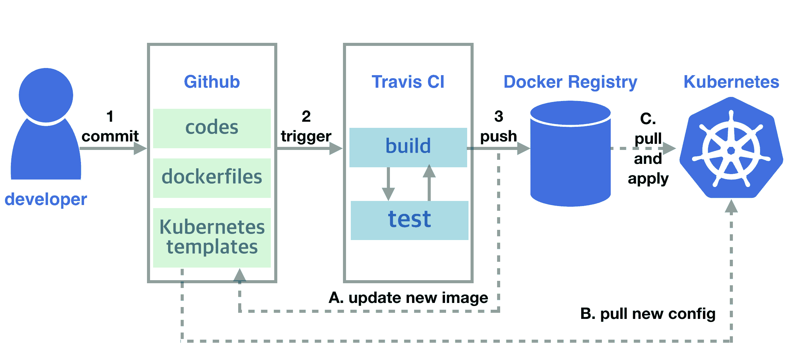

# 持续交付

在本书的开头，我们通过容器化我们的应用程序，使用 Kubernetes 进行编排，持久化数据，并将服务暴露给外界。后来，我们通过设置监控和日志记录来增强对服务的信心，并使它们能够完全自动地进行扩展和缩减。现在，我们希望通过在 Kubernetes 中持续交付最新的功能和改进来推动我们的服务。我们将在本章学习以下内容：

+   更新 Kubernetes 资源

+   设置交付管道

+   如何改进部署过程

# 更新资源

**持续交付**（**CD**），正如我们在第一章《*DevOps 简介*》中所描述的，是一组操作流程，包括**持续集成**（**CI**）和随后的部署任务。CI 流程由版本控制系统、构建、不同级别的验证等元素组成，旨在消除将每个更改集成到主发布线中的工作量。实现这些功能的工具通常位于应用层，可能独立于底层基础设施。尽管如此，谈到部署部分时，理解和处理基础设施仍然是不可避免的。部署任务与我们的应用程序运行平台紧密耦合，无论我们实现的是持续交付还是持续部署。例如，在软件运行在裸机或虚拟机的环境中时，我们会利用配置管理工具、调度器和脚本来部署软件。然而，如果我们将服务运行在像 Heroku 这样的应用平台，甚至是在无服务器模式下，设计部署管道将是完全不同的故事。总的来说，部署任务的目标是确保我们的软件在正确的地方正常运行。在 Kubernetes 中，这意味着知道如何正确更新资源，特别是 Pods。

# 触发更新

在第三章《*Kubernetes 入门*》中，我们讨论了部署中 Pods 的滚动更新机制。让我们回顾一下更新过程触发后的发生情况：

+   部署会根据更新后的清单创建一个新的 `ReplicaSet`，其初始状态为 `0` 个 Pods

+   新的 `ReplicaSet` 会逐渐扩展，而之前的 `ReplicaSet` 会逐渐缩小

+   该过程在所有旧的 Pods 被替换后结束

这一机制由 Kubernetes 自动实现，这意味着我们不需要监督更新过程。触发它所需做的只是通知 Kubernetes 部署的 pod 规格已更新；也就是说，我们修改 Kubernetes 资源的清单。例如，假设我们有一个名为 `my-app` 的部署（可以参见本节示例目录下的 `ex-deployment.yml`），我们可以通过 `kubectl` 的子命令来修改清单，如下所示：

+   `kubectl patch`：这会根据输入的 JSON 参数部分地更新对象的清单。如果我们想将 `my-app` 的镜像从 `alpine:3.7` 更新到 `alpine:3.8`，可以按如下方式操作：

```
$ kubectl patch deployment my-app -p '{"spec":{"template":{"spec":{"containers":[{"name":"app","image":"alpine:3.8"}]}}}}'
```

+   `kubectl set`：此命令修改对象的某些属性。这是直接更改某些属性的快捷方式。`deployment` 的镜像就是它支持的属性之一：

```
$ kubectl set image deployment my-app app=alpine:3.8
```

+   `kubectl edit`：此命令打开编辑器并显示当前的清单，以便我们可以交互式地进行编辑。修改后的清单将在保存后立即生效。要更改此命令的默认编辑器，可以使用 `EDITOR` 环境变量。例如，`EDITOR="`code --wait`" kubectl edit deployments my-app` 会打开 Visual Studio Code。

+   `kubectl replace`：此命令用另一个提交的模板文件替换一个清单。如果资源尚未创建，或者包含无法更改的属性，则会报错。例如，在我们的示例模板 `ex-deployment.yml` 中有两个资源，分别是部署 `my-app` 和其 `Service` `my-app-svc`。我们可以用新的规范文件来替换它们：

```
$ kubectl replace -f ex-deployment.yml
deployment.apps/my-app replaced
The Service "my-app-svc" is invalid: spec.clusterIP: Invalid value: "": field is immutable
$ echo $?
1
```

替换后，我们看到错误代码是 `1`，符合预期，因此我们正在更新的是 `deployment` 而不是 `Service`。这种行为在编写 CI/CD 流程的自动化脚本时尤为重要。

+   `kubectl apply`：此命令会应用清单文件。换句话说，如果资源已存在于 Kubernetes 中，它将被更新；否则，将会创建资源。当 `kubectl apply` 用来创建资源时，它在功能上大致等同于 `kubectl create --save-config`。应用的规格文件会被保存到注释字段 `kubectl.kubernetes.io/last-applied-configuration` 中，我们可以通过子命令 `edit-last-applied`、`set-last-applied` 和 `view-last-applied` 对其进行操作。例如，我们可以通过以下命令查看之前提交的模板：

```
$ kubectl apply -f ex-deployment.yml view-last-applied
```

保存的清单信息将与我们发送的完全相同，区别在于通过 `kubectl get <resource> -o <yaml or json>` 获取的信息包含对象的实时状态，而不仅仅是规格。

虽然在本节中我们仅关注操作部署，但这些命令同样适用于更新其他所有 Kubernetes 资源，如 `service` 和 `role`。

根据 `etcd` 的汇聚速度，`ConfigMap` 和 `secret` 的更改通常需要几秒钟才能传播到 pods。

与 Kubernetes API 服务器交互的推荐方式是使用`kubectl`。如果你处于受限环境中，或者想实现自己的操作控制器，也可以使用 Kubernetes 的 RESTful API 来操作资源。例如，我们之前使用的`kubectl patch`命令如下所示：

```
$ curl -X PATCH -H 'Content-Type: application/strategic-merge-patch+json' --data '{"spec":{"template":{"spec":{"containers":[{"name":"app","image":"alpine:3.8"}]}}}}' 'https://$KUBEAPI/apis/apps/v1/namespaces/default/deployments/my-app'
```

这里，`$KUBEAPI`变量是 API 服务器的端点。更多信息请参见 API 参考资料：[`kubernetes.io/docs/reference/kubernetes-api/`](https://kubernetes.io/docs/reference/kubernetes-api/)。

# 管理滚动更新

一旦触发部署过程，Kubernetes 会在后台默默完成所有任务。让我们进行一些动手实验。再次提醒，即使我们用之前提到的命令修改了某些内容，滚动更新过程也不会被触发，除非相关 Pod 的规格发生变化。我们准备的示例是一个简单的脚本，它会用其主机名和运行的 Alpine 版本响应任何请求。首先，我们创建`deployment`并在另一个终端中检查其响应：

```
$ kubectl apply -f ex-deployment.yml
deployment.apps/my-app created
service/my-app-svc created
$ kubectl proxy &
[1] 48334
Starting to serve on 127.0.0.1:8001
## switch to another terminal, #2
$ while :; do curl http://localhost:8001/api/v1/namespaces/default/services/my-app-svc:80/proxy/; sleep 1; done
my-app-5fbdb69f94-5s44q-v-3.7.1 is running...
my-app-5fbdb69f94-g7k7t-v-3.7.1 is running...
...
```

现在，我们将其镜像更改为另一个版本，并查看响应：

```
## go back to terminal#1
$ kubectl set image deployment.apps my-app app=alpine:3.8
deployment.apps/my-app image updated

## switch to terminal#2
...
my-app-5fbdb69f94-7fz6p-v-3.7.1 is running...
my-app-6965c8f887-mbld5-v-3.8.1 is running......
```

版本 3.7 和 3.8 的消息交替显示，直到更新过程结束。为了立即确定 Kubernetes 中的更新进程状态，而不是轮询服务端点，我们可以使用`kubectl rollout`来管理滚动更新过程，包括检查正在进行的更新进度。让我们使用`status`子命令查看当前的`rollout`状态：

```
## if the previous rollout has finished,
## you can make some changes to my-app again:

$ kubectl rollout status deployment my-app
Waiting for deployment "my-app" rollout to finish: 3 out of 5 new replicas have been updated...
...
Waiting for deployment "my-app" rollout to finish: 3 out of 5 new replicas have been updated...
Waiting for deployment "my-app" rollout to finish: 3 of 5 updated replicas are available...
Waiting for deployment "my-app" rollout to finish: 3 of 5 updated replicas are available...
Waiting for deployment "my-app" rollout to finish: 3 of 5 updated replicas are available...
deployment "my-app" successfully rolled out 
```

此时，`terminal#2`的输出应该来自版本 3.6。`history`子命令允许我们查看之前对`deployment`所做的更改：

```
$ kubectl rollout history deployment.app my-app
deployment.apps/my-app
REVISION  CHANGE-CAUSE
1         <none>
2         <none> 
```

然而，`CHANGE-CAUSE`字段并没有显示出任何有助于我们查看修订详情的有用信息。为了利用滚动更新历史功能，在每个导致更改的命令后添加`--record`标志，如`apply`或`patch`。`kubectl create`也支持`record`标志。

让我们对`deployment`做一些更改，例如修改`my-app`中 Pod 的`DEMO`环境变量。由于这会导致 Pod 规格发生变化，`rollout`将立即启动。这种行为使我们能够在不构建新镜像的情况下触发更新。为了简化，我们使用`patch`来修改变量：

```
$ kubectl patch deployment.apps my-app -p '{"spec":{"template":{"spec":{"containers":[{"name":"app","env":[{"name":"DEMO","value":"1"}]}]}}}}' --record
deployment.apps/my-app patched
$ kubectl rollout history deployment.apps my-app
deployment.apps/my-app
REVISION  CHANGE-CAUSE
1         <none>
2         <none>
3         kubectl patch deployment.apps my-app --patch={"spec":{"template":{"spec":{"containers":[{"name":"app","env":[{"name":"DEMO","value":"1"}]}]}}}} --record=true 
```

`REVISION 3`的`CHANGE-CAUSE`清楚地记录了提交的命令。只有命令会被记录，这意味着任何在`edit`/`apply`/`replace`中的修改不会被明确标记。如果我们想获取之前版本的清单，可以检索已保存的配置，只要我们的更改是通过`apply`完成的。

`CHANGE-CAUSE`字段实际上存储在对象的`kubernetes.io/change-cause`注释中。

出于各种原因，我们有时希望即使`rollout`已经成功到一定程度，也能回滚我们的应用。这可以通过`undo`子命令实现：

```
$ kubectl rollout undo deployment my-app
```

整个过程基本上与更新相同——也就是应用之前的清单——并执行滚动更新。我们还可以使用`--to-revision=<REVISION#>`标志回滚到特定版本，但只有保留的修订版本才能回滚。Kubernetes 根据`deployment`对象中的`revisionHistoryLimit`参数来确定保留多少个修订版本。

更新的进度由`kubectl rollout pause`和`kubectl rollout resume`控制。顾名思义，它们应该成对使用。暂停一个部署不仅仅是停止正在进行的`rollout`，还包括冻结任何更新触发，即使规格被修改，除非被恢复。

# 更新 DaemonSet 和 StatefulSet

Kubernetes 支持多种方式来编排不同类型工作负载的 pods。除了部署外，我们还可以使用`DaemonSet`和`StatefulSet`来处理长期运行和非批量工作负载。由于这些 pods 相对于部署的 pods 有更多的约束，因此我们需要注意一些事项，以便正确处理它们的更新。

# DaemonSet

`DaemonSet`是为系统守护进程设计的控制器，正如其名称所示。因此，`DaemonSet`控制器在每个节点上启动并维护一个 pod；`DaemonSet`控制器启动的 pod 总数等于集群中的节点数。由于这个限制，更新`DaemonSet`不像更新部署那样直接。例如，`deployment`有一个`maxSurge`参数（`.spec.strategy.rollingUpdate.maxSurge`），用于控制更新过程中可以创建的超过期望数量的冗余 pod 数量，但我们不能对`DaemonSet`管理的 pods 使用相同的策略。因为守护进程 pod 通常涉及一些特殊问题，可能会占用主机资源，如端口，如果同一节点上有两个或多个系统 pod 同时存在，可能会导致错误。因此，更新的方式是先在主机上终止旧 pod，再创建新 pod。

Kubernetes 为`DaemonSet`实现了两种更新策略：

+   `OnDelete`：Pods 只有在手动删除后才会更新。

+   `RollingUpdate`：这与`OnDelete`类似，但 pod 的删除由 Kubernetes 自动执行。有一个可选参数`.spec.updateStrategy.rollingUpdate.maxUnavailable`，类似于`deployment`中的参数。默认值为`1`，意味着 Kubernetes 每次替换一个 pod，逐节点进行。

你可以在[`github.com/PacktPublishing/DevOps-with-Kubernetes-Second-Edition/blob/master/chapter9/9-1_updates/ex-daemonset.yml`](https://github.com/PacktPublishing/DevOps-with-Kubernetes-Second-Edition/blob/master/chapter9/9-1_updates/ex-daemonset.yml)找到一个示例，展示了如何编写`DaemonSet`模板。更新策略设置在`.spec.updateStrategy.type`路径下，其默认值是`RollingUpdate`。触发滚动更新的方式与触发部署的方式相同。我们还可以使用`kubectl rollout`来管理`DaemonSet`控制器的滚动更新，但`pause`和`resume`不受支持。

# StatefulSet

`StatefulSet`和`DaemonSet`的更新过程基本相同；它们在更新过程中不会创建冗余的 Pod，且更新策略的行为也类似。你可以在`9-1_updates/ex-statefulset.yml`文件中找到一个用于练习的模板。更新策略的选项设置在`.spec.updateStrategy.type`路径下：

+   `OnDelete`：Pod 只有在被手动删除后才会更新。

+   `RollingUpdate`：像其他控制器的滚动更新一样，Kubernetes 以受控的方式删除和创建 Pod。Kubernetes 知道`StatefulSet`中的顺序很重要，因此它会逆序替换 Pod。假设我们有三个 Pod：`my-ss-0`、`my-ss-1`和`my-ss-2`，更新顺序将从`my-ss-2`开始，直到`my-ss-0`。删除过程不会遵循`StatefulSet`的 Pod 管理策略；即使我们将 Pod 管理策略设置为`Parallel`，更新仍然会按顺序一个一个地执行。

`RollingUpdate`类型的唯一参数是`partition`（`.spec.updateStrategy.rollingUpdate.partition`）。如果指定了该参数，则任何顺序编号小于分区号的 Pod 将保持当前版本，并不会更新。例如，如果我们在具有三个 Pod 的`StatefulSet`中将`partition`设置为`1`，那么在滚动更新后，只有 pod-1 和 pod-2 会被更新。这个参数允许我们在一定程度上控制进度，尤其适用于等待数据同步、执行金丝雀测试或进行分阶段更新等场景。

# 构建交付管道

为容器化应用实现 CD 管道是非常简单的。让我们回顾一下到目前为止学到的关于 Docker 和 Kubernetes 的实践，并将这些实践组织成 CD 管道。假设我们已经完成了代码、Dockerfile 和相应的 Kubernetes 模板。要将这些内容部署到集群中，我们需要按照以下步骤操作：

1.  `docker build`：生成一个可执行且不可变的构件

1.  `docker run`：通过简单的测试验证构建是否有效

1.  `docker tag`：如果构建正常，将其标记为具有有意义的版本

1.  `docker push`：将构建移动到`artifacts`仓库以供分发

1.  `kubectl apply`：将构建部署到目标环境

1.  `kubectl rollout status`：跟踪部署任务的进度

这就是我们所需的一个简单而可行的交付流水线。

在这里，我们使用“持续交付”而不是“持续部署”这个术语，因为之前描述的步骤之间仍然存在一些差距，可以实现为人工控制或完全自动化的部署。这一考虑可能因团队而异。

# 选择工具

我们要实现的步骤非常简单。然而，当把它们作为流水线串联起来时，并没有一个适用于所有场景的通用流水线。它可能因组织形式、团队运行的开发工作流或流水线与现有基础设施中其他系统的交互等因素而有所不同。因此，设定目标并选择工具是我们必须考虑的首要事项。

一般来说，为了让流水线持续发布构建，我们至少需要三类工具：版本控制系统、构建服务器和用于存储容器工件的代码库。在本节中，我们将基于之前章节中介绍的 SaaS 工具设置一个参考 CD 流水线：

+   GitHub ([`github.com`](https://github.com))

+   Travis CI ([`travis-ci.com`](https://travis-ci.com))

+   Docker Hub ([`hub.docker.com`](https://hub.docker.com))

所有这些工具对于开源项目都是免费的。当然，每个工具都有很多替代方案，例如，GitLab 用于版本控制系统（VCS），Jenkins 托管用于 CI，甚至专门的部署工具如 Spinnaker ([`www.spinnaker.io/`](https://www.spinnaker.io/))。除了这些大型构建模块外，我们还可以借助 Helm ([`github.com/kubernetes/helm`](https://github.com/kubernetes/helm))等工具来帮助我们组织模板及其实例化的发布。总而言之，选择最适合您需求的工具由您自己决定。我们将重点讨论这些基础组件如何与 Kubernetes 中的部署进行交互。

# 交付流水线的端到端演练

以下图表展示了我们基于前述三个服务的 CD 流程：



代码集成的工作流程如下：

1.  代码被提交到 GitHub 上的一个代码库。

1.  提交触发 Travis CI 上的构建任务：

    +   一个 Docker 镜像将被构建。

    +   为确保构建质量稳固且准备好进行集成，通常在 CI 服务器上执行不同层次的测试。此外，由于使用 Docker Compose 或 Kubernetes 运行应用程序堆栈比以往任何时候都更加简便，因此在构建任务中运行涉及多个组件的测试也是可行的。

1.  经验证的镜像会被标记上标识符，并推送到 Docker Hub。

至于 Kubernetes 中的部署，这可以像在模板中更新镜像路径，然后将模板应用于生产集群那样简单，也可以像一系列操作，包括流量分配和金丝雀发布那样复杂。在我们的例子中，发布过程从手动发布一个新的 Git SemVer 标签开始，CI 脚本重复与集成部分相同的流程，直到镜像推送步骤。由于 CI 服务器有时无法触及生产环境，我们在集群内放置了一个代理，来观察并应用配置分支中的更改。

专用的配置仓库是一种常见的模式，用于将应用程序及其基础设施分开。有许多**基础设施即代码**（**IaC**）工具帮助我们以可记录在版本控制系统中的方式表达基础设施及其状态。此外，通过在版本控制系统中追踪所有内容，我们可以将对基础设施所做的每个更改转化为 Git 操作。为了简化起见，我们在同一个仓库中使用另一个分支来进行配置更改。

一旦代理检测到更改，它会拉取新的模板并相应地更新对应的控制器。最后，在 Kubernetes 滚动更新过程结束后，交付工作就完成了。

# 解释步骤

我们的例子 `okeydokey` 是一个始终对每个请求回显 `OK` 的 Web 服务，代码和部署文件已提交到 GitHub 上的仓库：[`github.com/DevOps-with-Kubernetes/okeydokey`](https://github.com/DevOps-with-Kubernetes/okeydokey)。

在配置 Travis CI 构建之前，让我们先在 Docker Hub 上创建一个镜像仓库以供后续使用。在登录到 Docker Hub 后，点击右上角的“Create Repository”按钮，然后按照屏幕上的步骤创建一个仓库。`okeydokey` 的镜像仓库地址是 `devopswithkubernetes/okeydokey`（[`hub.docker.com/r/devopswithkubernetes/okeydokey/`](https://hub.docker.com/r/devopswithkubernetes/okeydokey/)）。

将 Travis CI 与 GitHub 仓库连接是非常简单的；我们需要做的就是授权 Travis CI 访问我们的 GitHub 仓库，并在设置页面启用其构建该仓库的功能（[`travis-ci.com/account/repositories`](https://travis-ci.com/account/repositories)）。另一个我们需要的东西是一个 GitHub 访问令牌或具有写权限的部署密钥。这个密钥将被放置在 Travis CI 上，以便 CI 脚本能够将构建好的镜像更新到配置分支。请参考 GitHub 官方文档（[`developer.github.com/v3/guides/managing-deploy-keys/#deploy-keys`](https://developer.github.com/v3/guides/managing-deploy-keys/#deploy-keys)）获取部署密钥。

Travis CI 中作业的定义是在一个文件 `.travis.yml` 中配置的，该文件位于同一个仓库下。这个定义是一个 YAML 格式的模板，包含了一些 Shell 脚本块，指示 Travis CI 在构建过程中应该执行什么操作。

完整的 Travis CI 文档可以在这里找到：[`docs.travis-ci.com/user/tutorial/`](https://docs.travis-ci.com/user/tutorial/)。

你可以在以下网址找到我们 `.travis.yml` 文件块的解释：[`github.com/DevOps-with-Kubernetes/okeydokey/blob/master/.travis.yml`](https://github.com/DevOps-with-Kubernetes/okeydokey/blob/master/.travis.yml)。

# env

本节定义了在整个构建过程中可见的环境变量：

```
DOCKER_REPO=devopswithkubernetes/okeydokey
BUILD_IMAGE_PATH=${DOCKER_REPO}:build-${TRAVIS_COMMIT}
RELEASE_IMAGE_PATH=${DOCKER_REPO}:${TRAVIS_TAG} 
```

在这里，我们设置了一些可能会更改的变量，例如构建的镜像将要存储的 Docker 注册表路径。此外，还有从 Travis CI 传递过来的构建元数据，以环境变量的形式存在，具体文档可参考：[`docs.travis-ci.com/user/environment-variables/#default-environment-variables`](https://docs.travis-ci.com/user/environment-variables/#default-environment-variables)。例如，`TRAVIS_COMMIT` 代表当前提交的哈希值，我们使用它作为标识符来区分不同构建的镜像。

另一个环境变量的来源是手动在 Travis CI 上配置的。由于这些变量在配置后会被隐藏，因此我们把一些敏感数据，如 Docker Hub 和 GitHub 仓库的凭证，存储在这里：


每个 CI 工具都有其处理机密信息的最佳实践。例如，一些 CI 工具还允许我们将变量保存在 CI 服务器中，但这些变量仍然会打印在构建日志中，因此在这种情况下我们不太可能将机密信息存储在这里。

像 Vault（[`www.vaultproject.io/`](https://www.vaultproject.io/)）这样的密钥管理系统，或云服务商提供的类似服务，如 GCP KMS（[`cloud.google.com/kms/`](https://cloud.google.com/kms/)）、AWS KMS（[`aws.amazon.com/kms/`](https://aws.amazon.com/kms/)）和 Azure Key Vault（[`azure.microsoft.com/en-us/services/key-vault/`](https://azure.microsoft.com/en-us/services/key-vault/)）都推荐用于存储敏感凭证。

# script

本节是我们运行构建和测试的地方：

```
docker build -t my-app .
docker run --rm --name app -dp 5000:5000 my-app
sleep 10
CODE=$(curl -IXGET -so /dev/null -w "%{http_code}" localhost:5000)
'[ ${CODE} -eq 200 ] && echo "Image is OK"'
docker stop app 
```

由于我们使用的是 Docker，构建过程只需要一行脚本。我们的测试非常简单，主要是启动一个容器并使用构建的镜像，发出一些请求来确定其完整性。在这一阶段，我们可以完成所有操作，包括添加单元测试或运行自动化集成测试，以改进生成的构建成果。

# after_success

这个块仅在前一个阶段无错误结束时执行。一旦执行了这个块，我们就准备发布我们的镜像了：

```
docker login -u ${CI_ENV_REGISTRY_USER} -p "${CI_ENV_REGISTRY_PASS}"
if [[ ${TRAVIS_TAG} =~ ^v.*$ ]]; then
  docker tag my-app ${RELEASE_IMAGE_PATH}
  docker push ${RELEASE_IMAGE_PATH}
else
  docker tag my-app ${BUILD_IMAGE_PATH}
  docker push ${BUILD_IMAGE_PATH}
fi 
```

我们的镜像标签使用提交的哈希值用于普通构建，并使用手动标记的版本用于发布。没有绝对的镜像标记规则，但强烈不建议将`latest`作为业务服务的标签，因为这可能导致版本混乱，例如运行两个名称相同但不同的镜像。最后的条件块用于在特定分支标签上发布镜像，我们希望将构建和发布保持在不同的轨道上。记得在推送镜像之前进行 Docker Hub 身份验证。

Kubernetes 通过`imagePullPolicy`决定是否拉取镜像，默认值为`IfNotPresent`：

`IfNotPresent`：kubelet 在节点上没有镜像时会拉取镜像。如果镜像标签是`:latest`且策略不是`Never`，那么 kubelet 将回退到`Always`。

`Always`：kubelet 始终拉取镜像。

`Never`：kubelet 永远不会拉取镜像；它会检查目标镜像是否已经存在于节点上。

因为我们将项目部署设置为仅在发布时部署到实际机器上，所以构建可能会在此时停止并被返回。我们来看一下该构建的日志：[`travis-ci.com/DevOps-with-Kubernetes/okeydokey/builds/93296022`](https://travis-ci.com/DevOps-with-Kubernetes/okeydokey/builds/93296022)。日志保留了执行的脚本和在 CI 构建过程中每一行脚本的输出：


正如我们所见，我们的构建已经成功，所以镜像被发布在这里：[`hub.docker.com/r/devopswithkubernetes/okeydokey/tags/`](https://hub.docker.com/r/devopswithkubernetes/okeydokey/tags/)。该构建使用的是`build-842eb66b2fa612598add8e19769af5c56b922532`标签，我们现在可以在 CI 服务器之外运行它：

```
$ docker run --name test -dp 5000:5000 devopswithkubernetes/okeydokey:build-842eb66b2fa612598add8e19769af5c56b922532
3d93d6505e369286c3f072ef4f04e15db2638f280c4615be95bff47379a70388
$ curl localhost:5000
OK
```

# 部署

尽管我们可以实现从端到端的完全自动化流水线，但由于业务原因，我们经常遇到阻碍新构建部署的情况。因此，我们告诉 Travis CI 仅在我们想要发布新版本时才运行部署脚本。

正如我们之前所述，本例中在 Travis CI 上的部署仅仅是将构建好的镜像写回模板以便进行部署。在这里，我们使用脚本提供程序使 Travis CI 运行我们的部署脚本([deployment/update-config.sh](https://github.com/DevOps-with-Kubernetes/okeydokey/blob/master/deployment/update-config.sh))，该脚本执行以下操作：

+   定位配置仓库及其相应分支

+   更新了镜像标签

+   提交更新后的模板

在更新后的镜像标签提交到仓库后，Travis CI 上的任务完成。

流水线的另一端是我们集群内部的代理。它负责以下任务：

+   定期监控我们在 GitHub 上配置的变化

+   拉取并应用更新后的镜像到我们的 pod 控制器

前者非常简单，但对于后者，我们必须授予代理足够的权限，以便它能够操作集群内的资源。我们的示例使用一个服务账户`cd-agent`，位于一个专用的命名空间`cd`下，用于创建和更新我们的部署，相关的 RBAC 配置可以在本书的[chapter9/9-2_service-account-for-ci-tool/cd-agent](https://github.com/PacktPublishing/DevOps-with-Kubernetes-Second-Edition/tree/master/chapter9/9-2_service-account-for-ci-tool/cd-agent)中找到。

在这里，我们授予服务账户跨命名空间读取和修改资源的权限，包括整个集群的秘密。由于安全问题，通常建议将服务账户的权限限制在实际使用的资源上，否则可能成为潜在的漏洞。

该代理本身仅是一个长期运行的脚本，位于[chapter9/9-2_service-account-for-ci-tool/utils/watcher/watcher.sh](https://github.com/PacktPublishing/DevOps-with-Kubernetes-Second-Edition/blob/master/chapter9/9-2_service-account-for-ci-tool/utils/watcher/watcher.sh)。为了执行更新，它使用`apply`和`rollout`：

```
...
apply_to_kube() {
 kubectl apply -f <template_path> -n <namespace>
 kubectl rollout status -f <template_path> -n <namespace> --timeout 5m
}
...
```

在部署应用之前，让我们先部署`agent`及其相关的`config`：

```
$ kubectl apply -f chapter9/9-2_service-account-for-ci-tool/cd-agent
clusterrole.rbac.authorization.k8s.io/cd-role created
clusterrolebinding.rbac.authorization.k8s.io/cd-agent created
namespace/cd created
serviceaccount/cd-agent created
deployment.apps/state-watcher created
```

`state-watcher`部署就是我们的`agent`，它已配置为监控我们的配置仓库中的环境变量：

```
$ cat chapter9/9-2_service-account-for-ci-tool/cd-agent/watcher-okeydokey.yml
...
 env:
 - name: WORK_PATH
 value: /repo
 - name: TEMPLATE_PATH
 value: /repo/deployment
 - name: REMOTE_GIT_REPO
 value: https://github.com/DevOps-with-Kubernetes/okeydokey.git
 - name: WATCH_BRANCH
 value: config
 - name: RELEASE_TARGET_NAMESPACE
 value: default
 - name: RELEASE_TARGET_CONTROLLER_TEMPLATE
 value: deployment.yml
...
```

一切准备就绪。让我们看看整个流程是如何运行的。

我们在 GitHub 上发布了一个带有`v0.0.3`标签的版本（[`github.com/DevOps-with-Kubernetes/okeydokey/releases/tag/v0.0.3`](https://github.com/DevOps-with-Kubernetes/okeydokey/releases/tag/v0.0.3)）：


Travis CI 在新标签触发后开始构建我们的作业：


如果失败了，我们可以查看构建日志，看看哪里出了问题：[`travis-ci.com/DevOps-with-Kubernetes/okeydokey/jobs/162862675`](https://travis-ci.com/DevOps-with-Kubernetes/okeydokey/jobs/162862675)。幸运的是，我们获得了绿色标志，因此构建的镜像将在稍后推送到 Docker Hub：


此时，我们的`agent`也应该注意到`config`的变化并做出相应的处理：

```
$ kubectl logs -f -n cd state-watcher-69bfdd578-8nn9s -f
...
From https://github.com/DevOps-with-Kubernetes/okeydokey
 * branch config -> FETCH_HEAD
 * [new branch] config -> origin/config
Tue Dec 4 23:44:56 UTC 2018: No update detected.
deployment.apps/okeydokey created
service/okeydokey-svc created
Waiting for deployment "okeydokey" rollout to finish: 0 of 2 updated replicas are available...
Waiting for deployment "okeydokey" rollout to finish: 0 of 2 updated replicas are available...
Waiting for deployment "okeydokey" rollout to finish: 1 of 2 updated replicas are available...
deployment "okeydokey" successfully rolled out
...
```

如我们所见，我们的应用已成功部署，应该开始向所有人显示`OK`：

```
$ kubectl proxy &
$ curl localhost:8001/api/v1/namespaces/default/services/okeydokey-svc:80/proxy/
OK
```

我们在本节中构建并演示的流水线是一个经典的 Kubernetes 持续交付流程。然而，随着团队工作方式和文化的不同，为你的团队量身定制一个持续交付流水线可以提高效率。例如，部署的内置更新策略是滚动更新。那些更倾向于使用其他类型部署策略（如蓝绿部署或金丝雀发布）的团队需要调整流水线以满足他们的需求。幸运的是，Kubernetes 非常灵活，我们可以通过组合 `Deployment`、`Service`、`Ingress` 等来实现各种策略。

在本书的上一版中，我们演示了一个类似的流程，但直接从 CI 服务器应用配置。这两种方法各有优缺点。如果你对将集群信息放在 CI 服务器上没有安全顾虑，并且只需要一个非常简单的持续交付流程，那么基于推送的流水线仍然是一个选择。你可以在这里找到导出服务账户令牌的脚本和应用 Kubernetes 配置的另一个脚本：[`github.com/PacktPublishing/DevOps-with-Kubernetes-Second-Edition/tree/master/chapter9/9-2_service-account-for-ci-tool/utils/push-cd`](https://github.com/PacktPublishing/DevOps-with-Kubernetes-Second-Edition/tree/master/chapter9/9-2_service-account-for-ci-tool/utils/push-cd)。

# 深入理解 Pod

尽管 Pod 的生命周期中的出生与死亡不过是瞬息之间，但它们也是服务最脆弱的点。我们希望避免常见的情况，比如将请求路由到一个尚未就绪的 Pod，或是强制切断与终止中的机器的所有连接。因此，即使 Kubernetes 为我们处理了大多数事务，我们仍然应该知道如何正确配置服务，确保每个功能都能完美交付。

# 启动 Pod

默认情况下，Kubernetes 在 Pod 启动后立即将其状态设置为 Running。如果 Pod 后面有服务，端点控制器会立即向 Kubernetes 注册一个端点。之后，`kube-proxy` 会观察端点的变化，并相应地配置主机的 `ipvs` 或 `iptables`。来自外部世界的请求现在会发送到 Pod。这些操作发生得非常迅速，因此很有可能请求在应用程序准备就绪之前就到达了 Pod，特别是对于大型软件。如果 Pod 在运行时失败，我们应立即将其从服务的池中移除，以确保没有请求到达坏的端点。

部署和其他控制器的 `minReadySeconds` 字段不会延迟 Pod 变为就绪，而是延迟 Pod 变为可用。只有当所有 Pod 都可用时，部署才算成功。

# 存活性和就绪性探针

探测是容器健康状况的指示器。它通过定期执行诊断操作来判断容器健康状态，操作由 kubelet 发起。判断容器状态有两种探测方法：

+   **存活** **探测**：这表示容器是否存活。如果容器在此探测失败，kubelet 会杀死它，并根据 Pod 的`restartPolicy`决定是否重启它。

+   **就绪探测**：这表示容器是否已准备好接收流量。如果服务后面的 Pod 没有准备好，其端点不会被创建，直到 Pod 准备好。

`restartPolicy`告诉我们 Kubernetes 如何处理 Pod 的失败或终止情况。它有三种模式：`Always`、`OnFailure` 或 `Never`。默认设置为 `Always`。

可以配置三种操作处理程序来诊断容器：

+   `exec`：此命令会在容器内执行定义的命令。如果退出码为`0`，则视为执行成功。

+   `tcpSocket`：此操作通过 TCP 测试指定端口，如果端口打开，则操作成功。

+   `httpGet`：这会对目标容器的 IP 地址执行`HTTP GET`请求。请求中的头部可以自定义。如果状态码满足`400 > CODE >= 200`，则此探测被认为是健康的。

此外，还有五个参数定义了探测的行为：

+   `initialDelaySeconds`：Kubelet 在首次探测前需要等待的时间。

+   `successThreshold`：只有当容器连续多次探测成功超过此阈值时，才认为容器健康。

+   `failureThreshold`：与之前相同，但定义了失败的条件。

+   `timeoutSeconds`：单次探测操作的时间限制。

+   `periodSeconds`：探测操作之间的时间间隔。

以下代码片段演示了如何使用就绪探测。完整模板可以在[`github.com/PacktPublishing/DevOps-with-Kubernetes-Second-Edition/blob/master/chapter9/9-3_on_pods/probe.yml`](https://github.com/PacktPublishing/DevOps-with-Kubernetes-Second-Edition/blob/master/chapter9/9-3_on_pods/probe.yml)找到：

```
...
     containers:
      - name: main
        image: devopswithkubernetes/okeydokey:v0.0.4
        readinessProbe:
          httpGet:
            path: /
            port: 5000
          periodSeconds: 5
          initialDelaySeconds: 10
          successThreshold: 2
          failureThreshold: 3
          timeoutSeconds: 1
        command:
...
```

在此示例中，我们在主应用程序中做了一些处理，设置应用程序的启动时间约为六秒，并在 20 秒后用另一个返回`HTTP 500`的应用程序替换它。应用程序与就绪探测的交互如下图所示：


上面的时间线表示 Pod 的实际就绪状态，另一个则是 Kubernetes 视角下的就绪状态。第一次探测在 Pod 创建后 10 秒执行，Pod 在连续两次探测成功后被视为就绪。几秒钟后，由于应用程序的终止，Pod 变为不可用，接下来的三次探测失败后，Pod 变为不可就绪。尝试部署前述示例并观察输出：

```
$ kubectl logs -f my-app-6759578c94-kkc5k
1544137145.530593922 - [sys] pod is created.
1544137151.658855438 - [app] starting server.
1544137155.164726019 - [app] GET / HTTP/1.1
1544137160.165020704 - [app] GET / HTTP/1.1
1544137161.129309654 - [app] GET /from-tester
1544137165.141985178 - [app] GET /from-tester
1544137165.165597677 - [app] GET / HTTP/1.1
1544137168.533407211 - [app] stopping server.
1544137170.169371453 - [500] readiness test fail#1
1544137175.180640604 - [500] readiness test fail#2
1544137180.171766986 - [500] readiness test fail#3
...
```

在我们的示例文件中，还有另一个 pod，`tester`，它不断向我们的服务发起请求，并记录日志。`/from-tester`代表来自测试者的请求。从测试者的活动日志中，我们可以看到，当我们的服务变得不可用时，来自`tester`的流量停止了（注意时间点`1544137180`前后两个 pod 的活动）：

```
$ kubectl logs tester
1544137141.107777059 - timed out
1544137147.116839441 - timed out
1544137154.078540367 - timed out
1544137160.094933434 - OK
1544137165.136757412 - OK
1544137169.155453804 -
1544137173.161426446 - HTTP/1.1 500
1544137177.167556193 - HTTP/1.1 500
1544137181.173484008 - timed out
1544137187.189133495 - timed out
1544137193.198797682 - timed out
...
```

由于我们没有在服务中配置存活探针，因此不健康的容器不会自动重启，除非我们手动杀死它。通常，我们会同时使用两个探针来自动化修复过程。

# 自定义就绪门控

就绪探针的测试目标始终是容器，这意味着它不能用来通过外部状态禁用 pod 访问服务。由于服务是通过 pod 的标签来选择 pod 的，我们可以通过操作 pod 标签来在一定程度上控制流量。然而，pod 标签也会被 Kubernetes 内部的其他组件读取，因此构建复杂的标签开关可能会导致意想不到的结果。

pod 就绪门控是一个允许我们根据定义的条件标记 pod 是否准备就绪的功能。定义了 pod 就绪门控后，只有当 pod 的就绪探针通过并且与 pod 关联的所有就绪门控状态为`True`时，pod 才被视为就绪。我们可以通过以下代码片段来定义就绪门控：

```
...
 spec:
 readinessGates:
 - conditionType: <value>
 containers:
 - name: main
...
```

值必须遵循标签键的格式，例如`feature_1`或`myorg.com/fg-2`。

当 pod 启动时，我们定义的条件类型会作为条件填充到 pod 的`.status.conditions[]`路径下，并且我们必须显式地将条件设置为`True`，以标记 pod 为就绪。对于 Kubernetes 1.13，编辑条件的唯一方式是使用`patch` API。我们来看一下在[`github.com/PacktPublishing/DevOps-with-Kubernetes-Second-Edition/blob/master/chapter9/9-3_on_pods/readiness_gates.yml`](https://github.com/PacktPublishing/DevOps-with-Kubernetes-Second-Edition/blob/master/chapter9/9-3_on_pods/readiness_gates.yml)中的示例：

```
$ cat chapter9/9-3_on_pods/readiness_gates.yml | grep readinessGates -C 1
    spec:
      readinessGates:
      - conditionType: "MY-GATE-1"

$ kubectl apply -f chapter9/9-3_on_pods/readiness_gates.yml
deployment.apps/my-2nd-app created
service/my-2nd-app-svc created

$ kubectl get pod -o custom-columns=NAME:.metadata.name,IP:.status.podIP
NAME                          IP
my-2nd-app-78786c6d5d-t4564   172.17.0.2

$ kubectl logs my-2nd-app-78786c6d5d-t4564
1544216932.875020742 - [app] starting server.

$ kubectl describe ep my-2nd-app-svc
Name: my-2nd-app-svc
Namespace: default
Labels: app=my-2nd-app
Annotations: <none>
Subsets:
  Addresses: <none>
  NotReadyAddresses: 172.17.0.2
... 
```

在这里，我们自定义的条件被称为`MY-GATE-1`，而应用程序是我们在本章中一直使用的那个。正如我们所见，即使 pod 已启动，其地址仍列在`NotReadyAddresses`中。这意味着该 pod 没有承接任何流量。我们可以使用`describe`（或`wide`/`json`/`yaml`）命令来验证其状态：

```
$ kubectl describe pod my-2nd-app-78786c6d5d-t4564
...
Readiness Gates:
  Type        Status
  MY-GATE-1   <none>
Conditions:
  Type              Status
  Initialized       True
  Ready             False
  ContainersReady   True
  PodScheduled      True
...
```

pod 中的容器已就绪，但由于就绪门控的原因，pod 本身并没有就绪。要开启它，我们需要向 API 服务器发送一个**JSON Patch**负载，目标路径为`/api/v1/namespaces/<namespace>/pods/<pod_name>/status`：

```
$ kubectl proxy &
$ curl http://localhost:8001/api/v1/namespaces/default/pods/my-2nd-app-78786c6d5d-t4564/status \
-XPATCH -H "Content-Type: application/json-patch+json" -d \
'[{"op":"add","path":"/status/conditions/-","value":{"type":"MY-GATE-1", "status": "True"}}]'
...
  "status": {
    "phase": "Running",
    "conditions": [
...
      {
        "type": "MY-GATE-1",
        "status": "True",
        "lastProbeTime": null,
        "lastTransitionTime": null
      }
...
```

我们将看到一条条目被插入到`.status.conditions`列表中。现在，如果我们检查服务的端点，就可以看到 pod 已经开始提供请求服务：

```
$ kubectl describe ep my-2nd-app-svc
Name: my-2nd-app-svc
Namespace: default
Labels: app=my-2nd-app
Annotations: <none>
Subsets:
 Addresses: 172.17.0.2
...
## also the status of the gates:
$ kubectl describe pod my-2nd-app-78786c6d5d-t4564 | grep -A2 Readiness
Readiness Gates:
  Type        Status
  MY-GATE-1   True 
```

要将 pod 调转过来，我们可以使用 JSON Patch 的`replace`或`remove`操作，将条件状态设置为`False`或`<none>`：

```
## we need the index of our gate, and we use jq to query it here:
$ export RG_NAME="MY-GATE-1"
$ kubectl get pod my-2nd-app-78786c6d5d-t4564 -o json | jq --arg R "$RG_NAME" 'foreach .status.conditions[] as $e (-1; .+1; select($e.type == $R))'
0
$ kubectl proxy &

## fill the queried "0" to the path parameter
$ curl http://localhost:8001/api/v1/namespaces/default/pods/my-2nd-app-78786c6d5d-t4564/status \
-XPATCH -H "Content-Type: application/json-patch+json" -d \
'[{"op":"replace","path":"/status/conditions/0","value":{"type":"MY-GATE-1", "status": "False"}}]'
...
$ kubectl describe ep my-2nd-app-svc | grep -B2 NotReadyAddresses
Subsets:
 Addresses: <none>
 NotReadyAddresses: 172.17.0.2
```

现在 pod 再次变为未就绪状态。通过就绪门控，我们可以很好地区分切换业务功能和管理标签的逻辑。

# init 容器

有时我们需要在应用程序实际运行之前进行初始化，例如为主应用程序准备架构或从其他地方加载数据。由于很难预测初始化可能需要多长时间，我们不能仅仅依赖 `initialDelaySeconds` 来为此准备工作创建缓冲区，因此 `init` 容器在这里非常有用。

`init` 容器是一个或多个在应用容器之前启动并依次运行到完成的容器。如果任何容器失败，它将根据 pod 的 `restartPolicy` 重新启动，直到所有容器退出并返回代码 `0`。定义 `init` 容器与定义常规容器类似：

```
...
spec:
  containers:
  - name: my-app
    image: <my-app>
  initContainers:
  - name: init-my-app
    image: <init-my-app>
...
```

它们仅在以下几个方面有所不同：

+   `init` 容器没有就绪探针，因为它们运行到完成为止。

+   在 `init` 容器中定义的端口不会被 pod 前面的服务捕获。

+   资源请求限制是通过计算 `max(sum(regular containers))` 和 `max(init containers))` 来得出的，这意味着如果其中一个 `init` 容器设置的资源限制高于其他 `init` 容器的限制以及所有常规容器资源限制的总和，Kubernetes 会根据该 `init` 容器的资源限制来调度 pod。

`init` 容器的作用不仅仅是阻塞应用容器。例如，我们可以利用 `init` 容器通过与 `init` 容器和应用容器共享 `emptyDir` 卷来配置一个镜像，而不是构建另一个只对基础镜像执行 `awk` / `sed` 的镜像。此外，它还使我们能够灵活地为初始化任务和主要应用程序使用不同的镜像。

# 终止一个 pod

关闭事件的顺序与启动 pod 时的事件类似。在收到删除请求后，Kubernetes 会向即将被删除的 pod 发送 `SIGTERM`，并且该 pod 的状态变为终止。与此同时，如果该 pod 支持服务，Kubernetes 会移除该 pod 的端点，以停止进一步的请求。偶尔，某些 pod 可能永远不会退出。可能是这些 pod 不遵循 `SIGTERM`，或者只是因为它们的任务尚未完成。在这种情况下，Kubernetes 会在终止期过后发送 `SIGKILL` 强制终止这些 pod。终止期的长度在 pod 规格中的 `.spec.terminationGracePeriodSeconds` 设置。尽管 Kubernetes 仍然有机制回收这些 pod，但我们仍应确保我们的 pod 能够正确关闭。

# 处理 SIGTERM

优雅终止并不是一个新概念；它是编程中的常见做法。强行终止一个正在工作的 pod 就像突然拔掉正在运行的计算机的电源线，这可能会损坏数据。

实现主要包括三个步骤：

1.  注册处理程序来捕获终止信号。

1.  在处理程序中完成所有必要的操作，例如释放资源、将数据写入外部持久化层、释放分布式锁或关闭连接。

1.  执行程序关闭。我们之前的示例展示了这一思路：在 `graceful_exit_handler` 处理程序中，接收到 `SIGTERM` 信号时关闭控制器线程。代码可以在这里找到：[`github.com/DevOps-with-Kubernetes/okeydokey/blob/master/app.py`](https://github.com/DevOps-with-Kubernetes/okeydokey/blob/master/app.py)。

由于 Kubernetes 只能向容器中的 `PID 1` 进程发送信号，所以有一些常见的陷阱可能会导致我们程序中的优雅处理程序失败。

# `SIGTERM` 没有发送到应用程序进程

在第二章，*容器化 DevOps* 中，我们学习了在编写 Dockerfile 时，有两种方式调用程序：Shell 表达式和 exec 表达式。在 Linux 容器中，执行 Shell 表达式命令的 Shell 默认是 `/bin/sh -c`。因此，关于 `SIGTERM` 是否能被我们的应用程序接收，存在一些相关问题：

+   我们的应用程序是如何被调用的？

+   镜像中使用的是哪种 Shell 实现？

+   Shell 实现是如何处理 `-c` 参数的？

我们逐一分析这些问题。以下示例中使用的 Dockerfile 可以在这里找到：[`github.com/PacktPublishing/DevOps-with-Kubernetes-Second-Edition/tree/master/chapter9/9-3_on_pods/graceful_docker`](https://github.com/PacktPublishing/DevOps-with-Kubernetes-Second-Edition/tree/master/chapter9/9-3_on_pods/graceful_docker)。

假设我们在 Dockerfile 中使用的是 Shell 表达式命令，`CMD python -u app.py`，用于执行我们的应用程序。容器的启动命令将是 `/bin/sh -c "python3 -u app.py"`。当容器启动时，容器内进程的结构如下：

```
# the image is from "graceful_docker/Dockerfile.shell-sh"
$ kubectl run --generator=run-pod/v1 \
--image=devopswithkubernetes/ch93:shell-sh my-app
pod/my-app created
$ kubectl exec my-app ps ax
 PID TTY      STAT   TIME COMMAND
 1 ?        Ss     0:00 /bin/sh -c python3 -u app.py
 6 ?        S      0:00 python3 -u app.py
 7 ?        Rs     0:00 ps ax
```

我们可以看到，`PID 1` 进程不是我们的应用程序和处理程序，而是 Shell。当我们尝试终止 Pod 时，`SIGTERM` 会发送到 Shell 而不是我们的应用程序，Pod 会在宽限期结束后被终止。我们可以在删除应用程序时检查日志，看看它是否收到了 `SIGTERM`：

```
$ kubectl delete pod my-app &
pod "my-app" deleted
$ kubectl logs -f my-app
$ 1544368565.736720800 - [app] starting server.
rpc error: code = Unknown desc = Error: No such container: 2f007593553cfb700b0aece1f8b6045b4096b2f50f97a42e684a98e502af29ed
```

我们的应用程序在没有进入代码中的停止处理程序的情况下退出了。正确提升应用程序为 `PID 1` 的方法有几种。例如，我们可以在 Shell 表达式中显式调用 `exec`，如 `CMD exec python3 -u app.py`，这样我们的程序就会继承 `PID 1`。或者，我们可以选择 `exec` 表达式，`CMD [ "python3", "-u", "app.py" ]`，直接执行我们的程序：

```
## shell form with exec
$ kubectl run --generator=run-pod/v1 \
--image=devopswithkubernetes/ch93:shell-exec my-app-shell-exec
pod/my-app-shell-exec created
$ kubectl exec my-app-exec ps ax
 PID TTY      STAT   TIME COMMAND
 1 ?        Ss     0:00 python3 -u app.py
 5 ?        Rs     0:00 ps ax
## delete the pod in another terminal
$ kubectl logs -f my-app-shell-exec
1544368913.313778162 - [app] starting server.
1544369448.991261721 - [app] stopping server.
rpc error: code = Unknown desc =...

## exec form
$ kubectl run --generator=run-pod/v1 \
--image=devopswithkubernetes/ch93:exec-sh my-app-exec
pod/my-app-exec created
 PID TTY      STAT   TIME COMMAND
 1 ?        Ss     0:00 python3 -u app.py
 5 ?        Rs     0:00 ps ax
$ kubectl logs -f my-app-exec
1544368942.935727358 - [app] starting server.
1544369503.846865654 - [app] stopping server.
rpc error: code = Unknown desc =...
```

无论以哪种方式执行，程序现在都可以正确地接收`SIGTERM`信号。此外，如果我们需要通过 shell 脚本为程序设置环境，我们应该在脚本中捕获信号并将其传播给程序，或者使用 exec 调用来启动程序，以便应用程序中的信号处理器能够按预期工作。

第二个和第三个问题是关于 shell 的影响：它如何影响我们优雅的处理程序？同样，Linux 中 Docker 容器的默认命令是`/bin/sh -c`。由于`sh`在流行的 Docker 镜像中有所不同，因此它处理`-c`的方式也可能影响信号，特别是在使用 shell 形式时。例如，Alpine Linux 将`ash`链接到`/bin/sh`，而 Debian 系列的发行版使用`dash`。在 Alpine 3.8 之前（或 BusyBox 1.28.0），`ash`在使用`sh -c`时会派生出一个新进程，而在 3.8 版本中，它使用`exec`。我们可以通过`ps`观察到这一差异，在 3.7 版本中，它会获得`PID 6`，而在 3.8 版本中则为`PID 1`：

```
$ docker run alpine:3.7 /bin/sh -c "ps ax"
PID   USER     TIME   COMMAND
 1 root       0:00 /bin/sh -c ps ax
 6 root       0:00 ps ax
$ docker run alpine:3.8 /bin/sh -c "ps ax"
PID   USER     TIME  COMMAND
 1 root      0:00 ps ax
```

`dash`和`bash`如何处理这些情况？让我们来看看：

```
## there is no ps inside the official debian image, Here we reuse the one from above, which is also based on the debian:
$ docker run devopswithkubernetes/ch93:exec-sh /bin/sh -c "ps ax"
 PID TTY      STAT   TIME COMMAND
 1 ?        Ss     0:00 /bin/sh -c ps ax
 6 ?        R      0:00 ps ax
$ docker run devopswithkubernetes/ch93:exec-sh /bin/bash -c "ps ax"
 PID TTY      STAT   TIME COMMAND
 1 ?        Rs     0:00 ps ax
```

正如我们所见，它们的结果也不同。我们的应用程序现在可以正确地响应终止事件。然而，还有一件事，如果我们的应用程序以`PID 1`运行，并且在容器内使用多个进程，这可能会对系统造成潜在的危害。

在 Linux 系统中，如果子进程的父进程没有等待其执行，子进程将变成僵尸进程。如果父进程在子进程结束之前死亡，那么`init`进程应该收养这些孤儿进程，并清理变成僵尸的进程。系统程序知道如何处理孤儿进程，因此僵尸进程通常不会成为问题。然而，在容器化的环境中，持有`PID 1`的进程是我们的应用程序，操作系统期望我们的应用程序去清理僵尸进程。由于我们的应用程序并没有被设计成一个合适的`init`进程，因此处理子进程的状态是不现实的。如果我们忽略这一点，最糟糕的情况是节点的进程表会被僵尸进程填满，我们将无法在节点上启动新的程序。在 Kubernetes 中，如果包含僵尸进程的 Pod 被销毁，那么 Pod 内部的所有僵尸进程将会被清理。另一个可能的场景是，如果我们的应用程序通过脚本频繁在后台执行某些任务，这可能会派生出大量的进程。让我们考虑以下这个简单的例子：

```
$ kubectl run --generator=run-pod/v1 \
--image=devopswithkubernetes/ch93:exec-sh my-app-exec pod/my-app-exec created ## let's enter our app pod and run sleep in background inside it $ kubectl exec -it my-app-exec /bin/sh
# ps axf
  PID TTY      STAT   TIME COMMAND
    5 pts/0    Ss     0:00 /bin/sh
   10 pts/0    R+     0:00  \_ ps axf
    1 ?        Ss     0:00 python3 -u app.py
# sleep 30 &
# ps axf
  PID TTY      STAT   TIME COMMAND
    5 pts/0    Ss     0:00 /bin/sh
   11 pts/0    S      0:00  \_ sleep 30
   12 pts/0    R+     0:00  \_ ps axf
    1 ?        Ss     0:00 python3 -u app.py

## now quit kubectl exec, wait 30 seconds, and check the pod again
$ kubectl exec my-app-exec ps axf
  PID TTY      STAT   TIME COMMAND
   23 ?        Rs     0:00 ps axf
    1 ?        Ss     0:00 python3 -u app.py
   11 ?        Z      0:00 [sleep] <defunct> 
```

`sleep 30`现在是我们 Pod 中的一个僵尸进程。在第二章《与容器的 DevOps》中，我们提到过`docker run --init`参数可以为我们的容器设置一个简单的`init`进程。在 Kubernetes 中，我们可以通过在 Pod 的规格中指定`.spec.shareProcessNamespace`，使`pause`容器（一个特殊容器，默默地为我们处理这些事务）出现在 Pod 中：

```
$ kubectl apply -f chapter9/9-3_on_pods/sharepidns.yml
pod/my-app-with-pause created
$ kubectl exec my-app-with-pause ps ax
 1 ?        Ss     0:00 /pause
 6 ?        Ss     0:00 python3 -u app.py
 10 ?        Rs     0:00 ps ax
```

`pause`进程确保丧尸进程被清理，`SIGTERM`会发送到我们的应用程序进程。请注意，通过启用进程命名空间共享，除了我们的应用程序不再具有`PID 1`，还有两个关键的区别：

+   同一 pod 中的所有容器共享进程信息，这意味着一个容器可以向另一个容器发送信号。

+   容器的文件系统可以通过`/proc/$PID/root`路径进行访问。

如果在`init`进程仍然需要的情况下，所描述的行为不适合你的应用程序，你可以选择 Tini（[`github.com/krallin/tini`](https://github.com/krallin/tini)），或者 dump-init（[`github.com/Yelp/dumb-init`](https://github.com/Yelp/dumb-init)），甚至编写一个包装脚本来解决丧尸进程清理问题。

# `SIGTERM`不会触发终止处理程序。

在某些情况下，进程的终止处理程序不会被`SIGTERM`触发。例如，向`nginx`发送`SIGTERM`实际上会导致快速关闭。要优雅地关闭`nginx`控制器，我们必须通过`nginx -s quit`发送`SIGQUIT`。

`nginx`信号支持的完整操作列表请查看此处：[`nginx.org/en/docs/control.html`](http://nginx.org/en/docs/control.html)。

现在，出现了另一个问题：在删除 pod 时，如何向容器发送除了`SIGTERM`以外的信号？我们可以修改程序的行为来捕获`SIGTERM`，但对于像`nginx`这样的流行工具，我们无法做出任何处理。对于这种情况，我们可以使用生命周期钩子。

# 容器生命周期钩子

生命周期钩子是某些事件触发的操作，并在容器上执行。它们的工作方式类似于单一的 Kubernetes 探针操作，但在容器生命周期中的每个事件至少会触发一次。目前，支持两个事件：

+   `PostStart`：在容器创建后执行。由于这个钩子和容器的入口点是异步触发的，所以无法保证钩子会在容器启动之前执行。因此，我们不太可能使用它来初始化容器的资源。

+   `PreStop`：在发送`SIGTERM`到容器之前执行。与`PostStart`钩子的一个区别是，`PreStop`钩子是同步调用；换句话说，只有在`PreStop`钩子执行完毕后，`SIGTERM`才会被发送。

我们可以通过`PreStop`钩子轻松解决`nginx`的关闭问题：

```
...
     containers:
     - name: main
       image: nginx
       life cycle:
        preStop:
         exec:
          command: [ "nginx", "-s", "quit" ]
... 
```

钩子的一个重要特性是它们可以以某种方式影响 pod 的状态：只有当`PostStart`钩子成功退出时，pod 才会运行；pod 在删除时会立即终止，但只有在`PreStop`钩子成功退出后，`SIGTERM`才会被发送。因此，我们可以通过`PreStop`钩子解决 pod 在其代理规则在节点上被移除之前退出的问题。

下图展示了如何使用钩子来消除不必要的间隙：


其实现方式只是添加一个挂钩，让它休眠几秒钟：

```
...
     containers:
     - name: main
       image: my-app
       life cycle:
        preStop:
         exec:
           command: [ "/bin/sh", "-c", "sleep 5" ]
...
```

# 处理 Pod 中断

理想情况下，我们希望尽可能保持服务的可用性。然而，总是有许多事件导致支持我们服务的 Pod 出现上下波动，无论是自愿的还是非自愿的。自愿中断包括`Deployment`的推出、计划中的节点维护，或者通过 API 意外终止 Pod。总体而言，任何经过 Kubernetes 主控的操作都会算作一个事件。另一方面，任何导致服务终止的意外停机都属于**非自愿中断**的范畴。

在前面的章节中，我们讨论了如何通过使用`Deployment`和`StatefulSet`复制 Pod，适当配置资源请求和限制，通过自动扩展器调整应用程序的容量，并使用亲和性和反亲和性将 Pod 分布到多个位置，从而防止**非自愿的中断**。既然我们已经在服务上付出了很多努力，那在面对这些预期中的**自愿中断**时，可能会出现什么问题呢？事实上，由于这些事件很可能发生，我们应该更加关注它们。

在`Deployment`和其他类似对象中，我们可以使用`maxUnavailable`和`maxSurge`字段，这些字段帮助我们以受控的方式推出更新。至于其他情况，比如由集群管理员执行的节点维护任务，这些管理员并不了解集群中运行的所有应用程序，服务所有者可以利用`PodDisruptionBudget`来告知 Kubernetes，服务需要多少 Pod 才能达到服务水平。

一个 Pod 中断预算的语法如下：

```
apiVersion: policy/v1beta1
kind: PodDisruptionBudget
metadata:
 name: <pdb name>
spec:
 maxUnavailable: <desired number or percentage of pods>
 minAvailable: <desired number or percentage of pods>
 selector:
 <matchLabels> or <matchExpressions>
```

Pod 中断预算中有两个可配置的字段，但它们不能一起使用。选择器与`Deployment`或其他地方的选择器相同。需要注意的是，Pod 中断预算是不可变的，这意味着它在创建后无法更新。`minAvailable`和`maxUnavailable`字段是互斥的，但在某些方面它们是相同的。例如，`maxUnavailable:0`意味着对任何 Pod 丢失的零容忍，基本上等同于`minAvailable:100%`，即所有 Pod 必须保持可用。

Pod 中断预算通过驱逐事件来工作，如节点排空或 Pod 优先级抢占。它们不会干扰由控制器如`Deployment`或`StatefulSet`执行的滚动更新过程。假设我们想用`kubectl drain`暂时从集群中移除一个节点，但这会违反某些正在运行的应用程序的 Pod 中断预算。在这种情况下，除非所有的 Pod 中断预算都能得到满足，否则排空操作会被阻止。然而，如果 Kubernetes 调度器将驱逐一个受害 Pod 以满足高优先级的 Pods，调度器只会在可能的情况下尝试满足所有的 Pod 中断预算。如果调度器找不到不违反任何 Pod 中断预算的目标，它仍然会选择优先级最低的 Pod。

# 概述

在本章中，我们讨论了与构建持续交付流水线相关的主题，以及如何加强我们的部署任务。Pod 的滚动更新是一个强大的工具，它使我们能够以受控的方式进行更新。为了触发滚动更新，我们需要做的就是在支持该滚动更新的控制器中更改 Pod 的规格。此外，尽管更新由 Kubernetes 管理，我们仍然可以通过`kubectl rollout`在一定程度上控制它。

随后，我们构建了一个可扩展的持续交付流水线，使用了`GitHub`/`DockerHub`/`Travis-CI`。然后，我们继续学习了更多关于 Pod 生命周期的内容，以防止可能的失败，包括使用就绪探针和存活探针来保护 Pod；用`init`容器初始化 Pod；通过选择合适的入口程序命令和运行它的 Shell 组合来正确处理`SIGTERM`；使用生命周期钩子来延迟 Pod 的就绪状态，以及其终止，以便 Pod 在正确的时间从服务中移除；以及分配 Pod 中断预算以确保 Pod 的可用性。

在第十章，*Kubernetes on AWS*，我们将继续学习如何在 AWS（所有公共云提供商中的重要角色）上部署集群的基本要点。
