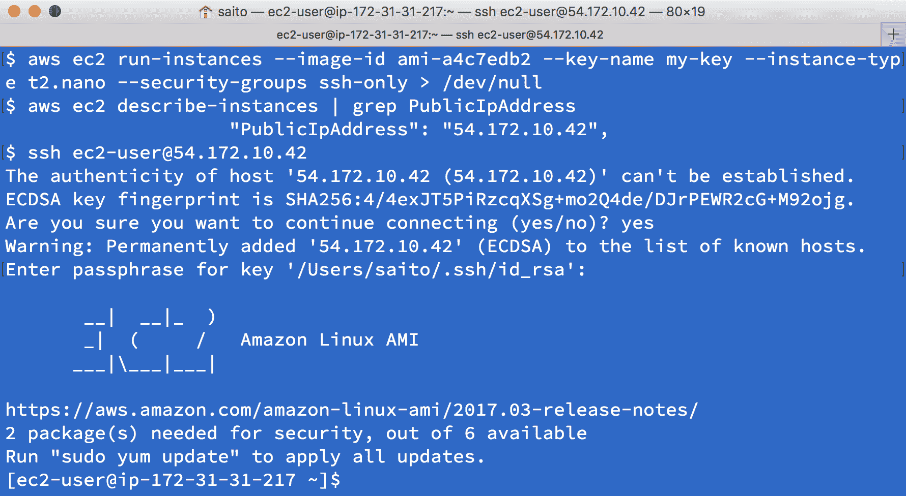
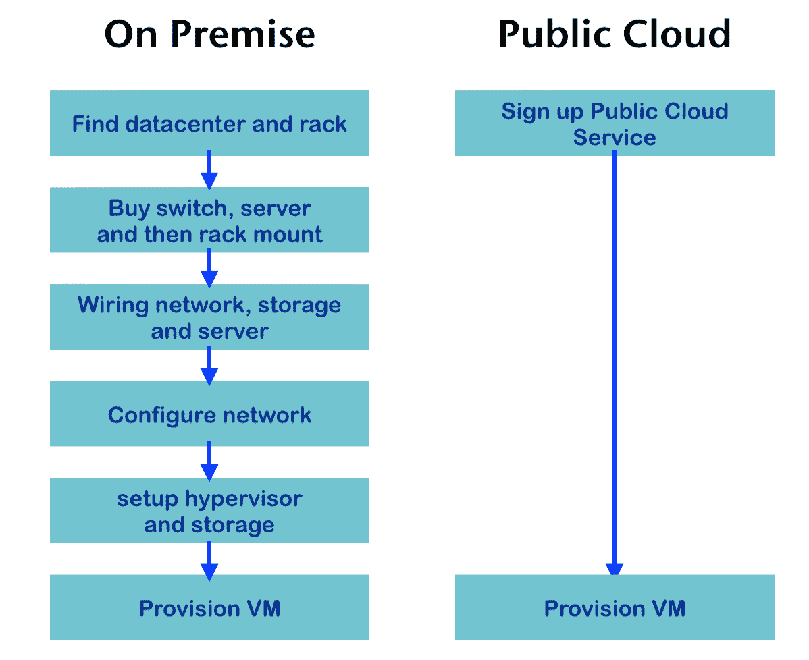
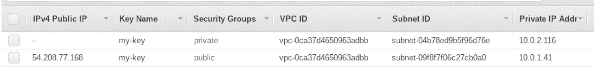
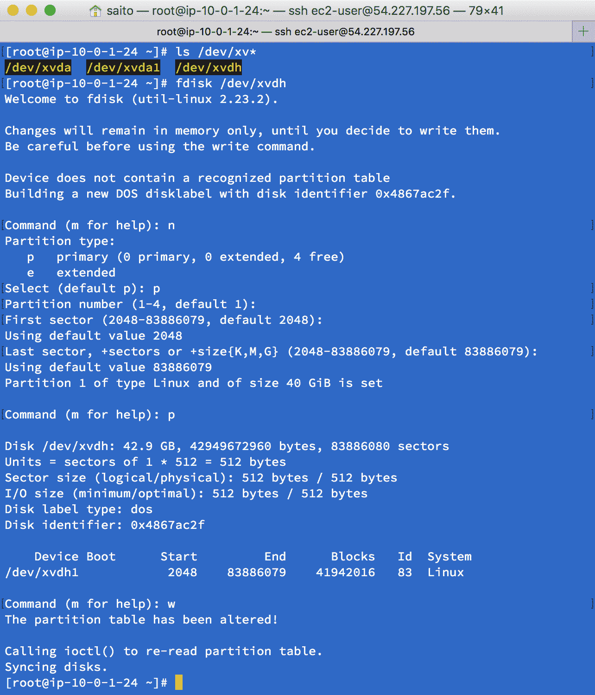
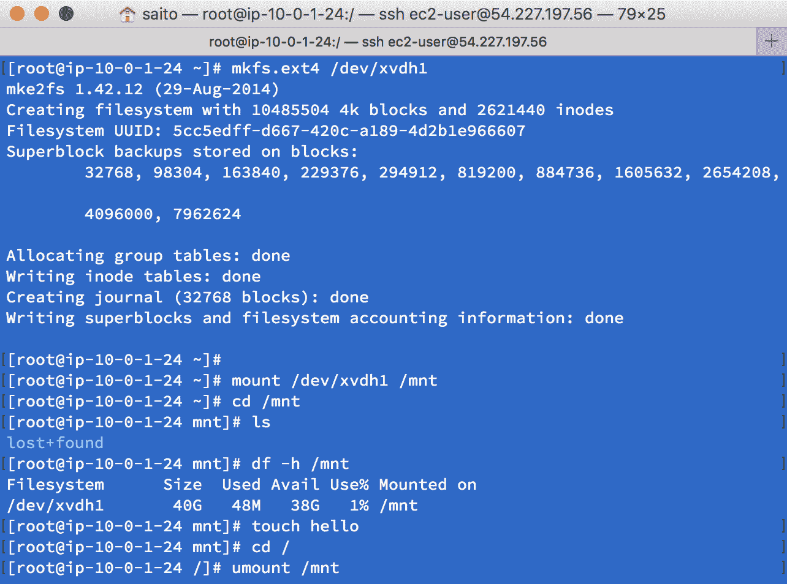
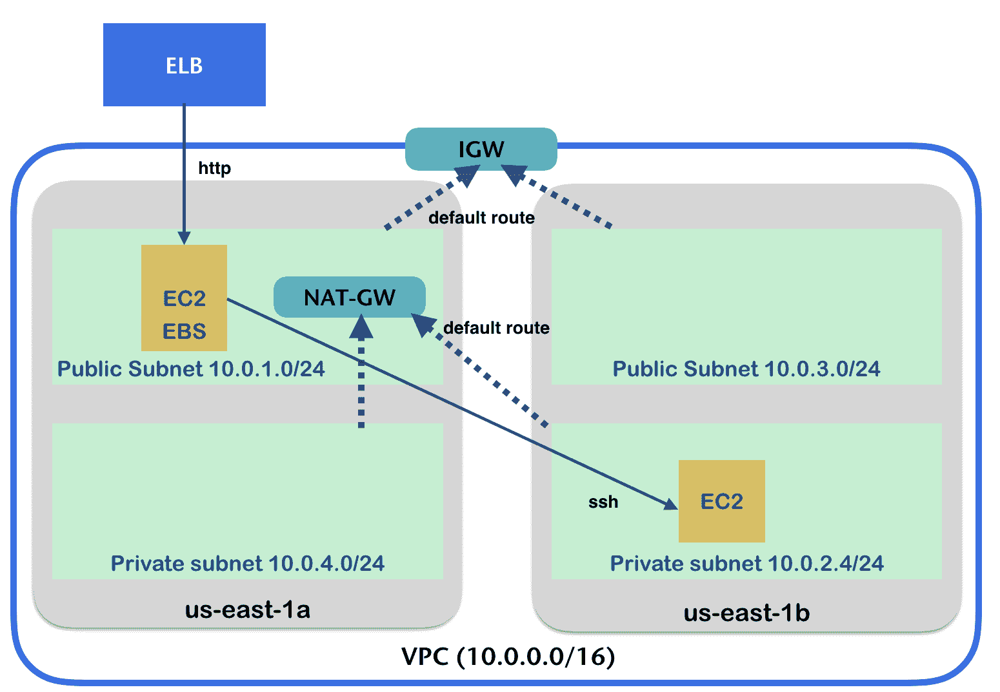
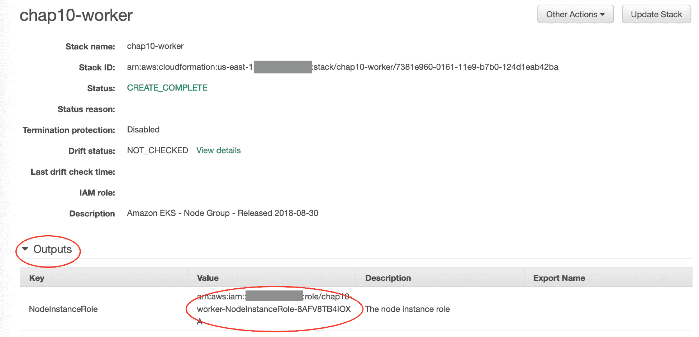
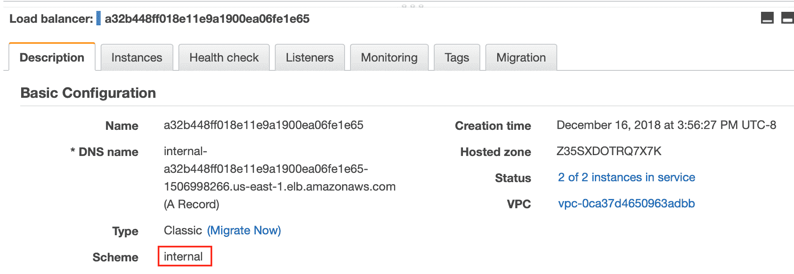
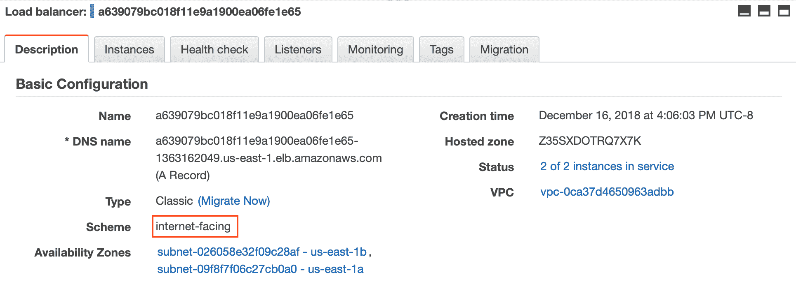
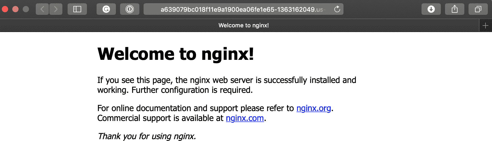

# AWS 上的 Kubernetes

在公共云上使用 Kubernetes 对你的应用来说是灵活且可扩展的。AWS 是公共云行业中最受欢迎的服务之一。在本章中，你将学习什么是 AWS 以及如何在 AWS 上设置 Kubernetes，内容包括以下主题：

+   理解公共云

+   使用和理解 AWS 组件

+   使用 Amazon EKS 在 AWS 上设置 Kubernetes 集群

+   使用 EKS 管理 Kubernetes

# AWS 简介

当你在公共网络上运行应用时，你需要基础设施，例如网络、虚拟机（VM）和存储。显然，公司会借用或自建数据中心来准备这些基础设施，然后聘请数据中心工程师和操作员来监控和管理这些资源。

然而，购买和维护这些资产需要巨大的资本支出，以及数据中心工程师/操作员的运营开销。你还需要一定的时间来完全搭建这些基础设施，例如购买服务器、安装到数据中心机架、布设网络电缆，然后进行操作系统的初步配置/安装等。

因此，迅速分配具有适当资源容量的基础设施是决定企业成功的关键因素之一。

为了使基础设施管理更加简便和高效，技术能够为数据中心提供很多帮助，例如虚拟化、**软件定义网络**（**SDN**）和**存储区域网络**（**SAN**）。但是，将这些技术结合起来会出现一些敏感的兼容性问题，且难以稳定，因此需要聘请行业专家，这最终会增加运营成本。

# 公共云

有一些公司已经提供了在线基础设施服务。AWS 是提供在线基础设施的知名服务，称为云或**公共云**。早在 2006 年，AWS 正式推出了虚拟机服务，称为**弹性计算云**（**EC2**）；在线对象存储服务，称为**简单存储服务**（**S3**）；以及在线消息队列服务，称为**简单队列服务**（**SQS**）。

这些服务足够简单，但从数据中心管理的角度来看，它们减轻了基础设施预分配的压力并缩短了读取时间，因为采用了按需计费模式（按小时或按年向 AWS 付费）。因此，AWS 越来越受欢迎，许多公司已经从自建数据中心转向了公共云。

与公共云相对的，你自己的数据中心被称为**本地部署**。

# API 和基础设施即代码

使用公共云而非本地数据中心的一个独特优势是，公共云提供了控制基础设施的 API。AWS 提供命令行工具（**AWS CLI**）来控制 AWS 基础设施。例如，在注册 AWS 后（[`aws.amazon.com/free/`](https://aws.amazon.com/free/)），安装 AWS CLI（[`docs.aws.amazon.com/cli/latest/userguide/installing.html`](http://docs.aws.amazon.com/cli/latest/userguide/installing.html)）；然后，如果你想启动一个虚拟机（EC2 实例），可以使用 AWS CLI，如下所示：



如你所见，注册 AWS 后，只需几分钟即可访问你的虚拟机。另一方面，如果你从头开始建立自己的本地数据中心会怎样呢？以下图表展示了使用本地数据中心和使用公共云的对比：



如你所见，公共云非常简单快捷；这就是它灵活且方便的原因，不仅适合新兴使用，也适合长期使用。

# AWS 组件

AWS 有一些组件用于配置网络和存储。这些对于理解公共云的工作原理以及如何配置 Kubernetes 非常重要。

# VPC 和子网

在 AWS 上，首先你需要创建自己的网络。这被称为**虚拟私有云**（**VPC**），它使用 SDN 技术。AWS 允许你在 AWS 上创建一个或多个 VPC。每个 VPC 可以根据需要互相连接。当你创建 VPC 时，只需定义一个网络 CIDR 块和 AWS 区域，例如，`10.0.0.0/16` CIDR 在`us-east-1`上。无论你是否可以访问公共网络，你都可以定义任何网络地址范围（从`/16`到`/28`的子网掩码范围）。VPC 创建非常快速；一旦创建完成 VPC，你需要在 VPC 内创建一个或多个子网。

在下面的示例中，通过 AWS 命令行创建一个 VPC：

```
//specify CIDR block as 10.0.0.0/16
//the result, it returns VPC ID as "vpc-0ca37d4650963adbb"
$ aws ec2 create-vpc --cidr-block 10.0.0.0/16
{
 "Vpc": {
 "CidrBlock": "10.0.0.0/16",
 "DhcpOptionsId": "dopt-3d901958",
 "State": "pending",
 "VpcId": "vpc-0ca37d4650963adbb",
...
```

子网是一个逻辑网络块。它必须属于一个 VPC 以及一个可用区，例如，`vpc-0ca37d4650963adbb` VPC 和 `us-east-1b`。然后，网络 CIDR 必须在 VPC 的 CIDR 范围内。例如，如果 VPC 的 CIDR 是`10.0.0.0/16`（`10.0.0.0`–`10.0.255.255`），那么一个子网的 CIDR 可以是`10.0.1.0/24`（`10.0.1.0`–`10.0.1.255`）。

在下面的示例中，我们将在`us-east-1a`可用区创建两个子网，并在`us-east-1b`可用区创建另外两个子网。因此，按照以下步骤，总共会在`vpc-0ca37d4650963adbb`中创建四个子网：

1.  在`us-east-1a`可用区创建第一个子网，`10.0.1.0/24`：

```
$ aws ec2 create-subnet --vpc-id vpc-0ca37d4650963adbb --cidr-block 10.0.1.0/24 --availability-zone us-east-1a
{
 "Subnet": {
 "AvailabilityZone": "us-east-1a",
 "AvailabilityZoneId": "use1-az6",
 "AvailableIpAddressCount": 251,
 "CidrBlock": "10.0.1.0/24",
 "DefaultForAz": false,
 "MapPublicIpOnLaunch": false,
 "State": "pending",
 "SubnetId": "subnet-09f8f7f06c27cb0a0",
 "VpcId": "vpc-0ca37d4650963adbb",
...
```

1.  在`us-east-1b`可用区创建第二个子网，`10.0.2.0/24`：

```
$ aws ec2 create-subnet --vpc-id vpc-0ca37d4650963adbb --cidr-block 10.0.2.0/24 --availability-zone us-east-1b
{
 "Subnet": {
 "AvailabilityZone": "us-east-1b",
 "AvailabilityZoneId": "use1-az1",
 "AvailableIpAddressCount": 251,
 "CidrBlock": "10.0.2.0/24",
 "DefaultForAz": false,
 "MapPublicIpOnLaunch": false,
 "State": "pending",
 "SubnetId": "subnet-04b78ed9b5f96d76e",
 "VpcId": "vpc-0ca37d4650963adbb",
...
```

1.  在`us-east-1b`上再次创建第三个子网，`10.0."3".0/24`：

```
$ aws ec2 create-subnet --vpc-id vpc-0ca37d4650963adbb --cidr-block 10.0.3.0/24 --availability-zone us-east-1b
{
 "Subnet": {
 "AvailabilityZone": "us-east-1b",
 "AvailabilityZoneId": "use1-az1",
 "AvailableIpAddressCount": 251,
 "CidrBlock": "10.0.3.0/24",
 "DefaultForAz": false,
 "MapPublicIpOnLaunch": false,
 "State": "pending",
 "SubnetId": "subnet-026058e32f09c28af",
 "VpcId": "vpc-0ca37d4650963adbb",
... 
```

1.  在`us-east-1a`上再次创建第四个子网，`10.0.4.0/24`：

```
$ aws ec2 create-subnet --vpc-id vpc-0ca37d4650963adbb --cidr-block 10.0.4.0/24 --availability-zone us-east-1a
{
    "Subnet": {
        "AvailabilityZone": "us-east-1a",
        "AvailabilityZoneId": "use1-az6",
        "AvailableIpAddressCount": 251,
        "CidrBlock": "10.0.4.0/24",
        "DefaultForAz": false,
        "MapPublicIpOnLaunch": false,
        "State": "pending",
        "SubnetId": "subnet-08e16157c15cefcbc",
        "VpcId": "vpc-0ca37d4650963adbb",
...
```

让我们将前两个子网设置为公共子网，将最后两个子网设置为私有子网。这意味着公共子网可以从互联网访问，因此它将具有公共 IP 地址。另一方面，私有子网没有互联网访问能力。为此，你需要设置网关和路由表。

# 互联网网关和 NAT-GW

在大多数情况下，你的 VPC 需要与公共互联网连接。在这种情况下，你需要创建一个 **互联网网关** (**IGW**) 并将其附加到你的 VPC。

在以下示例中，创建了一个 IGW 并将其附加到 `vpc-0ca37d4650963adbb`：

```
//create IGW, it returns IGW id as igw-01769bff334dcc035
$ aws ec2 create-internet-gateway
{
    "InternetGateway": {
        "Attachments": [],
        "InternetGatewayId": "igw-01769bff334dcc035",
        "Tags": []
    }
} 
 //attach igw-01769bff334dcc035 to vpc-0ca37d4650963adbb
$ aws ec2 attach-internet-gateway --vpc-id vpc-0ca37d4650963adbb --internet-gateway-id igw-01769bff334dcc035
```

一旦 IGW 被附加，设置指向 IGW 的路由表（默认网关）为子网。如果默认网关指向 IGW，则该子网能够拥有公共 IP 地址并能够访问互联网。因此，如果默认网关不指向 IGW，则该子网被视为私有子网，意味着没有公共访问。

在以下示例中，创建了一个路由表，指向 IGW，并设置为公共子网：

```
//create route table within vpc-0ca37d4650963adbb
//it returns route table id as rtb-0f45fc46edec61d8f
$ aws ec2 create-route-table --vpc-id vpc-0ca37d4650963adbb
{
 "RouteTable": {
 "Associations": [],
 "PropagatingVgws": [],
 "RouteTableId": "rtb-0f45fc46edec61d8f",
...

//then set default route (0.0.0.0/0) as igw-01769bff334dcc035
$ aws ec2 create-route --route-table-id rtb-0f45fc46edec61d8f --gateway-id igw-01769bff334dcc035 --destination-cidr-block 0.0.0.0/0 
//finally, update public 2 subnets to use this route table
$ aws ec2 associate-route-table --route-table-id rtb-0f45fc46edec61d8f --subnet-id subnet-09f8f7f06c27cb0a0

$ aws ec2 associate-route-table --route-table-id rtb-0f45fc46edec61d8f --subnet-id subnet-026058e32f09c28af 
 //public subnet can assign public IP when launch EC2
$ aws ec2 modify-subnet-attribute --subnet-id subnet-09f8f7f06c27cb0a0 --map-public-ip-on-launch

$ aws ec2 modify-subnet-attribute --subnet-id subnet-026058e32f09c28af --map-public-ip-on-launch 
```

另一方面，私有子网不需要公共 IP 地址。然而，私有子网有时需要访问互联网，例如，下载一些软件包和访问 AWS 服务。在这种情况下，我们仍然可以选择连接到互联网。这被称为 **网络地址转换网关** (**NAT-GW**)。

NAT-GW 允许私有子网通过 NAT-GW 访问公共互联网。因此，NAT-GW 必须位于公共子网，并且私有子网的路由表会将 NAT-GW 作为默认网关。请注意，为了能够访问公共网络上的 NAT-GW，它需要附加一个 **弹性 IP** (**EIP**) 到 NAT-GW。

在以下示例中，创建了一个 NAT-GW：

```
//allocate EIP, it returns allocation id as eipalloc-044f4dbafe870a04a
$ aws ec2 allocate-address
{
    "PublicIp": "54.161.228.168",
    "AllocationId": "eipalloc-044f4dbafe870a04a",
    "PublicIpv4Pool": "amazon",
    "Domain": "vpc"
}
 //create NAT-GW on public subnet (subnet-09f8f7f06c27cb0a0)
//also assign EIP eipalloc-044f4dbafe870a04a
$ aws ec2 create-nat-gateway --subnet-id subnet-09f8f7f06c27cb0a0 --allocation-id eipalloc-044f4dbafe870a04a
{
    "NatGateway": {
        "CreateTime": "2018-12-09T20:17:33.000Z",
        "NatGatewayAddresses": [
            {
                "AllocationId": "eipalloc-044f4dbafe870a04a"
            }
        ],
        "NatGatewayId": "nat-05e34091f53f10172",
        "State": "pending",
        "SubnetId": "subnet-09f8f7f06c27cb0a0",
        "VpcId": "vpc-0ca37d4650963adbb"
    }
} 
```

与 IGW 不同，你可以在单个 **可用区** (**AZ**) 部署 NAT-GW。如果你需要高可用性的 NAT-GW，你需要在每个可用区部署 NAT-GW。然而，AWS 会额外收取弹性 IP 和 NAT-GW 的每小时费用。因此，如果你想节省成本，可以像前面的示例一样在单个可用区部署单个 NAT-GW。

创建 NAT-GW 只需几分钟。创建完成后，更新指向 NAT-GW 的私有子网路由表，然后任何 EC2 实例就可以访问互联网；然而，由于私有子网没有公共 IP 地址，因此没有机会从公共互联网访问私有子网的 EC2 实例。

在以下示例中，更新了指向 NAT-GW 的私有子网路由表作为默认网关：

```
//as same as public route, need to create a route table first
$ aws ec2 create-route-table --vpc-id vpc-0ca37d4650963adbb
{
    "RouteTable": {
        "Associations": [],
        "PropagatingVgws": [],
        "RouteTableId": "rtb-08572c332e7e4f14e",
... 
 //then assign default gateway as NAT-GW
$ aws ec2 create-route --route-table-id rtb-08572c332e7e4f14e --nat-gateway-id nat-05e34091f53f10172 --destination-cidr-block 0.0.0.0/0

   //finally update private subnet routing table
$ aws ec2 associate-route-table --route-table-id rtb-08572c332e7e4f14e --subnet-id subnet-04b78ed9b5f96d76e

$ aws ec2 associate-route-table --route-table-id rtb-08572c332e7e4f14e --subnet-id subnet-08e16157c15cefcbc 
```

总体而言，配置了四个子网，其中两个是公共子网，两个是私有子网。每个子网都有一个默认路由，指向 IGW 和 NAT-GW，具体如下。请注意，ID 会有所不同，因为 AWS 会分配唯一标识符：

| **子网类型** | **CIDR 块** | **可用区** | **子网 ID** | **路由表 ID** | **默认网关** | **在 EC2 启动时分配公共 IP** |
| --- | --- | --- | --- | --- | --- | --- |
| 公有 | 10.0.1.0/24 | us-east-1a | `subnet-``09f8f7f06c27cb0a0` | `rtb-``0f45fc46edec61d8f` | `igw-``01769bff334dcc035` (IGW) | 是 |
| 私有 | 10.0.2.0/24 | us-east-1b | `subnet-``04b78ed9b5f96d76e` | `rtb-``08572c332e7e4f14e` | `nat-``05e34091f53f10172` (NAT-GW) | 否（默认） |
| 公有 | 10.0.3.0/24 | us-east-1b | `subnet-``026058e32f09c28af` | `rtb-``0f45fc46edec61d8f` | `igw-``01769bff334dcc035` (IGW) | 是 |
| 私有 | 10.0.4.0/24 | us-east-1a | `subnet-``08e16157c15cefcbc` | `rtb-``08572c332e7e4f14e` | `nat-``05e34091f53f10172` (NAT-GW) | 否（默认） |

从技术上讲，你仍然可以为私有子网中的 EC2 实例分配公共 IP，但没有默认的互联网网关（IGW）。因此，公共 IP 将被浪费，并且无法从互联网访问。

现在，如果你在公有子网启动 EC2 实例，它就会变为公有-facing，所以你可以从这个子网提供你的应用程序。

另一方面，如果你在私有子网启动 EC2 实例，它仍然可以通过 NAT-GW 访问互联网，但无法从互联网访问。不过，它仍然可以从公有子网的 EC2 主机进行访问。因此，理想情况下，你可以在私有子网上部署内部服务，如数据库、中间件和监控工具。

# 安全组

一旦 VPC 和带有相关网关/路由的子网准备好，你就可以创建 EC2 实例了。然而，至少需要事先创建一个访问控制，这就是所谓的**安全组**。它可以定义入站（传入网络访问）和出站（传出网络访问）防火墙规则。

在以下示例中，创建了一个安全组和一个规则，允许`公有`子网主机从你的机器 IP 地址进行 SSH 访问，并且允许开放 HTTP（`80/tcp`）全球访问：

```
//create one security group for public subnet
$ aws ec2 create-security-group --vpc-id vpc-0ca37d4650963adbb --group-name public --description "public facing host"
{
    "GroupId": "sg-03973d9109a19e592"
} 
 //check your machine's public IP (if not sure, use 0.0.0.0/0 as temporary)
$ curl ifconfig.co
98.234.106.21 
 //public facing machine allows ssh only from your machine
$ aws ec2 authorize-security-group-ingress --group-id sg-03973d9109a19e592 --protocol tcp --port 22 --cidr 98.234.106.21/32

//public facing machine allow HTTP access from any host (0.0.0.0/0)
$ aws ec2 authorize-security-group-ingress --group-id sg-03973d9109a19e592 --protocol tcp --port 80 --cidr 0.0.0.0/0 
```

接下来，创建一个`私有`子网主机的安全组，允许从`公有`子网主机进行 SSH 访问。在这种情况下，指定公有子网的安全组 ID（`sg-03973d9109a19e592`）而不是 CIDR 块是方便的：

```
//create security group for private subnet
$ aws ec2 create-security-group --vpc-id vpc-0ca37d4650963adbb --group-name private --description "private subnet host"
{
    "GroupId": "sg-0f4058a729e2c207e"
} //private subnet allows ssh only from public subnet host security group
$ aws ec2 authorize-security-group-ingress --group-id sg-0f4058a729e2c207e --protocol tcp --port 22 --source-group sg-03973d9109a19e592 

//it also allows HTTP (80/TCP) from public subnet security group
$ aws ec2 authorize-security-group-ingress --group-id sg-0f4058a729e2c207e --protocol tcp --port 80 --source-group sg-03973d9109a19e592 
```

当你为一个公有子网定义安全组时，强烈建议由安全专家进行审查。这是因为，一旦你将 EC2 实例部署到公有子网，它就会有一个公共 IP 地址，届时包括黑客和机器人在内的所有人都能够直接访问你的实例。

总体而言，已经创建了两个安全组，如下所示：

| **名称** | **安全组 ID** | **允许 SSH（22/TCP）** | **允许 HTTP（80/TCP）** |
| --- | --- | --- | --- |
| 公有 | `sg-03973d9109a19e592` | 你的机器 `(98.234.106.21)` | `0.0.0.0/0` |
| 私有 | `sg-0f4058a729e2c207e` | `公共 sg (sg-03973d9109a19e592)` | `公共 sg (sg-03973d9109a19e592)` |

# EC2 和 EBS

EC2 是 AWS 中一项重要服务，您可以使用它在您的 VPC 上启动虚拟机（VM）。根据硬件规格（CPU、内存和网络），AWS 提供了几种类型的 EC2 实例。在启动 EC2 实例时，您需要指定 VPC、子网、安全组和 SSH 密钥对。因此，所有这些必须事先创建。

根据之前的示例，最后一步是 `ssh-keypair`。让我们创建 `ssh-keypair`：

```
//create keypair (aws_rsa, aws_rsa.pub)
$ ssh-keygen -f ~/.ssh/aws_rsa -N "" 
//register aws_rsa.pub key to AWS
$ aws ec2 import-key-pair --key-name=my-key --public-key-material "`cat ~/.ssh/aws_rsa.pub`"
{
    "KeyFingerprint": "73:89:80:1f:cc:25:94:7a:ba:f4:b0:81:ae:d8:bb:92",
    "KeyName": "my-key"
}

//launch public facing host, using Amazon Linux (ami-009d6802948d06e52) on us-east-1
$ aws ec2 run-instances --image-id ami-009d6802948d06e52 --instance-type t2.nano --key-name my-key --security-group-ids sg-03973d9109a19e592 --subnet-id subnet-09f8f7f06c27cb0a0  //launch private subnet host
$ aws ec2 run-instances --image-id ami-009d6802948d06e52 --instance-type t2.nano --key-name my-key --security-group-ids sg-0f4058a729e2c207e --subnet-id subnet-04b78ed9b5f96d76e 
```

几分钟后，在 AWS Web 控制台上检查 EC2 实例的状态；这将显示一个具有公共 IP 地址的 `public` 子网主机。另一方面，私有子网主机没有公共 IP 地址：



让我们使用您的 SSH 私钥通过 IPv4 公共 IP 地址登录到 EC2 实例，具体步骤如下：

```
//add private keys to ssh-agent
$ ssh-add ~/.ssh/aws_rsa

//ssh to the public subnet host with -A (forward ssh-agent) option
$ ssh -A ec2-user@54.208.77.168
...

       __| __|_ )
       _| ( / Amazon Linux 2 AMI
      ___|\___|___|

https://aws.amazon.com/amazon-linux-2/
1 package(s) needed for security, out of 5 available
Run "sudo yum update" to apply all updates.
[ec2-user@ip-10-0-1-41 ~]$ 
```

现在您在公共子网主机（`54.208.77.168`）上，但该主机也有一个内部（私有）IP 地址，因为它部署在 `10.0.1.0/24` 子网中，因此私有地址范围必须是 `10.0.1.1`—`10.0.1.254`：

```
[ec2-user@ip-10-0-1-41 ~]$ ifconfig eth0
eth0: flags=4163<UP,BROADCAST,RUNNING,MULTICAST> mtu 9001
 inet 10.0.1.41 netmask 255.255.255.0 broadcast 10.0.1.255
 inet6 fe80::cf1:1ff:fe9f:c7b2 prefixlen 64 scopeid 0x20<link>
...
```

让我们在公共主机上安装 `nginx` Web 服务器，具体步骤如下：

```
$ amazon-linux-extras |grep nginx
 4 nginx1.12 available [ =1.12.2 ]
$ sudo amazon-linux-extras install nginx1.12
$ sudo systemctl start nginx
```

然后，返回您的机器并检查 `54.208.77.168` 网站：

```
[ec2-user@ip-10-0-1-41 ~]$ exit
logout
Connection to 54.208.77.168 closed.

$ curl -I 54.208.77.168
HTTP/1.1 200 OK
Server: nginx/1.12.2
...  
```

此外，在同一 VPC 内，其他可用区之间是可以互相访问的；因此，您可以从公共子网中的 EC2 主机通过 SSH 访问私有子网主机（`10.0.2.116`）。请注意，我们使用了 `ssh -A` 选项来转发 `ssh-agent`，因此无需在 EC2 主机上创建 `~/.ssh/id_rsa` 文件：

```
[ec2-user@ip-10-0-1-41 ~]$ ssh 10.0.2.116
...

       __| __|_ )
       _| ( / Amazon Linux 2 AMI
      ___|\___|___|

https://aws.amazon.com/amazon-linux-2/
1 package(s) needed for security, out of 5 available
Run "sudo yum update" to apply all updates.
[ec2-user@ip-10-0-2-116 ~]$ 
```

除了 EC2，AWS 还有另一项重要功能，名为磁盘管理。AWS 提供了一个灵活的磁盘管理服务，称为 **弹性块存储**（**EBS**）。您可以创建一个或多个持久数据存储，并将其附加到 EC2 实例。从 EC2 的角度来看，EBS 是一种硬盘（HDD/SSD）。一旦您终止（删除）EC2 实例，EBS 及其内容可能会保留，并可以重新附加到另一个 EC2 实例。

在以下示例中，创建了一个容量为 40 GB 的卷，并将其附加到公共子网主机（实例 ID 为 `i-0f2750f65dd857e54`）：

```
//create 40GB disk at us-east-1a (as same as EC2 public subnet instance)
$ aws ec2 create-volume --availability-zone us-east-1a --size 40 --volume-type standard 
{
    "CreateTime": "2018-12-09T22:13:41.000Z",
    "VolumeType": "standard",
    "SnapshotId": "",
    "VolumeId": "vol-006aada6fa87c0060",
    "AvailabilityZone": "us-east-1a",
    "Size": 40,
    "State": "creating",
    "Encrypted": false
} 

//attach to public subnet host as /dev/xvdh $ aws ec2 attach-volume --device xvdh --instance-id i-0f2750f65dd857e54 --volume-id vol-006aada6fa87c0060
{
    "State": "attaching",
    "InstanceId": "i-0f2750f65dd857e54",
    "AttachTime": "2018-12-09T22:15:32.134Z",
    "VolumeId": "vol-006aada6fa87c0060",
    "Device": "xvdh"
} 
```

在将 EBS 卷附加到 EC2 实例后，Linux 内核会识别 `/dev/xvdh`，然后您需要进行分区才能使用该设备，具体步骤如下：



在此示例中，我们将一个分区命名为 `/dev/xvdh1`，因此您可以在 `/dev/xvdh1` 上创建一个 ext4 格式的文件系统，然后可以将其挂载以在 EC2 实例上使用该设备：



卸载卷后，您可以自由地分离此卷，并在需要时重新附加它：

```
$ aws ec2 detach-volume --volume-id vol-006aada6fa87c0060
{ 
 "InstanceId": "i-0f2750f65dd857e54",
 "VolumeId": "vol-006aada6fa87c0060",
 "State": "detaching",
 "Device": "xvdh",
 "AttachTime": "2018-12-09T22:15:32.000Z"
} 
```

# ELB

AWS 提供了一个强大的基于软件的负载均衡器，称为 **经典负载均衡器**。这个负载均衡器之前被称为 **弹性负载均衡器**（**ELB**），它可以将网络流量负载均衡到一个或多个 EC2 实例。此外，ELB 还可以卸载 SSL/TLS 加密/解密，并支持多可用区。

那么，为什么特别是经典负载均衡器（ELB）呢？这是因为 AWS 引入了新的负载均衡器类型：网络负载均衡器（用于 L4）和应用负载均衡器（用于 L7）。因此，ELB 成为了经典负载均衡器。然而，虽然 ELB 稳定且可靠，Amazon EKS 默认使用负载均衡器，所以我们继续使用 ELB。

在下面的示例中，创建了一个 ELB 并与公共子网主机`nginx`（`80/TCP`）关联。因为 ELB 也需要一个安全组，所以首先为此创建一个新的安全组：

```
// Create New Security Group for ELB
$ aws ec2 create-security-group --vpc-id vpc-0ca37d4650963adbb --group-name elb --description "elb sg"
{
 "GroupId": "sg-024f1c5315bac6b9e"
}

// ELB opens TCP port 80 for all IP addresses (0.0.0.0/0)
$ aws ec2 authorize-security-group-ingress --group-id sg-024f1c5315bac6b9e --protocol tcp --port 80 --cidr 0.0.0.0/0 
 // create ELB on public subnets    
$ aws elb create-load-balancer --load-balancer-name public-elb --listeners Protocol=HTTP,LoadBalancerPort=80,InstanceProtocol=HTTP,InstancePort=80 --subnets subnet-09f8f7f06c27cb0a0 subnet-026058e32f09c28af --security-group sg-024f1c5315bac6b9e
{
    "DNSName": "public-elb-1952792388.us-east-1.elb.amazonaws.com"
}

// Register an EC2 instance which runs nginx
$ aws elb register-instances-with-load-balancer --load-balancer-name public-elb --instances i-0f2750f65dd857e54

// You can access to ELB from your laptop
$ curl -I public-elb-1952792388.us-east-1.elb.amazonaws.com
HTTP/1.1 200 OK
Accept-Ranges: bytes
Content-Length: 3520
Content-Type: text/html
Date: Mon, 17 Dec 2018 06:05:45 GMT
ETag: "5bbfda61-dc0"
Last-Modified: Thu, 11 Oct 2018 23:18:57 GMT
Server: nginx/1.12.2
Connection: keep-alive
... 
```

总体来说，我们讨论了如何配置 AWS 组件。以下是关于主要组件及其关系的总结和图示：

+   一个具有**Internet Gateway**（**IGW**）的 VPC

+   在`us-east-1a`上的两个子网（公共和私有）

+   在`us-east-1b`上的两个子网（公共和私有）

+   一个 NAT-GW

+   一个在公共子网中，带有 EBS 的公共 EC2 实例

+   一个私有子网中的私有 EC2 实例

+   ELB 将流量转发到公共 EC2 实例



# Amazon EKS

我们讨论了一些 AWS 组件，这些组件非常容易用于设置网络、虚拟机、存储和负载均衡器。因此，有多种方式可以在 AWS 上设置 Kubernetes，例如 kubeadm ([`github.com/kubernetes/kubeadm`](https://github.com/kubernetes/kubeadm))，kops ([`github.com/kubernetes/kops`](https://github.com/kubernetes/kops))和 kubespray ([`github.com/kubernetes-sigs/kubespray`](https://github.com/kubernetes-sigs/kubespray))。

此外，自 2018 年 6 月起，AWS 开始提供一个新服务，称为 Amazon Elastic Container Service for Kubernetes（[`aws.amazon.com/eks/`](https://aws.amazon.com/eks/)），简称**EKS**。这类似于 Google Kubernetes Engine（[`cloud.google.com/kubernetes-engine/`](https://cloud.google.com/kubernetes-engine/)）和 Azure Kubernetes Service（[`docs.microsoft.com/en-us/azure/aks/`](https://docs.microsoft.com/en-us/azure/aks/)），这是一个托管的 Kubernetes 服务。

AWS 还提供了另一个容器编排服务，叫做 Amazon **Elastic Container Service**（**ECS**）[`aws.amazon.com/ecs/`](https://aws.amazon.com/ecs/)。AWS ECS 不是 Kubernetes 服务，但它完全与 AWS 组件集成，用于启动你的容器应用程序。

AWS EKS 使用 AWS 组件，如 VPC、安全组、EC2 实例、EBS、ELB、IAM 等，来设置 Kubernetes 集群。这还会管理 Kubernetes 集群，自动修补并替换有问题的组件，全天候运行。由于持续管理，用户将把安装、配置和监控的工作交给 Kubernetes 集群，而只需要按小时付费给 AWS。

对用户来说，AWS 提供了一组经过充分测试的 AWS 组件和 Kubernetes 版本的组合，这非常有益。这意味着用户可以在几分钟内开始在 AWS 上使用生产级的 Kubernetes。

让我们探索 AWS EKS，了解 AWS 如何将 Kubernetes 集成到 AWS 组件中。

# 深入了解 AWS EKS

AWS EKS 有两个主要组件。它们如下所示：

+   控制平面

+   工作节点

控制平面是由 AWS 管理的 Kubernetes 主节点，其中包括一个 `etcd` 数据库。AWS 帮助在多个可用区上部署 Kubernetes 主节点。用户可以通过 AWS Web 控制台或 AWS CLI 监控和访问控制平面。此外，用户还可以通过 Kubernetes 客户端（如 `kubectl` 命令）访问 Kubernetes API 服务器。

截至 2018 年 12 月，AWS 仅为工作节点提供了自定义 **Amazon 机器映像** (**AMI**)。AWS 目前不提供 Web 控制台或 AWS CLI 来创建和配置工作节点。因此，用户需要使用该 AMI 启动 EC2 实例并手动配置工作节点。

亚马逊和 Weaveworks 合作开发了一个名为 `eksctl` 的开源项目（[`eksctl.io/`](https://eksctl.io/)）。使用它比使用 AWS CLI 和一些手动步骤部署 EKS 集群更容易。

如果你在理解 AWS 基础知识和 EKS 配置方面有困难，建议使用 `eksctl`。

幸运的是，AWS 提供了一个易于使用的 CloudFormation 模板来启动和配置工作节点，因此让我们扩展先前的 VPC 示例来设置 Amazon EKS。为此，你需要提前准备以下设置：

+   按如下方式设置 IAM 服务角色（定义哪个 AWS 用户可以创建 EKS 资源）：

```
$ aws iam create-role --role-name eksServiceRole --assume-role-policy-document '{ "Version": "2012-10-17", "Statement": [ { "Effect": "Allow", "Principal": { "Service": "eks.amazonaws.com" }, "Action": "sts:AssumeRole" } ] }'

$ aws iam attach-role-policy --role-name eksServiceRole --policy-arn arn:aws:iam::aws:policy/AmazonEKSClusterPolicy

$ aws iam attach-role-policy --role-name eksServiceRole --policy-arn arn:aws:iam::aws:policy/AmazonEKSServicePolicy
```

+   设置安全组（分配给 `控制平面`，然后工作节点使用此安全组来允许来自 `控制平面` 的访问）：

```
$ aws ec2 create-security-group --vpc-id vpc-0ca37d4650963adbb --group-name eks-control-plane --description "EKS Control Plane"
{
 "GroupId": "sg-0fbac0a39bf64ba10"
}
```

+   将此标签添加到私有子网（以告知内部 ELB 这是一个私有子网）：

```
$ aws ec2 create-tags --resources subnet-04b78ed9b5f96d76e --tags Key=kubernetes.io/role/internal-elb,Value=1

$ aws ec2 create-tags --resources subnet-08e16157c15cefcbc --tags Key=kubernetes.io/role/internal-elb,Value=1
```

# 启动 EKS 控制平面

EKS 控制平面是一个托管的 Kubernetes 主节点；你只需使用 AWS CLI 指定你的 IAM、子网和安全组。此示例还指定了 Kubernetes 版本为 1.10：

```
// Note: specify all 4 subnets
$ aws eks create-cluster --name chap10 --role-arn arn:aws:iam::xxxxxxxxxxxx:role/eksServiceRole --resources-vpc-config subnetIds=subnet-09f8f7f06c27cb0a0,subnet-04b78ed9b5f96d76e,subnet-026058e32f09c28af,subnet-08e16157c15cefcbc,securityGroupIds=sg-0fbac0a39bf64ba10 --kubernetes-version 1.10
```

完成此过程大约需要 10 分钟。你可以通过输入 `aws eks describe-cluster --name chap10` 检查状态。一旦控制平面状态为 `ACTIVE`，就可以开始设置 `kubeconfig` 来访问 Kubernetes API 服务器。

然而，AWS 将 Kubernetes API 访问控制与 AWS IAM 凭证集成。因此，你需要使用 `aws-iam-authenticator` ([`github.com/kubernetes-sigs/aws-iam-authenticator`](https://github.com/kubernetes-sigs/aws-iam-authenticator)) 在运行 `kubectl` 命令时生成令牌。

这仅仅是下载一个 `aws-iam-authenticator` 二进制文件，并将其安装到默认命令搜索路径（例如 `/usr/local/bin`），然后通过以下命令验证 `aws-iam-authenticator` 是否有效：

```
$ aws-iam-authenticator token -i chap10
```

如果看到 `authenticator` 令牌，请运行 AWS CLI 来生成 `kubeconfig`，如下所示：

```
$ aws eks update-kubeconfig --name chap10
```

如果成功创建 `kubeconfig`，可以使用 `kubectl` 命令检查是否可以访问 Kubernetes 主节点，方法如下：

```
$ kubectl cluster-info
$ kubectl get svc
```

此时，你不会看到任何 Kubernetes 节点（`kubectl get nodes` 返回空结果）。所以，你需要进一步添加工作节点（Kubernetes 节点）。

你必须使用与创建控制平面相同的 IAM 用户，并通过 `aws-iam-authenticator` 访问 API 服务器。例如，如果你通过 AWS 根账户创建了 EKS 控制平面，然后再通过某个 IAM 用户访问 API 服务器，是无法正常工作的。使用 kubectl 时，你可能会看到类似 “必须登录到服务器（未经授权）” 的错误。

# 添加工作节点

如讨论所述，AWS 不允许 AWS CLI 设置 EKS 工作节点。相反，请使用 CloudFormation。这将为工作节点创建必要的 AWS 组件，如安全组、自动伸缩组和 IAM 实例角色。此外，当工作节点加入 Kubernetes 集群时，Kubernetes 主节点需要一个 IAM 实例角色。强烈推荐使用 CloudFormation 模板启动工作节点。

CloudFormation 执行步骤简单，并遵循 AWS EKS 文档，[`docs.aws.amazon.com/eks/latest/userguide/launch-workers.html`](https://docs.aws.amazon.com/eks/latest/userguide/launch-workers.html)。使用 S3 模板 URL，[`amazon-eks.s3-us-west-2.amazonaws.com/cloudformation/2018-12-10/amazon-eks-nodegroup.yaml`](https://amazon-eks.s3-us-west-2.amazonaws.com/cloudformation/2018-12-10/amazon-eks-nodegroup.yaml)，然后根据以下示例指定参数：

| **参数** | **值** |
| --- | --- |
| `Stack name` | `chap10-worker` |
| `ClusterName` | `chap10 (必须与 EKS 控制平面名称匹配)` |
| `ClusterControlPlaneSecurityGroup` | `sg-0fbac0a39bf64ba10 (eks-control-plane)` |
| `NodeGroupName` | `chap10 EKS 工作节点（任何名称）` |
| `NodeImageId` | `ami-027792c3cc6de7b5b (版本 1.10.x)` |
| `KeyName` | `my-key` |
| `VpcId` | `vpc-0ca37d4650963adbb` |
| `Subnets` |

+   `subnet-04b78ed9b5f96d76e (10.0.2.0/24)`

+   `subnet-08e16157c15cefcbc (10.0.4.0/24)`

**注意**：仅限私有子网 |

CloudFormation 执行大约需要五分钟，完成后，你需要从输出中获取 `NodeInstanceRole` 的值，如下所示：



最后，你可以通过添加 `ConfigMap` 将这些节点添加到 Kubernetes 集群中。你可以从 [`amazon-eks.s3-us-west-2.amazonaws.com/cloudformation/2018-12-10/aws-auth-cm.yaml`](https://amazon-eks.s3-us-west-2.amazonaws.com/cloudformation/2018-12-10/aws-auth-cm.yaml) 下载 `ConfigMap` 模板，然后填写实例角色 ARN，示例如下：

```
$ cat aws-auth-cm.yaml 
apiVersion: v1
kind: ConfigMap
metadata:
 name: aws-auth
 namespace: kube-system
data:
 mapRoles: |
 - rolearn: arn:aws:iam::xxxxxxxxxxxx:role/chap10-worker-NodeInstanceRole-8AFV8TB4IOXA
 username: system:node:{{EC2PrivateDNSName}}
 groups:
 - system:bootstrappers
 - system:nodes

$ kubectl create -f aws-auth-cm.yaml 
configmap "aws-auth" created
```

几分钟后，工作节点将注册到你的 Kubernetes 主节点，如下所示：

```
$ kubectl get nodes
NAME                         STATUS    ROLES     AGE       VERSION
ip-10-0-2-218.ec2.internal   Ready     <none>    3m        v1.10.3
ip-10-0-4-74.ec2.internal    Ready     <none>    3m        v1.10.3 ...

```

现在你可以开始在 AWS 上使用自己的 Kubernetes 集群。将你的应用程序部署到集群中查看效果。请注意，基于之前的指示，我们将工作节点部署在私有子网中，因此如果你想部署一个面向互联网的 Kubernetes 服务，你需要使用 `type:LoadBalancer`。我们将在下一节中探讨这个问题。

# EKS 上的云提供商

AWS EKS 将 Kubernetes 云提供商集成到 AWS 组件中，例如弹性负载均衡器和弹性块存储。本节将探讨 EKS 如何集成到 AWS 组件中。

# 存储类

自 2018 年 12 月起，如果你部署的是 Kubernetes 1.10 版本，EKS 默认不创建存储类。而在 1.11 版本或以上，EKS 会自动创建默认存储类。你可以使用以下命令检查存储类是否存在：

```
$ kubectl get sc
No resources found.
```

在这种情况下，你需要创建一个存储类以生成存储类。请注意，AWS EBS 和 EC2 是区域敏感的。因此，EBS 和 EC2 必须位于相同的可用区。因此，建议为每个可用区创建如下的 `StorageClass`：

```
//Storage Class for us-east-1a
$ cat storage-class-us-east-1a.yaml 
kind: StorageClass
apiVersion: storage.k8s.io/v1
metadata:
 name: gp2-us-east-1a
provisioner: kubernetes.io/aws-ebs
parameters:
 type: gp2
  fsType: ext4 
  zone: us-east-1a

// Storage Class for us-east-1b
$ cat storage-class-us-east-1b.yaml 
kind: StorageClass
apiVersion: storage.k8s.io/v1
metadata:
 name: gp2-us-east-1b
provisioner: kubernetes.io/aws-ebs
parameters:
 type: gp2
 fsType: ext4 zone: us-east-1b # only change this

$ kubectl create -f storage-class-us-east-1a.yaml 
storageclass.storage.k8s.io "gp2-us-east-1a" created

$ kubectl create -f storage-class-us-east-1b.yaml 
storageclass.storage.k8s.io "gp2-us-east-1b" created

// there are 2 StorageClass
$ kubectl get sc
NAME  PROVISIONER  AGE
gp2-us-east-1a  kubernetes.io/aws-ebs  6s
gp2-us-east-1b  kubernetes.io/aws-ebs  3s
```

`PersistentVolumeClaim` 然后可以指定 `gp2-us-east-1a` 或 `gp2-us-east-1b` 存储类来配置持久卷：

```
$ cat pvc-a.yaml 
apiVersion: v1
kind: PersistentVolumeClaim
metadata:
    name: pvc-a
spec:
  storageClassName: "gp2-us-east-1a"
  accessModes:
    - ReadWriteOnce
  resources:
    requests:
 storage: 10Gi

$ cat pvc-b.yaml 
apiVersion: v1
kind: PersistentVolumeClaim
metadata:
    name: pvc-b
spec:
  storageClassName: "gp2-us-east-1b" # only change this
  accessModes:
    - ReadWriteOnce
  resources:
    requests:
      storage: 10Gi

$ kubectl create -f pvc-a.yaml 
persistentvolumeclaim "pvc-a" created
$ kubectl create -f pvc-b.yaml persistentvolumeclaim "pvc-b" created

$ kubectl get pv
NAME                                       CAPACITY   ACCESS MODES   RECLAIM POLICY   STATUS    CLAIM           STORAGECLASS     REASON    AGE
pvc-20508a71-0187-11e9-bf51-02a2ca4dacd8   10Gi       RWO            Delete           Bound     default/pvc-a   gp2-us-east-1a             4m pvc-2235f412-0187-11e9-bf51-02a2ca4dacd8   10Gi       RWO            Delete           Bound               4m

// use AWS CLI to search EBS instances by following command
$ aws ec2 describe-volumes --query "Volumes[*].{Id:VolumeId,AZ:AvailabilityZone,Tags:Tags[?Key=='kubernetes.io/created-for/pv/name'].Value}" --filter "Name=tag-key,Values=kubernetes.io/cluster/chap10"
[
    {
        "Id": "vol-0fdec40626aac7cc4",
        "AZ": "us-east-1a",
        "Tags": [
            "pvc-20508a71-0187-11e9-bf51-02a2ca4dacd8"
        ]
    },
    {
        "Id": "vol-0d9ef53eedde70115",
        "AZ": "us-east-1b",
        "Tags": [
            "pvc-2235f412-0187-11e9-bf51-02a2ca4dacd8"
        ]
    }
]
```

请注意，工作节点有一个 `failure-domain.beta.kubernetes.io/zone` 标签，因此你可以指定 `nodeSelector` 将 Pod 部署到所需的可用区：

```
$ kubectl get nodes --show-labels
NAME                         STATUS    ROLES     AGE       VERSION   LABELS
ip-10-0-2-218.ec2.internal   Ready     <none>    4h        v1.10.3   beta.kubernetes.io/arch=amd64,beta.kubernetes.io/instance-type=t2.small,beta.kubernetes.io/os=linux,failure-domain.beta.kubernetes.io/region=us-east-1,failure-domain.beta.kubernetes.io/zone=us-east-1b,kubernetes.io/hostname=ip-10-0-2-218.ec2.internal
ip-10-0-4-74.ec2.internal    Ready     <none>    4h        v1.10.3   beta.kubernetes.io/arch=amd64,beta.kubernetes.io/instance-type=t2.small,beta.kubernetes.io/os=linux,failure-domain.beta.kubernetes.io/region=us-east-1,failure-domain.beta.kubernetes.io/zone=us-east-1a,kubernetes.io/hostname=ip-10-0-4-74.ec2.internal
```

```
// nodeSelector specifies us-east-1a, also pvc-a
$ cat pod-us-east-1a.yaml 
apiVersion: v1
kind: Pod
metadata: 
  name: nginx
  labels:
    project: devops-with-kubernetes
    app: nginx
spec:
  containers:
  - name: nginx
    image: nginx
    volumeMounts:
      - mountPath: /var/log/nginx
        name: nginx-log
  volumes:
  - name: nginx-log
    persistentVolumeClaim:
      claimName: "pvc-a"
  nodeSelector:
    failure-domain.beta.kubernetes.io/zone: us-east-1a    

$ kubectl create -f pod-us-east-1a.yaml pod "nginx" created

// deploy to 10.0.4.0/24 subnet (us-east-1a)
$ kubectl get pods -o wide
NAME      READY     STATUS    RESTARTS   AGE       IP          NODE nginx     1/1       Running   0          18s       10.0.4.33   ip-10-0-4-74.ec2.internal

// successfully to mount PVC-a 
$ kubectl exec -it nginx /bin/bash
root@nginx:/# df -h /var/log/nginx
Filesystem      Size  Used Avail Use% Mounted on
/dev/xvdca      9.8G   37M  9.2G   1% /var/log/nginx
```

# 负载均衡器

EKS 还将 Kubernetes 服务集成到经典负载均衡器（也称为 ELB）中。当你通过指定 `type:LoadBalancer` 创建 Kubernetes 服务时，EKS 会创建经典 ELB 实例和安全组，然后自动将 ELB 与工作节点关联。

此外，你可以创建一个面向互联网的负载均衡器（位于公共子网）或内部负载均衡器（位于私有子网）。如果不需要为外部互联网提供流量服务，出于安全考虑，你应该使用内部负载均衡器。

# 内部负载均衡器

让我们为之前的 `nginx` Pod 创建一个内部负载均衡器。为了使用内部负载均衡器，你需要添加注释 (`service.beta.kubernetes.io/aws-load-balancer-internal: 0.0.0.0/0`)，如下所示：

```
$ cat internal-elb.yaml apiVersion: v1
kind: Service
metadata:
 name: nginx
 annotations:
 service.beta.kubernetes.io/aws-load-balancer-internal: 0.0.0.0/0
spec:
 ports:
 - protocol: TCP
 port: 80
 type: LoadBalancer
 selector:
 project: devops-with-kubernetes
 app: nginx

$ kubectl create -f internal-elb.yaml 
service "nginx" created
```

然后，EKS 云提供商将创建并配置一个经典 ELB，如下图所示：



由于这是一个内部 ELB，你无法从 AWS 网络外部访问 ELB，例如，从你的笔记本电脑访问。然而，它对于在 VPC 内部将应用程序暴露到 Kubernetes 集群外部是有用的。

AWS 按小时收费 ELB。如果你的 Kubernetes 服务只在 Kubernetes 集群中的 Pods 内部提供服务，你可以考虑使用 `type:ClusterIP`。

# 面向互联网的负载均衡器

创建面向互联网的负载均衡器与创建内部负载均衡器的步骤相同，但不需要注释 (`service.beta.kubernetes.io/aws-load-balancer-internal: 0.0.0.0/0`)：

```
$ cat external-elb.yaml 
apiVersion: v1
kind: Service
metadata:
 name: nginx-external
spec:
 ports:
 - protocol: TCP
 port: 80
 type: LoadBalancer
 selector:
 project: devops-with-kubernetes
 app: nginx

$ kubectl create -f external-elb.yaml 
service "nginx-external" created
```

当你检查 AWS Web 控制台时，你可以看到 Scheme 是面向互联网的，如下所示：



你也可以从你的笔记本电脑访问 ELB：



如前面的截图所示，EKS 云提供商已经集成到 Kubernetes 服务中，后者启动了经典的 ELB。此功能非常强大，可以扩展分发到多个 Pods 的流量量。

EKS 已经开始支持使用 **Network Load Balancer** (**NLB**)，这是 AWS 中新的 L4 负载均衡器版本。

为了使用 NLB，你需要一个额外的注解。该注解如下：

```
metadata:
  name: nginx-external
  annotations:
    service.beta.kubernetes.io/aws-load-balancer-type: "nlb"
```

# 更新 EKS 上的 Kubernetes 版本

当 Kubernetes 发布新版本时，EKS 会跟进并及时为用户提供最新版本的 Kubernetes。在之前的示例中，我们使用了 Kubernetes 版本 1.10。自 2018 年 12 月以来，EKS 还支持版本 1.11。让我们执行升级，看看 EKS 如何处理集群更新。

典型的升级步骤如下：

1.  通过 AWS CLI 升级 Kubernetes 主节点

1.  通过 CloudFormation 创建新的工作节点版本

1.  向 Kubernetes 集群中添加新的工作节点（此时旧的和新的工作节点共存）

1.  将 Pods 从旧的工作节点迁移到新的工作节点

大多数情况下，工作节点的升级需要一些手动步骤。我们将逐步探讨这些步骤。

# 升级 Kubernetes 主节点

升级 Kubernetes 主节点涉及简单的步骤，即指定你的 EKS 名称和所需的新版本，如下所示。根据情况，这大约需要 30 分钟来完成。同时，访问 Kubernetes API 服务器（通过 `kubectl`）可能会失败。尽管 Pods 和服务不会受到影响，但你需要留出足够的时间来执行此操作：

```
$ aws eks update-cluster-version --name chap10 --kubernetes-version 1.11
{
 "update": {
 "status": "InProgress", 
 "errors": [], 
 "params": [
 {
 "type": "Version", 
 "value": "1.11"
 }, 
 {
 "type": "PlatformVersion", 
 "value": "eks.1"
 }
 ], 
 "type": "VersionUpdate", 
 "id": "09688495-4d12-4aa5-a2e8-dfafec1cee17", 
 "createdAt": 1545007011.285
 }
}
```

如你在前面的代码中看到的，`aws eks update-cluster-version` 命令返回更新 `id`。你可以使用这个 ID 来检查升级状态，如下所示：

```
$ aws eks describe-update --name chap10 --update-id 09688495-4d12-4aa5-a2e8-dfafec1cee17
{
    "update": {
        "status": "InProgress", 
        "errors": [], 
...
...
```

一旦状态从 `InProgress` 更改为 `Successful`，你就可以看到更新后的 API 服务器版本，如下所示：

```
$ kubectl version --short
Client Version: v1.10.7
Server Version: v1.11.5-eks-6bad6d
```

基于旧版和新版 Kubernetes 之间的差异，我们可能需要遵循一些额外的迁移步骤。例如，将 DNS 服务从 `kube-dns` 更改为 `core-dns`。如果 AWS EKS 提供了相关说明，你需要按照这些步骤操作。

# 升级工作节点

升级 Kubernetes 主节点后，你可以开始升级工作节点。然而，AWS CLI 目前还不支持，因此你需要一些手动步骤来升级工作节点：

1.  使用与之前相同的步骤通过 CloudFormation 创建新的工作节点。但是，在这里，你需要指定新的 AMI 版本，例如 `ami-0b4eb1d8782fc3aea`。你可以通过 [`docs.aws.amazon.com/eks/latest/userguide/eks-optimized-ami.html`](https://docs.aws.amazon.com/eks/latest/userguide/eks-optimized-ami.html) 从 AWS 文档中获取 AMI ID 列表。

1.  更新旧节点和新节点的安全组，以允许它们之间的网络流量。您可以通过 AWS CLI 或 AWS Web 控制台找到安全组 ID。有关更多详细信息，请访问 AWS 文档：[`docs.aws.amazon.com/eks/latest/userguide/migrate-stack.html`](https://docs.aws.amazon.com/eks/latest/userguide/migrate-stack.html)。

1.  更新 `ConfigMap` 以添加（而不是替换）新工作节点实例 ARNs，如以下示例所示：

```
$ vi aws-auth-cm.yaml 
apiVersion: v1
kind: ConfigMap
metadata:
  name: aws-auth
  namespace: kube-system
data:
  mapRoles: |
    # 
    # new version of Worker Nodes
    #
    - rolearn: arn:aws:iam::xxxxxxxxxxxx:role/chap10-v11-NodeInstanceRole-10YYF3AILTJOS
      username: system:node:{{EC2PrivateDNSName}}
      groups:
        - system:bootstrappers
        - system:nodes
    #
    # old version of Worker Nodes
    #
    - rolearn: arn:aws:iam::xxxxxxxxxxxx:role/chap10-worker-NodeInstanceRole-8AFV8TB4IOXA
      username: system:node:{{EC2PrivateDNSName}}
      groups:
        - system:bootstrappers
        - system:nodes

//apply command to update ConfigMap
$ kubectl apply -f aws-auth-cm.yaml 

// you can see both 1.10 and 1.11 nodes
$ kubectl get nodes
NAME                         STATUS    ROLES     AGE       VERSION
ip-10-0-2-122.ec2.internal   Ready     <none>    1m        v1.11.5
ip-10-0-2-218.ec2.internal   Ready     <none>    6h        v1.10.3
...
```

1.  标记并排空旧节点，将 pod 移动到新节点：

```
// prevent to assign pod to older Nodes
$ kubectl taint nodes ip-10-0-2-218.ec2.internal key=value:NoSchedule
$ kubectl taint nodes ip-10-0-4-74.ec2.internal key=value:NoSchedule

// move Pod from older to newer Nodes
$ kubectl drain ip-10-0-2-218.ec2.internal --ignore-daemonsets --delete-local-data
$ kubectl drain ip-10-0-4-74.ec2.internal --ignore-daemonsets --delete-local-data

// Old worker node became SchedulingDisabled
$ kubectl get nodes
NAME                         STATUS                     ROLES     AGE       VERSION
ip-10-0-2-122.ec2.internal   Ready                      <none>    7m        v1.11.5 ip-10-0-2-218.ec2.internal   Ready,SchedulingDisabled   <none>    7h        v1.10.3
ip-10-0-4-74.ec2.internal    Ready,SchedulingDisabled   <none>    7h        v1.10.3
```

1.  从集群中移除旧节点，并再次更新 `ConfigMap`：

```
$ kubectl delete node ip-10-0-2-218.ec2.internal
node "ip-10-0-2-218.ec2.internal" deleted

$ kubectl delete node ip-10-0-4-74.ec2.internal
node "ip-10-0-4-74.ec2.internal" deleted

$ kubectl edit configmap aws-auth -n kube-system
configmap "aws-auth" edited

$ kubectl get nodes
NAME                         STATUS    ROLES     AGE       VERSION
ip-10-0-2-122.ec2.internal   Ready     <none>    15m       v1.11.5
```

升级 Kubernetes 版本是 Kubernetes 管理员的一项令人头疼的话题。这是由于 Kubernetes 的发布周期（通常每三个月一次）以及需要进行足够的兼容性测试。

EKS 升级过程需要 AWS 的知识和理解。这包含许多步骤，并涉及一定的技术难度，但不应太难。由于 EKS 仍然是 AWS 中较新的服务，它将在未来继续改进，并为用户提供更简便的选项。

# 总结

本章讨论了公共云。AWS 是最受欢迎的公共云服务，它通过 API 提供了程序化控制 AWS 基础设施的能力。

此外，AWS EKS 使在 AWS 上部署 Kubernetes 变得简单。此外，控制平面采用高可用性设计管理主节点和 `etcd`，从而减轻了巨大的管理工作量。

另一方面，您需要了解 AWS 的基础知识，例如 pod（EC2）和持久卷（EBS）之间的可用区意识。此外，您还需要具备中级 AWS 知识，如 IAM 凭证，以便访问 API 服务器，并使用工作节点实例角色 ARN 注册集群。

此外，自 2018 年 12 月起，使用 ALB 作为入口控制器是可行的（[`aws.amazon.com/blogs/opensource/kubernetes-ingress-aws-alb-ingress-controller/`](https://aws.amazon.com/blogs/opensource/kubernetes-ingress-aws-alb-ingress-controller/)），但这也需要额外的配置工作。

尽管 AWS 不断改进功能，开源工具如 `eksctl` 表明 EKS 仍然需要更多改进，以便更容易地使用 Kubernetes。

在第十一章《*Kubernetes 在 GCP 上*》中，我们将介绍 Google Cloud Platform 和 Kubernetes 引擎，这是一个为云上托管 Kubernetes 服务而开创的先驱。它比 AWS EKS 更成熟。
