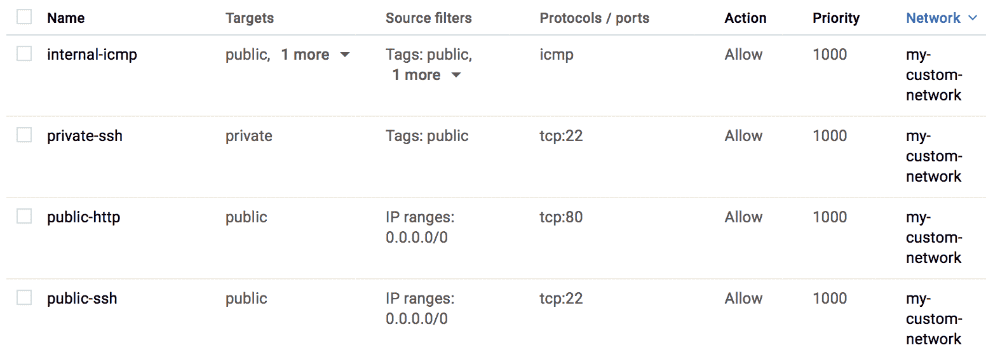

# 第十一章：GCP 上的 Kubernetes

**Google Cloud Platform**（**GCP**）是由 Google 提供的公共云服务，越来越受欢迎。GCP 具有与 AWS 类似的概念，如 VPC、计算引擎、持久磁盘、负载均衡和多个托管服务。在本章中，你将了解 GCP，并通过以下主题学习如何在 GCP 上设置 Kubernetes：

+   理解 GCP

+   使用和理解 GCP 组件

+   使用**Google Kubernetes Engine**（**GKE**），托管的 Kubernetes 服务

# GCP 介绍

GCP 于 2011 年正式推出。与 AWS 不同，GCP 最初提供的是**PaaS**（**平台即服务**）。因此，你可以直接部署应用程序，而无需启动虚拟机。之后，GCP 添加了更多服务和功能。

对 Kubernetes 用户来说，最重要的服务是 GKE，它是一个托管的 Kubernetes 服务。因此，你可以免去 Kubernetes 安装、升级和管理的麻烦。它采用按需付费的方式使用 Kubernetes 集群。GKE 也是一个非常活跃的服务，不断提供 Kubernetes 的新版本，并不断推出新的功能和管理工具。

让我们看看 GCP 提供了哪些基础设施和服务，然后再深入探讨 GKE。

# GCP 组件

GCP 提供了 Web 控制台和**命令行界面**（**CLI**）。这两者都使得控制 GCP 基础设施变得简单直观，但使用时需要 Google 帐号（如 Gmail）。一旦你拥有 Google 帐号，可以前往 GCP 注册页面（[`cloud.google.com/free/`](https://cloud.google.com/free/)）来设置你的 GCP 帐号。

如果你想通过 CLI 控制 GCP 组件，你需要安装 Cloud SDK（[`cloud.google.com/sdk/gcloud/`](https://cloud.google.com/sdk/gcloud/)），它类似于 AWS CLI，你可以用它列出、创建、更新和删除 GCP 资源。安装 Cloud SDK 后，你需要使用以下命令进行配置，将其与 GCP 帐号关联：

```
$ gcloud init
```

# VPC

GCP 中的 VPC 与 AWS 的策略有很大不同。首先，你不需要为 VPC 设置 CIDR 前缀。换句话说，你不能为 VPC 设置 CIDR。相反，你只需将一个或多个子网添加到 VPC 中。由于你必须为子网设置特定的 CIDR 块，因此 GCP 的 VPC 被视为子网的逻辑组合，VPC 内的子网可以相互通信。

请注意，GCP 的 VPC 有两种子网模式，分别是 `auto` 或 `custom`。如果选择 `auto`，它将在每个区域创建一些具有预定义 CIDR 块的子网。例如，输入以下命令：

```
$ gcloud compute networks create my-auto-network --subnet-mode auto
```

这将创建 18 个子网，如下图所示（因为截至 2018 年 12 月，GCP 有 18 个区域）：


自动模式 VPC 可能是一个不错的起点。然而，在自动模式下，你无法指定 CIDR 前缀，而且来自所有区域的 18 个子网可能不适合你的使用场景。例如，连接到本地数据中心通过 VPN。另一个例子是只在特定区域创建子网。

在这种情况下，选择自定义模式 VPC，然后你可以手动创建具有所需 CIDR 前缀的子网。输入以下命令创建一个自定义模式 VPC：

```
//create custom mode VPC which is named my-custom-network
$ gcloud compute networks create my-custom-network --subnet-mode custom
```

因为自定义模式 VPC 不会创建任何子网，如下图所示，接下来我们将子网添加到这个自定义模式 VPC：


# 子网

在 GCP 中，子网总是跨越一个区域内的多个可用区（availability zones）。换句话说，你不能像在 AWS 中那样仅在一个可用区内创建子网。创建子网时，你必须指定整个区域。

此外，与 AWS 不同，GCP 中没有明显的公有和私有子网的概念（在 AWS 中，公有子网的默认路由是 IGW；而私有子网的默认路由是 NAT 网关）。这是因为 GCP 中的所有子网都有通向互联网网关的路由。

GCP 不使用子网级别的访问控制，而是使用主机（实例）级别的访问控制，通过**网络标签**确保网络安全。接下来的部分会详细描述这一点。

这可能让网络管理员感到紧张；然而，GCP 的最佳实践提供了一个更加简化且可扩展的 VPC 管理方式，因为你可以随时添加子网来扩展整个网络块。

从技术上讲，你可以启动一个虚拟机实例并将其设置为 NAT 网关或 HTTP 代理，然后为私有子网创建一个自定义优先级路由，指向 NAT/代理实例，从而实现类似 AWS 的私有子网。

有关详细信息，请参考以下在线文档：[`cloud.google.com/compute/docs/vpc/special-configurations`](https://cloud.google.com/compute/docs/vpc/special-configurations)。

还有一件事：GCP VPC 的一个有趣且独特的概念是，你可以将不同的 CIDR 前缀网络块添加到同一个 VPC。例如，如果你有一个自定义模式 VPC，那么可以添加以下三个子网：

+   `subnet-a` (`10.0.1.0/24`) 来自 `us-west1`

+   `subnet-b` (`172.16.1.0/24`) 来自 `us-east1`

+   `subnet-c` (`192.168.1.0/24`) 来自 `asia-northeast1`

以下命令将从三个不同的区域创建三个子网，每个子网具有不同的 CIDR 前缀：

```
$ gcloud compute networks subnets create subnet-a --network=my-custom-network --range=10.0.1.0/24 --region=us-west1
$ gcloud compute networks subnets create subnet-b --network=my-custom-network --range=172.16.1.0/24 --region=us-east1
$ gcloud compute networks subnets create subnet-c --network=my-custom-network --range=192.168.1.0/24 --region=asia-northeast1
```

结果将是如下所示的 web 控制台。如果你熟悉 AWS VPC，你可能不敢相信这些 CIDR 前缀组合可以在一个 VPC 内使用！这意味着，每当你需要扩展网络时，你可以将另一个 CIDR 前缀分配给这个 VPC：


# 防火墙规则

如前所述，GCP 防火墙规则对实现网络安全至关重要。然而，GCP 防火墙比 AWS **安全组**（**SG**）更简单、更灵活。例如，在 AWS 中，启动 EC2 实例时，您必须分配至少一个与 EC2 和 SG 紧密耦合的 SG。而在 GCP 中，您不能直接分配任何防火墙规则。相反，防火墙规则和虚拟机实例是通过**网络标签**松散耦合的。因此，防火墙规则与虚拟机实例之间没有直接关联。

以下图表展示了 AWS 安全组与 GCP 防火墙规则的比较。EC2 需要一个安全组，而 GCP 虚拟机实例只需设置一个标签，无论相应的防火墙是否具有相同的标签：


例如，为公共主机（使用`public`网络标签）和私有主机（使用`private`网络标签）创建防火墙规则，如以下命令所示：

```
//create ssh access for public host
$ gcloud compute firewall-rules create public-ssh --network=my-custom-network --allow="tcp:22" --source-ranges="0.0.0.0/0" --target-tags="public"  //create http access (80/tcp for public host)
$ gcloud compute firewall-rules create public-http --network=my-custom-network --allow="tcp:80" --source-ranges="0.0.0.0/0" --target-tags="public"  //create ssh access for private host (allow from host which has "public" tag)
$ gcloud compute firewall-rules create private-ssh --network=my-custom-network --allow="tcp:22" --source-tags="public" --target-tags="private"

//create icmp access for internal each other (allow from host which has either "public" or "private")
$ gcloud compute firewall-rules create internal-icmp --network=my-custom-network --allow="icmp" --source-tags="public,private"
```

这将创建如以下截图所示的四个防火墙规则。让我们创建虚拟机实例，使用`public`或`private`网络标签，看看它是如何工作的：



# 虚拟机实例

在 GCP 中，虚拟机实例与 AWS EC2 相似。您可以从多种机器（实例）类型中选择，这些类型具有不同的硬件配置；您还可以选择基于 Linux 或 Windows 的操作系统，或者您自定义的操作系统。

如在讨论防火墙规则时提到的，您可以指定任意数量的网络标签。标签不一定需要事先创建。这意味着您可以先使用网络标签启动虚拟机实例，即使防火墙规则尚未创建。这样仍然有效，但此时不会应用防火墙规则。然后，您可以创建一个具有网络标签的防火墙规则。最终，防火墙规则将应用于虚拟机实例。这就是为什么虚拟机实例和防火墙规则是松散耦合的，提供了更大的灵活性：


在启动虚拟机实例之前，您需要首先创建一个`ssh`公钥，方式与 AWS EC2 相同。最简单的方法是运行以下命令来创建并注册一个新的密钥：

```
//this command create new ssh key pair
$ gcloud compute config-ssh //key will be stored as ~/.ssh/google_compute_engine(.pub)
$ cd ~/.ssh
$ ls -l google_compute_engine*
-rw-------  1 saito  admin  1766 Aug 23 22:58 google_compute_engine
-rw-r--r--  1 saito  admin   417 Aug 23 22:58 google_compute_engine.pub
```

现在，让我们开始在 GCP 上启动虚拟机实例。

在`subnet-a`和`subnet-b`上分别部署两个实例作为公共实例（使用`public`网络标签），然后在`subnet-a`上启动另一个实例作为私有实例（使用`private`网络标签）：

```
//create public instance ("public" tag) on subnet-a
$ gcloud compute instances create public-on-subnet-a --machine-type=f1-micro --network=my-custom-network --subnet=subnet-a --zone=us-west1-a --tags=public

//create public instance ("public" tag) on subnet-b
$ gcloud compute instances create public-on-subnet-b --machine-type=f1-micro --network=my-custom-network --subnet=subnet-b --zone=us-east1-c --tags=public

//create private instance ("private" tag) on subnet-a with larger size (g1-small)
$ gcloud compute instances create private-on-subnet-a --machine-type=g1-small --network=my-custom-network --subnet=subnet-a --zone=us-west1-a --tags=private

//Overall, there are 3 VM instances has been created in this example as below
$ gcloud compute instances list
NAME                                           ZONE           MACHINE_TYPE  PREEMPTIBLE  INTERNAL_IP  EXTERNAL_IP      STATUS
public-on-subnet-b                             us-east1-c     f1-micro                   172.16.1.2   35.196.228.40    RUNNING
private-on-subnet-a                            us-west1-a     g1-small                   10.0.1.2     104.199.121.234  RUNNING
public-on-subnet-a                             us-west1-a     f1-micro                   10.0.1.3     35.199.171.31    RUNNING
```


您可以登录到这些机器，检查防火墙规则是否按预期工作。首先，您需要将`ssh`密钥添加到您机器上的`ssh-agent`中：

```
$ ssh-add ~/.ssh/google_compute_engine
Enter passphrase for /Users/saito/.ssh/google_compute_engine:
Identity added: /Users/saito/.ssh/google_compute_engine
(/Users/saito/.ssh/google_compute_engine)
```

然后检查是否有 ICMP 防火墙规则可以拒绝来自外部的流量，因为 ICMP 仅允许公共或私有标记主机，因此你机器上的 ping 数据包不会到达公共实例；如以下截图所示：


另一方面，公共 `host` 允许从你的机器进行 `ssh` 连接，因为 `public-ssh` 规则允许任何来源（`0.0.0.0/0`）：


当然，这台主机可以通过私有 IP 地址 ping 和 `ssh` 连接到 `subnet-a` 上的私有主机（`10.0.1.2`），因为有 `internal-icmp` 和 `private-ssh` 规则。

让我们 `ssh` 连接到一台私有主机，然后安装 `tomcat8` 和 `tomcat8-examples` 包（这将为 Tomcat 安装 `/examples/` 应用程序）：


记住，`subnet-a` 是 `10.0.1.0/24` CIDR 前缀，而 `subnet-b` 是 `172.16.1.0/24` CIDR 前缀。然而，在同一个 VPC 中，它们是互通的。这是使用 GCP 的一个巨大优势，你可以根据需要扩展网络地址块。

现在在公共主机（`public-on-subnet-a` 和 `public-on-subnet-b`）上安装 `nginx`：

```
//logout from VM instance, then back to your machine
$ exit

//install nginx from your machine via ssh
$ ssh 35.196.228.40 "sudo apt-get -y install nginx"
$ ssh 35.199.171.31 "sudo apt-get -y install nginx"  //check whether firewall rule (public-http) work or not
$ curl -I http://35.196.228.40/
HTTP/1.1 200 OK
Server: nginx/1.10.3
Date: Sun, 27 Aug 2017 07:07:01 GMT
Content-Type: text/html
Content-Length: 612
Last-Modified: Fri, 25 Aug 2017 05:48:28 GMT
Connection: keep-alive
ETag: "599fba2c-264"
Accept-Ranges: bytes
```

然而，目前即使私有主机拥有公共 IP 地址，你也无法访问 Tomcat。这是因为私有主机尚未设置允许 `8080/tcp` 的防火墙规则：

```
$ curl http://104.199.121.234:8080/examples/
curl: (7) Failed to connect to 104.199.121.234 port 8080: Operation timed out
```

与其仅仅为 Tomcat 创建防火墙规则，我们将在下一节中设置一个负载均衡器，配置 nginx 和 Tomcat。

# 负载均衡

GCP 提供了几种类型的负载均衡器，如下所示：

+   层 4 TCP 负载均衡器

+   层 4 UDP 负载均衡器

+   层 7 HTTP(S) 负载均衡器

层 4 负载均衡器（TCP 和 UDP）类似于 AWS Classic ELB。另一方面，层 7 HTTP(S) 负载均衡器具有基于内容（上下文）的路由。例如，URL/图像将转发到 `instance-a`；其他所有内容将转发到 `instance-b`。因此，它更像是一个应用层负载均衡器。

AWS 还提供 **应用负载均衡器**（**ALB** 或 **ELBv2**），它与 GCP 的层 7 HTTP(S) 负载均衡器非常相似。有关详细信息，请访问 [`aws.amazon.com/blogs/aws/new-aws-application-load-balancer/`](https://aws.amazon.com/blogs/aws/new-aws-application-load-balancer/)。

为了设置负载均衡器，与 AWS ELB 不同，你需要遵循几个步骤来预先配置一些项目：

| **配置项** | **用途** |
| --- | --- |
| 实例组 | 确定一组虚拟机实例或虚拟机模板（操作系统镜像）。 |
| 健康检查 | 设置健康阈值（间隔、超时等）以确定实例组的健康状态。 |
| 后端服务 | 设置负载阈值（最大 CPU 或每秒请求数）和会话亲和性（粘性会话），并将其与健康检查关联。 |
| `url-maps`（负载均衡器） | 这是一个实际的占位符，代表一个 L7 负载均衡器，它将后台服务与 HTTP(S)代理相关联。 |
| 目标 HTTP(S)代理 | 这是一个连接器，它使前端转发规则与负载均衡器之间建立关系。 |
| 前端转发规则 | 将目标 HTTP 代理与 IP 地址（临时或静态）和端口号关联。 |
| 外部 IP（静态） | （可选）为负载均衡器分配一个静态外部 IP 地址。 |

下图展示了构建 L7 负载均衡器时，所有前面提到的组件的关联：


让我们首先设置一个实例组。在本示例中，需要创建三个实例组：一个用于私有托管的 Tomcat 实例（`8080/tcp`），另外两个实例组用于每个区域的公共 HTTP 实例。

为了做到这一点，执行以下命令，将它们分组在一起：

```
//create instance groups for HTTP instances and tomcat instance
$ gcloud compute instance-groups unmanaged create http-ig-us-west --zone us-west1-a
$ gcloud compute instance-groups unmanaged create http-ig-us-east --zone us-east1-c
$ gcloud compute instance-groups unmanaged create tomcat-ig-us-west --zone us-west1-a

//because tomcat uses 8080/tcp, create a new named port as tomcat:8080
$ gcloud compute instance-groups unmanaged set-named-ports tomcat-ig-us-west --zone us-west1-a --named-ports tomcat:8080

//register an existing VM instance to correspond instance group
$ gcloud compute instance-groups unmanaged add-instances http-ig-us-west --instances public-on-subnet-a --zone us-west1-a
$ gcloud compute instance-groups unmanaged add-instances http-ig-us-east --instances public-on-subnet-b --zone us-east1-c
$ gcloud compute instance-groups unmanaged add-instances tomcat-ig-us-west --instances private-on-subnet-a --zone us-west1-a
```

# 健康检查

让我们通过执行以下命令来设置标准配置：

```
//create health check for http (80/tcp) for "/"
$ gcloud compute health-checks create http my-http-health-check --check-interval 5 --healthy-threshold 2 --unhealthy-threshold 3 --timeout 5 --port 80 --request-path / 
//create health check for Tomcat (8080/tcp) for "/examples/"
$ gcloud compute health-checks create http my-tomcat-health-check --check-interval 5 --healthy-threshold 2 --unhealthy-threshold 3 --timeout 5 --port 8080 --request-path /examples/
```

# 后台服务

首先，我们需要创建一个指定了`健康检查`的`后台`服务。然后，我们必须为每个实例组添加阈值：CPU 使用率最高为 80%，HTTP 和 Tomcat 的最大容量都设置为 100%：

```
//create backend service for http (default) and named port tomcat (8080/tcp)
$ gcloud compute backend-services create my-http-backend-service --health-checks my-http-health-check --protocol HTTP --global
$ gcloud compute backend-services create my-tomcat-backend-service --health-checks my-tomcat-health-check --protocol HTTP --port-name tomcat --global

//add http instance groups (both us-west1 and us-east1) to http backend service
$ gcloud compute backend-services add-backend my-http-backend-service --instance-group http-ig-us-west --instance-group-zone us-west1-a --balancing-mode UTILIZATION --max-utilization 0.8 --capacity-scaler 1 --global
$ gcloud compute backend-services add-backend my-http-backend-service --instance-group http-ig-us-east --instance-group-zone us-east1-c --balancing-mode UTILIZATION --max-utilization 0.8 --capacity-scaler 1 --global

//also add tomcat instance group to tomcat backend service
$ gcloud compute backend-services add-backend my-tomcat-backend-service --instance-group tomcat-ig-us-west --instance-group-zone us-west1-a --balancing-mode UTILIZATION --max-utilization 0.8 --capacity-scaler 1 --global
```

# 创建负载均衡器

负载均衡器需要绑定`my-http-backend-service`和`my-tomcat-backend-service`。在此场景下，只有`/examples`和`/examples/*`的流量会转发到`my-tomcat-backend-service`。除此之外，所有 URI 的流量都会转发到`my-http-backend-service`：

```
//create load balancer(url-map) to associate my-http-backend-service as default
$ gcloud compute url-maps create my-loadbalancer --default-service my-http-backend-service

//add /examples and /examples/* mapping to my-tomcat-backend-service
$ gcloud compute url-maps add-path-matcher my-loadbalancer --default-service my-http-backend-service --path-matcher-name tomcat-map --path-rules /examples=my-tomcat-backend-service,/examples/*=my-tomcat-backend-service //create target-http-proxy that associate to load balancer(url-map)
$ gcloud compute target-http-proxies create my-target-http-proxy --url-map=my-loadbalancer

//allocate static global ip address and check assigned address
$ gcloud compute addresses create my-loadbalancer-ip --global
$ gcloud compute addresses describe my-loadbalancer-ip --global
address: 35.186.192.6

creationTimestamp: '2018-12-08T13:40:16.661-08:00' ...
...
//create forwarding rule that associate static IP to target-http-proxy
$ gcloud compute forwarding-rules create my-frontend-rule --global --target-http-proxy my-target-http-proxy --address 35.186.192.6 --ports 80 
```

如果你没有指定`--address`选项，则会创建并分配一个临时的外部 IP 地址。

最后，负载均衡器已经创建。然而，还有一个缺失的配置。私有主机没有任何防火墙规则来允许 Tomcat 流量（`8080/tcp`）。因此，当你查看负载均衡器状态时，`my-tomcat-backend-service`的健康状态会保持为不正常（`0`）：


在这种情况下，你需要添加一个新的防火墙规则，允许从负载均衡器到私有子网的连接（为此使用`private`网络标签）。根据 GCP 文档（[`cloud.google.com/compute/docs/load-balancing/health-checks#https_ssl_proxy_tcp_proxy_and_internal_load_balancing`](https://cloud.google.com/load-balancing/docs/health-checks#https_ssl_proxy_tcp_proxy_and_internal_load_balancing)），健康检查的心跳将来自地址范围`35.191.0.0/16`到`130.211.0.0/22`：

```
//add one more Firewall Rule that allow Load Balancer to Tomcat (8080/tcp) 
$ gcloud compute firewall-rules create private-tomcat --network=my-custom-network --source-ranges 35.191.0.0/16,130.211.0.0/22 --target-tags private --allow tcp:8080
```

几分钟后，`my-tomcat-backend-service`的健康状态将达到（`1`）；现在你可以通过网页浏览器访问负载均衡器。当访问`/`时，应该会路由到`my-http-backend-service`，该服务在公共主机上运行`nginx`应用：


另一方面，如果您使用相同的负载均衡器 IP 地址访问`/examples/` URL，它将路由到`my-tomcat-backend-service`，这是一个托管在私有主机上的 Tomcat 应用，如下图所示：


总的来说，设置负载均衡器需要执行一些步骤，但将不同的 HTTP 应用程序集成到一个负载均衡器中，对于高效地交付服务并以最少的资源使用是非常有用的。

# 持久磁盘

GCE 还提供了一种存储服务，叫做**持久磁盘**（**PD**），它与 AWS EBS 非常相似。您可以在每个可用区分配所需的大小和类型（标准或 SSD），并随时附加/分离 VM 实例。

让我们创建一个 PD，然后将其附加到 VM 实例。请注意，当将 PD 附加到 VM 实例时，二者必须位于相同的可用区。这一限制与 AWS EBS 相同。因此，在创建 PD 之前，请再次检查 VM 实例的位置：

```
$ gcloud compute instances list
NAME                                           ZONE           MACHINE_TYPE  PREEMPTIBLE  INTERNAL_IP  EXTERNAL_IP      STATUS
public-on-subnet-b                             us-east1-c     f1-micro                   172.16.1.2   35.196.228.40    RUNNING
private-on-subnet-a                            us-west1-a     g1-small                   10.0.1.2     104.199.121.234  RUNNING
public-on-subnet-a                             us-west1-a     f1-micro                   10.0.1.3     35.199.171.31    RUNNING
```

让我们选择`us-west1-a`，然后将其附加到`public-on-subnet-a`：

```
//create 20GB PD on us-west1-a with standard type
$ gcloud compute disks create my-disk-us-west1-a --zone us-west1-a --type pd-standard --size 20 //after a few seconds, check status, you can see existing boot disks as well
$ gcloud compute disks list
NAME                                           ZONE           SIZE_GB  TYPE         STATUS
public-on-subnet-b                             us-east1-c     10       pd-standard  READY
my-disk-us-west1-a                             us-west1-a     20       pd-standard  READY
private-on-subnet-a                            us-west1-a     10       pd-standard  READY
public-on-subnet-a                             us-west1-a     10       pd-standard  READY  //attach PD(my-disk-us-west1-a) to the VM instance(public-on-subnet-a)
$ gcloud compute instances attach-disk public-on-subnet-a --disk my-disk-us-west1-a --zone us-west1-a //login to public-on-subnet-a to see the status
$ ssh 35.199.171.31
Linux public-on-subnet-a 4.9.0-3-amd64 #1 SMP Debian 4.9.30-2+deb9u3 (2017-08-06) x86_64

The programs included with the Debian GNU/Linux system are free software;
the exact distribution terms for each program are described in the
individual files in /usr/share/doc/*/copyright.

Debian GNU/Linux comes with ABSOLUTELY NO WARRANTY, to the extent
permitted by applicable law.
Last login: Fri Aug 25 03:53:24 2017 from 107.196.102.199
saito@public-on-subnet-a:~$ sudo su
root@public-on-subnet-a:/home/saito# dmesg | tail
[ 7377.421190] systemd[1]: apt-daily-upgrade.timer: Adding 25min 4.773609s random time.
[ 7379.202172] systemd[1]: apt-daily-upgrade.timer: Adding 6min 37.770637s random time.
[243070.866384] scsi 0:0:2:0: Direct-Access     Google   PersistentDisk   1    PQ: 0 ANSI: 6
[243070.875665] sd 0:0:2:0: [sdb] 41943040 512-byte logical blocks: (21.5 GB/20.0 GiB)
[243070.883461] sd 0:0:2:0: [sdb] 4096-byte physical blocks
[243070.889914] sd 0:0:2:0: Attached scsi generic sg1 type 0
[243070.900603] sd 0:0:2:0: [sdb] Write Protect is off
[243070.905834] sd 0:0:2:0: [sdb] Mode Sense: 1f 00 00 08
[243070.905938] sd 0:0:2:0: [sdb] Write cache: enabled, read cache: enabled, doesn't support DPO or FUA
[243070.925713] sd 0:0:2:0: [sdb] Attached SCSI disk
```

您可能会看到 PD 已附加在`/dev/sdb`。类似于 AWS EBS，您需要格式化此磁盘。由于这是 Linux 操作系统的操作，步骤与第十章，*Kubernetes on AWS*中描述的完全相同。

# Google Kubernetes Engine（GKE）

总的来说，前面介绍了一些 GCP 的组件。现在，您可以开始使用这些组件在 GCP 的 VM 实例上设置 Kubernetes。您甚至可以使用开源的 Kubernetes 配置工具，如[kops](https://github.com/kubernetes/kops)和[kubespray](https://github.com/kubernetes-sigs/kubespray)。

Google Cloud 提供了 GKE On-Prem（[`cloud.google.com/gke-on-prem/`](https://cloud.google.com/gke-on-prem/)），允许用户在自己的数据中心资源上设置 GKE。从 2019 年 1 月起，这还是一个 alpha 版本，尚未对所有人开放。

然而，GCP 有一个托管的 Kubernetes 服务，叫做 GKE。在后台，它使用了 GCP 的一些组件，如 VPC、VM 实例、PD、防火墙规则和负载均衡器。

当然，像往常一样，您可以使用`kubectl`命令来控制 GKE 上的 Kubernetes 集群，它包含在 Cloud SDK 中。如果您还没有在计算机上安装`kubectl`命令，可以通过 Cloud SDK 输入以下命令进行安装：

```
//install kubectl command
$ gcloud components install kubectl
```

# 在 GKE 上设置您的第一个 Kubernetes 集群

您可以使用`gcloud`命令在 GKE 上设置 Kubernetes 集群。这需要指定多个参数以确定一些配置。一个重要的参数是网络。在这里，您必须指定要部署的 VPC 和子网。尽管 GKE 支持多个可用区进行部署，但您需要为 Kubernetes 主节点指定至少一个可用区。这次，使用以下参数启动 GKE 集群：

| **参数** | **描述** | **值** |
| --- | --- | --- |
| `--machine-type` | Kubernetes 节点的 VM 实例类型 | `f1-micro` |
| `--num-nodes` | Kubernetes 节点的初始数量 | `3` |
| `--network` | 指定 GCP VPC | `my-custom-network` |
| `--subnetwork` | 如果 VPC 为自定义模式，则指定 GCP 子网 | `subnet-c` |
| `--zone` | 指定一个单一的可用区 | `asia-northeast1-a` |
| `--tags` | 将分配给 Kubernetes 节点的网络标签 | `private` |

在这种情况下，你需要输入以下命令来在 GCP 上启动 Kubernetes 集群。由于在后台会启动多个 VM 实例并设置 Kubernetes 主节点和节点，因此可能需要几分钟才能完成。请注意，Kubernetes 主节点和 etcd 将由 GCP 完全管理。这意味着主节点和 etcd 不会消耗你的 VM 实例：

```
$ gcloud container clusters create my-k8s-cluster --machine-type f1-micro --num-nodes 3 --network my-custom-network --subnetwork subnet-c --zone asia-northeast1-a --tags private  //after a few minutes, check node status
NAME                                            STATUS    ROLES     AGE       VERSION
gke-my-k8s-cluster-default-pool-bcae4a66-mlhw   Ready     <none>    2m        v1.10.9-gke.5
gke-my-k8s-cluster-default-pool-bcae4a66-tn74   Ready     <none>    2m        v1.10.9-gke.5
gke-my-k8s-cluster-default-pool-bcae4a66-w5l6   Ready     <none>    2m        v1.10.9-gke.5
```

注意，我们指定了`--tags private`选项，以便 Kubernetes 节点 VM 实例拥有`private`网络标签。因此，它的行为与其他具有`private`标签的普通 VM 实例相同。结果，你无法从公共互联网进行 SSH 连接，也无法从互联网进行 HTTP 访问。不过，你可以从另一个具有`public`网络标签的 VM 实例进行 ping 和 SSH 连接。

# 节点池

在启动 Kubernetes 集群时，你可以使用`--num-nodes`选项指定节点数量。GKE 将 Kubernetes 节点管理为一个节点池。这意味着你可以管理附加到 Kubernetes 集群的一个或多个节点池。

如果需要添加或删除节点怎么办？GKE 允许你通过执行以下命令将 Kubernetes 节点从 3 个增加到 5 个：

```
//run resize command to change number of nodes to 5
$ gcloud container clusters resize my-k8s-cluster --size 5 --zone asia-northeast1-a 
//after a few minutes later, you may see additional nodes
$ kubectl get nodes
NAME                                            STATUS    ROLES     AGE       VERSION
gke-my-k8s-cluster-default-pool-bcae4a66-j8zz   Ready     <none>    32s       v1.10.9-gke.5
gke-my-k8s-cluster-default-pool-bcae4a66-jnnw   Ready     <none>    32s       v1.10.9-gke.5
gke-my-k8s-cluster-default-pool-bcae4a66-mlhw   Ready     <none>    4m        v1.10.9-gke.5
gke-my-k8s-cluster-default-pool-bcae4a66-tn74   Ready     <none>    4m        v1.10.9-gke.5
gke-my-k8s-cluster-default-pool-bcae4a66-w5l6   Ready     <none>    4m        v1.10.9-gke.5 
```

增加节点数量有助于你需要扩展节点容量时。但是，在这种情况下，它仍然使用最小的实例类型（`f1-micro`，仅有 0.6 GB 内存）。如果单个容器需要超过 0.6 GB 的内存，这可能并没有帮助。在这种情况下，你需要进行扩展，即需要添加更大的 VM 实例类型。

在这种情况下，你必须向集群添加另一个节点池。这是因为，在同一个节点池内，所有的 VM 实例配置都是相同的。因此，你无法在同一个节点池中更改实例类型。

向集群添加一个新的节点池，包含两套新的`g1-small`（1.7 GB 内存）VM 实例类型。然后，你可以使用不同硬件配置扩展 Kubernetes 节点。

默认情况下，在一个区域内有一些配额会限制 VM 实例的数量（例如，在`us-west1`区域最多允许 8 个 CPU 核心）。如果你希望增加这个配额，你必须将账户升级为付费账户，然后请求 GCP 更改配额。更多详情，请阅读在线文档：[`cloud.google.com/compute/quotas`](https://cloud.google.com/compute/quotas) 和 [`cloud.google.com/free/docs/frequently-asked-questions#how-to-upgrade`](https://cloud.google.com/free/docs/frequently-asked-questions#how-to-upgrade)。

运行以下命令以添加一个额外的节点池，该池包含两个`g1-small`实例：

```
//create and add node pool which is named "large-mem-pool"

$ gcloud container node-pools create large-mem-pool --cluster my-k8s-cluster --machine-type g1-small --num-nodes 2 --tags private --zone asia-northeast1-a  //after a few minustes, large-mem-pool instances has been added
$ kubectl get nodes
NAME                                              STATUS    ROLES     AGE       VERSION
gke-my-k8s-cluster-default-pool-bcae4a66-j8zz     Ready     <none>    5m        v1.10.9-gke.5
gke-my-k8s-cluster-default-pool-bcae4a66-jnnw     Ready     <none>    5m        v1.10.9-gke.5
gke-my-k8s-cluster-default-pool-bcae4a66-mlhw     Ready     <none>    9m        v1.10.9-gke.5
gke-my-k8s-cluster-default-pool-bcae4a66-tn74     Ready     <none>    9m        v1.10.9-gke.5
gke-my-k8s-cluster-default-pool-bcae4a66-w5l6     Ready     <none>    9m        v1.10.9-gke.5
gke-my-k8s-cluster-large-mem-pool-66e3a44a-jtdn   Ready     <none>    46s       v1.10.9-gke.5
gke-my-k8s-cluster-large-mem-pool-66e3a44a-qpbr   Ready     <none>    44s       v1.10.9-gke.5
```

现在你的集群总共有七个 CPU 核心和 6.4 GB 的内存，容量更大。然而，由于硬件类型较大，Kubernetes 调度器可能会优先将 Pod 分配到 `large-mem-pool`，因为它有足够的内存容量。

然而，你可能希望保留 `large-mem-pool` 节点，以防某个大型应用需要较大的内存（例如，一个 Java 应用）。因此，你可能想区分 `default-pool` 和 `large-mem-pool`。

在这种情况下，Kubernetes 标签 `beta.kubernetes.io/instance-type` 有助于区分节点的实例类型。因此，可以使用 `nodeSelector` 来指定 Pod 的目标节点。例如，以下的 `nodeSelector` 参数将强制使用 `f1-micro` 节点来运行 `nginx` 应用：

```
//nodeSelector specifies f1-micro
$ cat nginx-pod-selector.yml
apiVersion: v1
kind: Pod
metadata:
 name: nginx
spec:
 containers:
 - name: nginx
   image: nginx
 nodeSelector:
  beta.kubernetes.io/instance-type: f1-micro

//deploy pod
$ kubectl create -f nginx-pod-selector.yml
pod "nginx" created 
//it uses default pool
NAME      READY     STATUS              RESTARTS   AGE       IP        NODE
nginx     0/1       ContainerCreating   0          10s       <none>    gke-my-k8s-cluster-default-pool-bcae4a66-jnnw
```

如果你想指定一个特定的标签，而不是 `beta.kubernetes.io/instance-type`，可以使用 `--node-labels` 选项来创建节点池。这样可以将你想要的标签分配给节点池。更多细节，请阅读以下在线文档：[`cloud.google.com/sdk/gcloud/reference/container/node-pools/create`](https://cloud.google.com/sdk/gcloud/reference/container/node-pools/create)。

当然，如果你不再需要某个节点池，可以随时将其删除。为此，可以运行以下命令删除 `default-pool`（`f1-micro` x 5 实例）。如果 `default-pool` 上有一些 Pod 在运行，执行此操作时将自动进行 Pod 迁移（终止 `default-pool` 上的 Pod 并将其重新启动在 `large-mem-pool` 上）：

```
//list Node Pool
$ gcloud container node-pools list --cluster my-k8s-cluster --zone asia-northeast1-a NAME            MACHINE_TYPE  DISK_SIZE_GB  NODE_VERSION
default-pool    f1-micro      100           1.10.9-gke.5
large-mem-pool  g1-small      100           1.10.9-gke.5  //delete default-pool
$ gcloud container node-pools delete default-pool --cluster my-k8s-cluster --zone asia-northeast1-a 
//after a few minutes, default-pool nodes x 5 has been deleted
$ kubectl get nodes
NAME                                              STATUS    ROLES     AGE       VERSION
gke-my-k8s-cluster-large-mem-pool-66e3a44a-jtdn   Ready     <none>    9m        v1.10.9-gke.5
gke-my-k8s-cluster-large-mem-pool-66e3a44a-qpbr   Ready     <none>    9m        v1.10.9-gke.5
```

你可能已经注意到，所有前述操作都发生在同一个区域（`asia-northeast1-a`）。因此，如果 `asia-northeast1-a` 区域发生故障，你的集群将会宕机。为了避免区域故障，你可以考虑设置多区域集群。

# 多区域集群

GKE 支持多区域集群，这允许你在同一地区的多个区域中启动 Kubernetes 节点。在前面的示例中，Kubernetes 节点只在 `asia-northeast1-a` 区域中提供，因此让我们重新配置一个集群，包含 `asia-northeast1-a`、`asia-northeast1-b` 和 `asia-northeast1-c` 三个区域。

这非常简单；你只需在创建新集群时使用 `--node-locations` 参数指定三个区域。

让我们删除之前的集群，并使用 `--node-locations` 选项创建一个新的集群：

```
//delete cluster first
$ gcloud container clusters delete my-k8s-cluster --zone asia-northeast1-a
The following clusters will be deleted.
 - [my-k8s-cluster] in [asia-northeast1-a]
Do you want to continue (Y/n)?  y ...
...
 //create a new cluster with --node-locations option with 2 nodes per zones
$ gcloud container clusters create my-k8s-cluster --machine-type f1-micro --num-nodes 2 --network my-custom-network --subnetwork subnet-c --tags private --zone asia-northeast1-a --node-locations asia-northeast1-a,asia-northeast1-b,asia-northeast1-c
```

这个示例将在每个区域创建两个节点（`asia-northeast1-a`、`b` 和 `c`）。因此，总共将添加六个节点：

```
$ kubectl get nodes
NAME                                            STATUS    ROLES     AGE       VERSION
gke-my-k8s-cluster-default-pool-58e4e9a4-74hc   Ready     <none>    43s       v1.10.9-gke.5
gke-my-k8s-cluster-default-pool-58e4e9a4-8jft   Ready     <none>    1m        v1.10.9-gke.5
gke-my-k8s-cluster-default-pool-f7baf2e1-lk7j   Ready     <none>    1m        v1.10.9-gke.5
gke-my-k8s-cluster-default-pool-f7baf2e1-zktg   Ready     <none>    1m        v1.10.9-gke.5
gke-my-k8s-cluster-default-pool-fa5a04a5-bbj5   Ready     <none>    1m        v1.10.9-gke.5
gke-my-k8s-cluster-default-pool-fa5a04a5-d35z   Ready     <none>    1m        v1.10.9-gke.5
```

你还可以通过 Kubernetes 标签 `failure-domain.beta.kubernetes.io/zone` 来区分节点区域，以便指定想要部署 Pod 的区域。

# 集群升级

一旦你开始管理 Kubernetes，可能会遇到在升级 Kubernetes 集群时的困难。由于 Kubernetes 项目更新非常积极，每大约三个月就会发布一个新版本，例如 1.11.0（2018 年 6 月 27 日发布）、1.12.0（2018 年 9 月 27 日发布）和 1.13.0（2018 年 12 月 3 日发布）。

GKE 还会及时添加对新版本的支持。这使得我们可以通过`gcloud`命令升级 master 和节点。你可以运行以下命令查看 GKE 支持的 Kubernetes 版本：

```
$ gcloud container get-server-config
Fetching server config for us-west1-b

defaultClusterVersion: 1.10.9-gke.5
defaultImageType: COS
validImageTypes:
- COS_CONTAINERD
- COS
- UBUNTU
validMasterVersions:
- 1.11.4-gke.8
- 1.11.3-gke.18
- 1.11.2-gke.20
- 1.11.2-gke.18
- 1.10.9-gke.7
- 1.10.9-gke.5
- 1.10.7-gke.13
- 1.10.7-gke.11
- 1.10.6-gke.13
- 1.10.6-gke.11
- 1.9.7-gke.11
validNodeVersions:
- 1.11.4-gke.8
- 1.11.3-gke.18
- 1.11.2-gke.20
- 1.11.2-gke.18
- 1.11.2-gke.15
- 1.11.2-gke.9
- 1.10.9-gke.7
- 1.10.9-gke.5
- 1.10.9-gke.3
- 1.10.9-gke.0
- 1.10.7-gke.13
- 1.10.7-gke.11
... 
```

因此，你可以看到在写作时，最新支持的 Kubernetes 版本是`1.11.4-gke.8`，在 master 和 node 上都是如此。由于之前安装的版本是`1.10.9-gke.5`，我们将其更新为`1.11.4-gke.8`。首先，你需要先升级`master`：

```
//upgrade master using --master option
$ gcloud container clusters upgrade my-k8s-cluster --zone asia-northeast1-a --cluster-version 1.11.4-gke.8 --master

Master of cluster [my-k8s-cluster] will be upgraded from version 
[1.10.9-gke.5] to version [1.11.4-gke.8]. This operation is 
long-running and will block other operations on the cluster (including
 delete) until it has run to completion.

Do you want to continue (Y/n)? y

Upgrading my-k8s-cluster...done.
Updated [https://container.googleapis.com/v1/projects/devops-with-kubernetes/zones/asia-northeast1-a/clusters/my-k8s-cluster].
```

这大约需要 10 分钟，具体时间取决于环境。之后，你可以通过以下命令验证`MASTER_VERSION`：

```
//master upgrade has been successfully to done
$ gcloud container clusters list --zone asia-northeast1-a
NAME            LOCATION           MASTER_VERSION  MASTER_IP      MACHINE_TYPE  NODE_VERSION    NUM_NODES  STATUS

my-k8s-cluster  asia-northeast1-a  1.11.4-gke.8    35.243.78.166  f1-micro      1.10.9-gke.5 *  6          RUNNING
```

现在你可以开始将所有节点升级到`1.11.4-gke.8`版本。由于 GKE 尝试执行滚动升级，它将在每个节点上逐一执行以下步骤：

1.  从集群中取消注册目标节点

1.  删除旧的虚拟机实例

1.  提供一个新的虚拟机实例

1.  设置节点为`1.11.4-gke.8`版本

1.  注册到`master`

因此，节点的升级比 master 升级需要更长时间：

```
//node upgrade (not specify --master)
$ gcloud container clusters upgrade my-k8s-cluster --zone asia-northeast1-a --cluster-version 1.11.4-gke.8
All nodes (6 nodes) of cluster [my-k8s-cluster] will be upgraded from 
version [1.10.9-gke.5] to version [1.11.4-gke.8]. This operation is 
long-running and will block other operations on the cluster (including delete) until it has run to completion.

Do you want to continue (Y/n)?  y
```

在滚动升级过程中，你可以看到节点状态如下；这个例子展示了滚动更新的中途状态。这里，两个节点已经升级到`1.11.4-gke.8`，一个节点即将升级，剩余的三个节点处于待处理状态：

```
$ kubectl get nodes
NAME                                            STATUS                     ROLES     AGE       VERSION
gke-my-k8s-cluster-default-pool-58e4e9a4-74hc   Ready                      <none>    18m       v1.11.4-gke.8
gke-my-k8s-cluster-default-pool-58e4e9a4-8jft   Ready                      <none>    19m       v1.11.4-gke.8
gke-my-k8s-cluster-default-pool-f7baf2e1-lk7j   Ready                      <none>    19m       v1.10.9-gke.5
gke-my-k8s-cluster-default-pool-f7baf2e1-zktg   Ready                      <none>    19m       v1.10.9-gke.5
gke-my-k8s-cluster-default-pool-fa5a04a5-bbj5   Ready,SchedulingDisabled   <none>    19m       v1.10.9-gke.5
gke-my-k8s-cluster-default-pool-fa5a04a5-d35z   Ready                      <none>    19m       v1.10.9-gke.5  
```

# Kubernetes 云提供商

GKE 还原生集成了 Kubernetes 云提供商，深度集成了 GCP 基础设施，例如，通过 VPC 路由的覆盖网络（overlay network）、通过持久磁盘（Persistent Disk）的`StorageClass`、以及通过 L4 负载均衡器的服务（Service）。其中最好的集成之一是由 L7 负载均衡器提供的 ingress 控制器。让我们来看看它是如何工作的。

# 存储类（StorageClass）

类似于 AWS 上的 EKS，GKE 也默认设置`StorageClass`；它使用的是持久磁盘（Persistent Disk）：

```
$ kubectl get storageclass
NAME                 TYPE
standard (default)   kubernetes.io/gce-pd  $ kubectl describe storageclass standard

Name:                  standard
IsDefaultClass:        Yes
Annotations:           storageclass.beta.kubernetes.io/is-default-class=true
Provisioner:           kubernetes.io/gce-pd
Parameters:            type=pd-standard
AllowVolumeExpansion:  <unset>
MountOptions:          <none>
ReclaimPolicy:         Delete
VolumeBindingMode:     Immediate
Events:                <none>
```

因此，当创建持久卷声明（persistent volume claim）时，它会自动分配 GCP 持久磁盘作为 Kubernetes 持久卷。有关持久卷声明和动态供应的更多信息，请参考第四章，*管理有状态工作负载*：

```
$ cat pvc-gke.yml
apiVersion: v1
kind: PersistentVolumeClaim
metadata:
    name: pvc-gke-1
spec:
  storageClassName: "standard"
  accessModes:
    - ReadWriteOnce
  resources:
    requests:
      storage: 10Gi
 //create Persistent Volume Claim
$ kubectl create -f pvc-gke.yml 
persistentvolumeclaim "pvc-gke-1" created 

//check Persistent Volume
$ kubectl get pv
NAME                                       CAPACITY   ACCESSMODES   RECLAIMPOLICY   STATUS    CLAIM               STORAGECLASS   REASON    AGE
pvc-bc04e717-8c82-11e7-968d-42010a920fc3   10Gi       RWO           Delete          Bound     default/pvc-gke-1   standard                 2s 

//check via gcloud command
$ gcloud compute disks list 
NAME                                                             ZONE               SIZE_GB  TYPE         STATUS
gke-my-k8s-cluster-d2e-pvc-bc04e717-8c82-11e7-968d-42010a920fc3  asia-northeast1-a  10       pd-standard  READY 
```

# L4 负载均衡器

类似于 AWS 云提供商，GKE 也支持使用 L4 负载均衡器为 Kubernetes 服务（Kubernetes Services）提供负载均衡。只需将`Service.spec.type`指定为 LoadBalancer，GKE 将自动设置和配置 L4 负载均衡器。

请注意，L4 负载均衡器与 Kubernetes 节点之间的相应防火墙规则可以由云提供商自动创建。这非常简单，但足够强大，如果你想快速将应用暴露到互联网上，足够用了：

```
$ cat grafana.yml
apiVersion: apps/v1
kind: Deployment
metadata:
  name: grafana
spec:
  replicas: 1
  selector:
    matchLabels:
      project: devops-with-kubernetes
      app: grafana
  template:
    metadata:
      labels:
        project: devops-with-kubernetes
        app: grafana
    spec:
     containers:
       - image: grafana/grafana
         name: grafana
         ports:
          - containerPort: 3000
---
apiVersion: v1
kind: Service
metadata:
  name: grafana
spec:
  ports:
    - port: 80
      targetPort: 3000
  type: LoadBalancer
  selector:
    project: devops-with-kubernetes
    app: grafana 

//deploy grafana with Load Balancer service
$ kubectl create -f grafana.yml 
deployment.apps "grafana" created
service "grafana" created

//check L4 Load balancer IP address
$ kubectl get svc grafana NAME      TYPE           CLUSTER-IP     EXTERNAL-IP     PORT(S)        AGE
grafana   LoadBalancer   10.59.244.97   35.243.118.88   80:31213/TCP   1m //can reach via GCP L4 Load Balancer $ curl -I 35.243.118.88
HTTP/1.1 302 Found
Content-Type: text/html; charset=utf-8
Location: /login
Set-Cookie: grafana_sess=186d81bd66d150d5; Path=/; HttpOnly
Set-Cookie: redirect_to=%252F; Path=/; HttpOnly
Date: Sun, 09 Dec 2018 02:25:48 GMT
```

# L7 负载均衡器（ingress）

GKE 也支持 Kubernetes ingress，它可以设置 GCP L7 负载均衡器，根据 URL 将 HTTP 请求调度到目标服务。你只需要设置一个或多个 NodePort 服务，然后创建 ingress 规则指向这些服务。在后台，Kubernetes 会自动创建和配置以下防火墙规则：`health check`、`backend` 服务、`forwarding rule` 和 `url-maps`。

首先，我们将创建相同的示例，使用 nginx 和 Tomcat 部署到 Kubernetes 集群。这些示例使用的是绑定到 NodePort 的 Kubernetes 服务，而不是 LoadBalancer：


目前，你无法访问 Kubernetes 服务，因为还没有允许从互联网访问的防火墙规则。因此，让我们创建 Kubernetes ingress 来指向这些服务。

你可以使用 `kubectl port-forward <pod name> <your machine available port><: service port number>` 通过 Kubernetes API 服务器访问 pod。对于上述案例，可以使用 `kubectl port-forward tomcat-670632475-l6h8q 10080:8080`。之后，打开浏览器并访问 `http://localhost:10080/`，即可直接访问 Tomcat pod。

Kubernetes ingress 的定义与 GCP 后端服务的定义非常相似，因为它需要指定 URL 路径、Kubernetes 服务名称和服务端口号的组合。在这种情况下，`/` 和 `/*` URLs 指向 `nginx` 服务，而 `/examples` 和 `/examples/*` URLs 则指向 Tomcat 服务，如下所示：

```
$ cat nginx-tomcat-ingress.yaml 
apiVersion: extensions/v1beta1
kind: Ingress
metadata:
  name: nginx-tomcat-ingress
spec:
  rules:
  - http:
      paths:
      - path: /
        backend:
          serviceName: nginx
          servicePort: 80
      - path: /examples
        backend:
          serviceName: tomcat
          servicePort: 8080
      - path: /examples/*
        backend:
          serviceName: tomcat
          servicePort: 8080 

 $ kubectl create -f nginx-tomcat-ingress.yaml 
ingress "nginx-tomcat-ingress" created 
```

完整配置 GCP 组件（如`health check`、`forwarding rule`、`backend` 服务和 `url-maps`）大约需要 10 到 15 分钟：

```
$ kubectl get ing
NAME                   HOSTS     ADDRESS           PORTS     AGE
nginx-tomcat-ingress   *         107.178.253.174   80        1m 
```

你也可以在 web 控制台上查看状态，如下所示：


完成 L7 负载均衡器设置后，你可以通过访问公共 IP 负载均衡器地址 (`http://107.178.253.174/`) 查看 nginx 页面。还可以访问 `http://107.178.253.174/examples/`，你会看到 `tomcat example` 页面。

在 GKE 完全配置完 L7 负载均衡器之前，GKE 会返回 404 Not Found。

在之前的步骤中，我们为 L7 负载均衡器创建并分配了一个临时 IP 地址。然而，使用 L7 负载均衡器的最佳实践是分配一个静态 IP 地址，因为你还可以将 DNS（FQDN）与静态 IP 地址关联。

为此，更新 ingress 设置，添加名为 `kubernetes.io/ingress.global-static-ip-name` 的注释，以便将 GCP 静态 IP 地址名称关联起来，如下所示：

```
//allocate static IP as my-nginx-tomcat
$ gcloud compute addresses create my-nginx-tomcat --global 
 //check assigned IP address
$ gcloud compute addresses list 
NAME             REGION  ADDRESS         STATUS
my-nginx-tomcat          35.186.227.252  IN_USE 
 //add annotations definition
$ cat nginx-tomcat-static-ip-ingress.yaml 
apiVersion: extensions/v1beta1
kind: Ingress
metadata:
  name: nginx-tomcat-ingress
  annotations:
    kubernetes.io/ingress.global-static-ip-name: my-nginx- 
tomcat
spec:
  rules:
  - http:
      paths:
      - path: /
        backend:
          serviceName: nginx
          servicePort: 80
      - path: /examples
        backend:
          serviceName: tomcat
          servicePort: 8080
      - path: /examples/*
        backend:
          serviceName: tomcat
          servicePort: 8080 
 //apply command to update Ingress
$ kubectl apply -f nginx-tomcat-static-ip-ingress.yaml 
 //check Ingress address that associate to static IP
$ kubectl get ing
NAME                   HOSTS     ADDRESS          PORTS     AGE
nginx-tomcat-ingress   *         35.186.227.252   80        48m 
```

现在，你可以通过静态 IP 地址访问 ingress，比如 `http://35.186.227.252/` (`nginx`) 和 `http://35.186.227.252/examples/`（Tomcat），而不是通过临时 IP 地址访问。这对用户有好处，并且能保留静态 IP 地址。例如，当你重新创建 ingress 时，IP 地址不会改变。

# 总结

在本章中，我们讨论了 Google Cloud Platform。其基本概念与 AWS 相似，但一些政策和概念有所不同。尤其是在 Google Container Engine 中，因为这是一个非常强大的服务，适用于将 Kubernetes 用作生产级别的工具。Kubernetes 集群和节点的管理非常容易安装和升级。该云服务提供商也与 GCP 完全集成（特别是入口控制，因为可以通过一个命令配置 L7 负载均衡器）。因此，如果你计划在公有云上使用 Kubernetes，强烈建议尝试 GKE。

第十二章，*Kubernetes on Azure*，将探索另一个公有云服务——Microsoft Azure，它也提供托管的 Kubernetes 服务。
