# 第十二章：Azure 上的 Kubernetes

与 AWS 和 GCP 类似，Microsoft Azure 的公共云也提供托管服务，即 Kubernetes。**Azure Kubernetes Service**（**AKS**）于 2017 年推出。Azure 用户可以在 AKS 上管理、部署和扩展他们的容器化应用，而无需担心底层基础设施。

在本章中，我们将首先介绍 Azure，然后讲解 AKS 使用的主要服务。接着，我们将学习如何启动 AKS 集群并进行实验：

+   Azure 介绍

+   Azure 中的基本服务

+   设置 AKS

+   Azure 云服务提供商

# Azure 介绍

与 GCP 一样，Microsoft Azure 提供**平台即服务**（**PaaS**）。用户可以将应用部署到 Azure 应用服务，而无需了解详细设置和虚拟机管理。自 2010 年以来，Azure 已为许多用户提供微软软件和第三方软件。每个 Azure 服务提供不同的定价层次。在 Azure 中，这些定价层次也被称为*SKU*（[`en.wikipedia.org/wiki/Stock_keeping_unit`](https://en.wikipedia.org/wiki/Stock_keeping_unit)）。

**Azure Kubernetes Service**（**AKS**）于 2017 年宣布，作为对其原有容器编排解决方案**Azure Container Service**（**ACS**）的全新支持。自那时起，Azure 的容器解决方案更加关注 Kubernetes 的支持，而不是其他容器编排工具，如 Docker Enterprise 和 Mesosphere DC/OS。作为一个 Kubernetes 云服务提供商，AKS 提供了一些原生支持，例如 Azure Active Directory 用于 RBAC、Azure 磁盘用于存储类、Azure 负载均衡器用于服务、以及 HTTP 应用程序路由用于 Ingress。

# 资源组

**资源组**是 Azure 中的一组资源，代表一个逻辑组。您可以一次性部署和删除组内的所有资源。**Azure 资源管理器**是一个帮助您管理资源组的工具。遵循基础设施即代码的精神（[`en.wikipedia.org/wiki/Infrastructure_as_code`](https://en.wikipedia.org/wiki/Infrastructure_as_code)），Azure 提供了一个**资源管理器模板**，它是一个 JSON 格式的文件，定义了所需资源的配置和依赖关系。用户可以将模板反复且一致地部署到不同环境的多个资源组中。

让我们看看这些内容在 Azure 门户中的表现。首先，您需要拥有一个 Azure 账户。如果没有，请访问[`azure.microsoft.com/features/azure-portal/`](https://azure.microsoft.com/features/azure-portal/)并注册免费账户。Azure 免费账户为您提供 12 个月的热门免费服务和 30 天内$200 的信用额度。注册账户时需要信用卡信息，但除非您升级账户类型，否则不会收费。

登录后，点击侧边栏中的**创建资源**，进入**入门指南**。我们会看到一个 Web 应用，点击它并输入应用名称。在创建资源时，你需要指定资源组。我们可以使用现有的资源组，也可以创建新的资源组。现在让我们创建一个新的资源组，因为我们还没有资源组。根据需要，修改运行时堆栈为你的应用程序运行时。以下是该过程的截图：

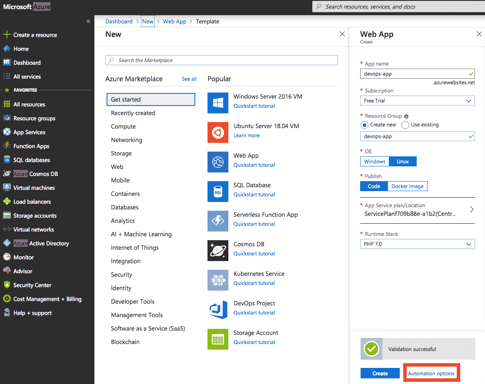

在页面底部，**创建**按钮旁边有一个**自动化选项**按钮。如果我们点击它，会看到资源模板自动创建。如果我们点击**部署**，将显示模板定义的自定义参数。目前，我们直接点击**创建**。以下是资源模板的截图：

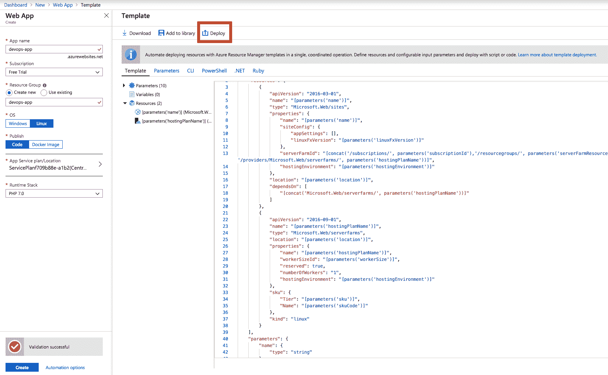

点击**创建**后，控制台会将我们带到以下视图供我们探索。让我们去查看我们刚刚创建的资源组 `devops-app`，它位于**最近资源**标签下：

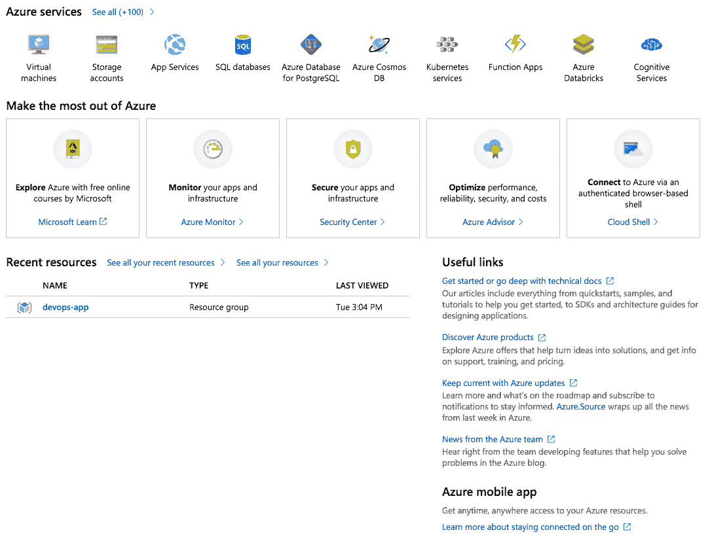

在这个资源组中，我们可以看到在应用服务中运行着一个应用程序和一个服务计划。我们还可以在侧边栏中看到许多功能。资源组的目的是为用户提供一组资源的全面视图，因此我们无需进入不同的控制台去查找它们：


如果我们点击 `devops-app` 资源组，它将带我们进入应用服务控制台，这是 Azure 提供的 PaaS 服务：

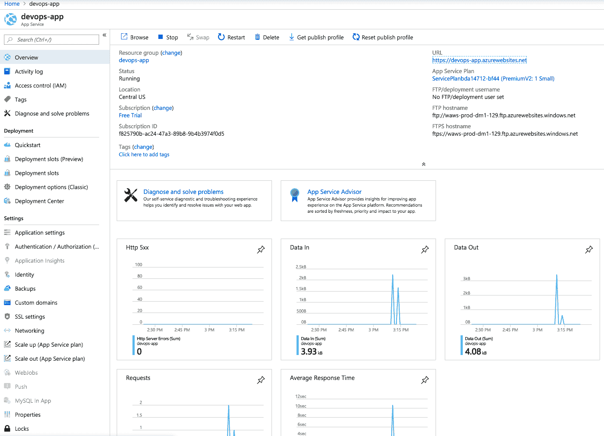

此时，示例 Web 应用已部署到 Azure 应用服务。如果我们访问 URL 中指定的端点（在此案例中为 [`devops-app.azurewebsites.net/`](https://devops-app.azurewebsites.net/)），我们就能找到它：

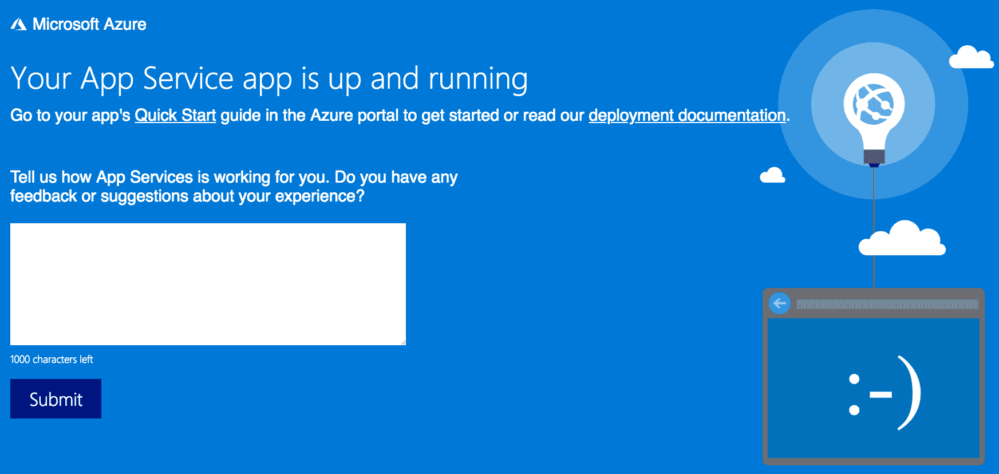

我们还可以上传自己的 Web 应用，或者与我们的版本控制软件（如 GitHub 或 Bitbucket）集成，并通过 Azure 构建完整的流水线。有关更多信息，请访问部署中心页面 ([`docs.microsoft.com/en-us/azure/app-service/deploy-continuous-deployment`](https://docs.microsoft.com/en-us/azure/app-service/deploy-continuous-deployment))。

我们还可以在资源组控制台中轻松删除资源组：

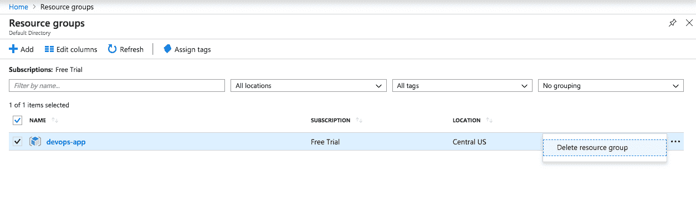

确认后，相关资源将被清理：

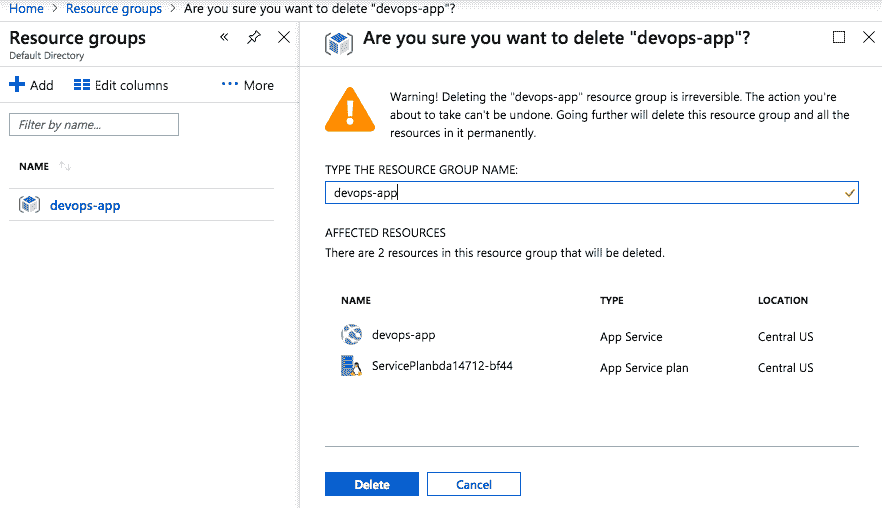

# Azure 虚拟网络

Azure **虚拟网络**（**VNet**）在 Azure 中创建一个隔离的私有网络段。这个概念类似于 AWS 和 GCP 中的 VPC。用户指定一系列连续的 IP（即 CIDR：[`en.wikipedia.org/wiki/Classless_Inter-Domain_Routing`](https://en.wikipedia.org/wiki/Classless_Inter-Domain_Routing)）和位置（在 AWS 中也称为区域）。我们可以在[`azure.microsoft.com/global-infrastructure/locations/`](https://azure.microsoft.com/global-infrastructure/locations/)找到完整的区域列表。我们还可以在虚拟网络中创建多个子网，或者在创建时启用 Azure 防火墙。Azure 防火墙是一个具有高可用性和可扩展性的网络安全服务。它可以使用用户指定的规则来控制和过滤流量，并提供入站 DNAT 和出站 SNAT 支持。根据你使用的平台，你可以通过以下链接的说明安装 Azure CLI（相关文档可以在这里找到：[`docs.microsoft.com/en-us/cli/azure/?view=azure-cli-latest`](https://docs.microsoft.com/en-us/cli/azure/?view=azure-cli-latest)）：[`docs.microsoft.com/en-us/cli/azure/install-azure-cli?view=azure-cli-latest`](https://docs.microsoft.com/en-us/cli/azure/install-azure-cli?view=azure-cli-latest)。另外，你也可以直接使用云壳（[`shell.azure.com/`](https://shell.azure.com/)）。Azure 云壳是一个基于云的管理壳，内置了 Azure CLI，你可以用它来管理你的云资源。

在以下示例中，我们将演示如何使用 Azure CLI 通过 Azure 云壳创建一个 Azure 虚拟网络。只需登录你的帐户并附加云存储以持久化数据。然后，我们就可以开始了：

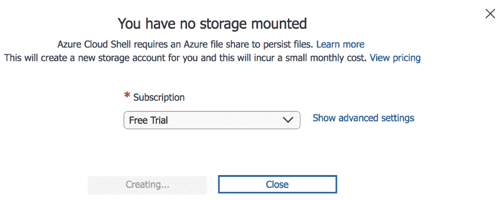

点击“创建”按钮并等待几秒钟后，云壳控制台将在你的浏览器中启动：

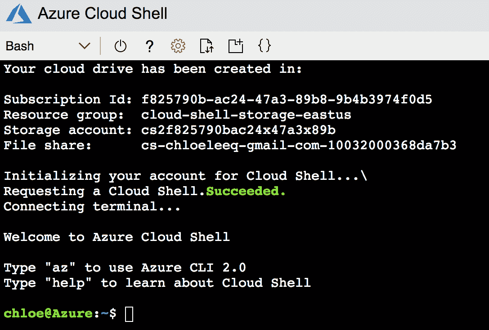

Azure CLI 命令以`az`作为组名。你可以输入`az --help`来查看子组列表，或随时使用`az $subgroup_name --help`来查找有关子组子命令的更多信息。一个子组可能包含多个子组。在命令的末尾是你要对资源执行的操作以及配置参数集。其形式如下：

```
# az $subgroup1 [$subgroup2 ...] $commands [$parameters]
```

在以下示例中，我们将创建一个名为`devops-vnet`的虚拟网络。首先，我们需要创建一个新的资源组，因为在前一部分我们删除了唯一的资源组。现在，让我们在美国中部地区创建一个名为`devops`的资源组：

```
# az group create --name devops --location centralus
{
 "id": "/subscriptions/f825790b-ac24-47a3-89b8-9b4b3974f0d5/resourceGroups/devops",
 "location": "centralus",
 "managedBy": null,
 "name": "devops",
 "properties": {
 "provisioningState": "Succeeded"
 },
 "tags": null
}
```

在前面的命令中，子组名称是`group`，操作命令是`create`。接下来，我们将使用`network.vnet`子组来创建我们的虚拟网络资源，CIDR 为`10.0.0.0/8`，其余设置保持默认值：

```
# az network vnet create --name devops-vnet --resource-group devops --subnet-name default --address-prefixes 10.0.0.0/8
{
 "newVNet": {
 "addressSpace": {
 "addressPrefixes": [
 "10.0.0.0/8"
 ]
 },
 "ddosProtectionPlan": null,
 "dhcpOptions": {
 "dnsServers": []
 },
 "enableDdosProtection": false,
 "enableVmProtection": false,
 "etag": "W/\"a93c56be-6eab-4391-8fca-25e11625c6e5\"",
 "id": "/subscriptions/f825790b-ac24-47a3-89b8-9b4b3974f0d5/resourceGroups/devops/providers/Microsoft.Network/virtualNetworks/devops-vnet",
 "location": "centralus",
 "name": "devops-vnet",
 "provisioningState": "Succeeded",
 "resourceGroup": "devops",
 "resourceGuid": "f5b9de39-197c-440f-a43f-51964ee9e252",
 "subnets": [
 {
 "addressPrefix": "10.0.0.0/24",
 "addressPrefixes": null,
 "delegations": [],
 "etag": "W/\"a93c56be-6eab-4391-8fca-25e11625c6e5\"",
 "id": "/subscriptions/f825790b-ac24-47a3-89b8-9b4b3974f0d5/resourceGroups/devops/providers/Microsoft.Network/virtualNetworks/devops-vnet/subnets/default",
 "interfaceEndpoints": null,
 "ipConfigurationProfiles": null,
 "ipConfigurations": null,
 "name": "default",
 "networkSecurityGroup": null,
 "provisioningState": "Succeeded",
 "purpose": null,
 "resourceGroup": "devops",
 "resourceNavigationLinks": null,
 "routeTable": null,
 "serviceAssociationLinks": null,
 "serviceEndpointPolicies": null,
 "serviceEndpoints": null,
 "type": "Microsoft.Network/virtualNetworks/subnets"
 }
 ],
 "tags": {},
 "type": "Microsoft.Network/virtualNetworks",
 "virtualNetworkPeerings": []
 }
}
```

我们始终可以使用 `az` 的 `list` 命令查看我们的设置列表，例如 `az network vnet list`，或者进入 Azure 门户查看：

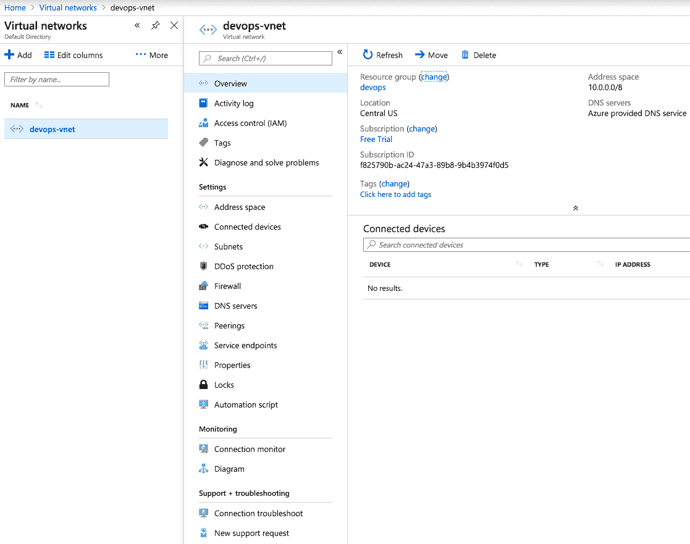

# 网络安全组

网络安全组与虚拟网络关联，并包含一组安全规则。安全规则定义了子网或虚拟机的入站和出站流量的策略。使用网络安全组，用户可以定义是否允许入站流量访问组的资源，以及是否允许出站流量。安全规则包含以下内容：

+   优先级（范围从 100 到 4096；数字越小，优先级越高）

+   一个源或目标（CIDR 块、一组 IP 地址或另一个安全组）

+   一种协议（TCP/UDP/ICMP）

+   一个方向（入站/出站）

+   一个端口范围

+   一项操作（允许/拒绝）

让我们创建一个名为 `test-nsg` 的网络安全组。请注意，用户定义的规则会在安全组创建后附加：

```
# az network nsg create --name test-nsg --resource-group devops --location centralus
{
 "NewNSG": {
 "defaultSecurityRules": [
 {
 "access": "Allow",
 "description": "Allow inbound traffic from all VMs in VNET",
 "destinationAddressPrefix": "VirtualNetwork",
 "name": "AllowVnetInBound",
 "priority": 65000,
 "sourceAddressPrefix": "VirtualNetwork",
 ...
 "type": "Microsoft.Network/networkSecurityGroups/defaultSecurityRules"
 },
 {
 "access": "Allow",
 "description": "Allow inbound traffic from azure load balancer",
 "destinationAddressPrefix": "*",
 "name": "AllowAzureLoadBalancerInBound",
 "priority": 65001,
 "sourceAddressPrefix": "AzureLoadBalancer",
 ...
 "type": "Microsoft.Network/networkSecurityGroups/defaultSecurityRules"
 },
 {
 "access": "Deny",
 "description": "Deny all inbound traffic",
 "destinationAddressPrefix": "*",
 "name": "DenyAllInBound",
 "priority": 65500,
 "sourceAddressPrefix": "*",
 ...
 "type": "Microsoft.Network/networkSecurityGroups/defaultSecurityRules"
 },
 {
 "access": "Allow",
 "description": "Allow outbound traffic from all VMs to all VMs in VNET",
 "destinationAddressPrefix": "VirtualNetwork",
 "name": "AllowVnetOutBound",
 "priority": 65000,
 "sourceAddressPrefix": "VirtualNetwork",
 ...
 "type": "Microsoft.Network/networkSecurityGroups/defaultSecurityRules"
 },
 {
 "access": "Allow",
 "description": "Allow outbound traffic from all VMs to Internet",
 "destinationAddressPrefix": "Internet",
 "name": "AllowInternetOutBound",
 "priority": 65001,
 "sourceAddressPrefix": "*",
 ...
 "type": "Microsoft.Network/networkSecurityGroups/defaultSecurityRules"
 },
 {
 "access": "Deny",
 "description": "Deny all outbound traffic",
 "destinationAddressPrefix": "*",
 "name": "DenyAllOutBound",
 "priority": 65500,
 "sourceAddressPrefix": "*",
 ...
 "type": "Microsoft.Network/networkSecurityGroups/defaultSecurityRules"
 }
 ],
 "id": "...test-nsg",
 "location": "centralus",
 "name": "test-nsg",
 "networkInterfaces": null,
 "provisioningState": "Succeeded",
 "resourceGroup": "devops",
 "resourceGuid": "9e0e3d0f-e99f-407d-96a6-8e96cf99ecfc",
 "securityRules": [],
 "subnets": null,
 "tags": null,
 "type": "Microsoft.Network/networkSecurityGroups"
 }
}
```

我们发现，Azure 为每个网络安全组创建了一组默认规则。默认情况下，它拒绝所有入站流量，并允许出站流量访问。我们可以看到，源和目标不能是 CIDR 块，而必须是类似 `VirtualNetwork` 这样的服务标签。这些服务标签实际上是一组预定义的 IP 地址前缀。Azure 管理这些服务标签并每周发布。你可以在 Microsoft 下载中心找到已发布的服务标签（[`www.microsoft.com/en-us/download/details.aspx?id=56519`](https://www.microsoft.com/en-us/download/details.aspx?id=56519)）：

| **方向** | **优先级** | **源** | **源端口** | **目标** | **目标端口** | **协议** | **访问** |
| --- | --- | --- | --- | --- | --- | --- | --- |
| 入站 | `65000` | `VirtualNetwork` | `0`-`65535` | `VirtualNetwork` | `0`-`65535` | 所有 | 允许 |
| 入站 | `65001` | `AzureLoadBalancer` | `0`-`65535` | `0.0.0.0/0` | `0`-`65535` | 所有 | 允许 |
| 入站 | `65500` | `0.0.0.0/0` | `0`-`65535` | `0.0.0.0/0` | `0`-`65535` | 所有 | 拒绝 |
| 出站 | `65000` | `VirtualNetwork` | `0`-`65535` | `VirtualNetwork` | `0`-`65535` | 所有 | 允许 |
| 出站 | `0.0.0.0/0` | `0-65535` | `0`-`65535` | `Internet` | `0`-`65535` | 所有 | 允许 |
| 出站 | `0.0.0.0/0` | `0-65535` | `0`-`65535` | `0.0.0.0/0` | `0`-`65535` | 所有 | 拒绝 |

现在我们可以创建一个接受所有规则并具有最高优先级的网络安全组，并将其附加到我们刚刚创建的 NSG 上：

```
# az network nsg rule create --name test-nsg --priority 100 --resource-group devops --nsg-name test-nsg
{
 "access": "Allow",
 "description": null,
 "destinationAddressPrefix": "*",
 "destinationAddressPrefixes": [],
 "destinationApplicationSecurityGroups": null,
 "destinationPortRange": "80",
 "destinationPortRanges": [],
 "direction": "Inbound",
 "etag": "W/\"65e33e31-ec3c-4eea-8262-1cf5eed371b1\"",
 "id": "/subscriptions/.../resourceGroups/devops/providers/Microsoft.Network/networkSecurityGroups/test-nsg/securityRules/test-nsg",
 "name": "test-nsg",
 "priority": 100,
 "protocol": "*",
 "provisioningState": "Succeeded",
 "resourceGroup": "devops",
 "sourceAddressPrefix": "*",
 "sourceAddressPrefixes": [],
 "sourceApplicationSecurityGroups": null,
 "sourcePortRange": "*",
 "sourcePortRanges": [],
 "type": "Microsoft.Network/networkSecurityGroups/securityRules"
}
```

# 应用安全组

应用安全组是虚拟机 NIC 的逻辑集合，可以作为网络安全组规则中的源或目标。它们使网络安全组更加灵活。例如，假设我们有两个虚拟机，它们将通过 `5432` 端口访问 PostgreSQL 数据库。我们希望确保只有这些虚拟机可以访问数据库：

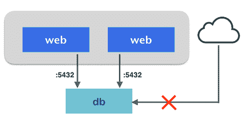

我们可以创建两个应用安全组，分别命名为 `web` 和 `db`。然后，将虚拟机加入 web 组，将数据库加入 db 组，并创建以下网络安全组规则：

| **方向** | **优先级** | **源** | **源端口** | **目标** | **目标端口** | **协议** | **访问** |
| --- | --- | --- | --- | --- | --- | --- | --- |
| 入站 | 120 | * | * | `db` | `0`-`65535` | 所有 | 拒绝 |
| 入站 | 110 | `web` | * | `db` | `5432` | TCP | 允许 |

根据此表，第二条规则的优先级高于第一条。只有 web 组可以访问 db 组的端口 `5432`。所有其他入站流量将被拒绝。

# 子网

子网可以关联到网络安全组。子网也可以关联到路由表，以便拥有特定的路由。

和 AWS 一样，Azure 也提供路由表资源来进行路由管理。默认情况下，Azure 已经为虚拟网络和子网提供了默认路由。我们在使用 AKS 服务时无需担心路由问题。

创建虚拟网络时，默认会创建一个 `default` 子网：

```
# az network vnet subnet list --vnet-name devops-vnet --resource-group devops
[
 {
 "addressPrefix": "10.0.0.0/24",
 "addressPrefixes": null,
 "delegations": [],
 "etag": "W/\"a93c56be-6eab-4391-8fca-25e11625c6e5\"",
 "id": "/subscriptions/f825790b-ac24-47a3-89b8-9b4b3974f0d5/resourceGroups/devops/providers/Microsoft.Network/virtualNetworks/devops-vnet/subnets/default",
 "interfaceEndpoints": null,
 "ipConfigurationProfiles": null,
 "ipConfigurations": null,
 "name": "default",
 "networkSecurityGroup": null,
 "provisioningState": "Succeeded",
 "purpose": null,
 "resourceGroup": "devops",
 "resourceNavigationLinks": null,
 "routeTable": null,
 "serviceAssociationLinks": null,
 "serviceEndpointPolicies": null,
 "serviceEndpoints": null,
 "type": "Microsoft.Network/virtualNetworks/subnets"
 }
]
```

除了默认子网，我们再创建一个子网，前缀为`10.0.1.0/24`。请注意，子网的 CIDR 需要与所在虚拟网络的 CIDR 前缀相同：

```
# az network vnet subnet create --address-prefixes 10.0.1.0/24 --name test --vnet-name devops-vnet --resource-group devops
{
 "addressPrefix": "10.0.1.0/24",
 "addressPrefixes": null,
 "delegations": [],
 "etag": "W/\"9f7e284f-fd31-4bd3-ad09-f7dc75bb7c68\"",
 "id": "/subscriptions/f825790b-ac24-47a3-89b8-9b4b3974f0d5/resourceGroups/devops/providers/Microsoft.Network/virtualNetworks/devops-vnet/subnets/test",
 "interfaceEndpoints": null,
 "ipConfigurationProfiles": null,
 "ipConfigurations": null,
 "name": "test",
 "networkSecurityGroup": null,
 "provisioningState": "Succeeded",
 "purpose": null,
 "resourceGroup": "devops",
 "resourceNavigationLinks": null,
 "routeTable": null,
 "serviceAssociationLinks": null,
 "serviceEndpointPolicies": null,
 "serviceEndpoints": null,
 "type": "Microsoft.Network/virtualNetworks/subnets"
}
```

现在我们可以列出这个虚拟网络中的子网：

```
# az network vnet subnet list --vnet-name devops-vnet --resource-group devops | jq .[].name
"default"
"test"
```

`jq` ([`stedolan.github.io/jq/`](https://stedolan.github.io/jq/))：

`jq` 是一个 JSON 命令行处理工具，默认安装在云端 shell 中。它是一个非常方便的工具，可以列出 JSON 输出中的所需字段。如果您不熟悉 `jq`，可以查看以下链接的手册：[`stedolan.github.io/jq/manual/`](https://stedolan.github.io/jq/manual/)。

# Azure 虚拟机

**虚拟机** (**VM**) 在 Azure 中类似于 Amazon EC2。要启动实例，我们需要知道要启动的 VM 镜像。我们可以使用 `az vm image list` 命令列出可用的镜像。在以下示例中，我们将使用 CentOS 镜像：

```
# az vm image list --output table
You are viewing an offline list of images, use --all to retrieve an up-to-date list
Offer Publisher Sku Urn UrnAlias Version
------------- ---------------------- ------------------ -----------------------------------------
CentOS OpenLogic 7.5 OpenLogic:CentOS:7.5:latest CentOS latest
CoreOS CoreOS Stable CoreOS:CoreOS:Stable:latest CoreOS latest
Debian credativ 8 credativ:Debian:8:latest Debian latest
openSUSE-Leap SUSE 42.3 SUSE:openSUSE-Leap:42.3:latest openSUSE-Leap latest
RHEL RedHat 7-RAW RedHat:RHEL:7-RAW:latest RHEL latest
SLES SUSE 12-SP2 SUSE:SLES:12-SP2:latest SLES latest
UbuntuServer Canonical 16.04-LTS Canonical:UbuntuServer:16.04-LTS:latest UbuntuLTS latest
WindowsServer MicrosoftWindowsServer 2019-Datacenter MicrosoftWindowsServer:WindowsServer:2019-Datacenter:latest Win2019Datacenter latest
WindowsServer MicrosoftWindowsServer 2016-Datacenter MicrosoftWindowsServer:WindowsServer:2016-Datacenter:latest Win2016Datacenter latest
WindowsServer MicrosoftWindowsServer 2012-R2-Datacenter MicrosoftWindowsServer:WindowsServer:2012-R2-Datacenter:latest Win2012R2Datacenter latest
WindowsServer MicrosoftWindowsServer 2012-Datacenter MicrosoftWindowsServer:WindowsServer:2012-Datacenter:latest Win2012Datacenter latest
WindowsServer MicrosoftWindowsServer 2008-R2-SP1 MicrosoftWindowsServer:WindowsServer:2008-R2-SP1:latest Win2008R2SP1 latest
```

然后，我们可以使用 `az vm create` 来启动我们的虚拟机。指定 `--generate-ssh-keys` 将为您生成一个 SSH 密钥：

```
# az vm create --resource-group devops --name newVM --image CentOS --admin-username centos-user --generate-ssh-keys
SSH key files '/home/chloe/.ssh/id_rsa' and '/home/chloe/.ssh/id_rsa.pub' have been generated under ~/.ssh to allow SSH access to the VM. If using machines without permanent storage, back up your keys to a safelocation.
 - Running ..
{
 "fqdns": "",
 "id": "/subscriptions/f825790b-ac24-47a3-89b8-9b4b3974f0d5/resourceGroups/devops/providers/Microsoft.Compute/virtualMachines/newVM",
 "location": "centralus",
 "macAddress": "00-0D-3A-96-6B-A2",
 "powerState": "VM running",
 "privateIpAddress": "10.0.0.4",
 "publicIpAddress": "40.77.97.79",
 "resourceGroup": "devops",
 "zones": ""
}
```

我们可以看到新创建的虚拟机的 `publicIpAddress` 是 `40.77.97.79`。让我们用之前指定的用户名连接它：

```
# ssh centos-user@40.77.97.79
The authenticity of host '40.77.97.79 (40.77.97.79)' can't be established.
ECDSA key fingerprint is SHA256:LAvnQH94bY7NaIoNgDLM5iMHT1LMRseFwu2HPqicTuo.
Are you sure you want to continue connecting (yes/no)? yes
Warning: Permanently added '40.77.97.79' (ECDSA) to the list of known hosts.
[centos-user@newVM ~]$
```

不适合总是允许 SSH 访问实例。让我们来看一下如何解决这个问题。首先，我们需要了解附加到这个虚拟机的网络接口：

```
# az vm get-instance-view --name newVM --resource-group devops
{
 ...
 "networkProfile": {
 "networkInterfaces": [
 {
 "id": "/subscriptions/f825790b-ac24-47a3-89b8-9b4b3974f0d5/resourceGroups/devops/providers/Microsoft.Network/networkInterfaces/newVMVMNic",
 "primary": null,
 "resourceGroup": "devops"
 }
 ]
 },
 ...
}
```

找到 NIC 的 `id` 后，我们可以根据 NIC ID 查找关联的网络安全组：

```
# az network nic show --ids /subscriptions/f825790b-ac24-47a3-89b8-9b4b3974f0d5/resourceGroups/devops/providers/Microsoft.Network/networkInterfaces/newVMVMNic | jq .networkSecurityGroup
{
 "defaultSecurityRules": null,
 "etag": null,
 "id": "/subscriptions/f825790b-ac24-47a3-89b8-9b4b3974f0d5/resourceGroups/devops/providers/Microsoft.Network/networkSecurityGroups/newVMNSG",
 "location": null,
 "name": null,
 "networkInterfaces": null,
 "provisioningState": null,
 "resourceGroup": "devops",
 "resourceGuid": null,
 "securityRules": null,
 "subnets": null,
 "tags": null,
 "type": null
}

```

在这里，我们可以看到 NSG 的名称是 `newVMNSG`。让我们列出附加到这个 NSG 的规则：

```
# az network nsg rule list --resource-group devops --nsg-name newVMNSG
[
 {
 "access": "Allow",
 "description": null,
 "destinationAddressPrefix": "*",
 "destinationAddressPrefixes": [],
 "destinationApplicationSecurityGroups": null,
 "destinationPortRange": "22",
 "destinationPortRanges": [],
 "direction": "Inbound",
 "etag": "W/\"9ab6b2d7-c915-4abd-9c02-a65049a62f02\"",
 "id": "/subscriptions/f825790b-ac24-47a3-89b8-9b4b3974f0d5/resourceGroups/devops/providers/Microsoft.Network/networkSecurityGroups/newVMNSG/securityRules/default-allow-ssh",
 "name": "default-allow-ssh",
 "priority": 1000,
 "protocol": "Tcp",
 "provisioningState": "Succeeded",
 "resourceGroup": "devops",
 "sourceAddressPrefix": "*",
 "sourceAddressPrefixes": [],
 "sourceApplicationSecurityGroups": null,
 "sourcePortRange": "*",
 "sourcePortRanges": [],
 "type": "Microsoft.Network/networkSecurityGroups/securityRules"
 }
]
```

有一条 `default-allow-ssh` 规则，ID 为 `/subscriptions/f825790b-ac24-47a3-89b8-9b4b3974f0d5/resourceGroups/devops/providers/Microsoft.Network/networkSecurityGroups/newVMNSG/securityRules/default-allow-ssh`，附加在 NSG 上。我们将删除它：

```
# az network nsg rule delete --ids "/subscriptions/f825790b-ac24-47a3-89b8-9b4b3974f0d5/resourceGroups/devops/providers/Microsoft.Network/networkSecurityGroups/newVMNSG/securityRules/default-allow-ssh"
```

一旦我们删除规则，就无法通过 SSH 访问虚拟机：

```
# ssh centos-user@40.77.97.79
...
```

# 存储帐户

存储帐户是 Azure 存储解决方案提供的存储对象的容器，如文件、表格和磁盘。用户可以根据使用情况创建一个或多个存储帐户。

存储帐户有三种类型：

+   通用 v2 帐户

+   通用 v1 帐户

+   Blob 存储帐户

v1 是旧版的存储帐户类型，Blob 存储帐户仅允许使用 Blob 存储。v2 帐户是目前 Azure 中最推荐的帐户类型。

# 负载均衡器

Azure 中负载均衡器的功能类似于其他公有云提供的负载均衡服务，用于将流量路由到后端。它们还会对端点进行健康检查，如果发现后端不健康，会断开连接。Azure 负载均衡器与其他负载均衡器的主要区别在于，Azure 负载均衡器可以拥有多个 IP 地址和多个端口。这意味着当创建新的负载均衡服务时，AKS 不需要创建新的负载均衡器，而是会在负载均衡器中创建一个新的前端 IP。

# Azure 磁盘

Azure 磁盘有两种类型：托管磁盘和非托管磁盘。在使用 Azure 托管磁盘之前，用户必须创建存储帐户来使用非托管磁盘。一个存储帐户可能会超出可扩展性目标（[`docs.microsoft.com/en-us/azure/storage/common/storage-scalability-targets`](https://docs.microsoft.com/en-us/azure/storage/common/storage-scalability-targets)），从而影响 I/O 性能。使用托管磁盘时，我们不需要自己创建存储帐户；Azure 会在后台管理这些帐户。托管磁盘有不同类型的性能级别：标准 HDD 磁盘、标准 SSD 磁盘和高性能 SSD 磁盘。HDD 磁盘（[`en.wikipedia.org/wiki/Hard_disk_drive`](https://en.wikipedia.org/wiki/Hard_disk_drive)）是一种成本效益较高的选择，而 SSD 磁盘（[`en.wikipedia.org/wiki/Solid-state_drive`](https://en.wikipedia.org/wiki/Solid-state_drive)）性能更佳。对于 I/O 密集型工作负载，高性能 SSD 是最佳选择。使用高性能 SSD 磁盘附加到虚拟机时，虚拟机的磁盘 IOPS 可达到 80,000，磁盘吞吐量可达 2,000 MB/s。Azure 磁盘还提供四种类型的复制：

+   **本地冗余存储 (LRS)**：数据仅保存在一个单独的区域

+   **区域冗余存储 (ZRS)**：数据跨三个区域持久化

+   **地理冗余存储 (GRS)**：跨区域复制

+   **读取访问地理冗余存储 (RA-GRS)**：跨区域复制与读取副本

# Azure Kubernetes 服务

Azure Kubernetes 服务是 Azure 中的托管 Kubernetes 服务。一个集群包含一组节点（例如 Azure 虚拟机）。就像普通的 Kubernetes 节点一样，kube-proxy 和 kubelet 会安装在节点上。kube-proxy 与 Azure 虚拟 NIC 通信，管理服务和 Pod 的进出路由。kubelet 接收来自主节点的请求，调度 Pod，并报告指标。在 Azure 中，我们可以将各种 Azure 存储选项（如 Azure 磁盘和 Azure 文件）挂载为 **持久卷**（**PV**），用于持久化容器的数据。下面是该示例的说明：

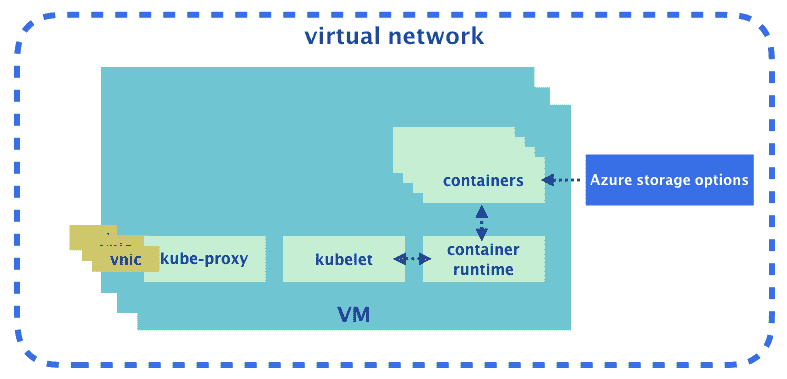

想从头开始构建集群吗？

如果你更倾向于自己搭建一个集群，请务必查看 AKS-engine 项目（[`github.com/Azure/aks-engine`](https://github.com/Azure/aks-engine)），该项目通过 Azure 资源管理器在 Azure 中构建 Kubernetes 基础设施。

# 设置你的第一个 Kubernetes 集群在 AKS 上

一个 AKS 集群可以在其自己的 VPC（基本网络配置）中启动，或在现有的 VPC（高级网络配置）中启动；两者都可以通过 Azure CLI 启动。我们可以在创建集群时指定一组参数，其中包括以下内容：

| **参数** | **描述** |
| --- | --- |
| `--name` | 集群名称。 |
| `--enable-addons` | 启用 Kubernetes 附加组件模块，并以逗号分隔的列表形式提供。 |
| `--generate-ssh-keys` | 如果 SSH 密钥文件不存在，则生成 SSH 密钥文件。 |
| `--node-count` | 节点的数量。默认值为三个。 |
| `--network-policy` | （预览版）启用或禁用网络策略。默认值为禁用。 |
| `--vnet-subnet-id` | 在 VNet 中部署集群的子网 ID。 |
| `--node-vm-size` | 虚拟机的大小。默认值为 `Standard_DS2_v2`。 |
| `--service-cidr` | 从中分配服务集群 IP 的 CIDR 表示法 IP 范围。 |
| `--max-pods` | 默认值为 `110`，或者对于高级网络配置（使用现有的 VNet）为 `30`。 |

在以下示例中，我们将首先创建一个包含两个节点的集群，并启用用于监控的 `addons` 以启用 Azure 监控，此外还启用 `http_application_routing` 以为入口启用 HTTP 应用程序路由：

```
// create an AKS cluster with two nodes
# az aks create --resource-group devops --name myAKS --node-count 2 --enable-addons monitoring,http_application_routing --generate-ssh-keys
Running...
# az aks list --resource-group devops
[
 {  
  "aadProfile":null,
  "addonProfiles":{  
    "httpApplicationRouting":{  
      "config":{  
        "HTTPApplicationRoutingZoneName":"cef42743fd964970b357.centralus.aksapp.io"
      },
      "enabled":true
    },
    "omsagent":{  
      "config":{  
        "logAnalyticsWorkspaceResourceID":...
      },
      "enabled":true
    }
  },
  "agentPoolProfiles":[  
    {  
      "count":2,
      "maxPods":110,
      "name":"nodepool1",
      "osDiskSizeGb":30,
      "osType":"Linux",
      "storageProfile":"ManagedDisks",
      "vmSize":"Standard_DS2_v2"
    }
  ],
  "dnsPrefix":"myAKS-devops-f82579",
  "enableRbac":true,
  "fqdn":"myaks-devops-f82579-077667ba.hcp.centralus.azmk8s.io",
  "id":"/subscriptions/f825790b-ac24-47a3-89b8-9b4b3974f0d5/resourcegroups/devops/providers/Microsoft.ContainerService/managedClusters/myAKS",
  "kubernetesVersion":"1.9.11",
  "linuxProfile":{  
    "adminUsername":"azureuser",
    "ssh":{  
      "publicKeys":[  
        {  
          "keyData":"ssh-rsa xxx"
        }
      ]
    }
  },
  "location":"centralus",
  "name":"myAKS",
  "networkProfile":{  
    "dnsServiceIp":"10.0.0.10",
    "dockerBridgeCidr":"172.17.0.1/16",
    "networkPlugin":"kubenet",
    "networkPolicy":null,
    "podCidr":"10.244.0.0/16",
    "serviceCidr":"10.0.0.0/16"
  },
  "nodeResourceGroup":"MC_devops_myAKS_centralus",
  "provisioningState":"Succeeded",
  "resourceGroup":"devops",
  "servicePrincipalProfile":{  
    "clientId":"db016e5d-b3e5-4e22-a844-1dad5d16fec1"
  },
  "type":"Microsoft.ContainerService/ManagedClusters"
}
]
```

集群启动后，我们可以使用 get-credentials 子命令来配置我们的 `kubeconfig`。上下文名称将是集群名称，在此情况下为 `myAKS`：

```
// configure local kubeconfig to access the cluster
# az aks get-credentials --resource-group devops --name myAKS
Merged "myAKS" as current context in /home/chloe/.kube/config

// check current context
# kubectl config current-context
myAKS
```

让我们看看节点是否已加入集群。确保所有节点都处于 `Ready` 状态：

```
# kubectl get nodes
NAME STATUS ROLES AGE VERSION
aks-nodepool1-37748545-0 Ready agent 12m v1.9.11
aks-nodepool1-37748545-1 Ready agent 12m v1.9.11
```

让我们尝试通过我们在 `Chapter3` 中使用的示例来部署一个 `ReplicaSet`：

```
# kubectl create -f chapter3/3-2-3_Service/3-2-3_rs1.yaml
replicaset.apps/nginx-1.12 created
```

创建一个服务来访问 `ReplicaSet`。我们将使用 `chapter3/3-2-3_Service/3-2-3_service.yaml` 文件，并在 `spec` 中添加 `type: LoadBalancer` 行：

```
kind: Service
apiVersion: v1
metadata:
 name: nginx-service
spec:
 selector:
 project: chapter3
 service: web
 type: LoadBalancer
 ports:
 - protocol: TCP
 port: 80
 targetPort: 80
 name: http
```

然后我们可以查看该服务，直到 `EXTERNAL-IP` 变为外部 IP 地址。在这里，我们获得了 `40.122.78.184`：

```
// watch the external ip from <pending> to IP
# kubectl get svc --watch
NAME TYPE CLUSTER-IP EXTERNAL-IP PORT(S) AGE
kubernetes ClusterIP 10.0.0.1 <none> 443/TCP 6h
nginx-service LoadBalancer 10.0.139.13 40.122.78.184 80:31011/TCP 1m
```

让我们访问这个站点！

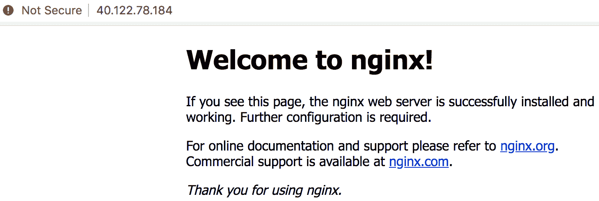

在前面的示例中，我们展示了如何将 nginx 服务部署到 AKS 并使用其负载均衡器。如果我们已经在现有的 VNet 中拥有一组资源，并且希望在该 VNet 内启动一个 AKS 集群与现有资源进行通信，该怎么办呢？那么，我们需要在 AKS 中使用高级网络配置。基本网络与高级网络的根本区别在于，基本网络使用 kubenet（[`github.com/vplauzon/aks/tree/master/aks-kubenet`](https://github.com/vplauzon/aks/tree/master/aks-kubenet)）作为网络插件，而高级网络使用 Azure CNI 插件（[`github.com/Azure/azure-container-networking/tree/master/cni`](https://github.com/Azure/azure-container-networking/tree/master/cni)）。与基本网络相比，高级网络有更多的限制。例如，节点上默认的最大 pod 数量是 30，而不是 110。这是因为 Azure CNI 仅为节点上的 NIC 配置了 30 个附加 IP 地址。Pod IP 是 NIC 上的二级 IP，因此私有 IP 被分配给在虚拟网络内部可访问的 Pods。当使用 kubenet 时，集群 IP 分配给 Pods，这些 IP 不属于虚拟网络，而是由 AKS 管理。集群 IP 无法在集群外部访问。除非你有特殊需求，比如需要从集群外部访问 pods，或希望现有资源与集群之间建立连接，否则基本网络配置应该能够满足大多数场景。

让我们看看如何创建一个具有高级网络配置的 AKS 集群。我们需要为集群指定现有的子网。首先，让我们列出之前创建的`devops-vnet`文件中的子网 ID：

```
# az network vnet subnet list --vnet-name devops-vnet --resource-group devops | jq .[].id
"/subscriptions/f825790b-ac24-47a3-89b8-9b4b3974f0d5/resourceGroups/devops/providers/Microsoft.Network/virtualNetworks/devops-vnet/subnets/default"
"/subscriptions/f825790b-ac24-47a3-89b8-9b4b3974f0d5/resourceGroups/devops/providers/Microsoft.Network/virtualNetworks/devops-vnet/subnets/test"
```

让我们使用默认子网。请注意，在高级网络配置中，一个子网只能定位一个 AKS 集群。此外，我们指定的服务 CIDR（用于分配集群 IP）不能与集群所在子网的 CIDR 重叠：

```
# az aks create --resource-group devops --name myAdvAKS --network-plugin azure --vnet-subnet-id /subscriptions/f825790b-ac24-47a3-89b8-9b4b3974f0d5/resourceGroups/devops/providers/Microsoft.Network/virtualNetworks/devops-vnet/subnets/default --service-cidr 10.2.0.0/24 --node-count 1 --enable-addons monitoring,http_application_routing --generate-ssh-keys
 - Running ..
{
 "aadProfile": null,
 "addonProfiles": {
 "httpApplicationRouting": {
 "config": {
 "HTTPApplicationRoutingZoneName": "cef42743fd964970b357.centralus.aksapp.io"
 },
 "enabled": true
 },
 "omsagent": {
 "config": {
 "logAnalyticsWorkspaceResourceID":
 },
 "enabled": true
 }
 },
 "agentPoolProfiles": [
 {
 "count": 1,
 "maxPods": 30,
 "name": "nodepool1",
...
 "vmSize": "Standard_DS2_v2"
 }
 ],
 "dnsPrefix": "myAdvAKS-devops-f82579",
 "enableRbac": true,
 "fqdn": "myadveks-devops-f82579-059d5b24.hcp.centralus.azmk8s.io",
 "id": "/subscriptions/f825790b-ac24-47a3-89b8-9b4b3974f0d5/resourcegroups/devops/providers/Microsoft.ContainerService/managedClusters/myAdvAKS",
 "kubernetesVersion": "1.9.11",
 "linuxProfile": {
 "adminUsername": "azureuser",
 "ssh": {
 "publicKeys": [
 ...
 ]
 }
 },
 "location": "centralus",
 "name": "myAdvAKS",
 "networkProfile": {
 "dnsServiceIp": "10.0.0.10",
 "dockerBridgeCidr": "172.17.0.1/16",
 "networkPlugin": "azure",
 "networkPolicy": null,
 "podCidr": null,
 "serviceCidr": "10.2.0.0/24"
 },
 "nodeResourceGroup": "MC_devops_myAdvAKS_centralus",
 "provisioningState": "Succeeded",
 "resourceGroup": "devops",
 "servicePrincipalProfile": {
 "clientId": "db016e5d-b3e5-4e22-a844-1dad5d16fec1",
 "secret": null
 },
 "tags": null,
 "type": "Microsoft.ContainerService/ManagedClusters"
}
```

记得配置`kubeconfig`：

```
# az aks get-credentials --resource-group devops --name myAdvAKS
Merged "myAdvAKS" as current context in /home/chloe/.kube/config
```

如果我们对`chapter3/3-2-3_Service/3-2-3_rs1.yaml`和`chapter3/3-2-3_Service/3-2-3_service.yaml`重复执行上述代码，我们应该能够获得相同的结果。

# 节点池

就像 GKE 一样，节点池是相同大小的虚拟机组。在撰写本书时，支持多个节点池的功能正在开发中。请关注讨论：[`github.com/Azure/AKS/issues/759`](https://github.com/Azure/AKS/issues/759)，或等待官方公告。

Azure 提供了虚拟机规模集作为其自动扩展组解决方案。在 Kubernetes 1.12 中，VMSS 支持已普遍可用。通过 VMSS，VM 可以根据 VM 指标进行扩展。欲了解更多信息，请查看官方文档：[`kubernetes.io/blog/2018/10/08/support-for-azure-vmss-cluster-autoscaler-and-user-assigned-identity/`](https://kubernetes.io/blog/2018/10/08/support-for-azure-vmss-cluster-autoscaler-and-user-assigned-identity/)。

# 集群升级

在升级集群之前，确保你的订阅有足够的资源，因为节点将通过滚动部署进行替换。额外的节点将被添加到集群中。要检查配额限制，请使用 `az vm list-usage --location $location` 命令。

让我们看看当前使用的是哪个 Kubernetes 版本：

```
# az aks show --resource-group devops --name myAKS | jq .kubernetesVersion
"1.9.11"
```

Azure CLI 提供了 `get-upgrades` 子命令，用于检查集群可以升级到哪个版本：

```
# az aks get-upgrades --name myAKS --resource-group devops
{
 "agentPoolProfiles": [
 {
 "kubernetesVersion": "1.9.11",
 "name": null,
 "osType": "Linux",
 "upgrades": [
 "1.10.8",
 "1.10.9"
 ]
 }
 ],
 "controlPlaneProfile": {
 "kubernetesVersion": "1.9.11",
 "name": null,
 "osType": "Linux",
 "upgrades": [
 "1.10.8",
 "1.10.9"
 ]
 },
 "id": "/subscriptions/f825790b-ac24-47a3-89b8-9b4b3974f0d5/resourcegroups/devops/providers/Microsoft.ContainerService/managedClusters/myAKS/upgradeprofiles/default",
 "name": "default",
 "resourceGroup": "devops",
 "type": "Microsoft.ContainerService/managedClusters/upgradeprofiles"
}
```

这显示我们可以升级到版本 1.10.8 和 1.10.9。Azure 中不允许跳过小版本，意味着我们不能从 1.9.11 升级到 1.11.x。我们必须先将集群升级到 1.10，然后再升级到 1.11。从 AKS 升级非常简单，就像从 GKE 升级一样。假设我们想要升级到 1.10.9：

```
# az aks upgrade --name myAKS --resource-group devops --kubernetes-version 1.10.9
```

操作完成后，我们可以检查集群的当前版本。集群现在已升级到所需的版本：

```
# az aks show --resource-group devops --name myAKS --output table
Name Location ResourceGroup KubernetesVersion ProvisioningState Fqdn
------ ---------- --------------- ------------------- ------------------- ----------------------------------------------------
myAKS centralus devops 1.10.9 Succeeded myaks-devops-f82579-077667ba.hcp.centralus.azmk8s.io
```

节点也应该升级到 1.10.9：

```
# kubectl get nodes
NAME STATUS ROLES AGE VERSION
aks-nodepool1-37748545-2 Ready agent 6m v1.10.9
aks-nodepool1-37748545-3 Ready agent 6m v1.10.9
```

# 监控与日志

我们在创建集群时部署了监控插件。这让我们可以通过 Azure 监控轻松观察集群度量标准和日志。让我们访问 Azure 门户中的 Kubernetes 服务。你会看到带有见解、度量标准和日志子标签的“监控”标签。

见解页面显示了集群的一般度量标准，如节点 CPU、内存使用率和节点的总体健康状况：

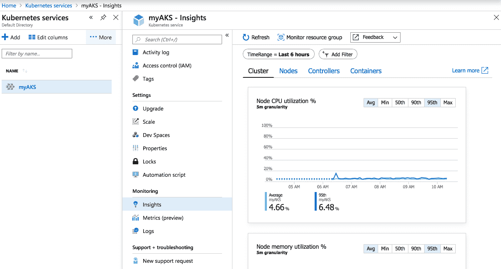

你还可以从见解中观察到容器信息：

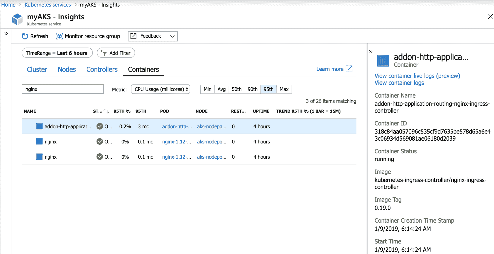

你可以在度量页面找到所有支持的资源度量标准。对于 AKS 集群，它会显示一些核心度量标准（[`kubernetes.io/docs/tasks/debug-application-cluster/core-metrics-pipeline/`](https://kubernetes.io/docs/tasks/debug-application-cluster/core-metrics-pipeline/)）。这很方便，因为它意味着我们无需启动另一个监控系统，如 Prometheus：

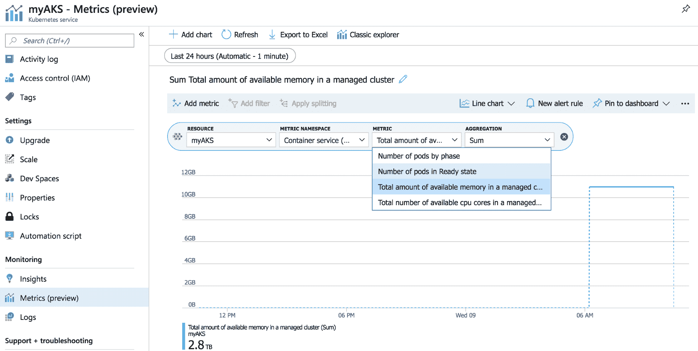

在日志页面，你可以在 Azure 日志分析中找到集群日志。你可以通过支持的语法运行查询来搜索日志。欲了解更多信息，可以参考 Azure 监控文档：[`docs.microsoft.com/en-us/azure/azure-monitor/log-query/log-query-overview`](https://docs.microsoft.com/en-us/azure/azure-monitor/log-query/log-query-overview)：

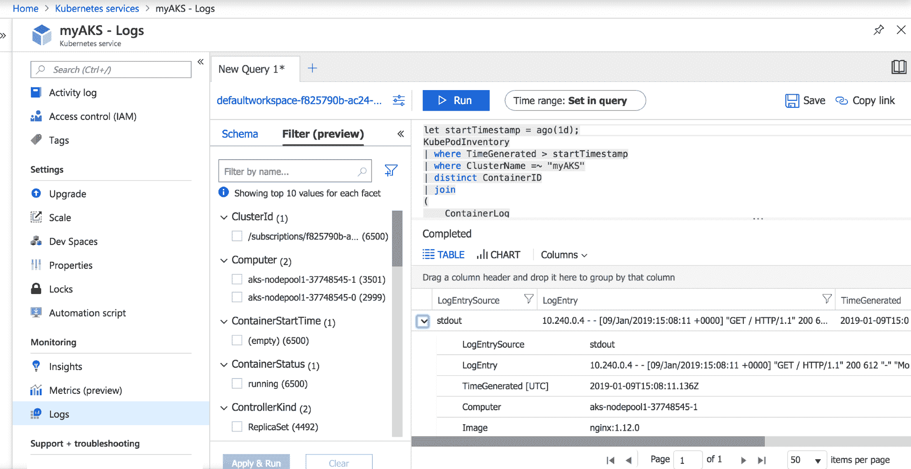

# Kubernetes 云提供商

就像其他云服务提供商一样，Azure 的云控制器管理器（[`github.com/kubernetes/cloud-provider-azure`](https://github.com/kubernetes/cloud-provider-azure)）实现了与 Kubernetes 的一系列集成。Azure 云控制器管理器与 Azure 交互，并提供无缝的用户体验。

# 基于角色的访问控制

AKS 通过 OpenID 连接令牌（[`kubernetes.io/docs/reference/access-authn-authz/authentication/#openid-connect-tokens`](https://kubernetes.io/docs/reference/access-authn-authz/authentication/#openid-connect-tokens)）与 Azure Active Directory（[`azure.microsoft.com/en-ca/services/active-directory/`](https://azure.microsoft.com/en-ca/services/active-directory/)）集成。**基于角色的访问控制**（**RBAC**）功能只能在集群创建时启用，因此我们从头开始创建一个启用 RBAC 的集群。

在创建集群之前，我们需要先在 Azure Active Directory 中准备两个应用注册。第一个作为用户组成员资格的服务器，第二个作为与 kubectl 集成的客户端。我们先进入 Azure 门户中的 Azure Active Directory 服务，进入“属性”标签并记录“目录 ID”。稍后在创建集群时我们将需要这个 ID：

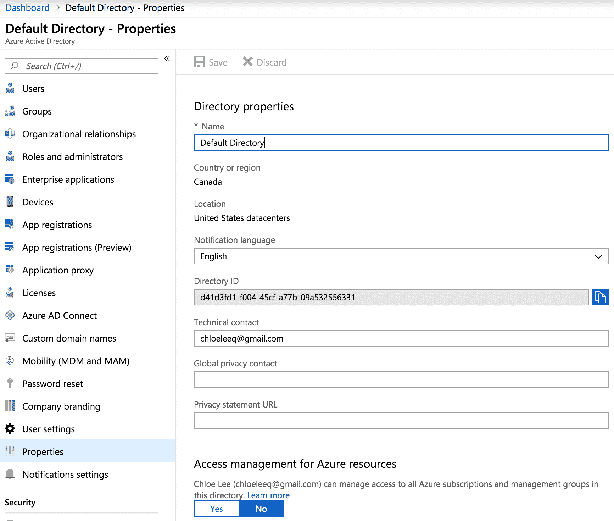

我们先进入 Azure 门户中的 Azure Active Directory 服务的应用注册页面。侧边标签显示了两个应用注册选项。一个是原始设计，另一个是新控制台的预览版本。它们的功能基本相同。我们首先展示 GA 版本，之后再展示预览版本：

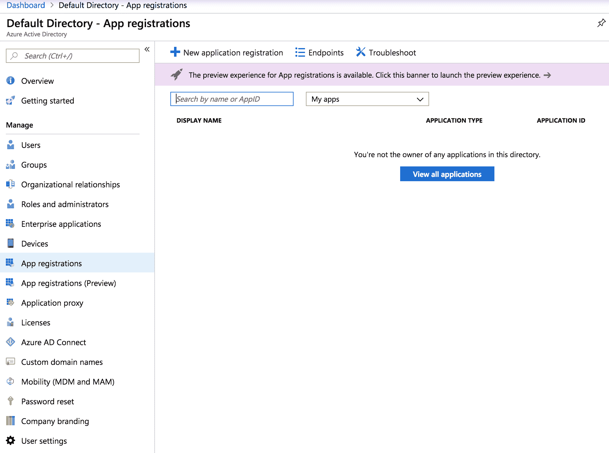

在应用注册页面，点击“新建应用注册”。添加一个名称和任何 URL。

你也可以通过 `az ad app create --display-name myAKSAD --identifier-uris http://myAKSAD` 尝试操作。

在这里，我们使用 `myAKSAD` 作为名称。创建后，首先记录 APPLICATION ID。在这里，我们得到 `c7d828e7-bca0-4771-8f9d-50b9e1ea0afc`。之后，点击清单并将 `groupMemebershipClaims` 更改为 `All`，这将使所有属于该组的用户在 JWT 令牌中获得组声明：

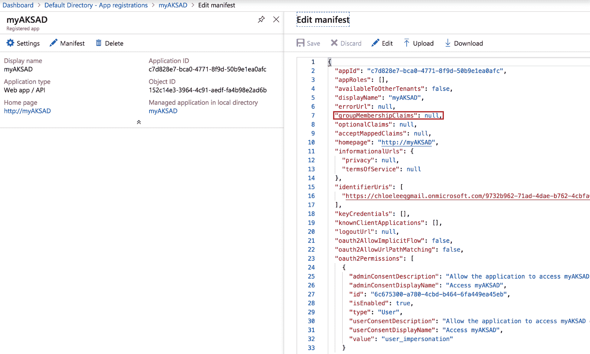

保存设置后，前往这些设置页面，然后进入密钥页面创建一个密钥。在这里，我们指定过期时间为一年。这个值是由门户网站直接生成的。稍后在创建集群时，我们将需要这个密码：

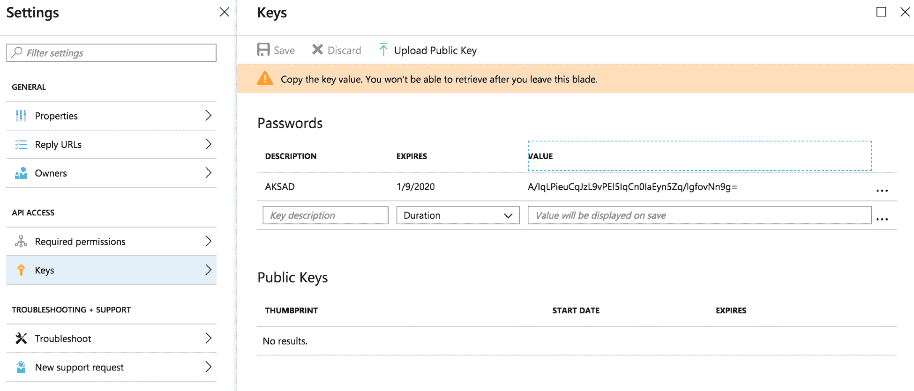

接下来，我们将为此注册定义一组应用程序和委派权限。点击“必需的权限”标签，然后点击“添加”，选择 Microsoft Graph。在这里，我们将在应用程序权限类别下选择**读取目录数据**，在委派权限下选择“登录并读取用户资料”和“读取目录数据”，这样服务器就可以读取目录数据并验证用户。点击“保存”按钮后，我们将在“必需的权限”页面看到以下界面：

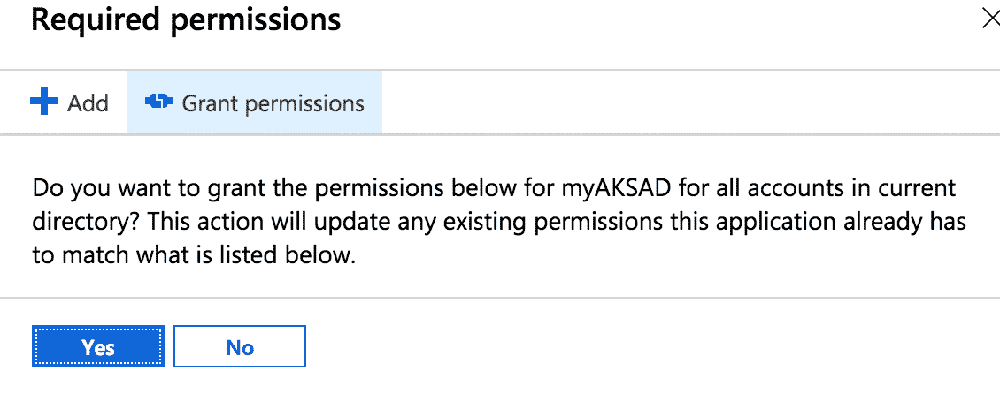

作为管理员，我们可以通过点击“授予权限”按钮为该目录中的所有用户授予权限。这将弹出一个窗口，向你再次确认。点击“是”继续。

现在是时候为客户端创建第二个应用程序注册了。我们在这里使用的名称是`myAKSADClient`。创建后记下它的应用程序 ID。这里，我们获得了`b4309673-464e-4c95-adf9-afeb27cc8d4c`：

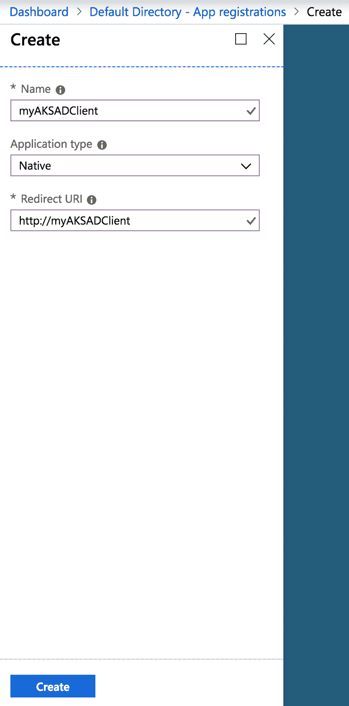

对于必需的权限，客户端只需访问应用程序，搜索委派权限，然后找到你为服务器创建的访问权限的显示名称。完成后别忘了点击“授予权限”按钮：

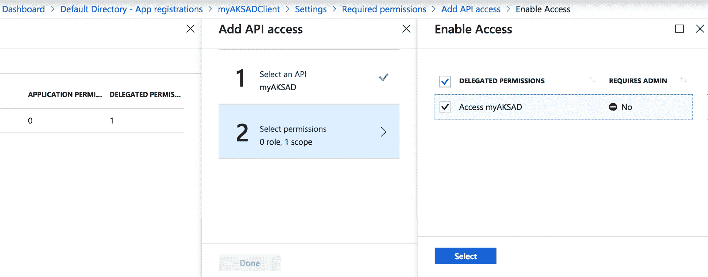

现在是时候使用 Azure AD 集成创建我们的 AKS 集群了。确保你已记录以下来自先前操作的信息：

| **我们记录的信息** | **aks create 中对应的参数** |
| --- | --- |
| 服务器应用程序 ID | `--aad-server-app-id` |
| 服务器应用程序密钥（密码） | `--aad-server-app-secret` |
| 客户端应用程序 ID | `--aad-client-app-id` |
| 目录 ID | `--aad-tenant-id` |

现在是时候启动集群了：

```
# az aks create --resource-group devops --name myADAKS --generate-ssh-keys --aad-server-app-id c7d828e7-bca0-4771-8f9d-50b9e1ea0afc --aad-server-app-secret 'A/IqLPieuCqJzL9vPEI5IqCn0IaEyn5Zq/lgfovNn9g=' --aad-client-app-id b4309673-464e-4c95-adf9-afeb27cc8d4c --aad-tenant-id d41d3fd1-f004-45cf-a77b-09a532556331 --node-count 1 --enable-addons monitoring,http_application_routing --generate-ssh-keys
```

在 Kubernetes 中，角色绑定或集群角色绑定将角色绑定到一组用户。角色或集群角色定义了一组权限。

在集群成功启动后，为了与 OpenID 集成，我们需要先创建角色绑定或集群角色绑定。在这里，我们将使用集群中现有的集群角色，即`cluster-admin`。我们将用户绑定到`cluster-admin`集群角色，以便用户可以通过身份验证并充当集群管理员：

```
// login as admin first to get the access to create the bindings
# az aks get-credentials --resource-group devops --name myADAKS --admin

// list cluster roles
# kubectl get clusterrole
NAME AGE
admin 2h
cluster-admin 2h
...
```

对于单个用户，我们需要找到用户名。你可以在 Azure AD 门户中的“用户”页面找到目标用户的对象 ID：

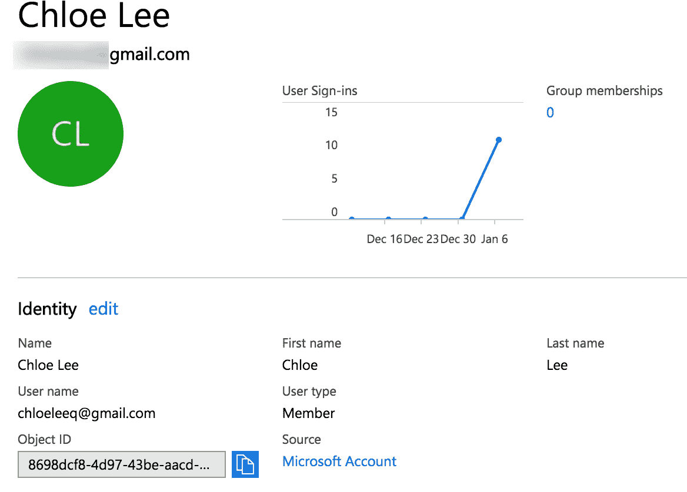

使用用户主体并指定对象 ID 作为名称，如下所示：

```
# cat 12-3_user-clusterrolebinding.yaml
apiVersion: rbac.authorization.k8s.io/v1
kind: ClusterRoleBinding
metadata:
 name: azure-user-cluster-admins
roleRef:
 apiGroup: rbac.authorization.k8s.io
 kind: ClusterRole
 name: cluster-admin
subjects:
- apiGroup: rbac.authorization.k8s.io
 kind: User
 name: "8698dcf8-4d97-43be-aacd-eca1fc1495b6"

# kubectl create -f 12-3_user-clusterrolebinding.yaml
clusterrolebinding.rbac.authorization.k8s.io/azure-user-cluster-admins created
```

之后，我们可以重新开始访问集群资源，如下所示：

```
// (optional) clean up kubeconfig if needed.
# rm -f ~/.kube/config

// setup kubeconfig with non-admin
# az aks get-credentials --resource-group devops --name myADAKS 

// try get the nodes
# kubectl get nodes
To sign in, use a web browser to open the page https://microsoft.com/devicelogin and enter the code A6798XUFB to authenticate.
```

看起来我们需要登录才能列出任何资源。请访问[`microsoft.com/devicelogin`](https://microsoft.com/devicelogin)页面并输入提示中的代码：

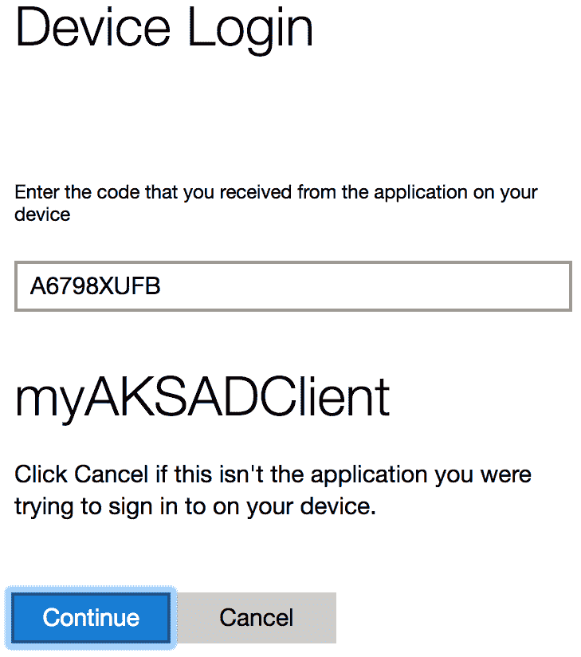

登录到你的 Microsoft 账户并返回终端，集成看起来非常棒！

```
# kubectl get nodes
To sign in, use a web browser to open the page https://microsoft.com/devicelogin and enter the code A6798XUFB to authenticate.
NAME STATUS ROLES AGE VERSION
aks-nodepool1-42766340-0 Ready agent 26m v1.9.11
```

而不是指定一组用户，你可以选择通过 Azure AD 组对象 ID 来指定用户。替换集群角色绑定配置中的主题，使该组中的所有用户都能获得集群管理员权限：

```
- apiGroup: rbac.authorization.k8s.io
 kind: Group
 name: "$group_object_id"
```

# 存储类

当我们启动 AKS 时，它会为我们创建两个默认存储类：default 和 managed-premium：

```
# kubectl get storageclass
NAME PROVISIONER AGE
default (default) kubernetes.io/azure-disk 4h
managed-premium kubernetes.io/azure-disk 11h
```

如果我们查看这些存储类的详细信息，会发现它们分别是`Standard_LRS`和`Premium_LRS`类型：

```
# kubectl describe storageclass default
Name: default
IsDefaultClass: Yes
Annotations: ...
,storageclass.beta.kubernetes.io/is-default-class=true
Provisioner: kubernetes.io/azure-disk
Parameters: cachingmode=None,kind=Managed,storageaccounttype=Standard_LRS
AllowVolumeExpansion: <unset>
MountOptions: <none>
ReclaimPolicy: Delete
VolumeBindingMode: Immediate
Events: <none>

# kubectl describe storageclass managed-premium
Name: managed-premium
IsDefaultClass: No
Annotations: ...
Provisioner: kubernetes.io/azure-disk
Parameters: kind=Managed,storageaccounttype=Premium_LRS
AllowVolumeExpansion: <unset>
MountOptions: <none>
ReclaimPolicy: Delete
VolumeBindingMode: Immediate
Events: <none>
```

我们还可以创建自己的存储类来动态创建持久卷。假设我们想要创建一个具有标准和高级类型的双区域冗余存储，我们需要指定位置和`skuName`：

```
// create storage class with Premium and Standard ZRS
# cat chapter12/storageclass.yaml
kind: StorageClass
apiVersion: storage.k8s.io/v1
metadata:
 name: fastzrs
provisioner: kubernetes.io/azure-disk
parameters:
 skuName: Premium_ZRS
 location: centralus

---

kind: StorageClass
apiVersion: storage.k8s.io/v1
metadata:
 name: slowzrs
provisioner: kubernetes.io/azure-disk
parameters:
 skuName: Standard_ZRS
 location: centralus

// create the storage class
# kubectl create -f chapter12/storageclass.yaml
storageclass.storage.k8s.io/fastzrs created
storageclass.storage.k8s.io/slowzrs created
```

`skuName`字段和存储类型的映射如下所示：

| **Class** | **Replication** | **skuName** |
| --- | --- | --- |
| Premium | LRS | `Premium_LRS` |
| Premium | ZRS | `Premium_ZRS` |
| Standard | GRS | `Standard_GRS` |
| Standard | LRS | `Standard_LRS` |
| Standard | RAGRS | `Standard_RAGRS` |
| Standard | ZRS | `Standard_ZRS` |

# L4 负载均衡器

当你在基础网络配置中创建 AKS 集群时，Azure 会在一个专用资源组中配置一个名为 kubernetes 的负载均衡器。当我们创建一个类型为 LoadBalancer 的服务时，AKS 会自动配置一个前端 IP 并将其与服务对象关联。这就是我们在本章之前使用外部 IP 访问`nginx`的方式。你可以在服务中设置一组注解，Azure 云控制器会根据指定的注解来配置它。你可以在这里找到支持的注解列表：[`github.com/kubernetes/kubernetes/blob/master/pkg/cloudprovider/providers/azure/azure_loadbalancer.go`](https://github.com/kubernetes/kubernetes/blob/master/pkg/cloudprovider/providers/azure/azure_loadbalancer.go)。

# 入口控制器

Azure 支持将 HTTP 应用程序路由作为附加组件（源代码可以在以下链接找到：[`github.com/Azure/application-gateway-kubernetes-ingress`](https://github.com/Azure/application-gateway-kubernetes-ingress)）。之前，我们使用`http_application_routing under --enable-addons argument`参数创建了集群。*AKS 会部署一组服务以支持入口控制器*：

```
// we could find a set of resources starting with the name addon-http-application-routing-...
# kubectl get pod -n kube-system
NAME READY STATUS RESTARTS AGE
addon-http-application-routing-default-http-backend-6584cdnpq69 1/1 Running 0 3h
addon-http-application-routing-external-dns-7dc8d9f794-4t28c 1/1 Running 0 3h
addon-http-application-routing-nginx-ingress-controller-78zs45d 1/1 Running 0 3h
...
```

你也可以通过`az aks enable-addons`命令在集群创建后启用入口控制器。

我们可以复用`Chapter6`中的入口示例。我们需要做的就是在`ingress`资源中指定`annotationkubernetes.io/ingress.class: addon-http-application-routing`，以及 AKS 为你路由 HTTP 应用程序所创建的主机名。你可以在创建或列出集群时，在`addonProfiles.httpApplicationRouting.config.HTTPApplicationRoutingZoneName`会话中找到主机名，或者通过使用`az aks show --query`命令进行查找：

```
// search the routing zone name.
# az aks show --resource-group devops --name myADAKS --query addonProfiles.httpApplicationRouting.config.HTTPApplicationRoutingZoneName
"46de1b27375a4f7ebf30.centralus.aksapp.io"
```

# 概述

微软 Azure 是一个强大且面向企业的云计算平台。除了 AKS，它还提供了多个领域的各种服务，如分析、虚拟现实等。在本章中，我们简单介绍了 Azure 虚拟网络、子网和负载均衡。我们还学习了如何在 Azure 中部署和管理 Kubernetes 服务。我们详细了解了 Azure 如何通过云控制器管理器提供 Kubernetes 资源。我们了解到，Azure 的云控制器管理器为 Azure 用户提供了无缝的体验，例如在请求 Kubernetes 中的 LoadBalancer 服务时创建 Azure 负载均衡器，或预先创建 Azure 磁盘存储类。

这是本书的最后一章。在这段 Kubernetes 学习旅程中，我们已经尝试涵盖了基础和更高级的概念。由于 Kubernetes 正在快速发展，我们强烈鼓励你加入 Kubernetes 社区 ([`kubernetes.io/community/`](https://kubernetes.io/community/))，以获得灵感、进行讨论并做出贡献！
