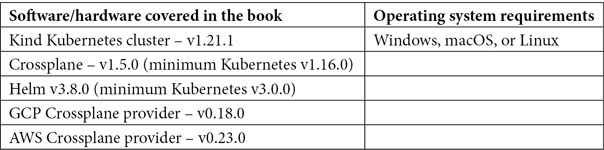

# 序言

在过去的几年里，无数组织已经利用 Kubernetes 提供的颠覆性应用部署操作模型。随着 Crossplane 的推出，相同的好处也进入了基础设施供应和管理领域。基础设施即代码在偏差管理、基于角色的访问控制、团队协作和薄弱契约等方面的局限性，促使人们转向基于控制平面的基础设施自动化，但设置它需要大量的专业知识和努力。

本书将详细介绍如何利用 Kubernetes 和 Crossplane 构建基于控制平面的基础设施自动化平台。云原生领域拥有大量的配置管理工具，选择合适的工具可能会很困难。本书将引导云原生从业人员选择最适合用例的 Kubernetes 配置管理工具。你将通过一些基于流行配置管理工具（如 Helm、Kustomize、Argo 和 KubeVela）的动手模块，学习配置管理。这些动手示例将是你在日常工作中可以直接使用的指南。

本书的 DevOps 部分将在结束时使你熟练掌握构建现代化基础设施自动化平台的技能，统一应用与基础设施自动化。

# 本书适合的人群

本书面向云架构师、平台工程师、基础设施或应用运维人员以及对简化基础设施和应用自动化感兴趣的 Kubernetes 爱好者。在开始本书之前，需对 Kubernetes 及其构建模块（如 Pod、Deployment、Service 和 namespace）有基本的了解。

# 本书涵盖的内容

*第一章*，*介绍新的操作模型*，讨论了许多人认为 Kubernetes 只是容器编排的问题，但 Kubernetes 远不止如此。理解 Kubernetes 为何颠覆了第一天和第二天的 IT 操作，是成功采用和优化使用的关键。

*第二章*，*基础设施自动化的现状*，揭示了基础设施即代码的局限性，并提出基于控制平面的基础设施自动化作为新时代的自动化概念，利用 Crossplane 和 Kubernetes 来实现。

*第三章*，*利用 Crossplane 自动化基础设施*，帮助我们理解如何设置 Crossplane 集群，讨论其架构，并解释如何将其用作基础设施自动化的基础版本。

*第四章*，*使用 Crossplane 构建基础设施*，帮助我们理解 Crossplane 的构建功能，这是一个强大的概念，有助于我们创建新的基础设施抽象。这些抽象可以是我们自定义的基于 Kubernetes 的云 API，带有组织政策、合规要求和内置的配置。

*第五章*，*探索基础设施平台模式*，分析了在组织内部成功运行基础设施平台产品所需的关键模式，这些模式可以与 Crossplane 一起使用。本章将详细探讨这些模式。

*第六章*，*更多 Crossplane 模式*，探讨了更多有助于日常工作的 Crossplane 模式。我们将在实践中学习大部分这些模式。

*第七章*，*扩展和扩展 Crossplane*，介绍了使 Crossplane 具有可扩展性和可扩展性的两个独特方面。第一部分将深入探讨 Crossplane 提供者，第二部分将讨论 Crossplane 如何在多租户生态系统中工作。

*第八章*，*了解权衡取舍*，讨论了配置管理的许多细微差别。理解配置时钟将帮助我们对工具进行分类，并了解适用于每个类别的权衡取舍。

*第九章*，*使用 Helm、Kustomize 和 KubeVela*，重点讲解如何使用今天流行的不同配置管理工具，如 Helm、Kustomize 和 KubeVela。

*第十章*，*使用 Crossplane 进行应用程序入驻*，分析了基础设施配置和应用程序入驻如何涉及一些跨领域的关注点，如设置源代码仓库、持续集成工作流和持续部署。本章将探讨如何以统一的方式使用 Crossplane 处理应用程序、服务和基础设施自动化。

*第十一章*，*推动平台采用*，解释了许多组织在技术平台项目中失败的原因，因为它们没有应用必要的产品开发实践和团队结构。本章旨在帮助理解成功构建和采用基础设施平台所需的各个方面。

# 为了最大限度地利用本书

请浏览 [`kubernetes.io/docs/concepts/overview/`](https://kubernetes.io/docs/concepts/overview/) 了解基本概念。所有代码示例均使用 Kind Kubernetes 集群（[`kind.sigs.k8s.io/`](https://kind.sigs.k8s.io/) - v1.21.1）和 Crossplane 版本 1.5.0 作为控制平面进行测试。不过，它们也应适用于未来的版本发布。



*请注意，安装 Crossplane 时，Kubernetes 版本应至少为 v1.16.0。*

**如果您使用的是本书的数字版本，我们建议您自己输入代码，或者从本书的 GitHub 仓库访问代码（链接将在下一部分提供）。这样可以帮助您避免与复制粘贴代码相关的潜在错误。**

# 下载示例代码文件

您可以从 GitHub 下载本书的示例代码文件，网址是[`github.com/PacktPublishing/End-to-End-Automation-with-Kubernetes-and-Crossplane`](https://github.com/PacktPublishing/End-to-End-Automation-with-Kubernetes-and-Crossplane)。如果代码有更新，GitHub 仓库会进行更新。

我们还提供了其他代码包，来自我们丰富的书籍和视频目录，网址是[`github.com/PacktPublishing/`](https://github.com/PacktPublishing/)。欢迎查阅！

# 下载彩色图像

我们还提供了一份包含本书中使用的截图和图表的彩色图像 PDF 文件。您可以在此处下载：[`packt.link/1j9JK`](https://packt.link/1j9JK)。

# 使用的约定

本书中使用了多种文本约定。

`文本中的代码`：表示文本中的代码词汇、数据库表名、文件夹名称、文件名、文件扩展名、路径名、虚拟 URL、用户输入和 Twitter 用户名。这里有一个例子：“像 Pods、Deployments、Jobs 和 StatefulSets 这样的资源属于`workload`类别。”

代码块设置如下：

```
# List all resources 
```

```
kubectl api-resources
```

```
# List resources in the "apps" API group 
```

```
kubectl api-resources --api-group=apps
```

```
# List resources in the "networking.k8s.io" API group
```

```
kubectl api-resources --api-group=networking.k8s.io
```

当我们希望引起您对代码块中特定部分的注意时，相关的行或项目会以粗体显示：

```
apiVersion: "book.imarunrk.com/v1"
```

```
kind: "CloudDB"
```

```
metadata:
```

```
 name: "aws_RDS"
```

```
spec:
```

```
  type: "sql"
```

```
  cloud : "aws"
```

任何命令行输入或输出均如下所示：

```
% kubectl get all -n crossplane-system
helm delete crossplane --namespace crossplane-system
```

**粗体**：表示新术语、重要词汇或您在屏幕上看到的词汇。例如，菜单或对话框中的词汇会以**粗体**显示。这里有一个例子：“在 AWS Web 控制台中进入**IAM**部分，并点击**添加用户**。”

提示或重要注意事项

看起来是这样的。

# 联系我们

我们始终欢迎读者的反馈。

**一般反馈**：如果您对本书的任何方面有疑问，请通过电子邮件联系我们，邮箱地址是 customercare@packtpub.com，并在邮件主题中提到书名。

**勘误**：尽管我们已尽最大努力确保内容的准确性，但错误难免。如果您在本书中发现错误，我们将非常感激您向我们报告。请访问[www.packtpub.com/support/errata](http://www.packtpub.com/support/errata)并填写表格。

**盗版**：如果您在互联网上发现我们的作品以任何形式的非法复制品，我们将非常感谢您提供位置地址或网站名称。请通过版权@packt.com 联系我们，并附上材料的链接。

**如果你有兴趣成为作者**：如果你在某个领域具有专长，并且有兴趣撰写或为书籍贡献内容，请访问[authors.packtpub.com](http://authors.packtpub.com)。

# 分享你的想法

一旦你阅读了*《Kubernetes 与 Crossplane 的端到端自动化》*，我们很想听听你的想法！请点击这里，直接前往本书的 Amazon 评论页面，分享你的反馈。

你的评论对我们和技术社区都非常重要，并将帮助我们确保提供优质的内容。
