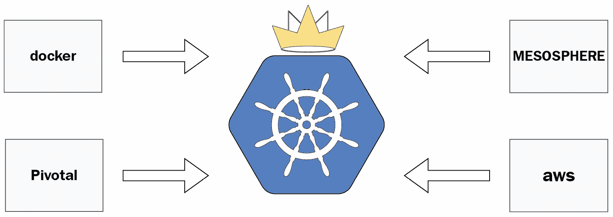
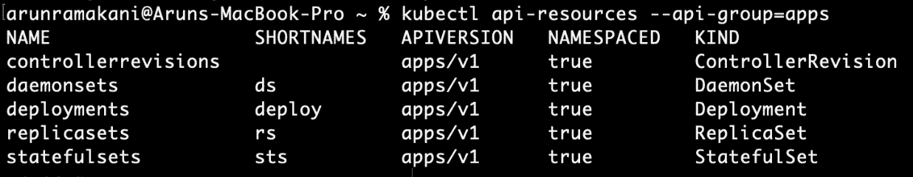
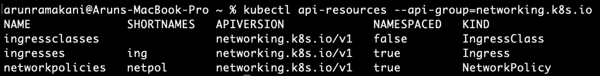
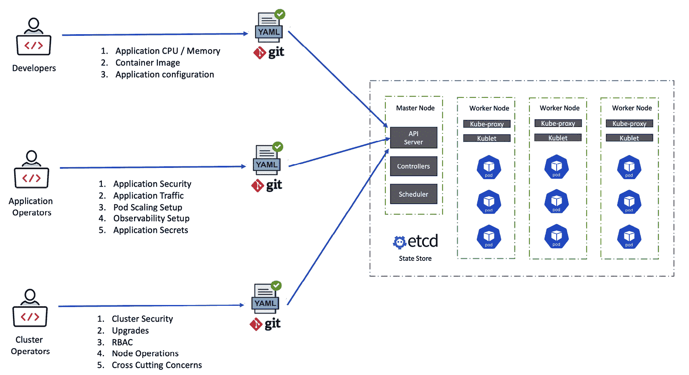
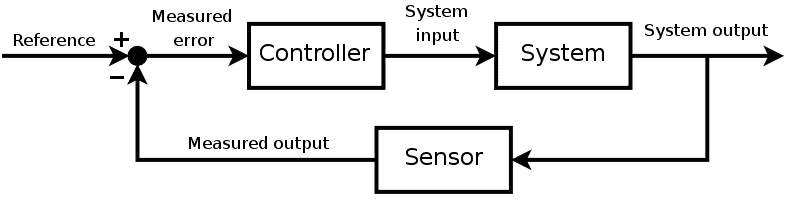
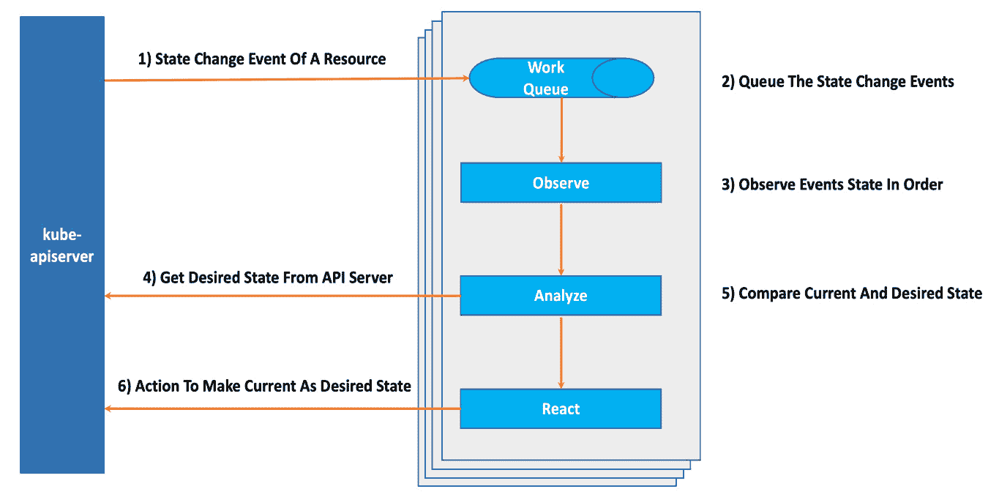
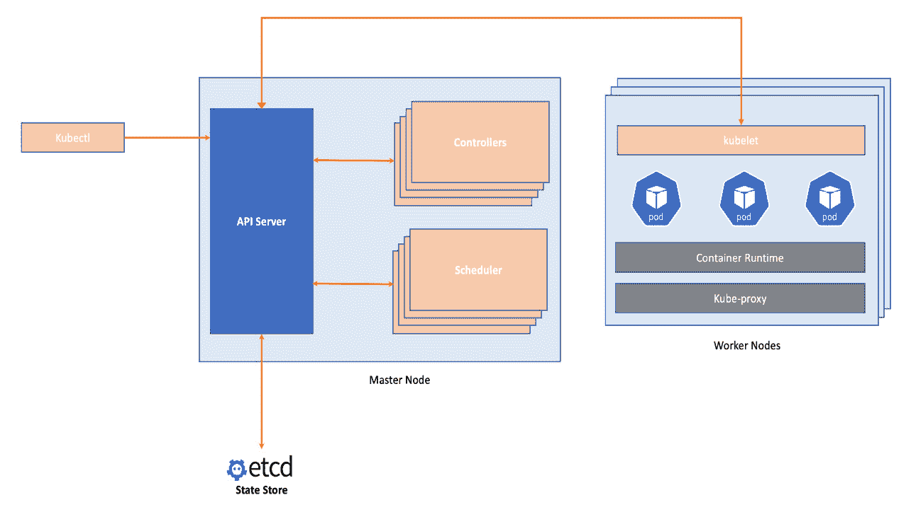

# 第一章：*第一章*：介绍新操作模型

许多人认为 Kubernetes 赢得了容器编排战，因为它出色的容器管理能力。但 Kubernetes 不仅仅如此。除了在大规模下处理容器编排外，Kubernetes 还引入了全新的 IT 操作模型。任何新事物都有陷阱。由于我们的惯性，我们往往以旧有的方式使用新工具。理解 Kubernetes 如何打破 IT 操作的传统模式，对于避免这些陷阱并实现成功的采纳至关重要。本章将深入探讨新操作模型的关键方面。

本章将涵盖以下主题：

+   Kubernetes 的历程

+   新操作模型的特点

+   下一个 Kubernetes 用例

# Kubernetes 的历程

Kubernetes 成为领先容器编排平台的历程充满了许多引人入胜的时刻。Kubernetes 是由几位 Google 工程师基于一个名为 Borg 的内部项目发起的开源项目。从一开始，Kubernetes 就拥有 Google 重度生产使用的优势，以及 Borg 超过十年的活跃开发历史。很快，它不再是一个小规模的 Google 工程师团队，而是得到了强大的社区支持。容器编排战争是 Docker、Mesosphere DC/OS、Kubernetes、Cloud Foundry 和 AWS **弹性容器服务**（**ECS**）之间的激烈竞争，始于 2015 年。Kubernetes 逐渐并稳步超越了其他竞争者。

最初，Docker、Mesosphere 和 Cloud Foundry 宣布原生支持 Kubernetes。最终，在 2017 年，AWS 宣布推出针对 Kubernetes 的 ECS。最终，所有云服务提供商都推出了托管的 Kubernetes 服务。由于 Kubernetes 的高效性和广泛采用，竞争对手别无选择，只能提供原生支持。这些是 Kubernetes 在容器编排战中的胜利时刻。此外，它继续成长，成为云原生生态系统的核心，围绕它发展出了许多工具和模式。以下图表展示了容器编排战：



图 1.1 – 容器编排战争

接下来，让我们了解新操作模型的特点。

# 新操作模型的特点

理解 Kubernetes 如何积极影响 IT 操作，将为应用程序和基础设施自动化中 DevOps 的高效采纳提供坚实基础。以下是 Kubernetes 操作模型的一些重要特点：

+   团队协作和工作流程

+   控制理论

+   互操作性

+   可扩展性

+   新架构的焦点

+   开源、社区和治理

让我们在接下来的章节中详细了解这些特点。

重要提示

在深入探讨之前，首先需要了解的是，你应该对 Kubernetes 的架构和其构建块资源（如 Pods、Deployments、Services 和 namespaces）有基本的先前理解。如果你是 Kubernetes 新手，或者需要理解基础概念的指南，请查阅 [`kubernetes.io/docs/concepts/overview/`](https://kubernetes.io/docs/concepts/overview/) 文档。

## 团队协作和工作流

所有 Kubernetes 资源（如 Pods、卷、Services、Deployments 和 Secrets）都是持久化实体，存储在 `etcd` 中。Kubernetes 有良好建模的 RESTful API 用于执行这些资源的 `CRUD` 操作。对 `etcd` 持久化存储的创建、更新和删除操作是状态变化请求。状态变化是与 Kubernetes 控制平面异步实现的。这些 Kubernetes API 有几个特性，非常有利于高效的团队协作和工作流：

+   声明式配置管理

+   多角色协作

### 声明式配置管理

我们将自动化意图作为数据点传递给 Kubernetes API，这些数据点被称为 `Git`，而非代码。同时，作为数据表达自动化意图比代码更少出错，且更易于阅读和维护。只要我们有清晰的 Git 历史记录、简洁的意图表达和发布管理，配置的协作就会变得轻松。以下是一个简单的 `NGINX` Pod 部署意图记录：

```
apiVersion: v1_
```

```
kind: Pod
```

```
metadata:
```

```
  name: proxy
```

```
spec:
```

```
  containers:
```

```
    - name: proxy-image
```

```
      image: Nginx
```

```
      ports:
```

```
        - name: proxy-port
```

```
          containerPort: 80
```

```
          protocol: TCP
```

尽管许多现代自动化工具本质上是声明式的，但由于缺乏良好建模的 RESTful API，它们在协作方面较弱。以下的多角色协作部分将进一步讨论这一点。声明式配置与多角色协作的结合使得 Kubernetes 成为一个独特的方案。

### 多角色协作

通过 Kubernetes 或其他自动化工具，我们将数据中心完全抽象为一个单一窗口。与其他自动化工具不同，Kubernetes 为每个基础设施问题提供了单独的 API 映射。Kubernetes 将这些问题归纳为一个称为 API 组的构造，约有 20 个 API 组。API 组将单一基础设施资源拆分为多个小的责任区块，为不同角色的人员提供了操作基础设施的权限分离。为了简化，我们可以将这些 API 逻辑性地划分为五个部分：

+   `workload` 类别。这些资源主要属于 `apps` 和 `core` API 组。

+   `core` 和 `networking.k8s.io` API 组。

+   `core` 和 `storage.k8s.io API` 组。应用操作员可以访问这些 API。

+   `RoleBinding`、`CertificateSigningCertificate`、`ServiceAccount` 和 namespaces 属于此类别，集群操作员应访问这些 API。这些资源分属于多个 API 组，如 `core`、`rbac`、`rbac.authorization.k8s.io` 和 `certificates.k8s.io`。

+   `core`、`autoscaling` 和 `policy` API 组。负责应用程序策略或自动化架构特性的人员可以访问这些 API。

请注意，core API 组包含前述所有类别的资源。可以通过 `kubectl` 命令来探索所有 Kubernetes 资源。以下是一些命令示例：

```
# List all resources 
```

```
kubectl api-resources
```

```
# List resources in the "apps" API group 
```

```
kubectl api-resources --api-group=apps
```

```
# List resources in the "networking.k8s.io" API group
```

```
kubectl api-resources --api-group=networking.k8s.io
```

以下截图让你快速浏览 `apps` 和 `networking.k8s.io` API 组下的资源，但我强烈建议你自己动手探索所有资源及其 API 组：



图 1.2 – 应用 API 组下的资源

以下是 `network.k8s.io` API 组下的资源：



图 1.3 – 网络.k8s.io API 组下的资源

我们可以根据单独的资源或 API 组为团队分配 RBAC。以下图表展示了开发人员、应用程序操作员和集群操作员在不同关注点上进行协作：



图 1.4 – 团队协作

这种表示可能因组织结构、角色和职责的不同而有所变化。传统的自动化工具基于模板，团队之间的协作较为困难。这导致了由两个不同团队分别决定和实施政策的情况。Kubernetes 改变了这一操作模式，通过减少协作中的摩擦，使得不同角色能够直接协作。

## 控制理论

控制理论是来自工程学和数学的一个概念，它通过维持动态系统中的期望状态来工作。动态系统的状态随着环境变化而不断变化。控制理论通过执行持续的反馈循环来观察输出状态，计算偏差，然后控制输入以保持系统的期望状态。我们周围的许多工程系统都使用控制理论。例如，空调系统通过持续的反馈循环来维持温度，就是一个典型的例子。下图简化地展示了控制理论的流程：



图 1.5 – 控制理论流程

Kubernetes 实现了最先进的控制理论。我们将应用程序的期望状态意图提交给 API。剩下的自动化流程由 Kubernetes 处理，一旦 API 被提交，标志着人类工作流程的结束。Kubernetes 控制器异步运行持续的协调循环，以确保期望的状态在所有 Kubernetes 资源中得以保持，如 Pods、Nodes、Services、Deployments 和 Jobs。控制器是 Kubernetes 的核心大脑，负责管理不同 Kubernetes 资源的控制器集合。观察、分析和反应是单个控制器的三大主要功能：

+   `create`、`delete` 和 `update` 事件。

+   **分析**：一旦观察者接收到事件，分析器会介入，比较当前状态和期望状态，以找到差异。

+   **反应**：执行所需的操作，以使资源恢复到期望状态。

Kubernetes 中的控制理论实现改变了 IT 在第一天和第二天操作中的方式。一旦我们将意图表示为数据点，人类的工作流程就结束了。机器接管了异步模式下的操作。漂移管理不再是人类工作流程的一部分。除了现有的控制器外，我们还可以通过新的控制器扩展 Kubernetes。我们可以轻松地将管理工作负载所需的任何操作知识编码到自定义控制器（操作器）中，并将自定义的第二天操作交给机器：



图 1.6 – Kubernetes 控制器流程

## 互操作性

Kubernetes API 不仅仅是我们与集群交互的接口。它是将所有组件粘合在一起的纽带。`kubectl`、调度器、`kubelet` 和控制器通过 `kube-apiserver` 来创建和维护资源。`kube-apiserver` 是唯一一个与 `etcd` 状态存储进行交互的组件。`kube-apiserver` 实现了一个明确的 API 接口，提供从任何 Kubernetes 组件以及集群外部的状态可观测性。`kube-apiserver` 的这一架构使其能够与生态系统互操作。其他基础设施自动化工具，如 Terraform、Ansible 和 Puppet，并没有明确的 API 来观察状态。

以可观察性为例。许多可观察性工具围绕 Kubernetes 演变，因为`kube-apiserver`具有互操作性特征。对于现代数字化组织来说，基于状态的持续可观察性和反馈循环至关重要。从不同利益相关者的角度，基础设施和应用的端到端可视性为实现卓越运营提供了一种方式。另一个互操作性的例子是使用各种配置管理工具，如 Helm 作为`kubectl`的替代品。由于*意图记录*是纯粹的 YAML 或 JSON 数据点，我们可以轻松地将一个工具替换为另一个工具。下图展示了`kube-apiserver`与其他 Kubernetes 组件的交互：



图 1.7 – Kubernetes API 交互

互操作性对 IT 运维有很多意义。其一些好处如下：

+   与组织生态系统的轻松共存。

+   Kubernetes 本身将不断发展，并且会持续存在更长时间。

+   通过选择已知的生态系统工具来利用现有的技能集。例如，我们可以使用 Terraform 进行 Kubernetes 配置管理，以便利用团队在 Terraform 方面的知识。

+   假设未来保持从 Kubernetes 迁移的选项开放。（Kubernetes API 高度模块化，我们可以轻松替换底层组件。此外，纯声明性配置如果需要可以轻松从 Kubernetes 迁移。）

## 可扩展性

Kubernetes 添加新功能的能力令人印象深刻。我们可以从三个不同的角度来看 Kubernetes 的可扩展性：

+   扩展 Kubernetes 核心组件

+   组件的可互换性

+   添加新的资源类型

### 扩展的 Kubernetes 核心组件

这种扩展模型将为核心组件添加额外的功能，或改变核心组件的功能。我们将看几个扩展的例子：

+   `kubectl` CLI。它们是以特定格式添加到操作员计算机上的可执行文件，不改变`kubectl`源代码的任何形式。这些扩展可以将需要几个步骤的过程合并成一个子命令，以提高生产力。

+   **自定义调度器**是一个概念，允许我们修改 Kubernetes 的资源调度行为。我们甚至可以注册多个调度器并行运行，并为不同的工作负载配置它们。默认调度器可以覆盖大多数常见用例。如果我们的工作负载具有默认调度器无法提供的独特调度行为，那么就需要自定义调度器。

+   **基础设施插件**是有助于扩展底层硬件的概念。设备、存储和网络是三种不同的基础设施插件。假设一个设备支持 GPU 处理——我们需要一种机制来宣传 GPU 使用详情，以便基于 GPU 调度工作负载。

### 组件的可互换性

Kubernetes 的互操作性特性提供了将一个核心组件与另一个组件互换的能力。这些类型的扩展为 Kubernetes 带来了新的功能。例如，我们来看看虚拟`kubelet`项目（[`github.com/virtual-kubelet/virtual-kubelet`](https://github.com/virtual-kubelet/virtual-kubelet)）。`Kubelet`是 Kubernetes 控制平面与虚拟机节点之间的接口，工作负载会在这些节点上调度。`Virtual kubelet`模拟 Kubernetes 集群中的一个节点，以便在除虚拟机节点外的基础设施（如 Azure 容器实例或 AWS Fargate）上进行资源管理。将 Docker 运行时替换为其他容器运行时环境（如 Rocket）是另一个互换性的例子。

### 添加新的资源类型

我们可以扩展 Kubernetes API 和控制器的范围，创建一个新的自定义资源，也称为**CustomResourceDefinition**（**CRD**）。它是用于扩展 Kubernetes 以管理容器以外资源的强大构造之一。Crossplane，一个云资源管理平台，属于这一类别，我们将在接下来的章节中深入探讨。另一个用例是自动化我们的自定义 IT 日常流程，也称为操作员模式。例如，像部署、升级和响应故障等任务可以被编码到一个新的 Kubernetes 操作员中。

人们称 Kubernetes 为构建平台的平台，因为它具有广泛的扩展性。它们通常支持新的用例或使 Kubernetes 适配到特定的生态系统中。Kubernetes 通过扩展和支持每种复杂的部署环境，向 IT 运营提供了一个通用的抽象。

## 架构重点

架构工作重点之一是使应用程序部署架构具备应对虚拟机故障、数据中心故障和多样化流量条件等各种情况的鲁棒性。同时，资源利用率应当做到最佳，避免在过度配置的基础设施中浪费成本。Kubernetes 使这一切变得简单，并统一了如何实现可靠性、可扩展性、可用性、效率和弹性等架构特性。它让架构师不再需要专注于基础设施。架构师们现在可以专注于将所需的特性融入到应用程序中，因为在基础设施层面实现这些特性已经不再复杂。这是传统 IT 操作方式的一个重大转变。在容器世界中，设计容错性、可观察性和混沌工程实践正变得越来越受欢迎，成为架构师们关注的重点领域。

可移植性是 Kubernetes 为工作负载提供的另一个架构特性。容器工作负载通常是可移植的，但依赖项则不是。我们倾向于引入其他云组件的依赖。近年来，将可移植性融入应用程序依赖成为一种架构趋势。这一点在 2021 年 InfoQ 的架构趋势中有所体现（[`www.infoq.com/articles/architecture-trends-2021/`](https://www.infoq.com/articles/architecture-trends-2021/)）。在趋势图中，设计可移植性、Dapar、开放应用程序模型以及可持续性设计是与工作负载可移植性相关的趋势。我们正慢慢朝着可移植的云服务提供商方向发展。

随着工作负载部署到 Kubernetes 中，我们对新 IT 组织架构的关注发生了根本性的变化。

## 开源、社区和治理

Kubernetes 几乎让人们不再需要直接与机器打交道。投资这种高层次的抽象需要谨慎，我们将看看这一变化是否能够持久。任何高层次的抽象要成为一种有意义且持久的变化，都需要具备一些特征。由于几乎所有主要的云服务提供商都在背后支持，Kubernetes 具备了这些特征。以下是使 Kubernetes 被广泛接受和采纳的几个特征。

### 项目所有权

项目所有权对于开源项目的成功和推动普遍采纳至关重要。开源项目应该由一个广泛接受的基金会来管理，而不是被单一公司主导，推动未来方向的工作组应由来自多个公司的代表组成。这样能够反映项目的中立性，每个利益相关者都能参与并从中受益。Kubernetes 非常符合这一定义。尽管 Kubernetes 起源于几位 Google 工程师的项目，但它很快成为了**云原生计算基金会**（**CNCF**）的一部分。如果我们查看 CNCF 的管理委员会和成员，可以看到所有顶尖技术公司都有代表（[`www.cncf.io/people/governing-board/`](https://www.cncf.io/people/governing-board/) 和 [`www.cncf.io/about/members/`](https://www.cncf.io/about/members/)）。Kubernetes 还拥有特殊兴趣小组和工作小组，并且得到了许多技术公司的支持，包括所有云服务提供商。

### 贡献

Kubernetes 是 GitHub 上发展速度最快的项目之一，拥有超过 3000 名贡献者。由于社区提交的速度很快，Kubernetes 看起来非常可持续。此外，相关文档、书籍和教程也非常丰富。最重要的是，我们围绕 Kubernetes 发展了太多生态系统工具和平台，这使得在 Kubernetes 上开发和部署工作负载变得更加容易。

### 开放标准

由于 Kubernetes 抽象的范围并不小，它并没有试图单独解决所有问题。相反，它依赖于几个开放标准来整合现有的广泛接受的工具。它还鼓励生态系统开发符合开放标准的新工具。例如，Kubernetes 可以与符合标准的任何容器运行时（如 Docker 和 Rocker）一起工作，这就是**容器运行时接口**（**CRI**）。同样，符合**容器网络接口**（**CNI**）的任何网络解决方案都可以作为 Kubernetes 的网络解决方案。

Kubernetes 的开源治理方法为 IT 运营提供了几个优势：

+   Kubernetes 是可持续的，组织可以放心投资。

+   更广泛的采用将维持一个强大的人才库。

+   强大的社区支持。

前一节总结了新的 Kubernetes IT 运营模式的关键方面。虽然我们已经看到了每个特性的好处，但当我们将它们结合起来时，也有了优势。例如，像 Crossplane 这样的平台正在通过利用之前讨论的多个方面的优势而发展。

# 下一个 Kubernetes 使用案例

在过去几年中，许多组织已经利用 Kubernetes 提供的颠覆性应用部署运营模式。通过将意图表达与数据点分离，然后控制平面接管其余的自动化过程的模式被称为**基础设施即数据**（**IaD**），这个术语是由 Kelsey Hightower 创造的。许多 Kubernetes 社区的人士认为容器只是这种模式的第一个用例，未来还会有更多用例出现。随着 2018 年底 Crossplane 的推出，一个新的用例正在发展，被视为 Kubernetes 的下一个重大用例。Crossplane 将 Kubernetes 运营模式的优势带入云基础设施的供应和管理领域。这一趋势将使人们摆脱传统的**基础设施即代码**（**IaC**），转而使用 Crossplane 和 Kubernetes 的 IaD。这一转变解决了当前 IaC 模型的局限性，并统一了自动化应用和基础设施的方法。

# 总结

Kubernetes 提供了许多与现代数字化组织期望一致的 IT 运营模式方面的新特性。了解 Kubernetes 如何颠覆日常的 IT 运维操作对其成功采用至关重要。本章节详细介绍了 Kubernetes 提供的新运营模式的细节。在下一章中，我们将探讨 IaC 在云基础设施管理中的局限性，并介绍基于 Kubernetes 控制平面的基础设施管理作为新时代的替代方案。
