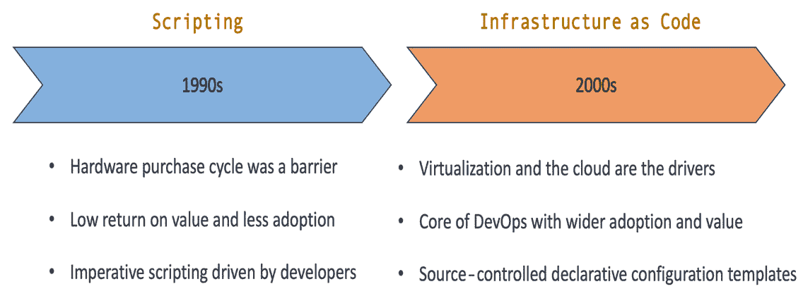
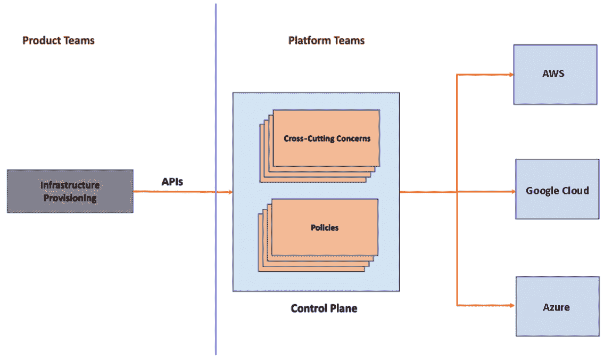
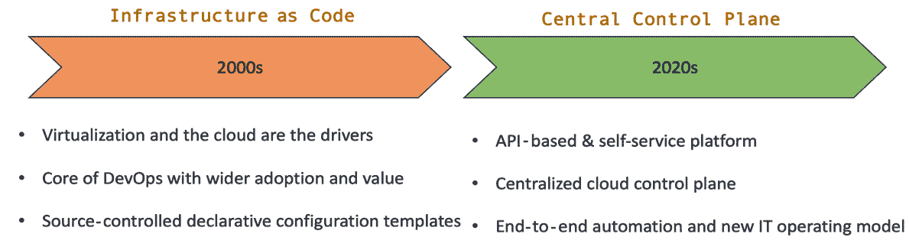
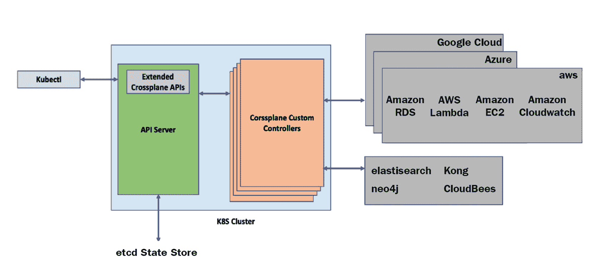
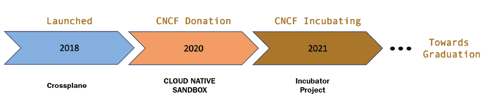

# 第二章：*第二章*：审视基础设施自动化的现状

本章将回顾基础设施自动化的历史、发展以及现状。我们将探讨云原生生态系统和敏捷工程实践的发展，如何揭示 **基础设施即代码** (**IaC**) 的局限性。我们还将研究基于控制平面的基础设施自动化作为一种前沿技术，如何解决 IaC 的局限性，并能够改变 DevOps 操作模型，推动软件工程向积极方向发展。

本章将深入探讨以下主题：

+   基础设施自动化的历史

+   IaC 的局限性

+   端到端自动化的需求

+   多云自动化需求

+   Crossplane 作为云控制平面

+   其他类似项目

# 基础设施自动化的历史

在 1990 年代，硬件采购周期是影响组织基础设施变更的重要因素。那时，基础设施自动化并未受到太多重视。从接到订单到物理基础设施可用所花费的时间远远超过基础设施设置所花费的精力。个别基础设施工程师和小团队会自动化重复的脚本任务，但行业内并未广泛适应。诸如 CFEngine 这样的工具（于 1993 年推出，用于自动化基础设施配置）在那个十年里并未得到广泛采用。由于自动化的效益较小、投资回报率低，行业内并没有投资自动化的趋势。到了 2000 年代，基础设施自动化的理念逐渐获得关注，原因如下：

+   虚拟化技术

+   云计算

虚拟化技术带来了资源的软件表示能力，例如内存、CPU、存储和网络，这些资源通过安装在物理硬件上的虚拟机监控器（Hypervisor）来实现。它将我们带入了虚拟机时代，在这个时代，机器被从底层物理硬件中抽象出来。我们可以在单一硬件上运行多个虚拟机。它带来了许多优势，如降低成本、最小化停机时间以及有效利用资源。但最关键的优势是基础设施工程的敏捷性，打破了传统的硬件采购周期。虽然虚拟化技术在 2000 年前就已存在，但由于云计算的普及，它在后期才得到了广泛应用。

不同的云平台在 2000 年代末推出，增加了更多的灵活性。我们进入了**基础设施即服务**（**IaaS**）时代。随着我们增加创建新虚拟机的速度，新的问题也逐渐出现。需要管理的服务器数量迅速增长。此外，虚拟机是短暂的，我们需要快速迁移、修改和重建它们。保持配置与之前场景的一致性是一个挑战。由于人为管理虚拟机的错误多且繁琐，我们最终得到了“雪花服务器”。这些限制促使我们转向广泛采用基础设施自动化。像 Puppet、Ansible、Chef 和 Terraform 这样的新工具迅速发展，引入了 IaC，用代码的方式管理配置和基础设施的供应。我们在基础设施生命周期管理中保持敏捷，并将相关代码存储在 Git 中，这为现代基础设施工程奠定了基础。IaC 和 IaaS 是一个强强联手的组合，为基础设施工程提供了独特的特性。我们实现了可持续、可重复、可互换和弹性的基础设施供应与配置管理。

以下图表总结了从脚本到 IaC 的进化过程：

图 2.1 – 基础设施自动化的进化

# 下一次进化的需求

随着我们不断前进，云计算成为了基础设施的“圣杯”。像 Terraform、Pulumi、AWS CloudFormation、Google Cloud Deployment Manager 和 Azure Resource Manager 这样的工具成为了基础设施即代码（IaC）的核心。虽然这些工具很好地履行了它们的承诺，但我们可以看到基础设施自动化的下一次进化已经开始显现。在审视基础设施自动化的下一个阶段之前，了解为什么我们需要围绕基础设施自动化进化我们的工具和实践至关重要。软件行业的一些最新趋势正在推动下一阶段的进化。这些趋势如下：

+   IaC 的局限性

+   Kubernetes 的自动化操作模型

+   多云自动化需求

让我们来看一下这些趋势，以证明我们需要向基础设施自动化的下一个阶段进化。

## IaC 的局限性

大多数广泛使用的基础设施自动化工具都是基于模板的，如 Terraform、Ansible 和 Azure 资源管理器。从多个角度来看，它们的扩展性较差。这并不意味着 IaC 工具在自动化中不合适，恕我直言，IaC 工具已经积极地推动了软件工程的发展超过十年。我们将尝试解释如何演变的情况暴露了基于模板的 IaC 工具的弱点，以及基于控制平面的工具如何作为替代方案并成为下一个演化步骤。让我们以 Terraform 为例，分析它的局限性。以下是 Terraform 的不同局限性问题：

+   缺乏自助服务

+   缺乏访问控制

+   参数化陷阱

    术语

    执行任务所需拥有和处理的知识量称为**认知负荷**。你将在接下来的部分中遇到**高团队认知负荷**这一术语，这意味着一个团队必须扩展其处理知识的能力，以便执行日常职能，超出其通常所能承载的知识量。

### 缺乏自助服务

使用 Terraform 时，我们有太多模板抽象了成千上万的云 API。记住每个参数在成千上万模板中的使用方式并不是一件容易的事。此外，基础设施使用策略来自组织中的不同团队，例如安全、合规、产品和架构。实现 Terraform 自动化涉及显著的团队认知负荷和集中式政策要求。因此，许多组织倾向于通过集中式平台团队来实现基础设施自动化，以避免增加产品团队的认知负荷，并实现集中式政策管理。但基于模板的自动化工具不支持 API，这是提供平台自助服务的最佳方式。因此，我们必须构建 Terraform 模块/库来创造人工团队边界，并实现自助服务。模块/库是 API 的一个较弱替代方案。它们在实现平台自助服务时存在一些问题：

+   平台团队在认知负荷抽象方面存在泄漏，因为产品团队使用 Terraform 模块/库意味着至少要学习 Terraform 的基本知识。

+   团队间作为模块和库的依赖关系需要产品团队和平台团队之间的协作互动模式，而非自助式模式。这与现代平台拓扑结构相悖，阻碍了平台和产品团队的敏捷性。

另外，一些组织将基础设施的配置完全外包给平台团队。完全的集中化会妨碍产品团队的敏捷性，同时导致基础设施配置的外部耦合。很少有组织尝试将基础设施管理下放到产品团队中。完全的去中心化会增加团队的认知负担，并且增加跨团队对齐集中化政策的难度。新的发展需要在正确抽象的自助服务 API 中找到折衷点。

### 缺乏访问控制

正如我们在上一节中看到的，构建和使用 Terraform 模块需要多个团队之间的协作。通过与产品团队共享 Terraform 模块进行基础设施配置和管理，我们会遇到访问控制问题。我们无法对产品团队所需的单个资源实现精确的**基于角色的访问控制**（**RBAC**），并且我们将泄露所有必要权限的底层云凭证，这些权限是模块所需要的。例如，一个用于配置 Cosmos DB 的 Terraform 模块需要 Azure 凭证来配置数据库和**虚拟私有云**（**VPC**）。但产品团队所需的访问权限仅限于创建数据库，他们不需要直接修改 VPC。除此之外，我们还面临模块/库的版本管理问题。它需要所有产品团队之间的协调，这在模块/库版本升级时会产生摩擦。一个高度可互操作的基于 API 的基础设施自动化抽象可以解决协作和访问控制问题。

### 参数化的陷阱

参数化的陷阱是任何基于模板的解决方案中的常见问题，无论是基础设施自动化工具还是其他工具。我们为值变化的变量创建参数占位符，在任何基于模板的解决方案中都是如此。这些解决方案易于实现、理解和维护。如果我们在小规模操作时，它们表现得很好。然而，当我们尝试扩展基于模板的解决方案时，我们最终会遇到以下问题之一：

+   随着时间的推移，我们将需要对新变量进行参数化，并且逐步地，我们将在某个时刻暴露所有变量。这将侵蚀我们通过模板创建的抽象。查看任何 Helm 图表都能清楚地看到这一点，几乎所有内容都是一个参数。

+   我们可能决定分叉主模板，以实现特定用例的定制。分叉很难保持更新，随着分叉数量的增加，保持模板之间的政策一致性会变得非常困难。

参数化通常不是在大规模操作时完美的抽象。

重要提示

参数化的陷阱是 DevOps 工程师需要详细了解的关键话题。在后续章节中，我们将探讨配置时钟的概念，即随着时间推移模板抽象的侵蚀。

## 基于 Kubernetes 的自动化操作模型

正如我们在前一章中看到的，Kubernetes 的控制理论实现完全改变了应用程序自动化的 IT 运维方式。基础设施自动化也同样值得享受这些好处。但传统的基础设施自动化工具缺乏这些属性，因为它们没有完整的控制理论实现。以下是一些缺失的特性：

+   **同步配置**是 Terraform 或类似自动化工具中的一个重要可扩展性问题。资源按照常规自动化工具中的依赖关系依次配置。如果基础设施*A*依赖于基础设施*B*，我们在定义执行顺序时必须尊重这一点，并且如果其中一个执行失败，整个自动化将失败。基础设施的单一表示是此问题的关键所在。在 Terraform 中，单一的状态文件是表示基础设施资源的模型。基于 Kubernetes 的自动化可以改变这个等式。将会有一个持续的调节过程，将当前状态朝着预期状态推进。因此，我们可以高效地管理依赖关系，而无需执行顺序。基础设施*A*的配置可能会失败，但一旦基础设施*B*可用，持续的调节最终会修复状态。

+   **建模团队边界**是传统工具中另一个缺失的环节。单一的 Terraform 状态文件无法灵活地建模不同的团队边界。在基于 Kubernetes 的自动化模型中，资源以独立的 API 形式呈现，可以根据任何团队结构的需求进行分组和组合。我们无需将所有自动化内容集成到一个单一的庞大模型中。

+   **漂移管理**是通过保护基础设施免受任何非预期或未经授权的更改，保持基础设施在预期状态的过程。在云控制台中直接更改**身份与访问管理**（**IAM**）策略，而不更改相关的自动化代码，就是一种漂移的例子。漂移管理的核心是将其恢复到授权的状态。如果没有控制平面持续监控基础设施状态并执行与最后执行代码的调节，漂移管理是不可能实现的。通过额外的外部工具实现漂移管理会增加复杂性，并且不能解决所有问题。

+   **以标准化方式自动化第二天问题**是传统工具中的另一个缺失环节。基于 Kubernetes 的自动化模型可以提供配置模型，以支持第二天问题，如扩展、监控和日志记录。此外，我们还可以使用标准扩展点（操作器）来自动化任何自定义的第二天问题。

这些是基于 Kubernetes 的基础设施自动化所能带来的几个关键视角。

## 多云自动化需求

几乎所有大规模的组织都会在多个云提供商上运行其工作负载。组织决定建立由多个云提供商支持的基础设施可能有多种原因。我们不会详细讨论这些因素，但我们必须理解多云对基础设施管理的影响。通常，云提供商提供托管服务，无论是像 Amazon EC2 这样的基础 IaaS，还是像 AWS Lambda 这样的更抽象的平台。从云基础设施消费者的角度来看，基础设施自动化就是在应用所有内部策略之后，以自动化方式进行这些托管服务的配置和生命周期管理。组织使用基础设施自动化工具在云基础设施 API 上构建抽象，以编码所有内部策略。

支持多云能力需要大量工作，因为它带来了新的需求。想一想多云环境吧。将策略嵌入到每个云提供商的自动化脚本中是一项艰巨的工作。即使我们在付出了重大努力之后完成了这项工作，保持这些策略在自动化脚本中的同步也涉及摩擦，且容易出错。跨云提供商的身份验证、授权、计费、监控和日志记录的集中式体验，将为组织提供统一的体验，这将是一个额外的优势。通过传统的自动化工具实现这些跨领域的关注点需要大量的定制化工程，使得我们的平台团队规模庞大。我们需要的是一个集中式控制平面，用于抽象跨领域的关注点和策略。

以下图展示了一个基于 API 的集中式控制平面如何为产品团队提供统一的体验：

图 2.2 – 多云控制平面

Terraform 或 Pulumi 等工具在一定程度上帮助解决了这些问题，但它们并非端到端的自动化，存在可扩展性问题，并且需要定制化工程来构建。此外，这些工具也不是完全公正的开源项目。最初创建这些开源项目并提供企业级解决方案的公司主导了前者的控制。现在，我们都确信基础设施自动化的下一个演进是必需的，是时候定义此类工具所需的属性了。后续的基础设施自动化发展应该是基于控制平面的、完全由社区驱动的解决方案，依赖于 API。下图总结了从**基础设施即代码**到**集中控制平面**基础自动化的演进：

图 2.3 – 下一阶段的演进

# Crossplane 作为云控制平面

Crossplane 是一个基于 Kubernetes 的现代控制平面基础设施自动化平台，具备了基础设施工程下一阶段所需的所有特性。通过 Crossplane，我们可以从多个云提供商那里组装基础设施，并将其作为高级 API 暴露。这些 API 可以为不同团队提供通用的体验，而不受底层云供应商的影响。在为产品团队组合 API 时，平台团队可以根据组织的结构使用不同的资源粒度。这样精心设计的基础设施自动化 API 将促进自服务、多角色协作、精确的 RBAC、更低的认知负担、持续的漂移管理以及异步调和的依赖管理。最重要的是，平台团队可以通过配置以无代码的方式组合这些 API。最后，我们可以拥有一个精简的平台团队，这也是现代团队拓扑学所强烈推荐的做法。

Crossplane 仅仅是一组自定义控制器，它扩展了 Kubernetes 用于管理来自不同供应商的基础设施。作为基于 Kubernetes 构建的新 API 扩展，Crossplane 继承了 Kubernetes 操作模型的所有优点，并能利用丰富的云原生工具生态系统。此外，这也可以统一我们自动化应用程序和基础设施的方式。Crossplane 可以覆盖端到端的自动化，包括第 1 天和第 2 天的关注点。基础设施的提供、编码策略、治理和安全约束是我们可以自动化的第 1 天关注点。第 2 天我们可以自动化漂移管理、升级、监控和扩展等任务。最重要的是，它遵循 Kubernetes 的开源治理模型，通过**云原生计算基金会**（**CNCF**）进行管理。下图展示了 Crossplane 如何与 Kubernetes 一起工作：

图 2.4 – Crossplane 控制平面

要将平台作为通用控制平面进行采用，需要更深入地审视开源治理和生态系统的接受度。接下来的章节将深入探讨这些方面。

# 一个通用控制平面

Crossplane 作为一个开源项目于 2018 年启动，迈出了成为通用控制平面的步伐。2020 年捐赠给 CNCF 是其下一步重大进展。这帮助 Crossplane 成为一个由基金会推动的开源项目，吸引了更广泛的参与，而不仅仅是成为另一个开源项目。最初，它是一个沙箱项目，但并没有止步于此。2021 年，它被接受为孵化项目。最重要的是，Crossplane 只是 Kubernetes 的另一个扩展，而 Kubernetes 已经是一个被广泛接受的应用 DevOps 平台。这也意味着 Kubernetes 上可用的整个工具生态系统也与 Crossplane 兼容。团队可以在不增加太多认知负担的情况下，使用现有的工具集：

图 2.5 – 旅程

Crossplane 还有一些独特的特性，促使它被接受为一个通用的控制平面。这些特性包括：

+   基础设施供应商的开放标准

+   更广泛的参与

+   云服务提供商合作伙伴关系

# 基础设施供应商的开放标准

Crossplane 使用 **Crossplane 资源模型**（**XRM**），它是 **Kubernetes 资源模型**（**KRM**）的扩展，作为基础设施提供商的开放标准。它解决了当来自不同供应商的基础设施服务整合到单一控制平面时，诸如命名身份、包管理和跨资源引用等问题。Crossplane 社区已经制定了这些标准，以规范基础设施提供商如何集成到集中式 Crossplane 控制平面中。在统一且无需编码的方式下组合不同基础设施的能力，正是建立在这种标准化基础上的。

## 更广泛的参与

Upbound 是最初创建 Crossplane 的公司。他们为需要支持和额外服务的组织提供企业版服务。但要成为一个通用的控制平面，Upbound 不能是唯一的企业 Crossplane 提供商。任何供应商都应该能够提供企业版服务。随着 Crossplane 获得 CNCF 孵化状态，许多工作正在这一领域进行。CNCF 和 Crossplane 社区推出了一项名为 **Crossplane 合规性计划** 的举措。这是由 CNCF 运营的一个项目（[`github.com/cncf/crossplane-conformance`](https://github.com/cncf/crossplane-conformance)）。其目标是为任何供应商提供基础治理，使他们能够采用 Crossplane 开源项目，构建附加功能，并提供 **CNCF 认证** 版本。这与 **Kubernetes 认证分发版** 类似，Kubernetes 认证分发版是 CNCF 运行的一个项目，所有供应商基于基础 Kubernetes 版本进行扩展并提供认证版本。Crossplane 合规性计划在两个层面上运行：

+   **提供者**：在一个层面上，基础设施提供者将有兴趣构建相应的 Crossplane 控制器，以便客户通过 Crossplane 使用他们的产品。这要求遵循 XRM 所设定的标准。CNCF 将通过认证基础设施供应商构建的提供者来确保这一点。

+   **分发**：在另一个层面上，许多供应商将有兴趣提供 Crossplane 企业版服务。Crossplane 合规性计划使这一支持成为可能。

在 [`github.com/cncf/crossplane-conformance/blob/main/instructions.md`](https://github.com/cncf/crossplane-conformance/blob/main/instructions.md) 阅读更多关于 Crossplane 合规性计划的信息。

## 云服务提供商合作伙伴关系

Crossplane 与所有主要云服务提供商建立了出色的合作伙伴关系。现在，各大云服务提供商的生产就绪 Crossplane 提供者已经存在相当一段时间了。最初，IBM 加入了 Crossplane 社区，并在 2020 年发布了其第一个提供者版本。同样，AWS 和 Azure 将 Crossplane 提供者纳入了它们的代码生成流水线，确保最前沿的最新提供者可以用于所有云资源。阿里巴巴在其多个内部项目中实验使用 Crossplane，也有一个生产就绪的提供者。同样，社区管理的**Google Cloud Platform**（**GCP**）提供者也在其中。这些合作伙伴关系和社区努力使得 Crossplane 成为一个有吸引力且广泛接受的通用控制平面方案。

# 其他类似项目

其他一些基于 Kubernetes 的基础设施自动化项目与 Crossplane 有着共同的兴趣，并支持类似的用例。这些项目通过 API 和自定义控制器扩展了 Kubernetes，架构与 Crossplane 相同。本节将介绍这些工具，以便与 Crossplane 进行全面的比较。以下是一些此类项目的列表：

+   **Kubernetes 服务目录**是由开放服务代理（open service broker）提供的，旨在从 Kubernetes 中进行云资源的生命周期管理。像 Crossplane 一样，它作为 Kubernetes 控制器扩展工作。但它没有一个完整的框架来组合带有策略约束的基础设施配方。此外，我们无法为不同团队的边界建模 API。开放服务代理的 Kubernetes 服务目录并不适合平台团队构建带有编码策略的可重用配方。通常，这意味着我们需要在政策执行方面面临困难，且团队需要花费较多的认知精力来详细理解云服务的内容。

+   **AWS Kubernetes 控制器（ACK）**是 AWS 开发的基于 Kubernetes 的扩展，旨在通过控制器从 Kubernetes 集群中管理其资源。同样，它没有一个框架来组合基础设施配方和建模 API。此外，它不支持跨云使用，仅适用于 AWS。

+   **GCP 配置连接器**是由 Google 开发的，用来替代 GCP 服务目录。它的工作方式类似于 ACK，并继承了相同的局限性。需要注意的一点是，GCP 配置连接器并不是一个开源项目。

这些工具都无法覆盖端到端的自动化用例，也没有提供将资源组合成配方的能力。我们已经详细了解了 Terraform、AWS CloudFormation、Azure Resource Manager 以及类似的 IaC 工具的局限性。这些正是 Crossplane 开发者在开发这种通用抽象时的动机。

# 总结

本章讨论了 IaC 的局限性细节。我们还探讨了在软件工程不断发展的世界中，为什么向控制平面自动化过渡是不可避免的。这也标志着本书第一部分的结束。总的来说，第一部分介绍了 Kubernetes 如何赢得应用部署自动化的战斗，以及如何通过相同的模式推动基础设施自动化的新趋势。接下来的章节将带领我们通过动手实践学习 Crossplane、Kubernetes 配置管理以及生态系统工具。我们还将讨论使用 Crossplane 开发先进云基础设施自动化平台的不同细微差别和构建块。

在下一章，我们将学习如何使用 Crossplane 自动化基础设施。
