# *第三章*：使用 Crossplane 自动化基础设施

现在是时候不再仅仅抽象地讨论理念，而是深入细节了。从这一章开始，我们将进行一场实践之旅，实施我们所学的内容，并同时探索不同的 Crossplane 概念。在本书中给出的示例将确保我们掌握了现代基础设施工程的理念和经验，并能在日常工作中加以实践。本章将特别详细介绍 Crossplane 的架构及其开箱即用的功能。

本章涵盖的主题如下：

+   理解自定义资源定义和自定义控制器

+   理解 Crossplane 架构

+   安装 Crossplane

+   安装和配置提供者

+   多提供者配置

+   POSTGRES 配置示例

# 理解自定义资源定义和自定义控制器

理解 Kubernetes 中**自定义资源定义**（**CRD**）和自定义控制器的概念，对于了解 Crossplane 的工作原理至关重要。在深入 Crossplane 架构之前，我们将快速回顾一下 CRD 和自定义控制器。

术语

在 Kubernetes 中，**资源**一词代表一组相似类型的对象。Pods、Services、Deployments、命名空间等是内建的对象类型。每个资源在 kube-apiserver 上都有相应的 API 端点。

CRD 是扩展内建资源列表的方式。它添加了一种新的资源类型，包括在 kube-apiserver 上的一组 API 端点，用以操作该新资源。CRD 这一术语准确地表明了它的功能。通过 CRD 添加到 Kubernetes 的新资源称为**自定义资源**（**CR**）。除非有自定义控制器的支持，否则存储和检索通过 CRD 定义的结构化对象是没有意义的。自定义控制器是我们对内建控制器的扩展。它们通常在控制循环中对 CR 进行操作，以便对给定资源的每个 API 事件执行特定操作。*第一章*，*介绍新操作模型*，已经讲解了控制循环的概念。如果你想复习这一理念，请参阅*控制理论*部分。请注意，自定义控制器不一定总是与 CR 一起工作。它们可以与任何现有资源一起工作，以扩展其功能，这不在我们讨论的范围内。Prometheus 操作符是将少量新 CR 和控制器添加到 Kubernetes 集群中，用于监控工作负载的最著名和广泛使用的示例之一。

术语

当“**操作符**”一词应用于 Prometheus 时，它是 CoreOS 提出的术语。操作符不过是*CRD + 自定义控制器 + 应用聚焦*的组合。

## 添加新 CRD

虽然有几种方法可以将 CRD 添加到 Kubernetes 中，但我们通过创建一个 `yaml` 文件并将其应用于集群来添加 CRD。`yaml` 文件为 CR 提供了一个结构。以下是 CRD YAML 的主要属性：

+   `apiextensions.k8s.io/v1beta1`。

+   `CustomResourceDefinition`。

+   `clouddbs.book.imarunrk.com`，其中 `clouddbs` 是复数名称，而 `book.imarunrk.com` 是新定义的 API 组。复数名称仅仅是资源名称的复数表示。例如，现有资源 pod 的复数格式是 pods。我们总是可以使用它来执行 kubectl 命令（`kubectl get pods`）。

+   **Spec** 是定义 CR 详细信息的部分。该部分的属性包括 API 组、版本、作用域和名称。此部分还描述了 API 本身的验证要求，例如参数列表、数据类型以及它们是否是必填参数。

以下是一个示例 CRD YAML，表示一个云数据库资源。它包含几个必需的参数：数据库类型和云提供商名称：

```
apiVersion: "apiextensions.k8s.io/v1beta1"
```

```
kind: "CustomResourceDefinition"
```

```
metadata:
```

```
  name: "clouddbs.book.imarunrk.com"
```

```
spec:
```

```
  group: "book.imarunrk.com"
```

```
  version: "v1"
```

```
  scope: "Namespaced"
```

```
  names:
```

```
    plural: "clouddbs"
```

```
    singular: "clouddb"
```

```
    kind: "CloudDB"
```

```
  validation:
```

```
    openAPIV3Schema:
```

```
      required: ["spec"]
```

```
      properties:
```

```
        spec:
```

```
         required: ["type","cloud"]
```

```
         properties:
```

```
           type:
```

```
              type: "string"
```

```
              minimum: 1
```

```
           cloud:
```

```
              type: "string"
```

```
              minimum: 1 
```

执行以下 YAML 代码将在 kube-apiserver 上启用新的 REST 端点，用于创建、修改和删除 CloudDB 资源：

```
# Apply the CRD yaml to the Kubernetes cluster
```

```
kubectl create -f crd.yaml
```

下一步是编写自定义控制器来管理 CR API 事件。我们可以使用不同的开源框架，用许多不同的编程语言来编写控制器。编写控制器是一个高级话题，会在稍后的*第七章*中详细讲解，*扩展与扩展 Crossplane*。Crossplane 提供程序其实就是用来管理外部基础设施资源的控制器——通常是云提供商的托管服务。目前，我们必须记住，控制器实现了三个操作的功能——观察、分析和响应控制循环。在前面的示例中，控制循环将根据资源的创建、更新和删除 API 事件来创建、更新和删除云数据库。

## 使用 CRD

一旦我们有了 CRD 和控制器，就可以开始使用 `kubectl` 创建和管理云数据库。它的工作方式与其他内置资源（如 Pod）非常相似。以下 YAML 是创建 Amazon RDS 的示例：

```
apiVersion: "book.imarunrk.com/v1"
```

```
kind: "CloudDB"
```

```
metadata:
```

```
  name: "aws_RDS"
```

```
spec:
```

```
  type: "sql"
```

```
  cloud : "aws"
```

应用以下命令将创建一个新的 CloudDB 资源：

```
# Apply the CloudDB yaml to the Kubernetes cluster
```

```
kubectl create -f aws_rds.yaml
```

请注意，前面的 YAML 不会创建 RDS，因为我们还没有开发和部署控制器。该示例是为了说明 CRD 和自定义控制器是如何工作的。现在我们已经了解了 CRD 和自定义控制器，是时候详细查看 Crossplane 架构了。

# 理解 Crossplane 架构

根据我们目前所知，Crossplane 仅仅是一组表示外部基础设施资源的 Kubernetes 自定义控制器和 CRD。如果你仔细观察，Crossplane 远不止是 CRD 和自定义控制器的组合。Crossplane 有四个关键组件。组件如下：

+   托管资源

+   提供者

+   组合资源

+   Crossplane 核心

## 托管资源

**托管资源**（**MR**）将一个 CRD 和相应的自定义控制器连接起来，以表示一个单独的外部基础设施资源。MR 与基础设施资源是一一对应的。例如，CloudSQLInstance 是一个表示 Google Cloud SQL 的 MR。下图展示了 Amazon RDS 和 Google Cloud Storage 的 MR 映射：

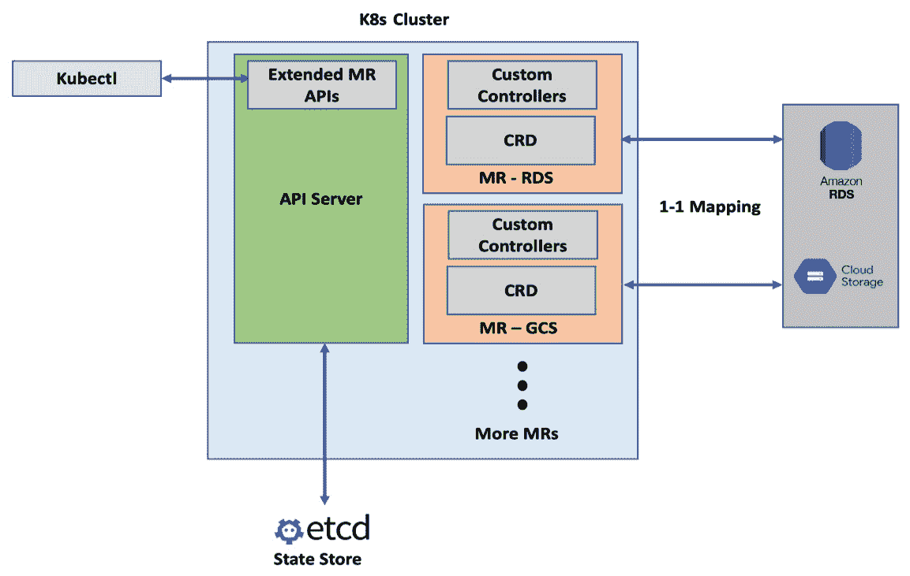

图 3.1 – MR 映射

**Crossplane 资源模型**（**XRM**）是开发 MR 时使用的开放标准。XRM 是 **Kubernetes 资源模型**（**KRM**）的一个有观点的扩展。XRM 设定了外部资源命名、依赖管理、包管理等方面的标准。MR 是构建 Crossplane 中一切的基本构件。我们可以直接使用 MR 来配置外部基础设施，但这很少发生。最佳实践是在 MR 之上组合一个更高层次的 API 来进行使用。我们将在本章后续部分以及专门的章节中深入探讨 *如何* 和 *为什么* 要这样做。以下 YAML 表示直接使用 MR 来配置 CloudSQLInstance：

```
apiVersion: database.gcp.crossplane.io/v1beta1
```

```
kind: CloudSQLInstance
```

```
metadata:
```

```
  name: my-GCP-DB
```

```
spec:
```

```
  forProvider:
```

```
    databaseVersion: POSTGRES_9_6
```

```
    region: asia-south2
```

```
    settings:
```

```
      tier: db-n1-standard-1
```

```
      dataDiskSizeGb: 10
```

```
  writeConnectionSecretToRef:
```

```
    namespace: DB
```

```
    name: my-GCP-DB-credentials
```

该 YAML 将根据配置中提到的资源约束来创建一个 GCP Cloud SQL 实例。由于 MR 是映射到基础设施提供程序 API 的低级 Crossplane 构件，它将直接支持基础设施 API 中所有可用的属性。Crossplane 控制器的调和控制循环将为配置 YAML 中未提供的功能填充由基础设施 API 分配的默认值。MR 的这一概念被称为延迟初始化。我们在 `forProvider:` 部分提供的内容将代表基础设施 API 的属性。如果有人或并行进程对基础设施资源进行了未经授权的更改，Crossplane 将回滚这些更改，并恢复 YAML 中提到的事实来源。配置的其余部分将有助于确定 Crossplane 的其他行为。例如，前面的 YAML 中有 `writeConnectionSecretToRef:` 用于决定如何保存数据库凭证。可能还会有更多此类行为控制，我们将在后面的内容中进一步学习。以下命令可以帮助查看已创建的 GCP 资源的详细信息，并在测试后清理资源：

```
# View the resources created with
```

```
kubectl get cloudsqlinstance my-GCP-DB
```

```
kubectl describe cloudsqlinstance my-GCP-DB
```

```
# Delete the resources created with
```

```
kubectl delete cloudsqlinstance my-GCP-DB
```

我们还可以将现有的已配置基础设施导入到 Crossplane 生态系统中。MR 会在进行新资源配置之前检查配置 YAML 中指定的资源是否已经存在。当我们为现有基础设施构建 YAML 文件时，可以提供需要由对接循环在 `forProvider` 下维护的授权属性。在下一章中，我们将查看如何将现有基础设施导入到 Crossplane 的示例。

提示

Crossplane 行为控制的一个可能选项是删除策略，通过一个名为 **deletionPolicy** 的属性指定。它有两个可能的值——**Delete**（默认值）和 **Orphan**。Delete 会从基础设施提供者中移除资源，而 Orphan 仅仅移除 Crossplane 的引用。

## 提供者

提供者是一组相关的 MRs，打包成一个捆绑包。每个云服务供应商、其他基础设施服务（例如 Rook——Kubernetes 的云原生存储，[`rook.io/`](https://rook.io/)）以及像 Helm 这样的软件工具都有各自的提供者包。这些包的格式就是一个容器镜像。安装一个提供者可以通过配置 YAML 文件或使用 Helm 包来完成。在我们开始使用这些包之前，必须先配置一个 ProviderConfig 配置。ProviderConfig 资源帮助我们设置基础设施供应商的凭证。我们将在本章的下一节中讨论提供者的安装和 ProviderConfig 的设置。

下图表示 AWS 和 GCP 提供者扩展 Crossplane，用于相应的云资源配置：

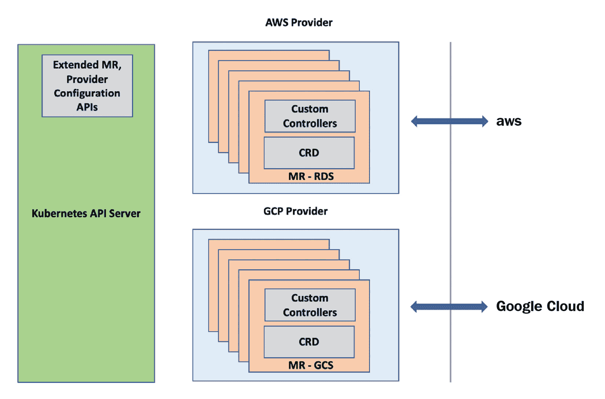

图 3.2 – 提供者视图

## 组合资源

每个组织在其结构、规模、运营模式、技术成熟度、合规性和安全要求方面都有所不同。所有这些方面将直接创造一套用于基础设施供应和使用的政策规则。此外，组装基础设施堆栈的多个组件也存在复杂性。组合是一种方法，它可以在一个或多个 MR API 之上构建我们定制的基础设施 API。这些自定义 API 可以编码所有的政策指导原则，并将多个基础设施组件组装成简单、易于使用的基础设施配方。这些 API 被称为**复合资源**（**XRs**）。关键点是，Crossplane 允许我们以无代码的方式定义这些资源，仅通过配置即可实现。在没有 Crossplane 复合的情况下，我们最终将不得不构建复杂的 Kubernetes 自定义控制器。Composition 和**复合资源定义**（**XRD**）是我们用来组合更高层次 XR API 的配置。XRD 定义了我们正在构建的新自定义 API 的架构，它是一个新的 CRD 定义。Composition 是提供新 CRD 架构和现有 MR 之间映射关系的配置。一旦新的 XR 资源可用，我们就可以使用资源声明对象开始供应基础设施配方。Claim API 是当我们添加新的 XR API 时创建的，前提是我们在 XRD 配置中请求了它。Claim 和 XR API 几乎相同，只有一些细微的差别，我们将在后续章节中探讨。下图展示了我们如何使用 GCP 提供商的 CloudSQLInstance、防火墙和网络 MR 来构建一个 XPOSTGRES 数据库复合资源：

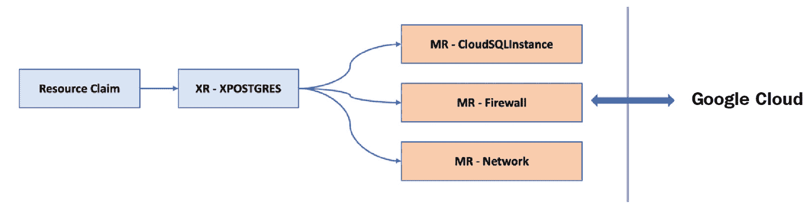

图 3.3 – 复合资源

我们有成千上万的云管理服务，具有许多需要详细配置的属性。这给筛选选项和实施资源供应带来了显著的认知负担，需要设置适合我们组织需求的良好护栏。每个产品团队都无法承担这种程度的认知负担。通常，组织会使用平台团队来抽象这种认知负担。组合层是供平台团队构建这种抽象的。Crossplane 使我们能够将这些抽象作为 Kubernetes API 暴露，从而为产品团队提供自助服务。下图展示了平台团队和产品团队的互动模型：

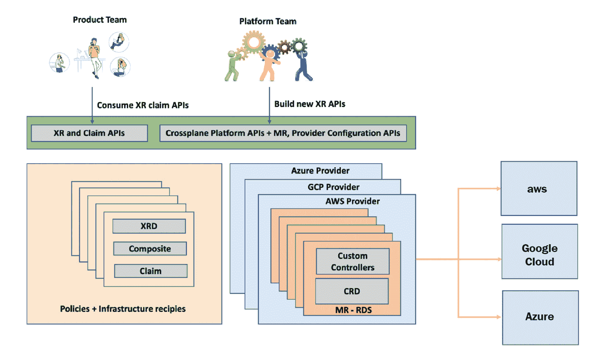

图 3.4 – 产品团队和平台团队互动

## Crossplane 核心

在设置我们感兴趣的提供者并在其上构建 XR 之前，我们需要在集群中安装 Crossplane 核心组件。该组件提供了管理多个提供者、构建新 XR 和新包所需的原语。再次强调，核心组件是 CRD 和自定义控制器的集合。它是将 Crossplane 其他所有部分联系在一起的粘合剂。下图展示了所有组件如何在 Kubernetes 生态系统中配合工作：

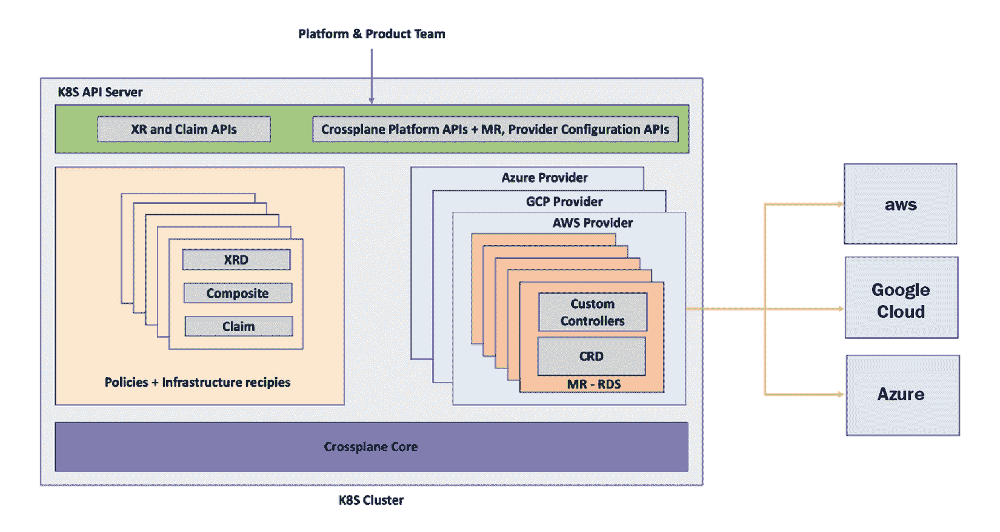

图 3.5 – Crossplane 的所有组件

让我们回顾一下迄今为止使用过的一些缩写，今后我们将继续使用它们：

+   **CRD** 代表 **自定义资源定义**，它是一种扩展 Kubernetes API 以支持新资源类型的方法。

+   CR 是通过 CRD 定义的资源。**CR** 代表 **自定义资源**。

+   **XRM** 代表 **跨平面资源模型**，是 **Kubernetes 资源模型** 的扩展。它是 Crossplane 制定的一套规则，用于构建 XR 或 MR。

+   **MRs** 仅仅是 **托管资源**，它是 CRD 和自定义控制器与外部基础设施资源一对一映射的组合。

+   **XRD** 代表 **组合资源定义**，它是构建自定义基础设施 API 的定义，位于 Crossplane 之上。

+   **XR** 代表 **组合资源**，它表示使用 Crossplane 构建的自定义基础设施 API。

# 安装 Crossplane

我已经在我的 Macintosh 电脑上设置了一个本地 Kubernetes 集群。我们将在教程中将此集群作为 Crossplane 控制平面，从 Google Cloud Platform 中提供资源。为了跟随教程，我们假设你已经能够访问一个 Kubernetes 集群。如果你需要帮助设置本地 Kubernetes 集群，请参考 [`kind.sigs.k8s.io/`](https://kind.sigs.k8s.io/)。kind 是设置本地 Kubernetes 集群的最简单方式之一，但你可以使用任何 Kubernetes 集群设置进行教程操作。以下截图快速展示了集群信息、版本和节点详情：

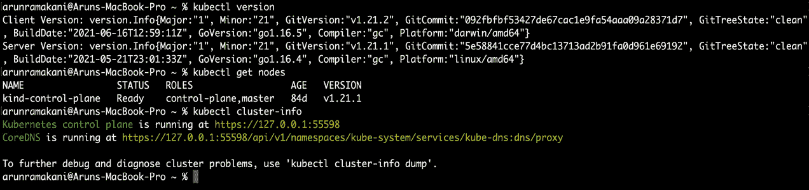

图 3.6 – 集群信息、版本和节点详情

虽然有几种方法可以在 Kubernetes 中安装 Crossplane，我们将通过 Helm 图表来安装它。确保你已经安装了 Helm。在 Macintosh 和 Windows 上，通过 `brew` 或 `choco` 包管理器安装 Helm 非常简单。以下命令可以在你的环境中安装 `helm`：

```
# Install helm in mac
```

```
brew install helm
```

```
# Install helm in windows
```

```
choco install kubernetes-helm
```

有关更多安装选项，请访问 [`helm.sh/docs/intro/install/`](https://helm.sh/docs/intro/install/)。对于 Crossplane 安装，我们需要至少 v1.16.0 的 Kubernetes 版本和至少 v3.0.0 的 Helm 版本。Crossplane 有 Master 和 Stable 两个版本。Master 版本包含最新的提交，但可能会有稳定性问题。Stable 版本是为社区使用准备的，建议用于生产环境。在本教程中，我们将使用 Crossplane 的 Stable 版本。Crossplane 的安装分为三步，如下所示：

1.  创建一个新的目标命名空间 `crossplane-system` 用于安装。

1.  将 Crossplane 仓库添加并更新到 `helm` 仓库列表中。

1.  在目标命名空间中使用 `helm` 安装 Crossplane。

代码如下：

```
# Step 1: Create target namespace 
```

```
kubectl create namespace crossplane-system
```

```
# Step 2: Add crossplane stable repo to helm and update 
```

```
helm repo add crossplane-stable \ https://charts.crossplane.io/stable
```

```
helm repo update
```

```
# Step 3: Install Crossplane
```

```
helm install crossplane --namespace crossplane-system crossplane-stable/crossplane
```

Crossplane Helm 图表支持许多模板值，用于自定义配置选项。副本数就是其中一个例子，它指定在高可用性设置中要运行多少个 Crossplane Pod。可以在 Artifact Hub 上查看 Crossplane Helm 模板的所有可能配置选项。安装截图如下：

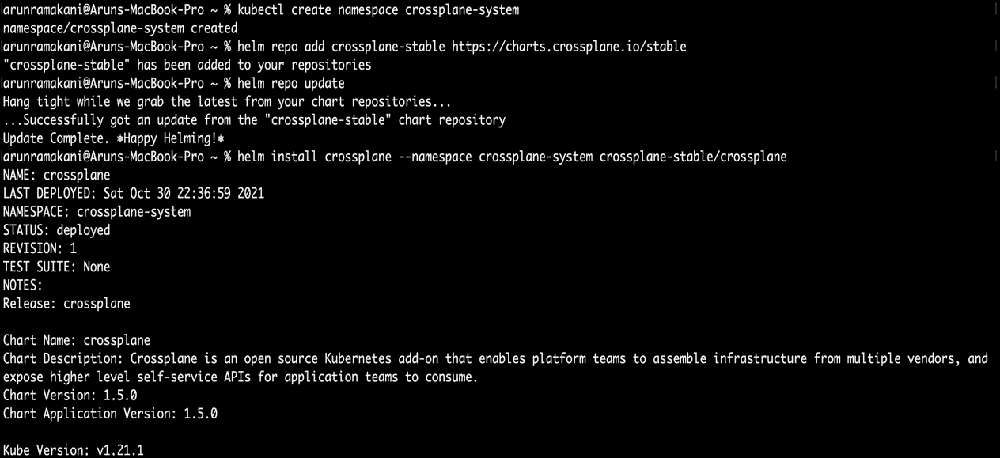

图 3.7 – Crossplane 安装

我们可以使用标准的 `helm delete` 命令来删除 Crossplane 安装：

```
# To remove Crossplane
```

```
helm delete crossplane --namespace crossplane-system
```

结果截图如下：

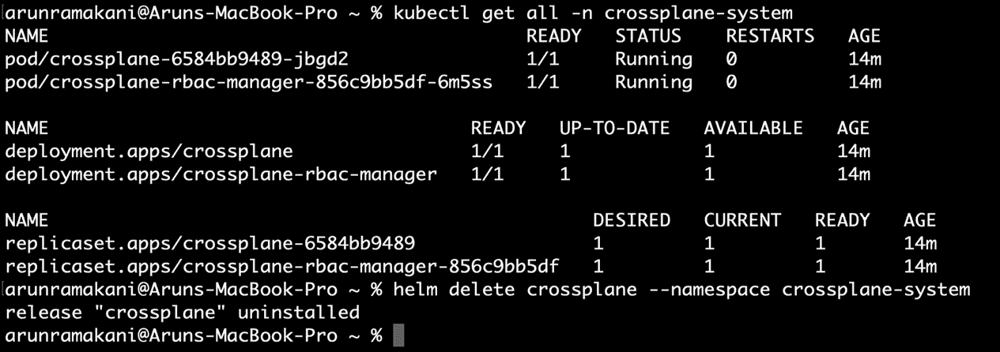

图 3.8 – Crossplane 安装健康状况

现在我们已经安装了 Crossplane，接下来的部分将教你如何安装和配置提供程序。

# 安装和配置提供程序

一旦我们在 Kubernetes 集群中安装了 Crossplane 核心组件，接下来的步骤是安装和配置 Crossplane 提供程序。在本教程中，我们将安装和配置 GCP 提供程序。我们可以通过三步过程来完成：

1.  设置云账户

1.  安装提供程序

1.  配置提供程序

我们将在接下来的部分中通过逐步指南详细讲解这些方面。

## 设置云账户

我们需要拥有一个启用了项目和计费设置的 Google Cloud 账户。Google Cloud 为新用户提供 300 美元的信用额度，供用户学习和实验，最多 3 个月，前提是你拥有信用卡。这对于我们学习 Crossplane 和其他基础设施自动化概念来说绰绰有余。我们需要做的就是登录 Google Cloud 账户，填写表单并开始免费试用。接下来的步骤是为我们实验 Crossplane 创建一个单独的项目空间。你可以通过点击 GCP 控制台顶部栏的项目下拉菜单，然后点击 **NEW PROJECT** 来创建一个新项目，如下图所示：

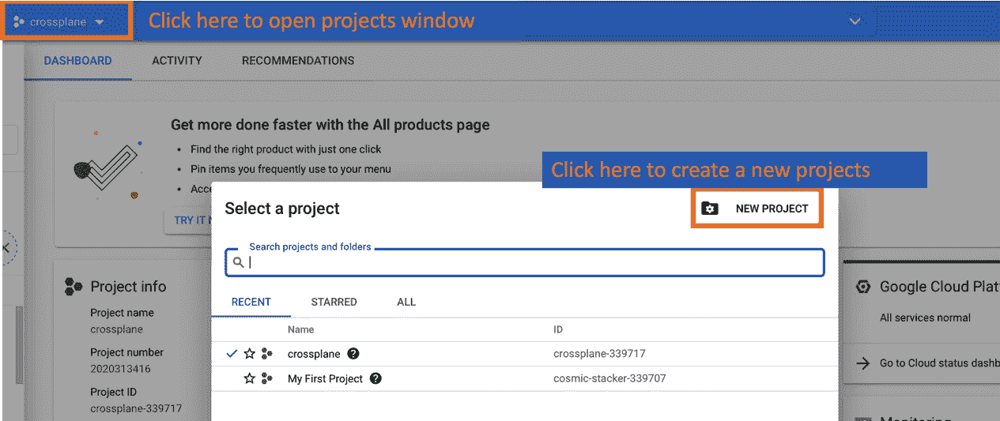

图 3.9 – 创建一个新的 GCP 项目

一旦我们拥有 GCP 帐户、免费额度和项目启动，下一步就是启用所有所需的云 API 访问。我们将使用`gcloud` CLI 来完成此操作。请从[`cloud.google.com/sdk/docs/install`](https://cloud.google.com/sdk/docs/install)下载 CLI 并按照以下步骤操作：

1.  下载后安装`gcloud` CLI：

    ```
    ./google-cloud-sdk/install.sh
    ```

1.  使用云凭证和项目初始化 SDK：

    ```
    gcloud init
    ```

`gcloud init`将引导我们通过浏览器进行身份验证。一旦我们成功提供必要的访问权限，CLI 会要求我们选择项目。现在，我们应该能够使用以下命令启用所需的云服务：

```
# Enable Kubernetes APIs , CloudSQL APIs, Network APIs and Compute APIs
```

```
gcloud services enable container.googleapis.com
```

```
gcloud services enable sqladmin.googleapis.com
```

```
gcloud services enable compute.googleapis.com
```

```
gcloud services enable servicenetworking.googleapis.com
```

结果截图如下：

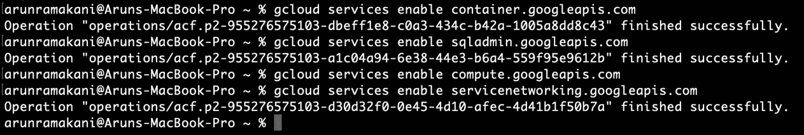

图 3.10 – 启用云 API

完成启用项目的 API 访问后，下一步是创建服务帐户并提取设置 GCP Crossplane 提供程序所需的凭证。它涉及几个步骤：

1.  查找项目 ID，以便在接下来的必要命令中使用：

    ```
    gcloud projects list --format='value(project_id)'
    ```

1.  创建服务帐户，获取名称，并在服务帐户上启用所需的角色。请注意，以下所有命令中的`crossplane-330620`是我的 Google 项目 ID，您需要将其替换为您的 Google 项目 ID。使用之前的命令来查看您的项目 ID 列表。类似地，`crossplane-service-account@crossplane-330620.iam.gserviceaccount.com`是我在 GCP 环境中创建的服务帐户名称。将其替换为您的服务帐户名称。您可以通过执行以下代码块中的第二个命令来列出服务帐户，以获取您的服务帐户名称：

    ```
    # Create service account
    gcloud iam service-accounts create crossplane-service-account --display-name "crossplane service account" --project=crossplane-330620
    # Get the name of the service account
    gcloud iam service-accounts list --filter="email ~ ^crossplane-service-account" --format='value(email)'
    # Add required IAM role to the service account
    gcloud projects add-iam-policy-binding crossplane-330620 --member "serviceAccount:crossplane-service-account@crossplane-330620.iam.gserviceaccount.com" --role="roles/iam.serviceAccountUser"
    gcloud projects add-iam-policy-binding crossplane-330620 --member "serviceAccount:crossplane-service-account@crossplane-330620.iam.gserviceaccount.com" --role="roles/cloudsql.admin"
    gcloud projects add-iam-policy-binding crossplane-330620 --member "serviceAccount:crossplane-service-account@crossplane-330620.iam.gserviceaccount.com" --role="roles/container.admin"
    gcloud projects add-iam-policy-binding crossplane-330620 --member "serviceAccount:crossplane-service-account@crossplane-330620.iam.gserviceaccount.com" --role="roles/redis.admin"
    gcloud projects add-iam-policy-binding crossplane-330620 --member "serviceAccount:crossplane-service-account@crossplane-330620.iam.gserviceaccount.com" --role="roles/compute.networkAdmin"
    gcloud projects add-iam-policy-binding crossplane-330620 --member "serviceAccount:crossplane-service-account@crossplane-330620.iam.gserviceaccount.com" --role="roles/storage.admin"
    ```

1.  使用以下第一个命令提取服务帐户文件：

    ```
    gcloud iam service-accounts keys create crossplane-service-account.json --iam-account crossplane-service-account@crossplane-330620.iam.gserviceaccount.com
    ```

1.  最后，使用服务帐户文件创建一个 Kubernetes Secret。该 Secret 将在我们进行提供程序配置时被引用，您将在下一部分看到：

    ```
    kubectl create secret generic gcp-account -n crossplane-system --from-file=creds=./crossplane-service-account.json 
    ```

## 安装提供程序

现在让我们安装 GCP Crossplane 提供程序。我们需要运行以下提供程序资源 YAML，并使用最新的 GCP 提供程序容器镜像版本。当前可用的稳定版本是 v0.18.0。执行时请根据需要更新版本：

```
apiVersion: pkg.crossplane.io/v1
```

```
kind: Provider
```

```
metadata:
```

```
  name: provider-gcp
```

```
spec:
```

```
  package: crossplane/provider-gcp:v0.18.0
```

应用 YAML 并验证提供程序容器是否正在运行：

```
kubectl apply -f Provider.yaml
```

```
kubectl get all -n crossplane-system
```

结果截图如下：

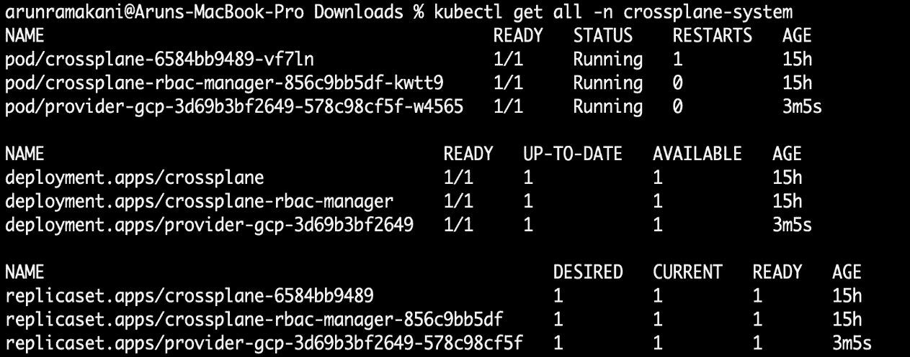

图 3.11 – 运行 GCP 提供程序

## 配置提供程序

最后一步是使用`ProviderConfig` Crossplane API 设置提供程序配置以进行身份验证。准备凭证对于每个提供程序可能略有不同，具体取决于基础设施供应商的身份验证构造。对于 GCP，它将是服务帐户；对于 Azure，它是服务主体；对于 AWS，它是 IAM，依此类推。以下 YAML 将为 GCP 提供程序配置凭证：

```
apiVersion: gcp.crossplane.io/v1beta1
```

```
kind: ProviderConfig
```

```
metadata:
```

```
  name: gcp-credentials-project-1 
```

```
spec:
```

```
  projectID: crossplane-330620
```

```
  credentials:
```

```
    source: Secret
```

```
    secretRef:
```

```
      namespace: crossplane-system
```

```
      name: gcp-account
```

```
      key: service-account
```

GCP 提供者配置的几个关键方面包括项目 ID 引用和服务帐户凭据。我们需要在`projectID:`下提供我们的 GCP 项目 ID。对于其他基础设施提供者配置（如 AWS），我们没有这个配置元素。请注意，前面提到的提供者配置引用了 Kubernetes Secrets。应用 YAML 文件并通过以下命令验证提供者配置：

```
kubectl apply -f providerconfig.yaml
```

```
kubectl get providerconfig
```

结果截图如下：

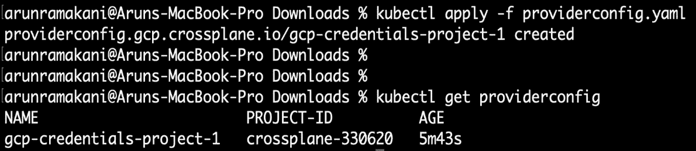

图 3.12 – GCP 提供者配置

通过这些步骤，我们完成了 Crossplane 安装、GCP 提供者设置和配置。其他提供者设置也大致与 GCP 相似。现在，环境已准备好通过 MR 配置 GCP 资源，或者我们可以开始在 MR 之上编写 XR API。

# 多提供者配置

我们可以配置多个 ProviderConfig 对应一个提供者。就像拥有多个凭据或云账户来访问云平台，并根据给定的上下文选择合适的凭据一样。在使用 MR 或 XR 配置基础设施资源时，我们通过 `providerConfigRef:` 指定在给定上下文中使用哪个 ProviderConfig。如果在 MR 或 XR 中没有提供 `providerConfigRef:`，Crossplane 将引用名为 `default` 的 ProviderConfig。通过这种方式将基础设施资源组织在不同凭据下，可以帮助我们管理基础设施账单，并根据组织结构以组的方式维护资源。以下 YAML 文件将使用前面章节中创建的名为 `gcp-credentials-project-1` 的提供者配置，从 GCP 配置 POSTGRES：

```
apiVersion: database.gcp.crossplane.io/v1beta1
```

```
kind: CloudSQLInstance
```

```
metadata:
```

```
  name: my-GCP-DB
```

```
spec:
```

```
  # Reference to use a specific provider config 
```

```
  providerConfigRef:
```

```
    name: gcp-credentials-project-1
```

```
  forProvider:
```

```
    databaseVersion: POSTGRES_9_6
```

```
    region: asia-south2
```

```
    settings:
```

```
      tier: db-n1-standard-1
```

```
      dataDiskSizeGb: 10
```

以下图示表示多个团队使用不同的提供者配置：

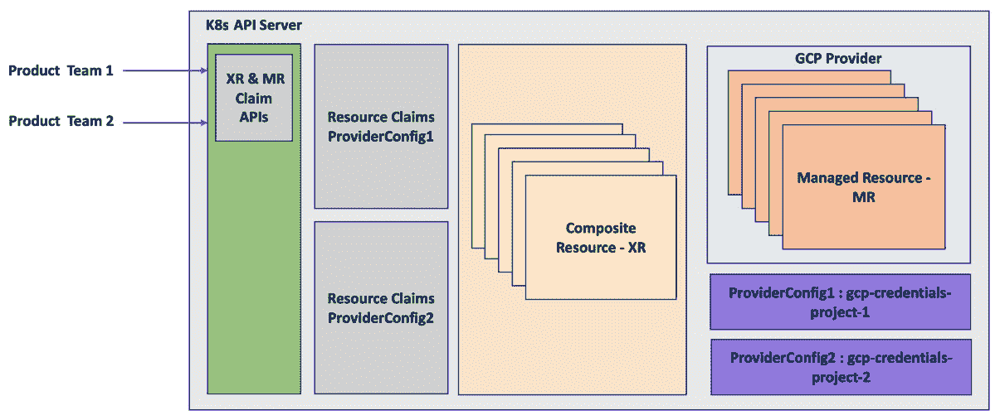

图 3.13 – 多提供者配置

# POSTGRES 配置示例

现在是时候进行实际的配置体验了。我们将使用 GCP 中的 `CloudSQLInstance`，它是 GCP Crossplane 提供者中可用的 MR，来创建一个 POSTGRES 实例。通过 MR 或 XR 直接配置基础设施资源并不是一个好的策略。相反，我们应该使用通过 XR 创建的 claim 对象来进行配置。下一章将专门讨论这些主题。目前，我们使用 MR 进行资源配置，以便理解 Crossplane 的基本构建模块。在配置资源时，我们将使用以下属性：

+   配置的资源名称应为 `db-gcp`。

+   配置的区域将是 `us-central`。

+   我们将请求 POSTGRES 版本 9.6 – `POSTGRES_9_6`。

+   数据磁盘的大小应该是 20 GB。

+   数据库的 GCP 等级应该是 `db-g1-small`。

+   在 `gcp-credentials-project-1` 提供者配置下创建资源。

+   数据库凭证应放入 `crossplane-system` 命名空间，并使用名为 `db-conn` 的 Secret。

这些只是一些可能的参数。CloudSQLInstance 的完整 API 文档可以在 [`doc.crds.dev/github.com/crossplane/provider-gcp/database.gcp.crossplane.io/CloudSQLInstance/v1beta1@v0.18.0`](https://doc.crds.dev/github.com/crossplane/provider-gcp/database.gcp.crossplane.io/CloudSQLInstance/v1beta1@v0.18.0) 查阅。请注意，有一些 API 参数是必填的，这些在 YAML 中是强制要求的。以下 YAML 代码将根据指定的属性配置 GCP 的 POSTGRES：

```
apiVersion: database.gcp.crossplane.io/v1beta1
```

```
kind: CloudSQLInstance
```

```
metadata:
```

```
  name: db-gcp
```

```
spec:
```

```
  providerConfigRef:
```

```
    name: gcp-credentials-project-1
```

```
  writeConnectionSecretToRef:
```

```
    namespace: crossplane-system
```

```
    name: db-conn
```

```
  forProvider:
```

```
    databaseVersion: POSTGRES_9_6
```

```
    region: us-central
```

```
    settings:
```

```
      tier: db-g1-small
```

```
      dataDiskSizeGb: 20
```

一旦应用 YAML 代码，你可以在 GCP 控制台中看到配置的资源。使用以下命令查看资源的状态。注意，初始时，我们会看到状态为待创建（`PENDING_CREATE`），随后会变为可运行（`RUNNABLE`）。另外，我们还可以看到数据库凭证已经出现在 Secrets 中：

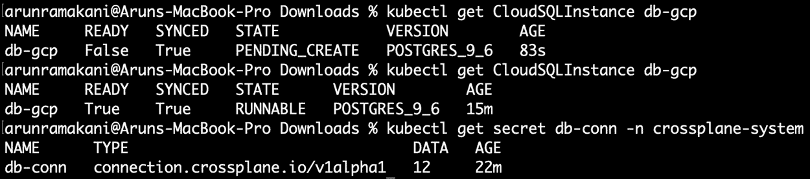

图 3.14 – 数据库配置

假设我们在 GCP 控制台查看数据库详细信息，并更改数据库机器类型，Crossplane 会将其恢复到 YAML 代码中提到的原始级别。尝试更改并查看状态变化很有趣。初始时，当我们更改控制台设置时，系统会进入维护模式，然后 Crossplane 会发现有更改，使资源处于不同步状态。接着，Crossplane 会将资源恢复到原始状态。请参考以下截图并查看每列中的值（`STATE`、`SYNCED` 和 `READY`）：

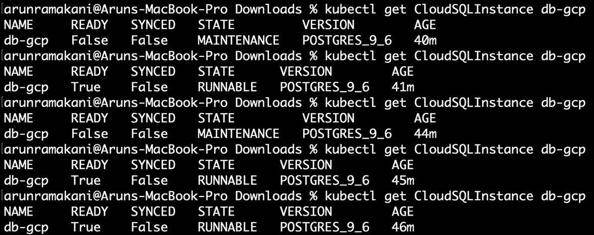

图 3.15 – 协调循环

最后，资源将同步。我们可以根据删除策略清理配置的资源：

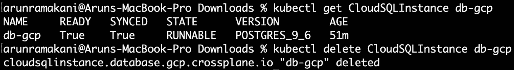

图 3.16 – 最终状态

提示

如果你想在供应商基础设施中创建一个与 Crossplane 资源声明不同名称的资源，可以在元数据部分使用 `crossplane.io/external-name:my-special-name` 注解。

本书中讨论的所有示例都可以参考 [`github.com/PacktPublishing/End-to-End-Automation-with-Kubernetes-and-Crossplane`](https://github.com/PacktPublishing/End-to-End-Automation-with-Kubernetes-and-Crossplane)。

# 总结

我们从理解 CRD 和自定义控制器开始，然后了解 Kubernetes 资源扩展点的概念，这些都是 Crossplane 的构建块。接着，我们讲解了各种 Crossplane 组件、它们的架构以及这些组件如何协同工作。最后，我们通过安装 Crossplane 及其 GCP 提供程序，并进行 Postgres 数据库配置的实验，进行了动手操作。现在，我们已经了解了 Crossplane 的完整工作流程，这也标志着本章的结束。在下一章中，我们将学习更高级的 Crossplane 概念。
