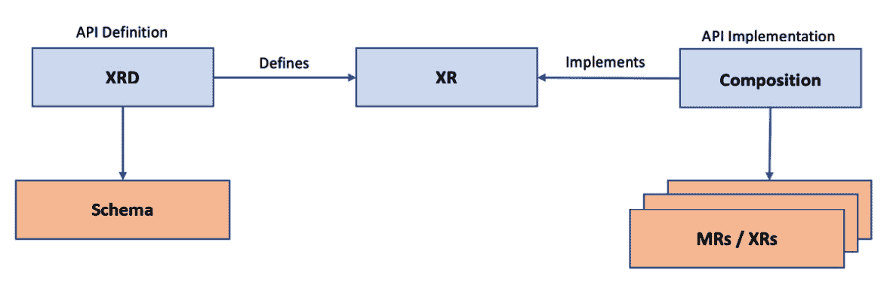

# *第四章*: 使用 Crossplane 组合基础设施

组合是 Crossplane 的一个强大构造，使其在同类产品中独树一帜，如 Open Service Broker API 或 AWS Kubernetes 控制器。以无代码的方式组织基础设施方案的能力，完美契合了组织在构建精益平台团队时对敏捷的期望。本章将带我们从头到尾学习组合。我们将从详细了解 Crossplane **复合资源**（**XR**）如何工作开始，然后一步步深入了解如何构建一个 XR。

本章将覆盖以下主题：

+   感觉像一个 API 开发者

+   XR 如何工作？

+   XR 后配置

+   预配置资源

+   构建 XR

+   故障排除

# 感觉像一个 API 开发者

传统上，基础设施工程师了解最深刻的基础设施配置选项和不同的基础设施设置模式。但他们可能没有构建 API 的经验。使用 Crossplane 构建基础设施平台将是这些传统方式的一种转变。现代基础设施平台开发者应该具备两方面的知识，即基础设施和 API 工程。作为平台开发者，构建基础设施 API 意味着实现以下方面：

+   随着时间的推移，API 会不断演变。这包括引入新的 API、更新现有的 API 版本以及废弃旧的 API。

+   为消费产品团队应用 API 跨领域关注点，如认证、授权、缓存和审计。

+   在 API 中封装不同的基础设施策略。

+   构建跨团队共享的可复用基础设施方案。例如，一些产品团队可能使用 **MEAN** 技术栈（**MongoDB、Express.js、AngularJS 和 Node.js**）开发应用程序。我们可能有兴趣为这个技术栈开发作为模板 API 的基础设施配置。

+   构建跨团队共享的基础设施。例如，我们可能希望提供一个虚拟私人网络，供不同的基础设施资源共享。

+   考虑到不同的基础设施方案和共享基础设施，达成并不断演进正确的 API 边界。我们必须进行权衡分析，以处理基础设施方案和共享基础设施之间的冲突。

基础设施方案和共享基础设施是 API 边界上下文权衡中的重要因素。我们将在接下来的章节中详细探讨这一点。下图展示了 API 基础设施工程的细节：


图 4.1 – API 基础设施工程

我们正在从这些方面入手，以便尽可能最佳地理解 XR 架构。Crossplane 复合体的每个元素都是从 API 角度设计的，以覆盖基础设施工程实践。

提示

我们可以利用微服务架构模式的经验来定义基础设施 API 边界。没有完美的边界，每种设计方案都会有优缺点。在*第六章*《更多 Crossplane 模式》中，我们可以寻找将微服务与 Crossplane 基础设施平台结合的方法。

# XR 是如何工作的？

XR 可以在后台做两件事。第一个目的是将相关的**托管资源**（**MRs**）组合成一个堆栈，并构建可重用的基础设施模板 API。当我们这样做时，可能会应用不同的模式，例如应用之间共享资源或用于更快速提供的缓存基础设施。第二个目的是在抽象了所有组织策略后，只向应用团队公开有限的基础设施 API 属性。随着本章的深入，我们将详细探讨实现这些方面的细节。以下是 XR 中的关键组件：

+   **复合资源定义**（**XRD**）

+   组成

+   声明

让我们开始查看每个组件的目的以及它们如何相互作用。

## XRD

`CompositeResourceDefinition` 是用于定义 XRD 的 Crossplane 配置元素。创建此配置就像编写 OpenAPI 规范或 Swagger API 定义。以下是 `CompositeResourceDefinition` 配置 YAML 的关键方面：

+   新 API 的 `kind` 属性。请注意，使用 *X* 作为 XR 名称的前缀是标准做法。

+   **API 组**: 这将帮助我们逻辑地分组 API，避免命名冲突，并管理授权。

+   `<resource plural name>.<API group>`。

+   `versions` 元素是一个数组，可以容纳同一 XR API 的多个版本配置。通常，在我们开始时，只会有一个版本。随着时间的推移，我们将随着变化增加 API 版本。旧版本可能会变成技术负担，需要在之后弃用。

+   `served` 元素将指示给定版本的 XR API 是否已经提供服务。`referenceable` 标志将决定我们是否可以为给定的 API 版本定义实现。我们可以在*第五章*《探索基础设施平台模式》中更深入地研究版本管理和这些属性。现在，当我们在 XRD 中定义了唯一版本时，两个标志都将为 `true`。

+   **Schema**: 这是每个版本下的一个部分，涵盖了实际的 OpenAPI 规范。它包括诸如参数列表、数据类型和必需参数等详细信息。

+   **连接密钥**: 这将包含需要在资源提供后创建并填充到 Kubernetes Secrets 中的密钥列表。

+   `DefaultCompositionRef` 和 `EnforcedCompositionRef` 是提供这种灵活性的几个属性。

+   **Claim 名称**：这些是可选参数，用于为指定名称的 XR API 创建一个代理 API。应用 claim 对象的创建、删除和更新操作将创建、删除和更新底层 XR。Claims 是 Crossplane 中的关键组件，我们将在本章稍后的专门主题中讨论它。

XRD 仅仅是一个有特定意见的 **自定义资源定义**（**CRD**），许多配置部分看起来像 CRD。这些只是一些可能的参数。随着我们继续阅读本书，我们还会看到更多参数。完整的 API 文档可以在 [`doc.crds.dev/github.com/crossplane/crossplane`](https://doc.crds.dev/github.com/crossplane/crossplane) 上找到。

提示

我们正在查看 Crossplane 文档的 v1.5.1 版本，这是本章撰写时的最新版本。请参考阅读时的最新版本以获取更准确的详细信息。

请注意，之前讨论的一些配置并不包含在下面的 YAML 中，例如 `DefaultCompositionRef` 和 `ConnectionSecretKeys`。如果未指定，这些配置会由 Crossplane 注入并采用默认行为。请参考以下 YAML 示例：

```
apiVersion: apiextensions.crossplane.io/v1
```

```
kind: CompositeResourceDefinition
```

```
metadata:
```

```
  #'<plural>.<group>'
```

```
  name: xclouddbs.book.imarunrk.com
```

```
spec:
```

```
  # API group
```

```
  group: book.imarunrk.com
```

```
  # Singular name and plural name.
```

```
  names:
```

```
    kind: xclouddb
```

```
    plural: xclouddbs
```

```
  # Optional parameter to create namespace proxy claim API
```

```
  claimNames:
```

```
    kind: Clouddb
```

```
    plural: Clouddbs
```

```
  # Start from alpha to beta to production to deprecated.
```

```
  versions:
```

```
  - name: v1
```

```
    # Is the specific version actively served
```

```
    served: true
```

```
    # Can the version be referenced from an API implementation
```

```
    referenceable: true
```

```
    # OpenAPI schema 
```

```
    schema:
```

```
      openAPIV3Schema:
```

```
        type: object
```

```
        properties:
```

```
          spec:
```

```
            type: object
```

```
            properties:
```

```
              parameters:
```

```
                type: object
```

```
                properties:
```

```
                  storageSize:
```

```
                    type: integer
```

```
                required:
```

```
                - storageSize
```

```
            required:
```

```
            - parameters
```

在完成 API 规范之后，下一步是构建 API 实现。Composition 是 Crossplane 用于提供 API 实现的构造。

## Composition

Composition 将一个或多个 MRs 与 XR API 关联。当我们创建、更新和删除 XR 时，相同的操作将应用于所有关联的 MRs。我们可以将 XRD 看作是 CRD，而 composition 则是自定义控制器实现。下面的图示展示了 XR、XRD、composition 和 MRs 之间的关系：



图 4.2 – XRM、composition 和 XR

提示

本书中我们提到 XR 有两种上下文。我们可以使用 XR 来指代我们正在构建的新基础设施 API。并且，composition 资源列表可以同时包含一个 MR 和一个现有的 XR。我们也会在那个上下文中提到 XR。请看 *图 4.2*，在其中 XR 被提及于两个维度。

让我们看一下 composition 配置中的一些关键元素：

+   `kind` 和 `apiVersion` 是在 `CompositeTypeRef` 下定义的两个配置元素。`kind` 用于指定 XR 名称，`apiVersion` 将引用在 XRD 中定义的特定版本。映射的版本应配置为在 XRD 中可以引用。

+   **WriteConnectionSecretsToNamespace**：此项将指定用于存储连接密钥的命名空间。

+   **资源**：这一部分是一个数组，包含创建、更新和删除 XR 时需要创建、更新和删除的 MR 列表。我们甚至可以在这一部分定义另一个 XR。这是一个必填部分，我们必须定义至少一个资源，可以是 MR 或 XR。Base 是每个资源下的关键对象，保存 XR/MR 配置模板。

+   `FromCompositeFieldPath` 是默认类型，使用最为频繁。它有助于将 XR 中的属性补丁到组合资源基础模板中，即将用户输入传入组合资源。`FromFieldPath` 和 `ToFieldPath` 是执行实际补丁操作的子属性。有一个补丁类型叫做 `ToCompositeFieldPath`，它的作用是执行与 `FromCompositeFieldPath` 相反的操作。我们可以使用这个补丁类型将字段从资源复制回 XR。`CombineFromComposite` 补丁类型在组合多个属性时最为适用。

+   `convert`用于类型转换，`math`用于数学运算，`map`用于键值操作。我们可以在给定的补丁中列出转换函数，它们按配置中指定的顺序执行。补丁和转换都是关键模式。在本书中，我们将查看不同的补丁和转换配置示例。

+   **Policy**：这些配置在每个补丁下，决定补丁行为。我们可以强制要求补丁路径的存在，因为默认行为是在字段缺失时跳过补丁。同时，我们可以配置在对对象执行补丁时的合并行为。

+   **ConnectionDetails**：这些是在每个资源下指定的，将保存我们希望回传到 XR 的密钥列表。

+   **ReadinessChecks**：这些允许我们定义任何自定义的就绪检查逻辑。如果没有提供该部分，则默认行为是在所有组合资源就绪时将 XR 状态标记为已就绪。

+   `spec.parameters.storageSize` 或 `spec.versions[0].name`。

我们已覆盖了组合配置中大部分可用的选项。请查看 Crossplane 文档，了解完整的选项列表。下图展示了组合配置选项及其相互关系：


](img/B17830_04_03.jpg)

图 4.3 – 组合配置

以下是一个示例的组合配置 YAML：

```
apiVersion: apiextensions.crossplane.io/v1
```

```
kind: Composition
```

```
metadata:
```

```
  name: xclouddb-composition
```

```
spec:
```

```
  # Link Composition to a specific XR and version
```

```
  compositeTypeRef:
```

```
    apiVersion: xclouddb.book.imarunrk.com/v1
```

```
    kind: Xclouddb
```

```
  # Connection secrets namespace
```

```
  writeConnectionSecretsToNamespace: crossplane-system
```

```
  # List of composed MRs or XRs.
```

```
  resources:
```

```
  - name: clouddbInstance
```

```
    # Resource base template
```

```
    base:
```

```
      apiVersion: database.gcp.crossplane.io/v1beta1
```

```
      kind: CloudSQLInstance
```

```
      spec:
```

```
        forProvider:
```

```
          databaseVersion: POSTGRES_9_6
```

```
          region: us-central
```

```
          settings:
```

```
            tier: db-g1-small
```

```
            dataDiskSizeGb: 20
```

```
    # Resource patches 
```

```
    patches:
```

```
    - type: FromCompositeFieldPath
```

```
      fromFieldPath: spec.parameters.storageSize
```

```
      toFieldPath: spec.forProvider.settings.dataDiskSizeGb
```

```
    # Resource secrets
```

```
    connectionDetails:
```

```
    - name: hostname
```

```
      fromConnectionSecretKey: hostname
```

我们将在*构建 XR*一节中介绍一个包含更多配置元素的示例。一个 XRD 版本可以有多个组合，也就是 XRD 版本与组合之间的一对多关系。它为我们的基础设施 API 提供了多态行为，以便根据上下文进行工作。例如，我们可以为生产和暂存环境定义不同的组合。XR 中定义的 `CompositionRef` 属性可以引用特定的组合。除了 `CompositionRef`，我们还可以使用 `CompositionSelector` 基于标签匹配组合。


图 4.4 – XR 和组合关系

在下一节中，我们将查看**XR 声明**，也称为**声明**。

## 声明

声明是对 XR 的代理 API，通过在 XRD 配置中提供声明名称属性来创建。一般做法是提供 XR 的精确名称，并去掉最前面的 `X`。在上述示例中，`xclouddb` 是 XR 名称，`Clouddb` 是声明名称，但遵循这种命名约定并非强制要求。声明与 XR 非常相似，可能会让我们认为它是一个不必要的代理层。然而，声明在许多方面都是有帮助的，例如：

+   XRs 是集群级别的资源，而声明是命名空间级别的。这使我们能够创建命名空间级别的授权。例如，我们可以根据不同产品团队的命名空间所有权，分配不同的权限。

+   我们可以将某些 XR 仅作为集群级别的平台团队专用私有 API。例如，平台团队可能不希望公开创建虚拟专用网络的 XR API。

+   在命名空间级别管理某些资源并不理想，因为这些资源是多个团队共享的，无法适应上下文。

+   我们还可以使用这种模式来支持基础设施的预配置。声明可以通过引用已经预配置的 XR 基础设施，保持较低的配置时间。这与缓存非常相似。

下图表示声明、XR、XRD、组合和 MR 之间的关系，提供了一个端到端的视图，展示了整个概念的工作方式：


图 4.5 – 组合是如何工作的？

以下是示例声明和 XR 的 YAML。声明 YAML 如下：

```
apiVersion: book.imarunrk.com/v1
```

```
# Kind name matches the singular claim name in the XRD
```

```
kind: Clouddb
```

```
metadata:
```

```
  name: cloud-db
```

```
spec:
```

```
  # Parameters to be mapped and patched in the composition 
```

```
  parameters:
```

```
    storageSize: 20
```

```
  # Name of the composition to be used
```

```
  compositionRef:
```

```
    name: xclouddb-composition
```

```
  writeConnectionSecretToRef:
```

```
    namespace: crossplane-system
```

```
    name: db-conn
```

声明 YAML 中不包含命名空间部分。因此，它将在默认命名空间中创建资源，这是 Kubernetes 的标准。与上述声明 YAML 等效的 XR YAML 如下：

```
apiVersion: book.imarunrk.com/v1
```

```
kind: XClouddb
```

```
metadata:
```

```
  name: cloud-db
```

```
spec:
```

```
  parameters:
```

```
    storageSize: 20
```

```
  compositionRef:
```

```
    name: xclouddb-composition
```

```
  writeConnectionSecretToRef:
```

```
    namespace: crossplane-system
```

```
    name: db-conn
```

请注意，XR 总是以集群级别创建，元数据下的命名空间配置不适用。我们可以在*构建 XR*一节中查看更详细的声明和 XR 配置。让我们从后置配置的角度，探索更多 XR、XRD、组合和声明配置。

# XR 的后置配置

在对声明或 XR 资源执行 CRUD 操作后，以下是完成 API 请求的一些关键方面：

+   就绪检查

+   修补状态

+   将凭据传播回来

让我们从学习就绪检查开始。

## 就绪检查

当所有底层资源都准备就绪时，XR 状态将默认就绪。组合中的每个资源元素都可以定义其自定义的就绪逻辑。让我们看一些自定义就绪检查配置。如果你想将某个组合资源的状态字段与预定义的字符串匹配，使用 `MatchString`。`MatchString` 的示例配置如下：

```
- type: MatchString
```

```
  fieldPath: status.atProvider.state
```

```
  matchString: "Online"
```

`MatchInteger` 在匹配两个整数时将执行类似的功能。以下示例配置将检查 `state` 属性与整数 `1`：

```
 - type: MatchInteger
```

```
  fieldPath: status.atProvider.state
```

```
  matchInteger: 1
```

使用 `None` 类型，将资源一旦可用就认为就绪：

```
- type: None
```

使用 `NonEmpty` 使资源在指定字段中存在某个值时立即就绪。以下示例将使就绪状态为真，只要在指定的字段路径下存在某个值：

```
- type: NonEmpty
```

```
  fieldPath: status.atProvider.state
```

在下一节中，我们将查看在资源配置后修补状态属性的示例。请注意，`fieldPath` 属于 `status` 属性。这些是由 MR 在资源配置过程中根据从云提供商返回的值填写的属性。

## 修补状态

`ToCompositeFieldPath` 是一种补丁类型，用于将特定组合资源中的任何属性复制回 XR。通常，我们用它来复制状态字段。我们可以将这些视为定义 API 响应的一种方式。虽然已有一组默认的状态字段，修补的字段是自定义定义的，用于增强我们的调试、监控和审计活动。首先，我们需要在 XRD 中将状态字段定义为 openAPIV3Schema 的一部分，以便在 XR 中使新状态字段可用。下一步是在特定的组合资源下定义补丁。以下补丁将把 CloudSQLInstance 当前的磁盘大小复制到 XR：

```
- type: ToCompositeFieldPath
```

```
  fromFieldPath: status.atProvider.currentDiskSize
```

```
  toFieldPath: status.dbDiskSize
```

如果我们需要复制多个字段的组合，可以使用 `CombineToComposite` 补丁类型。

## 将凭据传播回来

我们可以看到与连接密钥相关的配置是 XRD、XR、声明和组合的一部分。我们必须理解这些配置之间的关系，以便正确配置并使其正常工作：

+   使用 `ConnectionSecretKeys` 配置在 XRD 中定义连接密钥列表。

+   配置组合资源以定义如何填充 XRD 中定义的连接密钥。连接详情的配置可以有不同的类型。当从现有的密钥复制秘密时，`FromConnectionSecretKey` 类型是正确的。我们有 `FromFieldPath` 类型用于从某个组合资源字段中复制连接详情。

+   声明或 XR 应该使用`WriteConnectionSecretToRef`配置来保存机密。

以下图示有助于创建这些配置的思维导图：


](img/B17830_04_06.jpg)

图 4.6 – 传播机密

本节介绍了在资源配置后我们可以与组合一起使用的不同模式。这就像定制 API 响应。现在我们可以看看重用现有资源的实用性。

# 预配置资源

在某些使用场景下，我们可能不会创建新的外部资源，而是会重用现有的已配置资源。本节将介绍两个此类使用场景。第一个使用场景是当我们决定缓存已组合的资源时，因为新的资源配置可能需要较长时间才能完成。平台团队可以配置一个 XR 并将资源保持在资源池中。然后，产品团队可以通过在声明 YAML 的 spec 下添加`ResourceRef`配置来申请这些资源。在这种模式下，我们应确保新声明的属性与现有预配置 XR 中的属性匹配。如果某些属性不同，Crossplane 将尝试更新 XR 规范，以匹配声明中提到的内容。

第二个使用场景是将现有资源从外部提供者导入到 Crossplane 中。`crossplane.io/external-name`注释可以帮助实现这一点。Crossplane 将查找配置中提到的名称的现有资源。在声明中提到的外部名称配置将自动传播到 XR 中。然而，我们有责任将此配置补丁到组合资源中。以下是一个示例 MR YAML，其中我们将现有的名为`alpha-beta-vpc`的 VPC 引入：

```
apiVersion: compute.gcp.crossplane.io/v1beta1
```

```
kind: Network
```

```
metadata:
```

```
  name: alpha-beta-vpc-crossplane-ref
```

```
  annotations:
```

```
    # Annotation to provide existing resource named
```

```
    crossplane.io/external-name: alpha-beta-vpc
```

```
spec:
```

```
  providerConfigRef:
```

```
    name: gcp-credentials-project-1
```

```
  # Provide the required parameters same as external resource.
```

```
  forProvider:
```

```
    autoCreateSubnetworks: true
```

一旦应用了 YAML 文件，您将看到它已准备好在 Crossplane 中使用。以下截图可以看到这一点：


](img/B17830_04_07.jpg)

图 4.7 – VPC 引用状态

请注意，`alpha-beta-vpc` VPC 是我们在 GCP 中手动创建的现有 VPC。我们在这里的目标是将手动资源映射到一个 Claim。本节介绍了我们如何使用预配置资源与 XR/声明结合的不同方式。接下来的部分将是从零开始构建 XR 的动手实践。

# 构建 XR

现在是时候开始动手构建一个从零开始的 XR 了。我们将从高层次编写基础设施 API 需求开始，然后提供 XRD 的 API 规范，最后通过组合提供实现。我们将在本章中讨论的大部分配置都将涵盖在 API 需求中。

## 基础设施 API 需求

我们将开发一个 API，从 Google Cloud 中配置一个数据库。以下是合规性、架构和产品团队的需求：

+   `us-central`区域，以遵守政府的数据存储规定。

+   **架构政策**：我们应该有两个数据库层级。对于小型配置，磁盘大小应为 20 GB，对于大型配置，应为 40 GB。

+   `db-g1-small`，和`db-n1-standard-1`用于大型层级。

+   **产品团队**：我们应该有选择 Postgres 和 MySQL 的选项。

+   `SMALL`或`BIG`)。

+   **平台团队**：将数据库创建的区域补丁回 XR/声明状态字段中，以满足监控要求。

下一步是编写 XRD 配置 YAML。

## 创建 XRD

在定义 XRD 的 API 规范时，以下配置应编码到 YAML 中：

+   使用`alpha-beta.imarunrk.com`作为 API 组，组织所有 alpha 和 beta 团队的 API。

+   我们将提供 XR 名称为`XGCPdb`，声明名称为`GCPdb`。

+   我们将从新的 API 版本 v1 开始。

+   创建`size`作为输入参数，并将`zone`作为响应状态属性。

由于示例 XRD 过大，这里仅介绍模式定义。请参考完整的 XRD 文件：[`github.com/PacktPublishing/End-to-End-Automation-with-Kubernetes-and-Crossplane/blob/main/Chapter04/Hand-on-examples/Build-an-XR/xrd.yaml`](https://github.com/PacktPublishing/End-to-End-Automation-with-Kubernetes-and-Crossplane/blob/main/Chapter04/Hand-on-examples/Build-an-XR/xrd.yaml)。节省时间，我们来看看模式：

```
    schema:
```

```
      openAPIV3Schema:
```

```
        type: object
```

```
        properties:
```

```
          # Spec – defines the API input
```

```
          spec:
```

```
            type: object
```

```
            properties:
```

```
              parameters:
```

```
                type: object
```

```
                properties:
```

```
                  # Size will be a user input
```

```
                  size:
```

```
                    type: string
```

```
                required:
```

```
                - size
```

```
            required:
```

```
            - parameters
```

```
          # status – the additional API output parameter
```

```
          status:
```

```
            type: object
```

```
            # Recourse zone - status patch parameter.
```

```
            properties:
```

```
              zone:
```

```
                description: DB zone.
```

```
                type: string
```

从 GitHub 保存 YAML 并使用`kubectl apply -f xrd.yaml`应用到集群中。请参阅以下截图，显示了成功创建 XRD：


图 4.8 – XRD 创建

请注意截图中的`ESTABLISHED`和`OFFERED`标志为`True`。这意味着 XRD 已正确创建。如果这些状态不是`True`，请使用 kubectl 描述 XRD 的详细信息并查找错误。

## 提供实施方案

下一步是提供 API 实现。作为实现的一部分，我们应该提供一个组合配置。我们将创建两个组合，一个用于 Postgres，另一个用于 MySQL。这将是多态行为实现的示例。以下是在构建组合 YAML 时需要记住的步骤：

1.  使用`CompositeTypeRef`配置引用 v1 XRD API 版本。

1.  在资源基础下定义`CloudSQLInstance`配置。

1.  硬编码区域为`us-central1`以满足合规性要求。

1.  数据库层级和磁盘大小将保持默认值，但补丁配置将使用`FromCompositeFieldPath`补丁类型覆盖它们。

1.  使用`Map`转换将`SMALL`层级大小转换为`db-g1-small`机器层级。使用`Map`和`Convert`转换将`SMALL`层级大小映射到 20 GB 磁盘大小。

1.  类似的映射将应用于`BIG`配置。

1.  从 MR 状态将 `GceZone` 属性补丁到 XR/声明以进行监控。我们可以使用 `ToCompositeFieldPath` 补丁类型来实现这一点。

1.  提供 MR 连接密钥与 XR/声明密钥之间的映射，使用 `ConnectionDetails` 配置。

我们将分四个部分查看 Postgres 组成示例。组成的 XRD 和资源定义部分将类似于以下配置：

```
spec:
```

```
  # Refer to an XRD API version
```

```
  compositeTypeRef:
```

```
    apiVersion: alpha-beta.imarunrk.com/v1
```

```
    kind: XGCPdb
```

```
  writeConnectionSecretsToNamespace: crossplane-system
```

```
  resources:
```

```
    # Provide configuration for Postgres resource
```

```
  - name: cloudsqlinstance
```

```
    base:
```

```
      apiVersion: database.gcp.crossplane.io/v1beta1
```

```
      kind: CloudSQLInstance
```

```
      spec:
```

```
        # reference to GCP credentials
```

```
        providerConfigRef:
```

```
          name: gcp-credentials-project-1
```

```
        forProvider:
```

```
          databaseVersion: POSTGRES_9_6
```

```
          # Compliance Policy
```

```
          region: us-central1
```

```
          settings:
```

```
            # These are default values 
```

```
            # Architecture policies will be a patch
```

```
            tier: db-g1-small
```

```
            dataDiskSizeGb: 20
```

阅读代码片段之间的注释，以详细理解概念。以下配置使用映射转换来补丁虚拟机层级：

```
- type: FromCompositeFieldPath
```

```
  fromFieldPath: spec.parameters.size
```

```
  toFieldPath: spec.forProvider.settings.tier
```

```
      # Use map transform
```

```
       # If the from-field value is BIG, then 
```

```
       # the mapped to-field value is db-n1-standard-1
```

```
       transforms:
```

```
       - type: map
```

```
         map:
```

```
           BIG: db-n1-standard-1
```

```
           SMALL: db-g1-small
```

```
       policy:
```

```
         # return error if there is no field.
```

```
         fromFieldPath: Required
```

接下来，我们可以查看配置以补丁磁盘大小。补丁将包含两个转换操作。第一个操作是映射磁盘大小，第二个操作是将映射的字符串转换为整数：

```
- type: FromCompositeFieldPath
```

```
  fromFieldPath: spec.parameters.size
```

```
  toFieldPath: spec.forProvider.settings.dataDiskSizeGb
```

```
  # If the from-field value is BIG, then 
```

```
  # the mapped to-field value is '40;
```

```
  # Apply the second transform to convert '40' to int
```

```
  transforms:
```

```
  - type: map
```

```
    map:
```

```
      BIG: "40"
```

```
      SMALL: "20"
```

```
  - type: convert
```

```
    convert:
```

```
      toType: int
```

```
  policy:
```

```
    # return error if there is no field.
```

```
    fromFieldPath: Required
```

最后，以下补丁将资源区域添加到 API 响应中：

```
# Patch zone information back to the XR status
```

```
# No transformation or policy required
```

```
- type: ToCompositeFieldPath
```

```
  fromFieldPath: status.atProvider.gceZone
```

```
  toFieldPath: status.zone
```

MySQL 的组成配置与前面的配置相同，除了两个变化。我们应该在元数据中更改组成的名称，在资源定义中，我们应将数据库版本更改为 `MYSQL_5_7`。我们也可以通过在 XR 中添加一个额外的参数来实现这一点。当差异如此之小时，构建两个不同的组成并不合理。我们可以将差异作为 XR 中的一个参数来捕捉。我们正在构建两个组成作为示例。所有组成示例和接下来的声明示例可以参考 [`github.com/PacktPublishing/End-to-End-Automation-with-Kubernetes-and-Crossplane/tree/main/Chapter04/Hand-on-examples/Build-an-XR`](https://github.com/PacktPublishing/End-to-End-Automation-with-Kubernetes-and-Crossplane/tree/main/Chapter04/Hand-on-examples/Build-an-XR)。

请参考以下截图，显示了成功创建两个组成：


图 4.9 – 组成创建完成

最后的步骤是使用声明 API 创建数据库资源。

## 使用声明配置资源

最后，我们可以开始使用 XR 或声明来配置 GCP 数据库。`CompositionRef` 配置将指定使用哪个组成实现。请注意，声明是命名空间资源，我们在这里的 `alpha` 命名空间中进行配置。以下是 MySQL 数据库的一个示例声明 YAML：

```
apiVersion: alpha-beta.imarunrk.com/v1
```

```
kind: GCPdb
```

```
metadata:
```

```
  # Claims in alpha namespace
```

```
  namespace: alpha
```

```
  name: mysql-db
```

```
spec:
```

```
  # Refer to the mysql composition
```

```
  compositionRef:
```

```
    name: mysql
```

```
  # save connection details as secret - db-conn2
```

```
  writeConnectionSecretToRef:
```

```
    name: db-conn2
```

```
  parameters:
```

```
    size: SMALL
```

Postgres YAML 也将类似，只是有一些小的变化。请参考以下截图，显示成功创建数据库：


图 4.10 – 声明状态

请注意，区域信息作为声明状态的一部分提供：


图 4.11 – 区域信息

这标志着构建 XR 的旅程结束。接下来，我们将查看一些故障排除技巧。

# 故障排除

如果我们遇到基础设施 API 的问题，以下提示可能帮助我们以最佳方式调试问题：

+   状态属性和事件是调试问题的重要元素。可以通过在给定资源上运行`kubectl describe`命令查看这些细节。

+   当我们开始寻找问题时，我们采取自上而下的方法。这是因为 Crossplane 遵循与 Kubernetes 相同的约定，将错误紧密绑定到发生错误的资源上。

+   调试顺序将是*声明*，然后是*XR*，接着是*每个组成资源*。我们应从声明的对象开始。如果我们无法定位问题，就深入查看 XR，然后是组成资源。

+   来自声明描述的`spec.resourceRef`可以帮助我们识别 XR 名称。同样，使用该属性也可以从 XR 中找到组成资源。

在组成的资源配置中故意犯一个错误，以体验调试过程。调试问题时你会学到更多。这部分内容就是我们的故障排除部分。接下来，在进入下一章之前，我们将回顾本章的总结。

# 总结

在本章中，我们涵盖了 Crossplane 的一个关键方面——XR。我们从理解 XR 的工作原理和配置 XR 开始。最重要的是，我们通过动手实践，完整构建了一个全新的基础设施 API。本章还介绍了一些高级 XR 配置模式以及在遇到问题时的调试方法。这将成为我们下一章学习的基础知识。

下一章将涵盖不同的高级基础设施平台模式。
