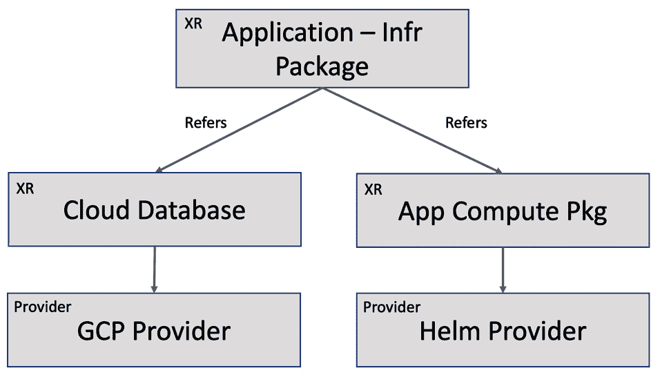

# 第五章：*第五章*：探索基础设施平台模式

使用 Crossplane 运行基础设施平台产品的成功，依赖于在需要时遵循一些原则和模式。本章将探讨一些关键的实践，同时在探索概念的过程中，我们还将学习一些调试技巧。在过去几章学习了 Crossplane 的基础知识之后，本章将是学习构建最先进的基础设施平台的关键模式的地方。你将学习构建健壮的 XR API 和轻松调试问题的几个关键方面。

本章涉及的主题如下：

+   发展 API

+   嵌套和多资源 XR

+   XRD 详细信息

+   管理外部软件资源

# 发展 API

Crossplane 主要是一个基于 API 的基础设施自动化平台。随着业务需求和技术环境的发展，API 的变更是不可避免的。我们可以将这些变更分为三类：

+   API 实现变更

+   非破坏性 API 合同变更

+   破坏性 API 合同变更

让我们从 API 实现变更开始。

## API 实现变更

这些变更仅限于 API 实现的细节，而不涉及合同的更改。换句话说，这些是对组合 YAML 的更改，这是一种由 XR 用于 API 实现的构造。`CompositionRevision` 是 Crossplane 的概念，它将与组合一起工作，以支持这些更改。如果在安装 Crossplane 时设置了 `--enable-composition-revisions` 标志，那么会为所有组合更新创建一个 `CompositionRevision` 对象。`CompositionRevision` 对象的名称会在每次递增时自动生成。组合是可变对象，可以永远变化，但单个 `CompositionRevision` 是不可变的。`Composition` 和 `CompositionRevision` 之间存在一对多关系。每次只能有一个 `CompositionRevision` 处于活动状态。最新的版本号将始终处于活动状态，排除以下场景。

提示

组合的每个配置状态都映射到一个单一的 `CompositionRevision`。假设我们在第 2 个版本，并且将组合配置更改为与第 1 个版本相同。这时不会创建新版本，而是第 1 个版本变为活动版本，第 2 个版本变为非活动版本。

在启用组合修订标志的 Crossplane 环境中，Crossplane 会自动向每个 XR/Claim 对象添加两个属性。以下是属性名称及其用途：

+   `spec.compositionRevisionRef`：这将包含与资源创建相关的 `CompositionRevision` 的名称。

+   `spec.compositionUpdatePolicy`：此属性将指示 XR/Claim 是否会自动迁移到新的可用 `CompositionRevision`。手动和自动是两种可能的值，默认值为自动。如果您希望覆盖默认行为，请在 XR/Claim 配置中添加此属性，并指明为手动。

以下图表表示 `Composition` 和 `CompositionRevision` 如何协同工作，持续推动基础设施 API 实现的演变：


图 5.1 – 演变中的组成

要手动迁移组成，请在 XR/Claim 中更新 `spec.compositionRevisionRef` 配置，并使用最新的修订名称。这个特定设计使平台 API 创建者和消费者之间的职责分离。基础设施 API 创建者将更新组成，API 消费者可以选择其修订升级策略。如果在创建 XR/Claim 时想使用特定的组成修订，请在 `spec.compositionRevisionRef` 下明确提及修订名称。

让我们来看一些这样的更改示例：

+   **错误修复**：假设我们将一个错误的属性映射到 XRD 状态字段。正确映射的范围仅限于相应组成修补部分的更改。

+   **政策更改而不更改合同**：添加一个新的基础设施合规政策，以便在特定区域提供所有新资源。

+   **共享基础设施**：朝着共享**虚拟私有云**（**VPC**）的方向发展，而不是为所有新的 XR/Claim 请求动态创建新的 VPC。

组成修订标志默认情况下未启用。使用 `--enable-composition-revisions` 参数与 Crossplane pod 一起启用组成修订。以下 Helm 命令将设置/更新带有组成修订的 Crossplane 环境：

```
#Enable Composition revision in an existing environment
```

```
helm upgrade crossplane –namespace crossplane-system crossplane-stable/crossplane –set args='{--enable-composition-revisions}' 
```

```
#Enable Composition revision in a new Crossplane setup
```

```
helm install crossplane –namespace crossplane-system crossplane-stable/crossplane –set args='{--enable-composition-revisions}'
```

以下部分将通过一个示例查看组成修订。

## 动手体验组成修订

让我们通过一个动手实践来体验组成修订。此练习的目标如下：

+   在启用组成修订的 Crossplane 环境中为 GCP MySQL 提供一个 XR API

+   创建两个 MySQL 实例，采用自动化和手动组成修订策略

+   更新组成，以更改数据库磁盘大小的计算方式

+   验证采用自动修订策略的 MySQL 实例是否会自动迁移到最新的组成修订版本

+   发现采用手动修订策略的 MySQL 实例无法迁移到最新的组成修订版本

+   最后，将第二个 MySQL 实例手动迁移到最新的组成修订版本

让我们使用一个简单的 XRD 和组成来探索组成修订。以下是 XRD，其中仅包含一个参数，该参数用于设置 MySQL 磁盘大小：

```
apiVersion: apiextensions.crossplane.io/v1
```

```
kind: CompositeResourceDefinition
```

```
metadata:
```

```
  name: xmysqls.composition-revision.imarunrk.com
```

```
spec:
```

```
  group: composition-revision.imarunrk.com
```

```
  names:
```

```
    kind: XMySql
```

```
    plural: xmysqls
```

```
  claimNames:
```

```
    kind: MySql
```

```
    plural: mysqls
```

```
  versions:
```

```
  - name: v1
```

```
    served: true
```

```
    referenceable: true
```

```
    schema:
```

```
      openAPIV3Schema:
```

```
        type: object
```

```
        properties:
```

```
          spec:
```

```
            type: object
```

```
            properties:
```

```
              parameters:
```

```
                type: object
```

```
                properties:
```

```
                  size:
```

```
                    type: integer
```

```
                required:
```

```
                - size
```

```
            required:
```

```
            - parameters
```

前述 XRD 的组成如下所示，它将`size`属性从 XR 补丁到 GCP CloudSQLInstance MR 中：

```
apiVersion: apiextensions.crossplane.io/v1
```

```
kind: Composition
```

```
metadata:
```

```
  name: gcp-mysql
```

```
spec:
```

```
  compositeTypeRef:
```

```
    apiVersion: composition-revision.imarunrk.com/v1
```

```
    kind: XMySql
```

```
  resources:
```

```
  - name: cloudsqlinstance
```

```
    base:
```

```
      apiVersion: database.gcp.crossplane.io/v1beta1
```

```
      kind: CloudSQLInstance
```

```
      spec:
```

```
        providerConfigRef:
```

```
          name: gcp-credentials-project-1
```

```
        forProvider:
```

```
          region: us-central1
```

```
          databaseVersion: MYSQL_5_7
```

```
          settings:
```

```
            tier: db-g1-small
```

```
            dataDiskSizeGb: 40
```

```
    patches:
```

```
    - type: FromCompositeFieldPath
```

```
      fromFieldPath: spec.parameters.size
```

```
      toFieldPath: spec.forProvider.settings.dataDiskSizeGb
```

将这两个 YAML 应用到启用了组成修订的目标 Crossplane 集群。你将看到为该组成创建了`CompositionRevision`。执行以下命令查看给定组成的所有`CompositionRevision`：

```
# List of revisions for Composition named gcp-mysql
```

```
kubectl get compositionrevision -l crossplane.io/composition-name=gcp-mysql
```

参考以下屏幕截图，其中为`gcp-mysql`组成创建了一个修订对象。请注意，修订 1 的`current`属性为 true。如果我们更新组成，这将发生变化：


图 5.2 – 组成修订列表

现在，让我们通过 Claim API 配置两个 MySQL 实例。手动修订更新策略配置的示例如下所示。YAML 的自动修订版本与没有`compositionUpdatePolicy`参数的版本相同，后者默认进行自动修订更新：

```
apiVersion: composition-revision.imarunrk.com/v1
```

```
kind: MySql
```

```
metadata:
```

```
  namespace: alpha
```

```
  name: mysql-db-manual
```

```
spec:
```

```
  compositionUpdatePolicy: Manual
```

```
  compositionRef:
```

```
    name: gcp-mysql
```

```
  parameters:
```

```
    size: 10
```

你可以参考以下屏幕截图，其中包含了两个已引导的 MySQL 实例：


图 5.3 – MySQL 声明

现在，更新组成补丁，使用转换函数在补丁之前将磁盘大小乘以四。更新组成的补丁部分将如下所示：

```
patches:
```

```
    - type: FromCompositeFieldPath
```

```
      fromFieldPath: spec.parameters.size
```

```
      toFieldPath: spec.forProvider.settings.dataDiskSizeGb
```

```
      transforms:
```

```
      - type: math
```

```
        math:
```

```
          multiply: 4
```

更新组成后，你将看到两个修订版本。只有最新的修订版本会将`current`标志设为`true`。另外，我们可以注意到，通过自动修订更新策略配置的 MySQL 会增加存储空间。以下屏幕截图总结了应用更新组成后的输出：


图 5.4 – 新的组成修订

最后，我们可以通过在 XR/Claim 配置中添加`spec.compositionRevisionRef`属性来手动升级第二个 MySQL 实例。该字段将保存自动生成的组成修订名称。组成修订的实践示例可以在[`github.com/PacktPublishing/End-to-End-Automation-with-Kubernetes-and-Crossplane/tree/main/Chapter05/Hand-on-examples/Composition-Revision`](https://github.com/PacktPublishing/End-to-End-Automation-with-Kubernetes-and-Crossplane/tree/main/Chapter05/Hand-on-examples/Composition-Revision)找到。在接下来的部分中，我们将探索更改 XR API 契约的方法。

## API 契约更改

API 实现细节只是 XR 更改可能演变的一个方向。XR 创建团队与消费团队之间高度互操作的 API 契约也需要随着时间的推移进行更改。契约的更改可以分为两类：

+   **非破坏性更改**：XR API 将向后兼容，这意味着消费者要么不受更改影响，要么可以选择在其阶段采纳新的更改。

+   **破坏性变更**：XR API 将不兼容旧版本。必须引入新 API 版本，并在适当的时候弃用旧 API 版本。所有旧的 API 用户应安全地迁移到新 API 版本。

让我们深入探讨非破坏性变更。

## 非破坏性变更

向 XRD 合同中添加一个或多个可选参数可以视为非破坏性变更。这是非破坏性的，因为旧的外部资源可以与新模式共存，因为新参数是可选的。请注意，移除 XRD 中现有的可选参数是破坏性变更，因为 Crossplane 在前端无法知道如何调和现有的已配置资源。一个简单的思考方式是，如果 Composition/CompositionRevision 能够处理旧资源和新配置资源的共存，那么 XRD 合同变更就是非破坏性的。选择磁盘大小的 MySQL XR 中的新可选参数就是一个非破坏性变更的例子。此变更将涉及合同变更和组合修订。让我们通过一个动手实践过程来完成前面的 XR 示例。此过程所需的所有配置 YAML 文件可以在[`github.com/PacktPublishing/End-to-End-Automation-with-Kubernetes-and-Crossplane/tree/main/Chapter05/Hand-on-examples/XRD-Contract-Change-Non-Breaking`](https://github.com/PacktPublishing/End-to-End-Automation-with-Kubernetes-and-Crossplane/tree/main/Chapter05/Hand-on-examples/XRD-Contract-Change-Non-Breaking)查看。参考以下动手过程的截图：


图 5.5 – 非破坏性合同变更

以下是整个动手实践过程中实验非破坏性合同变更时需要执行的步骤：

1.  在目标集群中创建 XRD 的第一个版本（`xrd-v1.yaml`）。该模式将`vm`作为必需参数。

1.  创建组合的第一个修订版（`Composition-V1.yaml`）。它将把`vm`值补丁回`MR-CloudSQLInstance`层属性。

1.  现在，MySQL 资源可以通过`db-n1-standard-1`作为 GCP 中的配置选择来配置（`Claim-v1.yaml`）。

1.  更新并应用 XRD，增加一个可选参数`size`来指定数据库磁盘大小（`xrd-v2.yaml`）。

1.  更新并应用新的组合（`Composition-V2.yaml`）。它将把额外的大小参数补丁到 MR 中。

1.  最后，创建第二个具有特定磁盘大小和配置的 MySQL 实例（`Claim-v2.yaml`）。

1.  为了验证第一个 MySQL 实例是否仍然可以更新，请使用更新的 YAML（`Claim-v1-validate.yaml`）更改配置。

在更新合同时，我们没有升级 API 版本。我们将在接下来的部分讨论这个问题。

## 版本升级

在前一节中，我们并未将 XRD 的版本号从 v1 更改。Crossplane 当前不支持在合同变更后进行 XR 版本升级。没有合同变更的 API 版本化有助于指示 API 的稳定性（如 alpha、beta、v1 等）。我们可以在不更改合同的情况下从 alpha 升级到 beta，再到更稳定的版本。当前，版本升级是通过在 XRD 中列出旧版本和新版本定义来实现的。`versions` 数组用于列出多个版本。每个版本下的两个关键布尔属性是 `served` 和 `referenceable`。`referenceable` 标志将决定是否可以为给定版本定义组合实现。只有一个版本可以将 referenceable 标志设置为 `true`，该版本将用于任何新的 XR 创建/更新事件。由旧 API 版本触发的创建/更新事件仍将使用最新版本的组合，并将其标记为可引用。`served` 标志表示给定的 XR API 版本是否正在使用。一些团队可能仍会使用旧版本来访问 API。关闭 `served` 标志意味着该版本不再对客户端可用。这将是从 XR 中移除旧版本之前的最后一步。

请查看一个包含三个版本（alpha、beta 和 v1）的 XRD 示例，网址为 [`github.com/PacktPublishing/End-to-End-Automation-with-Kubernetes-and-Crossplane/blob/main/Chapter05/Samples/XRD-Versions/xrd-multiple-version.yaml`](https://github.com/PacktPublishing/End-to-End-Automation-with-Kubernetes-and-Crossplane/blob/main/Chapter05/Samples/XRD-Versions/xrd-multiple-version.yaml)。这个 XRD 包含三个版本。alpha 版本将不再提供服务，beta 版本将提供服务，但不能用于资源的创建或更新。最新版本 v1 将是进行资源创建或更新时的首选版本。

Kubernetes CRD 支持多个 API 版本，包括有和没有 API 合同更改的版本。当存在 API 合同更改时，CRD 作者会配置一个转换 webhook 来支持版本间的转换。由于 CR 对象将以旧合同和新合同的形式存储在 etcd 中，因此需要进行转换。Crossplane 中与 CRD 等效的 XRD 不采用这种方法。转换 webhook 涉及编程，选择这种方法会违反 Crossplane 在构建 API 时不编写代码的目标。需要注意的是，Crossplane 社区正在积极努力构建一个基于配置的解决方案，以支持不同版本之间的转换和迁移。

## 版本升级与破坏性变更

另一种方法通过引入新的 XR API 并行支持破坏性契约。这种方法使用外部命名技术和删除策略来处理破坏性变化。采用这种模式时，我们将把资源迁移到新的 XR API，并在迁移完全完成后删除旧的 API。完成版本升级的步骤如下：

1.  创建 v1 版本的 XRD。在组成中，定义一个标准的命名法来命名外部资源（MRs）。我们应该能够在新的 API 中重新构建名称。通常，我们可以将 XR 和组成名称连接起来（`<XR>+'-'+<Composition>`）。你可以根据你的环境制定适合的资源命名策略。也许我们可以使用命名空间名称来表示资源的产品所有者。

1.  确保所有组成中的 MRs 的`spec.deletionPolicy`定义为`Orphan`。

1.  假设我们有几个 XR 的消费者，并且他们已经创建了一些外部资源。假设我们有一个策略要求，必须对 API 契约进行破坏性修改。

1.  为了支持破坏性修改，删除所有 v1 版本的 XR。这将仅删除 Crossplane 引用。由于孤立删除策略，外部资源不会被删除。

1.  然后，删除 v1 版本的 XRD 和 Composition。

1.  最后，创建新的 v2 版本的 XRD，使用相同的 XR 名称。更新组成以处理最近的破坏性变化。确保新的组成遵循相同的外部资源名称创建逻辑，并映射到新的 XRD 版本。

1.  重新创建已删除的 XR 对象，指向 v2 版本的 API。新的 XR 对象将引用旧的孤立外部资源。Crossplane 控制器将协调任何属性值的变化。

请注意，这种迁移到新 API 版本的操作必须与所有 XR 消费者团队协调。一旦迁移完成，旧的 API 版本将不再可用。下图表示迁移过程：


图 5.6 – 版本迁移

提示

总是采用一种标准化的方式来生成外部资源名称是很好的。除了版本迁移，具有可重复的命名模式还可以带来其他几个优势。使用预配置的资源来支持共享或缓存的基础设施就是使用标准外部资源命名模式的一个例子。将资源迁移到新的 Crossplane 环境也是一个例子。

推荐通过实践操作了解 API 合同破坏，使用在 [`github.com/PacktPublishing/End-to-End-Automation-with-Kubernetes-and-Crossplane/tree/main/Chapter05/Hand-on-examples/XRD-Contract-Change-Breaking`](https://github.com/PacktPublishing/End-to-End-Automation-with-Kubernetes-and-Crossplane/tree/main/Chapter05/Hand-on-examples/XRD-Contract-Change-Breaking) 提供的示例配置。执行以下步骤进行实践操作以处理合同变更：

1.  首先，执行 `xrd-v1.yaml`、`Composition-V1.yaml` 和 `Claim.yaml`。

1.  它将创建一个 XRD 和一个 Composition，其中数据库大小为可选参数，虚拟机为必选参数。Claim 将根据指定的大小和虚拟机配置数据库。配置的资源将获得标准的外部资源名称。

1.  请注意，`Claim.yaml` 中的 `claim.name` 标签用于在 Composition 部分构造外部资源名称。它应该对于每个 XR/Claim 对象唯一，以生成唯一的外部资源名称。

1.  现在让我们删除 v1 版本的 Claim、Composition 和 XRD。当我们删除 v1 claim 时，外部资源不会被删除，因为删除策略被配置为孤立资源。

1.  最后，应用 v2 版本的 Claim、Composition 和 XRD。在 v2 XRD 中，我们通过移除必选参数 `vm` 来破坏合同。新的 v2 claim（`Claim-migrate.yaml`）将不包含 `vm` 参数。请注意，Composition 和 Claim 都将指向 v2 版本的 XRD。

1.  注意，Crossplane 将回收孤立的资源，并使用 Composition 中提供的新默认值来协调虚拟机。我们可以通过查看 GCP 控制台或 Claim 资源描述来验证这一点。

请参阅以下截图，其中测试了前面的示例：


图 5.7 – XRD 破坏性变更

以下是与前述 Composition 示例中外部资源名称修补相关的代码片段。它必须出现在两个 Composition 版本中，且生成的名称在两个版本中应相同：

```
- type: FromCompositeFieldPath
```

```
      fromFieldPath: metadata.name
```

```
      toFieldPath: metadata.annotations[crossplane.io/external-name]
```

```
      transforms:
```

```
      - type: string
```

```
        string:
```

```
          fmt: "%s-gcp-mysql-cloudsqlinstance"
```

请注意，我们使用了新的转换类型来格式化字符串，然后再进行修补。通过这种方式，我们总结了不同的 XR API 演变方法。接下来我们将深入探讨一个有趣的案例，构建一个 XR 组合另一个 XR。

# 嵌套和多资源 XR

每个软件产品都依赖于多个基础设施资源。为了让产品团队能够以统一的体验使用这些资源，构建单一的基础设施配方是至关重要的。基础设施依赖的编排应该保持抽象。这些配方要求多个资源被组合成一个单一的 XR。在此前所有的示例中，我们始终将单一的 GCP 资源组合进一个 XR。现在让我们看一个示例，其中多个 GCP 资源被组合成一个单一的 XR API。下图展示了我们将在示例中使用的资源和 XR API：


图 5.8 – 多资源嵌套 XR

除了在单个 XR 中提供多个资源外，我们在*图 5.8*中还展示了一个嵌套的 XR 模式。我们在两个 XR 中组合了三种资源。第一个 XR 组合了两种资源，第二个 XR 组合了第一个 XR 和一个数据库资源。让我们看一下每个 XR 的细节：

+   **XR 1**：我们将通过这个 XR 组合一个 Google Kubernetes Engine 集群和一个 Google Cloud 存储资源。目的是提供云存储来保存应用日志，以供未来分析。请注意，这个 XR 在 XRD 定义中不会包含声明名称。它将是集群范围的，并且是平台团队的私有 API。只有拥有命名空间访问权限的产品团队才不会直接使用这个 API。这个 XR 将把区域和自动驾驶配置作为参数暴露出来。区域将传递回两个资源，而自动驾驶配置用于 Kubernetes 的资源配置。

+   **XR/声明 2**：第二个 XR 将组合 MySQL 数据库、一个 MR 和第一个 XR，以创建一个嵌套的 API。我们将把区域参数补丁应用到 MySQL MR，并将其传递到内部的 XR。

本次实践旅程中的所有示例都可以在[`github.com/PacktPublishing/End-to-End-Automation-with-Kubernetes-and-Crossplane/tree/main/Chapter05/Hand-on-examples/Nested-Multi-Resource-XR`](https://github.com/PacktPublishing/End-to-End-Automation-with-Kubernetes-and-Crossplane/tree/main/Chapter05/Hand-on-examples/Nested-Multi-Resource-XR)找到。

首先创建这两个 XR 的 XRD 和 Composition。将`xrd k8s.yaml`、`Composition k8s.yaml`、`xrd Application.yaml`和`Composition Application.yaml`应用到 Crossplane 集群中。你会看到两个 XRD 的`ESTABLISHED`标志都是`True`，这表示 Crossplane 已启动新的控制器来协调已建立的 XR。`OFFERED`标志在应用 XR 中为`True`，在 Kubernetes XR 中为`False`，这表示 Crossplane 仅为应用 XR 启动了新的控制器来协调已建立的声明。而对于 Kubernetes XR，由于我们没有相应的声明，`OFFERED`标志为`False`。请参阅以下截图，了解 XRD 的创建过程：


图 5.9 – 嵌套 XR-XRD 和组合

提示

类似于使用来自单一云提供商的多个资源创建 XR API，我们还可以混合使用来自多个云的资源。我们只需添加与相应 ProviderConfig 云相关的资源。

现在是时候创建应用程序声明资源了。将声明`Application.yaml`应用到 Crossplane 集群中。你将看到`CloudSQLInstance`实例、集群和存储桶资源已经被配置。请参考下面的截图，查看资源是否已成功配置：


图 5.10 – 资源配置

如果你想详细查看每个资源，可以使用资源引用。执行`kubectl describe application my-application -n alpha`来查看声明的详细信息。它将引用`XApplication` XR 对象。如果我们查看`XApplication`对象的详细信息，它将持有对`CloudSQLInstance` MR 和`XGCPCluster` XR 的引用。类似地，我们可以继续查看，直到到达最后的 MR。这对于调试活动非常有用。有时你可能会发现资源没有准备好。在这种情况下，检查每个嵌套资源，并查看事件部分以确认发生了什么。以下是从资源描述中引用嵌套资源的示例：


图 5.11 – 嵌套资源引用示例 1

上面的截图展示了应用程序声明描述，它引用了`XApplication` XR 资源。下面的截图展示了`XApplication` XR 描述，它引用了`XGCPCluster` XR 实例和`CloudSQLInstance` MR：


图 5.12 – 嵌套资源引用示例 2

以下是一个事件示例，告诉我们提供了错误的区域参数：


图 5.13 – 资源描述存在错误

重要

当我们组合多个资源以为产品团队提供统一体验时，需要遵循更多的模式。前面的示例是一个简单的示例，用来引入这一话题。在接下来的章节中，我们将看到更多内容。

## PatchSets

如果你查看前面的示例中的组成部分，你会看到我们使用了一种新模式，称为`patchSets`函数定义，用于修补一个区域：

```
patchSets:
```

```
  - name: region
```

```
    patches:
```

```
    - type: FromCompositeFieldPath
```

```
      fromFieldPath: spec.parameters.region
```

```
      toFieldPath: spec.forProvider.region
```

我们可以定义多个`patchSet`函数。要在特定资源中包含某个补丁集函数，请使用以下代码片段：

```
patches:
```

```
    - type: PatchSet
```

```
      patchSetName: region
```

在接下来的章节中，我们将看到更多嵌套和多资源 XR 的示例。在接下来的部分中，我们将详细查看定义 XRD 架构的配置选项。

# XRD 详细

在前一章节查看 **复合资源定义**（**XRD**）时，我们探讨了学习 XR 基础所需的有限配置选项。现在是时候查看更详细的配置选项，以构建干净且稳健的 XR API。我们将深入探讨的一个重要部分是 openAPIV3Schema，它用于定义 XR API 的输入和输出。以下是我们将在本节中覆盖的主题：

+   命名版本

+   openAPIV3Schema 结构

+   属性的附加参数

+   打印列

让我们从 *命名版本部分* 开始。

## 命名版本

我们的 XRD 的版本名称不能包含任何随机字符串。它必须遵循从 CRD 和标准 Kubernetes API 继承的特定验证规则。该字符串只能包含小写字母数字字符和 `-`。此外，版本名称必须始终以字母字符开头，以字母数字字符结尾，这意味着 `-` 不能是起始或结尾字符。同时，数字不能作为起始字符。一些有效的版本名称有 `my-version`、`version-1`、`abc-version1` 和 `v1`。虽然我们可以为版本命名提供许多排列组合，但在 CRD 中遵循一些标准做法。遵循这些做法来命名 XRD 可以帮助 API 使用者了解 API 的稳定性。版本字符串以 `v` 开头，后跟一个数字（例如 v1、v2）。然后可以选择性地跟随 `alpha` 或 `beta`，以表示 API 的稳定性。通常，`alpha` 表示最低稳定性（`v5alpha`），而 `beta` 是下一个稳定性级别（`v3beta`）。如果这两者都缺失，表示 XR 已准备好投入生产使用。可选的数字可以跟随在 `alpha`/`beta` 后面，表示增量发布（例如 `v2alpha1`、`v2alpha2` 等）。

如果提供的版本字符串无效，您会发现 XRD 无法正确配置。`ESTABLISHED` 标志不会被设置为 `True`。您可以使用来自 `samples` 文件夹的 `– xrd\ invalid\ version\ test.yaml` 文件，查看在版本号不正确时会发生什么。请参阅以下截图：


图 5.14 – 无效版本 XRD

此外，您还可以在 crossplane-system 命名空间中的 Crossplane pod 中看到以下错误日志：

```
2022-01-15T20:06:46.217Z     ERROR     crossplane.controller-runtime.manager.controller.defined/compositeresourcedefinition.apiextensions.crossplane.io     Reconciler error     {"reconciler group": "apiextensions.crossplane.io", "reconciler kind": "CompositeResourceDefinition", "name": "xbuckets.version-test.imarunrk.com", "namespace": "", "error": "cannot apply rendered composite resource CustomResourceDefinition: cannot create object: CustomResourceDefinition.apiextensions.k8s.io \"xbuckets.version-test.imarunrk.com\" is invalid: [spec.versions[0].name: Invalid value: \"v1.0\": a DNS-1035 label must consist of lower case alphanumeric characters or '-', start with an alphabetic character, and end with an alphanumeric character (e.g. 'my-name', or 'abc-123', regex used for validation is 'a-z?'), spec.version: Invalid value: \"v1.0\": a DNS-1035 label must consist of lower case alphanumeric characters or '-', start with an alphabetic character, and end with an alphanumeric character (e.g. 'my-name', or 'abc-123', regex used for validation is 'a-z?')]"}
```

提示

当我们排查 Crossplane 问题时，来自 Crossplane pod 的日志可以提供帮助。通过向 Crossplane pod 添加参数`--debug`，可以启用调试模式。同样，我们也可以查看提供者容器的日志。

## openAPIV3Schema 结构

XR API 的规范是通过 `openAPIV3Schema` 定义的。XRD 中该部分的每个配置元素都表示 XR API 的输入和输出：

```
versions:
```

```
  - name: v1alpha
```

```
    schema:
```

```
      openAPIV3Schema:
```

```
      # Input and output definition for the XR
```

通常，我们将`openAPIV3Schema`部分配置为两个对象，`spec`和`status`。`spec`对象代表 API 输入，而`status`对象代表响应。如果没有任何自定义要求，我们可以跳过在 XRD 中定义`status`部分。Crossplane 会将标准的状态字段注入到 XR/Claim 中。参考以下代码片段，表示 XR API 输入输出的`openAPIV3Schema`配置模板：

```
openAPIV3Schema:
```

```
  type: object
```

```
  properties:
```

```
    # spec – the API input configuration
```

```
    spec:
```

```
      type: object
```

```
      properties:
```

```
        ............. configuration continues 
```

```
     # status – the API output configuration 
```

```
     status:
```

```
       type: object
```

```
       properties:
```

```
         ............. configuration continues
```

模式配置完全是由`-`属性、它们的类型和属性组成。`object`类型的`attribute`将包含一个属性列表。例如，根属性`openAPIV3Schema:`就是`object`类型，后面跟着一个属性列表（`spec`和`status`）。属性列表其实就是属性的列表。假设属性类型是原始类型，例如`string`或`integer`，那么这个属性就是终结节点。对象-属性递归可以根据需要继续深入。参考以下代码片段：

```
# The root attribute openAPIV3Schema of type object
```

```
openAPIV3Schema:
```

```
  type: object
```

```
  # spec/status - attributes (properties) of openAPIV3Schema
```

```
  properties:
```

```
    # spec – the XR input
```

```
    spec:
```

```
      type: object
```

```
      properties:
```

```
        # parameters - again an object with attributes list
```

```
        parameters:
```

```
          type: object
```

```
          properties:
```

```
            # region – string primitive  - node ends
```

```
            region:
```

```
            type: string
```

```
    # status – API output configuration
```

```
    # The exact structure of configuration as before
```

```
    # Attributes, their types, and properties
```

```
    status:
```

```
      type: object
```

```
            properties:
```

```
              zone:
```

```
                description: DB zone.
```

```
                type: string   
```

在接下来的部分，我们将查看一些额外的有价值的配置选项，以及基本的`openAPIV3Schema`配置。

## 属性的附加参数

属性节点可以配置一些 API 开发人员日常使用的其他关键配置。以下是一些常用的配置：

+   **描述**是一个字符串，可以帮助我们为 API 消费者提供有关该属性的有价值的信息。它可以包含关于参数使用的说明、我们可以配置的可能值以及验证要求。

+   **必需**是一个属性，表示用户在 API 中需要提供的必填输入列表。

+   **默认值**是一个属性，如果用户未输入值，则提供默认值。

+   **枚举**可以配置给定属性的可能值列表。

除了这些字段外，还有一系列与验证相关的配置，包括`minimum`、`maximum`、`pattern`、`maxLength`和`minLength`。参考以下示例配置：

```
spec:
```

```
  type: object
```

```
  description: API input specification 
```

```
  properties:
```

```
    parameters:
```

```
      type: object
```

```
      description: Parameter's to configure the resource
```

```
      properties:
```

```
        size:
```

```
          type: integer
```

```
          description: Disk size of the database
```

```
          default: 20
```

```
          minimum: 10
```

```
          maximum: 100
```

```
        vm:
```

```
          type: string
```

```
          description: Size of the virtual machine.
```

```
        enum:
```

```
        - small
```

```
        - medium
```

```
        - large
```

```
      required:
```

```
      - size
```

```
  required:
```

```
  - parameters
```

要探索更多详细的可能性，请访问[`github.com/OAI/OpenAPI-Specification/blob/main/versions/3.0.0.md#schemaObject`](https://github.com/OAI/OpenAPI-Specification/blob/main/versions/3.0.0.md#schemaObject)。

提示

我们可以使用描述字段来宣布参数的废弃信息。此技术有助于通过将必填字段变为可选字段并附上废弃消息，延迟对契约的破坏性更改。

## 打印机列

我们可以使用打印机列来添加`kubectl`在获取资源列表时显示的内容。我们应为每一列提供名称、数据类型和映射到我们希望显示的属性的 JSON 路径。可选地，我们还可以提供描述。参考以下示例配置：

```
additionalPrinterColumns:
```

```
- name: Zone
```

```
  type: string
```

```
  description: 
```

```
  jsonPath: .spec.zone
```

```
- name: Age
```

```
  type: date
```

```
  jsonPath: .metadata.creationTimestamp
```

打印机列配置与模式配置保持平行。

本节讨论了详细的 XRD 配置，涵盖了日常工作所需的大部分配置，但仍有无限的可能性。通过阅读 [`kubernetes.io/docs/tasks/extend-kubernetes/custom-resources/custom-resource-definitions/`](https://kubernetes.io/docs/tasks/extend-kubernetes/custom-resources/custom-resource-definitions/) 上的 CRD 相关内容，您将能进一步获得价值。

# 管理外部软件资源

从本书一开始，我们就讨论了使用 Crossplane 管理外部基础设施资源。然而，这不一定仅仅是基础设施资源。我们甚至可以从 Crossplane 管理外部软件应用程序。为了让一个软件应用与 Crossplane 生态系统兼容，它必须具备以下特点：

+   我们应该有明确定义且稳定的 API 来执行 CRUD 操作。

+   API 应该具有高保真度的设计，并且需要过滤器来控制细粒度的应用配置。

现在是时候来看一个例子了。想象一下，在 Kubernetes 中使用 Helm 部署一个应用。Helm 可以打包任何应用，并提供一个定义明确的 CRUD API 用于部署、读取、更新和卸载。最重要的是，我们可以通过参数来实现对应用配置的细粒度控制。我们已经有一个 Helm Crossplane 提供程序，并且被社区广泛使用。通过 Crossplane 控制平面管理外部应用程序的概念，可以开启一个统一应用和基础设施自动化的新世界。接下来的部分将详细介绍这一统一性方面。

## 统一自动化

使用 Crossplane 管理外部软件资源是统一基础设施和应用 DevOps 的关键。我们可以将软件和基础设施依赖打包成一个单一的 XR。这样完整的应用和基础设施包带来了许多优势，部分优势列举如下：

+   该方法将统一应用和基础设施自动化所需的工具和技能。

+   更重要的是，整个堆栈将享有 Kubernetes 操作模型的所有优势。

+   将供应商软件集成到企业生态系统中将变得更加迅速和标准化。软件供应商可以快速构建适配不同生态系统的包。目前，软件供应商必须为各个云服务提供商市场进行定制开发。这种方法可以帮助构建一个通用的供应商软件市场。

+   我们可以轻松地应用审计过程以遵守任何合规标准。之前，由于软件及其基础设施依赖分散，遵守合规要求会更加复杂。

下图展示了一个统一的 XR API：



图 5.15 – 统一的 XR

重要

在后续章节中，我们可以通过实践体验，构建一个涵盖应用和基础设施依赖的 XR API。

# 总结

我希望你在阅读这一章并完成实践旅程时感到有趣。它介绍了在采用 Crossplane 时，我们日常工作中有用的不同模式。我们讨论了如何演化我们的 XR API、详细的 XR 配置、如何管理应用资源以及嵌套和多资源 XR。还有更多的模式需要涵盖。

下一章将讨论更高级的 Crossplane 方法及其相应的实践旅程。
