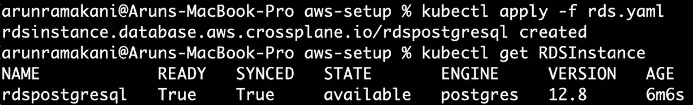

# 第六章：*第六章*: 更多 Crossplane 模式

紧接着上一章，我们将继续探索更多关键的 Crossplane 模式，这些模式对于构建先进的基础设施自动化平台至关重要。我们将涵盖不同的主题，如管理资源之间的依赖关系、传播秘密、使用 Crossplane Helm 提供商、定义 XR API 边界时的权衡点，以及使用 Prometheus 监控 Crossplane 控制平面。在本章中，我们将通过示例和实践过程来理解这些概念。在之前的所有章节中，我们使用的是 GCP，本章中我们将同时使用 GCP 和 AWS 来学习 Crossplane。最后，我们将学习更多调试技能，这对于日常平台开发和运维至关重要。

本章涵盖的主题如下：

+   AWS 提供商设置

+   管理依赖关系

+   秘密传播实践

+   Helm 提供商实践

+   定义 API 边界

+   警报与监控

+   更多故障排除模式

# AWS 提供商设置

本章中的一些示例将使用 AWS 作为云提供商。除了 GCP，我们还将介绍 AWS，以帮助我们了解如何与新云提供商合作。它将帮助我们认识到，与一个云提供商合作能使我们具备足够的能力来处理 Crossplane 中的任何云提供商。我们可以通过以下三个步骤来设置 AWS 提供商：

1.  创建 AWS 账户和 IAM 用户

1.  创建 Kubernetes 秘密

1.  提供商和 ProviderConfig 设置

## 创建 AWS 账户和 IAM 用户

你可以注册 AWS 并免费使用其部分服务，前提是你有信用卡。你可以在[`aws.amazon.com/free/free-tier-faqs/`](https://aws.amazon.com/free/free-tier-faqs/)阅读有关 AWS 免费套餐的更多信息。一旦你创建了免费账户，下一步就是创建一个新的 IAM 用户。以下截图将展示 IAM 用户创建的不同阶段。进入 AWS 网络控制台中的**IAM**部分，然后点击**添加用户**。选择凭证类型为访问密钥，如下截图所示：


](img/B17830_06_01.jpg)

图 6.1 – 创建用户

下一步是将用户添加到访问组中。如果你还没有用户组，可以使用**创建组**按钮，创建一个具有适当访问控制的新组。或者，我们可以将现有的访问策略附加到用户，或从当前用户复制权限。确保你已为通过 Crossplane 配置的资源添加了所需的权限。我已提供**AdministratorAccess**角色，以便为所有 AWS 资源提供完全访问权限。


](img/B17830_06_02.jpg)

图 6.2 – 将用户添加到组中

现在你将在 AWS 控制台中获得新 IAM 用户的访问 ID 和密钥，这对 Crossplane AWS 提供商配置非常有帮助：


](img/B17830_06_03.jpg)

图 6.3 – 新的 IAM 用户

下一步是使用 IAM 用户的访问密钥 ID 和秘密密钥来配置 Kubernetes 秘密。

## 创建 Kubernetes 秘密

创建 Kubernetes 秘密从在本地环境中设置 AWS CLI 开始。这将是一个简单的步骤，只需下载安装包并执行安装即可。按照[`docs.aws.amazon.com/cli/latest/userguide/getting-started-install.html`](https://docs.aws.amazon.com/cli/latest/userguide/getting-started-install.html)上的安装说明进行操作。接下来，我们可以使用 `aws configure --profile default` 命令创建 AWS 登录配置文件。它会要求输入访问密钥 ID、秘密访问密钥、默认区域和输出格式。访问密钥 ID 和秘密密钥是在创建 IAM 用户时获得的。你可以忽略默认区域和输出格式。


图 6.4 – 登录配置文件

下一步是使用前面创建的配置文件创建 Kubernetes 秘密。执行以下命令：

```
# Set a variable with the profile name
```

```
AWS_PROFILE=default
```

```
# Create a configuration file with profile data
```

```
echo -e "[$AWS_PROFILE]\naws_access_key_id = $(aws configure get aws_access_key_id --profile $AWS_PROFILE)\naws_secret_access_key = $(aws configure get aws_secret_access_key --profile $AWS_PROFILE)" > aws-credentials.conf
```

```
# Create kubernetes secret from the configuration file
```

```
kubectl create secret generic aws-credentials -n crossplane-system --from-file=creds=./aws-credentials.conf
```

参见以下截图，其中 Kubernetes 秘密被创建：


图 6.5 – Kubernetes 秘密创建

我们现在已经完成了 Kubernetes 秘密的创建。接下来的章节将讨论 Crossplane 环境中 AWS 提供者的安装和设置。

## AWS 提供者和 ProviderConfig 设置

通过将以下 YAML 应用到集群，安装 Crossplane AWS 提供者。该配置分为两部分。提供者配置将安装 AWS 提供者，`ControllerConfig` 启用提供者 pod 日志的调试模式。`ControllerConfig` 配置不是必须的。这里的示例在你需要调试问题时会很有帮助。请注意，`ControllerConfig` 名称指代的是提供者配置：

```
apiVersion: pkg.crossplane.io/v1alpha1
```

```
kind: ControllerConfig
```

```
metadata:
```

```
  name: debug-config
```

```
spec:
```

```
  args:
```

```
    - --debug
```

```
---
```

```
apiVersion: pkg.crossplane.io/v1
```

```
kind: Provider
```

```
metadata:
```

```
  name: provider-aws
```

```
spec:
```

```
  package: "crossplane/provider-aws:v0.23.0"
```

```
  controllerConfigRef:
```

```
    name: debug-config
```

最后，应用以下提供者配置 YAML，参照该机密：

```
apiVersion: aws.crossplane.io/v1beta1
```

```
kind: ProviderConfig
```

```
metadata:
```

```
  name: aws-credentials
```

```
spec:
```

```
  credentials:
```

```
    source: Secret
```

```
    secretRef:
```

```
      namespace: crossplane-system
```

```
      name: aws-credentials
```

```
      key: creds
```

我们已经准备好从 AWS 免费套餐中创建资源并进行实验。所有设置说明可以在[`github.com/PacktPublishing/End-to-End-Automation-with-Kubernetes-and-Crossplane/tree/main/Chapter06/Hand-on-examples/aws-setup`](https://github.com/PacktPublishing/End-to-End-Automation-with-Kubernetes-and-Crossplane/tree/main/Chapter06/Hand-on-examples/aws-setup)找到。执行 `rds.yaml` 文件以验证 AWS 提供者设置是否正确。以下截图显示了成功从 AWS 配置 RDS 资源：



图 6.6 – RDS 配置

这完成了 AWS 设置活动。接下来的章节将讨论资源引用，以管理资源之间的依赖关系。

# 管理依赖关系

在基础设施中，一个外部资源引用另一个资源是一个常见的模式。例如，我们可能希望在特定的**虚拟私人网络**（**VPN**）中配置我们的 Kubernetes 集群。引用 S3 桶的 S3 桶策略定义也是一个例子。我们可以列举许多这样的例子。从构建 XR API 的角度来看，可能需要在给定的 XR 或嵌套 XR 场景中，或者在独立 XR 之间建立外部资源之间的依赖关系。Crossplane 提供了三种不同的方式来引用一个资源。每种方式都有其特定的使用场景：

+   `UserPolicyAttachment`。它可以将 IAM 用户附加到 `Policy` 对象。在这里，可以通过名为 `PolicyARN`（ARN 引用）的属性引用 `Policy` 对象。类似地，也可以使用 `UserName` 属性（名称引用）来执行 `User` 对象的引用。

+   `selector` 属性。`selector` 是一个属性，指示 Crossplane 根据其子属性中指定的条件查找引用的资源。`MatchControllerRef` 和 `MatchLabels` 是 `selector` 属性的子属性。`MatchControllerRef` 的值将为 `true`，指引 Crossplane 在 XR 内查找引用的资源。第二个属性，`MatchLabels`，则驱使 Crossplane 查找具有指定标签的引用资源。如果 selector 识别到多个资源，则会随机选择其中一个。如果配置中存在前面提到的直接引用属性，则会忽略`selector`属性。

+   `MatchControllerRef` 值。它指引 Crossplane 在 XR 外查找匹配的资源。

    提示

    我们可以使用两种策略来确定直接引用配置的值。我们可以创建具有可预测名称的资源，以便在引用点重新构建它们。这类似于我们在上一章讨论的外部资源名称。如果唯一标识符是云生成的 ID，例如 ARN，则将标识符复制到自定义定义的状态属性（XR API 响应）中，以供后续使用。

如果感到困惑，不必担心。让我们通过几个实际的例子来看一下资源引用。第一个例子将涵盖在 XR 内和嵌套 XR 中的直接和选择器配置。

## 在 XR 内部和嵌套 XR 中的资源引用

这个例子将是一个实际场景。我们将创建一个具有特定 IAM 策略的 S3 桶，并创建一个可以访问该桶的 IAM 用户。以下是示例中涉及的托管资源：

+   `Bucket`：这是一个 MR，用于创建一个 S3 桶。我们将使用它在特定区域中配置桶。

+   `Policy`：这是 AWS IAM 资源列表中的 MR 部分。它有助于为给定资源定义使用指南。在这里的示例中，我们将创建一个具有完全访问权限的策略，以便读取和编辑桶中的所有对象。

+   `User`：MR 代表 AWS IAM 用户。我们将创建一个新用户以访问已创建的桶。

+   `UserPolicyAttachment`：这也是 AWS IAM 资源列表中的一部分。该 MR 将把一个策略附加到用户上。我们将把创建的桶策略链接到该用户。

你可以看到，某些资源需要相互引用。例如，`Policy` 资源必须引用桶名称以构建策略配置。另一个例子是 `UserPolicyAttachment`，它引用 `Policy` 和 `User` 资源以将它们附加起来。下图将表示资源之间的关系、它们的引用选项以及 XR 边界：


图 6.7 – 资源引用与嵌套 XR

带有 XRD、组合和声明的完整示例可在 [`github.com/PacktPublishing/End-to-End-Automation-with-Kubernetes-and-Crossplane/tree/main/Chapter06/Hand-on-examples/same-nested-xr-reference`](https://github.com/PacktPublishing/End-to-End-Automation-with-Kubernetes-and-Crossplane/tree/main/Chapter06/Hand-on-examples/same-nested-xr-reference) 上查看。让我们先看一些关键的代码片段，以便熟悉这个示例和概念。桶名称在策略文档中的引用是我们将看到的第一个片段。`Policy` 和 `Bucket` MR 都在同一组合中。要求是在策略文档 JSON 中引用桶的 ARN 名称。幸运的是，ARN 标识符有一个可预测的格式，我们可以根据桶的名称构造 ARN。桶的名称已经可用，因为这两个 MR 位于同一组合中，并且桶名称是 XR API 输入。以下是展示所讨论资源引用的代码片段。它使用 `CombineFromComposite` 补丁类型修补策略文档属性。在这里，桶名称通过 `fmt` 字符串操作直接嵌入：

```
- type: CombineFromComposite
```

```
  toFieldPath: spec.forProvider.document
```

```
  combine:
```

```
    variables:
```

```
    - fromFieldPath: spec.parameters.bucketName
```

```
    - fromFieldPath: spec.parameters.bucketName
```

```
    strategy: string
```

```
    string:
```

```
      fmt: |
```

```
        {
```

```
          "Version": "2012-10-17",
```

```
          "Statement": [
```

```
            {
```

```
              "Effect": "Allow",
```

```
              "Action": [ "s3:*" ],
```

```
              "Resource": [
```

```
                "arn:aws:s3:::%s",
```

```
                "arn:aws:s3:::%s/*"
```

```
              ]
```

```
            }
```

```
          ]
```

```
        }
```

接下来，我们将查看如何提取 `Policy` 资源的 ARN，并将其传递给内部嵌套的 `XR - XIAMResourceUser`。这个过程分为两步：

1.  将 `Policy` 对象的 ARN 标识符重新插入到 API 响应属性中。

1.  将提取的 ARN 标识符作为 API 输入，传递给嵌套 XR（`XIAMResourceUser`）。

请注意，初始情况下，`XIAMResourceUser` 将失败，直到 `Policy` 对象完全创建并且 ARN 可用。这是典型的控制平面行为，确保资源最终一致性。以下是来自两个资源 `Policy` 和 `XIAMResourceUser` 的 ARN 补丁代码片段：

```
# Policy - Patch API response with ARN
```

```
- type: ToCompositeFieldPath
```

```
  fromFieldPath: status.atProvider.arn
```

```
  toFieldPath: status.policyARN
```

```
# XIAMResourceUser - patch the policy arn as API input
```

```
- fromFieldPath: status.policyARN
```

```
  toFieldPath: spec.parameters.policyARN
```

最后，我们将查看`UserPolicyAttachment`资源的代码片段，其中包含了两个外部资源（`User`和`Policy`），使用了不同的引用方法。策略引用将直接使用 ARN 标识符，而用户引用则使用选择器。请参考以下代码：

```
- base:
```

```
  apiVersion: iam.aws.crossplane.io/v1beta1
```

```
  kind: UserPolicyAttachment
```

```
  spec:
```

```
    providerConfigRef:
```

```
      name: aws-credentials
```

```
    forProvider:
```

```
    # Selectors refer to the User from the same composition 
```

```
      userNameSelector:
```

```
        matchControllerRef: true
```

```
  patches:
```

```
  # Patch the resource name
```

```
  # <Type>-<Parent Type>-<Parent Resource Name>
```

```
  - type: CombineFromComposite
```

```
    toFieldPath: metadata.name
```

```
    combine:
```

```
      variables:
```

```
      - fromFieldPath: spec.parameters.resourceType
```

```
      - fromFieldPath: spec.parameters.resourceName
```

```
      strategy: string
```

```
      string:
```

```
        fmt: "policy-attachement-%s-%s"
```

```
  # Patch the policy ARN reference
```

```
  - toFieldPath: spec.forProvider.policyArn
```

```
    fromFieldPath: spec.parameters.policyARN
```

若要自己执行示例并验证引用，请按照以下步骤操作：

1.  将 XRD 和组合应用于目标 Crossplane。

1.  接下来，应用 Claim 配置。它将创建所有所需资源并建立必要的依赖关系。

以下截图显示了在 AWS 中成功创建桶：


图 6.8 – S3 桶已配置

以下截图展示了该示例的所有执行步骤：


图 6.9 – 示例执行

此外，请注意，在 AWS 控制台中，`User` 对象是与附加的 `Policy` 资源一起创建的：


图 6.10 – 创建的用户执行

最后，查看以下截图，展示了由于策略 ARN 不可用导致 `XIAMResourceUser` 失败的事件。一旦策略 ARN 可用，它将自动生效：


图 6.11 – XIAMResourceUser 失败事件

信息

请注意，在我们的选择器引用中并没有使用 `MatchLabels`。只有 `MatchControllerRef` 被设置为 `true` 作为值。在这种情况下，同一组合中只有一个 `User` 对象，可以无问题地引用。如果组合中有多个 `User` 对象，或者我们想要引用当前组合外的资源，我们将使用 `MatchLabels`。

我们已经完成了对内部和嵌套 XR 中资源引用的探索。接下来我们将在下一节中引用组合外部的资源。

## 引用外部资源

要引用组合外的资源，我们将使用 `MatchLabels` 和 `MatchControllerRef`。`MatchControllerRef` 应该被设置为 `false`。这将引用外部资源、MR 或另一个位于 Claim/XR 内部的资源。我们将把最后一个示例修改为两个独立的 XR，并确保 `UserPolicyAttachment` 对象能够使用标签选择器引用独立 XR 中的 `Policy` 对象。以下图示将表示资源之间的关系、它们的引用选项和 XR 边界：


图 6.12 – 引用外部资源

请注意，这里 XRs 没有嵌套。`XMyBucket` XR 不会将`XIAMResourceUser`作为其中的资源。在这两个 XR 独立的情况下，`Policy`对象必须通过标签选择器引用 XR。让我们看几个重要的代码片段，这些片段通过选择器标签引用资源。以下是将几个标签添加到`Policy`资源的代码。第一个标签`resourceType`被直接添加到元数据中。第二个标签`resourceName`通过桶名称进行补丁，这是 XR 的输入参数：

```
- base:
```

```
  apiVersion: iam.aws.crossplane.io/v1beta1
```

```
  kind: Policy
```

```
  metadata:
```

```
    # Add labels one as the resource type
```

```
    labels:
```

```
      resourceType: bucket
```

```
  spec:
```

```
    providerConfigRef:
```

```
      name: aws-credentials
```

```
    forProvider:
```

```
      path: "/"
```

```
  patches:
```

```
  # patch labels two from the resource name
```

```
  - fromFieldPath: spec.parameters.bucketName
```

```
    toFieldPath: metadata.labels[resourceName]
```

代码的下一部分将把`resourceName`和`resourceType`标签应用到`UserPolicyAttachment`资源。它将在 policyArnSelector 的`MatchLabels`属性下进行补丁处理。这两个标签值是 XR API 输入的一部分。您可以根据自己的预测标签策略来标准化这一发现过程。请注意，XR 中的`User`对象引用的`MatchControllerRef`值为`true`，而`Policy`对象引用的`MatchControllerRef`值为`false`：

```
- base:
```

```
  apiVersion: iam.aws.crossplane.io/v1beta1
```

```
  kind: UserPolicyAttachment
```

```
  spec:
```

```
    providerConfigRef:
```

```
      name: aws-credentials
```

```
    forProvider:
```

```
      # refer to the IAM user from the same composition 
```

```
      userNameSelector:
```

```
        matchControllerRef: true
```

```
      policyArnSelector:
```

```
        matchControllerRef: false
```

```
  patches:
```

```
  # Patch the policy ARN lable 1
```

```
  - toFieldPath: spec.forProvider.policyArnSelector.matchLabels.resourceName
```

```
    fromFieldPath: spec.parameters.resourceName
```

```
  # Patch the policy ARN lable 2
```

```
  - toFieldPath: spec.forProvider.policyArnSelector.matchLabels.resourceType
```

```
    fromFieldPath: spec.parameters.resourceType
```

所讨论的示例可以在[`github.com/PacktPublishing/End-to-End-Automation-with-Kubernetes-and-Crossplane/tree/main/Chapter06/Hand-on-examples/different-xr-reference`](https://github.com/PacktPublishing/End-to-End-Automation-with-Kubernetes-and-Crossplane/tree/main/Chapter06/Hand-on-examples/different-xr-reference)找到。要完全体验资源配置，应用`composition-IAM.yaml`、`composition-bucket.yaml`、`xrd-IAM.yaml`和`xrd-bucket.yaml`到目标 Crossplane 集群。这将创建两个 XR 及其各自的组合。然后，应用`claim-bucket.yaml`和`claim-iam.yaml`来创建资源。以下截图展示了示例的完整执行过程：


图 6.13 – 引用外部资源 – 示例

如*图 6.10*所示，`User`对象将在 AWS 控制台中创建，并附加上`Policy`资源。我们现在已经完成了对资源引用的探讨。接下来的部分将通过一个动手示例来讲解密钥传播。

# 密钥传播动手操作

密钥传播是一个关键的 Crossplane 模式，因为所有配置的资源通常都需要凭证来访问资源。我们在*第四章*中已经讨论过相同的话题，这是理论部分。现在，我们将通过一个实际案例进行动手操作。在深入示例之前，让我们快速回顾一下这个概念的几个要点：

+   使用`ConnectionSecretKeys`属性在 XRD 中定义密钥列表。

+   使用`WriteConnectionSecretToRef`配置定义各自资源下的命名空间和密钥名称。

+   最后，使用`ConnectionDetails`配置填充在 XRD 中定义的密钥。

我们将扩展用于资源引用的实践示例，并使用嵌套的 XR 来学习存储秘密的配置。在这个特定的示例中，我们创建了一个 S3 存储桶、其策略以及一个用于访问该存储桶的 IAM 用户。直到我们将存储桶详情和 IAM 凭证提取到秘密中，示例才算完全完成。这正是我们在此示例中要做的。存储桶的详细信息已在 Bucket 资源中，但我们需要创建一个新的名为`AccessKey`的资源，附加到已创建的用户上，以获取 IAM 凭证。以下图表将表示两个 XR、它们的资源以及秘密密钥存储结构：


图 6.14 – 秘密传播

让我们来看看示例中的一些关键代码片段。以下是来自`XIAMWithCredential`和`XBucketWithCredential`的代码，用于列出秘密密钥：

```
# List of secrets defined in XRD - XBucketWithCredential
```

```
connectionSecretKeys:
```

```
  - bucket_url
```

```
# List of secrets defined in XRD - XIAMWithCredential
```

```
connectionSecretKeys:
```

```
  - iam_username
```

```
  - iam_password
```

它只是一个简单的在 XRD YAML 文件中列出`ConnectionSecretKeys`属性下的秘密密钥列表。秘密名称和存储命名空间必须推送到资源中，以复制秘密密钥。请注意，秘密的命名空间会自动从声明中提取出来。以下是来自`AccessKey`和`Bucket`资源的代码，用于定义秘密名称和存储命名空间：

```
# Secret name and namespace patching for Bucket resource
```

```
# Namespace to save the secret same as the resource namespace
```

```
- fromFieldPath: spec.claimRef.namespace
```

```
  toFieldPath: spec.writeConnectionSecretToRef.namespace
```

```
# Generate and patch the kubernete secret name 
```

```
- fromFieldPath: spec.parameters.bucketName
```

```
  toFieldPath: spec.writeConnectionSecretToRef.name
```

```
  transforms:
```

```
  - type: string
```

```
    string:
```

```
      fmt: "details-bucket-%s"
```

```
# Secret name and namespace patching for AccessKey resource
```

```
# Namespace to save the secret is the same as the resource
```

```
- fromFieldPath: spec.parameters.secretNamespace
```

```
  toFieldPath: spec.writeConnectionSecretToRef.namespace
```

```
# Generate and patch the kubernete secret name 
```

```
- type: CombineFromComposite
```

```
  toFieldPath: spec.writeConnectionSecretToRef.name
```

```
  combine:
```

```
    variables:
```

```
    - fromFieldPath: spec.parameters.resourceType
```

```
    - fromFieldPath: spec.parameters.resourceName
```

```
    strategy: string
```

```
    string:
```

```
      fmt: "credentials-%s-%s"
```

我们将要查看的最终配置是将秘密复制到 XRD 中定义的密钥中。以下是来自`AccessKey`和`Bucket`资源的代码，用于执行相同操作：

```
# Populate the connection secret keys from AccessKey secrets
```

```
connectionDetails:
```

```
- name: iam_username
```

```
  fromConnectionSecretKey: username
```

```
- name: iam_password
```

```
  fromConnectionSecretKey: password
```

```
# Copy the endpoint secret key to bucketURL for 
```

```
connectionDetails:
```

```
- name: bucketURL
```

```
  fromConnectionSecretKey: endpoint
```

讨论的示例可以在[`github.com/PacktPublishing/End-to-End-Automation-with-Kubernetes-and-Crossplane/tree/main/Chapter06/Hand-on-examples/secret-propagation`](https://github.com/PacktPublishing/End-to-End-Automation-with-Kubernetes-and-Crossplane/tree/main/Chapter06/Hand-on-examples/secret-propagation)找到。要在 Kubernetes 集群中完整体验秘密创建，请从前述链接创建 XR、组合和声明。以下截图展示了完整的示例执行过程：


图 6.15 – 秘密传播

一旦资源完全创建，您将看到秘密已在 alpha 命名空间中可用：


图 6.16 – 创建的秘密

信息

一些组织可能更愿意将秘密存储在密钥库中，而不是 Kubernetes 秘密。Crossplane 网站上有一个示例，可以执行此集成，网址为[`crossplane.io/docs/v1.6/guides/vault-injection.html`](https://crossplane.io/docs/v1.6/guides/vault-injection.html)。Crossplane 团队正在通过 MR 提供一种更简便的方式来实现这一点。MR 将代表特定的外部密钥库资源，并相应地推送秘密。请持续关注 Crossplane 的更新。

这就结束了我们对密钥的探索。本章的下一部分将使用 Crossplane Helm 提供者在远程 Kubernetes 集群中部署应用程序。它将继续我们在*第五章*中在*管理外部软件资源*部分中讨论的内容。

# Helm 提供者实操

介绍 Crossplane 的这一方面令人兴奋。它恰恰是将基础设施自动化和应用程序自动化统一的交汇点。在创建基础设施资源后，我们会对进行其他操作感兴趣。例如，在部署完 Kubernetes 集群后，我们会想要设置 Prometheus 或在远程 Kubernetes 集群中部署应用程序。Helm Crossplane 提供者可以执行此操作。

类似地，在配置完数据库后，我们将有兴趣创建表。SQL 提供者可以从 Crossplane 执行这些操作。示例展示了一种方法，可以在 Crossplane 中定义所有应用程序依赖，并将它们与基础设施一起打包。此部分将通过实践演示来实验 Crossplane Helm 提供者。我们将使用 GCP 创建一个 Kubernetes 集群，它将完全符合免费套餐的限制。以下图示表示 Helm 提供者如何在 Crossplane 生态系统内部工作，以管理远程 Kubernetes 集群中的应用程序部署：


图 6.17 – Helm 提供者和 GKE

让我们看一下不同组件如何通过几个步骤协同工作来使用 Helm 管理应用程序的细节：

1.  使用现有的 GCP 提供者和提供者配置，我们可以创建一个 `Cluster.container.gcp.crossplane.io` MR。

1.  在 MR 中定义命名空间和密钥名称，以存储远程集群凭据。

1.  使用相应的配置 YAML 在 Crossplane 控制平面中安装 Helm 提供者。

1.  接下来，使用存储在 Kubernetes 密钥中的 Kubernetes 凭据和 GCP 凭据，为 Helm 提供者设置提供者配置。

1.  现在我们可以使用 `Release.helm.crossplane.io` MR 在远程 GKE 集群中创建 Helm 发布。

请参考以下代码，了解 Helm 提供者配置的 YAML： 

```
apiVersion: pkg.crossplane.io/v1
```

```
kind: Provider
```

```
metadata:
```

```
  name: provider-helm
```

```
spec:
```

```
  package: crossplane/provider-helm:master
```

以下是 Helm 提供者 GKE 的配置。它需要来自 Kubernetes 集群和云提供商的凭据。在凭据部分下的密钥引用指向特定的 Kubernetes 集群。身份部分下的密钥引用指向 GCP 云凭据。凭据的身份部分对于其他云提供商可能不可用。请确保 Kubernetes API 已为 GCP 云凭据启用：

```
apiVersion: helm.crossplane.io/v1beta1
```

```
kind: ProviderConfig
```

```
metadata:
```

```
  name: helm-provider
```

```
spec:
```

```
  # GKE credentials 
```

```
  credentials:
```

```
    source: Secret
```

```
    secretRef:
```

```
      name: secret-gke-for-helm-deployment
```

```
      namespace: crossplane-system
```

```
      key: kubeconfig
```

```
  # GCP credentials
```

```
  identity:
```

```
    type: GoogleApplicationCredentials
```

```
    source: Secret
```

```
    secretRef:
```

```
      name: gcp-account
```

```
      namespace: crossplane-system
```

```
      key: service-account
```

在应用提供程序配置之前，我们必须确保 GKE 集群已创建，并且其凭证已秘密存储。所有 Helm 提供程序实验的示例可在 [`github.com/PacktPublishing/End-to-End-Automation-with-Kubernetes-and-Crossplane/tree/main/Chapter06/Hand-on-examples/helm-provider`](https://github.com/PacktPublishing/End-to-End-Automation-with-Kubernetes-and-Crossplane/tree/main/Chapter06/Hand-on-examples/helm-provider) 中找到。应用 `GKE.yaml` 来创建集群。参见以下 GKE 集群创建、Helm 提供程序安装和提供程序配置设置的截图：


图 6.18 – GKE 和 Helm 提供程序设置

现在我们可以开始使用 Helm 在 GKE 集群中管理应用程序部署了。Release 是 Helm 提供程序中用于管理应用程序的 MR 构造。Release MR 具有以下关键配置：

+   `spec.forProvider.chart` 配置将保存图表的基本信息，例如仓库名称、图表名称和版本。

+   `spec.forProvider.valuesFrom`、`spec.forProvider.values` 和 `spec.forProvider.set` 是为 Helm 模板变量提供值的三种不同方式。如果我们以多种方式为相同的变量设置值，则优先顺序将与前述顺序相同。

+   `spec.forProvider.patchesFrom` 在指定后渲染补丁以在部署前最后一公里覆盖值时将非常有用。

参见一个简单的 `Release` 配置：

```
apiVersion: helm.crossplane.io/v1beta1
```

```
kind: Release
```

```
metadata:
```

```
  name: redis-crossplane-example
```

```
spec:
```

```
  providerConfigRef:
```

```
    name: helm-provider
```

```
  forProvider:
```

```
    chart:
```

```
      name: hello
```

```
      repository: https://www.kleinloog.ch/hello-helm/
```

```
      version: 0.3.0
```

```
    namespace: default
```

应用前述配置将会在 GKE 集群中创建 hello world 示例。参见以下应用部署的截图：


图 6.19 – Crossplane Helm 部署

来自 Crossplane Helm 提供程序的相同 `Release` 合并请求（MR）也处理了我们初始发布的 Helm 图表的升级。我们可以更改所需的图表信息、值或补丁，并重新应用 YAML 文件以升级我们的发布。应用 `Helm-test-deploy-upgrade.yaml`，该文件将更改容器版本以更新发布版本。在创建升级后的发布之前，`Release controller` 合并请求会检查配置的任何实际更改。它会确保没有不必要的发布。参见下面的截图，显示了升级后的发布：


图 6.20 – Crossplane Helm 发布升级

这就是我们当前的 Helm 实验。接下来的部分将带我们脱离代码，帮助我们学习一些指导原则，以定义 XR API 边界。

提示

在我们所有的示例中，我们直接在声明/跨平台请求（Claim/XRs）中使用名称引用了组件。我们也可以在组件元数据中添加相应标签后，使用标签选择器引用组件。

# 定义 API 边界

我们期望平台工程师将所有基础设施和应用自动化的关注点组合到 XR API 中。如何定义 API 边界有点棘手。因为有许多冲突的权衡点影响着 API 边界。让我们从我们希望将应用程序及其基础设施所需的每个资源组合到一个单一的组合开始。以下是一些使我们无法做到这一点的考虑因素：

+   会有许多需要集中管理的安全和架构策略。我们不能在多个组合中反复添加它们。

+   一些资源可能有合规要求，必须单独组成以便审计。

+   过于庞大的组合很难阅读、理解、调试和重构。

+   测试大规模组合是困难的。

+   每个应用程序都需要对基础设施配方进行一些定制，前提是我们有一个大规模组合。我们将分叉主代码以进行定制。随着规模增长，这将变得难以维护。

+   特定的基础设施，如网络层，属于特定团队。它必须单独组成，并在需要的 XR 中引用。

根据你所在组织的实际情况，可能会有更多的原因。总的来说，我们必须构建小型的 XR API，并将它们与资源引用和嵌套 XR 一起组织。当我们谈论小型 XR API 时，API 边界的问题就会出现。哪些资源组合在一起是有意义的？这就像我们在微服务世界中所做的事情。合并与拆分的权衡是我们在微服务中总是要做的事情。

提示

在第一次尝试时，很难正确确定边界。我们应该进行初步的权衡分析，提供一个初步的边界，然后根据实际经验迭代演变。

在我们之前的 S3 桶示例中，我们将桶和其策略组合在一个单一的 XR 中。第二个嵌套 XR 持有 IAM 用户和策略附加资源。这个设计确保了 IAM XR 可以与其他资源一起使用。

信息

稍后在 *第十章*，《使用 Crossplane 完成应用程序入职》中，我们将进行一次权衡分析，结合实际操作示例来分析不同 API 边界的影响。

以下图表涵盖了影响权衡分析的不同因素：


图 6.21 – Crossplane Helm 发布升级

这部分讨论结束了 API 边界。在本章接下来的部分，我们将探讨监控 Crossplane 控制平面。

# 警报和监控

Prometheus 和 Grafana 是 Kubernetes 世界中流行的工具，也可以用于 Crossplane 监控。在开始之前，我们应该确保 Crossplane pod 能够发出指标。只需在部署 Crossplane 时将 metrics 参数设置为 `true`（`--set metrics.enabled=true`）即可。这可以在第一次发布 Crossplane 时完成，或者使用以下命令升级 Helm 发布：

```
# Fresh install with metrics enables
```

```
helm install crossplane --namespace crossplane-system crossplane-stable/crossplane --set args='{--debug}' --set metrics.enabled=true
```

```
# Helm upgrade with metrics enables
```

```
helm upgrade crossplane --namespace crossplane-system crossplane-stable/crossplane --set args='{--debug}' --set metrics.enabled=true
```

我们可以将监控和告警设置分为三个部分：

+   启用 Prometheus 抓取指标。

+   设置监控告警。

+   启用 Grafana 仪表板。

我们可以从指标抓取开始。

## 启用 Prometheus 抓取指标

首先，我们必须在 Kubernetes 控制平面中设置 Prometheus。我们将通过 Prometheus 操作器进行此安装。您可以查看 [`prometheus-operator.dev/docs/prologue/quick-start/`](https://prometheus-operator.dev/docs/prologue/quick-start/) 上的快速入门指南。以下是安装 Prometheus 操作器的简单步骤：

```
# Step 1: Clone the Prometheus operator repository and switch to the folder
```

```
git clone https://github.com/prometheus-operator/kube-prometheus.git
```

```
cd kube-prometheus
```

```
# Step 2: Execute the initial setup instructions
```

```
kubectl create -f manifests/setup
```

```
# Step 3: Install the operator
```

```
kubectl create -f manifests/
```

```
# Step 4: Once the pods are up and running, view the dashboard after the port forward 
```

```
kubectl --namespace monitoring port-forward svc/Prometheus-k8s 9090
```

```
http://localhost:9090/
```

监控示例所需的所有配置可以在 [`github.com/PacktPublishing/End-to-End-Automation-with-Kubernetes-and-Crossplane/tree/main/Chapter06/Hand-on-examples/monitoring`](https://github.com/PacktPublishing/End-to-End-Automation-with-Kubernetes-and-Crossplane/tree/main/Chapter06/Hand-on-examples/monitoring) 中找到。一旦您安装了 Prometheus，下一步就是让 Prometheus 从 Crossplane 和 GCP 提供程序 pod 中抓取指标。我们需要向 GCP 提供程序添加 `ControllerConfig`，以定义指标端口。相应的配置可以在 `GCP-Provider.yaml` 中找到。然后，我们可以配置 `PodMonitor`，指示 Prometheus 在指定端口从特定 POD 中抓取指标。相应的配置可以在 `monitor.yaml` 中找到。完成这些步骤后，我们可以开始在 Prometheus 控制台中查看控制器调和指标。创建一个配置错误的 GCP `CloudSQLInstance` 实例，该实例将无法调和，并查看调和失败的指标。以下是从 `CloudSQLInstance` 获取调和失败指标的 Prometheus 查询：

```
sum_over_time(controller_runtime_reconcile_errors_total{namespace="crossplane-system", controller="managed/cloudsqlinstance.database.gcp.crossplane.io"}[5m])
```

请参考以下截图，我们正在查看 `CloudSQLInstance` 的调和失败指标：


图 6.22 – 指标

下一步是为调和失败场景设置监控告警。

## 设置监控告警

我们还可以使用以下配置为此协调错误设置警报。为每个协调失败触发警报可能有些过多。此外，某些协调错误是预期的场景。例如，如果一个资源引用了另一个资源，那么在被引用的资源未被提供之前，引用资源的协调会失败。以下警报配置仅在协调错误超过 20 次，并且在 5 分钟窗口内发生时触发警报：

```
apiVersion: monitoring.coreos.com/v1
```

```
kind: PrometheusRule
```

```
metadata:
```

```
  name: sql-alerts
```

```
  namespace: crossplane-system
```

```
  labels:
```

```
    app.kubernetes.io/part-of: crossplane
```

```
spec:
```

```
  groups:
```

```
  - name: Crossplane
```

```
    rules:
```

```
    - alert: ReconciliationFailure
```

```
      expr: sum_over_time(controller_runtime_reconcile_errors_total{namespace="crossplane-system", controller="managed/cloudsqlinstance.database.gcp.crossplane.io"}[5m]) > 20
```

```
      for: 5m
```

```
      labels:
```

```
        severity: page
```

```
      annotations:
```

```
summary: '{{ $labels.controller }} reconciliation has been failing for more than 20 time in the last 5 minutes.'
```

请参见以下截图，我们正在查看协调失败警报：


图 6.23 – 警报

信息

Crossplane 发出的指标列表是一个需要改进的领域。我们应当获得关于组合和声明的详细指标。我们可以期待 Crossplane 社区很快会做出更多的改进。

最后一步是设置 Grafana 仪表板，以更好地可视化指标和错误。

## 启用 Grafana 仪表板

最后，我们可以设置一个 Grafana 仪表板来可视化指标、日志和警报。Grafana 仪表板已经作为 Prometheus Operator 的一部分安装在集群中。我们需要做的额外工作是为 Crossplane 控制平面设置一个仪表板。在 Git 仓库中的 `grafana.json` 文件里，我添加了来自 Crossplane 社区的示例仪表板配置。将 JSON 导入 Grafana 并查看指标。请参见以下 Grafana 截图，显示 CloudSQLInstance 是运行协调循环的活动控制器：


图 6.24 – Grafana 指标视图

我们将在这里结束监控概念的讨论，并进入本章的最后部分，介绍几个故障排除模式。

# 更多故障排除模式

在上一章节和本章节的前面部分，我们探讨了不同的故障排除模式。它涵盖了查看资源描述中的资源引用，以从组合转移到 MR，使用资源描述中的事件日志，启用 Crossplane/provider pod 日志进行调试的方法。本节将增加一些调试技巧，以提升我们的平台开发技能。以下是我们将要查看的新模式：

+   `ControllerConfig`（我们之前用来启用调试和暴露指标端口的配置）。

+   **挂起的资源**：有时，我们可能会注意到资源被挂起，并且无法删除它们。这通常是由于 finalizer 导致的。我们应当用空的 finalizer 修补该资源，然后再次删除它。这将确保仅在 Crossplane 控制平面中删除资源。不能保证资源从外部提供商处删除。我们必须访问外部提供商控制台，以验证资源是否已删除。以下代码将 finalizer 设为空：

    ```
    kubectl patch <resource-type> <resource-name> -p '{"metadata":{"finalizers": []}}' --type=merge
    ```

# 总结

本章介绍了构建最先进资源编排控制平面所需的许多新的 Crossplane 模式。我特别提到资源编排控制平面，而不是基础设施编排控制平面，因为我们不再仅仅编排外部云提供商的资源。在实际操作示例的帮助下，我们实验了资源引用、秘密传播和 Helm 部署。我们还通过另一个实践示例探讨了如何设置监控。除了这些动手实践，我们还学习了一些调试技巧以及定义 API 边界的方法。

下一章将介绍扩展和规模化 Crossplane 的不同方法。
