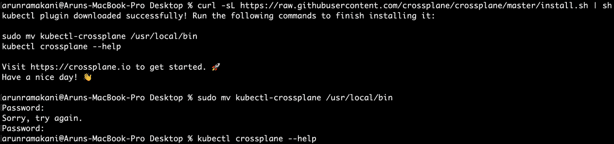
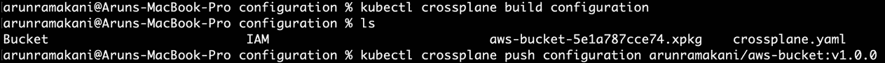
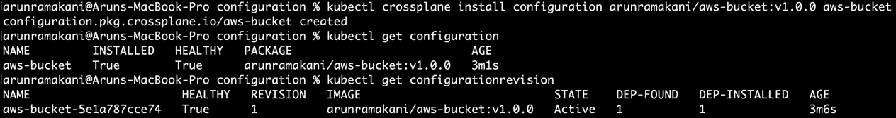
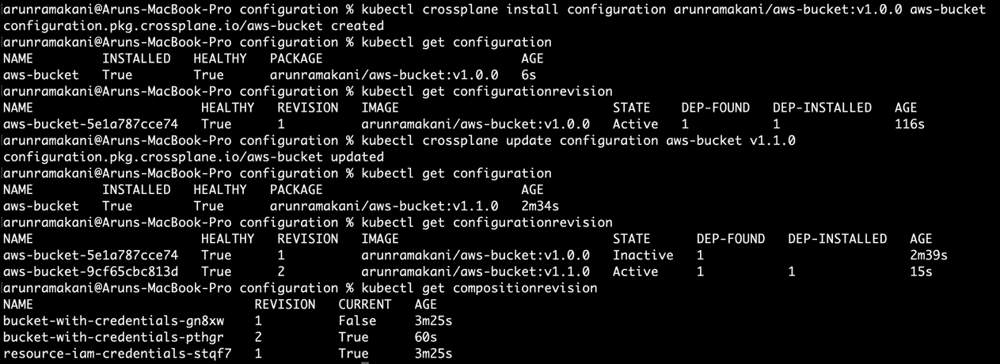
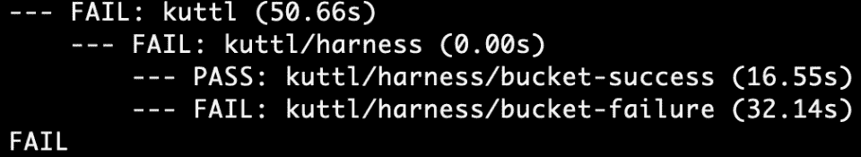
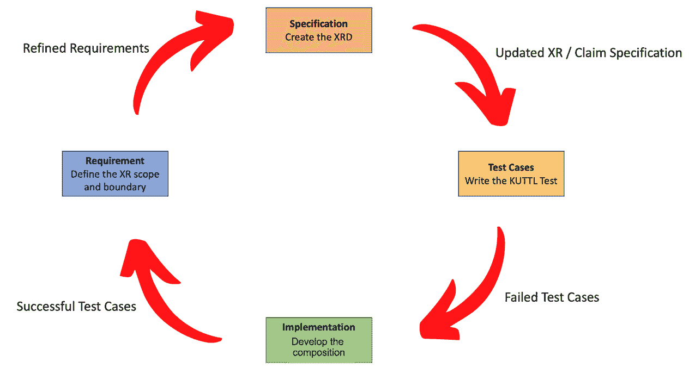
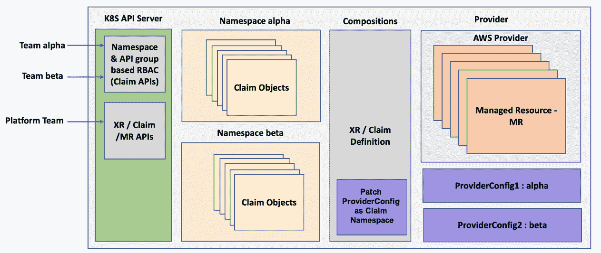

# *第七章*：扩展和扩展 Crossplane

本章将深入探讨一些使 Crossplane 可扩展和可扩展的特性。本章的初始部分将讨论为尚未支持的外部资源开发新的 Crossplane 提供者。我们将研究在设计提供者时需要考虑的标准以及可用的方法，使得提供者开发相对轻松。接下来的部分将涵盖配置、打包 XR/Claim API 的方法，以及如何测试我们的 XR。本章的最后部分将介绍 Crossplane 支持的不同模式，如何将控制平面扩展为多租户生态系统。

本章涵盖的主题如下：

+   构建新的提供者

+   XRD 详细信息

+   构建提供者的框架

+   XR/Claim 的打包和分发

+   测试配置

+   多租户控制平面模式

# 构建新的提供者

Crossplane 提供者仅仅是相关的**托管资源**（**MRs**）的集合。MR 是有观点的自定义控制器和自定义资源的组合，能够与外部资源进行一对一映射，使我们能够从 Kubernetes 中管理这些资源。将新资源作为 MRs 纳入现有或新提供者是一个耗时的过程。在过去几年里，Crossplane 社区已努力将大多数重要资源与 Crossplane 原生控制器结合起来。随着 Crossplane 社区最近在自动生成 Terraform 提供者的 Crossplane 提供者方面的进展，实现了 100% 的云资源覆盖。除了所有主要云提供者的提供者外，我们还为其他外部资源提供了提供者，如 GitLab、Helm、SQL 和 Argo CD。访问 Crossplane 网站或 Upbound Registry 探索可用的提供者。

当我们尝试自动化所有应用程序和基础设施的问题时，我们可能会遇到某些外部资源没有提供者的情况。你可能决定自己添加一个新的提供者——例如，目前没有提供者来管理 Bitbucket 仓库资源。本章的这一部分将介绍新提供者开发者所需的**Crossplane 资源模型**（**XRM**）的关键方面，并探讨可用的框架，以简化开发过程。首先，我们将了解 XRM，这是一个对**Kubernetes 资源模型**（**KRM**）的有观点的子集。

提示

查看 XRM 定义的标准以支持新的提供者开发，也使我们能够更好地理解现有的 MRs。它将进一步帮助我们使用相同的 XRM 标准构建我们的 XR。遵循这些标准与 XR 一起使用将使消费团队对其有统一且容易理解的认识。

接下来的部分将深入探讨 XRM 规范的细节。

# XRM 详细信息

作为 KRM 的扩展，XRM 继承了大多数标准。如*第三章*和*第四章*所述，Crossplane 继承了许多来自 Kubernetes CRD 的标准。基于 Kubernetes 标准的 XRM 独特标准定义了 Kubernetes 与外部资源之间的统一桥梁。XRM 标准涵盖了以下特点：

+   配置保真度

+   规格与状态配置

+   命名自定义和外部资源

+   配置所有权

+   敏感的输入和输出字段

我们将在接下来的章节中深入探讨这些特点的细节。

## 配置保真度

MR 应该包含外部资源 API 中所有可用的配置字段。它在控制平面级别提供所有配置组合。我们应该将抽象留给通过 XR 为平台开发人员编码策略和创建配方。外部资源 API 中每个可配置字段都应在 MR 中以相同名称呈现。属性使用相同名称将使用户更容易进行比较和故障排除。在开始新提供者的开发之前，必须确保资源具有明确定义的 CRUD API 和细粒度的控制。没有这样的 API 标准，控制理论实现将无法有效运行。接下来的章节将进一步讨论 API 输入和输出。

## 规格与状态配置

**规格**是作为 API 输入的配置部分，**状态**是作为 API 输出的属性。首先来看规格部分。我们可以在规格部分中设置三种类型的配置选项——初始初始化、延迟初始化和不可变配置。初始初始化是用户在资源配置时使用的配置，许多参数都属于这一类。例如，RDS 配置中的数据库版本就属于初始初始化。延迟初始化属性由提供者在资源创建时初始化为默认值，之后在调和循环中根据用户配置更新为实际值。这通常对那些在资源创建后才可用的外部资源字段非常有用。资源标签和标签是最常见的例子。

不可变配置是指在初始配置后其值无法更改的属性——例如，在创建资源后我们无法更改 RDS 区域。这些配置应在 MR 中标记为不可变。如果用户尝试更新相同的配置，将触发协调失败事件。从创建和更新 API 操作中要求的必填字段应在 MR 中标记为必填字段。可选字段应为`pointer`类型——这是从 Kubernetes 继承的标准。我们之所以这样做，是因为一些非指针类型在用户未指定值时可能会解析为零——例如，我们应该使用`*bool`而不是`bool`。这个问题不适用于必填字段，因为用户必须指定值。

信息

一些字段可以包含`struct`类型的值，因为底层资源 API 以这种方式支持它。我们在上一章中看到过一个例子，AWS IAM 中的`Policy`对象就是作为输入接受 JSON 格式的策略。

*状态*部分表示外部资源的当前状态。它包含每次协调循环后从外部资源返回的观察到的属性。如果某个配置及其子属性代表另一个外部资源，则这些字段可以添加到*状态*部分。如果一个配置及其子属性可以在删除后重新创建，那么它们是合适的候选项。例如，我们在创建 Azure 虚拟网络时，也可以同时创建子网。换句话说，Azure 虚拟网络的云 API 也有一个部分用于定义子网。在 Crossplane 控制面板中，我们应将其作为两个独立的资源进行管理，并进行引用。

## 自定义和外部资源的命名

每个 MR 代表一种独特的类型，属于特定的 API 组，并且可以存在于多个版本中。这是一种从 Kubernetes 标准继承的行为。在创建特定 MR 类型的对象时，我们有两个重要的名称：

+   控制平面内资源的名称

+   外部生态系统中资源的名称

控制平面中的资源名称也可以称为**自定义资源**（**CR**）名称。归根结底，无论是 MR、Claim 还是 XR，它们都是一种有意见的 CR。当用户创建 MR/XR/Claim 时，他们会提供一个与类型、版本和 API 组并行的名称。这个名称将唯一标识集群中的一个资源。如果是 MR/XR，则该名称在整个集群中唯一；如果是 Claim，则它在每个命名空间内唯一。由于这些名称不是自动生成的，使用的团队可以选择一个随机值。这样的随机名称难以进行资源交叉引用。可预测的命名策略和标签将有助于资源引用变得直接明了。我们可以使用准入控制工具，如**Open Policy Agent**（**OPA**），在配置中管理这些标准。

外部名称是资源在外部生态系统中的名称。资源提供者可能允许或不允许我们影响这个名称——例如，在 S3 存储桶中，我们可以在 AWS 中确定存储桶的名称。我们通过诸如 ID、名称或 UID 等属性来控制此名称。如果用户未配置这些属性，控制器可以使用<`CR Name>-<Namespace>-<Kubernetes 分配的随机 5 个字符>`模板自动生成名称。Amazon VPC 是一个典型的例子，我们无法影响其名称。AWS 会生成一个唯一的 ID，称为 `vpcID`，作为名称。如果我们希望将 MR/XR/Claim 链接到现有的外部资源，我们可以添加一个 `crossplane.io`/`external-name` 注释，将资源的名称与外部生态系统关联。如果指定名称的资源不存在，则会创建一个新资源，并使用提供的名称。如果是一个不允许命名的资源，则最终名称将复制回 `crossplane.io/external-name` 属性。在设计新 MR 时，我们需要牢记这些命名行为。

信息

KRM 还建议在外部环境中的资源上添加标签，包含资源类型、CR 名称和提供者名称。这将有助于诸如在外部环境中识别资源、基于标签的批量操作、监控和调试等用例。需要注意的是，并非所有资源都支持此类标签。

## 配置所有权

有些字段仅与控制平面相关，无论是在 Spec 部分还是在 Status 部分——例如，Spec 部分中的 `ProviderConfigRef` 指示使用哪个凭证。我们还有一些仅适用于外部资源的其他属性。这些字段之间可能会发生冲突——例如，`CreationTimestamp` 可以同时存在于集群和外部资源级别。KRM 提出了 `spec.forProvider` 和 `status.atProvider` 部分作为外部资源相关字段的所有者。

## 敏感的输入和输出字段

MR 的输入和输出字段中可能包含敏感信息。配置数据库主密码就是 MR 输入中敏感数据的一个例子。IAM AccessKey 凭证是 MR 输出中敏感数据的一个例子。直接暴露这些字段值在 MR/XR/Claim 中是不明智的。对于 MR 输出中的敏感信息，Kubernetes Secret 应该存储这些数据。Crossplane 社区也在制定 *vault* 集成来发布凭证。类似地，包含机密信息的输入字段应为保密引用。控制器应从机密源获取这些字段的值。此类字段在 MR 中的命名约定应为 `<字段名称>SecretRef`。`RDSInstance` MR 中的 `MasterPasswordSecretRef` 字段就是这种字段的一个例子。

KRM 是一个不断发展的领域，具有新的需求。正在创建 KRM 标准，以支持 Terraform 生成的 Crossplane 提供者中的资源引用。另一个正在进行中的标准示例是仅将 Crossplane 用作观察者，特别是对于由其他自动化工具（如 Helm 和 Terraform）管理的现有资源。定期查看 Crossplane Slack 频道或发布说明可以帮助我们保持对发展中的标准的了解。KRM 的讨论到此为止。在接下来的部分中，我们将了解几种提供者开发的可用方法。

# 构建提供者的框架

为了降低开发新提供者所需的认知负担，Crossplane 社区已确定了几种相对无痛的方式，如下所示：

+   `ProviderConfig`，可以从 Kubernetes Secrets 中读取凭证，以管理外部提供者的身份验证和授权。它还具有一个示例 MR 和一个控制器。我们可以使用外部资源的 CRUD API，将所有新的 MR 及其相应的控制器与适当的控制理论实现添加到其中。[`www.youtube.com/watch?v=dhuqH308Tc0`](https://www.youtube.com/watch?v=dhuqH308Tc0)上的视频带我们通过一个实践示例，介绍了使用提供者模板进行提供者开发。

+   对外部资源的`创建`、`读取`、`更新`和`删除`操作。MR 中的配置参数将转换为 JSON，并作为输入用于使用 Terraform CLI 进行的`CRUD`操作。有关如何开发此类提供者的逐步指南，请参见[`github.com/crossplane/terrajet/blob/main/docs/generating-a-provider.md`](https://github.com/crossplane/terrajet/blob/main/docs/generating-a-provider.md)。

我们大多数人可能不需要自己开发一个提供者。现在，我们已经为所有主要云提供商的资源提供了 100%的资源覆盖。Crossplane 社区将很快为每个可用的 Terraform 提供商创建一个 Terrajet Crossplane 提供者，只要我们减少认知负担。如果你仍然有此需求，本节将引导你朝着正确的方向前进。此外，学习 KRM 将使你对 MR 的理解更上一层楼。接下来的章节将介绍如何打包和分发 XR/Claims。

# XR/Claim 的打包与分发

Crossplane 配置是一种打包我们 XR 和 Claim API 的方式。这种打包将帮助我们可靠地将这些 API 建立到任何启用了 Crossplane 的 Kubernetes 集群中。Crossplane 配置主要是一种组合分发机制。随着分发，我们还可以管理版本和依赖关系。我们最终可能会使用 Crossplane 配置来处理三种不同的用例：

+   当一个大型组织希望在不同的团队边界之间分发多个控制平面时，它非常有用。

+   当有人有兴趣构建一个控制平面平台并将其作为产品出售时，这也很有用。

+   希望与社区分享其 XR/Claim 配方的开源开发者也可以使用 Crossplane 配置。

本章的这一部分将带你进行一个实践之旅，让你学习 Crossplane 配置。首先，让我们来看一下打包和分发。

## 打包和分发

使用 Crossplane 配置时，我们将组合打包为符合 OCI 标准的镜像以进行分发。将组合打包为配置是一个简单的两三步过程：

1.  第一步，创建一个 `crossplane.yaml` 文件。这是一个简单的 `Configuration.meta.pkg.crossplane.io` 类型的 YAML 文件。它定义了配置名称、最低支持的 Crossplane 版本以及依赖关系。提供者和其他配置都可以定义为依赖关系。以下是示例配置 YAML 文件：

    ```
    apiVersion: meta.pkg.crossplane.io/v1
    kind: Configuration
    metadata:
      name: aws-bucket
    spec:
      crossplane:
        version: ">=v1.6.0"
      dependsOn:
        - provider: crossplane/provider-aws
          version: ">=v0.23.0"
    ```

此示例可以在 [`github.com/PacktPublishing/End-to-End-Automation-with-Kubernetes-and-Crossplane/tree/main/Chapter07/Hand-on-examples/configuration`](https://github.com/PacktPublishing/End-to-End-Automation-with-Kubernetes-and-Crossplane/tree/main/Chapter07/Hand-on-examples/configuration) 中找到。我们将把最后一个 Amazon S3 桶示例打包为名为 `aws-bucket` 的配置，该配置设计为支持任何版本大于或等于 v1.6.0 的 Crossplane。AWS Crossplane 提供程序被添加为该包的依赖项。

1.  接下来，我们将执行 Crossplane CLI 命令 build 来生成 `configuration` 包。我们将在包含 `crossplane.yaml` 文件和所有组合的文件夹中运行该命令。此步骤将输出一个具有 `**.xpkg` 扩展名的文件。一旦包生成，下一步是将包推送到任何符合 OCI 标准的镜像注册表中。Crossplane CLI 的 `push` 命令将创建一个符合 OCI 标准的镜像并将其移动到注册表中。以下是构建和推送配置的命令：

    ```
    # Build the configuration package
    kubectl crossplane build configuration
    # Push the image into an image registry
    kubectl crossplane push configuration arunramakani/aws-bucket:v1.0.0
    ```

1.  如果你还没有设置 Crossplane CLI，请使用以下两个命令：

    ```
    # Download and run the install script
    curl -sL https://raw.githubusercontent.com/crossplane/crossplane/master/install.sh | sh
    # Move the plugin to the bin folder
    sudo mv kubectl-crossplane /usr/local/bin
    ```

请参考以下屏幕截图以了解 macOS 上的安装：



图 7.1 – Crossplane CLI 安装

请注意，默认的镜像注册表是 Docker Hub。你应该使用 `docker login` 在 CLI 中登录到 Docker Hub。你可以看到该镜像可在 [`hub.docker.com/repository/docker/arunramakani/aws-bucket`](https://hub.docker.com/repository/docker/arunramakani/aws-bucket) 上找到。你也可以配置其他你选择的镜像注册表。

信息

请注意，每个组合和 XRD 组合都保存在不同的文件夹中（`Bucket` 和 `IAM`）。这将帮助 `build` 命令映射和验证组合和 XRD 组合。如果所有组合和 XRD 都保存在同一文件夹中，你将看到构建错误。

请参考以下截图，我们在其中创建了配置和符合 OCI 标准的镜像：



图 7.2 – 打包并推送 OCI 配置镜像

一旦配置作为镜像存储在注册表中，我们可以将 `configuration` 包安装到 Crossplane 控制平面中，并开始使用组合。我们将在接下来的章节中详细讨论这一点。

## 安装和使用配置

我们有两种方式可以在 Crossplane 生态系统中安装配置。第一种方式是使用以下 Crossplane CLI：

```
# To install a new configuration package
```

```
kubectl crossplane install configuration arunramakani/aws-bucket:v1.0.0 aws-bucket
```

```
# To upgrade an existing configuration package
```

```
kubectl crossplane update configuration aws-bucket v1.1.0
```

CLI 将名称和镜像作为两个参数进行安装。它甚至会安装我们定义的依赖 AWS 提供者。一旦配置安装完成，可以使用以下命令查看配置和 ConfigurationRevision 的详细信息。每次配置更新都会创建一个新的 ConfigurationRevision，并且在任何给定时间只有一个修订版是活动的：



图 7.3 – 安装配置

第二种安装配置的方法是使用 `Configuration.pkg.crossplane.io` 类型的 YAML。请注意，Crossplane 核心中有两种不同 API 组的配置类型。第一个 API 组 `meta.pkg.crossplane.io` 用于构建 `Configuration` 包。第二个 API 组 `pkg.crossplane.io` 用于安装 `Configuration` 包。以下是一个示例配置 YAML：

```
apiVersion: pkg.crossplane.io/v1
```

```
kind: Configuration
```

```
metadata:
```

```
  name: aws-bucket
```

```
spec:
```

```
  package: arunramakani/aws-bucket:v0.7.0
```

```
  packagePullPolicy: IfNotPresent
```

```
  revisionActivationPolicy: Manual
```

```
  revisionHistoryLimit: 3
```

在 CLI 中，我们没有使用 `PackagePullPolicy`、`RevisionActivationPolicy` 和 `RevisionHistoryLimit` 属性。`PackagePullPolicy` 的工作方式与其他 Kubernetes 类型的 `ImagePullPolicy` 类似。`RevisionActivationPolicy` 可以是 `Automatic` 或 `Manual`，默认为 `Automatic`。当设置为自动时，包中的新 XRs 将被安装，旧包中的 XRs 将变为非活动状态，新的 XRs 将变为活动状态并负责资源的协调。当升级 `Configuration` 包时，你会看到两个 ConfigurationRevisions，每次版本递增都会创建一个新的 ConfigurationRevision。同时，也可以看到 CompositionRevision 伴随着组合的变化而被创建。请参考以下截图，其中有一个活动的和一个非活动的 ConfigurationRevision：



图 7.4 – 配置更新和修订版

如果我们将 `RevisionActivationPolicy` 设置为 `Manual` 模式，我们必须手动编辑修订版并将其设为 `Active`。`RevisionHistoryLimit` 字段是 Crossplane 跟踪的最大修订版数量。以下章节将探讨测试 Crossplane 配置的方法。

# 测试配置

平台开发者需要一种方法来测试他们开发的 XRs 和配置。此外，许多团队可能有兴趣实践测试驱动开发。本书的这一部分将探讨 **KUbernetes Test TooL**（**KUTTL**）作为测试驱动开发和配置测试流水线的测试工具。KUTTL 是一个声明式测试工具，用于测试最佳的 Kubernetes 控制器状态和 CRDs。KUTTL 的关键特性是针对 CR 编写声明式测试用例。由于 KUTTL 能够很好地与 CR 和 CRDs 配合使用，它也能够与 XR、XRDs 和 Claim 良好配合。首先，我们将了解所需的基本安装和设置。

## 安装 KUTTL

KUTTL CLI 是 kubectl 的扩展。要安装 KUTTL，我们首先需要安装 Krew。这是一个 kubectl 插件管理器，帮助发现、安装和更新 kubectl 插件。要在 macOS/Linux 操作系统上安装，请运行以下脚本：

```
(
```

```
  set -x; cd "$(mktemp -d)" &&
```

```
  OS="$(uname | tr '[:upper:]' '[:lower:]')" &&
```

```
  ARCH="$(uname -m | sed -e 's/x86_64/amd64/' -e 's/\(arm\)\(64\)\?.*/\1\2/' -e 's/aarch64$/arm64/')" &&
```

```
  KREW="krew-${OS}_${ARCH}" &&
```

```
  curl -fsSLO "https://github.com/kubernetes-sigs/krew/releases/latest/download/${KREW}.tar.gz" &&
```

```
  tar zxvf "${KREW}.tar.gz" &&
```

```
  ./"${KREW}" install krew
```

```
)
```

设置路径，确保我们可以在终端中访问 Krew，使用以下命令：

```
export PATH="${KREW_ROOT:-$HOME/.krew}/bin:$PATH"
```

在其他操作系统上安装 Krew 的指令是不同的。要在不同操作系统上下载并安装 Krew，请参考 [`krew.sigs.k8s.io/docs/user-guide/setup/install/`](https://krew.sigs.k8s.io/docs/user-guide/setup/install/)。安装 Krew 后，KUTTL 设置只需一个简单的步骤——执行以下指令：

```
kubectl krew install kuttl
```

执行上述命令后，您将在本地环境中成功安装 KUTTL。下一步是了解 KUTTL 项目的结构以及设置测试的基础。

## KUTTL 测试设置

KUTTL 设置有三个关键组件。`TestSuite.kuttl.dev` 是第一个组件，也是核心配置。它包含整个测试套件的配置。以下是一个 `TestSuite` 配置示例：

```
apiVersion: kuttl.dev/v1beta1
```

```
kind: TestSuite
```

```
# Information on k8s cluster to use for testing
```

```
startKIND: false
```

```
kindContext: gke_crossplane-339717_us-central1_autopilot-cluster-1
```

```
skipClusterDelete: true
```

```
# Commands to be executed for any initial setup before testing
```

```
commands:
```

```
  - command: kubectl apply -f init/
```

```
# Directory where all our tests are kept 
```

```
testDirs:
```

```
- ./bucketwithcredential
```

请注意，`TestSuite` 文件的名称应该是 `kuttl-test.yaml`，以便 KUTTL CLI 查找测试配置。`StartKIND`、`KindContext` 和 `SkipClusterDelete` 是定义 Kubernetes 集群用于测试的配置项。在上面的示例中，我们使用了来自 GCP 的现有 Kubernetes 集群。通过 `KindContext`，我指定了 kubeconfig 中 Kubernetes 集群的名称。我们也可以创建一个新的 kind Kubernetes 集群进行测试，并在测试结束时销毁它。这对于测试流水线非常有用。参考 KUTTL 文档以了解完整的集群配置选项。`TestSuite` 文件的 `Commands` 部分将使我们能够执行所有初始化。在我们的实践示例中，我们正在初始化 `ProviderConfig`。完整示例请查看 [`github.com/PacktPublishing/End-to-End-Automation-with-Kubernetes-and-Crossplane/tree/main/Chapter07/Hand-on-examples/test-configuration`](https://github.com/PacktPublishing/End-to-End-Automation-with-Kubernetes-and-Crossplane/tree/main/Chapter07/Hand-on-examples/test-configuration)。

请注意，我们的 `ProviderConfig` 并不包含任何实际的 AWS 凭证。`ProviderConfig` 位于 Git 仓库的 `init` 文件夹中。我们初始化 `ProviderConfig` 是为了确保 Crossplane 不会因为缺少配置而报错。请记住，测试的范围是验证我们的 XR 和 Claim 是否正确转换为 MR。换句话说，我们将测试我们的组合逻辑。如果 MR 按预期创建资源，那是供应商测试的范围。如果我们使用动态类型的 Kubernetes 集群，我们应该在初始化过程中安装 Crossplane、AWS 提供程序以及相关配置。由于我们使用的是现有集群，这不在我们的测试范围内。

提示

如果你希望进行端到端测试，或者你的测试用例依赖于我们从外部资源返回的一些状态字段，请在 `ProviderConfig` 中提供实际的云凭证。

第二个关键组件是测试文件夹和测试步骤。KUTTL 会扫描 `TestSuite` 文件中指定的 `TestDirs` 文件夹的所有子文件夹中的测试用例。每个文件夹就是一个测试用例。在我们的例子中，有两个测试文件夹。`bucket-failure` 文件夹包含一个会失败的测试用例，`bucket-success` 文件夹包含一个会成功的测试用例。每个测试用例可以有多个按指定顺序执行的步骤。KUTTL 可以从文件名的前缀识别步骤的编号。请注意，测试用例文件夹中的文件（在 Git 示例中）有一个数字前缀。

最后一部分是实现单个测试步骤。每个测试步骤可以包含我们在 Kubernetes 集群中应用的配置（XR/Claim）以及相应的断言配置（MR）。这些断言不必定义整个 MR，而是可以包含我们想要验证的字段。我们可以在一个断言步骤文件中定义多个断言配置。在前面的例子中，我们应用了 bucket Claim，并验证组合是否正确地修补了 bucket 名称（参考 Git 仓库中的 `bucketwithcredential` 文件夹）。我们甚至可以断言并验证 MR 中的状态字段，只要提供有效的 `ProviderConfig`。通过以下命令从根文件夹执行测试，该文件夹中有 `kuttl-test.yaml` 文件：

```
kubectl kuttl test
```

请注意，`bucket-failure` 文件夹的断言配置中的 bucket 名称与 bucket Claim 中的名称不同，因此测试用例会失败。请参见以下截图，其中一个测试用例失败，另一个测试用例成功：



图 7.5 – KUTTL 测试用例

信息

我们刚刚介绍了 KUTTL 的基本内容。要更详细地了解这个工具，请访问 [`kuttl.dev/docs/`](https://kuttl.dev/docs/)。

接下来的部分将讨论将 KUTTL 用作 **测试驱动开发**（**TDD**）工具进行 XR/Claim 开发的可能性。

## TDD

TDD（测试驱动开发）是一种软件开发实践，开发者首先从需求中编写测试用例，然后编写通过测试用例的代码。这是一种迭代开发模型，我们从失败的测试用例开始，逐步演化代码使其通过测试。使用 TDD 有很多好处，包括干净的代码和全面的测试覆盖率。讨论所有的好处超出了本书的范围。本节将重点讨论在 XR 开发中使用 TDD。下图表示了 XR/Claim 的迭代 TDD 过程：



图 7.6 – XR/Claim 的 TDD

以下步骤描述了 XR/Claim 的 TDD 阶段：

1.  使用上一章讨论的权衡分析来定义 API 范围和边界。

1.  使用 XRD 配置创建 XR/Claim API 规范，采用范围和边界定义。这将是 API 消费者的一个要求。

1.  在组合中定义每个资源的最终 MR 状态。这仅有 API 实现要求。组织政策和合规性要求将成为实现要求的一部分。

1.  为 *步骤 2* 和 *3* 中定义的所有需求开发 KUTTL 测试用例。运行测试用例，查看所有实例均未通过。

1.  开发组合并重新运行测试用例。迭代直到所有测试用例成功。

1.  完善 API 范围和边界需求，继续循环。

我们可以将 KUTTL 与 Kubernetes 生态系统中的其他工具（如 Skaffold）结合使用，使 TDD 更加简便。本节讨论完了配置/组合的测试。在本章的最后一节，我们将讨论如何将 Crossplane 扩展为多租户生态系统。

# 多租户控制平面模式

通常，多个产品团队必须访问控制平面平台，以利用平台工程师构建的组合配方。本节将介绍 Crossplane 支持的不同模式，以启用多租户控制平面。以下是 Crossplane 用户可以选择的两个关键模式：

+   使用单个集群的多租户

+   多租户与多个集群

## 使用单个集群的多租户

使用单个集群的多租户是一种模式，在这种模式下，所有的产品团队使用一个单一的 Crossplane 控制平面。控制平面被配置为支持在同一集群内实现多租户。以下事实描述了这种设置的样子：

+   产品团队通过命名空间 Kubernetes 构造进行隔离。每个产品团队应分配一个命名空间。

+   如前所述，XR 和 Claim 之间的区别，Claim 是命名空间范围的，而 XR 是集群范围的。

+   此外，我们之前提到过，XR 仅应由平台团队使用。

+   精确的 RBAC 可以应用于给定命名空间中的 Claim API，基于团队成员角色和 API 组。

+   组织可以实现 RBAC，使用默认的 Kubernetes RBAC API，或者使用通用的策略引擎，如 OPA（Gatekeeper）。

除了前述要点外，每个团队还应拥有不同的外部提供商凭证，以便跟踪使用情况、成本、监控、审计等。这可以通过使用以命名空间命名的 ProviderConfig 轻松实现。我们还应当在组合中补丁来自 Claims 命名空间引用的 ProviderConfigRef。下图展示了帮助你可视化单集群多租户架构：



图 7.7 – 单集群多租户

以下是参考该模式的代码片段：

```
# ProviderConfig for each team 
```

```
# Match the ProviderConfig name to the namespace
```

```
# Example ProviderConfig for team-alpha
```

```
apiVersion: aws.crossplane.io/v1beta1
```

```
kind: ProviderConfig
```

```
metadata:
```

```
  name: team-alpha
```

```
spec:
```

```
  credentials:
```

```
    source: Secret
```

```
    secretRef:
```

```
      namespace: crossplane-system
```

```
      name: team-alpha-creds
```

```
      key: creds
```

在组合中的每个资源下，动态地补丁`ProviderConfigRef`，指向 Claims 命名空间：

```
# Patch claims namespace to the ProviderConfigRef of the MR
```

```
patches:
```

```
  - fromFieldPath: spec.claimRef.namespace
```

```
    toFieldPath: spec.providerConfigRef.name
```

接下来的部分将探讨多个集群下的多租户设置。

## 多租户与多个集群

一些组织设置可能有多个独立的业务单元，具有不同的基础设施需求，如监控、成本管理和合规性。我们可能需要设置多个 Crossplane 控制平面。以下两种基本模式将支持这种环境：

+   **配置**：我们可以利用本章前面讨论的 XR/Claim 打包机制来可靠地开发和分发 XR/Claim。

+   **嵌套 Crossplane**：一个中央 Crossplane 控制平面可以管理每个业务单元的其他 Kubernetes 集群。我们可以从中央 Crossplane 集群使用 Helm 提供者，在其他集群中设置 Crossplane。

我们还可以尝试在单个集群中进行多个 Crossplane 设置，每个租户/团队一个。我们可以尝试使用`vcluster`等工具。它是一个高级模式。我们在这里尝试的是在一个 Kubernetes 内部运行另一个 Kubernetes。如果你有类似的用例，可以尝试使用 vcluster 进行设置。这也结束了多租户的讨论。

# 总结

本章讨论了扩展和扩展 Crossplane 的各个方面。在过去几章中，我们已经逐步学习了从 Crossplane 的基础知识到许多高级概念。我们涵盖了使用 Kubernetes 和 Crossplane 构建现代化控制平面的许多细节。这也标志着本书第二部分的结束。

书籍的第三部分将探讨一种配置管理方法以及一些配置管理工具和技巧。这将是一次将应用程序和基础设施自动化与 Crossplane 及其他配置管理工具统一的旅程。
