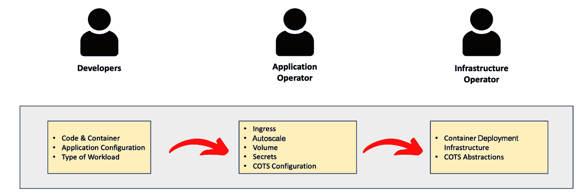
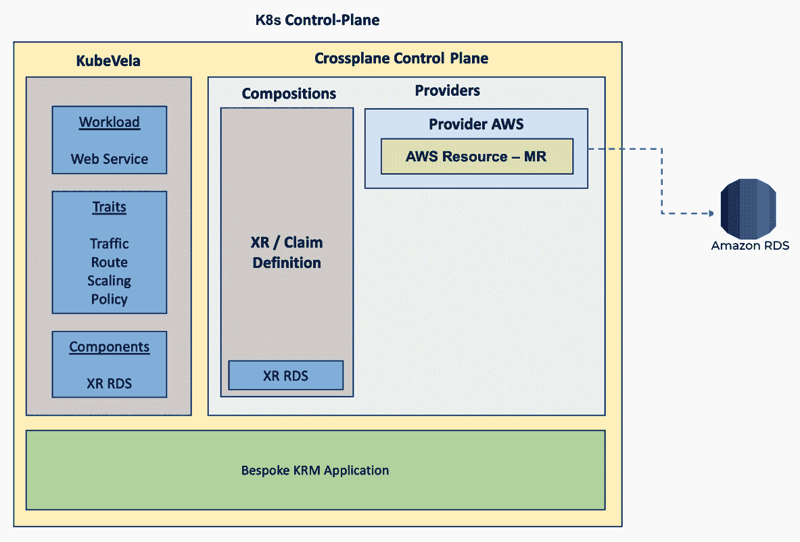
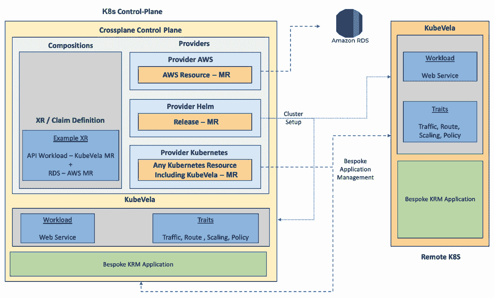

# 第八章：*第八章*：了解权衡

在前几章中，我们学习了很多关于 Crossplane 的内容，从基础到许多高级模式。同时，我们介绍了统一的应用程序和基础设施自动化方法。本章将回顾并从整体上分析统一自动化的配置管理。本章深受 Kubernetes Steering Committee 荣誉成员 Brian Grant 的白皮书《Kubernetes 中的声明式应用程序管理》([`goo.gl/T66ZcD`](https://goo.gl/T66ZcD))的影响。该白皮书主要讨论**Kubernetes 资源模型** (**KRM**)。我们将从 KRM 和**Crossplane 资源模型** (**XRM**) 的角度讨论本章的主题。本章将定义统一自动化方法的范围，并继续探讨许多其他概念，例如可用的工具、常见的陷阱以及使用不同模式时的权衡。从某种意义上说，这是对**第六章** API 边界讨论的详细回顾。

本章涵盖的主题如下：

+   统一自动化范围

+   复杂度时钟、需求和模式

+   开放应用模型

+   专业化和可扩展的抽象

+   变更频率的影响

# 统一自动化范围

我们中的大多数人对“统一的应用程序和基础设施自动化”有不同的理解。本节将帮助我们更加清晰地理解这一范围。我们部署的任何应用程序/产品，通常都是定制开发的专用应用程序和**现成的** (**COTS**) 组件的组合。定制应用程序指的是为我们的需求编写的、具有特定用途的软件。定制应用程序通常是无状态的、容器化的工作负载。从 Kubernetes 的角度来看，它们是运行在 Pod 上的工作负载，Pod 是 Kubernetes 中的基本计算单元。COTS 组件通常是有状态的基础设施组件，例如数据库、缓存系统、存储系统和消息系统。在云原生时代，大多数 COTS 组件是黑箱式的、完全托管的**软件即服务** (**SaaS**) 或 **平台即服务** (**PaaS**)。COTS 供应商通过暴露 CRUD API 来与资源交互，并为安全性、扩展、监控和更新等问题提供精确的配置控制。这些特定的配置控制将支持不同消费者的使用案例。当我们谈论统一的应用程序和基础设施自动化时，这是指使用相同的工具、流程和模式来配置定制应用程序和 COTS 部署。换句话说，定制应用程序可以遵循 KRM 标准，COTS 依赖项可以遵守 XRM 标准，即 KRM 的扩展。这样统一的方法有许多优点：

+   在现代软件工程领域，产品团队通过垂直拆分来实现最大的交付速度。这些垂直拆分的团队既负责定制应用程序，也负责它们依赖的 COTS 组件。统一的工具、流程和模式将显著减少认知负担。

+   这将减少对专门团队管理 COTS 组件的需求，进一步加速交付速度。

+   定制应用程序及其 COTS 依赖项的政策配置数据可以非常简单。我们可以在一个地方和格式中验证架构适应性函数、安全问题和合规标准等政策。

+   所有 COTS 供应商都可以提供符合 KRM 规范的 API（MRs），作为通用的应用程序依赖和集成标准。这已经在所有主要云资源的 Crossplane 提供商中实现。这个列表正在不断扩展，涵盖其他外部资源，如 Git Lab、Argo CD、Rook 和 Cloudflare，以实现端到端自动化。

接下来的部分将涵盖一些统一自动化方法的要求、模式和工具。

# 复杂性时钟、要求和模式

配置复杂性时钟是一个概念，用来解释配置管理如何随着时间的推移变得复杂。它探讨了配置管理演变的不同阶段、使用场景及其陷阱。最初是从应用程序配置的角度在这篇博客文章中讨论的：[`mikehadlow.blogspot.com/2012/05/configuration-complexity-clock.html`](http://mikehadlow.blogspot.com/2012/05/configuration-complexity-clock.html)。我们将从 Kubernetes 配置管理的角度来审视这个相同的概念。

## 配置复杂性时钟

假设我们正在将我们的第一个应用工作负载部署到 Kubernetes 中。首先，Kubernetes 中的每个工件，例如 Deployment、Service 和 Ingress，都可以作为独立的配置工件来管理。在我们操作小规模时，这可能不会成为问题。但很快我们会意识到，当应用配置分散在多个 Kubernetes 资源上时，持续进行发布和回滚就会出现问题。我们将开始考虑使用 Helm 等打包和发布管理工具。Helm 是一个基于模板的配置管理工具。我们将通过变量来参数化值，以实现配置抽象，并仅暴露有限的属性。一个典型的例子是为每个部署目标（生产和预发布）设置副本数。很快，组织会意识到 Kubernetes 的强大，并决定在 Kubernetes 生态系统中进一步部署类似的工作负载。由于新应用的配置数据与初始 Helm 模板看起来相同，我们将选择参数化更多的变量，以支持多个应用使用相同的 Helm 模板。这将是推动重用目标并最小化需要维护的配置的一个好方法。这些新参数的典型例子包括命名空间、标签和应用名称。

组织将再次从 Kubernetes 中获得更多好处，并决定尝试一些新的工作负载。这些工作负载可能与初始的 Helm 模板有相似的配置数据，仅做了少量定制。我们会决定分叉主 Helm 模板来进行所需的定制。基于模板的抽象在需要定制时变得复杂，难以重用。随着配置时钟的持续运行，经过一段时间后，我们将看到太多的分叉，难以保持同步。另一方面，许多独立模板会引入新的参数，以支持新的本地使用案例。这是我们通过 Helm 模板创建的抽象的漏洞。随着时间的推移，我们可能会将所有值参数化，完全侵蚀掉抽象。以这个 WordPress 图表为例：[`github.com/helm/charts/tree/master/stable/wordpress`](https://github.com/helm/charts/tree/master/stable/wordpress)。从最初的提交开始，参数数量缓慢增加，逐渐变多。完全侵蚀的模板难以阅读，最终用户会发现很难理解每个参数的用途。用户会发现，很难理解那些与他们无关的参数。例如，开发人员可能不知道如何在前述的 WordPress Helm 图表中定义 Ingress 参数。

随着配置时钟的不断推进，我们必须加强配置的安全性。基础设施运营者希望拥有配置的控制权，因为应用程序拥有者并不知道如何配置安全参数。Helm 后渲染功能可以帮助我们解决这个问题，并通过延迟绑定注入安全配置。但是，由于定制化分支过多和渲染输出不可预测，基础设施运营者仍然会面临在部署流水线中管理后渲染步骤的挑战。有些开发者可能决定使用如 Terraform 这样的 DSL 来管理配置，因为它容易理解。然而，DSL 继承了输入变量的相同参数化问题，后渲染定制化步骤在 DSL 中同样具有挑战性。此外，DSL 存在开发者学习曲线复杂且对测试等问题支持有限的问题。漏洞或合规性扫描是我们可能面临的另一个工具问题领域。随着我们规模的扩大，Crossplane 配置也可能面临类似的问题。讨论这些局限性并不是为了阻止使用任何特定工具。每个工具都有其使用场景和权衡。例如，Helm 打包在小规模操作和其他少数用例（如发布管理）时表现良好。某种程度上，我们会研究如何通过结合工具和模式来克服这些局限性。

## 配置管理要求

为了在不被复杂时钟问题困住的情况下管理配置，我们应该牢记一些指导原则。这些指导原则将成为在选择配置管理工具和模式时进行权衡分析的技术要求。将这些指导原则融入我们的配置管理实践中，将使我们能够轻松地进行演进和扩展：

+   保持配置数据对人类和机器可读，以便在配置流水线中进行变更。诸如特定环境补丁、安全配置补丁和策略作为配置等要求，最好在流水线中作为自动化步骤实施。避免将配置作为代码进行维护，因为它们难以操作。代码渲染的输出可能并不总是容易被机器读取。

+   配置扫描要求，如审计、合规性和安全性，与作为数据的干净配置非常契合。在整个流水线中尽可能将配置保持为数据，并将操作配置的代码分离，这对于满足不断变化的需求至关重要。许多工具在 Kubernetes 生态系统中得到了发展，因为配置数据与代码（控制器）分开存储（在 etcd 中），并且具有标准的数据格式 KRM。

+   关注点分离是配置管理的另一个关键方面。并非所有自动化所需的配置项都应由单一角色来定义。我们应该管理配置，使不同的人可以轻松协作。

+   构建专门的抽象层，以支持定制化并复用配置。例如，Pod 是一个基本的配置抽象，Deployment、ReplicationController、DaemonSet 等都是在其之上构建的。后续章节中，我们将看到来自 Crossplane 和完整应用管理视角的更具体的例子。

+   对源配置和最终的变更配置进行版本控制，后者表示期望的状态。在应用到集群后，应避免修改配置。应避免使用如变更的准入控制器等工具。晚期配置绑定可能会以难以预测的方式失败（尽管准入控制器适用于策略验证）。

+   使用组合将应用程序及其依赖资源绑定为一个单一的 API，同时保持关注点分离，并使用嵌套的子 API。为整个应用包的发布管理提供支持，如发现、生命周期管理和依赖管理等。

我们将在接下来的部分深入探讨所有这些指导原则。下一部分将研究可用于配置管理的不同模式及每种模式的权衡。

## 模式与权衡

随着规模的扩大，复用配置变得具有挑战性。大多数复用模式在*配置复杂性时钟*一节中已有讨论。本节将更详细地介绍这些模式及其优缺点。以下是配置复用的几种著名方法：

+   **分支**：这是最常用的配置复用方法之一，主要因为它便于定制。重基是同步配置随事物发展而演变的策略。重基过程无法自动化，因为人类必须解决合并冲突。这种方法在短期内提供了高度的灵活性和维护的舒适性。随着时间的推移，一些挑战出现了。随着时间的推移，分支会大幅分歧，带来重基的挑战。随着独立的敏捷团队管理不同的分支，复用的优势可能被忽视，以便跟上发展速度。一年前，我有过类似的经历，当时我决定分支一个代码库，以满足定制化的部署需求。不同的敏捷团队分别管理两个分支。随着时间的推移，代码合并活动完全被忽视，最终屈服于交付压力。最后，我们陷入了一个状态，两个分支永远无法同步，且冲突成千上万。分支解决方案最适合快速尝试概念验证。我不建议在此之外使用它们。

+   **模板参数化**：我们在*第二章*以及本章前面部分讨论了基于模板的参数化。在小规模时，它运作良好，但在规模扩大时会面临抽象泄漏和团队协作问题。此外，它还可能促使我们采用分支模式，因为它使得自定义变得复杂。像 Helm 这样的工具就属于这一类。作为一种基于模板的参数化工具，Helm 因其应用发现和发布管理等其他功能而极受欢迎。

+   **补丁/覆盖**：这种方法将基础配置作为纯数据点，并使用补丁文件覆盖所需的自定义变量。我们可以替换现有配置项的值或向整体基础配置中添加新配置。我们还可以将这种技术用作基于模板的抽象工具（例如 Helm）的后渲染步骤。通过这种方式，额外的参数化可以作为后渲染补丁来管理，从而避免了信息泄露。它是一种目前广泛使用的方法，尤其是自从 Kustomize 工具问世以来。这些工具不需要人工干预，可以作为部署流水线中的一个自动化步骤。

+   **组合**：这是一种技术，我们通过组合依赖项来构建更高级别的 API 和多个被不同用户角色使用的子 API。我们已经充分讨论了这种模式，因为 Crossplane 本身就是一个组合工具。拉取和推送是组合中的两个子模式。在拉取模式中，依赖项是直接引用的。嵌套 XR 是 Crossplane 世界中的典型示例。对于推送模式，依赖项通过运行时绑定间接跨 API 引用。推送模式适用于分离关注点并构建可扩展的抽象。通过标签在两个独立的 XR 之间进行资源引用是推送组合的一个示例。组合和补丁/覆盖配合使用能很好地实现自定义。例如，在 Crossplane 中，我们可以使用补丁来生成环境特定的组合（如生产/预生产环境）。

组合、补丁/覆盖和基于模板的工具可以相互补充，结合使用它们可以帮助你构建一个强大的部署流水线。我们将在接下来的两章中展示一些这样的实践示例。本章的下一节将介绍**开放应用模型**（**OAM**），这是一种开源标准，用于定义面向应用和团队的配置管理。

# 开放应用模型

OAM 是由微软和阿里巴巴开发的开源标准，旨在指导我们创建更高级别的抽象 API 用于应用部署。换句话说，它是通过组合模式来创建应用配置管理模型。该标准关注解决以下三个问题：

+   **开发者聚焦**：将开发者直接暴露于 Kubernetes 配置管理中来部署应用，可能会让他们花费更多时间去搞清楚基础设施细节，而不是专注于应用。因此，OAM 尝试让开发者专注于应用本身。

+   **供应商依赖**：配置应用通常会依赖于底层基础设施。将应用配置与底层基础设施完全解耦，可以实现工作负载的可移植性。Kubernetes 在一定程度上做到了这一点，但在跨领域问题和 COTS 依赖方面仍需要更多的工作。

+   **可扩展性**：大规模的配置管理可能会遇到很多问题，尤其是在平衡重用和定制化时。OAM 提出了一个适用于大规模重用和定制化的模型。

OAM 提出了基于角色的分层配置管理，并根据角色抽象来解决这些问题。OAM 定义了三种角色来管理不同的应用部署问题，如下图所示：

图 8.1 – OAM 角色

## KubeVela，OAM 实现

OAM 社区开发了 KubeVela，一个实现该规范的项目。它是一个 CNCF 沙箱项目，并且是一个像 Crossplane 一样的组合工具。KubeVela 仅专注于组合定制应用配置，而 Crossplane 同时组合定制应用和 COTS 基础设施/外部依赖。KubeVela 和 Crossplane 可以通过以下两种不同的模式相互补充：

+   **KubeVela 组合 Crossplane**：我们可以使用 KubeVela 组合定制应用部署抽象，并可以依赖 Crossplane 作为 COTS 外部依赖提供者。此模式要求 Crossplane 控制平面必须在应用工作负载集群中存在。

+   **Crossplane 组合 KubeVela**：我们可以使用 Crossplane 为定制应用和 COTS 基础设施/外部依赖组合抽象。对于定制应用，它可以通过 Crossplane 提供者与 Kubernetes 结合使用 KubeVela。此模式可以与集中式的 Crossplane 控制平面或分布式的 Crossplane 控制平面一起使用。

以下图展示了 KubeVela 组合 Crossplane 模式，其中 Crossplane 控制平面和应用工作负载集群是相同的：

图 8.2 – KubeVela 组合 Crossplane

上面的图示展示了一个具有 RDS 数据库作为 COTS 依赖项的 Web 服务工作负载。KubeVela 的工作负载构造定义了应用程序的工作负载类型。Traits 定义了所有工作负载特性，如路由和流量。组件帮助定义 COTS 依赖项。首先，我们将通过 Crossplane 将 RDS 组合成 XR API。之后，我们可以将 XR 作为 KubeVela 中的组件进行组合。下图展示了第二种模式，即 Crossplane 将 KubeVela 进行组合：

图 8.3 – Crossplane 组合 KubeVela

该图展示了在同一集群和远程集群中的应用程序管理。此外，图中还展示了使用 Helm 提供程序来设置 KubeVela 和其他集群依赖项。我们将在*第九章*中介绍 KubeVela 的实践示例。

信息

OAM 和 KubeVela 是值得进一步探索的激动人心的话题。欲了解更多信息，请访问[`oam.dev/`](https://oam.dev/)。

接下来的部分将介绍两种令人兴奋的模式，这些模式可以帮助平台团队构建可扩展和可重用的平台 API。

# 专门化和可扩展抽象

随着我们在 Kubernetes 中部署的应用程序数量的增加，可能会出现配置管理的指数级增长。管理大量 KRM/XRM 配置文件容易出现人为错误，且难以保持同步，且需要高度熟练的团队。重用是保持配置量低的关键。但各个团队的定制需求将限制我们进行重用，除非我们有一种简单快捷的方法来做到这一点。此外，敏捷和产品工程实践将从最小外部依赖的角度带来额外压力。专门化和可扩展的抽象对于解决这些问题至关重要。接下来的部分将介绍专门化抽象。

## 专门化抽象

专门化抽象是一种技术，我们通过构建基本抽象并重用该基本抽象来创建处理定制需求的专门化抽象。这实际上就是面向对象编程中的继承模式。此外，这是 Kubernetes 核心中的一种广为人知的模式。以 Pod 资源类型为例，Deployment、DaemonSet 和 Job 是使用 Pod 作为基础的专门化抽象。让我们来看一些作为平台团队可以构建的专门化抽象：

+   **策略抽象层**：作为一个组织，我们可能会针对每种云资源制定策略。这些策略可能来自多个领域，例如安全、架构和合规性。如果你的组织的云策略就是这样的方式，可以考虑在 Crossplane 提供程序之上创建一个抽象层，并为每个资源使用 XR。该层可以作为创建配方的坚实基础。

+   **数据库模板**：不同的产品团队将有不同的数据库需求。有些产品团队可能要求地理分布式数据库，而其他团队则可能满足于单一地区的可用性区域容错。第三个团队可能要求一个符合 PCI-DSS 标准的数据库来存储支付交易。我们可以创建一个基础数据库 XR，并在其上创建一个专门的 XR 来满足每个需求。

+   **工作负载模板**：并非每个工作负载都是相同的。Web 应用程序、RESTful API、定时任务和数据转换是一些工作负载的例子，每种工作负载都有不同的依赖要求。例如，定时任务工作负载不需要 Ingress。我们创建一个包含所有通用跨领域关注点的主工作负载，并在此基础上开发一个专门的抽象。我们可以使用 Crossplane、KubeVela 或两者的混合来实现这一点。

这些只是一些可能适用于您环境的通用示例。找到适合您环境的正确抽象需要更深入地了解组织结构、技术成熟度、治理模型、工作负载等。基础和专门的抽象通常由平台团队开发，供应用程序操作员和开发人员使用。我们可能会遇到一个特殊场景，即应用程序操作员在平台团队开发的基础抽象上构建一个专门的抽象。我们可以在接下来的章节中查看可扩展抽象。

## 可扩展抽象

可扩展抽象是一种技术，我们构建一个部分抽象，并允许其他团队将其完全实现。这正是面向对象编程中的多态模式。此外，这是 Kubernetes 核心中一个广为人知的模式。Ingress 就是 Kubernetes 核心中的一个例子。每个托管的 Kubernetes 提供商都会为 Ingress 提供自己的实现。可扩展抽象是面向平台团队和应用程序操作员的。我们来看一些这种模式使用的示例：

+   **共享资源**：我们以 VPC 作为共享资源的例子。不同场景下，有时需要创建和使用资源的多个变种。我们可以为这些资源制定标准的标签名称/值策略，其他 XR 模板可以选择带有适当标签引用的 VPC。这就是多态行为，并通过依赖注入提供了可扩展性。

+   **嵌套 XR**：平台团队可以创建一个带有缺失依赖项的 XR 模板。缺失的依赖项可以单独实现。这两个部分可以通过嵌套 XR 模式组合起来。当缺失的依赖项随每个产品团队的需求变化时，选择此模式。一个开放数据库选择的应用程序模板就是嵌套 XR 在多态方式下表现的一个例子。应用程序操作员可以根据具体产品团队的需求完成该模板。

再次强调，这些只是示例性说明。这一节的抽象讨论到此为止。在接下来的章节中，我们将详细探讨配置变更的频率。

# 变更频率的影响

从变更频率的角度审视配置参数，将有助于我们根据 OAM 中定义的人物角色进行分类。变更频率的详细描述将引入所有权的讨论，因为这些视角是相关联的。本节内容从定制应用程序（符合 KRM）和 COTS 外部依赖（符合 XRM）的角度，介绍了配置变更频率。我们可以将配置变更频率分为以下三类：

+   **变化非常频繁**：通常，应用程序 KRM 配置参数，如镜像标签、发布版本、环境变量、密钥引用和应用程序配置，变化非常频繁。这些配置以应用程序为中心，主要由应用程序开发人员拥有。如果我们使用基于模板或 DSL 的抽象，它们是作为变量暴露的良好候选项。假设使用的是普通配置 YAML 文件而不是基于模板或 DSL 的抽象，开发人员可以拥有一个版本控制的补丁/叠加文件。当使用组合作为解决方案时，这些配置应通过高级 API 向开发人员暴露。

+   **不太频繁变化**：诸如应用程序上下文相关信息（命名空间、标签、引用等）、资源限制（内存、卷等）以及与发布相关的参数（副本数量和发布方式）等配置，属于不太频繁变化的配置。上述配置主要会因环境不同而变化，或者当有新的操作要求时发生变化。例如，副本数量、命名空间或标签可以根据部署环境（生产环境、预生产环境等）发生变化。无论是使用基于模板、DSL，还是普通 YAML 或组合，最好使用补丁机制来管理不太频繁变化的配置值，并根据管道中的目标环境选择补丁文件。使用补丁机制是因为应用程序操作员独立拥有这些配置。将它们暴露给开发人员会增加认知负担。

+   **很少变化**：很少定制的配置是核心应用程序的基本结构。平台开发人员应拥有这些配置。基本结构是核心抽象，旨在减少应用程序操作员和开发人员的认知负担。此外，它将总结配方中的策略要求。通常，我们使用叠加、专业化和可扩展的抽象来实现不同产品团队和工作负载所需的核心配置的多个变体。

## XRM 变更频率

符合 XRM 标准的 COTS 外部基础设施依赖项通常不会频繁变化。例如，外部基础设施的变化，如区域扩展、自动扩展设置、安全配置调整、升级和迁移，通常会在初始设置之后的较低阶段发生。使用 XRs 构建这些基础设施抽象应由平台团队负责。应用程序操作员可以做一些 XR 组合练习，创建一个新的、专门的配方。换句话说，他们可以使用嵌套 XR 模式创建特定工作负载的抽象。如前所述，XRM 超越了基础设施依赖项，管理外部应用程序，使用如 Helm 和 SQL 等提供程序。这些配置可能会频繁变化。例如，每次应用程序发布可能会改变数据库的 SQL 架构。因此，应用程序操作员可以扩展现有配方，以满足产品团队的需求。

# 小结

本章讨论了大规模定制应用程序和 COTS 组件的统一配置管理的各个方面。我们介绍了配置管理中可用的不同工具、扩展过程中常见的陷阱，以及使用不同模式时的权衡。此外，我们还讨论了在不同情况下，不同工具和实践的组合如何互相补充。

接下来的两章将通过实际操作示例，尝试本章中讨论的一些配方。这些配方将包括 KRM 和 XRM 配置管理，随着我们朝着整个应用程序及其 COTS 依赖项的端到端自动化迈进。
