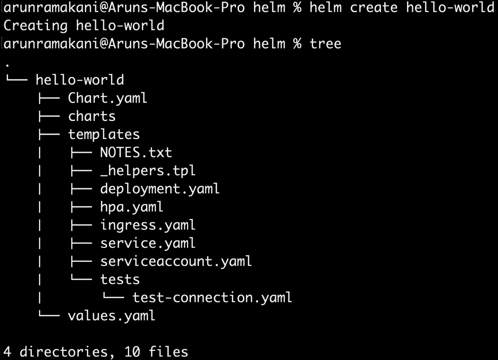
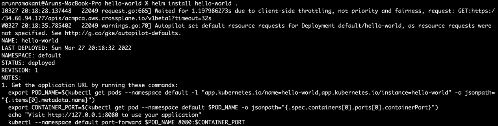
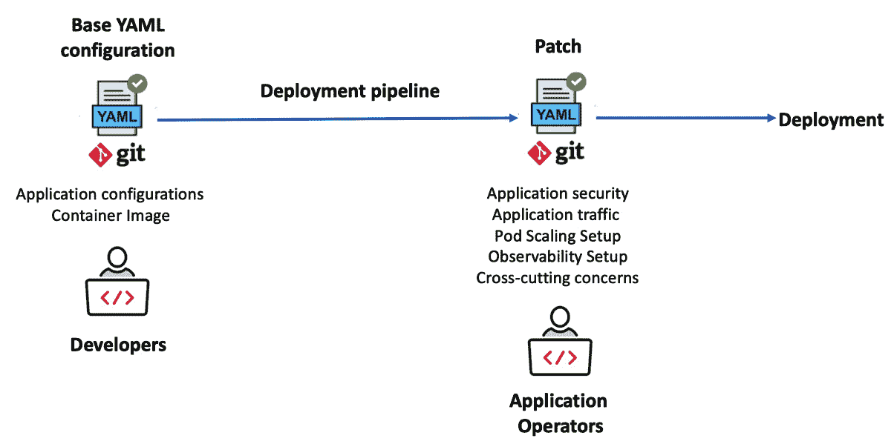
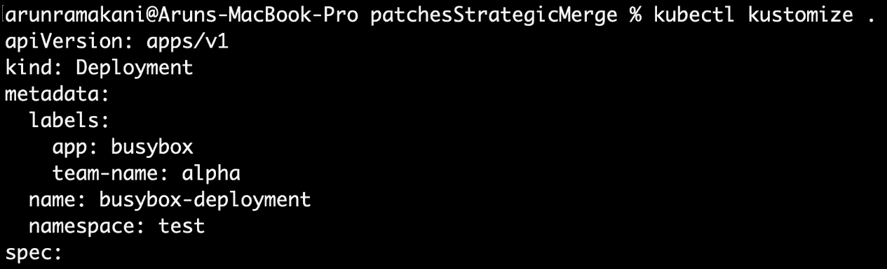
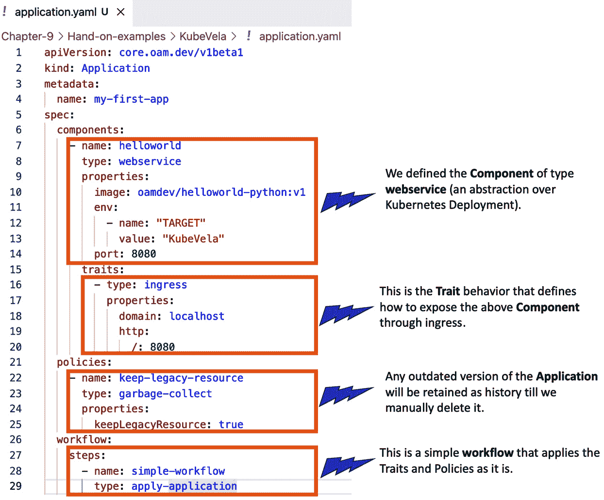
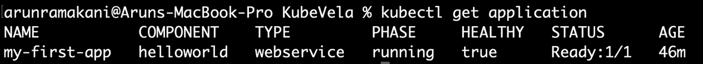

# *第九章*：使用 Helm、Kustomize 和 KubeVela

本章主要集中在定制应用程序的配置管理上。定制应用程序的 Kubernetes 配置包括部署、服务、Ingress、机密、ConfigMap、治理所需的标签、跨切面关注点、应用程序安全上下文和其他依赖项。管理这些配置需要仔细选择适合用例的模式和工具。此外，我们还必须考虑复用、团队协作和可扩展性。在上一章中，我们简单提到了一些工具，如 Helm、Kustomize 和 KubeVela，用于应用程序配置管理。本章将提供一个机会，深入探索这些工具。

本章涵盖的主题如下：

+   应用程序配置管理能力

+   使用 Helm 进行应用程序部署

+   实践图表开发

+   使用 Kustomize 定制配置

+   使用 KubeVela 部署应用程序工作负载

# 应用程序配置管理能力

在 Kubernetes 环境中成功运营应用程序，从配置管理的角度来看，要求具备一些能力。以下是配置管理中的关键能力列表：

+   **打包**：如前所述，将应用程序部署到 Kubernetes 中涉及配置多个资源。它要求具备一种能力，能够将所有这些资源打包成一个单一的包。

+   **生命周期管理**：应用程序及其所有依赖项必须作为一个单一的部署执行到集群中，支持所需的发布管理构件，如滚动更新、回滚、版本管理和蓝绿部署。

+   **应用发现**：这是日常操作所需的能力。它将使任何发现工具能够在仪表板上列出已部署的应用程序、其版本和依赖关系。

+   **应用描述定制**：并非所有环境的配置都相同。例如，暂存环境中的复制数可能为 1，而在生产环境中，我们可能会设置水平 Pod 扩展。此能力在我们需要注入依赖项以实现关注点分离时也非常必要。

让我们在考虑这些能力的基础上，探索用于应用程序配置管理的工具。接下来的部分将深入探讨 Helm，这是我们要探索的第一个工具。

# 使用 Helm 进行应用程序部署

Helm 是 Kubernetes 生态系统中流行的配置管理工具之一。它早在 2015 年就已问世，并且在不断演进，解决了所有瓶颈。作为**云原生计算基金会**（**CNCF**）毕业项目，表明其成熟性、生产准备性和价值。以下是 Helm 的三个关键概念：

+   **Charts**：Charts 是 Helm 中应用程序的基本单元。Chart 不过是将应用程序及其所有依赖项打包的包。

+   **仓库**：一个捆绑的图表需要一种一致的存储方式，以便可靠地分发，仓库支持这一需求。虽然开源应用程序可以使用公共仓库，但私有仓库可以用于专有应用程序。从 Helm v3.8.0 开始，任何符合**开放容器倡议**（**OCI**）标准的仓库都将支持 Helm。这意味着大多数容器注册表也支持 Helm 包。

+   **发布**：这是图表在集群中运行的一个实例。当我们第一次安装图表时，它会创建一个新的发布版本。任何更新都会导致发布版本的递增。该结构使得发布管理具备如滚动更新、回滚和蓝绿部署等功能。

使用 Helm 需要客户端的 `brew` 来安装 CLI，而 `choco` 安装程序可用于 Windows。以下代码片段展示了如何在这两个操作系统上安装 CLI：

```
# Helm install macOS
```

```
brew install Helm
```

```
# Helm install Windows
```

```
choco install kubernetes-helm
```

更多安装选项，请访问 [`helm.sh/docs/intro/install/`](https://helm.sh/docs/intro/install/)。我们将分两部分探索 Helm——第一部分将涵盖使用现有图表，第二部分将讲解新图表的开发。

## 使用现有图表

使用现有图表可以分为仓库管理、发布管理和集群发现。以下是一些仓库管理命令：

```
# Add a repo (Add bitnami repo to your local repo list)
```

```
helm repo add bitnami https://charts.bitnami.com/bitnami
```

```
# For private repository, use additional authentication flags
```

```
# To view the list of possible authentication flags
```

```
helm repo add --help
```

```
# Update the charts in all the added repo's
```

```
helm repo update
```

```
# Update the charts in a specific repo.
```

```
helm repo update bitnami
```

```
# Search for charts with the given name within the added repo
```

```
helm search repo wordpress
```

```
# Search charts in ArtifactHub, a famous open-source repo  
```

```
helm search hub wordpress
```

```
#List all the repositories added
```

```
helm repo list
```

前述的仓库管理命令足以满足我们日常的仓库操作。接下来，我们将看一些发布管理的 Helm 命令，如下所示：

```
# Install a chart
```

```
# Format
```

```
helm install <release-name> <chart-name>
```

```
# Example
```

```
helm install redis bitnami/redis
```

```
# Each chart will support a list of variables to be set
```

```
# Variables can be hierarchical. For example, the 'enabled' flag is under the 'auth' hierarchy in the bitnami/redis chart.
```

```
helm install redis bitnami/redis --set auth.enabled=false
```

```
# Install with a value set in the values file
```

```
helm install redis bitnami/redis -f values.yaml
```

```
# If the same variable is present in both the command line set and value file, the command line set takes precedence. 
```

```
helm install redis bitnami/redis -f values.yaml --set auth.enabled=false
```

```
# Update a release
```

```
# Format
```

```
helm upgrade <release-name> <chart-name>
```

```
# Example
```

```
helm upgrade redis bitnami/redis -f values.yaml --set auth.enabled=true
```

```
# Roll back a release 
```

```
# Format
```

```
helm rollback <release-name> <release>
```

```
# Example, roll back redis to the first release version 
```

```
helm rollback redis 1
```

```
# Uninstall format
```

```
helm uninstall <release-name>
```

```
# Uninstall redis release 
```

```
helm uninstall redis
```

前述命令是一些常用的发布管理命令。以下代码片段将涵盖几个集群发现命令：

```
# List all the Helm releases in the target cluster
```

```
helm list
```

```
# Find the status of a release named redis
```

```
helm status redis
```

现在是时候通过一个逐步的动手示例来探索新的图表开发了。

# 动手图表开发

Helm 图表只不过是一组配置模板，模板中包含变量占位符。当模板被渲染并用于安装时，这些占位符可以被具体的值替换。Helm 提供了一个强大的**领域特定语言**（**DSL**），它提供了多种结构用于变量替换。在接下来的部分中，我们将学习一些常用的结构来掌握图表开发。

## 图表生成

一个 Helm 图表包包含一组组织好的文件和文件夹。我们要么需要理解其结构并从头开发，要么可以使用生成器。在本示例中，我们将使用生成器创建一个名为 `hello-world` 的图表（`helm create <chart-name>`），如以下屏幕截图所示：



图 9.1 – 创建图表

让我们来看看每个文件的使用，如下所示：

+   `Chart.yaml`：这是一个包含图表描述的文件。它包含诸如支持的 Helm 版本、图表版本、应用程序版本、应用程序名称、描述、其他依赖图表、维护者等信息。它还包含一个名为 `type` 的属性，表示 `application` 或 `library`。`application` 表示我们正在打包一个 Kubernetes 应用程序，而 `library` 表示该图表包含可重用的工具函数。

+   `charts` 文件夹：这是一个可以容纳依赖子图表列表的文件夹。我们可以出于多种原因使用子图表。将一个庞大的应用程序划分为多个小模块，并为每个模块创建一个子图表，是一种使用方法。另一种方式是将其用作应用程序依赖项（如数据库）的打包机制。我们也可以将其用作可重用函数的容器，作为共享库使用。需要注意的一点是，子图表可以独立部署，这意味着它们不能显式引用父图表，但父图表可以在需要时覆盖子图表模板的值。

+   `values.yaml`：这是一个文件，您可以通过 `helm upgrade redis-install-1 bitnami/redis -f values.yaml` 来使用它。此外，我们还可以使用 CLI 中的 `set` 标志来覆盖特定的值。

+   `template` 文件夹：`NOTES.txt`、`_helpers.tpl` 和 Kubernetes 资源 YAML 模板是 `template` 文件夹的一部分。`NOTES.txt` 文件是一个模板文件，当我们运行 `helm install` 或 `helm upgrade` 时，它会被渲染并打印在控制台上。`_helpers.tpl` 文件将包含可在整个图表中使用的可重用函数。其余文件是与应用程序相关的标准 Kubernetes 资源模板。使用 Helm `create` 命令生成基础图表时，会将部署应用程序所需的 Kubernetes 资源列表添加到 `template` 文件夹中。我们可以删除不必要的资源。

+   `tests` 文件夹：这里可以存放单元测试，用于测试我们在资源模板中编写的逻辑。

Helm 使用来自 Go 语言的 `template` 包，并提供许多强大的模板构造来渲染复杂场景。接下来的章节将使用 `hello-world` 示例来解释每个概念。

### 变量访问

在模板渲染时，我们可以通过简单地指定变量层级来替换占位符变量，语法如下：

```
# Variable reference syntax - {{ variable-hierarchy }}
```

```
# Examples  
```

```
# Refer deployment.yaml line no 9
```

```
{{ .Values.replicaCount }}
```

```
# Refer _helpers.tpl line no 50
```

```
{{ .Release.Name }}
```

在前面的示例中，请注意 `.` 作为分隔符，表示变量层级。我们从 `.` 开始，表示根节点，然后引用根节点中的一个对象。请注意，我们可以有多个层级的变量，例如 `{{ .Values.image.repository }}`。以下是一些可以使用的重要内建根对象：

+   `Release`：此对象包含与发布相关的信息，如发布名称、发布命名空间、修订号等。

+   `Values`：由值文件或命令行设置标志组成的对象。

+   `Chart`：在 `chart.yaml` 文件中定义的值将可在此对象下使用。

还有更多可用对象，例如 `Files`、`Capabilities`、`Template` 等。完整列表请参考 [`helm.sh/docs/chart_template_guide/builtin_objects/`](https://helm.sh/docs/chart_template_guide/builtin_objects/)。

提示

要从模板中删除一个对象或特定属性，请使用带有 `null` 值的 `--set` 命令行。例如，`--set livenessProbe.httpGet=null`。

### 函数和管道

我们可能需要在进行一些转换后替换变量，内置函数和管道可以帮助我们完成这些操作。例如，参考以下代码片段：

```
# Refer _helpers.tpl line no 40
```

```
app.kubernetes.io/version: {{ .Chart.AppVersion | quote }}
```

在上面的例子中，我们引用了应用程序版本，并将一个字符串包含在引号内。这里有两点需要注意：引号是我们可以使用的内置函数，`|` 符号将帮助我们将一个指令的输出传递到另一个指令。以下是一些常用函数的列表：

+   `indent`：用于格式化配置 YAML。它接受一个数值输入，并根据指定的索引缩进行。

+   `nindent`：该函数的作用类似于 `indent` 函数，唯一的区别是它会在行首添加一个换行符。

+   `trunc`：截断字符串至指定的索引数。

+   `trimSuffix`：该方法以字符串后缀作为输入，如果操作字符串中存在该后缀，则将其截断。

+   `replace`：`replace` 方法可以在操作字符串中将一个子字符串替换为另一个子字符串。

+   `semverCompare`：此函数可用于比较两个语义版本。

这些是在 `deployment.yaml` 和 `_helpers.tpl` 中使用的一些函数。请参考 [`helm.sh/docs/chart_template_guide/function_list/`](https://helm.sh/docs/chart_template_guide/function_list/) 查看内置函数的详细列表。

信息

请注意，许多模板占位符中都有 `-` 符号——例如，`deployment.yaml` 第六行有 `{{-`。这指示模板引擎去除左侧的空白。同样，`-}}` 可以去除右侧的空白。

### 流程控制

流程控制使任何编程语言都变得强大，并使我们能够编码复杂的逻辑。Helm 的模板语言提供了三种流程控制。第一个可用的流程控制是标准的 `if`/`else` 语句。它有助于在特定条件下包含一个块。以下是来自 `ingress.yaml` 文件的代码片段，它检查 Kubernetes 版本以决定使用的 ingress **应用程序编程接口** (**API**) 版本：

```
# Refer ingress.yaml line no 9
```

```
{{- if semverCompare ">=1.19-0" .Capabilities.KubeVersion.GitVersion -}}
```

```
apiVersion: networking.k8s.io/v1
```

```
{{- else if semverCompare ">=1.14-0" .Capabilities.KubeVersion.GitVersion -}}
```

```
apiVersion: networking.k8s.io/v1beta1
```

```
{{- else -}}
```

```
apiVersion: extensions/v1beta1
```

```
{{- end }}
```

注意，`Capabilities` 是一个内置对象，提供目标 Kubernetes 集群的功能。第二个流程控制，`with`，允许我们创建一个具有特定变量作用域的块。参考以下来自 `serviceaccount.yaml` 的代码片段：

```
# Refer serviceaccount.yaml line no 8
```

```
# We create a scope block with variable Values.serviceAccount.annotations
```

```
{{- with .Values.serviceAccount.annotations }}
```

```
annotations:
```

```
  {{- toYaml . | nindent 4 }}
```

```
{{- end }}
```

还记得我们之前讨论的变量引用吗？我们提到过，初始的 `.` 代表所有对象的根。在 `with` 块内，定义会发生变化。在该块内的初始 `.` 将指代定义的作用域变量。第三个流程控制是用于循环的 `range`。请参阅以下来自 `NOTES.txt` 的代码片段：

```
# Refer NOTES.txt line no 2
```

```
# Loops over the hosts with an inner loop on path
```

```
{{- range $host := .Values.ingress.hosts }}
```

```
  {{- range .paths }}
```

```
  http{{ if $.Values.ingress.tls }}s{{ end }}://{{ $host.host }}{{ .path }}
```

```
  {{- end }}
```

```
{{- end }}
```

在前面的示例中，我们声明了一个新变量 `host`，并在循环中引用它。类似地，我们也可以在其他地方使用变量声明。

提示

我们可以在 `helm install` 或 `helm upgrade` 命令中使用 `dry-run` 和 `disable-openapi-validation` 标志来调试或验证 YAML 输出。

### 命名模板

命名模板经常被使用，它们充当静态自定义定义的函数。我们通过定义一个有名称的模板，然后将其导入到需要的地方。通常，这些命名模板在帮助文件中进行描述，并在整个图表中重复使用。请参阅以下代码片段中的两段代码：

```
# Template named hello-world.selectorLabels is defined in the _helpers.tps line no 45
```

```
# hello-world is a release name prefix added to avoid name conflicts when we have sub-charts and dependent charts.
```

```
{{- define "hello-world.selectorLabels" -}}
```

```
app.kubernetes.io/name: {{ include "hello-world.name" . }}
```

```
app.kubernetes.io/instance: {{ .Release.Name }}
```

```
{{- end }}
```

```
# deployment.yaml line number 12
```

```
# Template included with the name
```

```
matchLabels:
```

```
  {{- include "hello-world.selectorLabels" . | nindent 6 }}
```

请注意，模板输出可以与其他内置函数一起使用。我们已经涵盖了创建新 Helm 图表所需的大部分技能。更改 `value.yaml` 文件中的镜像名称为 `hello-world` 后，我们可以部署该图表。请参阅以下截图以了解图表安装过程：



图 9.2 – 安装图表

在接下来的部分中，我们可以使用 Kustomize 来定制配置。

# 使用 Kustomize 自定义配置

无论是由 Helm 还是其他配置管理工具管理的配置，Kustomize 都是自定义配置的最佳工具之一。让我们来看一下 Kustomize 的一些用例，如下所示：

+   将特定环境的自定义与基础配置分开是一个用例。例如，复制计数可以在暂存环境中进行，而生产环境可以启用自动扩展。

+   管理跨领域的配置，避免将其包含在基础配置中，是另一个用例。例如，应用程序操作员在所有部署中处理特定于治理的标签时，可以将该配置与基础配置分开。这样可以实现**关注点分离**（**SoC**），促进多角色协作而不产生摩擦。将服务网格配置作为跨领域关注点注入，亦是另一个示例。

+   第三个用例是修复漏洞，作为配置管道中的一步。假设 nginx 镜像存在安全漏洞。安全团队可以在管道中添加一个自定义步骤，以确保所有部署都更新受影响的 nginx 版本。

+   经典的用例是避免抽象泄漏，就像我们在前面的章节中多次讨论过的那样。当我们想要在几个相似的工作负载中重用基础配置模板时，可以将 Kustomize 视为新的参数。

以下截图展示了如何在多角色协作环境中使用 Kustomize 补丁：



图 9.3 – 配置自定义

我们来看一个使用 Kustomize 的简单示例。我们应该把基础配置放在一边，而 `kustomization.yaml` 放在另一边。`kustomization.yaml` 定义了如何自定义基础配置。以下是一个 `kustomization.yaml` 文件示例：

```
resources:
```

```
- deployment.yaml
```

```
commonLabels:
```

```
    team-name: alpha
```

```
namespace: test
```

上述配置是参考基础配置并定义如何进行自定义。`deployment.yaml` 文件是 `resources` 部分下的基础配置参考。`commonLabels` 配置将团队名称作为标签添加到部署中，而 `namespace` 配置将覆盖部署资源的命名空间。我们可以运行 `kubectl kustomize .` 命令来执行自定义操作。请参考以下截图：



图 9.4 – 配置自定义（续）

Kustomize 也可以与 Crossplane 配置一起使用。添加标签到组合的示例可以在本章的实践示例仓库中找到。

提示

`helm install` 可以将 Kustomize 作为后处理步骤，方法是指定 `kustomization.yaml` 的路径。语法为 `helm install <release-name> <chart-name> --post-renderer ./path/to/executable`。

使用 Helm 和 Kustomize 的示例可以参见 [`github.com/thomastaylor312/advanced-helm-demos/tree/master/post-render`](https://github.com/thomastaylor312/advanced-helm-demos/tree/master/post-render)。

除了标签和命名空间，Kustomize 还可以实现更多自定义功能。有关所有可能自定义的深入探讨，请参考 [`kubectl.docs.kubernetes.io/references/kustomize/kustomization/`](https://kubectl.docs.kubernetes.io/references/kustomize/kustomization/)。这也是我们关于 Kustomize 讨论的结尾，接下来的部分将讨论 KubeVela 在应用工作负载部署中的使用。

# 使用 KubeVela 部署应用工作负载

如前所述，KubeVela 是一个类似于 Crossplane 的项目，但它主要专注于定制化应用工作负载。它还可以通过附加组件支持现成的组件。在详细讨论之前，让我们看看如何安装 KubeVela。我们将分两步完成 KubeVela 的安装。第一步是安装 KubeVela CLI。如果您使用 macOS 操作系统，可以通过 Homebrew 或脚本安装。在 Windows 系统下，我们可以使用 PowerShell。以下是 CLI 安装说明：

```
# Installing in macOS with Homebrew
```

```
brew update
```

```
brew install kubevela
```

```
# Installing in macOS with script 
```

```
curl -fsSl https://kubevela.io/script/install.sh | bash -s 1.3.0
```

```
# Installing in windows with a script
```

```
powershell -Command "iwr -useb https://kubevela.io/script/install.ps1 | iex"
```

下一步，我们应该将 KubeVela 安装到 Kubernetes 集群中，KubeVela 实际上是一组 **自定义资源定义**（**CRD**）。以下是 KubeVela CRD 的安装说明。我们可以使用 CLI 或 Helm chart 进行安装：

```
# Using the CLI
```

```
vela install
```

```
# Using a Helm chart
```

```
helm repo add kubevela https://charts.kubevela.net/core
```

```
helm repo update
```

```
helm install --create-namespace -n vela-system kubevela kubevela/vela-core --version 1.3.0 --wait
```

此外，我们可以启用附加组件。附加组件增强了 KubeVela 的功能。例如，我们可以使用 `velaux` 附加组件作为应用程序管理仪表板。`terraform-gcp` 是另一个附加组件，有助于构建**谷歌云平台**（**GCP**）资源的依赖关系：

```
# View list of Add-ons available
```

```
vela add-on list
```

```
# Install the application management dashboard add-on
```

```
vela add-on enable velaux
```

我们已经准备好开始使用 KubeVela。KubeVela 配置的核心是应用程序 API，应用程序 API 的结构将在以下部分中描述。

## KubeVela 应用程序定义的结构

应用程序规范包含以下四个关键部分：

+   `部署` 和 `Job`。外部现成的依赖组件可以是 Terraform 模块、CloudFormation 模板，甚至是 Crossplane **组合资源**（**XR**）/声明。

+   **特性**：特性只是声明性的操作行为。应用程序发布行为、自动扩展规则和路由规则是特性的一些示例。特性附加到组件上，我们可以附加多个特性。

+   **策略**：策略是一组需要强制执行的规则。例如，Pod 安全策略和健康检查配置。

+   **工作流**：工作流是一个最终部分，允许我们控制组件交付过程。审批步骤和特定环境的特性是其中的示例。

使用以下命令查看集群支持的完整组件、特性、策略和工作流列表：

```
# List of Components
```

```
kubectl get ComponentDefinition -n vela-system
```

```
# List of Traits
```

```
kubectl get TraitDefinition -n vela-system
```

```
# List of Policies
```

```
kubectl get PolicyDefinition -n vela-system
```

```
# List of Workflows
```

```
kubectl get WorkflowStepDefinition -n vela-system
```

以下截图描述了一个带有实践示例的 KubeVela 应用程序结构：



图 9.5 – 应用程序 API

应用`application` YAML，你会发现我们的`hello-world`应用程序成功运行，如下所示：



图 9.6 – 已部署应用程序

KubeVela 社区基于**开放应用模型**（**OAM**）规范开发了许多组件、特性、策略和工作流，并在使用示例中进行了文档化。该列表涵盖了大多数需求。深入了解请参考[`kubevela.io/docs/end-user/components/references`](https://kubevela.io/docs/end-user/components/references)。如果我们有自定义需求，KubeVela 提供了构建自定义组件、特性、策略和工作流的所有必要工具。这实际上是创建并注册新的 CRD（自定义资源定义）。与 Crossplane 一样，KubeVela 也提供了开发这些 CRD 的框架。至此，本章关于 KubeVela 的讨论就结束了。

# 概要

本章从定制化应用的角度讨论了一些流行的配置管理工具。虽然我们没有涵盖工具的每一个方面，但我们介绍了基本概念、使用模式和一个实际操作示例。这里讨论的每个工具都需要一本书才能深入学习，这超出了本书的范围。我们讨论的概念、模式和工具将引导我们使用 Crossplane 实现整个应用程序的**端到端**（**E2E**）自动化。

下一章将通过实践操作，使用 Crossplane、Helm 以及其他一些工具，带领我们完成一个完整应用程序及其依赖的引导过程。
