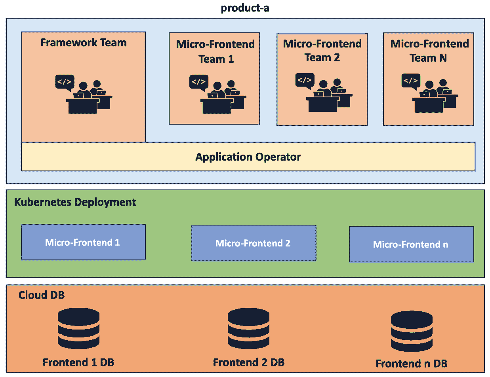
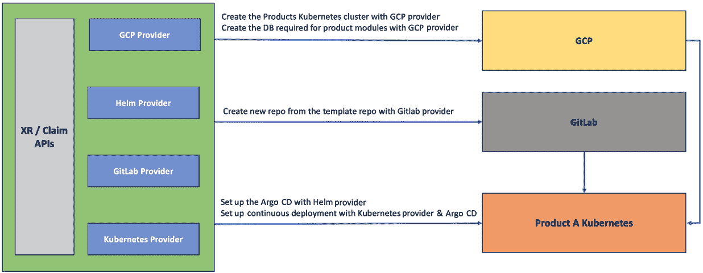
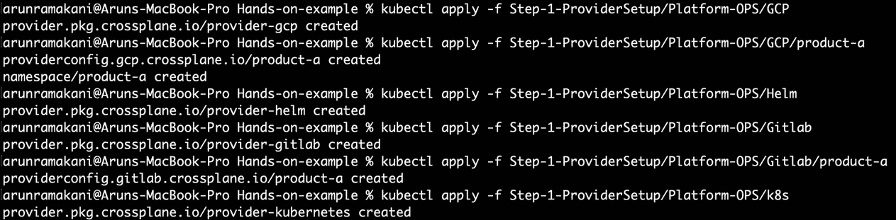
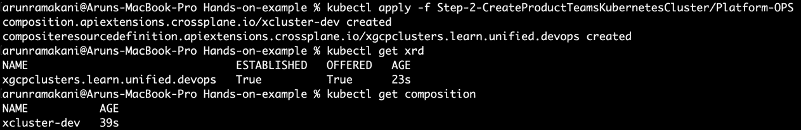
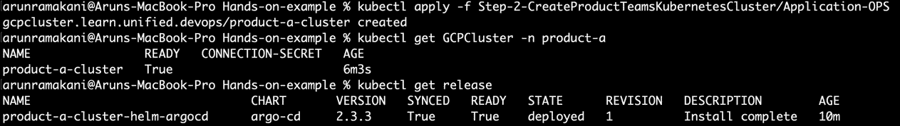
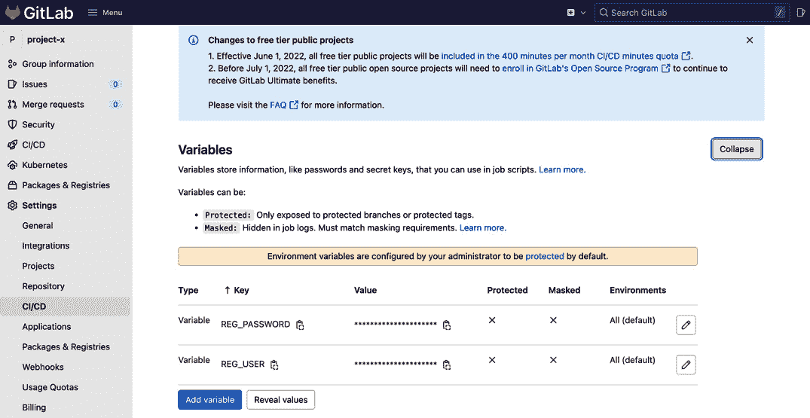
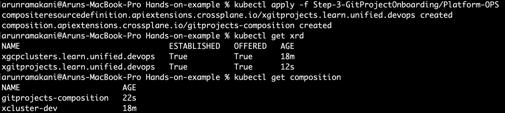
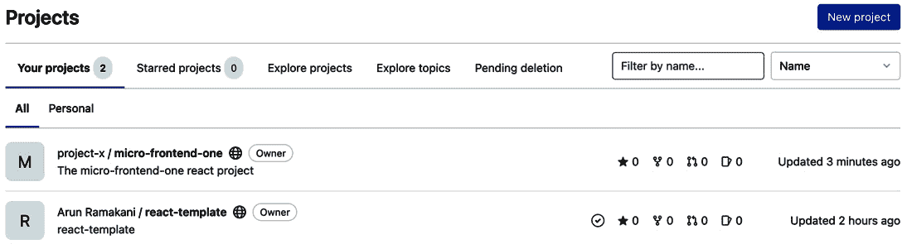
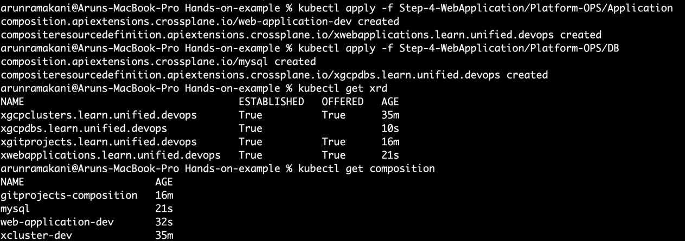
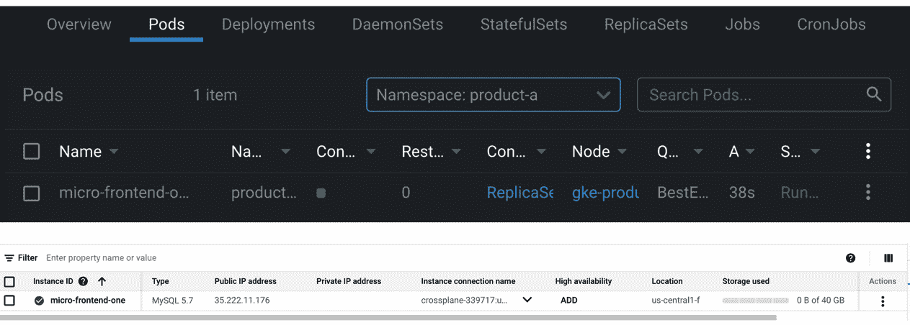

# *第十章*：使用 Crossplane 进行应用程序引导

这一章将是一个完全动手实践的章节，我们将探讨一个应用程序及其所有依赖项的端到端自动化。依赖项将涉及项目仓库的设置、创建**持续集成与持续部署**（**CI/CD**）流水线、相关基础设施资源等。你将看到 Crossplane 如何在从初始仓库设置开始的每一个可能步骤中，展现出它的真正力量。我们将从三个不同角色的视角出发，进行这段动手实践的旅程。三种角色分别是：创建所需 XR/claim API 的**平台开发者**，使用 XR/claim 配置应用程序部署的应用程序运维人员，以及参与应用程序开发的开发者。平台开发者角色是整个过程的关键，因此本章的大部分内容将从他们的视角展开。每当需要时，我们会明确提到其他角色。整个动手实践旅程将涵盖应用程序、服务和基础设施，三方面的 Crossplane 自动化内容。

本章将涉及以下主题：

+   自动化需求

+   解决方案

+   准备控制平面

+   自动化应用程序部署环境

+   仓库和 CI 设置

+   部署依赖关系

+   API 边界分析

我们将从产品团队的需求开始，探索自动化的方式。

# 自动化需求

我们将从一个假想组织*X*的角度，开始讲述我们的高层需求故事。他们计划开发一个名为`product-a`的新电子商务网站。该网站包含多个模块，每个模块在客户旅程中的不同时间点发挥作用，例如购物车、支付和客户支持。每个模块都需要独立发布和扩展的能力，同时共享一个标准的网站主题和统一的用户体验。产品架构小组推荐了微前端架构，并为每个模块在 Kubernetes 中进行独立部署。他们还建议由一个独立的团队开发网站框架、共享 UI 组件以及跨领域的关切点，形式为库。独立的模块团队可以使用这些依赖库来构建他们的功能。产品团队最近听说了 Crossplane 及其能够实现端到端自动化应用程序的能力。他们希望借着开发一个全新产品的机会，尝试使用 Crossplane 来设置一个高效、可靠的产品开发实践。他们已联系平台团队，请求帮助开发**概念验证**（**POC**）。POC 项目将是我们本章动手实践旅程的范围。下图表示了产品开发团队希望实现的目标：



图 10.1 – 产品团队需求

信息

请注意，本章讨论的要求和解决方案并不全面。我们的尝试是寻找一种端到端自动化的方式，涵盖整个应用生命周期及其依赖项。

以下部分从平台工程师使用 Crossplane 的角度探讨一种可能的解决方案选项。

# 解决方案

我们将分三步进行解决方案：

1.  首先，我们将完全自动化 `product-a` 部署环境的配置（Kubernetes）和跨切关注设置，以支持所有微前端的部署。

1.  接下来是应用程序的引导过程，包括创建新仓库和为特定微前端设置 CI 流水线等步骤。

1.  最后的步骤是设置 CD 流水线并为微前端配置相关的基础设施（数据库）。我们将使用一组提供者，例如 Helm、GitLab、GCP 和 Kubernetes 来完成此操作。

    信息

    我们将创建一个模板 GitLab 项目，包含相关依赖库，并使用从基础模板库克隆的仓库启动微前端开发。

以下图示表示完整的解决方案：



图 10.2 – 高级解决方案视图

以下阶段将更加详细地描述前面图示中的高级解决方案：

+   **阶段 1**：第一阶段将准备好 Crossplane 控制平面，配置所需的提供者（GCP、Helm、Kubernetes 和 GitLab）。

+   `product-a` 集群。Helm 提供者配置有助于在 `product-a` 集群中设置 Argo CD。Kubernetes 提供者配置将有助于将微前端应用部署到 `product-a` 集群中。

+   **阶段 3**：第三阶段适用于产品中的每个微前端应用程序。此步骤将从模板仓库创建微前端的新仓库。在创建新仓库时，我们还将克隆 CI 流水线。

+   **阶段 4**：最后阶段将使用 Kubernetes 提供者设置已创建仓库的 CD。第二阶段创建的 Kubernetes 提供者配置将在此处使用。此阶段还将创建子模块/微前端所需的云数据库实例。

本章的其余部分将探讨如何配置 Crossplane 并实施所讨论的解决方案。以下部分将深入分析实现用例所需的控制平面设置。

信息

完整示例可以在 [`github.com/PacktPublishing/End-to-End-Automation-with-Kubernetes-and-Crossplane/tree/main/Chapter10/Hands-on-example`](https://github.com/PacktPublishing/End-to-End-Automation-with-Kubernetes-and-Crossplane/tree/main/Chapter10/Hands-on-example) 查看。

# 准备控制平面

这是将所需组件安装到 Crossplane 集群中的阶段。我们将建立必要的提供者及其配置。第一步是安装 GCP 提供者。

## GCP 提供者

这是我们在*第三章*《*通过 Crossplane 自动化基础设施*》中采取的相同步骤，但有所偏差。我们将在创建和使用 GCP 提供者配置的方式上有所不同。为每个产品团队创建独立的提供者配置有助于增强安全性、审计、政策合规性、治理等方面，特别是在使用 XR/claim API 时。每个产品团队和平台团队都应该创建一个不同的提供者配置，引用一个单独的 GCP 服务账户 Secret。这些提供者配置将以产品名（`product-a`）命名，并且会创建一个同名的新命名空间。组合将以动态方式参考基于声明命名空间的提供者配置。这是我们在*第七章*《*扩展和扩展 Crossplane*》中讨论的多租户模式之一。要完成 GCP 设置，执行以下操作：

1.  执行 `GCP-Provider.yaml` 来安装提供者，等待提供者 Pods 启动并运行。

1.  同时，确保集群中有 `product-a` GCP 服务账户的 Kubernetes Secret。该 Secret 将在提供者配置中引用。提醒自己如何创建该 Secret，请参阅*第三章*中的《*配置提供者*》部分。

1.  一旦你拥有 Secret，执行 `Provider-Config.yaml` 来创建产品特定的提供者配置。注意，提供者配置的名称为 `product-a`。

1.  最后，应用 `namespace.yaml` 来创建 `product-a` 命名空间。这是一个额外步骤，用于保存 `Claim` 对象。

上述步骤将确保 GCP 提供者已经完全设置。接下来的部分将介绍 GitLab 提供者。

## GitLab 提供者

我们将使用 GitLab 提供者来管理微前端仓库和 CI 流水线。GitLab 提供的免费账户足以继续我们的实验。提供者设置分为三步：

1.  **GitLab 凭证**：我们需要将 GitLab 访问令牌创建为 Kubernetes Secret，并在 GitLab 提供者配置中引用它。你可以在 GitLab UI 用户设置中生成 GitLab 访问令牌。使用以下命令来创建 Secret：

    ```
    # Create Kubernetes secret with the access token
    kubectl create secret generic gitlab-credentials -n crossplane-system --from-literal=gitlab-credentials=<YOUR_ACCESS_TOKEN>
    ```

1.  使用 `provider-gitlab.yaml` 安装 GitLab 提供者，并等待 Pods 启动并运行。

1.  使用 `provider-config.yaml` 创建提供者配置。再次强调，它将是特定于产品的，名称为 `product-a`。

我们已经完成了 GitLab 提供者的设置。接下来将介绍 Helm 和 Kubernetes 提供者的设置。

## Helm 和 Kubernetes 提供者设置

Helm 和 Kubernetes 提供程序有助于配置远程或相同的 Kubernetes 集群。对于我们的案例，它是为 `product-a` 创建的远程 Kubernetes 集群。这两个提供程序都需要凭证来访问远程集群。当我们使用 XR API 配置集群时，产品特定的提供程序配置将自动为远程集群创建。我们将在下一节中查看更多细节。现在我们只需要安装提供程序。执行 `Helm-Provider.yaml` 和 `k8s-Provider.yaml` 来安装提供程序。请参阅以下截图，展示了所有提供程序及其相应的配置设置：



图 10.3 – 提供程序设置

要自己运行设置，请使用以下命令：

```
# GCP Provider
```

```
kubectl apply -f Step-1-ProviderSetup/Platform-OPS/GCP
```

```
kubectl apply -f Step-1-ProviderSetup/Platform-OPS/GCP/product-a
```

```
# Helm Provider
```

```
kubectl apply -f Step-1-ProviderSetup/Platform-OPS/Helm
```

```
# GitLab Provider
```

```
kubectl apply -f Step-1-ProviderSetup/Platform-OPS/Gitlab
```

```
kubectl apply -f Step-1-ProviderSetup/Platform-OPS/Gitlab/product-a
```

```
# Kubernetes Provider
```

```
kubectl apply -f Step-1-ProviderSetup/Platform-OPS/k8s
```

这一步骤完成了 Crossplane 控制平面的配置。所有这些活动都将由平台团队完成。在接下来的部分，我们将深入探讨如何将远程 Kubernetes 集群设置为 `product-a` 的部署环境。

# 自动化应用程序部署环境

完整的 Kubernetes 集群创建以及跨领域问题的配置将通过此步骤实现自动化。我们将开发一个 XR/claim API，它执行以下操作：

1.  配置一个远程 GKE 集群

1.  设置 Helm 和 Kubernetes 提供程序配置以配置 GKE 集群

1.  使用 Helm 提供程序将 Argo CD 安装到 `product-a` GKE 集群

让我们看看 XRD 和组合，详细了解 API（请参阅书籍 GitHub 仓库中的 XRD 和组合）。我们将捕获两个必需的参数（节点数量和机器大小）。`size` 参数的枚举值为 `BIG` 或 `SMALL`。在组合内部，我们编排了五个资源。以下是资源列表及其用途：

+   **集群和节点池**：集群和节点池是负责 GKE 集群配置的两个相关资源。它们与我们在*第五章*中配置 GKE 的方式非常相似，*扩展提供程序*。节点数量和机器类型将被打补丁到节点池中。节点池再次在集群内被引用。两个资源都将动态引用 GCP 提供程序配置，使用声明命名空间。同时，连接到 GKE 集群所需的密钥存储在声明命名空间中。请参阅以下代码片段，了解集群资源中的打补丁操作：

    ```
    patches:
    - fromFieldPath: spec.claimRef.namespace
      toFieldPath: spec.providerConfigRef.name
    - fromFieldPath: spec.claimRef.name
      toFieldPath: metadata.name
    - fromFieldPath: spec.claimRef.namespace
      toFieldPath: spec.writeConnectionSecretToRef.namespace
    - fromFieldPath: spec.claimRef.name
      toFieldPath: spec.writeConnectionSecretToRef.name
      transforms:
         - type: string
            string:
               fmt: "%s-secret"
    ```

+   **Helm 和 Kubernetes ProviderConfig**：集群准备好后，是时候创建 Helm 和 Kubernetes 提供程序配置了。提供程序配置将引用新创建的集群密钥。另一个关键点是将就绪检查定义为 none，因为 ProviderConfig 不是外部资源。如果未执行此操作，XR/claim 将无法变为就绪状态。请参阅以下代码片段：

    ```
    # Patches and reediness check from the Helm Provider config
    patches:
    - fromFieldPath: spec.claimRef.namespace
      toFieldPath: spec.credentials.secretRef.namespace
    - fromFieldPath: spec.claimRef.name
      toFieldPath: spec.credentials.secretRef.name
      transforms:
      - type: string
        string:
          fmt: "%s-secret"
    - fromFieldPath: spec.claimRef.name
      toFieldPath: metadata.name
      transforms:
      - type: string
        string:
          fmt: "%s-helm-provider-config"
    readinessChecks:
    - type: None 
    ```

+   **安装 Argo CD**：我们将使用 Helm 提供者将 Argo CD 安装到集群中。同样，提供者配置将通过可预测的命名策略动态引用。Argo CD 旨在为微前端仓库提供持续交付（CD）支持。

    信息

    请注意，这里讨论的集群创建 XR/声明 API 示例并非生产就绪。你应该使用 Helm 或 Kubernetes 提供者安装其他横向关注点。此外，我们错过了许多细粒度的集群配置。欲了解更详细的集群配置，请参考 [`github.com/upbound/platform-ref-gcp`](https://github.com/upbound/platform-ref-gcp)。

要将我们的集群 API 集成并验证到控制平面中，请执行以下命令：

```
# Install GCP Cluster XR/Claim API 
```

```
kubectl apply -f Step-2-CreateProductTeamsKubernetesCluster/Platform-OPS
```

```
# Validate the health of installed API
```

```
kubectl get xrd
```

```
kubectl get composition
```

管理控制平面的平台团队将执行上述操作。请参考以下截图，查看 API 的建立情况：



图 10.4 – 集群 API

下一步，接近产品团队的应用操作员可以使用声明配置创建集群。应用操作员将使用以下命令创建名为 `product-a` 的 GKE 集群：

```
# Create the GCP Cluster using a Claim object 
```

```
kubectl apply -f Step-2-CreateProductTeamsKubernetesCluster/Application-OPS
```

```
# Validate the health of the GKE cluster and the Argo CD
```

```
kubectl get GCPCluster -n product-a
```

```
kubectl get release
```

请参考以下截图，其中展示了 GKE 集群和 Helm 发布的建立情况：



图 10.5 – 集群声明

集群创建一切正常。我们将在接下来的章节中讨论将微前端仓库接入的下一阶段。

# 仓库和 CI 设置

在这个阶段，我们开发 XR/声明 API 来克隆模板仓库，创建新的微前端仓库和 CI 管道。我们可以分两步来完成。首先，我们将配置 GitLab，然后开发 XR/声明 API。

## GitLab 配置

在开始 XR/声明 API 开发之前，我们需要在 GitLab 中进行以下一次性配置：

+   **创建模板项目**：我们需要一个模板仓库，从中创建一个新的微前端仓库。你可以访问我创建的模板仓库，链接为[`gitlab.com/unified.devops/react-template`](https://gitlab.com/unified.devops/react-template)。该仓库已设置 GitLab 管道，用于构建并推送 Docker 镜像到 Docker Hub 注册表。你也可以在此处设置私有注册表。我们在克隆模板仓库创建微前端时，会自动获得模板项目结构和 CI 设置。Docker 镜像名称将根据微前端仓库的名称来选择。

+   **product-a 的组**：我们将在一个 GitLab 组中管理所有微前端仓库，以保持组织结构，管理用户权限，并为 CI 管道维护环境变量。你可以访问我创建的该组，链接为 [`gitlab.com/unified-devops-project-x`](https://gitlab.com/unified-devops-project-x)。

+   使用你的 Docker Hub 凭证填写 `REG_USER` 和 `REG_PASSWORD`，如以下截图所示：



图 10.6 – CI Docker Hub 变量

提示

请注意，组创建和用户引导到组的过程可以自动化。考虑使用 Crossplane 实现这一点。此操作的示例可在 [`github.com/crossplane-contrib/provider-gitlab/tree/master/examples/groups`](https://github.com/crossplane-contrib/provider-gitlab/tree/master/examples/groups) 中找到。

我们拥有开发项目引导 XR/声明 API 所需的所有组件。接下来的部分将详细介绍引导 API 的内容。

## 引导 XR/声明 API

如果我们查看 XRD（`gitproject-xrd.yaml`），我们需要输入两个参数。模板的名称指的是我们应该克隆的模板仓库，组 ID 将决定在 GitLab 中创建仓库的组。你可以从 GitLab 组详情页或组设置页面获取组 ID。这两个参数使得 API 更具通用性，因此可以在整个组织中使用。新创建的微前端仓库 URL 和用于与仓库交互的访问令牌将作为连接机密存储。我们可以使用这些信息与 Argo CD 一起读取仓库。我们的示例不需要访问令牌，因为该仓库是公开的。这将是一个简单的组合：将模板名称与模板 URL 映射，克隆仓库到指定的组中，并将仓库详情复制回机密。仓库的名称将通过声明对象的名称来引用。要在控制平面中建立并验证引导 API，请执行以下命令：

```
# Install the onboarding API 
```

```
kubectl apply -f Step-3-GitProjectOnboarding/Platform-OPS
```

```
# Validate the health of installed API
```

```
kubectl get xrd
```

```
kubectl get composition
```

请参阅以下截图，其中已建立 API：



图 10.7 – 引导 API

作为引导阶段的最后一步，应用操作员可以使用 `Claim` 配置引导仓库和 CI 管道。应用操作员将使用以下命令创建名为 `micro-frontend-one` 的仓库：

```
# Create claim and validate
```

```
kubectl apply -f Step-3-GitProjectOnboarding/Application-OPS
```

```
kubectl get gitproject -n product-akubectl get xrd
```

请参阅以下截图，其中在 GitLab 中创建了声明：



图 10.8 – 引导仓库

你可以进入新仓库的 CI/CD 部分，运行 CI 管道，查看 Docker 镜像是否已创建并推送到 Docker Hub。开发者现在可以对仓库进行更改，任何新的提交将自动触发 GitLab CI 管道。在接下来的部分中，我们可以研究最终阶段，设置 CD 并提供其他基础设施依赖。

# 部署依赖

最终阶段是自动化微前端的部署依赖。自动化部署依赖意味着需要处理两个方面：

+   **基础设施依赖**：此步骤涉及为微前端配置所需的基础设施依赖。在我们的例子中，我们将创建一个 GCP MySQL 数据库。一个应用程序可能会有更多的依赖，我们将以数据库为例，保持示例的简洁。

+   `template-helm` 文件夹位于我们的模板仓库内 ([`gitlab.com/unified.devops/react-template/-/tree/main/template-helm`](https://gitlab.com/unified.devops/react-template/-/tree/main/template-helm))，它包含一个 Helm chart，用于将应用程序部署到 Kubernetes 中。为了以 GitOps 的方式部署该 Helm chart，我们必须在 `product-a` Kubernetes 集群中添加一个 Argo CD 配置，以同步该 chart。我们将构建一个 `Object` 类型的 Kubernetes 提供程序配置，帮助将任何 Kubernetes 配置应用到目标集群。我们的组合将构建一个 Argo CD 配置，用于从仓库部署 Helm chart。有关如何使用 Argo CD 进行 Helm 部署的更多信息，请参见 [`cloud.redhat.com/blog/continuous-delivery-with-helm-and-argo-cd`](https://cloud.redhat.com/blog/continuous-delivery-with-helm-and-argo-cd)。

我们将构建一个嵌套的 XR 来满足前述要求。XWebApplication 将是父 API，XGCPdb 将是嵌套的内部 XR。父 API 捕获产品 Git 组和数据库大小作为输入。微前端名称将是从声明名称衍生的另一个输入。父级组合将组合 Argo CD 配置和 XGCPdb 资源（内部 XR）。请参阅我们示例仓库中的应用程序和数据库文件夹，了解两个 XR 的 XRD 和组合。以下是几个关键代码片段，有助于理解。在 Argo CD 对象中，以下是用于仓库 URL 的修补代码。我们根据组名和声明名（仓库名）构建 GitLab URL。查看声明以查看实际输入（`Claim-Application.yaml`）。以下是仓库 URL 修补代码：

```
- type: CombineFromComposite
```

```
  toFieldPath: spec.forProvider.manifest.spec.source.repoURL
```

```
  combine:
```

```
    variables:
```

```
    - fromFieldPath: spec.parameters.productGitGroup
```

```
    - fromFieldPath: spec.claimRef.name
```

```
    strategy: string
```

```
    string:
```

```
      fmt: "https://gitlab.com/%s/%s.git"
```

我们使用可预测的命名策略动态修补 Kubernetes 提供程序配置名称。以下是相关的代码片段：

```
- fromFieldPath: spec.claimRef.namespace
```

```
  toFieldPath: spec.providerConfigRef.name
```

```
  transforms:
```

```
    - type: string
```

```
      string:
```

```
        fmt: "%s-cluster-k8s-provider-config"
```

另一个重要的修补是动态绑定 Docker 镜像名称。在我们的 CI 管道中，我们使用仓库名称作为 Docker 镜像名称。由于声明名称和仓库名称相同，我们可以使用声明名称动态构建 Docker 镜像名称。以下是相关的修补代码片段：

```
- fromFieldPath: spec.claimRef.name
```

```
  toFieldPath: spec.forProvider.manifest.spec.source.helm.parameters[0].value
```

```
  transforms:
```

```
    - type: string
```

```
      string:
```

```
        fmt: "arunramakani/%s
```

`source` 和 `destination` 是 Argo CD 配置中的两个关键部分。该配置提供有关 Helm chart 来源以及如何在目标 Kubernetes 集群中部署的相关信息。以下是相关的代码片段：

```
source:
```

```
  # we just saw how this patched 
```

```
  repoURL: # To be patched
```

```
  # The branch in which Argo CD looks for change
```

```
  # When the code is ready for release, move to this branch
```

```
  targetRevision: HEAD
```

```
  # Folder in the repository in which ArgoCD will look for automatic sync
```

```
  path: template-helm
```

```
  helm:
```

```
    # We will patch our clime name here 
```

```
    releaseName: # To be patched
```

```
    parameters:
```

```
    - name: "image.repository"
```

```
      # we just saw how this patched
```

```
      value: # To be patched
```

```
    - name: "image.tag"
```

```
      value: latest
```

```
    - name: "service.port"
```

```
      value: "3000"
```

```
destination:
```

```
  # Indicates that the target Kubernetes cluster is the same local Kubernetes cluster in which ArgoCD is running.  
```

```
  server: https://kubernetes.default.svc
```

```
  # Namespace in which the application is deployed
```

```
  namespace: # to be patched
```

要在控制平面中建立和验证我们的 API，请执行以下命令：

```
kubectl apply -f Step-4-WebApplication/Platform-OPS/Application
```

```
kubectl apply -f Step-4-WebApplication/Platform-OPS/DB
```

```
kubectl get xrd
```

```
kubectl get composition
```

请参考下面的截图，其中展示了 API 的建立和验证过程：



图 10.9 – 应用程序 API 的入驻

提示

请注意，我们没有为 Argo CD 配置任何访问令牌来访问 GitLab，因为它是一个公共仓库。实际生活中，我们会有私有仓库，且需要访问令牌。请参考[`argo-cd.readthedocs.io/en/release-1.8/operator-manual/declarative-setup/#repositories`](https://argo-cd.readthedocs.io/en/release-1.8/operator-manual/declarative-setup/#repositories)查看如何设置访问令牌。再次强调，这可以作为仓库入驻的一部分进行自动化。

作为应用程序部署自动化阶段的最后一步，应用程序运维人员可以将数据库作为基础设施依赖项进行部署，并使用以下 claim 配置来配置 CD 设置：

```
apiVersion: learn.unified.devops/v1alpha1
```

```
kind: WebApplication
```

```
metadata:
```

```
  # Use the same name as the repository 
```

```
  name: micro-frontend-one
```

```
  namespace: product-a
```

```
spec:
```

```
  compositionRef:
```

```
    name: web-application-dev
```

```
  parameters:
```

```
    # Group name in gitlab for the product-a
```

```
    productGitGroup: unified-devops-project-x
```

```
    databaseSize: SMALL
```

应用程序运维人员将使用以下命令：

```
# Apply the claim
```

```
kubectl apply -f Step-4-WebApplication/Application-OPS
```

```
# Verify the application status, including the database and  ArgoCD config
```

```
kubectl get webapplications -n product-a
```

```
kubectl get XGCPdb
```

```
kubectl get object
```

请参考以下截图，展示了应用程序基础设施依赖关系和 CD 配置的部署：



图 10.10 – API 的入驻

提示

我们使用了 Argo CD 和 Helm chart 部署来处理应用程序自动化。我们可以根据团队的需求，将 Helm 替换为 KubeVela，将 Helm/KubeVela 与 Kustomize 结合使用，甚至使用普通的 Kubernetes 对象。甚至 Argo CD 也可以被其他 GitOps 工具替代，如 Flex。

这带我们走到了从头到尾自动化应用程序的实践之旅的终点。我们的微前端示例及其依赖的数据库现在已经启动并运行。在本章的下一部分，我们将讨论我们 XR/claim API 边界背后的推理。

# API 边界分析

我们将端到端自动化分为四个阶段。我们可以忽略第一阶段，因为它是关于准备 Crossplane 控制平面的。理解为什么我们将其余阶段分为三个，并使用四个 XR/claim API 是非常重要的。以下是我们 API 边界背后的思路：

+   `product-a`。所有现代工作负载通常都部署在 Kubernetes 上，组织未来将有许多类似的集群设置活动。构建一个单独的 API 以实现可重用性和集中管理策略是有意义的。保持 API 独立的另一个重要原因是集群设置是一次性活动，并且作为进一步应用程序工作负载部署的跨切面操作。

+   **入驻 API**：GitLab 项目入驻的 XR/claim 作为一个独立的 API 进行开发。我们不需要为每个环境（生产、预发布和开发）入驻仓库和 CI 流水线。这就是为什么我们决定将 XGitProjectAPI/GitProject API 分开的原因。

+   **应用程序 API**：这是我们将应用程序基础设施依赖项和 CI 设置进行入职的步骤，每个环境只需做一次。因此，我们将 XWebApplication/WebApplication 作为一个独立的 API 来开发。需要注意的是，数据库配置有一个内部嵌套 API。这个设计的想法是将其独立出来，因为数据库配置在组织范围内有政策要求。注意，数据库 API 没有声明，因为它仅作为嵌套 API 使用。该政策要求是一个假设，可能并不适用于你的情况。

    提示

    在应用程序 API 中设置 CI 时，需要提供通过入职 API 创建的仓库 URL 和访问令牌。入职 API 是一次性操作，而应用程序 API 在每个环境中都会使用。如果我们为每个环境（生产、预发布和开发）配置不同的 Crossplane，那么以自动化方式共享凭证可能会变得具有挑战性。可以考虑使用外部密钥保管库来同步入职 API 中的仓库详情。其他 Crossplane 环境可以通过诸如 External Secrets ([`external-secrets.io/v0.5.3/`](https://external-secrets.io/v0.5.3/)) 等工具来同步这些密钥。

# 总结

本章讨论了处理应用程序、基础设施和服务端到端自动化的一种方法。利用我们在全书中学到的方式，实际上有多种方法可以实现基于控制平面的端到端自动化。我迫不及待地想看到你们提出的独特方式。本章将带领我们完成对 Crossplane 概念和模式的学习，并结束我们的实操之旅。

在最后一章，我们将探讨一些灵感，如何将平台作为产品来运行。你将学到使我们 Crossplane 平台团队成功的关键工程实践。
