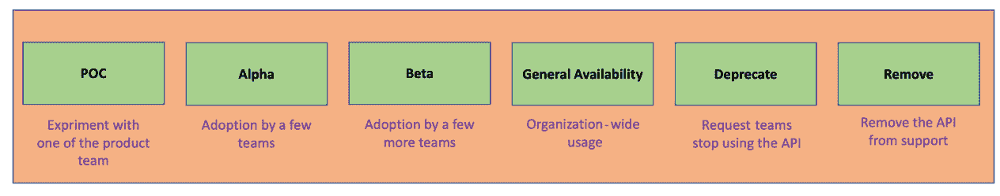
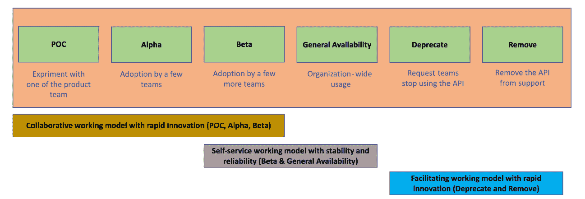
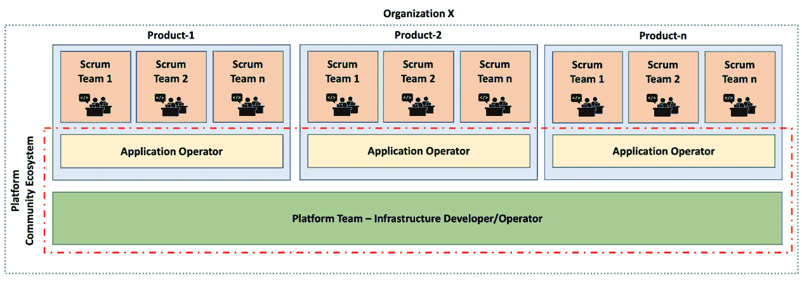

# 第十一章：*第十一章*：推动平台采纳

到现在为止，你可能正在考虑在你的组织中采用 Crossplane。正如我们多次讨论的那样，我们必须建立一个平台团队来支持组织内每个产品团队采用 Crossplane。但许多组织在其技术平台项目上失败，因为这些平台以多种方式影响了消费团队的敏捷性。为产品团队与平台团队之间设立适当的边界和交互模型是平台成功的关键。本章旨在帮助你理解构建和采用成功基础设施平台所需的各个方面。我们还将看看一些常见的陷阱，这些陷阱可能导致平台采用不力以及投资回报低下。

本章涵盖的主题如下：

+   为什么我们需要将基础设施平台视为产品

+   理解客户需求

+   平台产品生命周期和团队互动

+   OAM 角色

在接下来的章节中，我们将开始理解为什么我们需要将基础设施平台视为产品开发的方式。

# 为什么我们需要将基础设施平台视为产品

我们在*第二章*中稍微提到了这个话题。现在是时候回顾一下，看看为什么我们需要一个平台团队来开发 Crossplane API。以下是三个关键原因：

+   **认知负担**：任何组织都倾向于使用大量的云资源和其他外部服务。这些资源和服务由成千上万的配置属性组成，用以根据组织的需求进行配置。记住每个配置属性的使用涉及到巨大的认知负担。假设我们试图在产品团队内构建这些知识，那么团队将更多关注技术复杂性，而非直接与业务相关的产品功能开发。如果你看看 CNCF 的云原生景观，它是如此庞大（[`landscape.cncf.io/`](https://landscape.cncf.io/)）。并不是每个团队都能驾驭这个领域。这需要一个专业团队将这种认知能力构建到组织中。既然每个产品团队都面临相同的情况，将这一努力抽象为由平台团队管理的共享服务是有意义的。

+   **政策管理**：基础设施和其他外部服务的使用政策来源于安全、合规、产品和架构团队。需要一个集中式团队来追踪、整合和编码这些政策，以便在这些资源被提供和使用时执行。如果我们将这些资源的自动化作为各个产品团队的一部分，保持政策的执行和更新将变得非常困难。

+   **投资回报率与重用**：通常，许多工具、架构模式和基础设施设置模式在整个组织中看起来相似。这是因为集中式的 IT 战略、成功设计的交叉传播、组织的认知能力等因素。这些共同点将转化为基础设施参考架构的重用。只要我们拥有认知负载和政策管理的优势，重用的投资回报经济性就是一个额外的优势。

既然我们已经相信需要一个基础设施平台团队，接下来的部分将探讨产品团队对基础设施平台团队的期望。

# 理解客户需求

对于基础设施而言，平台团队意味着外部交付依赖。这是敏捷产品开发团队始终避免的事情。如果你在大型组织中工作过，可能会注意到，产品团队常常对平台团队提供的内容不满意。他们在交付时间表、待办事项耦合以及合同弱化方面存在问题。为减轻这些风险，关键是要建立产品团队与平台团队之间的适当互动模型。以下是平台团队应具备的特质，以匹配现代软件工程时代中产品团队的交付预期：

+   产品开发实践

+   自助服务

+   协同管理待办事项

接下来的部分将探讨平台团队的产品开发工程实践。

## 产品开发实践

采用产品开发实践是使平台团队成功的关键组成部分。以下是一些可供采纳的产品开发实践：

+   **快速入门**：平台的使用必须迅速而简便。Crossplane 作为一个基于 API 的平台，解决了部分问题。API 具有明确的契约，且易于理解。但这还不够。我们必须付出额外的努力，使平台易于采用。我们应该提供快速入门指南、带有示例的代码库、支持系统以帮助采用团队，以及详细的 API 文档。更重要的是，快速入门能力应该是一个关键指标，并持续改进。我们可以通过产品团队与平台团队之间的持续反馈循环来实现这一目标。反馈应来自多个来源，例如客户调查、各种快速启动资源的使用统计数据、平台本身的使用统计数据以及采用时间。平台团队应不断改进这些指标，并获得激励。

+   **实践社区**：构建一个由平台和产品团队成员参与的社区是另一个重要方面。应用运维人员可能是产品团队的天然社区成员。由于他们与产品团队的需求紧密相连，他们能够对我们在平台上构建的 API 进行现实检查。同样，应该有指标和激励措施来确保社区的成功运作。我们可以通过多种方式利用社区，比如共创、作为知识载体、提供双向反馈渠道，以及加速采用。我们将在本章的后续部分详细探讨这些选项。

+   **可组合的 API**：技术平台面临的一个关键挑战是，它们强制采用某种开发方式，限制了创新。平台应该有一套基本的精细化 XRs，在此基础上，我们可以快速组合出产品团队所需的 claim 配方。建议使用两层 API。第一层应该有精细化的 XRs，组合组织集中管理的策略；第二层应该是配方层，组合产品级的策略和需求。我们可以有一套组织内通用的基础配方，并为社区留出空间，创新新的配方。一些组织架构可能需要金发女孩治理（Goldilocks governance），以避免社区中过多新配方的泛滥。

    信息

    金发女孩治理架构在现代软件工程实践中逐渐获得关注，它在治理与灵活性之间采取了平衡的方式。

在接下来的章节中，我们将讨论平台工程中的自助服务方面。

## 自助服务

自助服务是构建平台的关键方面之一。想一想任何云服务提供商是如何运作的。我们有控制台和 API 来创建/操作所需的资源。这是一个完全自助的模型，用户可以根据自己的权限管理资源。在云服务提供商环境中，精细的资源粒度适用于任何组织和角色。我们必须为我们的平台也提供类似的体验。由于 Crossplane 是一个基于 API 的资源组合平台，部分问题已经得到解决。但我们必须深入思考，定义产品团队将要使用的 XR/claim API 的范围和粒度。确定适合你们组织的粒度级别是一个至关重要的问题。这可能取决于组织的规模、团队边界、开发者/平台团队的技术成熟度等等。定义错误的边界将会破坏自助服务的目标。

一开始精准确定边界是很难的。通过衡量自助服务指标，它会在迭代中不断改进。除了 API 边界外，我们还需要关注快速入门指南、技术支持系统和构建社区，正如前面所讨论的，以进一步促进自助服务。整个体验应该类似于一个成功的云服务平台的运作。唯一的区别是我们在更高的抽象层次上操作，以应对复杂性。

## 协同待办事项管理

一个服务于组织内部多个团队的单一集中平台团队并不是一个愉快的工作场所。我们必须管理待办事项，以满足每个人的需求。来自各方面的持续请求将要求增强现有的 XR/声明或创建新的功能。我们可能会陷入许多不希望出现的情况，例如平台团队的持续交付压力、对产品团队交付吞吐量的影响，或是产品团队在本地开发能力时的沮丧。以下是一些缓解这些风险的方法：

+   **待办事项优先级排序**：在优先级排序会议中，根据时间紧急性、错失机会以及短期/长期业务价值等指标为每个待办事项评分。记录每个评分的理由，以便查看。所有拥有待办事项的产品团队应积极参与优先级排序会议。在优先级排序会议中，每个产品团队可能会试图提高自己的评分。我们可以通过评分滑块来解决这个问题，在该滑块上设置一个总分值，且每个待办事项的评分总和不得超过设定值。

+   **期望管理**：产品团队在等待他们的待办事项交付，他们应当像最终客户一样对待。为客户设定期望非常重要，明确他们可以期待的交付时间和内容。使用 Scrum of Scrums 或任何其他大规模敏捷框架来找到提供定期更新的方法。提供进展和交付日期的更新，公开并透明地说明任何交付延迟。

+   **社区和治理**：看看像 Kubernetes 和 Crossplane 这样的开源项目是如何运作的。它们同样面临着许多用户对新特性、增强功能和修复漏洞的期待。这些项目最初由少数专注的开发者启动。当产品从α-β阶段转向正式发布时，许多客户开始采纳它。此时，管理待办事项变得至关重要。这些开源项目通过围绕它们建立一个强大的社区来加速交付速度。社区的开发活动由技术指导小组管理，技术指导小组由核心贡献者组成。我们也可以在内部产品中采纳相同的模型。正如我们已经提到的，靠近产品团队的应用运维人员会自然地被吸引到社区中。面临紧迫需求的产品团队可以分配他们的应用运维人员来共同创建产品。

在接下来的部分，我们将探讨平台 API 开发的各个阶段，以及它们如何影响平台团队与产品团队之间的互动。

# 平台产品生命周期和团队互动

我们可能会从一个小规模的概念验证开始，与其中一个产品团队合作。随后，当我们对概念验证感到满意时，我们将发布α版本，邀请一些团队来使用和测试它。同样，当我们对α版本满意时，我们将邀请更多组织部分采用并上线该 API。如果一切顺利，我们可以将 API 发布到正式版本，供组织中的任何人使用。但事情不会就此结束。有时，我们会有需求将某些 API 弃用，并标记它们在未来移除。下图展示了 API 的生命周期：

图 11.1 – Crossplane API 生命周期

每个 API 可能并不会经历所有提到的阶段。它可能根据情况走自己的路，从左到右移动并跳过某些阶段。

信息

有时，如果我们发现没有业务价值或技术可行性，我们可能会直接从α或β阶段移动到弃用状态。

每个步骤都需要不同的参与模型和开发者能力。以下列表描述了生命周期的各个阶段：

+   **概念验证和α阶段**：在这些阶段，有两件事是至关重要的。首先，产品团队和平台团队之间的互动模型应是合作模式。这意味着两个团队应该尽可能紧密地合作。参与的开发者能力应是快速创新者。在这一阶段，我们不需要 API 具备可扩展性或可靠性。我们的唯一目标应该是尽快实验其可行性和价值。

+   **Beta 阶段**：这个阶段应当继续采用协作工作模式，但我们应该逐渐过渡到自助服务。产品团队应能够通过某个自助服务门户请求访问新的 API 并开始使用它。创建自助服务工件应当在此阶段进行。平台团队应与产品团队密切合作，完善自助服务门户和 API。参与的开发人员应当具备快速创新的能力，同时能够带来稳定性和可靠性。我们的目标是为组织使用做好准备。

+   **正式发布**：这是组织范围内使用的阶段。两个关键方面是完全自助服务和拥有稳定可靠的 API。

+   **弃用和移除阶段**：有时，我们需要弃用并移除对某个 API 的支持。推动产品团队摆脱 API 的使用并不容易，因为他们被优先事项所束缚。平台团队应当使用促进交互模型来执行这一活动。平台开发人员为产品团队实际执行移除 API 的工作。在这个阶段，平台开发人员需要具备快速创新的能力。

    致谢

    本章讨论的许多概念受到以下来源的影响：[`teamtopologies.com/`](https://teamtopologies.com/)、Evan Bottcher 在平台工程方面的工作（[`martinfowler.com/articles/talk-about-platforms.html`](https://martinfowler.com/articles/talk-about-platforms.html)），以及一些在工作中实施这些概念的经验。

以下图表展示了前述的 API 阶段和团队交互模型：

图 11.2 – API 阶段和团队交互模型

这标志着平台生命周期讨论的结束。在接下来的部分，我们将探讨**开放应用模型**（**OAM**）规范，从平台工程的角度获取一些关于组织级团队结构的灵感。

# OAM 角色

我们在本书中多次提到 OAM 规范。我们将从组织结构的角度刷新这一话题。我们将从 OAM 模型中汲取灵感，组织平台及其生态系统。OAM 提出了以下三种角色来部署和管理云原生应用：

+   **应用开发人员**：专注于应用程序开发，始终将重点放在开发能够直接为客户带来价值的功能上。

+   **应用操作员**：将配置云原生生态系统中的应用程序的复杂性从应用开发人员身上卸载下来。使应用开发团队能够在功能开发方面更快推进。应用操作员间接地为最终消费者做出贡献。

+   **基础设施操作员**：将配置云、其他基础设施和服务的复杂性从组织中卸载出去。它使得应用程序操作员能够专注于配置和操作应用程序。

将 OAM 角色和我们在本章中学习的其他概念进行重叠，我们可以按照以下示意图来构建平台团队及其生态系统：

图 11.3 – 平台生态系统

以下方面解释了前面示意图中表示的团队构成：

+   组织*x*被拆分成多个产品。

+   每个产品被拆分为多个 Scrum 团队，处理不同的子领域。

+   一个或多个应用程序操作员支持配置和操作给定产品的所有应用程序。

+   平台团队作为一个跨职能服务，支持所有产品团队进行基础设施、服务和应用程序的自动化。

+   平台团队和应用程序操作员共同形成社区，支持共创和加速采用等活动。

我们可以探索更多模型来构建平台及其生态系统。但核心思想是将平台开发作为一种产品工程实践，视所有内部用户为客户来进行管理。

# 总结

本书一开始的目的是支持云原生架构师、平台工程师、基础设施操作员和应用程序操作员，他们希望通过 Kubernetes APIs 简化基础设施、应用程序和服务的自动化。在整本书中，我们涵盖了构建完全声明式自服务控制平面以自动化基础设施、应用程序和服务的不同方面，使用的工具有 Crossplane 和 Kubernetes。我希望你在学习这些必要的概念的同时，也能享受过程。让我们一起将软件工程带入新的时代。
