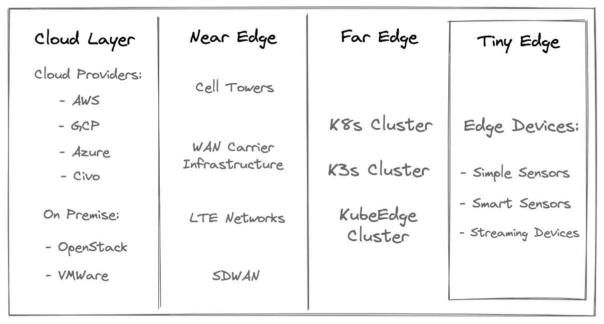
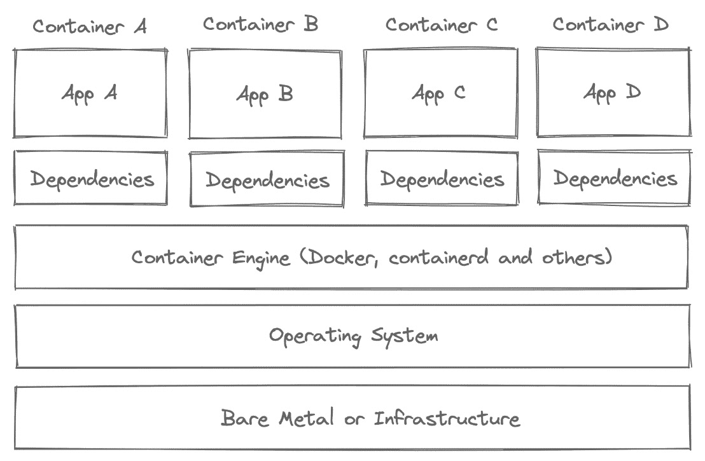
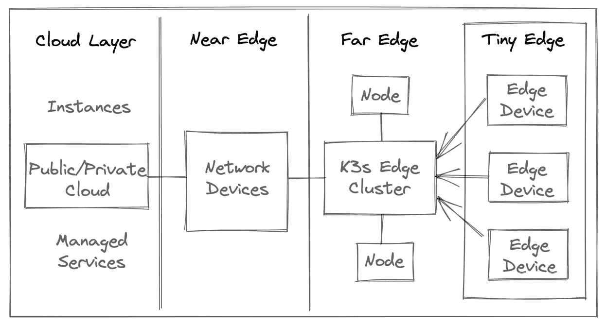
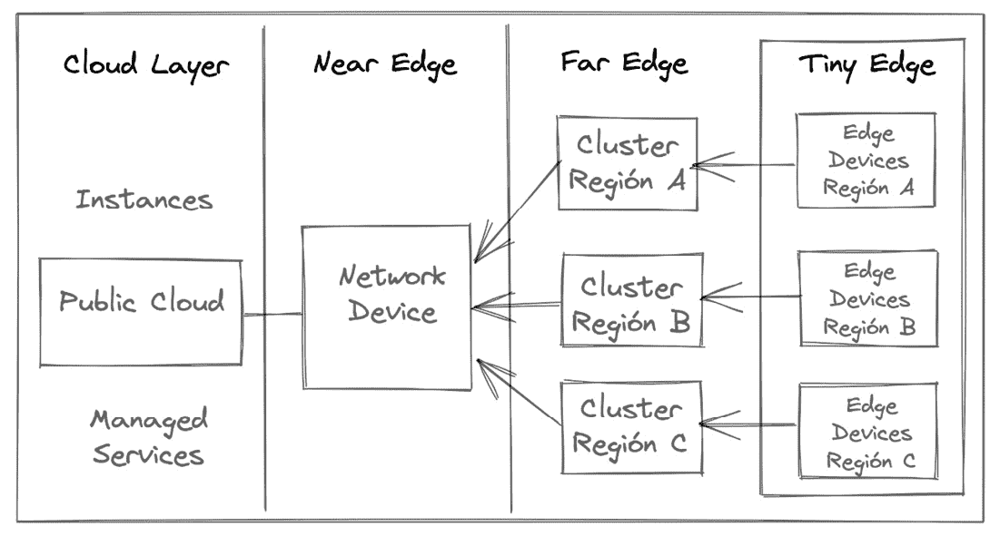
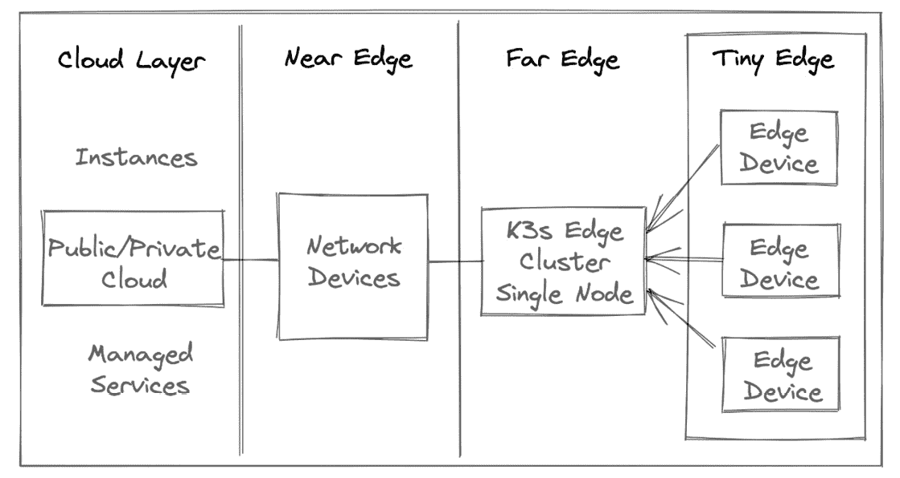

# 1

# 使用 Kubernetes 进行边缘计算

边缘计算是一种新兴的分布式系统范式，其中计算信息的单元靠近该信息的来源。该范式的好处是，它帮助您的系统减少网络中断，并减少通过云进行处理时的延迟。这意味着您可以获得更好的交互体验，尤其是在机器学习或**物联网**（**IoT**）应用程序中。本章介绍了边缘计算的基础知识和重要性，以及 Kubernetes 如何用于边缘计算。它还涵盖了使用低功耗设备的不同场景和基本架构，这些设备可以使用私有云和公共云来交换数据。

在本章中，我们将覆盖以下主要主题：

+   使用 K3s 的边缘数据中心和基本的边缘计算概念

+   基于 K3s 的基本边缘计算架构

+   将软件适配到边缘运行

# 技术要求

在本章中，我们将会在边缘设备上运行我们的边缘计算（例如**树莓派**），因此我们需要为**先进的 RISC 机器**（**ARM**）设置一个交叉编译工具链。

为此，您需要以下设备之一：

+   一台可以访问终端的 Mac

+   安装了 Ubuntu 的 PC，并且可以通过终端访问

+   安装了 Ubuntu 的虚拟机，并且可以通过终端访问

有关更多详细信息和代码片段，请查看 GitHub 上的这个资源：[`github.com/PacktPublishing/Edge-Computing-Systems-with-Kubernetes/tree/main/ch1`](https://github.com/PacktPublishing/Edge-Computing-Systems-with-Kubernetes/tree/main/ch1)。

# 使用 K3s 的边缘数据中心和基本的边缘计算概念

随着云计算的发展，企业和组织开始将处理任务迁移到边缘计算设备上，目的是降低成本，并从他们支付的基础设施中获得更多的好处。作为本书的入门内容，我们需要了解与边缘计算相关的基本概念，并理解为何我们要使用 K3s 进行边缘计算。那么，让我们从基本概念开始吧。

## 边缘和边缘计算

根据高通和思科公司的定义，边缘可以被描述为*“数据在跨越广域网（WAN）之前进行处理的任何地方”*；这就是边缘，但什么是边缘计算呢？Cloudwards.net 的 Eric Hamilton 在一篇文章中将边缘计算定义为*“沿着网络边缘处理和分析数据，尽可能靠近数据收集的源头，以便使数据变得可操作。”* 换句话说，边缘计算是指将数据处理靠近源头，并将计算分布在不同的地方，使用靠近数据源的设备进行处理。

为了提供更多背景信息，我们来看看下一个图示：



图 1.1 – 边缘层的组件

这个图示展示了数据在不同上下文中的处理方式，这些上下文包括以下几种：

+   **云层**：在这一层，你可以找到云服务提供商，如 AWS、Azure、GCP 等。

+   **近端边缘**：在这一层，你可以找到电信基础设施和设备，如 5G 网络、无线虚拟设备等类似设备。

+   **远端边缘**：在这一层，你会找到边缘集群，如 K3s 集群或在云与边缘层之间交换数据的设备，但这一层可以细分为微型边缘层。

+   **微型边缘**：在这一层，你会找到传感器、终端设备，它们与处理设备交换数据，以及远端边缘的边缘集群。

重要提示

请记住，边缘计算指的是数据在到达目标地点之前先在边缘设备上进行处理，这些目标地点可以是公有云或私有云。

建设边缘集群时，还需要考虑其他重要概念，包括以下内容：

+   **雾计算**：一种将系统分布在近端边缘和远端边缘设备之间的云服务架构；这些设备可以地理上分布在不同区域。

+   **多接入边缘计算**（**MEC**）：这将计算分布到大规模网络的边缘，具备低延迟和高带宽，是移动边缘计算的前身；换句话说，处理过程使用电信网络和移动设备。

+   **云小型数据中心**：这是一个小规模的云数据中心，通常用于资源密集型的使用场景，如数据分析、**机器学习**（**ML**）等。

## 边缘计算的好处

简单介绍完毕，接下来我们来了解边缘计算的主要优势，其中包括以下几点：

+   **减少延迟**：边缘计算可以在边缘设备上处理大量计算任务，从而减少将信息传输到目的地的延迟。

+   **减少带宽**：边缘计算可以减少所用带宽，通过将部分数据处理放在边缘设备上，从而减少网络流量。

+   **降低成本**：减少延迟和带宽意味着降低运营成本，这是边缘计算的最重要优势之一。

+   **提高安全性**：边缘计算使用数据聚合和数据加密算法来提高数据访问的安全性。

现在让我们讨论容器、Docker 和 containerd。

## 边缘计算中的容器、Docker 和 containerd

在过去几年里，由于 Docker 的成功，容器技术的采用一直在增加。Docker 在过去几年一直是最受欢迎的容器引擎。容器技术为企业提供了一种使用微服务架构设计应用程序的方法。通过这种方式，公司加速了其开发进程，并在扩展应用程序方面制定了战略。因此，首先需要理解一个基本概念：*容器是一个小型的运行时环境，它将你的应用程序与其运行所需的所有依赖项打包在一起*。这个概念并不新鲜，但 Docker，这个容器引擎，使得这个概念变得广为人知。简单来说，Docker 使用带有必要依赖项的小型操作系统镜像来运行你的软件。这可以称为操作系统虚拟化。其作用是利用 Linux 的 **cgroups** 内核功能，限制进程的 CPU、内存、网络、I/O 等资源。其他操作系统，如 Windows 或 FreeBSD，也使用类似的功能来进行隔离并创建这种虚拟化类型。让我们来看下一个图来表示这些概念：



图 1.2 – 操作系统内部的容器化应用程序

该图展示了容器不依赖于特殊功能，如 VMware、Hyper-V 和 Xen 等硬件虚拟化中常见的虚拟机管理程序；相反，应用程序作为二进制文件运行在容器内部，并重用主机的内核。可以说，运行容器几乎就像在一个目录中运行一个二进制程序，但它添加了一些资源限制，在 Linux 容器的情况下，使用 cgroups。

Docker 实现了所有这些抽象。它是一个流行的容器工具链，增加了一些版本控制功能，类似于 Git。这也是它变得非常受欢迎的主要原因，并且它具有操作系统级别的易于移植性和版本控制功能。目前，containerd 是 Docker 和 Kubernetes 用于创建容器的容器运行时。一般来说，使用 containerd，你可以创建没有额外功能的容器；它非常优化。随着边缘计算的爆炸性增长，containerd 已经成为在低资源环境中运行容器的重要软件。

总体而言，使用这些技术，你可以做到以下几点：

+   标准化如何打包你的软件。

+   让你的软件具有可移植性。

+   以更简单的方式维护你的软件。

+   在低资源环境中运行应用程序。

因此，Docker 必须被视为构建边缘计算和低资源环境中的重要软件组件。

## 分布式系统、边缘计算和 Kubernetes

在过去十年里，分布式系统从使用单体架构的多节点集群发展到使用微服务架构的多节点集群。构建微服务的第一步通常是使用容器，但一旦系统需要扩展，就有必要使用编排工具。这就是 Kubernetes 发挥作用的地方。

举个例子，假设有一个乐团，里面有很多音乐家。你可以看到有音乐家在演奏钢琴、小号等等。但如果乐团没有组织好，你需要什么来组织所有的音乐家？答案是一个指挥或者编排者。这时 Kubernetes 就登场了；每个音乐家就是一个容器，需要与其他音乐家沟通或聆听，当然，还需要听从指挥或编排者的指示。通过这种方式，所有音乐家可以在正确的时机演奏乐器，并且能够发出美妙的音响。

这正是 Kubernetes 所做的；它是一个容器的编排器，但同时它也是一个平台，拥有构建分布式系统所需的所有预构建模块，随时可以扩展，并且设计了最佳实践，帮助你实施敏捷开发和 DevOps 文化。根据你的使用场景，有时候使用 Docker 或 containerd 等小型工具可能更好，但对于复杂或高需求的场景，使用 Kubernetes 会更合适。

## 使用 K3s 构建的边缘集群——一个轻量级的 Kubernetes

现在，大问题是如何开始构建边缘计算系统。让我们从 K3s 开始。K3s 是由 Rancher Labs 创建的经过 Kubernetes 认证的发行版。K3s 默认不包含一些非必需的额外功能，这些功能在 Kubernetes 中并不是必须的，但可以在后期添加。K3s 使用 containerd 作为其容器引擎，这使得 K3s 可以在使用 ARM 设备的低资源环境中运行。例如，你还可以在生产环境中在 x86_64 设备上运行 K3s。然而，对于本书的目的，我们将使用 K3s 作为构建边缘计算系统的主要软件，并且使用 ARM 设备。

说到边缘集群，K3s 提供了与 Kubernetes 相同的强大功能，但它以一个小巧和优化的方式提供，同时还设计了一些特别适用于边缘计算系统的功能。与其他 Kubernetes 发行版相比，K3s 非常容易使用。它是一个轻量级的 Kubernetes，可以用于边缘计算、沙箱环境或任何你想要的用途，具体取决于使用场景。

## 使用 ARM 处理器和微型数据中心的边缘设备

现在，是时候谈论边缘设备和 ARM 处理器了，我们先从边缘设备开始。边缘设备被设计用来处理和分析接近数据源位置的信息；这正是*边缘*计算理念的来源。谈到低能耗设备时，x86 或 Intel 处理器比 ARM 处理器消耗更多的能源并且发热更高。这意味着需要更多的电力和更多的散热；换句话说，你需要为 x86_64 处理器支付更多的费用。另一方面，ARM 处理器计算能力较低，且能耗更低。这就是 ARM 处理器在智能手机设备上成功的原因；它们在处理和能耗之间提供了比 Intel 处理器更好的性价比。

因此，企业有兴趣设计使用 ARM 处理器的微型数据中心以供服务器使用。出于同样的原因，企业也开始将工作负载迁移到使用 ARM 处理器的设备上进行处理。一个例子是 AWS Graviton2，它是一项提供使用 ARM 处理器的云实例的服务。

# 边缘计算图示以构建你的系统

现在，掌握了容器、编排器、边缘计算及其各层的基本概念后，我们可以专注于五种基本的边缘计算配置图示，这些图示可以用来设计这种系统。所以，让我们以 K3s 作为接下来图示中边缘计算的主要平台。

## 边缘集群与公共云

这个配置在公共云或私有云与边缘层之间共享和处理数据，但让我们来解释它的不同层次：

+   **云层**：这一层位于公共云及其提供商处，如 AWS、Azure 或 GCP。该提供商可以提供使用 Intel 或 ARM 处理器的实例。例如，如果你需要 ARM 处理器，AWS 提供了 AWS Graviton2 实例。作为补充，公共云可以提供管理服务来存储数据，如数据库、存储等。私有云也可以处于这一层。你可以找到如 VMware ESXi 或 OpenStack 等软件来本地提供此类服务或实例。你甚至可以选择采用公共云和私有云的混合方法。一般来说，这一层支持你的远端和微型边缘层进行存储或数据处理。

+   **近端边缘**：在这一层，你可以找到用于在云层和远端层之间传输所有数据的网络设备。通常，这些设备包括电信设备、5G 网络等。

+   **远端边缘**：在这一层，你可以找到 K3s 集群、类似的轻量级集群如 KubeEdge，以及 Docker 或 containerd 等软件。一般来说，这是你的本地处理层。

+   **微型边缘**：这是远端边缘内部的一层，你可以找到像智能手表、物联网设备等边缘设备，它们将数据发送到远端边缘。



](img/B16945_Figure_1.3.jpg)

图 1.3 – 边缘集群与公共云

用例包括以下内容：

+   需要在互联网上或私有云之间共享数据的场景

+   在云端与边缘之间分发数据处理，如生成机器学习模型或进行预测

+   需要扩展物联网应用程序，并且应用响应时间至关重要的场景

+   需要通过数据聚合策略分发数据并在系统中进行加密来保护数据的场景

## 区域边缘集群和公共云

该配置专注于在不同区域分布处理策略，并通过公共云共享数据。让我们来解释不同的层级：

+   **云层**：这一层包含托管服务，如数据库，用于在不同区域分发数据。

+   **近端边缘**：在这一层，你可以找到网络设备，用于在云层和远端层之间移动所有数据。通常包括电信设备、5G 网络等。

+   **远端边缘**：在这一层，你可以找到跨不同区域的 K3s 集群。这些集群或节点可以共享或更新存储在公共云中的数据。

+   **微型边缘**：在这里，你可以找到接近每个区域的不同边缘设备，因为远端边缘集群会根据这种分布式配置处理信息。



图 1.4 – 区域边缘集群和公共云

使用案例包括以下内容：

+   跨不同区域的不同集群配置

+   减少应用程序响应时间，选择最近的数据或处理节点位置，这在物联网应用程序中至关重要

+   跨不同区域共享数据

+   在不同区域分配处理

## 单节点集群和公共/私有云

这是一个基本配置，单个计算机处理所有从小型边缘设备捕获的信息。让我们来解释不同的层级：

+   **云层**：在这一层，你可以找到系统的数据存储。它可以放置在公共云或私有云中。

+   **近端边缘**：在这一层，你可以找到网络设备，用于在云层和远端层之间移动所有数据。通常包括电信设备、5G 网络等。

+   **远端边缘**：在这一层，你可以找到一个单节点 K3s 集群，从小型边缘设备中收集数据。

+   **微型边缘**：用于捕获数据的设备，如智能手表、平板电脑、摄像头、传感器等。这种配置更适合本地或小规模处理。



图 1.5 – 单节点集群和公共/私有云

使用案例包括以下内容：

+   低成本和低能耗环境

+   可以由太阳能电池板或风力涡轮机提供电力的绿色边缘应用

+   小型处理或使用案例，如分析健康记录或需要本地处理或不太复杂的自主房屋系统

现在让我们将软件适配以在边缘运行。

# 让您的软件适应边缘运行

在设计边缘计算系统时，一个重要的方面是选择处理器架构来构建您的软件。由于计算消耗较低，ARM 是一种受欢迎的架构，但如果选择 ARM 作为架构，通常需要将现有代码从 x86_64（Intel）转换为 ARM（如 RI 和 AWS Graviton2 实例上的 ARMv7）。以下小节包含了将平台从一个转换到另一个的简短指南；这一过程叫做交叉编译。通过这个过程，您将能够在 ARM 设备上使用 Go、Python、Rust 和 Java 运行您的软件。接下来，让我们开始。

## 让 Go 在 ARM 上运行

首先，必须在系统上安装 Go。以下是几种安装 Go 的方法。

### 在 Linux 上安装 Go

在 Linux 上安装 Go，请执行以下步骤：

1.  下载并解压 Go 官方二进制文件：

    ```
    $ wget https://golang.org/dl/go1.15.linux-amd64.tar.gz
    $ tar -C /usr/local -xzf go1.15.linux-amd64.tar.gz
    ```

1.  设置运行 Go 的环境变量：

    ```
    $ mkdir $HOME/go
    ```

1.  在终端的配置文件中设置您的 `GOPATH`，请使用以下行。`~/.profile` 是常见的设置环境变量的文件；让我们修改 `.profile` 文件：

    ```
    $ export PATH=$PATH:/usr/local/go/bin
    $ export GOPATH=$HOME/go
    ```

1.  使用以下命令加载新配置：

    ```
    $ . ~/.profile
    $ mkdir $GOPATH/src
    ```

1.  （*可选*）。如果您愿意，您可以使用以下命令在终端中临时设置这些环境变量：

    ```
    $ export PATH=$PATH:/usr/local/go/bin
    $ export GOPATH=$HOME/go
    ```

1.  要检查是否已配置 `GOPATH`，请运行以下命令：

    ```
    $ go env GOPATH
    ```

现在，您已经准备好在 Linux 上使用 Go。让我们继续使用 Mac 进行安装。

### 在 Mac 上安装 Go

在 Mac 上安装 Go，请执行以下步骤：

1.  使用以下命令安装 Homebrew（简称 `brew`）：

    ```
    $ /bin/bash -c "$(curl -fsSL https://raw.githubusercontent.com/Homebrew/install/HEAD/install.sh)"
    ```

1.  安装完成后，使用 `brew` 安装 Go：

    ```
    $ brew install go
    ```

重要提示

要了解如何安装`brew`，您可以查看[`brew.sh`](https://brew.sh)的官方页面。

### 使用 Go 从 x86_64 交叉编译到 ARM

从 x86_64 交叉编译到 ARM，请执行以下步骤：

1.  创建一个文件夹来存储您的代码：

    ```
    $ cd ~/
    $ mkdir goproject
    $ cd goproject
    ```

1.  创建一个初始的 Go 配置，以便在 `GOPATH` 命令之外安装外部 Go 库；为此，请执行以下命令：

    ```
    $ go mod init main
    ```

1.  创建一个内容为 `Hello World` 的 `example.go` 文件：

    ```
    $ cat << EOF > example.go
    package main
    import "fmt"
    func main() {
    fmt.Println("Hello World") 
    }
    EOF
    ```

1.  假设您的环境是 x86_64，并且您希望进行针对 ARMv7 的交叉编译，请执行以下命令：

    ```
    $ env GOOS=linux GOARM=7 GOARCH=arm go build example.go
    ```

使用以下命令行以支持 ARMv8 64 位：

```
$ env GOOS=linux GOARCH=arm64 go build example.go
```

重要提示

如果您想查看其他交叉编译的选项，请参见[`github.com/golang/go/wiki/GoArm`](https://github.com/golang/go/wiki/GoArm)。

设置生成的二进制文件的执行权限：

```
$ chmod 777 example
$ ./example
```

1.  将生成的二进制文件复制到您的 ARM 设备并测试其是否正常工作。

在下一节中，我们将学习如何让 Rust 在 ARM 上运行。

## 让 Rust 在 ARM 上运行

首先，必须在系统上安装 Rust。以下是几种安装 Rust 的方法。

### 在 Linux 上安装 Rust

在 Linux 上安装 Rust，请执行以下步骤：

1.  在终端中执行以下命令来安装 Rust：

    ```
    $ curl --proto '=https' --tlsv1.2 -sSf https://sh.rustup.rs | sh 
    ```

1.  在终端配置文件中设置 Rust 的路径。例如，如果您使用的是 Bash，请将以下行添加到您的`.bashrc`中：

    ```
    $ export PATH=$PATH:$HOME/.cargo/bin
    ```

### 在 Mac 上安装 Rust

在 Mac 上安装 Rust，请执行以下步骤：

1.  使用以下命令安装 Homebrew：

    ```
    $ /bin/bash -c "$(curl -fsSL https://raw.githubusercontent.com/Homebrew/install/HEAD/install.sh)"
    ```

1.  安装完成后，使用`brew`安装`rustup`：

    ```
    $ brew install rustup-init
    ```

1.  运行`rustup`命令来安装 Rust 及其所需的工具，使用以下命令：

    ```
    $ rustup-init
    ```

1.  通过将以下行添加到终端配置文件中来设置终端环境变量：

    ```
    $ export PATH=$PATH:$HOME/.cargo/bin
    ```

重要提示

Mac 用户通常使用 ZSH 终端，因此他们需要使用`.zshrc`。如果您使用其他终端，请寻找正确的配置文件或通用的`/etc/profile`。

### 在 Mac 上使用 Rust 从 x86_64 交叉编译到 ARMv7

从 x86_64 交叉编译到 ARM，请执行以下步骤：

1.  在您的 Mac 上安装与 ARMv7 架构匹配的编译器和环境变量补充程序；为此，请执行以下命令：

    ```
    $ brew tap messense/macos-cross-toolchains
    ```

1.  通过执行以下命令下载用于交叉编译的 ARMv7 支持：

    ```
    $ brew install armv7-unknown-linux-gnueabihf
    ```

1.  现在设置环境变量：

    ```
    $ export CC_armv7_unknown_linux_gnueabihf=armv7-unknown-linux-gnueabihf-gcc
    $ export CXX_armv7_unknown_linux_gnueabihf=armv7-unknown-linux-gnueabihf-g++
    $ export AR_armv7_unknown_linux_gnueabihf=armv7-unknown-linux-gnueabihf-ar
    $ export CARGO_TARGET_ARMV7_UNKNOWN_LINUX_GNUEABIHF_LINKER=armv7-unknown-linux-gnueabihf-gcc
    ```

1.  创建一个文件夹以存储您的代码：

    ```
    $ cd ~/
    $ mkdir rustproject
    $ cd rustproject
    ```

1.  使用 Rust 创建一个初始的`Hello World`项目：

    ```
    $ cargo new hello-rust
    $ cd hello-rust
    ```

生成的 Rust 代码将如下所示：

```
fn main() {
  println!("Hello, world!");
}
```

源代码将位于`src/main.rs`。

1.  添加对 ARMv7 的支持：

    ```
    $ rustup target add armv7-unknown-linux-gnueabi
    ```

1.  构建您的软件：

    ```
    $ cargo build --target=armv7-unknown-linux-gnueabi
    ```

1.  将二进制文件复制到您的设备中并测试其是否工作：

    ```
    $ cargo build --target=armv7-unknown-linux-gnueabi
    ```

1.  生成的二进制文件将位于`target/armv7-unknown-linux-gnueabi/hello-rust`文件夹中。

1.  现在将您的二进制文件复制到设备中并测试它是否工作。

重要提示

有关 Rust 交叉编译的更多选项，请查看[`doc.rust-lang.org/nightly/rustc/platform-support.html`](https://doc.rust-lang.org/nightly/rustc/platform-support.html)和[`rust-lang.github.io/rustup/cross-compilation.html`](https://rust-lang.github.io/rustup/cross-compilation.html)。有关 Mac 和 AArch64（64 位 ARMv8）工具链的更多信息，请查看`aarch64-unknown-linux-gnu`，它位于[`github.com/messense/homebrew-macos-cross-toolchains`](https://github.com/messense/homebrew-macos-cross-toolchains)仓库中。

## 使 Python 能够在 ARM 上运行

首先，需要在系统上安装 Python。可以通过几种方式进行安装。

### 在 Linux 上安装 Python

安装 Python，请执行以下步骤：

1.  更新您的软件仓库：

    ```
    $ sudo apt-get update
    ```

1.  安装 Python 3：

    ```
    $ sudo apt-get install -y python3
    ```

### 在 Mac 上安装 Python

使用 Homebrew 在 Mac 上安装 Python，请执行以下步骤：

1.  在 brew 的可用版本列表中检查您所需的 Python 版本：

    ```
    $ brew search python
    ```

1.  假设您选择了 Python 3.8，您需要执行以下命令来安装它：

    ```
    $ brew install python@3.8
    ```

1.  测试您的安装：

    ```
    $ python3 --version
    ```

### 使用 Python 从 x86_64 交叉编译到 ARM

Python 是目前非常重要且流行的编程语言，它通常用于 AI 和机器学习应用。Python 是一种解释型语言，需要运行时环境（如 Java）来运行代码。在这种情况下，你必须安装 Python 作为运行时环境。它在运行代码时面临与 Java 类似的挑战，但也有其他挑战。有时，你需要从头开始编译库才能使用它。当前标准的 Python 库支持 ARM 架构，但问题出在当你需要使用非标准库时。

作为基本示例，让我们通过执行以下步骤在不同平台上运行 Python 代码：

1.  创建一个名为`example.py`的基本文件：

    ```
    def main():
       print("hello world")
    if __name__ == "__main__":
       main()
    ```

1.  将`example.py`复制到你的 ARM 设备。

1.  在你的 ARM 设备上通过运行以下命令安装 Python 3：

    ```
    $ sudo apt-get install -y python3
    ```

1.  运行你的代码：

    ```
    $ python3 example.py
    ```

## 使 Java 适配 ARM 平台

当谈到在 ARM 设备上运行 Java 时，它略有不同。Java 使用的是一种混合编译器，换句话说，是一种两阶段编译器。这意味着它会生成一种中间代码，称为字节码，并由**Java 虚拟机**（**JVM**）解释执行。字节码是跨平台的代码，并且遵循 Java 的理念——*一次编译，处处运行*，意味着你可以在任何平台上编译，且无需修改即可在任何其他平台上运行。那么，让我们看看如何进行跨平台编译，以便让一个基本的 Java 程序在 ARMv7 和 ARMv8 64 位设备上运行。

### 在 Linux 上安装 Java JDK

在 Linux 上安装 Java，请执行以下命令：

1.  更新 Ubuntu 的当前软件库：

    ```
    $ sudo apt-get update
    ```

1.  安装官方的 JDK 8：

    ```
    $ sudo apt-get install openjdk-8-jre
    ```

1.  测试`javac`是否可以运行：

    ```
    $ javac
    ```

### 在 Mac 上安装 Java JDK

如果你的 Mac 上没有安装 Java，请按照以下步骤操作：

1.  （*可选*）从以下链接下载 Java JDK，并选择你需要的架构，如 Linux、Mac 或 Windows：[`www.oracle.com/java/technologies/javase-downloads.html`](https://www.oracle.com/java/technologies/javase-downloads.html)。

1.  （*可选*）下载并运行安装程序。

要测试 Java 是否存在或者是否正确安装，请执行以下命令：

```
$ java -version
```

1.  通过执行以下命令测试编译器是否已安装：

    ```
    $ javac -v
    ```

### 从 x86_64 到 ARM 的 Java 跨平台编译

Java 是一种生成名为字节码的中间代码的语言，字节码可以在 JVM 上运行。假设你有一个名为`Example.java`的基本代码文件：

```
class Example {
   public static void main(String[] args) {
      System.out.println("Hello world!");
   }
}
```

要执行你的代码，请按照以下步骤操作：

1.  要进行编译，请使用以下命令：

    ```
    $ javac Example.java
    ```

这将生成一个中间代码文件`Example.class`，该文件可以由 JVM 执行。我们将在下一步进行操作。

1.  要运行字节码，请执行以下命令：

    ```
    $ java Example
    ```

1.  现在，将`Example.class`复制到另一台设备，并使用合适的 JVM 通过`java`命令运行它。

# 总结

本章解释了关于边缘计算的所有基本概念，以及它与其他概念（如雾计算、MEC 和云计算）之间的关系。还解释了如何使用 Docker、containerd 和 Kubernetes 等容器和编排器来帮助你根据自己的用例构建边缘计算系统。最后，本章还介绍了如何使用 Go、Python、Rust 和 Java 等语言的交叉编译技术，在 ARM 处理器的边缘设备上运行和编译你的软件。

# 问题

下面是一些问题，用来检验你新的知识：

1.  边缘和边缘计算之间有什么区别？

1.  你可以使用什么基础设施配置来构建边缘计算系统？

1.  容器和编排器如何帮助你构建边缘计算系统？

1.  什么是交叉编译，如何使用它在 ARM 设备上运行你的软件？

# 深入阅读

以下是一些额外的资源，您可以查看以了解更多有关边缘计算的信息：

+   *近、远或微小：在云原生世界中定义和管理边缘计算*，*Keith Basil*：[`vmblog.com/archive/2021/04/27/near-far-or-tiny-defining-and-managing-edge-computing-in-a-cloud-native-world.aspx`](https://vmblog.com/archive/2021/04/27/near-far-or-tiny-defining-and-managing-edge-computing-in-a-cloud-native-world.aspx)

+   *什么是边缘计算：网络边缘解析*，*Eric Hamilton*：*Cloudwards*（2018）：[`www.cloudwards.net/what-is-edge-computing`](https://www.cloudwards.net/what-is-edge-computing)

+   *建筑师的物联网与边缘计算* – *第二版*，*Perry Lea*，*Packt Publishing*（2020）

+   *思科物联网博客*：[`blogs.cisco.com/internet-of-things`](https://blogs.cisco.com/internet-of-things)

+   *一种用于雾计算基础智能电网的安全数据聚合协议*: [`www.researchgate.net/publication/325638338_A_secure_data_aggregation_protocol_for_fog_computing_based_smart_grids.ng`](https://www.researchgate.net/publication/325638338_A_secure_data_aggregation_protocol_for_fog_computing_based_smart_grids.ng)

+   *HarmonyCloud 推动边缘计算实施*: [`www.cncf.io/blog/2021/08/31/harmonycloud-promotes-edge-computing-implementation`](https://www.cncf.io/blog/2021/08/31/harmonycloud-promotes-edge-computing-implementation)

+   *Kubernetes – 弥合 5G 和智能边缘计算之间的鸿沟*: [`www.cncf.io/blog/2021/03/01/kubernetes-bridging-the-gap-between-5g-and-intelligent-edge-computing`](https://www.cncf.io/blog/2021/03/01/kubernetes-bridging-the-gap-between-5g-and-intelligent-edge-computing)

+   *CNCF YouTube 视频列表：2021 年 Kubernetes 在边缘日*: [`www.youtube.com/watch?v=W1v2Gb6URsk&list=PLj6h78yzYM2PuR1pP14DBLW7aku1Ia520`](https://www.youtube.com/watch?v=W1v2Gb6URsk&list=PLj6h78yzYM2PuR1pP14DBLW7aku1Ia520)

+   *使用 Rust 在 Mac 上进行交叉编译*: [`github.com/messense/homebrew-macos-cross-toolchains`](https://github.com/messense/homebrew-macos-cross-toolchains)

+   *使用 Python 进行交叉编译*: [`crossenv.readthedocs.io/en/latest/quickstart.html`](https://crossenv.readthedocs.io/en/latest/quickstart.html)

+   *下载和安装 OpenJDK 的说明*: [`openjdk.java.net/install`](https://openjdk.java.net/install)
