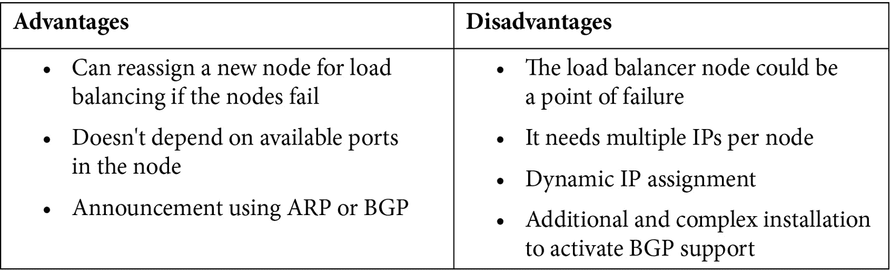

# 第三章：K3s 高级配置与管理

本章介绍了 K3s 集群的更多高级配置。默认情况下，K3s 包含一个名为 KlipperLB 的负载均衡器，但它有一些限制。例如，在创建服务时，你不必重复端口号，这会影响你使用常规负载均衡器和 NodePort 服务的方式。它适用于简单的部署。如果你需要替代 Klipper 的其他负载均衡器，我们将介绍如何安装**MetalLB**，一个裸金属负载均衡器。接着，我们将讲解如何使用高级存储配置，支持 Longhorn 存储卷的读写访问模式，替代 K3s 提供的默认本地存储类。之后，我们将进行一些常见的集群管理，包括升级 K3s、备份和恢复集群。

在本章中，我们将介绍以下主要内容：

+   使用 MetalLB 的裸金属负载均衡器

+   设置 Longhorn 作为存储

+   升级你的集群

+   备份和恢复你的 K3s 配置

# 技术要求

本章节，你需要以下内容：

+   配备 4 GB RAM（最小推荐）的 Raspberry Pi 4 型 B

+   一台运行 Ubuntu 20.04 LTS 的云服务器或虚拟机

+   你的设备或客户端已安装 Helm v3

这样，我们就准备好学习 K3s 的高级配置了。让我们开始吧。

# 使用 MetalLB 的裸金属负载均衡器

在本节中，你将探索作为裸金属负载均衡器的 MetalLB，它能够为你提供强大的功能，将服务暴露到边缘。

## Kubernetes 中的负载均衡器服务

在开始使用 KlipperLB 之前，有必要了解 Kubernetes 中负载均衡器的背景。Kubernetes 使用服务来通信或访问你的应用程序。ClusterIP 服务会创建一个 DNS 记录，使得该服务可以在集群内部访问。NodePort 服务在每个节点的 IP 上以静态端口暴露服务，端口范围是 30000–32767。最后，Kubernetes 支持一个负载均衡器服务，通过云服务商的负载均衡器将服务暴露到外部。在 K3s 中，默认使用 KlipperLB。

## KlipperLB 和 MetalLB 作为裸金属负载均衡器

边缘设备和边缘计算资源有限，因此通常可以找到只有一个节点的集群。通常，Kubernetes 的负载均衡器服务依赖于特定云服务商的实现。它还在第四层（传输层）工作，传输**传输控制协议**（**TCP**）和**用户数据报协议**（**UDP**），并且这个负载均衡器也与 NodePort 服务连接。因此，在边缘设备的情况下，K3s 实现了 KlipperLB。

KlipperLB 在低资源设备或环境中作为 k3s 的负载均衡器运行非常顺利。但当你拥有多节点集群时，KlipperLB 可能无法提供最佳的服务可用性特性。这时，MetalLB 就发挥作用了。KlipperLB 和 MetalLB 都提供裸金属负载均衡器服务，适用于 Kubernetes。在这种情况下，你可以在 K3s 上使用这些实现。

## KlipperLB 和 MetalLB——优缺点分析

现在，让我们从实现、依赖关系和使用场景的角度，谈一谈这些裸金属负载均衡器的优缺点。首先，我们从 KlipperLB 开始。

KlipperLB 的优点如下：

+   相当轻量级

+   对于单节点集群来说，使用简单且功能足够的工具。

KlipperLB 的缺点如下：

+   依赖于 **hostPort** 或可用端口来暴露一个 Pod。

+   如果端口不可用，负载均衡器服务将保持挂起状态。

说到 MetalLB，它使用第 2 层（数据链路层），该层定义了数据的格式。因此，MetalLB 使用一个节点来进行负载均衡，具有自己的优缺点。下表总结了这些信息：



总体而言，如果你只有单节点集群并且希望避免复杂的安装过程，选择 KlipperLB。对于多节点集群或可以重用端口并且需要更强大负载均衡服务的安装，使用 MetalLB。

## 安装 MetalLB

你需要一个带有 `--disable servicelb` 选项的 K3s 安装；如果你已有旧的安装版本，需要重新安装 K3s。按照以下步骤安装带有此选项的 K3s：

1.  使用以下命令登录到你的 **虚拟机**（**VM**）或设备：

    ```
    $ ssh ubuntu@YOUR_VM_IP
    ```

1.  使用以下命令安装 K3s。此步骤适用于简单的 ARM 设备，用于基本安装，不包含 KlipperLB：

    ```
    $ curl -sfL https://get.k3s.io | INSTALL_K3S_EXEC="--write-kubeconfig-mode 644 --no-deploy traefik --disable traefik --disable servicelb" sh -s -
    ```

（*可选*）使用以下命令安装 K3s。首先，设置 `PUBLIC_IP` 环境变量为你设备或虚拟机的 IP 地址：

```
$ PUBLIC_IP=YOUR_PUBLIC_IP|YOUR_PRIVATE_IP
```

接下来，使用以下命令在具有公共 IP 的节点上安装 K3s：

```
$ curl -sfL https://get.k3s.io | INSTALL_K3S_EXEC="--write-kubeconfig-mode 644 --no-deploy traefik --disable traefik --tls-san "$PUBLIC_IP" --node-external-ip "$PUBLIC_IP" --disable servicelb" sh -s -
```

1.  使用官方清单创建一个 MetalLB 命名空间（`metallb-system`），执行以下命令：

    ```
    $ kubectl apply -f https://raw.githubusercontent.com/metallb/metallb/v0.10.2/manifests/namespace.yaml
    ```

1.  在运行安装 MetalLB 的命令之前，你需要在 `metallb-system` 命名空间中创建一个名为 `metallb-config` 的 ConfigMap。我们将这个文件命名为 `config.yaml`，并填写以下内容：

    ```
    apiVersion: v1 
    kind: ConfigMap 
    metadata: 
    namespace: metallb-system 
    name: config 
    data: 
    config: | 
    address-pools: 
    - name: default 
    protocol: layer2 
    addresses: 
          - 192.168.0.240-192.168.0.250
    ```

1.  现在，执行以下命令创建 ConfigMap：

    ```
    $ kubectl apply -f config.yaml
    ```

1.  使用官方清单安装 MetalLB，执行以下命令：

    ```
    $ kubectl apply -f https://raw.githubusercontent.com/metallb/metallb/v0.10.2/manifests/metallb.yaml
    ```

现在，通过 YAML 文件安装了 MetalLB，让我们继续使用 Helm 代替 YAML 文件进行安装。

重要提示

如果你想删除此或其他安装，请使用 `delete` 选项代替 `apply`，使用相同的命令——例如，`kubectl delete -f YOUR_YAML_FILE`。

如果你想使用 Helm v3 安装 MetalLB，请按照以下步骤操作：

1.  使用以下命令添加 MetalLB 的 Helm Chart 仓库：

    ```
    $ helm repo add metallb https://metallb.github.io/metallb
    ```

1.  使用 Helm 安装 MetalLB，执行以下命令：

    ```
    $ helm install metallb -n metallb-system metallb/metallb
    ```

1.  如果你想通过 `values.yaml` 文件安装 MetalLB，请执行以下命令：

    ```
    $ helm install metallb -n metallb-system metallb/metallb -f values.yaml
    ```

1.  你需要创建一个 `values.yaml` 文件，内容如下示例：

    ```
    configInline
      address-pools:
       - name: default
         protocol: layer2
         addresses:
         - 192.168.0.240-192.168.0.250
    ```

1.  现在，你需要根据安装情况使用 `kubectl` 创建 ConfigMap，并将命名空间更改为 `metallb-system`，名称更改为 `metallb-config`。然后，应用 `YAML` 文件：

    ```
    $ kubectl apply -f config.yaml
    ```

重要提示

`addresses` 字段对应 MetalLB 用来分配给服务的 IP 地址范围，每次你在 Kubernetes 中创建 `LoadBalancer` 服务时都会使用这个范围。

1.  现在，MetalLB 已经安装完成并可以使用。

现在，你已经有了一个可以使用的 MetalLB 全新安装。接下来，你需要在下一部分学习如何排查 MetalLB 的故障。

## MetalLB 故障排查

有时，我们需要排查安装过程中的问题。如果你在安装过程中遇到问题，以下是一些可以用来排查 MetalLB 新安装问题的命令。以下是你可以使用的步骤和命令：

1.  登录到你的虚拟机或设备：

    ```
    $ ssh ubuntu@NODE_IP
    ```

1.  创建一个 Pod 来检查你的集群是否可以调度 Pod：

    ```
    $ kubectl run nginx --image=nginx --restart=Never
    ```

1.  创建一个服务以暴露之前创建的 Pod，并测试 `LoadBalancer` 服务是否正常工作：

    ```
    $ kubectl expose pod/nginx --port=8001 \
      --target-port=80 \
      --type=LoadBalancer
    ```

1.  如果你想检查服务和端口是否正常工作以暴露你的服务，可以执行以下命令，这些服务可以是 `LoadBalancer` 或 `NodePort`：

    ```
    $ kubectl get services
    ```

1.  现在，执行对分配给 NGINX 服务的外部 IP 进行访问检查，并执行以下命令，确认 MetalLB 已经成功暴露了你的服务：

    ```
    $ curl http://EXTERNAL_IP:8001
    ```

如果你想查看 MetalLB 的日志以便排查错误，请查看 `metallb-system` 命名空间下的下一个 Pod：

+   控制器

+   演讲者

现在，你知道如何进行基本的 MetalLB 故障排查了。接下来让我们进入下一部分，学习如何使用 Longhorn 配置更高级的存储。

# 配置 Longhorn 存储

在持久化信息方面，你会看到两种类型的容器，无状态和有状态容器。无状态或临时容器不会持久化容器内部生成的信息。有状态容器即使在删除后也能持久化信息。K3s 默认提供一种通过存储类型（在 Kubernetes 中称为 **storage class**）持久化数据的方式，叫做 **local-path**。这种存储是一种基本且非常轻量的实现，专为边缘设备设计。Kubernetes 中常用的功能是拥有持久卷声明，允许你的 Pod 从不同节点进行数据读写。这是一个持久卷配置，访问模式键设置为 **ReadWriteMany**（**RWX**）。这个功能通常在生产场景中使用，非常重要，因为它使你能够在不同服务间共享信息。Longhorn 提供了这个功能，并且以非常轻量的方式进行了优化，专为边缘设备设计。接下来让我们了解什么是 Longhorn 以及如何安装它。

## 为什么使用 Longhorn？

Longhorn 旨在成为一个分布式和超融合的存储堆栈。超融合存储意味着虚拟化软件抽象并汇聚存储资源。Longhorn 不会占用大量资源，这使得您可以将其用于边缘设备的高级存储。它甚至可以简化快照、备份甚至灾难恢复的工作流。因此，如果您正在寻找轻量级和高级的边缘存储解决方案，Longhorn 可以满足您的需求。还有其他选项，比如 Rook，但 Longhorn 是一款简单的软件，可以在不牺牲资源消耗的情况下为您提供额外的存储能力。那么，接下来让我们学习如何安装它，并在下一节中为 Pod 创建一个简单的**持久卷声明**。

## 安装 Longhorn 时启用 ReadWriteMany 模式

要安装 Longhorn，请按照以下步骤操作：

1.  登录到您的虚拟机或设备：

    ```
    $ ssh ubuntu@NODE_IP
    ```

1.  如果您想安装 ReadWriteMany PVC 模式，您需要在集群中每个安装了 Ubuntu 的虚拟机上安装 `nfs-common`。为此，请执行以下命令：

    ```
    $ sudo apt install -y nfs-common
    ```

1.  应用官方的 Longhorn 清单，如下所示：

    ```
    $ kubectl apply -f https://raw.githubusercontent.com/longhorn/longhorn/v1.3.1/deploy/longhorn.yaml
    ```

重要提示

Longhorn 将安装在 `longhorn-system` 命名空间中。

1.  创建一个 `pvc.yaml` 文件：

    ```
    apiVersion: v1
    kind: PersistentVolumeClaim
    metadata:
      name: longhorn-volv-pvc
    spec:
      accessModes:
        - ReadWriteMany
      storageClassName: longhorn
      resources:
        requests:
          storage: 2Gi
    ```

1.  应用 `pvc.yaml` 文件：

    ```
    $ kubectl create -f pvc.yaml
    ```

重要提示

您可以使用不同的 PVC 模式，如 `ReadWriteOnce` 或 `ReadOnlyMany`。默认情况下，存储类至少支持 `ReadWriteOnce`。因此，`ReadWriteMany` 是一个使用 `NFS` 的特殊功能，并包含在 Longhorn 中。

现在，是时候使用 Longhorn 存储类创建一个 Pod 了。请按照以下步骤操作：

1.  创建 `pod.yaml` 文件，以便使用之前创建的 PVC 创建一个 Pod：

    ```
    echo "
    apiVersion: v1
    kind: Pod
    metadata:
      name: volume-test
      namespace: default
    spec:
      containers:
      - name: volume-test
        image: nginx:stable-alpine
        imagePullPolicy: IfNotPresent
        volumeMounts:
        - name: volv
          mountPath: /data
        ports:
        - containerPort: 80
      volumes:
      - name: volv
        persistentVolumeClaim:
          claimName: longhorn-volv-pvc" > pod.yaml
    ```

1.  应用 `pod.yaml` 文件以创建 Pod：

    ```
    $ kubectl create -f pod.yaml
    ```

现在，您已经安装并运行了 Longhorn。那么，接下来让我们学习如何在下一节中使用 Longhorn UI。

## 使用 Longhorn UI

如果您想访问 Longhorn UI，您需要检查 `longhorn-system` 上创建的服务并执行端口转发；如果您安装了 MetalLB，您可以创建一个 `LoadBalancer` 服务来暴露 Longhorn UI。

要通过端口转发访问 Longhorn，请执行以下步骤：

1.  在本地运行下一个端口转发命令，以便在浏览器中访问 UI：

    ```
    $ kubectl port-forward svc/longhorn-frontend -n longhorn-system 8080:80
    ```

1.  现在，打开浏览器，访问 `http://localhost:8080`，您将看到以下仪表板：


图 3.1 – Longhorn UI

使用此仪表板，您可以通过 UI 管理您的**持久卷声明**（**PVCs**）；更多参考资料，请访问以下链接：[`longhorn.io/docs/1.3.1/deploy/accessing-the-ui`](https://longhorn.io/docs/1.3.1/deploy/accessing-the-ui)。

现在您已经知道如何安装和使用 Longhorn，让我们继续进行一些基础故障排除。

### Longhorn 故障排除

以之前的示例为参考，要排查使用 Longhorn 创建 PVC 的问题，可以使用以下命令：

1.  使用以下命令检查 Longhorn Pod 是否成功运行：

    ```
    $ kubectl get pods –n longhonr-system
    ```

1.  检查是否已创建 PV：

    ```
    $ kubectl get pv
    ```

1.  检查是否已创建 PVC：

    ```
    $ kubectl get pvc
    ```

1.  检查是否已创建使用新 Longhorn 存储类的 `pod.yaml` 中的 Pod：

    ```
    $ kubectl get pods
    ```

使用这些命令，你可以找到在 Pod 或部署使用带有 Longhorn 存储类的 PVC 时出现的错误。

重要提示

如果出现问题，前面四个命令会返回错误。有关更多信息，你可以查看 [`kubernetes.io/docs/tasks/configure-pod-container/configure-persistent-volume-storage`](https://kubernetes.io/docs/tasks/configure-pod-container/configure-persistent-volume-storage) 或 [`kubernetes.io/docs/concepts/storage/persistent-volumes/#class`](https://kubernetes.io/docs/concepts/storage/persistent-volumes/#class)。

现在，我们准备学习有关升级集群的另一个高级主题。让我们继续进入下一节。

# 升级你的集群

有时候，你想保持 K3s 的版本和功能更新。接下来的章节将解释如何执行这些升级过程。

## 使用 K3s Bash 脚本进行升级

要在你的节点上进行升级，你需要按照以下步骤操作：

1.  首先，你需要使用以下命令停止设备上的 K3s：

    ```
    $ /usr/local/bin/k3s-killall.sh
    ```

1.  现在，你需要选择要升级到的版本。通常，有三个选项——选择最新的或最稳定的通道，或选择特定的版本。下一个命令将把你的集群更新到最新的稳定版本：

    ```
    $ curl -sfL https://get.k3s.io | sh -
    ```

1.  现在，如果你想更新到最新版本（尽管它不太稳定），你可以执行以下命令：

    ```
    $ curl -sfL https://get.k3s.io | INSTALL_K3S_CHANNEL=latest sh -
    ```

1.  最后的选项是选择特定的版本。为此，你需要执行以下命令：

    ```
    $ curl -sfL https://get.k3s.io | INSTALL_K3S_VERSION=vX.Y.Z-rc1 sh -
    ```

重要提示

你可以访问 [`update.k3s.io/v1-release/channels`](https://update.k3s.io/v1-release/channels) 查看最新、稳定或特定版本的 K3s，或者访问 K3s 的官方网站 [`k3s.io`](https://k3s.io) 中的 GitHub 部分。

现在你知道如何使用 K3s 脚本升级集群了。让我们继续在下一节学习如何手动升级。

## 手动升级 K3s

如果你想手动升级 K3s 版本，可以根据官方 K3s 网站文档，按照以下步骤操作：

1.  从发布页面下载你需要的 K3s 二进制文件。要做到这一点，请查看此链接：[`github.com/k3s-io/k3s/releases`](https://github.com/k3s-io/k3s/releases)。

1.  将下载的二进制文件复制到 `/usr/local/bin` 文件夹。

1.  停止旧的 K3s 二进制文件。为此，你可以执行以下命令：

    ```
    $ /usr/local/bin/k3s-killall.sh
    ```

1.  删除旧的二进制文件。

1.  使用以下命令启动新的 K3s 二进制文件：

    ```
    $ sudo systemctl restart k3s
    ```

现在，你知道如何手动操作 K3s，但有一点你需要知道，那就是在应用下一个更改之前必须重启服务。这部分内容将在下一节中讲解。

## 重启 K3s。

当你进行软件或硬件升级，或需要重启以修复错误时，你可以使用 `systemd` 和 **OpenRC** 重启 K3s 服务。

使用 `systemd` 重启 K3s，请按照以下步骤操作：

1.  要在主节点中重启 K3s 服务，请执行以下命令：

    ```
    $ sudo systemctl restart k3s
    ```

1.  要在代理节点中重启 K3s agent 服务，请执行以下命令：

    ```
    $ sudo systemctl restart k3s-agent
    ```

使用 OpenRC 重启 K3s，请按照以下步骤操作：

1.  要在主节点中重启 K3s 服务，请执行以下命令：

    ```
    $ sudo service k3s restart
    ```

1.  要在代理节点中重启 K3s-agent 服务，请执行以下命令：

    ```
    $ sudo service k3s-agent restart
    ```

现在你已经知道了升级 K3s 集群所需的所有步骤，是时候继续学习其他高级主题——备份和恢复。让我们继续下一个部分来了解这些内容。

# 备份和恢复 K3s 配置

在生产环境中，Kubernetes 对象的备份和恢复是需要考虑的事项。本节将解释如何在默认存储（SQLite）中执行这些任务，如何在 K3s 上安装和管理**etcd**，以及如果你使用 K3s 的 SQL 后端时的一些基本资源。

## 从 SQLite 备份

如果你使用的是默认存储 SQLite，请按照以下步骤操作：

1.  登录到主节点：

    ```
    $ ssh ubuntu@NODE_IP
    ```

1.  使用以下命令停止 K3s：

    ```
    $ k3s-killall.sh
    ```

1.  切换到 `/var/lib/rancher/k3s/` 目录服务器：

    ```
    $ sudo cd /var/lib/rancher/k3s
    ```

1.  复制 `k3s` 文件夹中的文件夹服务器：

    ```
    $ sudo cp -R /var/lib/rancher/k3s folder_of_destination
    ```

1.  如果需要，可以在另一台设备上下载此文件夹。

## 从 SQL 数据库 K3s 后端备份和恢复

如果你使用外部存储——例如 MySQL——你需要使用工具或命令来备份你的数据库。

### 备份 MySQL

对于 MySQL，你可以执行以下步骤来备份 K3s 配置：

1.  获取你的数据库凭证，以便使用 `mysqldump` 命令。

1.  运行以下命令来备份数据库，这里的数据库名为 `k3s`，使用 `YOUR_USER` 用户，`YOUR_PASSWORD` 密码，并输出为 `output.sql` 文件，数据库所在的主机是 `YOUR_HOST`：

    ```
    $ mysqldump -h YOUR_HOST -u YOUR_USER -pYOUR_PASSWORD k3s > output.sql
    ```

重要提示

你可以修改 `YOUR_HOST`、`YOUR_USER` 和 `YOUR_PASSWORD` 的值，使用其他数据库名代替 `k3s`，甚至可以修改输出文件名来自定义备份命令。如果你连接的主机与数据库安装在同一台主机上，`–h` 选项是可选的。默认情况下，它会连接到 `localhost`。你可以查看这个链接获取更多 MySQL 备份的示例：[`www.tecmint.com/mysql-backup-and-restore-commands-for-database-administration`](https://www.tecmint.com/mysql-backup-and-restore-commands-for-database-administration)。

现在备份已经准备好可以使用。在下一节中，你将使用备份来恢复数据库。

### 恢复 MySQL

现在是恢复数据库的时刻了。请按照以下步骤进行恢复：

1.  获取你的数据库凭证，以便使用 `mysql` 命令操作数据库。

1.  运行以下命令来恢复你的数据库备份。我们使用的是`k3s`数据库。根据你用于存储`k3s`集群数据的数据库，修改`YOUR_HOST`和`YOUR_PASSWORD`参数。最后，使用`output.sql`文件加载你的备份并恢复数据库：

    ```
    $ mysql -h YOUR_HOST -u YOUR_USER -pYOUR_PASSWORD k3s < output.sql
    ```

重要提示

你可以修改之前命令中的值，通过`output.sql`文件执行恢复操作。

### 备份和恢复其他数据存储

如果你使用的是其他 K3s 后端，如 PostgreSQL 或`etcd`，你可以查看每个数据库的官方文档。

对于 PostgreSQL，请查看以下链接：[`www.postgresql.org/docs/8.3/backup-dump.html`](https://www.postgresql.org/docs/8.3/backup-dump.html)。

对于`etcd`，请查看以下链接：[`etcd.io`](https://etcd.io)。

现在你已经了解如何恢复 K3s 集群的 MySQL 数据存储，接下来让我们学习如何使用`etcd`作为你的数据存储。

# 嵌入式 etcd 管理

`etcd`是存储所有 Kubernetes 对象的默认存储类型。默认情况下，`etcd`已从 K3s 中移除，但你可以安装它。K3s 自定义了`etcd`在集群中的工作方式，包括一些常规 Kubernetes 集群中没有的自定义功能。所以，让我们开始在 K3s 中安装`etcd`吧。

## 安装 etcd 后端

如果你想安装它，请按照以下步骤操作：

1.  要安装 K3s 并使用`etcd`后端，你需要执行以下命令将`etcd`包含在 K3s 安装中。这个命令需要在主节点上执行：

    ```
    $ curl -sfL https://get.k3s.io | INSTALL_K3S_EXEC="server --cluster-init" sh -s -
    ```

1.  设置你的`TOKEN`变量，使用`YOUR_TOKEN`主令牌，将节点加入集群：

    ```
    $ TOKEN=YOUR_TOKEN
    ```

1.  现在，如果你需要多集群配置，请执行以下命令：

    ```
    $ curl -sfL https://get.k3s.io | INSTALL_K3S_EXEC="server 
    --server https://MASTER_IP:6443" K3S_TOKEN=$TOKEN sh -s -
    ```

现在你已经了解如何为 K3s 安装`etcd`功能，接下来让我们学习如何为你的 Kubernetes 对象配置创建和恢复`etcd`快照。

## 创建和恢复 etcd 快照

K3s 包含了一个实验性功能，用于备份和恢复`etcd`。在这一部分，你将学习如何执行`etcd`快照和恢复操作。默认情况下，这个后端启用了快照功能。这些快照存储在`/var/lib/rancher/k3s/server/db/snapshots`目录下。要创建备份，请手动执行以下步骤：

1.  手动创建备份：

    ```
    $ k3s etcd-snapshot --name=mysnapshot
    ```

这将在`snapshots`文件夹内生成一个文件。

1.  要从备份中恢复你的`etcd`，请执行以下命令：

    ```
    $ k3s server \
    --cluster-reset \
    --cluster-reset-restore-path=<PATH-TO-SNAPSHOT>
    ```

1.  你可以使用以下选项来自动化快照生成：

    ```
    --etcd-snapshot-schedule-cron
    ```

想了解更多配置参考内容，请访问此链接：[`rancher.com/docs/k3s/latest/en/backup-restore/#options`](https://rancher.com/docs/k3s/latest/en/backup-restore/#options)。

您甚至可以参考官方的 `etcd` 文档：[`github.com/etcd-io/website/blob/main/content/en/docs/v3.5/op-guide/recovery.md`](https://github.com/etcd-io/website/blob/main/content/en/docs/v3.5/op-guide/recovery.md)。

这就是如何管理您的`etcd`快照。现在，让我们回顾一下本章的内容。

# 总结

本章介绍了使用 Ubuntu 和 K3s 配置 Kubernetes 边缘集群的常见高级配置。这些常见配置之一是使用 MetalLB 安装裸金属负载均衡器。我们还讨论了与默认 K3s 负载均衡器 KlipperLB 相比，这种方式的优缺点，并介绍了在何种情况下使用各自的场景。接着，我们介绍了 Longhorn 的高级存储配置，它是一种非常轻量级的存储解决方案，易于安装和配置，支持 ReadWriteMany 存储访问模式。最后，我们了解了如何升级集群，以及在使用不同数据存储（如 SQL 或`etcd`）时进行备份和恢复。掌握了这些知识，您已经准备好创建一个可投入生产的集群。在下一章中，我们将学习如何使用 k3OS 创建集群，使用 K3s ISO 镜像和覆盖安装。

# 问题

以下是一些问题，以验证您的新知识：

1.  什么时候选择 KlipperLB 或 MetalLB 作为裸金属负载均衡解决方案？

1.  我如何排查 MetalLB 安装问题？

1.  如何安装 Longhorn，以获得更强大的数据存储解决方案？

1.  如何排查我的 Longhorn 安装问题？

1.  我可以使用哪些其他数据存储解决方案来替代 Longhorn？

1.  升级我的 K3s 集群的步骤是什么？

1.  如果我使用 SQL 后端或`etcd`，备份或恢复我的 Kubernetes 对象配置的步骤是什么？

# 进一步阅读

您可以参考以下资料，获取有关本章涉及主题的更多信息：

+   什么是 OSI 模型？：[`www.cloudflare.com/en-gb/learning/ddos/glossary/open-systems-interconnection-model-osi/`](https://www.cloudflare.com/en-gb/learning/ddos/glossary/open-systems-interconnection-model-osi/)

+   MetalLB 官方文档：[`metallb.universe.tf`](https://metallb.universe.tf)

+   MetalLB 层 2 模式：[`metallb.universe.tf/concepts/layer2`](https://metallb.universe.tf/concepts/layer2)

+   Kubernetes 101：为什么你需要使用 MetalLB：[`www.youtube.com/watch?v=Ytc24Y0YrXE`](https://www.youtube.com/watch?v=Ytc24Y0YrXE)

+   MetalLB ConfigMap 配置：[`metallb.universe.tf/configuration`](https://metallb.universe.tf/configuration)

+   持久卷： [`kubernetes.io/docs/concepts/storage/persistent-volumes`](https://kubernetes.io/docs/concepts/storage/persistent-volumes)

+   卷和存储：[`rancher.com/docs/k3s/latest/en/storage`](https://rancher.com/docs/k3s/latest/en/storage)

+   Longhorn 官方页面：[`longhorn.io`](https://longhorn.io)

+   安装带 RWM 支持的 OpenEBS: [`docs.openebs.io/docs/next/rwm.html`](https://docs.openebs.io/docs/next/rwm.html)

+   安装带 RWM 支持的 Rook: [`rook.io/docs/nfs/v1.7`](https://rook.io/docs/nfs/v1.7)

+   升级 K3s 集群: [`rancher.com/docs/k3s/latest/en/upgrades`](https://rancher.com/docs/k3s/latest/en/upgrades)

+   备份和恢复 K3s 集群: [`rancher.com/docs/k3s/latest/en/backup-restore`](https://rancher.com/docs/k3s/latest/en/backup-restore)

+   安装选项: [`rancher.com/docs/k3s/latest/en/installation/install-options/#registration-options-for-the-k3s-server`](https://rancher.com/docs/k3s/latest/en/installation/install-options/#registration-options-for-the-k3s-server)
