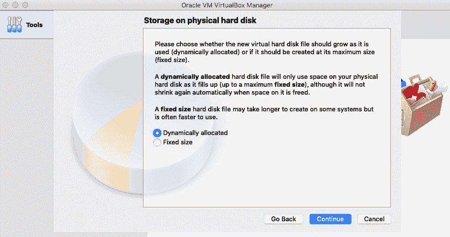

# 第四章：k3OS 安装与配置

在边缘计算的背景下，企业希望简化使用边缘设备的任务。谈到 K3s 的成功采用，一些行业需要一个现成的操作系统，能够包括一个边缘 Kubernetes 发行版。这正是 k3OS 满足行业需求的地方。k3OS 的设计目的是加速在边缘设备上安装 K3s。

k3OS 打包了安装 K3s 所需的所有软件。本章将探讨如何使用 k3OS 的 ISO 镜像在 x86_64 设备上安装 K3s，并介绍如何使用配置文件。你将通过不同的配置示例学习如何自定义你的 K3s 安装，从单节点到多节点。最后，你将学习如何在 ARM 设备上使用覆盖安装安装 k3OS，详细配置包括网络设置、主机名等，特别是在为边缘设备安装 k3OS 时，尤其是使用 ARM 设备时。

在本章中，我们将讨论以下主要内容：

+   使用 ISO 镜像为 x86_64 设备安装 k3OS

+   使用配置文件进行的 k3OS 高级安装

+   多节点 ARM 覆盖安装

# 技术要求

本章需要以下虚拟机或设备之一：

+   一台 4GB RAM（建议最小） 的 Raspberry Pi 4B 模型

+   一台运行 **Ubuntu 20.04 LTS** 的云服务器或虚拟机

+   使用 VirtualBox 或其他虚拟化软件创建的虚拟机

此外，你需要一个云存储服务，如 Amazon S3、Google Cloud Storage 或类似服务，用于上传 k3OS 的配置文件。

这样，我们已经准备好学习如何在你首选的边缘设备上安装 k3OS。那就开始吧。

更多详细信息和代码片段，请查看 GitHub 上的资源：[`github.com/PacktPublishing/Edge-Computing-Systems-with-Kubernetes/tree/main/ch4`](https://github.com/PacktPublishing/Edge-Computing-Systems-with-Kubernetes/tree/main/ch4)

# k3OS – Kubernetes 操作系统

k3OS 是一个 Linux 发行版，包含安装 Kubernetes 所需的最小内核、驱动程序和二进制文件。它提供了一个轻量级的 Kubernetes 发行版，称为 K3s。k3OS 可以作为一种快速操作系统解决方案来安装轻量级 Kubernetes 集群；这意味着 k3OS 镜像可以用于安装主节点和代理节点。k3OS 使用 K3s 作为主要软件，在边缘设备上创建单节点或多节点集群。因此，使用 k3OS，你可以快速运行边缘集群，而不需要花费太多时间。

k3OS 可以通过以下方式安装：

+   **ISO 镜像**

+   **覆盖安装**

还有其他安装 K3s 集群的方法，但这是一个更简便的快速入门方式。目前，k3OS 仍在开发中，但已经支持许多 ARM 设备的功能。所以，让我们继续学习下一部分，了解如何使用 k3OS 安装轻量级 Kubernetes 集群。

# 使用 ISO 镜像为 x86_64 设备安装 k3OS

我们将使用 VirtualBox 创建的虚拟机和适用于 x86_64 架构的 ISO 镜像，在 Mac 上安装 k3OS。请按照以下步骤操作：

1.  从此链接下载 `k3OS x86_64 v0.20.7 ISO` 镜像：

[`github.com/rancher/k3os/releases`](https://github.com/rancher/k3os/releases)

1.  打开你的 VirtualBox。主窗口将会出现，如下图所示：


图 4.1 – VirtualBox 主窗口

1.  输入虚拟机名称以便识别——在此示例中为 `k3OS`——并选择虚拟机类型为 **Linux**，版本选择 **其他 Linux (64 位)**。然后，点击 **继续**。


图 4.2 – 名称和操作系统对话框

1.  选择至少 **2048 MB** 的 RAM 内存用于 Live CD 和交互式安装。然后，点击 **继续**。


图 4.3 – 内存大小对话框

1.  现在让我们创建硬盘；选择 **现在创建虚拟硬盘** 并点击 **创建**。


图 4.4 – 硬盘对话框

1.  选择 **VDI** 作为 **硬盘文件类型**，然后点击 **继续**。


图 4.5 – 硬盘文件类型对话框

1.  选择 **动态分配** 作为物理存储，因为这会动态分配硬盘空间。然后，点击 **继续**。



图 4.6 – 硬盘类型对话框

1.  选择至少 **4.00 GB** 的磁盘空间用于安装，具体大小可根据个人需求选择。然后，点击 **创建**。


图 4.7 – 磁盘空间对话框

1.  VirtualBox 将把你带到 **主窗口**；点击 **设置** 图标。


图 4.8 – 主窗口和设置图标

1.  点击 **存储**，然后选择 **空** 驱动器图标。接着，点击 **光驱** 下拉框旁边的小 CD 图标 ()。


图 4.9 – 存储对话框

1.  选择 **选择一个磁盘文件...** 菜单。


图 4.10 – 光驱选项

1.  现在找到你的 **k3OS ISO 镜像** 并点击 **打开**：


图 4.11 – 打开 ISO 对话框

1.  点击 **Live CD/DVD** 复选框，然后点击 **确定**。


图 4.12 – 启用 Live CD/DVD 功能

1.  现在点击**网络**，在**适配器 1**下，将**附加到**的下拉框更改为**桥接适配器**，使你的虚拟机能够获取到局域网内的 IP 地址。这样可以远程访问虚拟机。然后，点击**确定**。


图 4.13 – 网络配置对话框

1.  VirtualBox 将再次返回主窗口，现在点击**启动**图标。

1.  现在，你应该等待 k3OS 发行版的加载过程。加载完成后，你将看到一个登录提示符。使用`rancher`作为用户名和密码。在较新的版本中，你无需输入任何密码。


图 4.14 – k3OS live CD 初次登录

1.  然后，执行 `sudo k3os install` 来启动交互式脚本，在虚拟机中安装 k3OS：


图 4.15 – k3OS 启动交互式安装

1.  使用以下值完成脚本安装：

    +   使用键 `1` 安装到磁盘。

    +   使用 `N` 配置 cloud-init 系统。

    +   授权 GitHub 用户通过 SSH 连接，使用 `N`。

    +   为 rancher 用户设置并确认新密码，使用 `YOUR_PASSWORD`。

    +   使用`N`配置 Wi-Fi。

    +   使用`1`作为服务器或代理运行。

    +   令牌或集群密钥 – 留空后按*Enter*。

    +   你的磁盘将被使用 `y` 格式化。

对话框将类似于以下屏幕截图：


图 4.16 – CLI 对话框安装

1.  之后，虚拟机会重启；当开始加载时，关闭虚拟机窗口，*图 4.17* 中的对话框将会出现。选择**关闭计算机**，然后点击**确定**。


图 4.17 – 关闭虚拟机

1.  一旦虚拟机停止，进入**设置**，然后在**主板**标签下的**系统**部分选择**启动顺序**，并选择**硬盘**选项，以防止光盘再次未能加载，并防止在虚拟机启动时启动安装脚本。


图 4.18 – 重新配置为从磁盘启动

1.  现在，VirtualBox 将返回主窗口，点击**启动**以重新启动虚拟机，加载你新安装的 k3OS。

1.  现在，你的 k3OS 安装正在运行。你需要输入 `rancher` 用户名和新密码进行登录。


图 4.19 – k3OS 从磁盘首次启动

现在，你已经完成了 k3OS 的全新安装，准备好使用了。

在下一个部分，你将学习如何使用相同的创建 k3OS 虚拟机的步骤进行更高级的配置，接下来我们进入下一个部分。

# 使用配置文件的 k3OS 高级安装

现在，我们准备学习如何使用配置文件来安装 k3OS；为此，你需要一个公共的 GitHub 仓库，在那里你可以推送这些文件。在创建 `config.yaml` 文件以安装 k3OS 之前，让我们了解一下这个文件的不同部分。你需要为主节点和代理节点各创建一个文件。

## k3OS 配置文件部分

让我们先从配置主机的部分开始。这些部分如下：

+   **主机名部分**：

    ```
    hostname: master
    ```

这里是设置主机名的位置——在这个例子中是 `master`。

+   **SSH 部分**：

    ```
    ssh_authorized_keys: 
    - ssh-rsa YOUR_KEY
    ```

这一部分用于设置可以通过 SSH 访问节点的默认 SSH 公钥。你需要将 `YOUR_KEY` 替换为你自己的公钥。

+   **写入文件部分**：

    ```
    write_files: 
    - path: /var/lib/connman/default.config 
    content: |- 
    [service_eth0] 
    Type=ethernet 
    IPv4=192.168.0.11/255.255.255.0/192.168.0.1 
    IPv6=off 
          Nameservers=8.8.8.8
    ```

这一部分定义了你的网络配置。在这个例子中，我们已将 Raspberry Pi 连接到带有互联网的以太网连接。此节点的 IP 设置为 `192.168.0.11`，子网掩码为 `255.255.255.0`，网关为 `192.168.0.1`，且此连接将使用 `8.8.8.8` 名称服务器。记住，你可以根据你的互联网服务提供商自定义这些值。

现在，让我们探索配置 K3s 的各个部分。它们如下：

+   **k3OS DNS 名称服务器部分**：

    ```
    k3os: 
    dns_nameservers: 
    - 8.8.8.8 
      - 1.1.1.1
    ```

这一部分设置了集群中 pod 的默认 DNS；在这个例子中，设置为 `8.8.8.8` 和 `1.1.1.1`。

+   **NTP 服务器部分**：

    ```
    ntp_servers: 
    - 0.us.pool.ntp.org 
      - 1.us.pool.ntp.org
    ```

这一部分设置了 NTP 服务器来同步时间；在这个例子中，设置为 `0.us.pool.ntp.org` 和 `1.us.pool.ntp.org`。

+   **密码部分**：

    ```
      password: rancher
    ```

这里是设置密码以访问使用 k3OS 的主机的位置。

+   **标签部分**：

    ```
    labels: 
        region: america-central-1  
    ```

这一部分配置了节点的标签；这等同于使用 `kubectl labels` 命令。

我们已经解释了主节点和代理节点的共同部分。现在，让我们继续介绍那些主节点和代理节点不同的部分。

## 主节点和代理节点的配置

这一部分描述了配置主节点或代理节点时必须使用的特定部分。让我们从主节点开始：

+   这是主节点的特定配置示例：

    ```
    k3os: 
      token: myclustersecret
      password: rancher
    k3s_args: 
    - server 
    - "--write-kubeconfig-mode" 
    - "644" 
    ```

这个 k3OS 配置将主节点设置为包括将用于添加新代理节点的令牌、节点的密码以及发送给服务器二进制文件的参数。在此例中，仅修改安装以执行 `kubectl` 而不使用 `sudo`。

+   这是代理节点的特定配置示例：

    ```
    k3os: 
    server_url: https://192.168.0.11:6443 
      token: myclustersecret
      password: rancher
    ```

这个 k3OS 配置将代理节点设置为连接到在 `server_url` 中定义的主节点，使用定义的令牌将其加入集群，并使用定义的密码访问节点。

重要提示

若要查看更多选项或参数，可以查看下一个链接：[`rancher.com/docs/k3s`](https://rancher.com/docs/k3s)。

我们已经解释了创建集群所需的所有基本部分。接下来的部分，我们将创建基本配置文件来创建一个多节点集群。让我们开始吧。

## 使用配置文件创建多节点集群

现在是时候使用配置文件配置您的集群了，让我们将所有部分拼凑在一起；主节点的配置文件将如下所示：

```
hostname: master
ssh_authorized_keys:
- ssh-rsa YOUR_PUBLIC_SSH_KEY
write_files:
  - path: /var/lib/connman/default.config
    content: |-
      [service_eth0]
      Type=ethernet
      IPv4=192.168.0.11/255.255.255.0/192.168.0.1
      IPv6=off
      Nameservers=8.8.8.8
k3os:
  dns_nameservers:
  - 8.8.8.8
  ntp_servers:
  - 0.us.pool.ntp.org
  password: rancher
  token: myclustersecret
  k3s_args:
  - server
  - "--write-kubeconfig-mode"
  - "644
```

代理节点的配置文件将如下所示：

```
hostname: node01
ssh_authorized_keys:
- ssh-rsa YOUR_PUBLIC_SSH_KEY
write_files:
  - path: /var/lib/connman/default.config
    content: |-
      [service_eth0]
      Type=ethernet
      IPv4=192.168.0.12/255.255.255.0/192.168.0.1
      IPv6=off
      Nameservers=8.8.8.8
k3os:
  server_url: https://192.168.0.11:6443
  token: myclustersecret
  dns_nameservers:
  - 8.8.8.8
  ntp_servers:
  - 0.us.pool.ntp.org
  password: rancher
```

现在我们已经有了主节点和代理节点的基本配置文件，是时候使用这些文件来部署您的多节点集群，具体过程将在以下部分中讨论。

## 使用配置文件创建多节点 K3s 集群

在开始创建多节点集群之前，您必须具备以下要求：

+   1 个虚拟机用于主节点。

+   1 个虚拟机用于代理节点。

+   您的`master_example.yaml`主配置文件已上传到云存储服务，如 Amazon S3、Google Cloud Storage 或类似服务。例如，如果您使用 Google 存储，您的文件 URL 将类似于：[`storage.googleapis.com/k3s/master_example.yaml`](https://storage.googleapis.com/k3s/master_example.yaml)。

+   您的`agent_example.yaml`代理配置文件已上传到云存储服务，如 Amazon S3、Google Cloud Storage 或类似服务。例如，如果您使用 Google 存储，您的文件 URL 将类似于：[`storage.googleapis.com/k3s/agent_example.yaml`](https://storage.googleapis.com/k3s/agent_example.yaml)。

重要提示

主节点和代理节点的虚拟机必须配置为使用 k3OS ISO 镜像启动；在接下来的部分中，我们将解释如何为主节点和代理节点运行安装。

现在，我们准备好使用配置文件创建 K3s 集群。接下来的部分将解释如何使用 k3OS ISO 镜像安装多节点集群。我们开始吧。

### 使用配置文件创建主节点

创建主节点时，请按以下步骤操作：

1.  启动虚拟机（VM），然后登录。

1.  使用`rancher`用户名和密码登录到虚拟机（VM）。

1.  运行以下命令以启动 k3OS 安装：

    ```
    $ sudo k3os install
    ```

1.  按照以下选项执行安装脚本：

    ```
    y
    ```

记得下次从磁盘启动以加载您的 k3OS 安装，按照*使用 ISO 镜像安装 x86_64 设备的 k3OS 安装*部分的最后步骤操作。现在，让我们继续进行代理节点的创建。

### 使用配置文件创建代理节点

现在，按照以下步骤创建代理节点：

1.  启动虚拟机（VM），然后登录。

1.  使用`rancher`用户名和密码登录到虚拟机（VM）。

1.  运行以下命令以启动 k3OS 安装：

    ```
    sudo k3os install
    ```

1.  按照以下选项执行安装脚本：

    ```
    Choose Operation
    1\. Install to disk
    2\. Configure server or agent node
    Select number [1]: 1
    Config system with cloud-init file? [y/N] y
    cloud-init file location (file PATH or http URL): https://storage.googleapis.com/k3s/agent_example.yaml
    Your disk will be formatted and k3OS will be installed with the above configuration. Continue? [y/N] y
    ```

记得像主节点那样从磁盘启动。现在，您的集群已准备就绪，尝试运行`kubectl get nodes`。要验证节点是否已添加，命令输出应显示节点名称和`Ready`状态。

您已使用虚拟机安装了包含主节点和代理节点的多节点集群。现在是时候使用 ARM 设备安装多节点集群；在接下来的部分中，我们将探索这种设置。

# 多节点 ARM 叠加安装

覆盖安装会替换你当前操作系统安装的一些部分或你系统中的一些部分。在这种情况下，当你使用`/sbin/init`文件时，重启 ARM 设备后，用户空间将被初始化并加载 k3OS。这种安装支持 ARMv7 和 ARM64 设备。一个重要的事项是，你可以通过配置 YAML 文件来自定义此安装，这些文件必须存储在`/k3os/system/config.yaml`中。

在执行此覆盖安装之前，你需要准备以下内容：

+   一台已安装**Ubuntu 20.04 LTS**的 ARMv7 或 ARM64 设备，例如一台树莓派（你可以使用**树莓派映像工具**或**balenaEtcher**；参考*第三章*，*K3s 高级配置与管理*）

+   具有互联网访问权限的网络设备，并且支持**动态主机配置协议**（**DHCP**）以自动为你的设备分配 IP 地址

+   一个通过 HDMI 连接到显示器的端口

+   连接的键盘

+   在你的 Macintosh 或 PC 上安装树莓派映像工具

在这种情况下，我们将使用一台配备 8GB RAM 和 64GB Micro SD 卡的树莓派 4B 作为主节点，另外一台配备 4GB RAM 和 32GB Micro SD 卡的树莓派作为代理节点存储。首先，让我们开始为主节点进行覆盖安装。

## 主节点覆盖安装

按照以下步骤安装主节点覆盖：

1.  使用 ARM64 架构安装 Ubuntu 20.04 LTS，方法是导航到**操作系统** | **其他通用操作系统** | **Ubuntu** | **Ubuntu 20.04.2 LTS (RPi 3/4/400)**。插入你的 Micro SD 卡并在**存储**中选择它；然后点击**写入**，如下所示的截图：


图 4.20 – 使用树莓派映像工具安装 Ubuntu 服务器

这将要求你提供凭据以开始安装；当过程完成时，将显示以下屏幕：


图 4.21 – 写入成功对话框

现在，取出你的 MicroSD 卡并将其插入到树莓派的 SD 卡槽中。

1.  打开你的树莓派。

1.  登录到你的 ARM 设备。Ubuntu 的默认用户名/密码是`ubuntu`；系统会要求你设置一个新密码。设置你想要的密码。

1.  使用以下命令安装`net-tools`软件包，以查看你的 ARM 设备的 IP 地址：

    ```
    $ sudo apt-get update
    $ sudo apt-get install –y net-tools
    ```

1.  使用以下命令检查你的 IP：

    ```
    $ sudo ifconfig
    ```

1.  使用 SSH 登录到你的设备，使用`ubuntu`用户名和你首次登录 Ubuntu 设备时设置的密码。`DEVICE_IP`是`ifconfig`返回的 IP 地址。在你的笔记本电脑上运行此命令进行登录：

    ```
    $ ssh ubuntu@DEVICE_IP
    ```

1.  使用以下命令将`cgroup_memory=1 cgroup_enable=memory`选项添加到你的内核参数中，在`/boot/firmware/cmdline.txt`文件中：

    ```
    $ sed 's/$/cgroup_memory=1 cgroup_enable=memory/' /boot/firmware/cmdline.txt | sudo tee /boot/firmware/cmdline.txt
    ```

或者，你也可以使用任何编辑器将这段文本添加到`cmdline.txt`文件的末尾。

1.  运行以下命令安装 k3OS；这将把 `tar.gz` 文件解压到 `/` 文件夹中：

    ```
    $ curl -sfL https://github.com/rancher/k3os/releases/download/v0.20.7-k3s1r0/k3os-rootfs-arm.tar.gz | sudo tar zxvf - --strip-components=1 -C /
    ```

如果您想配置主节点，请按照以下步骤操作：

1.  下载或复制一个配置到您的本地目录；让我们使用先前的主配置，并使用 `wget` 加上 URL：

    ```
    $ wget https://storage.googleapis.com/k3s/master_example.yaml
    ```

1.  使用以下命令将配置复制到 `/k3os/system/config`：

    ```
    $ sudo cp master_example.yaml /k3os/system/config.yaml
    ```

您可以根据需要自定义这些文件；请记住，此示例使用了一个可以用来远程登录到您的节点的 SSH 密钥。

（*可选*）如果您想配置**代理节点**，请按照以下步骤操作：

1.  下载或复制配置到您的本地目录，让我们使用先前的主配置，使用 `wget` 加上 URL：

    ```
    $ wget https://storage.googleapis.com/k3s/agent_example.yaml
    ```

1.  使用以下命令将配置复制到 `/k3os/system/config`：

    ```
    $ sudo cp agent_example.yaml /k3os/system/config.yaml
    ```

您可以根据需要自定义这些文件；请记住，此示例使用了一个可以用来远程登录到您的节点的 SSH 密钥。

1.  使用以下命令为每个节点同步文件系统：

    ```
    $ sudo sync
    ```

1.  重新启动系统：

    ```
    $ sudo reboot -f
    ```

1.  登录到您的设备：

    ```
    $ sudo rancher@DEVICE_IP
    ```

请记住，此配置已为您的节点设置了静态 IP。

1.  如果您已登录到主节点，您可以运行以下命令检查所有节点是否已被检测到：

    ```
    $ kubectl get nodes
    ```

现在，您的 K3s 集群已安装并准备就绪。您现在知道如何使用覆盖安装配置集群，这比在 K3s 官方网站上找到的默认 K3s 脚本执行更快。

# 概要

在本章中，我们学习了如何使用 k3OS 安装 K3s，这是一个生产就绪的 Linux 发行版，涵盖了如何准备您的 VM 以便为 x86_64 架构创建集群。然后，我们继续解释了如何使用配置文件执行高级和自定义集群安装，并介绍了如何配置它们以使用 ISO 镜像或覆盖安装创建多节点集群。最后，我们介绍了如何使用覆盖安装创建多节点集群，以减少使用 k3OS 潜力安装 K3s 的手动配置。现在，我们即将在接下来的章节中开始使用案例和真实配置。在下一章中，我们将使用之前章节学到的所有内容创建一个生产就绪的集群。

# 问题

这里有一些问题可以验证你的新知识：

1.  如果您使用 x86 或 x86_64 设备，k3OS 有哪些可用的安装类型？

1.  如何使用 ISO 镜像安装 k3OS？

1.  如果您使用 ARMv7 或 ARM64 设备，k3OS 有哪些可用的安装类型？

1.  如何使用覆盖安装安装 k3OS？

1.  如何使用配置文件自定义我的集群安装？

1.  如何通过 k3OS 参数部分向主节点或代理节点发送参数？

1.  如何使用 k3OS ISO 镜像或覆盖安装创建多节点集群？

1.  在哪里可以找到关于 K3s 可用参数的更多信息？

1.  k3OS 还有哪些其他类型的安装可用？

# 深入阅读

你可以参考以下文献以获取更多关于本章内容的信息：

+   官方 k3OS 文档: [`github.com/rancher/k3os`](https://github.com/rancher/k3os)

+   k3OS 的可用版本: [`github.com/rancher/k3os/releases`](https://github.com/rancher/k3os/releases)

+   K3s 安装选项，允许你向配置文件添加自定义参数: [`rancher.com/docs/k3s/latest/en/installation/install-options`](https://rancher.com/docs/k3s/latest/en/installation/install-options)

+   k3OS 镜像生成器: [`github.com/sgielen/picl-k3OS-image-generator`](https://github.com/sgielen/picl-k3OS-image-generator)

+   *在 Raspberry Pi 3B+上安装带 Alpine Linux 的 k3s*: [`blog.jiayihu.net/install-k3s-with-alpine-linux-on-raspberry-pi-3b`](https://blog.jiayihu.net/install-k3s-with-alpine-linux-on-raspberry-pi-3b)

+   k3OS 配置文件示例: [`www.chriswoolum.dev/k3s-cluster-on-raspberry-pi`](https://www.chriswoolum.dev/k3s-cluster-on-raspberry-pi)

+   *如何从零开始使用 QEMU 启动 ARM aarch64 虚拟机*: [`futurewei-cloud.github.io/ARM-Datacenter/qemu/how-to-launch-aarch64-vm`](https://futurewei-cloud.github.io/ARM-Datacenter/qemu/how-to-launch-aarch64-vm)

+   用于 K3s 集群创建的 k3sup 工具: [`blog.alexellis.io/test-drive-k3s-on-raspberry-pi`](https://blog.alexellis.io/test-drive-k3s-on-raspberry-pi)
