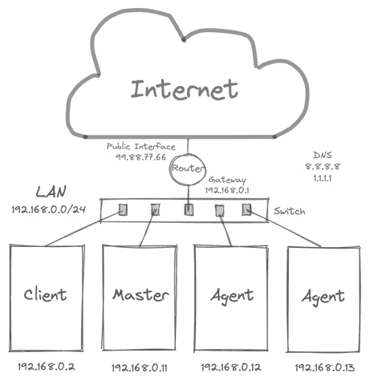
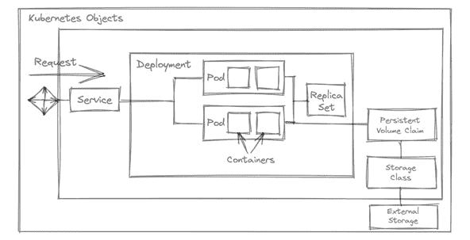
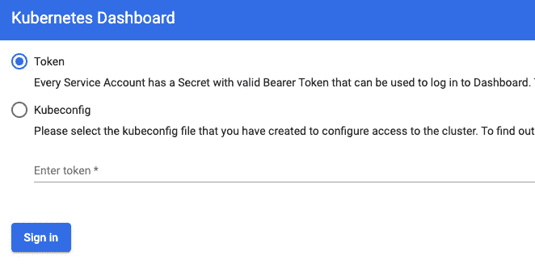

# 5

# K3s 家庭实验室用于边缘计算实验

到目前为止，我们已经探讨了创建自己的边缘计算集群的基本主题。前几章介绍了如何配置和安装 K3s 集群。在家中构建小型和大型解决方案涉及到实验。本章中，我们将开始构建一个简单但真实的集群，使用之前章节中获得的知识。我们将这个环境称为 K3s 家庭实验室。创建该集群后，我们将部署一个简单的应用程序。我们将使用这种方法作为快速启动使用 Kubernetes 与集群的方式。在本章的最后部分，我们将使用 Kubernetes 仪表板作为管理 Kubernetes 集群的简单 UI。

在本章中，我们将涵盖以下主要主题：

+   在本地网络上安装多节点 K3s 集群

+   使用`kubectl`部署你的第一个应用程序

+   使用 YAML 文件部署简单的 NGINX 服务器

+   为你的应用程序添加持久性

+   部署 Kubernetes 仪表板

# 技术要求

在本章中，你需要以下硬件来创建你的 K3s 家庭实验室，用于边缘计算应用或实验：

+   两个或更多的 Raspberry Pi 4 B 模型，至少 4GB RAM 和 32GB microSD 卡，Ubuntu 版本 20.04 或更高版本。推荐使用 SanDisk Extreme microSDHC 32 GB UHS-1 A1 V30 或类似的 microSD 卡。

+   以太网电缆，用于连接你的 Raspberry。

+   一个以太网互联网连接，Raspberry 的**动态主机配置协议**（**DHCP**）已启用。

+   一个交换机，用来将你的 Raspberry 连接到本地网络。

有了这些硬件，我们就可以开始构建 K3s 家庭实验室了。那么，让我们开始吧。

欲了解更多细节和代码片段，请查看 GitHub 上的这个资源：[`github.com/PacktPublishing/Edge-Computing-Systems-with-Kubernetes/tree/main/ch5`](https://github.com/PacktPublishing/Edge-Computing-Systems-with-Kubernetes/tree/main/ch5)

# 在本地网络上安装多节点 K3s 集群

在开始创建这个家庭实验室之前，让我们了解一下我们将要使用的网络拓扑。以下图示中的每个组件都将在家庭实验室中使用：



](img/B16945_Figure_5.1.jpg)

图 5.1 – 家庭实验室架构

这是对图中每个组件的简要说明：

+   `192.168.0.0/24`。

+   **交换机**：交换机也是一种网络连接设备，用来连接同一网络中的各种设备。

+   **路由器**：路由器连接跨多个网络的设备。通常，家庭路由器是混合设备，可以让本地计算机访问互联网。它还具有小型交换机功能，允许本地计算机连接，通过无线或以太网端口连接有线设备。

+   **公共接口**：这是你路由器的接口，具有公共 IP 地址。

+   **网关**：这是一个 IP 地址，用作你私人网络中的网关。

+   `8.8.8.8`和`1.1.1.1`。

+   **Master**：这是您 K3s 集群的主节点。

+   **Agent**：这是在 K3s 集群中作为工作节点的代理节点。

+   `kubectl`命令。

现在—简要解释一下这些组件如何相互作用。所有您的机器将使用`192.168.0.0/24`网络；在这种情况下，假设您的客户端使用`192.168.0.2` IP。通过配置文件或参数安装集群时，您可以为节点选择前述网络中的 IP 范围。在此示例中，主节点使用`192.168.0.11` IP，而您的代理节点使用`192.168.0.12`和`192.168.0.13` IP 地址。请记住，您的配置已为节点设置了静态 IP 私有地址，以防止 IP 地址发生变化时出现节点错误。我们假设节点使用从`192.168.0.11`到`192.168.0.13`的 IP 地址。我们将使用`192.168.0.240`到`192.168.0.250`的 IP 地址范围作为负载均衡器。这只是一个简单的示例，说明如何为您的集群组织 IP。

我们假设您的路由器位于`192.168.0.0/24`网络中。如前所述，家庭路由器具有某些交换机功能，可以通过配置在路由器内的 DHCP 服务自动分配动态 IP 地址，但这对您的节点并不健康。这是使用静态 IP 地址的主要原因。我们假设使用一些公共 IP 作为示例。我们假设将使用`8.8.8.8`和`1.1.1.1`作为 DNS 服务器。

重要提示

所有这些 IP 范围可能会发生变化，具体取决于您的互联网提供商或您使用的路由器设备。我们设置这些值是为了提供如何为您的集群组织网络的示例。

要创建您的家庭实验室，我们需要完成以下任务：

1.  在您的 Raspberry 设备上安装 Ubuntu 镜像。

1.  配置您的设备以运行 K3s 安装程序。

1.  配置 K3s 主节点。

1.  配置 K3s 代理节点。

1.  安装**MetalLB**作为负载均衡服务。

1.  安装**Longhorn**作为默认存储类。

1.  在外部客户端中配置`kubectl`以访问集群。

1.  使用`kubectl`和 YAML 文件部署您的第一个应用。

1.  安装并配置**Lens**来管理您的集群。

所以，现在让我们快速回顾一下概念，从如何在您的设备上安装 Ubuntu 开始。

## 在您的 Raspberry 设备上安装 Ubuntu 镜像。

在本节中，我们将安装一个 Ubuntu 镜像到 Raspberry 设备上。您可以跳过本节或参考之前的章节获取更多信息。简要总结，您可以按照以下步骤在 Raspberry 设备上安装 Ubuntu：

1.  打开*Raspberry Pi Imager*。

1.  点击**CHOOSE OS**按钮，选择位于**Other general purpose OS** | **Ubuntu**菜单中的 Ubuntu Server 20.04 64 位 ARM64 操作系统。

1.  然后，插入您的 microSD 卡（您可能需要购买一个适配器来读取 microSD 卡）；当您选择**CHOOSE STORAGE**按钮时，您的设备将会出现。

1.  点击**WRITE**按钮。

1.  接受写入设备的请求；然后，Raspberry Pi Imager 会要求你输入用户名和密码，以继续写入 microSD 卡。

1.  等待写入和验证过程完成。

1.  弹出你的 microSD 卡。

1.  将 microSD 卡插入 Raspberry Pi 并启动它。

1.  对于每个将加入集群的 Raspberry Pi 设备，重复这些步骤。

现在，让我们继续配置设备的网络设置和容器支持。

## 配置你的 Raspberry Pi 以运行 K3s 安装程序

在这一部分，我们将配置网络设置，包括静态 IP 地址、DNS、主机名和 hosts 文件，最后激活对 **containerd** 所需的 cgroups 支持。现在，按照以下步骤执行最终设置，在为节点安装 K3s 之前；记住，你可以根据自己的网络自定义这些配置：

1.  打开设备。

1.  当 Ubuntu 要求你输入用户名和密码时，输入用户名和默认密码 `ubuntu`，这是第一次登录时的默认密码。

1.  现在，Ubuntu 会要求你更改默认密码；让我们使用 `k3s123-` 作为密码。

1.  现在，配置网络；默认情况下，Ubuntu 使用 `cloud-init` 来配置网络。我们将通过创建 `99-disable-network-config.cfg` 文件来禁用它，使用以下命令和内容：

    ```
    $ sudo nano /etc/cloud/cloud.cfg.d/99-disable-network-config.cfg
    ```

这里是一个内容示例：

```
network: {config: disabled}
```

1.  如果你执行 `ifconfig`，你会看到你的设备是 `eth0`，但它可能被命名为 `es3` 或类似名称，因此我们需要通过以下命令修改 `50-cloud-init` 文件：

    ```
    $ sudo nano /etc/netplan/50-cloud-init.yaml
    ```

1.  然后，修改文件内容，应该类似如下所示：

    ```
    network:
      version: 2
      renderer: networkd
      ethernets:
        eth0:
          dhcp4: no
          addresses:
            - 192.168.0.11/24
          gateway4: 192.168.0.1
          nameservers:
              addresses: [8.8.8.8, 1.1.1.1]
    ```

1.  现在，应用配置并重启设备，查看操作系统（**OS**）启动时是否设置了 IP 地址。为此，执行以下命令：

    ```
    $ sudo netplan apply 
    ```

1.  现在，通过编辑 `/boot/firmware/cmdline.txt` 文件来配置启动时的内核参数，使用以下命令和内容：

    ```
    $ sudo nano /boot/firmware/cmdline.txt
    ```

将以下内容添加到行末：

```
cgroup_memory=1 cgroup_enable=memory
```

1.  使用 `nano` 编辑 `/etc/hostname` 文件，将主节点的名称设置为 `master`。将代理节点的主机名设置为 `node01` 和 `node02`；使用 `nano` 编辑文件：

    ```
    $ sudo nano /etc/hostname
    ```

这里是一个内容示例：

```
master
```

1.  编辑 `/etc/hosts` 文件，添加主机名；至少需要有如下所示的一行：

    ```
    $ sudo nano /etc/hosts
    ```

这里是一个内容示例：

```
127.0.0.1 localhost master
```

重要提示

你也可以使用 `master.local` 代替 `master`，以遵循 **互联网工程任务组**（**IETF**）的本地网络命名规范。这也有助于零配置 **多播 DNS**（**mDNS**）设置。更多信息，请查看此链接：[`www.zeroconf.org`](http://www.zeroconf.org)。

现在，重启你的设备：

```
$ sudo reboot
```

该配置是为了准备你的设备以配置 K3s 主节点或代理节点。你也可以按照 IETF 的本地网络设计建议进行操作。在下一部分，你将看到如何为你的主节点安装 K3s。

## 配置 K3s 主节点

本节介绍如何为 K3s 集群安装主节点；为此，您需要按照以下步骤进行操作：

1.  打开您的设备，并使用`ubuntu`用户登录。

1.  使用`MASTER_IP`为`192.168.0.11`，按照*图 5.1*中所示运行以下命令，安装您的主节点，适用于 K3s 集群：

    ```
    $ MASTER_IP=<YOUR_PRIVATE_IP>
    $ curl -sfL https://get.k3s.io | INSTALL_K3S_EXEC="--write-kubeconfig-mode 644 --no-deploy traefik --disable traefik --tls-san "$MASTER_IP" --node-external-ip "$MASTER_IP" --disable servicelb" sh -s -
    ```

现在，我们已经安装了主节点。该节点的 IP 地址为`192.168.0.11`。接下来，让我们在下一节中将代理节点添加到集群中。

## 配置 K3s 代理节点

本节解释如何通过重复此部分两次来完成初始集群图的配置，以配置两个代理节点。代理节点将使用`192.168.0.12`和`192.168.0.13`的 IP 地址。按照以下步骤配置每个代理节点：

1.  登录到您的主节点：

    ```
    $ ssh ubuntu@<MASTER_IP>
    ```

我们将提取服务节点令牌以连接代理节点。在这种情况下，主节点的 IP 地址为`192.168.0.11`。

1.  通过运行以下命令提取并复制令牌，将您的代理节点加入集群：

    ```
    $ sudo cat /var/lib/rancher/k3s/server/node-token
    ```

1.  从您的主节点注销。现在，您已获得令牌，可以将其他节点加入到集群中。

为了让每个代理节点加入集群，按照以下步骤操作（简单方法）：

1.  登录到您要添加到集群中的代理节点。在这种情况下，`AGENT_IP`将是`192.168.0.12`或`192.168.0.13`：

    ```
    $ ssh ubuntu@<AGENT_IP>
    ```

1.  设置一个环境变量，其中包含主节点生成的令牌：

    ```
    $ export TOKEN=<YOUR_MASTER_TOKEN>
    ```

1.  使用以下命令注册您的节点；在这种情况下，`MASTER_IP`为`192.168.0.11`：

    ```
    $ curl -sfL https://get.k3s.io | sh -s - agent --server https://MASTER_IP:6443 --token ${TOKEN} 
    ```

从您的代理节点退出：

```
$ exit
```

现在，我们已经配置了代理节点。让我们安装 MetalLB 以开始为我们的应用程序使用负载均衡器。

## 安装 MetalLB 作为负载均衡服务

MetalLB 是一个裸金属负载均衡器，可以在使用常规 Kubernetes 集群的负载均衡服务时提供帮助，具有为裸金属设计的网络功能，如 IP 地址分配。因此，让我们通过以下步骤安装 MetalLB 并开始：

1.  使用官方清单创建一个名为`metallb-system`的 MetalLB 命名空间，执行以下命令：

    ```
    $ kubectl apply -f https://raw.githubusercontent.com/metallb/metallb/v0.10.2/manifests/namespace.yaml
    ```

1.  在运行安装 MetalLB 的命令之前，您必须在`metallb-system`命名空间中创建一个名为`metallb-config`的`ConfigMap`资源。我们将这个文件命名为`config.yaml`，并包含以下内容：

    ```
    apiVersion: v1 
    kind: ConfigMap 
    metadata: 
      namespace: metallb-system 
      name: config 
    data: 
      config: | 
        address-pools: 
        - name: default 
          protocol: layer2 
          addresses: 
          - 192.168.0.240-192.168.0.250
    ```

1.  现在，创建`ConfigMap`，执行以下命令：

    ```
    $ kubectl apply -f config.yaml
    ```

1.  使用官方清单安装 MetalLB，执行以下命令：

    ```
    $ kubectl apply -f https://raw.githubusercontent.com/metallb/metallb/v0.10.2/manifests/metallb.yaml
    ```

现在，您已经安装了 MetalLB。您可以开始安装使用负载均衡器的服务。这些负载均衡器在许多 Kubernetes 软件中很常见。现在，是时候为我们的存储添加 Longhorn 了。

## 安装启用 ReadWriteMany 模式的 Longhorn

K3s 包含基本的存储支持。有时，在安装软件时，这些存储可能会导致错误。为了防止这种情况，你需要使用一个与 K3s 默认存储驱动程序不同的存储驱动程序。在这种情况下，你可以使用 Longhorn。使用 Longhorn，你可以安装寻找常规存储驱动程序的 Kubernetes 软件。接下来，让我们按照以下步骤安装 Longhorn：

1.  登录到你的 **虚拟机** (**VM**) 或设备：

    ```
    $ ssh ubuntu@NODE_IP
    ```

1.  如果你想在集群中每个安装了 Ubuntu 的虚拟机上安装 `nfs-common`，请执行以下命令：

    ```
    $ sudo apt install -y nfs-common
    ```

1.  应用官方的 Longhorn 清单，如下所示：

    ```
    $ kubectl apply -f https://raw.githubusercontent.com/longhorn/longhorn/v1.1.2/deploy/longhorn.yaml
    ```

现在，你已经安装并运行了 Longhorn。接下来，让我们了解如何在个人计算机上配置 `kubectl` 来管理你的 K3s。

## 提取 K3s kubeconfig 文件以访问你的集群

现在，是时候配置 `kubeconfig` 文件，以便通过 `kubectl` 命令从你的计算机访问 K3s 集群了。要配置外部访问你的 K3s 集群，按照以下步骤操作：

1.  根据 Kubernetes 官方文档的说明安装 `kubectl`（[`kubernetes.io/docs`](https://kubernetes.io/docs)）；在此案例中，我们将使用针对 Macintosh 的安装说明：

    ```
    $ curl -LO "https://dl.k8s.io/release/$(curl -L -s https://dl.k8s.io/release/stable.txt)/bin/darwin/amd64/kubectl"
    $ chmod +x ./kubectl
    $ sudo mv ./kubectl /usr/local/bin/kubectl
    $ sudo chown root: /usr/local/bin/kubectl
    ```

或者你也可以通过 `brew` 在 macOS 上安装 `kubectl`，使用以下命令：

```
$ brew install kubectl 
```

对于其他自定义安装，例如针对 Apple 新硅处理器、Linux 或 Windows 的 `kubectl`，请访问 Kubernetes 官方文档：[`kubernetes.io/docs/tasks/tools/install-kubectl-macos`](https://kubernetes.io/docs/tasks/tools/install-kubectl-macos)。

1.  从主节点，将 `/etc/rancher/k3s/k3s.yaml` 文件中的内容复制到本地的 `~/.kube/config` 文件。

1.  使用以下命令更改文件的权限：

    ```
    $ chmod 0400 ~/.kube/config
    ```

1.  将服务器值中的部分 `127.0.0.1` 更改为主节点的 `MASTER_IP` 地址；在此情况下，它将是 `192.168.0.11`：

    ```
    server: https://127.0.0.1:6443
    ```

这将更改为以下内容：

```
server: https://MASTER_IP:6443
```

重要提示

在将 Rancher `kubeconfig` 文件复制到计算机之前，记得先安装 `kubectl`。请记住，`k3s.yaml` 文件的内容必须存储在 `~/.kube/config` 中，并且需要设置 `0400` 权限。有关如何安装 `kubectl` 命令的信息，请访问 [`kubernetes.io/docs/tasks/tools/install-kubectl-macos`](https://kubernetes.io/docs/tasks/tools/install-kubectl-macos)。

现在，我们准备好使用集群了。在下一节中，我们将使用 `kubectl` 和 YAML 文件，结合 MetalLB 和 Longhorn 部署一个基础应用程序。让我们开始在下一节中使用 `kubectl` 部署应用程序吧。

# 使用 kubectl 部署你的第一个应用程序

本节介绍了 Kubernetes 的基础知识。我们首先将使用 `kubectl` 部署一个应用程序。但在此之前，让我简要介绍一下 Kubernetes 如何与其基本对象一起工作。

## 基本 Kubernetes 对象

Kubernetes 通过使用容器的对象来为你的应用提供不同的功能。Kubernetes 的目标是编排你的容器。Kubernetes 有两种创建对象的方式。一种是通过命令式命令——在 Kubernetes 中使用`kubectl`命令。另一种是通过声明式文件，其中定义了对象的状态，Kubernetes 确保对象在其生命周期中保持这个状态。



图 5.2 – Kubernetes 对象

这个图示表示了一些基本对象是如何相互作用来部署和管理应用程序的。接下来，我们来解释这些对象：

+   **Pod**包含一个或多个容器，你的应用程序就在其中；Pod 中的所有容器共享相同的网络、内存和 CPU。

+   **ReplicaSet**控制 Pod 的数量保持一致。

+   **Deployment**是一个高级的**ReplicaSet**对象，不仅控制 Pod 的数量和版本，还控制 Pod 的变化，提供回滚的方式。

+   **Service**是一种暴露你的服务的方式。服务有不同的类型。**NodePort**在所有节点上开放一个随机端口，**ClusterIP**创建一个 DNS，你可以用它来与 Pod 通信，或者与其他 Pod 或部署进行交互，**LoadBalancer**则创建一个专用端点，将你的应用发布到外部。

+   **Persistent Volume Claim**是负责请求持久存储并创建有状态部署的对象。

+   **Storage Class**是定义如何为应用程序请求存储的对象。

通过这些基本概念，我们来看看如何实际部署，以了解每个组件是如何工作的。在接下来的部分，我们将使用`kubectl`部署一个简单的 NGINX 服务器。

## 使用 kubectl 部署一个简单的 NGINX 服务器

在本节中，我们将使用`kubectl`一步步部署一个 NGINX 服务器。请按照以下步骤操作：

1.  创建一个使用`nginx`镜像的 Pod：

    ```
    $ kubectl run myserver --image=nginx --restart=Never
    ```

1.  为这个 Pod 创建一个`LoadBalancer`类型的服务，用于暴露和访问 NGINX Pod：

    ```
    $ kubectl expose pod/myserver --port=8001 --target-port=80 –type=LoadBalancer
    ```

1.  使用以下命令将 IP 地址分配给你的负载均衡器：

    ```
    $ IP_SERVICE=$(kubectl get svc mywebserver --output jsonpath='{.status.loadBalancer.ingress[0].ip}')
    ```

1.  使用浏览器或以下命令访问下一个 URL：

    ```
    $ curl IP_SERVICE:8001
    ```

现在，你的 NGINX 服务已启动并运行。接下来，让我们部署一个**Redis**数据库，你可以在下一节中访问它来存储数据。

## 使用 Pods 部署 Redis NoSQL 数据库

现在，我们将部署一个 Redis NoSQL 键值数据库，你可以访问它来存储数据。我们选择 Redis 作为一个基础示例，因为它快速且易于使用。接下来，让我们通过以下命令部署 Redis：

1.  创建一个使用`redis`镜像的 Pod：

    ```
    $ kubectl run myredis --image=redis --restart=Never
    ```

1.  创建一个`ClusterIP`服务，你可以使用该服务的名称连接到 Redis：

    ```
    $ kubectl expose pod myredis --port=6379 --type=ClusterIP
    ```

1.  使用以下命令创建一个`ubuntu`客户端：

    ```
    $ kubectl run client -it --rm --image=ubuntu:18.04 -- bash
    ```

1.  现在，你已进入客户端，让我们使用以下命令安装 Redis 客户端，以便连接到 Redis pods：

    ```
    root@client# apt-get update;apt-get install -y redis-tools
    ```

1.  使用以下命令存储值为 `1` 的变量，并从客户端获取该值：

    ```
    root@client# redis-cli -h myredis set a 1
    root@client# redis-cli –h myredis get a
    ```

最后一条命令返回 `a` 变量的值，该值为 `1`。

1.  输入 `exit` 然后按 *Enter* 键退出客户端。由于 `--rm` 参数，客户端会被自动删除。

1.  现在，让我们通过使用 `NodePort` 来暴露 Redis，作为如何使用节点的 IP 暴露 pod 的示例：

    ```
    $ kubectl expose pod myredis --name=myredis-nodeport --port=6379 --type=NodePort
    ```

现在，你可以使用部署 Redis 的主机的 IP 来访问你的 Redis 数据库。

你已经完成了一个简单数据库的安装——在本例中是 Redis。接下来，让我们在下一节中探索部署对象和存储。

## 使用部署部署和扩展 NGINX 服务器

使用部署的一个优势是，你可以在版本或配置发生变化时管理部署的变更。让我们部署一个简单的 NGINX 服务器，扩展部署，修改镜像，然后执行回滚，来展示部署的强大功能。按照以下步骤部署 NGINX 服务器：

1.  使用 `nginx` 镜像创建一个两个副本的部署：

    ```
    $ kubectl create deployment mywebserver --image=nginx --replicas=2
    ```

1.  创建一个 `LoadBalancer` 服务来暴露你的部署：

    ```
    $ kubectl expose deployment mywebserver --port=8002 --target-port=80 --type=LoadBalancer
    ```

1.  创建 `mywebserver` 的 IP：

    ```
    $ IP_SERVICE=$(kubectl get svc mywebserver --output jsonpath='{.status.loadBalancer.ingress[0].ip}')
    ```

1.  使用 `curl` 访问 web 服务器：

    ```
    $ curl $IP_SERVICE:8002
    ```

1.  将 `mywebserver` 扩展为 `0` 个副本：

    ```
    $ kubectl scale deploy/mywebserver --replicas=0
    ```

1.  再次尝试访问 `mywebserver`：

    ```
    $ curl $IP_SERVICE:8002
    ```

1.  将 `mywebserver` 扩展为两个副本，并等待直到部署准备好；你可以使用以下命令检查：

    ```
    $ kubectl scale deploy/mywebserver --replicas=2
    $ kubectl rollout status deploy/mywebserver 
    ```

1.  再次尝试访问 `mywebserver`：

    ```
    $ curl $IP_SERVICE:8002
    ```

1.  让我们更改部署中的 `nginx` 版本，使用错误的版本：

    ```
    $ kubectl set image deployment/mywebserver nginx=nginx:1.16.1.x
    ```

1.  检查对象描述中的更改：

    ```
    $ kubectl describe deployment mywebserver | grep -i image
    ```

1.  检查 `mywebserver` 部署的当前 pod 状态：

    ```
    $ kubectl get pods
    ```

你会看到一些来自 `mywebserver` 的错误 pods。

1.  让我们回滚到之前的版本：

    ```
    $ kubectl rollout undo deploy/mywebserver
    ```

1.  检查 `mywebserver` 部署的当前 pod 状态：

    ```
    $ kubectl get pods
    ```

你会发现错误的 pods 已经消失，因为你回到了部署所使用的之前的镜像——在这种情况下，是正确的镜像名称。

现在，你已经使用部署对象部署了应用程序。让我们用类似的方法使用 YAML 文件并增加一些持久性。为此，我们进入下一节。

# 使用 YAML 文件部署一个简单的 NGINX 服务器

此时，我们的示例不存储数据，对象是使用命令式命令创建的。要使用声明式文件，你可以使用 `kubectl` 命令生成文件。记住，在部署应用时，可以使用 pods 或 deployments——只需选择其中一种方式。首先，让我们使用 YAML 文件创建一个 NGINX pod。

## 使用 Pod 部署 NGINX 服务器

现在，让我们使用 YAML 文件创建一个 NGINX pod。按照以下步骤操作：

1.  如果你想使用 pods，你可以使用下一个 YAML 文件。要生成文件，使用以下命令：

    ```
    $ kubectl run nginx --image=nginx --dry-run –o yaml > nginx-pod.yaml
    ```

`nginx-pod.yaml` 文件将是这样的：

```
apiVersion: v1
kind: Pod
metadata:
  name: nginx
  labels:
    name: nginx
spec:
  containers:
  - name: nginx
    image: nginx
    ports:
      - containerPort: 80
```

1.  使用以下命令应用生成的文件：

    ```
    $ kubectl create -f nginx-pod.yaml
    ```

让我们继续在下一节中创建一个 NGINX 部署。

## 使用部署来部署一个 NGINX 服务器

因此，让我们开始使用 YAML 文件创建一个 NGINX 服务器，使用部署。要做到这一点，请按照以下步骤操作：

1.  使用以下命令生成部署的 YAML 文件：

    ```
    $ kubectl create deployment nginx --image=nginx --replicas=2 --dry-run –o yaml > nginx-deployment.yaml
    ```

文件 `nginx-deployment.yaml` 将如下所示：

```
apiVersion: apps/v1
kind: Deployment
metadata:
  labels:
    app: nginx
  name: nginx
spec:
  replicas: 2
  selector:
    matchLabels:
      app: nginx
  template:
    metadata:
      labels:
        app: nginx
    spec:
      containers:
      - image: nginx
        name: nginx
```

1.  使用以下命令应用生成的文件：

    ```
    $ kubectl create -f nginx-deployment.yaml
    ```

现在我们已经学会了如何在 Kubernetes 中创建 pod 和部署，让我们继续下一节，使用 YAML 文件来公开这些对象的服务。

## 使用 ClusterIP 服务和 YAML 文件公开您的 pods

要与其他应用程序通信您的 pod 或部署，您可能需要一个 DNS 记录。`ClusterIP` 服务类型为您的 pod 或部署创建一个 DNS A 记录。使用此 DNS，集群中的其他对象可以访问您的应用程序。因此，让我们为您的应用程序创建一个 `ClusterIP` 服务，按照以下步骤进行：

1.  要使用 YAML 文件公开您的应用程序，请生成 `ClusterIP` 服务类型的 YAML 文件：

    ```
    $ kubectl expose pod/nginx --type=ClusterIP --port=80  --target-port=8001 --dry-run –o yaml > nginx-clusterip.yaml
    ```

文件 `nginx-service.yaml` 将如下所示：

```
apiVersion: v1
kind: Service
metadata:
  creationTimestamp: null
  labels:
    app: nginx
  name: nginx
spec:
  ports:
  - port: 80
    protocol: TCP
    targetPort: 8001
  selector:
    app: nginx
  type: ClusterIP
```

1.  使用以下命令应用生成的文件：

    ```
    $ kubectl create -f nginx-pod.yaml
    ```

现在您已经学会了如何使用 YAML 文件创建一个 `ClusterIP` 服务，让我们继续在下一节为您的应用程序创建一个 `NodePort` 服务。

## 使用 NodePort 服务和 YAML 文件公开您的 pods

要为先前创建的 pod 创建一个 NodePort 服务，请按照以下步骤操作：

1.  对于 `NodePort`，使用以下命令：

    ```
    kubectl expose pod/nginx --type=NodePort --port=80 --target-port=8001 --dry-run -o yaml > nginx-nodeport.yaml
    ```

文件 `nginx-nodeport.yaml` 将如下所示：

```
apiVersion: v1
kind: Service
metadata:
  labels:
    app: nginx
  name: nginx
spec:
  ports:
  - port: 80
    protocol: TCP
    targetPort: 8001
  selector:
    app: nginx
  type: NodePort
```

1.  使用下一个命令应用生成的文件：

    ```
    kubectl create -f nginx-pod.yaml
    ```

现在您已经学会了如何为您的应用程序中的 pod 创建一个 `NodePort` 服务，现在是时候在下一节学习如何在 `LoadBalancer` 服务中使用了。

## 使用 YAML 文件公开您的 pods，使用一个 LoadBalancer 服务

要创建一个 `LoadBalancer` 服务以公开您 pod 中的应用程序，请按照以下步骤操作：

1.  对于 `LoadBalancer`，使用下一个命令：

    ```
    $ kubectl expose pod/nginx --type=LoadBalancer --port=80 -target-port=8001 --dry-run -o yaml > nginx-lb.yaml
    ```

生成的 `nginx-lb.yaml` 文件将如下所示：

```
apiVersion: v1
kind: Service
metadata:
  labels:
    app: nginx
  name: nginx
spec:
  ports:
  - port: 80
    protocol: TCP
    targetPort: 8001
  selector:
    app: nginx
  type: LoadBalancer
```

1.  使用下一个命令应用生成的文件：

    ```
    $ kubectl create -f nginx-pod.yaml
    ```

您已经学会了如何创建一个 `LoadBalancer` 服务。有了这个，我们已经涵盖了 Kubernetes 中的所有基本服务。现在，我们准备学习如何创建有状态的应用程序。让我们继续下一节，为您的应用程序添加持久性。

# 为您的应用程序添加持久性

现在是时候为您的应用程序添加存储了；我们将使用 Longhorn 安装的存储类为您的应用程序提供持久性。在本节中，我们将探讨使用持久卷的两个示例。在本书的这一部分中，我们将讨论持久卷和为 Pod 创建存储的过程。但首先，我们需要一个持久卷声明定义来配置此存储。

## 创建一个带有存储卷的 NGINX pod

要创建使用 Longhorn 存储类的存储卷的 NGINX 应用程序，请按照以下步骤操作：

1.  创建`pvc.yaml`文件：

    ```
    apiVersion: v1
    kind: PersistentVolumeClaim
    metadata:
      name: longhorn-volv-pvc
    spec:
      accessModes:
        - ReadWriteMany
      storageClassName: longhorn
      resources:
        requests:
          storage: 2Gi
    ```

1.  应用`pvc.yaml` YAML 文件：

    ```
    $ kubectl create -f pvc.yaml
    ```

现在，是时候使用这个 PVC 来创建一个使用 Longhorn 存储类的 Pod 了。请按照以下步骤操作：

1.  创建并应用`pod.yaml`文件，使用先前创建的 PVC 来创建 Pod：

    ```
    apiVersion: v1
    kind: Pod
    metadata:
      name: volume-test
      namespace: default
    spec:
      containers:
      - name: volume-test
        image: nginx:stable-alpine
        imagePullPolicy: IfNotPresent
        volumeMounts:
        - name: volv
          mountPath: /data
        ports:
        - containerPort: 80
      volumes:
      - name: volv
        persistentVolumeClaim:
          claimName: longhorn-volv-pvc
    ```

这个示例已经创建了一个使用持久卷和 Longhorn 存储类的 Pod。接下来，我们继续进行第二个示例，展示如何使用存储卷创建一个数据库。

## 使用持久卷创建数据库

现在，是时候为数据库使用持久卷了；在这个示例中，您将学习如何创建一个带有持久卷的 Redis 数据库。让我们按照以下步骤开始：

1.  创建`redis.yaml`文件，以创建一个使用之前`longhorn-volv-pvc` PVC 的 Pod：

    ```
    apiVersion: v1
    kind: Pod
    metadata:
      name: redis
    spec:
      containers:
      - name: redis
        image: redis
        volumeMounts:
        - name: redis-storage
          mountPath: /data/redis
      volumes:
      - name: redis-storage
        persistentVolumeClaim:
          claimName: longhorn-volv-pvc
    ```

1.  应用`pod.yaml` YAML 文件来创建 Pod：

    ```
    $ kubectl create -f pod.yaml
    ```

1.  检查并应用`pod.yaml` YAML 文件来创建 Pod：

    ```
    $ kubectl create -f pod.yaml
    ```

1.  应用`pod.yaml` YAML 文件来创建 Pod：

    ```
    $ kubectl create -f pod.yaml
    ```

排查您的部署问题

请记住，您可以使用`kubectl logs`命令来排查您的部署问题。欲了解更多信息，请访问下一个链接：[`kubernetes.io/docs/tasks/debug-application-cluster/debug-running-pod/`](https://kubernetes.io/docs/tasks/debug-application-cluster/debug-running-pod/)。

现在，您的 Redis 数据库正在运行，并使用持久卷来防止数据丢失。在最后一部分，我们将探索如何安装一个简单的 Kubernetes 仪表盘，使用 UI 来管理您的集群。

# 部署 Kubernetes 仪表盘

现在，是时候安装 Kubernetes 仪表盘了。接下来的步骤基于官方 K3s 文档。要开始安装仪表盘，请按照以下步骤操作：

1.  使用以下命令安装仪表盘：

    ```
    $ GITHUB_URL=https://github.com/kubernetes/dashboard/releases
    $ VERSION_KUBE_DASHBOARD=$(curl -w '%{url_effective}' -I -L -s -S ${GITHUB_URL}/latest -o /dev/null | sed -e 's|.*/||')
    $ sudo k3s kubectl create -f https://raw.githubusercontent.com/kubernetes/dashboard/${VERSION_KUBE_DASHBOARD}/aio/deploy/recommended.yaml
    ```

这将安装仪表盘，但您需要配置如何访问此仪表盘。

1.  创建`dashboard-admin-user.yaml`文件，以创建一个提供访问仪表盘的服务帐户。该文件的内容如下：

    ```
    apiVersion: v1
    kind: ServiceAccount
    metadata:
      name: admin-user
      namespace: kubernetes-dashboard
    ```

1.  现在创建`dashboard-admin-user-role.yaml`文件。该文件的内容如下：

    ```
    apiVersion: rbac.authorization.k8s.io/v1
    kind: ClusterRoleBinding
    metadata:
      name: admin-user
    roleRef:
      apiGroup: rbac.authorization.k8s.io
      kind: ClusterRole
      name: cluster-admin
    subjects:
    - kind: ServiceAccount
      name: admin-user
      namespace: kubernetes-dashboard
    ```

1.  现在，使用以下命令应用 YAML 文件：

    ```
    $ kubectl create -f dashboard-admin-user.yml -f dashboard-admin-user-role.yml
    ```

1.  获取用于访问仪表盘的服务帐户中的令牌：

    ```
    $ kubectl -n kubernetes-dashboard describe secret admin-user-token | grep '^token'
    ```

仅复制令牌内容。

1.  使用`kubectl proxy`在本地暴露 Kubernetes API，使用以下命令：

    ```
    $ sudo kubectl proxy
    ```

1.  使用以下 URL 访问您的浏览器：

`http://localhost:8001/api/v1/namespaces/kubernetes-dashboard/services/https:kubernetes-dashboard:/proxy/`

使用您获取的管理员用户持有令牌进行登录。选择**令牌**选项并输入令牌。您将看到如下屏幕：



图 5.3 – Kubernetes 仪表盘登录界面

点击**登录**按钮后，您将看到仪表盘。探索不同的菜单查看对象的状态，或者点击右下角的加号图标，使用 YAML 文件创建对象：

![图 5.4 – Kubernetes Dashboard 显示 CPU 和内存使用情况]

](img/B16945_Figure_5.4.jpg)

图 5.4 – Kubernetes Dashboard 显示 CPU 和内存使用情况

我们现在已经完成了所有必要的概念，简要介绍了如何在 Kubernetes 中使用 K3s 使用基本对象。

# 摘要

在本章中，我们学习了如何为我们的家庭实验室使用 Raspberry Pi 设备设置 K3s 集群。我们还介绍了如何使用基本的 Kubernetes 对象来部署应用程序。我们使用 `kubectl` 命令以命令式方式部署了示例应用程序。我们也使用 YAML 文件部署了示例应用程序。在本章的最后，我们介绍了如何安装 Kubernetes Dashboard 来管理您的集群。在下一章中，我们将继续为这个部署添加更多内容；我们将使用 ingress 控制器在边缘部署应用程序。

# 问题

这里有一些问题来验证您的新知识：

1.  我需要创建哪些基本的 Kubernetes 对象才能创建应用程序？

1.  我如何为我的家庭实验室安装 K3s 集群？

1.  我如何使用 `kubectl` 创建我的应用程序？

1.  我如何使用 YAML 文件创建我的应用程序？

1.  我如何使用持久化存储卷？

1.  我如何排查我的应用程序问题？

# 进一步阅读

您可以参考以下文献，了解本章涵盖的更多信息：

+   K3s 安装选项以向配置文件添加自定义参数：[`rancher.com/docs/k3s/latest/en/installation/install-options`](https://rancher.com/docs/k3s/latest/en/installation/install-options)

+   Longhorn 官方页面：[`longhorn.io`](https://longhorn.io)

+   MetalLB 官方页面：[`metallb.universe.tf`](https://metallb.universe.tf)

+   官方 Kubernetes 文档：[`kubernetes.io/docs`](https://kubernetes.io/docs)

+   Kubernetes Dashboard 安装指南：[`rancher.com/docs/k3s/latest/en/installation/kube-dashboard`](https://rancher.com/docs/k3s/latest/en/installation/kube-dashboard)

+   使用 Helm 安装 Kubernetes Dashboard：[`artifacthub.io/packages/helm/k8s-dashboard/kubernetes-dashboard`](https://artifacthub.io/packages/helm/k8s-dashboard/kubernetes-dashboard)

# 第二部分：边缘的云原生应用程序

在这里，您将学习如何使用 GitOps、服务网格、无服务器架构、事件驱动架构以及不同类型的数据库在边缘部署应用程序。

本书的这一部分包含以下章节：

+   *第六章*，*使用 Ingress 控制器和证书暴露您的应用程序*

+   *第七章*，*使用 Flux 实现边缘应用程序的 GitOps*

+   *第八章*，*使用 Linkerd 实现可观察性和流量分割*

+   *第九章*，*使用 Knative 和 Cloud Events 构建边缘无服务器和事件驱动架构*

+   *第十章*, *边缘计算中的 SQL 与 NoSQL 数据库*
