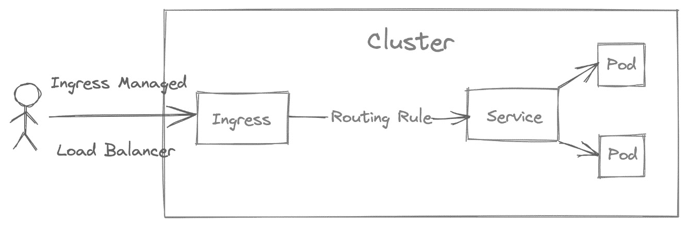

# 6

# 使用 ingress 控制器和证书暴露您的应用程序

Ingress 控制器执行由 ingress 对象定义的流量规则，并且需要将流量暴露给系统所使用的 API 或微服务。Ingress 控制器是在 Kubernetes 集群中实现的。作为将部署暴露到集群外部的一种方式，Ingress 控制器为您的部署共享一个负载均衡器，而不是为每个部署使用专用的负载均衡器。默认情况下，Kubernetes 使用 ClusterIP 服务来访问内部集群网络中的部署。为边缘计算创建应用程序涉及到根据轻量化解决方案来配置 ingress 控制器：K3s 及其默认的 ingress 控制器 **Traefik** v1，使用其他 ingress 控制器，如 **NGINX** 或 **Contour**，以及服务通信的安全加密。

本章我们将涵盖以下主要内容：

+   理解 ingress 控制器和 ingress

+   安装 Helm 以进行 ingress 控制器安装

+   安装和配置 cert-manager

+   使用 **Traefik** 暴露您的应用程序

+   使用 NGINX 暴露您的应用程序

+   故障排除您的 ingress 控制器

+   **Traefik**、**NGINX** 和 **Contour** 的优缺点

+   Ingress 控制器的提示和最佳实践

# 技术要求

在开始之前，您需要以下内容来运行本章中的示例：

+   安装了 K3s 的树莓派集群

+   配置好的 kubectl 以访问您的集群

+   已安装并配置 Helm

注意

如果您不想使用 Traefik，并且希望在集群中省略默认安装该 ingress 控制器，请在安装主节点时添加 `--no-deploy traefik --disable traefik` 标志。有关安装 K3s 集群的其他详细信息，请参考 *第三章*，*K3S 高级配置与管理*，或者访问 [`rancher.com/docs/k3s/latest/en/installation/install-options/server-config/`](https://rancher.com/docs/k3s/latest/en/installation/install-options/server-config/)。记得安装一个裸金属负载均衡器，如 MetalLB，这对于生成负载均衡服务至关重要，而负载均衡服务是安装 ingress 控制器所需的。

根据这些要求，您将尝试以不同的方式暴露您的应用程序。

有关更多细节和代码片段，请查看 GitHub 上的这个资源：[`github.com/PacktPublishing/Edge-Computing-Systems-with-Kubernetes/tree/main/ch6`](https://github.com/PacktPublishing/Edge-Computing-Systems-with-Kubernetes/tree/main/ch6)

# 理解 Ingress 控制器

Kubernetes 使用入口控制器将您的部署暴露到集群外部。入口控制器是将代理暴露到您的应用程序的适配器，而 Ingress 是使用此适配器的 Kubernetes 对象。入口控制器充当反向代理，如**NGINX**，通过 HTTP/HTTPS 协议将您的应用程序暴露到负载均衡器。该负载均衡器是将您的应用程序暴露到集群外部的终端节点，负责接收并控制应用程序的流量。这样做的好处是，您可以共享这个负载均衡器，暴露任意多的应用程序，同时使用入口控制器提供的所有功能。不同的入口控制器实现包括 NGINX、Traefik、Emissary 和 Envoy。

以*图 6.1*为参考，要暴露您的应用程序，您必须创建一个**ClusterIP**服务，为您的 Deployment 或 Pod 创建一个内部 DNS 名称。该服务会自动将流量转发到服务的不同副本，进行负载均衡。Ingress 使用在安装入口控制器时，您的入口控制器所配置的 LoadBalancer 服务。如果集群不是私有的，这个 LoadBalancer 会有一个公共 IP 地址。这个 IP 地址接收来自集群外部的流量，然后将流量转发到您的应用程序所使用的 ClusterIP 服务。在内部，Ingress 对象使用配置文件作为反向代理。例如，如果您使用的是 NGINX，Ingress 对象将使用在常规 NGINX 配置文件中使用的配置。

在 Kubernetes 的上下文中，Ingress 对象会尝试使用标签匹配与您的应用程序关联的 ClusterIP 服务。这就是 Ingress 在内部的工作方式。您可以将 Ingress 看作是 NGINX 和 Apache 为网站提供的常见虚拟主机功能。



图 6.1 – Kubernetes 中的 Ingress

基于 Kubernetes 的官方文档，创建一个入口控制器的基本 YAML 文件应如下所示：

```
apiVersion: networking.k8s.io/v1
kind: Ingress
metadata:
  name: minimal-ingress
  annotations:
    kubernetes.io/ingress.class: nginx
    nginx.ingress.kubernetes.io/rewrite-target: /
spec:
  rules:
  - http:
      paths:
      - path: /testpath
        pathType: Prefix
        backend:
          service:
            name: test
            port:
              number: 80
```

对于 Ingress 来说，最重要的部分是注解（annotations）和规范（spec）部分。注解将定义要使用的入口控制器，在本例中为 NGINX。此部分可以包含 Ingress 的附加配置，例如重写 URL 或启用身份验证等功能。此示例定义了访问您的应用程序的 `/testpath` 路由。现在，您必须使用 kubectl 应用 YAML 文件。例如，如果这个文件名为 `minimal-ingress.yaml`，您必须运行以下命令来创建 `minimal-ingress` 控制器：

```
$ kubectl apply -f minimal-ingress.yaml
```

这就是入口控制器和 Ingress 的工作原理。现在，让我们在下一节中安装 Helm，以安装入口控制器。

# 安装 Helm 以便安装入口控制器

在我们开始使用 ingress 控制器之前，我们需要安装 Helm。Helm 是 Kubernetes 的包管理器，你可以使用它来安装软件。Helm 使用 Helm Charts，包含安装和配置部署的定义。

要安装 Helm，请按照以下步骤操作：

1.  使用以下命令下载 Helm：

    ```
    $ curl -fsSL -o get_helm.sh https://raw.githubusercontent.com/helm/helm/main/scripts/get-helm-3
    ```

1.  修改权限并通过执行以下命令启动安装程序：

    ```
    $ chmod 700 get_helm.sh
    $ ./get_helm.sh
    ```

现在你已经安装了 Helm，接下来让我们在下一部分中安装 NGINX ingress 控制器。

# 安装 cert-manager

cert-manager 是你希望安装的软件，如果你想在 Kubernetes 中添加证书或证书问题作为资源类型。这些证书可以被应用程序使用，但在此特定情况下，我们将使用 cert-manager 为你的应用程序添加加密流量，使用 HTTPS 协议。

要安装 cert-manager，我们将使用 Helm。安装 Helm 时，你需要按照以下步骤操作：

1.  添加包含 cert-manager 的 Jetstack 仓库：

    ```
    $ helm repo add jetstack https://charts.jetstack.io
    ```

1.  更新本地 Helm Chart 仓库缓存。为此，请执行以下命令：

    ```
    $ helm repo update
    ```

1.  现在使用 Helm 安装 cert-manager：

    ```
    $ helm install \
    cert-manager jetstack/cert-manager \
    --namespace cert-manager \
    --create-namespace \
    --version v1.5.4 \
    --set prometheus.enabled=false \
    --set webhook.timeoutSeconds=4 \
    --set prometheus.enabled=false \
    --set installCRDs=true
    ```

这将把 cert-manager 安装到 `cert-manager` 命名空间，版本为 `1.5.4`。此 cert-manager 安装不包括 Prometheus，但包括 cert-manager **客户资源定义**（**CRDs**）并配置了在生成证书时用于 Webhook 验证的超时参数。

1.  在 cert-manager 中创建一个自签名颁发者，为你的本地域创建证书。为此，请创建 `self-signed-issuer.yaml` 文件，内容如下：

    ```
    apiVersion: cert-manager.io/v1
    kind: ClusterIssuer
    metadata:
      name: self-signed-issuer
    spec:
      selfSigned: {}
    ```

1.  现在创建一个使用 Let’s Encrypt 创建证书的颁发者，证书可以用于公共域名。为此，请创建 `letsencrypt-staging.yaml` 文件，内容如下：

    ```
    apiVersion: cert-manager.io/v1
    kind: Issuer
    metadata:
      name: letsencrypt-staging
    spec:
      acme:
        server: https://acme-staging-v02.api.letsencrypt.org/directory
        email: user@example.com
        privateKeySecretRef:
          name: letsencrypt-staging
        solvers:
        - http01:
            ingress:
              class:  nginx
    ```

这个文件假设你将使用此颁发者作为示例，在一个预发布环境中使用，但你可以根据需要自定义这个文件。

重要说明

请注意，`ClusterIssuer` 是集群范围的，而 `Issuer` 是命名空间范围的。

1.  现在应用这些文件，在预发布环境中创建自签名颁发者，使用以下命令：

    ```
    $ kubectl apply -f self-signed-issuer.yaml -f letsencrypt-staging.yaml
    ```

现在你已经安装并准备好使用 cert-manager。你还可以为你的应用程序创建基本的颁发者。如果需要的话，这部分将是为你的域配置证书的关键。因此，现在让我们开始安装第一个 ingress 控制器——NGINX。

# NGINX ingress 安装

NGINX 是 Kubernetes 上最广泛使用的 ingress 控制器。它具备你所需的所有基本和复杂配置功能，用来暴露你的应用程序。它拥有来自社区的经验和支持。它非常稳定，你仍然可以在使用 ARM 处理器的设备上使用它。

要安装 NGINX ingress 控制器，请按照以下步骤操作：

1.  创建一个命名空间来安装 NGINX ingress 控制器：

    ```
    $ kubectl create ns nginx-ingress
    ```

1.  添加包含 NGINX 入口控制器 Helm Chart 的仓库，并更新 Helm 将要使用的 Chart 仓库：

    ```
    $ helm repo add ingress-nginx https://kubernetes.github.io/ingress-nginx 
    $ helm repo update 
    ```

1.  使用以下命令安装 NGINX 入口控制器：

    ```
    $ helm install nginx-ingress ingress-nginx/ingress-nginx -n nginx-ingress
    ```

这将输出安装成功的信息。

1.  要检查`nginx-ingress`控制器是否已安装，请运行以下命令：

    ```
    $ helm list -n nginx-ingress
    ```

1.  安装`nginx-ingress`控制器后，K3s 将提供负载均衡器。在这种情况下，我们假设使用的是 MetalLB。要获取由您的入口控制器配置的负载均衡器 IP 地址，请运行以下命令：

    ```
    $ IP_LOADBALANCER=$(kubectl get svc nginx-ingress-ingress-nginx-controller --output jsonpath='{.status.loadBalancer.ingress[0].ip}' -n nginx-ingress)
    ```

这里，`IP_LOADBALANCER`变量包含入口控制器创建的负载均衡器的 IP，这是您的应用程序的端点。您可以通过运行以下命令检查该值：

```
$ echo $IP_LOADBALANCER
```

参考*第五章*中 K3s 集群的安装，*K3s 边缘计算实验室*，您将看到一个像这样的 IP：`192.168.0.240`。

1.  您可以使用该 IP 来创建 DNS 记录，将入口指向一个域名，或使用路径访问您的服务。例如，假设返回的 IP 是`192.168.0.241`，您可以在浏览器中使用 URL `http://192.168.0.240` 访问您的服务。另一个选项是使用路径来访问您的应用程序；例如，URL 会是这样：`http://192.168.0.240/myapp`。

1.  最后，如果您想卸载`nginx-ingress`，请运行以下命令：

    ```
    $ helm uninstall nginx-ingress -n nginx-ingress
    ```

既然您已经安装了 NGINX 入口控制器，接下来让我们研究一个使用此入口控制器的基本示例。

# 使用 NGINX 暴露您的应用程序

现在是时候开始使用 NGINX 作为您的入口控制器了。我们将使用 NGINX 暴露您的第一个应用程序。首先，让我们部署一个简单的应用程序。为此，请按照以下步骤操作：

1.  使用以下命令创建一个简单的`nginx`镜像部署：

    ```
    $ kubectl create deploy myapp --image=nginx
    ```

1.  为`myapp`部署创建一个 ClusterIP 服务：

    ```
    $ kubectl expose deploy myapp --type=ClusterIP --port=80
    ```

1.  使用域名`192.168.0.240.nip.io`创建 Ingress。在此示例中，我们假设入口的端点是`192.168.0.240`。这与入口控制器创建的负载均衡器的 IP 相同。当您访问浏览器时，页面`https://192.168.0.241.nip.io`将显示 NGINX 的`myapp-ingress.yaml`文件：

    ```
    apiVersion: networking.k8s.io/v1
    kind: Ingress
    metadata:
      name: myapp-ingress-tls-nginx
      annotations:
        kubernetes.io/ingress.class: "nginx"
        cert-manager.io/cluster-issuer: self-signed-issuer
    spec:
      tls:
      - hosts:
          - 192.168.0.241.nip.io
        secretName: myapp-tls-nginx
      rules:
      - host: 192.168.0.241.nip.io
        http:
          paths:
          - path: /
            pathType: Prefix
            backend:
              service:
                name: myapp
                port:
                  number: 80
    ```

您可以根据需要自定义此文件。如果您不希望为您的应用程序启用 HTTPS，请省略 TLS 部分和注解`cert-manager.io/cluster-issuer`。如果您使用的是公共域名，请使用以下注解：

```
cert-manager.io/cluster-issuer: letsencrypt-staging
```

1.  如果您使用的是本地域名，例如`myapp-test-nginx.test`，则需要修改`/etc/hosts`文件，并添加一行如下：

    ```
    192.168.0.241 myapp-test-nginx.test
    ```

这对于解析应用程序的本地域名是必要的。还记得修改文件中的`tls.hosts`和`rules.hosts`，以便使用诸如`myapp-test-nginx.test`之类的域名。因此，第二个选项将是这样：

```
apiVersion: networking.k8s.io/v1
kind: Ingress
metadata:
  name: myapp-ingress-tls-nginx
  annotations:
    kubernetes.io/ingress.class: "nginx"
    cert-manager.io/cluster-issuer: self-signed-issuer
spec:
  tls:
  - hosts:
      - myapp-test-nginx.test
    secretName: myapp-tls-nginx
  rules:
  - host: myapp-test-nginx.test
    http:
      paths:
      - path: /
        pathType: Prefix
        backend:
          service:
            name: myapp
            port:
              number: 80
```

1.  使用以下命令创建入口，使用前面的文件：

    ```
    $ kubectl apply -f myapp-ingress-tls-nginx.yaml
    ```

1.  使用 URL `https://192.168.0.241.nip.io` 或 `https://myapp-test-nginx.test` 在浏览器中访问 `myapp` 部署。

注意

因为这是一个自签名证书，你必须在浏览器中接受安全异常。

或者，使用 `curl` 通过以下命令访问页面：

```
$ curl -k https://192.168.0.240.nip.io
or 
$ curl -k https://myapp-test-nginx.test
```

如果你不想使用 HTTPS，可以在浏览器中使用 URL `http://192.168.0.241.nip.io` 或 `https://myapp-test-nginx.test` 访问页面，或者使用 `curl` 命令访问。

1.  如果你想删除 ingress，运行以下命令：

    ```
    $ kubectl delete -f myapp-ingress.yaml
    ```

注意

当你删除 ingress 并且使用自签名证书时，*Let’s Encrypt* 使用的密钥将不会被删除。你需要手动使用 `kubectl` 命令删除它。例如，你可以运行以下命令删除之前创建的 ingress 中的密钥：`kubectl delete secrets myapp-tls-nginx`。

现在你已经学会了如何使用 NGINX。接下来是时候学习如何使用 Traefik 在下一节中暴露你的应用程序。

# 使用 Traefik 来暴露你的应用程序

Traefik 是 K3s 中默认包含的 ingress 控制器。它使用与 NGINX 相同的配置，如前面的 `myapp-ingress.yaml` 文件所示。假设你已经按照前一节创建了 `myapp` 部署。那么，让我们按照给定的步骤开始使用 Traefik：

1.  要查找 Traefik 创建的负载均衡器 IP 地址，运行以下命令：

    ```
    $ IP_LOADBALANCER=$(kubectl get svc traefik --output jsonpath='{.status.loadBalancer.ingress[0].ip}' -n kube-system)
    ```

运行以下命令查看 Traefik 安装所配置的负载均衡器的当前 IP 地址。这将用于在 `/etc/hosts` 文件中创建一个条目：

```
$ echo $IP_LOADBALANCER
```

假设返回 `192.168.0.240`，你需要在 `/etc/hosts` 文件中添加以下行：

```
192.168.0.240 myapp-test-traefik.test
```

现在你已经准备好创建 Ingress 对象了。

1.  使用 `nip` 和 TLS 来暴露 `myapp`，创建 `myapp-ingress-tls-traefik.yaml` 文件，内容如下：

    ```
    apiVersion: networking.k8s.io/v1
    kind: Ingress
    metadata:
      name: myapp-ingress-traefik
      annotations:
        kubernetes.io/ingress.class: "traefik"
        cert-manager.io/cluster-issuer: self-signed-issuer
        traefik.ingress.kubernetes.io/router.tls: "true"
    spec:
      tls:
      - hosts:
          - myapp-test-traefik.test
        secretName: myapp-tls-traefik
      rules:
      - host: myapp-test-traefik.test
        http:
          paths:
          - path: /
            pathType: Prefix
            backend:
              service:
                name: myapp
                port:
                  number: 80
    ```

1.  使用以下命令应用文件：

    ```
    $ kubectl apply -f myapp-ingress-tls-traefik.yaml
    ```

1.  (*可选*) 如果你想使用 `nip.io` 服务，YAML 文件将如下所示：

    ```
    apiVersion: networking.k8s.io/v1
    kind: Ingress
    metadata:
      name: myapp-ingress-traefik
      annotations:
        kubernetes.io/ingress.class: "traefik"
        cert-manager.io/cluster-issuer: self-signed-issuer
        traefik.ingress.kubernetes.io/router.tls: "true"
    spec:
      tls:
      - hosts:
          - myapp-test-traefik.test
        secretName: myapp-tls-traefik
      rules:
      - host: myapp-test-traefik.test
        http:
          paths:
          - path: /
            pathType: Prefix
            backend:
              service:
                name: myapp
                port:
                  number: 80
    ```

1.  (*可选*) 使用以下命令应用文件：

    ```
    $ kubectl apply -f myapp-ingress-tls-traefik.yaml
    ```

现在你已经配置并使用 Traefik 作为负载均衡器。

请记住，如果你没有使用 `–disable traefik` 参数，Traefik 将会被安装到你的 K3s 集群中。现在是时候使用 Contour 了。所以，我们进入下一节。

# Contour ingress 控制器的安装和使用

Contour 是一个基于 Envoy 的 ingress 控制器。使用 Envoy 的优点是它速度快，并且包括一些在服务网格中找到的强大功能，如速率限制、先进的路由、指标等。如果速度对你的项目至关重要，Contour 在大多数情况下将是最佳的解决方案。Contour 是一个轻量级的解决方案，经过优化，运行速度非常快。这使得 Contour 成为边缘计算的理想选择。现在让我们开始使用 Contour。

安装 Contour，按照以下步骤操作：

1.  使用它提供的快速配置安装 Contour：

    ```
    $ kubectl apply -f https://projectcontour.io/quickstart/contour.yaml
    ```

1.  如果你想使用 `nip.io`，你需要首先找到 Contour 负载均衡器的 IP 地址，并在你的机器的 `/etc/hosts` 文件中创建一个条目。要找到 Contour 的 IP 地址，运行以下命令：

    ```
    $ IP_LOADBALANCER=$(kubectl get svc envoy--output jsonpath='{.status.loadBalancer.ingress[0].ip}' -n projectcontour)
    ```

如果你运行以下命令，它将显示 Contour ingress 控制器安装时配置的负载均衡器 IP 地址，该地址将用于在 `/etc/hosts` 文件中创建条目：

```
$ echo $IP_LOADBALANCER
```

这将显示 Contour 安装创建的负载均衡器 IP 地址。它将用于在 `/etc/hosts` 文件中创建条目。

假设返回的是 `192.168.0.242`。你需要将以下行添加到 `/etc/hosts` 文件中：

```
192.168.0.242 myapp-test-contour.test
```

现在你可以创建 Ingress 对象了。

1.  创建一个包含基本配置的 Contour 配置文件。我们将这个文件命名为 `myapp-ingress-tls-contour.yaml`。该文件将包含以下内容：

    ```
    apiVersion: networking.k8s.io/v1
    kind: Ingress
    metadata:
      name: myapp-ingress-tls-contour
      annotations:
        kubernetes.io/ingress.class: "contour"
        cert-manager.io/cluster-issuer: self-signed-issuer
    spec:
      tls:
      - hosts:
          - myapp-test-contour.test
        secretName: myapp-tls-contour
      rules:
      - host: myapp-test-contour.test
        http:
          paths:
          - path: /
            pathType: Prefix
            backend:
              service:
                name: myapp
                port:
                  number: 80
    ```

1.  使用以下命令应用 YAML 文件：

    ```
    $ kubectl apply –f myapp-ingress-tls-contour
    ```

现在我们知道如何使用 Kubernetes 中的 Ingress 对象来使用 Contour。接下来，让我们看看如何在 Kubernetes 中使用 Contour 的自有对象。

## 使用 Contour 与 HTTPProxy 和 cert-manager

Contour 可以像 NGINX ingress 控制器一样使用，但你还可以使用 Contour 提供的 `HTTPProxy` 对象。同样的例子，`myapp-ingress-tls-contour`，可以使用 Contour 对象来创建。让我们看看 Contour ingress 控制器的等效配置。首先，让我们使用 `cert-manager` 对象创建证书。我们将文件命名为 `myapp-tls-contour.yaml`。它将如下所示：

```
apiVersion: cert-manager.io/v1
kind: Certificate
metadata:
  name: myapp-tls-contour
spec:
  commonName: myapp-test-contour.test
  dnsNames:
  - myapp-test-contour.test
  issuerRef:
    name: self-signed-issuer
    kind: ClusterIssuer
  secretName: httpbinproxy
```

`myapp-tls-contour.yaml` 文件定义创建了供 `HTTPProxy` 对象使用的证书。接下来，我们将创建 `myapp-ingress-http-proxy-tls-contour.yaml` 文件，文件内容与 `myapp-ingress-tls-contour.yaml` 文件的配置等效，但现在使用 `HTTPProxy` 对象和之前生成的证书。文件内容将如下所示：

```
myapp-ingress-http-proxy-tls-contour.yaml
apiVersion: projectcontour.io/v1
kind: HTTPProxy
metadata:
  name: myapp-ingress-http-proxy-tls-contour
spec:
  virtualhost:
    fqdn: myapp-test-contour.test
    tls:
      secretName: myapp-tls-contour
    rateLimitPolicy:
      local:
        requests: 3
        unit: minute
        burst: 1
  routes:
  - services:
    - name: myapp
      port: 80
```

请注意，这个对象设置了每分钟 3 次请求的速率限制，并且有一个附加请求或软限制，总共有每分钟 4 次请求。如果超过限制，Contour 将阻止该请求。你可以使用以下命令访问站点：

```
$ curl -k https://myapp-test-contour.test
```

`-k` 参数跳过了由 cert-manager 创建的自签名证书的验证。

正如你所看到的，Contour 可以使用 Kubernetes ingress 对象，并且你可以使用 Contour 提供的对象添加更多功能，例如限速。现在，轮到你排查 ingress 控制器或 ingress 定义的问题了。让我们进入下一部分。

# 排查你的 ingress 控制器

这些是一些有用的命令，你可以用来排查 ingress 控制器的问题：

1.  要查看 NGINX ingress 控制器的日志，运行以下命令：

    ```
    $ kubectl logs -f deploy/nginx-ingress-ingress-nginx-controller -n nginx-ingress
    ```

这将显示当 ingress 使用 NGINX 作为 ingress 控制器时的日志。

1.  要查看 Traefik ingress 控制器的日志，运行以下命令：

    ```
    $ kubectl logs -f deploy/traefik -n kube-system
    ```

1.  要查看 Contour ingress 控制器的日志，运行以下命令：

    ```
    $ kubectl logs -f deploy/contour -n projectcontour
    ```

这些命令对于检查 ingress 控制器部署中的活动非常有用。现在，以下是一些用于检查你的 ingress 定义是否正常工作的有用命令：

```
$ kubectl get svc
$ kubectl get ingresses
```

如果你想使用 ingress 控制器自己的对象，例如 `HTTPProxy` 等，请运行以下命令：

```
$ kubectl get OBJECT_NAME
```

这里，`OBJECT_NAME` 应该是例如 `HTTPProxy`、`Certificate` 等。这取决于你要检查的对象是什么。要查看这些对象的完整列表，你可以查阅 NGINX、Traefik 和 Contour 的官方文档。

现在你已经了解了如何排查 ingress 控制器部署和 ingress 定义的问题，让我们来看看本章中使用过的 ingress 控制器的优缺点。

# Traefik、NGINX 和 Contour 的优缺点

所有的 ingress 控制器都有基本的功能来暴露你的应用程序，也就是说，它们与 Kubernetes 中的 Ingress 对象兼容。因此，让我们来探讨每个 Ingress 控制器的优缺点。让我们从这个快速的对比开始：

+   NGINX Ingress 是一个使用 NGINX 来暴露集群中应用程序的 ingress 控制器。

    +   优点：它是 Kubernetes 中最广泛使用的 ingress 控制器。它有丰富的文档。开发者和社区支持广泛可得。它背后的社区规模大于 Traefik 和 Contour。

    +   缺点：与基于 Envoy 的 ingress 控制器（如 **Emissary**、**Gloo** 和 Contour）相比，它可能会较慢。

+   Traefik 是由 Traefik Labs 创建的 ingress 控制器。它具有许多功能，可以作为插件使用。它可以用来在仪表盘上可视化你的应用程序。

    +   优点：它有一个仪表盘和丰富的文档。它还具有一些服务网格功能。

    +   缺点：与 NGINX 和 Contour 相比，它的速度较慢。文档内容不专注于 Kubernetes，且可能难以理解。

+   Contour 是一个基于 Envoy 的 ingress 控制器，Envoy 是 VMware 拥有的一款工具。它用于 Tanzu，一个管理 Kubernetes 的平台。这意味着一个大公司支持 Contour。

    +   优点：由于其架构和使用的 C 语言二进制文件，它的速度很快。它有足够的功能来暴露你的应用程序。它可以作为服务网格使用。像 Istio 这样的重大项目将 Envoy 用作其默认的 ingress 控制器。Contour 支持 ARM 设备。

    +   缺点：Contour 还不成熟，缺少一些功能。与 NGINX 和 Traefik 相比，它的功能较少。

Ingress 控制器的使用可能主要是为了暴露你的应用程序。根据你需要的功能，你可以选择前述的 ingress 控制器。如果你想使用一个稳定的 ingress 控制器，可以选择 NGINX。如果你需要自动发现功能或者一个可视化的仪表盘来查看你的端点，也许可以使用 Traefik。如果你追求速度或可定制的 ingress 控制器，可以选择 Contour，或者你可以使用 Envoy 创建自己的解决方案。

# Ingress 控制器的技巧和最佳实践

这些是你在使用入口控制器时可以探索的一些想法：

+   **使用路由功能**：每个入口控制器都有不同的方式来实现路由以暴露你的应用程序。阅读这些入口控制器的官方文档，了解哪个具有你所需的功能。

+   **创建概念验证**（**POC**）以评估哪个入口控制器最适合你的使用场景。

+   **安装 Traefik 2.0**：如果你喜欢 Traefik，或许可以安装 Traefik 2.0。K3s 包含 Traefik 1.0 版本，只有暴露应用程序所需的基本功能。但如果你需要更多高级的反向代理功能，可以安装 Traefik 2.0，它包含一个仪表盘和其他你可能想要使用的功能。

+   **引入速率限制**：为你的应用程序实现速率限制。当你想要防止流量激增或拒绝服务攻击时，这是一个很好的功能。

+   **实现 TLS**：这是一个常见的使用场景。建议加密你的流量，以防黑客窃取你的信息。为你的应用程序提供额外的安全性是非常重要的。

+   **安装基本认证**：这是保护你的端点的最基础安全方式。通过这种方式，你可以设置用户名和密码来访问你的应用程序。

+   **使用 JSON Web Tokens（JWTs）保护访问**：这是一个很好的功能，可以让你获得更多控制权，并使用令牌访问你的端点。相比使用基本认证方法，这是一个更好、更安全的选项。

现在你有了更多的想法，在使用入口控制器并创建入口定义以暴露你的应用程序时可以实现。现在是对本章节内容进行快速总结的时刻了。

# 总结

本章节中，我们学习了如何使用不同的入口控制器，如 NGINX、Traefik 和 Contour。这些是最常用的入口控制器，首先是 NGINX，其次是 Traefik，最后是基于 Envoy 的 Contour。本章节展示了如何使用 NGINX、Traefik 和 Contour 来解决真实生产环境中的常见任务。示例涵盖了 TLS、路由以及一些访问应用程序的基本速率限制。此章节涵盖了开始在下一章中实际应用这些技术所需的最后一个主题。

# 问题

以下是一些问题，用来验证你新的知识：

+   什么是入口控制器？

+   何时可以使用入口控制器？

+   如何创建入口定义以暴露你的应用程序？

+   如何为 NGINX、Traefik 或 Contour 创建入口定义？

+   如何排查入口控制器和入口定义的问题？

+   如何将 MetalLB 与入口控制器一起使用？

# 进一步阅读

你可以参考以下资源，了解本章节涉及的更多信息：

+   Kubernetes Ingress 文档：[`kubernetes.io/docs/concepts/services-networking/ingress`](https://kubernetes.io/docs/concepts/services-networking/ingress)

+   使用 Helm 安装 cert-manager：[`cert-manager.io/docs/installation/helm`](https://cert-manager.io/docs/installation/helm)

+   使用 cert-manager 为 Ingress 生成证书：[`cert-manager.io/docs/tutorials/acme/nginx-ingress`](https://cert-manager.io/docs/tutorials/acme/nginx-ingress)

+   Kubernetes Ingress 控制器官方文档：[`kubernetes.io/docs/concepts/services-networking/ingress`](https://kubernetes.io/docs/concepts/services-networking/ingress)

+   安装 NGINX Ingress 控制器：[`kubernetes.github.io/ingress-nginx/deploy/#using-helm`](https://kubernetes.github.io/ingress-nginx/deploy/#using-helm)

+   Contour Ingress 控制器入门：[`projectcontour.io/getting-started`](https://projectcontour.io/getting-started)

+   Contour 限流设置：[`projectcontour.io/docs/v1.15.2/config/rate-limiting`](https://projectcontour.io/docs/v1.15.2/config/rate-limiting)

+   在 Minikube 中从头创建 Kubernetes TLS Ingress：[`www.youtube.com/watch?v=7K0gAYmWWho`](https://www.youtube.com/watch?v=7K0gAYmWWho)

+   Traefik 和 Kubernetes：[`doc.traefik.io/traefik/v1.7/configuration/backends/kubernetes`](https://doc.traefik.io/traefik/v1.7/configuration/backends/kubernetes)

+   JWT 生成器：[`jwt.io`](https://jwt.io)
