# 第七章：基于 Flux 的 GitOps 用于边缘应用

之前的章节已经介绍了如何使用 K3s 构建家庭实验室的基础知识。现在是时候实现一些简单的使用案例，帮助你在边缘计算中使用了。这一章将介绍如何在边缘计算环境中使用 Flux 实现应用的 GitOps，从 GitOps 的基本理论以及管理部署 Git 仓库所需的工具开始。接着，我们将介绍如何安装 Flux，实施一个基本的 GitOps 工作流来演示应用。此章节还包括如何使用 **单一仓库** (**monorepo**) 配置、Helm 操作符和 Flux 的镜像更新功能来自动化应用的部署。最后，我们将在章节结束时介绍如何在 Flux 中安装基本的监控仪表盘、Flux 的常用故障排除命令以及如何卸载 Flux。

在本章中，我们将涵盖以下主要主题：

+   实现边缘计算中的 GitOps

+   Flux 及其架构

+   为边缘应用设计基于 Flux 的 GitOps

+   使用 GitHub Actions 构建你的容器镜像

+   安装并配置 Flux 以实现 GitOps

+   故障排除 Flux 安装问题

+   安装 Flux 监控仪表盘

+   卸载 Flux

# 技术要求

在本章中，要实现基于 Flux 的 GitOps，你将需要以下内容：

+   使用具有 **ARM** 处理器的设备（例如 Raspberry Pi）构建三个单节点的 K3s 集群。

+   具有 Git 的使用经验。

+   GitHub 仓库及其令牌；你还需要一些使用 Git 的基本经验。

+   Docker Hub 账户，用于推送应用的新镜像版本。

这样，你就可以准备好实施这个边缘使用案例，通过 Flux 来实现 GitOps。那么，我们开始吧。

详情和代码片段请查看 GitHub 上的资源：[`github.com/PacktPublishing/Edge-Computing-Systems-with-Kubernetes/tree/main/ch7`](https://github.com/PacktPublishing/Edge-Computing-Systems-with-Kubernetes/tree/main/ch7)

# 实现边缘计算中的 GitOps

为了开始这个话题，我们先从 GitOps 的概念入手。[`www.gitops.tech/`](https://www.gitops.tech/) 网站中提到：“*GitOps 是实现云原生应用持续部署的一种方式。它关注的是开发者为基础设施操作提供的以开发者为中心的体验，使用开发者已经熟悉的工具，包括 Git 和持续部署工具*。” 这意味着 GitOps 可以帮助你进行 **持续部署** (**CD**) 。在软件工程中，通常使用 CD 缩写来指代持续部署和持续交付。

此外，GitLab 页面 [`about.gitlab.com/topics/gitops`](https://about.gitlab.com/topics/gitops) 也提到，GitOps 包含以下基本组件：

+   **基础设施即代码** (**IaC**)：这指的是为你的应用提供基础设施或部署的声明性方式。

+   **合并请求或拉取请求** (**PRs**)：管理跨多个更改和协作者的基础设施或应用程序代码更新的一种方式。

+   **源代码管理** (**SCM**)：像 Git 这样的系统可以启用基于合并请求（merge request）或拉取请求（pull request）的工作流，并提供一种机制来管理这些工作流，通常是通过 Git 仓库来实现。通过这种方式，团队可以拥有一个批准和审查机制来应用更改。

+   **持续集成和持续交付** (**CI/CD**)：CI 和 CD 本质上包括了构建、检查以及将应用程序和变更部署到软件应用程序的所有过程。GitOps 用于自动化云原生应用程序的 CD。

在本章中，你将找到提供 CI/CD 自动化管道机制的工具。让我们关注下面的图表，展示 GitOps 工作原理的总结：

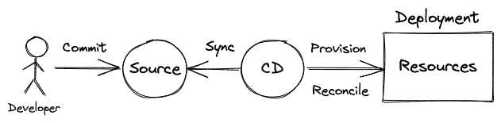

图 7.1 – GitOps

启动 GitOps 的基础内容在这里列出，如 *图 7.1* 所示：

1.  **提交代码到源代码**：在这里，开发者进行更改并将更改推送到源代码或仓库——例如，托管在 GitHub 上的 Git 仓库。

1.  **同步更改**：GitOps 工具，如 Flux，会定期检测源代码中的更改。

1.  **提供或调和更改**：一旦 GitOps 工具检测到更改，它的目标是自动化基于声明性配置更改的部署更新过程。这可能包括修改过程，比如更改配置、更新使用容器的应用程序的容器镜像等。有时，如果资源或部署不存在，你需要提供资源或调和这些资源，比较更改。这意味着 GitOps 工具定期与声明性定义一起工作，以反映基础设施或应用程序的状态。

最后，用户在访问他们的应用程序时将看到更改，你还可以添加一些额外的过程，例如在某个过程完成时的通知，或者在某个过程失败时的警报。

总的来说，这就是 GitOps 过程的工作方式，以及 GitOps 工具的运作方式。在本章中，我们将重点介绍 Flux 作为我们的 GitOps 工具，来实现 GitOps 流程，自动化我们的应用程序部署和更新。

## GitOps 原则

如果你使用 GitOps 来自动化 CD 管道，有一些原则是必须遵循的。基于 *Weaveworks*，这些原则如下：

+   **声明性定义**：你可以经常通过 **YAML** 文件找到这些定义，但它们也可以以其他格式出现，例如 **JSON**。

+   **应用程序的状态版本化存储于 Git 中**：GitOps 工具使用 Git 仓库来存储应用程序的更改和状态。

+   **批准可以自动应用到资源的更改**：Git 仓库或服务提供方式来自动触发工具，当检测到某些更改或合并时。

+   **监听变更的软硬件代理，进行通知或警报**：GitOps 工具还具有守护进程，监听准备启动的动作中的变化，例如在使用容器的应用程序中，改变一个包含新镜像标签的代码库。

## GitOps 的好处

现在你已经知道了 GitOps 工具如何工作以及 GitOps 流程如何帮助你自动化 CD 管道，接下来让我们了解一下 GitOps 的好处。

基于*Weaveworks*，其内容如下：

+   **提高生产力**：自动化过程减少了执行时间；在这种情况下，你可以在更短的时间内对应用进行更多的变更和更新。

+   **增强的开发者体验**：GitOps 工具通常会在你的 Git 仓库上启动自动化流程，并且这些流程会自动启动，无需了解其内部工作原理——例如，对于使用 Kubernetes 的应用，开发者在某些情况下无需了解 Kubernetes。然而，这取决于你的应用程序结构。

+   **提高稳定性**：GitOps 工具的日志默认包含在内，有助于满足一些安全性和监控功能。

+   **更高的可靠性**：GitOps 工具让你能够实施回滚机制，减少应用程序在变更影响系统运行时的停机时间。

+   **一致性和标准化**：GitOps 工具具有定义应用程序的结构，并为应用程序的定义、管道或更新提供最佳实践。

+   **更强的安全保障**：GitOps 工具具备安全功能，如针对机密的加密技术、以及跟踪和管理变更的能力。这为保护你的应用提供了一种方式。

现在，让我们继续了解 GitOps 在云原生环境中的工作原理。

## GitOps、云原生与边缘计算

如我们所知，**云原生**指的是在**开发运维**（**DevOps**）文化中，使用容器、微服务和 CI/CD 等技术的应用。因此，当一个 GitOps 工具被设计为在云原生环境中运行时——例如 Kubernetes 集群——你就可以找到该概念的交集。

GitOps 工具可以帮助你自动化 Kubernetes 应用程序的持续交付过程。像 Argo CD 或 Flux 这样的工具可以帮助你为你的应用实现 GitOps。

但在本章中，我们将更侧重于运行在低资源环境下、使用 ARM 处理器的应用。在这种情况下，Flux 支持 ARM，而 Argo CD 不支持。本章将重点介绍如何在 ARM 设备上使用 Flux 实现 GitOps。因此，让我们在下一节开始时简要介绍 Flux。

# Flux 及其架构

Flux 网站 [`fluxcd.io`](https://fluxcd.io) 上写道：“*Flux 是一组针对 Kubernetes 的持续和渐进交付解决方案，它是开放和可扩展的*。” Flux 使您能够将 Kubernetes 集群与包含应用程序声明式定义的源保持同步，这些定义通常存储在 Git 仓库中。

Flux 还使用 Kubernetes API 来管理其对象。它还使用自己的 GitOps 工具包，为您提供构建 Kubernetes 上 CD 系统的工具。您可以在以下图中看到 Flux 是如何工作的：

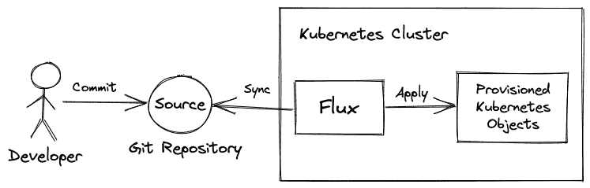

图 7.2 – Flux 架构

该图反映了 GitOps 的典型工作流，从提交开始，GitOps 工具不断检查应用程序定义的变化——在这种情况下是 YAML 文件。当 Flux 检测到此变化时，它会自动根据声明式定义为您的应用程序进行协调配置。

为了为 GitOps 提供必要的功能，Flux 提供以下主要特性：

+   支持多个提供商的 Git 仓库

+   支持 Kustomize 和 Helm 等工具的集成

+   事件触发和周期性协调

+   与 Kubernetes **基于角色的访问控制** (**RBAC**) 集成

+   警报外部系统（Webhook 发送器）

+   外部事件处理（Webhook 接收器）

+   自动容器镜像更新到 Git（图像扫描和修补）

作为 Kubernetes 的 GitOps 工具，Flux 可以安装在 ARM 设备上。这样，Flux 可以很好地与边缘计算匹配。但首先，让我们看看 Flux 如何满足边缘计算要求。

Flux 满足边缘计算要求的原因如下：

+   与 Argo CD、Tekton 等工具相比，GitOps 的复杂性较低

+   可以安装在低资源环境的 ARM 设备上

+   操作时消耗较低资源

这就是 Flux 如何工作以及它如何满足边缘计算要求。现在，让我们看看如何组织我们的应用程序，在下一节中使用 Flux 实现边缘计算的 GitOps。

# 使用 Flux 为边缘应用程序设计 GitOps

我们将使用 Flux 为边缘计算实现 GitOps，但首先，我们需要解释整个工作流和这一实现的主要部分。为此，让我们探索以下图表，它解释了 GitOps 的组件和工作流，为您的应用程序实现图像自动化更新器：

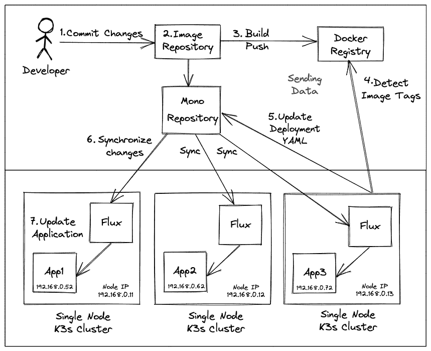

图 7.3 – 使用图像更新器功能实现 Flux GitOps

我们的 GitOps 工作流实现有以下步骤：

1.  开发者更改应用程序并提交变更，通过 PR 将变更合并到主分支。你可以直接更改并推送到主分支，但这不是一个好的实践，因为你可能提交了破坏性或未经审查的更改。在本章后面的示例中，我们使用 GitHub 来托管我们的 Git 仓库。

1.  仓库已启用 GitHub Actions，并触发了一个简单的管道，仅用于构建镜像。

1.  镜像会在管道中构建并标记为新版本，然后推送到公共 Docker 注册表。在大多数业务场景中，你必须使用云端或本地的私有仓库。

1.  镜像更新器功能会检查新更改和为先前生成的镜像标签进行标记，以便你的应用程序使用这些镜像。

1.  一旦 Flux 检测到新镜像，它会查找配置为使用新镜像标签更新的文件。一旦 Flux 使用新标签更新了文件定义，变更将被推送到仓库。

1.  Flux 检测到已更新的新镜像标签的文件定义的更改。然后，Flux 会触发协调过程以更新你的应用程序。

1.  Kubernetes 集群中与定义文件相关联的对象会被更新。然后，应用程序将使用新镜像运行。

为了实现刚才描述的 GitOps 工作流，我们假设以下网络和 GitHub 配置：

+   使用 `192.168.0.0/24` 网络的单节点 K3s 集群，使它们能够访问同一网络。你也可以使用其他私有网络，例如 `172.16.0.0/16` 或 `10.0.0.0/8` 网络。

+   每个集群都使用 MetalLB 作为裸金属负载均衡服务，使用不同的 IP 范围进行负载均衡。集群 1 使用 `192.168.0.51-60` 范围的 IP 地址，集群 2 使用 `192.168.0.61-70`，集群 3 使用 `192.168.0.71-80` 来进行此网络的基本 IP 地址分配。前几个地址通常由 Traefik 的默认负载均衡器使用，因此在你的网络中，这些 IP 地址可能会不同。请参考 *第五章*，*用于边缘计算实验的 K3s 家庭实验室*，以使用相同或类似的 IP 范围配置 MetalLB。

+   你有一个 GitHub 账户和一个令牌，可以访问或创建你账户中的仓库。我们正在做的是：

    +   我们使用 https://github.com/sergioarmgpl/fluxappdemo GitHub 仓库，该仓库包含一个基本的 Helm chart 用于在我们的集群中部署。你可以在仓库链接中找到更多关于该应用程序的详细信息。

至此，我们已经准备好在下一部分开始实现这个场景。

## 为 GitOps 创建一个简单的单仓库

对于我们的 GitOps 实现，我们将使用单一代码库（monorepo）。我们选择这样做是为了减少管理多个仓库，并将所有工作集中在一个仓库中。对于这个用例，我们将把集群配置和应用程序定义组织在一个仓库中。让我们通过以下截图来了解我们的新仓库将如何组织：

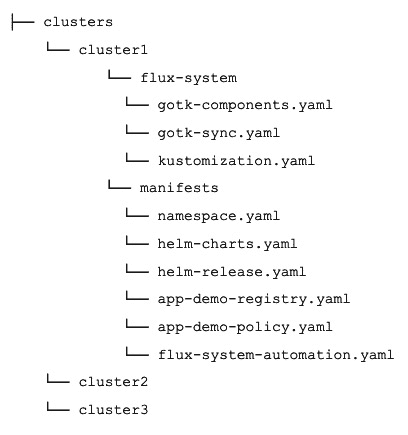

图 7.4 – 单一代码库结构

现在让我们描述一下每个目录和文件的作用，如下所示：

+   `clusters`：这是包含所有 Flux 配置和部署的主目录，配置分布在不同的子目录中。

+   `cluster1`-`cluster3`：这些文件夹内部，Flux 和您的应用程序的定义被组织起来。`cluster1`将负责更新所有集群的应用程序的 YAML 定义。因此，`cluster2`和`cluster3`在其安装中不需要镜像更新组件。

+   `flux-system`：包含部署 Flux 的 Flux 定义。包括`gotk-components.yaml`、`gotk-sync.yaml`和`kustomization.yaml`文件，这些文件配置不同的组件，以实施我们的镜像更新 GitOps 工作流。

+   `manifests`：包含部署您的应用程序所需的定义。

+   `namespace.yaml`：为您的应用程序创建一个生产命名空间。

+   `helm-charts.yaml`：用于访问您的 Helm 图表的定义。

+   `helm-release.yaml`：包含使用`helm-charts.yaml`中定义的 Helm 图表部署应用程序的定义和值。

+   `app-demo-registry.yaml`：包含一个在 Docker Hub 上扫描的镜像。

+   `app-demo-policy.yaml`：包含一个表达式，用于检查您希望更新容器镜像的文件。

+   `flux-system-automation.yaml`：查找文件夹以更新更改。

这个仓库是为您的应用程序设计的。它是一个用于生产环境的单一代码库，包含多个集群。您可以使用 Kustomize 进行更复杂的配置，但那超出了本章的范围。

重要提示

您还可以在 Flux 网站上找到有关如何组织仓库的一些方法。更多信息，请访问以下链接：[`fluxcd.io/docs/guides/repository-structure`](https://fluxcd.io/docs/guides/repository-structure)。

现在，是时候查看我们将在边缘计算的 GitOps 用例中实施的工作流了。

## 理解应用程序和 GitHub Actions

要开始使用 Flux 实现 GitOps，我们必须设置一个小型流水线，每当修改我们应用程序的源代码时就创建一个容器镜像。为了简化我们的工作，此配置将基于 [`github.com/sergioarmgpl/fluxappdemo`](https://github.com/sergioarmgpl/fluxappdemo) 仓库，该仓库包含一个使用 Flask 的简单 Python 应用程序。此应用程序有两个目录：`src` 和 `.github/workflows`。`src` 目录包含应用程序的源代码，而 `workflows` 文件夹包含 GitHub Actions 配置。

因此，让我们首先探索 `src` 目录。你可以在以下截图中看到仓库的概述：

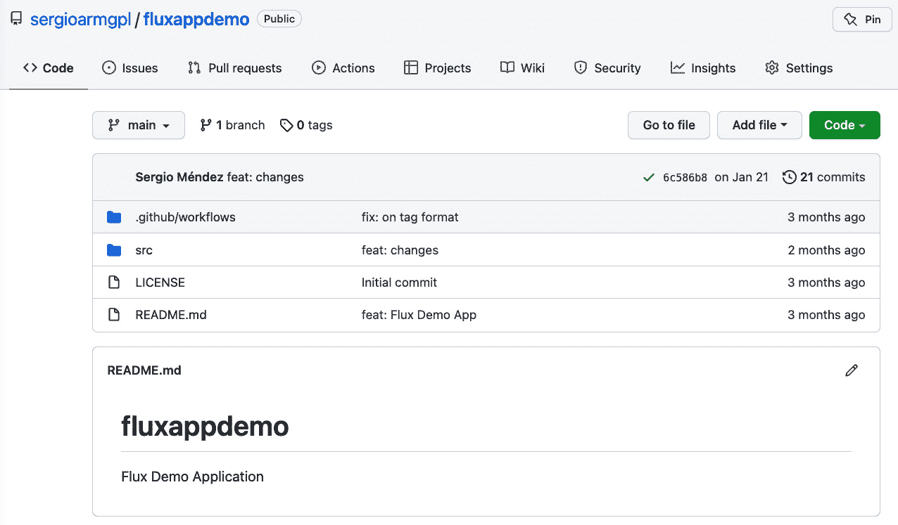

图 7.5 – fluxappdemo 仓库

`src` 目录包含以下文件：

+   `Dockerfile`: 这个文件包含了构建 Docker 镜像的配置；它还调用了 `tests.py` 中包含的一个小单元测试。

+   `Operations.py`: 这个文件有一个名为 `Operations` 的类，其中包含一个名为 `runningInfo` 的方法。此函数接收两个参数：`msg1` 和 `msg2`。通过这些参数，它返回以下消息：`Running app <msg1> in namespace <msg2>`。

+   `build_push.sh`: 这是一个手动构建镜像的示例脚本。它接收两个参数；第一个是你的 Docker 用户名，第二个是镜像的标签。你可以如下运行它：

    ```
    $ /bin/bash build_push.sh <DOCKER_USERNAME> <IMAGE_TAG>
    ```

+   `index.py`: 这是运行我们应用程序的主要 Python 文件。它有一个名为 `hello_world` 的函数，获取 `MESSAGE` 和 `NAMESPACE` 环境变量，然后调用 `runningInfo` 函数返回以下消息：`Running app <MESSAGE> in namespace <NAMESPACE>`。因此，每当你在 `route /` 和端口 `5000` 调用应用程序时，它将显示该消息，然后 `/ _health` 路由返回运行消息，`/ _version` 返回一个自定义消息。你可以使用这个路由来探索应用程序。要查看代码，请访问以下链接：[`github.com/sergioarmgpl/fluxappdemo/blob/main/src/index.py`](https://github.com/sergioarmgpl/fluxappdemo/blob/main/src/index.py)。

+   `requirements.txt`: 包含运行代码所需的所有库。

+   `tests.py`: 这个文件包含了 `Operations` 类中 `runningInfo` 函数的一个小测试。

你可以在以下截图中看到 `src` 目录的概述：

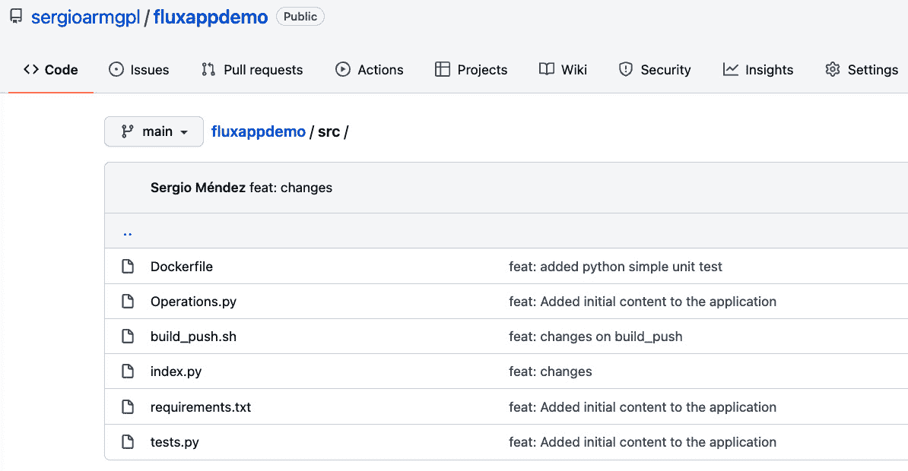

图 7.6 – 包含源代码的 src 目录

`.github/workflows` 包含一个 `github-actions-fluxappdemo.yml` 文件。该文件包含了一个 CI 管道的定义，用于构建和推送你的容器 ARM 镜像，使用以下名称和标签格式：`<DOCKER_USER>/fluxappdemo:RELEASE.YEAR-MONTH-DAYT-HOUR-MINUTE-SECONDZ`。

`DOCKER_USER` 是你的 Docker 用户名。

你可以在以下截图中看到这个文件：

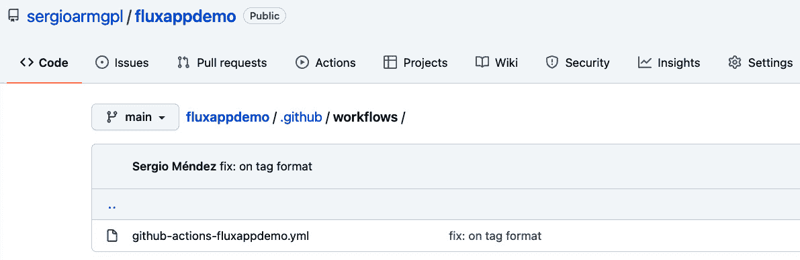

图 7.7 – GitHub Actions workflows 文件

通过这个简要说明，我们继续配置你自己的流水线来构建并推送你的容器镜像。

# 使用 GitHub Actions 构建容器镜像

要使用 GitHub Actions 构建并推送你的镜像，应该按照以下步骤进行：

1.  Fork [`github.com/sergioarmgpl/fluxappdemo`](https://github.com/sergioarmgpl/fluxappdemo) 仓库。这将创建一个名为 `https://github.com/<GITHUB_USER>/fluxappdemo` 的仓库。

`GITHUB_USER` 是你的 GitHub 账户的用户名。用你自己的用户名替换它。

1.  为你的仓库创建`DOCKERHUB_USERNAME`和`DOCKERHUB_TOKEN`密钥。这些将作为加密的密钥为仓库创建。要创建这些密钥，请在浏览器中打开以下页面：`https://github.com/<GITHUB_USER>/fluxappdemo/settings/secrets/actions`。

添加变量后，你的仓库将如下所示：

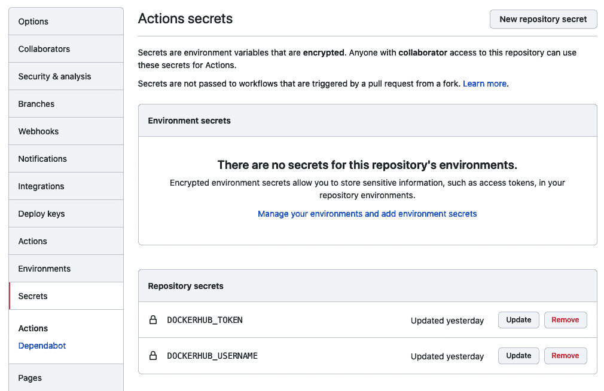

图 7.8 – GitHub 仓库密钥

1.  修改 `.github/workflows/github-actions-fluxappdemo.yml` 文件中的最后一行，在 `tags` 部分替换为你的用户名。它将如下所示：

    ```
    tags: <DOCKER_USER>/fluxappdemo
    ```

这里，`DOCKER_USER` 是你的 Docker Hub 用户名。

1.  提交并推送更改。

1.  (*可选*) 要检查你的 GitHub action 是否在运行，可以访问以下链接：`https://github.com/<GITHUB_USER>/fluxappdemo/actions`。以下截图提供了该页面的示例：

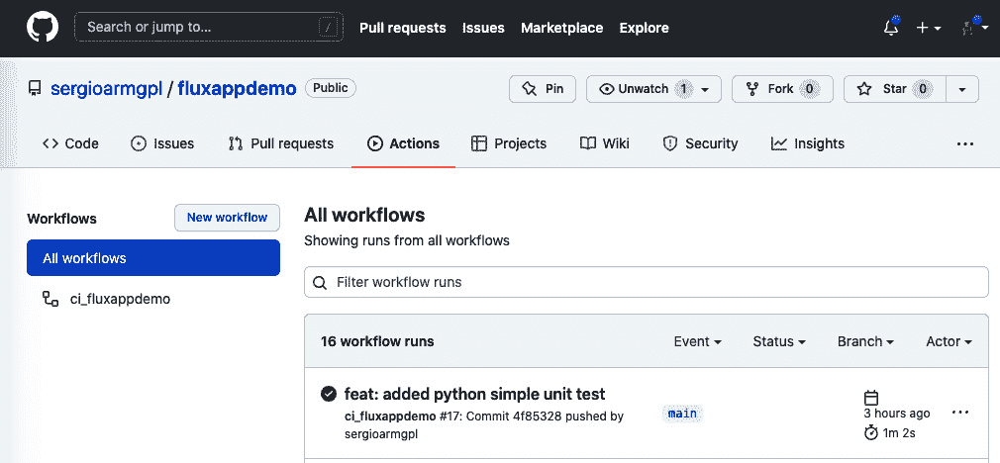

图 7.9 – GitHub Actions 显示当前工作流

1.  (*可选*) 要查看为你的账户创建的新容器标签，请访问以下链接：`https://hub.docker.com/repository/docker/<DOCKERHUB_USERNAME>/fluxappdemo/tags`。以下截图提供了该页面的示例：

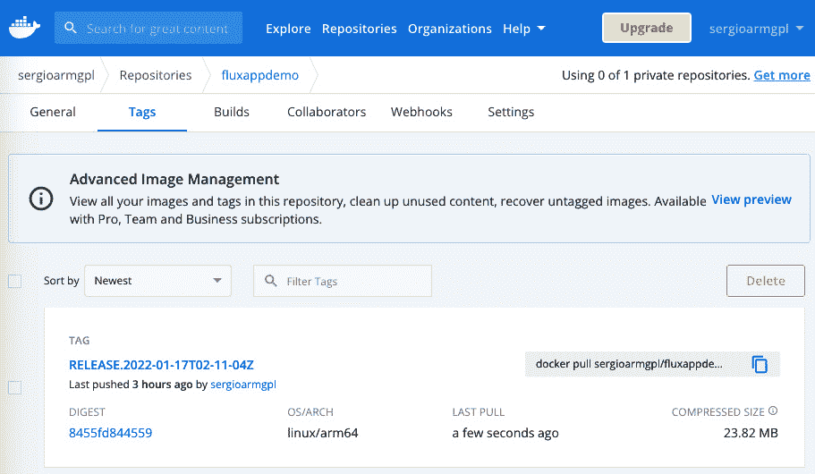

图 7.10 – 仓库的 Docker Hub 标签

1.  (*可选*) 为了测试你的 GitHub Actions 流水线是否正常工作，修改 `src` 目录中的应用源代码并提交和推送更改。然后，新的工作流将开始运行。

重要提示

要了解有关为仓库创建加密密钥的更多信息，请访问以下链接：[`docs.github.com/en/actions/security-guides/encrypted-secrets`](https://docs.github.com/en/actions/security-guides/encrypted-secrets)。要创建一个访问 Docker Hub 账户的令牌以推送新镜像，请访问此链接：[`docs.docker.com/docker-hub/access-tokens`](https://docs.docker.com/docker-hub/access-tokens)。最后，要 fork 一个仓库，请查看以下链接：[`docs.github.com/en/get-started/quickstart/fork-a-repo`](https://docs.github.com/en/get-started/quickstart/fork-a-repo)。

现在我们已经配置了 GitHub Actions 流水线来自动创建带有标签的容器镜像，接下来是配置 Flux 以完成我们的 GitOps 工作流。

# 安装并配置 Flux 以进行 GitOps

在配置 Flux 之前，先了解我们将在本节中安装什么。在本节中，我们将安装 Flux 及其组件，这些组件会检测容器的最新镜像标签。一旦检测到新镜像，Flux 会修改您部署仓库中 `HelmRelease` 的定义文件。然后，Flux 会自动协调更改，更新在该 `HelmRelease` 文件中定义的应用程序部署，该文件使用的是发布于 [`sergiops.xyz/helm-charts`](https://sergiops.xyz/helm-charts) 的 Helm 图表。与在 *使用 GitHub Actions 构建容器镜像* 部分中定义的 GitHub Actions 工作流一起，完整的工作流将像这样运行：

1.  用户将本地仓库的更改推送到位于 `https://github.com/<GITHUB_USER>/fluxappdemo` 的原始源代码仓库。

1.  GitHub Actions 会在 `https://hub.docker.com/repository/docker/<DOCKER_USER>/fluxappdemo` 将镜像构建并推送到 Docker Hub。

1.  Flux 会检测到更新镜像时生成的新标签。

1.  Flux 会用新的标签替换 `HelmRelease` 定义。为此，Flux 会修改、提交并将更改推送到位于 `https://github.com/<GITHUB_USER>/fluxdemo-production.git` 的部署定义仓库。

1.  Flux 会协调更改，应用程序将使用新的镜像标签进行更新。

提示

`<GITHUB_USER>` 和 `<DOCKER_USER>` 值必须替换为您的 GitHub 和 Docker 用户。

要开始使用 Flux 构建此用例场景，您必须安装 Flux **CLI**。以下是操作方法：

1.  要在 Linux 上安装 Flux CLI，请运行以下命令：

    ```
    $ curl -s https://fluxcd.io/install.sh | sudo bash
    ```

1.  或者，如果您使用 macOS，您可以使用以下命令通过 Homebrew 安装 Flux：

    ```
    $ brew install fluxcd/tap/flux
    ```

重要提示

您可以在官方网站 [`fluxcd.io`](https://fluxcd.io) 查找替代安装方法。

现在，您需要安装 Flux 图像更新器功能，这对于每次检测到新的镜像标签时自动化 CD 过程是必要的。要安装 Flux 和所有必要的组件，请按照每个集群上给定的步骤操作：

1.  设置您的环境变量；在此情况下，我们需要设置我们的 GitHub 用户和 GitHub 账户的令牌，如下所示：

    ```
    $ export GITHUB_USER=<YOUR_USER>
    $ export GITHUB_TOKEN=<YOUR_GITHUB_TOKEN>
    $ export DOCKER_USER=<YOUR_DOCKER_USERNAME>
    ```

提示

查看以下链接以为您的 GitHub 账户创建令牌：[`docs.github.com/en/authentication/keeping-your-account-and-data-secure/creating-a-personal-access-token`](https://docs.github.com/en/authentication/keeping-your-account-and-data-secure/creating-a-personal-access-token)。

1.  让我们设置与您的 GitHub 账户相关联的电子邮件地址和用户名。为此，请运行以下命令：

    ```
    $ git config --global user.email "<YOUR_EMAIL>"
    $ git config --global user.name "<YOUR_NAME>"
    ```

1.  现在，安装 Flux 和所有必要的组件以实现图像更新器功能。为此，运行以下命令：

    ```
    $ CLUSTER_N=1
    $ flux bootstrap github \
    --kubeconfig /etc/rancher/k3s/k3s.yaml \
    --components-extra=image-reflector-controller,image-automation-controller \
    --owner=$GITHUB_USER \
    --repository=fluxdemo-production \
    --branch=main \
    --path=./clusters/cluster$CLUSTER_N \
    --read-write-key \
    --personal
    ```

`repository` 参数是要创建的 GitHub 仓库的名称——例如，`fluxdemo-production`。

`CLUSTER_N` 是一个环境变量，表示您安装 Flux 的集群编号，例如 `CLUSTER_1`。用于安装 Flux 的 YAML 文件将存储在 `clusters/production/<CLUSTER_N>` 目录中。

该过程将显示消息 **等待 Kustomization "flux-system/flux-system" 被调和**。一旦 Flux 安装完成，您将看到消息 **所有组件都正常**。

该命令将创建一个与您的用户帐户关联的仓库。访问该仓库的链接将是 `https://github.com/<GITHUB_USER>/fluxdemo-production.git`。

`GITHUB_USER` 是您的 GitHub 用户名。请将此值替换为您自己的用户名。

重要提示

对于 `cluster2` 和 `cluster3`，省略 `--components-extra=image-reflector-controller,image-automation-controller` 这一行。`cluster1` 负责更新所有集群的应用定义。如果您使用的是组织、企业或其他版本控制工具，运行 `flux bootstrap github --help` 可以查看该命令的帮助文档，获取更多选项。

1.  克隆新的仓库并将其切换到此目录：

    ```
    $ git clone https://github.com/$GITHUB_USER/fluxdemo-production.git
    $ cd fluxdemo-production
    ```

这将要求您输入用户名和密码来克隆您的仓库。在接下来的步骤中，这些将用于自定义和创建部署定义。按照以下步骤进行：

1.  在名为 `clusters/<clusterN>/manifests` 的目录中为您的应用程序创建一个命名空间。为此，运行以下命令：

    ```
    $ mkdir -p ./clusters/cluster$CLUSTER_N/manifests
    $ kubectl create ns production --dry-run=client -o YAML > ./clusters/cluster$CLUSTER_N/manifests/namespace.yaml
    ```

创建一个指向您自己 Helm 图表的 Helm chart 源 Flux 对象，如下所示：

```
$ flux create source helm helm-charts \
--kubeconfig /etc/rancher/k3s/k3s.yaml \
--url=https://sergiops.xyz/helm-charts \
--interval=1m \
--namespace=production \
--export > ./clusters/cluster$CLUSTER_N/manifests/helm-charts.yaml
```

在此示例中，我们使用的是位于 [`sergiops.xyz/helm-charts`](https://sergiops.xyz/helm-charts) 的示例应用程序 Helm 图表。

1.  创建一个 Flux `HelmRelease` 对象，为您的应用程序部署创建 YAML 定义，如下所示：

    ```
    $ flux create helmrelease app-demo --chart app-demo \
    --source HelmRepository/helm-charts.production \
    --chart-version 0.0.1 \
    --interval=1m \
    --namespace production \
    --export > ./clusters/cluster$CLUSTER_N/manifests/helm-release.yaml
    ```

通过运行以下命令，我们将向文件中添加一个名为`values`的部分：

```
cat << EOF >> ./clusters/cluster$CLUSTER_N/manifests/helm-release.yaml
  values:
    replicaCount: 3
    containerPort: 5000
    dockerImage: $DOCKER_USER/fluxappdemo:RELEASE.2022-01-16T05-42-20Z # {"\$imagepolicy": "flux-system:app-demo"}
    namespace: "production"
    domain: "app-demo-cluster$CLUSTER_N.domain.tld"
    changeCause: "First Deployment cluster $CLUSTER_N"
    message: "cluster$CLUSTER_N"
    appname: "app-demo-cluster$CLUSTER_N"
    node: "machine$CLUSTER_N"
EOF
```

请注意注释行 `# {"$imagepolicy": "flux-system:app-demo"}`。

这一部分告诉 Flux 去寻找替换图像的新标签。最终，文件将如下所示：

```
apiVersion: helm.toolkit.fluxcd.io/v2beta1
kind: HelmRelease
metadata:
  name: app-demo
  namespace: production
spec:
  chart:
    spec:
      chart: app-demo
      sourceRef:
        kind: HelmRepository
        name: helm-charts
        namespace: production
      version: 0.0.1
  interval: 1m0s
  values:
    replicaCount: 3
    containerPort: 5000
dockerImage: <DOCKER_USER>/fluxappdemo:RELEASE.2022-01-16T05-42-20Z # {"$imagepolicy": "flux-system:app-demo"} 
    namespace: "production"
    domain: "app-demo-cluster1.domain.tld"
    changeCause: "First Deployment cluster 1"
    message: "cluster1"
    appname: "app-demo-cluster1"
    node: "machine1"
```

这个通过 Flux 安装提供的 `HelmRelease` 对象提供了一种声明性方法来参数化部署。在这种情况下，`values` 部分中的值对应于您可以传递给我们 Helm 图表的不同参数。Helm 图表的创建超出了本书的范围，但您可以在本章结尾的 *进一步阅读* 部分找到相关资源。

提示

您可以访问 [`github.com/sergioarmgpl/fluxdemo-production`](https://github.com/sergioarmgpl/fluxdemo-production) 仓库，查看使用前述命令创建和修改演示应用程序配置文件的最终结果。

这个 `HelmRelease` 对象存储在一个文件中，你需要修改它、提交并推送你的更改到你的仓库。之后，Flux 会检测到更改并更新你的应用程序。这个文件位于你的仓库路径 `clusters/cluster$CLUSTER_N/manifests/helm-release.yaml` 中。通过这种方式，你可以测试 Flux 如何更新你的应用程序，其中 `CLUSTER_N` 变量是你正在修改的集群编号。

重要提示

如果你想创建自己的 Helm chart 仓库，可以查看 [`helm.sh/docs/topics/chart_repository`](https://helm.sh/docs/topics/chart_repository)，并进入 *GitHub Pages 示例*[*部分*](https://sergiops.xyz/helm-charts)。在这个例子中，我们使用的是位于 [`sergiops.xyz/helm-charts`](https://sergiops.xyz/helm-charts) 和 [`github.com/sergioarmgpl/helm-charts/tree/gh-pages`](https://github.com/sergioarmgpl/helm-charts/tree/gh-pages) 的 charts。你可以检查或克隆这个仓库来创建你自己的。

*如果你正在配置 cluster2 和 cluster3，你可以省略步骤 11-13，因为 cluster1 会负责更新所有部署的定义。*

1.  (*可选*) 创建一个镜像仓库来检测你的镜像的新版本或标签，如下所示：

    ```
    $ flux create image repository app-demo \
    --kubeconfig /etc/rancher/k3s/k3s.yaml \
    --image=$DOCKER_USER/fluxappdemo \
    --namespace=flux-system \
    --interval=1m \
    --export > ./clusters/cluster$CLUSTER_N/manifests/app-demo-registry.yaml
    ```

1.  (*可选*) 创建一个镜像策略，定义一个表达式来匹配并检测来自你的镜像仓库的新镜像标签或版本。此用例将使用以下格式来标记新的 Docker 镜像：

`RELEASE.YEAR-MONTH-DAYT-HOUR-MINUTE-SECONDZ`

这个约定基于 RFC3339 和 ISO 7601，它们是互联网上日期和时间的标准：

```
$ flux create image policy app-demo \ 
--image-ref=app-demo \ 
--namespace=flux-system \ 
--select-alpha=asc \
--filter-regex='^RELEASE\.(?P<timestamp>.*)Z$' \
--filter-extract='$timestamp' \
--export > ./clusters/cluster$CLUSTER_N/manifests/app-demo-policy.yaml
```

1.  (*可选*) 现在，到了将所有部分结合起来的时候。为此，你需要创建一个 `ImageUpdateAutomation` 对象，它将检测新的版本并更新你部署 YAML 定义中的镜像。在以下案例中，它将检查 clusters 文件夹以更新所有的 YAML 定义：

    ```
    $ flux create image update flux-system \
    --git-repo-ref=flux-system \
    --git-repo-path="./clusters" \
    --checkout-branch=main \
    --push-branch=main \
    --author-name=<AUTHOR_NAME> \
    --author-email=<AUTHOR_EMAIL> \
    --commit-template="{{range .Updated.Images}}{{println .}}{{end}}" \
    --export > ./clusters/cluster$CLUSTER_N/manifests/flux-system-automation.yaml
    ```

你需要将 `<AUTHOR_NAME>` 和 `<AUTHOR_EMAIL>` 标签替换为你自己的值。这将在 Flux 推送镜像标签更改时显示为提交作者。

1.  使用以下命令提交并推送更改到仓库：

    ```
    $ git add -A
    $ git commit -m "feat: App YAML definitions"
    $ git push origin main
    ```

`push` 命令将要求你输入你之前创建的用户和令牌，以访问你的 GitHub 账户。

现在，你可以构建一个新的镜像，并等待 Flux 自动更新你的 `HelmRelease` 文件，检测到新的镜像。1 分钟或更长时间后，你应该会看到变更已生效。你可以预期看到 Flux 在你的仓库中提交了新的标签检测记录，以帮助排查镜像更新器是否正常工作。

1.  (*可选*) 你可以通过运行以下命令强制 Flux 应用此配置，启动 Flux 的协调过程：

    ```
    $ flux reconcile kustomization flux-system --with-source --kubeconfig /etc/rancher/k3s/k3s.yaml
    ```

1.  Helm chart 将配置一个 `LoadBalancer` 服务类型。要查找配置的 IP 地址，请运行以下命令：

    ```
    $ IP_LOADBALANCER=$(kubectl get svc app-demo-cluster$CLUSTER_N-srv --output jsonpath='{.status.loadBalancer.ingress[0].ip}' -n production)
    ```

在这里，`IP_LOADBALANCER` 变量包含由 `HelmRelease` 定义创建的负载均衡器的 IP 地址，这是你在该集群中应用程序的端点。你可以通过运行以下命令来检查其值：

```
$ echo $IP_LOADBALANCER
```

以*图 7.4*为参考，你应该会看到一个类似 `192.168.0.52` 的 IP 地址。

1.  假设返回的 IP 是 `192.168.0.52`，你可以通过以下 URL 访问你的应用程序：`http://192.168.0.52:5000`。你可以测试访问其他路由，例如 `/_version` 或 `/_health`。

现在你已经安装了 Flux，可以开始测试自动协调，通过提交和推送 `HelmRelease` 文件的更改来更新你的文件。自动协调会更新 Flux 检测到的所有应用程序的新镜像标签。此过程在前一节中已有描述，*使用 Flux 为边缘应用程序设计 GitOps*。之后，你可以继续下一节，学习如何排查安装问题。

# 排查 Flux 安装问题

有一些有用的命令可以帮助你排查安装问题；在本节中，我们将了解这些命令。接下来，让我们按照以下步骤进行：

1.  要协调 Flux 中的变更，请运行以下命令：

    ```
    $ watch flux get images all --all-namespaces --kubeconfig /etc/rancher/k3s/k3s.yaml
    ```

该命令将显示为你的容器检测到的新标签，以及这些新标签是如何在 `HelmRelease` YAML 定义文件中设置的。

1.  要检查 Flux 中的镜像仓库，请运行以下命令：

    ```
    $ flux get image repository app-demo --kubeconfig /etc/rancher/k3s/k3s.yaml --namespace=production
    ```

1.  要检查集群中当前的策略，请运行以下命令：

    ```
    $ flux get image policy app-demo --kubeconfig /etc/rancher/k3s/k3s.yaml --namespace=production
    ```

1.  要获取在 Flux 安装中配置的所有镜像，请运行以下命令：

    ```
    $ flux get images all --all-namespaces --kubeconfig /etc/rancher/k3s/k3s.yaml
    ```

1.  要协调集群中 YAML 定义的更改，请运行以下命令：

    ```
    $ flux reconcile kustomization flux-system --with-source --kubeconfig /etc/rancher/k3s/k3s.yaml
    ```

1.  要实时查看镜像检测以及如何更新你的仓库，请运行以下命令：

    ```
    $ watch flux get images all --all-namespaces --kubeconfig /etc/rancher/k3s/k3s.yaml
    ```

1.  要检查你的应用程序部署情况，请运行以下命令：

    ```
    $ kubectl get deploy -n production
    ```

1.  要检查你的 Pods，请运行以下命令：

    ```
    $ kubectl get pods -n production
    ```

现在你已经掌握了这些关键命令，用于排查你的 Flux 系统问题。

在下一节中，我们将探索 Flux 监控仪表板。

# 安装 Flux 监控仪表板

Flux 本身不包含用于管理的图形用户界面，但它集成了一些有用的仪表板，利用 Prometheus 和 Grafana 来可视化你的部署状态。这些仪表板需要在每个集群上安装。要安装此功能，请按照以下步骤进行：

1.  配置包含监控堆栈定义的 Git 仓库进行安装。该配置将每 30 分钟监听一次更改。代码如下所示：

    ```
    $ flux create source git monitoring \
    --interval=30m \
    --kubeconfig /etc/rancher/k3s/k3s.yaml \
    --url=https://github.com/fluxcd/flux2 \
    --branch=main
    ```

1.  安装 `kube-prometheus-stack`，它将用于为你的仪表板配置 Prometheus。这个堆栈将安装在 `monitoring` 命名空间中。代码如下所示：

    ```
    $ flux create kustomization monitoring-stack \
    --interval=1h \
    --kubeconfig /etc/rancher/k3s/k3s.yaml \
    --prune=true \
    --source=monitoring \
    --path="./manifests/monitoring/kube-prometheus-stack" \
    --health-check="Deployment/kube-prometheus-stack-operator.monitoring" \
    --health-check="Deployment/kube-prometheus-stack-grafana.monitoring" \
    --health-check-timeout="5m0s"
    ```

1.  安装 Grafana 并配置你的 Flux 仪表板，将数据存储在 Prometheus 中，并在 Grafana 中通过预配置的仪表板进行可视化。代码如下所示：

    ```
    $ flux create kustomization monitoring-config \
    --interval=1h \
    --kubeconfig /etc/rancher/k3s/k3s.yaml \
    --prune=true \
    --source=monitoring \
    --path="./manifests/monitoring/monitoring-config"
    ```

1.  使用下列命令访问仪表板：

    ```
    $ kubectl -n monitoring port-forward svc/kube-prometheus-stack-grafana --address 0.0.0.0 3000:80
    ```

这将打开你的仪表板的`3000`端口。记住，你需要访问的 IP 地址是你访问该仪表板的节点的 IP 地址。

使用以下 URL 访问仪表板：`http://<NODE_IP_ADDRESS>:3000/d/flux-control-plane`。

`NODE_IP_ADDRESS` 是你运行此步骤中命令的集群节点的 IP 地址。

1.  要访问仪表板，请使用以下凭据：

    +   用户名：`admin`

    +   密码：`prom-operator`

登录页面将如下所示：


图 7.11 – Grafana 登录表单

登录后，你将被重定向到之前提到的仪表板 URL。

1.  一旦仪表板打开，它将显示如下：

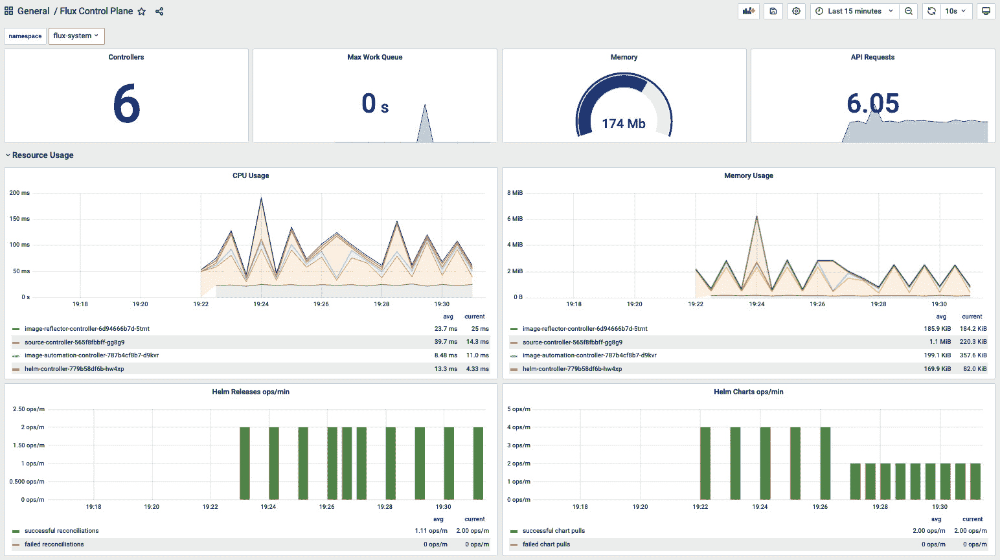

图 7.12 – Grafana Flux 控制平面仪表板

重要说明

记住，你可以自定义此仪表板并创建自己的仪表板。有关此仪表板的更多信息，请访问以下链接：[`fluxcd.io/docs/guides/monitoring`](https://fluxcd.io/docs/guides/monitoring)。

你的 Grafana 仪表板现在已成功安装，你可以查看部署的状态。现在，是时候在下一部分学习如何卸载 Flux 了。

# 卸载 Flux

一旦你不再需要 Flux 安装，可以运行以下命令：

```
$ flux uninstall -s --namespace=flux-system --kubeconfig /etc/rancher/k3s/k3s.yaml
```

这将从你的 Kubernetes 集群中卸载 Flux。现在，是时候结束本章了。

# 总结

在本章中，我们学习了 GitOps 的工作原理，以及如何使用 GitHub Actions 和 Flux 实现 GitOps。Flux 可以帮助你自动化边缘环境中的部署，使用单一的 Git 仓库。为此，我们学习了 Flux 如何使用 HelmRelease 对象和镜像更新功能，在边缘更新应用程序，进而实现 GitOps。Flux 可以在不使用外部方式暴露 Kubernetes 集群 API 的情况下管理你的应用集群，这与 Argo CD 等工具的做法不同。这样可以节省成本，并为使用 ARM 设备的边缘环境提供更有效的工具。另一方面，Argo CD 不支持 ARM，需要通过公共负载均衡器或互联网上的虚拟机暴露 Kubernetes API，才能将集群连接到 Argo CD。在下一章中，我们将学习如何使用 Linkerd 为你的应用程序添加基本的可观察性和流量分配。

# 问题

这里有一些问题来验证你新学到的知识：

+   GitHub Actions 如何帮助我在边缘实现 GitOps？

+   我如何使用 Flux 实现 GitOps？

+   Flux 还有哪些其他功能可以帮助我实现 GitOps？

+   如何使用 Flux 排查我的 Helm 发布问题？

+   如何将这个简单的用例应用到我的边缘计算场景中？

+   我如何为 GitOps 构建我的仓库结构？

# 进一步阅读

你可以参考以下文献，获取本章所涉及主题的更多信息：

+   *什么是 GitOps?*： [`www.gitops.tech`](https://www.gitops.tech)

+   *开发领导者比较持续交付、持续部署与持续集成*： [`stackify.com/continuous-delivery-vs-continuous-deployment-vs-continuous-integration`](https://stackify.com/continuous-delivery-vs-continuous-deployment-vs-continuous-integration)

+   GitHub 快速入门： [`docs.github.com/en/get-started/quickstart`](https://docs.github.com/en/get-started/quickstart)

+   使用 GitHub Actions 构建容器镜像： [`github.com/docker/build-push-action`](https://github.com/docker/build-push-action)

+   Docker Hub: [`hub.docker.com`](https://hub.docker.com)

+   在 GitHub Actions 上创建密钥： [`docs.github.com/en/actions/security-guides/encrypted-secrets`](https://docs.github.com/en/actions/security-guides/encrypted-secrets)

+   日期和时间互联网标准： [`datatracker.ietf.org/doc/html/rfc3339`](https://datatracker.ietf.org/doc/html/rfc3339)

+   使用 GitHub Pages 创建公共 Helm Chart： `medium.com/@mattiaperi/create-a-public-helm-chart-repository-with-github-pages-49b180dbb417`

+   创建 Helm Chart 仓库： [`harness.io/blog/helm-chart-repo`](https://harness.io/blog/helm-chart-repo)

+   如何构建你的 Flux 仓库： [`fluxcd.io/docs/guides/repository-structure`](https://fluxcd.io/docs/guides/repository-structure)

+   *Flux 文档*： [`fluxcd.io/docs`](https://fluxcd.io/docs)

+   Flux Helm 发布： [`fluxcd.io/docs/guides/helmreleases`](https://fluxcd.io/docs/guides/helmreleases)

+   Flux、Kustomize 和 Helm 示例： [`github.com/fluxcd/flux2-kustomize-helm-example`](https://github.com/fluxcd/flux2-kustomize-helm-example)
