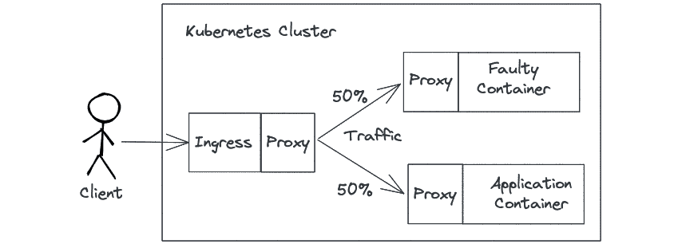

# 8

# 使用 Linkerd 进行可观察性和流量分流

在使用容器开发微服务或应用程序时，可观察性非常重要，因为它提供了对复杂系统的洞察。监控机制、分析和可观察性可以让你了解应用程序在生产环境中作为一个系统如何运行。在生产环境中，可观察性提供日志、指标和追踪，以便了解服务如何相互交互以提供功能。服务网格通常用于在服务中实现可观察性。**服务网格**是一种强大的工具，它帮助你实现可观察性及其他功能，如重试或超时管理，而无需修改应用程序。本章讨论了**黄金指标**，即用于理解系统的常用指标，如何使用 Linkerd 为带有入口控制器的应用程序实现可观察性，以及如何使用示例应用程序实现流量路由。

在本章中，我们将涵盖以下主要内容：

+   可观察性、监控和分析

+   服务网格和 Linkerd 简介

+   使用 Linkerd 实现可观察性和流量分流

+   使用 Linkerd 测试可观察性和流量分流

+   卸载 Linkerd

+   使用服务网格实现的思路

# 技术要求

在本章中，要实现 Linkerd 的可观察性，你需要以下内容：

+   使用 ARM 设备的单节点或多节点 K3s 集群，安装了 MetalLB，并且可以选择避免将 Traefik 作为默认的入口控制器进行安装。

+   已在本地机器上配置的 Kubectl，以避免使用`--kubeconfig`参数。

+   安装 Helm 命令。

+   如果你想通过使用`kubectl apply`来运行 YAML 配置，而不是从书中复制代码，请克隆[`github.com/PacktPublishing/Edge-Computing-Systems-with-Kubernetes/tree/main/ch8`](https://github.com/PacktPublishing/Edge-Computing-Systems-with-Kubernetes/tree/main/ch8)中的代码仓库。查看`ch8`目录中的`yaml`目录，获取 YAML 示例。

我们将安装 Linkerd，以便在此集群上实现可观察性和流量分流。那么，让我们从基础理论开始，理解可观察性的好处以及如何实现它。

# 可观察性、监控和分析

首先，让我们熟悉可观察性这一概念。Peter Waterhouse 在他的*The New Stack*文章中提到，“*可观察性是衡量如何通过了解系统的外部输出，推断系统内部状态的能力*。”他还提到，可观察性更像是系统的一个属性，而不是你实际做的事情。

在这个背景下，有两个概念是密切相关的：监控和可观察性。在 Steve Waterworth 的文章中（可在[dzone.com](http://dzone.com)查看），他通过一句话提到这种关系，“*如果你是可观察的，我就能监控你*。”

这意味着，当系统数据得到管理时，就实现了可观察性。另一方面，监控是收集和显示这些数据的实际任务。最后，分析发生在使用监控工具收集数据之后，且可以手动或自动进行。

这种关系通过权力金字塔表示：


图 8.1 – 权力金字塔

权力金字塔表示了分析和监控是实现可观察性的基础。它们共同作用，能提供了解系统状态的能力；这就是我们所说的可观察性。服务网格通过度量反映系统状态的指标来赋予系统可观察性。这些指标被称为黄金指标。让我们在接下来的部分中探讨黄金指标。

## 黄金指标

黄金指标首次出现在谷歌的《*站点可靠性工程*》一书中，并被定义为监控服务所需的最小指标。这也是权力金字塔在监控和可观察性讨论中占据一席之地的原因。这些指标还被定义为一种模型，作为围绕应用程序构建监控的基础。

根据 Linkerd 服务网格词汇网页，黄金指标也叫**黄金信号**；这些是应用健康的核心指标。这些指标是基于延迟、流量量、错误率和饱和度来定义的。通过这些指标，您可以判断应用程序的健康状况，最终在您的应用程序和系统中建立可观察性的特性。黄金指标是监控服务和构建可观察系统的基础。

让我们在接下来的部分中探讨，服务网格是如何实现这些黄金指标，以便为您的系统带来可观察性。

# 服务网格简介与 Linkerd

George Mirando 在他的书《*服务网格*》中说，服务网格“*是一个专门的基础设施层，用于处理服务间通信，以便使其可见、可管理和可控制。它的架构的具体细节在不同的实现中有所不同，但一般来说，每个服务网格都实现为一系列互联的网络代理，旨在更好地管理服务流量*。”一般来说，我们可以采纳这样的观点，即服务网格是通过这些互联的网络代理构建的，提供可管理、稳定和受控的服务间通信。

现在，让我们看看如何实现这一点，首先从下面的图示开始解释：


图 8.2 – 带侧车容器的服务网格实现

Sidecar 是一种在仅有单个节点的分布式系统中使用的设计模式。在 Kubernetes 中部署使用多个容器的应用程序时，通常会使用这种模式。在这个上下文中，sidecar 模式由两个容器组成；第一个容器包含应用程序容器（即核心容器），第二个 sidecar 容器是一个代理，为您的应用程序提供可靠网络功能，且这两个容器都位于一个 Pod 内（Pod 是 Kubernetes 中对一组容器的抽象）。这个 Pod 位于数据平面内，数据平面包含所有通过代理互联的服务。为了说明这一点，让我们看看以下图示：


图 8.3 – 服务网格控制平面与数据平面

这些代理向控制平面询问如何处理传入的流量，例如，阻止或加密流量。控制平面还会评估并决定在代理中执行的纠正措施，例如在超时发生时进行重试或重定向。控制平面包含应用于每个服务的规则，这些规则会贯穿整个网格。收集数据以提供黄金指标使得服务具有可观察性。一些服务网格还提供一个基本的 UI 来管理所有这些服务网格功能。

服务网格的需求存在是因为对分布式系统的错误假设，例如以下内容：

+   网络可靠。

+   延迟为零。

+   带宽是无限的。

+   网络是安全的。

+   拓扑结构不变。

+   只有一个管理员。

+   传输成本为零。

+   网络是同质的。

服务网格的存在是为了应对所有关于分布式系统的错误假设，帮助管理应用程序代码中的逻辑，并为应用程序创建可靠的网络。一般来说，服务网格通过仅仅注入代理作为 sidecar，而不修改应用程序代码，来提供这种可靠性。

最后，服务网格与可观察性之间的关系在于，当代理拦截网络流量时，这些代理可以生成黄金指标，提供一个图形化仪表盘来可视化您的应用程序状态；换句话说，创建系统的可观察性属性。

## Linkerd 服务网格

Linkerd 是一个设计用于在 Kubernetes 上运行的服务。它为部署在 Kubernetes 上的应用程序提供调试、可观察性、可靠性和安全性，而无需修改应用程序的源代码。因此，Linkerd 不仅提供可观察性，还提供更多功能，诸如：

+   HTTP、HTTP/2 和 gRPC 代理

+   重试和超时

+   遥测和监控

+   负载均衡

+   授权策略

+   自动代理注入

+   分布式追踪

+   故障注入

+   流量拆分

+   服务配置文件

+   多集群通信

Linkerd 也是一款完全开源的软件，属于 **Cloud Native Computing Foundation**（**CNCF**）的毕业项目之一。Linkerd 由 Buoyant 开发。

正如我们在服务网格介绍中探讨的那样，Linkerd 通过数据平面和控制平面工作，并且具有 Linkerd CLI 来管理其安装。它还配有一个 UI，用于查看展示注入服务的黄金指标的各种图形。

为了使用 Linkerd，首先，你需要通过 Linkerd CLI 将你的应用程序注入 Linkerd 代理中，然后 Linkerd 就可以开始收集指标并使你的应用程序能够通过数据平面与其他注入的服务进行通信；当然，Linkerd 还将准备好使用所有功能来配置你的应用程序，例如流量分配。

Linkerd 设计之初便注重速度和低资源消耗，相比于其他服务网格（如 **Istio**），其易用性更强。Istio 包括一整套工具，不仅实现了服务网格功能，还提供了追踪和入口控制器功能，这对于一些解决方案来说可能过于复杂。而 Linkerd 简化了复杂性，旨在作为一个模块化的服务网格软件，可以与当前的技术解决方案栈集成，为系统添加可观测性层。Linkerd 满足边缘计算需求，支持 ARM 架构、低资源消耗，并且易于使用。这样，在考虑基于 Envoy 的其他解决方案（如 Istio）之前，Linkerd 可能是一个值得关注的选项。

需要特别提到的是，由于服务网格通过代理工作，一些入口控制器或云原生代理在选择完整的服务网格解决方案（如 Traefik、Emissary 和 Contour）之前，可能会更符合你的需求。在选择服务网格或云原生代理时，一些重要的考虑因素包括安全性和速率限制实现。你可以在 *进一步阅读* 部分查找一些对比这些解决方案的文章。但现在，是时候理解如何在接下来的章节中实现可观测性和流量分配了。

# 使用 Linkerd 实现可观测性和流量分配

为了说明我们如何使用 Linkerd 实现可观测性和流量分配，让我们来看看以下的图示：



图 8.4 – 使用 Linkerd 进行流量分配

首先，你需要在 Kubernetes 集群中安装 Linkerd。对于这个小场景，我们将使用两个部署。第一个部署是一个简单的 API 部署，它返回消息 *Meshed application app1 with Linkerd*，第二个部署始终返回错误代码 `500`。

所有流量将由客户端（在我们这个例子中，是一个向应用程序端点发送请求的循环）发送，客户端是由您的 ingress 控制器服务创建的负载均衡器，并由 ingress 定义使用。每次 ingress 对象检测到流量时，流量将被 50% 分配到 API 部署，50% 分配到故障部署。这将模拟 50% 请求出错和 50% 流量没有错误的错误率。

必须注入 ingress、应用程序和模拟错误的故障部署。这样，这些服务将使用注入在每个部署中的 Linkerd 代理进行相互通信。

当流量在各服务之间传输时，它会生成 Linkerd 仪表板可以通过 Grafana 和 Linkerd 在其 UI 中实现的其他报告来可视化的黄金指标。

现在，我们已经准备好在下一节中开始安装 Linkerd。

## 在集群中安装 Linkerd

那么，让我们从在集群中安装 Linkerd 开始。为此，您需要按照以下步骤进行：

1.  首先，通过运行以下命令安装 Linkerd CLI：

    ```
    $ curl --proto '=https' --tlsv1.2 -sSfL https://run.linkerd.io/install | sh
    ```

如果您使用的是 macOS，可以通过 `brew` 命令安装 Linkerd CLI：

```
$ brew install linkerd
```

1.  将 Linkerd 安装目录添加到您的路径中：

    ```
    $ echo  "export PATH=\$PATH:/home/ubuntu/.linkerd2/bin" >> ~/.bashrc
    ```

运行以下命令加载新路径，而不是重新登录以加载新路径：

```
$ source ~/.bashrc
```

1.  要检查集群是否符合安装 Linkerd 的要求，请运行以下命令：

    ```
    $ linkerd check --pre
    ```

1.  接下来，运行以下命令安装 Linkerd：

    ```
    $ linkerd install | kubectl apply -f -
    ```

1.  现在，通过运行以下命令安装 Linkerd 仪表板：

    ```
    $ linkerd viz install | kubectl apply -f -
    ```

此命令将在安装 Linkerd 后，等待 Linkerd 仪表板的安装。

1.  要检查安装是否成功，请运行以下命令：

    ```
    $ linkerd check
    ```

1.  一旦一切运行起来，要打开 Linkerd 仪表板，请运行以下命令：

    ```
    $ linkerd viz dashboard --address 0.0.0.0
    ```

上述命令将会在您的设备中暴露 Linkerd 仪表板。要运行此命令，我们假设该命令是在设备内部运行的，因此您需要运行以下命令来解析 URL `http://web.linkerd-viz.svc.cluster.local:50750`，并将其指向您的设备：

```
$ IP_CLUSTER=<YOUR_IP_CLUSTER>
$ sudo echo $IP_CLUSTER" WEB.linkerd-viz.svc.cluster.local" >> /etc/hosts 
```

`IP_CLUSTER` 是您的集群的 IP 地址。

现在，访问以下 URL 打开仪表板：`http://web.linkerd-viz.svc.cluster.local:50750`。

现在，是时候安装 NGINX ingress 控制器，以便在此实现中使用。我们将在下一节中详细介绍。

## 安装并注入 NGINX ingress 控制器

在这种情况下，我们将使用 NGINX ingress 控制器，通过 Helm 安装它，按照给定的步骤进行：

1.  创建 `nginx-ingress` 命名空间：

    ```
    $ kubectl create ns nginx-ingress
    ```

1.  添加 NGINX ingress 控制器 Helm 图表并更新 Helm 中配置的仓库：

    ```
    $ helm repo add ingress-nginx https://kubernetes.github.io/ingress-nginx 
    $ helm repo update 
    ```

1.  安装 NGINX ingress 控制器：

    ```
    $ helm install nginx-ingress ingress-nginx/ingress-nginx -n nginx-ingress
    ```

1.  现在，要注入 NGINX ingress 控制器 Pod，请运行以下命令：

    ```
    $ kubectl get -n nginx-ingress deploy nginx-ingress-ingress-nginx-controller -o yaml \
    | linkerd inject - \
    | kubectl apply -f -
    ```

您的 ingress 控制器现在已经准备好安装并注入。让我们在下一节中创建所需的应用程序。

## 创建演示应用程序和故障 Pod

现在，让我们创建我们的示例应用程序和故障 Pod，以实验流量分流功能，并获取一些故障流量来模拟错误请求。为此，请按照以下步骤操作：

1.  为你的 Pods 创建 `myapps` 命名空间：

    ```
    $ kubectl create ns myapps
    ```

1.  通过运行以下命令创建示例应用程序 `app1`：

    ```
    $ cat <<EOF | linkerd inject - | kubectl apply -f -
    apiVersion: apps/v1
    kind: Deployment
    metadata:
      labels:
        app: app1
      name: app1
      namespace: myapps
    spec:
      replicas: 1
      selector:
        matchLabels:
          app: app1
      template:
        metadata:
          labels:
            app: app1
        spec:
          containers:
          - image: czdev/app1demo
            name: app1demo
            env:
            - name: MESSAGE
              value:  "Meshed application app1 with Linkerd"
            - name: PORT
              value:  "5000"
    EOF
    ```

重要提示

`linkerd inject` 命令将在部署或 Pod 的 `annotations` 部分插入 `linkerd.io/inject: enabled` 标签。Linkerd 使用此标签将服务与 Linkerd 代理进行注入。你也可以在 YAML 定义中手动添加此标签，以便更好地使用声明式定义来管理你的 Pods 和部署。要自定义 app1demo 的代码，请查看链接 [`github.com/sergioarmgpl/containers/tree/main/app1demo`](https://github.com/sergioarmgpl/containers/tree/main/app1demo)。

1.  为了创建我们故障的 Pod，我们将使用 NGINX 作为 Web 服务器，并通过自定义配置返回带有`500`代码错误的请求，以便 Linkerd 检测并将该请求计为错误。为此，让我们运行以下命令创建配置：

    ```
    $ cat <<EOF | kubectl apply -f -
    apiVersion: v1
    kind: ConfigMap
    metadata:
      name: error-injector
      namespace: myapps
    data:
    nginx.conf: |-
        events {}
        http {
            server {
              listen 5000;
                location / {
                    return 500;
                }
            }
        }
    EOF
    ```

1.  现在，让我们创建一个在访问 Pod 的 `/` 路径时返回 `500` 错误的部署，并监听 `5000` 端口：

    ```
    $ cat <<EOF | linkerd inject - | kubectl apply -f -
    apiVersion: apps/v1
    kind: Deployment
    metadata:
      name: error-injector
      namespace: myapps
      labels:
        app: error-injector
    spec:
      selector:
        matchLabels:
          app: error-injector
      replicas: 1
      template:
        metadata:
          labels:
            app: error-injector
        spec:
          containers:
            - name: nginx
              image: nginx:alpine
              volumeMounts:
                - name: nginx-config
                  mountPath: /etc/nginx/nginx.conf
                  subPath: nginx.conf
          volumes:
            - name: nginx-config
              configMap:
                name: error-injector
    EOF
    ```

1.  现在我们的应用程序已经部署完成，让我们为这些应用程序配置服务。我们从 `error-injector` 服务开始：

    ```
    $ cat <<EOF | kubectl apply -f -
    apiVersion: v1
    kind: Service
    metadata:
      name: error-injector
      namespace: myapps
    spec:
      ports:
      - name: service
        port: 5000
      selector:
        app: error-injector
    EOF
    ```

1.  现在，通过运行以下命令为你的应用程序创建服务：

    ```
    $ cat <<EOF | kubectl apply -f -
    apiVersion: v1
    kind: Service
    metadata:
      name: app1
      namespace: myapps
    spec:
      ports:
      - name: service
        port: 5000
      selector:
        app: app1
    EOF
    ```

1.  现在，让我们使用 `app1` 服务和另一个 `error-injector` 服务的一半流量，因此我们期望成功率为 50%：

    ```
    $ cat <<EOF | kubectl apply -f -
    apiVersion: split.smi-spec.io/v1alpha1 
    kind: TrafficSplit 
    metadata: 
    name: error-split 
    namespace: myapps 
    spec: 
    service: app1 
    backends: 
    - service: app1 
    weight: 500m 
    - service: error-injector 
    weight: 500m 
    EOF
    ```

1.  最后，让我们创建 ingress 规则，使用流量分流将流量发送到此应用程序：

    ```
    $ cat <<EOF | kubectl apply -f -
    apiVersion: networking.k8s.io/v1
    kind: Ingress
    metadata:
      name: ingress
      namespace: myapps
      annotations:
        nginx.ingress.kubernetes.io/rewrite-target: /
        nginx.ingress.kubernetes.io/service-upstream:  "true"
    spec:
      ingressClassName: nginx
      rules:
      - http:
          paths:
          - path: /
            pathType: Prefix
            backend:
              service:
                name: app1
                port:
                  number: 5000
    EOF
    ```

重要提示

根据你使用的 Kubernetes 版本，你需要使用适合你 ingress 控制器定义的语法，*v1beta1* 或 *v1*。更多信息，请查看 [`kubernetes.io/docs/concepts/services-networking/ingress`](https://kubernetes.io/docs/concepts/services-networking/ingress)，并根据不同的 Kubernetes 版本进行更改。

现在，我们已经准备好测试使用 Linkerd 配置的可观察性和流量分流。让我们在下一部分探索这一点。

# 使用 Linkerd 测试可观察性和流量分流

现在，是时候测试可观察性了。要开始探索仪表盘并查看可观察性，请按照以下步骤进行：

1.  通过运行以下命令打开仪表盘：

    ```
    $ linkerd viz dashboard
    ```

这将自动打开仪表盘，URL 为 `http://localhost:50750`。

仪表盘将显示如下截图：


图 8.5 – Linkerd 仪表盘

为了加载正确的信息，在左侧边栏的组合框中选择 **MYAPPS** 命名空间，然后点击 **Deployments** 图标以加载 **HTTP Metrics** 和 **TCP Metrics** 信息。

要查看与之前仪表盘类似的信息，请执行以下命令以开始将流量发送到我们的部署：

```
$ ENDPOINT=$(kubectl get svc nginx-ingress-ingress-nginx-controller --output jsonpath='{.status.loadBalancer.ingress[0].ip}' -n nginx-ingress)
$ while true; do curl http://$ENDPOINT;echo  " "; done
```

第一个命令将负载均衡器的 IP 地址分配给您的 NGINX Ingress 控制器，它作为端点来暴露使用 Ingress 定义的服务。然后，在命令发送流量时，它还会显示每个请求的结果，显示类似以下的消息：

```
Host:app1-555485df49-rjf4vMeshed application app1 with Linkerd
```

或者，显示以下输出错误：

```
<html>
<head><title>500 Internal Server Error</title></head>
<body>
<center><h1>500 Internal Server Error</h1></center>
<hr><center>nginx/1.21.6</center>
</body>
</html>
```

这是一个消息的频率为 50% 和错误的频率为 50%，平均而言。

1.  如果您点击橙色的 Grafana 图标（例如，在 **HTTP 指标** 部分），您将看到类似以下的 Grafana 图表：


图 8.6 – Grafana Linkerd HTTP 指标图

在这个图表中，您可以看到应用程序 `app1` 部署的黄金指标和成功率，**每秒请求数**（**RPS**）以及每个请求的延迟；这些指标代表了您的应用程序的黄金指标，为您的系统和应用程序提供了基本的可观察性功能。

1.  如果在选择 **myapps** 命名空间时点击 **流量拆分**，您将看到类似这样的流量拆分表示：


图 8.7 – Linkerd 流量拆分仪表盘

在此仪表盘中，您将实时看到流量拆分配置如何将 50% 的流量发送到 `app1` Kubernetes 服务，并将 50% 的流量发送到错误注入器。红色代表失败的请求（返回 `500` 请求错误代码的请求），而绿色代表来自 `app1` 服务的有效流量，返回 `200` 请求代码。这通常会为您提供应用程序的实时状态，这是实现可观察性目标的一部分。

这个基本实现模拟了使用服务网格的应用程序故障请求。您还可以使用相同的实现将流量在应用程序之间拆分，或实施诸如蓝绿部署之类的高级部署策略。这是一个简单的用例，旨在在您的应用程序中实现可观察性，并展示服务网格的流量管理功能。现在，让我们来看看一些有用的命令，如果您希望使用 CLI 来使用 Linkerd。

## 使用 Linkerd 的 CLI

在某些情况下，如果没有 UI 可用（可能出于安全原因），使用 Linkerd CLI 可能会很有用。因此，下面我们将探讨四个基本的命令行选项：`routes`、`top`、`tap` 和 `edges`：

+   `routes` 显示当前其他应用程序或客户端用于访问您的应用程序的路由。以我们之前的场景为例，您可以使用以下命令显示 `myapps` 命名空间中 `app1` 的路由：

    ```
    $ linkerd viz routes deployment/app1 --namespace myapps
    ```

+   `top` 显示你的应用程序的流量和路径。以下命令将显示入口控制器如何将流量转发到你的应用程序，显示访问`/`路径的计数器，并显示请求的成功率：

    ```
    $ linkerd viz top deployment/app1 --namespace myapps
    ```

+   `tap` 实时显示 `app1` 请求的信息；为此，你需要运行以下命令：

    ```
    $ linkerd viz tap deployment/app1 --namespace myapps
    ```

+   `edges` 显示一个表格，展示你的应用程序如何与集群中其他注入的应用程序连接，以及每个连接的源和目的地。为此，你需要运行以下命令来查看 `app1`：

    ```
    $ linkerd viz edges po -n myapps
    ```

通过这个，你大致了解了如何使用 CLI 来操作 Linkerd。现在，让我们进入下一节，学习如何卸载 Linkerd。

# 卸载 Linkerd

如果你正在评估 Linkerd 或在集群中进行一些管理工作，例如，卸载 Linkerd 可能会很有用。为此，请按照下列步骤操作：

1.  卸载 Linkerd 的附加功能支持（称为**viz**）如下：

    ```
    $ linkerd viz uninstall | kubectl delete -f -
    ```

1.  卸载 Linkerd 控制平面。这将卸载其余的核心 Linkerd 组件。为此，运行以下命令：

    ```
    $ linkerd uninstall | kubectl delete -f -
    ```

现在，Linkerd 已从你的集群中卸载。为了结束这一章，让我们进入最后一节，探讨一些有关你可以使用 Linkerd 的有用想法。

# 使用服务网格时可以实施的想法

为了结束这一章，以下是一些关于如何在边缘使用服务网格的优势的想法。这些想法不仅限于边缘，也可以应用于常规基础设施：

+   **实施速率限制**：你可以使用服务网格在你的应用程序中配置速率限制，从而管理接受多少输入流量。实现这一功能有一些很棒的项目，包括 Linkerd 和基于 Envoy 的服务网格，如 Istio 和 Ambassador。

+   **流量拆分**：你可以使用服务网格的这一功能来实现蓝绿部署和金丝雀部署；例如，Argo Rollouts 的实现可以使用 Linkerd 来执行这种部署策略。你还可以使用服务网格进行一些混沌工程测试。

+   **安全策略**：你可以使用服务网格来限制流量并加密端到端流量。这对于增强服务的安全性可能非常有用。

+   **多集群连接**：使用服务网格，你可以在无需复杂配置的情况下连接多个集群。**Kuma** 是一个面向微服务和服务网格的控制平面，能够帮助你连接多个集群，它建立在 Envoy 之上。你也可以使用 Linkerd 和其他基于 Envoy 的服务网格来实现同样的功能。

+   **基于网络的扩展**：你可以使用服务网格生成的 Prometheus 指标来生成警报或扩展你的服务。你还可以实现机器学习模型来进行一些智能扩展。你可以将它们与像 **基于 Kubernetes 的事件驱动自动扩展**（**KEDA**）这样的项目结合使用，KEDA 从 API 中读取信息来扩展你的服务。

这些是你在使用服务网格时可以探索的一些思路。现在，是时候结束本章了。

# 总结

在本章中，我们学习了如何实现可观察性，以及如何使用服务网格来设置流量拆分。我们专注于使用 Linkerd 实现这一场景，运行一个显示消息的示例应用程序，并使用流量拆分。当应用程序接收到流量时，我们展示了如何探索可以用来获取系统实时状态的不同图形。我们还学习了如何在未安装 CLI 的情况下使用 Linkerd。本章以一些实施思路作为结束，探讨了使用服务网格时可以探索的内容以及这将如何影响你的系统。所有这些内容构成了使用 Linkerd 服务网格在系统中实现可观察性和基本流量拆分的基础。在下一章中，我们将学习如何使用 Knative 实现无服务器函数和简单的事件驱动管道。

# 问题

这里有几个问题可以验证你新获得的知识：

+   服务网格如何帮助你实现可观察性？

+   服务网格为系统提供了哪些功能？

+   服务网格是如何在内部工作的？

+   Linkerd 为实施可观察性的用户提供了什么？

+   Linkerd 如何与其他服务网格进行比较？

+   服务网格的常见使用案例有哪些？

# 深入阅读

你可以参考以下资源，获取本章所涵盖主题的更多信息：

+   *设计分布式系统* 书籍，*Brendan Burns* 编著：[`learning.oreilly.com/library/view/designing-distributed-systems/9781491983638`](https://learning.oreilly.com/library/view/designing-distributed-systems/9781491983638)

+   服务网格模式：[`philcalcado.com/2017/08/03/pattern_service_mesh.html`](https://philcalcado.com/2017/08/03/pattern_service_mesh.html)

+   *黄金信号 - 从基本原理监控*：[`www.squadcast.com/blog/golden-signals-monitoring-from-first-principles`](https://www.squadcast.com/blog/golden-signals-monitoring-from-first-principles)

+   gRPC 官方网站：[`grpc.io`](https://grpc.io)

+   服务网格接口：[`smi-spec.io`](https://smi-spec.io)

+   Linkerd 术语表和有用的术语：[`linkerd.io/service-mesh-glossary`](https://linkerd.io/service-mesh-glossary)

+   服务网格快速入门与比较：[`servicemesh.es`](https://servicemesh.es)

+   *可观察性 vs. 监控*：[`dzone.com/articles/observability-vs-monitoring`](https://dzone.com/articles/observability-vs-monitoring)

+   *监控与可观察性——它们的区别是什么，为什么重要？*: [`thenewstack.io/monitoring-and-observability-whats-the-difference-and-why-does-it-matter`](https://thenewstack.io/monitoring-and-observability-whats-the-difference-and-why-does-it-matter)

+   *云原生应用中的 API 健康与性能的 4 个黄金信号*: [`blog.netsil.com/the-4-golden-signals-of-api-health-and-performance-in-cloud-native-applications-a6e87526e74`](https://blog.netsil.com/the-4-golden-signals-of-api-health-and-performance-in-cloud-native-applications-a6e87526e74)

+   Linkerd 文档: [`linkerd.io/docs`](https://linkerd.io/docs)

+   *服务网格* *与* *边缘计算的考虑因素*: [`sunkur.medium.com/service-mesh-edge-computing-considerations-84126754d17a`](https://sunkur.medium.com/service-mesh-edge-computing-considerations-84126754d17a)
