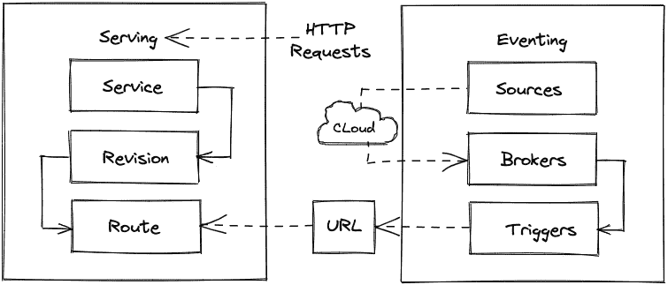

# 第九章：使用 Knative 和 Cloud Events 实现边缘无服务器和事件驱动架构

无服务器架构降低了大规模运行分布式系统的成本。这个使用案例在边缘计算中尤为有用，因为边缘计算需要大量专用硬件和计算资源。本章将介绍如何使用 Knative 实现基于无服务器技术的 API。还将展示如何使用 Knative 简化事件驱动架构和无服务器函数来降低成本和复杂性，帮助构建系统。在本章中，我们将解释 Knative 如何使用 Cloud Events 来调用事件，并且阐述无服务器架构如何帮助开发事件驱动的应用程序。

本章将涵盖以下主要内容：

+   使用 Knative 和 Cloud Events 实现边缘计算中的无服务器架构

+   使用 Knative Serving 实现无服务器函数

+   使用 Knative 进行流量切分实现无服务器 API

+   在 Knative 中使用声明式文件

+   使用 Knative Eventing 中的序列实现事件和事件驱动的流水线

# 技术要求

本章需要以下内容：

+   一个使用 ARM 设备的单节点或多节点 K3s 集群，并安装了 MetalLB，且避免将 Traefik 安装为默认的入口控制器。

+   配置好 kubectl 以便在本地机器上使用，避免使用 `--kubeconfig` 参数。

+   如果你想通过 `kubectl apply` 运行 YAML 配置而不是从书中复制代码，请克隆 [`github.com/PacktPublishing/Edge-Computing-Systems-with-Kubernetes/tree/main/ch9`](https://github.com/PacktPublishing/Edge-Computing-Systems-with-Kubernetes/tree/main/ch9) 中的代码。查看 `ch9` 目录中的 Python 和 YAML 配置代码。

我们将安装 Knative 来实现简单的无服务器 API 和事件驱动流水线的使用案例。让我们理解无服务器架构是什么，以及它们如何在边缘计算环境中提供帮助。

# 使用 Knative 和 Cloud Events 实现边缘计算中的无服务器架构

边缘计算是一种在数据源附近处理信息的范式。这可以提高应用程序的响应时间。当数据被访问时，也能节省带宽，因为数据不再从云端获取，而是直接从源头附近访问。但其中一个问题是，服务总是保持运行状态。无服务器架构可以帮助减少成本，在服务不使用时将其缩减规模，从而减少与传统始终运行服务方式相比的额外成本。

Ben Ellerby 在他的一篇 Medium 文章《*为什么无服务器将促进边缘计算革命*》中提到，*无服务器让我们能够构建应用程序和服务，而不必考虑底层的服务器*。这意味着更多地关注应用程序本身，而不是基础设施的管理。因此，近年来无服务器技术和云服务的普及度不断增加。无服务器云服务只会在您使用服务时收取执行时间的费用。您通常可以找到作为小型代码函数的无服务器服务。无服务器技术使得事件驱动架构得以蓬勃发展，因为它们实现新功能的简单性和低成本。根据 [`solace.com/`](https://solace.com/) 网站，事件驱动架构是一种*软件设计模式，在该模式下，解耦的应用程序可以通过事件代理（现代消息导向中间件）异步地发布和订阅事件*。

在构建新系统时，评估的关键因素之一是实现成本。这将在选择无服务器技术时成为常见场景。在本地环境中实现的无服务器技术可以利用资源的临时使用来执行无服务器函数。Knative 实现了无服务器函数和事件，可用于实现事件驱动的应用程序。此外，像 Cloud Events 这样的事件规范可以帮助标准化服务的通信并定义事件：



图 9.1 – Knative 架构

Knative 诞生于 Google，并作为开源项目交给了社区。Knative 由两部分组成：Serving 和 Eventing。通过 Knative Serving，您可以在 Kubernetes 中创建无服务器函数。Knative Serving 实现了网络、自动扩展和版本跟踪等功能。该抽象使用户能够更多地专注于业务逻辑，而不是基础设施管理。另一方面，Knative Eventing 使用户能够实现事件驱动架构，并调用通过 Serving 功能创建的函数。您可以根据用例配置事件，使用不同的源和代理类型来管理事件。在选择适合您场景的源和代理后，您可以触发函数的顺序或简单调用。

Cloud Events 与 Knative 一起工作，为事件提供标准结构，并有统一的方式声明和调用事件。Cloud Events 遵循用于实现事件的事件规范。这个结构已经被多个开源项目采用，如 OpenFaaS、Tekton、Argo Events、Falco、Google Cloud Eventarc 等等。Cloud Events SDK 支持多种编程语言，如 Python 和 Go。这个 SDK 将帮助你通过定义 ID、云事件规范的版本、类型、源和内容类型等来描述云事件。

Knative 和 Cloud Events 提供了一种在边缘、低资源设备上实现无服务器功能和事件驱动架构的方法，并且提供了一种轻量级的实现，可以在边缘计算场景中节省成本。

重要提示

获取更多关于 Knative 的信息，你可以访问其官方文档：[`knative.dev/docs`](https://knative.dev/docs)。关于 Cloud Events，你可以访问其官方网站：[`cloudevents.io`](https://cloudevents.io)，或者查看其规范 1.0，这是我们示例中使用的版本：[`github.com/cloudevents/spec/blob/v1.0.2/cloudevents/spec.md`](https://github.com/cloudevents/spec/blob/v1.0.2/cloudevents/spec.md)。

# 使用 Knative Serving 实现无服务器功能

为了开始构建我们的简单无服务器和事件驱动用例，我们需要安装 Knative，包括 Serving、Eventing、频道和代理。在这种情况下，我们将使用基本选项，使用内存中的频道和 Knative Eventing Sugar Controller，该控制器会根据集群或命名空间中的标签创建 Knative 资源。所以，让我们在下一节开始安装 Knative Serving。

## 安装 Knative Serving

在本节中，我们将开始安装 Knative Serving，后续将用于实现无服务器功能。让我们按照以下步骤安装 Knative Serving：

1.  使用以下命令安装 Knative CLI：

    ```
    $ brew install kn
    ```

要升级当前的 Knative 二进制文件，请运行以下命令：

```
$ brew upgrade kn
```

1.  安装 Knative Serving CRD，以安装 Serving 组件：

    ```
    $ kubectl apply -f https://github.com/knative/serving/releases/download/knative-v1.2.0/serving-crds.yaml
    $ kubectl apply -f https://github.com/knative/serving/releases/download/knative-v1.2.0/serving-core.yaml
    ```

提示

要了解更多关于**自定义资源定义**（**CRDs**）的信息，你可以查看这个链接：[`docs.openshift.com/aro/3/dev_guide/creating_crd_objects.html`](https://docs.openshift.com/aro/3/dev_guide/creating_crd_objects.html)。你也可以通过下一个链接查看 Kubernetes 官方网站上的 CRD 文档：[`kubernetes.io/docs/concepts/extend-kubernetes/api-extension/custom-resources`](https://kubernetes.io/docs/concepts/extend-kubernetes/api-extension/custom-resources)。

1.  现在安装 Contour ingress 控制器，它将作为 Knative 的默认控制器使用（该组件支持 ARM）：

    ```
    $ kubectl apply -f https://github.com/knative/net-contour/releases/download/knative-v1.2.0/contour.yaml
    ```

1.  使用之前的 ingress 运行以下命令，安装 Knative 的网络组件以启用其他功能：

    ```
    $ kubectl apply -f https://github.com/knative/net-contour/releases/download/knative-v1.2.0/net-contour.yaml
    ```

1.  然后将 Contour 设置为 Knative 使用的默认 ingress 控制器：

    ```
    $ kubectl patch configmap/config-network \
      --namespace knative-serving \
      --type merge \
      --patch '{"data":{"ingress-class":"contour.ingress.networking.knative.dev"}}'
    ```

1.  获取 Contour 入口控制器创建的 IP 作为您应用程序的端点。在此情况下，我们将把此 IP 称为 `EXTERNAL_IP`：

    ```
    $ EXTERNAL_IP="$(kubectl get svc envoy -n contour-external  -o=jsonpath='{.status.loadBalancer.ingress[0].ip}')"
    ```

1.  设置 Knative 用来暴露您的无服务器应用程序的域：

    ```
    $ KNATIVE_DOMAIN="$EXTERNAL_IP.nip.io"
    $ kubectl patch configmap/config-domain \
    --namespace knative-serving \
    --type merge \
    --patch '{"data":{"'$KNATIVE_DOMAIN'":""}}'
    ```

1.  现在设置 **水平 Pod 自动扩展器**（**HPA**）功能以运行 Knative Serving：

    ```
    $ kubectl apply -f https://github.com/knative/serving/releases/download/knative-v1.2.0/serving-hpa.yaml
    ```

1.  最后，进行 Knative 组件运行的简单故障排除：

    ```
    $ kubectl get pods -n knative-serving
    ```

这将返回您 Knative Serving 安装中 pod 的状态。这些 pod 在几分钟后应该会处于就绪状态。

重要提示

若要卸载组件，您可以使用`kubectl delete`而不是`kubectl apply`。

现在 Knative Serving 已经安装并准备好使用了。那么，让我们继续在下一部分创建一个简单的无服务器函数，使用 Knative Serving。

## 创建一个简单的无服务器函数

现在是时候使用 Knative Serving 了。在本节中，我们将使用 Python 和 Flask 运行一个示例 API。代码将如下所示：

```
from flask import Flask
from flask import jsonify
import os
import socket
app = Flask(__name__)
host = socket.gethostname()
msg = os.environ['MESSAGE']
@app.route('/')
def index():
    return jsonify({"host":host,"msg":msg})
if __name__ == '__main__': 
    app.run(host='0.0.0.0', port=5000, debug=True)
```

每次调用该函数时，它将返回带有容器 ID 的变量 host 和 `msg`，该 `msg` 为 `MESSAGE` 环境变量的值。此 API 将使用端口 `5000`。这个 Python 程序已经打包在容器中，并作为 `sergioarmgpl/app2demo` 在 Docker Hub 上构建并发布。

重要提示

您可以在 GitHub 仓库中探索如何构建和自定义此代码：[`github.com/sergioarmgpl/containers`](https://github.com/sergioarmgpl/containers)。

现在，为了通过 Knative 将这个 API 部署为无服务器函数，请按照以下步骤操作：

1.  使用以下命令创建您的函数：

    ```
    $ kn service create api \
    --image sergioarmgpl/app2demo \
    --port 5000 \
    --env MESSAGE="Knative demo v1" \
    --revision-name=v1
    ```

此命令将容器中暴露的端口 `5000` 重定向到 Knative 生成的 HTTP 端点。它还接收带有 `Knative demo` 值的 `MESSAGE` 参数，并将此函数的修订版设置为 `v1`。运行此命令后，您将获得如下输出：

```
Service 'api' created to latest revision 'api-v1' is available at URL:
http://api.default.192.168.0.54.nip.io
```

在输出的末尾，您将找到函数的端点。在这个输出中，我们假设分配给 Contour 入口控制器的 IP 地址是 `192.168.0.54`，这与分配给 `EXTERNAL_IP` 变量的值相同。Knative 会在默认命名空间中为此函数创建必要的 pod。有关如何获取分配给 Contour 入口的 IP，请参阅 *安装 Knative Serving* 部分。

1.  现在，使用 *安装 Knative Serving* 部分中定义的 `EXTERNAL_IP` 变量访问您的函数，运行以下命令：

    ```
    $ curl http://api.default.$EXTERNAL_IP.nip.io
    ```

该命令将在终端返回类似以下内容的 JSON 输出：

```
{
  "host": "api-v1-deployment-84f568857d-cxv9z",
  "msg": "Knative demo v1"
}
```

1.  要监控为您的函数创建的 pod，请运行此命令：

    ```
    $ watch kubectl get pods
    ```

1.  在您的函数不活跃 2 分钟后，为运行您的函数而创建的 pod 将被缩减。如果您执行`watch kubectl get pods`，您将看到类似以下的输出：

    ```
    NAME             READY   STATUS
    api-v1           2/2     Running
    api-v1           2/2     Terminating
    api-v1           1/2     Terminating
    api-v1           0/2     Terminating
    ```

1.  打开另一个终端并执行`watch kubectl get pods`，然后再次调用该函数。函数的 pods 将被扩展，你将看到类似以下的输出：

    ```
    NAME             READY   STATUS
    api-v1           0/2     Pending
    api-v1           0/2     ContainerCreating
    api-v1           1/2     Running
    api-v1           2/2     Running
    ```

通过零扩展功能，当你的函数在 2 分钟内没有活动时，你可以减少云基础设施的成本。

重要提示

`watch`命令可能未在你的操作系统上安装。你可以在 Linux 上使用`yum`或`apt`命令进行安装，或者在 macOS 上使用`brew`命令进行安装。

1.  使用以下命令检查默认命名空间中创建的服务：

    ```
    $ kn service list
    ```

或者，运行以下命令以检查特定命名空间中可用的函数：

```
$ kn service list -n <YOUR_NAMESPACE>
```

1.  要检查当前的修订版，运行以下命令：

    ```
    $ kn revisions list
    ```

1.  (*可选*) 如果你不想为你的函数创建公共端点，可以使用`--cluster-local`标志来为`kn`命令创建私有端点。要创建具有私有端点的相同函数，请使用以下命令：

    ```
    $ kn service create api --cluster-local \
    --image sergioarmgpl/app2demo \
    --port 5000 \
    --env MESSAGE="Knative demo v1" \
    --revision-name=v1
    ```

在输出的末尾，你将看到类似以下内容：

```
Service 'api' created to latest revision 'api-v1' is available at URL:
http://api.default.svc.cluster.local
```

此端点将是 Knative 为你创建的 URL 服务，它与 Kubernetes 中使用的相同服务对象。

1.  (*可选*) 要访问此端点，你必须在集群内调用它。为此，创建一个包含`curl`的客户端容器。运行以下命令：

    ```
    $ kubectl run curl -it --rm --image=curlimages/curl:7.81.0 /bin/sh
    ```

一旦 pod 创建完成，你必须运行以下命令来访问该函数：

```
$ curl http://api.default.svc.cluster.local
```

输出将如下所示：

```
{
  "host": "api-v1-deployment-776c896776-vxhhk",
  "msg": "Knative demo v1"
} 
```

1.  要删除本节中创建的无服务器函数，运行以下命令：

    ```
    $ kn service delete hello
    ```

现在，你已经知道如何使用 Knative Serving 创建无服务器函数来实现一个简单的 API，并使用零扩展功能节省成本。接下来是时候在下一节中使用 Knative Serving 实现流量拆分功能了。

# 使用 Knative 实现带有流量拆分的无服务器 API

Knative 具有流量拆分功能，可以将流量分配到服务中的两个或多个版本，但使用代理来实现此功能。默认情况下，它使用 Istio。对于此实现，我们使用 Contour，这是一个基于 Envoy 的代理，比 Istio 消耗更少的资源。Istio 和 Contour 都使用 Envoy，这是一个第 7 层代理，用于实现服务网格功能，如流量拆分。流量拆分可以用于实现部署策略，如金丝雀发布和蓝绿部署，也可以用于模拟故障流量，进行一些基本的混沌工程场景。在本节中，我们将为之前在*创建简单的无服务器函数*部分中创建的 API 函数实现流量拆分。在该部分中，我们创建了一个名为`api`的函数，并将修订名定为`v1`。现在，我们将用另一个名为`v2`的修订版来更新此函数。此修订版仅更改了调用该函数时显示的`MESSAGE`值。对于此示例，我们将按 50%的比例将流量拆分到`v1`修订版和`v2`修订版。

要实现此场景，请按照以下步骤进行操作：

1.  使用新修订版本`v2`更新当前的`api`函数，其中`MESSAGE`变量的值为`Knative demo v2`，本次运行为：

    ```
    $ kn service update api \
    --env MESSAGE="Knative demo v2" \
    --revision-name=v2
    ```

此命令的输出将如下所示：

```
Service hello created to latest revision 'api-v2' is available at URL: http://api.default.192.168.0.54.nip.io
```

1.  让我们通过以下命令检查我们的`api`函数的修订版本：

    ```
    $ kn revisions list
    ```

使用此命令，您将看到所有流量将由`v2`修订版本处理。输出将如下所示：

```
NAME     SERVICE   TRAFFIC 
api-v2   api       100%
api-v1   api
```

重要提示

出于学习目的，我们省略了输出的`TAGS`、`GENERATION`、`AGE`、`CONDITIONS`、`READY`和`REASON`字段。我们假设分配给 Contour Ingress 控制器的 IP 地址是`192.168.0.54`，与分配给`EXTERNAL_IP`变量的值相同。

1.  将流量拆分设置为`v1`版本的 50%，`v2`版本的 50%：

    ```
    $ kn service update api \
    --traffic api-v1=50 \
    --traffic @latest=50
    ```

预期的输出将如下所示：

```
Service 'api' with latest revision 'api-v2' (unchanged) is available at URL:
http://api.default.192.168.0.54.nip.io
```

您还可以使用`@latest`选项的`api-v2`替代方案。您还可以使用自定义版本和不同的流量分配率。

1.  通过运行以下命令来设置流量拆分并检查流量是如何在`api`函数中分布的：

    ```
    $ kn revisions list
    ```

输出将如下所示：

```
NAME     SERVICE   TRAFFIC
api-v2   api       50%
api-v1   api       50%
```

流量按每个修订版本分为 50%。

1.  让我们使用一个简单的`BASH`循环脚本向我们的函数发送流量，您可以通过运行以下命令并按*Ctrl* + *C*来停止：

    ```
    $ while true; do curl http://api.default.$EXTERNAL_IP.nip.io;echo "";sleep 0.3; done
    ```

此命令将持续调用每 0.3 秒拆分为两个版本的函数。默认情况下，将运行最新可用的修订版本。在此情况下，修订版本`v2`将用于响应。等待几秒钟后，`v1`被供应，并且输出开始显示流量按每个修订版本 50%拆分。输出将类似于：

```
{
  "host": "api-v1-deployment-85f6f977b5-hcgdz",
  "msg": "Knative demo v1"
}

{
  "host": "api-v1-deployment-85f6f977b5-hcgdz",
  "msg": "Knative demo v2"
}
```

使用*Ctrl* + *C*停止`BASH`循环。

1.  如果您想检查此流量拆分的 pod，请运行以下命令：

    ```
    $ kubectl get pods -o=custom-columns=NAME:.metadata.name,STATUS:.status.phase
    ```

输出将如下所示：

```
NAME                                 STATUS
api-v1-deployment-85f6f977b5-jhss5   Running
api-v2-deployment-b97859489-mtvjm    Running
```

在此输出中，有两个正在运行的 pod —— 一个用于修订版本`v1`，另一个用于`v2`。这些 pod 是按需创建的。默认情况下，如果没有超过空闲时间以调用它，则这些修订版本中的一个将运行。开始收到请求后，另一个修订版本将扩展以开始将流量分为这些 pod 的 50%。

1.  最后，您可以删除正在运行的所有修订版本的 API 函数：

    ```
    $ kn service delete api
    ```

现在您已经学会了如何在 Knative 中使用流量拆分和修订版本。现在让我们深入了解 Knative，学习如何使用声明性文件在下一节中创建服务。

# 在 Knative 中使用声明性文件

创建环境时的一个好习惯是为您的应用程序创建声明性定义。Knative 支持使用`--target`标志实现此目的。例如，如果您想将前面的示例更改为 YAML 文件，可以使用此标志。要执行此操作，请运行以下命令：

```
$ kn service create api --cluster-local \
--image sergioarmgpl/app2demo \
--port 5000 \
--env MESSAGE="Knative demo v1" \
--revision-name=v1 --target=api.yaml
```

该命令将输出一个没有公共端点的 API 功能定义的 YAML 文件。`api.yaml` 文件中的输出将如下所示：

```
apiVersion: serving.knative.dev/v1
kind: Service
metadata:
  labels:
    networking.knative.dev/visibility: cluster-local
  name: api
  namespace: default
spec:
  template:
    metadata:
      annotations:
        autoscaling.knative.dev/max-scale: "5"
        containerConcurrency: 2
      name: api-v1
    spec:
      containers:
      - env:
        - name: MESSAGE
          value: "Knative demo v1"
        image: sergioarmgpl/app2demo
        name: ""
        ports:
        - containerPort: 5000
```

在 `annotations` 部分，你可以配置 Knative 提供的不同功能；例如，自动缩放、速率限制、并发等。在此案例中，我们使用了 `autoscaling.knative.dev/max-scale` 来设置函数部署的最大副本数，并使用 `containerConcurrency` 来设置每个副本的并发请求数。

另一个示例是如何定义流量分割的 YAML。基于我们在 *使用 Knative 进行流量分割实现无服务器 API* 部分中的流量分割示例，要生成等效的 YAML 配置，使用以下命令：

```
$ kn service update api \
--traffic api-v1=50 \
--traffic @latest=50 --target=api.yaml
```

输出将如下所示：

```
apiVersion: serving.knative.dev/v1
kind: Service
metadata:
  labels:
    networking.knative.dev/visibility: cluster-local
  name: api
  namespace: default
spec:
  traffic:
  - latestRevision: true
    percent: 50
  - latestRevision: false
    percent: 50
    revisionName: api-v1
  template:
    metadata:
      annotations:
        autoscaling.knative.dev/max-scale: "5"
        containerConcurrency: "2"
      name: api-v1
    spec:
      containers:
      - env:
        - name: MESSAGE
          value: "Knative demo v1"
        image: sergioarmgpl/app2demo
        name: ""
        ports:
        - containerPort: 5000
```

这是一个理想的功能和最佳实践。为了对创建函数和其他 Knative 对象进行声明性定义，你可以浏览 Knative 的官方文档，查找声明性定义的示例。现在是时候进入下一部分，安装 Knative Eventing 的另一个功能了。

# 使用 Knative Eventing 实现事件和事件驱动管道

Knative 提供了 Eventing 组件来实现事件驱动架构。我们将使用 Knative 探索一个简单的 Eventing 管道，利用轻量级的内存通道组件来实现两个简单的事件，调用一个服务并展示一条消息。在第二部分，我们将实现一个简单的序列，依次调用两个服务器，展示自定义消息。那么，让我们从第一部分开始，实现简单的事件。

## 安装 Knative Eventing

在创建我们的事件之前，我们需要安装所有 Knative 组件。我们将使用内存通道来管理我们的事件，这是 Knative 中最简单且最轻量的通道，同时还需要使用 Sugar Controller 来通过标签在命名空间中提供 Knative Eventing 资源。按照以下步骤安装 Knative Eventing：

1.  安装 Knative Eventing CRD：

    ```
    $ kubectl apply -f https://github.com/knative/eventing/releases/download/knative-v1.2.0/eventing-crds.yaml
    ```

1.  通过运行以下命令安装 Knative Eventing 核心组件：

    ```
    $ kubectl apply -f https://github.com/knative/eventing/releases/download/knative-v1.2.0/eventing-core.yaml
    ```

1.  现在通过运行以下命令安装内存通道组件：

    ```
    $ kubectl apply -f https://github.com/knative/eventing/releases/download/knative-v1.2.0/in-memory-channel.yaml
    ```

1.  现在安装 MT 通道代理，它是一个轻量级且简单的实现，使用内存通道：

    ```
    $ kubectl apply -f https://github.com/knative/eventing/releases/download/knative-v1.2.0/mt-channel-broker.yaml
    ```

1.  最后，安装 Knative Eventing Sugar Controller，它会响应特殊的标签和注释，并生成 Eventing 资源：

    ```
    $ kubectl apply -f https://github.com/knative/eventing/releases/download/knative-v1.2.0/eventing-sugar-controller.yaml
    ```

1.  运行以下命令，检查所有组件是否处于 `READY` 状态：

    ```
    $ kubectl get pods -n knative-eventing -o=custom-columns=NAME:.metadata.name,STATUS:.status.phase
    ```

你将看到类似以下的输出：

```
NAME                                   STATUS
mt-broker-filter-574dc4457f-pjs7z      Running
imc-dispatcher-7fcb4b5d8c-qxrq2        Running
mt-broker-controller-8d979648f-6st56   Running
sugar-controller-6dd4c4bc5f-76kqc      Running
mt-broker-ingress-5ddd6f8b5d-h94z5     Running
eventing-webhook-5968f79978-5nhlc      Running
eventing-controller-58875c5478-n8xzl   Running
imc-controller-86cd7b7857-hpcpq        Running
```

现在你已经安装了所有必要的组件来使用 Knative 实现一个简单的事件驱动管道。让我们进入下一部分，学习如何实现事件。

## 实现一个简单的事件

现在是时候实现一些基本事件了。这个场景包括创建两个服务并通过它们的属性类型进行调用。首先，让我们探索在 Docker Hub 中名为`sergioarmgpl/app3demo`的容器内的代码。使用的代码是：

```
from flask import Flask, request
from cloudevents.http import from_http
app = Flask(__name__)

@app.route("/", methods=["POST"])
def route():
    event = from_http(request.headers, request.get_data())
    app.logger.warning(event)
    return "", 204

if __name__ == "__main__":
    app.run(debug=True, host='0.0.0.0',port=5000)
```

这段代码接收调用并使用 Cloud Events 库转换请求的数据，以使用 Flask 中实现的`app.logger.warning`函数输出事件。因此，每次在`/`路由路径中调用应用程序时，它都会在日志中显示调用容器的请求信息，采用 Cloud Events 结构格式。在这种情况下，我们不会返回任何数据作为响应。它只是返回 HTTP 状态响应代码`204`，表示请求成功。根据需要，您还可以自定义此代码，以适应您的需求。

现在，我们必须使用 YAML 定义创建两个服务。第一个服务将命名为`api-demo`，第二个服务为`api-demo2`。每次调用代理时，这些服务都会被调用，发送它们的云事件属性。当属性类型设置为`event.show`时，将调用`api-demo`服务，而当代理调用时，属性类型设置为`event.show.2`时，将调用`api-demo2`服务。两个服务都配置为监听端口`5000`并将请求转发到端口`80`，以便与 Knative Eventing 正常工作。

要开始实现第一个场景，请按照以下步骤操作：

1.  创建并注入将创建事件的`event-demo`命名空间：

    ```
    $ cat <<EOF | kubectl apply -f -
    apiVersion: v1
    kind: Namespace
    metadata:
      name: event-demo
      labels:
           eventing.knative.dev/injection: enabled
    EOF
    ```

1.  创建用于此实现的默认代理：

    ```
    $ cat <<EOF | kubectl apply -f -
    apiVersion: eventing.knative.dev/v1
    kind: Broker
    metadata:
      name: default
      namespace: event-demo
      annotations:
        eventing.knative.dev/broker.class: MTChannelBasedBroker
    EOF
    ```

1.  部署将处理事件的容器：

    ```
    $ cat <<EOF | kubectl apply -f -
    apiVersion: apps/v1 
    kind: Deployment 
    metadata: 
    labels: 
    app: api-demo 
    name: api-demo 
    namespace: event-demo 
    spec: 
    replicas: 1 
    selector: 
    matchLabels: 
    app: api-demo 
      template:
    metadata: 
    labels: 
    app: api-demo 
    spec: 
    containers: 
    - image: sergioarmgpl/app3demo 
            name: app3demo
            imagePullPolicy: Always
    EOF
    ```

1.  为此`api-demo`部署创建服务：

    ```
    $ cat <<EOF | kubectl apply -f -
    apiVersion: v1
    kind: Service
    metadata:
      labels:
        app: api-demo
      name: api-demo
      namespace: event-demo
    spec:
      ports:
      - port: 80
        protocol: TCP
        targetPort: 5000
      selector:
        app: api-demo
      type: ClusterIP
    EOF
    ```

1.  创建一个由服务消费的触发器：

    ```
    $ cat <<EOF | kubectl apply -f -
    apiVersion: eventing.knative.dev/v1
    kind: Trigger
    metadata:
      name: api-demo
      namespace: event-demo
    spec:
      broker: default
      filter:
        attributes:
          type: event.show
      subscriber:
        ref:
          apiVersion: v1
          kind: Service
          name: api-demo
    EOF
    ```

1.  在`event-demo`命名空间中创建一个 pod 来调用代理。该代理将调用我们的 pod，显示消息**Simple Event using Knative**。要创建此 pod，请运行：

    ```
    $ kubectl run -n event-demo curl -it --rm --image=curlimages/curl:7.81.0 /bin/sh
    ```

1.  在此 pod 内，运行`curl`命令发送请求到代理。代理将采用先前实现的云事件参数并将其发送到您的 pod。要调用代理，请运行：

    ```
    $ curl -v "broker-ingress.knative-eventing.svc.cluster.local/event-demo/default" \
    -X POST \
    -H "Ce-Id: call-api-demo" \
    -H "Ce-specversion: 1.0" \
    -H "Ce-Type: event.show" \
    -H "Ce-Source: test-send" \
    -H "Content-Type: application/json" \
    -d '{"msg":"Simple Event using Knative."}'
    ```

输出将如下所示：

```
* Connected to broker-ingress.knative-eventing.svc.cluster.local (10.43.130.39) port 80 (#0)
> POST /event-demo/default HTTP/1.1
> Host: broker-ingress.knative-eventing.svc.cluster.local
> User-Agent: curl/7.81.0-DEV
> Accept: */*
> Ce-Id: 536808d3-88be-4077-9d7a-a3f162705f79
> Ce-specversion: 0.3
> Ce-Type: dev.knative.myevents.api-demo
> Ce-Source: dev.knative.myevents/api-demo-source
> Content-Type: application/json
> Content-Length: 37
>
* Mark bundle as not supporting multiuse
< HTTP/1.1 202 Accepted
< Allow: POST, OPTIONS
< Date: Thu, 24 Feb 2022 05:30:13 GMT
< Content-Length: 0
<
* Connection #0 to host broker-ingress.knative-eventing.svc.cluster.local left intact
```

1.  要退出，请在 pod 内运行下一个命令：

    ```
    $ exit
    ```

1.  现在通过运行以下命令检查 pod 的日志：

    ```
    $ kubectl -n event-demo logs -l app=api-demo --tail=50
    ```

或者，如果您想实时查看日志，当您调用代理并触发您的 pod 时，运行以下命令：

```
$ kubectl -n event-demo logs -f -l app=api-demo
```

输出将如下所示：

```
* Serving Flask app 'index' (lazy loading)
* Environment: production
   WARNING: This is a development server. Do not use it in a production deployment.
   Use a production WSGI server instead.
* Debug mode: on
* Running on all addresses.
   WARNING: This is a development server. Do not use it in a production deployment.
* Running on http://10.42.0.42:5000/ (Press CTRL+C to quit)
* Restarting with stat
* Debugger is active!
* Debugger PIN: 110-221-376
[2022-02-27 06:02:02,107] WARNING in index: {'attributes': {'specversion': '1.0', 'id': 'call-api-demo', 'source': 'test-send', 'type': 'event.show', 'datacontenttype': 'application/json', 'knativearrivaltime': '2022-02-27T06:02:02.069191004Z', 'time': '2022-02-27T06:02:02.107288+00:00'}, 'data': {'msg': 'Simple Event using Knative.'}}
```

如您所见，pod 收到了`msg`值`Simple Event using Knative.`，并且它已打印在 pod 的日志中。这意味着当您调用代理时，触发器会通过先前创建的服务调用暴露的 pod。

比如，假设您想使用相同的镜像创建另一个事件。这次，我们将其命名为`api-demo2`，用于第二个服务。创建下一个 YAML 定义：

1.  要创建`api-demo2`部署，请运行以下命令：

    ```
    $ cat <<EOF | kubectl apply -f -
    apiVersion: apps/v1 
    kind: Deployment 
    metadata: 
    labels: 
    app: api-demo2 
    name: api-demo2 
    namespace: event-demo 
    spec: 
    replicas: 1 
    selector: 
    matchLabels: 
    app: api-demo2 
      template:
    metadata: 
    labels: 
    app: api-demo2 
    spec: 
    containers: 
          - image: sergioarmgpl/app3demo
            name: app4
            imagePullPolicy: Always
    EOF
    ```

1.  为此`api-demo2`部署创建服务：

    ```
    $ cat <<EOF | kubectl apply -f -
    apiVersion: v1
    kind: Service
    metadata:
      labels:
        app: api-demo2
      name: api-demo2
      namespace: event-demo
    spec:
      ports:
      - port: 80
        protocol: TCP
        targetPort: 5000
      selector:
        app: api-demo2
      type: ClusterIP
    EOF
    ```

1.  创建一个触发器来启动`api-demo2`，我们将调用`api-demo2`服务的属性类型`event.show.2`，该服务指向`api-demo2`部署：

    ```
    $ cat <<EOF | kubectl apply -f -
    apiVersion: eventing.knative.dev/v1
    kind: Trigger
    metadata:
      name: api-demo2
      namespace: event-demo
    spec:
      broker: default
      filter:
        attributes:
          type: event.show.2
      subscriber:
        ref:
          apiVersion: v1
          kind: Service
          name: api-demo2
    EOF
    ```

1.  在之前创建的`curl` pod 中，运行以下命令：

    ```
    $ curl -v "broker-ingress.knative-eventing.svc.cluster.local/event-demo/default" \
    -X POST \
    -H "Ce-Id: call-api-demo2" \
    -H "Ce-specversion: 1.0" \
    -H "Ce-Type: event.show.2" \
    -H "Ce-Source: test-send" \
    -H "Content-Type: application/json" \
    -d '{"msg":"Simple Event using Knative."}'
    ```

1.  使用以下命令检查新`api-demo2`部署中的日志：

    ```
    $ kubectl -n event-demo logs -l app=api-demo2 --tail=50
    ```

1.  日志将显示如下：

    ```
    * Serving Flask app 'index' (lazy loading)
    * Environment: production
       WARNING: This is a development server. Do not use it in a production deployment.
       Use a production WSGI server instead.
    * Debug mode: on
    * Running on all addresses.
       WARNING: This is a development server. Do not use it in a production deployment.
    * Running on http://10.42.0.43:5000/ (Press CTRL+C to quit)
    * Restarting with stat
    * Debugger is active!
    * Debugger PIN: 602-982-734
    [2022-02-27 06:16:07,689] WARNING in index: {'attributes': {'specversion': '1.0', 'id': 'call-api-demo2', 'source': 'test-send', 'type': 'event.show.2', 'datacontenttype': 'application/json', 'knativearrivaltime': '2022-02-27T06:16:07.654229185Z', 'time': '2022-02-27T06:16:07.688895+00:00'}, 'data': {'msg': 'Simple Event using Knative2.'}}
    ```

现在，您已经使用 Knative Eventing 创建了两个基本事件。这可以帮助您实现简单且轻量级的事件驱动架构。现在，是时候探索如何使用 Knative Eventing 的 Sequence 功能，使用事件驱动架构创建和运行简单的管道了。

## 使用序列实现事件驱动管道

事件驱动架构的另一个常见用例是触发一系列步骤按顺序执行以自动化工作流。在这种情况下，您可以使用 Knative 的 Sequence 对象。在此示例中，我们将创建一个由两个步骤组成的序列。每个步骤都会打印`MESSAGE`变量，该变量包含当前运行步骤的编号。这个序列将通过触发器调用。我们将使用`curl`命令调用触发器。这是一个使用事件驱动架构的简单示例管道。让我们通过以下步骤开始：

1.  使用`eventing.knative.dev/injection: enabled`标签创建`sequence-demo`命名空间。当 Knative Eventing 检测到此标签时，它将创建默认的 Knative 代理。这得益于之前安装的 Knative Sugar Controller。因此，让我们通过运行以下命令创建命名空间：

    ```
    $ cat <<EOF | kubectl apply -f -
    apiVersion: v1
    kind: Namespace
    metadata:
      name: sequence-demo
      labels:
           eventing.knative.dev/injection: enabled
    EOF
    ```

1.  通过运行以下命令，使用 Knative 服务定义文件创建`step1`：

    ```
    $ cat <<EOF | kubectl apply -f -
    apiVersion: serving.knative.dev/v1
    kind: Service
    metadata:
      name: step1
      namespace: sequence-demo
    spec:
      template:
        spec:
          containers:
            - image: sergioarmgpl/app4demo
              ports:
               - containerPort: 5000
              env:
                - name: MESSAGE
                  value: "step1"
    EOF
    ```

1.  现在通过运行以下命令创建`step2`：

    ```
    $ cat <<EOF | kubectl apply -f -
    apiVersion: serving.knative.dev/v1
    kind: Service
    metadata:
      name: step2
      namespace: sequence-demo
    spec:
      template:
        spec:
          containers:
            - image: sergioarmgpl/app4demo
              ports:
               - containerPort: 5000
              env:
                - name: MESSAGE
                  value: "step2"
    EOF
    ```

重要提示

我们在服务定义中使用`containerPort`参数，定义一个自定义端口，用于容器监听与 Knative Eventing 的通信。默认情况下，Knative 使用端口`80`来监听服务。

1.  让我们创建名为`sequence-demo`的序列对象，使用内存通道进行消息传递，作为一个小型管道运行这些步骤：

    ```
    $ cat <<EOF | kubectl apply -f -
    apiVersion: flows.knative.dev/v1
    kind: Sequence
    metadata:
      name: sequence
      namespace: sequence-demo
    spec:
      channelTemplate:
        apiVersion: messaging.knative.dev/v1
        kind: InMemoryChannel
      steps:
        - ref:
            apiVersion: serving.knative.dev/v1
            kind: Service
            name: step1
        - ref:
            apiVersion: serving.knative.dev/v1
            kind: Service
            name: step2
    EOF
    ```

1.  创建我们将要使用的触发器。我们将定义一个属性来调用它。在这种情况下，每次我们调用带有`type`属性且值为`event.call.sequence`的事件时，它将调用我们的序列：

    ```
    $ cat <<EOF | kubectl apply -f -
    apiVersion: eventing.knative.dev/v1
    kind: Trigger
    metadata:
      name: sequence-trigger
      namespace: sequence-demo
    spec:
      broker: default
      filter:
        attributes:
          type: event.call.sequence
      subscriber:
        ref:
          apiVersion: flows.knative.dev/v1
          kind: Sequence
          name: sequence
    EOF
    ```

1.  现在，让我们在`sequence-demo`命名空间中创建一个`curl` pod，通过我们的代理的端点调用我们的序列：

    ```
    $ kubectl run -n sequence-demo curl -it --rm --image=curlimages/curl:7.81.0 /bin/sh
    ```

1.  在 pod 中运行以下`curl`命令：

    ```
    $ curl -v "broker-ingress.knative-eventing.svc.cluster.local/sequence-demo/default" \
    -X POST \
    -H "Ce-Id: call-sequence-demo" \
    -H "Ce-specversion: 1.0" \
    -H "Ce-Type: event.call.sequence" \
    -H "Ce-Source: test-sequence" \
    -H "Content-Type: application/json" \
    -d '{"SOME_VARIABLE":"Simple Sequence using Knative."}'
    ```

这将显示如下输出：

```
*   Trying 10.43.130.39:80...
* Connected to broker-ingress.knative-eventing.svc.cluster.local (10.43.130.39) port 80 (#0)
> POST /sequence-demo/default HTTP/1.1
> Host: broker-ingress.knative-eventing.svc.cluster.local
> User-Agent: curl/7.81.0-DEV
> Accept: */*
> Ce-Id: call-sequence-demo
> Ce-specversion: 1.0
> Ce-Type: event.call.sequense
> Ce-Source: test-sequence
> Content-Type: application/json
>
* Mark bundle as not supporting multiuse
< HTTP/1.1 202 Accepted
< Allow: POST, OPTIONS
< Date: Mon, 28 Feb 2022 01:00:50 GMT
< Content-Length: 0
<
* Connection #0 to host broker-ingress.knative-eventing.svc.cluster.local left intact
```

1.  退出 pod 并通过运行以下命令检查*step 1*的输出：

    ```
    $ kubectl logs deploy/step1-00001-deployment -n sequence-demo user-container
    ```

您将看到如下输出：

```
[2022-02-28 01:06:54,364] WARNING in index: b'{"SOME_VARIABLE":"Simple Sequence using Knative."}'
[2022-02-28 01:06:54,365] WARNING in index: step1
```

这将接收由`curl`命令发送的`SOME_VARIABLE`变量，该变量可用于自定义您的序列。

1.  现在通过运行以下命令检查*step 2*的输出：

    ```
    $ kubectl logs deploy/step2-00001-deployment -n sequence-demo user-container
    The output will look like:
    [2022-02-28 01:07:02,623] WARNING in index: b'{\n  "ENV_VAR": "step1"\n}\n'
    [2022-02-28 01:07:02,624] WARNING in index: step2
    ```

这将显示由上一步发送的 `ENV_VAR` 值以及当前环境变量，表示当前正在运行的步骤——在这种情况下是 *步骤 2*。

1.  空闲几分钟后，命名空间中的步骤部署将会缩减，并在每次调用时重新扩展。

我们已经完成了使用 Knative 的无服务器和事件驱动管道基础知识的学习，是时候结束本章了。

# 总结

在本章中，我们学习了如何使用 Knative Serving 实现公共无服务器和内部无服务器函数，并使用流量分配功能。我们还学习了如何使用 Knative Eventing 实现简单事件和事件序列，构建小型事件驱动架构，并通过 Cloud Events Python SDK 实现 API 事件调用的集成和标准化。在下一章中，我们将学习如何使用 K3s 在边缘使用数据库，为边缘系统添加更多功能。

# 问题

这里有一些问题来验证你新学到的知识：

1.  无服务器架构的使用场景是什么？

1.  什么是无服务器函数？

1.  无服务器技术的优势是什么？

1.  我如何使用 Knative 实现一个无服务器函数？

1.  我如何使用 Knative 实现一个事件？

1.  我如何使用 Knative 实现事件驱动管道？

1.  Cloud Events 如何帮助你实现事件？

# 进一步阅读

你可以参考以下资源获取更多关于本章内容的信息：

+   *为什么无服务器将推动边缘计算革命*: [`medium.com/serverless-transformation/why-serverless-will-enable-the-edge-computing-revolution-4f52f3f8a7b0`](https://medium.com/serverless-transformation/why-serverless-will-enable-the-edge-computing-revolution-4f52f3f8a7b0)

+   *什么是边缘无服务器*: [`www.stackpath.com/edge-academy/what-is-edge-serverless`](https://www.stackpath.com/edge-academy/what-is-edge-serverless)

+   *AI/ML、边缘计算和无服务器计算的年度优先事项*: [`www.redhat.com/en/blog/aiml-edge-and-serverless-computing-top-priority-list`](https://www.redhat.com/en/blog/aiml-edge-and-serverless-computing-top-priority-list)

+   在 Raspberry Pi 上运行 Knative: [`github.com/csantanapr/knative-pi`](https://github.com/csantanapr/knative-pi)

+   使用 YAML 安装 Knative Serving: [`knative.dev/docs/install/serving/install-serving-with-yaml/#install-a-networking-layer`](https://knative.dev/docs/install/serving/install-serving-with-yaml/#install-a-networking-layer)

+   Cloud Events 网站: [`cloudevents.io`](https://cloudevents.io)

+   Cloud Events SDK: [`github.com/cloudevents/sdk-python`](https://github.com/cloudevents/sdk-python)

+   CloudEvents – 版本 1.0.2: [`github.com/cloudevents/spec/blob/v1.0.2/cloudevents/spec.md`](https://github.com/cloudevents/spec/blob/v1.0.2/cloudevents/spec.md)

+   使用 Knative Eventing 的 Hello World Python 示例：[`github.com/knative/docs/tree/main/code-samples/eventing/helloworld/helloworld-python`](https://github.com/knative/docs/tree/main/code-samples/eventing/helloworld/helloworld-python)

+   将事件发送到代理：[`knative.dev/docs/eventing/getting-started/#sending-events-to-the-broker`](https://knative.dev/docs/eventing/getting-started/#sending-events-to-the-broker)

+   使用 Sequence 配合 Broker 和 Trigger：[`knative.dev/docs/eventing/flows/sequence/sequence-with-broker-trigger`](https://knative.dev/docs/eventing/flows/sequence/sequence-with-broker-trigger)
