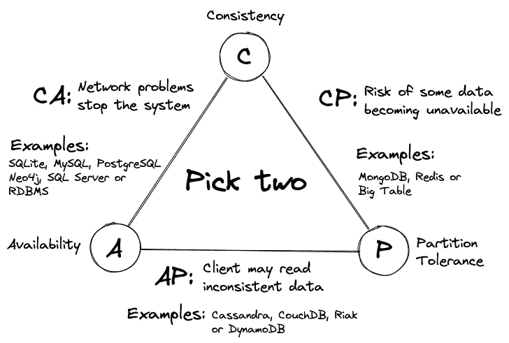
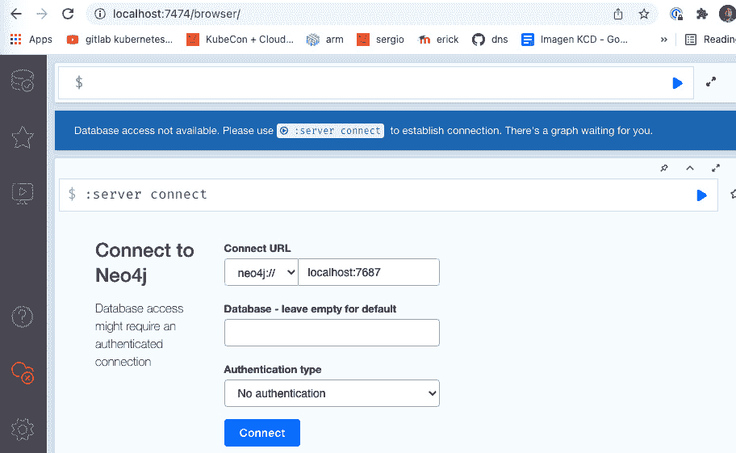
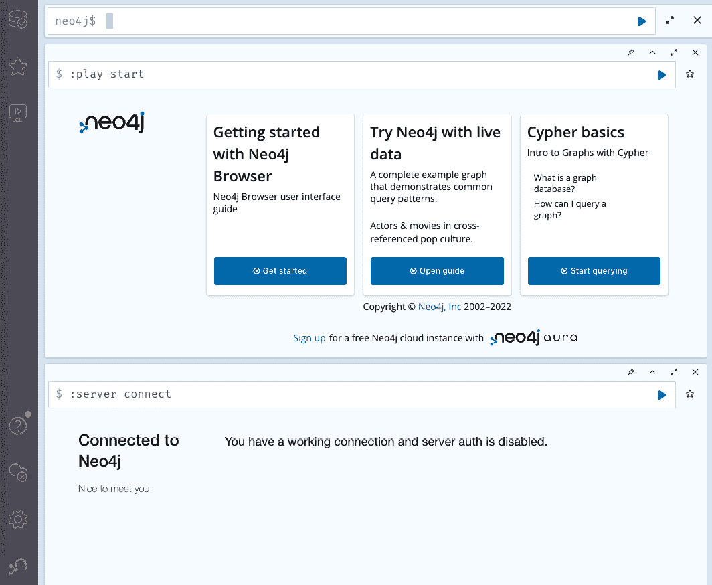
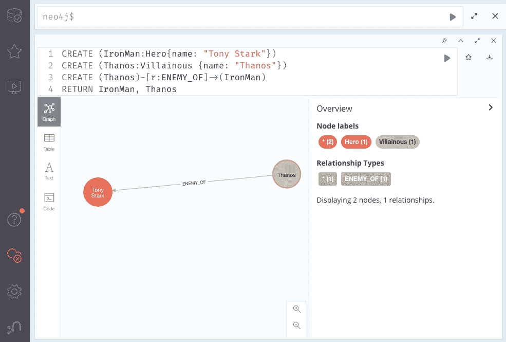

# 10

# 边缘系统中的 SQL 和 NoSQL 数据库

在创建边缘系统时，一个关键任务是存储数据。为此，您需要考虑您拥有的资源、设备使用的处理器以及您要存储的数据类型。CAP 定理指出，分布式数据存储只能提供以下三项保证中的两项：一致性、可用性和分区容错性。因此，这个定理可以帮助您根据系统需求决定哪种类型的数据库最为合适。在本章中，我们将学习如何使用 K3s 和 ARM 设备部署不同类型的数据库，以便在边缘系统上运行。这些示例包括使用 ConfigMaps 和 Secrets 部署数据库等不同技术。

在本章中，我们将涵盖以下主要内容：

+   SQL 和 NoSQL 数据库的 CAP 定理

+   创建一个卷以持久化您的数据

+   使用 MySQL 和 MariaDB SQL 数据库

+   使用 Redis 键值对 NoSQL 数据库

+   使用 MongoDB 文档导向的 NoSQL 数据库

+   使用 PostgreSQL 对象关系型 SQL 数据库

+   使用 Neo4j 图形 NoSQL 数据库

# 技术要求

要在本章中部署数据库，您需要以下内容：

+   一个单节点或多节点的 K3s 集群，使用 ARM 设备并安装了 MetalLB 和 Longhorn 存储。如果您使用的是 Raspberry Pi 设备，至少需要 4 GB 的 RAM 和 4B 型号。每个节点必须安装 Ubuntu ARM64 操作系统，以支持 ARMv8 架构，这对于本章中的某些部署是必要的。

+   `kubectl` 已配置为在本地机器上使用，以避免使用 `--kubeconfig` 参数。

+   如果您希望使用 `kubectl apply` 运行 YAML 配置，而不是从书中复制代码，可以克隆 [`github.com/PacktPublishing/Edge-Computing-Systems-with-Kubernetes/tree/main/ch10`](https://github.com/PacktPublishing/Edge-Computing-Systems-with-Kubernetes/tree/main/ch10) 仓库。查看 `ch10` 目录中的 `yaml` 目录，了解其中的 YAML 示例。

通过这些，您可以部署本章中解释的数据库。因此，让我们首先学习 CAP 定理，以选择适合您特定用例的正确数据库。

# SQL 和 NoSQL 数据库的 CAP 定理

CAP 定理由 Eric Brewer 于 1999 年定义，并于 2000 年在第十九届 ACM 分布式计算原理年会（**PODC**）上提出。该定理指出，分布式数据存储只能提供以下两项保证：

+   **一致性**：这意味着在读取信息时，数据存储返回的是最新写入的数据，或者在失败时返回错误。这指的是常规的 SQL 数据库，它们使用原子操作来保证数据的写入。如果没有，系统会自动回滚到先前的数据状态。

+   **可用性**：这意味着所有的读取操作都包含数据，但可能不是最新的数据。

+   **分区容错性**：这是分布式系统中最理想的特性。它意味着数据被分布在多个节点中，有助于减少数据库的停机时间。这意味着，如果一个节点宕机，只有一小部分数据会无法访问：



图 10.1 – CAP 定理图示

该定理通常作为设计强大的分布式系统时的数据参考点。在 CAP 定理图示（*图 10.1*）中，以三角形形式展示，你可以看到不同的侧面，以及每个侧面如何与其他侧面相互关联。让我们探索这些侧面并举例说明数据库：

+   **CA**：在这一侧，我们可以分类具有一致性和可用性的数据库。这里，我们可以找到 SQLite，它是一个非常简单的数据库。MySQL 和 PostgreSQL 是非常流行的开源数据库。SQL Server 是微软的专有数据库，Neo4j 是一个图数据库。每一个这些数据库都试图保证一致性和可用性。这些保证可以在**关系数据库管理系统**（**RDBMS**）为基础的数据库中找到。但正如我们所提到的，Neo4j 被归类在三角形的这一侧。这个侧面的一个重要特性是，如果网络宕机，数据库将会失败。

+   **CP**：在这一侧，你可以找到提供一致性和分区容错性的数据库。这意味着像 Mongo 和 Redis 这样的数据库使用算法来写入数据，以保证数据的一致性。例如，MongoDB 使用读写算法来写入数据库。Redis 使用类似的算法来写入数据。说到分区容错性，MongoDB 可以将信息分布到多个节点，这赋予了 MongoDB 分区数据的能力。这就是分片，提供了分区容错性特性给 MongoDB。其他基于 Bigtable 的数据库工作原理类似。这些基于 Bigtable 的数据库通常从云端的分布式信息桶中读取数据。CP 中的问题是，当一个节点或数据源宕机时，一些数据可能会变得不可用。

+   **AP**：在这一侧，数据库寻求可用性和分区容错性。这里，我们可以找到像 Cassandra、CouchDB、Riak、DynamoDB 和基于 Cassandra 的数据库。例如，Cassandra 具有高可用性，使用无主技术来扩展服务器，但它不保证数据的一致性。这是一些 NoSQL 数据库常见的问题。

在决定哪个数据库适合你之前，让我们先了解一下什么是关系型数据库和非关系型数据库。**关系型数据库**是结构化数据的数据库。这意味着数据被组织成表格、行和列。这些表格之间有关系和依赖。关系型数据库使用**结构化查询语言**（**SQL**）来管理信息。关系型数据库也叫做**SQL 数据库**，它们还使用 ACID 操作。ACID 代表原子性、一致性、隔离性和持久性；这些数据特性保证了在错误和故障发生时数据的完整性。一些示例包括 MySQL、PostgreSQL 和 SQL Server。

**非关系型数据库**是没有结构化的。它不使用表格、行和列的数据模式，而是使用针对存储数据类型特定需求优化的存储模型。这些数据类型可能是 JSON 文档、键值对等。这些数据库也被称为**NoSQL 数据库**。这些数据库不使用 ACID 操作，它们更关注数据的可用性和分区容忍性。一些示例包括 MongoDB、Redis、Neo4j 和 Cassandra。在选择合适的数据库时，你可以考虑以下几个问题：

+   我的系统需要哪种一致性、分区容忍性和可用性的保障？根据这些，哪种数据库最适合我的系统需求？

+   我的数据库是否需要支持 SQL 语言来查询信息？

+   我需要一个支持 SQL 语言的数据库吗？

+   我的数据是没有结构的 JSON 文档，还是需要一些像表格那样结构化的数据？

+   我存储的数据类型是什么？我需要 SQL 数据库还是 NoSQL 数据库？

+   我需要一致性、可用性还是分区容忍性？这些组件中，哪一个对我的系统最重要？

+   我的数据库将使用多少资源？我的系统预期能够处理多少个并发连接？

+   我是否需要复制信息、实现速率限制或在数据库中实现其他特定功能？

+   我的数据库在写入和读取数据时速度有多快？

+   我如何在数据库上进行复制或扩展？

这些和其他问题在选择合适的数据库时可能非常重要。因此，本章将重点介绍如何通过 CAP 定理快速入门，并给出一些如何部署 SQL 和 NoSQL 数据库的示例，这些数据库在 CAP 定理的描述中有所提及。这些 SQL 和 NoSQL 数据库将使用容器在 K3s 集群的边缘进行部署。

重要提示

在*进一步阅读*部分，你可以找到一些链接，了解更多关于 SQL 和 NoSQL 数据库的内容、章中提到的数据库的官方网页链接以及评估哪个数据库最适合你的用例的补充链接。你可以使用的一个补充定理是 PACELC 定理，它关注的是在数据复制时，延迟和一致性之间的权衡。

现在，在部署你选择的数据库之前，让我们继续创建一个持久化数据的存储卷。

# 创建一个持久化数据的存储卷

在我们开始部署数据库之前，让我们先创建一个存储数据的卷。为此，我们有两个选择。一个是使用服务器内部的目录。这意味着为了避免数据丢失，Pods 必须部署在与卷第一次创建的节点相同的节点上。如果你不想依赖 Pods 所运行的节点，可以选择第二个选项，即使用存储驱动程序。如果你选择这个方案，我们将使用 Longhorn 作为存储驱动。现在，让我们先使用本地目录创建存储。为此，请按照以下步骤操作：

1.  在节点上创建 `/mnt/data` 目录以存储数据：

    ```
    $ cat <<EOF | kubectl apply -f -
    apiVersion: v1
    kind: PersistentVolume
    metadata:
      name: db-pv-volume
      labels:
        type: local
    spec:
      storageClassName: manual
      capacity:
        storage: 5Gi
      accessModes:
        - ReadWriteOnce
      hostPath:
        path: "/mnt/data"
    EOF
    ```

1.  创建一个使用 5 GB 存储空间的 **PersistentVolumeClaim**：

    ```
    $ cat <<EOF | kubectl apply -f -
    apiVersion: v1
    kind: PersistentVolumeClaim
    metadata:
      name: db-pv-claim
    spec:
      storageClassName: manual
      accessModes:
        - ReadWriteOnce
      resources:
        requests:
          storage: 5Gi
    EOF
    ```

如果你想使用 Longhorn 作为存储，请按照以下步骤进行操作：

1.  使用 Longhorn 创建一个 5 GB 存储空间的 PersistentVolumeClaim：

    ```
    $ cat <<EOF | kubectl apply -f -
    apiVersion: v1
    kind: PersistentVolumeClaim
    metadata:
      name: db-pv-claim
    spec:
      accessModes:
        - ReadWriteOnce
      storageClassName: longhorn
      resources:
        requests:
          storage: 5Gi
    EOF
    ```

这是一个关键步骤，用于持久化数据并避免数据丢失。在接下来的章节中，我们将开始部署我们的数据库，首先是基本配置，然后加入更复杂的配置，例如使用 **ConfigMaps** 和 **Secrets** 来进行更接近生产环境的部署。但首先，让我们从 MySQL 和 MariaDB 开始，它们是互联网上非常流行的数据库。

# 使用 MySQL 和 MariaDB SQL 数据库

MySQL 是一个关系型数据库，使用 SQL 语言读取和写入信息。它是互联网上最常用的数据库之一。MariaDB 是 MySQL 的一个分支，本示例中使用的版本与 MySQL 完全兼容。它是一个非常快速的 SQL 数据库，且易于使用。在简要介绍了 MySQL 后，让我们按照以下步骤开始部署该数据库：

1.  创建 MySQL 部署时，创建一个名为 `db-pv-claim` 的 PersistentVolumeClaim：

    ```
    $ cat <<EOF | kubectl apply -f -
    apiVersion: apps/v1
    kind: Deployment
    metadata:
      name: mysql
    spec:
      selector:
        matchLabels:
          app: mysql
      strategy:
        type: Recreate
      template:
        metadata:
          labels:
            app: mysql
        spec:
          containers:
          - image: mysql:8.0.28-oracle
            name: mysql
            env:
            - name: MYSQL_ROOT_PASSWORD
              value: password
            ports:
            - containerPort: 3306
              name: mysql
            volumeMounts:
            - name: mysql-persistent-storage
              mountPath: /var/lib/mysql
          volumes:
          - name: mysql-persistent-storage
            persistentVolumeClaim:
              claimName: db-pv-claim
    EOF
    ```

重要说明

如果不使用 MySQL，你可以选择使用 MariaDB，它与 MySQL 5.6 版本完全兼容。为此，将 `mysql:8.0.28-oracle` 镜像改为 `arm64v8/mariadb:latest`，并将 `MYSQL_ROOT_PASSWORD` 变量改为 `MARIADB_ROOT_PASSWORD`。你还可以在 [`hub.docker.com`](https://hub.docker.com) 上查找其他 MySQL 和 MariaDB 镜像版本。对于此部署，密码为 `password`。部署使用的镜像都是为 ARM 设备设计的。如果你选择重新安装 MySQL 并使用本地存储，你需要使用 `rm -R /mnt/data` 命令删除 `/mnt/data` 目录中的内容，以避免错误。

1.  现在，让我们创建一个服务来通过服务访问 MySQL：

    ```
    $ cat <<EOF | kubectl apply -f -
    apiVersion: v1
    kind: Service
    metadata:
      name: mysql
    spec:
      ports:
      - port: 3306
      selector:
        app: mysql
    clusterIP: None 
    EOF
    ```

1.  为了测试你的 MySQL 部署是否有效，你可以通过运行以下命令来访问部署的 Pod：

    ```
    $ kubectl exec -it $(kubectl get pods -l app=mysql --output=jsonpath={..metadata.name}) -- bash
    ```

在 Pod 内运行以下命令以连接到数据库：

```
$ mysql -h localhost -uroot -ppassword
```

现在，提示符将更改为 `mysql>`。让我们创建一个简单的数据库 `EXAMPLE`，其中包含 `VALUE_TABLE` 表，并插入和列出一些记录。为此，运行以下命令，你将看到类似这样的输出：

```
mysql> CREATE DATABASE EXAMPLE;
Query OK, 1 row affected (0.02 sec)

mysql> USE EXAMPLE;
Database changed
mysql> CREATE TABLE VALUE_TABLE (ID INT PRIMARY KEY NOT NULL,VALUE INT NOT NULL);
Query OK, 0 rows affected (0.10 sec)

mysql> INSERT INTO VALUE_TABLE (ID,VALUE) VALUES (1,123);
Query OK, 1 row affected (0.03 sec)

mysql> SELECT * FROM VALUE_TABLE;
+----+-------+
| ID | VALUE |
+----+-------+
|  1 |   123 |
+----+-------+
1 row in set (0.00 sec)
```

1.  最后，使用以下命令删除表和数据库：

    ```
    mysql> DROP TABLE VALUE_TABLE;
    Query OK, 0 rows affected (0.07 sec)

    mysql> DROP DATABASE EXAMPLE;
    Query OK, 0 rows affected (0.05 sec)

    mysql> EXIT
    Bye
    ```

现在你已经学会了如何使用 MySQL 进行基本部署和示例。接下来让我们学习 Redis 的工作原理。

# 使用 Redis 键值 NoSQL 数据库

现在是时候使用 Redis 作为我们的键值数据库了。Redis 是一个很好的键值数据库，它不会消耗太多资源。所有数据都存储在内存中。它有一些非常有趣的数据类型，如哈希键、列表和集合。它还实现了发布-订阅和流功能，用来实现通信通道和简单的代理功能。对于我们的 Redis 部署，我们将使用自定义配置来设置 Redis 的密码，并使用存储卷来防止数据丢失。要在集群中使用 Redis，请按照以下步骤操作：

1.  创建 `K3s123-` 和 `/data` 目录来存储 Redis 数据：

    ```
    $ cat <<EOF | kubectl apply -f -
    apiVersion: v1
    kind: ConfigMap
    metadata:
      name: redis-configmap
    data:
      redis-config: |
        dir /data
        requirepass YOUR_PASSWORD
    EOF
    ```

1.  使用之前的 ConfigMap `redis-configmap` 创建 Redis 部署，并将其挂载为 `redis.conf` 文件。我们还使用名为 `db-pv-claim` 的 PersistentVolumeClaim，并为部署设置一些资源限制，设置 CPU 和内存。我们通过运行以下命令来创建部署：

    ```
    $ cat <<EOF | kubectl apply -f -
    apiVersion: apps/v1
    kind: Deployment
    metadata:
      labels:
        run: redis
      name: redis
    spec:
      replicas: 1
      selector:
        matchLabels:
          run: redis
      template:
        metadata:
          labels:
            run: redis
        spec:
          containers:
          - name: redis
            image: arm64v8/redis:6.2
            command:
              - redis-server
              - /redisconf/redis.conf
            ports:
            - containerPort: 6379
            resources:
              limits:
                cpu: "0.2"
                memory: "128Mi"
            volumeMounts:
            - mountPath: "/data"
              name: redis-storage
            - mountPath: /redisconf
              name: config
          volumes:
            - name: config
              configMap:
                name: redis-configmap
                items:
                - key: redis-config
                  path: redis.conf
            - name: redis-storage
              persistentVolumeClaim:
                claimName: db-pv-claim
    EOF
    ```

1.  现在创建 `redis`，指向我们 `redis` 部署中的端口 `6379`：

    ```
    $ cat <<EOF | kubectl apply -f -
    apiVersion: v1
    kind: Service
    metadata:
      labels:
        run: redis
      name: redis
    spec:
      ports:
      - port: 6379
        protocol: TCP
        targetPort: 6379
      selector:
        run: redis
      type: ClusterIP
    EOF
    ```

该服务在集群内部创建了一个名为 `redis` 的 DNS 记录，指向我们的 `redis` 部署。其他集群中的部署可以访问该 DNS 记录。

1.  让我们访问 Redis pod，测试一些基本命令来存储值到我们的数据库。为此，运行以下命令：

    ```
    $ kubectl exec -it $(kubectl get pods -l run=redis --output=jsonpath={..metadata.name}) -- redis-cli
    ```

提示符将如下所示：`127.0.0.1:6379>`。

1.  现在，使用 `AUTH` 命令认证 Redis 数据库，然后使用 `set` 和 `get` 命令创建 `a` 键并赋值为 `1`。最后，使用 `exit` 命令退出。这个简单的测试将如下所示：

    ```
    127.0.0.1:6379> AUTH YOUR_PASSWORD
    OK
    127.0.0.1:6379> set a 1
    OK
    127.0.0.1:6379> get a
    "1"
    127.0.0.1:6379> exit
    ```

这样，你就把 `a` 键存储了值 `1`。现在你已经使用 Redis 存储了简单的值。运行 `exit` 后，你将退出 Redis pod。

现在你已经学会了如何部署一个简单的 Redis 部署，接下来是时候在下一节部署 MongoDB 了。

# 使用 MongoDB 文档导向的 NoSQL 数据库

MongoDB 是一个面向文档的 NoSQL 数据库。它将数据存储为 JSON 文档，并实现了分片技术以将数据分布到各个节点，同时使用 MapReduce 技术进行数据聚合。它易于使用，并且在单节点场景下占用较少的资源。对于我们的 MongoDB 部署，我们将使用 ConfigMap 来存储自定义配置。在这个案例中，我们的 MongoDB 配置设置为在网络上暴露其端口，但为了简化部署，我们暂时没有使用 Secrets。在 *使用 PostgreSQL 对象关系型 SQL 数据库* 部分，我们将探讨使用 Secrets，但在此之前，让我们按照接下来的步骤部署 MongoDB：

1.  部署你的自定义配置以允许客户端连接到 MongoDB：

    ```
    $ cat <<EOF | kubectl apply -f -
    apiVersion: v1
    kind: ConfigMap
    metadata:
      name: mongo-configmap
    data:
      mongod-conf: |
        dbpath=/var/lib/mongodb
        logpath=/var/log/mongodb/mongodb.log
        logappend=true
        bind_ip = 0.0.0.0
        port = 27017
        journal=true
        auth = true
    EOF
    ```

这会让 MongoDB 在网络上监听 `27017` 端口。

1.  使用名为 `mongo-configmap` 的 ConfigMap、PersistentVolumeClaim 以及设置初始 root 用户、用户和连接 MongoDB 所需密码的 `MONGO_INITDB_ROOT_USERNAME`、`MONGO_INITDB_ROOT_PASSWORD` 和 `MONGO_INITDB_DATABASE` 变量来创建部署：

    ```
    $ cat <<EOF | kubectl apply -f -
    apiVersion: apps/v1
    kind: Deployment
    metadata:
      labels:
        app: mongo
      name: mongo
    spec:
      replicas: 1
      selector:
        matchLabels:
          app: mongo
      template:
        metadata:
          labels:
            app: mongo
        spec:
          containers:
          - image: arm64v8/mongo:4.4
            name: mongo
            env:
            - name: MONGO_INITDB_ROOT_USERNAME
              value: "admin"
            - name: MONGO_INITDB_ROOT_PASSWORD
              value: "YOUR_PASSWORD"
            - name: MONGO_INITDB_DATABASE
              value: "mydatabase"
            ports:
            - containerPort: 27017
            resources:
              limits:
                cpu: "0.5"
                memory: "200Mi"
            volumeMounts:
            - mountPath: "/data/db"
              name: mongo-storage
            - mountPath: /mongoconf
              name: config
          volumes:
            - name: config
              configMap:
                name: mongo-configmap
                items:
                - key: mongod-conf
                  path: mongod.conf
            - name: mongo-storage
              persistentVolumeClaim:
                claimName: db-pv-claim
    EOF
    ```

重要提示

请注意，如果你想使用 MongoDB 版本大于 5.0，你需要一台支持 ARMv8.2-A 或更高版本的设备。这个原因使得我们在这个示例中使用了 MongoDB 4.4。MongoDB 4.4 支持在 ARMv8 处理器（如 Raspberry Pi）上运行。

1.  现在创建一个服务，将你的 MongoDB 部署暴露为一个在集群内可访问的服务（MongoDB 使用 `27017` 端口连接）：

    ```
    $ cat <<EOF | kubectl apply -f -
    apiVersion: v1
    kind: Service
    metadata:
      labels:
        app: mongo
      name: mongo
    spec:
      ports:
      - port: 27017
        protocol: TCP
        targetPort: 27017
      selector:
        app: mongo
      type: ClusterIP
    EOF
    ```

1.  访问包含 MongoDB 的 pod 来测试你是否能够写入一些数据：

    ```
    $ kubectl exec -it $(kubectl get pods -l app=mongo --output=jsonpath={..metadata.name}) -- mongo -uadmin -pYOUR_PASSWORD
    ```

一旦进入 pod，切换到 `mydatabase`，并使用 `db.mycollection.insert` 向 `mycollection` 集合中插入 `{"a":1}` 文档。然后，使用 `db.mycollection.find` 列出插入的文档。最后，执行 `exit` 来结束 Mongo 会话。此操作的命令和输出将如下所示：

```
> use mydatabase
switched to db mydatabase
> db.mycollection.insert({"a":1})
WriteResult({ "nInserted" : 1 })
> db.mycollection.find()
{ "_id" : ObjectId("622c498199789d3b03b20c45"), "a" : 1 }
> exit
Bye
```

这些是一些用于快速开始使用 MongoDB 的基本命令。

现在你已经知道如何在 K3s 中部署一个简单的 MongoDB 数据库，接下来让我们进入下一部分，学习如何使用 Postgres。

# 使用 PostgreSQL 对象关系型 SQL 数据库

PostgreSQL 是一种对象关系型数据库，以其可靠性、功能强大性和性能出名。它使用 SQL 来查询数据。它还常用于存储文件或存储用于创建机器学习模型的数据。因此，让我们学习如何以一种非常简单的方式部署 PostgreSQL。为此，请按照以下步骤操作：

1.  在这个示例中，让我们使用 Kubernetes Secrets，并将密码设置为 `YOUR_PASSWORD`，以展示如何隐藏敏感信息如密码。为此，让我们使用以下命令生成密码的 Base64 编码：

    ```
    $ echo "YOUR_PASSWORD"| tr -d "\n"  | base64
    ```

输出将如下所示：

```
WU9VUl9QQVNTV09SRA==
```

1.  使用之前的输出，通过 YAML 文件创建您的 Secret 对象。您可以使用以下命令创建具有此值的 `db-password` Secret：

    ```
    $ cat <<EOF | kubectl apply -f -
    apiVersion: v1
    kind: Secret
    metadata:
      name: db-password
    data:
      password: WU9VUl9QQVNTV09SRA==
    EOF
    ```

1.  现在使用以下命令创建 Postgres 部署：

    ```
    $ cat <<EOF | kubectl apply -f -
    apiVersion: apps/v1
    kind: Deployment
    metadata:
      labels:
        app: postgres
      name: postgres
    spec:
      replicas: 1
      selector:
        matchLabels:
          app: postgres
      template:
        metadata:
          labels:
            app: postgres
        spec:
          containers:
          - image: arm64v8/postgres:14.2
            name: postgres
            env:
    - name: PGDATA 
    value: "/var/lib/postgresql/data/pgdata" 
    - name: POSTGRES_PASSWORD 
    valueFrom: 
    secretKeyRef: 
    name: db-password 
                    key: password
            ports:
            - containerPort: 5432
            resources:
              limits:
                cpu: "0.5"
                memory: "200Mi"
            volumeMounts:
            - mountPath: "/var/lib/postgresql/data"
              name: postgres-storage
          volumes:
            - name: postgres-storage
              persistentVolumeClaim:
                claimName: db-pv-claim
    EOF
    ```

1.  现在通过运行以下命令创建 `postgres` 服务：

    ```
    $ cat <<EOF | kubectl apply -f -
    apiVersion: v1
    kind: Service
    metadata:
      labels:
        app: postgres
      name: postgres
    spec:
      ports:
      - port: 5432
        protocol: TCP
        targetPort: 5432
      selector:
        app: postgres
      type: ClusterIP
    EOF
    ```

1.  访问包含 Postgres 的 pod，测试是否能够写入一些数据。为此，请运行以下命令：

    ```
    $ kubectl exec -it $(kubectl get pods -l app=postgres --output=jsonpath={..metadata.name}) -- bash -c "PGPASSWORD='YOUR_PASSWORD' psql -h postgres -U postgres"
    ```

1.  提示符将显示为 `postgres=#`。接下来，您将看到一些示例命令及其输出。这些命令将用于测试我们的数据库是否正常工作。

首先，创建包含 `ID` 和 `VALUE` 字段的 `VALUE_TABLE` 表：

```
postgres=# CREATE TABLE VALUE_TABLE (ID INT PRIMARY KEY NOT NULL,VALUE INT NOT NULL);
CREATE TABLE
```

然后插入一条记录，`ID`=`1` 和 `VALUE`=`123`：

```
postgres=# INSERT INTO VALUE_TABLE (ID,VALUE) VALUES (1,123);
INSERT 0 1
```

显示这些值：

```
postgres=# SELECT * FROM VALUE_TABLE;
 id | value
----+-------
  1 |   123
(1 row)
```

删除表：

```
postgres=# DROP TABLE VALUE_TABLE;
DROP TABLE
```

退出 Postgres：

```
postgres=# exit
```

现在，您已经学会了如何安装并运行基本命令，通过 Postgres 存储您的数据，让我们继续学习 Neo4j 这款图形 NoSQL 数据库，下一节将介绍它。

# 使用 Neo4j 图形 NoSQL 数据库

Neo4j 是一款图形数据库，可用于存储对象之间的关系。Neo4j 使用 **Cypher 查询语言**（**CQL**），它相当于关系数据库中的 SQL。Neo4j 还通过节点、关系、属性和标签以可视化方式表示数据。它支持 ACID 操作和原生图形存储与处理，具有出色的可扩展性和企业支持。由于其存储数据的方式，它可以用于 IoT 应用程序，以查询数据之间的关系。现在，让我们按照以下步骤安装 Neo4j：

1.  创建 Neo4j 的部署：

    ```
    $ cat <<EOF | kubectl apply -f -
    apiVersion: apps/v1
    kind: Deployment
    metadata:
      labels:
        app: neo4j
      name: neo4j
    spec:
      replicas: 1
      selector:
        matchLabels:
          app: neo4j
      template:
        metadata:
          labels:
            app: neo4j
        spec:
          containers:
          - image: arm64v8/neo4j
            name: neo4j
            env:
            - name: NEO4J_AUTH
              value: none
            ports:
                - containerPort: 7474
                  name: http
                - containerPort: 7687
                  name: bolt
                - containerPort: 7473
                  name: https
            volumeMounts:
                - name: neo4j-data
                  mountPath: "/var/lib/neo4j/data"
          volumes:
              - name: neo4j-data
                persistentVolumeClaim:
                  claimName: db-pv-claim
    EOF
    ```

在此部署中，我们使用了 `NEO4J_AUTH` 变量，并将其值设置为 `none`，以使用非认证方法，只是为了简化此示例。您还可以通过修改此配置，探索如何使用密钥和其他选项。

重要提示

如果删除 `NEO4J_AUTH` 变量，Neo4j 默认将用户名和密码设置为 `neo4j`。然后，登录后会弹出对话框要求您更改此密码。

1.  创建服务以暴露 Neo4j 使用的 `bolt`、`http` 和 `https` 端口：

    ```
    $ cat <<EOF | kubectl apply -f -
    apiVersion: v1
    kind: Service
    metadata:
      labels:
        app: neo4j
      name: neo4j
    spec: 
      ports:
      - name: https
        port: 7473
        protocol: TCP
        targetPort: 7473
      - name: http
        port: 7474
        protocol: TCP
        targetPort: 7474
      - name: bolt
        port: 7687
        protocol: TCP
        targetPort: 7687
      selector:
        app: neo4j
      type: ClusterIP
    EOF
    ```

1.  在连接到 Neo4j 浏览器之前，暴露 `http` 和 `bolt` 端口。为此，请在不同的终端中运行以下命令：

    ```
    $ kubectl port-forward service/neo4j 7474:7474
    $ kubectl port-forward service/neo4j 7687:7687
    ```

1.  在浏览器中打开 `http://localhost:7474` 页面，选择 **认证类型**：**无认证**，然后点击 **连接** 按钮：



图 10.2 – Neo4j 登录页面

然后，您将看到 Neo4j 用户界面：



图 10.3 – Neo4j 主页

1.  在浏览器顶部的 Neo4j 终端（显示为 `neo4j$`）中运行一个简单示例。为此，添加接下来的命令并通过点击蓝色三角按钮运行：

    ```
    CREATE (IronMan:Hero{name: "Tony Stark"}) 
    CREATE (Thanos:Villainous {name: "Thanos"})
    CREATE (Thanos)-[r:ENEMY_OF]->(IronMan) 
    RETURN IronMan, Thanos
    ```

您将看到 Neo4j 如何可视化 Marvel 角色之间的关系：



图 10.4 – Neo4j 图形可视化

现在您已经通过这个基本示例了解了如何使用 Neo4j，接下来让我们回顾一下本章的总结，看看我们学到了什么。

# 总结

在本章中，我们学习了如何使用 CAP 定理来选择合适的数据库来存储数据。这个定理帮助我们在设计边缘分布式系统中的分布式数据存储时，考虑到一些重要的保证。在本章中，我们还学习了不同的关系型和非关系型数据库。我们获得了有关如何设置和部署各种数据库范式（如关系型数据库、键值数据库、文档导向数据库和图数据库）的实践知识。在下一章中，我们将重点介绍时间序列数据库 Prometheus，它以值和时间的形式存储数据，并可用于实现边缘设备的有用监控仪表板。

# 问题

以下是一些问题，帮助您验证新获得的知识：

+   如何通过 CAP 定理根据您的使用案例决定使用哪种数据库？

+   如何在 K3s 中部署 MySQL？

+   如何在 K3s 中部署 Redis？

+   如何在 K3s 中部署 MongoDB？

+   如何在 K3s 中部署 PostgreSQL？

+   如何在 K3s 中部署 Neo4j？

+   如何使用 PersistentVolumeClaims 在 K3s 中部署数据库？

+   如何使用 ConfigMaps 和 Secrets 在 K3s 中部署数据库？

# 进一步阅读

您可以参考以下资料，了解本章涵盖的更多主题：

+   *数据库与 SQLite 快速概述*：[`medium.com/aiadventures/databases-and-quick-overview-of-sqlite-5b7d4f8f6174`](https://medium.com/aiadventures/databases-and-quick-overview-of-sqlite-5b7d4f8f6174)

+   *数据库的 CAP 定理：一致性、可用性与分区容错性*：[`www.bmc.com/blogs/cap-theorem`](https://www.bmc.com/blogs/cap-theorem)

+   非关系数据与 NoSQL：[`aloa.co/blog/relational-vs-non-relational-database-pros-cons`](https://aloa.co/blog/relational-vs-non-relational-database-pros-cons)

+   CAP 定理：[`devopedia.org/cap-theorem`](https://devopedia.org/cap-theorem)

+   *系统设计基础：什么是 CAP 定理？*：[`www.educative.io/blog/what-is-cap-theorem`](https://www.educative.io/blog/what-is-cap-theorem)

+   *事务的 ACID 属性是什么？它们在数据工程中为何如此重要？*：[`www.keboola.com/blog/acid-transactions`](https://www.keboola.com/blog/acid-transactions)

+   *SQL 与 NoSQL 数据库：有什么区别？*：[`www.bmc.com/blogs/sql-vs-nosql`](https://www.bmc.com/blogs/sql-vs-nosql)

+   *从传统关系数据库到 NoSQL 数据库：大数据时代的数据库新纪元*：[`www.researchgate.net/publication/324922396_TRADITIONAL_RDBMS_TO_NOSQL_DATABASE_NEW_ERA_OF_DATABASES_FOR_BIG_DATA`](https://www.researchgate.net/publication/324922396_TRADITIONAL_RDBMS_TO_NOSQL_DATABASE_NEW_ERA_OF_DATABASES_FOR_BIG_DATA)

+   MySQL 客户端 K8s: [`gist.github.com/vishnuhd/b8686197f855c00fa734bc5f1fedf078`](https://gist.github.com/vishnuhd/b8686197f855c00fa734bc5f1fedf078)

+   *运行单实例有状态应用程序*: [`kubernetes.io/docs/tasks/run-application/run-single-instance-stateful-application`](https://kubernetes.io/docs/tasks/run-application/run-single-instance-stateful-application)

+   *MySQL 8 管理员指南*: [`www.packtpub.com/product/mysql-8-administrator-s-guide/9781788395199`](https://www.packtpub.com/product/mysql-8-administrator-s-guide/9781788395199)

+   *使用 ConfigMap 配置 Redis*: [`kubernetes.io/docs/tutorials/configuration/configure-redis-using-configmap`](https://kubernetes.io/docs/tutorials/configuration/configure-redis-using-configmap)

+   *Redis Essentials*: [`www.packtpub.com/product/redis-essentials/9781784392451`](https://www.packtpub.com/product/redis-essentials/9781784392451)

+   Kubernetes secrets: [`kubernetes.io/fr/docs/concepts/configuration/secret`](https://kubernetes.io/fr/docs/concepts/configuration/secret)

+   *七天内掌握七种 NoSQL 数据库*: [`www.packtpub.com/product/seven-nosql-databases-in-a-week/9781787288867`](https://www.packtpub.com/product/seven-nosql-databases-in-a-week/9781787288867)

+   *如何使用 Kubernetes 部署 PostgreSQL*: [`www.sumologic.com/blog/kubernetes-deploy-postgres`](https://www.sumologic.com/blog/kubernetes-deploy-postgres)

+   *PostgreSQL 14 管理手册*: [`www.packtpub.com/product/postgresql-14-administration-cookbook/9781803248974`](https://www.packtpub.com/product/postgresql-14-administration-cookbook/9781803248974)

+   *物联网和数据：强大的连接*: [`neo4j.com/news/internet-things-data-powerful-connection`](https://neo4j.com/news/internet-things-data-powerful-connection)

+   为什么不使用 SQLite: [`stackoverflow.com/questions/66950385/how-to-use-sqlite3-database-with-django-on-kuberenets-pod`](https://stackoverflow.com/questions/66950385/how-to-use-sqlite3-database-with-django-on-kuberenets-pod)

+   *使用 Python、Neo4j、Gephi 和 Linkurious.js 创建图形应用程序*: [`linkurious.com/blog/creating-a-graph-application-with-python-neo4j-gephi-and-linkurious-js`](https://linkurious.com/blog/creating-a-graph-application-with-python-neo4j-gephi-and-linkurious-js)

# 第三部分：实际边缘计算使用案例

在这一部分，您将学习如何在不同的使用情景下使用 k3s 和 k3OS，探索构建边缘计算系统的互补软件和最佳实践。

本书的这一部分包括以下章节:

+   *第十一章*，*使用 Prometheus 和 Grafana 监控边缘*

+   *第十二章*，*使用 LoRa 远程通信边缘设备*

+   *第十三章*，*使用 GPS、NoSQL 和 K3s 集群的地理定位应用*

+   *第十四章*，*使用 Python 和 K3s 集群进行计算机视觉*

+   *第十五章*，*设计你自己的边缘计算系统*
