# 第十一章：使用 Prometheus 和 Grafana 监控边缘设备

边缘计算的一个应用场景是监控获取温度、湿度、速度、噪声等数据的设备。对于这种类型的用例，监控至关重要。本章展示了一个简单的用例，说明如何可视化来自边缘设备传感器的数据。本章提供了一个完整的示例，展示了如何在边缘计算系统的不同层次间分发和处理数据。该用例以 Prometheus 和 Grafana 为主要组件，来可视化和存储来自传感器的数据，并使用 Mosquitto（MQTT 消息代理）与 Redis 结合，实现高可用队列来处理边缘数据。

在本章中，我们将涵盖以下主要内容：

+   监控边缘环境

+   部署 Redis 以持久化 Mosquitto 传感器数据

+   安装 Mosquitto 以处理传感器数据

+   处理 Mosquitto 主题

+   安装 Prometheus，一个时间序列数据库

+   部署 Prometheus 的自定义 exporter

+   配置 DHT11 传感器，以发送湿度和温度数据

+   安装 Grafana 以创建仪表盘

# 技术要求

为了部署本章中的数据库，你需要以下内容：

+   一个单节点或多节点的 K3s 集群，使用带有 MetalLB 和 Longhorn 存储的 ARM 设备。如果你使用 Raspberry Pi 设备，你需要至少 4GB 的 RAM，并且至少是 4B 型号。每个节点必须运行 Ubuntu ARM64 操作系统，以支持 ARMv8 处理器。这种处理器类型是某些部署运行所必需的，因为它们使用 ARM64 容器镜像。

+   一个托管在你的公共云提供商（AWS、Azure 或 GCP）或私人云中的 Kubernetes 集群。

+   配备 2GB 或 4GB 的 Raspberry Pi 4B 作为边缘设备。

+   连接到你的边缘设备的 Keyes DHT11 传感器或类似设备，用于读取温度和湿度。

+   配置好`kubectl`，以便在你的本地机器上使用 Kubernetes 云集群和边缘集群，避免使用`--kubeconfig`参数。

+   如果你想通过使用`kubectl apply`运行 YAML 配置，而不是从书中复制代码，请克隆[`github.com/PacktPublishing/Edge-Computing-Systems-with-Kubernetes/tree/main/ch11`](https://github.com/PacktPublishing/Edge-Computing-Systems-with-Kubernetes/tree/main/ch11) 仓库。查看`code`目录获取 Python 源代码，查看`yaml`目录获取位于`ch11`目录中的 YAML 配置文件。

这样，你就可以部署 Prometheus 和 Grafana，开始监控边缘环境中的传感器数据。

# 监控边缘环境

在开始构建我们的监控系统之前，让我们描述一下边缘计算不同层次的系统架构。为此，我们来看看以下图表：

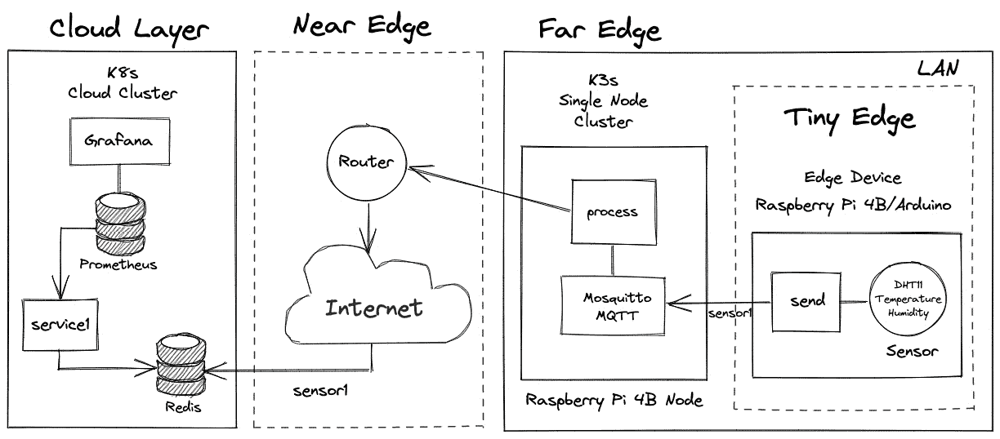

图 11.1 – 使用边缘设备进行监控

该图分为不同的层次。让我们描述一下我们想要实现的这个用例的不同组件：

+   `send.py`。该文件准备传感器读取数据，并将信息发送到 Mosquitto 经纪人中的队列。

+   `sensor1`。每次该进程检测到新数据时，这些数据会被发送到云层中的名为 `sensor1` 的 Redis 队列。目的是让名为 `process` 的部署处理以适合在云层中显示的格式的数据。通过这样做，你是在边缘附近处理数据；这是边缘计算的目标。

+   **近端边缘**：这是连接边缘设备与 K3s 集群以处理数据的家庭路由器。它也是将数据发送到云层公共 Redis 集群的网关。

+   `service1` 负责从 `sensor1` Redis 队列中读取数据，并将其导出到 Prometheus。Prometheus 调用 `service1` 服务端点以获取数据。因此，每次 Prometheus 调用 `app1` 端点时，`service1` 会返回存储在 Redis 中的数据，格式适合 Prometheus 消耗。最后，当数据存储在 Prometheus 中时，数据会在 Grafana 仪表板上实时可视化。

如你所见，这个小型用例包括了不同边缘计算层次之间的完整交互。这个用例旨在作为基础代码，可以根据你的系统需求进行扩展。现在，让我们开始实现我们的用例，从部署 Redis 来持久化 Mosquitto 传感器数据开始。

# 部署 Redis 来持久化 Mosquitto 传感器数据

为了安装我们的 Redis 以持久化 Mosquitto 天气数据，我们将使用带有持久化功能的 Redis，并使用单一的消息列表。要在集群中部署这个 Redis 设置，请按照以下步骤操作：

1.  使用节点中的 `/mnt/data` 目录创建 PersistentVolume，以持久化 Redis 数据：

    ```
    $ cat <<EOF | kubectl apply -f -
    apiVersion: v1
    kind: PersistentVolume
    metadata:
      name: db-pv-volume
      labels:
        type: local
    spec:
      storageClassName: manual
      capacity:
        storage: 5Gi
      accessModes:
        - ReadWriteOnce
      hostPath:
        path: "/mnt/data"
    EOF
    ```

1.  使用 5 GB 或更多存储空间创建一个 PersistentVolumeClaim，具体取决于你正在处理的传感器数量和数据量：

    ```
    $ cat <<EOF | kubectl apply -f -
    apiVersion: v1
    kind: PersistentVolumeClaim
    metadata:
      name: db-pv-claim
    spec:
      storageClassName: manual
      accessModes:
        - ReadWriteOnce
      resources:
        requests:
          storage: 5Gi
    EOF
    ```

重要提示

如果你的系统中安装了 Longhorn，可以使用 `longhorn` 类。有关更多信息，请参见 *第五章*，*K3s 家庭实验室用于边缘计算实验*。

1.  现在，让我们创建一个 ConfigMap，使用自定义配置，其中包括密码 `YOUR_PASSWORD` 和用于存储 Redis 数据的 `/data` 目录：

    ```
    $ cat <<EOF | kubectl apply -f -
    apiVersion: v1
    kind: ConfigMap
    metadata:
      name: redis-configmap
      namespace: monitoring
    data:
      redis-config: |
        dir /data
        requirepass YOUR_PASSWORD
    EOF
    ```

1.  使用之前创建的 ConfigMap `redis-configmap` 创建 Redis 部署。该 ConfigMap 被挂载为一个卷，其内容可通过 `redis.conf` 文件访问。它还使用一个名为 `db-pv-claim` 的 PersistentVolumeClaim，并使用 CPU 和内存的资源限制。我们通过运行以下命令来创建这个部署：

    ```
    $ cat <<EOF | kubectl apply -f -
    apiVersion: apps/v1
    kind: Deployment
    metadata:
      labels:
        run: redis
      name: redis
      namespace: monitoring
    spec:
      replicas: 1
      selector:
        matchLabels:
          run: redis
      template:
        metadata:
          labels:
            run: redis
        spec:
          containers:
          - name: redis
            image: redis:6.2
            command:
              - redis-server
              - /redisconf/redis.conf
            ports:
            - containerPort: 6379
            resources:
              limits:
                cpu: "0.2"
                memory: "128Mi"
            volumeMounts:
            - mountPath: "/data"
              name: redis-storage
            - mountPath: /redisconf
              name: config
          volumes:
            - name: config
              configMap:
                name: redis-configmap
                items:
                - key: redis-config
                  path: redis.conf
            - name: redis-storage
              persistentVolumeClaim:
                claimName: db-pv-claim
    EOF
    ```

重要提示

如果你计划在 ARM 节点上部署 Redis，可以使用 `arm64v8/redis:6.2` 镜像，而不是 `redis:6.2`。

1.  现在创建 `redis` 服务，在配置中设置端口 `6379`：

    ```
    $ cat <<EOF | kubectl apply -f -
    apiVersion: v1
    kind: Service
    metadata:
      labels:
        run: redis
      name: redis
      namespace: monitoring
    spec:
      ports:
      - port: 6379
        protocol: TCP
        targetPort: 6379
      selector:
        run: redis
      type: ClusterIP
    EOF
    ```

该服务将被 Prometheus 的导出器 `service1` 使用。

1.  现在创建一个名为 `redis-lb` 的 `LoadBalancer` 服务，创建一个公共负载均衡器，供 `process` 服务使用，以存储从远端边缘到云层的数据：

    ```
    $ cat <<EOF | kubectl apply -f -
    apiVersion: v1
    kind: Service
    metadata:
      labels:
        run: redis
      name: redis-lb
      namespace: monitoring
    spec:
      ports:
      - port: 6379
        protocol: TCP
        targetPort: 6379
      selector:
        run: redis
      type: LoadBalancer
    EOF
    ```

这将创建一个外部 IP 用于访问 Redis。

1.  要获取前一个 `LoadBalancer` 服务生成的公共 IP，请运行以下命令：

    ```
    $ EXTERNAL_IP="$(kubectl get svc redis-lb -n monitoring  -o=jsonpath='{.status.loadBalancer.ingress[0].ip}')"
    ```

此 IP 将被部署进程使用。

现在我们的 Redis 已经准备好在远程边缘使用。让我们安装 Mosquitto，将来自 Mosquitto 的传感器数据发送到 `sensor1` 主题。

# 安装 Mosquitto 以处理传感器数据

Mosquitto 是一个开源代理，实施 MQTT 协议，而且它也非常轻量。它被设计用来与低功耗传感器和设备一起使用。这使得 Mosquitto 非常适合边缘计算和物联网应用。Mosquitto 为边缘设备提供了轻量级的通信通道，并使用发布/订阅模式来发送和读取消息，但它并不持久化。我们将稍后使用 Redis 来为数据队列提供缺失的临时持久性。现在，让我们继续在远程边缘的边缘集群中安装 Mosquitto。请记住，这个单节点集群使用的是 ARM 设备。要部署 Mosquitto，请遵循以下步骤：

1.  创建一个 ConfigMap，用于监听所有可用的网络接口：

    ```
    $ cat <<EOF | kubectl apply -f -
    apiVersion: v1
    kind: ConfigMap
    metadata:
      name: mosquitto-configmap
    data:
      mosquitto-config: |
        listener 1883 0.0.0.0
        allow_anonymous true
    EOF
    ```

1.  现在为 Mosquitto 创建一个部署，将端口设置为 `1883` 用于 MQTT 协议，`9001` 用于 HTTP 请求。该部署将使用之前创建的 `mosquitto-configmap`：

    ```
    $ cat <<EOF | kubectl apply -f -
    apiVersion: apps/v1 
    kind: Deployment
    metadata:
      labels:
        app: mosquitto
      name: mosquitto
    spec:
      replicas: 1
      selector:
        matchLabels:
          app: mosquitto
      template:
        metadata:
          labels:
            app: mosquitto
        spec:
          containers:
          - name: mosquitto
            image: arm64v8/eclipse-mosquitto:2.0.14
            ports:
            - containerPort: 1883
              name: mqtt
            - containerPort: 9001
              name: http
            resources:
              limits:
                cpu: "0.2"
                memory: "128Mi"
            volumeMounts:
    - mountPath: /mosquitto/config 
    name: config 
          volumes:
            - name: config
              configMap:
                name: mosquitto-configmap
                items:
                - key: mosquitto-config
    path: mosquitto.conf 
    EOF
    ```

你可以自定义该部署所使用的 RAM 和 CPU 的数量。

1.  现在创建一个 `ClusterIP` 服务来暴露 Mosquitto，以便集群内的其他服务可以连接到 Mosquitto 以读取消息：

    ```
    $ cat <<EOF | kubectl apply -f -
    apiVersion: v1
    kind: Service
    metadata:
      labels:
        app: mosquitto
      name: mosquitto
    spec:
      ports:
      - name: mqtt
        port: 1883
        protocol: TCP
        targetPort: 1883
      - name: http
        port: 9001
        protocol: TCP
        targetPort: 9001
      selector:
        app: mosquitto
      type: ClusterIP
    EOF
    ```

1.  现在创建一个 LoadBalancer 服务来暴露 Mosquitto，以便边缘设备可以连接到 Mosquitto，发布带有天气指标的消息。在此示例中，我们的设备将发布到 `sensor1` 主题：

    ```
    $ cat <<EOF | kubectl apply -f -
    apiVersion: v1
    kind: Service
    metadata:
      labels:
        app: mosquitto
      name: mosquitto-lb
    spec:
      ports:
      - name: mqtt
        port: 1883
        protocol: TCP
        targetPort: 1883
      - name: http
        port: 9001
        protocol: TCP
        targetPort: 9001
      selector:
        app: mosquitto
      type: LoadBalancer
    EOF
    ```

现在，让我们部署 `process` 服务，将 Mosquitto 主题中存储的所有天气数据发送到云层中的 Redis 数据库。

# 处理 Mosquitto 主题

我们需要使用 `mqttsubs` 容器镜像来部署名为 `process` 的部署，该镜像将 Mosquitto 中发布的数据发送到云层中的公共或私有 Redis 实例。让我们来看看这个容器镜像中的代码：

```
import paho.mqtt.client as mqtt
import os
import redis
import sys

mqhost = os.environ['MOSQUITTO_HOST']
rhost = os.environ['REDIS_HOST']
rauth = os.environ['REDIS_AUTH']
stopic = os.environ['SENSOR_TOPIC']

def on_connect(client, userdata, flags, rc):
    client.subscribe(stopic)

def on_message(client, userdata, msg):
    r = redis.StrictRedis(host=rhost,\
        port=6379,db=0,password=rauth,\
        decode_responses=True)
    r.rpush(stopic,msg.payload)

client = mqtt.Client()
client.on_connect = on_connect
client.on_message = on_message
client.connect(mqhost, 1883, 60)
client.loop_forever()
```

注意

你可以在 [`github.com/sergioarmgpl/containers/tree/main/mqttsubs/src`](https://github.com/sergioarmgpl/containers/tree/main/mqttsubs/src) 找到 `mqttsubs` 的源代码。

通过这段代码，我们获取连接 Redis 所需的值，以及我们将要使用的主题名称。这个值将用于将传感器数据推送到 Redis 列表中。最后，`MOSQUITTO_HOST` 是该服务将要监听的地方。这个脚本的基本功能是开始监听名为 `sensor1` 的 `SENSOR_TOPIC` 主题，当消息到达时，它会将其插入到云层中的同名 Redis 列表中，以便临时持久化信息。Redis 使用端口 `6379`，是公共的，但需要密码。Mosquitto 部署在远端边缘。这就是该服务的工作原理。

要开始部署我们的 `process` 部署，按照以下步骤操作：

1.  创建一个 Secret 来存储连接 Redis 的密码。Redis 将用于存储来自我们 Mosquitto 部署的所有信息：

    ```
    $ cat <<EOF | kubectl apply -f -
    apiVersion: v1
    kind: Secret
    metadata:
      name: db-password
    data:
      password: WU9VUl9QQVNTV09SRA==
    EOF
    ```

密码的值对应于使用 base64 编码的下一条命令的输出：

```
$ echo "YOUR_PASSWORD" | tr -d '\n'  | base64
```

1.  创建 `process` 部署，该部署接收来自 Mosquitto 主题的数据，并将其发送到位于云层的 Redis 服务。为此，运行以下命令：

    ```
    $ cat <<EOF | kubectl apply -f -
    apiVersion: apps/v1
    kind: Deployment
    metadata:
      labels:
        app: process
      name: process
    spec:
      replicas: 1
      selector:
        matchLabels:
          app: process
      template:
        metadata:
          labels:
            app: process
        spec:
          containers:
          - image: sergioarmgpl/mqttsubs
            imagePullPolicy: Always
            name: mqttsubs
            env:
            - name: MOSQUITTO_HOST
              value: "mosquitto"
            - name: REDIS_HOST
              value: "192.168.0.242"
            - name: REDIS_AUTH
              valueFrom:
                 secretKeyRef:
                    name: db-password
                    key: password
            - name: SENSOR_TOPIC
    value: "sensor1" 
    EOF
    ```

使用的变量如下：

+   **MOSQUITTO_HOST：** 这是 Mosquitto 部署正在监听的主机名。

+   **REDIS_HOST：** 这是分配给 LoadBalancer 服务的 IP 地址，用于在云中公开 Redis。

+   `db-password` 秘密值，用于设置连接 Redis 的密码。

+   **SENSOR_TOPIC：** 该变量设置要监听的 Mosquitto 主题，以便从传感器获取数据。

如果你使用的是私有云，你可能会使用类似 `192.168.0.242` 的 IP 地址。例如，你可以通过阅读 *部署 Redis 来持久化 Mosquitto 传感器数据* 部分来获取这个 IP 地址。然后，将 `REDIS_HOST` 的 IP 地址改为这个值。

我们已经完成了这一部分并理解了数据是如何处理的。接下来，让我们继续部署 Prometheus 服务，用于存储来自临时 Redis 列表的传感器数据。

# 安装 Prometheus，这是一个时间序列数据库。

Prometheus 是一个时间序列数据库，可以用来存储天气数据。它是开源的，适用于边缘设备。可以在 ARM 设备上部署，并且非常灵活，适用于管理指标和警报。在这个使用场景中，我们选择使用 Prometheus 是因为它的灵活性以及它对存储和可视化指标的支持。但我们稍后将使用 Grafana 来可视化数据。现在，让我们按照以下步骤在我们的 Kubernetes 云集群中安装 Prometheus：

1.  创建 `monitoring` 命名空间，该命名空间将用于安装 Prometheus 和 Grafana：

    ```
    $ cat <<EOF | kubectl apply -f -
    apiVersion: v1
    kind: Namespace
    metadata:
      name: monitoring
    EOF
    ```

1.  创建一个 ConfigMap，其中包含 Prometheus 的静态配置。在此案例中，我们将创建两个向 Prometheus 插入数据的服务：一个存储计数器和天气数据。第一个服务叫做 `service1`，第二个叫做 `service2`。每个服务使用端口 `5555`。我们称这个 ConfigMap 为 `prometheus-server-conf`。要创建它，请运行以下命令：

    ```
    $ cat <<EOF | kubectl apply -f -
    apiVersion: v1 
    kind: ConfigMap 
    metadata: 
    name: prometheus-server-conf 
    labels: 
    name: prometheus-server-conf 
    namespace: monitoring 
    data: 
    prometheus.yml: |- 
    global: 
    scrape_interval: 5s 
    evaluation_interval: 5s 
    external_labels: 
    monitor: 'codelab-monitor' 
    scrape_configs: 
    - job_name: 'MonitoringJob1' 
    scrape_interval: 5s 
    static_configs: 
    - targets: ['service1:5555'] 
    EOF
    ```

目标是以 Prometheus 能够读取的格式导出数据的服务。在这种情况下，我们使用两个服务。`service1` 导出来自 `sensor1` 的数据；这些数据由 Redis 收集并转换，以供 Prometheus 使用。在此用例中，我们只使用 `service1`，但你可以根据需要创建任意多的服务。

1.  现在创建 Prometheus 的部署，使用之前的 ConfigMap 配置 Prometheus，在创建时进行配置，运行以下命令：

    ```
    $ cat <<EOF | kubectl apply -f -
    apiVersion: apps/v1
    kind: Deployment
    metadata:
      name: prometheus-deployment
      namespace: monitoring
      labels:
        app: prometheus-server
    spec:
      replicas: 1
      selector:
        matchLabels:
          app: prometheus-server
      template:
        metadata:
          labels:
            app: prometheus-server
        spec:
          containers:
            - name: prometheus
              image: prom/prometheus:v2.34.0
              args:
                - "--storage.tsdb.retention.time=12h"
                - "--config.file=/etc/prom/prometheus.yml"
                - "--storage.tsdb.path=/prometheus/"
              ports:
                - containerPort: 9090
              resources:
                requests:
                  cpu: 500m
                  memory: 500M
                limits:
                  cpu: 1
                  memory: 1Gi
              volumeMounts:
                - name: prometheus-config-volume
                  mountPath: /etc/prom/
                - name: prometheus-storage-volume
                  mountPath: /prometheus/
          volumes:
            - name: prometheus-config-volume
              configMap:
                defaultMode: 420
                name: prometheus-server-conf
            - name: prometheus-storage-volume
              emptyDir: {}
    EOF
    ```

此部署监听端口 `9090`。该端口用于连接到 Prometheus。

重要说明

你可以使用相同的 YAML 文件在使用云提供商（如 GCP、AWS 或 Azure）部署的 Kubernetes 集群中部署 Prometheus。

1.  现在创建一个 ClusterIP 服务，将端口`9090`重定向到 Prometheus 的端口`8080`：

    ```
    $ cat <<EOF | kubectl apply -f -
    apiVersion: v1
    kind: Service
    metadata:
      creationTimestamp: null
      labels:
        app: prometheus-server
      name: prometheus-service
      namespace: monitoring
    spec:
      ports:
      - port: 8080
        protocol: TCP
        targetPort: 9090
      selector:
        app: prometheus-server
      type: ClusterIP
    EOF
    ```

1.  让我们通过使用 `port-forward` 来访问 Prometheus 的 UI。为此，运行以下命令：

    ```
    $ kubectl port-forward svc/prometheus-service 8080 -n monitoring --address 0.0.0.0
    ```

1.  访问 http://localhost:8080；你将看到以下页面：

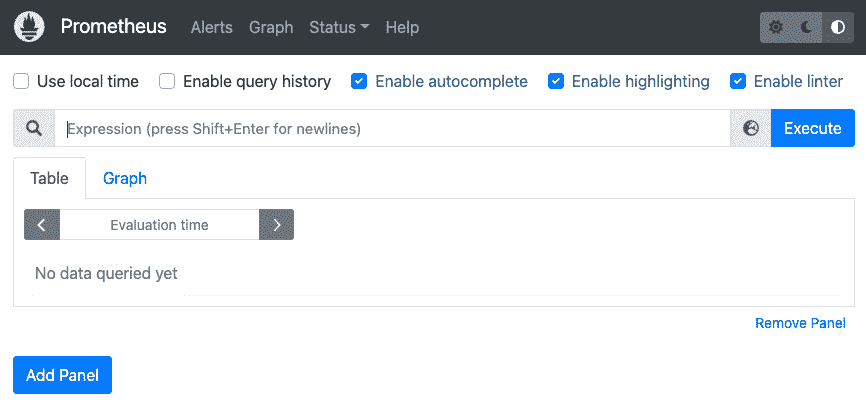

图 11.2 – Prometheus 主页面

1.  现在转到 **状态** | **目标** 菜单：

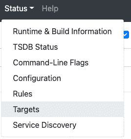

图 11.3 – 状态菜单

你将看到以下页面：

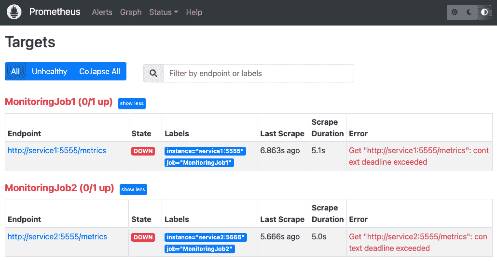

图 11.4 – Prometheus 与目标服务关闭

在此页面上，你会看到监控任务当前处于 **关闭** 状态，因为服务尚未创建。在集群中创建这些监控服务后，状态将会变为 **开启**，并显示为绿色。

现在 Prometheus 部署已准备好。让我们在云层中安装我们自定义的导出器，将 Redis 列表中的临时传感器数据导出到 Prometheus。

# 为 Prometheus 部署自定义导出器

配置所有组件后，你需要部署 Prometheus 调用的导出器来从 Redis 获取数据；这个服务将被命名为 `service1`。记住，Redis 被用来持久化来自远端 Mosquitto 主题的临时数据。在部署此服务之前，让我们了解 `exporter` 容器的源代码：

```
from flask import Response, Flask, request, jsonify
import prometheus_client
from prometheus_client import Gauge
import redis
import os
import sys
import json
t = Gauge('weather_metric1', 'temperature')
h = Gauge('weather_metric2', 'humidity')

rhost = os.environ['REDIS_HOST']
rauth = os.environ['REDIS_AUTH']
stopic = os.environ['SENSOR_TOPIC']
r = redis.StrictRedis(host=rhost,\
        port=6379,db=0,password=rauth,\
        decode_responses=True)

@app.route("/metrics")
def metrics():
    data = r.lpop(stopic)
    values = json.loads(str(data).replace("\'","\""))
    t.set(int(values["temperature"]))
    h.set(int(values["humidity"]))
    res = []
    res.append(prometheus_client.generate_latest(t))
    res.append(prometheus_client.generate_latest(h))
    print({"processed":"done"},file=sys.stderr)
    return Response(res, mimetype="text/plain")

if __name__ == '__main__':
    app.run(host='0.0.0.0', port=5555, debug=True)
```

在这段使用 Python 编写的代码中，首先我们设置了 `REDIS_HOST` 和 `REDIS_AUTH` 变量来连接 Redis，并将 `SENSOR_TOPIC` 设置为 Redis 中存储传感器数据的列表名称。因此，每次 Prometheus 调用 `/metrics` 路径时，它会提取并返回 Redis 列表中由 `SENSOR_TOPIC` 指定的一个元素，并以 Prometheus 可读取的格式返回响应。为此，代码使用了 `prometheus_client` 库，并通过 `Gauge` 指标类型设置了两个指标，`Gauge` 表示简单值。在这段代码中，我们使用了两个指标：第一个名为 `weather_metric1`，它包含温度值，第二个名为 `weather_metric2`，它包含湿度数据。一旦数据被存储在 Prometheus 中，它将返回 JSON 响应 `{"processed":"done"}`；之后，您可以在 Prometheus 中访问这些信息。或者，您也可以将 Prometheus 连接到 Grafana，以实时创建新图表来展示这些数据。

重要提示

您可以在 [`github.com/sergioarmgpl/containers/tree/main/exporter/src`](https://github.com/sergioarmgpl/containers/tree/main/exporter/src) 找到导出器的源代码。

现在让我们按照以下步骤部署导出器：

1.  通过创建 `service1` 部署来创建导出器：

    ```
    $ cat <<EOF | kubectl apply -f -
    apiVersion: apps/v1
    kind: Deployment
    metadata:
      labels:
        app: service1
      name: service1
      namespace: monitoring
    spec:
      replicas: 1
      selector:
        matchLabels:
          app: service1
      template:
        metadata:
          labels:
            app: service1
          annotations:
            prometheus.io/scrape: "true"
            prometheus.io/path: /metrics
            prometheus.io/port: "5555"
        spec:
          containers:
          - image: sergioarmgpl/exporter
            name: exporter
            env:
            - name: REDIS_HOST
              value: "redis"
            - name: REDIS_AUTH
              value: "YOUR_PASSWORD"
            - name: SENSOR_TOPIC
              value: "sensor1"
    EOF
    ```

您可以使用机密信息来代替 YAML 文件中明文密码的使用。

1.  现在创建 `service1` 服务：

    ```
    $ cat <<EOF | kubectl apply -f -
    apiVersion: v1
    kind: Service
    metadata:
      labels:
        app: service1
      name: service1
      namespace: monitoring
    spec:
      ports:
      - port: 5555
        protocol: TCP
        targetPort: 5555
      selector:
        app: service1
      type: ClusterIP
    EOF
    ```

如果您返回到 Prometheus 的目标页面，`service1` 将显示为运行中并且是绿色的。

现在导出器已经运行。接下来是配置边缘设备中的 Python 脚本，以获取来自 DHT11 传感器的数据并将其发送到 Mosquitto 主题。我们将在下一节中探索这一部分。

# 配置 DHT11 传感器以发送湿度和温度天气数据

在开始使用带有 DHT11 传感器的边缘设备发送数据之前，您需要按照以下步骤进行配置：

1.  在您的 Raspberry Pi 上安装至少 Ubuntu 20.04 LTS。您可以查看 *第二章*，《*K3s 安装与配置*》，以及 *第五章*，《*K3s 边缘计算实验的家庭实验室*》了解更多信息。

1.  配置您的 DHT11 传感器将数据发送到 Raspberry Pi。对于这个用例，我们将使用来自 Keystudio Raspberry Pi 4B 完整 RFID 启动包的 DHT11 Keyes 传感器。这是一个常见的传感器，您也可以在其他品牌中找到。该传感器可以测量温度和湿度。它通常有三根引脚，分别是 *G = 地线*，*V = VCC* 和 *S = 信号*。连接方法是将 G 连接到 Raspberry Pi 的地线引脚，将 V 连接到 3V3 引脚，用于为传感器提供 3 伏电压。S 用于信号传输，通过 GPIO 引脚将信息发送到 Raspberry Pi。在这种配置中，您可以使用任何空闲的 GPIO 引脚；本例中我们使用的是 GPIO22 引脚：

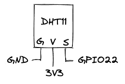

图 11.5 – DHT11 Keyes 温湿度传感器

1.  现在，通过运行以下命令在你的边缘设备上安装我们需要的系统和 Python 库，以运行传感器代码：

    +   如果你的 Linux 发行版中没有安装 `python3`，可以使用以下命令安装：

        ```
        $ sudo apt-get install python3 -y
        ```

    +   然后继续安装所需的库：

        ```
        $ sudo apt-get install libgpiod2 git -y
        $ sudo python3 sensor.py
        $ sudo pip3 install adafruit-circuitpython-dht
        $ sudo pip3 install psutil
        $ sudo apt-get install i2c-tools
        ```

1.  克隆代码库：

    ```
    $ git clone https://github.com/PacktPublishing/Edge-Computing-Systems-with-Kubernetes
    $ cd Edge-Computing-Systems-with-Kubernetes/ch11/code
    ```

1.  运行以下命令：

    ```
    $ sudo python3 send.py
    ```

重要提示

在你的边缘设备上，只有在用例的所有组件都部署完成后，才运行 `send.py` 代码。

现在，你开始从边缘设备发送数据了。但在 `send.py` 代码中发生了什么呢？我们来看看：

```
import time
import board
import adafruit_dht
import psutil
import paho.mqtt.client as mqtt
import sys
for proc in psutil.process_iter():
   if proc.name() == 'libgpiod_pulsein'
      or proc.name() == 'libgpiod_pulsei':
      proc.kill()
sensor = adafruit_dht.DHT11(board.D22)
mqhost="192.168.0.243"
client = mqtt.Client()
client.connect(mqhost, 1883, 60)
client.loop_start()

 def main(): 
   while True:
      t = sensor.temperature 
      h = sensor.humidity
      client.publish("sensor1",\
      str({"t":int(t),"h":int(h)}))
      time.sleep(2)
try:
  main()
except KeyboardInterrupt:
  pass
finally:
  sensor.exit()
```

在这段代码中，首先验证树莓派是否能够从 GPIO 引脚读取数据。然后，通过使用 Adafruit 库，我们设置树莓派的 GPIO22 引脚来读取传感器的数据。之后，我们使用 Mosquitto 主机的 IP 地址配置 Mosquitto 服务，该服务监听负载均衡器的 IP 地址。最后，我们启动一个循环来读取 `sensor` 变量的数据。该数据被发送到 Mosquitto 的 `sensor1` 主题中。循环每 2 秒钟发送一次数据。

如果你按 *Ctrl* + *C*，代码会停止并执行 `sensor.exit()` 来关闭传感器并清理传感器状态。最后，你开始发送数据。此时，所有数据通过远端的 Mosquitto 传输，并传送到云层中的 Redis 和 Prometheus。唯一缺少的是 Grafana 来可视化这些数据。为此，我们继续下一部分。

# 安装 Grafana 以创建仪表板

Grafana 是一个网页应用程序，可以用来可视化来自不同数据源的数据；它还可以基于你可视化的数据创建警报。在我们的用例中，Grafana 将用于可视化来自 Prometheus 的数据。让我们记住，Prometheus 正在监听 `service1`，以获取来自远端 Mosquitto 的数据。要部署 Grafana，请按照以下步骤操作：

1.  首先，创建一个 ConfigMap 来配置你的 Grafana 部署：

    ```
    $ cat <<EOF | kubectl apply -f -
    apiVersion: v1
    kind: ConfigMap
    metadata:
      name: grafana-datasources
      namespace: monitoring
    data:
      prometheus.yaml: |-
        {
          "apiVersion": 1,
          "datasources": [
            {
              "access":"proxy",
              "editable": true,
              "name": "prometheus",
              "orgId": 1,
              "type": "prometheus",
              "url": "http://prometheus-service.monitoring.svc:8080",
              "version": 1
            }
          ]
        }
    EOF
    ```

这将是你在 `grafana` 部署中配置的默认数据源。

1.  让我们通过运行以下命令来创建 `grafana` 部署：

    ```
    $ cat <<EOF | kubectl apply -f -
    apiVersion: apps/v1
    kind: Deployment
    metadata:
      name: grafana
      namespace: monitoring
    spec:
      replicas: 1
      selector:
        matchLabels:
          app: grafana
      template:
        metadata:
          name: grafana
          labels:
            app: grafana
        spec:
          containers:
          - name: grafana
            image: grafana/grafana:8.4.4
            ports:
            - name: grafana
              containerPort: 3000
            resources:
              limits:
                memory: "1Gi"
                cpu: "1000m"
    requests: 
                memory: 500M
                cpu: "500m"
            volumeMounts:
              - mountPath: /var/lib/grafana
                name: grafana-storage
              - mountPath: /etc/grafana/provisioning/datasources
                name: grafana-datasources
                readOnly: false
          volumes:
            - name: grafana-storage
              emptyDir: {}
            - name: grafana-datasources
              configMap:
                  defaultMode: 420
                  name: grafana-datasources
    EOF
    ```

1.  创建服务：

    ```
    $ cat <<EOF | kubectl apply -f -
    apiVersion: v1
    kind: Service
    metadata:
      creationTimestamp: null
      labels:
        app: grafana
      name: grafana
      namespace: monitoring
    spec:
      ports:
      - port: 3000
        protocol: TCP
        targetPort: 3000
      selector:
        app: grafana
      type: ClusterIP
    EOF
    ```

1.  通过运行以下命令打开 Grafana UI：

    ```
    $ kubectl port-forward svc/grafana 3000 -n monitoring --address 0.0.0.0
    ```

1.  打开 URL `http://localhost:3000`。当登录页面出现时，使用用户名 `admin` 和密码 `admin`，然后点击 **Log in** 按钮：


图 11.6 – Grafana 登录

1.  登录后，你将看到 Grafana 的主页面：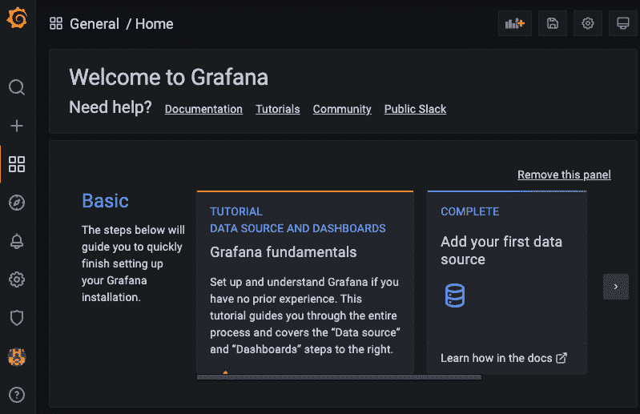

图 11.7 – Grafana 主页面

1.  点击 **Configuration** | **Data sources**：

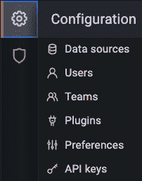

图 11.8 – Grafana 配置菜单

1.  然后，检查 Prometheus 数据源是否存在：

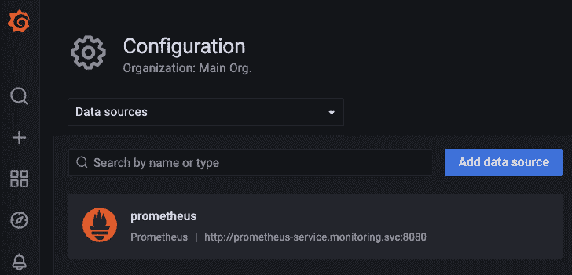

图 11.9 – Grafana 数据源

由于我们的 ConfigMap 配置，我们的默认数据源将是`prometheus-service.monitoring.svc:8080`。

1.  现在使用**+**图标创建一个新文件夹或仪表盘。我们先创建一个文件夹：

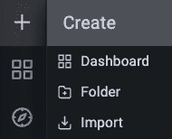

图 11.10 – Grafana 创建菜单

1.  现在在打开的对话框中填写`Dashboard Sensors`，以此名称创建文件夹，然后点击**创建**按钮：

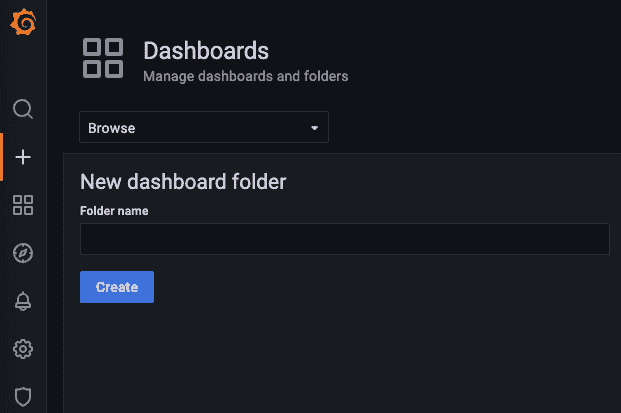

图 11.11 – Grafana 新仪表盘文件夹对话框

如果需要，你可以使用这个文件夹来保存你的仪表盘和警报。

1.  如同*图 11.10*所示，按照和文件夹相同的步骤操作，但这次点击**仪表盘**。你将看到*图 11.12*页面。点击**添加新面板**按钮：

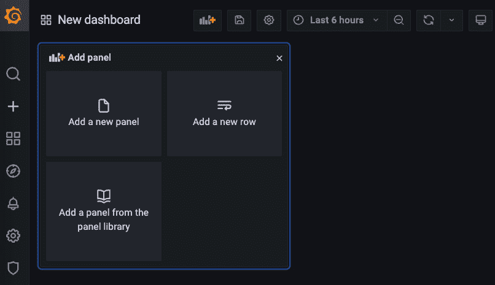

图 11.12 – Grafana 添加面板页面

1.  在下图中，你将看到配置新仪表盘的设置：

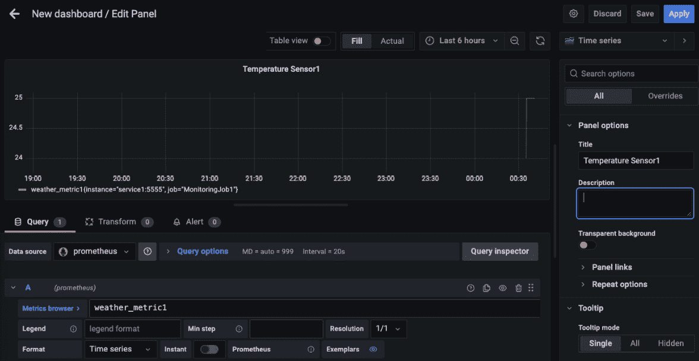

图 11.13 – Grafana 新仪表盘/编辑面板页面

在这里，你可以通过设置查询的主要部分来配置此面板。在此情况下，你需要写`weather_metric1`或`weather_metric2`。其中，`weather_metric1`获取温度，`weather_metric2`获取湿度。

1.  设置时间范围以可视化数据。然后，点击**应用时间范围**：

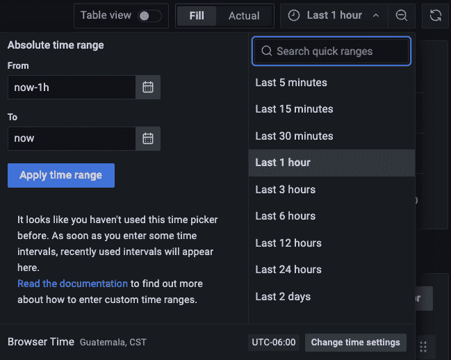

图 11.14 – Grafana 绝对时间范围对话框

1.  在下一个对话框中，将刷新时间设置为 5 秒，**查询选项**：

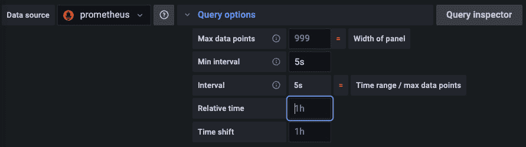

图 11.15 – 设置实时数据值

另外，你可以点击**刷新**图标：

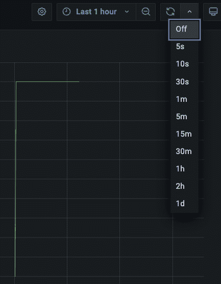

图 11.16 – Grafana 设置刷新时间

1.  然后，点击`Dashboard sensors`或`Temperature Sensor1`：

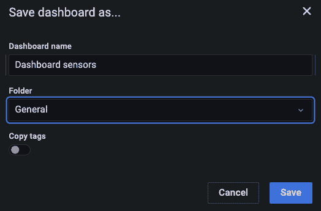

图 11.17 – 保存新仪表盘

1.  你也可以通过点击**应用**按钮来应用更改，而不是点击**保存**按钮：


图 11.18 – 应用更改到新仪表盘

1.  现在你将看到你的仪表盘：

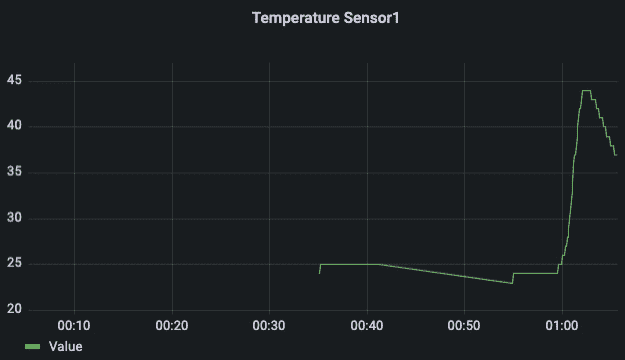

图 11.19 – Grafana 温度传感器 1 仪表盘

1.  你可以通过点击**搜索仪表盘**图标查看你创建的仪表盘：

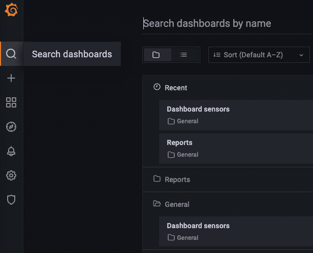

图 11.20 – 搜索仪表盘

现在你可以开始可视化你的边缘设备生成的数据，如*图 11.18*所示。你可以根据需要自定义所有参数，以显示信息。你还可以修改代码，添加任意数量的传感器。我们现在已经完成了这一章。让我们快速总结一下我们学到的内容。

# 总结

在本章中，我们学习了监控如何帮助我们可视化边缘的数据，特别是如何可视化来自传感器的数据，以及如何构建一个基本的使用案例场景以扩展到生产环境。为了构建这个系统，我们使用 Prometheus 作为我们的时间序列数据库，Mosquitto 作为存储传感器数据的基本方式，Redis 作为临时队列以防止传感器数据的丢失。我们还实践了如何构建一个边缘计算系统，使用其从最远边缘到云层的不同层次。这展示了时间序列数据库在管理传感器数据中的重要性，以及 Grafana 等工具如何帮助可视化数据。这个场景还可以扩展到农业、海洋和海上监测、动物种群等领域。在下一章，我们将继续一个类似的场景，但应用于 GPS 和远程传感器数据读取。

# 问题

以下是一些问题，用于验证你新学到的知识：

+   我如何设置边缘设备来捕获传感器数据？

+   我如何使用 Prometheus 存储传感器数据？

+   我如何使用 Grafana 创建自定义图表来可视化传感器数据？

+   我如何设计一个持久化系统，使用 Mosquitto 和 Redis 管理传感器数据？

+   我如何使用 Python 处理并发送传感器数据？

# 深入阅读

你可以参考以下文献，获取本章所涵盖主题的更多信息：

+   Mosquitto 官方网站：[`mosquitto.org`](https://mosquitto.org)

+   Prometheus Python 客户端：[`github.com/prometheus/client_python`](https://github.com/prometheus/client_python)

+   如何在 Kubernetes 集群上设置 Prometheus 监控 [`devopscube.com/setup-prometheus-monitoring-on-kubernetes`](https://devopscube.com/setup-prometheus-monitoring-on-kubernetes)

+   如何在 Kubernetes 上设置 Grafana：[`devopscube.com/setup-grafana-kubernetes`](https://devopscube.com/setup-grafana-kubernetes)

+   开始使用 Prometheus：[`prometheus.io/docs/prometheus/latest/getting_started`](https://prometheus.io/docs/prometheus/latest/getting_started)

+   使用 Prometheus 和 Grafana 进行物联网监控：[`cloud.google.com/community/tutorials/cloud-iot-prometheus-monitoring`](https://cloud.google.com/community/tutorials/cloud-iot-prometheus-monitoring)

+   设置 Prometheus Alertmanager 与 Slack、PagerDuty 和 Gmail 的分步指南：[`grafana.com/blog/2020/02/25/step-by-step-guide-to-setting-up-prometheus-alertmanager-with-slack-pagerduty-and-gmail`](https://grafana.com/blog/2020/02/25/step-by-step-guide-to-setting-up-prometheus-alertmanager-with-slack-pagerduty-and-gmail)
