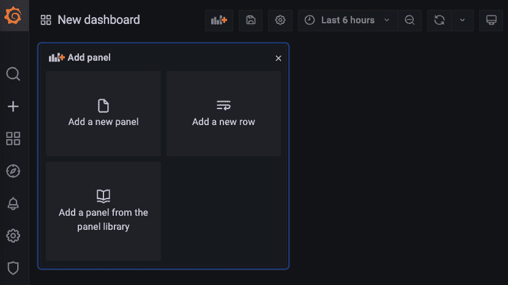

# 12

# 使用 LoRa 在长距离上与边缘设备通信

**长距离**（**LoRa**）是一种无线协议，您可以使用它通过低功耗设备在长距离上传输和接收数据。您可以将这些边缘设备与太阳能电池板或其他能源源一起使用。有时，您的边缘设备使用电池，并且没有像我们常在家中找到的那样连接到共同的电源。当您构建边缘系统时，您可以使用带有传感器的边缘设备，您需要配置这些传感器。您可以使用原型硬件平台，例如 Arduino，或设备如 ESP32 微控制器或 Raspberry Pi。这些设备支持 LoRa 模块，能够为您的设备提供通信功能，这对发送和接收设备之间的数据至关重要。在本章中，我们将探索如何利用 LoRa 无线协议从远距离发送或接收数据。我们将继续扩展上章中监控边缘设备的选项，但现在使用的是 LoRa 无线协议。

在本章中，我们将涵盖以下主要主题：

+   LoRa 无线协议与边缘计算

+   部署 MySQL 以存储传感器数据

+   部署服务以将传感器数据存储到 MySQL 数据库中

+   编程 ESP32 微控制器以发送传感器数据

+   编程 ESP32 微控制器以接收传感器数据

+   使用 MySQL 和 Grafana 可视化 ESP32 微控制器的数据

# 技术要求

在本章中部署我们的数据库，您将需要以下内容：

+   一个单节点或多节点的 K3s 集群，可以使用已安装 MetalLB 和 Longhorn 存储的 ARM 设备。这个示例将在 4 GB RAM 的 Raspberry Pi 4B 上测试，并使用 Ubuntu 20.04 或更高版本的 ARM 64 位系统。

+   托管在您的公共云提供商（AWS、Azure、GCP）或私有云中的 Kubernetes 集群。

+   2 个安装了 LoRa 模块的 ESP32 微控制器。我们使用的是 Heltec ESP32 + Lora v2 模型，一个用来发送数据，另一个用来接收数据。

+   在 Mac 上安装 Arduino IDE。您也可以使用 Windows 系统，因为它的配置与 Mac 类似，并且在与硬件配合使用时更稳定。

+   一条 USB 2.0 A 型公头到 Micro B 型线，用于编程您的 ESP32 设备。

+   一个 Keyes DHT11 传感器或类似设备，连接到您的边缘设备以读取温度和湿度。

+   已配置`kubectl`以在您的本地机器上使用，用于您的 Kubernetes 云集群或 K3s 集群，从而避免使用`--kubeconfig`参数。

+   如果您希望使用`kubectl apply`运行 YAML 配置文件，而不是从本书中复制代码，请克隆[`github.com/PacktPublishing/Edge-Computing-Systems-with-Kubernetes/tree/main/ch12`](https://github.com/PacktPublishing/Edge-Computing-Systems-with-Kubernetes/tree/main/ch12)中的 GitHub 仓库。查看`code`目录中 Heltec 设备的 Arduino 源代码和`yaml`目录中的 YAML 配置文件。这些文件位于`ch12`目录中。

现在，让我们了解一下使用 LoRa 设备、Prometheus 和 Grafana 的场景是如何工作的。

# LoRa 无线协议与边缘计算

LoRa 是一种用于长距离的无线调制技术，结合 LoRaWAN，它定义了一种网络协议，可以用于设备间的互联。LoRaWAN 还是一种网络架构，采用起始-起始拓扑结构，其中网关在边缘设备之间转发消息。LoRa 使用三种常见频率：`433`、`868` 和 `915`。`433` 有时用于户外，`868` 用于欧洲，`915` 用于美洲。LoRaWAN 有网关设备，可以将 LoRa 网络连接到互联网。LoRa 设计为低功耗，这也是 LoRa 被用于物联网应用，以便在长距离间互联设备的原因。

正如我们所知道的，边缘计算的目标是处理接近数据源的数据。因此，LoRa 使我们能够实现边缘计算，并且在不消耗大量能量的情况下，实现远距离设备互联。LoRa 的一些应用场景包括农业、建筑物、供应链、物流、地理定位应用等。支持 LoRa 的一些常见设备是 Heltec ESP32 设备，这些设备设计上注重低功耗。在本章中，我们将重点配置支持 LoRa 的 Heltec ESP32 设备。

为了开始实现我们在小型边缘上使用 LoRa 与远端边缘 Kubernetes 集群进行交互的用例，让我们先来看看以下的图示：


图 12.1 – 使用 ESP32 设备和 LoRaWAN 进行监控

该图分为不同的层级。你可以看到数据如何从远端边缘（实现了 LoRa 通信）流向云层。首先，让我们描述一下我们要实现的这个用例中的不同组件：

+   **小型边缘**：在这一层，我们会找到 Heltec ESP32 设备，你可以将其归类为发送或接收数据的设备。这个设备发送数据，读取 DHT11 传感器的数据，并通过 LoRa 协议将信息以 JSON 格式发送出去。其他设备读取信息，通过 LoRa 发送，并通过局域网中的 POST 请求将数据发送到远端边缘的集群。你可以根据需要添加任意数量的设备来发送数据。

+   **远端边缘**：在这里，你会找到一个使用 ARM 设备的单节点或多节点 K3s 集群。这个集群提供度量服务，接收来自小型边缘的 JSON 格式数据。一旦数据被接收，度量服务会将这些数据写入云层中的 MySQL 部署，该 MySQL 部署位于云提供商提供的 Kubernetes 集群中。这个云提供商可以是 Amazon、GCP、Azure 等等。

+   **近端边缘**：这一层包含连接本地网络和互联网的本地路由器。请记住，远端边缘的集群作为网关，负责将 LoRa 网络中的数据发送到互联网。

+   **云层**：在这里，您可以找到包含 MySQL 和 Grafana 的 Kubernetes 集群。MySQL 存储来自本地传感器的数据，而 Grafana 使用 MySQL 来创建使用传感器数据的仪表板。

总结来说，所有的传感器数据来自 ESP32 设备，其中一些设备配备了传感器。这些设备使用 LoRa 协议发送和接收数据。当接收设备收到信息时，它会将其转换为 JSON 格式，然后发送到位于远程边缘的 Kubernetes 服务。此服务接收信息后，会将其转发到云层并存储在 MySQL 数据库中。MySQL 被 Grafana 用来实时展示边缘收集的传感器数据。现在，让我们部署我们的 MySQL 数据库来存储数据。

# 部署 MySQL 以存储传感器数据

在使用 LoRa 从设备存储数据之前，必须部署数据库。为此，我们将使用 MySQL。MySQL 是一个非常流行的数据库，您可以用它来存储来自传感器的数据。使用 MySQL 的主要优势在于它有良好的文档支持，您可以在互联网上找到许多示例。对于我们的部署，我们将使用 `PersistentVolumeClaim` 和 `mysql:8.0.28-oracle` 镜像。即使您决定将 MySQL 部署到云端或本地边缘，也必须使用 `LoadBalancer` 服务，以便为存储所有传感器数据的服务提供端点。为了简化实现，我们的 MySQL 数据库将在默认命名空间中部署。要部署我们的 MySQL 数据库，请按照以下步骤操作：

1.  创建一个具有 5 GB 存储空间的 `PersistentVolumeClaim`：

    ```
    $ cat <<EOF | kubectl apply -f -
    apiVersion: v1
    kind: PersistentVolumeClaim
    metadata:
      name: db-pv-claim
    spec:
      accessModes:
        - ReadWriteOnce
      resources:
        requests:
          storage: 5Gi
    EOF
    ```

重要提示

不要忘记使用 ConfigMaps 和 Secrets 进行更安全和高级的配置。您可以查看 *第十章*，*边缘的 SQL 和 NoSQL 数据库*，了解更多详细信息。

1.  现在，让我们部署我们的 MySQL 数据库。我们的部署将使用之前的 `PersistentVolumeClaim`，即 `db-pv-claim`，进行此次运行：

    ```
    $ cat <<EOF | kubectl apply -f -
    apiVersion: apps/v1
    kind: Deployment
    metadata:
      name: mysql
    spec:
      selector:
        matchLabels:
          app: mysql
      strategy:
        type: Recreate
      template:
        metadata:
          labels:
            app: mysql
        spec:
          containers:
          - image: mysql:8.0.28-oracle
            name: mysql
            env:
            - name: MYSQL_DATABASE
              value: sensor_data
            - name: MYSQL_USER
              value: lora_mysql
            - name: MYSQL_PASSWORD
              value: lora123-
            - name: MYSQL_ROOT_PASSWORD
              value: lora123-
            ports:
            - containerPort: 3306
              name: mysql
            volumeMounts:
            - name: mysql-persistent-storage
              mountPath: /var/lib/mysql
          volumes:
          - name: mysql-persistent-storage
            persistentVolumeClaim:
              claimName: db-pv-claim
    EOF
    ```

在此部署中，我们使用了一些环境变量：

+   `MYSQL_DATABASE`：创建一个初始数据库

+   `MYSQL_USER`：为在`MYSQL_DATABASE`中定义的数据库创建一个超级管理员用户。

+   `MYSQL_PASSWORD`：为在 `MYSQL_USER` 变量中定义的用户设置密码。

+   `MYSQL_ROOT_PASSWORD`：为 root 用户设置密码

重要提示

如果您使用的是多节点集群，请使用 `nodeSelector` 选项，以防止与已提供的 `PersistentVolumeClaim` 发生问题。

1.  现在，我们需要一个 `ClusterIP` 服务。这将在 Grafana 中用作配置 MySQL 数据库的数据源：

    ```
    $ cat <<EOF | kubectl apply -f -
    apiVersion: v1
    kind: Service
    metadata:
      creationTimestamp: null
      name: mysql
    spec:
      ports:
      - port: 3306
        protocol: TCP
        targetPort: 3306
      selector:
        app: mysql
      type: ClusterIP
    status:
      loadBalancer: {}
    EOF
    ```

1.  我们还需要一个 `LoadBalancer` 服务来暴露 MySQL。此服务将用于将 MySQL 暴露给外部世界。可以通过互联网或使用本地网络中的 IP 地址进行暴露。无论哪种方式，配置的负载均衡器 IP 地址将用于 ESP32 设备中。这些 ESP32 设备将通过我们的指标服务向此端点发送信息，最终将传感器数据存储到 MySQL 中。让我们创建这个 `LoadBalancer` 服务：

    ```
    $ cat <<EOF | kubectl apply -f -
    apiVersion: v1
    kind: Service
    metadata:
      creationTimestamp: null
      name: mysql-lb
    spec:
      ports:
      - port: 3306
        protocol: TCP
        targetPort: 3306
      selector:
        app: mysql
      type: LoadBalancer
    status:
      loadBalancer: {}
    EOF
    ```

现在 MySQL 正在运行，我们需要创建一个表来存储传感器数据。为此，请按照以下步骤操作：

1.  创建一个 MySQL CLI 客户端，运行一些命令来创建存储数据的表格：

    ```
    $ kubectl run client -it --rm --image=mysql:8.0.28-oracle -- bash
    ```

进入后，运行以下命令。系统会要求你输入密码。请使用 `lora123-` 作为密码：

```
$ mysql -u lora_mysql -h mysql -p
```

提示符将更改为类似`mysql>`的形式。

1.  创建指标表并包含 `device`、`temperature_c`、`temperature_f`、`humidity` 和 `time` 字段：

    ```
    use sensor_data;
    CREATE TABLE metric (device INT NOT NULL,temperature_c DECIMAL(4,2),temperature_f DECIMAL(4,2) NOT NULL,humidity DECIMAL(4,2) NOT NULL, time DATETIME NOT NULL);
    ```

首先，我们必须使用 `use` 命令选择 `sensor_data` 数据库，然后使用 `CREATE TABLE` 命令创建表格 metric。我们配置每个字段都必须有值。我们使用 `DECIMAL(4,2)`，这意味着 4-2 = 2 个整数位和 2 位小数。我们使用 `now()` MySQL 函数的格式来存储数据，格式为 `MONTH/DAY/YEAR HOUR:MINUTE:SECOND`。

下面是对每个字段包含内容的简要说明：

+   `device`：表示发送传感器数据的 ESP32 Lora 设备编号。这个值应该是大于 0 的数字。

+   `temperature_c`：这是以摄氏度为单位测量的温度。

+   `temperature_f`：这是以华氏度为单位测量的温度。

+   `humidity`：环境湿度，按百分比表示。

1.  使用 MySQL 中的 `quit` 命令退出 MySQL 客户端。

1.  使用 `exit` 命令退出客户端。退出后，Pod 将被删除。

1.  获取在 `LoadBalancer` 服务中配置的 MySQL IP 地址。为此，请运行以下命令：

    ```
    $ MYSQL_IP="$(kubectl get svc mysql-lb -o=jsonpath='{.status.loadBalancer.ingress[0].ip}')"
    $ echo $MYSQL_IP
    ```

`echo` 命令将显示你的 MySQL IP 地址。

现在我们的 MySQL 数据库已经部署并准备好使用，接下来让我们在远端边缘部署我们的指标应用程序，以便将数据存储到这个 MySQL 数据库中。

# 部署一个服务将传感器数据存储到 MySQL 数据库中。

对于此场景，我们需要部署一个服务将数据存储到先前部署的 MySQL 中。我们将其命名为 `metrics`。`metrics` 服务包含以下代码：

```
from flask import Flask, request
import mysql.connector
import os

app = Flask(__name__)

@app.route('/')
def hello_world():
    return 'It works'

def insert(data):
    conn = mysql.connector.connect(
     host=os.environ['HOST'],
     user=os.environ['MYSQL_USER'],
     password=os.environ['MYSQL_PASSWORD'],
     database=os.environ['MYSQL_DATABASE']
    )
    cursor = conn.cursor()
    sql = "INSERT INTO metric "+\
          "(device,temperature_c,"+\
          "temperature_f,humidity,time) "+\
          "VALUES (%s,%s,%s,%s,now());"
    val = (data["d"],data["t"],data["t_f"],data["h"])
    cursor.execute(sql,val)
    conn.commit()
    cursor.close()
    conn.close()

@app.route('/device',methods = ['POST'])
def device():
    data = request.json
    print(data)
    #Process data in some way
    t_farenheit = float(data["t"])*(9/5)+32
    data["t_f"] = t_farenheit
    insert(data)
    return "processed"

if __name__ == '__main__':
    app.run(host='0.0.0.0', port=3000, debug=True)
```

该代码有两个端点：

+   `/`：这只是一个测试 URL。

+   `/device`：该端点从 POST 请求中获取数据，并通过调用 `insert` 函数将其写入 MySQL。

它还使用 `insert(data)` 函数将数据插入到部署在云层中的 MySQL 中。这个函数接收来自 LoRaWAN 的数据，并重新计算温度（华氏度）。一旦存储，数据将返回处理结果。

该脚本还使用以下环境变量：

+   `HOST`：定义 MySQL 监听的 IP 地址。

+   `MYSQL_USER`：用于连接数据库的用户名

+   `MYSQL_PASSWORD`：用于连接数据库的密码

+   `MYSQL_DATABASE`：`metrics` 将用于存储数据的数据库名称。

我们在 Kubernetes 中的部署必须设置这些变量才能正常工作，否则会出现错误。

重要提示

你可以在 [`github.com/sergioarmgpl/containers/tree/main/metric`](https://github.com/sergioarmgpl/containers/tree/main/metric) 查看如何基于此示例构建容器的代码。

现在我们已经看过 `metrics` 服务的代码，让我们将 `metrics` 部署到设备上，开始将传感器数据存储到数据库中。为此，按照以下步骤操作：

1.  部署我们的 `metrics` 应用程序，使其处于运行状态：

    ```
    $ cat <<EOF | kubectl apply -f -
    apiVersion: apps/v1
    kind: Deployment
    metadata:
      creationTimestamp: null
      labels:
        app: metrics
      name: metrics
    spec:
      replicas: 1
      selector:
        matchLabels:
          app: metrics
      strategy: {}
      template:
    metadata: 
          creationTimestamp: null
          labels:
            app: metrics
        spec:
          containers:
          - image: sergioarmgpl/metric
    name: metric 
            env:
            - name: HOST
              value: "192.168.0.240"
            - name: MYSQL_USER
              value: "lora_mysql"
            - name: MYSQL_PASSWORD
              value: "lora123-"
            - name: MYSQL_DATABASE
              value: "sensor_data"
    resources: {} 
    status: {} 
    EOF
    ```

在此部署中，我们使用以下环境变量值：

+   `HOST`：这是为我们的 MySQL 创建的 `LoadBalancer` 服务的 IP 地址，也就是 `192.168.0.240`。这是上一步中返回的 IP 地址。

+   `MYSQL_USER`：MySQL 用户名。在此情况下，用户名为 `lora_mysql`。

+   `MYSQL_PASSWORD`：`lora_mysql` 的密码。在此情况下，密码为 `lora123-`。

+   `MYSQL_DATABASE`：用于存储传感器数据的 MySQL 数据库名称。在此情况下，名称为 `sensor_data`。

重要提示

你可以根据需要自定义所有这些值。记住，你可以使用 ConfigMaps 或 Secrets 来保护你的部署。我们仅为简化实现而使用硬编码值。关于此类配置，请查看 *第十章*，*边缘的 SQL 和 NoSQL 数据库*。

1.  现在，让我们为 `metrics` 部署创建 `LoadBalancer` 服务。已分配的 IP 地址将被硬编码到我们 ESP32 设备的代码中。创建服务时，运行以下代码：

    ```
    $ cat <<EOF | kubectl apply -f -
    apiVersion: v1
    kind: Service
    metadata:
      creationTimestamp: null
      name: metrics
    spec:
      ports:
      - port: 3000
        protocol: TCP
        targetPort: 3000
      selector:
        app: metrics
      type: LoadBalancer
    status:
      loadBalancer: {}
    EOF
    ```

1.  要获取 `metrics` 服务的已分配 IP 地址，运行以下命令：

    ```
    $ METRICS_IP="$(kubectl get svc metrics -o=jsonpath='{.status.loadBalancer.ingress[0].ip}')"
    $ echo METRICS_IP
    ```

`echo` 命令将显示我们 `metrics` 应用程序的 IP 地址。记下这个值，因为它将在编程我们的 ESP32 设备时使用。假设此值为 `192.168.0.241`。

现在我们已经将 `metrics` 服务部署到远端边缘，接下来让我们配置 ESP32 设备，以便它们能够发送和接收数据。

# 编程 ESP32 微控制器以发送传感器数据

ESP32 是一款低成本、低功耗的微控制器芯片，是 ESP8266 微控制器的继任者。在本章中，我们将使用 Heltec ESP32 + LoRa，它是一个 ESP32 微控制器，带有使用 LoRa 无线协议的能力。此微控制器还可以使用集成的 SX1276 芯片通过 LoRa 无线协议发送和接收数据，能够在 Heltec 仪表板上进行操作。

在配置设备之前，我们需要做以下事情：

1.  将 DHT11 传感器连接到 Heltec ESP32 + LoRa 设备。

1.  安装 USB 到 UART 桥接驱动程序。

1.  安装并配置 Arduino IDE 来编程 Heltec ESP32 + LoRa 设备。

1.  刷写 Heltec ESP32 + LoRa 设备。

现在，让我们通过将 DHT11 传感器连接到我们的 Heltec ESP32 + LoRa 设备开始。

## 配置 Heltec ESP32 + LoRa 以读取 DHT11 传感器数据

Heltec 设备通常用于物联网，ESP32 是物联网和 LoRa 实现中非常流行的设备。你可以在[`heltec-automation-docs.readthedocs.io/en/latest`](https://heltec-automation-docs.readthedocs.io/en/latest)找到 Heltec 设备的官方文档。对于我们的 LoRa 实现，我们将使用以下图示：


图 12.2 – Heltec ESP32 读取 DHT11 数据的示意图

要将你的 Heltec ESP32 与 DHT11 传感器连接，请按照以下步骤操作。这是发送设备：

1.  连接你的 LoRa 天线。如果天线未连接，这可能会影响传输范围。

1.  将电源连接到 USB 接口。你必须使用 USB 2.0 A 型公头转 Micro B 型线缆。

1.  将你的`PIN 17`通过导线连接到 DHT11 传感器的`S`输入端。

1.  将 GND（地）连接到 DHT11 传感器的`G`输入端。

1.  将其中一个 3V3 电压输出连接到 DHT11 传感器的`V`输入端。

对于你的接收设备，只需按照以下步骤操作：

1.  连接你的 LoRa 天线。

1.  将电源连接到 USB 接口，作为你的发送设备。

重要提示

记住，你需要使用一个能提供 3.5 或 5 伏电压的电源或电池。想了解更多信息，请查看[`heltec-automation-docs.readthedocs.io/en/latest/esp32/index.html`](https://heltec-automation-docs.readthedocs.io/en/latest/esp32/index.html)。

这样，你的发送和接收设备就可以准备好上传代码了。现在，让我们安装所有需要的软件下载代码到设备中。

## 安装 USB 到 UART 桥接驱动程序

安装通用的 SiLabs CP210X 驱动程序时，该驱动程序将安装对 USB 到 UART 桥的支持，并识别你计算机上的设备。通过这种方式，你的 Heltec 设备可以连接到计算机，并使用串行通信与 Arduino IDE 进行交互。

要安装此驱动程序，你可以访问以下链接以获取详细的安装说明：[`heltec-automation-docs.readthedocs.io/en/latest/general/establish_serial_connection.html`](https://heltec-automation-docs.readthedocs.io/en/latest/general/establish_serial_connection.html)。在该页面，你可以找到有关如何在 Windows 和 Mac 上安装驱动程序的最新文档。

这些说明包括下载各种驱动程序：

+   对于 Windows：[`www.silabs.com/documents/public/software/CP210x_Windows_Drivers.zip`](https://www.silabs.com/documents/public/software/CP210x_Windows_Drivers.zip)

+   对于 Mac：[`www.silabs.com/documents/public/software/Mac_OSX_VCP_Driver.zip`](https://www.silabs.com/documents/public/software/Mac_OSX_VCP_Driver.zip)

你必须根据你的系统按照向导安装驱动程序。一旦你安装了驱动程序，就可以将设备连接到系统，并检查是否成功检测到设备。对于 Mac，您可以执行以下命令：

```
$ ls /dev | grep cu | grep 'usbserial\|UART'
```

你将看到类似以下的输出：

```
cu.SLAB_USBtoUART
cu.usbserial-0001
```

这意味着你的设备已被检测到。可能会遇到一些常见问题，导致设备无法识别。这通常是因为你使用的电缆存在问题；尝试找到一根在你电脑上能正常识别设备的电缆。

对于 Windows 系统，你会看到你的设备出现在硬件管理器的端口部分。然后，设备会像下面这样显示：

+   Silicon Labs CP210X USB 转 UART 桥接器（COM3）

这意味着你的 Heltec 设备已经成功检测到。

现在，既然系统已经识别到设备，就可以安装 Arduino IDE 来上传代码到你的 Heltec 设备了。

## 安装 Arduino IDE

Arduino IDE 是一款可以用来向开发板上传代码的软件。在这种情况下，我们使用的是 Heltec 设计的开发板，即我们所称的 Heltec 设备。要开始使用 Arduino IDE，请按照以下步骤操作：

1.  通过访问[`www.arduino.cc/en/software`](https://www.arduino.cc/en/software)下载 Arduino IDE。选择你所使用的操作系统，支持 Windows、Linux 或 Mac。本章节我们将介绍 Mac 操作系统，使用的是 Arduino 1.8.19 版本。

重要说明

你也可以参考 Heltec 的官方网站，里面解释了如何为 Windows 和 Mac 安装 Heltec 驱动程序和 Arduino IDE。快速入门链接为[`heltec-automation-docs.readthedocs.io/en/latest/esp32/quick_start.html`](https://heltec-automation-docs.readthedocs.io/en/latest/esp32/quick_start.html)。

1.  通过点击桌面上的图标或 Mac 上的启动板，打开 Arduino IDE。

1.  点击**文件** | **首选项**，然后将[`github.com/Heltec-Aaron-Lee/WiFi_Kit_series/releases/download/0.0.5/package_heltec_esp32_index.json`](https://github.com/Heltec-Aaron-Lee/WiFi_Kit_series/releases/download/0.0.5/package_heltec_esp32_index.json)粘贴到**附加板管理器 URL**字段中。然后，点击**确定**。新的 ESP32 开发板将会加载到 Arduino IDE 中：


图 12.3 – 配置首选项以使用 Heltec ESP32 设备

1.  现在，前往**工具** | **开发板** | **开发板管理器**：


图 12.4 – 板管理器菜单

1.  在弹出的对话框中搜索`heltec`，然后点击**安装**以进行安装：


图 12.5 – 在板管理器中搜索 heltec

你将看到类似以下的内容：


图 12.6 – 通过板管理器安装的 Heltec 开发板

1.  现在，通过进入**工具** | **板** | **Heltec ESP32 Arduino**并选择**WiFi LoRa 32(V2)**来选择开发板：


图 12.7 – 设置 WiFi LoRa 32(V2)为默认开发板

1.  现在，通过进入**工具** | **管理库**，搜索 Adafruit 的**DHT 传感器**库，并选择**Heltec ESP32 Dev-Boards**。确保安装它。

这样，我们的 Arduino IDE 就准备好了。现在，让我们了解一些配置，以防出现错误。

## 使用 Heltec ESP32 + LoRa 时的 Arduino IDE 故障排除

macOS 可能会遇到一些挑战，这取决于你的 Mac 版本，但你可以解决这些问题。

其中一个问题是 esptool Python 库。为了解决它，按照以下步骤操作：

1.  将当前的`esptool.py`文件复制到`tools`文件夹中。命令将如下所示：

    ```
    $ cp /Users/<YOUR_USER>/Library/Arduino15/packages/Heltec-esp32/hardware/esp32/<X.X.X> /tools/esptool.py /Users/ <YOUR_USER> /Library/Arduino15/packages/Heltec-esp32/tools/esptool_py/<X.X.X>/
    ```

1.  更改`esptool.py`文件的权限：

    ```
    $ chmod +x esptool.py
    ```

运行`esptool.py`文件：

```
$ ./esptool.py
```

1.  有时，如果上一个命令返回错误，你需要安装串行库。为此，你有几个选项。一个是从头开始安装库，方法是访问[`github.com/pyserial/pyserial/releases`](https://github.com/pyserial/pyserial/releases)。在这种情况下，我们使用的是 3.4 版本。为此运行以下命令：

    ```
    $ wget https://github.com/pyserial/pyserial/archive/refs/tags/v3.4.zip
    $ sudo python setup.py install
    ```

1.  如果`./esptool.py`命令返回错误，再次尝试。

1.  根据你电脑上安装的 Python 版本，你可以尝试这个其他的解决方案：

    ```
    $ sudo pip install pyserial or
    $ sudo pip3 install pyserial
    ```

1.  最后的一个解决方案是使用`easy_install`来安装 pyserial 库。为此，运行以下命令：

    ```
    $ sudo easy_install pyserial
    ```

重要提示

macOS Monterrey 默认删除 Python 2.7，因此你必须安装该 Python 版本。你也可以使用 Python 3，但你需要使用`open /Applications/Arduino.app`命令打开 Arduino IDE。你可以通过观看以下视频，找到更详细的解决方案：[`www.youtube.com/watch?v=zkyoghpT8_U`](https://www.youtube.com/watch?v=zkyoghpT8_U)。

另一个需要修复的问题是，Heltec 安装了自己的 Wi-Fi 库，这取决于你的 Arduino 版本。因此，当你尝试编译和上传程序时，有时会看到一些错误。为避免这些错误，你有两个选项：

1.  通过进入**工具** | **管理库**卸载默认的 Arduino Wi-Fi 库。然后，找到 Arduino 的 Wi-Fi 库并将其卸载。

1.  使用以下命令删除或重命名默认的 Arduino Wi-Fi 库文件夹：

    ```
    $ cd /Applications/Arduino.app/Contents/Java/libraries
    $ mv libraries/WiFi
    ```

重要提示

在 Windows 上，安装过程很顺利，因此你不需要修复这种问题。

现在，是时候使用 Arduino IDE 将代码上传到设备上了。

## 上传代码到 ESP32 微控制器以发送传感器数据

现在，让我们将代码上传到 Heltec 设备。首先从发送设备开始。该设备将从 DHT11 传感器捕获数据，并通过 LoRa 无线协议将其发送到接收设备。我们可以通过点击**文件** | **新建**来创建一个新文件。默认情况下，你将看到类似以下内容的内容：

```
void setup() {
  // put your setup code here, to run once: 
}

void loop() {
  // put your main code here, to run repeatedly:
}
```

现在，用以下代码替换它：

```
#include "heltec.h"
#define BAND    915E6

#include "DHT.h"
#define DHTPIN 17
#define DHTTYPE DHT11
DHT dht(DHTPIN, DHTTYPE);

#define DEVICE 1
#define DELAY 3000

void setup()
{
  Heltec.begin(false,true,true,true,BAND);
  Serial.begin(9600);
  LoRa.setSyncWord(0xF3);
  Serial.println("LoRa started");
  dht.begin();
}

void sendTH()
{
  String values = "";
  LoRa.beginPacket();
  float h = dht.readHumidity();
  float t = dht.readTemperature();
  if (isnan(h) || isnan(t)) {
    Serial.println(F("Failed to get data from sensor"));
    return;
  } 
  String hS = (String)h;
  String tS = (String)t;
  String dS = (String)DEVICE;
  values = "{\"t\":"+tS+",\"h\":"+hS+",\"d\":"+dS+"}";
  Serial.println(values);
  LoRa.print(values);
  LoRa.endPacket();
}

void loop()
{
  delay(DELAY);
  sendTH();
}
```

让我们更详细地看一下前面的代码：

+   `heltec.h`：我们导入该库以使用 ESP32 + LoRa 设备。使用这个库，你可以使用 Wi-Fi 和 LoRa 无线协议。

+   `DHT.h`：我们导入该库以读取 DHT11 传感器的数据。

+   `BAND`：我们设置用于连接设备的频段。对于欧洲，必须使用`868E6`，而对于美国，则必须使用`915E6`。

+   `DHTPIN`：这是一个常量值，用来设置我们 ESP32 设备中用于读取数据的引脚。在这个例子中，我们使用的是 17 号引脚。请记住，使用的引脚必须支持数字信息。

+   `DHTTYPE`：定义传感器类型。我们使用的库支持 DHT11 和 DHT12 传感器。

+   `DEVICE`：这是发送数据的设备编号。每次将代码上传到设备时，必须更改此值，以便通过编号标识每个设备。

+   `DELAY`：这是等待发送下一个传感器数据的时间。

+   `setup()`：此函数为 Heltec 设备做初始配置，并使用`0xF3`设置 LoRa 的网络 ID——即我们设备的网络 ID。该值必须设置在`0`和`0xFF`之间。

+   `sendTH()`：此函数使用 LoRa Wi-Fi 协议捕获并发送传感器数据，数据格式为`{"t":26.2,"h":35.5,"d":1}`，其中`t`是摄氏度温度，`h`是百分比湿度，`d`是设备编号。

+   `loop()`：此函数以循环的形式运行，并调用`sendTH()`来捕获并发送传感器数据，通过 LoRa 进行通信。

重要提示

你可以在[`github.com/PacktPublishing/Edge-Computing-Systems-with-Kubernetes/tree/main/ch12/code/arduino`](https://github.com/PacktPublishing/Edge-Computing-Systems-with-Kubernetes/tree/main/ch12/code/arduino)找到发送和接收设备的源代码。

总结一下，首先，我们设置所有常量值，以配置如何读取 DHT11 传感器的数据并通过 LoRa 发送数据。然后，调用`setup()`来准备读取传感器数据并进行 LoRa 的初步配置。最后，`loop()`以循环方式运行，调用`sendTH()`，进行数据发送与接收。一旦你将这段代码上传到设备，只需打开设备即可开始发送数据。要停止发送数据，你需要关闭设备电源。

注意包含`Serial.println`命令的行。此命令通过串口打印信息。当设备通过 USB 端口连接到你的笔记本电脑时，你可以通过在窗口内打开`Serial.println`的输出，使用 Arduino 排查设备上的问题：


图 12.8 – 使用 Heltec ESP32 设备在 Arduino 中进行监控

重要说明

要将设备连接到 macOS，您需要一个 USB A 到 USB C 的适配器。如果您需要至少 5 伏的电源，您还可以使用电池银行，而不必将设备连接到笔记本电脑或计算机。

现在您的 Heltec 发送设备已经正常工作，您可以开始上传接收设备的代码了。

# 为 ESP32 微控制器编程，以接收传感器数据

现在，我们必须配置我们的 Heltec ESP32 设备，以接收传感器数据，并通过无线网络向远程边缘集群发送请求。首先，我们必须通过点击 **文件** | **新建** 创建另一个文件，并用以下代码替换默认内容：

```
#include "heltec.h"
#include "WiFi.h"
#include <HTTPClient.h>
#define BAND    915E6
#define METRICS_IP "192.168.0.241"
void setup()
{
  Heltec.begin(false, true, true, true, BAND);
  Serial.begin(9600);
  LoRa.setSyncWord(0xF3);
  Serial.println("LoRa started");
  WIFISetUp();
}

void WIFISetUp(void)
{
  WiFi.disconnect(true);
  delay(100);
  WiFi.mode(WIFI_STA);
  WiFi.setAutoConnect(true);
  WiFi.begin("NET_NAME","PASSWORD");
  delay(100);

  byte count = 0;
  while(WiFi.status() != WL_CONNECTED && count < 10)
  {
    count ++;
    delay(500);
    Serial.println("Connecting...");
  }
  if(WiFi.status() == WL_CONNECTED)
    Serial.println("Connected OK");
  else
    Serial.println("Failed");
}
void callURL(String data)
{
  String postData = data;
  Serial.println("Sending: " + postData);
  WiFiClient client;
  HTTPClient http;
  http.begin(client, "http://"+((String)METRICS_IP)+":3000/device");
  http.addHeader("Content-Type","application/json");
  int httpResponseCode = http.POST(postData);
  Serial.println("HTTP Response code xyz: "+(String)httpResponseCode);
  http.end();
}

void loop()
{
  onReceive(LoRa.parsePacket());
}

void onReceive(int packetSize)
{
  String incoming = "";
  if (packetSize == 0) return;

  while (LoRa.available())
    incoming += (char)LoRa.read();

  Serial.println("Received: " + incoming);
  callURL(incoming);
}
```

让我们稍微了解一下代码：

+   `Heltec.h`，`WiFi.h`，`HTTPClient.h`：这些是我们用于接收器的库。`Heltec.h` 用于通过 LoRa 发送数据，`WiFi.h` 是 Heltec 的 Wi-Fi 库，用于连接到无线网络，`HTTPClient.h` 用于将传感器数据发送到我们的远程边缘服务器。

+   `BAND`：在这里，我们设置与发送设备相同的频段。

+   `METRICS_IP`：这是您集群中 `metrics` 服务的 IP 地址。要获取此值，请转到 *部署用于存储传感器数据的 MySQL 数据库* 部分。在上传代码到设备之前，请替换此值。

+   `setup()`：在这里，我们配置 Heltec 设备以接收来自 `setSyncWord` 定义的相同 LoRa 网络的数据。它还配置 Wi-Fi 连接。

+   `WIFISetUp(void)`：在这里，我们配置 Wi-Fi 连接。为此，您必须将 `NET_NAME` 替换为您的网络名称，并将 `PASSWORD` 替换为访问连接所需的密码。

+   `callURL(String data)`：这个函数调用您集群中的 `metrics` 服务。访问它的 URL 类似于 `http://METRICS_IP:3000/device`，但是此函数会自动使用 `METRICS_IP` 常量的值生成该 URL。

+   `onReceive(int packetSize)`：此函数接收通过 LoRa 协议发送到已配置网络的信息，然后使用 HTTP POST 请求将这些信息发送到远程边缘集群中的 `metrics` 服务。

+   `loop()`：此函数作为循环运行，并调用 `onReceive(int packetSize)`，该函数接收包含传感器数据的 LoRa 数据包。然后，它将这些数据发送到远程边缘集群中的 `metrics` 端点。

总结一下，首先，我们配置设备，使其能够连接到相同的 LoRa 网络。我们还必须配置 Wi-Fi，以便访问远程边缘服务器。`loop()` 会不断检查是否收到数据，并将其发送到远程边缘集群中的 `metrics` 服务器。

现在，上传代码到你的设备并打开它，正如我们在 *编程 ESP32 微控制器以发送传感器数据* 部分中所做的那样。至此，我们的设备已配置完毕，现在让我们进入最后一步，配置 Grafana 以便在仪表板中展示所有数据，使用存储在 MySQL 中的传感器数据。

# 使用 MySQL 和 Grafana 可视化 ESP32 微控制器数据

现在，让我们完成一个实时温湿度系统的实现。为此，我们将使用 Grafana 来创建报告，MySQL 作为我们提供数据的源。你可以在云端的 Kubernetes 或使用边缘集群可以访问的私有云中部署这些软件。在本节中，我们假设使用的是云中的 Kubernetes。要开始创建报告，按照以下步骤操作：

1.  创建必要的命名空间 monitoring：

    ```
    $ cat <<EOF | kubectl apply -f -
    apiVersion: v1
    kind: Namespace
    metadata:
      creationTimestamp: null
      name: monitoring
    spec: {}
    status: {}
    EOF
    ```

1.  创建一个 ConfigMap，以创建包含我们 MySQL 连接的默认数据源：

    ```
    $ cat <<EOF | kubectl apply -f -
    apiVersion: v1
    kind: ConfigMap
    metadata:
      name: grafana-datasources
      namespace: monitoring
      labels:
        grafana_datasource: "true"
    data:
      datasource.yaml: |-
        apiVersion: 1
        datasources:
          - name: sensor_data
            type: mysql
            url: mysql.default.svc
            access: proxy
            database: sensor_data
            user: lora_mysql
            secureJsonData:
              password: lora123-
            isDefault: true
    EOF
    ```

这将是你在`grafana`部署中配置的默认数据源。

重要提示

你可以使用 `Secret` 对象来保护敏感数据，但我们使用 `ConfigMap` 来简化这个例子。

1.  部署 Grafana，以便它可以通过运行以下代码使用先前的 ConfigMap：

    ```
    $ cat <<EOF | kubectl apply -f -
    apiVersion: apps/v1
    kind: Deployment
    metadata:
      name: grafana
      namespace: monitoring
    spec:
      replicas: 1
      selector:
        matchLabels:
          app: grafana
      template:
        metadata:
          name: grafana
          labels:
            app: grafana
        spec:
          containers:
          - name: grafana
            image: grafana/grafana:8.4.4
            ports:
            - name: grafana
              containerPort: 3000
            resources:
              limits:
                memory: "1Gi"
                cpu: "1000m"
    requests: 
                memory: 500M
                cpu: "500m"
            volumeMounts:
              - mountPath: /var/lib/grafana
                name: grafana-storage
              - mountPath: /etc/grafana/provisioning/datasources
                name: grafana-datasources
                readOnly: false
          volumes:
            - name: grafana-storage
              emptyDir: {}
            - name: grafana-datasources
              configMap:
                  defaultMode: 420
                  name: grafana-datasources
    EOF
    ```

1.  让我们创建一个服务来访问 Grafana：

    ```
    $ cat <<EOF | kubectl apply -f -
    apiVersion: v1
    kind: Service
    metadata:
      creationTimestamp: null
      labels:
        app: grafana
      name: grafana
      namespace: monitoring
    spec:
      ports:
      - port: 3000
        protocol: TCP
        targetPort: 3000
      selector:
        app: grafana
      type: ClusterIP
    EOF
    ```

1.  使用 `port-forward` 转发之前的 Grafana 服务。这将帮助我们本地连接到 Grafana：

    ```
    $ kubectl port-forward svc/grafana 3000 -n monitoring --address 0.0.0.0
    ```

1.  访问 `http://localhost:3000`。当登录页面出现时，使用用户名 `admin` 和密码 `admin`，然后点击 **登录** 按钮。之后，你将被要求输入新的凭据：


图 12.9 – Grafana 登录

1.  登录后，你可以通过访问 **配置** | **数据源** 来检查默认数据源是否已设置为 MySQL：


图 12.10 – Grafana 配置菜单

你将看到类似以下的内容：


图 12.11 – sensor_data 默认数据源

1.  现在，点击 **创建** | **仪表板**：


图 12.12 – 创建仪表板

然后，点击 **添加一个新面板**：



图 12.13 – Grafana – 添加面板页面

1.  然后，使用以下查询和值配置新仪表板：

    ```
    SELECT 
    UNIX_TIMESTAMP(time) AS "time", 
    temperature_c AS "Temperature(Celcius)", 
    temperature_f AS "Temperature(Farenheit)", 
    humidity AS "Humidity(%)" 
    FROM metric 
    WHERE 
    $__timeFilter(time) 
    and device=1 
    ORDER BY time
    ```

你必须点击铅笔图标来编辑默认查询。然后，将之前的查询复制到此处：


图 12.14 – 编辑默认的 MySQL 查询

我们在这里将 **标题** 设置为 **设备 1 传感器数据**。新仪表板将如下所示：


图 12.15 – 新的仪表板/编辑面板窗口

修改查询后，如果数据可用，你将看到一个包含三条线的图表——一条表示摄氏温度，另一条表示华氏温度，还有一条表示湿度百分比。记得设置仪表盘以可视化正确范围的数据——例如，显示过去 5 分钟的数据——并每隔 5 秒刷新一次仪表盘。

1.  之后，点击**保存**按钮保存你的仪表盘。

重要提示

查看*第十一章*，*使用 Prometheus 和 Grafana 监控边缘*，获取更多有关如何自定义仪表盘的细节。

1.  最后，你的仪表盘将如下所示：


图 12.16 – 在 Grafana 中的 ESP32 监控仪表盘

此时，你正在可视化来自 Heltec 设备的传输和接收数据。这些设备与远程边缘集群进行交互。如果你选择在云端部署 Grafana 和 MySQL，那么此场景也在与云层交互。所有这些组件相互作用，完成各自的任务。记住，这只是一个简单的实现，你可以根据自己的需求进行扩展。现在，让我们总结一下本章所学内容。

# 总结

在本章中，我们探讨了如何通过使用 LoRa 设备来实现一个边缘计算系统，以发送和接收传感器数据。最后，我们使用 MySQL 和 Grafana 实现了一个仪表盘。通过这种方式，LoRa 无线协议代表了一种实现低成本系统的方式，这些系统需要在接近边缘的地方传输信息。因此，LoRa 是边缘设备和物联网应用中常用的传输协议选择。在下一章中，我们将使用 GPS 模块扩展通信范围，并利用数据库实现地理位置应用。

# 问题

以下是一些问题，用来验证你新的知识：

+   使用 LoRa 无线协议的用途和优势是什么？

+   什么是 LoRaWAN？

+   我如何使用 Heltec ESP32 + LoRa 设备发送传感器数据？

+   我如何使用 Arduino IDE 为 ESP32 设备编程？

+   我如何创建一个简单的网关，将来自 LoRaWAN 的数据发送到局域网？

+   我如何使用 MySQL 和 Grafana 创建报告？

# 深入阅读

请参阅以下参考资料，获取更多有关本章所涉及主题的信息：

+   LoRaWAN 规范是什么？：[`lora-alliance.org/about-lorawan`](https://lora-alliance.org/about-lorawan)

+   什么是 LoRa？：[`www.semtech.com/lora/what-is-lora`](https://www.semtech.com/lora/what-is-lora)

+   LoRa 应用：[`www.semtech.com/lora/lora-applications`](https://www.semtech.com/lora/lora-applications)

+   LoRaWAN 频率计划：[`www.thethingsnetwork.org/docs/lorawan/frequency-plans`](https://www.thethingsnetwork.org/docs/lorawan/frequency-plans)。

+   CP210x USB 到 UART 桥接 VCP 驱动程序: [`www.silabs.com/developers/usb-to-uart-bridge-vcp-drivers`](https://www.silabs.com/developers/usb-to-uart-bridge-vcp-drivers)

+   Arduino 下载软件: [`www.arduino.cc/en/software`](https://www.arduino.cc/en/software)

+   HttpClient 文档和示例: [`github.com/amcewen/HttpClient`](https://github.com/amcewen/HttpClient)

+   在 MacOS Big Sur 及更新版本上，使用 Arduino IDE 和 Platform I/O 运行 ESP32/Arduino 的所有修复方法: [`www.youtube.com/watch?v=zkyoghpT8_U`](https://www.youtube.com/watch?v=zkyoghpT8_U)

+   ESP32 + LoRa Heltec 文档: [`heltec-automation-docs.readthedocs.io/en/latest/esp32/index.html`](https://heltec-automation-docs.readthedocs.io/en/latest/esp32/index.html)

+   Heltec Automation 文档页面: [`heltec-automation-docs.readthedocs.io/en/latest`](https://heltec-automation-docs.readthedocs.io/en/latest)

+   Heltec ESP32 LoRaWAN 库和示例: [`github.com/HelTecAutomation/ESP32_LoRaWAN`](https://github.com/HelTecAutomation/ESP32_LoRaWAN)

+   WIFI LoRa 32(V2) 引脚图: [`resource.heltec.cn/download/WiFi_LoRa_32/WIFI_LoRa_32_V2.pdf`](http://resource.heltec.cn/download/WiFi_LoRa_32/WIFI_LoRa_32_V2.pdf)

+   Grafana 配置: [`github.com/grafana/grafana/blob/main/docs/sources/administration/provisioning/index.md`](https://github.com/grafana/grafana/blob/main/docs/sources/administration/provisioning/index.md)
